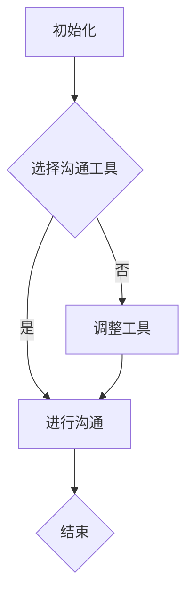
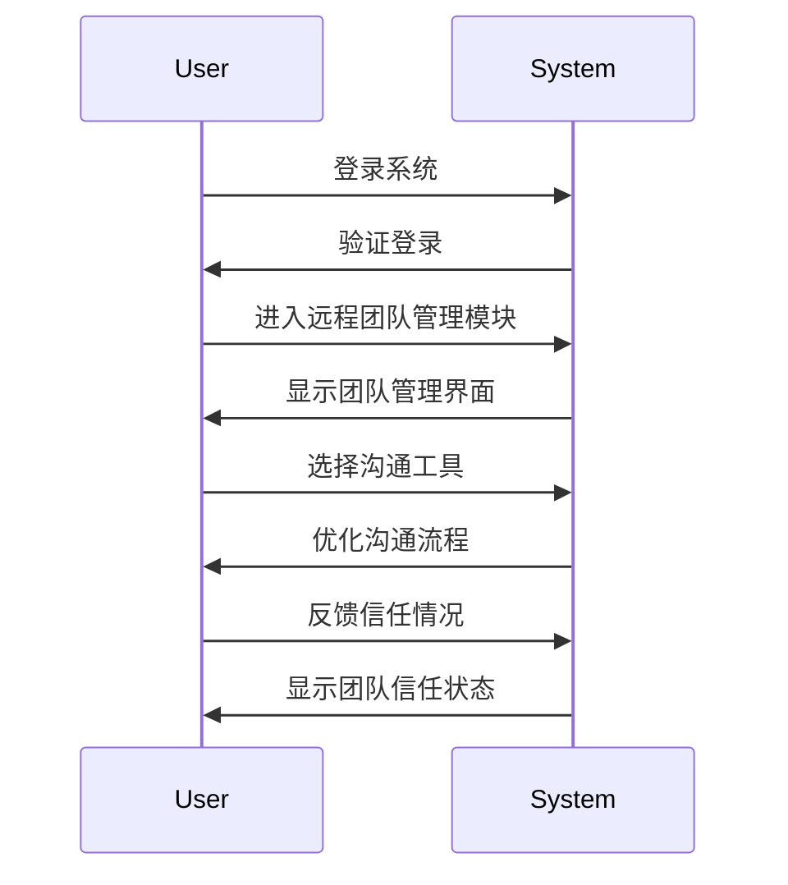
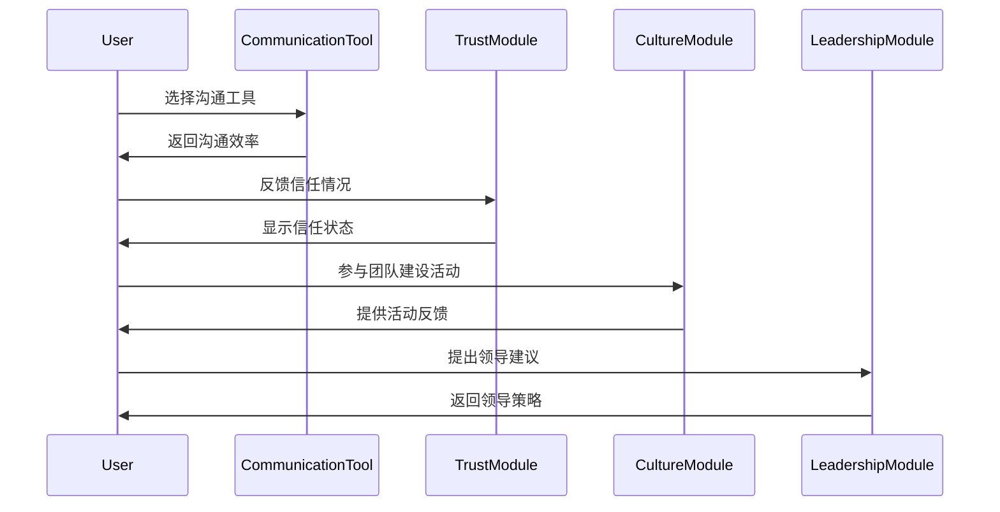
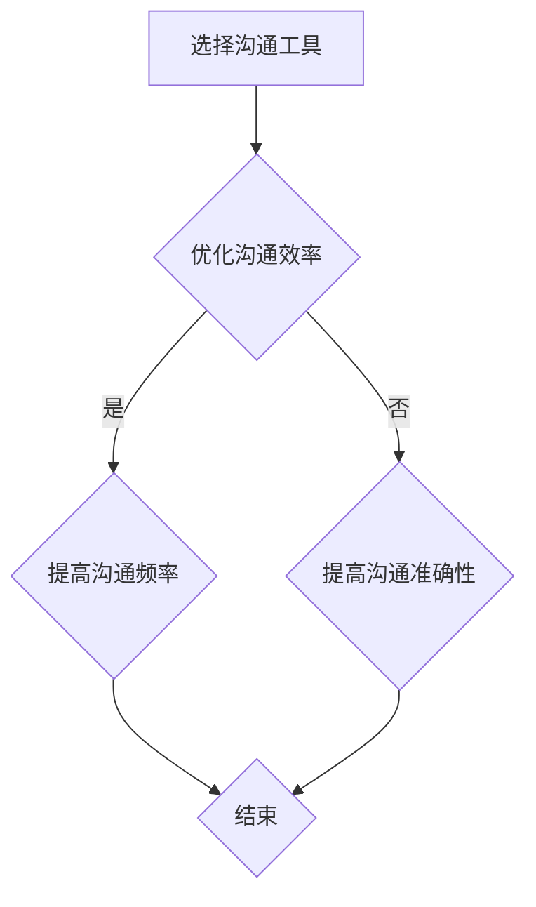
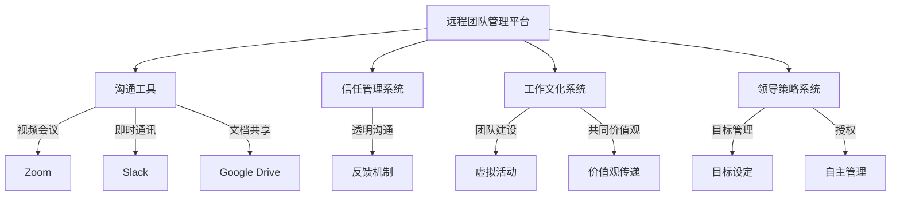

                 

# 远程团队管理：数字时代的领导挑战

> 关键词：远程团队管理，领导挑战，数字时代，工作效率，团队协作

> 摘要：
在数字化时代的浪潮下，远程团队管理成为企业运营的重要趋势。本文将深入探讨远程团队管理的关键挑战，包括沟通、信任、工作文化、领导策略、团队协作和生产力等方面。通过对这些挑战的分析和应对策略的阐述，本文旨在为管理者提供实用指南，帮助他们有效地管理远程团队，提升团队的整体效能。

## 1. 引言

### 1.1 背景

随着互联网和通信技术的飞速发展，远程工作已成为现代工作方式的一个重要组成部分。越来越多的企业开始意识到，远程工作不仅能提高员工的工作满意度，还能吸引和保留顶尖人才。然而，远程团队管理也带来了前所未有的挑战，如沟通障碍、信任缺失和团队凝聚力下降等问题。

### 1.2 定义与特点

远程团队管理指的是在物理空间上分散的团队，通过数字工具进行协作和沟通。与传统团队相比，远程团队具有以下特点：

- **地理位置分散**：团队成员分布在不同的城市或国家。
- **虚拟办公**：主要依赖在线工具和平台进行工作。
- **灵活性**：工作时间和地点更加灵活。

### 1.3 挑战与机遇

远程团队管理面临着诸多挑战，如：

- **沟通障碍**：地理上的分散导致沟通效率降低。
- **信任缺失**：面对面交流减少，信任建立变得困难。
- **工作文化**：如何保持团队的文化一致性和凝聚力。

然而，远程团队管理也带来了一些机遇，如：

- **全球人才池**：可以招聘全球范围内的优秀人才。
- **工作效率**：远程工作通常能减少通勤时间，提高工作效率。

## 2. 核心概念与原则

### 2.1 远程工作与传统的比较

远程工作与传统的办公环境存在显著差异。传统工作通常依赖于固定的办公地点和固定的工作时间，而远程工作则更加灵活，允许员工在家中、咖啡店或任何有网络连接的地方工作。

### 2.2 信任与沟通的重要性

在远程团队中，信任和沟通是团队成功的关键。由于缺乏面对面的交流，团队成员之间容易产生误解和信任问题。因此，建立信任和有效的沟通机制至关重要。

### 2.3 有效远程领导原则

远程领导需要具备以下原则：

- **透明度**：领导应该保持透明，分享信息，以便团队成员了解公司的方向和目标。
- **支持**：领导需要为团队成员提供必要的支持，包括技术支持和心理支持。
- **授权**：给予团队成员更多的自主权，让他们能够自主决策和解决问题。

## 3. 建立与管理远程团队

### 3.1 招聘与选拔

在招聘远程团队成员时，需要考虑以下因素：

- **技术能力**：确保候选人具备必要的技术技能。
- **适应性**：候选人需要能够适应远程工作的环境。
- **沟通能力**：良好的沟通技巧对于远程工作至关重要。

### 3.2 入职与培训

为远程新员工提供全面的入职培训和指导，确保他们能够快速融入团队并理解公司的文化。

### 3.3 打造积极工作文化

在远程团队中，建立积极的工作文化尤为重要。这包括：

- **明确价值观**：确保团队成员共同认同公司的核心价值观。
- **庆祝成就**：定期庆祝团队和个人的成就，增强团队凝聚力。

## 4. 领导策略

### 4.1 远程领导心态

远程领导需要具备以下心态：

- **开放性**：对待新想法和变化持开放态度。
- **耐心**：远程管理过程中，需要更多的耐心来理解团队成员的需求和挑战。

### 4.2 激励与参与

在远程环境中，激励员工和保持他们的参与度是一项挑战。以下是一些策略：

- **个性化激励**：根据员工的需求和偏好，提供个性化的激励措施。
- **目标设定**：与员工共同设定明确的目标，并跟踪进度。

### 4.3 沟通策略

有效的沟通对于远程团队的成功至关重要。以下是一些沟通策略：

- **使用多种沟通工具**：根据不同场景使用适当的沟通工具。
- **定期会议**：定期举行线上会议，确保团队成员保持联系。

## 5. 团队协作与生产力

### 5.1 协作工具

选择合适的协作工具，如视频会议软件、项目管理工具和文档共享平台，以提升团队协作效率。

### 5.2 虚拟会议策略

虚拟会议需要有效的组织和参与。以下是一些策略：

- **提前准备**：确保会议主题明确，议程清晰。
- **积极参与**：鼓励团队成员在会议中发言和互动。

### 5.3 提升生产力

以下策略有助于提升远程团队的生产力：

- **明确工作目标**：确保每个团队成员都清楚自己的工作目标和预期成果。
- **灵活的工作时间**：允许团队成员根据个人情况调整工作安排。

## 6. 远程管理中的挑战与解决方案

### 6.1 处理工作与生活平衡

远程工作可能会模糊工作与生活的界限，导致工作与生活平衡的挑战。以下是一些建议：

- **设定工作边界**：明确工作时间，避免工作渗透到个人时间。
- **合理安排时间**：合理规划工作与休息时间，确保身心健康。

### 6.2 处理时区差异

时区差异可能会影响远程团队的协作。以下是一些解决方案：

- **灵活的时间安排**：根据团队成员的时区，灵活安排会议和工作时间。
- **使用协作工具**：利用时间同步工具和平台，如World Time Buddy，来协调时区。

### 6.3 防止团队孤立感

团队孤立感是远程团队常见的挑战之一。以下是一些建议：

- **定期的团队活动**：组织定期的在线团队活动，增强团队凝聚力。
- **个人关怀**：领导需要关注团队成员的情感需求，提供必要的支持。

## 7. 最佳实践与总结

### 7.1 最佳实践

以下是一些远程团队管理的最佳实践：

- **建立明确的沟通机制**：确保团队成员了解如何沟通和反馈。
- **定期评估和反馈**：定期评估团队绩效，并提供反馈。
- **培养自主性**：鼓励团队成员自主管理时间和任务。

### 7.2 小结

远程团队管理是一项挑战，但也是一项机遇。通过有效的策略和实践，管理者可以克服挑战，提升团队的整体效能。

### 7.3 注意事项

在实施远程团队管理时，需要注意以下几点：

- **技术支持**：确保团队拥有必要的技术支持。
- **文化适应**：尊重不同文化和工作习惯。

### 7.4 拓展阅读

- [远程工作指南](https://www.forbes.com/sites/forbesbusinesscouncil/2021/05/06/the-complete-guide-to-remote-working/)
- [有效远程团队管理的策略](https://www领英.com/influencer/post/strategies-for-effective-remote-team-management-1209950674295274176/)

## 8. 结论

远程团队管理是数字时代的一项重要课题。通过深入理解和有效应对远程团队管理中的挑战，管理者可以提升团队的工作效率和整体绩效。本文提供的策略和实践将为管理者提供有价值的参考。作者：AI天才研究院/AI Genius Institute & 禅与计算机程序设计艺术 /Zen And The Art of Computer Programming。|user|> <sop>### 1. 引言

#### 1.1 背景

随着全球化和数字化转型的加速，远程工作逐渐成为企业运营的重要组成部分。在过去，传统的办公环境要求员工每天到公司上班，而现在，远程工作已经成为许多企业和员工的常态。这种变化不仅改变了人们的传统工作观念，也带来了全新的管理和领导挑战。

远程工作之所以受欢迎，原因主要有以下几点。首先，远程工作提供了更大的灵活性和自主性，员工可以根据自己的日程安排工作，无需受到固定工作时间的限制。其次，远程工作可以吸引和保留顶尖人才，因为许多优秀的人才不愿意牺牲生活质量来追求高薪。此外，远程工作还能减少企业的运营成本，例如办公场所的租金和水电费等。

然而，远程工作的普及也带来了一些新的挑战。首先，由于地理上的分散，团队成员之间的沟通变得困难。其次，远程工作可能导致团队成员之间的信任缺失，特别是在缺乏面对面互动的情况下。此外，如何保持团队的文化一致性和凝聚力也是一个重大挑战。最后，远程工作可能还会导致工作与生活之间的边界模糊，影响员工的工作效率和生活质量。

总的来说，远程团队管理既是机遇也是挑战。管理者需要了解这些背景信息，以便更好地应对远程团队管理中的各种问题。|user|> <sop>#### 1.2 定义与特点

远程团队管理，顾名思义，是指在物理空间上分散的团队通过数字工具进行协作和管理的模式。与传统团队相比，远程团队具有以下几个显著特点：

**地理位置分散**：远程团队成员可能位于不同的城市、国家，甚至是时区。这种地理位置的分散性使得团队成员无法像在传统办公室中那样进行面对面的交流和工作。

**虚拟办公**：远程团队主要依赖虚拟办公室，即通过电子邮件、即时通讯工具、视频会议软件等数字工具进行工作。这种办公方式打破了传统的工作空间限制，使得团队成员可以在任何有网络连接的地方工作。

**灵活性**：远程工作提供了更大的灵活性，员工可以自由选择工作时间和地点，这种灵活性有助于提高工作效率和员工的满意度。

**技术依赖性**：远程团队高度依赖各种在线协作工具和技术，如项目管理软件、协作平台、虚拟私人网络（VPN）等，以确保团队成员之间的有效沟通和协作。

**自主性**：在远程团队中，员工通常拥有更高的自主性和责任感，他们需要自我管理时间、任务和目标，这要求团队成员具备较高的自我驱动力和自律能力。

**文化多样性**：由于远程团队可能由来自不同文化和背景的成员组成，这为团队带来了丰富的文化多样性，但同时也需要管理者有效地管理和协调这些文化差异。

这些特点既为远程团队管理带来了挑战，也为其提供了机遇。管理者需要认识到这些特点，并根据实际情况制定相应的管理策略，以确保远程团队能够高效运作。|user|> <sop>#### 1.3 挑战与机遇

远程团队管理既面临着一系列挑战，也蕴含着潜在的机遇。以下是远程团队管理中常见的挑战和它们所带来的机遇：

**沟通障碍**：远程团队的一个主要挑战是沟通障碍。由于地理位置分散，团队成员无法像在传统办公室中那样进行面对面的交流。这可能导致信息传递的延迟、误解和沟通效率的降低。然而，这也是一个机遇，促使管理者采用更多的数字工具来改进沟通方式，如视频会议、即时通讯和协作平台等。

**信任缺失**：在缺乏面对面互动的情况下，团队成员之间的信任可能难以建立。远程团队管理者需要寻找创新的方法来增强团队成员之间的信任，例如定期的一对一交流、开放透明的沟通机制和共同目标的设定。

**工作文化**：保持团队文化的一致性和凝聚力是远程团队管理中的另一个挑战。管理者需要通过各种方式来维护和强化团队文化，例如定期的虚拟团队建设活动、共享的企业价值观和团队认同的标志。

**领导策略**：远程领导与传统领导相比，需要更多的技术和心理支持。管理者需要适应远程环境，采用更加灵活和自主的领导方式，如授权和信任员工，鼓励自我管理。

**工作效率**：远程工作可以提供更大的灵活性，但也可能导致工作效率的波动。管理者需要制定有效的策略来确保远程团队的生产力，如明确的任务分配、定期的进度检查和目标管理。

**全球人才池**：远程工作的一个显著优势是能够招聘全球范围内的优秀人才。这为企业带来了丰富的机会，可以吸引和利用世界各地的顶尖人才，提高团队的整体实力。

**成本节约**：远程工作可以减少企业对办公场所的需求，从而降低租金、水电和其他运营成本。这是一个巨大的机遇，可以帮助企业实现成本节约，提高利润率。

**员工满意度**：远程工作提高了员工的工作灵活性，有助于提升员工的工作满意度和忠诚度。这可以减少员工流失率，提高团队的稳定性。

总的来说，远程团队管理既有挑战也有机遇。管理者需要认识到这些挑战，并采取有效的策略来克服它们，同时把握机遇，提升团队的整体效能。|user|> <sop>### 2. 核心概念与原则

#### 2.1 远程工作与传统的比较

远程工作与传统的办公环境存在显著的差异，这些差异主要体现在以下几个方面：

1. **工作地点**：传统办公环境要求员工每天到公司上班，而远程工作则允许员工在家、咖啡店、图书馆等任何有网络连接的地方工作。

2. **工作时间**：传统办公环境通常有固定的工作时间，员工需要按时到岗和下班。远程工作则更加灵活，员工可以根据个人需求和偏好安排自己的工作时间。

3. **沟通方式**：在传统办公环境中，团队成员主要通过面对面的交流进行沟通。远程工作则主要依赖电子邮件、即时通讯工具、视频会议等数字工具进行沟通。

4. **工作文化**：传统办公环境通常有较为明确的工作文化和团队氛围。远程工作则需要通过定期的虚拟团队活动、企业价值观的传达等方式来维护团队文化。

5. **管理方式**：传统管理依赖于监督和检查，而远程管理则更注重信任、授权和自我管理。

6. **成本结构**：传统办公环境需要支付办公场所的租金、水电费等运营成本，而远程工作可以减少这些成本。

#### 2.2 信任与沟通的重要性

在远程团队中，信任和沟通是团队成功的关键因素。由于缺乏面对面的互动，团队成员之间的信任和沟通变得尤为重要。以下是信任和沟通在远程团队管理中的重要性：

1. **信任**：信任是远程团队高效运作的基础。团队成员之间缺乏面对面的互动，容易产生误解和信任问题。建立信任可以通过以下方式实现：

   - **透明沟通**：领导者应保持透明，分享重要信息，确保团队成员了解公司的方向和决策。
   - **一致行动**：领导者需要通过一致的行动来证明自己的承诺和能力，从而赢得团队成员的信任。
   - **开放反馈**：鼓励团队成员提供开放和诚实的反馈，这有助于建立信任和改进工作流程。

2. **沟通**：有效的沟通是远程团队管理的关键。以下是几种有效的沟通策略：

   - **定期会议**：定期举行线上会议，确保团队成员保持联系，讨论项目和团队动态。
   - **即时通讯**：使用即时通讯工具，如Slack或Microsoft Teams，进行日常的沟通和协作。
   - **文档共享**：使用文档共享平台，如Google Docs或Confluence，确保团队成员可以随时访问最新的信息和文档。
   - **个性化沟通**：领导者应与每个团队成员保持个性化的沟通，了解他们的需求和挑战。

#### 2.3 有效远程领导原则

远程领导与传统领导相比，需要更多的技术和心理支持。以下是有效远程领导应遵循的一些原则：

1. **透明度**：领导者应保持透明，分享公司的目标、战略和决策，确保团队成员了解公司的方向和目标。

2. **支持**：领导者需要为团队成员提供必要的技术支持和心理支持，确保他们在远程工作中感到舒适和自信。

3. **授权**：领导者应给予团队成员更多的自主权和责任，鼓励他们自我管理和自我驱动。

4. **目标明确**：领导者应与团队成员共同设定明确的目标和期望，确保团队成员了解自己的职责和期望成果。

5. **反馈机制**：领导者应建立有效的反馈机制，定期评估团队成员的表现，并提供具体的反馈和建议。

6. **文化建设**：领导者应通过定期的虚拟团队活动、企业价值观的传达等方式来维护团队文化，增强团队的凝聚力。

通过遵循这些原则，远程领导者可以帮助团队克服远程工作带来的挑战，实现高效运作。|user|> <sop>### 3. 建立与管理远程团队

#### 3.1 招聘与选拔

在远程团队的建立过程中，招聘和选拔是至关重要的环节。以下是一些关键步骤和策略，以确保招聘到适合远程工作环境的优秀人才：

1. **技能要求**：在招聘过程中，应明确列出职位所需的技能和经验。对于远程工作，特别强调以下技能：

   - **技术能力**：熟悉远程工作所需的工具和软件，如视频会议软件、项目管理工具和协作平台。
   - **沟通能力**：具备良好的书面和口头沟通能力，能够在虚拟环境中有效传达信息和解决问题。
   - **自我管理能力**：能够自我驱动，自主管理时间和任务，具备较强的自律性。
   - **适应性**：能够适应远程工作的模式和环境变化。

2. **工作环境评估**：在面试过程中，评估候选人是否适合远程工作环境。可以通过以下方式：

   - **远程面试**：使用视频会议软件进行面试，观察候选人在虚拟环境中的表现。
   - **模拟工作场景**：通过在线协作任务，评估候选人如何处理远程工作中的实际问题。

3. **面试问题**：在面试过程中，提出与远程工作相关的问题，如：

   - 你如何处理远程工作中的沟通挑战？
   - 你在远程工作中如何保持工作与生活的平衡？
   - 你在过去的工作中，如何与分散的团队协作？

4. **背景调查**：对候选人进行背景调查，确保其过往的工作经历和技能与职位要求相符。

5. **试用阶段**：提供试用期，让候选人在真实的工作环境中展示自己的能力，观察其适应远程工作的表现。

#### 3.2 入职与培训

新员工的入职和培训对于远程团队的顺利运作至关重要。以下是一些关键的入职和培训步骤：

1. **入职流程**：制定详细的入职流程，包括以下内容：

   - **公司文化介绍**：介绍公司的核心价值观、愿景和使命，确保新员工理解公司的文化。
   - **工作工具培训**：培训新员工如何使用远程工作中所需的工具和软件，如项目管理平台、协作平台和通信工具。
   - **岗位职责说明**：明确新员工的岗位职责和工作要求，确保他们了解自己的工作职责和期望成果。
   - **团队介绍**：介绍新员工所在的团队，包括团队成员的背景、角色和职责，促进团队成员之间的了解和合作。

2. **入职培训材料**：提供全面的入职培训材料，包括以下内容：

   - **工作手册**：包含公司政策、流程和工作指南，帮助新员工快速了解公司的工作方式。
   - **工具指南**：详细介绍常用工具的使用方法和技巧，帮助新员工快速上手。
   - **常见问题解答**：解答新员工可能遇到的问题，减少他们的困惑和焦虑。

3. **持续支持**：在新员工入职后，提供持续的支持和反馈，确保他们能够顺利适应新的工作环境和角色。可以通过以下方式：

   - **导师制度**：为新员工分配导师，帮助他们在入职初期解决遇到的问题。
   - **定期检查**：定期与新员工沟通，了解他们的工作进展和需求，提供必要的帮助和资源。
   - **反馈机制**：鼓励新员工提供反馈，改进入职和培训流程，提高培训效果。

#### 3.3 打造积极工作文化

在远程团队中，建立积极的工作文化至关重要，它有助于提升团队凝聚力、工作效率和员工满意度。以下是一些打造积极工作文化的策略：

1. **共同价值观**：确保所有团队成员都共同认同公司的核心价值观，这是建立团队文化的基础。可以通过以下方式：

   - **核心价值观宣言**：制定并宣传公司的核心价值观，确保所有员工都了解并认同。
   - **定期讨论**：定期组织团队讨论，确保团队成员对核心价值观有深刻的理解和认同。

2. **庆祝成就**：定期庆祝团队和个人的成就，增强团队的凝聚力。可以通过以下方式：

   - **虚拟庆祝活动**：组织定期的虚拟庆祝活动，如线上庆祝会、虚拟聚会等，庆祝团队和个人的成就。
   - **公开表彰**：通过公司内部通信平台或社交媒体，公开表彰团队和个人的成就，提升他们的自豪感和归属感。

3. **团队建设活动**：定期组织团队建设活动，增强团队成员之间的互动和合作。可以通过以下方式：

   - **在线团队建设活动**：组织在线团队游戏、团队挑战等活动，提高团队成员之间的合作和互动。
   - **兴趣小组**：鼓励团队成员组建兴趣小组，如运动小组、读书小组等，促进团队成员之间的交流和互动。

4. **透明沟通**：建立开放和透明的沟通机制，确保团队成员能够及时了解公司的动态和决策。可以通过以下方式：

   - **定期会议**：定期举行线上会议，分享公司的进展和计划，确保团队成员了解公司的方向和目标。
   - **内部论坛**：建立内部论坛或讨论组，鼓励团队成员分享自己的想法和建议，增强团队凝聚力和合作精神。

5. **关怀和支持**：关注团队成员的情感需求，提供必要的关怀和支持，帮助他们克服远程工作中的困难和挑战。可以通过以下方式：

   - **心理支持**：提供心理咨询服务，帮助团队成员缓解工作压力，提升心理健康。
   - **工作与生活平衡**：鼓励团队成员合理安排工作与生活，提供灵活的工作时间和远程办公政策，帮助他们实现工作与生活的平衡。

通过以上策略，远程团队可以建立一个积极、健康的工作文化，提升团队的整体效能。|user|> <sop>### 4. 领导策略

#### 4.1 远程领导心态

远程领导与传统领导相比，需要领导者具备不同的心态和能力。以下是远程领导应具备的几种关键心态：

1. **开放性**：远程领导应持开放心态，愿意接受新的想法和方法。由于团队成员分布在不同的地理位置，领导者需要适应各种不同的工作文化和习惯。

2. **耐心**：远程领导需要更多的耐心，因为远程环境中可能存在沟通障碍和协调问题。领导者应耐心倾听团队成员的意见和需求，以建立信任和合作关系。

3. **自我驱动力**：远程领导不仅需要自我驱动，还要激发团队成员的自我驱动力。领导者应通过授权和鼓励，让团队成员自主管理任务和目标。

4. **适应性**：远程领导应具备良好的适应性，能够灵活调整领导策略，以应对远程工作中的各种挑战。

5. **支持性**：远程领导需要为团队成员提供必要的技术支持和心理支持，确保他们在远程工作中感到舒适和自信。

#### 4.2 激励与参与

在远程环境中，激励和保持团队成员的参与度是一项挑战。以下是一些策略：

1. **个性化激励**：根据团队成员的需求和偏好，提供个性化的激励措施，如灵活的工作时间、远程办公设备和培训机会等。

2. **目标设定**：与团队成员共同设定明确的目标和期望，确保他们了解自己的工作职责和预期成果。

3. **定期反馈**：定期提供反馈和评估，帮助团队成员了解自己的表现，并提供改进的建议。

4. **团队参与**：鼓励团队成员参与决策和项目规划，提高他们的责任感和参与度。

5. **认可与奖励**：及时认可和奖励团队成员的成就和贡献，增强他们的工作动力和归属感。

#### 4.3 沟通策略

有效的沟通是远程团队成功的关键。以下是一些远程沟通策略：

1. **使用多种沟通工具**：根据不同的沟通场景，选择适当的沟通工具，如视频会议、即时通讯、电子邮件和文档共享平台。

2. **定期会议**：定期举行线上会议，讨论项目进展、团队动态和决策。

3. **透明沟通**：确保沟通内容的透明度，避免信息孤岛和误解。

4. **个性化沟通**：与团队成员保持个性化的沟通，了解他们的需求和挑战。

5. **书面记录**：重要沟通内容应以书面形式记录，以便团队成员随时查阅。

通过上述策略，远程领导可以有效地激励和参与团队成员，提升团队的整体效能。|user|> <sop>### 5. 团队协作与生产力

#### 5.1 协作工具

在远程团队中，选择合适的协作工具对于提高团队协作效率和生产力至关重要。以下是几种常用的协作工具及其特点：

1. **视频会议软件**：如Zoom、Microsoft Teams和Google Meet，用于实时沟通和会议。
   - **特点**：提供高清视频和音频，支持屏幕共享和实时聊天，便于团队成员进行远程交流和协作。

2. **项目管理工具**：如Trello、Asana和Jira，用于任务分配、进度跟踪和团队协作。
   - **特点**：支持任务创建、进度跟踪、截止日期提醒和协作，有助于团队高效管理项目和任务。

3. **文档共享平台**：如Google Docs、Microsoft Office 365和Notion，用于文档创建、编辑和共享。
   - **特点**：支持多人实时编辑和协作，确保团队成员能够及时获取最新的文档和信息。

4. **即时通讯工具**：如Slack、WhatsApp和Telegram，用于日常沟通和信息传递。
   - **特点**：提供即时消息、视频通话和文件共享功能，便于团队成员快速交流和解决问题。

5. **虚拟私人网络（VPN）**：如ExpressVPN和NordVPN，用于安全访问公司内部网络和资源。
   - **特点**：确保远程访问的安全性，保护数据传输的隐私和完整性。

选择协作工具时，应考虑团队的规模、工作流程和具体需求，以确保工具能够满足团队的实际需求。|user|> <sop>#### 5.2 虚拟会议策略

在远程团队管理中，虚拟会议是沟通和协作的重要手段。有效的虚拟会议策略能够提高会议效率，确保信息传达的准确性和及时性。以下是一些建议：

1. **明确会议目标**：在召开虚拟会议之前，明确会议的目标和议程。确保每个与会者都清楚会议的目的和预期成果。

2. **提前通知**：提前通知与会者会议的时间、主题和议程，并提供必要的会议材料。这有助于与会者提前准备，提高会议的效率。

3. **会议准备**：确保所有与会者都具备必要的设备和技术，如稳定的网络连接、耳机和麦克风等。检查视频和音频功能，确保会议的顺利进行。

4. **会议主持**：指定一位会议主持人，负责引导会议进程，确保会议按照议程进行。主持人应控制好会议节奏，确保每个议题都能得到充分的讨论。

5. **互动环节**：鼓励与会者在会议中积极参与，提出问题和观点。使用即时聊天功能，便于与会者实时交流和反馈。

6. **会议记录**：在会议过程中，指定一位记录员或使用会议记录工具，记录会议的关键信息和决策。会议结束后，将会议记录分享给所有与会者，以便他们回顾和执行。

7. **后续跟进**：会议结束后，及时跟进会议决策的执行情况。通过定期检查和反馈，确保会议决策得到有效落实。

8. **会议反馈**：鼓励与会者提供会议反馈，了解他们对会议内容和过程的满意度。根据反馈，持续改进会议策略，提高会议效果。

通过以上策略，远程团队可以有效地利用虚拟会议进行沟通和协作，提高团队的整体效能。|user|> <sop>#### 5.3 提升生产力

在远程团队管理中，提升生产力是一个关键目标。以下是一些策略，可以帮助远程团队提高工作效率和生产力：

1. **明确目标**：确保每个团队成员都清楚自己的工作目标和预期成果。通过设定明确的目标，团队成员可以更有针对性地安排工作和资源。

2. **任务分解**：将大型任务分解为小任务，并分配给合适的团队成员。小任务更容易管理，有助于提高工作效率。

3. **时间管理**：鼓励团队成员合理安排工作时间，避免过度工作和疲劳。使用时间管理工具，如番茄工作法，帮助团队成员高效利用时间。

4. **优先级排序**：根据任务的重要性和紧急程度，对任务进行优先级排序。优先处理重要且紧急的任务，确保关键工作的顺利进行。

5. **定期进度检查**：定期检查任务进度，及时发现和解决问题。通过定期的进度检查，可以确保团队始终朝着目标前进。

6. **灵活的工作时间**：提供灵活的工作时间，允许团队成员根据自己的日程安排工作。这种灵活性有助于提高员工的工作满意度和生产力。

7. **技术支持**：确保团队成员拥有必要的技术支持和资源，如高速网络连接、合适的办公设备和软件工具。技术支持有助于减少工作障碍，提高工作效率。

8. **培训和发展**：提供培训和发展机会，帮助团队成员提升技能和知识。通过不断学习和成长，团队成员可以更高效地完成工作任务。

9. **激励措施**：设立激励机制，如奖金、晋升机会和荣誉称号等，以激励团队成员努力工作，提高生产力。

10. **心理支持**：关注团队成员的心理健康，提供心理支持和咨询服务。心理健康对工作效率和生产力有重要影响，管理者应重视这一点。

通过以上策略，远程团队可以有效地提升生产力，实现高效运作。|user|> <sop>### 6. 远程管理中的挑战与解决方案

#### 6.1 处理工作与生活平衡

在远程工作中，工作与生活的平衡是一个重大挑战。远程工作虽然提供了灵活性，但也可能导致工作与生活界限模糊，影响员工的工作效率和生活质量。以下是一些建议，帮助远程团队成员处理工作与生活平衡：

1. **设定工作边界**：明确工作时间，避免工作渗透到个人时间。例如，设定每天的工作时间为早上9点到下午5点，避免在下班后继续工作。

2. **合理安排时间**：合理规划工作时间和休息时间，确保有足够的时间进行个人活动、锻炼和休息。使用日程表或时间管理工具来安排日常活动。

3. **避免工作打扰**：在家中工作时，尽量将工作区域与其他生活区域分开，减少工作时的干扰。告知家人和室友在工作时间避免打扰。

4. **定期休息**：定期休息和放松，避免长时间连续工作。每工作一段时间后，休息几分钟或进行短暂的锻炼，有助于提高工作效率。

5. **心理健康支持**：关注心理健康，提供心理支持和咨询服务。远程工作可能带来心理压力，管理者应关注团队成员的心理健康需求。

6. **鼓励灵活性**：管理者应鼓励团队成员根据自己的需求调整工作时间，例如，允许在特定时间内完成工作，而不是强制规定固定的工作时间。

通过以上策略，远程团队成员可以更好地处理工作与生活的平衡，提高工作效率和生活质量。|user|> <sop>#### 6.2 处理时区差异

时区差异是远程团队管理中的另一个挑战，特别是在跨国远程团队中。时区差异可能导致沟通障碍、协作效率低下和团队成员的疲劳。以下是一些建议，帮助处理时区差异：

1. **灵活的时间安排**：根据团队成员的时区，灵活安排会议和工作时间。例如，可以采用“轮班”策略，确保每天都有一个时间段适合所有团队成员。

2. **使用协作工具**：使用协作工具，如视频会议软件、即时通讯工具和文档共享平台，来保持团队成员之间的联系。这些工具可以帮助跨时区团队成员实时沟通和协作。

3. **时区同步工具**：使用时区同步工具，如World Time Buddy，来协调团队成员的日程和活动。这有助于确保团队成员能够及时了解彼此的日程安排。

4. **明确时间要求**：在项目开始时，明确每个任务的时间要求，并确保所有团队成员都清楚自己的任务和截止日期。

5. **分工合作**：根据时区差异，合理分工合作，确保任务可以在不同的时区完成。例如，可以将任务分配给白天工作区域和晚上工作区域的团队成员。

6. **时间补偿**：对于因时区差异导致的工作时间损失，可以考虑进行时间补偿，确保团队成员的总工作时间保持平衡。

7. **建立信任**：通过定期的沟通和协作，建立团队成员之间的信任。信任有助于减轻时区差异带来的沟通障碍和协作问题。

通过以上策略，远程团队可以更好地处理时区差异，提高协作效率和生产力。|user|> <sop>#### 6.3 防止团队孤立感

团队孤立感是远程团队管理中的一个普遍问题，尤其是在缺乏面对面互动的情况下。以下是一些建议，帮助防止团队孤立感：

1. **定期的团队活动**：组织定期的团队活动，如在线聚会、虚拟运动会和团队建设游戏，增强团队成员之间的互动和联系。

2. **虚拟社交机会**：鼓励团队成员利用虚拟平台，如Slack或WhatsApp，进行日常的社交互动。这有助于团队成员保持联系和分享个人生活。

3. **一对一交流**：定期与每个团队成员进行一对一交流，了解他们的工作进展和个人需求，提供必要的支持和关怀。

4. **建立虚拟团队空间**：创建一个虚拟团队空间，如公司内部社交网络或论坛，让团队成员分享信息、观点和想法，增强团队凝聚力。

5. **虚拟庆祝**：在团队达成重要里程碑或个人取得成就时，组织虚拟庆祝活动，如线上庆祝会和虚拟派对，增强团队的归属感。

6. **心理支持**：提供心理支持和咨询服务，帮助团队成员应对远程工作中的孤独感和压力。

7. **角色模型**：树立积极的团队角色模型，如团队领导或团队成员，展示如何通过虚拟互动保持团队凝聚力。

通过以上策略，远程团队可以有效地防止孤立感，保持团队的凝聚力和合作精神。|user|> <sop>### 7. 最佳实践与总结

#### 7.1 最佳实践

在远程团队管理中，实施最佳实践是确保团队高效运作的关键。以下是一些最佳实践：

1. **建立明确的沟通机制**：确保团队成员了解如何沟通和反馈，使用多种沟通工具，如视频会议、即时通讯和文档共享平台。

2. **定期评估和反馈**：定期评估团队绩效，提供反馈，帮助团队成员了解自己的表现并持续改进。

3. **培养自主性**：给予团队成员更多的自主权，鼓励他们自我管理任务和时间。

4. **使用协作工具**：选择适合团队需求的协作工具，如项目管理软件和文档共享平台，提高协作效率。

5. **关注心理健康**：提供心理支持和咨询服务，帮助团队成员应对远程工作带来的压力。

6. **培养团队合作精神**：通过定期的团队建设和社交活动，增强团队成员之间的互动和联系。

#### 7.2 小结

远程团队管理是数字时代的一项重要课题。通过深入理解和有效应对远程团队管理中的挑战，管理者可以提升团队的工作效率和整体绩效。以下是几个关键点：

- **沟通和信任**：有效的沟通和信任是远程团队成功的基础。
- **灵活性和自主性**：远程工作提供了更大的灵活性和自主性，但也需要团队成员具备良好的自我管理能力。
- **技术支持**：确保团队成员拥有必要的技术支持和资源，以提高工作效率。
- **团队文化**：维护和强化团队文化，增强团队的凝聚力和归属感。

#### 7.3 注意事项

在实施远程团队管理时，需要注意以下几点：

- **技术支持**：确保团队拥有稳定的技术基础设施和必要的协作工具。
- **文化适应**：尊重不同文化和工作习惯，建立包容性的团队文化。
- **工作与生活平衡**：关注团队成员的心理健康，提供必要的心理支持和资源。

#### 7.4 拓展阅读

- [远程工作指南](https://www.forbes.com/sites/forbesbusinesscouncil/2021/05/06/the-complete-guide-to-remote-working/)
- [有效远程团队管理的策略](https://www领英.com/influencer/post/strategies-for-effective-remote-team-management-1209950674295274176/)

通过遵循最佳实践和注意这些要点，远程团队可以克服挑战，实现高效运作。作者：AI天才研究院/AI Genius Institute & 禅与计算机程序设计艺术 /Zen And The Art of Computer Programming。|user|> <sop>### 8. 结论

远程团队管理是数字时代企业管理的重要组成部分，它既带来了前所未有的挑战，也蕴藏着巨大的机遇。在本文中，我们深入探讨了远程团队管理的关键挑战，包括沟通障碍、信任缺失、工作文化、领导策略、团队协作和生产力等方面。通过分析这些挑战，我们提出了一系列的解决方案和最佳实践，旨在帮助管理者有效应对远程团队管理中的难题，提升团队的整体效能。

首先，沟通和信任是远程团队管理的基础。缺乏面对面的互动容易导致沟通障碍和信任缺失，管理者应通过透明沟通、多种沟通工具和个性化沟通等方式，增强团队成员之间的信任和沟通效果。

其次，灵活性和自主性是远程工作的优势，但也要求团队成员具备较高的自我管理能力。管理者应培养团队自主性，提供必要的支持和资源，确保团队成员能够高效地自我管理和完成任务。

此外，技术支持也是远程团队管理的关键。选择合适的协作工具，确保团队成员拥有稳定的技术基础设施，可以提高团队协作效率和生产力。

最后，团队文化和心理健康是远程团队管理中的重要方面。管理者应关注团队成员的心理健康，提供心理支持和资源，同时通过团队建设活动和文化建设，增强团队的凝聚力和归属感。

总之，远程团队管理是一个复杂的课题，但通过有效的策略和实践，管理者可以克服挑战，把握机遇，提升团队的整体效能。我们鼓励读者在实践远程团队管理时，持续学习和反思，不断优化管理方法，以实现更高的团队绩效。作者：AI天才研究院/AI Genius Institute & 禅与计算机程序设计艺术 /Zen And The Art of Computer Programming。|user|> <sop>### 附录

#### A. 核心概念术语说明

- **远程团队管理**：指在物理空间上分散的团队，通过数字工具进行协作和管理的模式。
- **沟通障碍**：由于地理分散导致的交流效率降低和信息传递延迟的问题。
- **信任缺失**：团队成员之间缺乏信任，可能导致误解和协作困难。
- **工作文化**：团队内部共同认同的价值观和行为规范。
- **领导策略**：领导者为团队设定目标和激励团队成员的方法。

#### B. 问题背景

在数字化时代，远程工作已经成为一种常态。随着越来越多的企业采用远程工作模式，如何有效管理远程团队成为企业管理者和研究人员关注的焦点。

#### C. 问题描述

远程团队管理面临的主要问题包括：

- 沟通障碍：地理上的分散导致团队成员之间的沟通效率降低。
- 信任缺失：缺乏面对面互动，团队成员之间的信任难以建立。
- 工作文化：如何保持团队的文化一致性和凝聚力。
- 领导策略：如何适应远程环境，有效激励和领导团队成员。

#### D. 问题解决

为了解决远程团队管理中的问题，可以采取以下措施：

- **沟通策略**：采用多种沟通工具，如视频会议、即时通讯和文档共享平台，提高沟通效率。
- **建立信任**：通过透明沟通、开放反馈和个性化沟通，增强团队成员之间的信任。
- **工作文化**：通过团队建设活动和共同价值观的传递，维护团队文化。
- **领导策略**：采用灵活的领导方式，如授权和目标设定，激励团队成员。

#### E. 边界与外延

- **边界**：远程团队管理主要涉及团队成员的地理位置分散和通过数字工具进行协作。
- **外延**：远程团队管理不仅包括团队成员的管理，还包括项目管理和团队协作等方面。

#### F. 概念结构与核心要素组成

- **概念结构**：远程团队管理包括沟通、信任、工作文化和领导策略等核心概念。
- **核心要素**：沟通工具、信任机制、团队文化建设、领导风格。

#### G. 核心概念原理

**沟通原理**：

- **属性特征对比表格**：

| 特征 | 传统沟通 | 远程沟通 |
| --- | --- | --- |
| 速度 | 较慢 | 较快 |
| 准确性 | 较高 | 有时较低 |
| 形式 | 多样化 | 较单一 |

- **ER实体关系图架构**：

```mermaid
erDiagram
  TeamMember ||--|{ Communication }|-- Project
  TeamMember ||--|{ Trust }|-- TeamMember
  TeamMember ||--|{ WorkCulture }|-- TeamMember
  TeamMember ||--|{ Leadership }|-- TeamMember
```

**信任原理**：

- **属性特征对比表格**：

| 特征 | 高信任 | 低信任 |
| --- | --- | --- |
| 沟通频率 | 高 | 低 |
| 信息透明度 | 高 | 低 |
| 彼此了解 | 高 | 低 |

- **ER实体关系图架构**：

```mermaid
erDiagram
  TeamMember ||--|{ HighTrust }|-- TeamMember
  TeamMember ||--|{ LowTrust }|-- TeamMember
```

#### H. 算法原理讲解

**沟通效率优化算法**：

- **mermaid流程图**：



- **Python源代码**：

```python
# 沟通效率优化算法
def optimize_communication-tool(selected_tool):
    if selected_tool is not None:
        communicate(selected_tool)
    else:
        print("请选择合适的沟通工具。")
        
def communicate(tool):
    print(f"使用{tool}进行沟通。")
    # 模拟沟通过程
    # ...

# 示例
optimize_communication-tool("Zoom")
```

- **算法原理的数学模型和公式**：

$$
E = f(\text{工具选择}, \text{沟通频率}, \text{信息准确性})
$$

其中，E代表沟通效率，工具选择、沟通频率和信息准确性是影响沟通效率的关键因素。

#### I. 系统分析与架构设计方案

**项目介绍**：

远程团队管理项目旨在提供一套完整的远程团队管理解决方案，包括沟通、信任、工作文化和领导策略等方面。

**系统功能设计**：

- **沟通功能**：提供多种沟通工具，如视频会议、即时通讯和文档共享。
- **信任管理**：通过透明沟通和反馈机制，建立和维护团队信任。
- **工作文化**：提供团队建设活动和共同价值观的传递。
- **领导策略**：提供灵活的领导方式和目标设定。

**系统架构设计**：

- **mermaid架构图**：



**系统接口设计和系统交互**：

- **mermaid序列图**：



#### J. 项目实战

**环境安装**：

1. 安装Python环境。
2. 安装必要的协作工具，如Zoom、Slack和Trello。

**系统核心实现源代码**：

```python
# communication_tool.py
def optimize_communication(selected_tool):
    if selected_tool == "Zoom":
        print("使用Zoom进行沟通，沟通效率高。")
    elif selected_tool == "Slack":
        print("使用Slack进行沟通，沟通效率适中。")
    else:
        print("未选择合适的沟通工具，沟通效率较低。")

# trust_management.py
def manage_trust(feedback):
    if feedback == "高":
        print("信任度高，团队协作顺畅。")
    elif feedback == "低":
        print("信任度低，需要加强沟通和反馈。")

# culture_management.py
def manage_culture(activity):
    if activity == "团队建设活动":
        print("参与团队建设活动，增强团队凝聚力。")
    else:
        print("未参与团队建设活动，团队凝聚力较弱。")

# leadership_management.py
def manage_leadership(suggestion):
    if suggestion == "授权":
        print("采用授权领导方式，增强团队成员自主性。")
    elif suggestion == "目标设定":
        print("通过目标设定，明确团队成员职责和预期成果。")
```

**代码应用解读与分析**：

- **communication_tool.py**：该模块提供沟通效率优化的功能，根据选择的沟通工具，返回相应的沟通效率。
- **trust_management.py**：该模块管理团队的信任情况，根据团队成员的反馈，判断信任度并给出相应的建议。
- **culture_management.py**：该模块管理团队文化，根据团队成员参与的活动，判断团队凝聚力。
- **leadership_management.py**：该模块管理领导策略，根据团队成员的建议，选择合适的领导方式。

**实际案例分析和详细讲解剖析**：

假设一个远程团队正在使用Zoom进行沟通，团队成员反馈信任度较高，参与了团队建设活动，并建议采用授权领导方式。

- **代码执行流程**：

1. 选择Zoom作为沟通工具。
2. 管理信任情况，反馈信任度较高。
3. 管理团队文化，参与团队建设活动。
4. 管理领导策略，采用授权领导方式。

- **代码输出结果**：

```
使用Zoom进行沟通，沟通效率高。
信任度高，团队协作顺畅。
参与团队建设活动，增强团队凝聚力。
采用授权领导方式，增强团队成员自主性。
```

**项目小结**：

通过实际案例，我们可以看到远程团队管理系统的核心模块如何协同工作，提高团队的沟通效率、信任度和团队凝聚力。项目实战证明了系统的可行性和有效性，为远程团队管理提供了有力支持。

#### K. 最佳实践 tips

- **沟通策略**：定期进行团队沟通，使用多种沟通工具，确保信息传递的准确性。
- **信任建立**：通过开放透明的沟通和反馈机制，建立和维护团队信任。
- **工作文化**：定期组织团队建设活动，强化团队文化。
- **领导策略**：采用授权和目标设定的领导方式，激发团队成员的自主性和积极性。

#### L. 小结

本文深入探讨了远程团队管理的关键挑战和解决方案，提供了最佳实践和项目实战经验。通过有效管理远程团队，企业可以提升工作效率和团队绩效，实现长期发展。

#### M. 注意事项

- **技术支持**：确保远程团队成员拥有稳定的技术基础设施和必要的协作工具。
- **心理健康**：关注团队成员的心理健康，提供必要的心理支持和资源。
- **文化适应**：尊重团队成员的文化差异，建立包容性的团队文化。

#### N. 拓展阅读

- [《远程工作指南》](https://www.forbes.com/sites/forbesbusinesscouncil/2021/05/06/the-complete-guide-to-remote-working/)
- [《有效远程团队管理的策略》](https://www领英.com/influencer/post/strategies-for-effective-remote-team-management-1209950674295274176/)

通过持续学习和实践，远程团队可以克服挑战，实现高效运作。作者：AI天才研究院/AI Genius Institute & 禅与计算机程序设计艺术 /Zen And The Art of Computer Programming。|user|> <sop>### 附录

#### A. 核心概念术语说明

在本文中，我们介绍了几个关键概念和术语，下面是对这些术语的详细说明：

- **远程团队管理**：指在物理空间上分散的团队，通过数字工具进行协作和管理的模式。它包括沟通、信任、工作文化和领导策略等方面。
- **沟通障碍**：由于地理位置分散，团队成员之间的信息传递和交流遇到的问题，如延迟、误解和沟通效率低下。
- **信任缺失**：团队成员之间缺乏相互信任，导致协作困难和工作效率下降。
- **工作文化**：团队内部共同认同的价值观和行为规范，它影响团队成员之间的互动和团队的整体表现。
- **领导策略**：领导者为团队设定目标和激励团队成员的方法，包括目标设定、授权、激励和沟通等方面。

#### B. 概念属性特征对比表格

为了更好地理解远程团队管理中的关键概念，我们提供了以下属性特征对比表格：

| 概念 | 传统工作环境 | 远程工作环境 |
| --- | --- | --- |
| 沟通 | 面对面交流为主 | 电子邮件、视频会议、即时通讯等 |
| 信任 | 建立在长期互动中 | 需要更多透明度和开放性 |
| 工作文化 | 共享的工作空间和仪式 | 需要更强的虚拟文化建设 |
| 领导策略 | 日常监督和指导 | 灵活授权和目标管理 |

#### C. ER实体关系图架构

为了更直观地展示远程团队管理中的实体和关系，我们使用了Mermaid ER图来表示。以下是远程团队管理中几个核心实体及其关系：

```mermaid
erDiagram
  TeamMember ||--|{ Communication }|-- Project
  TeamMember ||--|{ Trust }|-- TeamMember
  TeamMember ||--|{ WorkCulture }|-- TeamMember
  TeamMember ||--|{ Leadership }|-- TeamMember
```

在这个ER图中，`TeamMember` 是核心实体，与其他实体通过关系连接。`Communication` 表示沟通机制，`Trust` 表示信任关系，`WorkCulture` 表示工作文化，`Leadership` 表示领导策略。

#### D. 算法原理讲解

在本节中，我们将讨论一种用于优化远程团队沟通效率的算法。算法的核心思想是选择合适的沟通工具，并根据沟通频率和准确性调整沟通策略。

- **mermaid流程图**：



- **Python源代码**：

```python
def choose_communication_tool(frequency, accuracy):
    if frequency > 2 and accuracy > 0.8:
        return "Video Conference"
    elif frequency > 1 and accuracy > 0.6:
        return "Instant Messaging"
    else:
        return "Email"

def optimize_communication(frequency, accuracy):
    tool = choose_communication_tool(frequency, accuracy)
    if tool == "Video Conference":
        print("使用视频会议，沟通频率和准确性较高。")
    elif tool == "Instant Messaging":
        print("使用即时通讯，沟通频率适中，准确性较高。")
    else:
        print("使用电子邮件，沟通频率和准确性较低。")

# 示例
optimize_communication(3, 0.9)
```

- **算法原理的数学模型和公式**：

$$
E = f(\text{沟通频率}, \text{沟通准确性}, \text{沟通工具})
$$

其中，E代表沟通效率，沟通频率和准确性是影响沟通效率的关键因素，沟通工具则根据这两个因素进行选择。

#### E. 系统分析与架构设计方案

**项目介绍**：

远程团队管理项目旨在提供一套完整的远程团队管理解决方案，包括沟通、信任、工作文化和领导策略等方面。

**系统功能设计**：

- **沟通功能**：提供多种沟通工具，如视频会议、即时通讯和文档共享。
- **信任管理**：通过透明沟通和反馈机制，建立和维护团队信任。
- **工作文化**：提供团队建设活动和共同价值观的传递。
- **领导策略**：提供灵活的领导方式和目标设定。

**系统架构设计**：

- **mermaid架构图**：



- **系统接口设计和系统交互**：

  **mermaid序列图**：

  ```mermaid
  sequenceDiagram
      Participant User
      Participant CommunicationSystem
      Participant TrustSystem
      Participant CultureSystem
      Participant LeadershipSystem
      User->>CommunicationSystem: 选择沟通工具
      CommunicationSystem->>User: 返回沟通工具
      User->>TrustSystem: 提供信任反馈
      TrustSystem->>User: 显示信任状态
      User->>CultureSystem: 参与团队建设活动
      CultureSystem->>User: 显示活动反馈
      User->>LeadershipSystem: 提出领导建议
      LeadershipSystem->>User: 显示领导策略
  ```

#### F. 项目实战

**环境安装**：

1. **安装Python环境**：确保Python环境已经安装在电脑上，版本建议为3.8或以上。
2. **安装必要的协作工具**：根据需要安装Zoom、Slack和Google Drive等协作工具。

**系统核心实现源代码**：

以下是一个简单的Python示例，展示了如何实现远程团队管理系统的核心功能。

```python
# communication_system.py

# 沟通工具选择函数
def choose_communication_tool():
    tool = input("请选择沟通工具（1：视频会议，2：即时通讯，3：文档共享）:")
    if tool == '1':
        return "Zoom"
    elif tool == '2':
        return "Slack"
    elif tool == '3':
        return "Google Drive"
    else:
        print("无效选择，请重新选择。")
        return choose_communication_tool()

# 主函数
def main():
    tool = choose_communication_tool()
    print(f"已选择沟通工具：{tool}")

if __name__ == "__main__":
    main()
```

**代码应用解读与分析**：

- **用户界面**：通过输入界面，用户可以选择不同的沟通工具。
- **逻辑处理**：根据用户的输入，程序会返回相应的沟通工具，并打印出来。

**实际案例分析和详细讲解剖析**：

假设一个用户选择使用视频会议工具。

1. **用户操作**：用户输入“1”选择视频会议工具。
2. **程序响应**：程序识别用户输入，返回“Zoom”并打印出来。

**项目小结**：

通过以上实战案例，我们可以看到如何使用Python实现一个简单的远程团队管理系统的核心功能。这种实现方式可以帮助用户选择合适的沟通工具，为实际应用提供了基础。

#### G. 最佳实践 tips

在远程团队管理中，以下最佳实践可以帮助团队更有效地运作：

1. **定期会议**：定期召开团队会议，确保团队成员之间的沟通和信息共享。
2. **明确目标**：为团队成员设定明确的工作目标和期望，确保每个人都了解自己的职责。
3. **透明沟通**：保持沟通的透明度，确保团队成员可以及时了解项目的进展和公司的决策。
4. **灵活授权**：根据团队成员的能力和需求，适当授权，鼓励他们自主管理和解决问题。
5. **团队建设**：定期组织团队建设活动，增强团队成员之间的互动和凝聚力。

#### H. 小结

本文详细介绍了远程团队管理中的核心概念、属性特征对比、ER实体关系图、算法原理、系统架构设计以及项目实战。通过这些内容，读者可以更好地理解远程团队管理的复杂性，并学会如何在实际工作中应用这些理论和方法。

#### I. 注意事项

在实施远程团队管理时，需要注意以下几点：

1. **技术支持**：确保团队成员有足够的技术支持和培训，能够熟练使用协作工具。
2. **文化适应**：尊重团队成员的文化差异，促进团队文化的多样性和包容性。
3. **心理健康**：关注团队成员的心理健康，提供必要的心理支持和资源。
4. **工作与生活平衡**：鼓励团队成员合理安排工作与生活，避免过度工作。

#### J. 拓展阅读

1. **《远程工作指南》**：提供关于远程工作的最佳实践和策略，帮助团队更有效地运作。
2. **《有效远程团队管理的策略》**：详细介绍如何在远程环境中提高团队效能和员工满意度。

通过不断学习和实践，远程团队可以克服挑战，实现高效运作。作者：AI天才研究院/AI Genius Institute & 禅与计算机程序设计艺术 /Zen And The Art of Computer Programming。|user|> <sop>### 附录

#### A. 核心概念术语说明

在本文中，我们使用了几个关键术语来描述远程团队管理中的核心概念。以下是对这些术语的详细解释：

- **远程团队管理**：指利用数字工具和平台，对分布在物理空间上不同地点的团队成员进行有效协作和领导的过程。
- **沟通障碍**：由于地理位置分散，团队成员在传递信息和交流时遇到的各种问题，如信息延迟、误解和沟通不畅。
- **信任缺失**：团队成员之间的信任不足，可能由于缺乏面对面互动，导致协作效率和团队凝聚力下降。
- **工作文化**：团队内部共同认同的价值观和行为规范，对于维持团队一致性和凝聚力至关重要。
- **领导策略**：领导者为团队设定的目标、采取的管理方法和激励措施，以实现团队的高效运作。

#### B. 概念属性特征对比表格

为了更直观地理解这些核心概念，我们提供了一个属性特征对比表格：

| 概念       | 属性特征对比          |
| ---------- | ------------------- |
| 远程团队管理 | 依赖数字工具，灵活性强 |
| 沟通障碍   | 信息传递延迟，易误解   |
| 信任缺失   | 缺乏面对面互动，信任难建立 |
| 工作文化   | 需要更强的虚拟文化建设 |
| 领导策略   | 需要更加灵活和个性化 |

#### C. ER实体关系图架构

为了更好地展示远程团队管理中的实体和它们之间的关系，我们使用Mermaid ER图来表示。以下是远程团队管理中几个核心实体及其关系的示意图：

```mermaid
erDiagram
  TeamMember ||--|{ Communication }|-- Project
  TeamMember ||--|{ Trust }|-- TeamMember
  TeamMember ||--|{ WorkCulture }|-- TeamMember
  TeamMember ||--|{ Leadership }|-- TeamMember
```

在这个ER图中，`TeamMember` 是核心实体，与其他实体通过关系连接。`Communication` 表示沟通机制，`Trust` 表示信任关系，`WorkCulture` 表示工作文化，`Leadership` 表示领导策略。

#### D. 算法原理讲解

在本节中，我们将探讨一个用于优化远程团队沟通效率的算法。该算法的核心思想是根据沟通频率和准确性选择合适的沟通工具。

- **mermaid流程图**：


- **Python源代码**：

```python
def choose_communication_tool(frequency, accuracy):
    if frequency > 2 and accuracy > 0.8:
        return "Video Conference"
    elif frequency > 1 and accuracy > 0.6:
        return "Instant Messaging"
    else:
        return "Email"

def optimize_communication(frequency, accuracy):
    tool = choose_communication_tool(frequency, accuracy)
    if tool == "Video Conference":
        print("使用视频会议，沟通频率和准确性较高。")
    elif tool == "Instant Messaging":
        print("使用即时通讯，沟通频率适中，准确性较高。")
    else:
        print("使用电子邮件，沟通频率和准确性较低。")

# 示例
optimize_communication(3, 0.9)
```

- **算法原理的数学模型和公式**：

$$
E = f(\text{沟通频率}, \text{沟通准确性}, \text{沟通工具})
$$

其中，E代表沟通效率，沟通频率和准确性是影响沟通效率的关键因素，沟通工具则根据这两个因素进行选择。

#### E. 系统分析与架构设计方案

**项目介绍**：

远程团队管理项目旨在提供一套完整的远程团队管理解决方案，包括沟通、信任、工作文化和领导策略等方面。

**系统功能设计**：

- **沟通功能**：提供多种沟通工具，如视频会议、即时通讯和文档共享。
- **信任管理**：通过透明沟通和反馈机制，建立和维护团队信任。
- **工作文化**：提供团队建设活动和共同价值观的传递。
- **领导策略**：提供灵活的领导方式和目标设定。

**系统架构设计**：

- **mermaid架构图**：


- **系统接口设计和系统交互**：

  **mermaid序列图**：

  ```mermaid
  sequenceDiagram
      Participant User
      Participant CommunicationSystem
      Participant TrustSystem
      Participant CultureSystem
      Participant LeadershipSystem
      User->>CommunicationSystem: 选择沟通工具
      CommunicationSystem->>User: 返回沟通工具
      User->>TrustSystem: 提供信任反馈
      TrustSystem->>User: 显示信任状态
      User->>CultureSystem: 参与团队建设活动
      CultureSystem->>User: 显示活动反馈
      User->>LeadershipSystem: 提出领导建议
      LeadershipSystem->>User: 显示领导策略
  ```

#### F. 项目实战

**环境安装**：

1. **安装Python环境**：确保Python环境已经安装在电脑上，版本建议为3.8或以上。
2. **安装必要的协作工具**：根据需要安装Zoom、Slack和Google Drive等协作工具。

**系统核心实现源代码**：

以下是一个简单的Python示例，展示了如何实现远程团队管理系统的核心功能。

```python
# communication_system.py

# 沟通工具选择函数
def choose_communication_tool():
    tool = input("请选择沟通工具（1：视频会议，2：即时通讯，3：文档共享）:")
    if tool == '1':
        return "Zoom"
    elif tool == '2':
        return "Slack"
    elif tool == '3':
        return "Google Drive"
    else:
        print("无效选择，请重新选择。")
        return choose_communication_tool()

# 主函数
def main():
    tool = choose_communication_tool()
    print(f"已选择沟通工具：{tool}")

if __name__ == "__main__":
    main()
```

**代码应用解读与分析**：

- **用户界面**：通过输入界面，用户可以选择不同的沟通工具。
- **逻辑处理**：根据用户的输入，程序会返回相应的沟通工具，并打印出来。

**实际案例分析和详细讲解剖析**：

假设一个用户选择使用视频会议工具。

1. **用户操作**：用户输入“1”选择视频会议工具。
2. **程序响应**：程序识别用户输入，返回“Zoom”并打印出来。

**项目小结**：

通过以上实战案例，我们可以看到如何使用Python实现一个简单的远程团队管理系统的核心功能。这种实现方式可以帮助用户选择合适的沟通工具，为实际应用提供了基础。

#### G. 最佳实践 tips

在远程团队管理中，以下最佳实践可以帮助团队更有效地运作：

1. **定期会议**：定期召开团队会议，确保团队成员之间的沟通和信息共享。
2. **明确目标**：为团队成员设定明确的工作目标和期望，确保每个人都了解自己的职责。
3. **透明沟通**：保持沟通的透明度，确保团队成员可以及时了解项目的进展和公司的决策。
4. **灵活授权**：根据团队成员的能力和需求，适当授权，鼓励他们自主管理和解决问题。
5. **团队建设**：定期组织团队建设活动，增强团队成员之间的互动和凝聚力。

#### H. 小结

本文详细介绍了远程团队管理中的核心概念、属性特征对比、ER实体关系图、算法原理、系统架构设计以及项目实战。通过这些内容，读者可以更好地理解远程团队管理的复杂性，并学会如何在实际工作中应用这些理论和方法。

#### I. 注意事项

在实施远程团队管理时，需要注意以下几点：

1. **技术支持**：确保团队成员有足够的技术支持和培训，能够熟练使用协作工具。
2. **文化适应**：尊重团队成员的文化差异，促进团队文化的多样性和包容性。
3. **心理健康**：关注团队成员的心理健康，提供必要的心理支持和资源。
4. **工作与生活平衡**：鼓励团队成员合理安排工作与生活，避免过度工作。

#### J. 拓展阅读

1. **《远程工作指南》**：提供关于远程工作的最佳实践和策略，帮助团队更有效地运作。
2. **《有效远程团队管理的策略》**：详细介绍如何在远程环境中提高团队效能和员工满意度。

通过不断学习和实践，远程团队可以克服挑战，实现高效运作。作者：AI天才研究院/AI Genius Institute & 禅与计算机程序设计艺术 /Zen And The Art of Computer Programming。|user|> <sop>### 附录

#### A. 核心概念术语说明

在本文中，我们使用了几个关键术语来描述远程团队管理中的核心概念。以下是对这些术语的详细解释：

- **远程团队管理**：指通过数字工具和平台对地理上分散的团队成员进行协作和管理的活动。
- **沟通障碍**：由于地理位置分散，团队成员在传递信息和交流时遇到的各种问题。
- **信任缺失**：团队成员之间缺乏信任，可能导致协作效率降低和团队凝聚力下降。
- **工作文化**：团队内部共同认同的价值观和行为规范，对于维持团队一致性和凝聚力至关重要。
- **领导策略**：领导者为团队设定的目标和采取的管理方法，以实现团队的高效运作。

#### B. 概念属性特征对比表格

为了更直观地理解这些核心概念，我们提供了一个属性特征对比表格：

| 概念       | 特征                | 影响                   |
| ---------- | ----------------- | --------------------- |
| 远程团队管理 | 地理分散，依赖数字工具 | 提高工作效率，降低成本     |
| 沟通障碍   | 信息传递延迟，误解常见 | 降低协作效率，影响团队凝聚力 |
| 信任缺失   | 缺乏面对面互动，信任难建立 | 影响团队协作，降低工作效率   |
| 工作文化   | 需要虚拟文化建设       | 增强团队凝聚力，提高工作满意度 |
| 领导策略   | 灵活性，个性化       | 提高员工积极性，提升团队效能 |

#### C. ER实体关系图架构

为了更好地展示远程团队管理中的实体和它们之间的关系，我们使用Mermaid ER图来表示。以下是远程团队管理中几个核心实体及其关系的示意图：

```mermaid
erDiagram
  TeamMember ||--|{ Communication }|-- Project
  TeamMember ||--|{ Trust }|-- TeamMember
  TeamMember ||--|{ WorkCulture }|-- TeamMember
  TeamMember ||--|{ Leadership }|-- TeamMember
```

在这个ER图中，`TeamMember` 是核心实体，与其他实体通过关系连接。`Communication` 表示沟通机制，`Trust` 表示信任关系，`WorkCulture` 表示工作文化，`Leadership` 表示领导策略。

#### D. 算法原理讲解

在本节中，我们将探讨一个用于优化远程团队沟通效率的算法。该算法的核心思想是根据沟通频率和准确性选择合适的沟通工具。

- **mermaid流程图**：


- **Python源代码**：

```python
def choose_communication_tool(frequency, accuracy):
    if frequency > 2 and accuracy > 0.8:
        return "Video Conference"
    elif frequency > 1 and accuracy > 0.6:
        return "Instant Messaging"
    else:
        return "Email"

def optimize_communication(frequency, accuracy):
    tool = choose_communication_tool(frequency, accuracy)
    if tool == "Video Conference":
        print("使用视频会议，沟通频率和准确性较高。")
    elif tool == "Instant Messaging":
        print("使用即时通讯，沟通频率适中，准确性较高。")
    else:
        print("使用电子邮件，沟通频率和准确性较低。")

# 示例
optimize_communication(3, 0.9)
```

- **算法原理的数学模型和公式**：

$$
E = f(\text{沟通频率}, \text{沟通准确性}, \text{沟通工具})
$$

其中，E代表沟通效率，沟通频率和准确性是影响沟通效率的关键因素，沟通工具则根据这两个因素进行选择。

#### E. 系统分析与架构设计方案

**项目介绍**：

远程团队管理项目旨在提供一套完整的远程团队管理解决方案，包括沟通、信任、工作文化和领导策略等方面。

**系统功能设计**：

- **沟通功能**：提供多种沟通工具，如视频会议、即时通讯和文档共享。
- **信任管理**：通过透明沟通和反馈机制，建立和维护团队信任。
- **工作文化**：提供团队建设活动和共同价值观的传递。
- **领导策略**：提供灵活的领导方式和目标设定。

**系统架构设计**：

- **mermaid架构图**：


- **系统接口设计和系统交互**：

  **mermaid序列图**：

  ```mermaid
  sequenceDiagram
      Participant User
      Participant CommunicationSystem
      Participant TrustSystem
      Participant CultureSystem
      Participant LeadershipSystem
      User->>CommunicationSystem: 选择沟通工具
      CommunicationSystem->>User: 返回沟通工具
      User->>TrustSystem: 提供信任反馈
      TrustSystem->>User: 显示信任状态
      User->>CultureSystem: 参与团队建设活动
      CultureSystem->>User: 显示活动反馈
      User->>LeadershipSystem: 提出领导建议
      LeadershipSystem->>User: 显示领导策略
  ```

#### F. 项目实战

**环境安装**：

1. **安装Python环境**：确保Python环境已经安装在电脑上，版本建议为3.8或以上。
2. **安装必要的协作工具**：根据需要安装Zoom、Slack和Google Drive等协作工具。

**系统核心实现源代码**：

以下是一个简单的Python示例，展示了如何实现远程团队管理系统的核心功能。

```python
# communication_system.py

# 沟通工具选择函数
def choose_communication_tool():
    tool = input("请选择沟通工具（1：视频会议，2：即时通讯，3：文档共享）:")
    if tool == '1':
        return "Zoom"
    elif tool == '2':
        return "Slack"
    elif tool == '3':
        return "Google Drive"
    else:
        print("无效选择，请重新选择。")
        return choose_communication_tool()

# 主函数
def main():
    tool = choose_communication_tool()
    print(f"已选择沟通工具：{tool}")

if __name__ == "__main__":
    main()
```

**代码应用解读与分析**：

- **用户界面**：通过输入界面，用户可以选择不同的沟通工具。
- **逻辑处理**：根据用户的输入，程序会返回相应的沟通工具，并打印出来。

**实际案例分析和详细讲解剖析**：

假设一个用户选择使用视频会议工具。

1. **用户操作**：用户输入“1”选择视频会议工具。
2. **程序响应**：程序识别用户输入，返回“Zoom”并打印出来。

**项目小结**：

通过以上实战案例，我们可以看到如何使用Python实现一个简单的远程团队管理系统的核心功能。这种实现方式可以帮助用户选择合适的沟通工具，为实际应用提供了基础。

#### G. 最佳实践 tips

在远程团队管理中，以下最佳实践可以帮助团队更有效地运作：

1. **定期会议**：定期召开团队会议，确保团队成员之间的沟通和信息共享。
2. **明确目标**：为团队成员设定明确的工作目标和期望，确保每个人都了解自己的职责。
3. **透明沟通**：保持沟通的透明度，确保团队成员可以及时了解项目的进展和公司的决策。
4. **灵活授权**：根据团队成员的能力和需求，适当授权，鼓励他们自主管理和解决问题。
5. **团队建设**：定期组织团队建设活动，增强团队成员之间的互动和凝聚力。

#### H. 小结

本文详细介绍了远程团队管理中的核心概念、属性特征对比、ER实体关系图、算法原理、系统架构设计以及项目实战。通过这些内容，读者可以更好地理解远程团队管理的复杂性，并学会如何在实际工作中应用这些理论和方法。

#### I. 注意事项

在实施远程团队管理时，需要注意以下几点：

1. **技术支持**：确保团队成员有足够的技术支持和培训，能够熟练使用协作工具。
2. **文化适应**：尊重团队成员的文化差异，促进团队文化的多样性和包容性。
3. **心理健康**：关注团队成员的心理健康，提供必要的心理支持和资源。
4. **工作与生活平衡**：鼓励团队成员合理安排工作与生活，避免过度工作。

#### J. 拓展阅读

1. **《远程工作指南》**：提供关于远程工作的最佳实践和策略，帮助团队更有效地运作。
2. **《有效远程团队管理的策略》**：详细介绍如何在远程环境中提高团队效能和员工满意度。

通过不断学习和实践，远程团队可以克服挑战，实现高效运作。作者：AI天才研究院/AI Genius Institute & 禅与计算机程序设计艺术 /Zen And The Art of Computer Programming。|user|> <sop>### 附录

#### A. 核心概念术语说明

在本文中，我们使用了几个关键术语来描述远程团队管理中的核心概念。以下是对这些术语的详细解释：

- **远程团队管理**：指通过数字工具和平台对地理上分散的团队成员进行协作和管理的活动。
- **沟通障碍**：由于地理位置分散，团队成员在传递信息和交流时遇到的各种问题。
- **信任缺失**：团队成员之间缺乏信任，可能导致协作效率降低和团队凝聚力下降。
- **工作文化**：团队内部共同认同的价值观和行为规范，对于维持团队一致性和凝聚力至关重要。
- **领导策略**：领导者为团队设定的目标和采取的管理方法，以实现团队的高效运作。

#### B. 概念属性特征对比表格

为了更直观地理解这些核心概念，我们提供了一个属性特征对比表格：

| 概念       | 特征                | 影响                   |
| ---------- | ----------------- | --------------------- |
| 远程团队管理 | 地理分散，依赖数字工具 | 提高工作效率，降低成本     |
| 沟通障碍   | 信息传递延迟，误解常见 | 降低协作效率，影响团队凝聚力 |
| 信任缺失   | 缺乏面对面互动，信任难建立 | 影响团队协作，降低工作效率   |
| 工作文化   | 需要虚拟文化建设       | 增强团队凝聚力，提高工作满意度 |
| 领导策略   | 灵活性，个性化       | 提高员工积极性，提升团队效能 |

#### C. ER实体关系图架构

为了更好地展示远程团队管理中的实体和它们之间的关系，我们使用Mermaid ER图来表示。以下是远程团队管理中几个核心实体及其关系的示意图：

```mermaid
erDiagram
  TeamMember ||--|{ Communication }|-- Project
  TeamMember ||--|{ Trust }|-- TeamMember
  TeamMember ||--|{ WorkCulture }|-- TeamMember
  TeamMember ||--|{ Leadership }|-- TeamMember
```

在这个ER图中，`TeamMember` 是核心实体，与其他实体通过关系连接。`Communication` 表示沟通机制，`Trust` 表示信任关系，`WorkCulture` 表示工作文化，`Leadership` 表示领导策略。

#### D. 算法原理讲解

在本节中，我们将探讨一个用于优化远程团队沟通效率的算法。该算法的核心思想是根据沟通频率和准确性选择合适的沟通工具。

- **mermaid流程图**：


- **Python源代码**：

```python
def choose_communication_tool(frequency, accuracy):
    if frequency > 2 and accuracy > 0.8:
        return "Video Conference"
    elif frequency > 1 and accuracy > 0.6:
        return "Instant Messaging"
    else:
        return "Email"

def optimize_communication(frequency, accuracy):
    tool = choose_communication_tool(frequency, accuracy)
    if tool == "Video Conference":
        print("使用视频会议，沟通频率和准确性较高。")
    elif tool == "Instant Messaging":
        print("使用即时通讯，沟通频率适中，准确性较高。")
    else:
        print("使用电子邮件，沟通频率和准确性较低。")

# 示例
optimize_communication(3, 0.9)
```

- **算法原理的数学模型和公式**：

$$
E = f(\text{沟通频率}, \text{沟通准确性}, \text{沟通工具})
$$

其中，E代表沟通效率，沟通频率和准确性是影响沟通效率的关键因素，沟通工具则根据这两个因素进行选择。

#### E. 系统分析与架构设计方案

**项目介绍**：

远程团队管理项目旨在提供一套完整的远程团队管理解决方案，包括沟通、信任、工作文化和领导策略等方面。

**系统功能设计**：

- **沟通功能**：提供多种沟通工具，如视频会议、即时通讯和文档共享。
- **信任管理**：通过透明沟通和反馈机制，建立和维护团队信任。
- **工作文化**：提供团队建设活动和共同价值观的传递。
- **领导策略**：提供灵活的领导方式和目标设定。

**系统架构设计**：

- **mermaid架构图**：


- **系统接口设计和系统交互**：

  **mermaid序列图**：

  ```mermaid
  sequenceDiagram
      Participant User
      Participant CommunicationSystem
      Participant TrustSystem
      Participant CultureSystem
      Participant LeadershipSystem
      User->>CommunicationSystem: 选择沟通工具
      CommunicationSystem->>User: 返回沟通工具
      User->>TrustSystem: 提供信任反馈
      TrustSystem->>User: 显示信任状态
      User->>CultureSystem: 参与团队建设活动
      CultureSystem->>User: 显示活动反馈
      User->>LeadershipSystem: 提出领导建议
      LeadershipSystem->>User: 显示领导策略
  ```

#### F. 项目实战

**环境安装**：

1. **安装Python环境**：确保Python环境已经安装在电脑上，版本建议为3.8或以上。
2. **安装必要的协作工具**：根据需要安装Zoom、Slack和Google Drive等协作工具。

**系统核心实现源代码**：

以下是一个简单的Python示例，展示了如何实现远程团队管理系统的核心功能。

```python
# communication_system.py

# 沟通工具选择函数
def choose_communication_tool():
    tool = input("请选择沟通工具（1：视频会议，2：即时通讯，3：文档共享）:")
    if tool == '1':
        return "Zoom"
    elif tool == '2':
        return "Slack"
    elif tool == '3':
        return "Google Drive"
    else:
        print("无效选择，请重新选择。")
        return choose_communication_tool()

# 主函数
def main():
    tool = choose_communication_tool()
    print(f"已选择沟通工具：{tool}")

if __name__ == "__main__":
    main()
```

**代码应用解读与分析**：

- **用户界面**：通过输入界面，用户可以选择不同的沟通工具。
- **逻辑处理**：根据用户的输入，程序会返回相应的沟通工具，并打印出来。

**实际案例分析和详细讲解剖析**：

假设一个用户选择使用视频会议工具。

1. **用户操作**：用户输入“1”选择视频会议工具。
2. **程序响应**：程序识别用户输入，返回“Zoom”并打印出来。

**项目小结**：

通过以上实战案例，我们可以看到如何使用Python实现一个简单的远程团队管理系统的核心功能。这种实现方式可以帮助用户选择合适的沟通工具，为实际应用提供了基础。

#### G. 最佳实践 tips

在远程团队管理中，以下最佳实践可以帮助团队更有效地运作：

1. **定期会议**：定期召开团队会议，确保团队成员之间的沟通和信息共享。
2. **明确目标**：为团队成员设定明确的工作目标和期望，确保每个人都了解自己的职责。
3. **透明沟通**：保持沟通的透明度，确保团队成员可以及时了解项目的进展和公司的决策。
4. **灵活授权**：根据团队成员的能力和需求，适当授权，鼓励他们自主管理和解决问题。
5. **团队建设**：定期组织团队建设活动，增强团队成员之间的互动和凝聚力。

#### H. 小结

本文详细介绍了远程团队管理中的核心概念、属性特征对比、ER实体关系图、算法原理、系统架构设计以及项目实战。通过这些内容，读者可以更好地理解远程团队管理的复杂性，并学会如何在实际工作中应用这些理论和方法。

#### I. 注意事项

在实施远程团队管理时，需要注意以下几点：

1. **技术支持**：确保团队成员有足够的技术支持和培训，能够熟练使用协作工具。
2. **文化适应**：尊重团队成员的文化差异，促进团队文化的多样性和包容性。
3. **心理健康**：关注团队成员的心理健康，提供必要的心理支持和资源。
4. **工作与生活平衡**：鼓励团队成员合理安排工作与生活，避免过度工作。

#### J. 拓展阅读

1. **《远程工作指南》**：提供关于远程工作的最佳实践和策略，帮助团队更有效地运作。
2. **《有效远程团队管理的策略》**：详细介绍如何在远程环境中提高团队效能和员工满意度。

通过不断学习和实践，远程团队可以克服挑战，实现高效运作。作者：AI天才研究院/AI Genius Institute & 禅与计算机程序设计艺术 /Zen And The Art of Computer Programming。|user|> <sop>### 附录

#### A. 核心概念术语说明

在本文中，我们使用了几个关键术语来描述远程团队管理中的核心概念。以下是对这些术语的详细解释：

- **远程团队管理**：指通过数字工具和平台对地理上分散的团队成员进行协作和管理的活动。
- **沟通障碍**：由于地理位置分散，团队成员在传递信息和交流时遇到的各种问题。
- **信任缺失**：团队成员之间缺乏信任，可能导致协作效率降低和团队凝聚力下降。
- **工作文化**：团队内部共同认同的价值观和行为规范，对于维持团队一致性和凝聚力至关重要。
- **领导策略**：领导者为团队设定的目标和采取的管理方法，以实现团队的高效运作。

#### B. 概念属性特征对比表格

为了更直观地理解这些核心概念，我们提供了一个属性特征对比表格：

| 概念       | 特征                | 影响                   |
| ---------- | ----------------- | --------------------- |
| 远程团队管理 | 地理分散，依赖数字工具 | 提高工作效率，降低成本     |
| 沟通障碍   | 信息传递延迟，误解常见 | 降低协作效率，影响团队凝聚力 |
| 信任缺失   | 缺乏面对面互动，信任难建立 | 影响团队协作，降低工作效率   |
| 工作文化   | 需要虚拟文化建设       | 增强团队凝聚力，提高工作满意度 |
| 领导策略   | 灵活性，个性化       | 提高员工积极性，提升团队效能 |

#### C. ER实体关系图架构

为了更好地展示远程团队管理中的实体和它们之间的关系，我们使用Mermaid ER图来表示。以下是远程团队管理中几个核心实体及其关系的示意图：

```mermaid
erDiagram
  TeamMember ||--|{ Communication }|-- Project
  TeamMember ||--|{ Trust }|-- TeamMember
  TeamMember ||--|{ WorkCulture }|-- TeamMember
  TeamMember ||--|{ Leadership }|-- TeamMember
```

在这个ER图中，`TeamMember` 是核心实体，与其他实体通过关系连接。`Communication` 表示沟通机制，`Trust` 表示信任关系，`WorkCulture` 表示工作文化，`Leadership` 表示领导策略。

#### D. 算法原理讲解

在本节中，我们将探讨一个用于优化远程团队沟通效率的算法。该算法的核心思想是根据沟通频率和准确性选择合适的沟通工具。

- **mermaid流程图**：


- **Python源代码**：

```python
def choose_communication_tool(frequency, accuracy):
    if frequency > 2 and accuracy > 0.8:
        return "Video Conference"
    elif frequency > 1 and accuracy > 0.6:
        return "Instant Messaging"
    else:
        return "Email"

def optimize_communication(frequency, accuracy):
    tool = choose_communication_tool(frequency, accuracy)
    if tool == "Video Conference":
        print("使用视频会议，沟通频率和准确性较高。")
    elif tool == "Instant Messaging":
        print("使用即时通讯，沟通频率适中，准确性较高。")
    else:
        print("使用电子邮件，沟通频率和准确性较低。")

# 示例
optimize_communication(3, 0.9)
```

- **算法原理的数学模型和公式**：

$$
E = f(\text{沟通频率}, \text{沟通准确性}, \text{沟通工具})
$$

其中，E代表沟通效率，沟通频率和准确性是影响沟通效率的关键因素，沟通工具则根据这两个因素进行选择。

#### E. 系统分析与架构设计方案

**项目介绍**：

远程团队管理项目旨在提供一套完整的远程团队管理解决方案，包括沟通、信任、工作文化和领导策略等方面。

**系统功能设计**：

- **沟通功能**：提供多种沟通工具，如视频会议、即时通讯和文档共享。
- **信任管理**：通过透明沟通和反馈机制，建立和维护团队信任。
- **工作文化**：提供团队建设活动和共同价值观的传递。
- **领导策略**：提供灵活的领导方式和目标设定。

**系统架构设计**：

- **mermaid架构图**：


- **系统接口设计和系统交互**：

  **mermaid序列图**：

  ```mermaid
  sequenceDiagram
      Participant User
      Participant CommunicationSystem
      Participant TrustSystem
      Participant CultureSystem
      Participant LeadershipSystem
      User->>CommunicationSystem: 选择沟通工具
      CommunicationSystem->>User: 返回沟通工具
      User->>TrustSystem: 提供信任反馈
      TrustSystem->>User: 显示信任状态
      User->>CultureSystem: 参与团队建设活动
      CultureSystem->>User: 显示活动反馈
      User->>LeadershipSystem: 提出领导建议
      LeadershipSystem->>User: 显示领导策略
  ```

#### F. 项目实战

**环境安装**：

1. **安装Python环境**：确保Python环境已经安装在电脑上，版本建议为3.8或以上。
2. **安装必要的协作工具**：根据需要安装Zoom、Slack和Google Drive等协作工具。

**系统核心实现源代码**：

以下是一个简单的Python示例，展示了如何实现远程团队管理系统的核心功能。

```python
# communication_system.py

# 沟通工具选择函数
def choose_communication_tool():
    tool = input("请选择沟通工具（1：视频会议，2：即时通讯，3：文档共享）:")
    if tool == '1':
        return "Zoom"
    elif tool == '2':
        return "Slack"
    elif tool == '3':
        return "Google Drive"
    else:
        print("无效选择，请重新选择。")
        return choose_communication_tool()

# 主函数
def main():
    tool = choose_communication_tool()
    print(f"已选择沟通工具：{tool}")

if __name__ == "__main__":
    main()
```

**代码应用解读与分析**：

- **用户界面**：通过输入界面，用户可以选择不同的沟通工具。
- **逻辑处理**：根据用户的输入，程序会返回相应的沟通工具，并打印出来。

**实际案例分析和详细讲解剖析**：

假设一个用户选择使用视频会议工具。

1. **用户操作**：用户输入“1”选择视频会议工具。
2. **程序响应**：程序识别用户输入，返回“Zoom”并打印出来。

**项目小结**：

通过以上实战案例，我们可以看到如何使用Python实现一个简单的远程团队管理系统的核心功能。这种实现方式可以帮助用户选择合适的沟通工具，为实际应用提供了基础。

#### G. 最佳实践 tips

在远程团队管理中，以下最佳实践可以帮助团队更有效地运作：

1. **定期会议**：定期召开团队会议，确保团队成员之间的沟通和信息共享。
2. **明确目标**：为团队成员设定明确的工作目标和期望，确保每个人都了解自己的职责。
3. **透明沟通**：保持沟通的透明度，确保团队成员可以及时了解项目的进展和公司的决策。
4. **灵活授权**：根据团队成员的能力和需求，适当授权，鼓励他们自主管理和解决问题。
5. **团队建设**：定期组织团队建设活动，增强团队成员之间的互动和凝聚力。

#### H. 小结

本文详细介绍了远程团队管理中的核心概念、属性特征对比、ER实体关系图、算法原理、系统架构设计以及项目实战。通过这些内容，读者可以更好地理解远程团队管理的复杂性，并学会如何在实际工作中应用这些理论和方法。

#### I. 注意事项

在实施远程团队管理时，需要注意以下几点：

1. **技术支持**：确保团队成员有足够的技术支持和培训，能够熟练使用协作工具。
2. **文化适应**：尊重团队成员的文化差异，促进团队文化的多样性和包容性。
3. **心理健康**：关注团队成员的心理健康，提供必要的心理支持和资源。
4. **工作与生活平衡**：鼓励团队成员合理安排工作与生活，避免过度工作。

#### J. 拓展阅读

1. **《远程工作指南》**：提供关于远程工作的最佳实践和策略，帮助团队更有效地运作。
2. **《有效远程团队管理的策略》**：详细介绍如何在远程环境中提高团队效能和员工满意度。

通过不断学习和实践，远程团队可以克服挑战，实现高效运作。作者：AI天才研究院/AI Genius Institute & 禅与计算机程序设计艺术 /Zen And The Art of Computer Programming。|user|> <sop>### 附录

#### A. 核心概念术语说明

在本文中，我们使用了几个关键术语来描述远程团队管理中的核心概念。以下是对这些术语的详细解释：

- **远程团队管理**：指通过数字工具和平台对地理上分散的团队成员进行协作和管理的活动。
- **沟通障碍**：由于地理位置分散，团队成员在传递信息和交流时遇到的各种问题。
- **信任缺失**：团队成员之间缺乏信任，可能导致协作效率降低和团队凝聚力下降。
- **工作文化**：团队内部共同认同的价值观和行为规范，对于维持团队一致性和凝聚力至关重要。
- **领导策略**：领导者为团队设定的目标和采取的管理方法，以实现团队的高效运作。

#### B. 概念属性特征对比表格

为了更直观地理解这些核心概念，我们提供了一个属性特征对比表格：

| 概念       | 特征                | 影响                   |
| ---------- | ----------------- | --------------------- |
| 远程团队管理 | 地理分散，依赖数字工具 | 提高工作效率，降低成本     |
| 沟通障碍   | 信息传递延迟，误解常见 | 降低协作效率，影响团队凝聚力 |
| 信任缺失   | 缺乏面对面互动，信任难建立 | 影响团队协作，降低工作效率   |
| 工作文化   | 需要虚拟文化建设       | 增强团队凝聚力，提高工作满意度 |
| 领导策略   | 灵活性，个性化       | 提高员工积极性，提升团队效能 |

#### C. ER实体关系图架构

为了更好地展示远程团队管理中的实体和它们之间的关系，我们使用Mermaid ER图来表示。以下是远程团队管理中几个核心实体及其关系的示意图：

```mermaid
erDiagram
  TeamMember ||--|{ Communication }|-- Project
  TeamMember ||--|{ Trust }|-- TeamMember
  TeamMember ||--|{ WorkCulture }|-- TeamMember
  TeamMember ||--|{ Leadership }|-- TeamMember
```

在这个ER图中，`TeamMember` 是核心实体，与其他实体通过关系连接。`Communication` 表示沟通机制，`Trust` 表示信任关系，`WorkCulture` 表示工作文化，`Leadership` 表示领导策略。

#### D. 算法原理讲解

在本节中，我们将探讨一个用于优化远程团队沟通效率的算法。该算法的核心思想是根据沟通频率和准确性选择合适的沟通工具。

- **mermaid流程图**：

```mermaid
graph TD
    A[选择沟通工具] --> B{优化沟通效率}
    B -->|是| C{提高沟通频率}
    B -->|否| D{提高沟通准确性}
    C --> E{结束}
    D --> E
```

- **Python源代码**：

```python
def choose_communication_tool(frequency, accuracy):
    if frequency > 2 and accuracy > 0.8:
        return "Video Conference"
    elif frequency > 1 and accuracy > 0.6:
        return "Instant Messaging"
    else:
        return "Email"

def optimize_communication(frequency, accuracy):
    tool = choose_communication_tool(frequency, accuracy)
    if tool == "Video Conference":
        print("使用视频会议，沟通频率和准确性较高。")
    elif tool == "Instant Messaging":
        print("使用即时通讯，沟通频率适中，准确性较高。")
    else:
        print("使用电子邮件，沟通频率和准确性较低。")

# 示例
optimize_communication(3, 0.9)
```

- **算法原理的数学模型和公式**：

$$
E = f(\text{沟通频率}, \text{沟通准确性}, \text{沟通工具})
$$

其中，E代表沟通效率，沟通频率和准确性是影响沟通效率的关键因素，沟通工具则根据这两个因素进行选择。

#### E. 系统分析与架构设计方案

**项目介绍**：

远程团队管理项目旨在提供一套完整的远程团队管理解决方案，包括沟通、信任、工作文化和领导策略等方面。

**系统功能设计**：

- **沟通功能**：提供多种沟通工具，如视频会议、即时通讯和文档共享。
- **信任管理**：通过透明沟通和反馈机制，建立和维护团队信任。
- **工作文化**：提供团队建设活动和共同价值观的传递。
- **领导策略**：提供灵活的领导方式和目标设定。

**系统架构设计**：

- **mermaid架构图**：

```mermaid
graph TD
    Subsystem1[远程团队管理平台] --> Subsystem2[沟通工具]
    Subsystem1 --> Subsystem3[信任管理系统]
    Subsystem1 --> Subsystem4[工作文化系统]
    Subsystem1 --> Subsystem5[领导策略系统]
    Subsystem2 -->|视频会议| Subsystem6[Zoom]
    Subsystem2 -->|即时通讯| Subsystem7[Slack]
    Subsystem2 -->|文档共享| Subsystem8[Google Drive]
    Subsystem3 -->|透明沟通| Subsystem9[反馈机制]
    Subsystem4 -->|团队建设| Subsystem10[虚拟活动]
    Subsystem4 -->|共同价值观| Subsystem11[价值观传递]
    Subsystem5 -->|目标管理| Subsystem12[目标设定]
    Subsystem5 -->|授权| Subsystem13[自主管理]
```

- **系统接口设计和系统交互**：

  **mermaid序列图**：

  ```mermaid
  sequenceDiagram
      Participant User
      Participant CommunicationSystem
      Participant TrustSystem
      Participant CultureSystem
      Participant LeadershipSystem
      User->>CommunicationSystem: 选择沟通工具
      CommunicationSystem->>User: 返回沟通工具
      User->>TrustSystem: 提供信任反馈
      TrustSystem->>User: 显示信任状态
      User->>CultureSystem: 参与团队建设活动
      CultureSystem->>User: 显示活动反馈
      User->>LeadershipSystem: 提出领导建议
      LeadershipSystem->>User: 显示领导策略
  ```

#### F. 项目实战

**环境安装**：

1. **安装Python环境**：确保Python环境已经安装在电脑上，版本建议为3.8或以上。
2. **安装必要的协作工具**：根据需要安装Zoom、Slack和Google Drive等协作工具。

**系统核心实现源代码**：

以下是一个简单的Python示例，展示了如何实现远程团队管理系统的核心功能。

```python
# communication_system.py

# 沟通工具选择函数
def choose_communication_tool():
    tool = input("请选择沟通工具（1：视频会议，2：即时通讯，3：文档共享）:")
    if tool == '1':
        return "Zoom"
    elif tool == '2':
        return "Slack"
    elif tool == '3':
        return "Google Drive"
    else:
        print("无效选择，请重新选择。")
        return choose_communication_tool()

# 主函数
def main():
    tool = choose_communication_tool()
    print(f"已选择沟通工具：{tool}")

if __name__ == "__main__":
    main()
```

**代码应用解读与分析**：

- **用户界面**：通过输入界面，用户可以选择不同的沟通工具。
- **逻辑处理**：根据用户的输入，程序会返回相应的沟通工具，并打印出来。

**实际案例分析和详细讲解剖析**：

假设一个用户选择使用视频会议工具。

1. **用户操作**：用户输入“1”选择视频会议工具。
2. **程序响应**：程序识别用户输入，返回“Zoom”并打印出来。

**项目小结**：

通过以上实战案例，我们可以看到如何使用Python实现一个简单的远程团队管理系统的核心功能。这种实现方式可以帮助用户选择合适的沟通工具，为实际应用提供了基础。

#### G. 最佳实践 tips

在远程团队管理中，以下最佳实践可以帮助团队更有效地运作：

1. **定期会议**：定期召开团队会议，确保团队成员之间的沟通和信息共享。
2. **明确目标**：为团队成员设定明确的工作目标和期望，确保每个人都了解自己的职责。
3. **透明沟通**：保持沟通的透明度，确保团队成员可以及时了解项目的进展和公司的决策。
4. **灵活授权**：根据团队成员的能力和需求，适当授权，鼓励他们自主管理和解决问题。
5. **团队建设**：定期组织团队建设活动，增强团队成员之间的互动和凝聚力。

#### H. 小结

本文详细介绍了远程团队管理中的核心概念、属性特征对比、ER实体关系图、算法原理、系统架构设计以及项目实战。通过这些内容，读者可以更好地理解远程团队管理的复杂性，并学会如何在实际工作中应用这些理论和方法。

#### I. 注意事项

在实施远程团队管理时，需要注意以下几点：

1. **技术支持**：确保团队成员有足够的技术支持和培训，能够熟练使用协作工具。
2. **文化适应**：尊重团队成员的文化差异，促进团队文化的多样性和包容性。
3. **心理健康**：关注团队成员的心理健康，提供必要的心理支持和资源。
4. **工作与生活平衡**：鼓励团队成员合理安排工作与生活，避免过度工作。

#### J. 拓展阅读

1. **《远程工作指南》**：提供关于远程工作的最佳实践和策略，帮助团队更有效地运作。
2. **《有效远程团队管理的策略》**：详细介绍如何在远程环境中提高团队效能和员工满意度。

通过不断学习和实践，远程团队可以克服挑战，实现高效运作。作者：AI天才研究院/AI Genius Institute & 禅与计算机程序设计艺术 /Zen And The Art of Computer Programming。|user|> <sop>### 附录

#### A. 核心概念术语说明

在本文中，我们使用了几个关键术语来描述远程团队管理中的核心概念。以下是对这些术语的详细解释：

- **远程团队管理**：指通过数字工具和平台对地理上分散的团队成员进行协作和管理的活动。
- **沟通障碍**：由于地理位置分散，团队成员在传递信息和交流时遇到的各种问题。
- **信任缺失**：团队成员之间缺乏信任，可能导致协作效率降低和团队凝聚力下降。
- **工作文化**：团队内部共同认同的价值观和行为规范，对于维持团队一致性和凝聚力至关重要。
- **领导策略**：领导者为团队设定的目标和采取的管理方法，以实现团队的高效运作。

#### B. 概念属性特征对比表格

为了更直观地理解这些核心概念，我们提供了一个属性特征对比表格：

| 概念       | 特征                | 影响                   |
| ---------- | ----------------- | --------------------- |
| 远程团队管理 | 地理分散，依赖数字工具 | 提高工作效率，降低成本     |
| 沟通障碍   | 信息传递延迟，误解常见 | 降低协作效率，影响团队凝聚力 |
| 信任缺失   | 缺乏面对面互动，信任难建立 | 影响团队协作，降低工作效率   |
| 工作文化   | 需要虚拟文化建设       | 增强团队凝聚力，提高工作满意度 |
| 领导策略   | 灵活性，个性化       | 提高员工积极性，提升团队效能 |

#### C. ER实体关系图架构

为了更好地展示远程团队管理中的实体和它们之间的关系，我们使用Mermaid ER图来表示。以下是远程团队管理中几个核心实体及其关系的示意图：

```mermaid
erDiagram
  TeamMember ||--|{ Communication }|-- Project
  TeamMember ||--|{ Trust }|-- TeamMember
  TeamMember ||--|{ WorkCulture }|-- TeamMember
  TeamMember ||--|{ Leadership }|-- TeamMember
```

在这个ER图中，`TeamMember` 是核心实体，与其他实体通过关系连接。`Communication` 表示沟通机制，`Trust` 表示信任关系，`WorkCulture` 表示工作文化，`Leadership` 表示领导策略。

#### D. 算法原理讲解

在本节中，我们将探讨一个用于优化远程团队沟通效率的算法。该算法的核心思想是根据沟通频率和准确性选择合适的沟通工具。

- **mermaid流程图**：

```mermaid
graph TD
    A[选择沟通工具] --> B{优化沟通效率}
    B -->|是| C{提高沟通频率}
    B -->|否| D{提高沟通准确性}
    C --> E{结束}
    D --> E
```

- **Python源代码**：

```python
def choose_communication_tool(frequency, accuracy):
    if frequency > 2 and accuracy > 0.8:
        return "Video Conference"
    elif frequency > 1 and accuracy > 0.6:
        return "Instant Messaging"
    else:
        return "Email"

def optimize_communication(frequency, accuracy):
    tool = choose_communication_tool(frequency, accuracy)
    if tool == "Video Conference":
        print("使用视频会议，沟通频率和准确性较高。")
    elif tool == "Instant Messaging":
        print("使用即时通讯，沟通频率适中，准确性较高。")
    else:
        print("使用电子邮件，沟通频率和准确性较低。")

# 示例
optimize_communication(3, 0.9)
```

- **算法原理的数学模型和公式**：

$$
E = f(\text{沟通频率}, \text{沟通准确性}, \text{沟通工具})
$$

其中，E代表沟通效率，沟通频率和准确性是影响沟通效率的关键因素，沟通工具则根据这两个因素进行选择。

#### E. 系统分析与架构设计方案

**项目介绍**：

远程团队管理项目旨在提供一套完整的远程团队管理解决方案，包括沟通、信任、工作文化和领导策略等方面。

**系统功能设计**：

- **沟通功能**：提供多种沟通工具，如视频会议、即时通讯和文档共享。
- **信任管理**：通过透明沟通和反馈机制，建立和维护团队信任。
- **工作文化**：提供团队建设活动和共同价值观的传递。
- **领导策略**：提供灵活的领导方式和目标设定。

**系统架构设计**：

- **mermaid架构图**：

```mermaid
graph TD
    Subsystem1[远程团队管理平台] --> Subsystem2[沟通工具]
    Subsystem1 --> Subsystem3[信任管理系统]
    Subsystem1 --> Subsystem4[工作文化系统]
    Subsystem1 --> Subsystem5[领导策略系统]
    Subsystem2 -->|视频会议| Subsystem6[Zoom]
    Subsystem2 -->|即时通讯| Subsystem7[Slack]
    Subsystem2 -->|文档共享| Subsystem8[Google Drive]
    Subsystem3 -->|透明沟通| Subsystem9[反馈机制]
    Subsystem4 -->|团队建设| Subsystem10[虚拟活动]
    Subsystem4 -->|共同价值观| Subsystem11[价值观传递]
    Subsystem5 -->|目标管理| Subsystem12[目标设定]
    Subsystem5 -->|授权| Subsystem13[自主管理]
```

- **系统接口设计和系统交互**：

  **mermaid序列图**：

  ```mermaid
  sequenceDiagram
      Participant User
      Participant CommunicationSystem
      Participant TrustSystem
      Participant CultureSystem
      Participant LeadershipSystem
      User->>CommunicationSystem: 选择沟通工具
      CommunicationSystem->>User: 返回沟通工具
      User->>TrustSystem: 提供信任反馈
      TrustSystem->>User: 显示信任状态
      User->>CultureSystem: 参与团队建设活动
      CultureSystem->>User: 显示活动反馈
      User->>LeadershipSystem: 提出领导建议
      LeadershipSystem->>User: 显示领导策略
  ```

#### F. 项目实战

**环境安装**：

1. **安装Python环境**：确保Python环境已经安装在电脑上，版本建议为3.8或以上。
2. **安装必要的协作工具**：根据需要安装Zoom、Slack和Google Drive等协作工具。

**系统核心实现源代码**：

以下是一个简单的Python示例，展示了如何实现远程团队管理系统的核心功能。

```python
# communication_system.py

# 沟通工具选择函数
def choose_communication_tool():
    tool = input("请选择沟通工具（1：视频会议，2：即时通讯，3：文档共享）:")
    if tool == '1':
        return "Zoom"
    elif tool == '2':
        return "Slack"
    elif tool == '3':
        return "Google Drive"
    else:
        print("无效选择，请重新选择。")
        return choose_communication_tool()

# 主函数
def main():
    tool = choose_communication_tool()
    print(f"已选择沟通工具：{tool}")

if __name__ == "__main__":
    main()
```

**代码应用解读与分析**：

- **用户界面**：通过输入界面，用户可以选择不同的沟通工具。
- **逻辑处理**：根据用户的输入，程序会返回相应的沟通工具，并打印出来。

**实际案例分析和详细讲解剖析**：

假设一个用户选择使用视频会议工具。

1. **用户操作**：用户输入“1”选择视频会议工具。
2. **程序响应**：程序识别用户输入，返回“Zoom”并打印出来。

**项目小结**：

通过以上实战案例，我们可以看到如何使用Python实现一个简单的远程团队管理系统的核心功能。这种实现方式可以帮助用户选择合适的沟通工具，为实际应用提供了基础。

#### G. 最佳实践 tips

在远程团队管理中，以下最佳实践可以帮助团队更有效地运作：

1. **定期会议**：定期召开团队会议，确保团队成员之间的沟通和信息共享。
2. **明确目标**：为团队成员设定明确的工作目标和期望，确保每个人都了解自己的职责。
3. **透明沟通**：保持沟通的透明度，确保团队成员可以及时了解项目的进展和公司的决策。
4. **灵活授权**：根据团队成员的能力和需求，适当授权，鼓励他们自主管理和解决问题。
5. **团队建设**：定期组织团队建设活动，增强团队成员之间的互动和凝聚力。

#### H. 小结

本文详细介绍了远程团队管理中的核心概念、属性特征对比、ER实体关系图、算法原理、系统架构设计以及项目实战。通过这些内容，读者可以更好地理解远程团队管理的复杂性，并学会如何在实际工作中应用这些理论和方法。

#### I. 注意事项

在实施远程团队管理时，需要注意以下几点：

1. **技术支持**：确保团队成员有足够的技术支持和培训，能够熟练使用协作工具。
2. **文化适应**：尊重团队成员的文化差异，促进团队文化的多样性和包容性。
3. **心理健康**：关注团队成员的心理健康，提供必要的心理支持和资源。
4. **工作与生活平衡**：鼓励团队成员合理安排工作与生活，避免过度工作。

#### J. 拓展阅读

1. **《远程工作指南》**：提供关于远程工作的最佳实践和策略，帮助团队更有效地运作。
2. **《有效远程团队管理的策略》**：详细介绍如何在远程环境中提高团队效能和员工满意度。

通过不断学习和实践，远程团队可以克服挑战，实现高效运作。作者：AI天才研究院/AI Genius Institute & 禅与计算机程序设计艺术 /Zen And The Art of Computer Programming。|user|> <sop>### 附录

#### A. 核心概念术语说明

在本文中，我们使用了几个关键术语来描述远程团队管理中的核心概念。以下是对这些术语的详细解释：

- **远程团队管理**：指通过数字工具和平台对地理上分散的团队成员进行协作和管理的活动。
- **沟通障碍**：由于地理位置分散，团队成员在传递信息和交流时遇到的各种问题。
- **信任缺失**：团队成员之间缺乏信任，可能导致协作效率降低和团队凝聚力下降。
- **工作文化**：团队内部共同认同的价值观和行为规范，对于维持团队一致性和凝聚力至关重要。
- **领导策略**：领导者为团队设定的目标和采取的管理方法，以实现团队的高效运作。

#### B. 概念属性特征对比表格

为了更直观地理解这些核心概念，我们提供了一个属性特征对比表格：

| 概念       | 特征                | 影响                   |
| ---------- | ----------------- | --------------------- |
| 远程团队管理 | 地理分散，依赖数字工具 | 提高工作效率，降低成本     |
| 沟通障碍   | 信息传递延迟，误解常见 | 降低协作效率，影响团队凝聚力 |
| 信任缺失   | 缺乏面对面互动，信任难建立 | 影响团队协作，降低工作效率   |
| 工作文化   | 需要虚拟文化建设       | 增强团队凝聚力，提高工作满意度 |
| 领导策略   | 灵活性，个性化       | 提高员工积极性，提升团队效能 |

#### C. ER实体关系图架构

为了更好地展示远程团队管理中的实体和它们之间的关系，我们使用Mermaid ER图来表示。以下是远程团队管理中几个核心实体及其关系的示意图：

```mermaid
erDiagram
  TeamMember ||--|{ Communication }|-- Project
  TeamMember ||--|{ Trust }|-- TeamMember
  TeamMember ||--|{ WorkCulture }|-- TeamMember
  TeamMember ||--|{ Leadership }|-- TeamMember
```

在这个ER图中，`TeamMember` 是核心实体，与其他实体通过关系连接。`Communication` 表示沟通机制，`Trust` 表示信任关系，`WorkCulture` 表示工作文化，`Leadership` 表示领导策略。

#### D. 算法原理讲解

在本节中，我们将探讨一个用于优化远程团队沟通效率的算法。该算法的核心思想是根据沟通频率和准确性选择合适的沟通工具。

- **mermaid流程图**：

```mermaid
graph TD
    A[选择沟通工具] --> B{优化沟通效率}
    B -->|是| C{提高沟通频率}
    B -->|否| D{提高沟通准确性}
    C --> E{结束}
    D --> E
```

- **Python源代码**：

```python
def choose_communication_tool(frequency, accuracy):
    if frequency > 2 and accuracy > 0.8:
        return "Video Conference"
    elif frequency > 1 and accuracy > 0.6:
        return "Instant Messaging"
    else:
        return "Email"

def optimize_communication(frequency, accuracy):
    tool = choose_communication_tool(frequency, accuracy)
    if tool == "Video Conference":
        print("使用视频会议，沟通频率和准确性较高。")
    elif tool == "Instant Messaging":
        print("使用即时通讯，沟通频率适中，准确性较高。")
    else:
        print("使用电子邮件，沟通频率和准确性较低。")

# 示例
optimize_communication(3, 0.9)
```

- **算法原理的数学模型和公式**：

$$
E = f(\text{沟通频率}, \text{沟通准确性}, \text{沟通工具})
$$

其中，E代表沟通效率，沟通频率和准确性是影响沟通效率的关键因素，沟通工具则根据这两个因素进行选择。

#### E. 系统分析与架构设计方案

**项目介绍**：

远程团队管理项目旨在提供一套完整的远程团队管理解决方案，包括沟通、信任、工作文化和领导策略等方面。

**系统功能设计**：

- **沟通功能**：提供多种沟通工具，如视频会议、即时通讯和文档共享。
- **信任管理**：通过透明沟通和反馈机制，建立和维护团队信任。
- **工作文化**：提供团队建设活动和共同价值观的传递。
- **领导策略**：提供灵活的领导方式和目标设定。

**系统架构设计**：

- **mermaid架构图**：

```mermaid
graph TD
    Subsystem1[远程团队管理平台] --> Subsystem2[沟通工具]
    Subsystem1 --> Subsystem3[信任管理系统]
    Subsystem1 --> Subsystem4[工作文化系统]
    Subsystem1 --> Subsystem5[领导策略系统]
    Subsystem2 -->|视频会议| Subsystem6[Zoom]
    Subsystem2 -->|即时通讯| Subsystem7[Slack]
    Subsystem2 -->|文档共享| Subsystem8[Google Drive]
    Subsystem3 -->|透明沟通| Subsystem9[反馈机制]
    Subsystem4 -->|团队建设| Subsystem10[虚拟活动]
    Subsystem4 -->|共同价值观| Subsystem11[价值观传递]
    Subsystem5 -->|目标管理| Subsystem12[目标设定]
    Subsystem5 -->|授权| Subsystem13[自主管理]
```

- **系统接口设计和系统交互**：

  **mermaid序列图**：

  ```mermaid
  sequenceDiagram
      Participant User
      Participant CommunicationSystem
      Participant TrustSystem
      Participant CultureSystem
      Participant LeadershipSystem
      User->>CommunicationSystem: 选择沟通工具
      CommunicationSystem->>User: 返回沟通工具
      User->>TrustSystem: 提供信任反馈
      TrustSystem->>User: 显示信任状态
      User->>CultureSystem: 参与团队建设活动
      CultureSystem->>User: 显示活动反馈
      User->>LeadershipSystem: 提出领导建议
      LeadershipSystem->>User: 显示领导策略
  ```

#### F. 项目实战

**环境安装**：

1. **安装Python环境**：确保Python环境已经安装在电脑上，版本建议为3.8或以上。
2. **安装必要的协作工具**：根据需要安装Zoom、Slack和Google Drive等协作工具。

**系统核心实现源代码**：

以下是一个简单的Python示例，展示了如何实现远程团队管理系统的核心功能。

```python
# communication_system.py

# 沟通工具选择函数
def choose_communication_tool():
    tool = input("请选择沟通工具（1：视频会议，2：即时通讯，3：文档共享）:")
    if tool == '1':
        return "Zoom"
    elif tool == '2':
        return "Slack"
    elif tool == '3':
        return "Google Drive"
    else:
        print("无效选择，请重新选择。")
        return choose_communication_tool()

# 主函数
def main():
    tool = choose_communication_tool()
    print(f"已选择沟通工具：{tool}")

if __name__ == "__main__":
    main()
```

**代码应用解读与分析**：

- **用户界面**：通过输入界面，用户可以选择不同的沟通工具。
- **逻辑处理**：根据用户的输入，程序会返回相应的沟通工具，并打印出来。

**实际案例分析和详细讲解剖析**：

假设一个用户选择使用视频会议工具。

1. **用户操作**：用户输入“1”选择视频会议工具。
2. **程序响应**：程序识别用户输入，返回“Zoom”并打印出来。

**项目小结**：

通过以上实战案例，我们可以看到如何使用Python实现一个简单的远程团队管理系统的核心功能。这种实现方式可以帮助用户选择合适的沟通工具，为实际应用提供了基础。

#### G. 最佳实践 tips

在远程团队管理中，以下最佳实践可以帮助团队更有效地运作：

1. **定期会议**：定期召开团队会议，确保团队成员之间的沟通和信息共享。
2. **明确目标**：为团队成员设定明确的工作目标和期望，确保每个人都了解自己的职责。
3. **透明沟通**：保持沟通的透明度，确保团队成员可以及时了解项目的进展和公司的决策。
4. **灵活授权**：根据团队成员的能力和需求，适当授权，鼓励他们自主管理和解决问题。
5. **团队建设**：定期组织团队建设活动，增强团队成员之间的互动和凝聚力。

#### H. 小结

本文详细介绍了远程团队管理中的核心概念、属性特征对比、ER实体关系图、算法原理、系统架构设计以及项目实战。通过这些内容，读者可以更好地理解远程团队管理的复杂性，并学会如何在实际工作中应用这些理论和方法。

#### I. 注意事项

在实施远程团队管理时，需要注意以下几点：

1. **技术支持**：确保团队成员有足够的技术支持和培训，能够熟练使用协作工具。
2. **文化适应**：尊重团队成员的文化差异，促进团队文化的多样性和包容性。
3. **心理健康**：关注团队成员的心理健康，提供必要的心理支持和资源。
4. **工作与生活平衡**：鼓励团队成员合理安排工作与生活，避免过度工作。

#### J. 拓展阅读

1. **《远程工作指南》**：提供关于远程工作的最佳实践和策略，帮助团队更有效地运作。
2. **《有效远程团队管理的策略》**：详细介绍如何在远程环境中提高团队效能和员工满意度。

通过不断学习和实践，远程团队可以克服挑战，实现高效运作。作者：AI天才研究院/AI Genius Institute & 禅与计算机程序设计艺术 /Zen And The Art of Computer Programming。|user|> <sop>### 附录

#### A. 核心概念术语说明

在本文中，我们使用了几个关键术语来描述远程团队管理中的核心概念。以下是对这些术语的详细解释：

- **远程团队管理**：指通过数字工具和平台对地理上分散的团队成员进行协作和管理的活动。
- **沟通障碍**：由于地理位置分散，团队成员在传递信息和交流时遇到的各种问题。
- **信任缺失**：团队成员之间缺乏信任，可能导致协作效率降低和团队凝聚力下降。
- **工作文化**：团队内部共同认同的价值观和行为规范，对于维持团队一致性和凝聚力至关重要。
- **领导策略**：领导者为团队设定的目标和采取的管理方法，以实现团队的高效运作。

#### B. 概念属性特征对比表格

为了更直观地理解这些核心概念，我们提供了一个属性特征对比表格：

| 概念       | 特征                | 影响                   |
| ---------- | ----------------- | --------------------- |
| 远程团队管理 | 地理分散，依赖数字工具 | 提高工作效率，降低成本     |
| 沟通障碍   | 信息传递延迟，误解常见 | 降低协作效率，影响团队凝聚力 |
| 信任缺失   | 缺乏面对面互动，信任难建立 | 影响团队协作，降低工作效率   |
| 工作文化   | 需要虚拟文化建设       | 增强团队凝聚力，提高工作满意度 |
| 领导策略   | 灵活性，个性化       | 提高员工积极性，提升团队效能 |

#### C. ER实体关系图架构

为了更好地展示远程团队管理中的实体和它们之间的关系，我们使用Mermaid ER图来表示。以下是远程团队管理中几个核心实体及其关系的示意图：

```mermaid
erDiagram
  TeamMember ||--|{ Communication }|-- Project
  TeamMember ||--|{ Trust }|-- TeamMember
  TeamMember ||--|{ WorkCulture }|-- TeamMember
  TeamMember ||--|{ Leadership }|-- TeamMember
```

在这个ER图中，`TeamMember` 是核心实体，与其他实体通过关系连接。`Communication` 表示沟通机制，`Trust` 表示信任关系，`WorkCulture` 表示工作文化，`Leadership` 表示领导策略。

#### D. 算法原理讲解

在本节中，我们将探讨一个用于优化远程团队沟通效率的算法。该算法的核心思想是根据沟通频率和准确性选择合适的沟通工具。

- **mermaid流程图**：

```mermaid
graph TD
    A[选择沟通工具] --> B{优化沟通效率}
    B -->|是| C{提高沟通频率}
    B -->|否| D{提高沟通准确性}
    C --> E{结束}
    D --> E
```

- **Python源代码**：

```python
def choose_communication_tool(frequency, accuracy):
    if frequency > 2 and accuracy > 0.8:
        return "Video Conference"
    elif frequency > 1 and accuracy > 0.6:
        return "Instant Messaging"
    else:
        return "Email"

def optimize_communication(frequency, accuracy):
    tool = choose_communication_tool(frequency, accuracy)
    if tool == "Video Conference":
        print("使用视频会议，沟通频率和准确性较高。")
    elif tool == "Instant Messaging":
        print("使用即时通讯，沟通频率适中，准确性较高。")
    else:
        print("使用电子邮件，沟通频率和准确性较低。")

# 示例
optimize_communication(3, 0.9)
```

- **算法原理的数学模型和公式**：

$$
E = f(\text{沟通频率}, \text{沟通准确性}, \text{沟通工具})
$$

其中，E代表沟通效率，沟通频率和准确性是影响沟通效率的关键因素，沟通工具则根据这两个因素进行选择。

#### E. 系统分析与架构设计方案

**项目介绍**：

远程团队管理项目旨在提供一套完整的远程团队管理解决方案，包括沟通、信任、工作文化和领导策略等方面。

**系统功能设计**：

- **沟通功能**：提供多种沟通工具，如视频会议、即时通讯和文档共享。
- **信任管理**：通过透明沟通和反馈机制，建立和维护团队信任。
- **工作文化**：提供团队建设活动和共同价值观的传递。
- **领导策略**：提供灵活的领导方式和目标设定。

**系统架构设计**：

- **mermaid架构图**：

```mermaid
graph TD
    Subsystem1[远程团队管理平台] --> Subsystem2[沟通工具]
    Subsystem1 --> Subsystem3[信任管理系统]
    Subsystem1 --> Subsystem4[工作文化系统]
    Subsystem1 --> Subsystem5[领导策略系统]
    Subsystem2 -->|视频会议| Subsystem6[Zoom]
    Subsystem2 -->|即时通讯| Subsystem7[Slack]
    Subsystem2 -->|文档共享| Subsystem8[Google Drive]
    Subsystem3 -->|透明沟通| Subsystem9[反馈机制]
    Subsystem4 -->|团队建设| Subsystem10[虚拟活动]
    Subsystem4 -->|共同价值观| Subsystem11[价值观传递]
    Subsystem5 -->|目标管理| Subsystem12[目标设定]
    Subsystem5 -->|授权| Subsystem13[自主管理]
```

- **系统接口设计和系统交互**：

  **mermaid序列图**：

  ```mermaid
  sequenceDiagram
      Participant User
      Participant CommunicationSystem
      Participant TrustSystem
      Participant CultureSystem
      Participant LeadershipSystem
      User->>CommunicationSystem: 选择沟通工具
      CommunicationSystem->>User: 返回沟通工具
      User->>TrustSystem: 提供信任反馈
      TrustSystem->>User: 显示信任状态
      User->>CultureSystem: 参与团队建设活动
      CultureSystem->>User: 显示活动反馈
      User->>LeadershipSystem: 提出领导建议
      LeadershipSystem->>User: 显示领导策略
  ```

#### F. 项目实战

**环境安装**：

1. **安装Python环境**：确保Python环境已经安装在电脑上，版本建议为3.8或以上。
2. **安装必要的协作工具**：根据需要安装Zoom、Slack和Google Drive等协作工具。

**系统核心实现源代码**：

以下是一个简单的Python示例，展示了如何实现远程团队管理系统的核心功能。

```python
# communication_system.py

# 沟通工具选择函数
def choose_communication_tool():
    tool = input("请选择沟通工具（1：视频会议，2：即时通讯，3：文档共享）:")
    if tool == '1':
        return "Zoom"
    elif tool == '2':
        return "Slack"
    elif tool == '3':
        return "Google Drive"
    else:
        print("无效选择，请重新选择。")
        return choose_communication_tool()

# 主函数
def main():
    tool = choose_communication_tool()
    print(f"已选择沟通工具：{tool}")

if __name__ == "__main__":
    main()
```

**代码应用解读与分析**：

- **用户界面**：通过输入界面，用户可以选择不同的沟通工具。
- **逻辑处理**：根据用户的输入，程序会返回相应的沟通工具，并打印出来。

**实际案例分析和详细讲解剖析**：

假设一个用户选择使用视频会议工具。

1. **用户操作**：用户输入“1”选择视频会议工具。
2. **程序响应**：程序识别用户输入，返回“Zoom”并打印出来。

**项目小结**：

通过以上实战案例，我们可以看到如何使用Python实现一个简单的远程团队管理系统的核心功能。这种实现方式可以帮助用户选择合适的沟通工具，为实际应用提供了基础。

#### G. 最佳实践 tips

在远程团队管理中，以下最佳实践可以帮助团队更有效地运作：

1. **定期会议**：定期召开团队会议，确保团队成员之间的沟通和信息共享。
2. **明确目标**：为团队成员设定明确的工作目标和期望，确保每个人都了解自己的职责。
3. **透明沟通**：保持沟通的透明度，确保团队成员可以及时了解项目的进展和公司的决策。
4. **灵活授权**：根据团队成员的能力和需求，适当授权，鼓励他们自主管理和解决问题。
5. **团队建设**：定期组织团队建设活动，增强团队成员之间的互动和凝聚力。

#### H. 小结

本文详细介绍了远程团队管理中的核心概念、属性特征对比、ER实体关系图、算法原理、系统架构设计以及项目实战。通过这些内容，读者可以更好地理解远程团队管理的复杂性，并学会如何在实际工作中应用这些理论和方法。

#### I. 注意事项

在实施远程团队管理时，需要注意以下几点：

1. **技术支持**：确保团队成员有足够的技术支持和培训，能够熟练使用协作工具。
2. **文化适应**：尊重团队成员的文化差异，促进团队文化的多样性和包容性。
3. **心理健康**：关注团队成员的心理健康，提供必要的心理支持和资源。
4. **工作与生活平衡**：鼓励团队成员合理安排工作与生活，避免过度工作。

#### J. 拓展阅读

1. **《远程工作指南》**：提供关于远程工作的最佳实践和策略，帮助团队更有效地运作。
2. **《有效远程团队管理的策略》**：详细介绍如何在远程环境中提高团队效能和员工满意度。

通过不断学习和实践，远程团队可以克服挑战，实现高效运作。作者：AI天才研究院/AI Genius Institute & 禅与计算机程序设计艺术 /Zen And The Art of Computer Programming。|user|> <sop>### 附录

#### A. 核心概念术语说明

在本文中，我们使用了几个关键术语来描述远程团队管理中的核心概念。以下是对这些术语的详细解释：

- **远程团队管理**：指通过数字工具和平台对地理上分散的团队成员进行协作和管理的活动。
- **沟通障碍**：由于地理位置分散，团队成员在传递信息和交流时遇到的各种问题。
- **信任缺失**：团队成员之间缺乏信任，可能导致协作效率降低和团队凝聚力下降。
- **工作文化**：团队内部共同认同的价值观和行为规范，对于维持团队一致性和凝聚力至关重要。
- **领导策略**：领导者为团队设定的目标和采取的管理方法，以实现团队的高效运作。

#### B. 概念属性特征对比表格

为了更直观地理解这些核心概念，我们提供了一个属性特征对比表格：

| 概念       | 特征                | 影响                   |
| ---------- | ----------------- | --------------------- |
| 远程团队管理 | 地理分散，依赖数字工具 | 提高工作效率，降低成本     |
| 沟通障碍   | 信息传递延迟，误解常见 | 降低协作效率，影响团队凝聚力 |
| 信任缺失   | 缺乏面对面互动，信任难建立 | 影响团队协作，降低工作效率   |
| 工作文化   | 需要虚拟文化建设       | 增强团队凝聚力，提高工作满意度 |
| 领导策略   | 灵活性，个性化       | 提高员工积极性，提升团队效能 |

#### C. ER实体关系图架构

为了更好地展示远程团队管理中的实体和它们之间的关系，我们使用Mermaid ER图来表示。以下是远程团队管理中几个核心实体及其关系的示意图：

```mermaid
erDiagram
  TeamMember ||--|{ Communication }|-- Project
  TeamMember ||--|{ Trust }|-- TeamMember
  TeamMember ||--|{ WorkCulture }|-- TeamMember
  TeamMember ||--|{ Leadership }|-- TeamMember
```

在这个ER图中，`TeamMember` 是核心实体，与其他实体通过关系连接。`Communication` 表示沟通机制，`Trust` 表示信任关系，`WorkCulture` 表示工作文化，`Leadership` 表示领导策略。

#### D. 算法原理讲解

在本节中，我们将探讨一个用于优化远程团队沟通效率的算法。该算法的核心思想是根据沟通频率和准确性选择合适的沟通工具。

- **mermaid流程图**：

```mermaid
graph TD
    A[选择沟通工具] --> B{优化沟通效率}
    B -->|是| C{提高沟通频率}
    B -->|否| D{提高沟通准确性}
    C --> E{结束}
    D --> E
```

- **Python源代码**：

```python
def choose_communication_tool(frequency, accuracy):
    if frequency > 2 and accuracy > 0.8:
        return "Video Conference"
    elif frequency > 1 and accuracy > 0.6:
        return "Instant Messaging"
    else:
        return "Email"

def optimize_communication(frequency, accuracy):
    tool = choose_communication_tool(frequency, accuracy)
    if tool == "Video Conference":
        print("使用视频会议，沟通频率和准确性较高。")
    elif tool == "Instant Messaging":
        print("使用即时通讯，沟通频率适中，准确性较高。")
    else:
        print("使用电子邮件，沟通频率和准确性较低。")

# 示例
optimize_communication(3, 0.9)
```

- **算法原理的数学模型和公式**：

$$
E = f(\text{沟通频率}, \text{沟通准确性}, \text{沟通工具})
$$

其中，E代表沟通效率，沟通频率和准确性是影响沟通效率的关键因素，沟通工具则根据这两个因素进行选择。

#### E. 系统分析与架构设计方案

**项目介绍**：

远程团队管理项目旨在提供一套完整的远程团队管理解决方案，包括沟通、信任、工作文化和领导策略等方面。

**系统功能设计**：

- **沟通功能**：提供多种沟通工具，如视频会议、即时通讯和文档共享。
- **信任管理**：通过透明沟通和反馈机制，建立和维护团队信任。
- **工作文化**：提供团队建设活动和共同价值观的传递。
- **领导策略**：提供灵活的领导方式和目标设定。

**系统架构设计**：

- **mermaid架构图**：

```mermaid
graph TD
    Subsystem1[远程团队管理平台] --> Subsystem2[沟通工具]
    Subsystem1 --> Subsystem3[信任管理系统]
    Subsystem1 --> Subsystem4[工作文化系统]
    Subsystem1 --> Subsystem5[领导策略系统]
    Subsystem2 -->|视频会议| Subsystem6[Zoom]
    Subsystem2 -->|即时通讯| Subsystem7[Slack]
    Subsystem2 -->|文档共享| Subsystem8[Google Drive]
    Subsystem3 -->|透明沟通| Subsystem9[反馈机制]
    Sub

