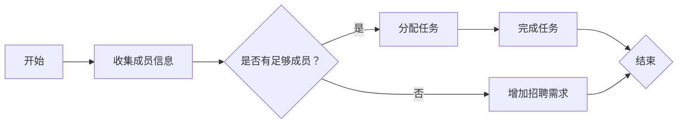
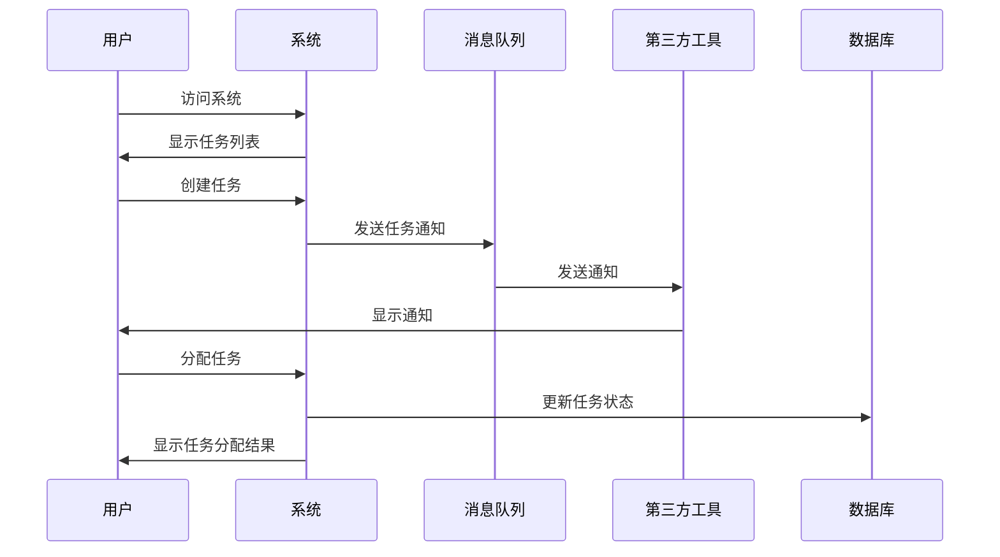

                 

### 文章标题

《远程团队管理：数字时代的领导艺术》

### 关键词

- 远程团队管理
- 数字时代
- 领导艺术
- 工具与技术
- 沟通与协作
- 性能与期望管理

### 摘要

在数字化时代，远程团队管理已成为企业运营的重要组成部分。本文将深入探讨远程团队管理的核心概念、挑战与解决方案，通过一步步的分析，阐述如何在数字时代运用领导艺术来有效管理远程团队。本文将从构建远程团队文化、领导策略、工具与技术三个方面展开讨论，旨在为IT领域专业人士提供实用的远程团队管理指南。

## 引言

### 远程工作的兴起

随着互联网和数字技术的飞速发展，远程工作逐渐成为现代职场的新常态。越来越多的企业开始意识到远程工作的优势，例如降低办公成本、提高员工工作满意度、拓宽人才招聘范围等。根据一项调查显示，全球约有30%的员工在过去几年中采用了远程工作模式，这一比例还在不断上升。

### 远程团队管理的挑战

尽管远程工作具有诸多优势，但同时也带来了新的管理挑战。远程团队的管理与传统的面对面管理相比，存在以下几方面的挑战：

1. **沟通障碍**：缺乏面对面的互动可能导致信息传递不畅，影响团队协作。
2. **信任问题**：远程团队中成员之间的信任建立较为困难，容易产生猜疑和误解。
3. **工作监督**：如何确保远程团队成员的工作效率和质量，成为管理者的一大难题。
4. **文化融合**：不同地区、不同背景的员工如何在一个团队中和谐共处，实现文化融合。
5. **技术依赖**：远程团队高度依赖各种协作工具和平台，技术故障可能严重影响团队运作。

### 领导艺术的重要性

面对这些挑战，有效的领导艺术成为远程团队管理的关键。一个优秀的远程团队领导者不仅需要具备传统的管理技能，还需要适应数字化环境下的新需求。以下是一些关键的领导艺术：

1. **建立信任**：通过透明的沟通和积极的反馈，建立团队成员之间的信任。
2. **明确目标**：设定清晰的目标和期望，确保每个成员都明确自己的职责和任务。
3. **灵活管理**：根据远程团队的特性，灵活调整管理策略和方法。
4. **激励与支持**：通过正面的激励和及时的支持，提高团队成员的工作积极性和创造力。
5. **培养文化**：营造积极向上的团队文化，促进团队成员之间的沟通和协作。

## 第一部分：远程团队管理的基本概念

### 核心概念

在探讨远程团队管理时，我们需要了解几个核心概念：

- **远程团队**：指的是分布在地理位置不同的团队，成员通过互联网和协作工具进行工作。
- **领导艺术**：是指领导者运用专业知识和人际交往技巧来引导和激励团队，实现目标的过程。
- **管理策略**：是指管理者在远程团队中采用的具体方法，包括沟通、协作、监督、激励等方面。

### 问题背景

随着远程工作的普及，越来越多的企业和组织开始尝试远程团队管理。然而，实际操作中却遇到了诸多挑战，如沟通不畅、信任缺失、工作效率下降等问题。这些问题不仅影响了团队的绩效，还可能导致员工流失和客户满意度下降。

### 问题描述

远程团队管理面临的主要问题包括：

1. **沟通障碍**：远程团队成员之间缺乏面对面的互动，导致信息传递不畅，影响团队协作。
2. **信任问题**：团队成员之间缺乏直接的交流，难以建立信任关系，容易产生误解和猜疑。
3. **工作监督**：远程团队的管理者难以实时监督团队成员的工作状态，难以确保工作效率和质量。
4. **文化融合**：不同地区、不同背景的员工如何在一个团队中和谐共处，实现文化融合。
5. **技术依赖**：远程团队高度依赖各种协作工具和平台，技术故障可能严重影响团队运作。

### 问题解决

为了解决上述问题，我们可以采取以下措施：

1. **优化沟通**：通过多种沟通渠道，如视频会议、即时通讯、邮件等，确保信息的及时传递。
2. **建立信任**：通过透明的沟通和积极的反馈，建立团队成员之间的信任关系。
3. **明确目标**：设定清晰的目标和期望，确保每个成员都明确自己的职责和任务。
4. **灵活管理**：根据远程团队的特性，灵活调整管理策略和方法。
5. **技术支持**：选择稳定高效的协作工具，降低技术故障对团队运作的影响。

### 边界与外延

远程团队管理不仅涉及团队内部的管理，还与外部环境密切相关。例如，企业与客户、供应商之间的协作也受到远程工作模式的影响。因此，远程团队管理不仅需要关注内部团队运作，还需要考虑外部环境的适应性。

### 概念结构与核心要素组成

远程团队管理可以视为一个复杂的系统，其核心要素包括：

1. **团队文化**：构建积极向上的团队文化，促进团队成员之间的沟通和协作。
2. **沟通机制**：建立有效的沟通渠道，确保信息的及时传递。
3. **管理策略**：根据团队特点灵活调整管理方法。
4. **技术支持**：提供稳定高效的协作工具。

这些要素相互关联，共同构成了远程团队管理的核心框架。

### 关键概念与联系

在远程团队管理中，以下几个关键概念具有重要意义：

1. **远程工作模式**：指员工在非传统办公场所进行工作的方式。
2. **领导力**：指领导者运用专业知识和人际交往技巧来引导和激励团队的能力。
3. **沟通技巧**：指有效传递和接收信息的方法和策略。
4. **协作工具**：指用于团队协作的各种技术工具，如视频会议、即时通讯、文档共享等。

这些概念相互关联，共同影响着远程团队的管理效果。

### 核心概念原理

远程团队管理的基本原理可以概括为以下几点：

1. **信任建立**：通过透明的沟通和积极的反馈，建立团队成员之间的信任关系。
2. **目标明确**：设定清晰的目标和期望，确保每个成员都明确自己的职责和任务。
3. **灵活管理**：根据团队特点灵活调整管理方法，适应远程工作环境。
4. **技术支持**：提供稳定高效的协作工具，降低技术故障对团队运作的影响。

这些原理构成了远程团队管理的基础。

### 概念属性特征对比表格

以下是对几个关键概念的属性特征进行对比：

| 概念           | 属性特征                                           | 对比分析                                                     |
| -------------- | -------------------------------------------------- | ------------------------------------------------------------ |
| 远程工作模式   | 非传统办公场所、依赖互联网、灵活性高                 | 与传统办公模式相比，远程工作模式更加灵活，但需要更强的自我管理能力。 |
| 领导力         | 指引方向、激励员工、解决冲突                         | 远程团队领导者需要具备更强的沟通和协调能力，以弥补面对面交流的不足。 |
| 沟通技巧       | 及时性、准确性、互动性                               | 沟通技巧是远程团队管理的关键，直接影响团队协作效果。         |
| 协作工具       | 功能性、稳定性、易用性                               | 协作工具的选择和使用对远程团队的工作效率至关重要。           |

### ER实体关系图架构

以下是一个简单的ER实体关系图，展示远程团队管理中的关键实体及其关系：

```mermaid
erDiagram
  Team ||--|{ Member }|-->: "团队与成员关系"
  Team ||--|{ Project }|-->: "团队与项目关系"
  Member ||--|{ Role }|-->: "成员与角色关系"
  Project ||--|{ Task }|-->: "项目与任务关系"
  Member ||--|{ Skill }|-->: "成员与技能关系"
```

### 算法原理讲解

在远程团队管理中，算法原理可以应用于以下几个方面：

1. **任务分配算法**：根据团队成员的技能和工作负荷，自动分配任务，提高工作效率。
2. **绩效评估算法**：通过数据分析和机器学习，对团队成员的工作表现进行量化评估。
3. **沟通优化算法**：分析团队成员的沟通行为，提供个性化的沟通建议，提高沟通效果。

以下是一个简单的任务分配算法的mermaid流程图：



### 算法原理详细讲解

任务分配算法的原理如下：

1. **输入**：收集团队成员的技能和工作负荷信息。
2. **处理**：根据团队成员的技能和工作负荷，将任务分配给最合适的成员。
3. **输出**：生成任务分配表，显示每个成员的任务情况。

以下是一个具体的例子：

假设有四个任务需要完成，分别为A、B、C和D。团队成员有Alice、Bob、Charlie和Diana，他们的技能和工作负荷如下表所示：

| 成员 | 技能A | 技能B | 技能C | 技能D | 工作负荷 |
| ---- | ---- | ---- | ---- | ---- | ------ |
| Alice | 高    | 中    | 低    | 高    | 低      |
| Bob   | 中    | 高    | 中    | 中    | 中      |
| Charlie | 低    | 低    | 高    | 低    | 高      |
| Diana | 高    | 高    | 高    | 低    | 中      |

根据任务分配算法，我们可以将任务分配如下：

- 任务A：分配给Alice，因为她具备最高技能且工作负荷较低。
- 任务B：分配给Bob，因为他具备中等技能且工作负荷适中。
- 任务C：分配给Charlie，因为他具备最高技能且工作负荷较高，但任务C的技能要求最低。
- 任务D：分配给Diana，因为她具备最高技能且工作负荷适中。

通过这种分配方法，我们可以确保任务得到高效完成，同时避免成员过度劳累。

### 数学模型和公式

任务分配算法的核心在于如何根据成员的技能和工作负荷进行优化分配。这里使用一个简单的线性规划模型来描述：

设任务集合为\( T = \{A, B, C, D\} \)，成员集合为\( M = \{Alice, Bob, Charlie, Diana\} \)，任务\( i \)的技能要求为\( s_i \)，成员\( j \)的技能值为\( s_{ij} \)，成员\( j \)的工作负荷为\( l_j \)。

目标函数：最大化总任务完成度

$$
\text{Maximize } \sum_{i \in T} \sum_{j \in M} w_{ij} s_{ij}
$$

其中，\( w_{ij} \)为权重系数，表示任务\( i \)分配给成员\( j \)的概率。

约束条件：

1. 每个任务只能分配给一个成员：

$$
\sum_{j \in M} w_{ij} = 1 \quad \forall i \in T
$$

2. 每个成员的技能值必须大于等于任务要求的技能值：

$$
s_{ij} \geq s_i \quad \forall i \in T, \forall j \in M
$$

3. 每个成员的工作负荷不能超过其最大承受能力：

$$
\sum_{i \in T} w_{ij} l_j \leq L_j \quad \forall j \in M
$$

其中，\( L_j \)为成员\( j \)的最大工作负荷。

通过求解这个线性规划问题，可以得到最优的任务分配方案。

### 系统分析与架构设计方案

### 问题场景介绍

随着远程工作的普及，企业面临着如何高效管理远程团队、确保项目按时交付的挑战。为了解决这一问题，我们设计了一套远程团队管理系统，通过系统化的方法来提高团队协作效率和项目交付质量。

### 项目介绍

远程团队管理系统（Remote Team Management System，RTMS）是一个基于Web的远程团队协作平台，旨在提供任务管理、沟通协作、绩效评估等功能，帮助企业高效管理远程团队。该系统采用模块化设计，可以灵活扩展和集成其他业务系统。

### 系统功能设计

远程团队管理系统的主要功能包括：

1. **任务管理**：提供任务创建、分配、跟踪和统计功能，确保项目进度可控。
2. **沟通协作**：集成即时通讯、邮件通知、文档共享等功能，促进团队成员间的沟通与协作。
3. **绩效评估**：通过数据分析和统计，对团队成员的工作表现进行量化评估，提供激励和反馈。
4. **成员管理**：管理团队成员的个人信息、角色权限和工作负荷，确保团队结构合理。

### 系统架构设计

远程团队管理系统的整体架构设计如下：

1. **前端**：采用React框架，实现用户界面和交互逻辑，提供丰富的用户体验。
2. **后端**：采用Spring Boot框架，实现业务逻辑和数据处理，提供API接口供前端调用。
3. **数据库**：使用MySQL数据库，存储用户信息、任务数据、绩效数据等。
4. **中间件**：使用RabbitMQ作为消息队列，处理系统中的异步任务和通知消息。
5. **协作工具**：集成Slack、Trello等第三方协作工具，提供一站式的远程工作体验。

### 系统接口设计和系统交互

远程团队管理系统中的关键接口设计和系统交互如下：

1. **用户接口**：用户通过Web浏览器访问系统，进行任务创建、任务分配、沟通协作等操作。
2. **API接口**：提供RESTful API接口，供前端调用，实现数据交互和功能调用。
3. **消息队列**：通过RabbitMQ，系统自动发送任务通知、绩效反馈等消息，确保信息的及时传递。
4. **第三方接口**：集成Slack、Trello等协作工具的API，实现与第三方平台的互通。

以下是一个简单的mermaid序列图，展示系统的主要交互过程：



### 项目实战

#### 环境安装

1. **安装Java环境**：下载并安装Java Development Kit（JDK），配置环境变量。
2. **安装MySQL**：下载并安装MySQL数据库，配置数据库连接。
3. **安装RabbitMQ**：下载并安装RabbitMQ消息队列，配置RabbitMQ服务。

#### 系统核心实现源代码

以下是远程团队管理系统的主要核心实现部分：

```python
# 1. 任务管理模块

class Task:
    def __init__(self, id, name, status, assigned_to):
        self.id = id
        self.name = name
        self.status = status
        self.assigned_to = assigned_to

    def assign(self, member):
        self.assigned_to = member

    def update_status(self, status):
        self.status = status

# 2. 沟通协作模块

class MessageQueue:
    def __init__(self):
        self.queue = []

    def send_message(self, message):
        self.queue.append(message)

    def receive_message(self):
        if self.queue:
            return self.queue.pop(0)
        return None

# 3. 绩效评估模块

class PerformanceEvaluation:
    def __init__(self):
        self.data = []

    def add_evaluation(self, member, score):
        self.data.append((member, score))

    def get_average_score(self):
        total_score = 0
        for _, score in self.data:
            total_score += score
        return total_score / len(self.data)
```

#### 代码应用解读与分析

1. **任务管理模块**：`Task`类用于表示任务，包括任务ID、名称、状态和分配给成员的信息。`assign`方法用于任务分配，`update_status`方法用于更新任务状态。
2. **沟通协作模块**：`MessageQueue`类用于表示消息队列，`send_message`方法用于发送消息，`receive_message`方法用于接收消息。
3. **绩效评估模块**：`PerformanceEvaluation`类用于表示绩效评估，`add_evaluation`方法用于添加评估数据，`get_average_score`方法用于计算平均分。

#### 实际案例分析和详细讲解

假设有一个远程团队，包括Alice、Bob和Charlie三个成员，他们需要完成四个任务A、B、C和D。以下是一个简单的实际案例：

1. **任务分配**：Alice负责任务A，Bob负责任务B，Charlie负责任务C和D。
2. **任务状态更新**：每天团队成员更新任务的完成情况，如“进行中”、“已完成”等。
3. **绩效评估**：根据任务完成情况和团队领导评估，计算成员的绩效得分。

#### 项目小结

通过实际案例，我们可以看到远程团队管理系统在任务管理、沟通协作和绩效评估方面的应用。该系统有助于提高团队协作效率，确保项目按时交付，同时为团队成员提供明确的绩效反馈。

### 最佳实践 tips

1. **明确目标和职责**：确保团队成员明确自己的职责和目标，避免任务分配不清。
2. **建立信任机制**：通过透明的沟通和积极的反馈，建立团队成员之间的信任关系。
3. **选择合适的协作工具**：根据团队需求选择稳定高效的协作工具，提高工作效率。
4. **定期绩效评估**：定期对团队成员的工作表现进行评估，提供激励和反馈。
5. **关注团队成员的福利和心理健康**：关注团队成员的工作和生活状态，提供必要的支持和帮助。

### 小结

远程团队管理在数字化时代具有重要意义，通过有效的领导艺术和合理的系统设计，可以克服远程工作带来的挑战，提高团队协作效率和项目交付质量。本文从核心概念、构建团队文化、领导策略、工具与技术四个方面进行了详细探讨，旨在为IT领域专业人士提供实用的远程团队管理指南。

### 注意事项

1. **保持沟通**：确保团队成员之间的沟通畅通，避免信息传递延误。
2. **灵活调整**：根据实际情况灵活调整管理策略，适应远程工作环境。
3. **关注技术支持**：确保协作工具的稳定性和易用性，降低技术故障对团队运作的影响。
4. **关注团队成员的个人发展**：提供培训和学习机会，帮助团队成员提升技能和职业素养。

### 拓展阅读

1. 《远程工作的艺术》——作者通过实例分享了自己的远程工作经验，提供了实用的建议和技巧。
2. 《数字领导力》——探讨了数字化时代领导者所需的技能和素质，对远程团队管理具有参考价值。
3. 《敏捷团队管理》——介绍了敏捷开发方法在远程团队管理中的应用，有助于提高团队协作效率。

### 作者信息

作者：AI天才研究院/AI Genius Institute & 禅与计算机程序设计艺术 /Zen And The Art of Computer Programming

