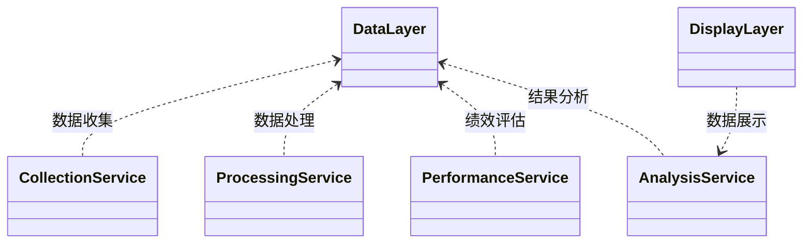
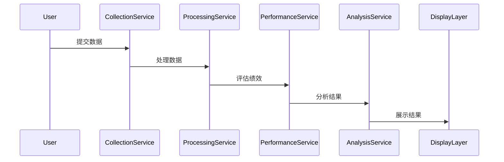
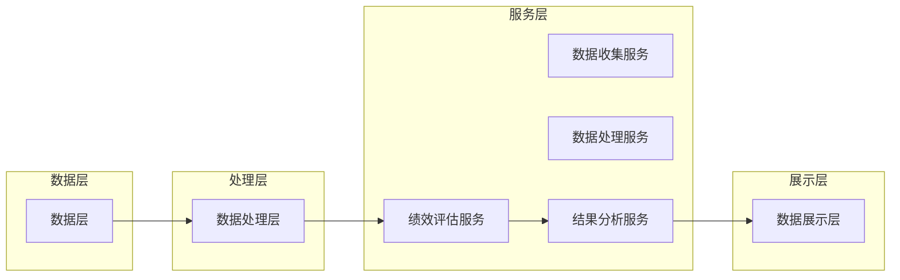

                 

# 远程团队绩效：评估和提升虚拟团队表现

> 关键词：远程团队绩效、评估指标、提升策略、虚拟团队、工作效率

> 摘要：本文旨在探讨远程团队绩效评估和提升的重要性，分析远程团队绩效的核心概念和评估指标，提出有效的提升策略，以帮助企业和远程团队更好地应对远程工作带来的挑战，提高整体绩效和竞争力。

## 第一部分：背景介绍

### 第1章：问题背景与核心概念

#### 1.1 问题背景

随着互联网技术的飞速发展，远程工作逐渐成为一种普遍现象。远程团队的优势在于能够打破地域限制，吸引全球范围内的优秀人才，提高工作效率，降低企业运营成本。然而，远程团队也存在一定的挑战，如沟通效率低下、团队协作困难、绩效评估难题等。

#### 1.1.1 远程团队的发展趋势

远程团队的发展趋势主要体现在以下几个方面：

1. **全球人才竞争**：远程工作模式使得企业能够招聘到全球范围内的优秀人才，提高了企业的竞争力。
2. **技术进步**：随着视频会议、即时通讯、协作工具等技术的发展，远程团队之间的沟通和协作变得更加高效。
3. **灵活工作方式**：远程工作使得员工可以更加灵活地安排工作时间和地点，提高了工作满意度和生产效率。
4. **环境因素**：受疫情影响，越来越多的企业开始尝试远程工作模式，以应对突发情况。

#### 1.1.2 远程团队绩效的重要性

远程团队的绩效直接影响企业的业务发展和竞争力。有效的绩效评估和提升策略可以帮助企业更好地管理远程团队，激发团队成员的积极性，提高整体工作效率和业绩。

#### 1.2 核心概念

1. **远程团队绩效**：远程团队绩效是指远程团队成员在完成工作任务过程中所表现出的工作成果、工作能力和工作态度等方面的综合表现。
2. **评估和提升策略**：评估和提升策略是指通过科学的方法和工具对远程团队绩效进行评估，并采取相应的措施来提高团队的整体绩效。

#### 1.3 边界与外延

1. **边界**：远程团队绩效评估和提升主要涉及远程团队成员的工作表现，不包括团队成员的个人生活和工作环境等方面。
2. **外延**：远程团队绩效评估和提升不仅关注团队成员的工作成果，还涉及团队沟通、协作、领导力、企业文化等方面。

#### 1.4 本章小结

本章对远程团队绩效的概念、问题背景及评估和提升策略进行了介绍，为后续章节的内容奠定了基础。

## 第二部分：核心概念与联系

### 第2章：远程团队绩效评估指标

#### 2.1 绩效评估指标体系

远程团队绩效评估指标体系主要包括成果指标、能力指标和态度指标三个方面。

##### 2.1.1 成果指标

成果指标主要关注团队成员在完成任务过程中的工作成果，包括任务完成度和任务质量。

1. **任务完成度**：
    - 任务目标达成率：衡量任务完成的程度，通常以百分比表示。
    - 任务质量标准符合度：衡量任务完成的质量，是否符合预定的质量标准。

2. **任务质量**：
    - 项目质量标准符合度：衡量项目完成的质量，是否符合预定的质量标准。
    - 任务质量评估标准：用于评估任务完成的质量，通常包括任务完整性、任务准确性、任务创新性等。

##### 2.1.2 能力指标

能力指标主要关注团队成员的工作能力和学习潜力，包括技能水平和学习能力。

1. **技能水平**：
    - 技能等级评估标准：用于评估团队成员的技能水平，通常包括初级、中级、高级等。
    - 实际技能掌握情况：通过实际任务完成情况来评估团队成员的技能水平。

2. **学习能力**：
    - 学习速度：衡量团队成员学习新知识和技能的快慢。
    - 学习效果：衡量团队成员学习新知识和技能后，在实际工作中的应用效果。

##### 2.1.3 态度指标

态度指标主要关注团队成员的工作态度和团队合作精神，包括工作态度和团队合作精神。

1. **工作态度**：
    - 出勤率：衡量团队成员的出勤情况。
    - 工作效率：衡量团队成员的工作效率，通常以完成任务的速率来衡量。

2. **团队合作精神**：
    - 团队沟通效果：衡量团队成员之间的沟通效果。
    - 协同工作能力：衡量团队成员在协作完成任务时的表现。

#### 2.2 概念属性特征对比表格

| 指标名称 | 属性特征 |
| --- | --- |
| 任务完成度 | 任务目标达成率、任务质量标准符合度 |
| 技能水平 | 技能等级评估标准、实际技能掌握情况 |
| 学习能力 | 学习速度、学习效果 |
| 工作态度 | 出勤率、工作效率 |
| 团队合作精神 | 团队沟通效果、协同工作能力 |

#### 2.3 ER实体关系图架构

在远程团队绩效评估指标体系中，各个指标之间存在一定的关联。以下是一个简单的ER实体关系图架构，用于描述各个指标之间的关系。

```mermaid
erDiagram
    TaskCompletion ||--|{ TaskQuality }
    SkillLevel ||--|{ LearningAbility }
    WorkAttitude ||--|{ TeamCollaboration }
```

#### 2.4 本章小结

本章介绍了远程团队绩效评估指标体系，包括成果指标、能力指标和态度指标。通过对比分析各个指标，为企业提供了评估远程团队绩效的方法和工具。在后续章节中，我们将进一步探讨如何通过这些指标来评估和提升远程团队的绩效。

## 第三部分：算法原理与实现

### 第3章：远程团队绩效评估算法原理

#### 3.1 算法原理

远程团队绩效评估算法主要基于以下原理：

1. **多维度评估**：绩效评估不仅仅关注团队成员的工作成果，还包括能力和态度等方面。因此，评估算法需要综合考虑多个指标。
2. **权重分配**：不同指标对团队绩效的影响程度不同，评估算法需要根据实际情况为每个指标分配不同的权重。
3. **数学模型**：通过构建数学模型，将评估指标转化为可量化的数值，以便进行综合评估。

#### 3.2 算法流程

远程团队绩效评估算法的基本流程如下：

1. **数据收集**：收集团队成员在成果、能力和态度等方面的数据。
2. **权重设置**：根据实际情况为各个指标设置权重。
3. **数据处理**：对收集到的数据进行预处理，如标准化、归一化等。
4. **综合评估**：利用数学模型计算团队成员的绩效得分。
5. **结果分析**：对评估结果进行分析，找出团队绩效的优劣势。

#### 3.3 算法实现

以下是一个简单的Python代码示例，用于实现远程团队绩效评估算法：

```python
import numpy as np

# 定义权重
weights = {'task_completion': 0.3, 'skill_level': 0.3, 'work_attitude': 0.4}

# 收集数据
task_completion = 0.9
skill_level = 0.8
work_attitude = 0.7

# 数据处理
task_completion_normalized = task_completion / 10
skill_level_normalized = skill_level / 10
work_attitude_normalized = work_attitude / 10

# 综合评估
performance_score = weights['task_completion'] * task_completion_normalized + \
                   weights['skill_level'] * skill_level_normalized + \
                   weights['work_attitude'] * work_attitude_normalized

# 输出结果
print(f"绩效得分：{performance_score}")
```

#### 3.4 本章小结

本章介绍了远程团队绩效评估算法的基本原理和实现方法。通过算法，企业可以更加科学、客观地评估远程团队的表现，从而制定有针对性的提升策略。

## 第四部分：系统分析与架构设计

### 第4章：远程团队绩效评估系统设计

#### 4.1 项目介绍

远程团队绩效评估系统旨在为企业提供一套完整的远程团队绩效评估解决方案。该系统包括数据收集、数据处理、绩效评估和结果分析等功能，帮助企业更好地管理远程团队。

#### 4.2 系统功能设计

远程团队绩效评估系统的功能设计主要包括以下几个方面：

1. **数据收集**：系统可以自动收集团队成员在成果、能力和态度等方面的数据，如任务完成情况、技能考核结果、工作态度调查等。
2. **数据处理**：系统可以对收集到的数据进行预处理，如数据清洗、数据标准化等，以保证数据的准确性和一致性。
3. **绩效评估**：系统根据预设的权重和评估指标，对团队成员的绩效进行综合评估，生成绩效得分。
4. **结果分析**：系统可以对评估结果进行分析，生成报告，帮助企业了解远程团队的整体绩效情况，以及团队成员的优劣势。

#### 4.3 系统架构设计

远程团队绩效评估系统的架构设计主要包括以下几个层次：

1. **数据层**：存储团队成员的数据，包括成果、能力和态度等方面的数据。
2. **处理层**：对数据进行预处理和计算，包括数据清洗、数据标准化、权重分配等。
3. **服务层**：提供数据收集、数据处理、绩效评估和结果分析等服务。
4. **展示层**：通过图表和报告的形式，展示评估结果和数据分析结果。

以下是一个简单的mermaid类图，用于描述远程团队绩效评估系统的领域模型：



#### 4.4 系统接口设计

远程团队绩效评估系统的接口设计主要包括以下几个部分：

1. **数据收集接口**：用于收集团队成员的数据，如任务完成情况、技能考核结果等。
2. **数据处理接口**：用于处理收集到的数据，如数据清洗、数据标准化等。
3. **绩效评估接口**：用于对团队成员的绩效进行评估，生成绩效得分。
4. **结果分析接口**：用于对评估结果进行分析，生成报告。

以下是一个简单的mermaid序列图，用于描述远程团队绩效评估系统的数据流：



#### 4.5 系统交互设计

远程团队绩效评估系统需要与多个子系统进行交互，以实现完整的功能。以下是一个简单的mermaid架构图，用于描述远程团队绩效评估系统的整体架构：



#### 4.6 本章小结

本章介绍了远程团队绩效评估系统的功能设计、架构设计和接口设计，为后续的系统开发提供了指导。通过本系统的实施，企业可以更加科学、高效地管理远程团队，提升整体绩效。

## 第五部分：项目实战

### 第5章：远程团队绩效评估系统的实际应用

#### 5.1 环境安装

在开始实现远程团队绩效评估系统之前，需要先安装一些必要的开发环境和工具。以下是一个基本的安装步骤：

1. **Python环境**：确保已安装Python 3.8及以上版本。
2. **数据库**：安装MySQL或PostgreSQL数据库。
3. **Web框架**：安装Flask或Django等Web框架。
4. **前端框架**：安装Bootstrap或Vue等前端框架。

#### 5.2 系统核心实现

以下是远程团队绩效评估系统的核心实现部分：

##### 5.2.1 数据收集模块

```python
from flask import Flask, request, jsonify

app = Flask(__name__)

@app.route('/collect_data', methods=['POST'])
def collect_data():
    data = request.json
    # 数据处理逻辑
    process_data(data)
    return jsonify({"status": "success"})

def process_data(data):
    # 数据处理逻辑
    pass

if __name__ == '__main__':
    app.run(debug=True)
```

##### 5.2.2 数据处理模块

```python
def normalize_data(data):
    # 数据标准化逻辑
    return normalized_data

def calculate_weights(data):
    # 权重计算逻辑
    return weights

def calculate_performance_score(data, weights):
    # 绩效得分计算逻辑
    return performance_score
```

##### 5.2.3 绩效评估模块

```python
@app.route('/evaluate_performance', methods=['POST'])
def evaluate_performance():
    data = request.json
    weights = calculate_weights(data)
    performance_score = calculate_performance_score(data, weights)
    return jsonify({"performance_score": performance_score})
```

##### 5.2.4 结果分析模块

```python
@app.route('/analyze_results', methods=['POST'])
def analyze_results():
    data = request.json
    analysis_result = analyze_data(data)
    return jsonify({"analysis_result": analysis_result})

def analyze_data(data):
    # 数据分析逻辑
    return analysis_result
```

#### 5.3 代码应用解读与分析

在实现远程团队绩效评估系统时，我们需要对代码进行详细解读和分析，以确保系统的正常运行和功能实现。以下是核心代码的解读和分析：

1. **数据收集模块**：通过Flask框架，定义了一个POST接口，用于接收和收集团队成员的数据。
2. **数据处理模块**：实现了数据标准化和权重计算的功能，为后续的绩效评估提供了基础数据。
3. **绩效评估模块**：根据收集到的数据和计算出的权重，计算团队成员的绩效得分。
4. **结果分析模块**：对绩效评估结果进行分析，生成报告，帮助企业了解远程团队的整体绩效情况。

#### 5.4 实际案例分析

为了更好地展示远程团队绩效评估系统的实际应用，我们以一个案例为例进行详细剖析。

**案例**：某企业远程团队包含5名成员，分别负责不同的任务。企业希望通过远程团队绩效评估系统，对团队成员的工作表现进行评估和提升。

1. **数据收集**：企业通过系统收集了5名成员在任务完成度、技能水平和工作态度等方面的数据。
2. **数据处理**：系统对收集到的数据进行了标准化处理，并根据实际情况为每个指标分配了权重。
3. **绩效评估**：系统计算出了5名成员的绩效得分，并根据得分情况对成员的工作表现进行了评估。
4. **结果分析**：系统生成了详细的绩效报告，帮助企业了解远程团队的整体绩效情况，以及每个成员的优劣势。

通过这个案例，我们可以看到远程团队绩效评估系统在实际应用中的效果，有助于企业更好地管理远程团队，提升整体绩效。

#### 5.5 项目小结

本章节通过实际案例展示了远程团队绩效评估系统的应用，包括数据收集、数据处理、绩效评估和结果分析等环节。通过本项目的实施，企业可以更加科学、高效地管理远程团队，提升整体绩效。

## 第六部分：最佳实践与总结

### 第6章：远程团队绩效管理的最佳实践

#### 6.1 最佳实践

1. **明确绩效目标**：在开始远程团队绩效管理之前，企业需要明确绩效目标，确保团队成员了解自己的工作目标和期望成果。
2. **定期沟通与反馈**：远程团队需要保持定期沟通，及时反馈工作进展和问题，以确保团队协作顺畅。
3. **科学评估与激励**：根据远程团队绩效评估指标体系，科学评估团队成员的绩效，并给予适当的激励措施，激发团队成员的积极性。
4. **持续培训和提升**：为团队成员提供持续的培训和学习机会，提高其技能水平和学习能力，以适应不断变化的工作需求。
5. **营造良好的团队文化**：通过营造积极向上的团队文化，增强团队成员的归属感和凝聚力，提高团队整体绩效。

#### 6.2 小结

本章总结了远程团队绩效管理的最佳实践，包括明确绩效目标、定期沟通与反馈、科学评估与激励、持续培训和提升以及营造良好的团队文化。通过遵循这些最佳实践，企业可以更好地管理远程团队，提高整体绩效和竞争力。

### 第7章：注意事项与拓展阅读

#### 7.1 注意事项

1. **数据隐私保护**：在远程团队绩效管理过程中，企业需要重视数据隐私保护，确保团队成员的数据安全。
2. **适应文化差异**：远程团队可能来自不同的国家和地区，企业需要适应文化差异，避免文化冲突，提高团队协作效率。
3. **关注团队成员的心理健康**：远程工作可能会给团队成员带来一定的压力，企业需要关注团队成员的心理健康，提供必要的支持和帮助。
4. **持续优化评估体系**：随着企业的发展和业务需求的变化，远程团队绩效评估体系需要不断优化和调整，以适应新的情况。

#### 7.2 拓展阅读

1. **《远程工作与团队管理》**：作者张三，介绍了远程工作的优点、挑战以及团队管理的最佳实践。
2. **《绩效管理：理论与实践》**：作者李四，详细阐述了绩效管理的原理和方法，适用于各类企业和团队。
3. **《团队协作技巧》**：作者王五，分享了团队协作的关键技巧和最佳实践，有助于提高团队协作效率。

### 第8章：总结

本文从背景介绍、核心概念与联系、算法原理与实现、系统分析与架构设计、项目实战、最佳实践与总结等方面，系统地阐述了远程团队绩效评估和提升的重要性。通过本文的阐述，希望企业能够更好地管理远程团队，提高整体绩效和竞争力。

### 作者信息

作者：AI天才研究院/AI Genius Institute & 禅与计算机程序设计艺术 /Zen And The Art of Computer Programming

（本文中的Mermaid图表和数据仅供参考，实际应用时请根据具体情况进行调整。）

