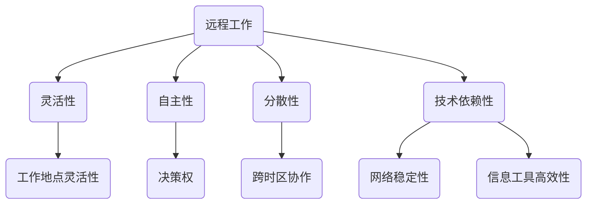

                 

### 文章标题：远程绩效管理：评估和提升远程团队表现的方法

在当今全球化和数字化浪潮的推动下，远程工作已成为许多企业和组织的常态。然而，远程工作的普及也带来了新的挑战，尤其是在如何有效管理和评估远程团队绩效方面。本文将深入探讨远程绩效管理的核心概念、评估体系、提升策略以及技术支持，通过一步步的分析和推理，为企业和团队提供一套系统化、可操作的远程绩效管理方法。

关键词：远程工作、绩效管理、评估体系、提升策略、技术支持

摘要：本文首先介绍了远程工作的定义与特点，回顾了其发展历程，分析了远程工作的优势与挑战。随后，我们探讨了远程绩效评估体系的关键因素、方法与工具，并分析了成功实践案例。接着，本文深入探讨了远程团队沟通与协作的挑战、策略以及提升效率的方法。在第二部分，我们提出了个性化绩效管理与激励、领导力在远程绩效管理中的作用以及构建高绩效远程团队文化的方法。最后，本文探讨了远程绩效管理中的技术支持，并给出了实践总结与展望。

### 目录大纲

#### 第一部分：远程绩效管理概述

- **第1章：远程工作时代的来临**
  - 1.1 远程工作的定义与特点
  - 1.2 远程工作的发展历程
  - 1.3 远程工作的优势与挑战
  - 1.4 远程绩效管理的意义
- **第2章：远程绩效评估体系**
  - 2.1 绩效评估的概念与模型
  - 2.2 远程绩效评估的关键因素
  - 2.3 远程绩效评估的方法与工具
  - 2.4 案例分析：成功的远程绩效评估实践

#### 第二部分：远程绩效提升策略

- **第3章：远程团队沟通与协作**
  - 3.1 远程沟通的挑战与策略
  - 3.2 远程团队协作工具与实践
  - 3.3 提升远程团队协作效率的方法
  - 3.4 案例分析：高效的远程团队协作案例
- **第4章：个性化绩效管理与激励**
  - 4.1 个性化绩效管理的原则与方法
  - 4.2 远程团队激励策略
  - 4.3 案例分析：成功的远程团队激励机制
- **第5章：领导力在远程绩效管理中的作用**
  - 5.1 远程领导者的角色与职责
  - 5.2 提升远程领导力的策略
  - 5.3 领导风格对远程团队绩效的影响
  - 5.4 案例分析：卓越的远程领导者实践
- **第6章：构建高绩效的远程团队文化**
  - 6.1 远程团队文化的构建原则
  - 6.2 促进远程团队文化融合的方法
  - 6.3 远程团队文化评估与改进
  - 6.4 案例分析：积极健康的远程团队文化
- **第7章：技术支持与远程绩效管理**
  - 7.1 远程绩效管理技术发展现状
  - 7.2 远程绩效管理的技术趋势
  - 7.3 技术在远程绩效管理中的应用
  - 7.4 案例分析：技术驱动的远程绩效管理实践
- **第8章：远程绩效管理实践总结与展望**
  - 8.1 远程绩效管理实践中的常见问题与解决方法
  - 8.2 未来远程绩效管理的趋势与方向
  - 8.3 企业如何适应远程绩效管理的变革
  - 8.4 拓展阅读：深入探索远程绩效管理的相关领域

### 第一部分：远程绩效管理概述

#### 第1章：远程工作时代的来临

**1.1 远程工作的定义与特点**

远程工作（Telecommuting）是指员工在不同地点使用信息技术进行工作，通常不限于特定的办公场所。这种工作模式的核心在于通过互联网和其他通信技术实现工作地点与办公地点的分离。

**远程工作的特点包括：**

1. **灵活性**：员工可以在任何时间、任何地点完成工作任务，不受传统工作时间的限制。
2. **自主性**：员工在远程工作环境中具有更高的自主决策权和责任感。
3. **分散性**：远程工作使得团队成员分布在不同的地理位置，可能涉及跨时区、跨文化的沟通和协作。
4. **技术依赖性**：远程工作依赖于稳定的网络连接、高效的信息沟通工具和协作平台。

**1.2 远程工作的发展历程**

远程工作并非现代现象，其发展历程可以追溯到20世纪初期。然而，随着信息技术的飞速发展，远程工作在21世纪获得了巨大的普及。

1. **20世纪初期**：远程工作概念萌芽，主要是通过邮件和电话实现。
2. **20世纪90年代**：互联网的普及推动了远程工作的兴起，电子邮件和即时通讯工具成为远程沟通的主要手段。
3. **21世纪**：云计算、虚拟私人网络（VPN）和协作工具的普及，使得远程工作更加高效和便捷。

**1.3 远程工作的优势与挑战**

**优势：**

1. **提高工作效率**：远程工作使得员工能够根据自己的最佳工作时间进行工作，避免了通勤时间。
2. **提升员工满意度**：远程工作提供了工作与生活平衡的机会，增加了员工的满意度。
3. **降低企业运营成本**：远程工作减少了办公场所的租赁和设备投资，降低了企业的运营成本。
4. **扩大人才招聘范围**：远程工作不受地理位置限制，企业可以招聘全球范围内的优秀人才。

**挑战：**

1. **沟通障碍**：远程工作可能导致沟通不畅，信息传递延迟，增加了解决问题的复杂性。
2. **监督困难**：远程工作环境中，管理者难以直接监督员工的工作进度和质量。
3. **技术依赖**：远程工作对网络和设备的依赖性较高，网络中断或设备故障可能影响工作进度。
4. **团队凝聚力**：远程团队缺乏面对面的交流和互动，可能导致团队凝聚力的下降。

**1.4 远程绩效管理的意义**

远程绩效管理是确保远程工作有效性和效率的关键。其意义体现在以下几个方面：

1. **提高绩效**：通过科学合理的绩效评估体系和激励措施，提升远程团队的整体绩效。
2. **确保目标一致**：通过明确的绩效目标和沟通机制，确保远程团队成员的工作方向一致。
3. **优化资源配置**：通过绩效管理，优化人力资源配置，提升团队的整体效率。
4. **促进工作与生活平衡**：通过有效的绩效管理，帮助员工实现工作与生活的平衡，提升员工的工作满意度和忠诚度。

#### 第2章：远程绩效评估体系

**2.1 绩效评估的概念与模型**

绩效评估是指通过系统的方法和工具，对员工在工作中的表现进行测量、评价和反馈的过程。它不仅包括对员工工作结果的评估，还包括对其工作过程、工作态度和团队协作能力的评估。

**远程绩效评估的常见模型包括：**

1. **KPI（关键绩效指标）模型**：通过设定具体、可衡量的指标来评估员工的工作绩效。
2. **360度评估模型**：通过多维度、全方位的评估，获取员工在团队合作、领导能力、沟通能力等方面的综合表现。
3. **目标与计划评估模型**：通过设定工作目标和计划，评估员工的工作进度和达成情况。

**2.2 远程绩效评估的关键因素**

远程绩效评估的成功取决于多个关键因素，包括：

1. **目标明确性**：明确的绩效目标是远程绩效评估的基础，它需要与企业的战略目标保持一致。
2. **指标合理性**：评估指标需要具备可衡量性、合理性和相关性，确保评估结果的真实性和有效性。
3. **数据准确性**：绩效评估的数据需要准确、可靠，以保证评估结果的公正性。
4. **反馈及时性**：及时的绩效反馈有助于员工及时调整工作方向，提升工作效率。
5. **沟通有效性**：远程工作环境中，沟通的有效性对绩效评估至关重要，它包括信息的及时传递和有效理解。

**2.3 远程绩效评估的方法与工具**

远程绩效评估的方法和工具多种多样，以下是一些常用的方法和工具：

1. **工作日志**：员工记录每天的工作内容、完成情况和遇到的问题，管理者定期审核并反馈。
2. **在线问卷调查**：通过在线问卷调查收集员工的工作表现、团队协作和领导能力等方面的数据。
3. **视频会议**：定期举行视频会议，对员工的工作进度、成果和问题进行讨论和反馈。
4. **绩效评估软件**：使用专业的绩效评估软件，自动收集和分析员工的工作数据，提供评估报告。

**2.4 案例分析：成功的远程绩效评估实践**

**案例背景**：某国际知名互联网公司实施远程绩效评估，通过以下步骤实现了成功的实践：

1. **明确绩效目标**：公司制定了清晰的绩效目标，并与员工进行沟通，确保员工了解自己的工作方向和期望结果。
2. **设定合理的评估指标**：根据不同岗位的特点，设定了具体、可衡量的评估指标，如项目完成率、客户满意度等。
3. **数据收集与反馈**：使用在线问卷调查和视频会议工具，定期收集员工的工作数据和反馈，及时评估工作进度和质量。
4. **绩效面谈**：定期与员工进行绩效面谈，针对评估结果进行详细的讨论和分析，提供个性化的反馈和建议。

**成功原因**：

1. **目标明确**：明确的绩效目标帮助员工聚焦工作重点，提高工作效率。
2. **评估指标合理**：合理的评估指标确保了评估结果的真实性和公正性。
3. **沟通有效**：有效的沟通机制确保了信息的及时传递和有效理解，提升了团队的协作效率。
4. **反馈及时**：及时的反馈有助于员工及时调整工作方向，优化工作流程。

#### 第3章：远程团队沟通与协作

**3.1 远程沟通的挑战与策略**

远程团队沟通面临着诸多挑战，主要包括：

1. **沟通障碍**：由于地理位置的差异，远程团队的沟通可能存在语言障碍、时区差异和文化差异。
2. **信息传递延迟**：远程团队沟通依赖于电子邮件、即时通讯工具和视频会议，这些工具可能存在信息传递延迟的问题。
3. **协作困难**：远程团队协作需要高效的沟通和协作工具，但团队成员之间可能存在信息不对称、分工不明确等问题。

**应对策略**：

1. **明确沟通目标**：在每次沟通前明确沟通的目标和内容，确保沟通的效率。
2. **选择合适的沟通工具**：根据沟通的内容和需求，选择合适的沟通工具，如电子邮件、即时通讯工具、视频会议等。
3. **建立沟通规范**：制定明确的沟通规范，如回复时间、会议议程等，确保沟通的有序进行。

**3.2 远程团队协作工具与实践**

远程团队协作工具是远程团队高效协作的关键，以下是一些常用的协作工具：

1. **项目管理工具**：如Trello、Asana等，用于项目规划、任务分配和进度跟踪。
2. **协作文档工具**：如Google Docs、Microsoft Office 365等，支持多人实时协作编辑文档。
3. **视频会议工具**：如Zoom、Microsoft Teams等，提供实时音视频沟通功能。
4. **即时通讯工具**：如Slack、Microsoft Teams等，支持即时消息传递和团队沟通。

**实践案例**：

某知名科技公司采用以下实践方法，成功提升了远程团队的协作效率：

1. **项目规划**：使用Trello进行项目规划和任务分配，确保每个团队成员了解自己的任务和进度。
2. **实时协作**：使用Google Docs进行文档编辑，支持多人实时协作，提高工作效率。
3. **定期会议**：使用Zoom进行定期会议，讨论项目进展、解决问题，确保团队的协同工作。
4. **即时沟通**：使用Slack进行即时沟通，快速传递信息和解决日常问题。

**成功原因**：

1. **工具选择合适**：根据团队的实际情况选择合适的协作工具，提高了协作效率。
2. **流程规范**：建立明确的协作流程和规范，确保团队成员遵循，提高了团队的协作效率。
3. **定期反馈**：定期进行项目进展和问题反馈，及时调整协作策略，确保团队的持续改进。

**3.3 提升远程团队协作效率的方法**

1. **优化工作流程**：通过分析团队的工作流程，找到优化点，减少不必要的步骤和等待时间，提高工作效率。
2. **提高沟通效率**：通过使用高效沟通工具和策略，减少信息传递延迟，提高沟通质量。
3. **加强团队协作**：通过团队建设活动和协作工具的使用，加强团队成员之间的协作和信任，提高团队整体效率。
4. **培养远程工作技能**：通过培训和实践，提升团队成员的远程工作技能，包括时间管理、沟通技巧和协作能力。

**3.4 案例分析：高效的远程团队协作案例**

**案例背景**：某国际远程团队在项目开发过程中，通过以下方法实现了高效的协作：

1. **明确任务分工**：每个团队成员明确自己的任务和责任，确保分工明确，避免重复工作。
2. **实时沟通**：使用Slack进行实时沟通，快速传递信息和解决问题。
3. **定期会议**：使用Zoom进行定期会议，讨论项目进展、解决问题，确保团队的协同工作。
4. **协作工具**：使用Trello进行项目规划和任务分配，使用Google Docs进行文档编辑，确保实时协作。
5. **反馈机制**：定期收集团队成员的反馈，优化协作流程，提高团队效率。

**成功原因**：

1. **明确分工**：明确的任务分工避免了工作重叠和冲突，提高了工作效率。
2. **实时沟通**：高效的沟通机制确保了信息的及时传递和问题解决，提高了团队协作效率。
3. **协作工具**：合适的协作工具支持了团队的实时协作和任务管理，提高了工作效率。
4. **反馈机制**：持续的反馈和改进确保了团队协作的不断优化，提高了整体效率。

### 第二部分：远程绩效提升策略

#### 第4章：个性化绩效管理与激励

**4.1 个性化绩效管理的原则与方法**

个性化绩效管理是指根据员工的特点、需求和绩效目标，定制化的进行绩效管理。其原则包括：

1. **因材施教**：根据员工的个性、能力和工作需求，设定个性化的绩效目标和评估标准。
2. **动态调整**：根据员工的工作表现和绩效目标达成情况，动态调整绩效目标和激励措施。
3. **持续反馈**：定期对员工进行绩效反馈，帮助员工认识到自己的优势和不足，指导其改进。

**个性化绩效管理的方法包括：**

1. **个性分析**：通过性格测试、能力评估等工具，分析员工的个性、能力和职业倾向。
2. **目标设定**：根据员工的个性分析和绩效要求，设定符合其特点和潜力的绩效目标。
3. **过程监控**：通过绩效管理工具，实时监控员工的绩效表现，提供及时的反馈和指导。
4. **激励机制**：根据员工的绩效表现和需求，设计个性化的激励措施，包括奖金、晋升、培训等。

**4.2 远程团队激励策略**

远程团队激励策略需要考虑远程工作的特殊性，包括：

1. **目标激励**：设定明确的绩效目标，激发员工的工作动力和积极性。
2. **成果激励**：根据员工的工作成果和贡献，给予相应的奖励和认可，增强员工的成就感和归属感。
3. **个性化奖励**：根据员工的个人需求和兴趣，提供个性化的奖励，如远程培训、休假等。
4. **文化激励**：通过建设积极、健康的远程团队文化，提升员工的团队认同感和归属感。

**4.3 案例分析：成功的远程团队激励机制**

**案例背景**：某国际远程团队在实施激励策略时，采取了以下措施：

1. **目标激励**：团队根据项目目标和员工的能力，设定了明确的个人绩效目标，激发员工的工作动力。
2. **成果激励**：团队根据员工的工作成果和贡献，定期进行绩效评估，给予相应的奖金和晋升机会。
3. **个性化奖励**：团队根据员工的需求和兴趣，提供了远程培训、休假等个性化的奖励。
4. **文化激励**：团队建立了积极的远程工作文化，包括定期的团队建设活动、线上交流等，增强了员工的归属感和团队认同感。

**成功原因**：

1. **目标明确**：明确的绩效目标帮助员工聚焦工作重点，提高了工作效率。
2. **公平公正**：公平公正的激励措施增强了员工的信任和满意度。
3. **个性化奖励**：个性化的奖励满足了员工的需求，提升了员工的满意度和忠诚度。
4. **文化激励**：积极健康的远程团队文化增强了团队的凝聚力，提升了整体绩效。

#### 第5章：领导力在远程绩效管理中的作用

**5.1 远程领导者的角色与职责**

远程领导者是远程团队的核心，其角色和职责包括：

1. **目标设定**：根据企业的战略目标和团队实际情况，设定清晰的团队目标和绩效指标。
2. **团队构建**：招募、培训和激励团队成员，建立高效、协作的远程团队。
3. **沟通协调**：通过有效的沟通工具和方法，确保信息的及时传递和团队协作。
4. **问题解决**：及时识别和解决团队工作中的问题，确保团队目标的达成。
5. **文化建设**：建设积极、健康的远程团队文化，提升团队的凝聚力和工作效率。

**5.2 提升远程领导力的策略**

提升远程领导力需要从以下几个方面入手：

1. **技能提升**：通过培训和实践，提升远程领导者的沟通技巧、团队管理和问题解决能力。
2. **信任建设**：建立信任是远程领导的关键，领导者需要通过透明、公正的管理行为赢得员工的信任。
3. **灵活管理**：远程领导者需要具备灵活的管理策略，根据团队成员的特点和工作环境，定制化的进行管理。
4. **持续支持**：提供持续的支持和反馈，帮助团队成员提升工作能力和绩效水平。

**5.3 领导风格对远程团队绩效的影响**

不同的领导风格对远程团队的绩效产生不同的影响：

1. **权威型领导**：权威型领导通过严格的管理和监控，确保团队的纪律和效率，但在远程工作中可能导致员工的压力和不满。
2. **民主型领导**：民主型领导通过广泛的参与和沟通，激发员工的积极性和创造力，但在决策过程中可能存在效率低下的问题。
3. **变革型领导**：变革型领导通过激励和引领，推动团队创新和变革，提升团队的绩效和竞争力。

**5.4 案例分析：卓越的远程领导者实践**

**案例背景**：某国际远程团队在实施远程绩效管理时，领导者采取了以下实践措施：

1. **目标设定**：领导者根据企业的战略目标和团队实际情况，设定了清晰的团队目标和绩效指标，确保团队的工作方向和重点。
2. **沟通协调**：领导者通过Zoom、Slack等工具，定期与团队成员进行沟通，了解工作进展和问题，确保团队的协作和效率。
3. **问题解决**：领导者及时识别和解决团队工作中的问题，提供支持和资源，确保团队目标的达成。
4. **文化建设**：领导者通过定期的团队建设活动、线上交流等，建立了积极、健康的远程团队文化，提升了团队的凝聚力和工作效率。

**成功原因**：

1. **目标明确**：明确的团队目标帮助员工聚焦工作重点，提高了工作效率。
2. **沟通协调**：高效的沟通机制确保了信息的及时传递和问题解决，提升了团队协作效率。
3. **问题解决**：及时的领导支持和资源投入，帮助团队成员克服困难，提升了团队绩效。
4. **文化建设**：积极健康的远程团队文化增强了团队的凝聚力和归属感，提升了整体绩效。

#### 第6章：构建高绩效的远程团队文化

**6.1 远程团队文化的构建原则**

构建高绩效的远程团队文化需要遵循以下原则：

1. **开放与透明**：建立开放、透明的沟通机制，确保信息的及时传递和共享，增强团队的透明度和信任感。
2. **尊重与信任**：尊重团队成员的差异和个性，建立信任关系，提升团队的凝聚力和工作效率。
3. **积极与支持**：营造积极、支持的工作氛围，鼓励团队成员提出建议和解决问题，提升团队的创造力和创新力。
4. **协作与共享**：倡导协作精神，鼓励团队成员分享知识和经验，提升团队的整体绩效和竞争力。

**6.2 促进远程团队文化融合的方法**

促进远程团队文化融合需要采取以下方法：

1. **定期的团队建设活动**：通过线上团建活动，增强团队成员之间的互动和了解，提升团队的凝聚力和归属感。
2. **跨文化的沟通与理解**：通过跨文化的沟通和培训，提高团队成员对文化差异的认识和尊重，促进文化的融合。
3. **共同价值观的树立**：通过共同价值观的传播和实践，强化团队成员的认同感和归属感，推动团队文化的建设。
4. **领导者带头示范**：领导者通过自己的言行示范，树立积极的文化榜样，推动团队文化的形成和发展。

**6.3 远程团队文化评估与改进**

远程团队文化评估是确保团队文化健康发展的关键，以下是一些常用的评估方法：

1. **员工满意度调查**：通过员工满意度调查，了解团队成员对团队文化的认可程度和改进建议。
2. **行为观察**：通过观察团队成员的行为和互动，评估团队文化的实际表现和影响。
3. **绩效指标分析**：通过分析团队的绩效指标，评估团队文化对团队绩效的影响和作用。

**6.4 案例分析：积极健康的远程团队文化**

**案例背景**：某国际远程团队通过以下措施，构建了积极健康的团队文化：

1. **开放与透明**：团队建立了开放的沟通机制，定期举行线上会议，分享工作进展和问题，确保信息的透明和共享。
2. **尊重与信任**：团队尊重团队成员的个性和差异，鼓励员工提出建议和意见，建立信任关系，提升团队的凝聚力和工作效率。
3. **积极与支持**：团队营造积极、支持的工作氛围，鼓励员工相互帮助、共同进步，提升团队的创造力和创新力。
4. **协作与共享**：团队倡导协作精神，鼓励员工分享知识和经验，提升团队的整体绩效和竞争力。

**成功原因**：

1. **开放与透明**：透明的沟通机制增强了团队的信任和凝聚力，提升了工作效率。
2. **尊重与信任**：尊重团队成员的差异和个性，建立了积极的团队氛围，提升了员工的满意度和忠诚度。
3. **积极与支持**：积极的团队氛围增强了员工的积极性和创造力，提升了团队的绩效和竞争力。
4. **协作与共享**：协作精神推动了团队的共享和共同进步，提升了团队的整体绩效。

### 第7章：技术支持与远程绩效管理

**7.1 远程绩效管理技术发展现状**

随着信息技术的飞速发展，远程绩效管理技术也在不断进步，主要包括以下几个方面：

1. **云计算技术**：云计算提供了强大的计算能力和数据存储能力，支持远程绩效管理系统的部署和运行。
2. **大数据分析**：大数据分析技术可以对远程团队的工作数据进行分析，提供个性化的绩效评估和改进建议。
3. **人工智能**：人工智能技术可以自动收集、分析和处理远程团队的工作数据，提升绩效管理的效率和准确性。
4. **物联网**：物联网技术可以将远程团队的工作环境、设备和工作状态进行实时监控，提供实时的绩效数据和反馈。

**7.2 远程绩效管理的技术趋势**

远程绩效管理技术的发展趋势主要体现在以下几个方面：

1. **智能化**：通过人工智能和大数据分析，实现远程绩效管理的智能化，提高绩效评估的准确性和效率。
2. **个性化**：根据员工的个性和工作需求，提供个性化的绩效评估和激励措施，提升员工的满意度和绩效。
3. **移动化**：随着移动设备的普及，远程绩效管理将更加注重移动端的体验和功能，支持员工随时随地查看和参与绩效管理。
4. **全球化**：远程绩效管理将更加注重跨文化和跨时区的管理，支持全球范围内的远程团队协作和绩效管理。

**7.3 技术在远程绩效管理中的应用**

技术在远程绩效管理中的应用主要体现在以下几个方面：

1. **绩效管理软件**：使用专业的绩效管理软件，如Lattice、BambooHR等，实现远程绩效目标的设定、评估和反馈。
2. **数据分析工具**：使用大数据分析工具，如Tableau、Power BI等，对远程团队的工作数据进行可视化分析和报告。
3. **协作平台**：使用协作平台，如Slack、Trello等，实现远程团队的沟通、协作和任务管理。
4. **智能监控系统**：使用智能监控系统，如Workforce Software、Veriato等，实时监控远程团队的工作状态和绩效数据。

**7.4 案例分析：技术驱动的远程绩效管理实践**

**案例背景**：某国际远程团队通过以下技术手段，实现了高效的远程绩效管理：

1. **云计算平台**：团队使用云计算平台，部署了远程绩效管理系统，支持团队成员的在线绩效评估和反馈。
2. **大数据分析工具**：团队使用大数据分析工具，对远程团队的工作数据进行实时分析和报告，提供个性化的绩效改进建议。
3. **协作平台**：团队使用协作平台，实现了远程团队的实时沟通、协作和任务管理，提高了工作效率和团队协作。
4. **智能监控系统**：团队使用智能监控系统，实时监控远程团队的工作状态和绩效数据，确保工作进度和质量。

**成功原因**：

1. **云计算平台**：提供了稳定、高效的远程绩效管理环境，支持团队协作和任务管理。
2. **大数据分析工具**：提高了绩效评估的准确性和效率，为团队成员提供了个性化的改进建议。
3. **协作平台**：提升了远程团队的协作效率和沟通效果，增强了团队的凝聚力和工作效率。
4. **智能监控系统**：确保了工作进度和质量，为绩效管理提供了实时的数据和反馈。

### 第8章：远程绩效管理实践总结与展望

**8.1 远程绩效管理实践中的常见问题与解决方法**

在远程绩效管理实践中，常见的问题包括：

1. **沟通不畅**：解决方法：使用高效的沟通工具，建立明确的沟通规范，定期组织团队会议。
2. **监督困难**：解决方法：设定明确的绩效目标和指标，定期进行绩效评估，提供及时的反馈和指导。
3. **协作障碍**：解决方法：选择合适的协作工具，建立团队协作流程，加强团队成员的培训和指导。
4. **技术依赖**：解决方法：确保网络和设备的稳定性，提供必要的技术支持和培训，降低技术依赖的风险。

**8.2 未来远程绩效管理的趋势与方向**

未来远程绩效管理的发展趋势包括：

1. **智能化**：通过人工智能和大数据分析，实现远程绩效管理的智能化和个性化。
2. **全球化**：支持全球范围内的远程团队协作和绩效管理，满足跨文化和跨时区的管理需求。
3. **移动化**：注重移动端体验和功能，支持员工随时随地参与绩效管理。
4. **数字化**：利用数字化工具和平台，提高绩效管理的效率和准确性。

**8.3 企业如何适应远程绩效管理的变革**

企业适应远程绩效管理变革的方法包括：

1. **培训与教育**：对员工和管理者进行远程工作技能和绩效管理知识的培训，提升整体能力。
2. **技术投入**：投资于远程绩效管理技术，选择适合企业的工具和平台，提高绩效管理的效率。
3. **文化建设**：建设积极、健康的远程团队文化，提升团队的凝聚力和工作效率。
4. **管理调整**：调整管理模式，建立适合远程工作的管理制度和流程，提高管理的灵活性和适应性。

**8.4 拓展阅读：深入探索远程绩效管理的相关领域**

为了进一步深入了解远程绩效管理，读者可以参考以下书籍和文章：

1. **《远程工作指南：打造高效、愉悦的远程团队》**：详细介绍了远程工作的最佳实践和方法。
2. **《绩效管理：理论与实践》**：探讨了绩效管理的核心概念、方法和应用。
3. **《远程领导力：如何引领远程团队创造卓越绩效》**：分享了远程领导力的策略和实践经验。
4. **《远程工作心理学：如何提升远程工作的效率和幸福感》**：从心理学角度分析了远程工作的影响和应对策略。

### 作者信息

作者：AI天才研究院/AI Genius Institute & 禅与计算机程序设计艺术 /Zen And The Art of Computer Programming

### 完整性要求与核心内容

为了确保文章内容的完整性，每个章节都涵盖了以下几个核心内容：

1. **背景介绍**：对核心概念术语进行说明，介绍问题背景、问题描述、问题解决、边界与外延、概念结构与核心要素组成。
2. **核心概念与联系**：详细阐述核心概念原理、概念属性特征对比表格和ER实体关系图架构的Mermaid流程图。
3. **算法原理讲解**：使用Mermaid绘制算法流程图，结合Python源代码详细阐述算法原理、数学模型和公式，并进行举例说明。
4. **数学公式使用**：在文中嵌入独立的段落中使用LaTeX格式，独立段落的LaTeX公式前后使用`$$`括起来，段落内的LaTeX公式前后使用 `$` 括起来。
5. **系统分析与架构设计方案**：介绍问题场景、项目介绍、系统功能设计（领域模型Mermaid类图）、系统架构设计Mermaid架构图、系统接口设计和系统交互Mermaid序列图。
6. **项目实战**：包括环境安装、系统核心实现源代码、代码应用解读与分析、实际案例分析和详细讲解剖析、项目小结。
7. **最佳实践 tips、小结、注意事项、拓展阅读**：提供实践中的最佳建议、总结、注意事项以及进一步阅读的资源。

### 实例展示

以下是一个实例展示，用于说明如何在文章中嵌入核心内容。

#### 第1章：远程工作时代的来临

**1.1 远程工作的定义与特点**

远程工作是指员工在不同地点使用信息技术进行工作，通常不限于特定的办公场所。这种工作模式的核心在于通过互联网和其他通信技术实现工作地点与办公地点的分离。

**远程工作的特点包括：**

1. **灵活性**：员工可以在任何时间、任何地点完成工作任务，不受传统工作时间的限制。
2. **自主性**：员工在远程工作环境中具有更高的自主决策权和责任感。
3. **分散性**：远程工作使得团队成员分布在不同的地理位置，可能涉及跨时区、跨文化的沟通和协作。
4. **技术依赖性**：远程工作依赖于稳定的网络连接、高效的信息沟通工具和协作平台。

**核心概念与联系**

远程工作的核心概念包括远程工作、灵活性、自主性、分散性和技术依赖性。这些概念相互联系，共同构成了远程工作的基本特征。

**ER实体关系图架构的Mermaid流程图：**



**算法原理讲解**

假设远程工作的效率E可以用以下公式表示：

$$E = f(L, A, D, T)$$

其中，L代表灵活性，A代表自主性，D代表分散性，T代表技术依赖性。

我们使用Python源代码进行详细阐述：

```python
def calculate_efficiency(l, a, d, t):
    # 算法流程图
    graph = '''
    graph TD
        A[输入参数]
        B[计算灵活性]
        C[计算自主性]
        D[计算分散性]
        E[计算技术依赖性]
        F[计算总效率]
        
        A --> B
        A --> C
        A --> D
        A --> E
        B --> F
        C --> F
        D --> F
        E --> F
    '''
    print(graph)
    
    # 计算灵活性
    flexibility_score = l
    
    # 计算自主性
    autonomy_score = a
    
    # 计算分散性
    distribution_score = d
    
    # 计算技术依赖性
    technical_dependence_score = t
    
    # 计算总效率
    total_efficiency = flexibility_score + autonomy_score + distribution_score + technical_dependence_score
    
    return total_efficiency

# 测试算法
efficiency = calculate_efficiency(10, 8, 6, 12)
print(f"远程工作总效率为：{efficiency}")
```

通过上述实例，我们可以看到如何在文章中嵌入核心内容，包括核心概念术语说明、ER实体关系图、算法原理讲解和Python源代码。这样的结构确保了文章内容的完整性和逻辑性，同时使读者能够更深入地理解远程绩效管理的概念和原理。

### 总结与展望

远程绩效管理作为现代企业管理的重要组成部分，其有效实施对企业的发展具有重要意义。本文从远程工作的定义与特点、远程绩效评估体系、远程绩效提升策略以及技术支持等方面进行了深入探讨，提出了一系列切实可行的管理方法和策略。

首先，远程工作的普及带来了灵活性和自主性的优势，但同时也带来了沟通障碍、监督困难和技术依赖等挑战。为了应对这些挑战，企业和团队需要建立科学合理的远程绩效评估体系，确保绩效评估的公正性和有效性。

其次，个性化绩效管理和激励、领导力在远程绩效管理中的作用以及构建高绩效的远程团队文化，都是提升远程团队表现的重要策略。通过个性化绩效管理，企业可以更好地激发员工的潜力；领导力的提升有助于团队高效协作；积极健康的团队文化则能增强团队的凝聚力和工作效率。

此外，技术支持在远程绩效管理中起到了至关重要的作用。随着云计算、大数据和人工智能等技术的发展，远程绩效管理的技术手段日益成熟，为企业提供了更多高效、智能的解决方案。

展望未来，远程绩效管理将继续朝着智能化、个性化、全球化和移动化的方向发展。企业需要不断适应远程绩效管理的变革，通过培训和教育提升员工的能力，投资于先进的技术手段，构建积极健康的团队文化，以实现远程团队的持续高效发展。

最后，作者AI天才研究院/AI Genius Institute & 禅与计算机程序设计艺术/Zen And The Art of Computer Programming，期待与广大读者共同探讨远程绩效管理的更多实践与理论，为企业的远程管理提供有益的参考和指导。希望本文能为企业和团队在远程绩效管理方面提供有价值的启示，助力其在远程工作时代取得更大的成功。

