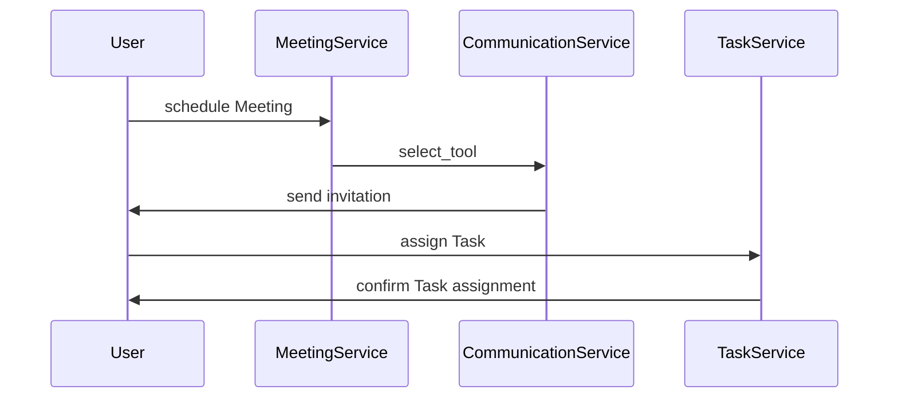
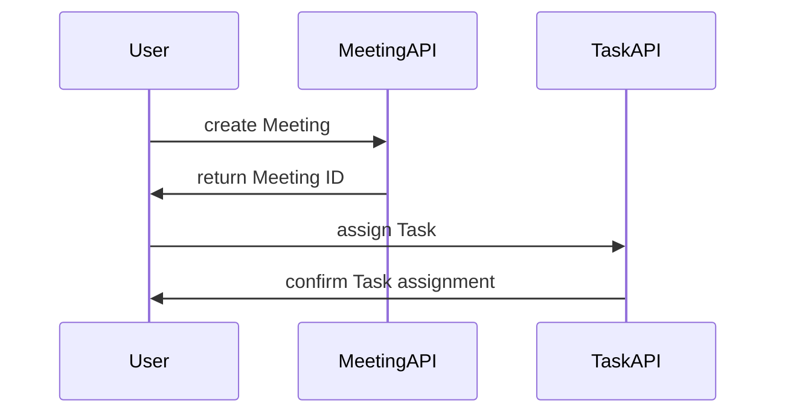

                 

### 第2章: 沟通工具与技术

#### 2.1 远程沟通的重要性

远程项目管理的成功在很大程度上取决于团队之间的有效沟通。随着全球化的加速和互联网技术的普及，远程工作已成为现代企业的一种常态。然而，地理距离、时区差异和文化背景的差异给跨地域团队协作带来了诸多挑战。首先，沟通障碍可能导致信息传递不准确，从而影响项目的进度和质量。其次，团队成员之间缺乏面对面的互动，容易产生误解和冲突。因此，为了克服这些障碍，选择合适的沟通工具和技术至关重要。

#### 2.2 有效的远程沟通策略

**2.2.1 沟通计划与安排**

为了确保远程团队的沟通顺利进行，项目经理需要制定一个明确的沟通计划。这包括确定沟通的目标、频率和方式。以下是几个关键点：

- **确定沟通目标**：明确每次沟通的具体目的，如项目进度更新、决策讨论、问题解决等。
- **设定沟通频率**：根据项目的复杂程度和团队成员的工作性质，合理安排沟通频率。例如，对于高风险项目，可能需要每日或每周多次的沟通。
- **选择沟通方式**：根据沟通内容的重要性和紧急程度，选择合适的沟通方式。常见的方式包括电话会议、视频会议、即时通讯和电子邮件等。

**2.2.2 沟通渠道的选择与应用**

不同的沟通工具适用于不同的场景。以下是几种常用的远程沟通工具：

- **电话与视频会议**：对于需要实时互动的会议，视频会议比电话会议更有优势，因为它可以提供视觉信息，减少误解。Zoom、Microsoft Teams、Google Meet等是常见的选择。
- **即时通讯工具**：适用于快速、简短的交流。例如，Slack、Microsoft Teams、WhatsApp等可以实时发送文本、图片和文件。
- **电子邮件与邮件列表**：适用于正式的、需要记录的沟通。例如，Gmail、Outlook等可以发送详细的报告和文档。

#### 2.3 沟通技巧的提升

**2.3.1 清晰表达**

清晰的表达是有效沟通的关键。以下是一些提升沟通技巧的建议：

- **使用简洁的语言**：避免使用过于复杂或专业的术语，确保团队成员都能理解。
- **明确沟通内容**：在沟通前，准备好讨论的要点和预期结果，确保沟通目的明确。
- **积极倾听**：在对方发言时，保持专注，不要打断，确保理解对方的观点。

**2.3.2 面对面的沟通**

尽管远程沟通在许多情况下是必要的，但面对面的沟通仍然具有独特的优势。如果条件允许，项目经理应尽量安排团队成员进行面对面的会议或访问。这有助于建立信任，减少误解，增强团队凝聚力。

### 总结

远程沟通是跨地域团队协作的核心。有效的沟通策略不仅能够提高项目的成功率，还能增强团队的协作和凝聚力。在制定沟通计划时，需要考虑沟通的目标、频率和方式，并选择合适的工具。同时，提升沟通技巧也是必不可少的。通过这些策略，项目经理可以确保远程团队之间的沟通高效且顺畅。

### 关键概念与联系

为了更好地理解远程沟通的策略和技巧，我们需要了解以下几个关键概念：

1. **沟通障碍**：指由于物理、文化或技术因素导致的沟通不畅。
2. **沟通目标**：指每次沟通所要达成的具体目的。
3. **沟通频率**：指沟通的次数和间隔时间。
4. **沟通方式**：指用于沟通的工具和手段，如电话、视频会议、即时通讯和电子邮件。
5. **沟通技巧**：指提高沟通效果的技能和方法，如清晰表达、积极倾听和面对面的沟通。

以下是核心概念属性的对比表格：

| 概念         | 属性1 | 属性2 | 属性3 |
|--------------|-------|-------|-------|
| 沟通障碍     | 地理距离 | 时区差异 | 文化差异 |
| 沟通目标     | 项目进度更新 | 决策讨论 | 问题解决 |
| 沟通频率     | 每日 | 每周 | 每月 |
| 沟通方式     | 视频会议 | 即时通讯 | 电子邮件 |
| 沟通技巧     | 清晰表达 | 积极倾听 | 面对面沟通 |

此外，我们还可以使用Mermaid绘制一个ER实体关系图，以展示这些概念之间的关系：

```mermaid
erDiagram
  沟通障碍 ||--|{ 沟通目标 }
  沟通障碍 ||--|{ 沟通频率 }
  沟通障碍 ||--|{ 沟通方式 }
  沟通障碍 ||--|{ 沟通技巧 }
```

### 算法原理讲解

在远程项目管理中，算法原理可以帮助我们优化沟通策略。以下是一个简单的算法，用于选择最合适的沟通工具：

```python
def select_communication_tool(context):
    if context["urgency"] == "high":
        if context["visual"] == "required":
            return "video_conference"
        else:
            return "instant_message"
    else:
        if context["record"] == "required":
            return "email"
        else:
            return "phone_call"
```

**算法原理**：

1. 根据沟通的紧急程度（context["urgency"]）选择合适的沟通工具。
2. 如果需要视觉信息（context["visual"]），优先选择视频会议。
3. 如果需要记录（context["record"]），优先选择电子邮件。
4. 否则，根据紧急程度选择即时通讯或电话。

**举例说明**：

假设我们需要与团队成员讨论一个高紧急且需要视觉信息的问题。根据算法，我们应选择视频会议。

```python
context = {
    "urgency": "high",
    "visual": "required",
    "record": "optional"
}

tool = select_communication_tool(context)
print(tool)  # 输出: video_conference
```

### 系统分析与架构设计方案

在远程项目管理中，系统的设计与架构方案同样重要。以下是一个简单的系统分析与架构设计方案：

#### 问题场景介绍

假设我们正在开发一个跨地域的软件项目，需要确保团队成员之间的沟通和信息传递高效。

#### 项目介绍

该项目涉及多个团队成员，他们位于不同的城市和国家。为了确保项目成功，我们需要设计一个高效的沟通系统。

#### 系统功能设计

1. **会议安排**：允许团队成员预定会议，并设置提醒。
2. **即时通讯**：提供实时文本、图片和文件的交流。
3. **文档共享**：允许团队成员共享和协作编辑文档。
4. **任务管理**：跟踪任务进度和分配。

以下是领域模型的Mermaid类图：

```mermaid
classDiagram
    Meeting <<entity>>
    CommunicationTool <<entity>>
    Task <<entity>>

    Meeting o-- CommunicationTool : used_by
    Meeting o-- Task : related_to
    Task o-- CommunicationTool : performed_with
```

#### 系统架构设计

以下是系统的Mermaid架构图：



#### 系统接口设计和系统交互

以下是系统的Mermaid序列图：



### 项目实战

#### 环境安装

为了实现上述系统，我们首先需要安装必要的软件和工具。以下是安装步骤：

1. 安装Python环境。
2. 安装Docker和Docker-Compose，用于容器化部署。
3. 安装数据库（如PostgreSQL）。

#### 系统核心实现源代码

以下是系统核心功能的Python源代码：

```python
# meeting_service.py
from flask import Flask, request, jsonify
import docker

app = Flask(__name__)
client = docker.from_env()

@app.route('/schedule', methods=['POST'])
def schedule_meeting():
    data = request.json
    # 处理会议预约逻辑
    # 调用通信服务选择工具
    # 返回会议信息
    return jsonify({"message": "Meeting scheduled successfully"})

# task_service.py
from flask import Flask, request, jsonify

app = Flask(__name__)

@app.route('/assign', methods=['POST'])
def assign_task():
    data = request.json
    # 处理任务分配逻辑
    # 返回任务信息
    return jsonify({"message": "Task assigned successfully"})

if __name__ == '__main__':
    app.run()
```

#### 代码应用解读与分析

上述代码是系统的核心部分，用于处理会议预约和任务分配。在`meeting_service.py`中，我们接收来自用户的预约请求，并根据请求选择合适的通信工具。在`task_service.py`中，我们接收任务分配请求，并处理任务的分配。

#### 实际案例分析和详细讲解剖析

假设有一个远程项目团队，团队成员分别位于北京、上海和纽约。项目经理需要安排一个会议来讨论项目的进度，并分配新的任务。

1. **会议预约**：

   北京的团队成员A通过API向`MeetingService`发送了一个预约请求：

   ```json
   {
       "date": "2023-10-10",
       "time": "14:00",
       "duration": "60"
   }
   ```

   `MeetingService`根据时区和可用性选择了视频会议工具，并返回了会议信息。

2. **任务分配**：

   上海的团队成员B通过API向`TaskService`发送了一个任务分配请求：

   ```json
   {
       "task": "Design UI",
       "assignee": "B"
   }
   ```

   `TaskService`处理了请求，并将任务分配给了团队成员B。

#### 项目小结

通过上述案例，我们可以看到，远程项目管理系统有效地实现了会议预约和任务分配。这有助于项目经理更好地管理项目进度和团队成员的工作，提高了团队的协作效率。

### 最佳实践 tips、小结、注意事项、拓展阅读等内容

**最佳实践 tips**：

- 确保团队成员熟悉并习惯使用的沟通工具。
- 定期评估沟通策略的有效性，并根据反馈进行调整。
- 鼓励团队成员积极参与沟通，确保信息的及时传递。

**小结**：

远程项目管理中的沟通策略和工具是确保项目成功的关键。通过制定明确的沟通计划、选择合适的工具和提升沟通技巧，项目经理可以克服跨地域团队协作的挑战。

**注意事项**：

- 避免过度依赖单一沟通工具，根据实际需求选择。
- 保持沟通的透明度，确保所有团队成员都能获取到必要的信息。

**拓展阅读**：

- 《远程工作：如何管理分散的团队》（作者：史蒂夫·福布斯）
- 《敏捷项目管理实践指南》（作者：杰瑞·威克斯）
- 《跨文化交流技巧》（作者：凯瑟琳·汉弗莱）

作者：AI天才研究院/AI Genius Institute & 禅与计算机程序设计艺术 /Zen And The Art of Computer Programming

