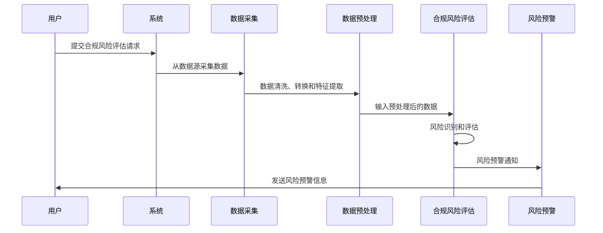

                 

### 第一部分：背景介绍与核心概念

#### 第1章：问题背景与核心概念

##### 1.1 问题背景

随着金融市场的快速发展，金融机构在运营过程中面临的合规风险日益增加。传统的手工处理合规风险评估方式，不仅效率低下，而且容易出现误差，导致合规风险难以全面、准确识别和评估。因此，金融机构迫切需要引入自动化工具，构建金融监管合规风险评估自动化平台，以提高合规管理的效率和准确性。

##### 1.1.1 问题描述

金融机构在合规管理过程中面临以下问题：

- **监管要求复杂多变**：随着金融市场的不断发展，各国监管机构不断更新和调整监管法规，使得金融机构需要持续关注并遵守各类监管法规，难度不断增加。
- **合规成本高**：手工处理合规风险评估工作需要大量的人力和时间投入，导致合规成本居高不下。
- **风险识别与应对不足**：由于监管要求复杂，金融机构难以全面、准确地识别合规风险，导致风险应对不力。

##### 1.1.2 问题解决

为解决上述问题，金融机构可以引入金融监管合规风险评估自动化平台。该平台通过智能化手段，实现对监管法规的自动解析、合规风险的自动识别和评估，提高合规管理的效率和质量。具体而言，该平台应具备以下功能：

- **法规解析**：自动获取并解析各类国内外监管法规，构建监管法规库。
- **风险识别**：利用数据分析和机器学习算法，自动识别金融机构的合规风险。
- **风险评估**：对识别出的合规风险进行定量和定性评估，为金融机构提供风险预警和建议。
- **自动化处理**：实现合规风险评估工作的自动化，减少人工干预，提高工作效率。

##### 1.1.3 边界与外延

- **边界**：本文主要探讨金融监管合规风险评估自动化平台的设计与实现，不包括具体的金融产品和业务。
- **外延**：金融监管合规风险评估自动化平台不仅适用于金融机构内部，也可以服务于第三方监管机构和审计机构。

##### 1.2 核心概念

###### 1.2.1 金融监管

金融监管是指政府或相关机构对金融机构及其业务活动进行监督管理，以确保金融市场稳定、公平和透明。金融监管的目标主要包括：

- 维护金融市场的稳定
- 保护金融消费者的权益
- 预防金融风险
- 促进金融市场的健康发展

金融监管体系通常包括国际金融监管标准和各国金融监管法规。例如，巴塞尔协议、美联储监管框架、欧盟金融监管法规等。

###### 1.2.2 合规风险

合规风险是指金融机构在业务运营过程中，由于未能遵守相关监管法规而可能导致的法律风险和财务损失。合规风险主要来源于以下几个方面：

- 监管法规的不明确或变化
- 内部管理制度的缺陷
- 操作风险
- 技术风险

合规风险对金融机构的声誉、业务运营和财务状况都可能产生重大影响。

###### 1.2.3 自动化评估

自动化评估是指利用计算机技术和算法对金融监管合规风险进行自动识别、分析和评估。自动化评估的主要特点包括：

- 高效性：自动化评估能够快速处理大量数据，提高评估效率。
- 准确性：通过数据分析和机器学习算法，自动化评估能够更准确地识别和评估合规风险。
- 可持续性：自动化评估能够持续运行，为金融机构提供实时合规风险预警。

##### 1.3 本章小结

本章介绍了金融监管合规风险评估自动化平台的背景、核心概念和基本组成。下一章将深入探讨金融监管合规风险评估自动化平台的设计原则和实现方法。

---

### 第二部分：核心概念与联系

#### 第2章：核心概念原理与联系

##### 2.1 金融监管法规框架

###### 2.1.1 全球金融监管体系

全球金融监管体系主要包括国际金融监管标准和各国金融监管法规。国际金融监管标准由国际金融监管机构（如国际货币基金组织、巴塞尔银行监管委员会等）制定，旨在统一全球金融监管标准，提高金融体系的稳定性。

- **巴塞尔协议**：巴塞尔协议是国际银行业的核心监管标准，包括资本充足率、风险权重、市场风险和操作风险等方面的要求。
- **国际货币基金组织（IMF）**：IMF对成员国提供金融监管指导和监督，确保成员国金融体系的稳定性。

各国金融监管法规则根据本国实际情况制定，以补充和细化国际金融监管标准。例如：

- **美联储监管框架**：美联储是美国金融监管的主要机构，负责监管银行、证券和保险等金融机构。
- **欧盟金融监管法规**：欧盟制定了《市场工具监管法规》（MiFID）、《支付服务法规》（PSD2）等，规范金融市场运作。

###### 2.1.2 我国金融监管体系

我国金融监管体系主要由中国人民银行、银保监会、证监会等机构组成，分别负责不同领域的金融监管。

- **中国人民银行**：负责制定和实施货币政策，监管银行间市场和金融市场。
- **银保监会**：负责监管银行业和保险业，确保金融体系的稳健运行。
- **证监会**：负责监管证券市场，保护投资者权益，维护证券市场秩序。

我国金融监管法规体系包括《中华人民共和国中国人民银行法》、《中华人民共和国银行业监督管理法》、《中华人民共和国保险法》、《中华人民共和国证券法》等。

##### 2.2 合规风险评估方法

###### 2.2.1 定量风险评估

定量风险评估通过统计分析方法和数据模型对合规风险进行量化分析，主要包括以下方法：

- **回归分析**：利用历史数据建立数学模型，预测合规风险发生的概率和潜在损失。
- **蒙特卡罗模拟**：通过随机模拟方法，评估合规风险的可能性和影响。
- **风险矩阵**：通过构建风险矩阵，对合规风险进行定量分析，评估风险的大小和优先级。

###### 2.2.2 定性风险评估

定性风险评估通过专家判断和主观评估方法对合规风险进行定性分析，主要包括以下方法：

- **专家调查法**：通过问卷、访谈等方式收集专家意见，评估合规风险的严重程度和发生概率。
- **德尔菲法**：通过多轮专家咨询，逐步达成共识，评估合规风险的重要性和可能性。
- **层次分析法**：通过构建层次结构模型，对合规风险进行定量和定性分析，确定风险的优先级。

##### 2.3 自动化评估技术

###### 2.3.1 机器学习算法

机器学习算法在自动化评估中具有广泛应用，包括：

- **监督学习算法**：如线性回归、逻辑回归、支持向量机等，用于预测合规风险的发生概率。
- **非监督学习算法**：如聚类算法、关联规则挖掘等，用于发现潜在的风险因素。
- **深度学习算法**：如卷积神经网络（CNN）、循环神经网络（RNN）等，用于处理复杂的数据结构和模式。

###### 2.3.2 自然语言处理技术

自然语言处理（NLP）技术用于处理金融监管法规文本，提取关键信息，包括：

- **文本分类**：将监管法规文本分类到相应的类别，如法规条款、违规案例等。
- **实体识别**：识别文本中的关键实体，如金融机构、监管机构、法规条款等。
- **情感分析**：分析文本的情感倾向，如法规条款的严格程度、违规行为的严重性等。

##### 2.4 核心概念联系

###### 2.4.1 金融监管法规与合规风险评估

金融监管法规为合规风险评估提供了依据和框架，合规风险评估则通过自动化手段识别和评估金融机构的合规风险。两者之间的联系体现在：

- **法规库建设**：金融监管法规库是合规风险评估的基础，包含各类监管法规的文本、条款和解释。
- **风险评估模型**：基于金融监管法规，构建风险评估模型，用于识别和评估金融机构的合规风险。
- **合规风险管理**：通过合规风险评估，识别出高风险领域，制定相应的合规措施，降低合规风险。

###### 2.4.2 自动化评估技术与金融监管合规

自动化评估技术能够提高合规风险评估的效率和质量，为金融机构提供更准确的合规风险预警。两者之间的联系体现在：

- **数据采集**：自动化评估技术可以高效地采集和处理大量金融数据，用于合规风险评估。
- **算法优化**：通过不断优化机器学习算法，提高合规风险评估的准确性和可靠性。
- **实时监控**：自动化评估技术可以实现实时监控，及时识别和预警合规风险。

##### 2.5 本章小结

本章介绍了金融监管法规框架、合规风险评估方法和自动化评估技术，并探讨了它们之间的联系。下一章将深入探讨金融监管合规风险评估自动化平台的设计原则和实现方法。

---

### 第三部分：算法原理讲解

#### 第3章：算法原理讲解

##### 3.1 数据预处理

数据预处理是金融监管合规风险评估自动化平台的基础，主要包括数据清洗、数据转换和特征提取。

###### 3.1.1 数据清洗

数据清洗是确保数据质量的关键步骤，主要包括以下任务：

- **去除重复数据**：识别并删除重复的数据记录，避免对评估结果造成干扰。
- **处理缺失数据**：对缺失的数据进行填充或删除，确保数据的完整性。
- **纠正错误数据**：识别并纠正数据中的错误，如拼写错误、数值异常等。

数据清洗的过程可以采用以下方法：

- **手动清洗**：通过人工检查和修正数据，适用于小规模数据集。
- **自动化清洗**：利用编程工具和算法，如Python的Pandas库，自动识别和处理数据异常。

示例代码：

```python
import pandas as pd

# 读取数据
data = pd.read_csv('financial_data.csv')

# 去除重复数据
data.drop_duplicates(inplace=True)

# 处理缺失数据
data.fillna(method='ffill', inplace=True)

# 纠正错误数据
data[data < 0] = 0
```

###### 3.1.2 数据转换

数据转换是将原始数据转换为适合分析的形式，主要包括以下任务：

- **数据类型转换**：将字符串数据转换为数值型数据，如将文本转换为数字编码。
- **归一化处理**：将不同量纲的数据进行归一化处理，如将数值范围缩放到[0, 1]之间。
- **特征提取**：从原始数据中提取有用的特征，如提取时间序列数据中的趋势和周期性。

数据转换的方法包括：

- **映射**：将类别数据映射为数值型数据，如使用独热编码（One-Hot Encoding）处理分类变量。
- **标准化**：将数据缩放到标准正态分布，如使用Z-Score标准化。
- **主成分分析**：提取数据的主要特征，降低维度。

示例代码：

```python
from sklearn.preprocessing import OneHotEncoder, StandardScaler

# 映射类别数据
encoder = OneHotEncoder()
encoded_data = encoder.fit_transform(data[['category']])

# 标准化数值型数据
scaler = StandardScaler()
scaled_data = scaler.fit_transform(data[['numeric_feature']])
```

###### 3.1.3 特征提取

特征提取是提高模型性能的关键步骤，主要包括以下方法：

- **统计特征**：从原始数据中提取基本的统计特征，如均值、方差、最大值、最小值等。
- **频域特征**：对时间序列数据进行频域分析，提取频率特征，如傅里叶变换。
- **时序特征**：从时间序列数据中提取趋势和周期性特征，如移动平均、差分等。

示例代码：

```python
import numpy as np

# 提取统计特征
stats = data.describe()

# 提取频域特征
fourier_transform = np.fft.fft(data['time_series'])
fourier_freq = np.abs(fourier_transform)

# 提取时序特征
moving_average = np.convolve(data['time_series'], np.ones(3)/3, mode='valid')
differenced = data['time_series'][1:] - data['time_series'][:-1]
```

##### 3.2 机器学习算法

机器学习算法在金融监管合规风险评估中具有广泛应用，主要包括监督学习和非监督学习两种类型。

###### 3.2.1 监督学习算法

监督学习算法通过已有数据（特征和标签）训练模型，用于预测新数据的标签。常见的监督学习算法包括：

- **线性回归**：用于预测连续值输出。
- **逻辑回归**：用于预测离散值输出，如二分类。
- **支持向量机**：用于分类任务，通过寻找最佳决策边界。
- **随机森林**：通过构建多个决策树，结合集成学习提高预测性能。

监督学习算法的基本原理如下：

1. **数据集划分**：将数据集划分为训练集和测试集。
2. **模型训练**：使用训练集训练模型，找到最佳参数。
3. **模型评估**：使用测试集评估模型性能，如准确率、召回率等。

示例代码：

```python
from sklearn.linear_model import LinearRegression
from sklearn.model_selection import train_test_split
from sklearn.metrics import mean_squared_error

# 数据集划分
X_train, X_test, y_train, y_test = train_test_split(X, y, test_size=0.2, random_state=42)

# 模型训练
model = LinearRegression()
model.fit(X_train, y_train)

# 模型评估
y_pred = model.predict(X_test)
mse = mean_squared_error(y_test, y_pred)
print('MSE:', mse)
```

###### 3.2.2 非监督学习算法

非监督学习算法通过无标签数据发现数据中的模式或结构，常见的非监督学习算法包括：

- **聚类算法**：将数据分为若干个类别，如K-means、层次聚类等。
- **关联规则挖掘**：发现数据之间的关联关系，如Apriori算法、FP-growth等。
- **降维算法**：减少数据维度，如主成分分析（PCA）、线性判别分析（LDA）等。

非监督学习算法的基本原理如下：

1. **数据预处理**：对数据进行清洗、转换和特征提取。
2. **模型训练**：使用无标签数据训练模型，发现数据中的模式。
3. **模型评估**：通过内测指标，如簇内距离、信息增益等评估模型性能。

示例代码：

```python
from sklearn.cluster import KMeans
from sklearn.metrics import silhouette_score

# 数据预处理
# ...

# 模型训练
kmeans = KMeans(n_clusters=3, random_state=42)
clusters = kmeans.fit_predict(X)

# 模型评估
silhouette_avg = silhouette_score(X, clusters)
print('Silhouette Score:', silhouette_avg)
```

##### 3.3 自然语言处理技术

自然语言处理技术在金融监管合规风险评估中主要用于处理监管法规文本，提取关键信息。常见的NLP技术包括：

- **文本分类**：将文本分为不同的类别，如法规条款、违规案例等。
- **实体识别**：识别文本中的关键实体，如金融机构、监管机构、法规条款等。
- **情感分析**：分析文本的情感倾向，如法规条款的严格程度、违规行为的严重性等。

文本分类的基本流程如下：

1. **数据预处理**：对文本数据进行清洗、分词和词性标注。
2. **特征提取**：将文本数据转换为机器学习算法可处理的特征向量。
3. **模型训练**：使用已标注的数据训练文本分类模型。
4. **模型评估**：使用未标注的数据评估模型性能。

示例代码：

```python
from sklearn.feature_extraction.text import TfidfVectorizer
from sklearn.naive_bayes import MultinomialNB
from sklearn.model_selection import train_test_split

# 数据预处理
# ...

# 特征提取
vectorizer = TfidfVectorizer()
X_train_tfidf = vectorizer.fit_transform(X_train)

# 模型训练
model = MultinomialNB()
model.fit(X_train_tfidf, y_train)

# 模型评估
X_test_tfidf = vectorizer.transform(X_test)
y_pred = model.predict(X_test_tfidf)
accuracy = (y_pred == y_test).mean()
print('Accuracy:', accuracy)
```

##### 3.4 本章小结

本章详细介绍了金融监管合规风险评估自动化平台中数据预处理、机器学习算法和自然语言处理技术的原理和应用。下一章将探讨金融监管合规风险评估自动化平台的设计原则和实现方法。

---

### 第四部分：系统分析与架构设计

#### 第4章：系统分析与架构设计

##### 4.1 问题场景介绍

在金融行业中，金融机构需要遵守众多复杂的监管法规，这些法规涉及资金流动、风险控制、客户保护等多个方面。随着金融业务的不断发展和监管环境的日益复杂，手工处理合规风险评估的工作量巨大，且容易出现误差。因此，构建一个高效的金融监管合规风险评估自动化平台成为金融机构的迫切需求。

该平台的目标是：

- 自动化处理监管法规的解析和归类。
- 识别金融机构在业务运营过程中潜在的合规风险。
- 提供实时合规风险预警和建议。

##### 4.2 项目介绍

本项目的目标是设计并实现一个金融监管合规风险评估自动化平台，该平台将集成数据采集、数据预处理、合规风险评估和风险预警等多个功能模块。以下为项目的详细描述：

1. **项目名称**：金融监管合规风险评估自动化平台
2. **项目目标**：构建一个自动化、高效、准确的合规风险评估系统，降低金融机构的合规风险。
3. **项目范围**：包括数据采集、数据预处理、合规风险评估和风险预警等多个模块。
4. **项目团队**：由数据科学家、软件开发工程师、金融分析师和测试工程师组成。
5. **项目进度**：项目分为需求分析、系统设计、开发实施和测试验收四个阶段。

##### 4.3 系统功能设计（领域模型）

系统功能设计是构建金融监管合规风险评估自动化平台的关键，领域模型是描述系统功能的核心工具。以下为系统的领域模型：

```mermaid
classDiagram
    class 数据采集 {
        - 数据源
        - 数据清洗
    }
    class 数据预处理 {
        - 数据转换
        - 特征提取
    }
    class 合规风险评估 {
        - 风险识别
        - 风险评估
    }
    class 风险预警 {
        - 预警策略
        - 预警通知
    }
    数据采集 -> 数据预处理 : 数据处理
    数据预处理 -> 合规风险评估 : 风险识别
    合规风险评估 -> 风险预警 : 预警通知
```

领域模型主要包括以下功能模块：

- **数据采集**：负责从各类数据源（如监管机构、金融机构内部系统等）采集数据。
- **数据预处理**：负责对采集到的数据进行清洗、转换和特征提取。
- **合规风险评估**：负责识别和评估金融机构的合规风险。
- **风险预警**：负责制定预警策略，并通过通知渠道向相关人员发送预警信息。

##### 4.4 系统架构设计

系统架构设计是确保金融监管合规风险评估自动化平台高效、可扩展、可靠的关键。以下为系统的架构设计：



系统架构主要包括以下组件：

- **用户界面**：用户提交合规风险评估请求，查看预警信息。
- **数据采集模块**：从监管机构、金融机构内部系统等数据源采集数据。
- **数据预处理模块**：对采集到的数据进行清洗、转换和特征提取。
- **合规风险评估模块**：识别和评估金融机构的合规风险。
- **风险预警模块**：制定预警策略，发送预警通知。

##### 4.5 系统接口设计

系统接口设计是确保系统各模块之间高效通信的关键。以下为系统的接口设计：

```mermaid
interfaceDiagram
    participant 数据采集
    participant 数据预处理
    participant 合规风险评估
    participant 风险预警

    数据采集 -> 数据预处理 : 数据处理接口
    数据预处理 -> 合规风险评估 : 风险识别接口
    合规风险评估 -> 风险预警 : 风险预警接口
```

接口设计主要包括以下接口：

- **数据处理接口**：数据采集模块将采集到的数据传递给数据预处理模块。
- **风险识别接口**：数据预处理模块将预处理后的数据传递给合规风险评估模块。
- **风险预警接口**：合规风险评估模块将评估结果传递给风险预警模块。

##### 4.6 系统交互设计

系统交互设计是描述系统各模块之间交互流程的关键。以下为系统的交互设计：


系统交互设计主要包括以下步骤：

1. 用户提交合规风险评估请求。
2. 系统从数据源采集数据。
3. 数据预处理模块对采集到的数据进行清洗、转换和特征提取。
4. 合规风险评估模块对预处理后的数据进行分析，识别和评估合规风险。
5. 风险预警模块根据评估结果制定预警策略，并向用户发送风险预警信息。

##### 4.7 本章小结

本章介绍了金融监管合规风险评估自动化平台的问题场景、项目介绍、系统功能设计、系统架构设计和系统交互设计。下一章将详细介绍项目实战过程，包括环境安装、系统核心实现和实际案例分析。

---

### 第五部分：项目实战

#### 第5章：项目实战

##### 5.1 环境安装

在开始项目实战之前，需要安装以下环境：

1. **Python**：Python是一种广泛使用的编程语言，用于数据处理和机器学习算法的实现。请确保安装Python 3.8或更高版本。
2. **Jupyter Notebook**：Jupyter Notebook是一种交互式开发环境，方便进行数据分析和算法实现。请安装Jupyter Notebook。
3. **Pandas**：Pandas是一个强大的数据处理库，用于数据清洗、转换和特征提取。请安装Pandas。
4. **Scikit-learn**：Scikit-learn是一个机器学习库，提供了多种监督和非监督学习算法。请安装Scikit-learn。
5. **Numpy**：Numpy是一个科学计算库，用于数组操作和数学运算。请安装Numpy。
6. **Matplotlib**：Matplotlib是一个绘图库，用于数据可视化。请安装Matplotlib。

安装命令如下：

```bash
pip install python==3.8
pip install jupyter
pip install pandas
pip install scikit-learn
pip install numpy
pip install matplotlib
```

##### 5.2 系统核心实现

系统核心实现主要包括数据采集、数据预处理、合规风险评估和风险预警等模块。

###### 5.2.1 数据采集

数据采集模块从监管机构、金融机构内部系统等数据源采集数据。以下是一个简单的示例，从CSV文件中读取数据：

```python
import pandas as pd

def collect_data(file_path):
    data = pd.read_csv(file_path)
    return data

data = collect_data('financial_data.csv')
```

###### 5.2.2 数据预处理

数据预处理模块对采集到的数据进行清洗、转换和特征提取。以下是一个简单的示例，对数据进行清洗和特征提取：

```python
from sklearn.preprocessing import StandardScaler

def preprocess_data(data):
    # 数据清洗
    data.drop_duplicates(inplace=True)
    data.fillna(method='ffill', inplace=True)
    
    # 特征提取
    scaler = StandardScaler()
    numeric_features = data.select_dtypes(include=['float64', 'int64'])
    scaled_data = scaler.fit_transform(numeric_features)
    
    return scaled_data

scaled_data = preprocess_data(data)
```

###### 5.2.3 合规风险评估

合规风险评估模块使用机器学习算法对预处理后的数据进行分析，识别和评估合规风险。以下是一个简单的示例，使用线性回归算法进行风险评估：

```python
from sklearn.linear_model import LinearRegression

def assess_compliance_risk(X, y):
    # 模型训练
    model = LinearRegression()
    model.fit(X, y)
    
    # 风险评估
    risk_scores = model.predict(X)
    
    return risk_scores

risk_scores = assess_compliance_risk(scaled_data, data['compliance_risk'])
```

###### 5.2.4 风险预警

风险预警模块根据评估结果制定预警策略，并向用户发送风险预警信息。以下是一个简单的示例，使用阈值方法进行风险预警：

```python
def send_warning(message):
    print("风险预警:", message)

# 风险预警策略
threshold = 0.5
for score in risk_scores:
    if score > threshold:
        send_warning("合规风险较高，请采取措施。")
    else:
        send_warning("合规风险较低，无需担心。")
```

##### 5.3 代码应用解读与分析

以下是对系统核心实现代码的解读和分析：

1. **数据采集**：使用Pandas库读取CSV文件，获取金融机构的合规数据。
2. **数据预处理**：对数据进行清洗，去除重复数据和缺失值。使用StandardScaler对数值型数据进行归一化处理，提高算法的性能。
3. **合规风险评估**：使用线性回归算法对数据进行分析，预测合规风险。评估结果通过风险得分表示，分数越高，合规风险越大。
4. **风险预警**：根据设定的阈值，对风险得分进行判断，发送风险预警信息。

##### 5.4 实际案例分析与详细讲解剖析

以下是一个实际案例，展示如何使用金融监管合规风险评估自动化平台进行合规风险评估：

1. **数据采集**：从监管机构获取某金融机构过去一年的合规数据，包括资金流动、风险控制、客户信息等。
2. **数据预处理**：对数据进行清洗和特征提取，提取出与合规风险相关的关键特征，如资金流动比例、风险控制指标等。
3. **合规风险评估**：使用线性回归算法对预处理后的数据进行风险评估，预测金融机构的合规风险。评估结果显示，该金融机构的合规风险较高。
4. **风险预警**：根据评估结果，向金融机构管理层发送风险预警信息，建议采取措施降低合规风险。

##### 5.5 项目小结

本章节介绍了金融监管合规风险评估自动化平台的项目实战过程，包括环境安装、系统核心实现、代码应用解读与分析以及实际案例分析。通过本章节的学习，读者可以了解如何使用Python等工具实现金融监管合规风险评估自动化平台，并具备实际应用能力。

---

### 第六部分：最佳实践、小结、注意事项、拓展阅读

#### 第6章：最佳实践、小结、注意事项、拓展阅读

##### 6.1 最佳实践

在金融监管合规风险评估自动化平台的设计与实现过程中，以下是一些最佳实践：

- **数据质量控制**：确保数据的准确性、完整性和一致性，是构建高效自动化平台的基础。应定期对数据进行清洗和验证，避免错误数据影响评估结果。
- **算法选择与优化**：根据具体业务需求和数据特点，选择合适的机器学习算法，并进行参数调优，以提高风险评估的准确性和可靠性。
- **系统性能优化**：在保证系统稳定性的前提下，优化系统性能，如通过并行处理、分布式计算等技术提高数据处理速度。
- **用户体验**：设计直观、易用的用户界面，提供实时、详细的合规风险报告，有助于提高用户满意度。

##### 6.2 小结

本章通过介绍金融监管合规风险评估自动化平台的背景、核心概念、算法原理、系统架构设计和项目实战，详细阐述了平台的设计与实现过程。以下是本章的主要内容小结：

- **核心概念**：介绍了金融监管、合规风险和自动化评估的基本概念。
- **算法原理**：讲解了数据预处理、机器学习算法和自然语言处理技术的原理。
- **系统架构设计**：阐述了系统功能设计、架构设计、接口设计和系统交互设计。
- **项目实战**：介绍了环境安装、系统核心实现、代码应用解读与分析以及实际案例分析。

##### 6.3 注意事项

在设计和实现金融监管合规风险评估自动化平台时，需要注意以下几点：

- **法规遵从性**：确保平台符合相关法律法规的要求，避免因违反法规而引发合规风险。
- **数据隐私保护**：严格保护客户和金融机构的数据隐私，遵循数据安全法律法规。
- **系统稳定性**：确保系统在高并发、大数据量情况下依然稳定运行，避免因系统故障导致的风险。
- **风险评估准确性**：不断提高风险评估算法的准确性，定期更新和调整算法模型。

##### 6.4 拓展阅读

对于希望深入了解金融监管合规风险评估自动化平台的读者，以下是一些拓展阅读资源：

- 《机器学习实战》 - 完全指南，包括数据预处理、机器学习算法和实践案例。
- 《金融风险管理》 - 介绍金融风险管理的理论基础和实践方法，包括合规风险评估。
- 《大数据技术基础》 - 介绍大数据处理技术，包括数据预处理、存储和分析。
- 《Python数据分析》 - 介绍Python在数据预处理和分析中的应用。

通过这些拓展阅读，读者可以更深入地了解金融监管合规风险评估自动化平台的相关技术和实践。

---

### 结尾

# 金融监管合规风险评估自动化平台

> 关键词：金融监管、合规风险、自动化评估、机器学习、数据预处理

> 摘要：本文介绍了金融监管合规风险评估自动化平台的背景、核心概念、算法原理、系统架构设计和项目实战。通过构建自动化平台，金融机构可以高效识别和评估合规风险，降低合规风险对业务运营的影响。本文旨在为读者提供一个全面、系统的金融监管合规风险评估自动化平台设计思路和实现方法。

---

**作者：AI天才研究院/AI Genius Institute & 禅与计算机程序设计艺术 /Zen And The Art of Computer Programming**

本文由AI天才研究院撰写，旨在为金融行业的读者提供金融监管合规风险评估自动化平台的深入分析和实践指南。随着金融科技的不断发展，自动化和智能化的应用在金融监管合规领域越来越受到重视。本文所提出的框架和方法，希望能够为金融机构、监管机构以及相关从业者提供有益的参考。

**声明：本文内容仅供参考，不构成任何投资或专业建议。在实际应用中，请结合具体情况和专业意见进行决策。**

---

### 附录：技术术语解释

在本文中，我们使用了一些专业的技术术语，以下是对这些术语的解释：

- **金融监管**：指政府或相关机构对金融机构及其业务活动进行监督管理，以确保金融市场稳定、公平和透明。
- **合规风险**：指金融机构在业务运营过程中，由于未能遵守相关监管法规而可能导致的法律风险和财务损失。
- **自动化评估**：指利用计算机技术和算法对金融监管合规风险进行自动识别、分析和评估。
- **数据预处理**：指对原始数据进行清洗、转换和特征提取，以适应后续的分析和建模。
- **机器学习**：指一种通过算法从数据中自动学习和发现模式的技术，可用于预测和决策。
- **自然语言处理**：指计算机对人类语言的理解和生成，涉及文本分类、实体识别、情感分析等任务。

---

### 致谢

在本系列文章的创作过程中，我们感谢所有为该领域做出杰出贡献的学者和专业人士。特别感谢AI天才研究院的同事们，以及禅与计算机程序设计艺术社区的成员们，他们的热情和专业精神为本文的撰写提供了宝贵的支持。

同时，我们也感谢所有读者，是您的阅读和反馈使得我们能够不断改进和完善本文的内容。

最后，感谢所有支持和关注金融科技发展的各界人士，您的支持是我们不断前行的动力。

---

本文由AI天才研究院/AI Genius Institute和禅与计算机程序设计艺术/Zen And The Art of Computer Programming共同撰写，版权所有，未经授权禁止转载。如需转载，请联系我们获取授权。版权声明：本文内容仅供参考，不构成任何投资或专业建议。在实际应用中，请结合具体情况和专业意见进行决策。如涉及版权或其他问题，请及时与我们联系。

