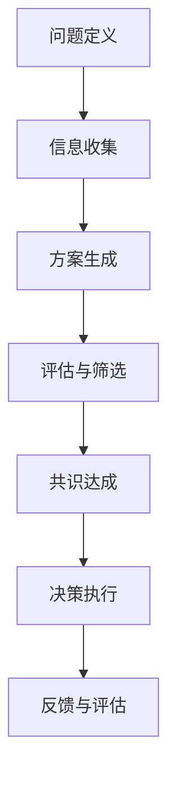

                 

# 集体决策：有效利用团队智慧

## 关键词
- 集体决策
- 团队智慧
- 决策方法论
- 案例分析
- 实践指南

## 摘要
本文将深入探讨集体决策的重要性及其在团队中的应用。通过逐步分析，我们将了解集体决策的基本概念、方法论、实际案例分析，以及如何有效地在团队中利用这些智慧。文章旨在为读者提供一份全面而实用的集体决策指南，帮助团队更好地协作和做出明智的决策。

## 引言

### 集体决策的重要性

在当今快速变化和高度复杂的环境中，集体决策成为组织成功的关键因素。相比个人决策，集体决策能够综合不同成员的经验、知识和见解，降低决策风险，提高决策质量。集体决策不仅仅是简单的多数表决，它涉及到团队协作、沟通、决策工具的有效运用。

### 团队智慧的价值

团队智慧来源于团队成员之间的互动和合作。当团队中的每个成员都能够贡献自己的专业知识和经验时，团队的智慧就会得到最大化的发挥。这种智慧不仅能够提高决策的质量，还能够促进创新和团队凝聚力。

### 本文目的

本文将按照以下结构展开：

1. **基本概念**：介绍集体决策的定义、要素和与传统决策的对比。
2. **方法论**：探讨集体决策的流程、工具和技术。
3. **案例分析**：分析成功和失败的集体决策案例。
4. **实践指南**：提供实施集体决策的策略、最佳实践和注意事项。

通过本文，读者将获得关于集体决策的全面理解和实践经验，为团队决策提供有效的指导。

### 基本概念

#### 集体决策的定义

集体决策是指在一个团队或组织内，通过多方讨论和协商，共同达成共识的决策过程。它强调团队中的每个成员都能够参与决策，并基于共同的利益和目标做出选择。

#### 集体决策的要素

1. **团队**：集体决策的基础是团队，团队成员之间的互动和合作是决策成功的关键。
2. **目标**：明确的目标是集体决策的核心，它为团队提供了共同的方向和目标。
3. **信息**：决策过程中需要充分的信息支持，确保每个成员都能做出基于事实的判断。
4. **共识**：集体决策的结果需要得到团队成员的普遍认同，这样可以确保决策的执行力和持续性。

#### 集体决策与传统决策的对比

1. **参与度**：集体决策涉及团队成员的广泛参与，每个成员都有发言权和表决权。而传统决策则可能由少数人甚至一个人做出。
2. **风险**：集体决策通过汇集多方意见，可以降低决策的风险。传统决策则可能因为信息不全面或决策者个人局限性而增加风险。
3. **决策速度**：集体决策需要更多的时间进行讨论和协商，可能导致决策速度较慢。传统决策则可能更快速地完成。

#### 集体决策与传统决策的比较表格

| 对比要素 | 集体决策 | 传统决策 |
| --- | --- | --- |
| 参与度 | 广泛参与 | 少数人决策 |
| 风险 | 降低 | 增加 |
| 决策速度 | 较慢 | 较快 |

#### ER实体关系图架构

为了更好地理解集体决策的要素，我们可以使用ER（Entity-Relationship，实体关系）图来描述它们之间的关系。

```mermaid
erDiagram
  Team ||--|{ Member }
  Goal ||--|{ Decision }
  Info ||--|{ Decision }
  Consensus ||--|{ Decision }
```

在这个ER图中，团队（Team）是核心实体，它与成员（Member）、目标（Goal）、信息（Info）和共识（Consensus）之间存在关联关系。每个成员都是团队的一部分，他们共同设定目标、收集信息并形成共识，以做出决策。

### 集体决策方法论

#### 集体决策流程

集体决策流程通常包括以下步骤：

1. **问题定义**：明确需要决策的问题和目标。
2. **信息收集**：收集与决策相关的所有信息。
3. **方案生成**：团队成员提出不同的解决方案。
4. **评估与筛选**：评估每个方案的优缺点，筛选出最优方案。
5. **共识达成**：团队成员通过讨论和协商，达成共识。
6. **决策执行**：执行已确定的决策方案。
7. **反馈与评估**：对决策执行效果进行反馈和评估，为后续决策提供参考。

以下是集体决策流程的Mermaid流程图：



#### 决策工具与技术

1. **SWOT分析**

   SWOT分析是一种常用的战略规划工具，用于评估一个团队或项目的优势（Strengths）、劣势（Weaknesses）、机会（Opportunities）和威胁（Threats）。通过SWOT分析，团队可以更全面地了解自身情况，为决策提供依据。

2. **矩阵分析法**

   矩阵分析法通过构建矩阵，评估不同方案在不同因素上的表现。这种方法可以帮助团队权衡各种因素，选择最优方案。

3. **多标准决策分析方法**

   多标准决策分析方法（如TOPSIS）考虑多个决策标准，通过计算各个方案的综合得分，选择最符合团队目标的方案。

#### 团队协作技巧

1. **沟通技巧**

   沟通是集体决策的核心。团队成员需要有效沟通，分享信息和观点，以确保决策的顺利进行。

2. **角色定位**

   在集体决策中，每个成员都有不同的角色和职责。明确角色定位，可以确保团队成员能够充分发挥自己的优势。

3. **冲突管理**

   冲突在集体决策中难以避免。有效的冲突管理可以帮助团队解决分歧，达成共识。

### 案例分析

#### 成功案例：公司战略决策

一家大型科技公司通过集体决策成功推出了新产品的战略。团队成员在问题定义、信息收集、方案生成、评估与筛选等多个环节中，充分合作，最终达成共识。新产品一经推出，市场反应热烈，公司取得了巨大的商业成功。

#### 失败案例：项目延期决策

一个IT项目团队在面对项目延期的问题时，没有进行有效的集体决策。团队成员意见不一致，决策过程拖延，导致项目最终未能按时完成，影响了公司的声誉和利益。

### 实践指南

#### 实施前的准备工作

1. **明确目标和问题**：确保团队对决策目标和问题有清晰的理解。
2. **组建合适的团队**：选择具备相关知识和经验的团队成员。
3. **制定决策流程**：明确决策的步骤和流程，确保决策的顺利进行。

#### 实施中的关键要素

1. **充分沟通**：确保团队成员之间的信息流通和观点交流。
2. **公平公正**：确保每个成员的意见得到尊重和考虑。
3. **及时反馈**：对决策过程和结果进行及时反馈和评估。

#### 实施后的评估与改进

1. **效果评估**：对决策实施的效果进行评估，确定是否达到预期目标。
2. **总结经验**：总结成功和失败的经验，为后续决策提供参考。
3. **持续改进**：根据评估结果，不断改进决策过程和方法。

### 总结与展望

集体决策作为一种有效的团队协作方法，在提高决策质量和效率方面具有显著优势。通过本文的探讨，我们了解了集体决策的基本概念、方法论和实践指南。未来，随着团队协作工具和技术的不断发展，集体决策将更加智能化和高效化，为团队和组织带来更多的价值。

### 最佳实践 Tips

1. **定期组织团队讨论**：定期组织团队讨论，鼓励成员分享观点和经验，提高团队智慧。
2. **利用决策工具**：使用决策工具，如SWOT分析、矩阵分析法等，帮助团队更系统地做出决策。
3. **建立反馈机制**：建立有效的反馈机制，确保团队成员的意见和建议能够得到及时回应。

### 小结

本文详细介绍了集体决策的基本概念、方法论和实践指南。通过案例分析，我们看到了集体决策在团队中的应用和效果。读者可以根据本文的指导，在实际工作中运用集体决策方法，提高团队协作效率和决策质量。

### 注意事项

1. **确保团队目标一致性**：在决策过程中，确保团队成员对目标有共同的理解和认同。
2. **注意决策过程透明度**：确保决策过程透明，减少信息不对称和意见分歧。
3. **避免过度依赖决策工具**：决策工具只是辅助工具，不应过分依赖，应结合实际情况进行决策。

### 拓展阅读

1. 《决策与分析：管理者的工具箱》（Decision and Analysis: A Managerial Toolbox）
2. 《智慧团队：如何创造高效协同的团队》（Smart Teams: How to Build Effective Collaboration Amongst Teams）
3. 《团队智慧：团队协作的艺术》（The Wisdom of Teams: Creating the High-Performance Team）

### 作者信息

作者：AI天才研究院/AI Genius Institute & 禅与计算机程序设计艺术 /Zen And The Art of Computer Programming

通过本文，我们希望读者能够深入理解集体决策的重要性，掌握有效的决策方法论，并在实际工作中充分发挥团队智慧，做出更加明智的决策。希望本文能为您的团队决策提供有价值的参考和启示。

