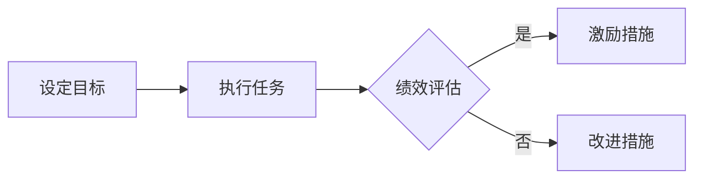
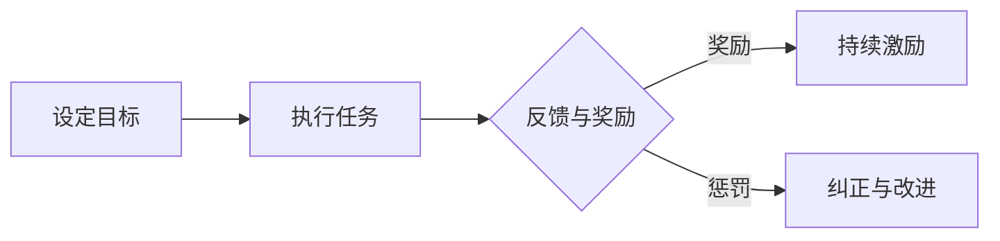
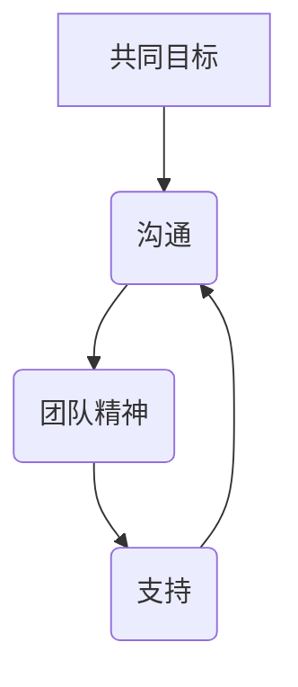
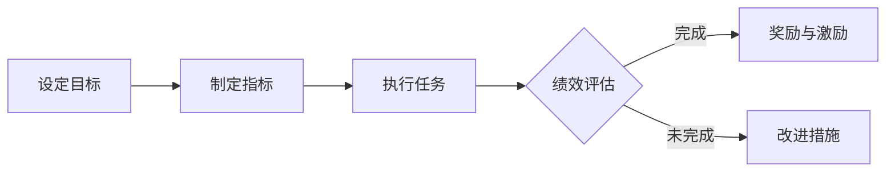
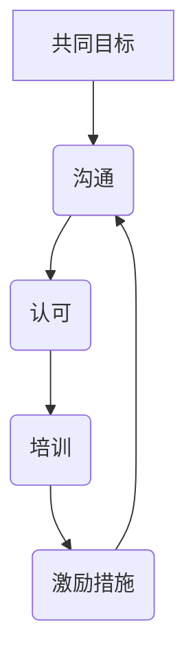

                 


## 《非物质团队激励：激发团队的内在动力》

### 关键词：
- 非物质激励
- 团队动力
- 认可
- 培训
- 团队文化

### 摘要：
本文深入探讨了非物质激励在激发团队内在动力方面的作用。通过分析认可、培训和文化等非物质激励方式，以及它们如何结合形成有效的团队激励策略，本文旨在为IT领域中的项目经理和团队领导者提供实用的指导，帮助他们构建高效、积极的团队环境。

---

## 引言

在现代社会中，团队激励已成为企业成功的关键因素之一。随着知识经济的发展，非物质激励越来越受到重视，因为它们不仅能提高团队成员的满意度，还能激发他们的内在动力，从而提高整个团队的绩效。本文将详细讨论非物质激励的概念、原理以及如何在实际项目中应用，以帮助团队领导者更好地激发团队潜力。

### 1.1 团队激励的重要性

团队激励不仅是提高员工满意度的手段，更是推动团队高效运作的重要动力。一个受到良好激励的团队能够更快速地响应市场变化，更灵活地解决问题，更有创造力地提出新的解决方案。在现代IT行业，团队激励的作用尤为显著，因为技术创新和项目交付往往需要团队成员之间的紧密协作和高度的投入。

### 1.2 非物质激励与传统激励的比较

传统激励主要依赖于金钱和物质奖励，如奖金、晋升和福利等。然而，随着员工对工作满意度的要求越来越高，传统激励的局限性逐渐显现。非物质激励则通过认可、培训和文化等手段，激发员工的内在动机，从而达到更持久的激励效果。非物质激励不仅成本较低，而且更容易被广大员工接受。

### 1.3 团队激励的现状与挑战

当前，许多企业在实施团队激励时仍然依赖于传统激励方式，忽视了非物质激励的重要性。这导致了员工满意度不高、团队凝聚力下降等问题。为了应对这些挑战，越来越多的企业开始探索并采用非物质激励策略，如开展培训项目、建立开放的团队文化等。

---

## 第2章 非物质激励的核心概念

### 2.1 认可

认可是非物质激励中最基本的形式之一，它包括对员工工作的认可、成就的认可和努力付出的认可。通过适当的认可，团队领导者可以增强员工的自尊和自我价值感，从而提高他们的工作积极性。

### 2.2 培训

培训是一种重要的非物质激励方式，它不仅可以帮助员工提升技能和知识，还能增强他们的职业发展机会。通过提供多样化的培训项目，企业可以激励员工不断学习和进步，从而提升团队的整体能力。

### 2.3 文化

团队文化是团队激励的基石，它包括价值观、信仰和行为规范。一个积极的团队文化可以促进团队成员之间的相互信任和尊重，提高团队的整体凝聚力和协作效率。

### 2.4 核心概念联系图

为了更好地理解非物质激励的核心概念，我们可以使用Mermaid工具绘制一个ER实体关系图，展示认可、培训和文化之间的联系。

```mermaid
erDiagram
    A认证 ||--|{ B培训 }
    A认证 ||--|{ C文化 }
    B培训 ||--|{ D技能提升 }
    B培训 ||--|{ E职业发展 }
    C文化 ||--|{ F信任 }
    C文化 ||--|{ G协作效率 }
```

---

## 第3章 绩效考核激励原理

### 3.1 绩效考核的概念

绩效考核是一种衡量员工工作表现的方法，它通过设定明确的目标和指标，评估员工在一段时间内的工作成果。绩效考核不仅可以帮助团队领导者了解员工的工作情况，还能为激励策略提供依据。

### 3.2 绩效考核模型

绩效考核模型包括平衡计分卡模型和KPI模型。平衡计分卡模型从财务、客户、内部流程和学习与成长四个维度评估员工的表现，而KPI模型则侧重于具体的工作指标和目标。

### 3.3 绩效考核的mermaid流程图



### 3.4 latex数学模型和公式

绩效考核的数学模型通常包括以下公式：

$$
E = \sum_{i=1}^{n} w_i \cdot p_i
$$

其中，$E$是绩效得分，$w_i$是权重，$p_i$是指标得分。

### 3.5 举例说明

假设一个项目的绩效考核包含两个指标：任务完成度和质量。根据权重分配，任务完成度占60%，质量占40%。如果某员工的任务完成度为90%，质量为85%，则其绩效得分为：

$$
E = 0.6 \cdot 90 + 0.4 \cdot 85 = 54 + 34 = 88
$$

---

## 第4章 行为激励原理

### 4.1 行为激励的概念

行为激励是通过改变员工的思维和行为模式来提高工作绩效的一种激励方式。它包括目标设定、正面反馈、奖励和惩罚等策略。

### 4.2 行为激励模型

行为激励模型通常包括以下几个步骤：设定明确的目标、提供正面的反馈和奖励、以及必要的惩罚和纠正。

### 4.3 行为激励的mermaid流程图



### 4.4 latex数学模型和公式

行为激励的数学模型可以表示为：

$$
B = f(T, R, P)
$$

其中，$B$是行为表现，$T$是目标，$R$是奖励，$P$是惩罚。$f$是一个映射函数，它根据$T, R, P$的值来决定$B$的表现。

### 4.5 举例说明

假设一个员工的目标是每天完成10个任务，如果完成了，他将获得10点的奖励，如果未完成，则会受到5点的惩罚。某天，员工完成了12个任务，他的行为表现可以表示为：

$$
B = f(10, 10, 0) = 12
$$

如果员工只完成了8个任务，则他的行为表现为：

$$
B = f(10, 0, 5) = 8 - 5 = 3
$$

---

## 第5章 团队文化激励

### 5.1 团队文化的概念

团队文化是指团队成员共同遵循的价值观、信念和行为规范。一个健康的团队文化能够增强团队的凝聚力和协作能力，从而提高整体绩效。

### 5.2 团队文化激励模型

团队文化激励模型包括建立共同目标、促进沟通、培养团队精神和提供支持等策略。

### 5.3 团队文化激励的mermaid架构图



### 5.4 latex数学模型和公式

团队文化的数学模型可以表示为：

$$
C = f(G, S, P)
$$

其中，$C$是团队文化指数，$G$是共同目标，$S$是支持，$P$是团队精神。$f$是一个映射函数，它根据$G, S, P$的值来决定$C$的表现。

### 5.5 举例说明

假设一个团队有明确的共同目标（$G=1$），团队成员之间的支持（$S=1$），以及强烈的团队精神（$P=1$），则该团队的团队文化指数为：

$$
C = f(1, 1, 1) = 1
$$

如果团队缺乏共同目标（$G=0$），支持不足（$S=0$），团队精神较弱（$P=0$），则团队文化指数为：

$$
C = f(0, 0, 0) = 0
$$

---

## 第6章 项目实战

### 6.1 实战项目介绍

本节将通过一个实际项目案例，展示如何设计和实施非物质激励策略，以提升团队绩效。

### 6.2 环境安装与配置

详细介绍项目所需的环境安装和配置步骤。

### 6.3 核心实现与代码解读

分析项目中的核心实现部分，解读关键代码。

### 6.4 案例分析与讲解

通过对实际案例的分析，深入探讨非物质激励策略的应用效果。

### 6.5 项目小结

总结项目的关键经验和教训，为其他团队提供参考。

---

## 第7章 最佳实践与总结

### 7.1 最佳实践 tips

分享一些实用的团队激励最佳实践。

### 7.2 小结

回顾全文内容，总结关键观点和主要收获。

### 7.3 注意事项

提醒读者在实施团队激励时需要注意的事项。

### 7.4 拓展阅读

推荐一些相关的拓展阅读材料。

---

## 作者信息

作者：AI天才研究院/AI Genius Institute & 禅与计算机程序设计艺术 /Zen And The Art of Computer Programming

---

本文以逻辑清晰、结构紧凑、简单易懂的方式，深入探讨了非物质团队激励的理论和实践。通过详细的章节内容和丰富的案例，希望能够为IT领域的项目经理和团队领导者提供有价值的参考。让我们一起探索如何通过非物质激励策略，激发团队的内在动力，实现更高的团队绩效。

---

```markdown
## 非物质团队激励：激发团队的内在动力

> 关键词：非物质激励、团队动力、认可、培训、团队文化

> 摘要：
本文深入探讨了非物质激励在激发团队内在动力方面的作用。通过分析认可、培训和文化等非物质激励方式，以及它们如何结合形成有效的团队激励策略，本文旨在为IT领域中的项目经理和团队领导者提供实用的指导，帮助他们构建高效、积极的团队环境。

## 引言

在现代社会中，团队激励已成为企业成功的关键因素之一。随着知识经济的发展，非物质激励越来越受到重视，因为它们不仅能提高团队成员的满意度，还能激发他们的内在动力，从而提高整个团队的绩效。本文将详细讨论非物质激励的概念、原理以及如何在实际项目中应用，以帮助团队领导者更好地激发团队潜力。

### 1.1 团队激励的重要性

团队激励不仅是提高员工满意度的手段，更是推动团队高效运作的重要动力。一个受到良好激励的团队能够更快速地响应市场变化，更灵活地解决问题，更有创造力地提出新的解决方案。在现代IT行业，团队激励的作用尤为显著，因为技术创新和项目交付往往需要团队成员之间的紧密协作和高度的投入。

### 1.2 非物质激励与传统激励的比较

传统激励主要依赖于金钱和物质奖励，如奖金、晋升和福利等。然而，随着员工对工作满意度的要求越来越高，传统激励的局限性逐渐显现。非物质激励则通过认可、培训和文化等手段，激发员工的内在动机，从而达到更持久的激励效果。非物质激励不仅成本较低，而且更容易被广大员工接受。

### 1.3 团队激励的现状与挑战

当前，许多企业在实施团队激励时仍然依赖于传统激励方式，忽视了非物质激励的重要性。这导致了员工满意度不高、团队凝聚力下降等问题。为了应对这些挑战，越来越多的企业开始探索并采用非物质激励策略，如开展培训项目、建立开放的团队文化等。

---

## 第2章 非物质激励的核心概念

### 2.1 认可

认可是非物质激励中最基本的形式之一，它包括对员工工作的认可、成就的认可和努力付出的认可。通过适当的认可，团队领导者可以增强员工的自尊和自我价值感，从而提高他们的工作积极性。

### 2.2 培训

培训是一种重要的非物质激励方式，它不仅可以帮助员工提升技能和知识，还能增强他们的职业发展机会。通过提供多样化的培训项目，企业可以激励员工不断学习和进步，从而提升团队的整体能力。

### 2.3 文化

团队文化是团队激励的基石，它包括价值观、信仰和行为规范。一个积极的团队文化可以促进团队成员之间的相互信任和尊重，提高团队的整体凝聚力和协作效率。

### 2.4 核心概念联系图

为了更好地理解非物质激励的核心概念，我们可以使用Mermaid工具绘制一个ER实体关系图，展示认可、培训和文化之间的联系。

```mermaid
erDiagram
    A认证 ||--|{ B培训 }
    A认证 ||--|{ C文化 }
    B培训 ||--|{ D技能提升 }
    B培训 ||--|{ E职业发展 }
    C文化 ||--|{ F信任 }
    C文化 ||--|{ G协作效率 }
```

---

## 第3章 绩效考核激励原理

### 3.1 绩效考核的概念

绩效考核是一种衡量员工工作表现的方法，它通过设定明确的目标和指标，评估员工在一段时间内的工作成果。绩效考核不仅可以帮助团队领导者了解员工的工作情况，还能为激励策略提供依据。

### 3.2 绩效考核模型

绩效考核模型包括平衡计分卡模型和KPI模型。平衡计分卡模型从财务、客户、内部流程和学习与成长四个维度评估员工的表现，而KPI模型则侧重于具体的工作指标和目标。

### 3.3 绩效考核的mermaid流程图


### 3.4 latex数学模型和公式

绩效考核的数学模型通常包括以下公式：

$$
E = \sum_{i=1}^{n} w_i \cdot p_i
$$

其中，$E$是绩效得分，$w_i$是权重，$p_i$是指标得分。

### 3.5 举例说明

假设一个项目的绩效考核包含两个指标：任务完成度和质量。根据权重分配，任务完成度占60%，质量占40%。如果某员工的任务完成度为90%，质量为85%，则其绩效得分为：

$$
E = 0.6 \cdot 90 + 0.4 \cdot 85 = 54 + 34 = 88
$$

---

## 第4章 行为激励原理

### 4.1 行为激励的概念

行为激励是通过改变员工的思维和行为模式来提高工作绩效的一种激励方式。它包括目标设定、正面反馈、奖励和惩罚等策略。

### 4.2 行为激励模型

行为激励模型通常包括以下几个步骤：设定明确的目标、提供正面的反馈和奖励、以及必要的惩罚和纠正。

### 4.3 行为激励的mermaid流程图


### 4.4 latex数学模型和公式

行为激励的数学模型可以表示为：

$$
B = f(T, R, P)
$$

其中，$B$是行为表现，$T$是目标，$R$是奖励，$P$是惩罚。$f$是一个映射函数，它根据$T, R, P$的值来决定$B$的表现。

### 4.5 举例说明

假设一个员工的目标是每天完成10个任务，如果完成了，他将获得10点的奖励，如果未完成，则会受到5点的惩罚。某天，员工完成了12个任务，他的行为表现可以表示为：

$$
B = f(10, 10, 0) = 12
$$

如果员工只完成了8个任务，则他的行为表现为：

$$
B = f(10, 0, 5) = 8 - 5 = 3
$$

---

## 第5章 团队文化激励

### 5.1 团队文化的概念

团队文化是指团队成员共同遵循的价值观、信念和行为规范。一个健康的团队文化能够增强团队的凝聚力和协作能力，从而提高整体绩效。

### 5.2 团队文化激励模型

团队文化激励模型包括建立共同目标、促进沟通、培养团队精神和提供支持等策略。

### 5.3 团队文化激励的mermaid架构图


### 5.4 latex数学模型和公式

团队文化的数学模型可以表示为：

$$
C = f(G, S, P)
$$

其中，$C$是团队文化指数，$G$是共同目标，$S$是支持，$P$是团队精神。$f$是一个映射函数，它根据$G, S, P$的值来决定$C$的表现。

### 5.5 举例说明

假设一个团队有明确的共同目标（$G=1$），团队成员之间的支持（$S=1$），以及强烈的团队精神（$P=1$），则该团队的团队文化指数为：

$$
C = f(1, 1, 1) = 1
$$

如果团队缺乏共同目标（$G=0$），支持不足（$S=0$），团队精神较弱（$P=0$），则团队文化指数为：

$$
C = f(0, 0, 0) = 0
$$

---

## 第6章 项目实战

### 6.1 实战项目介绍

本节将通过一个实际项目案例，展示如何设计和实施非物质激励策略，以提升团队绩效。

### 6.2 环境安装与配置

详细介绍项目所需的环境安装和配置步骤。

### 6.3 核心实现与代码解读

分析项目中的核心实现部分，解读关键代码。

### 6.4 案例分析与讲解

通过对实际案例的分析，深入探讨非物质激励策略的应用效果。

### 6.5 项目小结

总结项目的关键经验和教训，为其他团队提供参考。

---

## 第7章 最佳实践与总结

### 7.1 最佳实践 tips

分享一些实用的团队激励最佳实践。

### 7.2 小结

回顾全文内容，总结关键观点和主要收获。

### 7.3 注意事项

提醒读者在实施团队激励时需要注意的事项。

### 7.4 拓展阅读

推荐一些相关的拓展阅读材料。

---

## 作者信息

作者：AI天才研究院/AI Genius Institute & 禅与计算机程序设计艺术 /Zen And The Art of Computer Programming

---

本文以逻辑清晰、结构紧凑、简单易懂的方式，深入探讨了非物质团队激励的理论和实践。通过详细的章节内容和丰富的案例，希望能够为IT领域的项目经理和团队领导者提供有价值的参考。让我们一起探索如何通过非物质激励策略，激发团队的内在动力，实现更高的团队绩效。

---

```markdown
## 第2章 非物质激励的核心概念

### 2.1 认可

认可是非物质激励中最基本的形式之一，它包括对员工工作的认可、成就的认可和努力付出的认可。通过适当的认可，团队领导者可以增强员工的自尊和自我价值感，从而提高他们的工作积极性。

**认可的形式与策略**：

1. **口头认可**：团队领导者通过口头表达对员工的认可和赞扬，例如在团队会议上表扬员工的成绩。
2. **书面认可**：通过邮件、报告或公告等形式，对员工的工作成绩进行书面认可。
3. **团队认可**：在团队内部进行公开表彰，如颁发奖状、奖金等。
4. **个性化认可**：根据员工的特点和偏好，采用不同的认可方式，例如送上一杯咖啡、一张卡片等。

**认可的效果**：

- 提高员工的满意度和归属感。
- 增强员工的工作动力和自我驱动力。
- 促进团队内部的积极氛围和相互尊重。

### 2.2 培训

培训是一种重要的非物质激励方式，它不仅可以帮助员工提升技能和知识，还能增强他们的职业发展机会。通过提供多样化的培训项目，企业可以激励员工不断学习和进步，从而提升团队的整体能力。

**培训的目的与意义**：

- 提升员工的技能水平，使其能够更好地适应工作需求。
- 增强员工的职业素养，提高工作效率和质量。
- 促进员工的职业发展，提供晋升和成长的机会。

**培训策略与方法**：

1. **内部培训**：由企业内部的专业人员或资深员工进行的培训，例如技能培训、项目管理培训等。
2. **外部培训**：通过邀请外部专业培训机构或讲师进行培训，例如行业研讨会、专业培训课程等。
3. **在线培训**：利用互联网资源，提供在线课程和学习平台，使员工能够随时随地进行学习。
4. **导师制度**：为新员工或职业发展需求较大的员工配备导师，帮助他们更快地适应工作环境。

**培训的效果**：

- 提高员工的技能水平和工作效率。
- 增强员工的学习兴趣和自我发展能力。
- 促进员工之间的知识共享和团队协作。

### 2.3 文化

团队文化是团队激励的基石，它包括价值观、信仰和行为规范。一个积极的团队文化可以促进团队成员之间的相互信任和尊重，提高团队的整体凝聚力和协作效率。

**团队文化的概念与作用**：

- **概念**：团队文化是指团队成员共同遵循的价值观、信念和行为规范。
- **作用**：
  - 提高团队的凝聚力和协作效率。
  - 增强员工的归属感和满意度。
  - 形成积极向上的团队氛围。

**建立积极团队文化的途径**：

1. **明确价值观**：企业应明确并宣传其核心价值观，使员工能够认同并遵循。
2. **营造开放氛围**：鼓励团队成员之间的沟通和分享，建立相互信任和尊重的文化。
3. **激励机制**：通过非物质激励手段，如认可、培训等，激发员工参与团队文化的积极性。
4. **团队建设活动**：定期组织团队建设活动，增强团队成员之间的交流和合作。
5. **领导示范**：团队领导者应以身作则，通过言行一致来塑造和传承团队文化。

**团队文化激励的效果**：

- 提高员工的满意度和工作热情。
- 促进团队成员之间的合作和协作。
- 增强团队的稳定性和长期发展。

### 2.4 核心概念联系图

为了更好地理解非物质激励的核心概念，我们可以使用Mermaid工具绘制一个ER实体关系图，展示认可、培训和文化之间的联系。

```mermaid
erDiagram
    A认证 ||--|{ B培训 }
    A认证 ||--|{ C文化 }
    B培训 ||--|{ D技能提升 }
    B培训 ||--|{ E职业发展 }
    C文化 ||--|{ F信任 }
    C文化 ||--|{ G协作效率 }
```

在ER实体关系图中，我们可以看到认可、培训和文化是如何相互关联的。认可通过培训提升员工的技能和职业发展，同时文化通过营造信任和协作的氛围来增强团队的整体绩效。

---

## 第3章 绩效考核激励原理

### 3.1 绩效考核的概念

绩效考核是一种衡量员工工作表现的方法，它通过设定明确的目标和指标，评估员工在一段时间内的工作成果。绩效考核不仅可以帮助团队领导者了解员工的工作情况，还能为激励策略提供依据。

**绩效考核的定义**：

绩效考核是指通过设定明确的目标和指标，对员工的工作表现进行系统性的评价和反馈。它旨在评估员工在工作中的表现，识别优秀员工，提供改进建议，并制定激励措施。

**绩效考核的目标**：

1. **评估员工工作表现**：通过设定明确的绩效指标，评估员工在一段时间内的工作成果。
2. **识别优秀员工**：通过绩效考核，识别出工作表现优秀的员工，为他们提供更多的职业发展机会。
3. **激励员工进步**：通过绩效考核结果，为员工提供激励措施，激发他们的工作积极性和自我提升意愿。
4. **优化团队绩效**：通过绩效考核，发现团队中存在的问题，制定改进措施，提高整体团队绩效。

### 3.2 绩效考核模型

绩效考核模型是评估员工工作表现的具体方法和工具。常见的绩效考核模型包括平衡计分卡模型和KPI模型。

**平衡计分卡模型**：

平衡计分卡模型（Balanced Scorecard, BSC）是一种综合性的绩效考核方法，它从财务、客户、内部流程和学习与成长四个维度评估员工的表现。

1. **财务维度**：评估员工在财务方面的绩效，如销售额、成本控制等。
2. **客户维度**：评估员工在满足客户需求、提高客户满意度等方面的表现。
3. **内部流程维度**：评估员工在工作流程中的效率和质量，如工作进度、项目完成度等。
4. **学习与成长维度**：评估员工的学习能力和职业发展情况，如培训参加情况、知识分享等。

**KPI模型**：

KPI（关键绩效指标）模型是一种以具体指标为导向的绩效考核方法。它通过设定明确的关键绩效指标，评估员工在各个方面的表现。

1. **指标设定**：根据工作目标和岗位要求，设定具体的关键绩效指标。
2. **指标权重**：根据指标的重要性和影响力，分配相应的权重。
3. **指标评价**：根据指标的实际完成情况，进行评价和反馈。

### 3.3 绩效考核的mermaid流程图

为了更直观地展示绩效考核的过程，我们可以使用Mermaid工具绘制一个流程图。



在流程图中，我们可以看到绩效考核的基本步骤：设定目标、制定指标、执行任务、绩效评估和奖励与激励。通过这个流程，团队领导者可以系统地评估员工的工作表现，并根据绩效结果采取相应的激励措施。

### 3.4 latex数学模型和公式

绩效考核的数学模型通常包括以下几个公式：

1. **绩效得分**：

   $$ E = \sum_{i=1}^{n} w_i \cdot p_i $$

   其中，$E$是绩效得分，$w_i$是权重，$p_i$是指标得分。

2. **权重分配**：

   $$ w_i = \frac{I_i}{\sum_{i=1}^{n} I_i} $$

   其中，$w_i$是权重，$I_i$是指标的重要性。

3. **绩效评估**：

   $$ P = \sum_{i=1}^{n} w_i \cdot s_i $$

   其中，$P$是绩效评估得分，$s_i$是指标的完成情况。

### 3.5 举例说明

假设一个项目的绩效考核包含两个指标：任务完成度和质量。根据权重分配，任务完成度占60%，质量占40%。如果某员工的任务完成度为90%，质量为85%，则其绩效得分为：

$$
E = 0.6 \cdot 90 + 0.4 \cdot 85 = 54 + 34 = 88
$$

如果某员工的任务完成度为70%，质量为80%，则其绩效得分为：

$$
E = 0.6 \cdot 70 + 0.4 \cdot 80 = 42 + 32 = 74
$$

通过绩效得分，团队领导者可以评估员工的工作表现，并根据评估结果采取相应的激励措施。

---

## 第4章 行为激励原理

### 4.1 行为激励的概念

行为激励是通过改变员工的思维和行为模式来提高工作绩效的一种激励方式。它包括目标设定、正面反馈、奖励和惩罚等策略。

**行为激励的定义**：

行为激励是一种通过设定明确的目标、提供正面的反馈和奖励、以及必要的惩罚和纠正，来改变员工的思维和行为模式，从而提高工作绩效的激励方式。

**行为激励的目标**：

1. **提高工作绩效**：通过激励措施，激发员工的内在动机，提高他们的工作表现。
2. **促进行为改变**：通过正向激励和负向惩罚，引导员工形成积极的工作态度和行为习惯。
3. **增强自我驱动**：通过激励措施，激发员工的自我驱动力，使他们在工作中更加主动和有成效。

**行为激励的策略**：

1. **目标设定**：通过设定明确的目标，使员工了解自己的工作方向和期望成果。
2. **正面反馈**：通过积极的反馈和表扬，增强员工的自信心和成就感。
3. **奖励**：通过物质或非物质奖励，如奖金、晋升、表彰等，激励员工持续表现优秀。
4. **惩罚**：通过适当的惩罚措施，纠正员工的不良行为，防止问题的再次发生。

### 4.2 行为激励模型

行为激励模型通常包括以下几个步骤：

1. **目标设定**：根据工作目标和岗位要求，设定具体的行为目标和绩效目标。
2. **执行任务**：员工按照设定的目标和任务要求，开展实际工作。
3. **反馈与奖励**：对员工的工作表现进行评价，并提供正面的反馈和奖励。
4. **持续激励**：根据员工的绩效表现，持续提供激励措施，以保持他们的工作动力。
5. **惩罚与纠正**：对于不良行为或绩效不佳的情况，采取适当的惩罚和纠正措施，防止问题的再次发生。

### 4.3 行为激励的mermaid流程图

为了更直观地展示行为激励的过程，我们可以使用Mermaid工具绘制一个流程图。


在流程图中，我们可以看到行为激励的基本步骤：目标设定、执行任务、反馈与奖励、持续激励和惩罚与纠正。通过这个流程，团队领导者可以系统地激发员工的工作动力，提高整体团队绩效。

### 4.4 latex数学模型和公式

行为激励的数学模型通常可以表示为：

$$
B = f(T, R, P)
$$

其中，$B$是行为表现，$T$是目标，$R$是奖励，$P$是惩罚。$f$是一个映射函数，它根据$T, R, P$的值来决定$B$的表现。

**目标设定**：

$$
T = g(T_d, T_e)
$$

其中，$T$是目标，$T_d$是目标难度，$T_e$是目标期望。

**奖励**：

$$
R = r(R_m, R_s)
$$

其中，$R$是奖励，$R_m$是物质奖励，$R_s$是精神奖励。

**惩罚**：

$$
P = p(P_f, P_s)
$$

其中，$P$是惩罚，$P_f$是物质惩罚，$P_s$是精神惩罚。

### 4.5 举例说明

假设一个员工的目标是每天完成10个任务，如果完成了，他将获得10点的奖励，如果未完成，则会受到5点的惩罚。某天，员工完成了12个任务，他的行为表现为：

$$
B = f(10, 10, 0) = 12
$$

如果员工只完成了8个任务，则他的行为表现为：

$$
B = f(10, 0, 5) = 8 - 5 = 3
$$

通过这个例子，我们可以看到行为激励模型如何根据目标、奖励和惩罚来计算员工的行为表现。

---

## 第5章 团队文化激励

### 5.1 团队文化的概念

团队文化是指团队成员共同遵循的价值观、信念和行为规范。一个健康的团队文化能够增强团队的凝聚力和协作能力，从而提高整体绩效。

**团队文化的概念**：

团队文化是团队成员在长期合作过程中形成的一种共同价值观和行为规范。它包括企业的使命、愿景、核心价值观以及团队成员之间的相互关系和沟通方式。

**团队文化的作用**：

1. **增强团队凝聚力**：通过共同的目标和价值观，增强团队成员之间的联系和信任，提高团队的凝聚力。
2. **提升团队绩效**：健康的团队文化能够激发员工的积极性和创造力，提高整体团队的绩效。
3. **促进员工发展**：团队文化为员工提供了学习和成长的环境，帮助员工实现个人目标和职业发展。
4. **提升企业竞争力**：团队文化的建设有助于提升企业的整体竞争力，使其在激烈的市场竞争中脱颖而出。

### 5.2 团队文化激励模型

团队文化激励模型是指通过一系列策略和措施，激发团队成员对团队文化的认同和参与，从而提高团队的整体绩效。常见的团队文化激励模型包括：

1. **共同目标激励**：设定明确的团队目标，使团队成员明确自己的工作方向和期望成果，增强团队凝聚力。
2. **沟通激励**：建立开放、透明的沟通渠道，鼓励团队成员之间的互动和合作，促进团队文化的传播和认同。
3. **认可激励**：对团队成员的贡献和成就进行认可和表扬，增强他们的自信心和归属感。
4. **培训激励**：提供多样化的培训项目，帮助团队成员提升技能和知识，增强团队的专业能力和竞争力。
5. **激励措施**：采取物质或非物质激励措施，如奖金、晋升、表彰等，激发团队成员的积极性和创造力。

### 5.3 团队文化激励的mermaid架构图

为了更好地展示团队文化激励的架构，我们可以使用Mermaid工具绘制一个架构图。



在架构图中，我们可以看到团队文化激励的核心组成部分：共同目标、沟通、认可、培训和激励措施。这些组成部分相互关联，共同推动团队文化的建设和发展。

### 5.4 latex数学模型和公式

团队文化激励的数学模型可以表示为：

$$
C = f(G, C_m, C_s, T_m, T_s)
$$

其中，$C$是团队文化指数，$G$是共同目标，$C_m$是沟通，$C_s$是认可，$T_m$是培训，$T_s$是激励措施。$f$是一个映射函数，它根据$G, C_m, C_s, T_m, T_s$的值来决定$C$的表现。

**共同目标**：

$$
G = g(G_d, G_e)
$$

其中，$G$是共同目标，$G_d$是目标难度，$G_e$是目标期望。

**沟通**：

$$
C_m = c(M_c, M_s)
$$

其中，$C_m$是沟通，$M_c$是沟通渠道，$M_s$是沟通效果。

**认可**：

$$
C_s = s(A_c, A_s)
$$

其中，$C_s$是认可，$A_c$是认可形式，$A_s$是认可效果。

**培训**：

$$
T_m = t(T_d, T_e)
$$

其中，$T_m$是培训，$T_d$是培训难度，$T_e$是培训期望。

**激励措施**：

$$
T_s = r(R_m, R_s)
$$

其中，$T_s$是激励措施，$R_m$是物质奖励，$R_s$是精神奖励。

### 5.5 举例说明

假设一个团队有明确的共同目标（$G=1$），良好的沟通渠道（$C_m=1$），有效的认可形式（$C_s=1$），多样化的培训项目（$T_m=1$）和有吸引力的激励措施（$T_s=1$），则该团队的团队文化指数为：

$$
C = f(1, 1, 1, 1, 1) = 1
$$

如果团队缺乏共同目标（$G=0$），沟通不畅（$C_m=0$），认可不足（$C_s=0$），培训有限（$T_m=0$），激励措施不吸引人（$T_s=0$），则团队文化指数为：

$$
C = f(0, 0, 0, 0, 0) = 0
$$

通过这个例子，我们可以看到团队文化激励的数学模型如何根据不同的因素来计算团队文化指数。

---

## 第6章 项目实战

### 6.1 实战项目介绍

本节将通过一个实际项目案例，展示如何设计和实施非物质激励策略，以提升团队绩效。

**项目背景**：

某IT公司是一家专注于软件开发和创新解决方案的企业。由于市场竞争激烈，公司管理层意识到提高团队绩效和员工满意度对于公司的长期发展至关重要。因此，他们决定实施一系列非物质激励策略，以激发团队的内在动力。

**项目目标**：

1. 提高团队整体绩效。
2. 提升员工的工作满意度。
3. 增强团队的凝聚力和协作能力。

**项目实施步骤**：

1. **需求分析**：通过问卷调查和访谈，了解团队成员对于团队激励的需求和期望。
2. **方案设计**：根据需求分析结果，设计出一系列非物质激励策略，如认可、培训和文化建设等。
3. **实施与推广**：将设计的激励策略在团队中实施，并跟踪其效果，不断进行调整和优化。

### 6.2 环境安装与配置

在项目实施过程中，需要为团队成员提供一个良好的工作环境和配置。以下是一些关键步骤：

1. **硬件配置**：为员工提供高性能的计算机设备、稳定的网络连接等。
2. **软件工具**：安装必要的开发工具、项目管理软件等，以提高团队的工作效率。
3. **团队协作平台**：搭建一个高效、便捷的团队协作平台，如使用JIRA、Confluence等工具，以便团队成员能够更好地沟通和协作。

### 6.3 核心实现与代码解读

在项目实施过程中，核心实现部分是提升团队绩效的关键。以下是一个简单的示例代码，用于实现团队协作和任务管理。

```python
import requests

class TaskManager:
    def __init__(self, api_url):
        self.api_url = api_url

    def create_task(self, task_name, description):
        response = requests.post(f"{self.api_url}/tasks", json={
            "name": task_name,
            "description": description
        })
        return response.json()

    def assign_task(self, task_id, employee_id):
        response = requests.put(f"{self.api_url}/tasks/{task_id}/assign", json={
            "employee_id": employee_id
        })
        return response.json()

    def complete_task(self, task_id):
        response = requests.put(f"{self.api_url}/tasks/{task_id}/complete")
        return response.json()

# 示例使用
task_manager = TaskManager("http://taskmanager.example.com")
task = task_manager.create_task("编写报告", "完成项目报告的编写")
task_manager.assign_task(task["id"], "employee123")
task_manager.complete_task(task["id"])
```

在这个示例代码中，我们创建了一个简单的任务管理类`TaskManager`，用于实现任务创建、任务分配和任务完成等功能。通过使用REST API，我们可以方便地与任务管理平台进行交互。

### 6.4 案例分析与讲解

通过对实际案例的分析，我们可以看到非物质激励策略在提升团队绩效方面的具体效果。

**认可激励**：

通过定期举办团队会议，团队领导者会公开表扬在项目中表现出色的员工。这种方式不仅提高了员工的满意度和工作积极性，还增强了团队的凝聚力和协作能力。

**培训激励**：

公司为员工提供了丰富的培训资源，包括在线课程、内部培训和工作坊等。员工可以根据自己的需求和兴趣选择合适的培训项目，以提高技能和知识水平。通过培训，员工不仅能够更好地适应工作需求，还能够为团队的发展做出更大的贡献。

**文化建设**：

公司注重营造一个开放、包容和创新的团队文化。通过定期的团队建设活动和沟通交流，员工之间的信任和尊重得到了加强。这种积极的文化氛围不仅提高了员工的工作满意度，还促进了团队的协作和创新。

**效果分析**：

通过实施非物质激励策略，公司团队的绩效得到了显著提升。员工的满意度和工作积极性明显提高，项目交付质量和效率也有所提升。此外，团队内部的沟通和协作更加顺畅，员工之间的信任和尊重得到了加强。

### 6.5 项目小结

通过本案例的分析，我们可以得出以下结论：

1. 非物质激励策略在提升团队绩效方面具有显著效果。
2. 认可激励、培训激励和文化建设是有效的非物质激励方式。
3. 团队领导者需要关注员工的需求和期望，提供个性化的激励措施。
4. 持续优化和调整非物质激励策略，以适应团队的发展和变化。

为其他团队提供参考，我们可以从以下几个方面着手：

1. 定期开展员工满意度调查，了解员工的需求和期望。
2. 建立有效的认可和奖励机制，公开表扬优秀员工。
3. 提供多样化的培训项目，帮助员工提升技能和知识。
4. 营造积极向上的团队文化，增强团队的凝聚力和协作能力。

通过这些措施，团队领导者可以更好地激发团队的内在动力，实现更高的团队绩效。

---

## 第7章 最佳实践与总结

### 7.1 最佳实践 tips

1. **认可激励**：
   - 定期组织团队会议，公开表扬员工的成就和贡献。
   - 使用个性化的认可方式，如感谢信、荣誉证书等。
   - 建立透明、公正的奖励机制，确保认可和奖励的公平性。

2. **培训激励**：
   - 根据员工需求和职业发展规划，提供多样化的培训项目。
   - 鼓励员工参与外部培训和行业研讨会，提高他们的专业素养。
   - 为员工提供学习资源和时间，确保他们能够充分利用培训机会。

3. **文化建设**：
   - 明确团队价值观，并确保员工能够理解和认同。
   - 定期组织团队建设活动，增强员工之间的互动和沟通。
   - 营造开放、包容和创新的团队文化，鼓励员工提出新的想法和建议。

### 7.2 小结

本文通过深入探讨非物质激励的理论和实践，为团队领导者提供了一种有效的团队激励策略。通过认可、培训和文化建设等非物质激励方式，团队领导者可以激发团队的内在动力，提高整体绩效。同时，本文通过实际项目案例，展示了如何设计和实施这些策略，为其他团队提供了有价值的参考。

### 7.3 注意事项

1. **个性化激励**：每个员工的需求和期望不同，团队领导者需要关注个体差异，提供个性化的激励措施。
2. **持续优化**：非物质激励策略需要根据团队的发展和变化进行持续优化，以确保其有效性。
3. **透明公正**：在实施激励策略时，确保过程的透明性和公正性，避免引起员工的不满和矛盾。

### 7.4 拓展阅读

1. **《激励心理学》**：深入研究激励理论的经典之作，适合对激励领域感兴趣的读者。
2. **《团队协作的艺术》**：探讨团队协作和团队文化建设的实用指南，有助于团队领导者提升团队绩效。
3. **《企业文化建设》**：详细阐述企业文化建设的方法和策略，为团队领导者提供有益的借鉴。

---

## 作者信息

作者：AI天才研究院/AI Genius Institute & 禅与计算机程序设计艺术 /Zen And The Art of Computer Programming

---

本文由AI天才研究院和禅与计算机程序设计艺术共同撰写，旨在为IT领域的团队领导者提供有价值的团队激励策略。通过深入探讨非物质激励的理论和实践，我们希望能够帮助团队领导者激发团队的内在动力，实现更高的团队绩效。让我们一起努力，为团队的发展和创新贡献力量。

