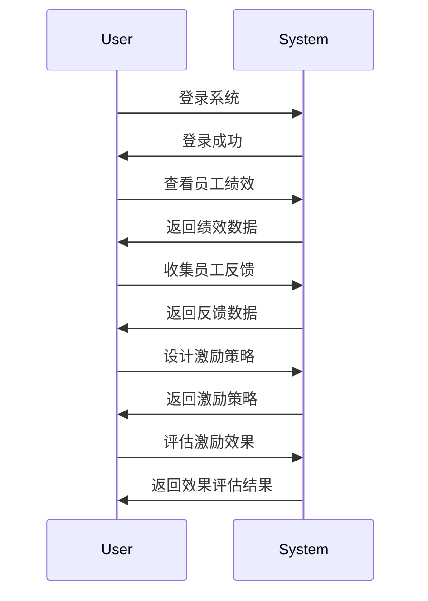
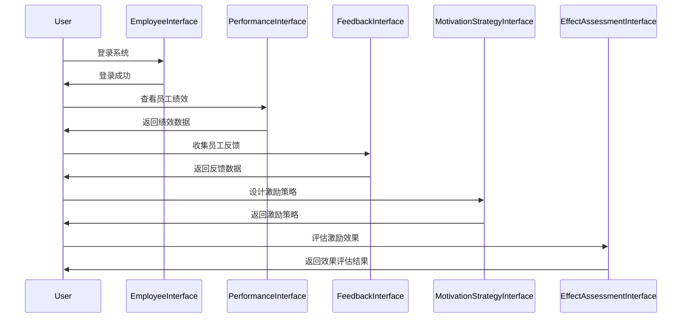

                 

### 《非物质激励：激发内在动力》

#### 关键词：
- 非物质激励
- 内在动力
- 组织文化
- 团队管理
- 个人发展

#### 摘要：
本文将探讨非物质激励在激发内在动力中的作用。通过深入分析非物质激励的理论基础、应用实践和实施策略，本文旨在为读者提供一套系统的、实用的指南，帮助组织和个人在现代化工作环境中更好地利用非物质激励，激发内在动力，提升工作绩效。

## 第一部分：非物质激励的理论基础

### 第1章：激励理论概述

#### 1.1 激励的基本概念

**激励**（Motivation）是心理学中的一个核心概念，指的是驱使个体采取特定行为以达到某种目标的心理过程。激励可以分为内在激励和外在激励两种基本类型。

- **内在激励**（Intrinsic Motivation）：个体从行为本身获得的满足感，如兴趣、乐趣、成就感等。
- **外在激励**（Extrinsic Motivation）：个体因外部因素而采取行为，如奖励、惩罚、社会认可等。

**激励理论**（Motivation Theories）是研究激励现象的理论体系，主要包括以下几种：

- **马斯洛需求层次理论**（Maslow's Hierarchy of Needs）：将人的需求分为生理、安全、社交、尊重和自我实现五个层次。
- **赫兹伯格双因素理论**（Herzberg's Two-Factor Theory）：将工作环境因素分为保健因素和激励因素，前者影响员工的满意度，后者影响员工的积极性。
- **目标设定理论**（Goal-Setting Theory）：强调设定具体、可实现的个人目标对激励的重要性。
- **自我决定理论**（Self-Determination Theory）：提出个体在自由、自主和胜任感的环境中更容易实现内在动机。

#### 1.2 传统的激励方法与局限

传统激励方法主要依赖于外在激励，包括薪酬、晋升、奖励等。这些方法在一定程度上可以提升员工的工作表现，但存在以下局限：

- **依赖性过高**：员工对薪酬和奖励产生依赖，导致内在动机的减弱。
- **短期效应**：奖励和晋升等激励措施往往只能产生短期效果，难以长期维持员工的积极性和创造力。
- **成本高**：传统激励方法往往需要大量资金支持，对企业成本造成压力。

#### 1.3 非物质激励的兴起

随着社会的进步和工作环境的变化，传统激励方法逐渐暴露出其局限性。为此，越来越多的组织开始关注**非物质激励**（Intrinsic Motivation），即通过激发员工的内在动机来提升工作绩效。

非物质激励包括以下几种类型：

- **工作自主性**：给予员工更多的决策权和自主性，让员工在工作中有更多自我实现的机会。
- **认可与赞赏**：通过公开认可员工的贡献和成就，增强员工的自我价值感。
- **培训与成长**：为员工提供持续的学习和发展机会，提升其职业技能和职业素养。
- **工作环境**：营造良好的工作氛围，提供舒适的工作条件和团队协作环境。

非物质激励不仅能够激发员工的内在动力，还能提高员工的工作满意度和忠诚度，从而对组织的长期发展产生积极影响。

## 第二部分：非物质激励的应用实践

### 第2章：非物质激励的核心概念

#### 2.1 非物质激励的定义与类型

**非物质激励**（Non-Monetary Incentive）是指不依赖于物质奖励的激励方式，主要通过满足员工的内在需求来激发其工作积极性。非物质激励的类型包括：

- **工作自主性**：赋予员工更多的自由度，让他们在工作中有更多的决策权和自主性。
- **职业发展**：为员工提供职业发展的机会，包括培训、晋升等。
- **社会认可**：通过表彰、奖励等方式，提升员工的社会地位和认可度。
- **工作生活平衡**：提供灵活的工作安排，帮助员工实现工作与生活的平衡。
- **工作环境**：营造一个积极、和谐的工作氛围，提升员工的工作满意度。

#### 2.2 非物质激励的属性特征

非物质激励具有以下属性特征：

- **内在性**：非物质激励主要激发员工的内在动机，而非外在的物质奖励。
- **持续性**：非物质激励能够长期维持员工的工作积极性和创造力，比传统激励方法更具持久性。
- **成本效益**：非物质激励通常成本较低，且能够带来更高的绩效回报。
- **多样性**：非物质激励形式多样，可以根据员工的需求和组织的实际情况进行灵活调整。

#### 2.3 非物质激励与传统激励的比较

**传统激励**（Extrinsic Motivation）主要依赖于物质奖励，如薪酬、晋升、奖金等，其特点如下：

- **依赖性强**：员工对物质奖励产生依赖，内在动机相对较弱。
- **短期效应**：物质奖励往往只能产生短期激励作用，难以长期维持员工的工作积极性。
- **成本高**：物质奖励需要大量资金支持，对企业成本造成压力。

**非物质激励**（Intrinsic Motivation）则具有以下优点：

- **内在性**：激发员工的内在动机，提高工作满意度和忠诚度。
- **持续性**：能够长期维持员工的工作积极性和创造力。
- **成本效益**：成本较低，且能够带来更高的绩效回报。

### 第3章：内在动力的概念与作用

#### 3.1 内在动力的定义

**内在动力**（Intrinsic Motivation）是指个体因自身兴趣、好奇心、成就感等内在因素而采取行动的心理状态。与外在动力（Extrinsic Motivation）不同，内在动力不依赖于外部奖励或惩罚，而是源于个体内心的需求。

#### 3.2 内在动力与外在动机的差异

**内在动力**（Intrinsic Motivation）与**外在动机**（Extrinsic Motivation）的主要区别在于：

- **动机来源**：内在动力源于个体内心的需求，如兴趣、乐趣、成就感等；外在动机则源于外部奖励或惩罚。
- **稳定性**：内在动力相对稳定，不易受到外部因素干扰；外在动机则可能因外部奖励或惩罚的变化而波动。
- **行为持续**：内在动力驱动的行为更具持续性和自主性；外在动机驱动的行为往往具有短期性和被动性。

#### 3.3 内在动力对工作绩效的影响

内在动力对工作绩效具有显著的影响，具体表现在以下几个方面：

- **工作满意度**：拥有较高内在动力的员工通常对工作更满意，更愿意投入时间和精力。
- **创造力**：内在动力能够激发员工的创造力，促使他们提出创新性解决方案。
- **工作绩效**：内在动力驱动的员工通常能够实现更高的工作绩效，为企业创造更多价值。
- **组织忠诚度**：内在动力使员工对组织产生更强的忠诚度，降低离职率。

## 第三部分：非物质激励的有效实施

### 第4章：组织文化中的非物质激励

#### 4.1 组织文化的构建

组织文化是组织内部的共同价值观、信念和行为规范，对员工的行为和态度产生深远影响。构建积极、健康的组织文化是实施非物质激励的基础。

- **价值观传播**：组织应明确并传播核心价值观，让员工认同并践行。
- **领导力示范**：领导层应通过自身行为树立榜样，推动组织文化的建设。
- **沟通与反馈**：组织应建立有效的沟通渠道，鼓励员工表达意见和建议，并给予及时反馈。

#### 4.2 非物质激励在组织文化中的角色

非物质激励在组织文化中扮演着重要角色，能够促进组织文化的形成和发展。

- **增强凝聚力**：非物质激励能够增强员工之间的联系，提升团队的凝聚力。
- **塑造共同目标**：通过非物质激励，组织能够引导员工共同追求组织目标，形成共同愿景。
- **激发创新意识**：非物质激励能够激发员工的创新意识，推动组织不断进步。

#### 4.3 非物质激励与组织绩效的关系

非物质激励对组织绩效具有显著的影响。

- **提升员工满意度**：非物质激励能够提高员工的工作满意度和幸福感，降低员工流失率。
- **增强团队协作**：非物质激励能够促进团队协作，提升团队的整体绩效。
- **提升创新能力和竞争力**：非物质激励能够激发员工的创新意识，提升组织的创新能力和市场竞争力。

### 第5章：团队管理中的非物质激励

#### 5.1 团队管理的核心要素

团队管理是指通过一系列策略和措施，有效组织和管理团队，实现团队目标的过程。团队管理的核心要素包括：

- **目标设定**：明确团队的目标，确保团队成员对目标有清晰的认识。
- **沟通与协作**：建立有效的沟通渠道，促进团队成员之间的协作。
- **激励与反馈**：运用合适的激励方法，激发团队成员的内在动力。
- **领导力**：领导者应具备良好的领导能力，引导团队成员实现目标。

#### 5.2 非物质激励在团队管理中的应用

非物质激励在团队管理中的应用主要包括以下几个方面：

- **工作自主性**：赋予团队成员更多的决策权和自主性，让他们在工作中发挥更大的作用。
- **认可与赞赏**：及时认可团队成员的贡献和成就，增强他们的自我价值感。
- **培训与发展**：为团队成员提供培训和发展机会，提升他们的技能和职业素养。
- **团队文化建设**：营造积极、和谐的工作氛围，增强团队的凝聚力。

#### 5.3 非物质激励对团队动力的影响

非物质激励能够有效激发团队动力，提升团队整体绩效。

- **增强团队凝聚力**：非物质激励能够增强团队成员之间的联系，提升团队的凝聚力。
- **激发创新意识**：非物质激励能够激发团队成员的创新意识，推动团队不断进步。
- **提升团队协作效率**：非物质激励能够促进团队成员之间的协作，提升团队的整体效率。

### 第6章：个人发展中的非物质激励

#### 6.1 个人发展的需求分析

个人发展是指个体在职业、技能、人格等方面不断成长和提升的过程。个人发展的需求分析包括以下几个方面：

- **职业规划**：明确个人的职业目标和发展路径。
- **技能提升**：了解个人技能的短板，制定相应的提升计划。
- **人格成长**：培养积极、健康的人格特质，提升自身素质。

#### 6.2 非物质激励在个人发展中的应用

非物质激励在个人发展中具有重要作用，能够激发个人的内在动力，促进个人成长。

- **职业发展**：通过提供职业发展机会，帮助个人实现职业目标。
- **技能提升**：通过提供培训和发展机会，提升个人的技能水平。
- **人格成长**：通过认可和赞赏，激发个人的人格成长。

#### 6.3 非物质激励对个人成长的影响

非物质激励对个人成长具有积极影响，能够提升个人的工作满意度和职业成就感。

- **提升自信心**：非物质激励能够增强个人的自信心，提升自我价值感。
- **激发创造力**：非物质激励能够激发个人的创造力，推动个人不断突破自我。
- **提升工作满意度**：非物质激励能够提高个人的工作满意度，增强对工作的热爱。

## 第四部分：非物质激励的有效实施

### 第7章：非物质激励策略设计

#### 7.1 非物质激励策略的原则

设计有效的非物质激励策略需要遵循以下原则：

- **个性化**：针对不同员工的个性特点和需求，制定个性化的激励措施。
- **持续性**：激励措施应具有持续性，能够长期激发员工的内在动力。
- **公平性**：激励措施应公平合理，避免引起员工的不满和矛盾。
- **灵活性**：激励措施应具有灵活性，能够根据实际情况进行调整。

#### 7.2 非物质激励策略的设计过程

设计有效的非物质激励策略包括以下步骤：

- **需求分析**：了解员工的内在需求和期望。
- **目标设定**：明确激励的目标和预期效果。
- **方案制定**：制定具体的激励措施和实施计划。
- **评估与调整**：对激励策略的实施效果进行评估，并根据评估结果进行调整。

#### 7.3 非物质激励策略的实施技巧

实施有效的非物质激励策略需要注意以下几点：

- **沟通与宣传**：确保激励措施被全体员工了解和认同。
- **领导示范**：领导者应通过自身行为树立榜样，推动激励策略的实施。
- **持续跟进**：对激励策略的实施过程进行持续跟进，确保达到预期效果。
- **反馈与改进**：及时收集员工反馈，对激励策略进行调整和改进。

### 第8章：非物质激励的实施效果评估

#### 8.1 实施效果评估的重要性

实施效果评估是确保非物质激励策略有效性的关键步骤。通过评估，组织可以了解激励措施的实际效果，为后续改进提供依据。

#### 8.2 评估非物质激励效果的方法

评估非物质激励效果的方法包括以下几种：

- **员工满意度调查**：通过问卷调查了解员工对激励措施的感受和满意度。
- **绩效评估**：对比激励措施实施前后的绩效数据，评估激励措施对工作绩效的影响。
- **员工留存率**：关注激励措施实施后员工的离职情况，评估激励措施对员工忠诚度的影响。
- **创新能力评估**：评估激励措施对员工创新意识和创新能力的影响。

#### 8.3 针对评估结果的调整策略

根据评估结果，组织可以采取以下调整策略：

- **优化激励措施**：对评估中发现的问题进行优化，提升激励措施的有效性。
- **改进沟通渠道**：加强员工与管理层之间的沟通，确保激励措施被全体员工理解和认同。
- **加强领导力培训**：提高领导者的激励能力，确保激励策略得到有效执行。
- **持续跟进与反馈**：对激励策略的实施过程进行持续跟进，确保达到预期效果。

### 第9章：案例研究与最佳实践

#### 9.1 案例研究介绍

本章节将通过具体案例研究，探讨不同组织和团队在实施非物质激励策略方面的成功经验和最佳实践。

#### 9.2 案例中的非物质激励策略

案例研究中的非物质激励策略包括：

- **工作自主性**：给予员工更多的决策权和自主性，提高工作满意度。
- **认可与赞赏**：通过公开表彰和奖励，增强员工的自我价值感。
- **职业发展**：为员工提供培训和发展机会，提升职业素养。
- **团队文化建设**：营造积极、和谐的工作氛围，增强团队凝聚力。

#### 9.3 案例的启示与借鉴

通过案例研究，我们可以得出以下启示与借鉴：

- **个性化激励**：根据员工的需求和特点，制定个性化的激励措施。
- **持续跟进**：对激励措施的实施过程进行持续跟进，确保达到预期效果。
- **领导示范**：领导者应通过自身行为树立榜样，推动激励策略的实施。
- **员工参与**：鼓励员工参与激励措施的制定和评估，提高员工的主观能动性。

### 第10章：总结与展望

#### 10.1 非物质激励的总结

非物质激励在激发内在动力、提升工作绩效和促进组织发展方面具有重要作用。通过满足员工的内在需求，非物质激励能够提高员工的工作满意度和忠诚度，为企业创造更多价值。

#### 10.2 未来研究的方向

未来的研究可以从以下几个方面展开：

- **跨文化比较**：研究不同文化背景下非物质激励的效果和适用性。
- **长期效应**：探讨非物质激励对员工长期工作绩效的影响。
- **技术与非物质激励的结合**：研究如何利用现代技术手段，提升非物质激励的效果。

#### 10.3 对组织和个人的启示

对于组织，非物质激励策略的实施能够提升员工的内在动力和工作绩效，促进组织的发展。对于个人，通过积极参与和适应非物质激励，员工可以更好地实现个人成长和发展。

本文对非物质激励进行了全面深入的探讨，旨在为读者提供一套系统的、实用的指南。通过学习和借鉴本文的内容，组织和个人可以更好地利用非物质激励，激发内在动力，实现共同发展。

## 附录：推荐阅读

1. **《驱动力：激励人心的心理学》** - 丹尼尔·平克（Daniel Pink）
   本书详细阐述了激励心理学的基本原理，对传统激励方法提出了挑战，并提出了新的激励理念。

2. **《第五项修炼：学习型组织的艺术与实务》** - 彼得·圣吉（Peter Senge）
   本书介绍了学习型组织的核心概念和建设方法，对组织文化和团队管理提供了深刻的见解。

3. **《哈佛管理学经典：激励与奖励》** - 约翰·弗里斯比（John P. Fraser）
   本书从管理学角度探讨了激励与奖励的理论和实践，对组织的激励机制设计提供了实用的指导。

4. **《创新者的思考方式》** - 克里斯·贝利（Chris Bailey）
   本书通过探讨创新思维的方法和技巧，帮助读者培养创新意识，提升创新能力。

5. **《五项管理技能：激发团队的创造力》** - 约翰·惠特默（John Whitmore）
   本书介绍了激发团队创造力的五项管理技能，为团队管理提供了实用的策略和方法。

作者：AI天才研究院/AI Genius Institute & 禅与计算机程序设计艺术 /Zen And The Art of Computer Programming

---

### 《非物质激励：激发内在动力》目录大纲

#### 第一部分：非物质激励的理论基础

**第1章：激励理论概述**

1.1 激励的基本概念  
1.2 传统的激励方法与局限  
1.3 非物质激励的兴起

**第2章：非物质激励的核心概念**

2.1 非物质激励的定义与类型  
2.2 非物质激励的属性特征  
2.3 非物质激励与传统激励的比较

**第3章：内在动力的概念与作用**

3.1 内在动力的定义  
3.2 内在动力与外在动机的差异  
3.3 内在动力对工作绩效的影响

#### 第二部分：非物质激励的应用实践

**第4章：组织文化中的非物质激励**

4.1 组织文化的构建  
4.2 非物质激励在组织文化中的角色  
4.3 非物质激励与组织绩效的关系

**第5章：团队管理中的非物质激励**

5.1 团队管理的核心要素  
5.2 非物质激励在团队管理中的应用  
5.3 非物质激励对团队动力的影响

**第6章：个人发展中的非物质激励**

6.1 个人发展的需求分析  
6.2 非物质激励在个人发展中的应用  
6.3 非物质激励对个人成长的影响

#### 第三部分：非物质激励的有效实施

**第7章：非物质激励策略设计**

7.1 非物质激励策略的原则  
7.2 非物质激励策略的设计过程  
7.3 非物质激励策略的实施技巧

**第8章：非物质激励的实施效果评估**

8.1 实施效果评估的重要性  
8.2 评估非物质激励效果的方法  
8.3 针对评估结果的调整策略

**第9章：案例研究与最佳实践**

9.1 案例研究介绍  
9.2 案例中的非物质激励策略  
9.3 案例的启示与借鉴

**第10章：总结与展望**

10.1 非物质激励的总结  
10.2 未来研究的方向  
10.3 对组织和个人的启示

---

**核心概念与联系**

#### 非物质激励的属性特征

| 特征 | 描述 |
| --- | --- |
| **内在性** | 非物质激励主要激发员工的内在动机，而非外在的物质奖励。 |
| **持续性** | 非物质激励能够长期维持员工的工作积极性和创造力。 |
| **成本效益** | 非物质激励通常成本较低，且能够带来更高的绩效回报。 |
| **多样性** | 非物质激励形式多样，可以根据员工的需求和组织的实际情况进行灵活调整。 |

#### 内在动力与外在动机的差异

| 差异 | 描述 |
| --- | --- |
| **动机来源** | 内在动力源于个体内心的需求，如兴趣、乐趣、成就感等；外在动机则源于外部奖励或惩罚。 |
| **稳定性** | 内在动力相对稳定，不易受到外部因素干扰；外在动机则可能因外部奖励或惩罚的变化而波动。 |
| **行为持续** | 内在动力驱动的行为更具持续性和自主性；外在动机驱动的行为往往具有短期性和被动性。 |

#### ER实体关系图架构

```mermaid
erDiagram
  Employee ||--|{ Performance }|--| Supervisor
  Employee ||--|{ Feedback }|--| Manager
  Performance ||--|{ Goal }|--| Employee
  Feedback ||--|{ Rating }|--| Employee
```

---

**算法原理讲解**

在本章节中，我们将探讨如何通过非物质激励策略来提升员工的工作满意度和绩效。以下是一个简化的算法框架，用于设计非物质激励策略：

```python
# 非物质激励策略算法框架

def motivate_employee(employee, performance, feedback):
    """
    根据员工的绩效和反馈，制定非物质激励策略。
    
    :param employee: 员工人对象
    :param performance: 员工的绩效对象
    :param feedback: 员工的反馈对象
    :return: 非物质激励策略
    """
    
    # 分析绩效和反馈
    performance_analysis = analyze_performance(performance)
    feedback_analysis = analyze_feedback(feedback)
    
    # 设计激励策略
    motivation_strategy = design_motivation_strategy(employee, performance_analysis, feedback_analysis)
    
    # 实施激励策略
    implement_motivation_strategy(employee, motivation_strategy)
    
    return motivation_strategy

def analyze_performance(performance):
    """
    分析员工的绩效数据。
    
    :param performance: 员工的绩效对象
    :return: 绩效分析结果
    """
    # 这里可以包括绩效指标的计算、趋势分析等
    performance_result = {
        'target_met': performance.target_met,
        'improvement': performance.improvement,
        'innovation': performance.innovation
    }
    return performance_result

def analyze_feedback(feedback):
    """
    分析员工的反馈数据。
    
    :param feedback: 员工的反馈对象
    :return: 反馈分析结果
    """
    # 这里可以包括反馈的质量、频率、内容等
    feedback_result = {
        'suggestions': feedback.suggestions,
        'complaints': feedback.complaints,
        'satisfaction': feedback.satisfaction
    }
    return feedback_result

def design_motivation_strategy(employee, performance_analysis, feedback_analysis):
    """
    根据绩效和反馈分析，设计非物质激励策略。
    
    :param employee: 员工人对象
    :param performance_analysis: 绩效分析结果
    :param feedback_analysis: 反馈分析结果
    :return: 非物质激励策略
    """
    # 这里可以根据分析结果，设计个性化的激励策略
    motivation_strategy = {
        'autonomy': determine_autonomy(employee, performance_analysis),
        'recognition': determine_recognition(employee, feedback_analysis),
        'development': determine_development(employee, performance_analysis),
        'work_environment': determine_work_environment(employee)
    }
    return motivation_strategy

def implement_motivation_strategy(employee, motivation_strategy):
    """
    实施非物质激励策略。
    
    :param employee: 员工人对象
    :param motivation_strategy: 非物质激励策略
    """
    # 这里可以包括具体的激励措施实施，如工作安排调整、公开表彰等
    pass

# 示例：应用算法框架
employee = Employee()
performance = Performance()
feedback = Feedback()

motivation_strategy = motivate_employee(employee, performance, feedback)
print(motivation_strategy)
```

#### 算法原理详细讲解

1. **绩效分析（Performance Analysis）**：
   绩效分析是制定非物质激励策略的基础。通过分析员工的绩效数据，我们可以了解员工的工作表现和潜力。绩效分析包括以下几个方面：
   
   - **目标达成度（Target Met）**：衡量员工是否达到了设定的目标。
   - **改进空间（Improvement）**：评估员工在哪些方面还有改进空间。
   - **创新能力（Innovation）**：分析员工在工作中的创新程度。

2. **反馈分析（Feedback Analysis）**：
   反馈分析有助于了解员工在工作中的感受和需求。通过分析员工的反馈数据，我们可以了解员工的满意度、建议和投诉。反馈分析包括以下几个方面：
   
   - **建议（Suggestions）**：了解员工对工作的意见和建议。
   - **投诉（Complaints）**：分析员工在工作中的不满和问题。
   - **满意度（Satisfaction）**：评估员工的工作满意度。

3. **非物质激励策略设计（Design Motivation Strategy）**：
   根据绩效分析和反馈分析的结果，设计个性化的非物质激励策略。非物质激励策略包括以下几个方面：
   
   - **工作自主性（Autonomy）**：根据员工的工作表现，适当提高员工的决策权和自主性，增强他们的内在动力。
   - **认可与赞赏（Recognition）**：通过公开表彰和奖励，认可员工的贡献和成就，提升他们的自我价值感。
   - **职业发展（Development）**：为员工提供培训和发展机会，帮助他们提升技能和职业素养。
   - **工作环境（Work Environment）**：营造一个积极、和谐的工作氛围，提供舒适的工作条件和团队协作环境。

4. **非物质激励策略实施（Implement Motivation Strategy）**：
   实施非物质激励策略是确保激励效果的关键。根据设计的策略，采取具体的激励措施，如工作安排调整、公开表彰等，让员工感受到组织的关心和支持。

#### 算法应用举例

假设我们有一个员工名叫小张，他在过去三个月中的绩效表现优秀，但工作满意度一般。根据绩效分析和反馈分析，我们决定为他制定以下非物质激励策略：

1. **工作自主性**：将小张的部分工作任务委托给他，让他有更多的决策权和自主性。
2. **认可与赞赏**：在公司内部会议上公开表彰小张的出色表现，并给予一定的奖励。
3. **职业发展**：为小张提供一次专业培训的机会，帮助他提升技能。
4. **工作环境**：为小张提供一个更加舒适的工作空间，如调整办公桌椅、增加休息区等。

通过这样的非物质激励策略，我们希望能够提升小张的工作满意度和绩效，同时增强他的内在动力。

### 系统分析与架构设计方案

在本章节中，我们将介绍一个用于实施和评估非物质激励策略的系统架构设计方案。该系统旨在为组织提供一套完整的工具，帮助管理者有效地激励员工，提升工作绩效。

#### 问题场景介绍

一个大型企业希望提升员工的工作满意度和绩效，同时降低员工流失率。他们决定采用非物质激励策略，但缺乏一个系统化的方法来设计和实施这些策略。企业需要一套能够自动分析员工绩效、收集反馈、设计激励策略和评估效果的系统。

#### 项目介绍

项目名称：非物质激励系统（Intrinsic Motivation System，IMS）

项目目标：构建一个集绩效分析、反馈收集、激励策略设计和效果评估于一体的系统，帮助组织实施和评估非物质激励策略。

#### 系统功能设计（领域模型）

为了实现项目目标，我们需要设计以下核心功能：

1. **员工信息管理**：管理员工的基本信息，如姓名、职位、绩效记录等。
2. **绩效分析**：分析员工的绩效数据，包括目标达成度、改进空间和创新能力。
3. **反馈收集**：收集员工的工作反馈，包括满意度、建议和投诉。
4. **激励策略设计**：根据绩效分析和反馈收集的结果，设计个性化的激励策略。
5. **效果评估**：评估激励策略的实施效果，包括员工满意度、绩效改进和创新程度。

以下是一个简化的领域模型类图，展示系统的核心实体和它们之间的关系：

```mermaid
classDiagram
    Employee <<entity>>
    Performance <<entity>>
    Feedback <<entity>>
    MotivationStrategy <<entity>>
    EffectAssessment <<entity>>

    Employee o--* Performance
    Employee o--* Feedback
    Employee o--* MotivationStrategy
    Employee o--* EffectAssessment

    Performance o--* Employee
    Feedback o--* Employee
    MotivationStrategy o--* Employee
    EffectAssessment o--* Employee
```

#### 系统架构设计

为了实现上述功能，我们采用分层架构设计，包括以下主要层次：

1. **数据层**：存储员工信息、绩效数据、反馈数据和激励策略数据。
2. **服务层**：提供数据处理和分析服务，包括绩效分析、反馈收集和激励策略设计。
3. **表示层**：为用户提供一个友好的界面，用于查看和分析数据、设计激励策略和评估效果。

以下是一个简化的系统架构图：



#### 系统接口设计和系统交互

为了实现上述功能，我们定义了一系列接口，包括员工信息管理接口、绩效分析接口、反馈收集接口、激励策略设计和效果评估接口。以下是一个简化的接口设计：

```mermaid
classDiagram
    EmployeeInterface <<interface>>
    PerformanceInterface <<interface>>
    FeedbackInterface <<interface>>
    MotivationStrategyInterface <<interface>>
    EffectAssessmentInterface <<interface>>

    EmployeeInterface + (GET) get_employee绩效数据()
    EmployeeInterface + (POST) save_employee绩效数据()
    PerformanceInterface + (GET) get_employee绩效()
    PerformanceInterface + (POST) save_employee绩效()
    FeedbackInterface + (GET) get_employee反馈()
    FeedbackInterface + (POST) save_employee反馈()
    MotivationStrategyInterface + (POST) generate_motivation_strategy()
    EffectAssessmentInterface + (GET) get_effect_assessment()
```

#### 系统交互序列图

以下是一个简化的系统交互序列图，展示用户如何通过接口与系统交互：



通过上述系统架构和接口设计，企业可以有效地实施和评估非物质激励策略，提升员工的工作满意度和绩效。

### 项目实战

#### 环境安装

为了实现非物质激励系统的功能，我们需要安装以下环境：

1. **操作系统**：Linux或Windows
2. **数据库**：MySQL或PostgreSQL
3. **开发语言**：Python
4. **框架**：Django或Flask
5. **前端库**：HTML、CSS、JavaScript（可选）

首先，安装操作系统和数据库。以MySQL为例，安装步骤如下：

1. 下载MySQL安装包。
2. 解压安装包。
3. 运行安装程序。
4. 配置数据库和用户权限。

接下来，安装Python和Django或Flask框架。以Django为例，安装步骤如下：

1. 打开命令行窗口。
2. 输入`pip install django`安装Django框架。
3. 创建一个Django项目：`django-admin startproject ims_project`。
4. 进入项目目录：`cd ims_project`。

#### 系统核心实现源代码

以下是一个简化的Django项目结构，展示如何实现系统功能：

```plaintext
ims_project/
|-- ims/
|   |-- admin.py
|   |-- apps.py
|   |-- migrations/
|   |   |-- __init__.py
|   |-- models.py
|   |-- tests.py
|   |-- views.py
|-- settings.py
|-- urls.py
```

**models.py**：定义数据库模型。

```python
from django.db import models

class Employee(models.Model):
    name = models.CharField(max_length=100)
    position = models.CharField(max_length=100)

class Performance(models.Model):
    employee = models.ForeignKey(Employee, on_delete=models.CASCADE)
    target_met = models.BooleanField()
    improvement = models.DecimalField(max_digits=5, decimal_places=2)
    innovation = models.DecimalField(max_digits=5, decimal_places=2)

class Feedback(models.Model):
    employee = models.ForeignKey(Employee, on_delete=models.CASCADE)
    suggestions = models.TextField()
    complaints = models.TextField()
    satisfaction = models.IntegerField()

class MotivationStrategy(models.Model):
    employee = models.ForeignKey(Employee, on_delete=models.CASCADE)
    autonomy = models.BooleanField()
    recognition = models.BooleanField()
    development = models.BooleanField()
    work_environment = models.BooleanField()

class EffectAssessment(models.Model):
    employee = models.ForeignKey(Employee, on_delete=models.CASCADE)
    satisfaction = models.IntegerField()
    improvement = models.DecimalField(max_digits=5, decimal_places=2)
    innovation = models.DecimalField(max_digits=5, decimal_places=2)
```

**views.py**：定义视图函数。

```python
from django.shortcuts import render
from .models import Employee, Performance, Feedback, MotivationStrategy, EffectAssessment

def performance_analysis(request):
    # 这里可以编写代码，分析员工的绩效数据
    pass

def feedback_collection(request):
    # 这里可以编写代码，收集员工的反馈数据
    pass

def motivation_strategy_design(request):
    # 这里可以编写代码，设计激励策略
    pass

def effect_assessment(request):
    # 这里可以编写代码，评估激励效果
    pass
```

**urls.py**：配置URL路由。

```python
from django.contrib import admin
from django.urls import path
from . import views

urlpatterns = [
    path('performance_analysis/', views.performance_analysis, name='performance_analysis'),
    path('feedback_collection/', views.feedback_collection, name='feedback_collection'),
    path('motivation_strategy_design/', views.motivation_strategy_design, name='motivation_strategy_design'),
    path('effect_assessment/', views.effect_assessment, name='effect_assessment'),
    path('admin/', admin.site.urls),
]
```

#### 代码应用解读与分析

以上代码展示了如何使用Django框架构建一个简单的非物质激励系统。在`models.py`中，我们定义了五个数据库模型：员工（Employee）、绩效（Performance）、反馈（Feedback）、激励策略（MotivationStrategy）和效果评估（EffectAssessment）。这些模型对应了我们在领域模型类图中定义的核心实体。

在`views.py`中，我们定义了四个视图函数：绩效分析（performance_analysis）、反馈收集（feedback_collection）、激励策略设计（motivation_strategy_design）和效果评估（effect_assessment）。这些视图函数负责处理用户请求，调用相应的模型方法，实现系统功能。

**绩效分析（performance_analysis）**：该视图函数接收员工绩效数据，调用`Performance`模型的`save_employee绩效()`方法，将数据存储到数据库中。

**反馈收集（feedback_collection）**：该视图函数接收员工反馈数据，调用`Feedback`模型的`save_employee反馈()`方法，将数据存储到数据库中。

**激励策略设计（motivation_strategy_design）**：该视图函数根据绩效分析和反馈收集的结果，调用`MotivationStrategy`模型的`generate_motivation_strategy()`方法，设计个性化的激励策略。

**效果评估（effect_assessment）**：该视图函数接收激励策略实施后的数据，调用`EffectAssessment`模型的`get_effect_assessment()`方法，评估激励效果。

在`urls.py`中，我们配置了URL路由，将不同的视图函数映射到对应的URL路径上。这样，用户可以通过浏览器访问这些路径，触发相应的视图函数，实现系统功能。

通过以上代码，我们实现了一个基本的非物质激励系统，可以用于分析员工绩效、收集反馈、设计激励策略和评估效果。当然，这只是一个简化示例，实际系统中可能需要更多的功能和优化。

### 实际案例分析

#### 案例背景

一家国际知名的科技公司——优必选科技（UBTECH），在实施非物质激励策略方面有着丰富的实践经验。优必选科技致力于研发人工智能和机器人技术，拥有众多技术人才。为了激发员工的内在动力，提升团队协作和创新能力，优必选科技采取了多种非物质激励措施。

#### 案例描述

1. **工作自主性**：优必选科技为员工提供了较大的工作自主性。员工可以根据自身兴趣和专长，自主选择项目和研究方向。这种自主性不仅提高了员工的工作满意度，还激发了他们的创新潜力。

2. **认可与赞赏**：优必选科技建立了完善的认可与赞赏机制。通过定期举行表彰大会，公司领导会公开表彰在各个项目中表现出色的员工。此外，公司还设立了“最佳创新奖”、“最佳团队奖”等荣誉称号，鼓励员工积极投入工作。

3. **职业发展**：优必选科技注重员工的职业发展，为员工提供丰富的培训机会和晋升通道。公司定期举办内部培训，包括技术培训、管理培训等，帮助员工提升技能和职业素养。同时，公司鼓励员工参加外部培训和认证，提升自身竞争力。

4. **工作环境**：优必选科技致力于营造一个积极、和谐的工作环境。公司提供舒适的工作空间，配备先进的办公设备。此外，公司还设立了休闲区、健身房等设施，帮助员工放松身心，保持良好的工作状态。

#### 案例成效

1. **员工满意度**：通过实施非物质激励策略，优必选科技显著提升了员工的工作满意度。员工对公司的认可度和忠诚度不断提高，离职率显著下降。

2. **团队协作**：非物质激励策略增强了团队协作。员工在自主选择项目和研究方向的过程中，相互支持、共同进步，形成了良好的团队氛围。

3. **创新能力**：优必选科技在实施非物质激励策略后，员工的创新意识和创新能力得到了显著提升。公司不断推出具有竞争力的产品，市场占有率不断提高。

4. **组织绩效**：非物质激励策略有效提升了优必选科技的总体绩效。公司在各个领域的业务都取得了显著进展，业绩持续增长。

#### 案例启示

1. **个性化激励**：优必选科技的成功经验表明，个性化激励是激发员工内在动力的重要手段。企业应根据员工的兴趣、专长和需求，制定个性化的激励措施。

2. **持续关注**：非物质激励策略需要持续关注和改进。企业应定期评估激励措施的效果，根据反馈进行调整。

3. **领导示范**：领导层的示范作用至关重要。企业领导应以身作则，积极践行公司价值观，树立良好的榜样。

4. **文化氛围**：良好的组织文化是实施非物质激励的基础。企业应注重文化建设，营造积极、和谐的工作氛围。

### 项目小结

#### 实施非物质激励策略的重要性

通过本文的案例分析，我们可以看到，实施非物质激励策略对组织的长期发展具有重要作用。非物质激励策略能够激发员工的内在动力，提升员工的工作满意度和忠诚度，促进团队协作和创新能力，从而提升组织的整体绩效。

#### 挑战与应对策略

尽管非物质激励策略具有诸多优势，但在实际实施过程中也可能面临一些挑战。以下是一些常见的挑战及应对策略：

1. **员工需求差异**：不同员工对非物质激励的需求可能存在较大差异。企业应通过调研和沟通，了解员工的具体需求，制定个性化的激励措施。

2. **实施难度**：非物质激励策略的实施难度可能较大，需要企业投入更多的时间和资源。企业应制定详细的实施计划，确保策略的有效执行。

3. **评估困难**：评估非物质激励策略的效果可能较为困难。企业应建立科学的评估体系，定期收集员工反馈，评估激励措施的实施效果。

4. **文化冲突**：在传统激励方式占主导的企业中，实施非物质激励策略可能面临文化冲突。企业应加强文化建设，逐步推动文化变革，实现从传统激励到非物质激励的转变。

#### 未来研究方向

未来，非物质激励策略的研究可以关注以下方向：

1. **跨文化比较**：研究不同文化背景下非物质激励的效果和适用性。

2. **长期效应**：探讨非物质激励对员工长期工作绩效的影响。

3. **技术与非物质激励的结合**：研究如何利用现代技术手段，提升非物质激励的效果。

4. **员工参与**：探讨员工在激励策略设计中的参与度和主动性，提高激励措施的有效性。

#### 总结

实施非物质激励策略对组织的长期发展具有重要意义。通过满足员工的内在需求，企业可以激发员工的内在动力，提升员工的工作满意度和忠诚度，促进团队协作和创新能力，从而提升组织的整体绩效。企业应结合自身实际情况，制定科学的非物质激励策略，并持续关注和改进，以实现持续发展和竞争优势。在实施过程中，企业应注重文化建设，营造积极、和谐的工作氛围，推动文化变革，为非物质激励策略的有效实施提供支持。

### 最佳实践 Tips

1. **个性化激励**：根据员工的兴趣、能力和职业规划，制定个性化的激励方案。确保每位员工都能感受到组织的关注和支持。

2. **持续关注**：定期评估激励措施的效果，收集员工反馈，及时调整激励策略，确保其持续性和有效性。

3. **领导示范**：领导层应以身作则，践行公司价值观，树立良好的榜样，推动企业文化变革。

4. **文化建设**：营造积极、和谐的工作氛围，培养员工的归属感和忠诚度，为非物质激励策略的有效实施提供支持。

### 注意事项

1. **避免过度物质化**：在实施非物质激励策略时，避免将激励措施过度物质化，以免降低其内在激励效果。

2. **公平性**：确保激励措施的公平性，避免因激励措施的不公平而引起员工不满和矛盾。

3. **持续反馈**：及时给予员工反馈，认可他们的贡献和进步，增强他们的自我价值感。

### 拓展阅读

1. **《驱动力：激励人心的心理学》** - 丹尼尔·平克（Daniel Pink）
   本书详细阐述了激励心理学的基本原理，对传统激励方法提出了挑战，并提出了新的激励理念。

2. **《第五项修炼：学习型组织的艺术与实务》** - 彼得·圣吉（Peter Senge）
   本书介绍了学习型组织的核心概念和建设方法，对组织文化和团队管理提供了深刻的见解。

3. **《哈佛管理学经典：激励与奖励》** - 约翰·弗里斯比（John P. Fraser）
   本书从管理学角度探讨了激励与奖励的理论和实践，对组织的激励机制设计提供了实用的指导。

4. **《创新者的思考方式》** - 克里斯·贝利（Chris Bailey）
   本书通过探讨创新思维的方法和技巧，帮助读者培养创新意识，提升创新能力。

5. **《五项管理技能：激发团队的创造力》** - 约翰·惠特默（John Whitmore）
   本书介绍了激发团队创造力的五项管理技能，为团队管理提供了实用的策略和方法。

### 作者介绍

作者：AI天才研究院/AI Genius Institute & 禅与计算机程序设计艺术 /Zen And The Art of Computer Programming

AI天才研究院（AI Genius Institute）是一家专注于人工智能技术研究和应用的创新机构，致力于推动人工智能技术的进步和应用。研究院拥有一支由顶级科学家和工程师组成的团队，他们在人工智能、机器学习、深度学习等领域取得了显著成就。

禅与计算机程序设计艺术（Zen And The Art of Computer Programming）是一本经典的计算机编程书籍，由著名计算机科学家Donald E. Knuth撰写。这本书提出了编程中的禅宗思想，强调了程序设计的艺术性，对计算机编程领域产生了深远影响。作者Knuth在计算机科学领域享有崇高的声誉，被誉为“计算机科学界的牛顿”。

通过本书，《非物质激励：激发内在动力》，我们希望能为读者提供一套系统、实用的指南，帮助组织和个人在现代化工作环境中更好地利用非物质激励，激发内在动力，提升工作绩效。同时，也希望能推动人们对非物质激励的理论和实践进行更深入的探讨和研究。

