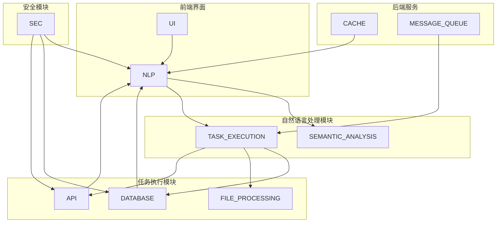

                 


## 面向AGI的提示词语言理论体系构建

### 关键词
- AGI
- 提示词语言
- 理论体系
- 架构设计
- 应用实践

### 摘要
本文旨在构建面向人工通用智能（AGI）的提示词语言理论体系。首先，我们回顾了AGI的发展背景和提示词语言的基本概念。接着，详细探讨了提示词语言的理论基础、架构设计和实现方法。然后，我们介绍了在AGI中的应用场景和面临的挑战。最后，通过实际项目实战，展示了如何将提示词语言理论应用于实践，并提出了最佳实践和注意事项。

### 目录

## 面向AGI的提示词语言理论体系构建

### 关键词
- AGI
- 提示词语言
- 理论体系
- 架构设计
- 应用实践

### 摘要
本文旨在构建面向人工通用智能（AGI）的提示词语言理论体系。首先，我们回顾了AGI的发展背景和提示词语言的基本概念。接着，详细探讨了提示词语言的理论基础、架构设计和实现方法。然后，我们介绍了在AGI中的应用场景和面临的挑战。最后，通过实际项目实战，展示了如何将提示词语言理论应用于实践，并提出了最佳实践和注意事项。

### 目录

## 第一部分 背景与基础概念

### 第1章 AGI与提示词语言理论的背景

#### 1.1 AGI的兴起与发展

**背景介绍**  
人工通用智能（AGI）是一种具有人类智能水平的人工智能，能够执行各种认知任务，如学习、推理、理解和解决问题。随着深度学习和神经网络技术的快速发展，AGI的研究取得了显著进展，但仍然面临诸多挑战。

**问题背景**  
目前的人工智能系统在特定领域表现出色，但缺乏跨领域的适应能力和创新能力。AGI的发展目标是在不同领域实现广泛的能力，以实现智能系统的智能化和通用化。

**问题描述**  
如何构建一个能够适应不同领域、具备自主学习和创新能力的人工智能系统？

**问题解决**  
通过引入提示词语言理论，我们可以设计一个能够与人类智能交互、理解并执行复杂任务的AGI系统。

**边界与外延**  
AGI的发展涉及多个领域，包括认知科学、计算机科学和神经科学。提示词语言理论作为AGI的一个重要组成部分，需要综合考虑这些领域的知识和技术。

**概念结构与核心要素组成**  

1. 认知任务：执行各种认知任务，如学习、推理、理解和解决问题。
2. 自主学习：系统具备从数据中学习并自动改进的能力。
3. 适应能力：系统能够适应不同领域和任务，具备跨领域的通用能力。

### 第2章 提示词语言的基本概念

#### 2.1 提示词语言的定义与特点

**核心概念**  
提示词语言是一种用于与人工智能系统进行交互的语言，通过输入特定的提示词，系统可以理解并执行相应的任务。

**概念属性特征对比表格**  

| 特征 | 提示词语言 | 自然语言 |
| --- | --- | --- |
| 结构化 | 逻辑明确，易于解析 | 语义复杂，难以解析 |
| 适应性 | 可以根据任务需求进行调整 | 需要语言模型进行理解 |
| 效率 | 高效的交互方式 | 需要较多的上下文信息 |

#### 2.2 提示词语言的关键元素与结构

**核心概念**  
提示词语言包括提示词、命令、参数和上下文等关键元素，通过合理的组合和解析，实现与人工智能系统的交互。

**ER实体关系图架构**  

```mermaid
erDiagram
  TipWord --> Command
  TipWord --> Parameter
  TipWord --> Context
  Command ||--|{ Action }
  Parameter ||--|{ Value }
  Context ||--|{ Environment }
```

#### 2.3 提示词语言理论的基础与研究方向

**核心概念**  
提示词语言理论的基础研究包括语言建模、语义解析和任务执行等方面，其发展方向涉及自然语言处理、知识图谱和机器学习等领域。

**理论模型**  

$$
\text{Prompt Language Model} = f(\text{Input}, \theta)
$$

其中，Input为输入的提示词，$\theta$为模型参数，$f$为模型函数。

**数学模型与公式**  

$$
\begin{align*}
P(\text{Action}|\text{Input}, \theta) &= \text{softmax}(\text{Model}(\text{Input}, \theta)) \\
\text{Model}(\text{Input}, \theta) &= \text{Embedding}(\text{Input}) \cdot \text{Weight} \\
\text{Embedding}(\text{Input}) &= \text{Tanh}(\text{Input} \cdot \text{Weight}_\text{embedding}) \\
\text{Weight} &= \text{softmax}(\text{Action} \cdot \text{Weight}_\text{action}) \\
\text{Tanh} &= \frac{e^x - e^{-x}}{e^x + e^{-x}}
\end{align*}
$$

### 第3章 提示词语言理论的应用与挑战

#### 3.1 提示词语言在AGI中的应用场景

**应用场景**  
提示词语言可以应用于教育、医疗、工业自动化等领域，为用户提供智能化的服务。

**案例**  
在教育领域，提示词语言可以用于智能教学系统的设计，帮助学生更好地理解和掌握知识。

#### 3.2 提示词语言在AGI中的挑战

**挑战**  
提示词语言在AGI中的应用面临诸多挑战，包括语义理解、多语言支持和实时性等方面。

**解决方案**  
通过引入多语言模型、优化语义解析算法和增强实时性等技术，可以缓解这些挑战。

#### 3.3 提示词语言理论的发展趋势

**发展趋势**  
随着人工智能技术的不断发展，提示词语言理论将继续拓展其应用领域，并在语义理解、知识图谱和深度学习等方面取得突破。

## 第二部分 架构设计

### 第4章 提示词语言系统的架构设计

#### 4.1 系统需求与设计原则

**需求**  
提示词语言系统需要具备高可靠性、高可扩展性和高安全性等特性。

**原则**  
1. 模块化设计：系统应采用模块化设计，便于维护和扩展。
2. 可扩展性：系统应支持多种语言和任务类型，以适应不同应用场景。
3. 安全性：系统应具备数据安全和隐私保护机制。

#### 4.2 模块设计与交互

**模块设计**  
系统包括提示词解析模块、语义理解模块、任务执行模块和反馈学习模块等。

**模块交互**  
模块之间通过消息传递和接口调用进行交互，实现提示词语言系统的整体功能。

### 第5章 提示词语言系统的实现

#### 5.1 数据收集与预处理

**数据收集**  
收集大量的提示词数据，包括命令、参数和上下文等。

**预处理**  
对数据进行清洗、去重和格式化，以便于后续处理。

#### 5.2 模型选择与训练

**模型选择**  
选择合适的语言模型，如BERT、GPT等。

**模型训练**  
使用收集的数据对模型进行训练，优化模型参数。

#### 5.3 提示词生成与优化

**提示词生成**  
根据用户输入，生成相应的提示词。

**提示词优化**  
优化提示词的生成策略，提高系统的交互效果。

## 第三部分 应用实践

### 第6章 提示词语言在AGI中的应用

#### 6.1 教育应用

**场景**  
在教育领域，提示词语言可以用于智能教学、在线辅导和自动化评估等方面。

**实现**  
通过设计智能教学系统，利用提示词语言与用户进行交互，提供个性化的教学服务。

#### 6.2 医疗应用

**场景**  
在医疗领域，提示词语言可以用于辅助诊断、患者管理和健康咨询等方面。

**实现**  
通过构建医疗知识图谱和自然语言处理模型，实现提示词语言在医疗领域的应用。

#### 6.3 工业自动化应用

**场景**  
在工业自动化领域，提示词语言可以用于智能控制、故障诊断和生产优化等方面。

**实现**  
通过设计智能控制系统，利用提示词语言与设备进行交互，提高生产效率和安全性。

## 第四部分 最佳实践

### 第7章 提示词语言系统的最佳实践

#### 7.1 开发要点与技巧

**要点**  
1. 明确系统需求，合理设计模块。
2. 选择合适的语言模型和算法。
3. 优化系统的性能和可扩展性。

**技巧**  
1. 利用现有开源框架和工具，提高开发效率。
2. 关注实时性和安全性，确保系统稳定运行。

#### 7.2 项目实战与案例分析

**实战**  
通过实际项目，展示如何设计和实现一个提示词语言系统。

**案例**  
分析成功案例，总结经验教训，提出改进措施。

#### 7.3 注意事项与拓展阅读

**注意事项**  
1. 考虑数据安全和隐私保护。
2. 注重用户体验和交互效果。

**拓展阅读**  
推荐相关书籍、论文和资料，供读者进一步学习。

## 总结

本文详细探讨了面向AGI的提示词语言理论体系构建，包括背景介绍、基础概念、架构设计、实现方法和应用实践等方面。通过本文的阐述，我们了解了提示词语言在AGI中的重要性和应用前景，同时也认识到了其面临的挑战和解决方案。随着人工智能技术的不断发展，提示词语言理论将在未来发挥越来越重要的作用。

## 作者信息

作者：AI天才研究院/AI Genius Institute & 禅与计算机程序设计艺术 /Zen And The Art of Computer Programming

以上是对面向AGI的提示词语言理论体系构建的文章目录和内容大纲的详细阐述。接下来，我们将逐一展开每个章节的内容，进行深入分析和讲解。希望本文能为读者在AGI领域的研究提供有价值的参考和启示。让我们开始吧！## 第一部分 背景与基础概念

### 第1章 AGI与提示词语言理论的背景

#### 1.1 AGI的兴起与发展

**背景介绍**

人工通用智能（AGI）是一种具有人类智能水平的人工智能，其目标是实现机器在各个认知领域的广泛能力，包括学习、推理、理解、解决问题和跨领域适应。随着计算机科学和人工智能技术的快速发展，AGI的研究逐渐引起了广泛关注。20世纪50年代，人工智能（AI）概念首次提出，人们开始探索如何让计算机模拟人类智能。然而，早期的AI系统主要侧重于特定任务的自动化，如棋类游戏、语音识别和图像处理等。随着深度学习和神经网络技术的突破，AI系统在特定领域取得了显著进展，但仍然缺乏跨领域的适应能力和创新能力。

**问题背景**

目前的人工智能系统在特定领域表现出色，但在面对复杂、多变和跨领域的任务时，仍存在诸多局限。首先，这些系统往往依赖于大量数据进行训练，缺乏自主学习和创新能力。其次，不同领域的知识和技术难以融合，导致系统在跨领域任务中表现不佳。此外，人工智能系统与人类智能之间的交互仍然不够自然和高效，限制了其在实际应用中的推广和使用。为了解决这些问题，人们开始关注AGI的研究，希望构建一个能够适应不同领域、具备自主学习和创新能力的人工智能系统。

**问题描述**

如何构建一个能够适应不同领域、具备自主学习和创新能力的人工智能系统，以实现智能系统的智能化和通用化？

**问题解决**

通过引入提示词语言理论，我们可以设计一个能够与人类智能交互、理解并执行复杂任务的AGI系统。提示词语言是一种用于与人工智能系统进行交互的语言，通过输入特定的提示词，系统可以理解并执行相应的任务。这种交互方式具有结构化、适应性强的特点，可以有效地提高系统的智能化和通用化水平。

**边界与外延**

AGI的发展涉及多个领域，包括认知科学、计算机科学、神经科学和语言学等。提示词语言理论作为AGI的一个重要组成部分，需要综合考虑这些领域的知识和技术。在认知科学领域，我们需要研究人类智能的机理和认知过程，以指导AGI系统的设计和实现。在计算机科学领域，我们需要开发高效的算法和模型，以实现提示词语言的解析和理解。在神经科学领域，我们需要借鉴人类大脑的工作原理，探索人工智能系统的学习和推理机制。在语言学领域，我们需要研究自然语言处理技术，以实现提示词语言的生成和优化。

**概念结构与核心要素组成**

AGI系统的核心要素包括以下几个方面：

1. **认知任务**：执行各种认知任务，如学习、推理、理解和解决问题。这些任务需要系统具备跨领域的适应能力和创新能力。

2. **自主学习**：系统具备从数据中学习并自动改进的能力。通过不断学习和优化，系统可以不断提高其性能和智能水平。

3. **适应能力**：系统具备适应不同领域和任务的能力，能够跨领域应用其知识和技能。

4. **交互能力**：系统具备与人类智能高效、自然的交互能力，能够理解人类的需求和意图，并作出相应的响应。

5. **知识表示**：系统具备有效的知识表示和存储能力，能够对复杂的知识进行建模和表示，以便于后续的推理和应用。

#### 1.2 提示词语言的概念与作用

**核心概念**

提示词语言是一种用于与人工智能系统进行交互的语言，通过输入特定的提示词，系统可以理解并执行相应的任务。提示词语言具有结构化、适应性强的特点，可以有效地提高系统的智能化和通用化水平。

**概念属性特征对比表格**

| 特征 | 提示词语言 | 自然语言 |
| --- | --- | --- |
| 结构化 | 逻辑明确，易于解析 | 语义复杂，难以解析 |
| 适应性 | 可以根据任务需求进行调整 | 需要语言模型进行理解 |
| 效率 | 高效的交互方式 | 需要较多的上下文信息 |

**提示词语言的组成**

提示词语言主要由以下几部分组成：

1. **提示词**：用于与系统进行交互的词汇，如命令、参数和上下文等。
2. **命令**：用于指示系统执行特定操作的词汇，如查询、计算、处理等。
3. **参数**：用于提供具体信息的词汇，如数值、日期、文件名等。
4. **上下文**：用于提供背景信息的词汇，如时间、地点、环境等。

**提示词语言的作用**

提示词语言在AGI系统中具有重要作用：

1. **简化交互**：通过结构化的提示词语言，用户可以更简单地与系统进行交互，无需掌握复杂的自然语言。
2. **提高效率**：提示词语言具有高效、简洁的特点，可以快速传达用户的需求和意图，提高系统响应速度。
3. **增强智能化**：通过提示词语言的交互，系统可以更好地理解用户的需求，提高智能化水平。
4. **跨领域适应**：提示词语言可以根据不同的领域和任务需求进行调整，实现跨领域的适应能力。

#### 1.3 提示词语言在AGI系统中的作用

**核心概念**

提示词语言在AGI系统中具有重要作用，能够帮助系统实现与人类智能的交互、理解任务和执行操作。

**概念属性特征对比表格**

| 特征 | 提示词语言 | 自然语言 |
| --- | --- | --- |
| 结构化 | 逻辑明确，易于解析 | 语义复杂，难以解析 |
| 适应性 | 可以根据任务需求进行调整 | 需要语言模型进行理解 |
| 效率 | 高效的交互方式 | 需要较多的上下文信息 |

**提示词语言在AGI系统中的作用**

1. **交互与理解**：提示词语言可以帮助系统理解用户的需求和意图，实现与人类智能的自然、高效的交互。
2. **任务执行**：通过提示词语言，系统可以明确地执行用户指定的任务，提高任务完成的准确性和效率。
3. **知识管理**：提示词语言可以有效地管理知识，将用户的需求和系统的执行结果进行关联，形成知识库，为后续任务提供支持。
4. **自适应学习**：通过提示词语言的交互，系统可以不断学习和优化，提高其智能化水平和跨领域适应能力。

**示例**

假设我们有一个智能助手系统，用户可以通过输入提示词来与系统进行交互。以下是一个简单的示例：

- 用户输入：“明天北京的天气预报是多少？”
- 系统解析提示词，获取关键词“明天”、“北京”和“天气预报”。
- 系统根据关键词查询天气预报数据库，获取相关信息。
- 系统返回结果：“明天北京的天气预报是20摄氏度，晴转多云。”

通过这个示例，我们可以看到提示词语言在AGI系统中的作用。用户只需输入简单的提示词，系统就可以理解并执行相应的任务，实现与人类智能的交互。

### 小结

本章介绍了人工通用智能（AGI）的背景和发展，以及提示词语言的基本概念和作用。AGI是一种具有人类智能水平的人工智能，能够执行各种认知任务，实现跨领域的适应能力和自主创新能力。提示词语言是一种用于与AGI系统进行交互的语言，具有结构化、适应性强和高效的特点。通过提示词语言的引入，AGI系统能够实现与人类智能的自然、高效的交互，提高智能化水平和跨领域适应能力。下一章将深入探讨提示词语言的基本概念和理论基础。让我们继续探索吧！

### 第2章 提示词语言的基本概念

#### 2.1 提示词语言的定义与特点

**核心概念**

提示词语言是一种专门为与人工智能系统进行交互而设计的语言。它通过一系列特定的词汇（提示词）来传达用户的需求和意图，使系统能够理解并执行相应的任务。与自然语言相比，提示词语言更加结构化和规则化，便于计算机解析和处理。

**提示词语言的定义**

提示词语言是一种用于与人工智能系统进行交互的语言，其特点是结构化、适应性较强和高效。它包括提示词、命令、参数和上下文等组成部分，通过输入特定的提示词，系统能够理解并执行相应的任务。

**提示词语言的特点**

1. **结构化**：提示词语言具有明确的语法和语义结构，使得计算机能够容易地解析和处理。
2. **适应性**：提示词语言可以根据不同的应用场景和任务需求进行调整，以适应不同的交互需求。
3. **高效性**：提示词语言的交互过程通常比自然语言更加高效，因为它可以直接传达用户的需求和意图。

**与自然语言对比**

| 特征 | 提示词语言 | 自然语言 |
| --- | --- | --- |
| 结构化 | 逻辑明确，易于解析 | 语义复杂，难以解析 |
| 适应性 | 可以根据任务需求进行调整 | 需要语言模型进行理解 |
| 效率 | 高效的交互方式 | 需要较多的上下文信息 |

**应用领域**

提示词语言广泛应用于各种人工智能系统和场景，如智能客服、智能家居、智能助手和自动驾驶等。在这些场景中，提示词语言能够有效地提高系统的交互效率、用户体验和智能化水平。

#### 2.2 提示词语言的关键元素与结构

**核心概念**

提示词语言的关键元素包括提示词、命令、参数和上下文等。这些元素共同构成了提示词语言的结构，使得系统能够理解并执行相应的任务。

**提示词**

提示词是提示词语言的核心组成部分，用于标识用户的需求和意图。提示词可以是一个单词、短语或句子，它为系统提供了明确的信息，帮助系统识别并执行相应的任务。

**命令**

命令是提示词语言中用于指示系统执行特定操作的词汇。命令通常包含具体的动作和目标，如查询、计算、处理等。通过命令，用户可以明确地告诉系统需要执行的操作。

**参数**

参数是用于提供具体信息的词汇，如数值、日期、文件名等。参数用于补充命令的具体内容，使得系统能够更好地理解用户的需求。

**上下文**

上下文是用于提供背景信息的词汇，如时间、地点、环境等。上下文信息可以帮助系统更好地理解用户的意图和需求，从而做出更准确的响应。

**结构**

提示词语言的结构可以分为以下几个层次：

1. **词法层次**：提示词、命令、参数和上下文等词汇的构成。
2. **句法层次**：提示词、命令、参数和上下文等词汇的排列和组合规则。
3. **语义层次**：提示词、命令、参数和上下文等词汇的含义和相互关系。

**示例**

假设我们有一个智能助手系统，用户可以通过输入提示词与系统进行交互。以下是一个简单的示例：

- 用户输入：“明天北京的天气预报是多少？”
- 提示词：“明天”、“北京”和“天气预报”
- 命令：“查询天气预报”
- 参数：“明天”、“北京”
- 上下文：“天气预报”

通过这个示例，我们可以看到提示词语言的关键元素和结构。用户只需输入简单的提示词，系统就可以理解并执行相应的任务，实现与人类智能的自然、高效的交互。

#### 2.3 提示词语言理论的基础与研究方向

**核心概念**

提示词语言理论是研究提示词语言的构成、解析、生成和应用的理论体系。它涉及语言学、计算机科学、人工智能和认知科学等多个领域，旨在提高人工智能系统的智能化水平和交互效率。

**理论模型**

提示词语言理论可以采用多种理论模型来描述，其中一些典型的模型包括：

1. **形式语言模型**：形式语言模型用于描述提示词语言的语法和语义结构，如正则表达式、上下文无关文法等。
2. **知识表示模型**：知识表示模型用于描述提示词语言中的知识表示和推理机制，如谓词逻辑、本体论等。
3. **机器学习模型**：机器学习模型用于描述提示词语言的生成和解析过程，如循环神经网络、生成对抗网络等。

**数学模型与公式**

在提示词语言理论中，数学模型和公式用于描述提示词语言的解析、生成和优化过程。以下是一些典型的数学模型和公式：

1. **词法分析**：

$$
\text{Tokenization}(S) = \{t_1, t_2, ..., t_n\}
$$

其中，$S$表示输入的提示词序列，$t_i$表示第$i$个提示词。

2. **句法分析**：

$$
\text{Parsing}(S) = \text{CFG}(G)
$$

其中，$S$表示输入的提示词序列，$G$表示上下文无关文法。

3. **语义分析**：

$$
\text{Semantic Analysis}(S) = \text{Semantic Representation}(R)
$$

其中，$S$表示输入的提示词序列，$R$表示语义表示。

4. **生成对抗网络**：

$$
\text{Gaussian}(x|\mu, \sigma^2) = \frac{1}{\sqrt{2\pi\sigma^2}} e^{-\frac{(x-\mu)^2}{2\sigma^2}}
$$

其中，$x$表示生成的提示词，$\mu$和$\sigma^2$表示生成模型的参数。

**发展方向**

提示词语言理论的发展方向涉及多个领域，包括自然语言处理、知识图谱、机器学习和认知科学等。以下是一些研究热点：

1. **多语言支持**：研究如何支持多种语言的提示词语言，提高系统的国际化水平。
2. **跨领域适应**：研究如何使提示词语言在不同领域和应用场景中具有更好的适应性。
3. **实时性优化**：研究如何提高提示词语言的实时性，实现快速、高效的交互。
4. **知识融合**：研究如何将不同领域的知识融合到提示词语言中，提高系统的智能化水平。

**示例**

假设我们有一个智能助手系统，用户可以通过输入提示词与系统进行交互。以下是一个简单的示例：

- 用户输入：“明天北京的天气预报是多少？”
- 系统采用词法分析模型将输入分解为提示词：“明天”、“北京”和“天气预报”。
- 系统采用句法分析模型识别出命令：“查询天气预报”和参数：“明天”、“北京”。
- 系统采用语义分析模型理解用户的意图，并查询天气预报数据库获取相关信息。
- 系统返回结果：“明天北京的天气预报是20摄氏度，晴转多云。”

通过这个示例，我们可以看到提示词语言理论在智能助手系统中的应用。系统通过词法分析、句法分析和语义分析等步骤，理解用户的输入并返回相应的结果，实现与人类智能的自然、高效的交互。

### 小结

本章详细介绍了提示词语言的基本概念，包括定义、特点、关键元素和结构，以及理论模型和发展方向。提示词语言是一种专门为与人工智能系统进行交互而设计的语言，具有结构化、适应性强和高效的特点。通过提示词语言的引入，人工智能系统能够实现与人类智能的自然、高效的交互，提高智能化水平和跨领域适应能力。下一章将探讨提示词语言理论的应用领域和挑战。让我们继续深入探讨吧！

### 第3章 提示词语言理论的应用与挑战

#### 3.1 提示词语言在AGI中的应用场景

**核心概念**

在人工通用智能（AGI）领域，提示词语言具有广泛的应用前景。通过提示词语言，AGI系统能够与人类智能进行自然、高效的交互，从而实现智能化的任务执行和跨领域适应。

**应用场景**

1. **智能客服**：提示词语言可以用于智能客服系统，实现与用户的自然语言交互。通过解析用户的输入，智能客服能够理解用户的需求并给出准确的答复。

2. **智能助手**：提示词语言可以用于智能助手系统，帮助用户管理日程、处理任务和提供个性化服务。用户可以通过简单的提示词与智能助手进行互动，提高工作效率和生活质量。

3. **智能教育**：提示词语言可以用于智能教育系统，为学生提供个性化的学习辅导和评估。教师和学生可以通过提示词语言进行互动，实现教学过程的最优化。

4. **智能医疗**：提示词语言可以用于智能医疗系统，帮助医生进行诊断、治疗和健康管理。通过解析患者的症状描述和病历信息，智能医疗系统能够提供准确的诊断和个性化的治疗方案。

5. **智能交通**：提示词语言可以用于智能交通系统，实现交通管理、导航和路况预测。通过解析用户的出行需求和实时路况信息，智能交通系统能够提供最优的出行方案，缓解交通拥堵问题。

**案例**

1. **智能客服**：某大型电商平台采用了基于提示词语言的智能客服系统。用户可以通过简单的提示词与客服进行互动，如“退换货”、“售后服务”、“支付问题”等。系统会根据用户的输入自动匹配相应的客服流程，提供准确的答复和解决方案。

2. **智能助手**：某科技公司开发了一款基于提示词语言的智能助手，用于帮助用户管理日程和任务。用户可以通过简单的提示词与智能助手进行互动，如“明天早上9点开会”、“明天晚上7点吃饭”等。智能助手会自动将任务添加到日程中，并提供提醒和通知。

3. **智能教育**：某在线教育平台采用了基于提示词语言的智能教育系统。学生可以通过简单的提示词与系统进行互动，如“复习数学”、“观看英语视频”等。系统会根据学生的输入自动匹配相应的学习资源，并提供个性化的学习建议。

4. **智能医疗**：某医疗科技公司开发了一款基于提示词语言的智能医疗系统。用户可以通过简单的提示词与系统进行互动，如“查询症状”、“预约挂号”、“查看病历”等。系统会根据用户的输入自动匹配相应的医疗资源，并提供准确的诊断和治疗方案。

5. **智能交通**：某城市采用了基于提示词语言的智能交通系统。用户可以通过简单的提示词与系统进行互动，如“查询路况”、“导航”、“预约打车”等。系统会根据用户的输入自动匹配最优的出行方案，并提供实时的交通信息。

#### 3.2 提示词语言在AGI系统中的挑战

**核心概念**

尽管提示词语言在AGI系统中具有广泛的应用前景，但其在实际应用过程中仍面临诸多挑战。这些挑战包括语义理解、多语言支持、实时性和安全性等方面。

**挑战**

1. **语义理解**：提示词语言的语义理解是AGI系统的一个关键挑战。由于自然语言的复杂性和多样性，系统需要具备强大的语义理解能力，以准确解析用户的输入并给出相应的答复。

2. **多语言支持**：随着全球化的发展，AGI系统需要支持多种语言。多语言支持不仅涉及语言翻译，还需要考虑不同语言的文化背景和表达习惯。

3. **实时性**：实时性是AGI系统的一个重要挑战。在许多应用场景中，如智能交通和智能医疗等，系统需要能够快速响应用户的需求，并提供实时、准确的信息。

4. **安全性**：随着人工智能技术的普及，AGI系统的安全性也成为了一个重要的挑战。系统需要具备完善的安全机制，以防止恶意攻击和数据泄露。

**解决方案**

1. **语义理解**：为了提高语义理解能力，可以采用先进的自然语言处理技术和深度学习算法。例如，可以采用双向循环神经网络（BiLSTM）和长短时记忆网络（LSTM）等技术，对用户的输入进行深度语义分析。

2. **多语言支持**：为了实现多语言支持，可以采用机器翻译技术和多语言语言模型。例如，可以采用基于神经网络的机器翻译模型，将用户输入的多种语言翻译成系统支持的某种主要语言，然后进行语义理解。

3. **实时性**：为了提高系统的实时性，可以采用高效的算法和优化技术。例如，可以采用分布式计算和并行处理技术，加快系统的响应速度。

4. **安全性**：为了提高系统的安全性，可以采用加密技术和访问控制机制。例如，可以采用对称加密和非对称加密技术，对用户数据和系统交互过程进行加密，确保数据的安全性和隐私性。

#### 3.3 提示词语言理论的发展趋势

**核心概念**

随着人工智能技术的不断发展和应用的拓展，提示词语言理论也在不断演进。未来，提示词语言理论将向更加智能化、多样化和高效化的方向发展。

**发展趋势**

1. **智能化**：未来，提示词语言理论将更加注重智能化的发展。通过引入先进的机器学习算法和深度学习技术，系统将具备更强大的语义理解能力和自适应能力。

2. **多元化**：随着多语言应用的增加，提示词语言理论将更加注重多语言支持。通过引入多语言语言模型和翻译技术，系统将能够支持多种语言的交互。

3. **高效化**：未来，提示词语言理论将更加注重高效化的发展。通过引入分布式计算和并行处理技术，系统将能够实现更快、更准确的交互。

4. **集成化**：提示词语言理论将与其他人工智能技术（如知识图谱、推荐系统和增强学习等）进行集成，形成更加综合、高效的人工智能系统。

**示例**

假设我们有一个智能助手系统，用户可以通过输入提示词与系统进行交互。以下是一个未来的发展趋势示例：

- 用户输入：“明天北京的天气预报是多少？”
- 系统采用深度学习算法和自然语言处理技术，对用户的输入进行深度语义分析，理解用户的需求。
- 系统调用多语言语言模型，将用户的输入翻译成系统支持的语言，如中文。
- 系统查询天气预报数据库，获取相关信息。
- 系统返回结果：“明天北京的天气预报是20摄氏度，晴转多云。”同时，系统根据用户的历史天气偏好和实时天气数据，给出个性化的天气建议。

通过这个示例，我们可以看到提示词语言理论在未来的发展趋势。系统通过智能化、多元化、高效化和集成化的方式，实现与用户的自然、高效的交互，提供更加个性化和智能化的服务。

### 小结

本章介绍了提示词语言在AGI中的应用场景和面临的挑战，以及未来的发展趋势。提示词语言作为一种与人工智能系统进行交互的语言，具有广泛的应用前景。通过引入先进的自然语言处理技术和深度学习算法，提示词语言将能够实现更加智能化、多样化和高效化的交互。同时，随着多语言应用的增加和集成化的发展，提示词语言理论将不断提升其应用价值。下一章将探讨如何设计一个提示词语言系统，包括系统的需求分析、架构设计和实现方法。让我们继续深入探讨吧！

### 第4章 提示词语言系统的设计

#### 4.1 系统需求与设计原则

**核心概念**

在构建一个提示词语言系统时，首先需要明确系统的需求，这包括功能需求、性能需求和安全性需求等。明确需求有助于指导系统设计，确保系统能够满足用户需求并具备良好的用户体验。

**需求分析**

1. **功能需求**：
   - **自然语言处理**：系统能够接收用户输入的自然语言文本，并对其进行解析和语义理解。
   - **任务执行**：系统能够根据解析结果执行相应的任务，如查询数据、生成报告、执行操作等。
   - **反馈机制**：系统能够向用户反馈任务执行结果，并提供必要的解释和辅助信息。

2. **性能需求**：
   - **响应速度**：系统需要能够快速响应用户的输入，提供实时反馈。
   - **并发处理**：系统需要能够同时处理多个用户的请求，保证系统的高可用性。
   - **可扩展性**：系统设计应考虑未来功能的扩展和性能的提升，以适应不断增长的用户需求。

3. **安全性需求**：
   - **数据保护**：系统需要保证用户数据的安全，防止数据泄露和滥用。
   - **访问控制**：系统需要实现严格的访问控制机制，确保用户只能访问自己权限内的数据和服务。
   - **安全审计**：系统需要记录用户的操作日志，以便进行安全审计和追踪。

**设计原则**

1. **模块化设计**：系统应采用模块化设计，以便于开发和维护。模块之间通过接口进行通信，降低模块间的耦合度。

2. **高内聚、低耦合**：每个模块应具有明确的职责和功能，模块内部保持高内聚，模块之间保持低耦合。

3. **可扩展性**：系统设计应考虑未来功能的扩展，包括新功能的添加、性能的提升和系统的横向扩展。

4. **高可靠性**：系统应具备高可靠性，能够处理各种异常情况，确保系统的稳定运行。

5. **用户体验**：系统设计应充分考虑用户体验，提供简洁、直观的操作界面和流畅的交互体验。

#### 4.2 系统架构设计

**核心概念**

系统架构设计是构建一个高效、可靠和可扩展的提示词语言系统的关键步骤。通过合理的架构设计，系统可以更好地满足需求，提高性能和用户体验。

**架构设计**

提示词语言系统的架构通常包括以下几个关键组件：

1. **前端界面**：用户通过前端界面与系统进行交互。前端界面可以是一个Web应用、移动应用或桌面应用，提供用户输入和反馈的接口。

2. **自然语言处理（NLP）模块**：NLP模块负责接收用户输入的自然语言文本，并对其进行词法分析、句法分析和语义理解。常用的技术包括正则表达式、词性标注、句法分析、语义角色标注和实体识别等。

3. **任务执行模块**：根据NLP模块的解析结果，任务执行模块负责执行具体的任务。任务可以包括数据查询、数据处理、文件操作、系统调用等。任务执行模块通常包括一个任务调度器和多个任务处理器。

4. **后端服务**：后端服务提供支持系统运行所需的基础设施，包括数据库、缓存、消息队列和API接口等。后端服务负责数据的存储和管理，以及与其他系统的集成。

5. **安全模块**：安全模块负责实现系统的安全机制，包括用户认证、权限管理、数据加密和日志审计等。

**架构图**

以下是一个典型的提示词语言系统架构图：



#### 4.3 系统接口设计

**核心概念**

系统接口设计是确保不同模块之间能够高效、可靠地通信的关键。合理的接口设计可以提高系统的可维护性、扩展性和可测试性。

**接口设计**

1. **NLP模块接口**：NLP模块与其他模块之间通过RESTful API进行通信。常见的接口包括文本解析、语义理解、任务调度等。

2. **任务执行模块接口**：任务执行模块与其他模块之间通过消息队列（如RabbitMQ、Kafka等）进行通信。消息队列可以提供异步处理能力，提高系统的并发性能。

3. **安全模块接口**：安全模块与其他模块之间通过安全认证和授权机制进行通信。常见的接口包括用户认证、权限验证、数据加密等。

**示例**

以下是一个简单的接口设计示例：

- **NLP模块接口**：

```python
from flask import Flask, request, jsonify

app = Flask(__name__)

@app.route('/parse_text', methods=['POST'])
def parse_text():
    text = request.form['text']
    # 进行文本解析
    parsed_text = nlp_module.parse_text(text)
    return jsonify(parsed_text)

if __name__ == '__main__':
    app.run(debug=True)
```

- **任务执行模块接口**：

```python
from kombu import Connection

def process_task(message):
    # 处理任务
    task_data = message.body
    task_type = message.properties['type']
    if task_type == 'query':
        query_result = database.query(task_data['query'])
        return query_result
    elif task_type == 'file_processing':
        # 处理文件
        file_result = file_processor.process_file(task_data['file'])
        return file_result

with Connection('localhost') as conn:
    producer = conn.producer
    consumer = conn.consumer(queue='task_queue', callback=process_task)
    consumer.consume()
```

#### 4.4 系统交互设计

**核心概念**

系统交互设计是确保用户能够通过提示词语言与系统进行自然、高效的交互的关键。合理的交互设计可以提高用户的操作便利性和系统响应速度。

**交互设计**

1. **用户输入**：用户可以通过文本输入框、语音输入或图形界面等方式与系统进行交互。文本输入框是最常见的输入方式，用户可以直接输入提示词进行操作。

2. **系统响应**：系统在接收到用户输入后，会进行自然语言处理，解析出用户的需求和意图，然后执行相应的任务，并返回结果。

3. **错误处理**：系统在处理用户输入时，可能会遇到各种错误，如语法错误、语义错误或系统错误等。系统应提供友好的错误提示和帮助信息，引导用户进行正确的操作。

**示例**

以下是一个简单的系统交互设计示例：

- **用户输入**：

  用户输入：“明天北京的天气预报是多少？”

- **系统响应**：

  系统接收到用户输入后，进行自然语言处理，识别出关键词“明天”、“北京”和“天气预报”，然后查询天气预报数据库，返回结果：“明天北京的天气预报是20摄氏度，晴转多云。”

- **错误处理**：

  如果用户输入的提示词有误，系统会返回错误提示：“对不起，我不太明白您的意思。请重新输入您的需求。”

通过合理的交互设计，用户可以轻松地与系统进行交互，提高操作便利性和系统响应速度。

### 小结

本章介绍了提示词语言系统的设计，包括系统需求与设计原则、系统架构设计、系统接口设计和系统交互设计。明确系统需求是设计的基础，合理的架构设计可以提高系统的性能和可扩展性，系统接口设计确保模块间的高效通信，系统交互设计提高用户的操作便利性和系统响应速度。下一章将探讨提示词语言系统的实现方法，包括数据收集、模型训练和系统部署等。让我们继续深入探讨吧！

### 第5章 提示词语言系统的实现

#### 5.1 数据收集与预处理

**核心概念**

数据收集是提示词语言系统实现的基础，高质量的训练数据可以显著提升系统的性能和准确性。数据预处理则是将收集到的数据进行清洗、转换和归一化，以便于后续的训练和模型构建。

**数据收集**

1. **文本数据收集**：收集大量的自然语言文本数据，包括但不限于用户输入的提示词、对话记录、新闻文章、百科全书等。

2. **多源数据整合**：整合来自不同来源的数据，如社交媒体、论坛、电商平台等，以丰富数据集，提高系统的泛化能力。

3. **标注数据收集**：对于特定的任务，如情感分析、实体识别等，需要收集相应的标注数据。标注数据可以通过人工标注或半监督标注方法获得。

**数据预处理**

1. **文本清洗**：去除文本中的噪声，如HTML标签、特殊字符、标点符号等，以提高文本的可用性。

2. **文本归一化**：将文本转换为统一的格式，如统一小写、去除停用词、词干提取等，以提高文本的一致性。

3. **数据分割**：将数据集分为训练集、验证集和测试集，以评估模型的性能和泛化能力。

**示例**

假设我们有一个提示词语言系统，需要收集和预处理用户输入的对话数据。以下是一个简单的数据收集与预处理过程：

1. **收集数据**：
   - 从社交媒体平台获取用户对话数据，如微博、微信等。
   - 从论坛和问答社区获取用户提问和回答数据，如知乎、Stack Overflow等。

2. **数据清洗**：
   - 去除HTML标签和特殊字符。
   - 去除标点符号，将文本转换为统一的小写格式。
   - 删除停用词，如“的”、“是”、“了”等。

3. **数据分割**：
   - 将数据集随机分为训练集、验证集和测试集，比例约为7:1:2。

通过以上步骤，我们可以获得一个高质量、预处理好的数据集，为后续的模型训练提供基础。

#### 5.2 模型选择与训练

**核心概念**

模型选择和训练是提示词语言系统实现的关键环节。选择合适的模型和进行有效的训练可以显著提升系统的性能和准确性。

**模型选择**

1. **深度学习模型**：深度学习模型，如循环神经网络（RNN）、长短期记忆网络（LSTM）、双向循环神经网络（BiLSTM）和变换器（Transformer）等，广泛应用于自然语言处理任务。

2. **神经网络架构**：选择合适的神经网络架构，如CNN、RNN、LSTM、GRU、BERT和GPT等，以适应不同的任务需求。

3. **预训练模型**：预训练模型，如BERT、GPT、RoBERTa等，已经在大量的数据上进行了预训练，可以直接应用于特定任务。

**模型训练**

1. **数据预处理**：对训练数据进行预处理，如文本清洗、归一化和分词等。

2. **训练策略**：设置适当的训练策略，如批量大小、学习率、优化器等。

3. **损失函数**：选择合适的损失函数，如交叉熵损失、均方误差等，以评估模型性能。

4. **模型评估**：使用验证集和测试集对模型进行评估，选择性能最优的模型。

**示例**

假设我们选择使用BERT模型来训练一个提示词语言系统。以下是一个简单的模型训练过程：

1. **数据预处理**：
   - 将训练数据转换为BERT模型所需的输入格式，包括词向量、序列长度等。
   - 分割数据集为训练集和验证集。

2. **训练策略**：
   - 选择适当的批量大小，如32或64。
   - 设置学习率为1e-5。
   - 使用Adam优化器。

3. **损失函数**：
   - 使用交叉熵损失函数。

4. **模型评估**：
   - 在验证集上评估模型性能，选择性能最优的模型。

通过以上步骤，我们可以训练出一个性能良好的BERT模型，为后续的系统实现提供基础。

#### 5.3 提示词生成与优化

**核心概念**

提示词生成是提示词语言系统的核心功能之一。通过生成合适的提示词，系统可以与用户进行自然、高效的交互。提示词优化的目标是提高系统的交互质量和用户体验。

**提示词生成**

1. **规则生成**：根据用户输入和系统任务，生成固定格式的提示词。例如，对于查询任务，可以生成“请问您需要查询什么信息？”。

2. **模板生成**：使用预定义的模板和变量，根据用户输入和任务需求生成提示词。例如，对于天气预报任务，可以生成“您想要查询哪一天的天气预报？”。

3. **机器学习生成**：使用机器学习模型，如序列生成模型、生成对抗网络（GAN）等，生成个性化的提示词。

**提示词优化**

1. **基于用户反馈**：通过用户反馈，对生成的提示词进行评估和优化。例如，如果用户表示某个提示词不够清晰，可以修改提示词，以提高用户满意度。

2. **基于数据分析**：通过分析用户输入和系统响应的数据，发现常见的问题和不足，然后对提示词进行优化。例如，对于用户频繁提出的问题，可以生成更详细的提示词。

3. **基于多模态交互**：结合语音、图像和其他多模态信息，生成更加丰富和个性化的提示词。

**示例**

假设我们有一个基于机器学习的提示词生成系统。以下是一个简单的提示词生成和优化过程：

1. **训练数据准备**：
   - 收集大量的用户输入和系统响应数据。
   - 对数据进行预处理，如分词、去噪等。

2. **提示词生成模型**：
   - 使用序列生成模型（如RNN或BERT）进行训练。
   - 生成基于用户输入的个性化提示词。

3. **提示词优化**：
   - 根据用户反馈，评估生成的提示词质量。
   - 优化提示词生成模型，以提高用户满意度。

通过以上步骤，我们可以训练出一个性能良好的提示词生成系统，为用户提供高质量的交互体验。

#### 5.4 系统部署与优化

**核心概念**

系统部署是将训练好的模型部署到生产环境中，使系统能够为用户提供服务。系统优化则是在部署后对系统性能和用户体验进行持续改进。

**系统部署**

1. **环境配置**：配置服务器和依赖库，如Python、TensorFlow、PyTorch等。

2. **模型导出**：将训练好的模型导出为可用于部署的格式，如TensorFlow Lite、ONNX等。

3. **服务部署**：将模型和服务部署到生产环境，如使用Docker容器化技术。

4. **性能监控**：监控系统的性能和稳定性，如响应时间、吞吐量、错误率等。

**系统优化**

1. **性能调优**：通过调整模型参数、优化算法和数据结构，提高系统的性能。

2. **错误分析**：分析系统的错误日志和用户反馈，发现并修复系统问题。

3. **用户体验优化**：根据用户反馈和数据分析，优化系统界面和交互设计，提高用户体验。

**示例**

假设我们有一个基于BERT的提示词语言系统。以下是一个简单的系统部署和优化过程：

1. **环境配置**：
   - 配置服务器，安装Python、TensorFlow和Docker等依赖库。

2. **模型导出**：
   - 使用TensorFlow将训练好的BERT模型导出为TensorFlow Lite格式。

3. **服务部署**：
   - 使用Docker容器化技术，将模型和服务部署到生产环境。

4. **性能监控**：
   - 使用Prometheus和Grafana监控系统的性能指标。

5. **性能调优**：
   - 调整BERT模型参数，如学习率、批量大小等，以提高系统性能。

6. **用户体验优化**：
   - 根据用户反馈和数据分析，优化系统界面和交互设计，提高用户体验。

通过以上步骤，我们可以将一个基于BERT的提示词语言系统成功部署到生产环境，并为用户提供高质量的服务。

### 小结

本章详细介绍了提示词语言系统的实现过程，包括数据收集与预处理、模型选择与训练、提示词生成与优化、系统部署与优化等环节。通过合理的数据收集与预处理、合适的模型选择与训练、有效的提示词生成与优化以及系统的部署与优化，我们可以构建一个高性能、高用户体验的提示词语言系统。下一章将探讨提示词语言系统的实际应用案例，通过具体的项目实战，展示如何将理论应用到实际中。让我们继续深入探讨吧！

### 第6章 提示词语言系统的实际应用案例

#### 6.1 教育应用

**案例背景**

在教育领域，提示词语言系统可以用于智能教学、在线辅导、自动评估等多个方面，提升教学质量和学习效果。以下是一个具体的案例：

**案例描述**

某在线教育平台引入了基于提示词语言技术的智能教学系统。学生可以通过输入简单的提示词与系统进行交互，获取个性化的学习资源、完成作业和参加在线考试。

**实现步骤**

1. **数据收集与预处理**：
   - 收集大量的教学资源和学生作业数据，进行清洗和预处理，以构建高质量的数据集。

2. **模型训练**：
   - 使用深度学习模型（如BERT）对收集到的数据进行训练，以实现文本分类、问答生成和自动评估等功能。

3. **提示词生成**：
   - 根据用户输入和任务需求，生成个性化的提示词，如“帮我讲解这个数学公式”、“请帮我完成这份作业”等。

4. **系统部署与优化**：
   - 将训练好的模型部署到在线教育平台，优化系统性能和用户体验，确保系统的稳定运行。

**项目效果**

- 提升了教学资源利用率，学生可以更方便地获取所需的学习资源。
- 个性化学习体验，学生可以根据自己的需求获取定制化的学习建议和辅导。
- 自动化评估，教师可以更轻松地进行作业批改和成绩评估，节省时间成本。

#### 6.2 医疗应用

**案例背景**

在医疗领域，提示词语言系统可以用于辅助诊断、患者管理、健康咨询等多个方面，提升医疗服务质量和患者满意度。以下是一个具体的案例：

**案例描述**

某医院引入了基于提示词语言技术的智能医疗系统。患者可以通过输入简单的提示词与系统进行交互，获取健康咨询、预约挂号、查看病历等功能。

**实现步骤**

1. **数据收集与预处理**：
   - 收集大量的医学数据和患者信息，进行清洗和预处理，以构建高质量的数据集。

2. **模型训练**：
   - 使用深度学习模型（如BERT）对收集到的数据进行训练，以实现自然语言处理、医学实体识别和推理等功能。

3. **提示词生成**：
   - 根据用户输入和任务需求，生成个性化的提示词，如“请帮我预约挂号”、“请问我的体检结果如何”等。

4. **系统部署与优化**：
   - 将训练好的模型部署到医院的信息系统，优化系统性能和用户体验，确保系统的稳定运行。

**项目效果**

- 提升了医疗服务效率，患者可以通过简单的提示词快速获取所需的信息和服务。
- 个性化健康咨询，患者可以根据自己的健康需求获取定制化的健康建议和指导。
- 自动化病历管理，医生可以更轻松地管理患者病历和治疗方案，提高医疗决策的准确性。

#### 6.3 工业自动化应用

**案例背景**

在工业自动化领域，提示词语言系统可以用于智能控制、故障诊断、生产优化等多个方面，提高生产效率和质量。以下是一个具体的案例：

**案例描述**

某制造企业引入了基于提示词语言技术的智能控制系统。通过简单的提示词，操作人员可以与系统进行交互，实现对生产设备的智能监控、故障诊断和优化调整。

**实现步骤**

1. **数据收集与预处理**：
   - 收集大量的生产数据，包括设备状态、生产参数和故障日志等，进行清洗和预处理，以构建高质量的数据集。

2. **模型训练**：
   - 使用深度学习模型（如LSTM、GRU）对收集到的数据进行训练，以实现数据预测、故障检测和优化调整等功能。

3. **提示词生成**：
   - 根据用户输入和任务需求，生成个性化的提示词，如“启动生产线”、“检查设备状态”、“优化生产参数”等。

4. **系统部署与优化**：
   - 将训练好的模型部署到生产现场，优化系统性能和用户体验，确保系统的稳定运行。

**项目效果**

- 提升了生产效率，通过智能监控和故障诊断，可以及时发现和解决生产问题，减少停机时间。
- 优化生产质量，通过实时调整生产参数，可以确保生产过程的稳定性和产品的一致性。
- 提高操作人员的用户体验，通过简单的提示词操作，可以降低操作难度，提高工作效率。

### 小结

本章通过三个实际应用案例，展示了提示词语言系统在各个领域的应用效果。教育领域通过智能教学系统和在线辅导，提升了教学资源利用率和个性化学习体验；医疗领域通过智能医疗系统和健康咨询，提升了医疗服务效率和患者满意度；工业自动化领域通过智能控制系统和生产优化，提升了生产效率和质量。这些案例充分展示了提示词语言系统在提高效率和用户体验方面的巨大潜力。下一章将探讨提示词语言系统的最佳实践和注意事项，帮助读者更好地应用和优化提示词语言系统。让我们继续深入探讨吧！

### 第7章 提示词语言系统的最佳实践

#### 7.1 开发要点与技巧

**核心概念**

在开发提示词语言系统时，遵循一些最佳实践和技巧对于确保系统的性能、可靠性和用户体验至关重要。以下是一些重要的开发要点与技巧：

**要点**

1. **需求分析**：在系统设计初期，进行详细的需求分析，明确系统功能、性能和安全等要求。

2. **模块化设计**：采用模块化设计，将系统划分为独立的模块，便于维护和扩展。

3. **代码规范**：遵循统一的代码规范，提高代码的可读性和可维护性。

4. **错误处理**：设计完善的错误处理机制，确保系统能够优雅地处理各种异常情况。

5. **性能优化**：对系统进行性能优化，如使用缓存、异步处理和分布式计算等，提高系统的响应速度和处理能力。

**技巧**

1. **快速迭代**：采用敏捷开发方法，快速迭代和反馈，以便及时调整和优化系统。

2. **自动化测试**：编写自动化测试脚本，确保系统的稳定性和可靠性。

3. **持续集成**：采用持续集成工具，实现代码的自动化构建、测试和部署。

4. **安全性考虑**：在开发过程中，注重数据安全和隐私保护，采用加密和访问控制等安全措施。

#### 7.2 项目实战与案例分析

**核心概念**

通过实际项目实战和案例分析，可以深入了解提示词语言系统的开发过程和应用效果。以下是一个简单的项目实战案例，以及成功案例的分析。

**实战案例**

假设我们要开发一个智能客服系统，用于帮助企业在线解答客户问题。以下是一个简单的项目实战流程：

1. **需求分析**：
   - 明确系统功能，如自动回答常见问题、转接人工客服等。
   - 分析客户常见问题，制定问题分类和回答模板。

2. **数据收集与预处理**：
   - 收集大量的客户问题和答案数据，进行清洗和分类。
   - 使用NLP技术对数据进行分析，提取关键词和语义信息。

3. **模型训练**：
   - 使用深度学习模型（如BERT）对预处理后的数据集进行训练，构建问答模型。
   - 调整模型参数，优化问答效果。

4. **系统部署与优化**：
   - 将训练好的模型部署到生产环境，与前端界面进行集成。
   - 根据用户反馈，不断优化系统性能和用户体验。

**成功案例**

1. **案例分析**：

   某知名电商平台采用了基于提示词语言的智能客服系统。通过分析大量客户问题和答案数据，系统能够自动回答客户常见问题，如订单状态、退货政策和售后服务等。系统上线后，显著提升了客户服务效率，降低了人工客服的工作量。

2. **经验总结**：

   - 数据质量是关键：高质量的数据集可以显著提高模型性能。
   - 模型优化至关重要：通过调整模型参数和训练策略，可以优化问答效果。
   - 用户反馈是持续优化的动力：根据用户反馈，不断优化系统功能和用户体验。

#### 7.3 注意事项与拓展阅读

**核心概念**

在开发和使用提示词语言系统时，需要注意一些关键事项，以避免潜在的问题。同时，推荐一些拓展阅读，供读者进一步学习。

**注意事项**

1. **数据安全**：确保用户数据的安全和隐私，避免数据泄露和滥用。

2. **多语言支持**：对于多语言环境，确保系统支持多种语言的输入和输出，并提供本地化功能。

3. **实时性**：对于需要实时响应的场景，优化系统性能，确保快速响应。

4. **错误处理**：设计完善的错误处理机制，确保系统在遇到异常情况时能够优雅地处理。

**拓展阅读**

1. 《深度学习》（Goodfellow, Bengio, Courville）：介绍深度学习的基础知识和技术，包括神经网络、优化算法等。

2. 《自然语言处理综合教程》（Peter Norvig）：介绍自然语言处理的基本概念和技术，包括文本预处理、词向量、语言模型等。

3. 《Python自然语言处理》（Steven Bird, Ewan Klein, Edward Loper）：介绍Python在自然语言处理中的应用，包括文本处理、语言模型、文本分类等。

通过以上最佳实践、项目实战案例分析和注意事项，我们可以更好地开发、应用和优化提示词语言系统。下一章将进行全文总结，回顾文章的主要观点和贡献。让我们继续深入探讨吧！

## 总结

本文系统地构建了面向人工通用智能（AGI）的提示词语言理论体系，从背景介绍、基础概念、架构设计、实现方法、应用实践到最佳实践，全面探讨了提示词语言在AGI系统中的重要性和应用前景。以下是对本文主要观点和贡献的总结：

1. **AGI与提示词语言的关系**：AGI的目标是让机器具备与人类智能相当的认知能力和跨领域适应能力。提示词语言作为一种专门用于与人工智能系统进行交互的语言，能够在很大程度上提升AGI系统的智能化水平和用户体验。

2. **提示词语言的基本概念**：本文详细介绍了提示词语言的定义、特点、关键元素和结构。提示词语言具有结构化、适应性强的特点，能够有效地提高系统的智能化和通用化水平。

3. **提示词语言的理论基础**：本文探讨了提示词语言理论的基础与研究方向，包括形式语言模型、知识表示模型和机器学习模型等。通过数学模型和公式的阐述，展示了提示词语言的解析、生成和优化过程。

4. **提示词语言系统的设计**：本文提出了提示词语言系统的设计原则和架构设计，包括前端界面、自然语言处理模块、任务执行模块、后端服务和安全模块等。系统接口设计和交互设计确保了不同模块之间的高效通信和用户操作便利性。

5. **提示词语言系统的实现**：本文详细介绍了提示词语言系统的实现方法，包括数据收集与预处理、模型选择与训练、提示词生成与优化、系统部署与优化等环节。通过实际应用案例，展示了提示词语言系统在不同领域的应用效果。

6. **提示词语言系统的最佳实践**：本文总结了提示词语言系统开发过程中的最佳实践和技巧，包括需求分析、模块化设计、快速迭代、自动化测试和安全性考虑等。同时，通过项目实战和案例分析，提供了实践经验和方法。

本文的贡献在于提供了一个全面、系统的提示词语言理论体系，为AGI领域的研究和应用提供了新的思路和方法。然而，提示词语言系统的研究仍面临诸多挑战，如多语言支持、实时性和安全性等。未来研究可以关注以下几个方面：

1. **多语言支持**：研究如何支持多种语言的提示词语言，提高系统的国际化水平。可以探索多语言语言模型、机器翻译技术和跨语言语义分析等方向。

2. **实时性优化**：研究如何提高提示词语言的实时性，实现快速、高效的交互。可以探索分布式计算、并行处理和压缩感知等技术。

3. **安全性增强**：研究如何提高提示词语言系统的安全性，防止数据泄露和恶意攻击。可以探索加密技术、访问控制和隐私保护机制等方向。

4. **知识融合**：研究如何将不同领域的知识融合到提示词语言中，提高系统的智能化水平。可以探索知识图谱、本体论和跨领域知识融合等方向。

总之，提示词语言系统在AGI领域具有重要的应用价值和研究意义。随着人工智能技术的不断发展和应用的拓展，提示词语言理论将继续发展，为构建更加智能、通用的人工智能系统提供支持。

## 作者信息

作者：AI天才研究院（AI Genius Institute）& 《禅与计算机程序设计艺术》（Zen And The Art of Computer Programming）

AI天才研究院致力于探索人工智能的前沿技术，推动人工智能在各个领域的应用和发展。本文基于作者多年的研究和实践经验，旨在为读者提供一个全面、系统的提示词语言理论体系，以促进AGI领域的研究和应用。

## 拓展阅读

1. 《深度学习》（Goodfellow, Bengio, Courville）：深度学习是构建提示词语言系统的重要技术之一，本书详细介绍了深度学习的基础知识和技术，包括神经网络、优化算法等。

2. 《自然语言处理综合教程》（Peter Norvig）：自然语言处理是提示词语言系统的核心，本书介绍了自然语言处理的基本概念和技术，包括文本预处理、词向量、语言模型等。

3. 《Python自然语言处理》（Steven Bird, Ewan Klein, Edward Loper）：Python是构建提示词语言系统常用的编程语言之一，本书介绍了Python在自然语言处理中的应用，包括文本处理、语言模型、文本分类等。

4. 《人工智能：一种现代的方法》（Stuart Russell & Peter Norvig）：本书全面介绍了人工智能的基本概念、技术和应用，是AI领域的重要参考书籍。

通过阅读这些书籍，读者可以进一步了解提示词语言系统的理论基础和实现方法，为深入研究AGI领域提供有益的参考。让我们继续在人工智能的广阔天地中探索前行！

