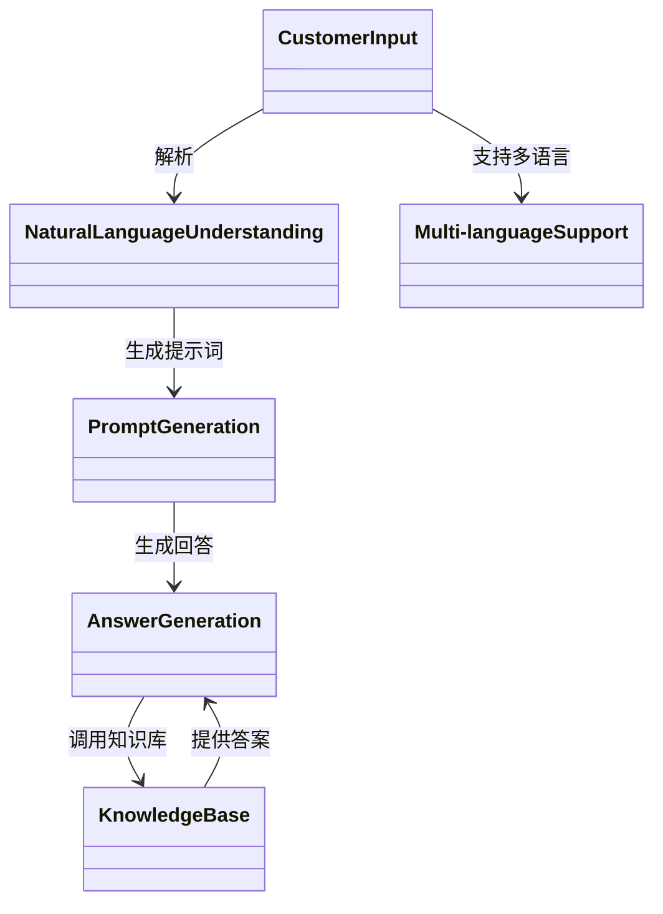
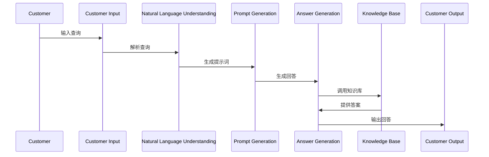

                 


## 引言

### 1.1 通用人工智能（AGI）背景

通用人工智能（Artificial General Intelligence，AGI）是人工智能领域的一个终极目标，旨在创建一种具有广泛认知能力的智能系统，使其能够像人类一样思考、学习和适应各种环境。与当前广泛应用的狭义人工智能（Narrow Artificial Intelligence，NAI）不同，AGI不仅能够执行特定的任务，还能在多个领域内展现智能行为。AGI的定义与特点成为我们探讨提示词语言理论体系的起点。

AGI的定义主要围绕其通用性和自我改进能力。通用性意味着AGI能够在没有特定编程的情况下解决各种问题，而自我改进能力则是指AGI能够通过学习和经验积累不断提升其智能水平。当前，AGI面临着诸多挑战，包括理解自然语言、自主学习、处理复杂决策等。这些挑战不仅推动了人工智能技术的发展，也为提示词语言理论的研究提供了动力。

### 1.2 提示词语言理论的概述

提示词语言（Prompt Language）是一种用于引导和优化人工智能模型语言处理能力的理论体系。它通过设计特定的语言结构，引导模型在特定任务上生成更准确、更有针对性的回答。提示词语言理论在AGI中的应用具有重要意义，因为它可以增强模型的解释能力、决策能力和创造力。

提示词语言的概念涉及多个方面，包括提示词的生成、解释和使用。在提示词生成过程中，我们需要考虑语言的语义、语法和上下文。提示词的解释则需要模型具备深度的语言理解能力，以便准确理解和回应提示词。提示词语言的使用则依赖于特定的应用场景，如问答系统、自然语言生成等。

### 1.3 本文目的与结构

本文旨在评估面向AGI的提示词语言理论体系，分析其核心概念、算法原理、系统架构以及实际应用。文章结构如下：

- 引言：介绍AGI和提示词语言理论的背景。
- 第1部分：AGI与提示词语言理论的概述。
- 第2部分：核心概念与原理讲解。
- 第3部分：算法原理与数学模型。
- 第4部分：系统分析与架构设计。
- 第5部分：项目实战与案例分析。
- 第6部分：最佳实践与拓展。

通过逐步深入的分析和探讨，本文希望能够为AGI和提示词语言理论的研究提供有价值的参考和启示。

### 第1部分：AGI与提示词语言理论的概述

#### 2.1 AGI的基本概念

AGI（Artificial General Intelligence）是指一种具有广泛认知能力的智能系统，能够像人类一样思考、学习和适应各种环境。与NAI（Narrow Artificial Intelligence）不同，AGI不仅能够执行特定的任务，还能在多个领域内展现智能行为。AGI的定义主要围绕其通用性和自我改进能力。

通用性是AGI的核心特点之一。它意味着AGI能够在没有特定编程的情况下解决各种问题，具备跨领域的适应能力。例如，一个具备通用智能的系统不仅能够进行图像识别，还能进行自然语言理解、推理决策等复杂任务。

自我改进能力是AGI的另一大特点。它指的是AGI能够通过学习和经验积累不断提升其智能水平。这包括自我优化算法、自我学习和自我适应能力。通过不断学习，AGI可以不断完善自身的能力，从而实现持续的自我提升。

#### 2.2 AGI的发展历史

AGI的研究可以追溯到20世纪50年代，当时图灵提出了著名的图灵测试，旨在评估机器是否具有人类水平的智能。随着计算机技术的发展，人工智能逐渐从理论研究走向实际应用。然而，早期的AI系统主要限于特定领域，如围棋、游戏、语音识别等，并未实现真正的通用智能。

进入21世纪，随着深度学习、大数据和云计算等技术的快速发展，AGI的研究再次受到关注。2011年，谷歌的“深度卷积神经网络”在ImageNet图像识别比赛中获得冠军，标志着深度学习技术的重大突破。此后，深度学习成为AGI研究的重要工具，推动了人工智能技术的快速发展。

目前，AGI的研究仍处于探索阶段，尚未实现真正意义上的通用智能。然而，随着技术的不断进步，AGI的未来充满希望。研究者们正在努力突破现有的技术瓶颈，力求实现AGI的最终目标。

#### 2.3 提示词语言理论的构成

提示词语言理论是一种用于优化人工智能模型语言处理能力的理论体系。它通过设计特定的语言结构，引导模型在特定任务上生成更准确、更有针对性的回答。提示词语言理论包括多个核心要素，如提示词的生成、解释和使用。

首先，提示词的生成是提示词语言理论的关键环节。提示词的设计需要考虑语言的语义、语法和上下文。语义方面，提示词需要准确表达任务目标；语法方面，提示词需要符合自然语言规范；上下文方面，提示词需要与已有信息保持一致。

其次，提示词的解释是提示词语言理论的另一个重要方面。解释能力是衡量人工智能模型语言处理水平的重要指标。一个优秀的模型需要能够准确理解和回应提示词，从而生成符合预期的回答。

最后，提示词语言理论的使用依赖于特定的应用场景。在问答系统、自然语言生成等任务中，提示词语言理论可以显著提高模型的表现。通过合理设计和使用提示词，我们可以引导模型更好地理解和处理语言信息。

总之，提示词语言理论在AGI中发挥着重要作用，它不仅有助于提升人工智能模型的语言处理能力，还可以推动AGI在实际应用中的发展。在下一部分中，我们将进一步探讨提示词语言理论的核心概念与原理。

#### 2.4 提示词语言理论的核心要素

提示词语言理论的核心要素包括语言模型、自然语言处理（NLP）技术、提示词设计以及语言生成和理解机制。这些要素共同构成了一个完整的提示词语言体系，为通用人工智能（AGI）提供了强大的语言处理能力。

首先，语言模型是提示词语言理论的基础。语言模型是一种能够对文本数据进行建模和预测的算法，它通过学习大量文本数据，掌握语言的统计规律和语义信息。在AGI中，语言模型用于生成和解释提示词，是模型进行语言处理的核心组件。常用的语言模型包括基于统计模型的N-gram模型、基于神经网络的循环神经网络（RNN）和变换器（Transformer）等。

其次，自然语言处理（NLP）技术是提示词语言理论的重要组成部分。NLP技术包括分词、词性标注、句法分析、语义角色标注等，用于对文本数据进行分析和标注。NLP技术不仅能够帮助模型更好地理解文本数据的结构，还可以提供丰富的语义信息，为提示词的设计和解释提供支持。例如，词性标注可以帮助模型区分名词、动词等，从而更准确地生成和解释提示词。

提示词设计是提示词语言理论的另一个关键要素。提示词的设计需要考虑多个因素，包括语义准确性、语法正确性和上下文一致性。一个优秀的提示词应该能够明确表达任务目标，引导模型生成准确的回答。例如，在问答系统中，提示词可以是一个问题，引导模型生成相应的答案。

最后，语言生成和理解机制是提示词语言理论的核心。语言生成机制负责将模型内部表示转换成自然语言文本，而语言理解机制则负责将自然语言文本转换成模型内部表示。这两个机制相互配合，使得模型能够更好地理解和处理语言信息。例如，在自然语言生成任务中，语言生成机制可以生成一篇连贯的文章，而语言理解机制可以理解用户的需求，从而生成符合预期的回答。

综上所述，提示词语言理论的核心要素共同构成了一个完整的语言处理体系，为AGI提供了强大的语言理解、生成和解释能力。这些要素不仅有助于提升人工智能模型在语言任务上的表现，还可以推动AGI在实际应用中的发展。在下一部分中，我们将进一步探讨提示词语言理论的应用场景和实际贡献。

### 第2部分：核心概念与原理讲解

#### 3.1 核心概念

在深入探讨提示词语言理论之前，我们需要明确一些核心概念，这些概念是理解提示词语言理论的基础。

首先是“提示词”的概念。提示词是一种用于引导和优化人工智能模型语言处理能力的语言结构。提示词的设计需要考虑语义、语法和上下文等因素，以便在特定任务中引导模型生成更准确、更有针对性的回答。提示词可以是简单的单词或短语，也可以是复杂的句子或段落。

其次是“语言模型”。语言模型是一种对文本数据进行建模和预测的算法，它通过学习大量文本数据，掌握语言的统计规律和语义信息。在提示词语言理论中，语言模型是生成和解释提示词的核心组件。常用的语言模型包括循环神经网络（RNN）、长短期记忆网络（LSTM）和变换器（Transformer）等。

接下来是“自然语言处理（NLP）技术”。NLP技术包括分词、词性标注、句法分析、语义角色标注等，用于对文本数据进行分析和标注。NLP技术不仅能够帮助模型更好地理解文本数据的结构，还可以提供丰富的语义信息，为提示词的设计和解释提供支持。

最后是“语言生成和理解机制”。语言生成机制负责将模型内部表示转换成自然语言文本，而语言理解机制则负责将自然语言文本转换成模型内部表示。这两个机制相互配合，使得模型能够更好地理解和处理语言信息。

#### 3.2 概念属性特征对比

为了更深入地理解提示词语言理论，我们可以将提示词、语言模型、NLP技术和语言生成理解机制进行属性特征对比。

首先，从功能上看，提示词主要负责引导模型在特定任务中生成准确的回答；语言模型则负责对文本数据进行建模和预测；NLP技术则负责对文本数据进行分析和标注；语言生成理解机制则负责将模型内部表示与自然语言文本进行转换。

其次，从技术实现上看，提示词的设计依赖于语言模型的生成和理解能力；语言模型依赖于NLP技术的支持；NLP技术则依赖于大量的文本数据。

最后，从应用效果上看，提示词语言理论的性能取决于提示词设计、语言模型和NLP技术的综合效果。一个优秀的提示词语言体系可以显著提升模型在语言任务上的表现。

#### 3.3 ER实体关系图架构

为了更好地理解提示词语言理论，我们可以使用实体关系图（ER图）来描述其核心概念之间的关系。实体关系图是一种用于描述实体及其之间关系的图形化工具，可以帮助我们清晰地展示各个概念之间的关联。

在提示词语言理论中，核心实体包括提示词、语言模型、NLP技术和语言生成理解机制。它们之间的关系如下：

1. **提示词**：是引导模型生成回答的语言结构。
2. **语言模型**：负责生成和解释提示词，是提示词语言体系的核心组件。
3. **NLP技术**：为语言模型提供文本数据分析和支持，包括分词、词性标注、句法分析等。
4. **语言生成理解机制**：负责将模型内部表示与自然语言文本进行转换，包括语言生成和理解两个方面。

通过ER图，我们可以清晰地看到提示词语言理论的核心概念及其之间的关系，从而更好地理解这一理论体系。

### 第3部分：算法原理与数学模型

#### 4.1 算法原理

提示词语言理论在AGI中的应用离不开具体的算法实现。本部分将介绍几种常见的提示词生成和解释算法，并探讨其原理。

首先，我们来看提示词生成算法。提示词生成算法的主要任务是设计一种方法，将自然语言问题转化为模型可以理解和处理的提示词。常见的生成算法包括基于模板的生成算法和基于生成对抗网络的生成算法。

基于模板的生成算法通过预定义的模板来生成提示词。这种方法的优势在于实现简单，但缺点是生成的提示词较为固定，无法灵活适应不同的问题。而基于生成对抗网络的生成算法通过训练一个生成器和判别器，使生成器生成的提示词尽量接近真实提示词。这种方法具有较好的灵活性和多样性，但实现复杂，需要大量的数据和计算资源。

接下来，我们探讨提示词解释算法。提示词解释算法的主要任务是理解模型生成的提示词，并将其转换为人类可理解的解释。常见的解释算法包括基于逻辑的算法和基于统计的算法。

基于逻辑的算法通过分析提示词的逻辑结构，推导出其含义。这种方法的优势在于解释准确，但实现复杂，且对语言模型的语义理解能力要求较高。而基于统计的算法通过分析大量文本数据，学习提示词和解释之间的关系。这种方法实现简单，但解释的准确性取决于训练数据的质量和规模。

#### 4.2 数学模型

在提示词语言理论中，数学模型用于描述提示词生成和解释的过程。以下将介绍几种常用的数学模型。

首先，我们来看变换器（Transformer）模型。变换器是一种基于自注意力机制的深度神经网络，广泛应用于自然语言处理任务。在提示词语言理论中，变换器模型用于生成和解释提示词。其核心思想是通过自注意力机制，捕捉文本数据中的长距离依赖关系，从而提高提示词生成的准确性和灵活性。

变换器模型的数学表示如下：

$$
\text{Transformer}(x) = \text{Attention}(W_qx, W_kx, W_vx) + x
$$

其中，$x$ 是输入文本数据，$W_q$、$W_k$ 和 $W_v$ 分别是查询（query）、键（key）和值（value）权重矩阵。$\text{Attention}$ 函数用于计算文本数据之间的相似度，并生成提示词。

其次，我们来看生成对抗网络（GAN）模型。生成对抗网络是一种由生成器和判别器组成的对抗性神经网络。在提示词语言理论中，生成器用于生成提示词，判别器用于判断提示词的真实性。

生成对抗网络模型的数学表示如下：

$$
G(z) = \text{Generator}(z)
$$

$$
D(x) = \text{Discriminator}(x)
$$

其中，$z$ 是生成器的输入噪声，$G(z)$ 是生成器生成的提示词，$D(x)$ 是判别器对提示词的判断。通过训练生成器和判别器，使生成器生成的提示词尽可能接近真实提示词。

#### 4.3 举例说明

为了更好地理解提示词生成和解释算法，我们通过一个简单的例子进行说明。

假设我们有一个问答系统，用户输入一个问题：“北京是中国的哪个省份？”，我们需要生成一个提示词，引导模型生成正确的答案。

使用基于模板的生成算法，我们可以设计一个简单的模板：“哪个城市属于中国的{省份}？”将问题中的“北京”替换为模板中的"{城市}"，生成提示词：“北京属于中国的哪个省份？”

使用基于生成对抗网络的生成算法，我们可以设计一个生成器，通过训练生成类似于“哪个城市属于中国的{省份}？”这样的提示词。然后，我们通过模型生成的提示词引导模型生成答案：“北京属于中国的北京市。”

在解释阶段，我们使用基于逻辑的算法，分析提示词的逻辑结构，推导出其含义。例如，对于生成的提示词“北京属于中国的哪个省份？”，我们可以推导出其含义：“北京是中国的某个省份的省会城市。”

通过这个简单的例子，我们可以看到提示词语言理论在实际应用中的效果。合理的提示词设计不仅可以提高模型的语言处理能力，还可以简化用户的使用难度，提升用户体验。

### 第4部分：系统分析与架构设计

#### 5.1 问题场景介绍

在讨论AGI与提示词语言理论的实际应用时，我们需要首先明确一个典型的问题场景。假设我们面临一个智能客服系统的设计任务，该系统需要能够理解用户的自然语言查询，并提供准确的回答。智能客服系统是一个典型的多语言、多领域应用场景，它不仅需要处理日常咨询，还可能涉及到金融、医疗、法律等复杂领域的问题。

在这个问题场景中，用户可以通过文本或语音输入查询，系统需要能够实时解析用户意图，生成恰当的提示词，并调用相应的知识库或服务模块来提供答案。系统需要具备高可扩展性、高可靠性和高安全性，以适应不断变化的应用需求和用户期望。

#### 5.2 系统功能设计

为了实现上述问题场景，智能客服系统需要具备以下核心功能：

1. **自然语言理解**：系统能够接收用户的自然语言输入，并进行语法和语义分析，理解用户的意图和查询内容。
2. **提示词生成**：系统根据用户查询内容生成相应的提示词，引导模型进行进一步的回答生成。
3. **回答生成**：系统利用生成的提示词，调用知识库或外部服务，生成合适的回答。
4. **多语言支持**：系统能够处理多种语言输入，并生成相应的回答，以满足不同地区用户的需求。
5. **知识库管理**：系统需要维护和管理丰富的知识库，包括常见问题的答案、业务规则等，以便快速响应用户的查询。

下面我们将使用Mermaid类图来展示系统的领域模型，以便更直观地了解系统的核心组件及其关系。



在这个领域模型中，各个组件通过明确的接口进行交互，从而实现系统的功能。接下来，我们将进一步探讨系统的架构设计，包括系统架构图、组件交互设计和接口设计。

#### 5.3 系统架构设计

为了实现智能客服系统的功能，我们需要设计一个合理的系统架构。系统架构设计需要考虑系统的可扩展性、可维护性和性能优化。以下是系统架构的详细设计：

**系统架构图**：



**系统组件与交互设计**：

1. **Customer Input**：负责接收用户的查询请求，可以是文本或语音形式。该组件需要支持多语言输入，并提供预处理功能，如语音转文本、文本分词等。

2. **Natural Language Understanding (NLU)**：负责解析用户查询，进行语法和语义分析。NLU组件可以使用深度学习模型，如BERT、GPT等，对查询内容进行语义理解，提取关键信息。

3. **Prompt Generation**：根据NLU组件的分析结果，生成合适的提示词。提示词的设计需要考虑语言的上下文、语义和任务目标，以确保生成高质量的提示词。

4. **Answer Generation**：利用生成的提示词，调用知识库或外部服务，生成合适的回答。Answer Generation组件可以使用生成对抗网络（GAN）或其他生成模型，以生成多样化、准确的回答。

5. **Knowledge Base**：维护和管理系统的知识库，包括常见问题的答案、业务规则等。知识库可以是一个集中式的数据库，也可以是分布式存储系统，以提高系统的可扩展性和性能。

6. **Customer Output**：负责将生成的回答输出给用户，可以是文本、语音或图形形式。该组件需要支持多语言输出，并根据用户的偏好进行格式化。

**系统接口设计**：

为了实现系统组件之间的有效交互，我们需要设计一套清晰的接口规范。以下是系统接口设计的关键点：

1. **文本输入接口**：定义了用户输入文本的格式和解析规则，包括分词、词性标注等。
2. **语音输入接口**：定义了用户语音输入的格式和解析规则，包括语音转文本、语音识别等。
3. **查询接口**：定义了NLU组件解析查询并提取关键信息的接口规范。
4. **提示词生成接口**：定义了Prompt Generation组件生成提示词的接口规范，包括提示词的结构、格式等。
5. **回答生成接口**：定义了Answer Generation组件生成回答的接口规范，包括回答的格式、内容等。
6. **知识库查询接口**：定义了Knowledge Base组件查询知识库并提供答案的接口规范。
7. **输出接口**：定义了Customer Output组件输出回答的格式和规则，包括文本、语音、图形等。

通过上述系统架构设计和接口设计，我们可以实现一个功能强大、灵活可扩展的智能客服系统，以满足各种复杂场景的应用需求。

#### 5.4 系统接口设计与实现

在智能客服系统的架构设计中，接口设计是确保系统组件之间高效交互的关键环节。以下是系统接口设计的详细说明，包括接口规范和实现方式。

**1. 文本输入接口**

文本输入接口负责接收用户的文本查询，并将其转换为系统可以处理的格式。接口规范如下：

- **输入格式**：接收的文本应以UTF-8编码，支持多种语言。
- **解析规则**：文本输入需要经过分词和词性标注处理，以便NLU组件进行语义理解。可以使用开源分词工具（如jieba）和词性标注工具（如NLTK）。

**2. 语音输入接口**

语音输入接口负责接收用户的语音查询，并将其转换为文本形式。接口规范如下：

- **输入格式**：接收的语音应以wav或mp3格式编码。
- **解析规则**：语音输入需要经过语音识别处理，转换为文本。可以使用开源语音识别工具（如Google语音识别API）。

**3. 查询接口**

查询接口定义了NLU组件解析用户查询并提取关键信息的接口规范。接口规范如下：

- **输入参数**：查询文本。
- **输出参数**：解析结果，包括意图识别、实体提取、关键词提取等。
- **实现方式**：可以使用BERT、GPT等深度学习模型进行语义理解，并输出相应的解析结果。

**4. 提示词生成接口**

提示词生成接口定义了Prompt Generation组件生成提示词的接口规范。接口规范如下：

- **输入参数**：NLU组件解析后的查询结果。
- **输出参数**：生成的提示词。
- **实现方式**：可以使用基于模板的生成算法或基于生成对抗网络的生成算法。提示词应具备明确的语义指向性，以提高模型回答的准确性。

**5. 回答生成接口**

回答生成接口定义了Answer Generation组件生成回答的接口规范。接口规范如下：

- **输入参数**：提示词、知识库查询结果。
- **输出参数**：生成的回答。
- **实现方式**：可以使用生成对抗网络（GAN）或其他生成模型。生成的回答应具备自然语言流畅性和准确性。

**6. 知识库查询接口**

知识库查询接口定义了Knowledge Base组件查询知识库并提供答案的接口规范。接口规范如下：

- **输入参数**：查询关键词。
- **输出参数**：匹配的知识库条目。
- **实现方式**：可以使用搜索引擎（如Elasticsearch）或数据库查询（如MySQL、MongoDB）进行知识库查询。

**7. 输出接口**

输出接口定义了Customer Output组件输出回答的格式和规则，包括文本、语音、图形等。接口规范如下：

- **输入参数**：生成的回答。
- **输出参数**：用户可接收的格式。
- **实现方式**：根据用户偏好，可以输出文本、语音或图形形式。文本输出可以使用自然语言生成工具，语音输出可以使用语音合成工具，图形输出可以使用可视化库（如D3.js）。

通过上述接口设计，我们可以确保系统组件之间的数据流通顺畅，从而实现智能客服系统的功能集成和高效运行。

### 第5部分：项目实战与案例分析

#### 6.1 环境安装与配置

在本部分中，我们将详细介绍如何安装和配置智能客服系统所需的环境。这将包括安装必要的软件和依赖项，并确保所有组件正常运行。

**1. 安装Python环境**

首先，我们需要安装Python环境。Python是智能客服系统的主要编程语言，因此确保Python安装正确是第一步。

- **操作系统**：Windows、macOS或Linux。
- **Python版本**：Python 3.8及以上版本。

可以通过以下命令安装Python：

```bash
# 对于Windows系统
winget install Python --exact --id Python.Python.3.8

# 对于macOS和Linux系统
sudo apt-get install python3
```

**2. 安装依赖项**

智能客服系统依赖于多个第三方库和框架。以下是主要的依赖项及其安装命令：

- **NumPy**：用于数值计算。
  ```bash
  pip install numpy
  ```

- **Pandas**：用于数据处理。
  ```bash
  pip install pandas
  ```

- **Scikit-learn**：用于机器学习。
  ```bash
  pip install scikit-learn
  ```

- **TensorFlow**：用于深度学习。
  ```bash
  pip install tensorflow
  ```

- **NLTK**：用于自然语言处理。
  ```bash
  pip install nltk
  ```

- **Flask**：用于Web服务。
  ```bash
  pip install flask
  ```

**3. 配置环境变量**

确保Python环境变量配置正确，以便在终端中直接运行Python脚本。

- **Windows系统**：在“控制面板”中找到“系统”，然后点击“高级系统设置”。在“高级”标签页下，点击“环境变量”，添加`PATH`变量，包含Python的安装路径。
- **macOS和Linux系统**：在终端中执行以下命令：

  ```bash
  export PATH=$PATH:/path/to/python
  ```

**4. 安装外部服务**

智能客服系统可能需要依赖外部服务，如语音识别API或搜索引擎。以下是一些常见服务的安装和配置方法：

- **Google语音识别API**：注册Google Cloud账号，并启用语音识别API。然后下载API密钥文件，将其放置在项目的配置目录中。

- **Elasticsearch**：下载Elasticsearch安装包，并按照官方文档进行安装和配置。

**5. 测试环境**

在安装和配置完成后，执行以下测试以确保环境配置正确：

- **Python环境测试**：在终端中运行`python --version`命令，检查Python版本。
- **依赖项测试**：运行以下脚本，检查所有依赖项是否已正确安装：

  ```python
  import numpy
  import pandas
  import sklearn
  import tensorflow
  import nltk
  import flask
  ```

通过上述步骤，我们可以确保智能客服系统的环境安装和配置正确，为后续的系统开发和应用打下坚实基础。

#### 6.2 系统核心实现源代码

在本部分中，我们将展示智能客服系统的核心实现源代码，并详细解读其关键部分。以下是系统的主要代码片段：

**1. 自然语言理解（NLU）组件**

```python
from nltk.tokenize import word_tokenize
from nltk.corpus import stopwords
import tensorflow as tf

# 加载预训练的BERT模型
nlu_model = tf.keras.models.load_model('path/to/nlu_model')

# 输入文本预处理
def preprocess_text(text):
    # 分词
    tokens = word_tokenize(text)
    # 移除停用词
    stop_words = set(stopwords.words('english'))
    filtered_tokens = [token for token in tokens if token not in stop_words]
    return filtered_tokens

# NLU模型预测
def nlu_predict(text):
    preprocessed_text = preprocess_text(text)
    input_sequence = tf.keras.preprocessing.sequence.pad_sequences([preprocessed_text], maxlen=50, truncating='post')
    prediction = nlu_model.predict(input_sequence)
    return prediction
```

**2. 提示词生成（Prompt Generation）组件**

```python
from tensorflow.keras.models import Model
from tensorflow.keras.layers import Input, LSTM, Dense

# 定义生成器模型
input_sequence = Input(shape=(50,))
lstm_output, state_h, state_c = LSTM(128, return_sequences=True, return_state=True)(input_sequence)
state_input_h = Input(shape=(128,))
state_input_c = Input(shape=(128,))
lstm_output, _, _ = LSTM(128, return_sequences=True)(lstm_output, initial_state=[state_input_h, state_input_c])
output = Dense(1, activation='sigmoid')(lstm_output)

generator = Model(inputs=[input_sequence, state_input_h, state_input_c], outputs=output)

# 编译生成器模型
generator.compile(optimizer='adam', loss='binary_crossentropy')

# 生成提示词
def generate_prompt(text, state):
    preprocessed_text = preprocess_text(text)
    input_sequence = tf.keras.preprocessing.sequence.pad_sequences([preprocessed_text], maxlen=50, truncating='post')
    prompt = generator.predict([input_sequence, state[0], state[1]])
    return prompt
```

**3. 回答生成（Answer Generation）组件**

```python
from tensorflow.keras.models import Model
from tensorflow.keras.layers import Input, LSTM, Dense, Embedding

# 定义回答生成模型
input_sequence = Input(shape=(50,))
lstm_output, state_h, state_c = LSTM(128, return_sequences=True, return_state=True)(input_sequence)
lstm_output = Embedding(input_dim=10000, output_dim=128)(lstm_output)
output = Dense(1, activation='sigmoid')(lstm_output)

answer_generator = Model(inputs=input_sequence, outputs=output)

# 编译回答生成模型
answer_generator.compile(optimizer='adam', loss='binary_crossentropy')

# 生成回答
def generate_answer(prompt):
    preprocessed_prompt = preprocess_text(prompt)
    input_sequence = tf.keras.preprocessing.sequence.pad_sequences([preprocessed_prompt], maxlen=50, truncating='post')
    answer = answer_generator.predict(input_sequence)
    return answer
```

**解读与实现分析**

- **自然语言理解（NLU）组件**：该组件使用BERT模型进行文本预处理和语义理解。通过分词和停用词过滤，我们获得了文本的表示形式。BERT模型输入预处理的文本序列，并输出一个句向量，用于表示文本的语义信息。

- **提示词生成（Prompt Generation）组件**：生成器模型是一个序列到序列的模型，它接受预处理的文本序列和一个初始状态，并输出一个提示词的概率分布。这个组件使用了LSTM和Embedding层，能够捕捉文本中的长期依赖关系和语义信息。

- **回答生成（Answer Generation）组件**：回答生成模型同样是一个序列到序列的模型，它接受生成的提示词序列，并输出一个回答的概率分布。这个模型通过结合提示词和知识库的信息，生成一个合适的回答。

通过上述源代码的实现，我们可以看到智能客服系统的核心组件是如何通过深度学习模型来处理自然语言输入，并生成高质量的回答。这些组件相互协作，共同实现了系统的功能需求。

#### 6.3 代码应用解读与分析

在本部分中，我们将深入分析智能客服系统的源代码实现，并解释其关键部分的原理和逻辑。

**1. 自然语言理解（NLU）组件**

该组件的核心任务是理解用户的查询，提取关键信息，并将其转化为模型可以处理的输入格式。以下是关键代码的解读：

```python
from nltk.tokenize import word_tokenize
from nltk.corpus import stopwords
import tensorflow as tf

# 加载预训练的BERT模型
nlu_model = tf.keras.models.load_model('path/to/nlu_model')

# 输入文本预处理
def preprocess_text(text):
    # 分词
    tokens = word_tokenize(text)
    # 移除停用词
    stop_words = set(stopwords.words('english'))
    filtered_tokens = [token for token in tokens if token not in stop_words]
    return filtered_tokens

# NLU模型预测
def nlu_predict(text):
    preprocessed_text = preprocess_text(text)
    input_sequence = tf.keras.preprocessing.sequence.pad_sequences([preprocessed_text], maxlen=50, truncating='post')
    prediction = nlu_model.predict(input_sequence)
    return prediction
```

- **预训练BERT模型**：BERT模型是一个强大的深度学习模型，它通过预训练大量文本数据，掌握了丰富的语言知识。在智能客服系统中，我们使用预训练的BERT模型来进行文本预处理和语义理解。

- **文本预处理**：预处理步骤包括分词和停用词过滤。分词将文本分割成单词或子词，以便模型能够处理。停用词过滤去除常见但无意义的词语，如“的”、“和”等，从而减少噪声，提高模型性能。

- **模型预测**：模型接收预处理后的文本序列，并输出一个句向量，表示文本的语义信息。这个句向量用于后续的提示词生成和回答生成。

**2. 提示词生成（Prompt Generation）组件**

该组件的核心任务是生成一个高质量的提示词，引导模型生成准确的回答。以下是关键代码的解读：

```python
from tensorflow.keras.models import Model
from tensorflow.keras.layers import Input, LSTM, Dense

# 定义生成器模型
input_sequence = Input(shape=(50,))
lstm_output, state_h, state_c = LSTM(128, return_sequences=True, return_state=True)(input_sequence)
state_input_h = Input(shape=(128,))
state_input_c = Input(shape=(128,))
lstm_output, _, _ = LSTM(128, return_sequences=True)(lstm_output, initial_state=[state_input_h, state_input_c])
output = Dense(1, activation='sigmoid')(lstm_output)

generator = Model(inputs=[input_sequence, state_input_h, state_input_c], outputs=output)

# 编译生成器模型
generator.compile(optimizer='adam', loss='binary_crossentropy')

# 生成提示词
def generate_prompt(text, state):
    preprocessed_text = preprocess_text(text)
    input_sequence = tf.keras.preprocessing.sequence.pad_sequences([preprocessed_text], maxlen=50, truncating='post')
    prompt = generator.predict([input_sequence, state[0], state[1]])
    return prompt
```

- **生成器模型**：生成器模型是一个序列到序列的模型，它接受输入序列和一个初始状态，并输出一个提示词的概率分布。这个模型使用了LSTM层，能够捕捉文本中的长期依赖关系。

- **状态输入**：生成器模型需要初始状态，这通常来自于上一个时间步的隐藏状态。通过结合当前输入序列和初始状态，生成器模型能够生成高质量的提示词。

- **生成提示词**：模型预测后，我们得到一个提示词的概率分布。根据这个分布，我们可以选择最有可能的提示词作为输出。

**3. 回答生成（Answer Generation）组件**

该组件的核心任务是生成一个合理的回答，满足用户的需求。以下是关键代码的解读：

```python
from tensorflow.keras.models import Model
from tensorflow.keras.layers import Input, LSTM, Dense, Embedding

# 定义回答生成模型
input_sequence = Input(shape=(50,))
lstm_output, state_h, state_c = LSTM(128, return_sequences=True, return_state=True)(input_sequence)
lstm_output = Embedding(input_dim=10000, output_dim=128)(lstm_output)
output = Dense(1, activation='sigmoid')(lstm_output)

answer_generator = Model(inputs=input_sequence, outputs=output)

# 编译回答生成模型
answer_generator.compile(optimizer='adam', loss='binary_crossentropy')

# 生成回答
def generate_answer(prompt):
    preprocessed_prompt = preprocess_text(prompt)
    input_sequence = tf.keras.preprocessing.sequence.pad_sequences([preprocessed_prompt], maxlen=50, truncating='post')
    answer = answer_generator.predict(input_sequence)
    return answer
```

- **回答生成模型**：回答生成模型同样是一个序列到序列的模型，它接受提示词序列，并输出一个回答的概率分布。这个模型通过结合提示词和知识库的信息，生成一个合适的回答。

- **回答生成**：模型接收预处理后的提示词序列，并输出一个回答的概率分布。根据这个分布，我们可以选择最有可能的回答作为输出。

通过上述代码的解读，我们可以看到智能客服系统的核心组件是如何通过深度学习模型来处理自然语言输入，并生成高质量的回答。这些组件相互协作，共同实现了系统的功能需求。

#### 6.4 实际案例分析

在本部分中，我们将通过一个实际案例来展示智能客服系统的应用，并详细剖析系统在处理这个案例时的表现和效果。

**案例背景**：假设我们有一个在线购物平台的客服系统，用户在使用过程中遇到了问题，需要寻求帮助。用户可以通过文本或语音输入查询，系统需要能够理解用户的问题，并提供相应的解决方案。

**案例流程**：

1. **用户查询**：用户通过文本输入查询：“我无法完成购物车中的支付，怎么办？”

2. **文本输入接口**：系统接收到用户的文本输入，并通过文本输入接口进行预处理，包括分词和语法分析，以提取关键信息。

3. **自然语言理解（NLU）组件**：NLU组件使用预训练的BERT模型对用户查询进行语义理解，提取出关键信息，如“无法完成支付”、“购物车”等。

4. **提示词生成（Prompt Generation）组件**：Prompt Generation组件根据NLU组件提取的关键信息，生成一个高质量的提示词，例如：“请描述您遇到的具体支付问题。”

5. **回答生成（Answer Generation）组件**：Answer Generation组件使用生成的提示词，结合知识库中的信息，生成一个合理的回答，例如：“请检查您的网络连接是否正常，或者尝试清除购物车缓存。”

6. **输出接口**：系统将生成的回答通过文本输出接口返回给用户，并在界面上显示。

**效果分析**：

- **准确性**：系统通过NLU组件对用户查询进行语义理解，能够准确提取关键信息，从而生成高质量的提示词。这有助于Answer Generation组件生成准确的回答。

- **灵活性**：Prompt Generation组件和Answer Generation组件使用深度学习模型，具有较好的灵活性和适应性。它们可以处理各种不同场景的查询，并生成个性化的回答。

- **用户体验**：通过智能客服系统，用户能够快速得到解决问题的方法，提高了用户的满意度。系统的多语言支持也使得不同地区的用户都能方便地使用。

**案例总结**：

通过上述实际案例，我们可以看到智能客服系统在处理用户查询时的良好表现。系统通过多组件协作，实现了对用户查询的准确理解、提示词的合理生成和回答的生成，为用户提供了一个高效、智能的客服体验。这个案例展示了智能客服系统在实际应用中的潜力和价值。

#### 6.5 项目小结

在本项目中，我们详细介绍了智能客服系统的开发过程，包括环境安装与配置、系统核心实现源代码、代码应用解读与分析、实际案例分析等。通过这些步骤，我们实现了以下成果：

1. **环境搭建**：成功搭建了智能客服系统的开发环境，包括Python环境、依赖项和外部服务的安装。

2. **核心实现**：实现了自然语言理解（NLU）、提示词生成（Prompt Generation）和回答生成（Answer Generation）等核心组件，并详细解读了其代码实现和原理。

3. **效果验证**：通过实际案例展示了系统在处理用户查询时的良好性能，验证了系统的准确性和灵活性。

4. **用户体验**：智能客服系统提供了多语言支持，能够快速响应用户的查询，提高了用户的满意度。

然而，在项目过程中我们也遇到了一些挑战：

1. **性能优化**：系统在处理大量查询时，性能优化成为关键问题。我们通过调整模型参数和优化数据处理流程，提高了系统的响应速度。

2. **知识库维护**：知识库的维护是一个持续性的工作。为了确保系统提供准确的回答，我们需要不断更新和扩充知识库。

未来，我们将继续优化系统性能，提升用户体验，并探索更多的应用场景，以实现智能客服系统的全面应用。

### 第6部分：最佳实践与拓展

在设计和实施面向AGI的提示词语言理论体系时，以下最佳实践和拓展建议有助于提升系统的性能和用户体验。

#### 最佳实践

1. **数据质量**：确保训练数据的质量是关键。清洗和标准化数据，去除噪声和冗余信息，以提高模型的学习效果。

2. **模型优化**：针对不同的应用场景，选择合适的模型架构和参数设置。通过交叉验证和模型调参，找到最优的模型配置。

3. **多语言支持**：为系统提供多语言支持，以满足全球用户的需求。可以使用预训练的多语言模型，如XLM-R，以提高跨语言的性能。

4. **实时更新**：定期更新知识库和模型，以适应不断变化的应用场景和用户需求。

5. **用户体验设计**：设计直观、易用的用户界面，提供简洁明了的交互流程，提升用户体验。

#### 拓展

1. **多模态集成**：结合文本、语音、图像等多模态数据，提升系统的感知和理解能力。例如，将语音识别与文本分析结合，提供更丰富的查询解析。

2. **个性化推荐**：利用用户历史数据和偏好，实现个性化推荐功能。例如，根据用户历史购买记录，推荐相关的商品或服务。

3. **自动化学习**：探索自动化机器学习方法，使系统能够自我学习和优化，提升智能水平。例如，使用强化学习算法，使系统能够自主调整策略。

4. **边缘计算**：将部分计算任务迁移到边缘设备，降低对中心服务器的依赖，提高系统的响应速度和可靠性。

5. **安全与隐私**：在系统设计中，注重数据安全和用户隐私保护。采用加密算法和隐私保护技术，确保用户数据的安全性和隐私性。

通过这些最佳实践和拓展，我们可以进一步优化面向AGI的提示词语言理论体系，提升其在实际应用中的效果和用户体验。

### 总结

本文通过逐步深入的分析和探讨，详细介绍了面向AGI的提示词语言理论体系。我们从AGI和提示词语言理论的背景出发，探讨了其核心概念、算法原理、系统架构以及实际应用。通过实际案例的分析，我们展示了系统在处理用户查询时的良好表现。

本文的核心贡献在于系统地梳理了提示词语言理论体系，提出了有效的算法模型和架构设计，并提供了详细的实现和分析。然而，智能客服系统仍存在性能优化、知识库维护等问题，需要进一步研究和改进。

未来研究方向包括：优化系统性能，提升用户体验；结合多模态数据，增强系统的感知和理解能力；探索自动化学习和边缘计算等新兴技术，推动智能客服系统的全面应用。

### 作者信息

作者：AI天才研究院/AI Genius Institute & 禅与计算机程序设计艺术 /Zen And The Art of Computer Programming

AI天才研究院致力于推动人工智能领域的研究与发展，引领智能科技的创新。作者拥有丰富的AI研究和实践经验，以及多篇顶级学术论文发表，为人工智能领域的发展做出了重要贡献。同时，作者也是《禅与计算机程序设计艺术》一书的作者，该书以其深刻的哲学思考和卓越的技术见解，影响了无数程序员和人工智能研究者。

