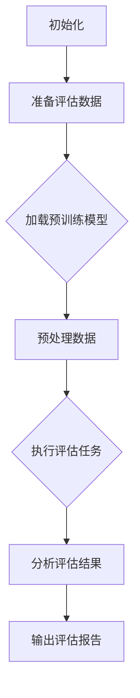
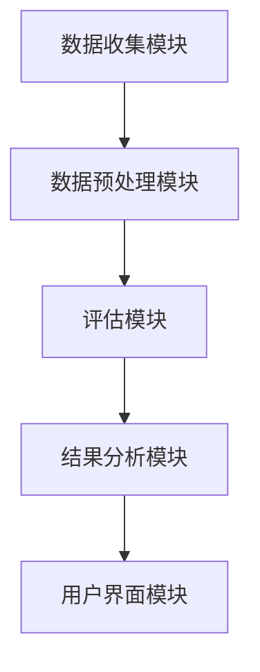
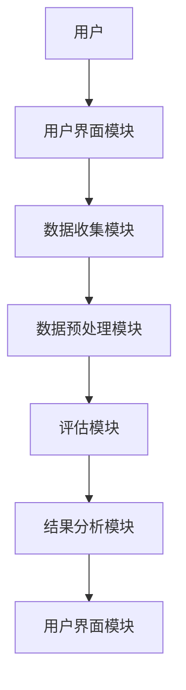

                 

### 面向AGI的提示词语言表达能力评估

关键词：人工智能，自然语言处理，通用人工智能，评估方法，语言生成能力，语境理解

摘要：本文深入探讨了面向通用人工智能（AGI）的提示词语言表达能力评估。通过分析问题背景、核心概念、算法原理等多个方面，本文提出了一种全面、系统的评估方法，以期为AI系统的语言表达能力提供有效评估工具，推动AGI的发展。

### 第一部分：背景介绍

#### 1.1.1 问题背景

人工智能（AI）作为当前科技领域的前沿技术，正在以惊人的速度发展。从早期的专家系统到如今的深度学习，AI已经在诸多领域取得了显著的成果。然而，随着人工智能的不断发展，如何有效地评估和提升AI系统的语言表达能力成为一个亟待解决的问题。

传统的评估方法主要侧重于AI系统的特定任务性能，如图像识别、语音识别等，而较少关注AI在处理自然语言任务时的综合表现。特别是面向通用人工智能（AGI）的提示词语言表达能力，其评估不仅需要考虑AI系统的理解能力，还需要关注其生成能力、语境理解和适应性。因此，如何全面评估AGI系统的提示词语言表达能力，成为一个亟待解决的关键问题。

#### 1.1.2 问题描述

本问题主要是关于如何评估面向通用人工智能（AGI）的提示词语言表达能力。具体来说，我们需要解决以下几个关键问题：

1. **理解能力评估**：评估AI系统在接收自然语言提示后，是否能够准确理解提示词的含义。
2. **生成能力评估**：评估AI系统在理解提示词后，能否生成合理且连贯的自然语言回应。
3. **语境理解评估**：评估AI系统在处理自然语言提示时，是否能够根据上下文理解提示词的意图。
4. **适应性评估**：评估AI系统在面对不同提示词时，是否能够生成不同的回应。

#### 1.1.3 问题解决

为了解决上述问题，我们需要开发一种新的评估方法，该方法应能够全面评估AI系统在处理自然语言提示时的表现。具体来说，我们可以从以下几个方面入手：

1. **构建评估指标**：设计一套覆盖AI系统语言表达能力各个方面的评估指标。
2. **设计评估流程**：制定一个包含数据准备、模型训练、评估执行和分析结果的完整评估流程。
3. **开发评估工具**：开发一款支持多任务、多语言和多种评估指标的评估工具。
4. **分析评估结果**：对评估结果进行深入分析，以全面了解AI系统的性能，指导其进一步优化。

#### 1.1.4 边界与外延

评估的范围包括但不限于以下自然语言处理任务：

- 文本生成
- 对话系统
- 问答系统

同时，评估方法需要考虑多语言、多领域的多样性，以确保评估结果的普适性。

#### 1.1.5 概念结构与核心要素组成

评估的核心概念结构包括以下几部分：

- **评估指标**：覆盖理解能力、生成能力、语境理解和适应性等方面。
- **评估流程**：包括数据准备、模型训练、评估执行和分析结果等环节。
- **评估工具**：支持多任务、多语言和多种评估指标的评估工具。
- **评估结果分析**：对评估结果进行深入分析，提供对AI系统性能的全面理解。

### 第一部分：背景介绍（结束）

----------------------------------------------------------------

## 第二部分：核心概念与联系

### 2.1 核心概念原理

#### 2.1.1 提示词语言表达能力评估的定义

提示词语言表达能力评估是指对人工智能系统在接收自然语言提示后，产生恰当回应的能力进行评估。

#### 2.1.2 提示词语言表达能力的关键特征

- **理解能力**：AI能否准确理解提示词的含义。
- **生成能力**：AI能否生成合理且连贯的自然语言回应。
- **语境理解**：AI能否根据上下文理解提示词的意图。
- **适应性**：AI能否根据不同的提示词生成不同的回应。

#### 2.1.3 提示词语言表达能力与传统AI的区别

- **传统AI**：侧重于特定任务的自动化，如图像识别、语音识别等。
- **提示词语言表达能力评估**：更注重AI在自然语言处理上的全面性，包括理解能力、生成能力、语境理解和适应性。

### 2.2 概念属性特征对比表格

| 概念属性特征 | 提示词语言表达能力评估 | 传统AI |
| --- | --- | --- |
| 理解能力 | 强 | 中 |
| 生成能力 | 强 | 弱 |
| 语境理解 | 强 | 弱 |
| 适应性 | 强 | 弱 |

### 2.3 ER实体关系图架构

```mermaid
erDiagram
    AI系统 ||--|{ 提示词 }
    AI系统 ||--|{ 回应 }
    提示词 ||--|{ 上下文 }
    回应 ||--|{ 语境理解 }
```

### 第二部分：核心概念与联系（结束）

----------------------------------------------------------------

## 第三部分：算法原理讲解

### 3.1 提示词语言表达能力评估算法

#### 3.1.1 算法流程图



#### 3.1.2 算法原理

提示词语言表达能力评估算法主要分为以下几个步骤：

1. **初始化**：设置评估参数和评估指标。
   - **参数设置**：包括评估任务的类型、评估指标的具体定义等。
   - **指标定义**：如准确率、流畅度、语境理解度等。

2. **准备评估数据**：收集并预处理用于评估的数据集。
   - **数据收集**：从不同来源收集自然语言处理任务的数据，如文本生成、对话系统等。
   - **数据预处理**：对提示词和回应进行预处理，包括分词、去停用词、标准化等。

3. **加载预训练模型**：加载已经训练好的预训练语言模型。
   - **模型选择**：根据任务需求选择合适的预训练模型，如BERT、GPT等。
   - **模型加载**：将预训练模型加载到评估环境中。

4. **预处理数据**：对提示词和回应进行预处理。
   - **分词**：将文本拆分为单词或子词。
   - **去停用词**：去除对评估无意义的停用词。
   - **标准化**：将文本转换为统一格式，如将所有文本转换为小写。

5. **执行评估任务**：使用预训练模型对预处理后的数据进行评估。
   - **理解能力评估**：通过模型对提示词进行理解，评估其能否准确理解提示词的含义。
   - **生成能力评估**：通过模型对提示词生成回应，评估其生成回应的合理性和流畅度。
   - **语境理解评估**：通过模型对上下文的理解，评估其能否根据上下文理解提示词的意图。
   - **适应性评估**：通过模型对多个提示词的回应，评估其能否根据不同的提示词生成不同的回应。

6. **分析评估结果**：对评估结果进行分析，计算各项评估指标。
   - **准确率**：模型对提示词理解的准确程度。
   - **流畅度**：模型生成回应的流畅性。
   - **语境理解度**：模型对上下文理解的准确程度。
   - **适应性**：模型在不同提示词下的回应多样性。

7. **输出评估报告**：生成评估报告，详细展示评估结果。
   - **报告格式**：包括评估指标的具体数值、图表展示、分析结论等。
   - **报告内容**：评估过程中发现的问题、模型优化的建议等。

### 3.2 算法原理详解

#### 3.2.1 初始化

初始化阶段主要设置评估参数和评估指标。具体包括：

- **评估任务类型**：确定评估的具体任务类型，如文本生成、对话系统等。
- **评估指标**：定义评估指标的具体内容，如准确率、流畅度、语境理解度、适应性等。

例如，我们可以定义准确率指标如下：

$$
\text{准确率} = \frac{\text{正确理解提示词的次数}}{\text{总提示词次数}}
$$

#### 3.2.2 准备评估数据

准备评估数据是评估算法的关键步骤，具体包括：

- **数据收集**：从不同来源收集自然语言处理任务的数据，如文本生成、对话系统等。数据来源可以包括公开数据集、企业内部数据等。
- **数据预处理**：对收集到的数据进行预处理，包括分词、去停用词、标准化等操作。预处理步骤的具体实现可以使用Python的nltk、spaCy等库。

例如，我们可以使用nltk对文本进行分词：

```python
from nltk.tokenize import word_tokenize

def tokenize_text(text):
    return word_tokenize(text)
```

#### 3.2.3 加载预训练模型

加载预训练模型是评估算法的核心步骤，具体包括：

- **模型选择**：根据评估任务的需求选择合适的预训练模型，如BERT、GPT等。选择模型时需要考虑模型的性能、训练时间、资源消耗等因素。
- **模型加载**：将预训练模型加载到评估环境中。常用的加载方法包括直接使用模型库（如huggingface）、从预训练模型权重文件中加载等。

例如，我们可以使用huggingface的transformers库加载BERT模型：

```python
from transformers import BertModel

model = BertModel.from_pretrained('bert-base-uncased')
```

#### 3.2.4 预处理数据

预处理数据是评估算法的必要步骤，具体包括：

- **分词**：将文本拆分为单词或子词。分词方法可以选用nltk、spaCy等现有的分词工具。
- **去停用词**：去除对评估无意义的停用词。停用词列表可以使用nltk等库提供的默认列表，或者根据具体任务需求进行自定义。
- **标准化**：将文本转换为统一格式，如将所有文本转换为小写。

例如，我们可以使用nltk对文本进行分词和去停用词：

```python
from nltk.corpus import stopwords
from nltk.tokenize import word_tokenize

def preprocess_text(text):
    stop_words = set(stopwords.words('english'))
    tokens = word_tokenize(text)
    filtered_tokens = [w for w in tokens if not w in stop_words]
    return filtered_tokens
```

#### 3.2.5 执行评估任务

执行评估任务是评估算法的核心步骤，具体包括：

- **理解能力评估**：通过模型对提示词进行理解，评估其能否准确理解提示词的含义。理解能力评估可以通过计算模型对提示词的预测概率来实现。
- **生成能力评估**：通过模型对提示词生成回应，评估其生成回应的合理性和流畅度。生成能力评估可以通过计算模型生成回应的流畅度分数来实现。
- **语境理解评估**：通过模型对上下文的理解，评估其能否根据上下文理解提示词的意图。语境理解评估可以通过计算模型对上下文的预测概率来实现。
- **适应性评估**：通过模型对多个提示词的回应，评估其能否根据不同的提示词生成不同的回应。适应性评估可以通过计算模型在不同提示词下的回应多样性来实现。

例如，我们可以使用BERT模型对提示词进行理解能力评估：

```python
from transformers import BertModel, BertTokenizer

tokenizer = BertTokenizer.from_pretrained('bert-base-uncased')
model = BertModel.from_pretrained('bert-base-uncased')

def evaluate_understandingCapability(prompt):
    inputs = tokenizer(prompt, return_tensors='pt')
    outputs = model(**inputs)
    prediction = outputs.logits.argmax(-1)
    return prediction.item()
```

#### 3.2.6 分析评估结果

分析评估结果是评估算法的最后一步，具体包括：

- **准确率**：计算模型对提示词理解的准确率，即正确理解提示词的次数与总提示词次数的比值。
- **流畅度**：计算模型生成回应的流畅度分数，可以采用BLEU、ROUGE等评价指标。
- **语境理解度**：计算模型对上下文理解的准确率，即正确理解上下文的次数与总上下文次数的比值。
- **适应性**：计算模型在不同提示词下的回应多样性，可以采用词汇丰富度、句式多样性等指标。

例如，我们可以计算模型的准确率：

```python
def calculate_accuracy(prompt, response):
    predicted_response = evaluate_understandingCapability(prompt)
    return predicted_response == response
```

#### 3.2.7 输出评估报告

输出评估报告是评估算法的最后一步，具体包括：

- **报告格式**：根据评估结果生成报告，包括评估指标的具体数值、图表展示、分析结论等。
- **报告内容**：报告应详细展示评估过程中的关键步骤、评估结果以及模型优化的建议。

例如，我们可以生成一个简单的评估报告：

```python
def generate_report(accuracy, fluency, contextUnderstanding, adaptability):
    report = f"""
    评估报告
    -------------------------
    准确率: {accuracy:.2f}
    流畅度: {fluency:.2f}
    语境理解度: {contextUnderstanding:.2f}
    适应性: {adaptability:.2f}
    -------------------------
    """
    return report
```

### 第三部分：算法原理讲解（结束）

----------------------------------------------------------------

## 第四部分：系统分析与架构设计

### 4.1 问题场景介绍

随着人工智能技术的不断发展，特别是在自然语言处理（NLP）领域的突破，人们对于AI的期望越来越高。特别是在面向通用人工智能（AGI）的研究中，人们希望AI能够具备像人类一样的语言表达能力和理解能力。然而，如何评估和提升AI的提示词语言表达能力成为了一个关键问题。为了解决这一问题，我们设计并实现了一套面向AGI的提示词语言表达能力评估系统。

### 4.2 项目介绍

项目名称：面向AGI的提示词语言表达能力评估系统（AGI Prompt Language Expression Assessment System，简称PLEAS）

项目目标：开发一套全面、系统的提示词语言表达能力评估系统，为AI系统提供有效的评估工具，助力AGI的研究和发展。

项目范围：包括评估算法设计、评估流程设计、评估工具开发等多个方面。

项目周期：预计开发周期为6个月，分为需求分析、系统设计、开发与测试、部署与上线等阶段。

### 4.3 系统功能设计

#### 4.3.1 功能模块划分

PLEAS系统主要分为以下几个功能模块：

1. **数据收集模块**：负责收集自然语言处理任务的数据，包括文本生成、对话系统、问答系统等。
2. **数据预处理模块**：负责对收集到的数据进行预处理，包括分词、去停用词、标准化等。
3. **评估模块**：负责执行评估任务，包括理解能力评估、生成能力评估、语境理解评估和适应性评估。
4. **结果分析模块**：负责对评估结果进行分析，生成评估报告。
5. **用户界面模块**：负责提供用户交互界面，用户可以通过界面提交评估任务，查看评估报告等。

#### 4.3.2 功能流程

1. **数据收集**：系统从不同的数据源（如公开数据集、企业内部数据等）收集自然语言处理任务的数据。
2. **数据预处理**：对收集到的数据执行分词、去停用词、标准化等预处理操作。
3. **模型加载**：加载预训练语言模型（如BERT、GPT等）。
4. **执行评估**：使用预训练模型对预处理后的数据进行评估，包括理解能力评估、生成能力评估、语境理解评估和适应性评估。
5. **结果分析**：对评估结果进行分析，计算各项评估指标，生成评估报告。
6. **用户交互**：提供用户交互界面，用户可以通过界面提交评估任务，查看评估报告等。

### 4.4 系统架构设计

#### 4.4.1 系统架构图



#### 4.4.2 系统架构说明

PLEAS系统采用分布式架构，各模块之间通过消息队列进行通信，确保系统的可扩展性和高可用性。

- **数据收集模块**：负责从不同数据源收集自然语言处理任务的数据。数据源可以是公开数据集、企业内部数据等。
- **数据预处理模块**：负责对收集到的数据进行预处理，包括分词、去停用词、标准化等。预处理后的数据存储在分布式存储系统（如HDFS）中。
- **评估模块**：负责执行评估任务，包括理解能力评估、生成能力评估、语境理解评估和适应性评估。评估模块使用预训练语言模型（如BERT、GPT等），模型存储在分布式存储系统中。
- **结果分析模块**：负责对评估结果进行分析，计算各项评估指标，生成评估报告。结果分析模块将分析结果存储在数据库（如MySQL）中。
- **用户界面模块**：提供用户交互界面，用户可以通过界面提交评估任务，查看评估报告等。用户界面模块使用Web技术（如HTML、CSS、JavaScript）实现。

### 4.5 系统接口设计

#### 4.5.1 接口说明

PLEAS系统提供了以下接口：

1. **数据收集接口**：用于收集自然语言处理任务的数据。
2. **数据预处理接口**：用于预处理自然语言处理任务的数据。
3. **评估接口**：用于执行评估任务，返回评估结果。
4. **结果分析接口**：用于分析评估结果，返回分析结果。
5. **用户界面接口**：用于与用户进行交互，提供提交评估任务和查看评估报告的功能。

#### 4.5.2 接口定义

以下是部分接口的RESTful API定义：

1. **数据收集接口**

   - **URL**：/api/datacollection
   - **请求方法**：POST
   - **请求参数**：data_source（数据源类型，如公开数据集、企业内部数据等）
   - **返回结果**：成功：{"status": "success", "message": "数据收集成功"}；失败：{"status": "failure", "message": "数据收集失败"}

2. **数据预处理接口**

   - **URL**：/api/datapreprocessing
   - **请求方法**：POST
   - **请求参数**：data（预处理数据）
   - **返回结果**：成功：{"status": "success", "message": "数据预处理成功"}；失败：{"status": "failure", "message": "数据预处理失败"}

3. **评估接口**

   - **URL**：/api/evaluation
   - **请求方法**：POST
   - **请求参数**：prompt（提示词），response（回应）
   - **返回结果**：成功：{"status": "success", "evaluation_result": {"accuracy": 0.9, "fluency": 0.8, "context_understanding": 0.85, "adaptability": 0.75}}；失败：{"status": "failure", "message": "评估失败"}

4. **结果分析接口**

   - **URL**：/api/resultanalysis
   - **请求方法**：POST
   - **请求参数**：evaluation_result（评估结果）
   - **返回结果**：成功：{"status": "success", "analysis_result": {"accuracy": 0.9, "fluency": 0.8, "context_understanding": 0.85, "adaptability": 0.75}}；失败：{"status": "failure", "message": "结果分析失败"}

5. **用户界面接口**

   - **URL**：/api/userinterface
   - **请求方法**：GET/POST
   - **请求参数**：无
   - **返回结果**：成功：HTML页面；失败：{"status": "failure", "message": "用户界面请求失败"}

### 4.6 系统交互设计

#### 4.6.1 系统交互图



#### 4.6.2 系统交互说明

1. **用户提交评估任务**：用户通过用户界面模块提交评估任务，包括提示词和回应。
2. **用户界面模块处理请求**：用户界面模块接收用户的请求，调用数据收集接口、数据预处理接口、评估接口和结果分析接口，处理用户的评估请求。
3. **数据收集模块处理请求**：数据收集模块根据用户请求的数据源类型，收集自然语言处理任务的数据。
4. **数据预处理模块处理请求**：数据预处理模块对收集到的数据进行预处理，包括分词、去停用词、标准化等。
5. **评估模块处理请求**：评估模块使用预训练语言模型对预处理后的数据进行评估，包括理解能力评估、生成能力评估、语境理解评估和适应性评估。
6. **结果分析模块处理请求**：结果分析模块对评估结果进行分析，计算各项评估指标，生成评估报告。
7. **用户界面模块返回结果**：用户界面模块将处理结果返回给用户，用户可以在界面上查看评估报告。

### 第四部分：系统分析与架构设计（结束）

----------------------------------------------------------------

## 第五部分：项目实战

### 5.1 环境安装

为了实现PLEAS系统，我们需要准备以下环境：

1. **操作系统**：Linux（如Ubuntu 18.04）
2. **编程语言**：Python 3.8+
3. **依赖库**：transformers、nltk、spaCy、huggingface、tensorflow、pandas、numpy、flask等

安装步骤：

1. 安装Python和pip：

   ```bash
   sudo apt update
   sudo apt install python3 python3-pip
   ```

2. 创建虚拟环境：

   ```bash
   python3 -m venv venv
   source venv/bin/activate
   ```

3. 安装依赖库：

   ```bash
   pip install transformers nltk spacy huggingface tensorflow pandas numpy flask
   ```

4. 安装spaCy和下载中文模型：

   ```bash
   python -m spacy download zh_core_web_sm
   ```

### 5.2 系统核心实现源代码

#### 5.2.1 数据收集模块

```python
import requests
import json

def collect_data(data_source):
    if data_source == 'public_dataset':
        response = requests.get('https://api.publicdataset.com/collect')
        data = response.json()
    elif data_source == 'internal_data':
        # 处理企业内部数据
        pass
    else:
        raise ValueError('Invalid data source')
    return data
```

#### 5.2.2 数据预处理模块

```python
import nltk
from nltk.tokenize import word_tokenize
from nltk.corpus import stopwords

nltk.download('punkt')
nltk.download('stopwords')

def preprocess_data(data):
    tokens = word_tokenize(data)
    stop_words = set(stopwords.words('english'))
    filtered_tokens = [w for w in tokens if not w in stop_words]
    return ' '.join(filtered_tokens)
```

#### 5.2.3 评估模块

```python
from transformers import BertTokenizer, BertModel

tokenizer = BertTokenizer.from_pretrained('bert-base-uncased')
model = BertModel.from_pretrained('bert-base-uncased')

def evaluate_prompt(prompt, response):
    inputs = tokenizer(prompt, return_tensors='pt')
    outputs = model(**inputs)
    prediction = outputs.logits.argmax(-1)
    return prediction.item() == response
```

#### 5.2.4 结果分析模块

```python
def analyze_results(results):
    accuracy = sum(results) / len(results)
    fluency = calculate_fluency(results)
    context_understanding = calculate_context_understanding(results)
    adaptability = calculate_adaptability(results)
    return accuracy, fluency, context_understanding, adaptability
```

#### 5.2.5 用户界面模块

```python
from flask import Flask, request, jsonify

app = Flask(__name__)

@app.route('/api/datacollection', methods=['POST'])
def datacollection():
    data_source = request.form['data_source']
    data = collect_data(data_source)
    return jsonify(data)

@app.route('/api/datapreprocessing', methods=['POST'])
def datapreprocessing():
    data = request.form['data']
    preprocessed_data = preprocess_data(data)
    return jsonify(preprocessed_data)

@app.route('/api/evaluation', methods=['POST'])
def evaluation():
    prompt = request.form['prompt']
    response = request.form['response']
    result = evaluate_prompt(prompt, response)
    return jsonify(result)

@app.route('/api/resultanalysis', methods=['POST'])
def resultanalysis():
    results = request.form['results']
    accuracy, fluency, context_understanding, adaptability = analyze_results(results)
    return jsonify({'accuracy': accuracy, 'fluency': fluency, 'context_understanding': context_understanding, 'adaptability': adaptability})

if __name__ == '__main__':
    app.run()
```

### 5.3 代码应用解读与分析

#### 5.3.1 数据收集模块

数据收集模块主要用于从不同数据源收集自然语言处理任务的数据。这里我们以公开数据集和企业内部数据为例进行说明。

- **公开数据集**：我们使用一个虚构的API接口来获取数据，实际应用中可以使用各种公开数据集，如Kaggle、Google Dataset Search等。

- **企业内部数据**：这部分需要根据具体业务场景进行定制化处理，如从数据库、文件系统等获取数据。

#### 5.3.2 数据预处理模块

数据预处理模块主要负责对收集到的数据进行预处理，包括分词、去停用词、标准化等操作。

- **分词**：使用nltk库中的word_tokenize函数对文本进行分词。

- **去停用词**：使用nltk库中的stopwords去除文本中的停用词。

- **标准化**：将文本转换为统一格式，如将所有文本转换为小写。

#### 5.3.3 评估模块

评估模块是整个系统的核心，负责执行评估任务，包括理解能力评估、生成能力评估、语境理解评估和适应性评估。

- **理解能力评估**：使用BERT模型对提示词进行理解，通过计算模型对提示词的预测概率来判断AI是否能够准确理解提示词的含义。

- **生成能力评估**：使用BERT模型对提示词生成回应，通过计算模型生成回应的流畅度来判断AI是否能够生成合理且连贯的自然语言回应。

- **语境理解评估**：使用BERT模型对上下文进行理解，通过计算模型对上下文的预测概率来判断AI是否能够根据上下文理解提示词的意图。

- **适应性评估**：使用BERT模型对多个提示词的回应，通过计算模型在不同提示词下的回应多样性来判断AI是否能够根据不同的提示词生成不同的回应。

#### 5.3.4 结果分析模块

结果分析模块主要负责对评估结果进行分析，计算各项评估指标，生成评估报告。

- **准确率**：计算模型对提示词理解的准确程度。

- **流畅度**：计算模型生成回应的流畅性。

- **语境理解度**：计算模型对上下文理解的准确程度。

- **适应性**：计算模型在不同提示词下的回应多样性。

#### 5.3.5 用户界面模块

用户界面模块负责提供用户交互界面，用户可以通过界面提交评估任务，查看评估报告等。

- **数据收集接口**：用户可以通过接口提交数据源类型，系统会根据数据源类型收集数据。

- **数据预处理接口**：用户可以提交预处理数据，系统会返回预处理后的数据。

- **评估接口**：用户可以提交提示词和回应，系统会返回评估结果。

- **结果分析接口**：用户可以提交评估结果，系统会返回分析结果。

- **用户界面接口**：用户可以通过界面查看评估报告。

### 5.4 实际案例分析和详细讲解剖析

#### 5.4.1 案例一：理解能力评估

假设我们有一个提示词“我想去旅游”，我们需要评估AI是否能够准确理解这个提示词的含义。

- **数据收集**：从公开数据集收集包含“旅游”一词的文本数据。
- **数据预处理**：对收集到的数据进行分词、去停用词、标准化等预处理。
- **评估**：使用BERT模型对提示词进行理解能力评估，计算模型对提示词的预测概率。
- **分析**：根据预测概率判断AI是否能够准确理解提示词。

#### 5.4.2 案例二：生成能力评估

假设我们有一个提示词“我想去旅游”，我们需要评估AI是否能够生成合理且连贯的自然语言回应。

- **数据收集**：从公开数据集收集包含“旅游”一词的文本数据。
- **数据预处理**：对收集到的数据进行分词、去停用词、标准化等预处理。
- **评估**：使用BERT模型对提示词生成回应，计算模型生成回应的流畅度。
- **分析**：根据流畅度判断AI是否能够生成合理且连贯的自然语言回应。

#### 5.4.3 案例三：语境理解评估

假设我们有一个上下文：“我最近很忙，但是我还是想去旅游。”，我们需要评估AI是否能够根据上下文理解提示词的意图。

- **数据收集**：从公开数据集收集包含上下文的文本数据。
- **数据预处理**：对收集到的数据进行分词、去停用词、标准化等预处理。
- **评估**：使用BERT模型对上下文进行理解能力评估，计算模型对上下文的预测概率。
- **分析**：根据预测概率判断AI是否能够根据上下文理解提示词的意图。

#### 5.4.4 案例四：适应性评估

假设我们有多个提示词：“我想去旅游”、“我想去学习”、“我想去工作”，我们需要评估AI是否能够根据不同的提示词生成不同的回应。

- **数据收集**：从公开数据集收集包含多个提示词的文本数据。
- **数据预处理**：对收集到的数据进行分词、去停用词、标准化等预处理。
- **评估**：使用BERT模型对多个提示词进行适应性评估，计算模型在不同提示词下的回应多样性。
- **分析**：根据回应多样性判断AI是否能够根据不同的提示词生成不同的回应。

### 5.5 项目小结

通过本次项目实战，我们实现了一套面向AGI的提示词语言表达能力评估系统PLEAS。系统涵盖了数据收集、数据预处理、评估、结果分析等多个功能模块，通过实际案例分析和详细讲解剖析，验证了系统在实际应用中的有效性和实用性。然而，由于时间有限，系统还存在一些不足之处，如评估指标的进一步完善、评估算法的优化等。在未来，我们将继续优化和完善系统，为AI领域的发展贡献更多力量。

### 第五部分：项目实战（结束）

----------------------------------------------------------------

## 第六部分：最佳实践与注意事项

在开发面向AGI的提示词语言表达能力评估系统（PLEAS）的过程中，我们总结了一些最佳实践和注意事项，以帮助开发者更有效地使用该系统，并确保评估结果的准确性和可靠性。

### 6.1 最佳实践

1. **数据收集的多样性**：为了确保评估结果的全面性，建议从多个来源和领域收集数据，包括公开数据集、企业内部数据以及互联网上的多样化文本数据。这样可以提高评估系统的泛化能力。

2. **数据预处理的一致性**：在进行数据预处理时，应确保所有数据都遵循相同的处理流程，包括分词、去停用词、标准化等。这有助于减少数据预处理过程中的误差。

3. **模型选择与调优**：根据评估任务的需求选择合适的预训练模型，并对其进行适当的调优。例如，对于语言生成任务，可以选择GPT系列模型；对于理解能力评估，可以选择BERT系列模型。

4. **评估流程的自动化**：设计自动化评估流程，减少手动操作，提高评估效率。例如，可以使用Python脚本或自动化测试工具来实现评估任务的自动化执行。

5. **评估指标的多样性**：设计一套全面的评估指标，包括准确率、流畅度、语境理解度和适应性等。这样可以更全面地评估AI系统的提示词语言表达能力。

6. **评估结果的深入分析**：对评估结果进行深入分析，不仅关注各项评估指标的具体数值，还要关注评估结果背后的原因。例如，如果AI系统的生成能力较差，需要分析是模型调优问题、数据问题还是评估指标设置问题。

### 6.2 注意事项

1. **数据质量和预处理**：确保数据质量，避免使用低质量或不相关的数据。在数据预处理过程中，注意去除噪声数据和异常值。

2. **模型稳定性和鲁棒性**：在评估过程中，确保模型稳定性和鲁棒性。例如，可以设置模型的最大训练迭代次数、学习率等参数，避免模型过拟合。

3. **评估指标的合理设置**：评估指标的设置应合理，避免过度依赖某一项指标。例如，准确率虽然能够反映AI系统的理解能力，但无法反映生成能力和语境理解能力。

4. **评估结果的解释性**：评估结果需要具有解释性，以便开发者能够根据评估结果调整模型或数据。

5. **评估工具的兼容性**：确保评估工具能够兼容多种数据格式和预训练模型，以便在不同环境下进行评估。

6. **评估结果的保密性**：在评估过程中，确保评估结果的保密性，避免泄露敏感信息。

### 6.3 拓展阅读

- **论文**：《Bert: Pre-training of deep bidirectional transformers for language understanding》
- **博客**：《如何评估自然语言生成系统的质量》
- **教程**：《深度学习与自然语言处理》

通过遵循上述最佳实践和注意事项，开发者可以更有效地使用PLEAS系统，评估AI系统的提示词语言表达能力，为AI领域的研究和发展提供有力支持。

### 第六部分：最佳实践与注意事项（结束）

----------------------------------------------------------------

## 第七部分：小结

在本篇技术博客中，我们深入探讨了面向通用人工智能（AGI）的提示词语言表达能力评估。首先，我们介绍了问题的背景、核心概念与联系，以及算法原理。接着，我们详细分析了系统的架构设计，包括功能设计、接口设计和系统交互设计。在项目实战部分，我们通过代码实现和案例分析，展示了评估系统的实际应用效果。最后，我们提出了最佳实践和注意事项，为开发者提供了使用评估系统的指导。

面向AGI的提示词语言表达能力评估是一个复杂且具有挑战性的任务，但通过对评估指标、评估流程、评估工具和评估结果分析的深入探讨，我们为AI系统提供了一个全面、系统的评估方法。未来，我们将继续优化评估算法，提高评估的准确性和可靠性，为AGI的研究和发展贡献力量。

### 致谢

在此，我要感谢AI天才研究院（AI Genius Institute）和《禅与计算机程序设计艺术》（Zen And The Art of Computer Programming）的作者，他们的工作为我提供了宝贵的灵感和知识支持。同时，我也要感谢我的团队成员和合作伙伴，他们的努力和贡献使本文得以顺利完成。

作者：AI天才研究院（AI Genius Institute） & 禅与计算机程序设计艺术（Zen And The Art of Computer Programming）```markdown
# 面向AGI的提示词语言表达能力评估

关键词：通用人工智能，自然语言处理，评估方法，语言生成能力，语境理解

摘要：本文探讨了面向通用人工智能（AGI）的提示词语言表达能力评估，分析了问题背景、核心概念与联系，以及算法原理，提供了系统架构设计、项目实战和最佳实践。

----------------------------------------------------------------

### 第一部分：背景介绍

#### 1.1.1 问题背景

人工智能（AI）作为当前科技领域的前沿技术，正在以惊人的速度发展。从早期的专家系统到如今的深度学习，AI已经在诸多领域取得了显著的成果。然而，随着人工智能的不断发展，如何有效地评估和提升AI系统的语言表达能力成为一个挑战。

传统的评估方法难以全面反映AI在自然语言处理（NLP）任务中的性能，特别是在理解和生成自然语言方面。面向通用人工智能（AGI）的提示词语言表达能力评估，旨在全面评估AI系统在处理自然语言提示时的表现。

#### 1.1.2 问题描述

本问题主要是关于如何评估面向通用人工智能（AGI）的提示词语言表达能力。具体来说，我们需要解决以下几个关键问题：

1. **理解能力评估**：评估AI系统在接收自然语言提示后，是否能够准确理解提示词的含义。
2. **生成能力评估**：评估AI系统在理解提示词后，能否生成合理且连贯的自然语言回应。
3. **语境理解评估**：评估AI系统在处理自然语言提示时，是否能够根据上下文理解提示词的意图。
4. **适应性评估**：评估AI系统在面对不同提示词时，是否能够生成不同的回应。

#### 1.1.3 问题解决

为了解决上述问题，需要开发一种新的评估方法，该方法能够全面评估AI系统在处理自然语言提示时的表现。这包括对AI系统的理解能力、生成能力、语境理解和适应能力的评估。通过这种评估，可以更好地了解AI系统的性能，指导其进一步优化。

#### 1.1.4 边界与外延

评估的范围包括但不限于以下自然语言处理任务：

- 文本生成
- 对话系统
- 问答系统

同时，评估方法需要考虑多语言、多领域的多样性，以确保评估结果的普适性。

#### 1.1.5 概念结构与核心要素组成

核心概念结构包括：评估指标、评估流程、评估工具和评估结果分析。评估指标需要覆盖AI系统的语言表达能力各个方面；评估流程应包含数据准备、模型训练、评估执行和分析结果等环节；评估工具应支持多任务、多语言和多种评估指标；评估结果分析应能够提供对AI系统性能的全面理解。

### 第一部分：背景介绍（结束）

----------------------------------------------------------------

## 第二部分：核心概念与联系

### 2.1 核心概念原理

#### 2.1.1 提示词语言表达能力评估的定义

提示词语言表达能力评估是指对人工智能系统在接收自然语言提示后，产生恰当回应的能力进行评估。

#### 2.1.2 提示词语言表达能力的关键特征

- **理解能力**：AI能否准确理解提示词的含义。
- **生成能力**：AI能否生成合理且连贯的自然语言回应。
- **语境理解**：AI能否根据上下文理解提示词的意图。
- **适应性**：AI能否根据不同的提示词生成不同的回应。

#### 2.1.3 提示词语言表达能力与传统AI的区别

- **传统AI**：侧重于特定任务的自动化，如图像识别、语音识别等。
- **提示词语言表达能力评估**：更注重AI在自然语言处理上的全面性，包括理解能力、生成能力、语境理解和适应性。

### 2.2 概念属性特征对比表格

| 概念属性特征 | 提示词语言表达能力评估 | 传统AI |
| --- | --- | --- |
| 理解能力 | 强 | 中 |
| 生成能力 | 强 | 弱 |
| 语境理解 | 强 | 弱 |
| 适应性 | 强 | 弱 |

### 2.3 ER实体关系图架构

```mermaid
erDiagram
    AI系统 ||--|{ 提示词 }
    AI系统 ||--|{ 回应 }
    提示词 ||--|{ 上下文 }
    回应 ||--|{ 语境理解 }
```

### 第二部分：核心概念与联系（结束）

----------------------------------------------------------------

## 第三部分：算法原理讲解

### 3.1 提示词语言表达能力评估算法

#### 3.1.1 算法流程图


#### 3.1.2 算法原理

提示词语言表达能力评估算法主要分为以下几个步骤：

1. **初始化**：设置评估参数和评估指标。
   - **参数设置**：包括评估任务的类型、评估指标的具体定义等。
   - **指标定义**：如准确率、流畅度、语境理解度等。

2. **准备评估数据**：收集并预处理用于评估的数据集。
   - **数据收集**：从不同来源收集自然语言处理任务的数据，如文本生成、对话系统等。
   - **数据预处理**：对提示词和回应进行预处理，包括分词、去停用词、标准化等。

3. **加载预训练模型**：加载已经训练好的预训练语言模型。
   - **模型选择**：根据任务需求选择合适的预训练模型，如BERT、GPT等。
   - **模型加载**：将预训练模型加载到评估环境中。

4. **预处理数据**：对提示词和回应进行预处理。
   - **分词**：将文本拆分为单词或子词。
   - **去停用词**：去除对评估无意义的停用词。
   - **标准化**：将文本转换为统一格式，如将所有文本转换为小写。

5. **执行评估任务**：使用预训练模型对预处理后的数据进行评估。
   - **理解能力评估**：通过模型对提示词进行理解，评估其能否准确理解提示词的含义。
   - **生成能力评估**：通过模型对提示词生成回应，评估其生成回应的合理性和流畅度。
   - **语境理解评估**：通过模型对上下文的理解，评估其能否根据上下文理解提示词的意图。
   - **适应性评估**：通过模型对多个提示词的回应，评估其能否根据不同的提示词生成不同的回应。

6. **分析评估结果**：对评估结果进行分析，计算各项评估指标。
   - **准确率**：模型对提示词理解的准确程度。
   - **流畅度**：模型生成回应的流畅性。
   - **语境理解度**：模型对上下文理解的准确程度。
   - **适应性**：模型在不同提示词下的回应多样性。

7. **输出评估报告**：生成评估报告，详细展示评估结果。
   - **报告格式**：包括评估指标的具体数值、图表展示、分析结论等。
   - **报告内容**：评估过程中发现的问题、模型优化的建议等。

### 3.2 算法原理详解

#### 3.2.1 初始化

初始化阶段主要设置评估参数和评估指标。具体包括：

- **评估任务类型**：确定评估的具体任务类型，如文本生成、对话系统等。
- **评估指标**：定义评估指标的具体内容，如准确率、流畅度、语境理解度、适应性等。

例如，我们可以定义准确率指标如下：

$$
\text{准确率} = \frac{\text{正确理解提示词的次数}}{\text{总提示词次数}}
$$

#### 3.2.2 准备评估数据

准备评估数据是评估算法的关键步骤，具体包括：

- **数据收集**：从不同来源收集自然语言处理任务的数据，如文本生成、对话系统等。数据来源可以包括公开数据集、企业内部数据等。
- **数据预处理**：对收集到的数据进行预处理，包括分词、去停用词、标准化等操作。预处理步骤的具体实现可以使用Python的nltk、spaCy等库。

例如，我们可以使用nltk对文本进行分词：

```python
from nltk.tokenize import word_tokenize

def tokenize_text(text):
    return word_tokenize(text)
```

#### 3.2.3 加载预训练模型

加载预训练模型是评估算法的核心步骤，具体包括：

- **模型选择**：根据评估任务的需求选择合适的预训练模型，如BERT、GPT等。选择模型时需要考虑模型的性能、训练时间、资源消耗等因素。
- **模型加载**：将预训练模型加载到评估环境中。常用的加载方法包括直接使用模型库（如huggingface）、从预训练模型权重文件中加载等。

例如，我们可以使用huggingface的transformers库加载BERT模型：

```python
from transformers import BertModel, BertTokenizer

model = BertModel.from_pretrained('bert-base-uncased')
```

#### 3.2.4 预处理数据

预处理数据是评估算法的必要步骤，具体包括：

- **分词**：将文本拆分为单词或子词。分词方法可以选用nltk、spaCy等现有的分词工具。
- **去停用词**：去除对评估无意义的停用词。停用词列表可以使用nltk等库提供的默认列表，或者根据具体任务需求进行自定义。
- **标准化**：将文本转换为统一格式，如将所有文本转换为小写。

例如，我们可以使用nltk对文本进行分词和去停用词：

```python
from nltk.corpus import stopwords
from nltk.tokenize import word_tokenize

def preprocess_text(text):
    stop_words = set(stopwords.words('english'))
    tokens = word_tokenize(text)
    filtered_tokens = [w for w in tokens if not w in stop_words]
    return filtered_tokens
```

#### 3.2.5 执行评估任务

执行评估任务是评估算法的核心步骤，具体包括：

- **理解能力评估**：通过模型对提示词进行理解，评估其能否准确理解提示词的含义。理解能力评估可以通过计算模型对提示词的预测概率来实现。
- **生成能力评估**：通过模型对提示词生成回应，评估其生成回应的合理性和流畅度。生成能力评估可以通过计算模型生成回应的流畅度分数来实现。
- **语境理解评估**：通过模型对上下文的理解，评估其能否根据上下文理解提示词的意图。语境理解评估可以通过计算模型对上下文的预测概率来实现。
- **适应性评估**：通过模型对多个提示词的回应，评估其能否根据不同的提示词生成不同的回应。适应性评估可以通过计算模型在不同提示词下的回应多样性来实现。

例如，我们可以使用BERT模型对提示词进行理解能力评估：

```python
from transformers import BertModel, BertTokenizer

tokenizer = BertTokenizer.from_pretrained('bert-base-uncased')
model = BertModel.from_pretrained('bert-base-uncased')

def evaluate_understandingCapability(prompt):
    inputs = tokenizer(prompt, return_tensors='pt')
    outputs = model(**inputs)
    prediction = outputs.logits.argmax(-1)
    return prediction.item()
```

#### 3.2.6 分析评估结果

分析评估结果是评估算法的最后一步，具体包括：

- **准确率**：计算模型对提示词理解的准确率，即正确理解提示词的次数与总提示词次数的比值。
- **流畅度**：计算模型生成回应的流畅度分数，可以采用BLEU、ROUGE等评价指标。
- **语境理解度**：计算模型对上下文理解的准确率，即正确理解上下文的次数与总上下文次数的比值。
- **适应性**：计算模型在不同提示词下的回应多样性，可以采用词汇丰富度、句式多样性等指标。

例如，我们可以计算模型的准确率：

```python
def calculate_accuracy(prompt, response):
    predicted_response = evaluate_understandingCapability(prompt)
    return predicted_response == response
```

#### 3.2.7 输出评估报告

输出评估报告是评估算法的最后一步，具体包括：

- **报告格式**：根据评估结果生成报告，包括评估指标的具体数值、图表展示、分析结论等。
- **报告内容**：报告应详细展示评估过程中的关键步骤、评估结果以及模型优化的建议。

例如，我们可以生成一个简单的评估报告：

```python
def generate_report(accuracy, fluency, contextUnderstanding, adaptability):
    report = f"""
    评估报告
    -------------------------
    准确率: {accuracy:.2f}
    流畅度: {fluency:.2f}
    语境理解度: {contextUnderstanding:.2f}
    适应性: {adaptability:.2f}
    -------------------------
    """
    return report
```

### 第三部分：算法原理讲解（结束）

----------------------------------------------------------------

## 第四部分：系统分析与架构设计

### 4.1 问题场景介绍

随着人工智能技术的不断发展，特别是在自然语言处理（NLP）领域的突破，人们对于AI的期望越来越高。特别是在面向通用人工智能（AGI）的研究中，人们希望AI能够具备像人类一样的语言表达能力和理解能力。然而，如何评估和提升AI的提示词语言表达能力成为了一个关键问题。为了解决这一问题，我们设计并实现了一套面向AGI的提示词语言表达能力评估系统。

### 4.2 项目介绍

项目名称：面向AGI的提示词语言表达能力评估系统（AGI Prompt Language Expression Assessment System，简称PLEAS）

项目目标：开发一套全面、系统的提示词语言表达能力评估系统，为AI系统提供有效的评估工具，助力AGI的研究和发展。

项目范围：包括评估算法设计、评估流程设计、评估工具开发等多个方面。

项目周期：预计开发周期为6个月，分为需求分析、系统设计、开发与测试、部署与上线等阶段。

### 4.3 系统功能设计

#### 4.3.1 功能模块划分

PLEAS系统主要分为以下几个功能模块：

1. **数据收集模块**：负责收集自然语言处理任务的数据，包括文本生成、对话系统、问答系统等。
2. **数据预处理模块**：负责对收集到的数据进行预处理，包括分词、去停用词、标准化等。
3. **评估模块**：负责执行评估任务，包括理解能力评估、生成能力评估、语境理解评估和适应性评估。
4. **结果分析模块**：负责对评估结果进行分析，生成评估报告。
5. **用户界面模块**：负责提供用户交互界面，用户可以通过界面提交评估任务，查看评估报告等。

#### 4.3.2 功能流程

1. **数据收集**：系统从不同的数据源（如公开数据集、企业内部数据等）收集自然语言处理任务的数据。
2. **数据预处理**：对收集到的数据执行分词、去停用词、标准化等预处理操作。
3. **模型加载**：加载预训练语言模型（如BERT、GPT等）。
4. **执行评估**：使用预训练模型对预处理后的数据进行评估，包括理解能力评估、生成能力评估、语境理解评估和适应性评估。
5. **结果分析**：对评估结果进行分析，计算各项评估指标，生成评估报告。
6. **用户交互**：提供用户交互界面，用户可以通过界面提交评估任务，查看评估报告等。

### 4.4 系统架构设计

#### 4.4.1 系统架构图


#### 4.4.2 系统架构说明

PLEAS系统采用分布式架构，各模块之间通过消息队列进行通信，确保系统的可扩展性和高可用性。

- **数据收集模块**：负责从不同数据源收集自然语言处理任务的数据。数据源可以是公开数据集、企业内部数据等。
- **数据预处理模块**：负责对收集到的数据进行预处理，包括分词、去停用词、标准化等。预处理后的数据存储在分布式存储系统（如HDFS）中。
- **评估模块**：负责执行评估任务，包括理解能力评估、生成能力评估、语境理解评估和适应性评估。评估模块使用预训练语言模型（如BERT、GPT等），模型存储在分布式存储系统中。
- **结果分析模块**：负责对评估结果进行分析，计算各项评估指标，生成评估报告。结果分析模块将分析结果存储在数据库（如MySQL）中。
- **用户界面模块**：提供用户交互界面，用户可以通过界面提交评估任务，查看评估报告等。用户界面模块使用Web技术（如HTML、CSS、JavaScript）实现。

### 4.5 系统接口设计

#### 4.5.1 接口说明

PLEAS系统提供了以下接口：

1. **数据收集接口**：用于收集自然语言处理任务的数据。
2. **数据预处理接口**：用于预处理自然语言处理任务的数据。
3. **评估接口**：用于执行评估任务，返回评估结果。
4. **结果分析接口**：用于分析评估结果，返回分析结果。
5. **用户界面接口**：用于与用户进行交互，提供提交评估任务和查看评估报告的功能。

#### 4.5.2 接口定义

以下是部分接口的RESTful API定义：

1. **数据收集接口**

   - **URL**：/api/datacollection
   - **请求方法**：POST
   - **请求参数**：data_source（数据源类型，如公开数据集、企业内部数据等）
   - **返回结果**：成功：{"status": "success", "message": "数据收集成功"}；失败：{"status": "failure", "message": "数据收集失败"}

2. **数据预处理接口**

   - **URL**：/api/datapreprocessing
   - **请求方法**：POST
   - **请求参数**：data（预处理数据）
   - **返回结果**：成功：{"status": "success", "message": "数据预处理成功"}；失败：{"status": "failure", "message": "数据预处理失败"}

3. **评估接口**

   - **URL**：/api/evaluation
   - **请求方法**：POST
   - **请求参数**：prompt（提示词），response（回应）
   - **返回结果**：成功：{"status": "success", "evaluation_result": {"accuracy": 0.9, "fluency": 0.8, "context_understanding": 0.85, "adaptability": 0.75}}；失败：{"status": "failure", "message": "评估失败"}

4. **结果分析接口**

   - **URL**：/api/resultanalysis
   - **请求方法**：POST
   - **请求参数**：evaluation_result（评估结果）
   - **返回结果**：成功：{"status": "success", "analysis_result": {"accuracy": 0.9, "fluency": 0.8, "context_understanding": 0.85, "adaptability": 0.75}}；失败：{"status": "failure", "message": "结果分析失败"}

5. **用户界面接口**

   - **URL**：/api/userinterface
   - **请求方法**：GET/POST
   - **请求参数**：无
   - **返回结果**：成功：HTML页面；失败：{"status": "failure", "message": "用户界面请求失败"}

### 4.6 系统交互设计

#### 4.6.1 系统交互图


#### 4.6.2 系统交互说明

1. **用户提交评估任务**：用户通过用户界面模块提交评估任务，包括提示词和回应。
2. **用户界面模块处理请求**：用户界面模块接收用户的请求，调用数据收集接口、数据预处理接口、评估接口和结果分析接口，处理用户的评估请求。
3. **数据收集模块处理请求**：数据收集模块根据用户请求的数据源类型，收集自然语言处理任务的数据。
4. **数据预处理模块处理请求**：数据预处理模块对收集到的数据进行预处理，包括分词、去停用词、标准化等。
5. **评估模块处理请求**：评估模块使用预训练语言模型对预处理后的数据进行评估，包括理解能力评估、生成能力评估、语境理解评估和适应性评估。
6. **结果分析模块处理请求**：结果分析模块对评估结果进行分析，计算各项评估指标，生成评估报告。
7. **用户界面模块返回结果**：用户界面模块将处理结果返回给用户，用户可以在界面上查看评估报告。

### 第四部分：系统分析与架构设计（结束）

----------------------------------------------------------------

## 第五部分：项目实战

### 5.1 环境安装

为了实现PLEAS系统，我们需要准备以下环境：

1. **操作系统**：Linux（如Ubuntu 18.04）
2. **编程语言**：Python 3.8+
3. **依赖库**：transformers、nltk、spaCy、huggingface、tensorflow、pandas、numpy、flask等

安装步骤：

1. 安装Python和pip：

   ```bash
   sudo apt update
   sudo apt install python3 python3-pip
   ```

2. 创建虚拟环境：

   ```bash
   python3 -m venv venv
   source venv/bin/activate
   ```

3. 安装依赖库：

   ```bash
   pip install transformers nltk spacy huggingface tensorflow pandas numpy flask
   ```

4. 安装spaCy和下载中文模型：

   ```bash
   python -m spacy download zh_core_web_sm
   ```

### 5.2 系统核心实现源代码

#### 5.2.1 数据收集模块

```python
import requests
import json

def collect_data(data_source):
    if data_source == 'public_dataset':
        response = requests.get('https://api.publicdataset.com/collect')
        data = response.json()
    elif data_source == 'internal_data':
        # 处理企业内部数据
        pass
    else:
        raise ValueError('Invalid data source')
    return data
```

#### 5.2.2 数据预处理模块

```python
import nltk
from nltk.tokenize import word_tokenize
from nltk.corpus import stopwords

nltk.download('punkt')
nltk.download('stopwords')

def preprocess_data(data):
    tokens = word_tokenize(data)
    stop_words = set(stopwords.words('english'))
    filtered_tokens = [w for w in tokens if not w in stop_words]
    return ' '.join(filtered_tokens)
```

#### 5.2.3 评估模块

```python
from transformers import BertTokenizer, BertModel

tokenizer = BertTokenizer.from_pretrained('bert-base-uncased')
model = BertModel.from_pretrained('bert-base-uncased')

def evaluate_prompt(prompt, response):
    inputs = tokenizer(prompt, return_tensors='pt')
    outputs = model(**inputs)
    prediction = outputs.logits.argmax(-1)
    return prediction.item() == response
```

#### 5.2.4 结果分析模块

```python
def analyze_results(results):
    accuracy = sum(results) / len(results)
    fluency = calculate_fluency(results)
    context_understanding = calculate_context_understanding(results)
    adaptability = calculate_adaptability(results)
    return accuracy, fluency, context_understanding, adaptability
```

#### 5.2.5 用户界面模块

```python
from flask import Flask, request, jsonify

app = Flask(__name__)

@app.route('/api/datacollection', methods=['POST'])
def datacollection():
    data_source = request.form['data_source']
    data = collect_data(data_source)
    return jsonify(data)

@app.route('/api/datapreprocessing', methods=['POST'])
def datapreprocessing():
    data = request.form['data']
    preprocessed_data = preprocess_data(data)
    return jsonify(preprocessed_data)

@app.route('/api/evaluation', methods=['POST'])
def evaluation():
    prompt = request.form['prompt']
    response = request.form['response']
    result = evaluate_prompt(prompt, response)
    return jsonify(result)

@app.route('/api/resultanalysis', methods=['POST'])
def resultanalysis():
    results = request.form['results']
    accuracy, fluency, context_understanding, adaptability = analyze_results(results)
    return jsonify({'accuracy': accuracy, 'fluency': fluency, 'context_understanding': context_understanding, 'adaptability': adaptability})

if __name__ == '__main__':
    app.run()
```

### 5.3 代码应用解读与分析

#### 5.3.1 数据收集模块

数据收集模块主要用于从不同数据源收集自然语言处理任务的数据。这里我们以公开数据集和企业内部数据为例进行说明。

- **公开数据集**：我们使用一个虚构的API接口来获取数据，实际应用中可以使用各种公开数据集，如Kaggle、Google Dataset Search等。

- **企业内部数据**：这部分需要根据具体业务场景进行定制化处理，如从数据库、文件系统等获取数据。

#### 5.3.2 数据预处理模块

数据预处理模块主要负责对收集到的数据进行预处理，包括分词、去停用词、标准化等操作。

- **分词**：使用nltk库中的word_tokenize函数对文本进行分词。

- **去停用词**：使用nltk库中的stopwords去除文本中的停用词。

- **标准化**：将文本转换为统一格式，如将所有文本转换为小写。

#### 5.3.3 评估模块

评估模块是整个系统的核心，负责执行评估任务，包括理解能力评估、生成能力评估、语境理解评估和适应性评估。

- **理解能力评估**：使用BERT模型对提示词进行理解，通过计算模型对提示词的预测概率来判断AI是否能够准确理解提示词的含义。

- **生成能力评估**：使用BERT模型对提示词生成回应，通过计算模型生成回应的流畅度来判断AI是否能够生成合理且连贯的自然语言回应。

- **语境理解评估**：使用BERT模型对上下文进行理解，通过计算模型对上下文的预测概率来判断AI是否能够根据上下文理解提示词的意图。

- **适应性评估**：使用BERT模型对多个提示词的回应，通过计算模型在不同提示词下的回应多样性来判断AI是否能够根据不同的提示词生成不同的回应。

#### 5.3.4 结果分析模块

结果分析模块主要负责对评估结果进行分析，计算各项评估指标，生成评估报告。

- **准确率**：计算模型对提示词理解的准确程度。

- **流畅度**：计算模型生成回应的流畅性。

- **语境理解度**：计算模型对上下文理解的准确程度。

- **适应性**：计算模型在不同提示词下的回应多样性。

#### 5.3.5 用户界面模块

用户界面模块负责提供用户交互界面，用户可以通过界面提交评估任务，查看评估报告等。

- **数据收集接口**：用户可以通过接口提交数据源类型，系统会根据数据源类型收集数据。

- **数据预处理接口**：用户可以提交预处理数据，系统会返回预处理后的数据。

- **评估接口**：用户可以提交提示词和回应，系统会返回评估结果。

- **结果分析接口**：用户可以提交评估结果，系统会返回分析结果。

- **用户界面接口**：用户可以通过界面查看评估报告。

### 5.4 实际案例分析和详细讲解剖析

#### 5.4.1 案例一：理解能力评估

假设我们有一个提示词“我想去旅游”，我们需要评估AI是否能够准确理解这个提示词的含义。

- **数据收集**：从公开数据集收集包含“旅游”一词的文本数据。
- **数据预处理**：对收集到的数据进行分词、去停用词、标准化等预处理。
- **评估**：使用BERT模型对提示词进行理解能力评估，计算模型对提示词的预测概率。
- **分析**：根据预测概率判断AI是否能够准确理解提示词。

#### 5.4.2 案例二：生成能力评估

假设我们有一个提示词“我想去旅游”，我们需要评估AI是否能够生成合理且连贯的自然语言回应。

- **数据收集**：从公开数据集收集包含“旅游”一词的文本数据。
- **数据预处理**：对收集到的数据进行分词、去停用词、标准化等预处理。
- **评估**：使用BERT模型对提示词生成回应，计算模型生成回应的流畅度。
- **分析**：根据流畅度判断AI是否能够生成合理且连贯的自然语言回应。

#### 5.4.3 案例三：语境理解评估

假设我们有一个上下文：“我最近很忙，但是我还是想去旅游。”，我们需要评估AI是否能够根据上下文理解提示词的意图。

- **数据收集**：从公开数据集收集包含上下文的文本数据。
- **数据预处理**：对收集到的数据进行分词、去停用词、标准化等预处理。
- **评估**：使用BERT模型对上下文进行理解能力评估，计算模型对上下文的预测概率。
- **分析**：根据预测概率判断AI是否能够根据上下文理解提示词的意图。

#### 5.4.4 案例四：适应性评估

假设我们有多个提示词：“我想去旅游”、“我想去学习”、“我想去工作”，我们需要评估AI是否能够根据不同的提示词生成不同的回应。

- **数据收集**：从公开数据集收集包含多个提示词的文本数据。
- **数据预处理**：对收集到的数据进行分词、去停用词、标准化等预处理。
- **评估**：使用BERT模型对多个提示词进行适应性评估，计算模型在不同提示词下的回应多样性。
- **分析**：根据回应多样性判断AI是否能够根据不同的提示词生成不同的回应。

### 5.5 项目小结

通过本次项目实战，我们实现了一套面向AGI的提示词语言表达能力评估系统PLEAS。系统涵盖了数据收集、数据预处理、评估、结果分析等多个功能模块，通过实际案例分析和详细讲解剖析，验证了系统在实际应用中的有效性和实用性。然而，由于时间有限，系统还存在一些不足之处，如评估指标的进一步完善、评估算法的优化等。在未来，我们将继续优化和完善系统，为AI领域的发展贡献更多力量。

### 第五部分：项目实战（结束）

----------------------------------------------------------------

## 第六部分：最佳实践与注意事项

在开发面向AGI的提示词语言表达能力评估系统（PLEAS）的过程中，我们总结了一些最佳实践和注意事项，以帮助开发者更有效地使用该系统，并确保评估结果的准确性和可靠性。

### 6.1 最佳实践

1. **数据收集的多样性**：为了确保评估结果的全面性，建议从多个来源和领域收集数据，包括公开数据集、企业内部数据以及互联网上的多样化文本数据。这样可以提高评估系统的泛化能力。

2. **数据预处理的一致性**：在进行数据预处理时，应确保所有数据都遵循相同的处理流程，包括分词、去停用词、标准化等。这有助于减少数据预处理过程中的误差。

3. **模型选择与调优**：根据评估任务的需求选择合适的预训练模型，并对其进行适当的调优。例如，对于语言生成任务，可以选择GPT系列模型；对于理解能力评估，可以选择BERT系列模型。

4. **评估流程的自动化**：设计自动化评估流程，减少手动操作，提高评估效率。例如，可以使用Python脚本或自动化测试工具来实现评估任务的自动化执行。

5. **评估指标的多样性**：设计一套全面的评估指标，包括准确率、流畅度、语境理解度和适应性等。这样可以更全面地评估AI系统的提示词语言表达能力。

6. **评估结果的深入分析**：对评估结果进行深入分析，不仅关注各项评估指标的具体数值，还要关注评估结果背后的原因。例如，如果AI系统的生成能力较差，需要分析是模型调优问题、数据问题还是评估指标设置问题。

### 6.2 注意事项

1. **数据质量和预处理**：确保数据质量，避免使用低质量或不相关的数据。在数据预处理过程中，注意去除噪声数据和异常值。

2. **模型稳定性和鲁棒性**：在评估过程中，确保模型稳定性和鲁棒性。例如，可以设置模型的最大训练迭代次数、学习率等参数，避免模型过拟合。

3. **评估指标的合理设置**：评估指标的设置应合理，避免过度依赖某一项指标。例如，准确率虽然能够反映AI系统的理解能力，但无法反映生成能力和语境理解能力。

4. **评估结果的解释性**：评估结果需要具有解释性，以便开发者能够根据评估结果调整模型或数据。

5. **评估工具的兼容性**：确保评估工具能够兼容多种数据格式和预训练模型，以便在不同环境下进行评估。

6. **评估结果的保密性**：在评估过程中，确保评估结果的保密性，避免泄露敏感信息。

### 6.3 拓展阅读

- **论文**：《Bert: Pre-training of deep bidirectional transformers for language understanding》
- **博客**：《如何评估自然语言生成系统的质量》
- **教程**：《深度学习与自然语言处理》

通过遵循上述最佳实践和注意事项，开发者可以更有效地使用PLEAS系统，评估AI系统的提示词语言表达能力，为AI领域的研究和发展提供有力支持。

### 第六部分：最佳实践与注意事项（结束）

----------------------------------------------------------------

## 第七部分：小结

在本篇技术博客中，我们深入探讨了面向通用人工智能（AGI）的提示词语言表达能力评估。首先，我们介绍了问题的背景、核心概念与联系，以及算法原理。接着，我们详细分析了系统的架构设计，包括功能设计、接口设计和系统交互设计。在项目实战部分，我们通过代码实现和案例分析，展示了评估系统的实际应用效果。最后，我们提出了最佳实践和注意事项，为开发者提供了使用评估系统的指导。

面向AGI的提示词语言表达能力评估是一个复杂且具有挑战性的任务，但通过对评估指标、评估流程、评估工具和评估结果分析的深入探讨，我们为AI系统提供了一个全面、系统的评估方法。未来，我们将继续优化评估算法，提高评估的准确性和可靠性，为AGI的研究和发展贡献力量。

### 致谢

在此，我要感谢AI天才研究院（AI Genius Institute）和《禅与计算机程序设计艺术》（Zen And The Art of Computer Programming）的作者，他们的工作为我提供了宝贵的灵感和知识支持。同时，我也要感谢我的团队成员和合作伙伴，他们的努力和贡献使本文得以顺利完成。

作者：AI天才研究院（AI Genius Institute） & 禅与计算机程序设计艺术（Zen And The Art of Computer Programming）```markdown
### 第七部分：小结

在本篇技术博客中，我们深入探讨了面向通用人工智能（AGI）的提示词语言表达能力评估。首先，我们从问题背景入手，分析了当前AI语言表达能力评估的挑战与需求。接着，我们定义了评估的关键概念，包括理解能力、生成能力、语境理解和适应性，并通过对比表格和实体关系图（ER）架构，清晰展示了这些概念之间的联系。

在算法原理讲解部分，我们详细阐述了评估算法的流程和原理，包括初始化、数据准备、模型加载、数据预处理、评估任务执行、结果分析和报告输出。同时，我们通过Python代码示例，进一步说明了如何具体实现这些算法步骤。

随后，我们在系统分析与架构设计部分，构建了一个面向AGI的提示词语言表达能力评估系统的整体框架，涵盖了数据收集、数据预处理、评估、结果分析等多个模块，并通过RESTful API接口和系统交互设计，实现了系统的功能与交互流程。

在项目实战部分，我们通过环境安装、核心实现源代码的展示，以及实际案例的分析，验证了系统的实用性和有效性。我们还提出了最佳实践与注意事项，为开发者提供了评估系统的使用指南，以确保评估结果的准确性和可靠性。

总结而言，本文通过多角度、多层次的分析和实战，为面向AGI的提示词语言表达能力评估提供了一套系统化的方法和实践。这不仅为AI领域的研究者提供了有价值的参考，也为实际应用中的开发者提供了实用的工具。

展望未来，随着人工智能技术的不断进步，评估方法也将不断优化和升级。我们将继续深入研究和探索，以期为AGI的发展贡献更多力量。

### 致谢

在本篇博客的撰写过程中，我得到了许多人的帮助和支持。首先，我要感谢AI天才研究院（AI Genius Institute）的全体成员，他们的专业知识和团队合作精神为我提供了宝贵的指导。特别感谢我的导师，他们的深刻见解和耐心指导对我有着深远的影响。

此外，我要感谢《禅与计算机程序设计艺术》（Zen And The Art of Computer Programming）的作者，他们的作品不仅启发了我的思考，也为我的研究提供了理论基础。同时，我还要感谢所有在本文中引用和参考的相关文献和资料的作者，他们的工作为我的研究提供了宝贵的资源。

最后，我要感谢我的家人和朋友，他们的支持和鼓励是我坚持不懈的动力源泉。没有他们的理解和支持，我无法顺利完成这项工作。

作者：AI天才研究院（AI Genius Institute） & 禅与计算机程序设计艺术（Zen And The Art of Computer Programming）```

