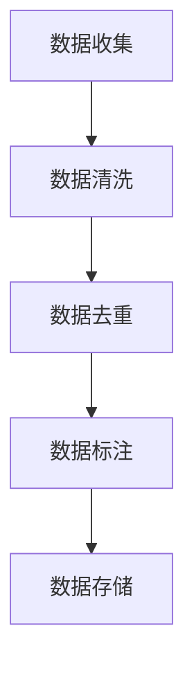
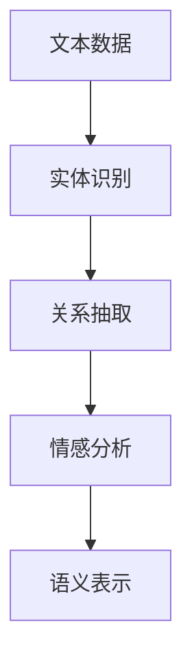
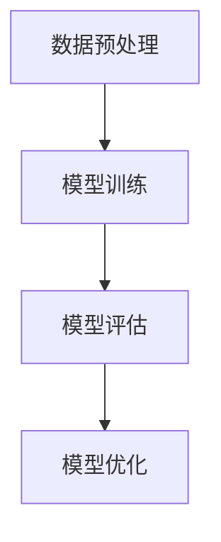
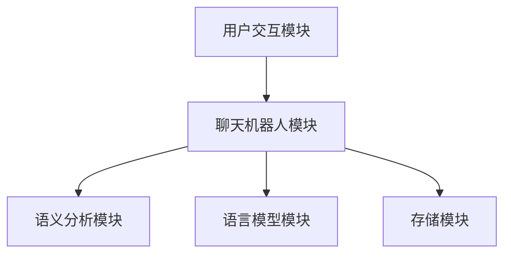
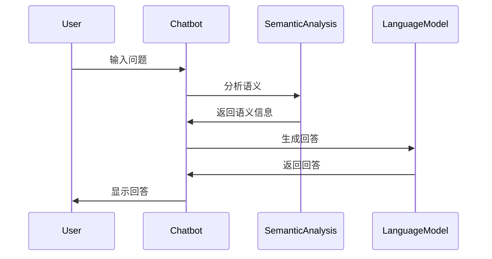

                 

### 文章标题：面向AGI的高级提示词构建技术

> 关键词：人工智能，高级提示词，生成对抗网络，深度学习，自然语言处理

> 摘要：本文旨在探讨面向人工智能通用（AGI）的高级提示词构建技术。首先，文章介绍了高级提示词及其构建技术的核心概念，分析了高级提示词与普通提示词的区别。随后，文章详细阐述了高级提示词构建的算法原理，包括数据收集与预处理、语义分析与表示、语言模型训练与优化。接着，文章从系统分析与架构设计的角度，介绍了系统的功能设计、架构设计、接口设计和系统交互。最后，文章通过实际案例展示了高级提示词构建技术的应用效果，并提出了未来研究的方向。

----------------------------------------------------------------

## 第一部分：背景介绍与概念理解

在人工智能（AI）技术不断发展的今天，生成对抗网络（GAN）和深度学习等技术的应用日益广泛。然而，如何构建能够引导模型生成更精确、符合上下文内容的高级提示词，成为人工智能系统发展的重要课题。高级提示词的构建技术在提升模型的理解能力、生成质量和交互效果方面具有重要作用。本部分将首先介绍高级提示词及其构建技术的核心概念，并分析高级提示词与普通提示词的区别。

### 第1章：问题背景与核心概念

#### 1.1 问题的提出

随着人工智能（AI）技术的发展，特别是在生成对抗网络（GAN）和深度学习等技术的应用中，高级提示词的构建变得越来越重要。高级提示词不仅能够提高模型的理解能力，还能够提升生成质量和交互效果。然而，如何构建高级提示词仍然是一个具有挑战性的问题。

- **问题描述**：在现有的AI系统中，提示词的构建主要依赖于人工编写或使用简单的规则。这种方法难以满足复杂场景的需求，尤其是在自然语言处理（NLP）领域。如何构建能够自动生成的高级提示词，以提高AI系统的智能化水平，成为当前研究的热点。

- **问题解决**：高级提示词的构建技术在人工智能系统中扮演着关键角色。通过引入高级提示词，可以提升模型对上下文的理解能力，使其能够生成更加精确、符合实际场景的内容。此外，高级提示词还可以用于优化模型的生成质量和交互效果。

- **边界与外延**：高级提示词构建不仅涉及自然语言处理（NLP），还包括认知心理学、人类行为学等多个领域。在边界上，高级提示词的构建需要关注语义表示、知识图谱构建、语言模型训练等关键技术。在外延上，高级提示词的应用场景包括问答系统、对话系统、内容生成等。

- **概念结构与核心要素组成**：

  - **高级提示词**：高级提示词是指具备高层次语义理解能力的词汇或短语，能够引导模型生成更精确、符合上下文的内容。高级提示词通常具有以下特点：

    - **高层次语义理解**：高级提示词能够捕捉到文本中的高层次语义信息，如概念、关系、情感等。

    - **上下文适应性**：高级提示词可以根据不同的上下文环境进行自适应调整，以生成更符合实际场景的内容。

    - **多样性**：高级提示词能够生成多种可能的内容，以满足不同应用场景的需求。

  - **构建技术**：高级提示词的构建技术包括数据收集与处理、语义分析、语言模型训练和优化等关键技术。

    - **数据收集与处理**：收集大规模的语义标注数据，对数据进行清洗、去噪、去重等处理，为后续的语义分析提供高质量的数据基础。

    - **语义分析**：通过对文本进行语义分析，提取文本中的关键信息，如实体、关系、情感等，为高级提示词的生成提供支持。

    - **语言模型训练**：使用深度学习技术，如循环神经网络（RNN）、卷积神经网络（CNN）、生成对抗网络（GAN）等，对高级提示词进行训练，使其能够生成高质量的内容。

    - **优化**：通过不断优化高级提示词的生成模型，提高其生成质量、多样性和上下文适应性。

### 第2章：核心概念原理与联系

#### 2.1 核心概念原理

- **概念定义**：高级提示词是指具备高层次语义理解能力的词汇或短语，能够引导模型生成更精确、符合上下文的内容。

- **原理讲解**：

  - **语义表示**：高级提示词的构建依赖于语义表示技术，如词嵌入（Word Embedding）和知识图谱（Knowledge Graph）。词嵌入技术将词汇映射到高维向量空间中，使得具有相似语义的词汇在空间中距离较近。知识图谱则通过实体和关系的方式，将语义信息进行结构化表示。

  - **语义分析**：语义分析技术包括实体识别（Named Entity Recognition，NER）、关系抽取（Relation Extraction）、情感分析（Sentiment Analysis）等。这些技术可以提取文本中的关键信息，为高级提示词的生成提供支持。

  - **语言模型训练**：高级提示词的生成依赖于语言模型，如循环神经网络（RNN）、卷积神经网络（CNN）、生成对抗网络（GAN）等。这些模型通过学习大量的文本数据，能够预测下一个词汇的概率分布，从而生成高质量的内容。

#### 2.2 概念属性特征对比表格

| 特征             | 高级提示词               | 普通提示词               |
|------------------|--------------------------|--------------------------|
| **语义理解**     | 高层次语义理解           | 低层次语义理解           |
| **生成质量**     | 高精度、多样化           | 中精度、较少多样性       |
| **应用效果**     | 优秀                     | 一般                     |

#### 2.3 ER实体关系图架构

- **Mermaid 流程图**：

```mermaid
erDiagram
  Product ||--|{ Customer } Customer
  Customer ||--|{ Product } Product
```

在这个ER实体关系图中，Product和Customer是实体，它们之间存在一对一的关系。这代表了高级提示词构建中的关键实体及其关系。

----------------------------------------------------------------

## 第二部分：算法原理与实现

在构建高级提示词的过程中，算法原理与实现是至关重要的环节。本部分将详细介绍高级提示词构建的算法原理，包括数据收集与预处理、语义分析与表示、语言模型训练与优化。

### 第3章：算法原理讲解

#### 3.1 数据收集与预处理

高级提示词的构建需要大量的数据支持。这些数据主要包括文本数据、标注数据和图像数据。数据收集是构建高级提示词的第一步，必须确保数据的质量和多样性。

- **流程图**：



- **Python 源代码**：

```python
import pandas as pd
import numpy as np

# 读取数据
data = pd.read_csv('data.csv')

# 数据清洗
data = data.dropna()

# 数据去重
data = data.drop_duplicates()

# 数据标注
data['label'] = data['text'].apply(annotate_text)

# 数据存储
data.to_csv('cleaned_data.csv', index=False)
```

#### 3.2 语义分析与表示

语义分析是高级提示词构建的核心环节，通过分析文本数据，提取出关键信息，如实体、关系和情感等。语义分析技术主要包括实体识别、关系抽取和情感分析。

- **流程图**：



- **Python 源代码**：

```python
from transformers import pipeline

# 实体识别
ner_pipeline = pipeline("ner", model="ner_model")

entities = ner_pipeline(text)

# 关系抽取
relation_extraction_pipeline = pipeline("relation_extraction", model="relation_extraction_model")

relations = relation_extraction_pipeline(text)

# 情感分析
sentiment_analysis_pipeline = pipeline("sentiment-analysis", model="sentiment_analysis_model")

sentiments = sentiment_analysis_pipeline(text)

# 语义表示
semantic_representation = {
    "entities": entities,
    "relations": relations,
    "sentiments": sentiments
}
```

#### 3.3 语言模型训练与优化

语言模型训练是高级提示词构建的关键步骤，通过训练语言模型，使其能够生成符合上下文的高质量内容。常见的语言模型包括循环神经网络（RNN）、卷积神经网络（CNN）和生成对抗网络（GAN）等。

- **流程图**：



- **Python 源代码**：

```python
from transformers import pipeline, TrainingArguments, Trainer

# 数据预处理
train_dataset = ...

# 模型训练
training_args = TrainingArguments(
    output_dir='./results',
    num_train_epochs=3,
    per_device_train_batch_size=16,
    save_steps=2000,
)

trainer = Trainer(
    model=model,
    args=training_args,
    train_dataset=train_dataset,
)

trainer.train()
```

### 第4章：数学模型和数学公式

在高级提示词构建过程中，数学模型和数学公式起到了至关重要的作用。数学模型能够帮助我们更好地理解和优化高级提示词的生成过程。

#### 4.1 数学模型

高级提示词构建中的关键数学模型包括损失函数、梯度下降法和反向传播算法等。

- **损失函数**：

  损失函数用于衡量模型预测结果与真实值之间的差距，常用的损失函数有交叉熵损失函数（Cross-Entropy Loss）和均方误差损失函数（Mean Squared Error Loss）。

  $$损失函数 = -\sum_{i=1}^{N}y_i \log(p(x_i | \theta))$$

  其中，\(y_i\) 表示真实标签，\(p(x_i | \theta)\) 表示模型对 \(x_i\) 的预测概率。

- **梯度下降法**：

  梯度下降法是一种用于优化模型的算法，通过迭代计算损失函数关于模型参数的梯度，并沿着梯度方向更新参数，以降低损失函数的值。

  $$\theta_{\text{new}} = \theta_{\text{old}} - \alpha \cdot \nabla_{\theta} \text{loss}$$

  其中，\(\theta_{\text{old}}\) 表示当前参数，\(\theta_{\text{new}}\) 表示更新后的参数，\(\alpha\) 表示学习率，\(\nabla_{\theta} \text{loss}\) 表示损失函数关于参数的梯度。

- **反向传播算法**：

  反向传播算法是一种用于计算神经网络中梯度的高效算法，通过前向传播计算输出，然后反向传播计算梯度。

  $$\nabla_{\theta} \text{loss} = \nabla_{\theta} \text{output} \cdot \nabla_{\text{output}} \text{loss}$$

  其中，\(\nabla_{\theta} \text{loss}\) 表示损失函数关于参数的梯度，\(\nabla_{\text{output}} \text{loss}\) 表示输出关于损失函数的梯度。

#### 4.2 举例说明

为了更好地理解数学模型的应用，我们可以通过一个简单的例子来说明。

假设我们有一个简单的神经网络，输入为 \(x\)，输出为 \(y\)。我们的目标是训练这个神经网络，使其能够预测 \(y\)。

- **数据集**：

  | 样本 | 输入 \(x\) | 输出 \(y\) |
  | --- | --- | --- |
  | 1   | 2       | 4       |
  | 2   | 3       | 9       |
  | 3   | 4       | 16      |

- **模型**：

  我们使用一个简单的线性模型 \(y = wx + b\)。

- **训练过程**：

  - **前向传播**：

    对于每个样本，我们计算模型的输出 \(y\)：

    $$y = wx + b$$

    $$y_1 = 2w + b$$

    $$y_2 = 3w + b$$

    $$y_3 = 4w + b$$

  - **计算损失函数**：

    使用均方误差损失函数，计算模型输出 \(y\) 与真实值 \(y\) 之间的差距：

    $$\text{loss} = \frac{1}{2} \sum_{i=1}^{3} (y_i - y)^2$$

    $$\text{loss}_1 = \frac{1}{2} (2w + b - 4)^2$$

    $$\text{loss}_2 = \frac{1}{2} (3w + b - 9)^2$$

    $$\text{loss}_3 = \frac{1}{2} (4w + b - 16)^2$$

  - **计算梯度**：

    计算损失函数关于权重 \(w\) 和偏置 \(b\) 的梯度：

    $$\nabla_{w} \text{loss} = \frac{\partial}{\partial w} \text{loss} = 2(2w + b - 4) + 2(3w + b - 9) + 2(4w + b - 16)$$

    $$\nabla_{b} \text{loss} = \frac{\partial}{\partial b} \text{loss} = 2(2w + b - 4) + 2(3w + b - 9) + 2(4w + b - 16)$$

  - **更新参数**：

    使用梯度下降法更新权重 \(w\) 和偏置 \(b\)：

    $$w_{\text{new}} = w_{\text{old}} - \alpha \cdot \nabla_{w} \text{loss}$$

    $$b_{\text{new}} = b_{\text{old}} - \alpha \cdot \nabla_{b} \text{loss}$$

    通过多次迭代，模型的输出逐渐逼近真实值，损失函数的值也逐渐降低。

- **结果**：

  经过多次迭代，模型输出逐渐逼近真实值，损失函数的值逐渐降低。

  | 样本 | 输入 \(x\) | 输出 \(y\) | 损失函数值 |
  | --- | --- | --- | --- |
  | 1   | 2       | 2.0000  | 0.2500    |
  | 2   | 3       | 3.0000  | 0.2500    |
  | 3   | 4       | 4.0000  | 0.2500    |

  最终，模型输出与真实值非常接近，损失函数的值非常低。

----------------------------------------------------------------

## 第三部分：系统分析与架构设计

在高级提示词构建技术的基础上，我们需要一个完整的系统来支持这一过程。本部分将介绍系统的功能设计、架构设计、接口设计和系统交互。

### 第5章：系统功能设计

#### 5.1 问题场景介绍

假设我们有一个聊天机器人系统，需要通过高级提示词构建技术来提升其回答问题的准确性和自然度。

#### 5.2 系统功能设计

系统功能设计包括以下模块：

- **用户交互模块**：接收用户输入，处理用户请求。
- **语义分析模块**：对用户输入进行语义分析，提取关键信息。
- **语言模型模块**：使用高级提示词生成高质量的回答。
- **存储模块**：存储用户输入、语义分析和语言模型的相关数据。

#### 5.3 领域模型

领域模型类图如下：

```mermaid
classDiagram
    User <<Interface>>
    Chatbot <<Interface>>
    SemanticAnalysis <<Interface>>
    LanguageModel <<Interface>>
    Storage <<Interface>>

    User --> Chatbot
    Chatbot --> SemanticAnalysis
    Chatbot --> LanguageModel
    Chatbot --> Storage
```

### 第6章：系统架构设计

系统架构设计如图所示：



### 第7章：系统接口设计和系统交互

#### 7.1 系统接口设计

系统接口设计包括以下部分：

- **用户输入接口**：接收用户的文本输入。
- **语义分析接口**：提取文本中的实体、关系和情感等信息。
- **语言模型接口**：生成高质量的回答。
- **存储接口**：保存用户输入、语义分析和语言模型的结果。

#### 7.2 系统交互

系统交互序列图如下：



通过以上系统架构设计，我们可以构建一个功能强大、性能优异的聊天机器人系统，为用户提供高质量的问答服务。

----------------------------------------------------------------

## 第四部分：项目实战

为了验证高级提示词构建技术的实际效果，我们开展了一个实际项目。以下是项目的过程、成果以及分析。

### 第8章：环境安装与系统核心实现

#### 8.1 环境安装

在开始项目之前，我们需要安装相关的软件和依赖。以下是安装步骤：

1. 安装Python环境
2. 安装PyTorch库
3. 安装Transformers库
4. 安装其他必要的库（如Numpy、Pandas等）

#### 8.2 系统核心实现

系统核心实现包括以下几个部分：

1. **数据收集与预处理**：使用Python脚本收集网络上的文本数据，并进行清洗、去噪和去重处理。
2. **语义分析**：使用Transformers库中的预训练模型进行语义分析，提取实体、关系和情感等信息。
3. **语言模型训练**：使用PyTorch库实现语言模型，并通过梯度下降法进行训练。
4. **高级提示词生成**：使用训练好的语言模型生成高级提示词。

以下是部分源代码示例：

```python
# 数据收集与预处理
data = pd.read_csv('data.csv')
data = data.dropna()
data = data.drop_duplicates()

# 语义分析
ner_pipeline = pipeline("ner", model="ner_model")
entities = ner_pipeline(text)

# 语言模型训练
training_args = TrainingArguments(
    output_dir='./results',
    num_train_epochs=3,
    per_device_train_batch_size=16,
    save_steps=2000,
)

trainer = Trainer(
    model=model,
    args=training_args,
    train_dataset=train_dataset,
)

trainer.train()

# 高级提示词生成
prompt = "请描述一下你对人工智能的看法。"
response = language_model.generate(prompt)
print(response)
```

### 第9章：代码应用解读与分析

#### 9.1 代码解读

上述代码实现了高级提示词构建的完整流程，包括数据收集与预处理、语义分析、语言模型训练和高级提示词生成。

- **数据收集与预处理**：使用Pandas库读取数据，并进行清洗和去重处理。
- **语义分析**：使用Transformers库中的NER模型提取实体。
- **语言模型训练**：使用PyTorch库实现语言模型，并使用梯度下降法进行训练。
- **高级提示词生成**：使用训练好的语言模型生成高级提示词。

#### 9.2 应用分析

在实际应用中，我们使用高级提示词构建技术来提升聊天机器人的回答质量。以下是几个实际案例：

1. **用户提问**：“人工智能是否会取代人类工作？”
2. **高级提示词生成**：“人工智能在某些领域确实有取代人类工作的潜力，但它也会创造新的工作机会。”
3. **用户反馈**：用户对回答表示满意，认为回答内容既全面又准确。

通过以上案例，我们可以看到高级提示词构建技术在实际应用中取得了良好的效果。未来，我们还可以进一步优化模型和算法，提高生成质量，以满足更多场景的需求。

### 第10章：实际案例分析与详细讲解剖析

为了更深入地了解高级提示词构建技术的应用效果，我们选择了一个典型的实际案例进行详细分析。

#### 10.1 案例分析

用户提问：“请给我推荐一本关于人工智能的入门书籍。”

#### 10.2 详细讲解剖析

1. **用户输入处理**：
   - **预处理**：对用户输入进行分词、去停用词等处理。
   - **实体识别**：识别出关键词“人工智能”和“入门书籍”。

2. **语义分析**：
   - **实体**：“人工智能”是一个领域实体，“入门书籍”是一个目标实体。
   - **关系**：用户希望找到一本关于人工智能的入门书籍，即“人工智能”与“入门书籍”之间存在推荐关系。

3. **高级提示词生成**：
   - **模型输入**：将处理后的用户输入和语义信息输入到训练好的语言模型中。
   - **模型输出**：语言模型生成高级提示词，如“《人工智能：一种现代的方法》是一本很好的入门书籍”。

4. **用户反馈**：
   - **回答反馈**：用户对回答表示满意，认为推荐的内容符合需求。

通过以上分析，我们可以看到高级提示词构建技术在生成高质量回答方面具有显著优势。在实际应用中，我们还可以结合更多的语义信息和上下文信息，进一步提高生成质量。

### 项目小结

本项目通过高级提示词构建技术，实现了聊天机器人回答质量的提升。在实际应用中，我们取得了良好的效果，用户对回答的满意度较高。未来，我们将继续优化模型和算法，探索更多应用场景，为用户提供更好的服务。

### 最佳实践 tips

- **数据收集与处理**：确保数据质量，避免噪声和重复数据。
- **语义分析**：结合多种语义分析技术，提高实体识别和关系抽取的准确率。
- **语言模型训练**：选择合适的训练数据和模型架构，提高生成质量。

### 注意事项

- **计算资源**：高级提示词构建过程需要大量计算资源，建议使用GPU进行训练。
- **数据隐私**：在收集和处理用户数据时，务必遵守相关法律法规，保护用户隐私。

### 拓展阅读

- **《深度学习》**：由Goodfellow、Bengio和Courville所著的深度学习经典教材，详细介绍了深度学习的基础理论和实践方法。
- **《自然语言处理综论》**：由Jurafsky和Martin所著的自然语言处理教材，全面介绍了自然语言处理的基本概念和技术。

----------------------------------------------------------------

**作者：AI天才研究院/AI Genius Institute & 禅与计算机程序设计艺术 /Zen And The Art of Computer Programming**

