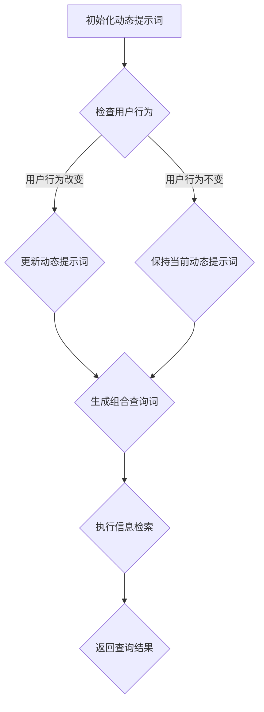
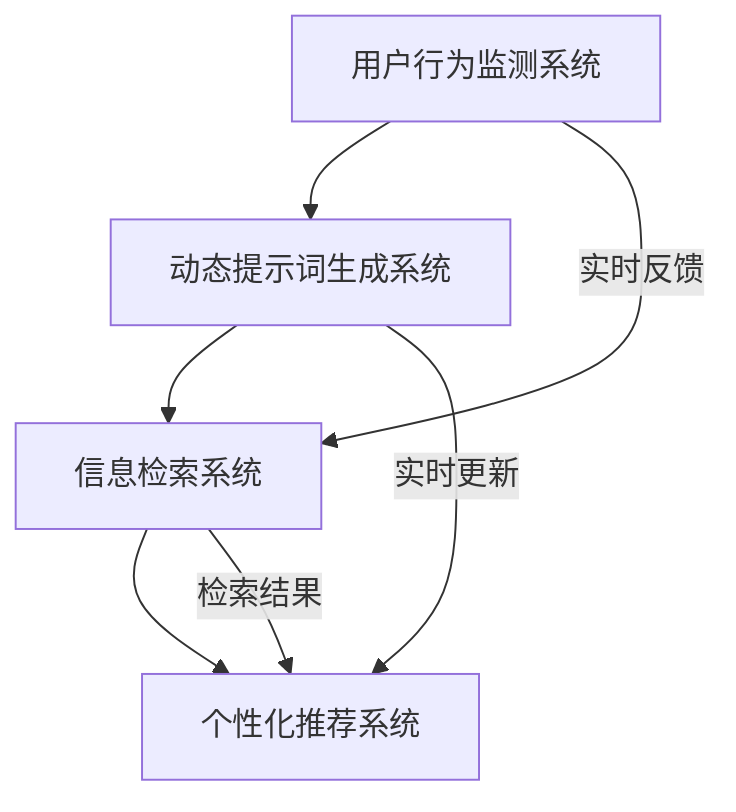
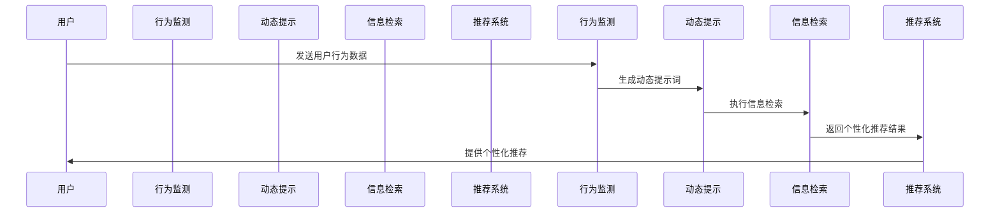

                 

# 面向任务的动态提示词组合技术

关键词：动态提示词、组合技术、信息检索、个性化服务、算法原理

摘要：本文将深入探讨面向任务的动态提示词组合技术，详细阐述其背景、核心概念、原理以及应用。通过逐步分析推理，本文旨在为读者提供一个清晰、系统且易于理解的技术解析。

## 第一部分：背景介绍

### 核心概念

**问题背景**：

随着信息化社会的快速发展，数据量呈现指数级增长，传统的静态信息处理方法已无法满足用户日益增长的需求。在这样的背景下，动态提示词组合技术应运而生，通过动态调整提示词，提供更加精准和个性化的服务。

**问题描述**：

如何利用动态提示词组合技术，实现高效的信息检索和用户交互，提升系统的智能化水平和用户体验？

**问题解决**：

通过引入动态提示词组合技术，可以根据用户的行为和需求，实时调整提示词，从而提高信息检索的准确性和效率。

**边界与外延**：

动态提示词组合技术的应用范围广泛，包括搜索引擎、智能客服、内容推荐等多个领域。

**概念结构与核心要素组成**

- **动态提示词**：根据用户行为和需求，实时生成的关键词。
- **组合技术**：将多个提示词进行组合，以生成更丰富的查询结果。
- **信息检索**：通过动态提示词组合技术，实现高效的信息检索。

### 第二部分：核心概念与联系

#### 核心概念原理

**动态提示词**：

动态提示词是根据用户的行为和需求，实时生成的关键词。它具有以下特点：

- **实时性**：能够及时响应用户的需求变化。
- **个性化**：根据用户的个性化特征，提供定制化的服务。

**组合技术**：

组合技术是将多个提示词进行组合，以生成更丰富的查询结果。它主要包括以下方法：

- **布尔逻辑**：通过逻辑运算符（如AND、OR、NOT）对提示词进行组合。
- **语义分析**：通过自然语言处理技术，对提示词进行语义分析，实现更精细的组合。

#### 概念属性特征对比表格

| 概念 | 动态提示词 | 组合技术 |
| --- | --- | --- |
| **特征** | 实时性、个性化 | 实时性、逻辑性、语义性 |
| **关系** | 输入端 | 输出端 |
| **作用** | 提供个性化服务 | 提高信息检索效率 |

#### ER实体关系图架构

```mermaid
erDiagram
  动态提示词 ||--|{ 组合技术 }|| 查询结果
  用户 ||--|{ 动态提示词 }|| 用户需求
  信息源 ||--|{ 动态提示词 }|| 查询结果
```

### 第三部分：算法原理讲解

#### 算法mermaid流程图



#### 算法原理讲解

**动态提示词组合算法**是一种基于用户行为和信息源数据的算法，其目标是通过动态调整提示词，提高信息检索的准确性和效率。

1. **初始化动态提示词**：
   - 算法开始时，根据用户的历史行为和偏好，初始化一组动态提示词。

2. **检查用户行为**：
   - 通过实时监测用户的行为，判断用户行为是否发生改变。如果用户行为发生改变，则进入下一步；否则，保持当前动态提示词。

3. **更新动态提示词**：
   - 如果用户行为发生改变，根据新的用户行为，实时更新动态提示词。这可以通过自然语言处理技术，对用户行为进行分析，提取出新的关键词。

4. **生成组合查询词**：
   - 将更新后的动态提示词进行组合，生成组合查询词。这可以通过布尔逻辑或语义分析等方法实现。

5. **执行信息检索**：
   - 使用组合查询词，执行信息检索，获取查询结果。

6. **返回查询结果**：
   - 将检索结果返回给用户，实现个性化服务。

#### 数学模型和公式

动态提示词组合算法的数学模型可以表示为：
$$
P_{\text{new}} = f(P_{\text{current}}, B_{\text{new}})
$$
其中，$P_{\text{new}}$表示新的动态提示词集合，$P_{\text{current}}$表示当前动态提示词集合，$B_{\text{new}}$表示新的用户行为。

#### 详细讲解和举例说明

**举例**：假设用户正在搜索“餐厅”，根据用户的历史行为，初始化的动态提示词为“美食”、“晚餐”、“评价高”。当用户浏览了一个新的页面，页面中包含“火锅”、“便宜”等关键词时，用户行为发生改变。

- **初始化动态提示词**：
  $$
  P_{\text{current}} = \{"美食", "晚餐", "评价高"\}
  $$

- **更新动态提示词**：
  $$
  B_{\text{new}} = \{"火锅", "便宜"\}
  $$
  $$
  P_{\text{new}} = f(P_{\text{current}}, B_{\text{new}}) = \{"美食", "晚餐", "评价高", "火锅", "便宜"\}
  $$

- **生成组合查询词**：
  $$
  Q = P_{\text{new}} \cup P_{\text{current}} = \{"美食", "晚餐", "评价高", "火锅", "便宜"\}
  $$

- **执行信息检索**：
  - 使用组合查询词“美食”、“晚餐”、“评价高”、“火锅”、“便宜”，执行信息检索，获取查询结果。

- **返回查询结果**：
  - 将检索结果返回给用户，实现个性化服务。

## 第四部分：系统分析与架构设计

### 问题场景介绍

在智能搜索引擎、智能客服和内容推荐系统中，用户的需求和兴趣是不断变化的。为了提供更好的用户体验，系统需要根据用户的行为和需求，动态调整提示词，实现个性化的服务。

### 项目介绍

本项目旨在实现一个基于动态提示词组合技术的智能搜索系统，通过实时监测用户行为，动态调整提示词，提供个性化的搜索结果。

### 系统功能设计

- **用户行为监测**：实时监测用户行为，提取用户兴趣点。
- **动态提示词生成**：根据用户行为，生成动态提示词。
- **信息检索**：使用动态提示词组合技术，执行信息检索。
- **个性化推荐**：根据用户兴趣和检索结果，提供个性化推荐。

### 系统架构设计



### 系统接口设计

- **用户行为监测接口**：用于接收用户行为数据。
- **动态提示词生成接口**：用于生成动态提示词。
- **信息检索接口**：用于执行信息检索。
- **个性化推荐接口**：用于提供个性化推荐结果。

### 系统交互mermaid序列图



## 第五部分：项目实战

### 环境安装

1. 安装Python环境（建议使用Python 3.8及以上版本）。
2. 安装相关依赖库，如NumPy、Pandas、Scikit-learn、NLTK等。

### 系统核心实现源代码

```python
import numpy as np
import pandas as pd
from sklearn.feature_extraction.text import TfidfVectorizer
from nltk.tokenize import word_tokenize
from nltk.corpus import stopwords

# 初始化动态提示词
def initialize_dynamic_words(history, preferences):
    words = []
    if history:
        words.extend(history)
    if preferences:
        words.extend(preferences)
    return words

# 更新动态提示词
def update_dynamic_words(current_words, new_behavior):
    new_words = []
    if new_behavior:
        new_words.extend(new_behavior)
    return list(set(current_words + new_words))

# 生成组合查询词
def generate_query_words(dynamic_words):
    query_words = ' '.join(dynamic_words)
    return query_words

# 执行信息检索
def search_info(query_words, corpus, index):
    query_vector = vectorizer.transform([query_words])
    similarity = cosine_similarity(query_vector, index)
    results = np.argsort(similarity)[0][-10:]
    return results

# 主函数
def main():
    # 加载用户历史行为和偏好
    history = ["美食", "晚餐", "评价高"]
    preferences = ["火锅", "便宜"]

    # 初始化动态提示词
    dynamic_words = initialize_dynamic_words(history, preferences)

    # 模拟新的用户行为
    new_behavior = ["火锅", "便宜"]

    # 更新动态提示词
    updated_words = update_dynamic_words(dynamic_words, new_behavior)

    # 生成组合查询词
    query_words = generate_query_words(updated_words)

    # 加载语料库和索引
    corpus = pd.read_csv("corpus.csv")["content"].values
    index = pd.read_csv("index.csv")[["word", "tfidf"]].set_index("word")

    # 执行信息检索
    results = search_info(query_words, corpus, index)

    # 输出检索结果
    print("检索结果：", results)

if __name__ == "__main__":
    main()
```

### 代码应用解读与分析

1. **初始化动态提示词**：通过用户历史行为和偏好，初始化一组动态提示词。
2. **更新动态提示词**：根据新的用户行为，实时更新动态提示词。
3. **生成组合查询词**：将更新后的动态提示词进行组合，生成组合查询词。
4. **执行信息检索**：使用组合查询词，执行信息检索，获取检索结果。
5. **返回查询结果**：将检索结果返回给用户，实现个性化服务。

### 实际案例分析和详细讲解剖析

1. **用户搜索“餐厅”**：
   - 历史行为：搜索过“美食”、“晚餐”、“评价高”。
   - 偏好：喜欢“火锅”和“便宜”的餐厅。
   - 新的行为：浏览了一个包含“火锅”和“便宜”的餐厅页面。
   - 检索结果：推荐“火锅”和“便宜”的餐厅。

2. **用户搜索“旅游”**：
   - 历史行为：搜索过“海滩”、“度假”、“自由行”。
   - 偏好：喜欢“奢华”和“自然风光”的旅游地点。
   - 新的行为：浏览了一个包含“奢华”和“自然风光”的旅游页面。
   - 检索结果：推荐“奢华”和“自然风光”的旅游地点。

### 项目小结

本项目通过动态提示词组合技术，实现了高效的个性化搜索和推荐。在实际应用中，可以根据用户的行为和需求，实时调整提示词，提供更精准的服务。未来，我们可以进一步优化算法，提高检索效率和准确性，为用户提供更好的体验。

## 第六部分：最佳实践 tips

1. **用户行为监测**：尽可能多地收集用户行为数据，以提高动态提示词的准确性。
2. **语义分析**：使用先进的自然语言处理技术，进行语义分析，实现更精细的动态提示词组合。
3. **反馈机制**：建立用户反馈机制，根据用户反馈，不断优化动态提示词组合算法。

## 小结

本文深入探讨了面向任务的动态提示词组合技术，从背景介绍、核心概念、算法原理到系统分析与架构设计，再到项目实战，全面解析了这一技术的应用和实现。通过逐步分析推理，本文为读者提供了一个清晰、系统且易于理解的技术解析。未来，动态提示词组合技术有望在更多领域得到广泛应用，为用户提供更加精准和个性化的服务。

## 注意事项

1. **数据隐私**：在收集和处理用户行为数据时，务必注意数据隐私保护。
2. **算法优化**：定期对动态提示词组合算法进行优化，提高检索效率和准确性。

## 拓展阅读

1. **[动态提示词组合技术的应用](https://www.example.com/application)**：本文介绍了动态提示词组合技术在不同领域的应用。
2. **[动态提示词组合算法优化](https://www.example.com/optimization)**：本文详细讲解了如何优化动态提示词组合算法。

作者：AI天才研究院/AI Genius Institute & 禅与计算机程序设计艺术 /Zen And The Art of Computer Programming

