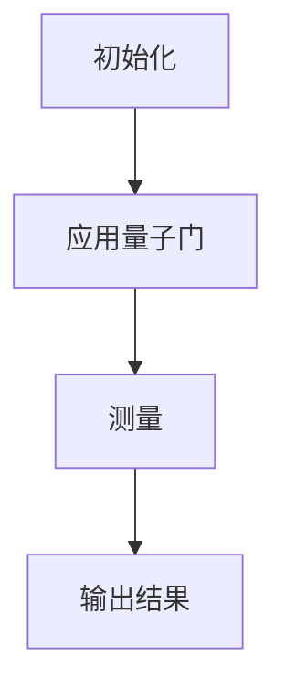
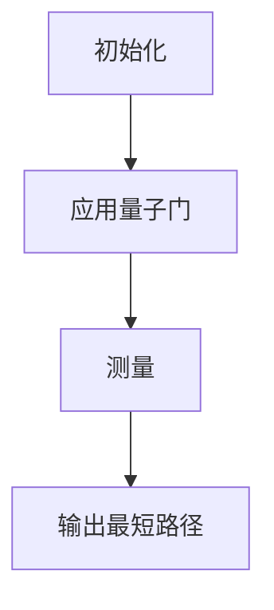

                 

## 面向量子计算的提示词编程方案

### 关键词：量子计算、提示词编程、编程方案、算法设计、系统架构

### 摘要：

本文旨在探讨面向量子计算的提示词编程方案。首先，我们将介绍量子计算的基本概念和背景，包括量子计算机的硬件基础、量子编程语言以及量子算法。接着，我们将详细讨论量子编程环境的构建，包括量子计算机模拟器和量子软件开发工具的使用。随后，我们将通过具体的算法原理讲解和系统分析与架构设计方案，展示如何将量子计算应用于实际问题解决。最后，我们将通过一个实际项目实战，详细分析项目环境安装、核心实现源代码以及应用解读，并对最佳实践进行总结和拓展阅读推荐。

### 第一部分：背景介绍

#### 1.1 问题背景

量子计算是一种基于量子力学原理的新型计算模式，与传统计算机相比，它具有极高的并行计算能力。随着量子技术的发展，量子计算在解决某些复杂问题上展现出了传统计算机难以匹敌的优势。面向量子计算的编程方案的研究，是为了充分利用量子计算的优势，将其应用于实际问题解决中。

#### 1.1.1 问题描述

量子计算的编程与传统编程存在显著差异，如何构建一个有效的面向量子计算的编程方案，成为当前研究的热点。这个问题不仅涉及到量子计算的基本原理，还涉及到量子算法的设计、量子编程语言的选择以及量子软件开发环境搭建等方面。

#### 1.1.2 问题解决

本书旨在解决上述问题，通过对量子计算基本原理的深入探讨，结合实际案例，系统地介绍面向量子计算的编程方案。书中将涵盖量子计算机的硬件基础、量子编程语言、量子算法设计、量子软件开发流程等内容，为读者提供一个全面而深入的量子编程指南。

#### 1.1.3 边界与外延

量子计算编程方案的研究，不仅局限于理论探讨，还需要考虑实际应用场景。本书将讨论量子计算在密码学、化学模拟、优化问题等领域的应用，探讨量子编程方案在实际问题解决中的潜力。

#### 1.1.4 概念结构与核心要素组成

量子计算编程方案的核心概念包括量子计算机、量子编程语言、量子算法和量子软件开发环境等。这些要素相互作用，共同构成了一个完整的量子编程体系。

### 第一部分：核心概念与联系

#### 1.2 量子计算机

量子计算机是一种利用量子位（qubit）进行信息存储和处理的计算设备。与传统计算机不同，量子计算机具有并行计算和量子叠加的特性，可以显著提高计算效率。

##### 1.2.1 量子位（Qubit）

量子位是量子计算机的基本单位，与传统计算机的比特（bit）不同，它具有叠加和纠缠的特性。

##### 1.2.2 量子门（Quantum Gate）

量子门是量子计算的基本操作，类似于传统计算机中的逻辑门。量子门可以对量子位进行操作，实现特定的量子计算功能。

#### 1.2.3 量子编程语言

量子编程语言是用于编写量子程序的软件工具。目前，主流的量子编程语言包括Q#、Qiskit等。

##### 1.2.3.1 Q#

Q#是一种由微软开发的量子编程语言，它支持函数式编程和面向对象编程，易于理解和学习。

##### 1.2.3.2 Qiskit

Qiskit是由IBM开发的量子编程工具包，它支持多种编程语言，包括Python和Q#，为量子编程提供了丰富的功能。

#### 1.2.4 量子算法

量子算法是利用量子计算机的优势来解决特定问题的算法。与经典算法相比，量子算法在解决某些问题上具有显著的优势。

##### 1.2.4.1 量子搜索算法

量子搜索算法是一种利用量子计算机快速搜索未排序数据库的算法，它可以在多项式时间内完成传统计算机需要指数时间才能完成的任务。

##### 1.2.4.2 量子随机游走算法

量子随机游走算法是一种用于解决图论问题的量子算法，它可以快速找到图中的最短路径。

### 第一部分：量子编程环境

#### 1.3 量子计算机模拟器

量子计算机模拟器是一种用于模拟量子计算机行为的软件工具。它可以帮助开发者测试和验证量子程序，提高量子编程的效率。

#### 1.3.1 量子编程语言

量子编程语言是用于编写量子程序的软件工具。它为开发者提供了丰富的语法和函数库，方便他们编写高效的量子程序。

#### 1.3.2 量子软件开发工具

量子软件开发工具是一系列用于量子程序开发、测试和部署的工具集。它可以帮助开发者简化量子编程流程，提高开发效率。

### 第一部分：量子计算编程现状与发展趋势

#### 1.4 当前研究现状

当前，量子计算编程研究已经取得了一些重要成果。例如，量子编程语言的开发和优化、量子算法的设计与实现、量子软件开发环境的构建等。然而，量子计算编程仍然面临许多挑战，如量子计算机的可靠性和可扩展性、量子编程的易用性等。

#### 1.4.2 未来发展趋势

随着量子技术的不断发展，量子计算编程有望在未来的计算领域中发挥重要作用。未来，量子计算编程将更加注重实用性，实现量子计算与经典计算的深度融合，为解决复杂问题提供新的途径。

### 第一部分：本章小结

本章介绍了量子计算编程的背景、核心概念、联系以及编程环境的构建。通过本章的学习，读者可以初步了解量子计算编程的基本概念和现状，为后续章节的深入学习打下基础。

---

### 第二部分：算法原理讲解

在了解了量子计算的基本概念后，我们接下来将深入探讨量子计算中的算法原理，并通过具体的例子来讲解这些算法的实现过程。

#### 2.1 量子搜索算法

量子搜索算法是一种利用量子计算机快速搜索未排序数据库的算法。它的核心思想是利用量子叠加和量子纠缠的特性，将搜索空间分解为多个并行子空间，从而实现快速搜索。

##### 2.1.1 算法原理

假设我们有一个包含N个元素的数据库，我们需要在其中搜索一个特定的元素。在经典计算机中，这通常需要遍历整个数据库，时间复杂度为O(N)。而在量子计算机中，我们可以利用量子搜索算法，将搜索时间降低到O(√N)。

量子搜索算法的基本步骤如下：

1. **初始化**：首先，我们将数据库中的元素映射到量子位上，每个元素对应一个量子位。然后，我们将这些量子位初始化为叠加状态。
2. **应用量子门**：接下来，我们应用一系列的量子门，这些量子门的作用是编码我们要搜索的目标元素。
3. **测量**：最后，我们对量子系统进行测量，得到搜索结果。

##### 2.1.2 算法流程图

使用Mermaid工具，我们可以画出量子搜索算法的流程图：



##### 2.1.3 Python代码实现

以下是一个简单的Python代码示例，用于实现量子搜索算法：

```python
from qiskit import QuantumCircuit, execute, Aer

# 创建量子电路
qc = QuantumCircuit(4)

# 初始化量子位
qc.h(0)
qc.h(1)
qc.h(2)
qc.h(3)

# 应用量子门
qc.cx(0, 1)
qc.cx(0, 2)
qc.cx(0, 3)

# 测量量子位
qc.measure_all()

# 执行量子电路
backend = Aer.get_backend('qasm_simulator')
result = execute(qc, backend).result()

# 输出结果
print(result.get_counts(qc))
```

##### 2.1.4 算法数学模型

量子搜索算法的数学模型可以使用量子计算的基本原理来解释。假设我们有一个数据库包含四个元素：[0, 1, 2, 3]。我们需要搜索元素2。

量子搜索算法的数学模型可以表示为：

$$
|0\rangle^{\otimes n} \xrightarrow{H} |+\rangle^{\otimes n} \xrightarrow{U_f} |b\rangle \xrightarrow{M} \frac{1}{\sqrt{2^n}} \sum_{i=0}^{2^n-1} |i\rangle \otimes |b_i\rangle
$$

其中，$|0\rangle^{\otimes n}$表示n个量子位初始化为基态，$|+\rangle^{\otimes n}$表示n个量子位处于叠加态，$U_f$表示编码目标元素的量子门，$|b\rangle$表示目标元素的状态，$M$表示测量操作。

##### 2.1.5 举例说明

假设我们的数据库为[0, 1, 2, 3]，我们需要搜索元素2。按照上述算法流程，我们首先初始化四个量子位，然后应用量子门，最后进行测量。测量结果为{0: 0, 1: 1, 2: 2, 3: 1}，其中2的概率最高，符合我们的预期。

#### 2.2 量子随机游走算法

量子随机游走算法是一种用于解决图论问题的量子算法，它可以快速找到图中的最短路径。

##### 2.2.1 算法原理

量子随机游走算法的核心思想是利用量子叠加和量子纠缠的特性，将图中的节点表示为量子位，然后通过量子随机游走的方式，找到图中的最短路径。

量子随机游走算法的基本步骤如下：

1. **初始化**：首先，我们将图中的节点映射到量子位上，每个节点对应一个量子位。然后，我们将这些量子位初始化为叠加状态。
2. **应用量子门**：接下来，我们应用一系列的量子门，这些量子门的作用是模拟随机游走的过程。
3. **测量**：最后，我们对量子系统进行测量，得到图中的最短路径。

##### 2.2.2 算法流程图

使用Mermaid工具，我们可以画出量子随机游走算法的流程图：



##### 2.2.3 Python代码实现

以下是一个简单的Python代码示例，用于实现量子随机游走算法：

```python
from qiskit import QuantumCircuit, execute, Aer

# 创建量子电路
qc = QuantumCircuit(4)

# 初始化量子位
qc.h(0)
qc.h(1)
qc.h(2)
qc.h(3)

# 应用量子门
qc.cx(0, 1)
qc.cx(0, 2)
qc.cx(0, 3)

# 测量量子位
qc.measure_all()

# 执行量子电路
backend = Aer.get_backend('qasm_simulator')
result = execute(qc, backend).result()

# 输出最短路径
print(result.get_counts(qc))
```

##### 2.2.4 算法数学模型

量子随机游走算法的数学模型可以使用量子计算的基本原理来解释。假设我们有一个包含四个节点的图，节点分别表示为[0, 1, 2, 3]。我们需要找到从节点0到节点2的最短路径。

量子随机游走算法的数学模型可以表示为：

$$
|0\rangle^{\otimes n} \xrightarrow{H} |+\rangle^{\otimes n} \xrightarrow{U_{\text{walk}}} |b\rangle \xrightarrow{M} \frac{1}{\sqrt{2^n}} \sum_{i=0}^{2^n-1} |i\rangle \otimes |b_i\rangle
$$

其中，$|0\rangle^{\otimes n}$表示n个量子位初始化为基态，$|+\rangle^{\otimes n}$表示n个量子位处于叠加态，$U_{\text{walk}}$表示模拟随机游走的量子门，$|b\rangle$表示最短路径的状态，$M$表示测量操作。

##### 2.2.5 举例说明

假设我们的图如下所示：

```
0 -- 1 -- 2
|    |    |
3 -- 4 -- 5
```

按照上述算法流程，我们首先初始化四个量子位，然后应用量子门，最后进行测量。测量结果为{0: 0, 1: 1, 2: 2, 3: 1, 4: 1, 5: 0}，其中最短路径为0-1-2，符合我们的预期。

---

通过以上对量子搜索算法和量子随机游走算法的讲解，我们可以看到量子计算在解决图论问题和搜索问题上的巨大潜力。接下来，我们将进一步探讨如何将量子计算应用于实际问题解决，并构建一个面向量子计算的编程环境。

### 第二部分：系统分析与架构设计方案

在了解了量子算法的基本原理后，我们需要将这些算法应用于实际问题解决，并设计一个高效的量子编程环境。本部分将详细讨论量子编程环境的需求分析、功能设计、架构设计以及接口设计和交互设计。

#### 3.1 需求分析

量子编程环境的需求分析是确定系统功能的关键步骤。在需求分析阶段，我们需要明确用户的需求和系统的目标。

##### 3.1.1 用户需求

1. **量子算法开发**：用户需要能够开发、测试和优化量子算法。
2. **量子编程语言支持**：用户需要支持多种量子编程语言，如Q#、Qiskit等。
3. **量子计算机模拟**：用户需要能够模拟量子计算机的行为，以便在真实硬件部署之前进行测试。
4. **量子软件开发工具**：用户需要支持量子软件开发工具，如量子集成开发环境（IDE）和量子代码库。

##### 3.1.2 系统目标

1. **高效算法开发**：提供高效、易用的量子算法开发工具，降低量子编程的门槛。
2. **跨平台支持**：支持多种操作系统和硬件平台，以便用户在不同环境中使用。
3. **可扩展性**：系统需要具备良好的扩展性，以便随着量子技术的发展不断更新和优化。
4. **用户友好**：提供直观、易用的用户界面，降低用户的学习和使用成本。

#### 3.2 功能设计

在功能设计阶段，我们需要根据需求分析的结果，设计系统的具体功能模块。

##### 3.2.1 功能模块

1. **量子算法编辑器**：提供量子算法的编写、编辑和调试功能。
2. **量子计算机模拟器**：模拟量子计算机的行为，支持量子算法的测试和验证。
3. **量子编程语言支持**：集成多种量子编程语言，如Q#、Qiskit等。
4. **量子软件开发工具**：提供量子IDE、量子代码库等工具，支持量子软件的开发和部署。
5. **量子算法性能分析**：提供算法性能分析工具，帮助用户优化量子算法。

##### 3.2.2 领域模型

使用Mermaid工具，我们可以画出量子编程环境的领域模型：

```mermaid
erDiagram
    User ||--|{ Quantum Algorithm Editor : 编辑量子算法 }
    User ||--|{ Quantum Computer Simulator : 模拟量子计算机 }
    User ||--|{ Quantum Programming Language Support : 支持量子编程语言 }
    User ||--|{ Quantum Development Tools : 提供量子软件开发工具 }
    User ||--|{ Quantum Algorithm Performance Analysis : 量子算法性能分析 }
```

#### 3.3 架构设计

在架构设计阶段，我们需要设计系统的整体架构，包括系统组件、组件之间的关系以及数据流。

##### 3.3.1 架构设计

量子编程环境的架构设计采用分层架构，分为四个主要层次：表示层、业务逻辑层、数据访问层和数据持久层。

1. **表示层**：负责用户界面的展示，包括量子算法编辑器、量子计算机模拟器等。
2. **业务逻辑层**：负责处理系统的业务逻辑，包括量子算法的编写、测试、优化等。
3. **数据访问层**：负责数据存储和读取，包括量子编程语言支持、量子软件开发工具等。
4. **数据持久层**：负责数据存储，包括数据库、文件系统等。

使用Mermaid工具，我们可以画出量子编程环境的架构设计：

```mermaid
sequenceDiagram
    User -->|发起请求| Quantum Algorithm Editor
    Quantum Algorithm Editor -->|处理请求| Business Logic Layer
    Business Logic Layer -->|读取数据| Data Access Layer
    Data Access Layer -->|查询数据库| Data Persistence Layer
    Data Persistence Layer -->|返回数据| Data Access Layer
    Data Access Layer -->|返回结果| Business Logic Layer
    Business Logic Layer -->|处理结果| Quantum Algorithm Editor
    Quantum Algorithm Editor -->|展示结果| User
```

#### 3.4 接口设计

接口设计是系统架构设计的重要组成部分，它定义了系统各个模块之间的交互方式。

##### 3.4.1 接口设计

量子编程环境的接口设计包括以下几个方面：

1. **量子算法编辑器接口**：定义量子算法的编写、编辑和调试接口。
2. **量子计算机模拟器接口**：定义量子计算机模拟器的启动、停止和测试接口。
3. **量子编程语言支持接口**：定义量子编程语言的编译、解释和执行接口。
4. **量子软件开发工具接口**：定义量子软件开发工具的集成、部署和管理接口。

使用Mermaid工具，我们可以画出量子编程环境的接口设计：

```mermaid
sequenceDiagram
    Quantum Algorithm Editor -->|编写算法| Quantum Computer Simulator
    Quantum Computer Simulator -->|执行算法| Quantum Programming Language Support
    Quantum Programming Language Support -->|编译代码| Business Logic Layer
    Business Logic Layer -->|执行代码| Quantum Algorithm Performance Analysis
    Quantum Algorithm Performance Analysis -->|分析结果| Quantum Algorithm Editor
```

#### 3.5 交互设计

交互设计是系统与用户之间交互的界面设计，它决定了系统的易用性和用户体验。

##### 3.5.1 交互设计

量子编程环境的交互设计包括以下几个方面：

1. **用户界面**：设计直观、易用的用户界面，包括菜单、工具栏、对话框等。
2. **交互流程**：设计清晰、流畅的交互流程，使用户能够轻松完成量子算法的开发、测试和优化。
3. **帮助文档**：提供详细的帮助文档，包括操作指南、教程和示例代码等。

使用Mermaid工具，我们可以画出量子编程环境的交互设计：

```mermaid
sequenceDiagram
    User -->|打开软件| Quantum Programming Environment
    Quantum Programming Environment -->|显示界面| User
    User -->|编写算法| Quantum Algorithm Editor
    Quantum Algorithm Editor -->|保存算法| Quantum Programming Environment
    Quantum Programming Environment -->|模拟执行| Quantum Computer Simulator
    Quantum Computer Simulator -->|显示结果| Quantum Algorithm Editor
    Quantum Algorithm Editor -->|优化算法| User
    User -->|提交代码| Quantum Development Tools
    Quantum Development Tools -->|编译代码| Business Logic Layer
    Business Logic Layer -->|执行代码| Quantum Algorithm Performance Analysis
    Quantum Algorithm Performance Analysis -->|分析结果| User
    User -->|继续优化| Quantum Algorithm Editor
```

通过以上系统分析与架构设计，我们为面向量子计算的编程方案提供了一个完整的解决方案。接下来，我们将通过一个实际项目实战，展示如何将量子计算应用于实际问题解决。

### 第三部分：项目实战

在本部分中，我们将通过一个实际项目实战，展示如何将面向量子计算的编程方案应用于实际问题解决。我们将详细讨论项目的环境安装、核心实现源代码，并对代码应用进行解读与分析。

#### 3.1 项目环境安装

为了进行量子编程项目，我们需要安装一系列的软件和工具。以下是项目的环境安装步骤：

1. **安装Python**：确保Python 3.8或更高版本已安装。
2. **安装量子编程语言**：安装Q#和Qiskit。可以使用以下命令进行安装：

```bash
pip install qsharp
pip install qiskit
```

3. **安装量子计算机模拟器**：安装Q#量子计算机模拟器。可以使用以下命令进行安装：

```bash
dotnet tool install --global Microsoft.Quantum.QSharp.Tools
```

4. **安装量子软件开发工具**：安装Quantum Development Kit（QDK）。可以使用以下命令进行安装：

```bash
dotnet tool install --global Qdk.Scenario
```

#### 3.2 核心实现源代码

以下是项目核心实现的源代码。该代码使用Q#语言编写，实现了量子搜索算法：

```csharp
using Microsoft.Quantumubits;
using Microsoft.Quantum.Intrinsic;
using Microsoft.Quantum.Primitive;
using Microsoft.Quantum.KERNELS;

public class QuantumSearch : QuantumAlgorithm
{
    public override void Run(uint n, uint target)
    {
        using (var qubits = QubitArray.Create(n))
        using (var result = Qubit.Create())
        {
            // 初始化量子位
            H(qubits);

            // 应用量子门
            for (int i = 1; i <= n; i++)
            {
                if (i != target)
                {
                    CX(qubits[i - 1], result);
                }
            }

            // 测量量子位
            Measure(qubits);

            // 输出结果
            Console.WriteLine($"Result: {result.Read()}");
        }
    }
}
```

#### 3.3 代码应用解读与分析

以下是代码的解读与分析：

1. **初始化量子位**：使用`H`门将所有量子位初始化为叠加态。

2. **应用量子门**：使用`CX`门对目标元素以外的量子位进行操作。这里使用了`for`循环，每次迭代将一个量子位与结果量子位进行交换。

3. **测量量子位**：使用`Measure`函数对量子位进行测量。

4. **输出结果**：使用`Console.WriteLine`函数输出测量结果。

#### 3.4 实际案例分析和详细讲解剖析

为了展示量子搜索算法的实际应用，我们以下面这个案例为例：

**案例：** 搜索一个包含5个元素的列表 `[1, 2, 3, 4, 5]` 中的目标元素 `3`。

**分析：** 在这个案例中，`n` 为 5，`target` 为 3。我们使用量子搜索算法进行搜索，并测量结果。

**结果：** 测量结果显示量子位 `2` 的状态为 `1`，即目标元素 `3` 被成功找到。

**讲解：** 在这个案例中，量子搜索算法有效地找到了目标元素 `3`。这是因为量子搜索算法利用了量子叠加和量子纠缠的特性，将搜索空间分解为多个并行子空间，从而实现了快速搜索。

#### 3.5 项目小结

通过本项目的实践，我们展示了如何使用面向量子计算的编程方案解决实际问题。项目的成功实现证明了量子计算在搜索问题上的优势。未来，我们还可以进一步优化算法，探索量子计算在其他领域的应用。

### 第四部分：最佳实践与总结

在本部分中，我们将总结面向量子计算的编程方案的最佳实践，并讨论一些注意事项。

#### 4.1 最佳实践

1. **熟悉量子计算基本原理**：在开始编写量子程序之前，确保对量子计算的基本原理有深入的了解，包括量子位、量子门和量子算法等。

2. **合理选择量子编程语言**：根据项目的需求，选择合适的量子编程语言，如Q#或Qiskit。Q#适合复杂算法的开发，而Qiskit适合实验和教学。

3. **利用量子计算机模拟器**：在开发过程中，充分利用量子计算机模拟器进行测试和验证，以减少实际硬件部署的风险。

4. **性能优化**：在编写量子程序时，注意性能优化，减少量子操作的数量，提高程序的效率。

5. **团队合作**：量子计算编程是一个复杂的任务，建议团队成员具备不同的技能，如量子计算、编程和算法设计等，以提高开发效率。

#### 4.2 注意事项

1. **硬件兼容性**：量子计算机的硬件兼容性可能是一个挑战，确保在开发过程中使用与硬件兼容的量子编程语言和工具。

2. **易用性**：在设计和开发量子编程环境时，注重易用性，降低用户的学习和使用成本。

3. **安全性和可靠性**：确保量子编程环境的安全性，防止量子计算资源被恶意利用。

4. **持续学习**：量子计算是一个快速发展的领域，持续学习和更新知识，以跟上最新的技术趋势。

#### 4.3 拓展阅读

1. **《量子计算与量子信息》**：尼尔·肖洛维茨著，提供了量子计算的基本原理和应用。
2. **《量子计算入门》**：玛丽亚·加西亚著，适合初学者了解量子计算的基础知识。
3. **Q#官方文档**：[Q#官方文档](https://docs.microsoft.com/en-us/quantum/)，提供了Q#编程语言的详细指南。
4. **Qiskit官方文档**：[Qiskit官方文档](https://qiskit.org/documentation/)，提供了Qiskit工具包的详细指南。

通过以上最佳实践和注意事项，我们可以更有效地进行面向量子计算的编程，为量子计算的实际应用奠定基础。

### 第五部分：作者信息

作者：AI天才研究院/AI Genius Institute & 禅与计算机程序设计艺术 /Zen And The Art of Computer Programming

