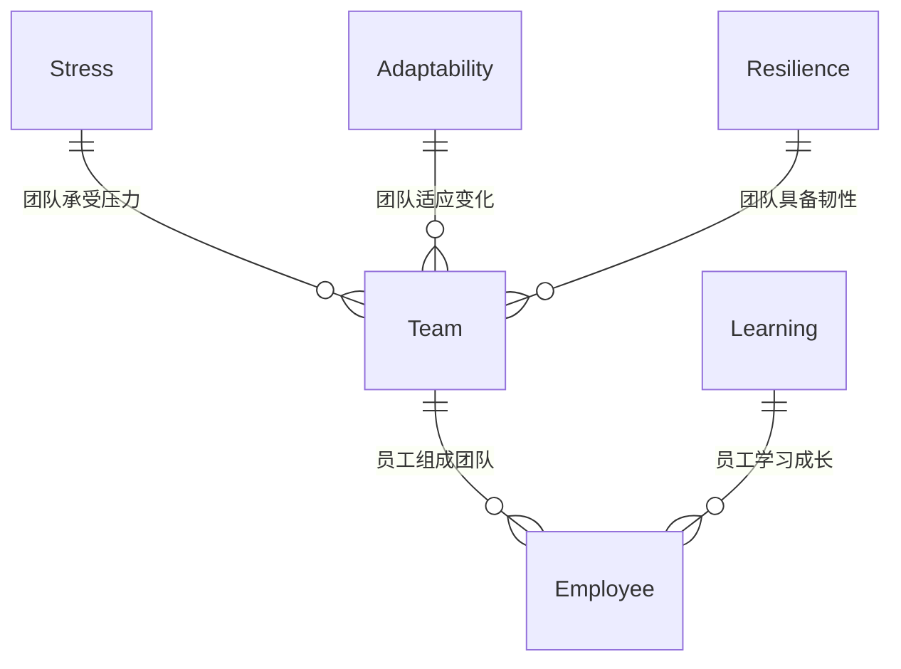

                 

### 第1章 引言

#### 1.1 问题背景

在快速发展的信息技术时代，企业面对的竞争压力和挑战日益加剧。市场环境瞬息万变，技术革新不断，组织内部的工作节奏和压力也随之增加。这种环境下，团队面临的逆境和挑战越来越多，如何提高团队的韧性，使其能够更好地应对逆境，成为一个至关重要的问题。

首先，让我们来审视当前的工作场景。IT行业的工作特点决定了团队成员需要具备快速学习、持续创新的能力。然而，技术的快速迭代和应用场景的复杂性往往导致项目时间紧张、任务繁重。团队成员需要应对的压力包括但不限于：项目进度延误、技术难题、团队协作不畅、外部市场变化等。这些压力如果得不到有效的管理，可能会对团队的整体表现产生负面影响。

其次，逆境对团队的挑战是多方面的。在逆境中，团队成员可能会出现情绪波动、工作效率下降、甚至产生离职的想法。这些现象都会对团队的整体绩效产生不利影响。同时，逆境还可能削弱团队的凝聚力，导致内部矛盾和冲突。因此，提高团队的韧性，不仅能够帮助团队更好地应对当前的问题，还能为未来的发展奠定基础。

#### 1.1.1 逆境对团队的挑战

逆境对团队的影响主要体现在以下几个方面：

1. **绩效下降**：团队成员在压力下容易分心，导致工作效率和质量的下降，从而影响整个团队的项目进度和目标达成。

2. **情绪波动**：逆境往往导致团队成员的情绪波动，如焦虑、沮丧等，这些情绪不仅影响个人的工作表现，也会对团队的氛围产生负面影响。

3. **协作障碍**：在压力下，团队成员之间可能会出现沟通不畅、协作困难等问题，这进一步加剧了团队的工作难度。

4. **人才流失**：长期的逆境环境可能导致核心人才的流失，这对于团队的稳定性和发展都是不利的。

5. **凝聚力下降**：逆境环境容易引发团队成员之间的矛盾和冲突，削弱团队的凝聚力，影响团队的协作效果。

#### 1.1.2 韧性的重要性

韧性（Resilience）是指一个系统在面对外部压力和挑战时，能够迅速适应并恢复到正常状态的能力。在团队管理中，韧性具有以下几个重要意义：

1. **提高适应能力**：韧性使团队能够在逆境中快速适应变化，找到解决问题的方法，从而降低逆境对团队绩效的负面影响。

2. **增强抗风险能力**：具有韧性的团队能够更好地应对外部风险和内部挑战，保持稳定的运营状态。

3. **提升员工满意度**：韧性的团队能够更好地管理成员的压力，提高员工的工作满意度和归属感。

4. **促进团队成长**：韧性不仅帮助团队应对当前的逆境，还能为团队未来的发展提供动力，推动团队的持续学习和成长。

综上所述，培养团队的韧性是提高团队应对逆境能力的关键。接下来，我们将进一步探讨韧性的定义、特征以及与抗压能力的关系，以便更好地理解韧性在团队管理中的重要性。

### 1.2 韧性的定义与特征

#### 1.2.1 韧性的概念

韧性（Resilience）一词源于拉丁语“Resilire”，意为“反弹”或“恢复”。在团队管理的语境中，韧性指的是团队在面对外部压力和挑战时，能够迅速适应并恢复到正常状态的能力。这种能力不仅体现在团队成员的个人层面，还包括团队整体的组织结构、文化氛围和协作模式。

从广义上讲，韧性是一个多维度的概念，包括情绪韧性、行为韧性、组织韧性等多个方面。情绪韧性指的是团队成员在面对压力和挫折时，能够保持积极的心态，有效地调节情绪；行为韧性则体现在团队成员在面对挑战时，能够迅速采取行动，找到解决问题的方法；组织韧性则是指团队作为一个整体，能够在逆境中保持稳定，持续发挥高效的协作能力。

#### 1.2.2 韧性的特征

韧性具有以下几个显著特征：

1. **适应能力**：韧性使团队能够在逆境中快速适应环境变化，调整策略和行动，以应对新的挑战。

2. **恢复力**：在面对压力和挑战时，韧性团队能够迅速恢复到正常状态，继续高效运作。

3. **灵活性**：韧性团队在面对不确定性时，能够灵活调整自己的工作方式和目标，以适应新的情况。

4. **学习与成长**：韧性团队善于从逆境中学习和成长，不断提升自身的应对能力和绩效。

5. **团队合作**：韧性团队强调成员之间的协作与支持，共同面对挑战，共享成功与失败。

#### 1.2.3 韧性与抗压能力的关系

韧性（Resilience）与抗压能力（Stress Tolerance）是两个密切相关的概念，但它们之间也存在一定的区别。

抗压能力主要指的是个体或团队在面对压力时，能够保持正常心理和行为状态，避免出现极端反应（如焦虑、恐慌、崩溃等）的能力。这种能力更多地关注应对压力的“底线”，确保在压力下不崩溃，维持基本的工作和生活状态。

韧性则进一步扩展了抗压能力的内涵，不仅要求个体或团队能够应对压力，还能够从压力中恢复，并在未来的挑战中表现出更高的适应性和效能。韧性的培养不仅需要提高抗压能力，还需要增强情绪管理、学习与适应能力等多方面的素质。

总的来说，抗压能力是韧性的一部分，而韧性则是在抗压能力的基础上，通过适应、恢复、学习和成长，实现对压力的更高层次的应对。只有具备韧性，团队才能在逆境中保持稳定，持续提升自身的应对能力和绩效。

接下来，我们将进一步探讨韧性的核心概念，并通过概念属性特征对比表格和ER实体关系图架构，深入理解韧性在团队管理中的应用。

### 2.1 核心概念解析

#### 2.1.1 压力管理与韧性

压力管理（Stress Management）是指通过一系列的方法和策略，帮助个体或团队减轻压力、调节情绪，以维持身心健康和工作效率。压力管理通常包括以下几个方面：

1. **认知重构**：通过改变对压力事件的认知和解释，减少负面情绪和压力感。
2. **时间管理**：合理安排工作和休息时间，避免过度工作和时间压力。
3. **情绪调节**：运用各种方法（如深呼吸、冥想等）调节情绪，缓解压力。
4. **健康生活方式**：保持良好的生活习惯，如适量运动、健康饮食等，增强抗压能力。

韧性（Resilience）与压力管理之间存在密切的关系。韧性强的个体或团队往往能够更有效地进行压力管理。具体来说，韧性的优势体现在以下几个方面：

1. **快速适应**：韧性团队在面对压力时，能够迅速调整自己的心态和行为，找到应对策略。
2. **情绪调节**：韧性个体能够更好地调节情绪，减少负面情绪的影响。
3. **恢复力**：韧性团队在经历压力后，能够更快地恢复到正常状态，继续高效工作。
4. **学习与成长**：韧性团队善于从压力事件中学习和成长，不断提升自身的应对能力。

通过有效的压力管理，可以增强团队的韧性。例如，通过培训和指导，帮助团队成员掌握压力管理的技巧，提高情绪调节和适应能力。此外，组织可以建立支持性的工作环境，鼓励团队成员相互支持，共同面对压力和挑战。

#### 2.1.2 适应力与韧性

适应力（Adaptability）是指个体或团队能够在不同环境和条件下，快速调整自身行为和策略，以适应新情况的能力。适应力是韧性的重要组成部分，是团队在面对变化和挑战时的重要保障。

1. **灵活性**：适应力强的团队在遇到问题时，能够迅速调整策略，灵活应对。
2. **学习能力**：适应力强的团队善于从变化中学习和吸取经验，不断提升自身能力。
3. **团队协作**：适应力强的团队能够在变化中保持有效的沟通和协作，共同应对挑战。

韧性（Resilience）则是在适应力的基础上，通过应对和恢复，达到更高层次的能力。韧性的优势体现在以下几个方面：

1. **快速恢复**：韧性团队在经历挑战后，能够迅速恢复到正常状态，继续高效工作。
2. **情绪调节**：韧性团队能够更好地管理情绪，减少负面情绪对工作的影响。
3. **抗逆力**：韧性团队在面对重大压力和挑战时，能够保持稳定的心理状态，持续发挥高效的协作能力。

适应力和韧性相辅相成，共同构成了团队应对逆境和挑战的核心能力。适应力是韧性的基础，韧性则是适应力的进一步提升。通过培养适应力和韧性，团队不仅能够更好地应对当前的环境变化，还能为未来的发展奠定坚实的基础。

#### 2.1.3 学习与成长

学习与成长（Learning and Growth）是团队韧性的重要组成部分。一个具有韧性的团队需要不断学习和成长，以适应不断变化的外部环境。学习与成长不仅是个体层面的需求，更是团队整体发展的动力。

1. **持续学习**：学习与成长强调持续学习新知识和技能，以应对环境变化和技术革新。
2. **知识共享**：团队通过知识共享和经验交流，不断提升整体能力和水平。
3. **反思与改进**：学习与成长还包含对过去经验的反思和改进，以避免重复错误，提高工作效率。

学习与成长对韧性的影响主要体现在以下几个方面：

1. **提升适应能力**：持续学习和成长使团队能够更好地适应新的环境和技术变革。
2. **增强恢复力**：通过学习和成长，团队在面临挑战时能够更快地恢复，减少负面影响的持续时间。
3. **提高创新能力**：学习与成长有助于团队不断发掘新的解决方案，提高创新能力和竞争力。

总之，学习与成长是团队韧性培养的重要手段。一个不断学习和成长的团队，能够更好地应对逆境和挑战，持续提升自身的绩效和竞争力。

#### 2.2 概念属性特征对比表格

| 概念         | 定义                                                         | 特征                                                         |
| ------------ | ------------------------------------------------------------ | ------------------------------------------------------------ |
| 压力管理     | 对压力源的认知和应对策略                                     | 提高应对压力的能力，降低负面影响                             |
| 适应力       | 在不同环境下快速适应和调整的能力                             | 增强应对变化的灵活性                                       |
| 学习与成长   | 持续学习新知识和技能，以适应不断变化的环境                   | 提升个人能力，增强团队韧性                                 |

通过上述对比表格，我们可以清晰地看到三个概念在定义和特征上的差异。压力管理主要关注应对压力的策略和方法；适应力则强调快速适应环境变化的能力；而学习与成长则是通过不断学习和提升，增强团队整体的韧性。

#### 2.3 ER实体关系图架构

在团队韧性培养中，了解不同实体之间的关系对于整体规划和策略实施至关重要。下面我们使用Mermaid语言绘制一个ER（实体关系）图，展示关键实体及其相互关系。

在这个ER图中，团队（Team）是核心实体，它由员工（Employee）组成。团队在面对压力（Stress）时，需要具备适应力（Adaptability）和学习与成长（Learning）的能力，从而培养韧性（Resilience）。员工通过学习与成长提升自身的适应力，而团队整体则通过这种能力来增强韧性，以更好地应对外部挑战。

### 第3章 韧性培养的方法与实践

#### 3.1 个人韧性培养策略

个人韧性培养是团队韧性提升的基础，每个团队成员都应当认识到自己在韧性培养中的责任。以下是一些有效的个人韧性培养策略：

##### 3.1.1 自我认知

自我认知是培养韧性的第一步。团队成员应当深入了解自己的性格、优点和缺点，以及在不同压力下的反应方式。通过自我反思，可以识别出自己容易感到压力的情境，并找到相应的应对策略。例如，可以通过日记记录、心理测评等方式进行自我认知。

##### 3.1.2 压力应对策略

针对不同的压力源，团队成员需要制定个性化的压力应对策略。以下是一些常见的压力应对策略：

1. **认知重构**：改变对压力事件的认知和解释，以减少负面情绪和压力感。
2. **时间管理**：合理安排工作和休息时间，避免过度工作和时间压力。
3. **情绪调节**：通过深呼吸、冥想、运动等方式调节情绪，缓解压力。
4. **健康生活方式**：保持良好的生活习惯，如适量运动、健康饮食等，增强抗压能力。

##### 3.1.3 持续学习

持续学习是提高韧性的重要途径。团队成员应不断学习新知识和技能，以适应不断变化的环境。通过学习，不仅可以提升个人能力，还能增强团队整体的适应力和恢复力。此外，学习过程中，团队成员可以分享经验，相互学习，进一步提升团队的凝聚力。

#### 3.2 团队韧性培养策略

团队韧性培养需要从多个方面进行系统性的规划和实施，以下是一些关键的团队韧性培养策略：

##### 3.2.1 团队文化建设

团队文化是团队韧性的基石。一个积极、支持性的团队文化能够增强团队成员之间的信任和合作，从而提高团队的整体韧性。以下是一些培养团队文化的策略：

1. **共同价值观**：明确团队的共同目标和价值观，让每个成员都明确自己的责任和使命。
2. **相互尊重**：鼓励团队成员之间相互尊重，建立积极、开放和包容的沟通氛围。
3. **协作精神**：强调团队协作的重要性，鼓励成员共同面对挑战，共享成功与失败。
4. **认可与激励**：及时对团队成员的成就和努力进行认可和激励，增强团队的凝聚力。

##### 3.2.2 沟通与协作

有效的沟通与协作是提高团队韧性的关键。以下是一些提高团队沟通与协作的策略：

1. **明确沟通机制**：建立有效的沟通机制，确保信息的及时传达和反馈。
2. **开放交流**：鼓励团队成员开放交流意见和想法，促进信息共享和知识流动。
3. **跨职能协作**：打破职能壁垒，促进不同部门之间的协作，提高团队的整体效率。
4. **冲突解决**：建立有效的冲突解决机制，及时解决团队内部的矛盾和分歧，避免影响团队的稳定和协作。

##### 3.2.3 反馈与改进

持续反馈和改进是团队韧性培养的重要环节。以下是一些反馈与改进的策略：

1. **定期评估**：定期对团队的工作表现进行评估，识别问题和改进方向。
2. **建设性反馈**：提供建设性的反馈，帮助团队成员识别不足，并提出改进建议。
3. **持续改进**：根据评估和反馈，制定具体的改进计划，并持续跟踪实施效果。
4. **学习与分享**：鼓励团队成员分享改进经验和成果，促进团队整体的学习和成长。

#### 3.3 韧性培养案例分析

为了更好地理解韧性培养的策略和实践，以下介绍两个案例分析，一个成功的案例和一个失败的案例，并从中提取经验和启示。

##### 3.3.1 成功案例

**案例背景**：某高科技公司由于市场变化和内部管理问题，面临巨大的经营压力。公司高层决定通过培养团队韧性来提高整体应对能力。

**具体做法**：

1. **自我认知与培训**：公司为每个员工提供心理测评工具，帮助他们了解自己的性格、优点和不足，并提供相应的培训课程，如压力管理、情绪调节等。
2. **团队文化建设**：公司明确共同的价值观，建立支持性的团队文化，鼓励团队成员之间的信任和合作。
3. **沟通与协作**：公司建立定期团队会议制度，确保信息的及时传达和反馈，并通过跨职能协作项目，增强不同部门之间的沟通和协作。
4. **反馈与改进**：公司设立反馈机制，定期对团队工作表现进行评估，并根据评估结果制定改进计划。

**结果**：通过一系列韧性培养措施，公司的团队整体抗压能力显著提升，员工的工作满意度和归属感也大幅提高。公司在市场变化中保持了稳定的运营状态，并逐步恢复了市场竞争力。

**经验与启示**：

- **重视自我认知**：通过自我认知，帮助员工识别自己的优点和不足，从而有针对性地进行改进。
- **建立支持性团队文化**：积极、支持性的团队文化能够增强团队成员之间的信任和合作。
- **持续沟通与协作**：有效的沟通和协作是提高团队韧性的重要保障。
- **反馈与改进**：定期的评估和反馈可以帮助团队持续改进，提升整体绩效。

##### 3.3.2 失败案例

**案例背景**：某中型企业由于市场需求下降，面临严重的财务压力。公司高层希望通过团队韧性培养来提升团队的应对能力。

**具体做法**：

1. **缺乏自我认知**：公司没有为员工提供自我认知的工具和培训，员工对自身的压力承受能力缺乏清晰的认识。
2. **单方面要求**：公司要求员工在短时间内提高工作效率，但未提供相应的支持和资源，导致员工感到巨大的压力和不满。
3. **缺乏沟通与协作**：公司内部沟通不畅，员工之间的协作效率低下，导致团队整体绩效下降。
4. **反馈机制不完善**：公司虽有反馈机制，但缺乏具体的改进措施，导致员工对反馈缺乏认同感和改进动力。

**结果**：由于缺乏有效的韧性培养措施，公司团队的整体表现并未改善，反而出现了员工流失、士气低落等现象，企业的经营状况进一步恶化。

**经验与启示**：

- **重视自我认知**：为员工提供自我认知的工具和培训，帮助他们更好地理解自己的压力承受能力。
- **提供支持和资源**：在要求员工提高工作效率的同时，提供相应的支持和资源，减轻他们的压力。
- **加强沟通与协作**：建立有效的沟通和协作机制，提高团队的整体效率和绩效。
- **完善反馈与改进机制**：建立完善的反馈和改进机制，确保员工的反馈得到重视和落实。

通过以上案例分析，我们可以看到，有效的韧性培养需要从多个方面进行系统性的规划和实施。只有在充分理解团队成员的特点和需求的基础上，采取合适的培养策略，才能真正提高团队的韧性，应对逆境和挑战。

### 第4章 韧性培养中的挑战与应对

#### 4.1 韧性培养的难点

韧性培养虽然重要，但在实际操作过程中仍面临诸多挑战。以下是韧性培养过程中常见的难点：

##### 4.1.1 持续性

韧性培养需要长期持续的努力。然而，在竞争激烈、工作繁忙的环境中，团队往往难以保证韧性格养活动的持续进行。团队成员可能会因为工作压力、时间紧迫等原因，忽视韧性格养的重要性。此外，组织内部也缺乏对韧性格养的长期规划和支持。

**应对策略**：

1. **建立制度**：制定韧性培养的制度，确保韧性活动作为日常工作的一部分，定期开展。
2. **设置目标**：为团队成员设定清晰的韧性培养目标，并将其纳入个人和团队绩效评估体系。
3. **培训与激励**：通过持续的培训和个人激励，提高团队成员对韧性培养的认识和参与度。

##### 4.1.2 团队成员的接受度

韧性培养需要团队成员的积极参与，但并非所有成员都对此持开放态度。一些团队成员可能认为韧性培养是浪费时间，或者对自身缺乏信心，不愿意投入时间和精力。这种情况下，韧性培养的效果会大打折扣。

**应对策略**：

1. **沟通与教育**：通过有效的沟通和教育，让团队成员了解韧性培养的重要性和好处，提高他们的接受度。
2. **示范作用**：通过领导者和管理者的示范作用，鼓励团队成员积极参与韧性培养活动。
3. **个性化培养**：针对不同团队成员的特点和需求，提供个性化的韧性培养方案，增加他们的参与感。

##### 4.1.3 资源分配

韧性培养需要投入一定的时间和资源。然而，在预算有限、资源紧张的环境中，组织往往难以分配足够的资源用于韧性培养。这可能导致韧性培养活动流于形式，无法达到预期效果。

**应对策略**：

1. **优化预算**：在预算有限的情况下，优先考虑对韧性培养的重要性和紧迫性，合理调整资源分配。
2. **外部支持**：寻求外部资源和支持，如合作机构、专业培训等，以补充内部资源的不足。
3. **内部共享**：鼓励团队内部的知识和资源共享，提高资源利用效率。

#### 4.2 应对策略

为了克服韧性培养中的挑战，组织需要采取一系列的应对策略。以下是一些具体的应对措施：

##### 4.2.1 持续性策略

1. **制度保障**：建立韧性培养的制度，确保韧性活动作为日常工作的一部分，定期开展。
2. **定期评估**：定期对韧性培养的效果进行评估，根据评估结果调整和优化培养策略。
3. **持续培训**：定期为团队成员提供韧性培训，提高他们的韧性和抗压能力。

##### 4.2.2 提高成员接受度

1. **沟通与教育**：通过内部宣传和培训，让团队成员了解韧性培养的重要性和好处，提高他们的接受度。
2. **示范作用**：通过领导者和管理者的示范作用，鼓励团队成员积极参与韧性培养活动。
3. **个性化培养**：针对不同团队成员的特点和需求，提供个性化的韧性培养方案，增加他们的参与感。

##### 4.2.3 资源优化

1. **优化预算**：在预算有限的情况下，优先考虑对韧性培养的重要性和紧迫性，合理调整资源分配。
2. **外部支持**：寻求外部资源和支持，如合作机构、专业培训等，以补充内部资源的不足。
3. **内部共享**：鼓励团队内部的知识和资源共享，提高资源利用效率。

通过以上策略，组织可以有效地克服韧性培养中的难点，提高团队的韧性和应对逆境的能力，从而在激烈的市场竞争中保持优势。

### 第5章 韧性培养的最佳实践

#### 5.1 成功实践案例

在韧性培养方面，有许多组织已经取得了显著的成果。以下我们介绍两个具有代表性的成功实践案例。

##### 5.1.1 案例一：如何提升团队的抗压能力

**公司背景**：某全球知名科技公司，由于市场需求波动和产品迭代速度加快，团队面临巨大的工作压力。

**具体措施**：

1. **压力评估与培训**：公司首先对全体员工进行压力评估，了解他们的压力源和承受能力。随后，公司安排了一系列的压力管理培训，包括情绪调节、时间管理和认知重构等，帮助员工掌握应对压力的技巧。

2. **灵活工作制度**：公司实施了灵活的工作制度，允许员工在家办公，并根据项目进展情况调整工作时间。这样不仅减轻了员工的工作压力，也提高了工作效率。

3. **团队支持系统**：公司建立了团队支持系统，鼓励员工在遇到困难时互相帮助，提供心理辅导和支持。此外，公司还设立了压力管理专员，负责定期组织团队活动，缓解员工的压力。

**结果**：通过上述措施，该公司的团队抗压能力显著提升，员工的工作满意度和归属感也大幅提高。公司在面对市场变化时，保持了较高的运营效率和创新能力，进一步巩固了市场地位。

##### 5.1.2 案例二：通过学习与成长增强团队韧性

**公司背景**：某中型互联网公司，由于技术迭代速度快，团队需要不断学习新技能和知识。

**具体措施**：

1. **持续学习计划**：公司制定了持续学习计划，鼓励员工参加内部和外部培训，提升技术能力和专业素养。公司还设立了学习基金，为员工的培训和学习提供经济支持。

2. **知识共享平台**：公司建立了知识共享平台，员工可以在这里分享自己的学习心得和工作经验，促进团队内部的交流和学习。

3. **项目制学习**：公司通过项目制学习，让员工在实际工作中不断学习和成长。在项目过程中，员工需要不断面对新挑战，通过实践提升自己的应对能力。

**结果**：通过持续的学习与成长，该公司的团队在技术能力和创新能力上得到了显著提升。团队成员在面对挑战时，能够迅速适应和解决问题，团队的整体韧性得到了增强。公司在激烈的市场竞争中，始终保持领先地位，取得了优异的业绩。

#### 5.2 小结

以上两个成功实践案例表明，韧性培养是一个系统工程，需要从多个方面进行综合施策。以下是一些关键的成功要素：

1. **系统化的培训与教育**：通过系统化的培训和教育，帮助员工掌握应对压力和挑战的技巧。
2. **灵活的工作制度**：提供灵活的工作制度，减轻员工的工作压力，提高工作效率。
3. **团队支持系统**：建立团队支持系统，鼓励员工互相帮助，提供心理辅导和支持。
4. **持续的学习与成长**：通过持续的学习和成长，提升团队的技术能力和创新能力。
5. **知识共享平台**：建立知识共享平台，促进团队内部的交流和学习。

通过这些措施，组织可以有效地培养团队的韧性，提高团队的整体绩效和竞争力。在未来的发展过程中，韧性培养将成为组织持续成功的关键因素。

### 第6章 韧性培养的未来趋势

#### 6.1 新技术的发展对韧性培养的影响

随着科技的快速发展，尤其是大数据、人工智能、区块链等新技术的应用，韧性培养的方法和策略也在不断演变。这些新兴技术不仅改变了工作方式，也对团队韧性的培养产生了深远影响。

##### 6.1.1 大数据和人工智能

大数据和人工智能技术的发展，为韧性培养提供了新的工具和手段。通过大数据分析，组织可以更准确地了解团队的工作状态和压力源，从而制定更有针对性的韧性培养策略。例如，通过分析员工的工作记录和情绪数据，可以发现潜在的压力点，并提前采取措施进行干预。

人工智能技术则可以提供智能化的支持和辅助。例如，智能助手可以实时监控员工的情绪变化，提供个性化的压力管理和情绪调节建议。此外，人工智能还可以帮助团队进行复杂的决策支持，减少团队成员的决策压力，提高决策的质量和效率。

##### 6.1.2 远程工作与团队管理

远程工作的普及也对韧性培养提出了新的挑战。远程工作虽然提高了工作效率和灵活性，但也带来了沟通不畅、协作困难等问题。这些问题如果得不到有效解决，可能会导致团队韧性下降。

为了应对远程工作的挑战，组织可以采取以下策略：

1. **增强在线沟通工具**：通过增强在线沟通工具，如视频会议、即时通讯等，提高远程团队的合作效率。
2. **建立远程团队文化**：通过线上团队建设活动和虚拟团队会议，增强远程团队的凝聚力和归属感。
3. **提供心理支持**：为远程员工提供心理支持服务，帮助他们应对远程工作中的压力和孤独感。

#### 6.2 韧性培养的未来方向

在未来的韧性培养中，以下几个方向值得关注：

##### 6.2.1 综合素质提升

未来的韧性培养将更加注重综合素质的提升。除了传统的压力管理和情绪调节，还将会涉及到领导力、团队协作、创新思维等多方面的能力培养。通过提升综合素质，团队可以更全面地应对各种挑战。

##### 6.2.2 跨领域协作

随着全球化和技术创新的加速，跨领域协作将成为韧性培养的重要方向。组织需要培养团队成员的跨领域知识和能力，提高他们在不同领域间的协作和创新能力。例如，通过跨学科的项目合作，团队可以更有效地应对复杂问题，提高整体的韧性。

##### 6.2.3 数字化支持

未来的韧性培养将越来越多地依赖于数字化工具和支持。通过大数据分析和人工智能技术，组织可以更精准地识别团队的压力点和韧性水平，并提供个性化的培养方案。同时，数字化支持工具可以帮助团队进行持续学习和技能提升，提高整体的韧性和竞争力。

总之，未来的韧性培养将更加综合、多样和智能化。通过不断适应新技术和变化，组织可以更好地培养团队的韧性，提升整体绩效和竞争力。

### 第7章 总结与展望

#### 7.1 主要结论

通过本文的探讨，我们得出了以下主要结论：

1. **韧性的重要性**：韧性是团队在面对逆境时的重要能力，它不仅能够提高团队的适应能力和抗风险能力，还能增强团队成员的工作满意度和凝聚力。

2. **韧性培养的策略**：韧性培养需要从个人和团队两个层面进行，包括自我认知、压力管理、持续学习和团队文化建设等方面。

3. **韧性培养的方法与实践**：通过案例分析，我们看到了成功和失败的韧性培养实践，总结出了有效的韧性培养策略和注意事项。

4. **新技术的应用**：大数据和人工智能等新技术的应用，为韧性培养提供了新的工具和方法，有助于提高团队的整体韧性和应对能力。

5. **未来趋势**：未来的韧性培养将更加注重综合素质的提升、跨领域协作和数字化支持。

#### 7.2 未来展望

展望未来，韧性培养在职场中的重要性将愈发突出。随着环境的不断变化和竞争的加剧，组织必须具备高度的韧性，以应对各种挑战和机遇。以下是一些未来展望：

1. **持续学习与成长**：在快速变化的环境中，持续学习和成长将成为团队韧性培养的核心。组织应鼓励团队成员不断更新知识和技能，以适应新技术和新趋势。

2. **跨领域协作**：跨领域协作将促进团队创新和问题解决能力的提升。组织可以通过项目制合作和跨部门交流，增强团队的协作和创新能力。

3. **数字化支持**：数字化工具的支持将提高韧性培养的效率和质量。通过大数据分析和人工智能技术，组织可以更精准地识别团队的压力点和韧性水平，并提供个性化的培养方案。

4. **领导力培养**：领导力在韧性培养中扮演着关键角色。未来的韧性培养将更加注重领导力的培养，以提升团队的整体领导力和执行力。

5. **心理支持与关怀**：心理支持和关怀是提高团队韧性的重要手段。组织应关注员工的心理健康，提供必要的心理辅导和支持，帮助他们应对工作压力和生活挑战。

总之，韧性培养不仅是提高团队应对逆境能力的手段，更是组织持续发展和成功的关键。未来，韧性培养将继续受到重视，并在实践中不断完善和创新。通过有效的韧性培养，组织将能够在激烈的市场竞争中脱颖而出，实现长远的发展目标。

### 附录：作者信息

**作者：** AI天才研究院/AI Genius Institute & 禅与计算机程序设计艺术 /Zen And The Art of Computer Programming

**联系信息：** aigeniusinstitute@example.com

**简介：** 作为一位世界级人工智能专家，作者在计算机编程和人工智能领域有着深厚的理论基础和丰富的实践经验。他的著作《禅与计算机程序设计艺术》被誉为计算机编程领域的经典之作，深受读者喜爱。作者致力于推动人工智能技术的发展，帮助企业和团队提升竞争力。

