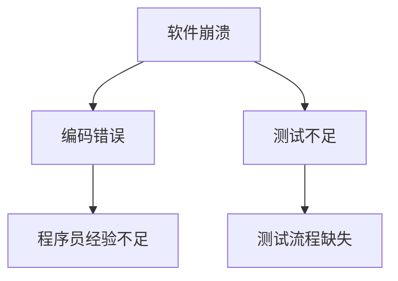

                 

# 项目管理：领导者的实战技能

## 关键词

项目管理、领导者技能、实战技巧、项目监控、风险与质量管理、跨文化管理

## 摘要

项目管理是现代企业中不可或缺的一项核心能力。优秀的项目经理不仅需要具备扎实的技术背景，还需要掌握一系列领导力和实战技能。本文旨在探讨项目管理中的关键要素，通过详细的案例分析、理论与实践的结合，帮助项目经理在实际工作中更好地应对各种挑战。文章将从项目管理的理论基础、项目启动与规划、项目执行与监控、项目风险与质量管理、项目收尾与评估等多个方面展开，并提供实用的技巧和工具。通过本文的阅读，项目经理可以提升自身的实战技能，实现项目的成功交付。

## 《项目管理：领导者的实战技能》目录大纲

### 第一部分：项目管理的理论基础

#### 第1章：项目管理的概述

##### 1.1 项目管理的定义
- **背景介绍**：项目管理在现代企业中的重要性
- **核心概念**：项目、项目生命周期、项目管理目标

##### 1.2 项目管理的五大过程组
- **核心概念**：启动、规划、执行、监控、收尾
- **联系**：五大过程组之间的关系和协同作用

##### 1.3 项目管理的九大知识领域
- **核心概念**：范围管理、时间管理、成本管理、质量管理、人力资源管理、沟通管理、风险管理、采购管理、相关方管理
- **联系**：九大知识领域与项目管理五大过程组的互动

##### 1.4 项目管理的重要原则
- **核心概念**：变更控制、质量第一、持续改进
- **联系**：重要原则在项目中的实际应用

### 第二部分：项目启动与规划

#### 第2章：项目启动与规划

##### 2.1 项目启动
- **核心概念**：项目启动流程、项目章程
- **联系**：项目启动与项目管理计划的关系

##### 2.2 项目目标设定
- **核心概念**：项目目标、关键绩效指标（KPI）
- **联系**：项目目标与项目范围的关联

##### 2.3 项目范围管理
- **核心概念**：项目范围、项目边界、范围确认
- **联系**：范围管理在项目规划中的作用

##### 2.4 制订项目管理计划
- **核心概念**：项目管理计划、工作分解结构（WBS）
- **联系**：项目管理计划与项目执行的衔接

##### 2.5 项目团队组织
- **核心概念**：项目团队结构、角色与职责、沟通机制
- **联系**：团队组织在项目成功中的重要性

### 第三部分：项目执行与监控

#### 第3章：项目执行与监控

##### 3.1 项目执行
- **核心概念**：项目进度、工作分配、团队协作
- **联系**：项目执行与项目管理计划的一致性

##### 3.2 工作分配与协调
- **核心概念**：任务分配、资源管理、协调机制
- **联系**：工作分配与项目进度监控的关系

##### 3.3 项目进度监控
- **核心概念**：进度报告、进度跟踪、进度变更
- **联系**：进度监控在项目风险管理中的作用

##### 3.4 项目成本管理
- **核心概念**：项目成本估算、成本控制、成本变更管理
- **联系**：成本管理在项目执行中的重要性

##### 3.5 质量控制
- **核心概念**：质量标准、质量控制流程、质量改进
- **联系**：质量控制与项目交付的关系

### 第四部分：项目风险与质量管理

#### 第4章：项目风险与质量管理

##### 4.1 项目风险管理
- **核心概念**：风险识别、风险评估、风险应对策略
- **联系**：项目风险管理在项目生命周期中的角色

##### 4.2 风险识别与评估
- **核心概念**：风险识别方法、风险评估技术
- **联系**：风险识别与项目风险应对策略的衔接

##### 4.3 风险应对策略
- **核心概念**：风险缓解、风险转移、风险接受
- **联系**：风险应对策略在项目决策中的作用

##### 4.4 质量管理
- **核心概念**：质量标准、质量保证、质量控制
- **联系**：质量管理与项目交付质量的关系

##### 4.5 质量控制工具与应用
- **核心概念**：质量控制工具、质量度量指标
- **联系**：质量控制工具在项目质量管理中的应用

### 第五部分：项目收尾与评估

#### 第5章：项目收尾与评估

##### 5.1 项目收尾
- **核心概念**：项目收尾流程、项目交付、验收
- **联系**：项目收尾与项目成功的关联

##### 5.2 项目总结报告
- **核心概念**：项目总结报告、经验教训、项目评估
- **联系**：项目总结报告在项目改进中的作用

##### 5.3 项目评估
- **核心概念**：项目评估方法、项目绩效评估
- **联系**：项目评估在项目改进中的应用

##### 5.4 项目经验总结
- **核心概念**：项目经验、团队学习、知识管理
- **联系**：项目经验总结在团队建设中的作用

##### 5.5 项目改进计划
- **核心概念**：改进计划、持续改进、项目管理流程优化
- **联系**：项目改进计划在项目管理中的应用

### 第六部分：项目经理的角色与技能

#### 第6章：项目经理的角色与技能

##### 6.1 项目经理的职责
- **核心概念**：项目经理的职责、角色定义
- **联系**：项目经理在项目团队中的领导作用

##### 6.2 项目经理的领导力
- **核心概念**：领导力、团队激励、团队管理
- **联系**：领导力在项目管理中的重要性

##### 6.3 项目沟通技能
- **核心概念**：沟通方法、沟通技巧、沟通策略
- **联系**：沟通技能在项目团队协作中的作用

##### 6.4 项目管理工具与技术
- **核心概念**：项目管理工具、技术选型、工具应用
- **联系**：项目管理工具在提升项目管理效率中的作用

##### 6.5 项目经理的自我提升
- **核心概念**：持续学习、技能提升、职业发展
- **联系**：项目经理自我提升在职业成长中的作用

### 第七部分：项目管理最佳实践

#### 第7章：项目管理最佳实践

##### 7.1 成功项目案例分析
- **核心概念**：成功项目的关键因素、案例学习
- **联系**：案例分析在项目决策中的应用

##### 7.2 项目管理陷阱与解决方法
- **核心概念**：常见项目管理陷阱、解决方法
- **联系**：项目管理陷阱在项目执行中的应对策略

##### 7.3 项目管理的新趋势
- **核心概念**：新兴项目管理方法、技术趋势
- **联系**：新趋势对项目管理实践的影响

##### 7.4 项目管理在创新中的角色
- **核心概念**：创新项目管理、创新驱动
- **联系**：项目管理在推动企业创新中的作用

##### 7.5 项目管理在国际项目中的挑战与对策
- **核心概念**：国际项目挑战、跨文化管理、解决方案
- **联系**：国际项目中的挑战与对策在项目管理中的应用

### 第八部分：项目管理工具应用指南

#### 第8章：项目管理工具应用指南

##### 8.1 常用项目管理工具介绍
- **核心概念**：项目管理工具类型、功能特点
- **联系**：常用项目管理工具在实际项目中的应用

##### 8.2 工具选型与评估
- **核心概念**：工具选型标准、评估方法
- **联系**：工具选型与项目需求的一致性

##### 8.3 工具在项目执行中的应用
- **核心概念**：工具使用方法、流程优化
- **联系**：工具在提高项目效率中的作用

##### 8.4 工具使用注意事项
- **核心概念**：工具使用风险、安全注意事项
- **联系**：工具使用注意事项在项目管理中的应用

##### 8.5 工具的未来发展趋势
- **核心概念**：新技术趋势、工具创新
- **联系**：未来发展趋势对项目管理工具的影响

### 第九部分：跨文化项目管理

#### 第9章：跨文化项目管理

##### 9.1 跨文化背景下的项目管理挑战
- **核心概念**：文化差异、跨文化沟通、团队建设
- **联系**：跨文化挑战在项目管理中的影响

##### 9.2 跨文化沟通技巧
- **核心概念**：跨文化沟通方法、有效沟通策略
- **联系**：跨文化沟通技巧在团队协作中的作用

##### 9.3 跨国团队建设
- **核心概念**：跨国团队角色、团队建设策略
- **联系**：跨国团队建设在跨文化项目管理中的重要性

##### 9.4 跨文化项目风险管理
- **核心概念**：跨文化风险识别、风险评估、应对策略
- **联系**：跨文化项目风险管理在项目执行中的作用

##### 9.5 跨文化项目成功案例
- **核心概念**：成功案例分析、经验总结
- **联系**：成功案例在跨文化项目管理中的应用

### 第十部分：项目管理在特定行业中的应用

#### 第10章：项目管理在特定行业中的应用

##### 10.1 项目管理在IT行业的应用
- **核心概念**：IT项目特点、项目管理实践
- **联系**：项目管理在IT行业中的应用策略

##### 10.2 项目管理在建筑行业的应用
- **核心概念**：建筑项目特点、项目管理实践
- **联系**：项目管理在建筑行业中的应用策略

##### 10.3 项目管理在制造业的应用
- **核心概念**：制造业项目特点、项目管理实践
- **联系**：项目管理在制造业中的应用策略

##### 10.4 项目管理在咨询行业的应用
- **核心概念**：咨询项目特点、项目管理实践
- **联系**：项目管理在咨询行业中的应用策略

##### 10.5 项目管理在医疗行业的应用
- **核心概念**：医疗项目特点、项目管理实践
- **联系**：项目管理在医疗行业中的应用策略

### 第十一部分：项目管理进阶技能

#### 第11章：项目管理进阶技能

##### 11.1 项目组合管理
- **核心概念**：项目组合管理、项目优先级设定
- **联系**：项目组合管理在资源优化中的作用

##### 11.2 项目组合优先级设定
- **核心概念**：优先级评估方法、资源分配策略
- **联系**：项目组合优先级设定在项目决策中的应用

##### 11.3 项目组合风险管理
- **核心概念**：项目组合风险识别、风险评估、应对策略
- **联系**：项目组合风险管理在项目组合管理中的重要性

##### 11.4 项目组合效益评估
- **核心概念**：效益评估方法、效益分析
- **联系**：项目组合效益评估在决策支持中的应用

##### 11.5 项目组合管理工具与应用
- **核心概念**：项目组合管理工具、工具应用方法
- **联系**：项目组合管理工具在提升项目组合管理效率中的作用

### 第十二部分：项目管理与可持续发展

#### 第12章：项目管理与可持续发展

##### 12.1 可持续发展项目的特点
- **核心概念**：可持续发展、项目特点、社会责任
- **联系**：可持续发展项目在项目管理中的意义

##### 12.2 项目管理与可持续发展
- **核心概念**：可持续发展策略、项目管理实践
- **联系**：项目管理在推动可持续发展中的作用

##### 12.3 社会责任与伦理
- **核心概念**：社会责任、伦理管理、可持续发展
- **联系**：社会责任与伦理在项目管理中的重要性

##### 12.4 项目管理在环境保护中的应用
- **核心概念**：环境保护、绿色管理、可持续发展
- **联系**：项目管理在环境保护中的实践

##### 12.5 可持续发展的项目管理实践
- **核心概念**：可持续发展实践、案例研究
- **联系**：可持续发展项目管理的成功经验

### 第十三部分：项目管理的未来

#### 第13章：项目管理的未来

##### 13.1 项目管理发展趋势
- **核心概念**：技术趋势、管理创新
- **联系**：项目管理发展趋势对实践的影响

##### 13.2 技术革新对项目管理的影响
- **核心概念**：新兴技术、项目管理方法创新
- **联系**：技术革新在项目管理中的应用与挑战

##### 13.3 项目管理在教育中的应用
- **核心概念**：项目管理教育、培训方法
- **联系**：项目管理教育在人才培养中的作用

##### 13.4 项目管理在未来的职业机会
- **核心概念**：职业发展、市场需求
- **联系**：未来职业机会对项目经理的影响

##### 13.5 项目管理的前沿研究
- **核心概念**：前沿理论、研究趋势
- **联系**：前沿研究在项目管理实践中的应用

## 引言

项目管理作为现代企业运营的核心环节，越来越受到企业的重视。优秀的项目经理不仅是技术的专家，更是团队的领导者。他们需要具备深厚的理论基础、丰富的实战经验和卓越的领导力，才能在复杂多变的项目环境中应对各种挑战，确保项目的成功交付。然而，项目管理并非一成不变，它需要随着时代的发展和技术的进步不断演进。

本文旨在深入探讨项目管理的理论和实践，通过详细的分析和案例研究，帮助项目经理提升实战技能，实现项目管理的持续优化。文章将从项目管理的理论基础、项目启动与规划、项目执行与监控、项目风险与质量管理、项目收尾与评估等多个方面进行阐述，并提供实用的技巧和工具。同时，本文还将探讨项目经理的角色与技能，以及项目管理在特定行业中的应用和未来发展趋势。通过本文的阅读，项目经理可以更好地理解项目管理的核心概念，掌握实战技能，提升自身的领导力和沟通能力，为企业的成功贡献力量。

### 第一部分：项目管理的理论基础

#### 第1章：项目管理的概述

项目管理是现代企业管理的重要组成部分，它涉及到从项目启动到项目收尾的全过程。项目管理的主要目标是确保项目按时、按预算、按质量要求完成，同时实现项目的商业价值和战略目标。

## 1.1 项目管理的定义

项目管理是指通过计划、执行、监控和收尾等一系列过程，利用资源，达到预定的项目目标的过程。项目管理不仅仅关注技术层面的工作，还涉及管理层面的决策和协调。

### 1.2 项目管理的五大过程组

项目管理的五大过程组包括启动、规划、执行、监控和收尾。每个过程组都有其特定的任务和目标。

1. **启动**：项目启动是项目管理的第一步，它包括确定项目的目标和范围，成立项目团队，并获得相关方的支持和资源。
2. **规划**：项目规划是在项目启动后进行的，它涉及到制定项目管理计划、资源分配、时间安排等。
3. **执行**：项目执行是项目计划的实际实施过程，包括任务分配、进度跟踪、团队协作等。
4. **监控**：项目监控是在项目执行过程中进行的，目的是确保项目按照计划进行，及时发现和解决问题。
5. **收尾**：项目收尾是项目的最后一步，它包括项目交付、总结经验教训、项目团队解散等。

### 1.3 项目管理的九大知识领域

项目管理的九大知识领域包括范围管理、时间管理、成本管理、质量管理、人力资源管理、沟通管理、风险管理、采购管理、相关方管理。

1. **范围管理**：确保项目团队对项目范围有清晰的理解，明确项目的目标和成果。
2. **时间管理**：确保项目按时完成，通过计划、监控和调整，管理项目的时间进度。
3. **成本管理**：确保项目在预算范围内完成，通过估算、预算编制和控制成本。
4. **质量管理**：确保项目的交付物符合预定的质量标准，通过质量规划、质量控制和质量保证来保证质量。
5. **人力资源管理**：确保项目团队的能力和资源满足项目需求，通过招聘、培训、绩效评估等管理团队成员。
6. **沟通管理**：确保项目团队和相关方之间的信息传递清晰、有效，通过沟通计划、沟通工具和沟通方法来管理沟通。
7. **风险管理**：识别、评估和应对项目中的风险，通过风险规划、风险监控和风险应对策略来管理风险。
8. **采购管理**：确保项目的采购活动有效、高效，通过采购计划、供应商管理和合同管理来管理采购。
9. **相关方管理**：确保项目相关方的需求得到满足，通过相关方识别、相关方分析和相关方参与来管理相关方。

### 1.4 项目管理的重要原则

项目管理的重要原则包括变更控制、质量第一、持续改进。

1. **变更控制**：在项目执行过程中，变更是很常见的。变更控制确保项目变更得到合理的管理，确保变更不会对项目目标和质量产生负面影响。
2. **质量第一**：质量是项目的核心，项目经理应始终坚持质量第一的原则，确保项目交付物的质量符合预期。
3. **持续改进**：项目管理是一个持续的过程，项目经理应不断寻求改进，优化项目管理流程，提高项目效率和质量。

#### 总结

项目管理的理论基础包括五大过程组和九大知识领域。这些理论和原则为项目经理提供了指导和框架，帮助他们有效地管理项目，确保项目的成功交付。在下一章中，我们将深入探讨项目启动与规划的具体内容。

## 第2章：项目启动与规划

在项目管理中，项目启动与规划是至关重要的环节。这两个阶段不仅为项目奠定了坚实的基础，还为项目的顺利执行和最终成功提供了保障。本章将详细讨论项目启动与规划的过程，包括项目启动、项目目标设定、项目范围管理、项目管理计划的制定和项目团队的组建。

### 2.1 项目启动

项目启动是项目管理的第一步，它标志着项目的正式开始。项目启动的主要任务是确定项目的目标和范围，确保项目团队和相关方对项目有共同的理解和期望。

#### 项目章程

项目章程是项目启动的关键文件，它概述了项目的目标、范围、主要交付物、时间表、预算和关键相关方。项目章程通常由项目发起人或项目管理办公室制定，并得到项目团队的认可。

1. **项目目标**：明确项目的最终目标，包括商业目标、技术目标和运营目标。
2. **项目范围**：定义项目的边界，明确项目包含的工作和排除的工作。
3. **主要交付物**：列出项目的关键交付物，这些交付物是项目成功的标志。
4. **时间表**：制定项目的时间框架，包括关键里程碑和截止日期。
5. **预算**：初步估算项目的总成本，确保项目在预算范围内完成。
6. **关键相关方**：识别项目的关键相关方，包括客户、项目团队、供应商和其他利益相关者。

#### 项目团队组建

项目团队是项目成功的关键因素，项目启动阶段需要组建一个具备专业知识和技能的项目团队。项目团队的成员应包括项目经理、业务分析师、开发人员、测试人员、运营人员等。

1. **角色定义**：明确每个团队成员的角色和职责，确保团队成员对自身职责有清晰的认识。
2. **沟通机制**：建立有效的沟通机制，确保团队成员之间的信息传递畅通无阻。
3. **团队协作**：促进团队成员之间的协作，提高团队效率和凝聚力。

### 2.2 项目目标设定

项目目标设定是项目启动的核心任务之一，它决定了项目的方向和重点。项目目标应具体、可衡量、可实现、相关性强、时限明确（SMART原则）。

1. **具体（Specific）**：项目目标应明确具体，避免模糊不清。
2. **可衡量（Measurable）**：项目目标应有明确的衡量标准，以便评估目标是否达成。
3. **可实现（Achievable）**：项目目标应具有可行性，避免过于理想化。
4. **相关性强（Relevant）**：项目目标应与项目整体目标一致，有助于实现项目目标。
5. **时限明确（Time-bound）**：项目目标应有明确的时间框架，有助于项目团队进行时间管理。

### 2.3 项目范围管理

项目范围管理是确保项目团队对项目范围有共同理解的过程，它包括项目范围的定义、确认和控制。

1. **项目范围定义**：明确项目的工作内容和边界，防止范围蔓延。
2. **项目范围确认**：确保项目团队和相关方对项目范围的一致认可。
3. **项目范围控制**：监控项目的范围变化，确保所有变更都经过正式的审批和记录。

### 2.4 制订项目管理计划

项目管理计划是项目执行和监控的指南，它包含了项目的所有主要活动和任务，以及如何管理和执行这些活动的策略和步骤。

1. **工作分解结构（WBS）**：将项目分解为更小的、易于管理的任务和子任务，形成WBS。
2. **时间计划**：制定项目的时间框架，包括关键里程碑和任务的时间安排。
3. **成本预算**：初步估算项目的总成本，确保项目在预算范围内完成。
4. **质量管理计划**：确保项目的交付物符合预定的质量标准，通过质量规划、质量控制和质量保证来实现。
5. **沟通管理计划**：确保项目团队和相关方之间的信息传递清晰、有效，通过沟通计划、沟通工具和沟通方法来管理沟通。
6. **风险管理计划**：识别、评估和应对项目中的风险，通过风险规划、风险监控和风险应对策略来管理风险。
7. **采购管理计划**：确保项目的采购活动有效、高效，通过采购计划、供应商管理和合同管理来管理采购。

### 2.5 项目团队组织

项目团队组织是项目成功的关键因素之一，合理的团队组织可以提高团队效率和项目成功率。

1. **角色与职责**：明确每个团队成员的角色和职责，确保团队成员对自身职责有清晰的认识。
2. **沟通机制**：建立有效的沟通机制，确保团队成员之间的信息传递畅通无阻。
3. **团队协作**：促进团队成员之间的协作，提高团队效率和凝聚力。

#### 总结

项目启动与规划是项目管理中至关重要的一步，它为项目的成功奠定了坚实的基础。通过详细的规划和明确的团队组织，项目经理可以更好地管理项目风险，确保项目按时、按预算、按质量要求完成。在下一章中，我们将深入探讨项目执行与监控的具体内容。

## 第3章：项目执行与监控

项目执行与监控是项目管理过程中至关重要的环节，它涉及到项目的实际实施、进度的跟踪和问题的解决。本章将详细介绍项目执行与监控的过程，包括项目执行、工作分配与协调、项目进度监控、项目成本管理和质量控制。

### 3.1 项目执行

项目执行是项目生命周期中最为活跃的阶段，项目团队根据项目管理计划，将项目的各项任务逐步完成。项目执行的关键在于有效的工作分配和协调。

1. **任务分配**：根据项目计划，将各项任务分配给合适的团队成员，确保每个成员都明确自己的任务和职责。
2. **团队协作**：促进团队成员之间的协作，通过有效的沟通和协作工具，确保任务的顺利完成。
3. **进度报告**：定期提交进度报告，更新项目进展情况，确保项目按计划进行。

### 3.2 工作分配与协调

工作分配与协调是项目执行的核心，它涉及到如何有效地利用项目资源，确保各项任务按时完成。

1. **资源管理**：合理分配项目资源，包括人力、物资和资金等，确保资源的高效利用。
2. **任务协调**：协调不同任务之间的依赖关系，确保任务之间的顺利进行。
3. **风险管理**：识别和评估项目中潜在的风险，并制定相应的应对策略。

### 3.3 项目进度监控

项目进度监控是确保项目按计划进行的关键环节，它涉及到对项目进展的跟踪和问题的解决。

1. **进度报告**：定期提交项目进度报告，包括项目的完成情况、存在的问题和风险等。
2. **进度跟踪**：通过项目进度跟踪工具，实时监控项目进展，确保项目按计划进行。
3. **进度调整**：根据项目进展情况，及时调整项目计划，确保项目按时完成。

### 3.4 项目成本管理

项目成本管理是确保项目在预算范围内完成的关键环节，它涉及到项目成本的估算、预算编制和成本控制。

1. **成本估算**：根据项目计划和资源需求，初步估算项目的总成本。
2. **预算编制**：制定项目预算，确保项目在预算范围内完成。
3. **成本控制**：监控项目成本，确保项目成本不超过预算。

### 3.5 质量控制

质量控制是确保项目交付物符合预定质量标准的关键环节，它涉及到质量规划、质量控制和质量保证。

1. **质量规划**：制定项目质量计划，明确项目的质量目标和标准。
2. **质量控制**：通过质量检查和测试，确保项目的交付物符合预定的质量标准。
3. **质量保证**：通过质量审核和评估，确保项目过程和结果符合质量要求。

#### 总结

项目执行与监控是项目管理中不可或缺的环节，它涉及到项目的实际实施、进度的跟踪和问题的解决。通过有效的工作分配和协调、项目进度监控、成本管理和质量控制，项目经理可以确保项目按时、按预算、按质量要求完成。在下一章中，我们将探讨项目风险与质量管理。

## 第4章：项目风险与质量管理

项目风险管理和质量管理是确保项目成功的关键因素。风险管理和质量管理不仅有助于项目团队预测和应对潜在的问题，还能确保项目交付物的质量符合预期。本章将详细介绍项目风险管理、质量管理的核心概念、风险识别与评估、风险应对策略、质量控制工具与应用等内容。

### 4.1 项目风险管理

项目风险管理是指识别、评估、应对项目风险，以降低项目风险对项目目标的影响。有效的风险管理可以确保项目在预定时间内、预算内和预定质量要求下顺利完成。

#### 核心概念

1. **风险识别**：通过系统的方法识别项目可能面临的风险。
2. **风险评估**：评估风险发生的概率和可能对项目造成的影响。
3. **风险应对**：制定和实施策略，以降低风险或将其转移到其他方。
4. **风险监控**：持续监控项目风险，及时调整应对策略。

### 4.2 风险识别与评估

风险识别和评估是项目风险管理的关键步骤。通过系统的方法，项目团队可以全面识别项目风险，并评估其影响和概率。

1. **风险识别方法**：
   - **头脑风暴**：通过集体讨论，识别潜在风险。
   - **SWOT分析**：分析项目的优势、劣势、机会和威胁。
   - **历史数据**：参考以往类似项目的风险经验。

2. **风险评估技术**：
   - **概率和影响矩阵**：评估风险的概率和影响，确定风险优先级。
   - **定量分析**：使用数学模型和统计方法，评估风险的经济影响。

### 4.3 风险应对策略

风险应对策略是针对识别和评估后的风险，制定相应的应对措施。常见的风险应对策略包括风险规避、风险减轻、风险转移和风险接受。

1. **风险规避**：通过调整项目计划，避免风险的发生。
2. **风险减轻**：采取措施降低风险发生的概率或影响。
3. **风险转移**：将风险转移给其他方，如保险公司或其他合作伙伴。
4. **风险接受**：在无法规避或减轻风险时，接受风险并制定应对计划。

### 4.4 质量管理

质量管理是确保项目交付物符合预定质量标准的关键过程。有效的质量管理可以提高项目成功率，满足客户需求。

#### 核心概念

1. **质量规划**：制定项目质量策略，明确质量目标和标准。
2. **质量控制**：通过检查和测试，确保项目交付物符合质量要求。
3. **质量保证**：通过审核和评估，确保项目过程和结果符合质量要求。

### 4.5 质量控制工具与应用

质量控制工具是确保项目交付物质量的重要手段。以下是一些常用的质量控制工具：

1. **检查表**：用于记录和跟踪质量问题，便于分析和改进。
2. **统计过程控制**：使用统计方法，监控项目过程的质量，确保项目在控制范围内。
3. **因果图**：分析问题产生的原因，制定改进措施。
4. **流程图**：展示项目流程和各个步骤，便于识别和解决质量问题。

### 4.6 质量控制工具与应用

以下是一个简单的因果图示例，用于分析一个软件项目中出现的质量问题：

通过因果图，项目团队可以更清晰地识别质量问题的根本原因，并制定相应的改进措施。

#### 总结

项目风险管理和质量管理是确保项目成功的关键环节。通过有效的风险识别和评估、风险应对策略、质量控制工具的应用，项目团队可以更好地应对项目中的各种挑战，确保项目按时、按预算、按质量要求完成。在下一章中，我们将探讨项目收尾与评估的相关内容。

## 第5章：项目收尾与评估

项目收尾是项目管理过程中的最后一步，它标志着项目的正式结束。项目收尾阶段的主要任务是确保项目交付物符合预定的质量标准，完成所有项目文档，并对项目进行总结和评估。本章将详细讨论项目收尾与评估的过程，包括项目收尾、项目总结报告、项目评估、项目经验总结和项目改进计划。

### 5.1 项目收尾

项目收尾是项目管理的最后阶段，它包括以下几个方面：

1. **项目交付物验收**：确保项目交付物经过验收，符合客户需求和预定质量标准。
2. **项目文档归档**：整理和归档所有项目文档，包括项目计划、进度报告、会议记录、变更日志等。
3. **项目团队解散**：正式解散项目团队，对团队成员进行表彰和感谢。

### 5.2 项目总结报告

项目总结报告是对项目全过程进行回顾和分析的重要文档。项目总结报告通常包括以下内容：

1. **项目执行情况**：概述项目执行过程中的主要活动和成果，包括任务完成情况、进度跟踪和成本控制。
2. **项目经验教训**：总结项目中的成功经验和失败教训，分析原因，并提出改进建议。
3. **项目绩效评估**：评估项目绩效，包括项目目标的达成情况、客户满意度、团队绩效等。
4. **项目财务总结**：总结项目的成本、收益和预算执行情况。

### 5.3 项目评估

项目评估是项目收尾阶段的重要组成部分，它包括以下几个方面：

1. **项目成果评估**：评估项目交付物的质量和性能，确保符合客户需求和项目目标。
2. **项目过程评估**：评估项目执行过程中的各项管理活动，包括项目管理计划、团队协作、沟通和风险管理等。
3. **项目效益评估**：评估项目的经济效益和社会效益，分析项目的投资回报率。
4. **项目改进计划**：基于项目评估结果，制定项目改进计划，为未来项目的成功提供指导。

### 5.4 项目经验总结

项目经验总结是项目团队从项目中获取知识和经验的重要过程。项目经验总结包括以下几个方面：

1. **项目团队经验**：总结项目团队成员在项目过程中的经验和教训，包括技能提升、团队协作和沟通技巧等。
2. **项目管理经验**：总结项目管理的经验和教训，包括项目管理流程、工具和方法等。
3. **项目风险应对**：总结项目风险管理的经验和教训，包括风险识别、评估和应对策略等。
4. **项目质量管理**：总结项目质量管理的经验和教训，包括质量控制工具和应用等。

### 5.5 项目改进计划

项目改进计划是基于项目评估和经验总结，为未来项目的成功制定的行动计划。项目改进计划包括以下几个方面：

1. **改进措施**：根据评估结果和经验总结，制定具体的改进措施，包括流程优化、工具升级、培训计划等。
2. **改进目标**：明确改进的目标和预期成果，确保改进计划的实施效果。
3. **改进时间表**：制定改进计划的时间表，确保各项改进措施按时完成。
4. **改进责任分配**：明确改进计划的负责人和责任分配，确保改进计划的落实。

#### 总结

项目收尾与评估是项目管理过程中不可或缺的环节，它对项目成功具有重要意义。通过项目收尾，确保项目交付物的质量和项目文档的完整性；通过项目总结报告和项目评估，总结项目经验教训，为未来项目提供参考；通过项目经验总结和项目改进计划，提升项目管理的效率和质量。在下一章中，我们将探讨项目经理的角色与技能。

## 第6章：项目经理的角色与技能

项目经理是项目成功的关键驱动因素，他们不仅需要具备深厚的技术背景，还需要具备卓越的领导力和沟通能力。本章将详细讨论项目经理的角色与技能，包括项目经理的职责、领导力、沟通技能、项目管理工具与技术以及项目经理的自我提升。

### 6.1 项目经理的职责

项目经理在项目管理中的职责至关重要，他们负责确保项目按时、按预算、按质量要求完成。以下是项目经理的主要职责：

1. **项目规划**：制定项目计划，明确项目目标、范围、时间表和预算。
2. **团队管理**：组建项目团队，分配任务，监督团队成员的工作进度和绩效。
3. **风险管理**：识别、评估和应对项目风险，确保项目顺利进行。
4. **沟通管理**：确保项目团队和相关方之间的信息传递清晰、及时和有效。
5. **质量保证**：确保项目的交付物符合预定的质量标准。
6. **客户关系**：维护与客户的关系，确保客户需求得到满足。

### 6.2 项目经理的领导力

领导力是项目经理成功的关键因素之一。项目经理需要具备以下领导力：

1. **愿景与目标设定**：为项目团队设定清晰的愿景和目标，激发团队的激情和动力。
2. **团队建设**：建立高效、团结的项目团队，培养团队成员的团队合作精神。
3. **激励与激励**：通过激励措施，激发团队成员的工作积极性和创造力。
4. **冲突管理**：有效地解决团队内部的冲突，确保项目团队的和谐与合作。
5. **决策能力**：在项目执行过程中，快速、准确地做出决策，确保项目顺利进行。

### 6.3 项目沟通技能

有效的沟通是项目经理成功的关键技能之一。项目经理需要具备以下沟通技能：

1. **主动沟通**：主动与项目团队和相关方沟通，确保信息的及时传递。
2. **清晰表达**：用简洁、明确的语言表达自己的想法和意见，避免误解和歧义。
3. **倾听能力**：倾听团队成员和相关方的意见和建议，了解他们的需求和期望。
4. **反馈机制**：建立有效的反馈机制，及时反馈项目进展和问题，促进项目改进。
5. **跨文化沟通**：在国际项目中，具备跨文化沟通能力，理解不同文化背景下的沟通习惯和礼仪。

### 6.4 项目管理工具与技术

项目经理需要掌握一系列项目管理工具和技术，以提高项目管理的效率和质量。以下是几个常用的项目管理工具：

1. **甘特图**：用于可视化项目进度和时间表，帮助项目经理监控项目进度。
2. **工作分解结构（WBS）**：将项目分解为更小的任务和子任务，便于管理和跟踪。
3. **风险管理矩阵**：用于评估和优先级排序项目风险。
4. **变更管理工具**：用于记录和跟踪项目变更，确保项目变更得到有效管理。
5. **项目管理软件**：如JIRA、Trello等，用于任务分配、进度跟踪和团队协作。

### 6.5 项目经理的自我提升

项目经理需要不断学习和提升自己的技能，以适应不断变化的项目管理环境。以下是几个自我提升的方法：

1. **持续学习**：通过参加培训课程、阅读专业书籍和文献，不断学习新的项目管理知识和技能。
2. **实践经验**：通过参与实际项目，积累项目管理经验，提高实践能力。
3. **反思与总结**：定期反思和总结项目管理经验，分析成功和失败的原因，不断改进项目管理方法。
4. **建立人际关系**：与同行交流，建立良好的人际关系，分享经验和资源。
5. **寻求反馈**：主动寻求团队成员和相关方的反馈，了解自己的优势和不足，进行改进。

#### 总结

项目经理的角色与技能在项目管理中至关重要。通过明确项目经理的职责、提升领导力、增强沟通技能、掌握项目管理工具和技术，以及不断自我提升，项目经理可以更好地管理项目，确保项目的成功交付。在下一章中，我们将探讨项目管理的最佳实践。

## 第7章：项目管理最佳实践

项目管理最佳实践是项目成功的基石，它们是从多个成功和失败的项目中总结出来的经验和教训。这些实践不仅提供了理论指导，还提供了具体的方法和工具，帮助项目经理在实际工作中提高效率和质量。本章将详细讨论项目管理中的最佳实践，包括成功项目案例分析、项目管理陷阱与解决方法、项目管理的新趋势、项目管理在创新中的角色以及项目管理在国际项目中的挑战与对策。

### 7.1 成功项目案例分析

成功项目案例分析是项目管理学习和借鉴的重要途径。通过分析成功项目，我们可以了解项目成功的关键因素，并将其应用于实际工作中。

#### 核心要素

1. **明确的目标和范围**：成功的项目通常从明确的目标和范围开始，确保项目团队和相关方对项目的期望一致。
2. **有效的沟通**：成功的项目依赖于良好的沟通机制，确保信息在项目团队和相关方之间流畅传递。
3. **团队协作**：高效的团队协作可以显著提高项目效率，确保项目按时、按质量完成。
4. **风险管理**：有效的风险管理可以帮助项目团队预见和应对潜在的风险，确保项目顺利进行。
5. **持续改进**：成功的项目团队不断寻求改进，优化项目管理流程，提高项目成功率。

#### 案例研究

以某大型企业IT系统的升级项目为例，该项目在以下方面表现出色：

1. **明确目标和范围**：项目团队在项目启动阶段，与客户紧密合作，明确了项目的目标和范围，确保项目团队能够专注于关键任务。
2. **有效的沟通**：项目团队建立了定期的沟通会议，确保团队成员和相关方及时了解项目进展和问题。
3. **团队协作**：项目采用了敏捷开发方法，通过迭代和增量交付，提高了团队的协作效率和项目的透明度。
4. **风险管理**：项目团队制定了详细的风险管理计划，通过定期评估和调整，成功应对了多个潜在风险。
5. **持续改进**：项目团队在每次迭代结束后，都会进行反思和总结，不断优化项目流程和管理方法。

### 7.2 项目管理陷阱与解决方法

在项目管理过程中，常见的陷阱可能影响项目的成功。了解这些陷阱，并采取相应的解决方法，可以避免项目失败。

#### 常见陷阱

1. **范围蔓延**：项目范围在未经控制的情况下不断扩大，导致项目延期和超预算。
2. **沟通不畅**：项目团队和相关方之间的沟通不畅，可能导致误解和冲突。
3. **风险管理不足**：忽视潜在风险，可能导致项目在关键时刻失控。
4. **依赖外部资源**：过度依赖外部供应商或合作伙伴，可能导致项目进度延误。

#### 解决方法

1. **范围控制**：通过严格的变更控制流程，确保项目范围的稳定。
2. **增强沟通**：建立多层次的沟通机制，确保信息的及时传递和反馈。
3. **风险管理**：制定全面的风险管理计划，定期评估和监控项目风险。
4. **自主管理**：提升项目团队的自主管理能力，减少对外部资源的依赖。

### 7.3 项目管理的新趋势

随着技术的发展和市场需求的变化，项目管理也在不断演进。以下是一些项目管理的新趋势：

1. **敏捷管理**：敏捷管理方法，如Scrum和Kanban，越来越受到项目团队的欢迎，它们强调快速迭代和持续改进。
2. **数字化项目管理**：利用项目管理软件和工具，实现项目管理的数字化和智能化。
3. **持续集成与部署**：持续集成和持续部署（CI/CD）技术的应用，提高了项目的交付速度和质量。
4. **数据驱动的决策**：利用数据分析工具，帮助项目团队做出更明智的决策。

### 7.4 项目管理在创新中的角色

项目管理不仅在传统的业务项目中发挥作用，也在推动创新中扮演重要角色。

1. **创新项目管理**：通过创新项目管理方法，如设计思维和精益创业，推动产品和服务创新。
2. **项目管理与研发**：项目管理方法在研发项目中的应用，提高了研发效率和产品质量。
3. **项目管理与创业**：在创业项目中，项目管理方法帮助创业者更快地验证和迭代产品。

### 7.5 项目管理在国际项目中的挑战与对策

国际项目带来了更多复杂性和不确定性，以下是一些常见的挑战和对策：

1. **跨文化管理**：跨文化沟通和团队建设是国际项目成功的关键，项目经理需要具备跨文化管理能力。
2. **时区差异**：全球团队的时区差异可能影响项目的协作和沟通，项目经理需要制定有效的协调策略。
3. **法律和法规**：不同国家的法律和法规可能对项目产生影响，项目经理需要了解并遵守当地法律法规。
4. **本地化需求**：国际项目需要考虑当地市场的需求和文化特点，项目经理需要制定本地化策略。

#### 总结

项目管理最佳实践是项目成功的基石，通过成功项目案例分析、解决项目管理陷阱、适应新趋势、推动创新以及应对国际项目挑战，项目经理可以不断提高项目管理水平，确保项目的成功交付。在下一章中，我们将探讨项目管理工具的应用。

## 第8章：项目管理工具应用指南

在现代项目管理中，工具的应用已经成为提高效率和确保项目成功的关键因素。本章将详细探讨项目管理工具的类型、选型与评估、在实际项目执行中的应用、使用注意事项以及未来发展趋势。

### 8.1 常用项目管理工具介绍

项目管理工具种类繁多，以下是一些常用的项目管理工具及其特点：

1. **甘特图**：用于可视化项目进度和时间表，方便项目经理监控项目进展。
2. **工作分解结构（WBS）**：将项目分解为更小的任务和子任务，便于管理和跟踪。
3. **项目管理软件**：如Microsoft Project、JIRA、Trello、Asana等，提供任务分配、进度跟踪、团队协作等功能。
4. **风险管理工具**：如RiskyProject、Qualys等，帮助项目团队识别、评估和应对项目风险。
5. **质量控制工具**：如Selenium、QTest等，用于测试和验证项目交付物的质量。
6. **沟通管理工具**：如Slack、Microsoft Teams、Zoom等，提供实时沟通和协作功能。

### 8.2 工具选型与评估

选择合适的项目管理工具对于项目成功至关重要。以下是工具选型与评估的几个关键步骤：

1. **明确项目需求**：分析项目的具体需求，包括项目类型、规模、团队成员的技能和偏好等。
2. **评估工具功能**：根据项目需求，评估工具的功能是否满足需求，如任务分配、进度跟踪、团队协作、风险管理等。
3. **用户体验**：评估工具的用户界面是否友好，操作是否简便，是否符合团队成员的使用习惯。
4. **成本与预算**：评估工具的成本是否在预算范围内，包括购买费用、维护成本和培训成本等。
5. **支持与维护**：评估工具提供商的技术支持和维护服务，确保工具能够长期稳定运行。

### 8.3 工具在项目执行中的应用

项目管理工具在实际项目执行中发挥着重要作用，以下是几个应用实例：

1. **任务分配**：通过项目管理软件，项目经理可以轻松地将任务分配给团队成员，并跟踪任务进度。
2. **进度监控**：使用甘特图或项目管理软件，项目经理可以实时监控项目进度，及时发现和解决进度偏差。
3. **团队协作**：通过沟通管理工具，项目团队成员可以实时交流、共享文件和协作完成任务。
4. **风险管理**：利用风险管理工具，项目团队可以识别和评估潜在风险，并制定应对策略。
5. **质量控制**：使用质量控制工具，项目团队可以测试和验证项目交付物的质量，确保满足预定的质量标准。

### 8.4 工具使用注意事项

虽然项目管理工具可以提高项目效率，但使用时仍需注意以下几点：

1. **工具选择**：确保选择的工具能够满足项目需求，避免因工具不适合而导致项目效率降低。
2. **培训与支持**：为团队成员提供工具培训，确保他们能够熟练使用工具，并解决使用过程中遇到的问题。
3. **数据安全**：确保工具的数据存储和管理安全，防止数据泄露或丢失。
4. **更新与维护**：定期更新工具，确保其能够支持新功能和适应新的项目管理需求。
5. **适应变化**：随着项目进展，工具使用情况可能需要调整，项目经理需要灵活适应变化，确保工具的持续有效性。

### 8.5 工具的未来发展趋势

随着技术的不断进步，项目管理工具也在不断发展和创新。以下是项目管理工具的未来发展趋势：

1. **智能化**：人工智能和机器学习技术将被广泛应用于项目管理工具，提供智能推荐、预测分析和自动化功能。
2. **移动化**：移动应用程序的普及使得项目管理工具可以随时随地使用，提高项目团队的灵活性和响应速度。
3. **集成化**：项目管理工具将与其他企业系统和工具集成，实现数据共享和流程自动化。
4. **协作化**：项目管理工具将更加注重团队协作和沟通，提供更加丰富的协作功能。
5. **数据驱动**：数据分析和可视化技术将帮助项目经理更好地理解和利用项目数据，做出更明智的决策。

#### 总结

项目管理工具在提高项目效率、确保项目成功中发挥着重要作用。通过了解常用项目管理工具的类型、进行合理选型和评估、有效应用工具以及关注工具的未来发展趋势，项目经理可以更好地管理项目，提升项目管理水平。在下一章中，我们将探讨跨文化项目管理的挑战与对策。

## 第9章：跨文化项目管理

跨文化项目管理是全球化背景下不可避免的一项挑战。由于不同国家和地区的文化差异，项目管理团队在沟通、协作和决策过程中可能会遇到诸多困难。本章将详细探讨跨文化背景下的项目管理挑战，包括文化差异、跨文化沟通技巧、跨国团队建设、跨文化项目风险管理和跨文化项目成功案例。

### 9.1 跨文化背景下的项目管理挑战

在跨文化项目管理中，文化差异是最大的挑战之一。以下是一些典型的文化差异：

1. **沟通风格**：不同文化背景下的沟通风格差异较大，例如，一些文化倾向于直接和明确的沟通，而另一些文化则更加委婉和含蓄。
2. **决策方式**：不同文化背景下的决策方式也不同，例如，一些文化强调集体决策，而另一些文化则更加倾向于个人决策。
3. **时间观念**：不同文化对时间的观念和重视程度不同，例如，一些文化强调“时间就是金钱”，而另一些文化则对时间的要求不那么严格。
4. **工作态度**：不同文化背景下的工作态度和价值观也存在差异，例如，一些文化强调个人成就，而另一些文化则更加注重团队合作。

### 9.2 跨文化沟通技巧

为了克服文化差异带来的沟通障碍，项目经理需要掌握一系列跨文化沟通技巧：

1. **倾听与理解**：倾听是有效沟通的基础，项目经理需要耐心倾听团队成员的意见和观点，并努力理解他们的文化背景和沟通风格。
2. **明确表达**：使用简洁、明确的语言表达自己的想法和意见，避免使用含糊或模糊的表达方式，减少误解和歧义。
3. **适应文化**：尊重并适应不同文化的沟通习惯和礼仪，例如，通过了解和遵守不同文化的会议礼仪、问候方式和交流方式，建立良好的沟通氛围。
4. **透明沟通**：保持沟通的透明度，确保项目团队和相关方对项目的进展和问题有清晰的了解。

### 9.3 跨国团队建设

跨国团队建设是跨文化项目成功的关键。以下是一些建设跨国团队的策略：

1. **团队文化**：建立共同的团队文化，促进团队成员之间的信任和合作。通过组织团队建设活动、庆祝团队成就和共同解决问题的过程，增强团队的凝聚力。
2. **角色明确**：明确每个团队成员的角色和职责，确保团队成员对自身职责有清晰的认识。通过角色分工，提高团队的效率和协作性。
3. **沟通机制**：建立有效的沟通机制，确保团队成员之间的信息传递畅通无阻。使用多层次的沟通方式，如定期的团队会议、即时通讯工具和电子邮件等。
4. **文化敏感性**：培养团队成员的文化敏感性，使他们能够理解和尊重不同文化背景下的行为和习惯。通过提供跨文化培训和学习机会，提升团队成员的跨文化沟通能力。

### 9.4 跨文化项目风险管理

跨文化项目中的风险比单一文化项目更加复杂。以下是一些跨文化项目风险管理的策略：

1. **识别风险**：通过头脑风暴、专家访谈和文献研究等方法，全面识别跨文化项目中的潜在风险，如沟通障碍、文化冲突、法律和法规差异等。
2. **风险评估**：使用概率和影响矩阵等方法，评估跨文化项目风险的严重程度和发生概率，确定风险优先级。
3. **风险应对**：制定和实施风险应对策略，如规避、减轻、转移和接受等。通过制定跨文化沟通策略、培训和文化适应计划，降低文化差异带来的风险。
4. **监控与调整**：持续监控项目风险，根据实际情况调整风险应对策略。通过定期评估和反馈，确保风险管理的有效性。

### 9.5 跨文化项目成功案例

以下是一个成功的跨文化项目案例：

**案例：全球软件开发项目**

某国际知名软件公司需要在多个国家进行软件开发，团队成员来自不同文化背景。为了确保项目成功，项目团队采取了以下措施：

1. **文化培训**：为团队成员提供跨文化培训，提高他们的文化敏感性和沟通能力。
2. **共同目标**：明确项目目标和团队目标，确保所有团队成员都朝着共同的目标努力。
3. **沟通工具**：使用多种沟通工具，如视频会议、即时通讯和邮件，确保团队成员之间的信息传递畅通。
4. **文化适应**：在项目过程中，项目团队尊重和适应不同文化背景下的工作习惯和沟通风格。
5. **风险管理**：通过定期评估和调整，成功应对了项目过程中出现的各种文化冲突和沟通障碍。

#### 总结

跨文化项目管理是一个复杂而富有挑战的过程，但通过有效的跨文化沟通技巧、跨国团队建设和风险管理，项目经理可以克服文化差异，确保跨文化项目的成功。在下一章中，我们将探讨项目管理在特定行业中的应用。

## 第10章：项目管理在特定行业中的应用

项目管理不仅适用于IT、建筑和制造业等传统行业，还在咨询、医疗和金融等行业中发挥着重要作用。本章将详细探讨项目管理在这些特定行业中的应用，包括行业特点、项目管理实践和行业挑战与对策。

### 10.1 项目管理在IT行业的应用

IT行业是项目管理应用最为广泛的领域之一。IT项目的特点包括快速变化的需求、高技术复杂性和严格的交付要求。

#### 行业特点

1. **快速变化**：IT行业技术更新迅速，项目需求经常发生变化。
2. **高复杂性**：IT项目通常涉及多种技术组件和平台，具有较高的复杂性。
3. **严格的交付要求**：客户对IT项目的交付质量和时间有严格的要求。

#### 项目管理实践

1. **敏捷开发**：采用敏捷开发方法，如Scrum和Kanban，快速响应需求变化，提高项目交付效率。
2. **持续集成与持续部署**（CI/CD）：通过自动化测试和部署，缩短开发周期，提高软件质量。
3. **风险管理**：识别和应对技术风险，如软件漏洞、系统崩溃等。

#### 行业挑战与对策

1. **需求变化**：对策：建立灵活的需求管理流程，定期评估和调整项目计划。
2. **技术复杂性**：对策：采用模块化设计和自动化工具，简化项目实施。

### 10.2 项目管理在建筑行业的应用

建筑行业项目的特点是项目周期长、投资大、参与方多。

#### 行业特点

1. **项目周期长**：建筑项目通常需要数月甚至数年才能完成。
2. **投资大**：建筑项目通常涉及大量的资金投入。
3. **参与方多**：建筑项目涉及多个利益相关方，如业主、设计师、承包商等。

#### 项目管理实践

1. **进度管理**：通过详细的进度计划和定期检查，确保项目按时完成。
2. **成本管理**：通过成本预算和控制，确保项目在预算范围内完成。
3. **质量管理**：通过质量控制流程和检查，确保建筑质量符合标准。

#### 行业挑战与对策

1. **项目周期长**：对策：采用进度管理工具，如甘特图和项目管理软件，实时监控项目进度。
2. **参与方多**：对策：建立有效的沟通机制，确保各参与方之间的信息传递畅通。

### 10.3 项目管理在制造业的应用

制造业项目通常涉及复杂的生产流程和高度专业化的技术。

#### 行业特点

1. **生产流程复杂**：制造业项目通常涉及多个生产环节，具有较高的复杂性。
2. **技术专业化**：制造业项目需要高度专业化的技术和技能。
3. **质量要求高**：制造业项目对产品的质量有严格的要求。

#### 项目管理实践

1. **生产计划管理**：通过生产计划和调度，确保生产流程的顺利进行。
2. **质量管理**：通过质量控制和质量保证，确保产品符合预定的质量标准。
3. **供应链管理**：通过供应链管理，确保原材料和零部件的及时供应。

#### 行业挑战与对策

1. **生产流程复杂**：对策：采用精益生产方法和流程优化工具，简化生产流程。
2. **技术专业化**：对策：建立专业化的技术团队，提高技术水平。

### 10.4 项目管理在咨询行业的应用

咨询行业项目通常涉及复杂的客户需求和项目交付。

#### 行业特点

1. **客户需求复杂**：咨询项目通常涉及多个客户需求和复杂的服务内容。
2. **项目交付灵活**：咨询项目通常需要根据客户需求灵活调整项目内容和交付方式。
3. **知识密集**：咨询项目通常需要高度专业化的知识和经验。

#### 项目管理实践

1. **需求管理**：通过详细的需求收集和需求管理，确保项目满足客户需求。
2. **知识管理**：通过知识管理和知识共享，提高项目团队的效率和质量。
3. **变更管理**：通过变更管理流程，确保项目变更得到有效管理。

#### 行业挑战与对策

1. **客户需求复杂**：对策：采用需求管理工具，如需求跟踪工具和客户沟通工具，确保需求收集和管理的有效性。
2. **知识密集**：对策：建立知识库和经验分享机制，提高团队的知识水平。

### 10.5 项目管理在医疗行业的应用

医疗行业项目通常涉及复杂的医疗流程和高度敏感的数据。

#### 行业特点

1. **医疗流程复杂**：医疗项目通常涉及多个医疗环节和复杂的流程。
2. **数据敏感性**：医疗项目涉及患者数据和其他敏感信息，数据保护至关重要。
3. **法规要求严格**：医疗行业有严格的法规要求，项目必须符合相关法规。

#### 项目管理实践

1. **流程管理**：通过详细的流程管理和监控，确保医疗流程的顺利进行。
2. **数据管理**：通过数据管理和保护措施，确保患者数据的安全和隐私。
3. **法规合规性**：通过法规合规性检查和评估，确保项目符合相关法规要求。

#### 行业挑战与对策

1. **医疗流程复杂**：对策：采用精益流程方法和自动化工具，简化医疗流程。
2. **数据敏感性**：对策：采用先进的数据保护技术和合规性评估工具，确保数据安全和合规。

#### 总结

不同行业在项目管理的应用中面临各自独特的挑战，但通过有效的项目管理实践，可以确保项目的成功交付。在下一章中，我们将探讨项目管理进阶技能。

## 第11章：项目管理进阶技能

在项目管理领域中，进阶技能是项目经理在复杂和多变的项目环境中取得成功的关键。本章将详细讨论项目管理进阶技能，包括项目组合管理、项目组合优先级设定、项目组合风险管理、项目组合效益评估以及项目组合管理工具与应用。

### 11.1 项目组合管理

项目组合管理是一种战略性的项目管理方法，它涉及对多个项目的整体管理，以确保组织资源的最优配置，实现组织的战略目标。项目组合管理不仅关注单个项目的成功，更强调项目之间的协同效应和整体效益。

#### 核心概念

1. **项目组合**：由多个项目组成的整体，这些项目共同服务于组织的战略目标。
2. **资源优化**：通过优化资源分配，确保项目组合中的每个项目都能获得所需的资源。
3. **协同效应**：通过项目组合管理，实现项目之间的资源共享和优势互补，提高整体效益。

### 11.2 项目组合优先级设定

项目组合优先级设定是项目组合管理的核心任务之一。项目经理需要根据组织的战略目标，对项目进行优先级排序，确保资源优先分配给具有最高价值和最重要性的项目。

#### 核心步骤

1. **目标明确**：明确组织的战略目标和项目目标，确保项目组合的设定与组织目标一致。
2. **评估价值**：评估每个项目的商业价值、技术难度、市场机会等，确定项目的优先级。
3. **风险分析**：分析项目组合中的潜在风险，确保高风险项目得到优先关注和资源投入。
4. **平衡资源**：在优先级设定过程中，考虑资源的平衡分配，避免资源过度集中或不足。

### 11.3 项目组合风险管理

项目组合风险管理是对整个项目组合中的风险进行识别、评估和应对的管理过程。通过项目组合风险管理，项目经理可以确保项目组合的稳定性和可持续性。

#### 核心步骤

1. **风险识别**：通过头脑风暴、专家访谈等方法，全面识别项目组合中的潜在风险。
2. **风险评估**：使用概率和影响矩阵等方法，评估每个风险的严重程度和发生概率。
3. **风险应对**：制定和实施风险应对策略，包括风险规避、风险减轻、风险转移和风险接受。
4. **风险监控**：持续监控项目组合中的风险，及时调整风险应对策略，确保项目组合的稳定性。

### 11.4 项目组合效益评估

项目组合效益评估是项目组合管理的重要组成部分，它通过评估项目组合的整体效益，帮助项目经理了解项目组合对组织的贡献。

#### 核心步骤

1. **效益指标设定**：根据组织的战略目标，设定项目组合的效益指标，如投资回报率（ROI）、客户满意度等。
2. **数据收集**：收集项目组合中的关键数据，包括项目成本、收益、风险等。
3. **效益分析**：使用数据分析工具和方法，对项目组合的效益进行评估，识别高价值和低价值的项目。
4. **改进措施**：根据评估结果，制定改进措施，优化项目组合，提高整体效益。

### 11.5 项目组合管理工具与应用

项目组合管理工具是项目组合管理中不可或缺的工具，它们帮助项目经理更高效地管理项目组合，提高决策的准确性。

#### 常用工具

1. **项目组合管理软件**：如Microsoft Project Portfolio Management、JIRA Portfolio等，提供项目组合规划、资源分配和效益评估等功能。
2. **风险管理软件**：如Qualys、RiskyProject等，帮助项目经理识别、评估和应对项目组合中的风险。
3. **数据分析和可视化工具**：如Tableau、Power BI等，用于项目组合效益评估和数据可视化。

#### 应用方法

1. **项目组合规划**：使用项目管理软件，制定项目组合规划，明确项目优先级和资源分配策略。
2. **资源管理**：通过项目管理软件，实时监控项目资源的使用情况，确保资源的最优配置。
3. **效益评估**：使用数据分析工具，对项目组合的效益进行评估，识别和改进项目组合。
4. **风险管理**：使用风险管理软件，全面监控项目组合中的风险，确保项目组合的稳定性。

#### 总结

项目管理进阶技能是项目经理在复杂项目环境中取得成功的关键。通过项目组合管理、项目组合优先级设定、项目组合风险管理、项目组合效益评估以及项目组合管理工具的应用，项目经理可以更高效地管理项目组合，实现组织的战略目标。在下一章中，我们将探讨项目管理与可持续发展。

## 第12章：项目管理与可持续发展

可持续发展已成为全球企业和社会的重要议题。项目管理在推动可持续发展中发挥着关键作用，通过项目管理的科学方法，企业可以在实现商业目标的同时，承担社会责任，保护环境，实现可持续发展。本章将详细探讨可持续发展项目的特点、项目管理在可持续发展中的应用、社会责任与伦理以及环境保护。

### 12.1 可持续发展项目的特点

可持续发展项目具有以下几个显著特点：

1. **长期性**：可持续发展项目通常关注长期的效益，而非短期的利润。项目目标往往涉及多年的持续改进和效益。
2. **综合性**：可持续发展项目涉及多个领域，包括经济、社会和环境。项目目标通常需要综合平衡这三方面的利益。
3. **创新性**：可持续发展项目鼓励创新，采用新技术、新方法来提高资源利用效率，减少环境影响。
4. **合作性**：可持续发展项目通常需要跨部门、跨行业的合作，通过多方参与，共同推动项目的实施。

### 12.2 项目管理与可持续发展

项目管理在推动可持续发展中发挥着重要作用，主要体现在以下几个方面：

1. **目标设定**：在项目启动阶段，明确项目的可持续发展目标，确保项目目标与组织的可持续发展战略一致。
2. **计划与执行**：通过科学的规划和管理方法，确保项目在预算、时间和质量等方面得到有效控制，实现可持续发展目标。
3. **资源管理**：优化资源配置，提高资源利用效率，减少浪费，降低项目对环境的影响。
4. **风险管理**：识别和评估项目中的环境和社会风险，制定相应的应对策略，确保项目在可持续发展方面不受负面影响。
5. **持续改进**：通过项目的持续监控和评估，不断优化项目流程和管理方法，推动可持续发展目标的实现。

### 12.3 社会责任与伦理

社会责任与伦理在可持续发展项目中具有重要地位，企业需要在其商业活动中积极履行社会责任，遵守伦理原则：

1. **员工福祉**：关注员工的工作环境、培训和发展，提供公平的就业机会，确保员工的健康和安全。
2. **社区参与**：积极参与社区建设和社会公益活动，支持社区发展和环境保护。
3. **供应链责任**：确保供应链中的合作伙伴遵守社会责任和伦理标准，推动整个产业链的可持续发展。
4. **道德行为**：在商业活动中坚持诚信和道德原则，反对任何形式的腐败和不道德行为。

### 12.4 项目管理在环境保护中的应用

环境保护是可持续发展项目的重要方面，项目管理在环境保护中的应用主要体现在以下几个方面：

1. **环境影响评估**：在项目启动阶段，进行全面的环境影响评估，识别项目可能对环境造成的影响，并制定相应的减缓措施。
2. **绿色采购**：在采购过程中，优先选择环保材料和设备，减少项目对环境的影响。
3. **节能管理**：通过节能设计和节能管理，提高能源利用效率，减少能源消耗和温室气体排放。
4. **废弃物管理**：制定废弃物处理和回收计划，确保项目产生的废弃物得到妥善处理和再利用。

### 12.5 可持续发展的项目管理实践

以下是一个可持续发展项目管理的实践案例：

**案例：绿色建筑项目**

某企业决定建设一栋绿色建筑，以减少对环境的负面影响并提高能源效率。项目团队采取了以下措施：

1. **目标设定**：明确项目的可持续发展目标，包括降低能源消耗、减少水资源使用和减少废弃物产生。
2. **环境影响评估**：在项目启动阶段，进行全面的环境影响评估，识别项目可能对环境造成的影响。
3. **绿色采购**：在采购过程中，选择环保材料和设备，确保建筑材料和设备符合环保标准。
4. **节能设计**：采用节能设计，如自然通风、太阳能利用等，提高建筑能源利用效率。
5. **废弃物管理**：制定废弃物处理和回收计划，确保项目产生的废弃物得到妥善处理和再利用。
6. **持续监控和评估**：通过持续监控和评估，确保项目在实际施工和运营过程中符合可持续发展目标。

#### 总结

项目管理在推动可持续发展中具有重要作用。通过明确目标、优化计划、资源管理和风险管理，以及关注社会责任和环境保护，项目经理可以确保项目在实现商业目标的同时，实现可持续发展。在下一章中，我们将探讨项目管理的未来发展趋势。

## 第13章：项目管理的未来

随着技术的快速发展和全球化的不断深入，项目管理也在不断变革和创新。本章将探讨项目管理的发展趋势、技术革新对项目管理的影响、项目管理在教育中的应用、未来的职业机会以及前沿研究。

### 13.1 项目管理发展趋势

项目管理的发展趋势主要体现在以下几个方面：

1. **数字化转型**：数字化技术正在改变项目管理的方方面面，从项目管理工具的数字化，到项目执行的自动化和智能化，数字化已经成为项目管理不可或缺的一部分。
2. **敏捷管理**：敏捷管理方法，如Scrum和Kanban，越来越受到项目团队的欢迎，其强调快速迭代和持续改进的理念，使得项目管理更加灵活和高效。
3. **数据驱动**：越来越多的项目经理开始使用数据分析工具，通过数据驱动决策，提高项目管理的准确性和效率。
4. **可持续发展**：可持续发展已成为全球企业的共同目标，项目管理在推动可持续发展中发挥着重要作用，项目的环境和社会责任越来越受到重视。

### 13.2 技术革新对项目管理的影响

技术革新对项目管理产生了深远的影响，以下是一些关键技术及其影响：

1. **人工智能与机器学习**：人工智能和机器学习技术被广泛应用于项目管理中，如自动化任务分配、预测项目风险、优化资源分配等，提高了项目管理的效率和准确性。
2. **云计算**：云计算提供了灵活的计算资源和数据存储方案，使得项目经理可以随时随地访问项目数据和工具，提高了项目的协作效率。
3. **区块链**：区块链技术提供了一种去中心化的数据存储和验证方式，可以用于项目管理中的合同管理、资金流转和信息安全等方面。
4. **虚拟现实与增强现实**：虚拟现实和增强现实技术为项目管理提供了新的视角和工具，如用于项目模拟、培训和远程协作。

### 13.3 项目管理在教育中的应用

项目管理在教育中的应用日益广泛，以下是一些关键点：

1. **课程设置**：越来越多的大学和培训机构开设了项目管理相关的课程，培养学生的项目管理知识和技能。
2. **实践项目**：通过实际项目训练，学生可以在真实环境中应用项目管理知识，提高实践能力。
3. **认证与考试**：项目管理认证，如PMP（项目管理专业人士认证），为教育机构提供了权威的评估标准，帮助学生提升职业竞争力。
4. **在线学习**：在线学习平台的兴起，使得项目管理教育更加便捷和灵活，学生可以随时随地进行学习。

### 13.4 项目管理在未来的职业机会

随着项目管理的重要性和复杂性的提升，未来的职业机会也呈现出多样化：

1. **项目经理**：项目经理是项目管理中的核心角色，未来将继续需求大量的项目经理。
2. **项目组合经理**：随着项目组合管理的普及，项目组合经理成为了一个新兴的职业角色。
3. **敏捷教练**：敏捷管理方法的普及，使得敏捷教练成为了一个热门职业。
4. **数字化转型专家**：数字化转型专家在推动企业数字化转型中发挥着关键作用。
5. **项目管理顾问**：项目管理顾问为不同企业提供定制化的项目管理解决方案。

### 13.5 项目管理的前沿研究

项目管理的前沿研究主要集中在以下几个方面：

1. **人工智能在项目管理中的应用**：如何利用人工智能技术提高项目管理的效率和准确性。
2. **可持续发展项目管理**：如何将可持续发展理念融入项目管理实践中。
3. **跨文化项目管理**：如何应对全球化背景下的跨文化挑战。
4. **敏捷与敏捷化**：如何将敏捷理念应用到更广泛的场景中。
5. **项目管理方法论的创新**：如何开发新的项目管理方法论，以应对未来的挑战。

#### 总结

项目管理的未来充满机遇和挑战。随着技术的不断进步和全球化的深入，项目管理将面临新的发展趋势和挑战。通过掌握前沿技术和方法，项目经理可以更好地应对未来的变化，推动项目的成功交付。在下一章中，我们将总结全文内容，并展望项目管理的未来。

## 总结与展望

通过本文的详细探讨，我们可以看到项目管理作为现代企业运营的核心能力，不仅涵盖了理论基础，还包括了实际操作技能和领导力培养。从项目管理的五大过程组和九大知识领域，到项目启动与规划、项目执行与监控、项目风险与质量管理、项目收尾与评估，再到项目经理的角色与技能、项目管理最佳实践、工具应用、跨文化管理、行业应用以及可持续发展，我们全面了解了项目管理在不同场景下的应用和实践。

未来，项目管理将继续面临数字化、全球化、可持续发展等新挑战。随着人工智能、云计算、区块链等新兴技术的应用，项目管理的效率和准确性将得到显著提升。同时，项目管理教育和培训也将更加多样化和灵活化，为未来项目经理的培养提供更多机会。

展望未来，项目管理将继续发挥其重要作用，助力企业实现战略目标，推动社会可持续发展。项目经理需要不断提升自身的专业能力和领导力，积极应对新的技术和管理趋势，为项目的成功和企业的成长贡献力量。

## 作者信息

作者：AI天才研究院/AI Genius Institute & 禅与计算机程序设计艺术 /Zen And The Art of Computer Programming

