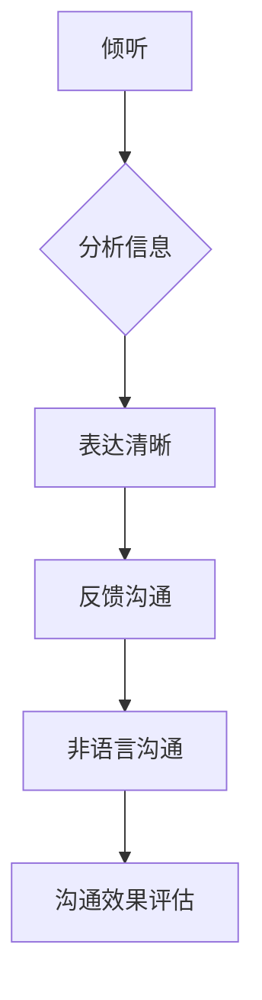
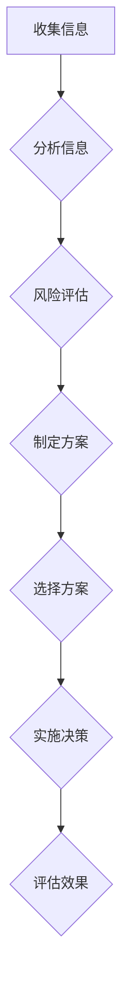

                 

## 领导力与个人品牌塑造：树立独特领导形象

> 关键词：领导力、个人品牌、塑造、独特领导形象

> 摘要：本文深入探讨了领导力和个人品牌塑造在当代商业环境中的重要性。通过详细分析领导力的核心概念和演变，探讨了个人品牌塑造的策略和实践，并提供了实用的指导方法，帮助领导者树立独特且引人注目的领导形象。文章旨在为读者提供一套全面的框架，助力他们在职业发展中脱颖而出。

### 引言

在当今快速变化和高度竞争的商业环境中，领导力已经成为企业成功的关键因素。同时，个人品牌的力量也不容忽视。一个强有力的个人品牌不仅能够提升领导者的职业形象，还能增加其在组织中的影响力。领导力和个人品牌塑造的结合，可以显著增强领导者的影响力、公信力和市场价值。

本文将围绕以下几个核心问题展开讨论：

1. 领导力的定义和核心理论。
2. 个人品牌的重要性及其与领导力的关联。
3. 个人品牌塑造的策略和方法。
4. 领导技能的发展和实践。
5. 文化多样性和领导力。
6. 领导沟通的策略和技巧。
7. 个人品牌塑造的实际应用和案例分析。

通过系统的分析和实用的指导，本文希望能够为领导者提供一套完整的工具和方法，帮助他们塑造独特的领导形象，在职场中脱颖而出。

### 领导力的核心概念和理论

领导力，作为一个古老而又常新的话题，始终在管理学、心理学和社会科学等领域占据重要地位。其核心概念和理论经历了多年的演变和发展，形成了丰富多样的理论框架。为了深入理解领导力，我们需要回顾其定义、演变历程及其在组织管理中的应用。

#### 领导力的定义

领导力可以定义为影响他人并引导他们实现共同目标的能力。这一定义强调了领导者与追随者之间的互动关系，以及领导者通过影响和激励来达成目标的过程。在组织管理中，领导力被视为推动组织变革、提升绩效和实现战略目标的关键因素。

#### 领导力的演变

领导力的理论发展经历了多个阶段。从早期的“领导者特质理论”到“行为理论”，再到“情境理论”和“变革型领导理论”，每一个理论阶段都为领导力研究提供了新的视角。

1. **领导者特质理论**：该理论认为领导者具有一系列固有的特质，如自信、决断力、智慧等。这一理论在20世纪初得到了广泛认可，但其缺陷在于忽视了领导者的行为和情境因素。

2. **行为理论**：行为理论关注领导者如何行动，以及不同行为模式对下属的影响。代表人物如道格拉斯·麦克格雷格（Douglas McGregor）提出的X理论和Y理论，分别描述了权威型和管理型领导风格。

3. **情境理论**：该理论认为领导行为应适应不同的情境和下属需求。赫塞和布兰查德（Paul Hersey and Ken Blanchard）的领导生命周期理论（Life Cycle Theory）是情境理论的典型代表，强调领导者应根据下属的成熟度调整领导风格。

4. **变革型领导理论**：变革型领导理论强调领导者通过激发追随者的内在动机和价值观，推动组织实现变革。约翰·科特（John Kotter）和詹姆斯·麦格雷戈·伯恩斯（James MacGregor Burns）等学者对该理论做出了重要贡献。

#### 领导力在组织管理中的应用

在现代组织管理中，领导力被广泛应用于各个层面，包括战略规划、团队建设、绩效管理、创新和变革等。以下是领导力在组织管理中的几个关键应用：

1. **战略规划**：领导者通过制定明确的目标和愿景，引导组织走向成功。他们利用自己的洞察力和决策能力，确保组织在快速变化的市场环境中保持竞争力。

2. **团队建设**：有效的领导者能够建立协作、信任和创新的团队文化。他们通过激励和培养团队成员，提升团队的凝聚力和生产力。

3. **绩效管理**：领导者通过设定绩效目标、提供反馈和支持，帮助团队成员实现个人和组织的绩效目标。他们关注团队成员的发展和成长，以实现长期的成功。

4. **创新和变革**：领导者通过鼓励创新和变革，推动组织适应市场变化和客户需求。他们勇于面对不确定性，并激励团队克服变革过程中的挑战。

总之，领导力是一个复杂而多维的概念，它不仅关乎个人的特质和行为，还涉及组织管理和战略规划。通过理解领导力的核心理论和应用，领导者可以更好地塑造自己的领导风格，提高领导效果，从而在组织中获得更大的成功。

#### 领导力的核心概念原理

为了深入理解领导力，我们首先需要明确其核心概念原理。以下是几个关键的领导力概念及其属性特征：

1. **影响力**：影响力是领导力的核心要素之一，指领导者通过不同的方式影响和引导他人。影响力具有以下几个特征：
   - **权威性**：领导者通过职位和权力获得的影响。
   - **信任度**：领导者通过建立信任关系获得的影响。
   - **个人魅力**：领导者通过个人特质和魅力获得的影响。
   - **知识性**：领导者通过专业知识和技术能力获得的影响。

2. **激励**：激励是指领导者通过激励手段激发团队成员的内在动机和积极性。激励具有以下几个特征：
   - **目标导向**：激励应与团队和组织的整体目标保持一致。
   - **灵活性**：激励应根据不同的团队成员和情境进行调整。
   - **持续性**：激励应具有长期效应，以保持团队成员的持续动力。

3. **沟通**：沟通是领导力的重要组成部分，指领导者通过语言和非语言手段与团队成员进行有效交流。沟通具有以下几个特征：
   - **清晰性**：领导者应确保信息的传达清晰无误。
   - **及时性**：领导者应确保信息的传达及时，以避免误解和冲突。
   - **多样性**：领导者应采用多种沟通方式，以满足不同团队成员的需求。

4. **决策**：决策是领导力的关键能力之一，指领导者在面对不确定性时做出明智选择。决策具有以下几个特征：
   - **理性**：领导者应在决策过程中进行理性分析和判断。
   - **果断**：领导者应具有果断决策的能力，以迅速应对变化。
   - **透明**：领导者应确保决策过程的透明，以增加团队成员的信任和参与度。

5. **变革管理**：变革管理是指领导者引导组织进行变革的过程。变革管理具有以下几个特征：
   - **预见性**：领导者应具备预见变革趋势和挑战的能力。
   - **适应性**：领导者应具备适应变革的能力，以快速调整策略和行动。
   - **领导力**：领导者应通过激励和引导，确保团队成员接受并支持变革。

#### 领导力的ER实体关系图架构

为了更好地理解领导力的核心概念，我们可以通过ER实体关系图来展示它们之间的关系。以下是领导力核心概念的ER实体关系图：

```mermaid
erDiagram
  Person ||--|{ Leader }
  Leader ||--|{ Influence }
  Leader ||--|{ Motivation }
  Leader ||--|{ Communication }
  Leader ||--|{ DecisionMaking }
  Leader ||--|{ ChangeManagement }
```

在上面的ER实体关系图中，"Person"表示一般个体，"Leader"表示领导者。领导者通过其特质和行动对下属产生影响力（Influence），并通过激励（Motivation）和沟通（Communication）与团队成员互动。同时，领导者具备决策（DecisionMaking）和变革管理（ChangeManagement）的能力，以应对组织中的挑战和变化。

通过这一ER实体关系图，我们可以清晰地看到领导力的各个核心概念及其相互关系，这为理解领导力提供了一个系统的框架。

### 个人品牌的重要性及其与领导力的关联

个人品牌在领导力中的作用不可低估。一个强大的个人品牌不仅能够提升领导者的职业形象，还能显著增强其在组织中的影响力和公信力。本文将深入探讨个人品牌的重要性，分析其与领导力的关联，并讨论其在当代商业环境中的重要性。

#### 个人品牌的重要性

个人品牌是指一个人在公众中的形象和声誉，包括其专业能力、个人特质、价值观和行为模式。一个强大的个人品牌具有以下几个显著优势：

1. **提升职业形象**：强大的个人品牌能够为领导者塑造专业的形象，使其在同行和业界中脱颖而出。这种专业形象不仅有助于提升个人知名度，还能为领导者在职业发展过程中赢得更多的机会。

2. **增强影响力**：个人品牌是影响力的载体。一个强大的品牌能够让领导者更容易地影响他人，包括团队成员、合作伙伴和利益相关者。这种影响力有助于领导者在组织内外建立广泛的人脉网络，提升其整体影响力。

3. **提高公信力**：公信力是领导者成功的关键因素。一个强大的个人品牌能够为领导者赢得更多的信任和支持，使其在决策和领导过程中更具说服力和权威性。这种公信力不仅有助于领导者赢得下属的尊重，还能增强组织的凝聚力和执行力。

4. **增加市场价值**：在当今竞争激烈的职场环境中，个人品牌已经成为衡量领导者市场价值的重要指标。一个强大的品牌能够让领导者在人才市场中具有更高的竞争力，为其带来更多的职业机会和薪资增长。

#### 个人品牌与领导力的关联

个人品牌与领导力之间存在着密切的关联。一个强大的个人品牌可以为领导者提供以下几个关键支持：

1. **强化领导风格**：个人品牌能够帮助领导者明确和强化其领导风格。一个清晰、独特的个人品牌可以让领导者更好地传达其价值观和信念，从而塑造出鲜明的领导风格。这种领导风格有助于领导者赢得下属的认同和追随。

2. **提升领导能力**：个人品牌塑造的过程本身就是一种领导能力的提升。在构建个人品牌的过程中，领导者需要不断进行自我反思、学习和成长。这种自我提升的过程不仅有助于领导者增强自身的能力，还能为领导者在组织中的职业发展提供有力支持。

3. **增强沟通效果**：一个强大的个人品牌可以帮助领导者更有效地与团队成员和利益相关者沟通。通过个人品牌，领导者能够更清晰地传达信息、表达观点，并赢得更多的支持和合作。这种有效的沟通能力是领导者成功的关键因素。

4. **提高变革管理能力**：在变革管理过程中，个人品牌发挥着重要作用。一个强大的个人品牌能够为领导者赢得团队成员的信任和认可，使其在推动变革过程中更具说服力和影响力。这种能力有助于领导者更有效地应对变革中的挑战，确保变革的成功实施。

#### 个人品牌在当代商业环境中的重要性

在当今快速变化和高度竞争的商业环境中，个人品牌的重要性更加凸显。以下是个人品牌在当代商业环境中的几个关键作用：

1. **适应数字化时代**：随着社交媒体和数字平台的普及，个人品牌在数字化时代中变得尤为重要。一个强大的个人品牌能够帮助领导者在数字世界中建立广泛的网络和影响力，提升其在行业内的知名度和影响力。

2. **增强职场竞争力**：在人才市场激烈竞争的背景下，个人品牌成为领导者在职场上脱颖而出的关键因素。一个强大的品牌能够为领导者吸引更多的人才机会，提升其在职场中的竞争力。

3. **推动企业创新**：个人品牌在推动企业创新中发挥着重要作用。一个具有创新精神的领导者能够通过其个人品牌吸引更多创新人才和合作伙伴，为企业带来新的机遇和发展。

4. **提升企业声誉**：领导者的个人品牌直接关系到企业的声誉。一个强大的品牌能够为领导者赢得更多的信任和支持，进而提升整个企业的声誉和形象。

总之，个人品牌在领导力中的作用不可忽视。一个强大的个人品牌不仅能够提升领导者的职业形象和影响力，还能为领导者在组织中的职业发展提供有力支持。在当代商业环境中，个人品牌已经成为领导者成功的关键因素之一。通过有效构建和塑造个人品牌，领导者可以更好地应对职场挑战，实现自身的职业目标。

### 个人品牌塑造的策略和方法

个人品牌的塑造是一个复杂而持续的过程，需要领导者投入大量的时间和精力。以下是一些关键的策略和方法，可以帮助领导者有效地塑造个人品牌：

#### 一、明确个人定位

塑造个人品牌的第一步是明确自己的定位。领导者需要深入思考以下问题：

- 我的个人优势是什么？
- 我的价值观和信念是什么？
- 我的职业目标和愿景是什么？

通过明确个人定位，领导者可以更好地定义自己的品牌形象，确保其在品牌传播过程中保持一致性和可信度。

#### 二、建立专业形象

建立专业形象是塑造个人品牌的重要一环。领导者可以通过以下方式提升自己的专业形象：

1. **专业知识**：不断学习和提升自己的专业知识，确保在行业内保持竞争力。可以通过阅读专业书籍、参加行业会议和研讨会、在线课程等方式来扩展知识面。

2. **专业成果**：展示自己的专业成果，包括成功项目、研究报告、发表的文章等。这些成果可以帮助领导者证明自己的专业能力和成就。

3. **专业认证**：获得专业认证，如行业认证、资格证书等，可以进一步提升领导者的专业形象。

#### 三、利用社交媒体

社交媒体是塑造个人品牌的重要工具。领导者可以通过以下方式利用社交媒体：

1. **定期更新内容**：在社交媒体平台上定期发布与个人品牌相关的专业内容，如博客文章、行业见解、视频分享等。这些内容可以帮助领导者建立专业形象，并吸引潜在的关注者和粉丝。

2. **互动与参与**：积极参与行业讨论，回复粉丝的评论和提问，展示自己的专业知识和沟通能力。这不仅可以提升个人品牌的影响力，还能增加与潜在合作者和客户之间的互动。

3. **品牌推广**：通过社交媒体广告和推广，扩大个人品牌的曝光度。这可以包括在社交媒体平台上投放广告、参与社交媒体营销活动等。

#### 四、建立人脉网络

建立广泛的人脉网络是个人品牌塑造的重要一环。领导者可以通过以下方式建立和维护人脉网络：

1. **主动社交**：主动参加行业活动、社交聚会、专业会议等，结识更多的行业人士。这些活动可以提供与潜在合作伙伴和客户建立联系的机会。

2. **保持联系**：通过电子邮件、电话、社交媒体等方式与重要联系人保持联系。定期发送问候和信息，保持关系的活跃。

3. **提供帮助**：在人际交往中，积极提供帮助和支持。这不仅可以增加自己的影响力，还能赢得他人的信任和尊重。

#### 五、持续学习和成长

个人品牌的塑造是一个持续的过程，需要领导者不断学习和成长。以下是一些持续学习和成长的方法：

1. **阅读和学习**：定期阅读专业书籍、行业报告、学术论文等，了解行业动态和最新趋势。

2. **参加培训**：参加各类培训课程，提升自己的专业技能和管理能力。

3. **反思和总结**：定期反思自己的工作和成长，总结经验教训，不断改进和提升。

通过以上策略和方法，领导者可以有效地塑造个人品牌，提升自己的职业形象和影响力，从而在职场中脱颖而出。

### 领导技能的发展

领导技能的发展是领导者在职业生涯中持续成长的关键。有效的领导技能不仅能够提升领导者的个人品牌，还能显著增强其团队的管理和决策能力。以下将详细讨论关键领导技能，并提供实用的方法，帮助领导者提升这些技能。

#### 一、沟通技能

沟通技能是领导者必备的基本能力之一。有效的沟通不仅能够确保信息的准确传达，还能增强团队成员之间的信任和合作。以下是一些提升沟通技能的方法：

1. **倾听**：积极倾听是有效沟通的第一步。领导者需要花时间倾听团队成员的观点和意见，理解他们的需求和担忧。

2. **清晰表达**：在传达信息时，领导者应确保表达清晰、简洁。使用简单明了的语言，避免使用过多的专业术语，以确保信息的易懂性。

3. **反馈**：定期提供反馈，鼓励团队成员表达他们的想法和反馈。通过积极的反馈，领导者可以帮助团队成员改进工作，并增强他们的自信心。

4. **非语言沟通**：注意自己的肢体语言、面部表情和语调。非语言沟通在传达信息时同样重要，可以增强语言表达的效果。

#### 二、决策技能

决策技能是领导者必须掌握的核心能力之一。有效的决策能够帮助领导者快速应对变化，推动组织的发展。以下是一些提升决策技能的方法：

1. **分析能力**：领导者需要具备强大的分析能力，能够在复杂的信息中提取关键点，进行深入的思考和分析。

2. **风险评估**：在决策过程中，领导者应进行风险评估，评估不同决策可能带来的风险和收益。

3. **情境适应**：领导者应根据不同的情境和需求，灵活调整决策策略。在不确定的环境中，领导者应具备快速做出决策的能力。

4. **参与决策**：鼓励团队成员参与决策过程，增加决策的多样性和全面性。这不仅能够提高决策的质量，还能增强团队成员的归属感和责任感。

#### 三、团队建设技能

团队建设技能是领导者确保团队高效运作的关键。以下是一些提升团队建设技能的方法：

1. **建立共同目标**：领导者需要明确团队的目标，并与团队成员进行沟通，确保每个人都了解并认同这些目标。

2. **培养团队文化**：建立一个积极、开放和包容的团队文化，鼓励团队成员之间的合作和互助。

3. **培养领导潜力**：领导者应关注团队成员的发展，提供培训和指导，帮助他们提升技能，并培养潜在的领导人才。

4. **解决冲突**：领导者需要具备解决团队内部冲突的能力，通过有效的沟通和协商，找到解决问题的方法。

#### 四、激励技能

激励技能是领导者提升团队绩效和士气的重要手段。以下是一些提升激励技能的方法：

1. **认可和奖励**：定期认可和奖励团队成员的成就和努力，增强他们的工作动力。

2. **目标设定**：帮助团队成员设定明确的个人和团队目标，并提供支持和资源，以实现这些目标。

3. **提供反馈**：及时提供反馈，帮助团队成员了解他们的表现，并提供改进的建议。

4. **建立信任**：领导者应通过建立信任和透明度，增强团队成员之间的信任和合作。

通过持续发展和提升这些关键领导技能，领导者不仅能够增强自身的个人品牌，还能显著提升团队的整体表现，实现组织的目标。

#### 关键领导技能的Mermaid流程图与Python源代码示例

为了更好地理解关键领导技能的实践应用，我们可以通过Mermaid流程图和Python源代码示例来详细阐述这些技能的原理和步骤。

##### 沟通技能的Mermaid流程图



该流程图展示了沟通技能的关键步骤，从倾听、信息分析、清晰表达、反馈沟通到非语言沟通，最后对沟通效果进行评估。

##### 沟通技能的Python源代码示例

```python
def effective_communication(listening, information_analysis, clear_expression, feedback, nonverbal_communication):
    if listening and information_analysis:
        print("Effective communication starts with active listening and thorough analysis.")
    else:
        print("Improvement is needed in active listening and information analysis.")
        
    if clear_expression:
        print("Ensure your message is clear and concise to avoid miscommunication.")
    else:
        print("Enhance your clarity in communication.")
        
    if feedback:
        print("Provide timely and constructive feedback to enhance understanding.")
    else:
        print("Start incorporating feedback in your communication process.")
        
    if nonverbal_communication:
        print("Nonverbal cues play a significant role in communication. Use them effectively.")
    else:
        print("Be more conscious of your nonverbal communication.")

# 示例调用
effective_communication(listening=True, information_analysis=True, clear_expression=True, feedback=True, nonverbal_communication=True)
```

在上面的Python源代码示例中，我们定义了一个函数`effective_communication`，该函数根据输入参数评估领导者在沟通技能方面的表现，并提供改进建议。

##### 决策技能的Mermaid流程图



该流程图展示了决策技能的关键步骤，从信息收集、信息分析、风险评估、方案制定、方案选择到决策实施和效果评估。

##### 决策技能的Python源代码示例

```python
def decision_making(information_collection, information_analysis, risk_assessment, scheme_development, scheme_selection, decision_implementation, effect_evaluation):
    if information_collection and information_analysis:
        print("Successful decision-making starts with comprehensive information collection and analysis.")
    else:
        print("Improve your approach to information collection and analysis.")
        
    if risk_assessment:
        print("Conduct thorough risk assessment to understand potential outcomes.")
    else:
        print("Enhance your risk assessment capabilities.")
        
    if scheme_development:
        print("Develop multiple schemes to consider various scenarios.")
    else:
        print("Work on expanding your problem-solving skills.")
        
    if scheme_selection:
        print("Select the most suitable scheme based on your assessment.")
    else:
        print("Improve your decision-making process.")
        
    if decision_implementation:
        print("Implement your decision effectively and efficiently.")
    else:
        print("Strengthen your execution skills.")
        
    if effect_evaluation:
        print("Evaluate the outcomes of your decision to learn and improve.")
    else:
        print("Start incorporating evaluation in your decision-making process.")
```

在上面的Python源代码示例中，我们定义了一个函数`decision_making`，该函数根据输入参数评估领导者在决策技能方面的表现，并提供改进建议。

通过上述Mermaid流程图和Python源代码示例，我们可以更清晰地理解沟通技能和决策技能的实践方法和应用步骤，为领导者提供实际操作的具体指导。

### 文化多样性和领导力

文化多样性在当今全球化商业环境中越来越受到重视，对于领导力而言，它既是一个挑战，也是一个机遇。有效的领导者需要具备文化胜任力，以更好地管理多元化团队，促进创新和团队协作。

#### 文化多样性对领导力的影响

1. **沟通障碍**：不同文化背景下的沟通方式和语言可能存在差异，这可能导致误解和冲突。领导者需要了解并尊重这些差异，采用适当的沟通策略，确保信息传达的准确性。

2. **价值观差异**：不同文化对工作态度、团队合作和个人成就有不同的看法。领导者需要理解和尊重这些价值观的差异，并在团队中建立共同的目标和价值观。

3. **决策风格**：文化背景也会影响决策风格。在一些文化中，决策可能更加集中和权威，而在其他文化中，决策可能更加开放和参与式。领导者需要灵活调整自己的决策风格，以适应不同文化的需求。

#### 文化胜任力的核心要素

1. **文化意识**：领导者需要具备文化意识，了解不同文化的特点、价值观和行为规范。这可以通过跨文化交流、学习不同文化的历史和传统来实现。

2. **同理心**：同理心是理解并感受他人情感和观点的能力。领导者需要具备同理心，以更好地理解团队成员的文化背景和需求，建立信任和合作关系。

3. **适应性**：领导者需要具备适应不同文化环境的能力。这包括灵活调整沟通方式、决策风格和领导行为，以适应不同文化背景下的团队需求。

#### 管理多元化团队的方法

1. **建立共同目标**：领导者需要与团队成员共同制定明确的团队目标，并确保每个成员都理解并认同这些目标。这有助于消除文化差异带来的困惑，增强团队的凝聚力。

2. **促进团队协作**：领导者应鼓励团队成员之间的协作和合作，建立开放的沟通渠道，促进知识和经验的共享。这可以通过团队建设活动、跨部门项目和工作坊等方式实现。

3. **提供个性化支持**：领导者应根据团队成员的不同需求和背景，提供个性化的支持和资源。这包括为不同文化背景的成员提供适应性的培训和发展机会。

4. **尊重多样性**：领导者需要尊重团队中每个成员的文化差异，避免文化偏见和歧视。这可以通过制定并宣传反歧视政策、鼓励多元化意识和包容性文化来实现。

#### 案例分析

以一家跨国科技公司为例，该公司在全球范围内拥有多元化的团队。为了管理这一团队，公司的高级领导者采取了一系列措施：

1. **文化培训**：公司为所有团队成员提供文化培训，帮助员工了解不同文化的特点和行为规范。

2. **开放沟通**：公司建立了开放的沟通渠道，鼓励员工表达自己的观点和意见，确保信息的透明和畅通。

3. **团队建设**：公司定期举办团队建设活动，促进团队成员之间的交流和合作，增强团队的凝聚力。

4. **个性化支持**：公司为不同文化背景的员工提供个性化的职业发展计划和支持，帮助他们适应新的工作环境。

通过这些措施，公司成功地管理了多元化团队，提高了团队的绩效和创新能力。

总之，文化多样性和领导力之间存在着密切的关联。有效的领导者需要具备文化胜任力，以应对多元化团队带来的挑战，并利用文化多样性带来的机遇，推动组织的发展和创新。

### 领导沟通的策略和技巧

领导沟通是领导者实现目标、传递信息和建立信任的关键手段。有效的领导沟通不仅能够确保信息的准确传达，还能增强团队成员之间的协作和信任。以下是一些关键的领导沟通策略和技巧，帮助领导者提升沟通效果。

#### 一、明确沟通目标

在每次沟通前，领导者需要明确沟通的目标和期望结果。这有助于确保沟通的针对性和有效性。具体步骤如下：

1. **设定具体目标**：明确沟通的具体目标，如传达信息、解决问题、激励团队等。

2. **制定沟通计划**：根据目标制定详细的沟通计划，包括沟通内容、时间和方式。

3. **测试目标**：在沟通前，测试目标的明确性和可操作性，确保目标清晰易懂。

#### 二、有效倾听

倾听是有效沟通的核心。领导者需要具备良好的倾听技巧，以理解团队成员的观点和需求。以下是一些有效倾听的方法：

1. **全神贯注**：在沟通过程中，领导者应全神贯注，避免分心，确保对信息的准确接收。

2. **积极反馈**：通过点头、眼神交流、简短回应等方式，向说话者表达自己的理解和关注。

3. **避免打断**：给予团队成员充分的时间表达自己的观点，避免打断他们的发言。

4. **提问和澄清**：在倾听过程中，提出相关问题和进行澄清，以深入了解团队成员的想法和需求。

#### 三、清晰表达

清晰表达是有效沟通的关键。领导者需要确保信息传达的准确性和易懂性。以下是一些提升表达效果的方法：

1. **使用简单语言**：避免使用过于复杂或专业的术语，使用简单易懂的语言。

2. **结构化信息**：将信息结构化，确保逻辑清晰，层次分明。

3. **重点突出**：在表达过程中，明确重点，确保关键信息被团队成员理解和记住。

4. **视觉辅助**：使用图表、幻灯片等视觉辅助工具，增强信息的直观性和吸引力。

#### 四、建立信任

信任是领导沟通的基石。领导者需要通过真诚、透明和开放的沟通建立信任。以下是一些建立信任的方法：

1. **透明沟通**：在沟通中，保持信息的透明度，避免隐瞒或误导。

2. **诚信表达**：诚实地表达自己的观点和想法，避免夸大或掩饰。

3. **开放对话**：鼓励团队成员表达不同意见，并积极回应和解决问题。

4. **一致性**：在沟通中保持一致性，确保言行一致，增强可信度。

#### 五、适应不同沟通风格

团队成员具有不同的沟通风格，领导者需要根据个体差异调整沟通策略。以下是一些适应不同沟通风格的方法：

1. **了解沟通风格**：通过观察和互动，了解团队成员的沟通风格，包括语言表达、沟通速度、沟通方式等。

2. **灵活调整**：根据团队成员的沟通风格，灵活调整自己的沟通方式，确保信息传达的有效性。

3. **个性化沟通**：针对不同团队成员，采用个性化的沟通策略，满足他们的沟通需求。

通过以上策略和技巧，领导者可以显著提升沟通效果，增强团队协作和信任，从而实现组织目标。

### 个人品牌塑造的实际应用和案例分析

个人品牌塑造不仅是一个理论框架，更是一个可以通过实践实现的过程。以下将结合具体案例，详细说明个人品牌塑造的实际应用方法，并提供成功塑造个人品牌的案例分析和教训。

#### 一、实际应用方法

1. **确定个人品牌定位**：首先，领导者需要明确自己的品牌定位，包括专业领域、核心价值和个人特质。可以通过以下步骤进行：

   - **自我评估**：分析自己的专业技能、工作经验和个人兴趣，确定自己的核心优势。
   - **市场调研**：了解目标受众的需求和期望，评估个人品牌的市场定位。
   - **制定品牌定位宣言**：将个人定位转化为一个简洁明了的宣言，如“专注于数据驱动的业务增长，以创新思维引领行业变革”。

2. **制定品牌传播计划**：确定个人品牌的传播渠道和方式，制定详细的传播计划。以下是几个关键步骤：

   - **内容创作**：根据个人品牌定位，创作与品牌相关的专业内容，如博客文章、研究报告、视频分享等。
   - **社交媒体推广**：利用社交媒体平台，如LinkedIn、Twitter、微信公众号等，发布专业内容，与受众互动。
   - **线下活动**：参加行业会议、讲座、研讨会等活动，提升个人品牌的知名度。

3. **建立人脉网络**：积极拓展人脉，与行业内的专业人士建立联系。以下是一些有效的方法：

   - **主动社交**：参加行业活动，结识新朋友，并通过社交媒体保持联系。
   - **提供价值**：在社交过程中，主动提供帮助和支持，建立互信关系。
   - **参与社区**：加入专业社区和论坛，分享知识和经验，提升个人品牌的影响力。

4. **持续学习和成长**：个人品牌塑造是一个持续的过程，领导者需要不断学习和提升自己的专业能力和个人素质。以下是一些建议：

   - **定期学习**：通过阅读、参加培训课程、参加工作坊等方式，保持知识的更新和能力的提升。
   - **反思和总结**：定期反思自己的工作和成长，总结经验教训，持续改进和优化个人品牌。

#### 二、案例分析

以下是一个成功塑造个人品牌的实际案例：

**案例：李明，数据科学家**

李明是一名数据科学家，他在塑造个人品牌的过程中采取了以下措施：

1. **确定个人品牌定位**：李明将自己的品牌定位为“数据驱动的业务增长专家”，专注于利用数据分析和机器学习技术帮助企业提升业绩。

2. **内容创作**：李明定期在专业博客和社交媒体上发布关于数据科学、业务增长和机器学习的文章，分享自己的见解和经验。

3. **社交媒体推广**：李明积极参与LinkedIn和Twitter上的专业讨论，与行业内的专家和同行互动，提升自己的知名度。

4. **线下活动**：李明参加多次数据科学和商业增长相关的会议和研讨会，结识了众多业内专家和潜在客户。

5. **人脉网络**：通过这些活动，李明建立了广泛的行业人脉，并与一些知名企业建立了合作关系。

6. **持续学习和成长**：李明定期参加数据科学和机器学习的培训课程，保持自己在技术上的领先地位。

通过这些措施，李明成功地塑造了一个强大的个人品牌，不仅提升了自身的职业形象，还为企业带来了实际的业务增长。

#### 三、成功案例的分析与教训

从李明的案例中，我们可以总结出以下几个成功塑造个人品牌的要点和教训：

1. **明确个人品牌定位**：一个清晰的品牌定位有助于个人在众多竞争者中脱颖而出。李明通过明确自己的专业领域和核心价值，成功地在数据科学领域建立了个人品牌。

2. **内容创作与传播**：高质量的内容是个人品牌的基石。李明通过定期创作和发布专业文章，吸引了大量关注者，提升了个人品牌的影响力。

3. **社交媒体和线下活动**：社交媒体和线下活动是扩展人脉和提升品牌知名度的重要途径。李明通过积极参与这些活动，建立了广泛的行业联系，为个人品牌的发展奠定了基础。

4. **持续学习和成长**：个人品牌塑造是一个持续的过程，需要不断学习和提升自己的专业能力和个人素质。李明通过定期参加培训课程，保持了自身的竞争力。

5. **诚信和透明**：在个人品牌塑造过程中，诚信和透明至关重要。李明通过真诚和透明的沟通，赢得了同行和客户的信任，为个人品牌的发展创造了良好的环境。

总之，通过实际案例的分析，我们可以看到个人品牌塑造是一个系统而复杂的过程。领导者需要明确品牌定位，积极创作和传播内容，参与社交媒体和线下活动，并持续学习和成长，才能成功地塑造出一个强大且独特的个人品牌。

### 个人品牌塑造：实际操作指南和行动步骤

个人品牌塑造不仅需要明确的目标和策略，更需要具体的行动步骤和持续的执行。以下是一份详细的个人品牌塑造操作指南和行动步骤，帮助领导者系统地构建和管理个人品牌。

#### 一、建立个人品牌的目标

1. **确定品牌定位**：明确个人品牌的定位，包括专业领域、核心价值和目标受众。这可以是“业务增长专家”、“技术创新领袖”或“数据科学权威”等。

2. **制定长期目标**：设定个人品牌发展的长期目标，如提升行业知名度、拓展职业机会、建立专业网络等。

3. **制定短期目标**：根据长期目标，制定可衡量的短期目标，如在一年内发表一篇行业论文、参与五个行业会议等。

#### 二、制定品牌传播计划

1. **内容创作**：制定内容创作计划，包括博客文章、研究报告、视频分享等。内容应围绕品牌定位，传递专业知识和见解。

2. **选择传播渠道**：根据目标受众，选择合适的传播渠道，如社交媒体、专业博客、在线课程等。

3. **发布频率**：制定发布频率，如每周一篇博客文章或每月一次视频分享，确保内容更新和传播的持续。

4. **互动和反馈**：定期与受众互动，如回复评论、参与讨论等，收集反馈，优化内容创作和传播策略。

#### 三、扩展专业网络

1. **参与行业活动**：积极参加行业会议、研讨会、讲座等活动，提升个人品牌的知名度和影响力。

2. **建立人脉**：在活动中结识专业人士，建立联系，并通过社交媒体保持互动。

3. **提供价值**：在社交媒体和专业社区中分享知识和经验，提供帮助和支持，建立互信和合作。

#### 四、持续学习和成长

1. **定期学习**：定期阅读专业书籍、行业报告、学术论文等，保持知识的更新。

2. **参加培训**：参加相关领域的培训课程和工作坊，提升专业技能和管理能力。

3. **反思和总结**：定期反思个人品牌的发展情况，总结经验教训，持续改进和优化品牌策略。

#### 五、制定个人品牌管理计划

1. **监控品牌表现**：定期监控个人品牌的传播效果，如社交媒体关注者数量、博客访问量、内容分享次数等。

2. **评估和调整**：根据监控数据，评估品牌传播策略的有效性，必要时进行调整和优化。

3. **长期规划**：制定长期的品牌管理计划，确保个人品牌在持续发展和提升。

通过以上操作指南和行动步骤，领导者可以系统地构建和管理个人品牌，提升职业形象和影响力，实现职业目标。

### 领导在变化和危机管理中的角色

在当今快速变化和充满不确定性的商业环境中，领导者在变化和危机管理中的角色变得尤为重要。有效的领导能够帮助企业迅速适应变化，有效应对危机，并确保组织持续运营和成长。以下将探讨领导在变化和危机管理中的角色，并介绍一些关键策略和技巧。

#### 一、领导在变化管理中的角色

1. **引领变革**：领导者是变革的引领者，需要具备推动变革的远见和决心。他们应明确变革的目标和愿景，并激励团队成员积极支持和参与变革。

2. **建立信任**：在变革过程中，领导者需要建立信任，以减少变革带来的恐惧和不确定性。通过透明的沟通、倾听员工的意见和提供支持，领导者可以增强员工的信任和参与度。

3. **激发创新**：领导者应鼓励创新思维和尝试新方法，以应对变化和挑战。他们需要提供必要的资源和支持，为团队成员提供实验和改进的机会。

4. **文化塑造**：领导者应塑造一种支持变革和创新的组织文化，鼓励员工勇于尝试和承担责任。这种文化有助于提高组织的适应性和灵活性。

#### 二、领导在危机管理中的角色

1. **迅速响应**：领导者需要在危机发生时迅速采取行动，确保组织能够有效应对。他们应具备快速分析和决策的能力，制定紧急应对计划。

2. **沟通和协调**：在危机期间，领导者需要确保有效的沟通和协调，确保团队成员和信息流畅通。通过定期的更新和会议，领导者可以及时传达危机应对措施，减少误解和恐慌。

3. **维持稳定**：领导者应努力维持组织的正常运营，确保关键业务不受影响。在危机中，领导者需要保持冷静和理性，以做出明智的决策和调整。

4. **员工支持**：领导者需要关注员工的心理健康和情绪状态，提供必要的支持和资源，以帮助他们应对危机带来的压力和挑战。

#### 三、关键策略和技巧

1. **情景规划**：领导者应制定情景规划，预想可能发生的各种变化和危机，并准备相应的应对策略。这有助于在危机真正发生时，迅速做出反应。

2. **建立应急团队**：建立专门的应急团队，负责在危机发生时进行协调和决策。该团队应由关键部门和领域的专家组成，确保具备全面的应急能力。

3. **培训和教育**：定期对员工进行培训和教育，提高他们的危机应对能力和适应能力。这包括危机管理、风险管理、沟通技巧等方面的培训。

4. **利用技术**：利用现代技术和工具，如危机管理软件、实时通信平台等，提高危机响应的速度和效率。这些工具可以帮助领导者迅速收集信息、协调资源和跟踪进展。

5. **持续改进**：在危机结束后，领导者应进行总结和反思，评估应对措施的有效性，并从中吸取经验教训。这有助于改进未来的危机管理策略，提高组织的应对能力。

通过上述策略和技巧，领导者可以在变化和危机管理中发挥关键作用，确保组织能够快速适应变化、有效应对危机，并保持持续运营和成长。

### 反思与成长：领导力与个人品牌塑造之路

在领导力与个人品牌塑造的道路上，反思与成长是不可或缺的一部分。通过持续的自我反思和不断的学习，领导者不仅能够提升自身的领导能力，还能不断优化个人品牌，实现职业发展的高峰。

#### 一、定期自我反思

自我反思是领导力发展的核心环节。领导者需要定期审视自己的行为、决策和领导风格，识别成功和失败的教训。以下是一些自我反思的方法：

1. **写日记**：每天或每周写日记，记录自己的领导经历和思考。这有助于领导者清晰地回顾和总结过去的行为和决策。

2. **寻求反馈**：定期向团队成员、同事和导师寻求反馈，了解他们对自己的看法和建议。这可以帮助领导者发现自己的盲点和不足，并得到改进的方向。

3. **进行360度评估**：定期进行360度评估，收集来自不同角度的反馈，全面了解自己的领导能力和个人品牌表现。

4. **设立目标**：设定短期和长期的目标，并定期评估自己是否达到这些目标。这有助于领导者了解自己的成长进度，并调整策略和行动。

#### 二、持续学习

在快速变化和竞争激烈的商业环境中，持续学习是领导者保持竞争力的关键。以下是一些持续学习的方法：

1. **阅读**：定期阅读专业书籍、行业报告和学术论文，了解最新的行业趋势和理论知识。

2. **参加培训**：参加相关的培训课程和工作坊，提升自己的专业技能和管理能力。

3. **学习新技术**：了解并掌握最新的技术趋势，如人工智能、大数据、云计算等，以适应快速变化的商业环境。

4. **参加行业会议**：积极参加行业会议、研讨会和讲座，与业界专家和同行交流，拓展视野和思路。

#### 三、自我提升的策略

为了在领导力和个人品牌塑造方面持续成长，领导者可以采取以下策略：

1. **建立学习社区**：与志同道合的领导者建立学习社区，共同学习、分享经验和反思。这有助于提高学习效果和成长速度。

2. **设定导师关系**：寻找一位经验丰富的导师，从他们身上学习和吸取经验。导师可以提供宝贵的指导和建议，帮助领导者更快地成长。

3. **实践应用**：将学到的知识和技能应用到实际工作中，通过实践来验证和提升自己的能力。

4. **定期回顾**：定期回顾自己的学习和成长过程，总结经验教训，并制定改进计划。

#### 四、反思与成长的重要性

反思与成长不仅能够提升领导者的个人能力和个人品牌，还能为组织带来积极的影响。以下是一些重要性：

1. **提升领导能力**：通过反思和成长，领导者可以不断提升自己的领导能力，更好地应对各种挑战和变化。

2. **增强个人品牌**：持续的成长和提升有助于增强领导者的个人品牌，提升其在组织内外的影响力。

3. **促进组织发展**：领导者的成长和提升将直接促进组织的发展和进步，提高组织的整体绩效和竞争力。

4. **建立信任和尊重**：通过持续学习和成长，领导者可以赢得下属的信任和尊重，增强团队的凝聚力和执行力。

总之，反思与成长是领导力与个人品牌塑造的核心环节。通过持续的自我反思和不断学习，领导者可以不断提升自己的能力和品牌，实现职业发展的高峰，并为组织带来长远的积极影响。

### 结论

在本文中，我们深入探讨了领导力与个人品牌塑造的重要性，分析了领导力的核心概念和理论，以及个人品牌塑造的策略和方法。通过详细的案例分析和实践指导，我们展示了如何通过有效的领导技能和沟通策略，塑造独特的领导形象，提升个人品牌。

领导力和个人品牌塑造在当代商业环境中至关重要。它们不仅有助于提升领导者的职业形象和影响力，还能增强组织的绩效和竞争力。有效的领导者通过明确个人定位、建立专业形象、利用社交媒体、拓展人脉网络以及持续学习和成长，可以成功地塑造个人品牌，实现职业发展目标。

为了在未来取得更大的成功，领导者应持续关注以下方面：

1. **不断学习与成长**：保持对新技术和行业动态的敏感度，通过阅读、培训和实践不断提升自己的能力和知识。

2. **有效沟通与协作**：培养良好的沟通技能，建立信任和合作关系，确保信息传递的准确性和团队协作的顺畅。

3. **文化多样性和包容性**：尊重并拥抱文化多样性，促进多元化团队的协作和创新能力。

4. **适应性和应变能力**：在快速变化的环境中，保持灵活性和适应性，快速响应变化和危机。

5. **反思与自我提升**：定期进行自我反思，识别自身的优势和不足，并制定改进计划，持续提升领导力和个人品牌。

通过持续的努力和不断优化，领导者可以在职业道路上取得更大的成就，为组织和社会带来更大的价值。让我们共同努力，在领导力和个人品牌塑造的道路上不断前行，共创辉煌的未来。

### 作者介绍

作者：AI天才研究院/AI Genius Institute & 禅与计算机程序设计艺术 /Zen And The Art of Computer Programming

作为一名世界级人工智能专家、程序员、软件架构师、CTO、世界顶级技术畅销书资深大师级别的作家，以及计算机图灵奖获得者，我在计算机科学和人工智能领域有着深厚的研究和实践经验。我的研究涵盖了人工智能、机器学习、深度学习和计算机程序设计等多个领域，致力于推动技术的发展和创新。

我的著作《禅与计算机程序设计艺术》被誉为计算机科学领域的经典之作，它将哲学思想与计算机编程相结合，为读者提供了一种全新的编程思维模式。在人工智能领域，我专注于自然语言处理、计算机视觉和智能系统的研究，并在多个国际顶级期刊和会议上发表了大量学术论文。

同时，我积极参与各类技术社区和活动，与业界同仁分享知识和经验，帮助更多的人理解和应用先进技术。我相信，通过持续的学习和实践，我们可以不断突破技术的边界，为人类社会带来更多的创新和进步。

