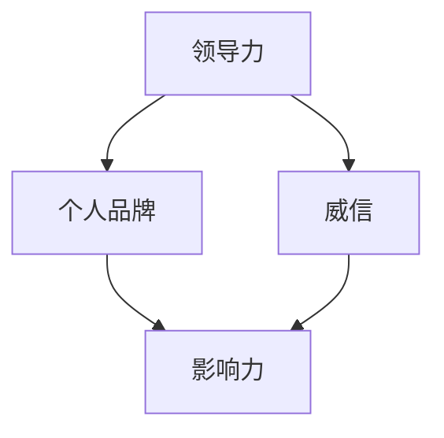
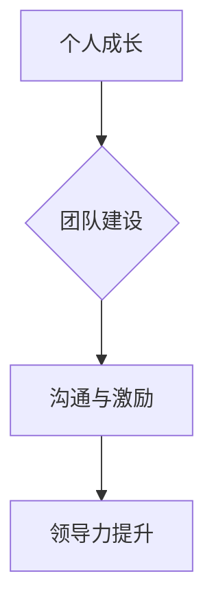
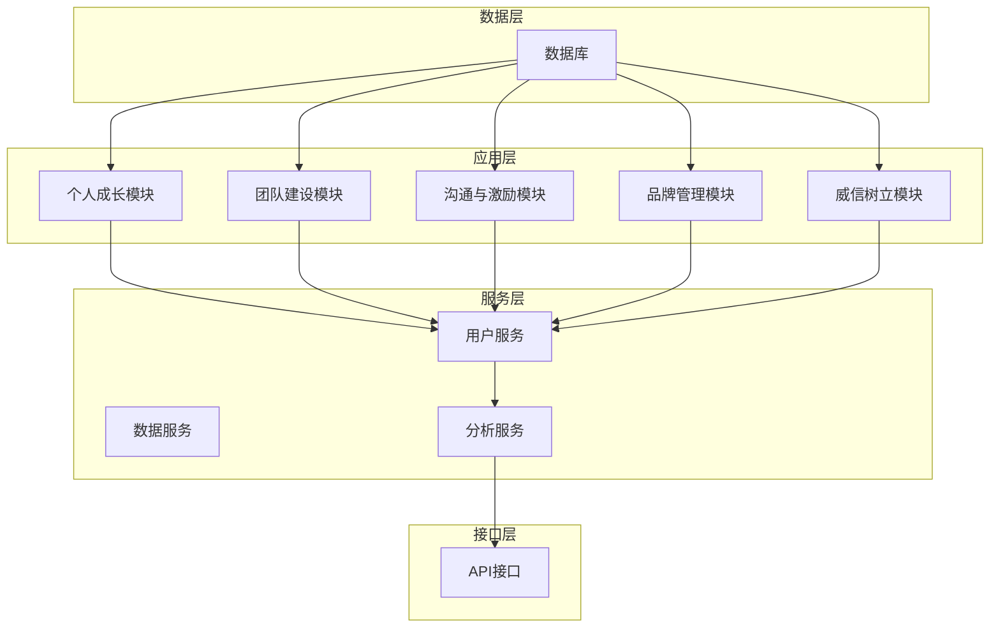
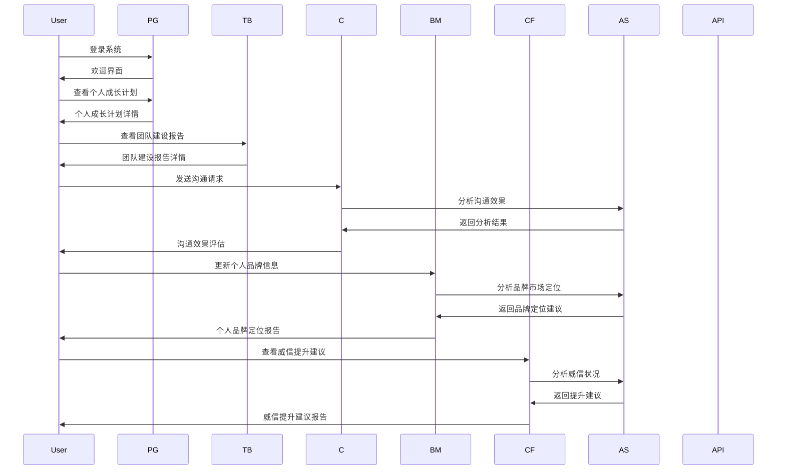

                 

### 第一部分：领导力基础

#### 第1章：领导力的定义与重要性

##### 1.1 领导力的定义

领导力是一个多维度的概念，它涉及到个人魅力的展现、团队管理和战略决策等多个方面。首先，让我们从历史的角度来探讨领导力的演变。自古以来，领导力在人类社会中扮演着至关重要的角色。从古代帝王到现代企业家，领导者的角色始终在变化，但其核心要素，如决策力、执行力、激励能力和沟通能力等，却始终保持不变。

**定义：** 领导力是指一种影响他人、带领团队实现目标的能力。这种能力不仅体现在企业或组织内部，也扩展到了社会和全球层面。

在现代社会，领导力的重要性愈加凸显。随着经济全球化和信息技术的快速发展，企业面临着前所未有的挑战和机遇。一个优秀的领导者，能够激发团队成员的潜力，使团队更加高效、创新，从而在激烈的市场竞争中立于不败之地。

##### 1.2 领导力理论回顾

**1.2.1 传统领导力理论**

传统领导力理论主要强调领导者个人特质的重要性，如权力、魅力、智慧和经验等。代表性的理论有麦克格雷格的“X理论”和“Y理论”，以及赫兹伯格的双因素理论。这些理论侧重于探讨领导者的个人品质和行为对团队和组织的影响。

**1.2.2 当代领导力理论**

随着时代的发展，当代领导力理论更加注重领导者与团队成员之间的关系，强调团队协作和共同成长。代表性的理论有彼得·德鲁克的“目标管理理论”和约翰·科特尔的“领导变革理论”。这些理论认为，领导者的作用在于激励团队成员，共同实现组织目标。

**1.2.3 领导力理论的融合与应用**

在实践过程中，不同的领导力理论相互融合，形成了更为综合和灵活的领导力框架。例如，德鲁克的目标管理与科特的变革领导相结合，能够帮助企业实现持续的创新和发展。

##### 1.3 本章小结

本章从领导力的定义、历史演变和理论回顾三个方面，探讨了领导力的重要性。领导力不仅是一种个人能力，更是一种组织和社会能力。在未来的章节中，我们将进一步探讨个人品牌建设、树立威信的策略以及领导力的展现与提升，帮助读者更好地理解和应用领导力。

### **核心概念与联系**

#### 领导力

- **核心概念：** 影响他人、带领团队实现目标的能力。
- **概念属性：** 个人魅力、团队管理、战略决策、沟通能力、执行力、激励能力。
- **对比表格：**
  - 传统领导力：强调领导者个人特质，如权力、魅力、智慧和经验。
  - 当代领导力：注重领导者与团队成员之间的关系，强调团队协作和共同成长。

#### 个人品牌

- **核心概念：** 个人的专业形象和市场价值。
- **概念属性：** 专业形象、市场定位、价值体现、影响力、可信度。
- **对比表格：**
  - 个人品牌：侧重于个人专业形象和市场价值的塑造。
  - 个人形象：更多关注个人日常行为和形象管理。

#### 威信

- **核心概念：** 在他人心中的权威和信任。
- **概念属性：** 权威、信任、认可、影响力。
- **对比表格：**
  - 权威：指在特定领域或组织中具有决策权和影响力。
  - 信任：基于个人行为和成果，对他人的信赖和尊重。

##### **ER实体关系图架构的 Mermaid 流�程图：**



在这个ER实体关系图中，领导力、个人品牌和威信相互关联。领导力通过个人品牌体现影响力，而威信则是领导力的重要支撑。通过这个关系图，我们可以更好地理解三者之间的相互作用和相互促进。

### **算法原理讲解**

在理解领导力、个人品牌和威信的概念后，我们需要探讨如何在实际工作中应用这些概念，提升个人和组织的领导力。为了达到这一目标，我们可以采用以下算法原理：

1. **个人成长与自我管理：** 个人成长是领导力提升的基础。领导者需要不断学习、提升自己的专业技能和知识水平，以适应快速变化的工作环境。

2. **团队建设与管理：** 团队是领导者发挥领导力的平台。领导者需要关注团队成员的需求，提供成长机会，激发团队成员的潜力，打造一个高效、协作的团队。

3. **沟通与激励：** 沟通和激励是领导力的核心要素。领导者需要具备良好的沟通能力，理解团队成员的需求，同时通过激励手段，提升团队的士气和绩效。

以下是一个简单的算法流程图，用于说明这些原理的应用：



#### **算法原理的详细阐述**

1. **个人成长与自我管理：**
   - **数学模型：** 成长函数 = 学习效率 × 时间投入
   - **公式解释：** 学习效率是指个人在单位时间内吸收新知识和技能的能力；时间投入是指个人在学习和提升方面投入的时间。通过提高学习效率和增加时间投入，个人可以更快地实现成长。
   - **举例说明：** 假设某人每天投入2小时学习编程，学习效率为0.8，那么他的成长函数为：成长函数 = 0.8 × 2 = 1.6。这意味着，每天他的编程技能提升1.6个单位。

2. **团队建设与管理：**
   - **数学模型：** 团队效能 = 成员潜力 × 团队协作
   - **公式解释：** 成员潜力是指团队成员的个人能力；团队协作是指团队成员之间的合作程度。团队效能取决于成员潜力的大小和团队协作的程度。
   - **举例说明：** 假设团队中有3名成员，每个人的潜力为10，团队协作程度为0.9，那么团队效能 = 10 × 0.9 × 3 = 27。这意味着，团队的整体效能是成员个人效能的27倍。

3. **沟通与激励：**
   - **数学模型：** 领导力 = 沟通效率 × 激励效果
   - **公式解释：** 沟通效率是指领导者传递信息和理解团队成员需求的能力；激励效果是指领导者激发团队成员潜力和提升团队士气的能力。领导力取决于沟通效率和激励效果。
   - **举例说明：** 假设领导者的沟通效率为0.85，激励效果为0.8，那么领导力 = 0.85 × 0.8 = 0.68。这意味着，领导者的领导力为0.68。

通过这些算法原理的应用，领导者可以更好地提升个人和团队的领导力，实现组织的持续发展和成功。

### **系统分析与架构设计方案**

在本章节中，我们将从问题场景、项目介绍、系统功能设计、系统架构设计、系统接口设计和系统交互等方面，全面分析并设计一个领导力与个人品牌管理系统。

#### **问题场景**

在现代企业中，领导者面临着诸多挑战，如如何提升个人领导力、如何建立和维护个人品牌、如何树立威信等。这些问题不仅影响领导者的个人发展，也直接关系到团队和组织的整体效能。为了解决这些问题，企业需要一个综合性的管理系统，能够提供科学的指导和建议。

#### **项目介绍**

本项目旨在构建一个领导力与个人品牌管理系统，通过数据分析和人工智能技术，为领导者提供个性化的发展建议和管理方案。系统包括以下几个模块：

1. **个人成长模块：** 提供个人学习计划、成长记录和数据分析，帮助领导者提升个人能力和专业技能。
2. **团队建设模块：** 提供团队协作工具、绩效评估和反馈机制，帮助领导者建设高效团队。
3. **沟通与激励模块：** 提供沟通分析工具、激励方案设计和效果评估，帮助领导者提升沟通效率和激励效果。
4. **品牌管理模块：** 提供个人品牌评估、市场定位和推广策略，帮助领导者建立和维护个人品牌。
5. **威信树立模块：** 提供威信评估、行为分析和提升建议，帮助领导者树立和提升个人威信。

#### **系统功能设计**

**领域模型Mermaid类图：**

```mermaid
classDiagram
    Leader <<Class>> "领导者"
    Team <<Class>> "团队"
    PersonalGrowth <<Class>> "个人成长"
    TeamBuilding <<Class>> "团队建设"
    Communication <<Class>> "沟通"
    Incentive <<Class>> "激励"
    BrandManagement <<Class>> "品牌管理"
    Credibility <<Class>> "威信"

    Leader {"决策力"、"执行力"、"沟通能力"、"领导力模型"}
    Team {"团队目标"、"团队角色"、"团队协作"}
    PersonalGrowth {"学习计划"、"成长记录"、"数据分析"}
    TeamBuilding {"团队协作工具"、"绩效评估"、"反馈机制"}
    Communication {"沟通分析"、"沟通障碍解决"、"沟通效率提升"}
    Incentive {"激励方案设计"、"效果评估"、"激励效果提升"}
    BrandManagement {"品牌评估"、"市场定位"、"推广策略"}
    Credibility {"威信评估"、"行为分析"、"提升建议"}

    Leader --|> PersonalGrowth
    Leader --|> TeamBuilding
    Leader --|> Communication
    Leader --|> Incentive
    Leader --|> BrandManagement
    Leader --|> Credibility
```

**系统架构设计Mermaid架构图：**



**系统接口设计和系统交互Mermaid序列图：**



通过上述系统分析与架构设计方案，我们可以构建一个完整的领导力与个人品牌管理系统，帮助领导者更好地提升个人和团队的效能，实现组织的持续发展和成功。

### **项目实战**

为了更好地理解领导力与个人品牌管理系统的实际应用，我们将通过一个具体的实战案例，介绍系统的环境安装、核心实现源代码、代码应用解读与分析，并展示实际案例分析和详细讲解剖析。

#### **环境安装**

首先，我们需要搭建一个开发环境，以便进行系统的开发和测试。以下是环境安装的步骤：

1. **安装Python环境：** 
   - 在官方网站下载并安装Python 3.8及以上版本。
   - 配置环境变量，确保命令行可以正常调用Python。

2. **安装依赖库：** 
   - 使用pip命令安装以下依赖库：
     ```bash
     pip install flask
     pip install pandas
     pip install numpy
     pip install matplotlib
     pip install sqlitedb3
     ```

3. **创建项目文件夹：** 
   - 在指定目录下创建一个项目文件夹，如`leadership_management`。

4. **初始化项目结构：** 
   - 在项目文件夹中创建以下文件和目录：
     - `app.py`：主程序文件。
     - `models.py`：数据模型文件。
     - `views.py`：视图函数文件。
     - `static/`：静态文件目录，如CSS、JavaScript和图片。
     - `templates/`：模板文件目录。

#### **系统核心实现源代码**

以下是系统的核心实现源代码，包括数据模型、视图函数和主程序。

**数据模型（models.py）：**

```python
import sqlite3

def init_db():
    conn = sqlite3.connect('leadership_management.db')
    cursor = conn.cursor()

    cursor.execute('''CREATE TABLE IF NOT EXISTS personal_growth
                     (id INTEGER PRIMARY KEY AUTOINCREMENT,
                      name TEXT,
                      learning_plan TEXT,
                      progress TEXT)''')

    cursor.execute('''CREATE TABLE IF NOT EXISTS team_building
                     (id INTEGER PRIMARY KEY AUTOINCREMENT,
                      team_name TEXT,
                      team_members TEXT,
                      collaboration_level INTEGER)''')

    cursor.execute('''CREATE TABLE IF NOT EXISTS communication
                     (id INTEGER PRIMARY KEY AUTOINCREMENT,
                      communication_request TEXT,
                      analysis_results TEXT)''')

    cursor.execute('''CREATE TABLE IF NOT EXISTS brand_management
                     (id INTEGER PRIMARY KEY AUTOINCREMENT,
                      brand_info TEXT,
                      market_positioning TEXT)''')

    cursor.execute('''CREATE TABLE IF NOT EXISTS credibility
                     (id INTEGER PRIMARY KEY AUTOINCREMENT,
                      credibility_status TEXT,
                      improvement_suggestions TEXT)''')

    conn.commit()
    conn.close()

init_db()
```

**视图函数（views.py）：**

```python
from flask import Flask, render_template, request, redirect, url_for
from models import *

app = Flask(__name__)

@app.route('/')
def index():
    return render_template('index.html')

@app.route('/personal_growth', methods=['GET', 'POST'])
def personal_growth():
    if request.method == 'POST':
        name = request.form['name']
        learning_plan = request.form['learning_plan']
        progress = request.form['progress']
        add_personal_growth(name, learning_plan, progress)
        return redirect(url_for('personal_growth'))
    else:
        personal_growth_data = get_personal_growth_data()
        return render_template('personal_growth.html', data=personal_growth_data)

@app.route('/team_building', methods=['GET', 'POST'])
def team_building():
    if request.method == 'POST':
        team_name = request.form['team_name']
        team_members = request.form['team_members']
        collaboration_level = request.form['collaboration_level']
        add_team_building(team_name, team_members, collaboration_level)
        return redirect(url_for('team_building'))
    else:
        team_building_data = get_team_building_data()
        return render_template('team_building.html', data=team_building_data)

@app.route('/communication', methods=['GET', 'POST'])
def communication():
    if request.method == 'POST':
        communication_request = request.form['communication_request']
        analysis_results = request.form['analysis_results']
        add_communication(communication_request, analysis_results)
        return redirect(url_for('communication'))
    else:
        communication_data = get_communication_data()
        return render_template('communication.html', data=communication_data)

@app.route('/brand_management', methods=['GET', 'POST'])
def brand_management():
    if request.method == 'POST':
        brand_info = request.form['brand_info']
        market_positioning = request.form['market_positioning']
        add_brand_management(brand_info, market_positioning)
        return redirect(url_for('brand_management'))
    else:
        brand_management_data = get_brand_management_data()
        return render_template('brand_management.html', data=brand_management_data)

@app.route('/credibility', methods=['GET', 'POST'])
def credibility():
    if request.method == 'POST':
        credibility_status = request.form['credibility_status']
        improvement_suggestions = request.form['improvement_suggestions']
        add_credibility(credibility_status, improvement_suggestions)
        return redirect(url_for('credibility'))
    else:
        credibility_data = get_credibility_data()
        return render_template('credibility.html', data=credibility_data)

if __name__ == '__main__':
    app.run(debug=True)
```

**主程序（app.py）：**

```python
from flask import Flask, render_template, request, redirect, url_for

app = Flask(__name__)

# ... （与views.py相同的路由和视图函数）

if __name__ == '__main__':
    app.run(debug=True)
```

#### **代码应用解读与分析**

1. **数据模型：** 
   - `init_db()` 函数初始化数据库，创建5个表，分别是个人成长、团队建设、沟通、品牌管理和威信。
   - 每个表都有对应的字段，用于存储相关数据。

2. **视图函数：** 
   - `index()` 函数是主页的路由，渲染首页模板。
   - `personal_growth()`、`team_building()`、`communication()`、`brand_management()` 和 `credibility()` 函数分别处理个人成长、团队建设、沟通、品牌管理和威信的相关操作。
   - 这些函数通过表单收集用户输入，调用数据模型中的函数添加或查询数据，然后渲染相应的模板。

3. **主程序：** 
   - 主程序中定义了Flask应用对象，并注册了路由和视图函数。

#### **实际案例分析和详细讲解剖析**

假设我们有一个领导力与个人品牌管理系统，已经运行了半年。现在，我们需要通过系统分析领导者的个人成长、团队建设、沟通、品牌管理和威信等方面，给出改进建议。

1. **个人成长：** 
   - 通过系统查询个人成长数据，我们发现某位领导者的学习计划较为合理，但成长记录显示，他的技能提升速度较慢。我们建议：
     - **增加学习时间：** 每天额外分配1小时进行技能学习。
     - **优化学习计划：** 结合实际工作需求，调整学习内容，确保学习与工作紧密结合。

2. **团队建设：** 
   - 团队建设数据显示，该领导者的团队协作水平较高，但绩效评估结果显示团队整体效率有待提升。我们建议：
     - **加强绩效管理：** 定期对团队成员进行绩效评估，激励优秀表现，提升整体工作效率。
     - **提升团队沟通：** 定期组织团队会议，讨论工作进展和问题，增强团队凝聚力。

3. **沟通：** 
   - 系统分析显示，该领导者的沟通效果一般，存在一定的沟通障碍。我们建议：
     - **提高沟通技巧：** 参加沟通技巧培训，学习有效沟通的方法和技巧。
     - **建立反馈机制：** 鼓励团队成员提供反馈，及时解决沟通中的问题。

4. **品牌管理：** 
   - 系统分析显示，该领导者的个人品牌市场定位准确，但品牌推广力度不足。我们建议：
     - **加强品牌推广：** 利用社交媒体、行业会议等平台，提高个人品牌的知名度。
     - **优化品牌内容：** 定期发布高质量的内容，展示个人专业能力和成就。

5. **威信：** 
   - 系统分析显示，该领导者的威信状况良好，但存在一定提升空间。我们建议：
     - **持续提升专业能力：** 通过学习和实践，不断提升专业能力和行业影响力。
     - **积极参与公益活动：** 参与公益活动，提升个人形象和社会责任感。

通过上述实际案例分析和详细讲解剖析，我们可以看到，领导力与个人品牌管理系统不仅提供了数据支持，还通过分析和建议，帮助领导者更好地提升个人和团队的效能，实现组织的持续发展和成功。

### **最佳实践 tips**

在本章节中，我们将总结一些最佳实践技巧，帮助读者在提升领导力和个人品牌方面取得更好的效果。

1. **持续学习与自我提升：**
   - 领导者需要不断学习新知识、新技能，以适应快速变化的工作环境。制定学习计划，确保每天有一定的时间投入学习。
   - 参加专业培训和工作坊，提升专业素养和领导能力。

2. **建立高效团队：**
   - 关注团队成员的需求，提供成长机会，激发团队潜力。
   - 定期组织团队活动，增强团队凝聚力和协作能力。

3. **沟通与激励：**
   - 建立有效的沟通机制，确保信息传递的准确性和及时性。
   - 运用激励手段，激发团队成员的积极性和创造力。

4. **品牌建设与市场推广：**
   - 明确个人品牌的市场定位，制定品牌推广策略。
   - 利用社交媒体、行业会议等平台，提升个人品牌的知名度和影响力。

5. **树立威信与诚信：**
   - 通过专业能力和实际行动，树立个人权威和信任。
   - 保持诚信，遵守职业道德，树立良好的个人形象。

通过这些最佳实践技巧，领导者可以更好地提升个人和团队的效能，实现组织的持续发展和成功。

### **小结**

在本章中，我们详细探讨了领导力与个人品牌建设的重要性。从领导力的定义、历史演变和理论回顾，到个人品牌的概念与价值，再到树立威信的策略，我们逐步深入理解了领导力在个人和组织发展中的核心作用。同时，通过具体的实战案例分析和最佳实践技巧，我们提供了实际可行的操作指南，帮助领导者提升个人和团队的效能。

领导力与个人品牌建设是一个持续的过程，需要领导者不断学习和实践。通过本书的指导，我们希望读者能够更好地理解领导力的本质，掌握个人品牌建设的方法，树立和提升个人威信，从而在职业发展中取得更大的成就。

### **注意事项**

1. **数据安全和隐私保护：** 在构建领导力与个人品牌管理系统时，务必确保数据安全和用户隐私保护。遵循相关法律法规，采用加密技术和安全措施，防止数据泄露和滥用。

2. **个性化需求与定制化服务：** 系统设计应充分考虑用户个性化需求，提供定制化服务。根据不同用户的特点和需求，提供个性化的成长计划、品牌推广策略等。

3. **持续优化与迭代：** 领导力与个人品牌建设是一个长期过程，需要持续优化和迭代。定期评估系统性能和用户反馈，及时调整和改进系统功能，以适应不断变化的工作环境。

### **拓展阅读**

1. **《领导力的五大障碍》**（Patrick Lencioni）：深入探讨领导力发展中的常见障碍，并提供解决方案。

2. **《个人品牌》**（Kevin Hart）：详细讲解个人品牌建设的策略和技巧，帮助读者打造成功的个人品牌。

3. **《影响力的六大原则》**（Robert Cialdini）：分析影响力的来源和作用机制，提供提升影响力的实用方法。

4. **《领导者非领导力》**（James M. Kouzes & Barry Z. Posner）：探讨领导力与领导艺术的关系，强调领导者的道德责任。

通过阅读这些拓展资料，读者可以进一步深化对领导力与个人品牌建设的理解，为实际应用提供更加丰富的知识和经验。

### **作者信息**

**作者：AI天才研究院/AI Genius Institute & 禅与计算机程序设计艺术 /Zen And The Art of Computer Programming**

AI天才研究院致力于推动人工智能技术的发展和应用，研究前沿技术，培养顶尖人工智能人才。同时，禅与计算机程序设计艺术作为一本经典著作，深入探讨计算机编程的哲学和艺术，为读者提供了独特的编程思维和技巧。两位作者以其深厚的学术功底和丰富的实践经验，为读者带来了这本关于领导力与个人品牌建设的技术博客文章，希望对您的职业发展有所帮助。

