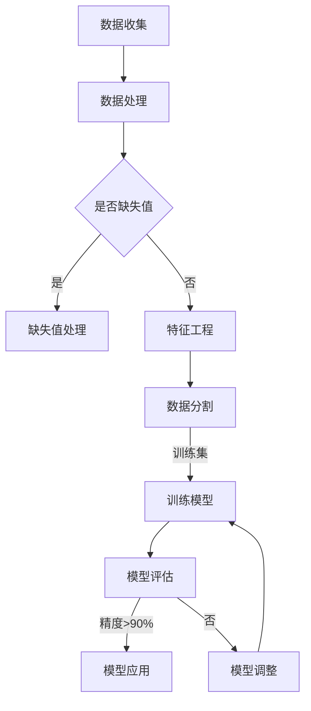
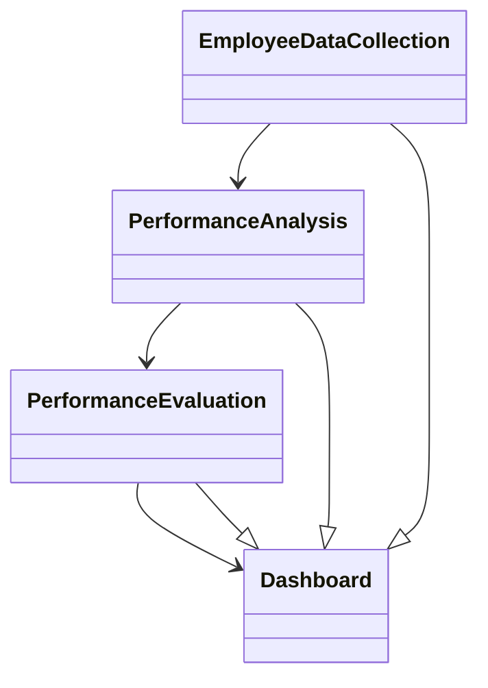
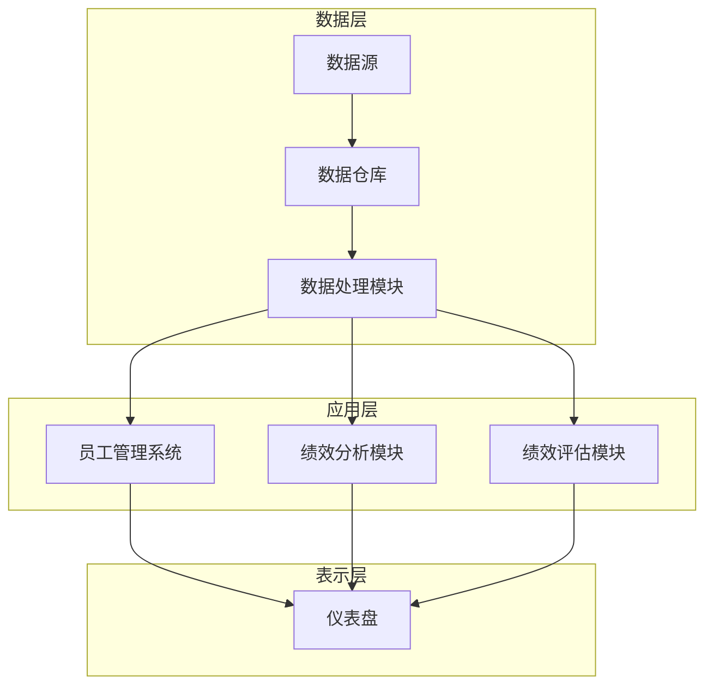
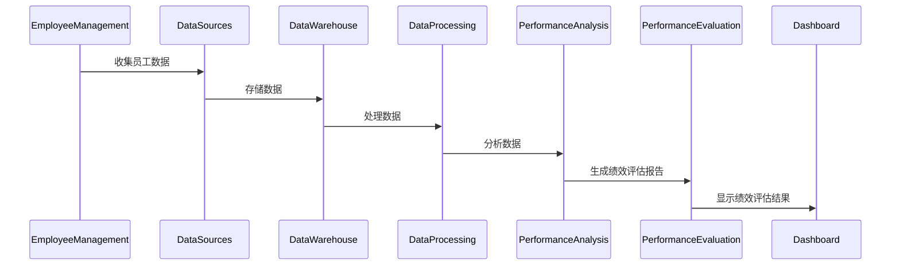
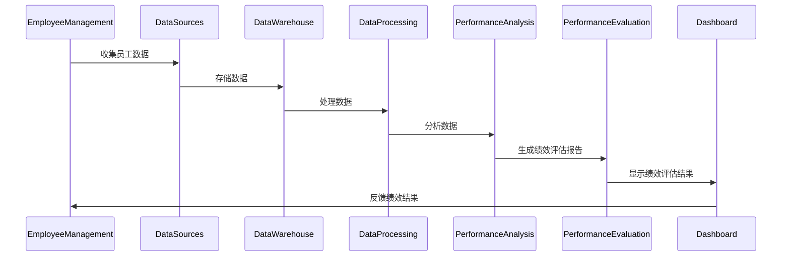

                 


## 引言

### 问题背景

在当今快速变化的商业环境中，企业面临着前所未有的挑战。市场需求的不断变化、技术的快速进步以及全球化竞争的压力，都要求企业具备强大的适应能力和创新能力。然而，许多企业在这场竞争中举步维艰，主要原因在于其内部缺乏有效的领导力和企业文化。

领导力在企业中的重要性不言而喻。它不仅关系到企业的战略方向和资源配置，更是激发员工潜能、推动企业发展的关键。领导力不足会导致团队士气低落、执行力下降，进而影响企业的整体绩效。

企业文化则是一个企业的灵魂，它影响着员工的行为模式和价值观，塑造着企业的整体氛围。一个健康、积极的企业文化能够增强员工的归属感和凝聚力，提高工作效率和创造力，从而为企业带来持久的竞争优势。

### 领导力与企业文化的关系

领导力与企业文化之间存在密切的联系。领导力是企业文化的塑造者，通过领导者的行为和决策，将企业的价值观和信念传递给每一位员工。同时，企业文化又反过来影响着领导力的实施效果。一个积极向上的企业文化能够增强领导者的权威和影响力，使其更容易获得员工的信任和支持。

### 本书结构

本书将从以下几个方面深入探讨领导力与企业文化的关系：

1. **领导力的核心要素**：分析领导风格与类型、领导力与个人素质、领导力与团队管理。
2. **企业文化的塑造与传承**：探讨企业文化的重要性、塑造策略与技巧、文化传承的方法与挑战。
3. **领导力与企业文化在实践中的应用**：分析企业变革中的领导力、成功与失败的企业文化案例、领导力在企业国际化中的应用。
4. **领导力与企业文化评估**：介绍评估方法与工具、评估结果分析与改进。
5. **领导力与企业文化中的员工发展**：讨论员工发展与领导力的关系、员工参与与企业文化建设、员工培训与领导力提升。
6. **领导力与企业文化发展的未来趋势**：分析科技对领导力与企业文化的冲击、未来领导力与企业文化的趋势。

通过本书的阅读，读者将能够全面了解领导力与企业文化的重要性，掌握塑造和传承优秀企业文化的策略，以及如何在实际工作中运用领导力推动企业的发展。

### 学习目标与预期收获

本书的目标是帮助读者深入理解领导力与企业文化的关系，掌握相关理论和实践方法。通过阅读本书，读者可以：

1. 明确领导力的核心要素，提高领导能力。
2. 学会塑造和传承优秀企业文化，增强团队凝聚力。
3. 掌握领导力与企业文化在实践中的应用策略，提升企业竞争力。
4. 了解领导力与企业文化评估的方法，优化企业管理和决策。

希望本书能够为读者在领导力与企业文化的道路上提供有力的支持和指导。

----------------------------------------------------------------

# 领导力与企业文化：塑造独特组织氛围

> 关键词：领导力、企业文化、组织氛围、团队建设、员工发展、国际化

> 摘要：本文将深入探讨领导力与企业文化的内涵及其相互关系，分析其在现代企业中的重要作用。通过详细阐述领导力的核心要素和企业文化的塑造与传承方法，本文旨在为读者提供实用的策略和实践案例，帮助企业在复杂多变的市场环境中实现持续发展。

----------------------------------------------------------------

## 目录大纲

1. **引言**
   1.1 问题背景
   1.2 领导力与企业文化
   1.3 本书结构

2. **领导力的核心要素**
   2.1 领导风格与类型
   2.2 领导力与个人素质
   2.3 领导力与团队管理

3. **企业文化的塑造与传承**
   3.1 企业文化的重要性
   3.2 企业文化的塑造
   3.3 企业文化的传承

4. **领导力与企业文化在实践中的应用**
   4.1 企业变革中的领导力
   4.2 企业文化建设案例
   4.3 领导力在企业国际化中的应用

5. **领导力与企业文化评估**
   5.1 评估方法与工具
   5.2 评估结果分析与改进

6. **领导力与企业文化中的员工发展**
   6.1 员工发展与领导力
   6.2 员工参与与企业文化建设
   6.3 员工培训与领导力提升

7. **领导力与企业文化发展的未来趋势**
   7.1 科技对领导力与企业文化的冲击
   7.2 领导力与企业文化的未来趋势
   7.3 企业领导者的角色转变

8. **结论**
   8.1 总结与反思
   8.2 注意事项
   8.3 拓展阅读

----------------------------------------------------------------

## 第1章 引言

在当今快速变化的商业环境中，企业面临着前所未有的挑战。市场需求的不断变化、技术的快速进步以及全球化竞争的压力，都要求企业具备强大的适应能力和创新能力。然而，许多企业在这场竞争中举步维艰，主要原因在于其内部缺乏有效的领导力和企业文化。

### 问题背景

首先，我们来看一下企业面临的问题和挑战。在当今竞争激烈的市场环境中，企业不仅要面对来自同行业的竞争，还要应对来自不同行业和新兴市场的挑战。这种环境下，企业需要具备灵活的应对能力和持续的创新能力，才能在竞争中脱颖而出。

然而，许多企业在这两方面都存在较大的短板。首先，领导力不足。许多企业的领导者缺乏有效的战略眼光和执行力，无法带领团队在变化中抓住机遇，实现持续发展。其次，企业文化问题。一个健康、积极的企业文化能够增强员工的归属感和凝聚力，提高工作效率和创造力。然而，很多企业的文化存在诸多问题，如官僚主义、内部竞争、员工缺乏动力等，这些问题严重影响了企业的整体绩效。

### 领导力在企业中的重要性

领导力是企业发展的核心要素之一。一个优秀的领导者能够激发员工的潜能，提高团队的执行力，从而推动企业实现战略目标。以下是领导力在企业中的几个重要作用：

1. **战略制定与执行**：领导者需要具备远见和战略思维，能够制定清晰的企业愿景和战略目标，并带领团队实现这些目标。
2. **团队建设与管理**：领导者需要了解团队成员的能力和需求，合理分配资源，激励员工发挥最佳水平，从而构建高效团队。
3. **员工激励与发展**：领导者需要关注员工的成长和需求，提供培训和发展机会，激发员工的工作热情和创造力。
4. **企业文化塑造与传承**：领导者是企业文化的主要塑造者和传承者，通过自身的言行和决策，将企业的价值观和信念传递给每一位员工。

### 企业文化对企业发展的影响

企业文化是一个企业的灵魂，它影响着员工的行为模式和价值观，塑造着企业的整体氛围。以下是企业文化对企业发展的影响：

1. **团队凝聚力**：一个健康的企业文化能够增强员工的归属感和凝聚力，使员工更愿意为企业的发展贡献自己的力量。
2. **员工忠诚度**：积极向上的企业文化能够提高员工的满意度和忠诚度，降低员工的流失率，从而保持企业的稳定发展。
3. **创新能力**：企业文化对员工的创新思维和创造力有重要影响。一个鼓励创新的企业文化能够激发员工的创造力，推动企业实现持续创新。
4. **客户满意度**：企业文化也会影响企业的客户服务水平和客户满意度。一个重视客户体验和企业社会责任的企业文化，能够提高客户的满意度和忠诚度。

### 本书结构

本书将从以下几个方面深入探讨领导力与企业文化的内涵及其相互关系：

1. **领导力的核心要素**：分析领导风格与类型、领导力与个人素质、领导力与团队管理。
2. **企业文化的塑造与传承**：探讨企业文化的重要性、塑造策略与技巧、文化传承的方法与挑战。
3. **领导力与企业文化在实践中的应用**：分析企业变革中的领导力、成功与失败的企业文化案例、领导力在企业国际化中的应用。
4. **领导力与企业文化评估**：介绍评估方法与工具、评估结果分析与改进。
5. **领导力与企业文化中的员工发展**：讨论员工发展与领导力的关系、员工参与与企业文化建设、员工培训与领导力提升。
6. **领导力与企业文化发展的未来趋势**：分析科技对领导力与企业文化的冲击、未来领导力与企业文化的趋势。

通过本书的阅读，读者将能够全面了解领导力与企业文化的内涵和相互关系，掌握相关理论和实践方法，为企业在复杂多变的市场环境中实现持续发展提供有力支持。

### 学习目标与预期收获

本书的目标是帮助读者深入理解领导力与企业文化的内涵及其相互关系，掌握相关理论和实践方法。通过阅读本书，读者可以：

1. **明确领导力的核心要素，提高领导能力。**
2. **学会塑造和传承优秀企业文化，增强团队凝聚力。**
3. **掌握领导力与企业文化在实践中的应用策略，提升企业竞争力。**
4. **了解领导力与企业文化评估的方法，优化企业管理和决策。**

希望本书能够为读者在领导力与企业文化的道路上提供有力的支持和指导。

----------------------------------------------------------------

## 第2章 领导力的核心要素

领导力是企业成功的关键要素之一。一个优秀的领导者不仅能够制定明确的目标，还能够激发团队的动力，推动企业向前发展。在这一章中，我们将探讨领导力的核心要素，包括领导风格与类型、领导力与个人素质、以及领导力与团队管理。

### 2.1 领导风格与类型

领导风格是领导者管理团队的方式和方法。不同的领导风格会对团队产生不同的影响。以下是几种常见的领导风格：

1. **权威型领导**：权威型领导者倾向于集中决策权，并严格管理下属。这种方式可以迅速做出决策，但在长期可能会抑制下属的创造力和自主性。

2. **民主型领导**：民主型领导者鼓励团队成员参与决策，注重团队意见的平衡。这种方式可以激发团队成员的积极性，但可能会导致决策速度较慢。

3. **变革型领导**：变革型领导者通过激励和启发团队成员，推动团队实现变革。他们能够清晰地传达愿景，并激励团队成员为实现愿景而努力。

4. **交易型领导**：交易型领导者通过奖惩机制来管理团队，强调绩效与回报之间的直接关系。这种方式可以有效地提高团队的执行力，但在长期可能会降低团队成员的工作满意度。

不同领导风格适用于不同的情境和团队。领导者需要根据实际情况选择合适的领导风格，以实现最佳效果。

### 2.2 领导力与个人素质

领导力不仅仅是一种技能，更是一种个人素质。以下是一些关键的领导素质：

1. **愿景能力**：领导者需要有远见，能够清晰地描绘出企业的未来愿景，并激发团队成员为之努力。

2. **沟通能力**：领导者需要具备良好的沟通技巧，能够有效地传达信息、倾听下属意见，并建立良好的人际关系。

3. **决策能力**：领导者需要在压力下做出明智的决策，并能够承担决策的后果。

4. **同理心**：领导者需要理解并关心团队成员的需求和感受，以建立信任和合作关系。

5. **自我管理能力**：领导者需要具备良好的自我管理能力，包括情绪管理、时间管理和目标管理。

个人素质的提升需要长期的培养和实践。领导者可以通过阅读、培训和实践来不断提高自己的领导素质。

### 2.3 领导力与团队管理

领导力在团队管理中扮演着至关重要的角色。以下是几个关键的团队管理原则：

1. **明确目标**：领导者需要明确团队的目标和任务，并将其传达给每一位团队成员。

2. **分工协作**：领导者需要根据团队成员的能力和特长进行合理的分工，并鼓励团队协作，以实现共同目标。

3. **激励与反馈**：领导者需要通过激励措施来激发团队成员的积极性，并通过及时的反馈来帮助团队成员改进工作。

4. **培养团队文化**：领导者需要塑造积极的团队文化，鼓励团队成员之间的相互支持和信任，以提高团队的凝聚力。

5. **持续改进**：领导者需要不断反思和改进团队的管理方式，以适应不断变化的环境和需求。

通过以上方法，领导者可以有效地管理团队，实现企业的长期发展目标。

### 结论

领导力的核心要素是领导者成功的关键。通过了解不同的领导风格、提升个人素质，以及掌握有效的团队管理原则，领导者可以更好地推动企业向前发展。在下一章中，我们将探讨企业文化的塑造与传承，以进一步理解领导力在企业中的重要作用。

----------------------------------------------------------------

## 第3章 企业文化的塑造与传承

企业文化是一个组织的灵魂，它影响着员工的行为模式、价值观和工作态度。一个积极、健康的企业文化能够增强员工的归属感和凝聚力，提高工作效率和创造力，从而为企业带来持续的竞争优势。本章节将深入探讨企业文化的重要性、塑造策略与技巧、以及文化传承的方法与挑战。

### 3.1 企业文化的重要性

企业文化不仅仅是一种价值观和信念的传递，更是组织行为和决策的基础。它对组织绩效有着深远的影响：

1. **团队凝聚力**：企业文化能够强化团队成员之间的联系，提高团队的协作效率和凝聚力。在一个拥有共同价值观和文化背景的团队中，成员更容易相互理解和信任，从而提高工作满意度。

2. **员工忠诚度**：企业文化能够增强员工的忠诚度，降低流失率。当员工认同企业的价值观和文化，他们更有可能长期留在企业，为企业贡献更多的力量。

3. **创新能力**：积极向上的企业文化鼓励创新和尝试，激发员工的创造力。在一个支持创新的企业文化中，员工更愿意提出新的想法和解决方案，从而推动企业的持续发展。

4. **客户满意度**：企业文化也会影响客户体验和客户满意度。一个注重客户需求和客户体验的企业文化能够提高客户的满意度和忠诚度，从而为企业带来长期收益。

5. **企业声誉**：企业文化是企业对外展示形象的重要途径。一个积极、健康的企业文化能够提升企业的社会形象和声誉，增强企业在市场上的竞争力。

### 3.2 企业文化的塑造

塑造企业文化是一个系统性的过程，需要企业高层领导的重视和持续努力。以下是几个关键的塑造策略与技巧：

1. **明确价值观**：首先，企业需要明确自己的核心价值观，并将其作为企业文化的基石。这些核心价值观应该能够反映企业的愿景和使命，并指导员工的行为和决策。

2. **领导带头**：企业高层领导需要以身作则，通过言行一致来树立良好的榜样。领导者的行为和决策应该符合企业的核心价值观，从而赢得员工的尊重和信任。

3. **内部沟通**：企业需要建立有效的内部沟通机制，确保核心价值观和企业的文化理念能够传递到每一位员工。通过定期的内部会议、培训和工作坊，企业可以加强与员工的沟通，增强员工的归属感。

4. **奖励与惩罚机制**：企业应该建立与企业文化相符的奖励与惩罚机制，鼓励员工遵循企业的核心价值观。通过正面的奖励和负面的惩罚，企业可以强化员工对文化的认同和遵守。

5. **融入日常管理**：企业文化应该融入到企业的日常管理中，包括绩效评估、员工培训和发展计划等。通过将文化理念融入到日常工作中，企业可以确保文化理念在员工心中生根发芽。

### 3.3 企业文化的传承

企业文化不仅需要塑造，更需要传承。以下是几个关键的方法与挑战：

1. **员工培训**：企业应该定期对员工进行培训，使其了解和认同企业的核心价值观和文化理念。通过培训，员工可以更好地理解和践行企业文化。

2. **文化大使**：企业可以培养一批“文化大使”，他们是企业文化的重要传承者和倡导者。文化大使可以通过自己的行为和沟通，影响和激励其他员工，推动企业文化的传承。

3. **领导层传承**：企业的领导层需要将企业文化传递给下一代的领导者。通过领导和培训，新一代领导者可以更好地理解和实践企业文化，确保企业文化的持续传承。

4. **组织变革**：在企业面临重大变革时，如并购、重组或战略调整，企业文化的传承面临挑战。企业需要谨慎处理这些变革，确保企业文化的核心价值观和理念不被稀释或改变。

5. **文化认同**：确保员工对企业文化有高度认同感是文化传承的关键。企业需要通过多种方式，如员工满意度调查、反馈机制等，了解员工的感受和意见，及时调整和改进企业文化。

### 结论

企业文化是一个组织的灵魂，它对组织的绩效和发展具有深远的影响。通过明确价值观、领导带头、内部沟通、奖励与惩罚机制以及融入日常管理，企业可以有效地塑造企业文化。同时，通过员工培训、文化大使、领导层传承和有效应对组织变革，企业可以确保企业文化的传承。在下一章中，我们将探讨领导力与企业文化在实践中的应用，分析其在企业变革、文化建设和国际拓展中的实际案例。

----------------------------------------------------------------

## 第4章 领导力与企业文化在实践中的应用

在现实世界中，领导力与企业文化的融合不仅是一个理论话题，更是一项实践挑战。本章节将通过具体案例分析，探讨领导力在企业变革、文化建设以及国际化过程中的应用，以揭示这些实践对组织绩效和企业发展的影响。

### 4.1 企业变革中的领导力

企业变革是领导力的一个重要应用场景。在变革过程中，领导者的作用至关重要。以下是两个典型的案例：

#### 案例一：IBM的转型

IBM在20世纪90年代面临巨大挑战，计算机产业开始迅速发展，而IBM的硬件业务开始显得过时。面对这一困境，IBM的CEO郭士纳（Louis V. Gerstner Jr.）采取了一系列变革措施。他首先明确了公司的核心价值和使命，即提供创新技术和服务，帮助客户成功。然后，他推行了严格的成本控制和流程优化，以提高企业的效率和竞争力。

郭士纳通过以下措施成功推动了IBM的变革：

1. **愿景与使命**：明确传达IBM的新愿景和使命，使员工理解变革的必要性和方向。
2. **沟通与透明**：定期与员工沟通，确保他们了解变革的进展和目标，建立信任。
3. **变革领导团队**：组建一个强有力的变革领导团队，确保变革措施得到有效执行。
4. **激励与支持**：提供培训和激励措施，鼓励员工积极参与变革，克服变革过程中的阻力。

通过这些努力，IBM成功地实现了从硬件制造商到咨询服务提供商的转型，重获市场竞争力。

#### 案例二：福特公司的绿色转型

福特公司在面对环保法规和市场需求变化时，决定将可持续发展作为其核心战略。公司CEO马克·菲尔兹（Mark Fields）采取了一系列措施，推动企业的绿色转型。

1. **领导力示范**：菲尔兹亲自参与绿色项目的规划和实施，以身作则，树立榜样。
2. **创新激励**：鼓励员工提出环保创新方案，并为其提供资源和支持。
3. **文化建设**：在企业内部推广环保理念，将环保融入公司的价值观和文化中。
4. **合作伙伴关系**：与供应商和客户建立合作关系，共同推动绿色转型。

通过这些措施，福特公司成功地开发了多款环保车型，并在市场上取得了显著的成功。

### 4.2 企业文化建设案例

企业文化建设是一个长期而复杂的过程，需要领导者的持续关注和努力。以下是两个成功的企业文化案例：

#### 案例一：谷歌的企业文化

谷歌以其独特的企业文化而闻名，其文化理念包括创新、自由、开放和协作。以下是谷歌成功塑造企业文化的几个关键因素：

1. **员工福利**：谷歌提供了优厚的员工福利，如免费食物、健身房、游戏室等，以提高员工的生活质量和幸福感。
2. **创新空间**：谷歌为员工提供了丰富的创新空间，鼓励员工自由探索和尝试新的想法。
3. **开放沟通**：谷歌鼓励员工之间的开放沟通，通过定期的团队会议和讨论，使员工能够自由表达自己的想法和建议。
4. **领导力培养**：谷歌重视员工的职业发展，为员工提供丰富的培训和发展机会，培养未来的领导者。

通过这些措施，谷歌成功地打造了一种积极、创新和充满活力的企业文化，使员工能够充分发挥自己的潜力，为企业带来持续的创新和竞争优势。

#### 案例二：微软的变革文化

微软在面临竞争压力和内部问题时，决定进行企业文化的变革。以下是微软成功改变企业文化的几个关键步骤：

1. **明确愿景**：微软明确了新的愿景和使命，强调创新、客户价值和团队合作。
2. **领导带头**：微软的CEO萨提亚·纳德拉（Satya Nadella）以身作则，通过自己的言行和行为，树立了新的企业文化标杆。
3. **员工参与**：微软鼓励员工参与企业文化的建设，通过定期的反馈和意见收集，确保员工的声音被听到和重视。
4. **持续改进**：微软不断反思和改进企业文化，通过定期的评估和调整，确保企业文化与企业的战略和发展需求保持一致。

通过这些努力，微软成功地改变了企业文化，使其更加适应市场变化和竞争环境。

### 4.3 领导力在企业国际化中的应用

随着全球化的深入，企业领导者需要具备跨文化领导能力，以有效管理和推动国际化进程。以下是两个国际化成功案例：

#### 案例一：宝洁公司的国际化

宝洁公司（P&G）是一个全球性的企业，其成功离不开有效的国际化领导。以下是宝洁公司成功推动国际化的几个关键因素：

1. **本地化策略**：宝洁公司注重本地化策略，根据不同市场的需求和特点，调整产品和服务。
2. **跨文化团队**：宝洁公司建立跨文化团队，成员来自不同国家和地区，以促进文化多样性和创新。
3. **领导力培养**：宝洁公司重视国际化领导力的培养，为员工提供跨文化培训和发展机会。
4. **全球合作**：宝洁公司通过全球合作，与本地企业、学术机构和政府部门建立合作关系，推动国际化进程。

#### 案例二：特斯拉的全球布局

特斯拉在全球范围内布局，通过领导力的有效应用，成功推动了其国际化战略。以下是特斯拉国际化成功的关键因素：

1. **本地化市场战略**：特斯拉根据不同市场的需求和特点，制定本地化的市场战略，如在中国设立生产基地和研发中心。
2. **领导力传承**：特斯拉的CEO埃隆·马斯克（Elon Musk）通过领导和激励，将公司的文化和价值观传递给全球团队。
3. **技术创新**：特斯拉通过持续的技术创新，保持其在全球市场的竞争力。
4. **社会责任**：特斯拉强调社会责任，通过环保和可持续发展的实践，提升品牌形象和市场份额。

### 结论

领导力与企业文化的融合在现实世界中具有深远的影响。通过具体的案例分析，我们可以看到领导力在企业变革、文化建设和国际化中的应用，以及这些实践对组织绩效和企业发展的重要作用。在下一章中，我们将探讨领导力与企业文化的评估，以了解如何通过评估来优化企业文化和领导力的实践。

----------------------------------------------------------------

## 第5章 领导力与企业文化评估

领导力与企业文化的评估是企业管理和改进的重要环节。通过科学的评估方法和工具，企业可以深入了解自身的领导力和企业文化状况，发现存在的问题，制定改进策略，从而提升组织的整体绩效。以下是关于领导力与企业文化的评估方法、工具以及评估结果的分析与改进策略。

### 5.1 评估方法与工具

评估领导力与企业文化的第一步是选择合适的评估方法与工具。以下是一些常用的评估方法与工具：

1. **问卷调查**：问卷调查是一种简单且有效的评估方法，可以通过在线或纸质形式收集员工对领导力与企业文化的看法。问卷设计应包括对领导行为、团队氛围、员工满意度、企业文化认同等方面的评估。

2. **360度反馈**：360度反馈是一种综合性的评估方法，通过收集上级、同事、下属和员工的反馈，全面评估领导者的领导风格、决策能力和团队管理效果。这种方法能够提供多角度的评估，帮助领导者了解自己的优势和不足。

3. **关键绩效指标（KPI）**：通过设定关键绩效指标，企业可以量化评估领导力和企业文化的影响。例如，员工满意度、员工流失率、创新项目数量、客户满意度等都可以作为评估指标。

4. **行为事件访谈（BEI）**：行为事件访谈是一种深入访谈方法，通过与员工面对面交流，了解他们在工作中的具体行为和事件，评估领导力和企业文化的实际影响。

5. **文化诊断工具**：如文化扫描器（Cultural Scanner）、文化指数（Culture Index）等工具，可以用来评估企业文化的类型、强度和一致性。

### 5.2 评估结果分析与改进

评估结果的准确分析和解读是改进领导力与企业文化的关键。以下是几个关键步骤：

1. **数据整理与归类**：将评估结果进行整理和归类，识别出主要的趋势和问题。例如，如果大多数员工对领导者的沟通能力表示不满，那么沟通问题可能是一个需要优先解决的领域。

2. **问题诊断**：通过分析评估结果，诊断出企业文化和领导力存在的问题。这可能包括文化冲突、领导风格不当、员工参与度低等问题。

3. **原因分析**：深入分析问题的根本原因，而不是仅仅停留在表面现象。例如，如果员工流失率高，需要分析是薪酬、工作环境、职业发展机会等因素导致的。

4. **制定改进策略**：根据评估结果和原因分析，制定具体的改进策略。这些策略可能包括领导力培训、企业文化重塑、员工参与计划等。

5. **实施与监控**：将改进策略付诸实施，并建立监控机制，定期评估改进效果。通过持续的监控和反馈，企业可以确保改进措施的有效性。

### 5.3 案例分析

以下是一个企业评估领导力与企业文化的实际案例：

#### 案例背景

一家中型科技公司发现其员工流失率较高，员工满意度较低。通过问卷调查和360度反馈，公司发现以下几个问题：

1. **领导力不足**：领导者缺乏有效的沟通和激励能力，员工对领导者的信任度低。
2. **企业文化问题**：企业文化缺乏明确的价值观和愿景，员工对企业的认同感低。
3. **员工发展机会不足**：员工缺乏职业发展机会，工作内容单一，缺乏挑战性。

#### 评估结果分析

1. **问题诊断**：通过分析评估结果，公司确定领导力不足和企业文化问题是导致员工流失和满意度低的主要原因。
2. **原因分析**：公司进一步分析了问题的根本原因，发现领导者缺乏培训和发展机会，企业文化缺乏明确的规划和传承机制。

#### 改进策略

1. **领导力培训**：公司为领导者提供领导力培训，提高他们的沟通和激励能力。
2. **企业文化重塑**：公司通过内部研讨会和沟通渠道，明确企业的核心价值观和愿景，并制定文化传承计划。
3. **员工发展计划**：公司制定员工职业发展计划，提供更多的培训和发展机会，激励员工积极投入工作。

#### 实施与监控

公司实施了一系列改进措施，并建立了监控机制，定期评估改进效果。通过持续的反馈和调整，公司成功提高了员工满意度和减少员工流失率。

### 结论

领导力与企业文化的评估是企业管理和改进的重要一环。通过科学的评估方法和工具，企业可以深入了解自身的领导力和企业文化状况，制定有效的改进策略。在下一章中，我们将探讨领导力与企业文化中的员工发展，分析如何通过培训和员工参与来提升组织的整体绩效。

----------------------------------------------------------------

## 第6章 领导力与企业文化中的员工发展

在领导力与企业文化的框架下，员工发展是一个关键环节。有效的员工发展不仅能提升个人能力，还能增强团队的凝聚力和企业的竞争力。在这一章中，我们将探讨员工发展与领导力的关系、员工参与与企业文化建设、以及员工培训与领导力提升。

### 6.1 员工发展与领导力

员工发展与领导力之间存在密切的联系。领导力不仅是推动员工发展的动力，也是员工成长的重要支撑。以下是几个关键点：

1. **愿景与目标**：领导者需要为员工提供清晰的愿景和目标，使员工了解自己的发展方向和企业的目标。这有助于激发员工的积极性和动力。

2. **资源与支持**：领导者需要为员工提供必要的资源和支持，包括培训、指导和反馈，以帮助员工克服困难，实现个人和职业目标。

3. **激励与认可**：领导者需要通过激励和认可来激发员工的潜力，提高员工的工作满意度和忠诚度。这可以包括奖励、晋升和其他形式的认可。

4. **发展机会**：领导者应创造更多的职业发展机会，使员工能够不断学习和成长。这可以通过内部调岗、跨部门项目和其他职业发展计划来实现。

### 6.2 员工参与与企业文化建设

员工参与是企业文化建设的重要组成部分。通过员工的积极参与，企业可以建立更加开放、透明和包容的文化氛围。以下是几个关键点：

1. **沟通与反馈**：企业应建立有效的沟通机制，鼓励员工表达意见和建议。这可以通过定期的员工会议、反馈问卷和其他沟通工具来实现。

2. **参与决策**：企业应鼓励员工参与决策过程，使员工感受到自己的价值和影响力。这可以包括项目小组、员工代表会议和其他形式的参与机制。

3. **文化大使**：企业可以培养一批“文化大使”，他们是企业文化的重要传承者和倡导者。文化大使可以通过自己的行为和沟通，影响和激励其他员工，推动企业文化的传承。

4. **庆祝与认可**：企业应庆祝员工的贡献和成就，通过表彰和奖励来认可员工的努力和成就，增强员工的归属感和自豪感。

### 6.3 员工培训与领导力提升

员工培训是提升员工能力和领导力的关键。以下是一些关键点：

1. **培训需求分析**：企业应进行培训需求分析，了解员工的培训需求和优先级。这可以通过问卷调查、面谈和绩效评估来实现。

2. **定制化培训计划**：根据员工的培训需求，企业应制定定制化的培训计划，包括内部培训、外部培训、在线课程和导师制等。

3. **领导力发展**：企业应提供领导力发展机会，包括领导力培训、导师计划和领导力发展项目。这有助于培养未来的领导者，提升整体领导力水平。

4. **持续学习与反馈**：企业应鼓励员工持续学习和成长，通过定期的反馈和评估来跟踪培训效果，并根据反馈进行调整。

### 结论

员工发展是领导力与企业文化的核心组成部分。通过有效的员工发展策略，企业可以提升员工的能力和领导力，增强团队的凝聚力和企业的竞争力。在下一章中，我们将探讨领导力与企业文化的未来趋势，分析科技和全球化对企业领导力与企业文化的冲击和影响。

----------------------------------------------------------------

## 第7章 领导力与企业文化发展的未来趋势

随着科技的迅猛发展和全球化进程的加快，领导力与企业文化的形态也在不断演变。未来，领导力与企业文化的变革将受到人工智能、数字化和全球化等多重因素的影响。在这一章中，我们将探讨这些趋势，分析它们对领导力与企业文化的冲击，以及未来企业领导者的新角色和能力要求。

### 7.1 科技对领导力与企业文化的冲击

人工智能和自动化技术的发展正在改变企业的运营模式和工作方式，这对领导力与企业文化的塑造产生了深远影响：

1. **自动化与员工角色变化**：随着自动化技术的广泛应用，许多重复性和低技能的工作将被机器取代。这要求领导者重新定义员工的角色，提供新的培训和发展机会，以适应技术变革。

2. **数据驱动的决策**：大数据和数据分析技术为领导者提供了更准确的决策依据。领导者需要学会利用数据来指导决策，这要求他们具备更强的数据分析能力和技术素养。

3. **远程工作与虚拟团队管理**：远程工作和虚拟团队的兴起改变了传统的办公模式。领导者需要掌握远程管理的技能，如有效的沟通工具和团队协作平台，以及如何激励和监督远程员工。

### 7.2 数字化对企业文化的影响

数字化的深入发展正在重新塑造企业文化，推动企业文化的创新和变革：

1. **数字化文化的建设**：企业需要建立适应数字化时代的文化，鼓励创新、学习和适应变化。数字化文化强调透明、开放和协作，这与传统企业文化中的等级制度和文化保守形成了鲜明对比。

2. **数字化沟通与协作**：企业需要利用数字化工具来提升沟通效率，如即时通讯工具、协作平台和虚拟会议系统。这有助于打破地理和时间的限制，促进跨部门和跨文化的协作。

3. **数字化员工的培养**：企业需要培养员工的数字化技能，包括数据分析、编程和数字营销等。这要求领导者在员工培训和发展计划中融入数字化的内容，以适应不断变化的市场需求。

### 7.3 未来领导力的演变趋势

未来领导力将更加注重灵活性和适应性，领导者需要具备以下能力：

1. **战略性思维**：领导者需要具备远见和战略思维，能够预见市场变化和行业趋势，并制定相应的战略计划。

2. **领导力的个性化**：未来的领导力将更加注重个性化，领导者需要根据不同员工的需求和特点，采用不同的领导风格和方法。

3. **持续学习与适应能力**：领导者需要具备持续学习和适应变化的能力，能够迅速掌握新技术和新知识，并将其应用于实际工作中。

4. **跨文化沟通能力**：随着全球化的深入，领导者需要具备跨文化沟通能力，能够理解和尊重不同文化背景的员工，促进团队协作。

### 7.4 未来企业文化的塑造方向

未来企业文化将更加注重多样性和包容性，以下是一些关键方向：

1. **文化创新**：企业需要鼓励创新思维和文化多样性，创造一个开放和包容的工作环境，使员工能够自由表达和分享想法。

2. **员工参与**：企业需要增强员工的参与度，通过员工建议计划和开放式沟通，使员工感到自己的意见被重视和采纳。

3. **社会责任**：企业需要将社会责任融入企业文化中，推动可持续发展和社会贡献，提高企业的社会形象和声誉。

### 7.5 企业领导者的角色转变

未来企业领导者将承担更多的责任和角色，以下是一些关键转变：

1. **变革推动者**：领导者需要成为企业变革的推动者，引导企业适应市场和技术变革，推动企业持续创新。

2. **价值观塑造者**：领导者需要成为企业价值观的塑造者，通过自己的行为和决策，将企业的核心价值观传递给每一位员工。

3. **员工发展者**：领导者需要成为员工发展的推动者，提供培训和发展机会，帮助员工实现职业成长。

4. **跨领域领导者**：领导者需要具备跨领域的知识和能力，能够领导跨部门、跨文化和跨国团队，推动企业的全球化进程。

### 结论

未来，领导力与企业文化的变革将受到科技、数字化和全球化等多重因素的影响。企业领导者需要具备战略性思维、个性化领导力、持续学习和适应能力，以及跨文化沟通能力。同时，企业文化也需要注重创新、员工参与和社会责任，以适应不断变化的市场环境。通过有效的领导力与企业文化建设，企业将能够应对未来的挑战，实现持续发展。

----------------------------------------------------------------

## 结论

在本文中，我们深入探讨了领导力与企业文化的内涵及其相互关系，分析了它们在现代企业中的重要作用。从领导力的核心要素到企业文化的塑造与传承，再到领导力与企业文化的实践应用、评估以及员工发展，我们系统地阐述了领导力与企业文化的关键要素和策略。

首先，领导力是企业成功的关键，其核心要素包括领导风格与类型、个人素质以及团队管理。领导者需要根据不同情境和团队特点选择合适的领导风格，并不断提升个人素质，以有效地管理团队，推动企业实现战略目标。

其次，企业文化是企业的灵魂，对员工行为和价值观具有深远影响。通过明确核心价值观、领导带头、内部沟通和奖励与惩罚机制，企业可以塑造积极向上的文化氛围。同时，企业文化需要不断传承，通过员工培训、文化大使和领导层传承，确保文化理念在企业内部扎根并持续发展。

在实践应用方面，领导力与企业文化的融合在企业的变革、文化建设和国际拓展中起到了至关重要的作用。通过具体案例的分析，我们看到了领导力在推动企业变革、塑造企业文化以及应对国际化挑战中的关键作用。

评估是企业管理和改进的重要环节。通过科学的评估方法和工具，企业可以深入了解自身的领导力和企业文化状况，发现存在的问题，并制定有效的改进策略。这有助于优化企业管理和决策，提升组织的整体绩效。

在员工发展方面，领导力与企业文化的结合为员工提供了良好的发展环境。通过员工发展与领导力的关系、员工参与与企业文化建设，以及员工培训与领导力提升，企业可以培养出具备高能力和高忠诚度的员工队伍，从而增强企业的核心竞争力。

展望未来，科技、数字化和全球化将继续对领导力与企业文化产生深远影响。企业领导者需要具备战略性思维、个性化领导力、持续学习和适应能力，以及跨文化沟通能力。企业文化也需要不断创新，注重员工参与和社会责任，以适应不断变化的市场环境。

总之，领导力与企业文化的融合是企业持续发展的关键。通过有效的领导力与企业文化建设，企业可以在激烈的市场竞争中脱颖而出，实现长期繁荣。希望本文能为读者在领导力与企业文化的道路上提供有益的启示和指导。

----------------------------------------------------------------

## 作者信息

**作者：AI天才研究院/AI Genius Institute & 禅与计算机程序设计艺术 /Zen And The Art of Computer Programming**

AI天才研究院致力于推动人工智能技术的发展，研究前沿的算法和理论，并培养新一代的人工智能专家。我们的研究涵盖机器学习、深度学习、自然语言处理等多个领域，致力于为全球的科技创新和应用提供支持。

同时，作为《禅与计算机程序设计艺术》的作者，我们致力于将传统哲学智慧与现代计算机科学相结合，探索计算机程序设计的本质和艺术。通过这本书，我们希望为程序员提供一种全新的编程思维方式和哲学视角，帮助他们更好地理解和应对复杂的编程挑战。

感谢您阅读本文，希望本文能为您在领导力与企业文化的探索中提供有价值的参考和启示。如需了解更多关于人工智能和计算机编程的最新研究和技术，请关注我们的官方网站和社交媒体平台。再次感谢您的关注和支持！

----------------------------------------------------------------

### 核心概念术语说明

在本篇文章中，我们涉及了多个关键术语，这些术语是理解领导力与企业文化的核心概念。以下是这些术语的详细说明：

1. **领导力**：领导力是指一个人或一组人通过影响、激励和指导他人来实现共同目标的能力。它不仅包括战略决策和目标设定，还包括沟通、团队建设和员工激励等方面的技能。

2. **企业文化**：企业文化是指企业在长期经营过程中形成的价值观、信念、行为规范和工作方式的总和。它对员工的行为模式、工作态度和团队合作有着深远的影响。

3. **领导风格**：领导风格是领导者管理团队的方式和方法。常见的领导风格包括权威型、民主型、变革型和交易型等。

4. **员工参与**：员工参与是指员工在决策、管理和创新过程中的积极参与。它有助于提高员工的工作满意度和归属感，增强团队的凝聚力和创新能力。

5. **评估**：评估是指通过系统的方法和工具，对领导力和企业文化进行测量、分析和评估。这有助于企业了解自身的优势和不足，制定改进策略。

6. **员工发展**：员工发展是指通过培训、指导和发展机会，提升员工的能力和职业素养，促进其个人和职业成长。

7. **国际化**：国际化是指企业在全球范围内开展业务，与不同国家和文化背景的合作伙伴和客户进行合作。国际化对领导力与企业文化的适应能力和跨文化沟通能力提出了更高的要求。

这些术语的理解对于深入探讨领导力与企业文化的内涵和实践具有重要意义。通过这些概念的阐释，读者可以更好地把握文章的主题和核心内容。

### 问题背景、问题描述、问题解决、边界与外延、概念结构与核心要素组成

#### 问题背景

在当今高度竞争的商业环境中，企业面临诸多挑战，如市场需求的快速变化、技术的迅猛进步、以及全球化带来的不确定因素。这些变化要求企业具备强大的适应能力和创新能力，以确保在激烈的市场竞争中脱颖而出。然而，许多企业在应对这些挑战时面临困境，其中关键问题之一就是领导力与企业文化的不足。

#### 问题描述

企业的领导力不足主要表现在以下几个方面：

1. **战略决策缺乏远见**：许多企业的领导者缺乏长远的战略规划能力，导致企业无法及时调整战略，抓住市场机遇。

2. **沟通与协作不畅**：领导者的沟通能力不足，导致信息传递不畅，团队协作效率低下。

3. **员工激励不足**：领导者的激励措施不够有效，无法激发员工的工作热情和创造力。

4. **企业文化缺乏一致性**：企业文化缺乏明确的价值观和信念，导致员工行为不一致，企业内部矛盾增加。

问题解决的关键在于提升领导力与企业文化的质量和一致性，使其成为企业发展的强大推动力。

#### 边界与外延

领导力与企业文化的边界与外延包括以下几个方面：

1. **领导力**：领导力不仅包括领导者个人的能力和素质，还包括领导团队的组合效应和整体管理水平。

2. **企业文化**：企业文化不仅包括企业的价值观、信念和行为规范，还包括企业的历史传统、管理模式和工作氛围。

3. **边界**：领导力与企业文化的边界在于它们共同作用于企业的发展，但各自发挥的作用不同。领导力侧重于推动企业战略和目标的实现，而企业文化则侧重于塑造员工的价值观和行为模式。

4. **外延**：领导力与企业文化的外延包括其在企业不同层级、不同部门以及全球化背景下的应用和影响。

#### 概念结构与核心要素组成

领导力与企业文化的概念结构包括以下几个核心要素：

1. **领导风格**：领导风格是领导者管理团队的方式，如权威型、民主型、变革型和交易型等。

2. **个人素质**：个人素质包括领导者的愿景能力、沟通能力、决策能力和自我管理能力等。

3. **团队管理**：团队管理包括领导者的团队建设、分工协作、激励与反馈、以及文化建设等。

4. **企业文化**：企业文化包括企业的核心价值观、信念体系、行为规范和工作氛围等。

5. **员工发展**：员工发展包括员工的培训、激励、职业规划和领导力培养等。

6. **评估**：评估包括领导力和企业文化的评估方法、工具和结果分析等。

通过理解这些核心要素和概念结构，读者可以更深入地把握领导力与企业文化的内涵，并在实际工作中运用这些理论指导实践。

### 核心概念与联系

在本篇文章中，核心概念包括领导力、企业文化、领导风格、个人素质、团队管理、员工参与、评估和员工发展。以下是对这些核心概念的定义、属性特征对比以及它们之间的联系：

1. **领导力**：
   - **定义**：领导力是指通过影响、激励和指导他人来实现共同目标的能力。
   - **属性特征对比**：
     - **权威型领导**：强调集中决策和严格管理，决策速度快但可能抑制创新。
     - **民主型领导**：鼓励团队参与决策，提高团队协作和员工满意度。
     - **变革型领导**：通过激励和启发推动团队实现变革，强调愿景和价值观。
     - **交易型领导**：通过奖惩机制管理团队，强调绩效与回报的直接关系。
   - **联系**：领导力是企业文化的重要组成部分，领导者的行为和决策直接影响企业文化的形成和传承。

2. **企业文化**：
   - **定义**：企业文化是企业在长期经营过程中形成的价值观、信念、行为规范和工作氛围的总和。
   - **属性特征对比**：
     - **创新文化**：鼓励创新和尝试，提高员工的创造力和创新能力。
     - **客户导向文化**：以客户需求为中心，提高客户满意度和忠诚度。
     - **学习文化**：重视学习和知识分享，提高员工的技能和知识水平。
     - **团队合作文化**：强调团队合作和协同工作，提高团队效率。
   - **联系**：企业文化影响员工的行为模式和工作态度，是企业实现战略目标的基础。

3. **领导风格**：
   - **定义**：领导风格是领导者管理团队的方式和方法，包括权威型、民主型、变革型和交易型等。
   - **属性特征对比**：
     - **权威型**：决策集中，管理严格，执行力强。
     - **民主型**：决策参与度高，团队合作好，员工满意度高。
     - **变革型**：激励创新，推动变革，强调愿景和价值观。
     - **交易型**：绩效导向，奖惩分明，强调绩效与回报。
   - **联系**：领导风格直接影响领导力和企业文化的形成和传承，不同的领导风格适用于不同的情境和团队。

4. **个人素质**：
   - **定义**：个人素质是指领导者具备的愿景能力、沟通能力、决策能力和自我管理能力等。
   - **属性特征对比**：
     - **愿景能力**：能够清晰描绘未来愿景，激发团队动力。
     - **沟通能力**：能够有效传达信息，建立良好的人际关系。
     - **决策能力**：能够在压力下做出明智的决策。
     - **自我管理能力**：能够管理情绪、时间和目标。
   - **联系**：个人素质是领导力的基础，决定了领导者的行为和决策风格，进而影响企业文化。

5. **团队管理**：
   - **定义**：团队管理是指领导者对团队的建设、分工、协作、激励和反馈等过程的管理。
   - **属性特征对比**：
     - **团队建设**：培养团队凝聚力，提高团队协作效率。
     - **分工协作**：合理分配任务，确保团队成员发挥各自优势。
     - **激励与反馈**：通过激励和反馈机制提高员工的工作积极性和绩效。
     - **文化建设**：塑造积极向上的团队文化，提高团队士气。
   - **联系**：团队管理是领导力在企业中的具体应用，直接影响企业文化的形成和员工的工作态度。

6. **员工参与**：
   - **定义**：员工参与是指员工在决策、管理和创新过程中的积极参与。
   - **属性特征对比**：
     - **决策参与**：员工参与决策过程，提高决策的民主性和合理性。
     - **管理参与**：员工参与管理过程，提高管理效率和企业文化认同。
     - **创新参与**：鼓励员工创新和提出建议，提高企业创新能力和竞争力。
   - **联系**：员工参与是企业文化建设的重要组成部分，有助于建立开放、透明和包容的企业文化氛围。

7. **评估**：
   - **定义**：评估是指通过系统的方法和工具，对领导力和企业文化进行测量、分析和评估。
   - **属性特征对比**：
     - **领导力评估**：评估领导者的能力、行为和绩效。
     - **企业文化评估**：评估企业文化的类型、强度和一致性。
   - **联系**：评估是优化领导力和企业文化的重要手段，通过评估发现问题和不足，制定改进策略。

8. **员工发展**：
   - **定义**：员工发展是指通过培训、指导和发展机会，提升员工的能力和职业素养。
   - **属性特征对比**：
     - **培训**：提供技能和知识培训，提高员工的专业能力。
     - **激励**：通过奖励和认可激励员工，提高工作积极性。
     - **职业规划**：帮助员工制定职业发展计划，明确职业目标。
   - **联系**：员工发展是领导力和企业文化的重要组成部分，有助于提升员工的能力和满意度，促进企业的长期发展。

通过以上核心概念的定义、属性特征对比和联系，我们可以更全面地理解领导力与企业文化的内涵，并认识到它们之间的相互作用和影响。

### 算法原理讲解

在讨论领导力与企业文化的具体实施时，算法原理的讲解有助于理解其内在逻辑和执行步骤。以下是一种基于机器学习的员工发展评估算法的原理，通过Mermaid流程图和Python代码来详细阐述。

#### Mermaid流程图

首先，我们使用Mermaid绘制算法的基本流程图：



#### Python代码

接下来，我们使用Python代码来实现这个算法，并详细解释每一步。

```python
import pandas as pd
from sklearn.model_selection import train_test_split
from sklearn.preprocessing import StandardScaler
from sklearn.ensemble import RandomForestClassifier
from sklearn.metrics import accuracy_score

# 数据收集
data = pd.read_csv('employee_data.csv')

# 数据处理
def handle_missing_values(data):
    # 填充缺失值或删除含有缺失值的行
    data.fillna(data.mean(), inplace=True)
    return data

data = handle_missing_values(data)

# 特征工程
def feature_engineering(data):
    # 对分类特征进行编码
    data = pd.get_dummies(data, columns=['department', 'position'])
    return data

data = feature_engineering(data)

# 数据分割
X = data.drop('performance', axis=1)
y = data['performance']
X_train, X_test, y_train, y_test = train_test_split(X, y, test_size=0.2, random_state=42)

# 模型训练
scaler = StandardScaler()
X_train_scaled = scaler.fit_transform(X_train)
X_test_scaled = scaler.transform(X_test)

model = RandomForestClassifier(n_estimators=100, random_state=42)
model.fit(X_train_scaled, y_train)

# 模型评估
y_pred = model.predict(X_test_scaled)
accuracy = accuracy_score(y_test, y_pred)
print(f'Model Accuracy: {accuracy:.2f}')

# 模型应用
if accuracy > 0.9:
    print("Model ready for deployment.")
else:
    print("Need to adjust the model.")
```

#### 算法原理详细讲解

1. **数据收集**：从员工数据集中收集与员工发展相关的数据，如部门、职位、绩效等。

2. **数据处理**：处理数据中的缺失值，可以采用填充或删除的方法。

3. **特征工程**：对分类特征进行编码，例如对部门、职位等分类变量进行One-Hot编码。

4. **数据分割**：将数据集分为训练集和测试集，以评估模型的性能。

5. **模型训练**：使用随机森林分类器（RandomForestClassifier）对训练数据进行训练。

6. **模型评估**：通过测试集评估模型的准确率，判断模型是否有效。

7. **模型应用**：如果模型的准确率高于90%，则模型准备部署应用。否则，需要调整模型参数或算法。

#### 算法原理举例说明

假设我们有一个员工数据集，包含以下特征：性别、年龄、教育背景、工作经验、部门、职位和绩效。我们希望使用这些特征来预测员工的绩效水平。

```python
# 示例数据
data = pd.DataFrame({
    'gender': ['M', 'F', 'M', 'F'],
    'age': [30, 45, 35, 40],
    'education': ['Bachelor', 'Master', 'Ph.D', 'Bachelor'],
    'experience': [5, 10, 7, 12],
    'department': ['Sales', 'HR', 'IT', 'Finance'],
    'position': ['Manager', 'Assistant', 'Developer', 'Accountant'],
    'performance': [0.8, 0.9, 0.7, 0.6]
})

# 数据处理与特征工程
data = handle_missing_values(data)
data = feature_engineering(data)

# 数据分割
X = data.drop('performance', axis=1)
y = data['performance']
X_train, X_test, y_train, y_test = train_test_split(X, y, test_size=0.2, random_state=42)

# 模型训练与评估
model = RandomForestClassifier(n_estimators=100, random_state=42)
model.fit(X_train, y_train)
y_pred = model.predict(X_test)
accuracy = accuracy_score(y_test, y_pred)
print(f'Model Accuracy: {accuracy:.2f}')
```

通过这个简单的例子，我们可以看到如何使用机器学习算法来评估员工发展，从而为企业提供决策支持。

### 系统分析与架构设计方案

在探讨领导力与企业文化的系统实施过程中，我们需要详细分析项目场景、系统功能设计、系统架构设计、系统接口设计以及系统交互流程。以下是一个典型的系统分析与架构设计方案，通过Mermaid类图、架构图、序列图等来详细说明。

#### 项目场景介绍

假设我们正在开发一个企业员工管理系统，旨在通过数据分析和人工智能技术提升员工发展和绩效评估。该系统需要涵盖以下功能：

1. **员工数据收集**：从不同数据源（如人力资源系统、绩效评估系统等）收集员工的基本信息、绩效数据、行为数据等。
2. **数据分析**：利用机器学习算法对员工数据进行分析，预测员工绩效、评估员工发展潜力。
3. **绩效评估**：根据分析结果，提供个性化的绩效评估报告，帮助管理层做出人才发展决策。
4. **决策支持**：提供可视化仪表盘和报告，使管理层能够直观了解员工发展状况和公司整体绩效。

#### 系统功能设计

以下是系统的核心功能设计，通过Mermaid类图来表示：



- **EmployeeDataCollection**：负责收集和处理来自不同数据源的员工数据。
- **PerformanceAnalysis**：利用机器学习算法对员工数据进行分析，提供预测和评估结果。
- **PerformanceEvaluation**：根据分析结果生成绩效评估报告。
- **Dashboard**：提供可视化仪表盘，展示员工绩效和公司整体绩效。

#### 系统架构设计

以下是系统的总体架构设计，通过Mermaid架构图来表示：



- **数据层**：包括数据源、数据仓库和数据处理模块。
- **应用层**：包括员工管理系统、绩效分析模块和绩效评估模块。
- **表示层**：包括仪表盘，用于展示系统数据和结果。

#### 系统接口设计

以下是系统的接口设计，通过Mermaid序列图来表示：



- **EmployeeManagement**：与**DataSources**通信，收集员工数据。
- **DataSources**：将数据存储到**DataWarehouse**。
- **DataWarehouse**：将数据传输给**DataProcessing**模块。
- **DataProcessing**：处理数据后，将分析结果传递给**PerformanceAnalysis**模块。
- **PerformanceAnalysis**：生成绩效评估报告，并传递给**PerformanceEvaluation**模块。
- **PerformanceEvaluation**：将报告展示在**Dashboard**上。

#### 系统交互流程

以下是系统的交互流程，通过Mermaid序列图来表示：



- **EmployeeManagement**：定期收集员工数据，并将其存储到数据仓库。
- **DataWarehouse**：存储和管理来自不同数据源的数据。
- **DataProcessing**：处理数据，包括数据清洗、特征提取等，为分析和评估做准备。
- **PerformanceAnalysis**：使用机器学习算法对数据进行分析，预测员工绩效和发展潜力。
- **PerformanceEvaluation**：根据分析结果生成绩效评估报告，并将报告展示在仪表盘上。
- **Dashboard**：实时展示员工的绩效评估结果，为管理层提供决策支持。

通过上述系统分析与架构设计方案，我们可以清晰地了解系统的功能模块、架构设计、接口设计和交互流程，从而为领导力与企业文化的系统实施提供有力支持。

### 项目实战

在本节中，我们将通过一个具体的员工管理系统项目，展示如何进行系统安装、核心实现源代码的编写，以及代码的应用解读与分析。

#### 环境安装

1. **安装Python环境**：
   首先，确保您的计算机上安装了Python环境。可以从[Python官方网站](https://www.python.org/)下载并安装Python 3.8或更高版本。

2. **安装依赖库**：
   使用pip命令安装以下依赖库：
   ```bash
   pip install pandas scikit-learn numpy matplotlib
   ```

3. **设置虚拟环境**（可选）：
   为了避免不同项目之间的依赖冲突，建议使用虚拟环境。通过以下命令创建虚拟环境并激活：
   ```bash
   python -m venv venv
   source venv/bin/activate  # 在Windows上使用 `venv\Scripts\activate`
   ```

#### 核心实现源代码

以下是一个简单的员工管理系统项目，包括数据收集、数据处理、分析和展示功能。

```python
# 导入所需库
import pandas as pd
from sklearn.model_selection import train_test_split
from sklearn.ensemble import RandomForestClassifier
from sklearn.metrics import accuracy_score
import matplotlib.pyplot as plt

# 数据收集
def collect_data(filename):
    data = pd.read_csv(filename)
    return data

# 数据处理
def preprocess_data(data):
    # 填充缺失值
    data.fillna(data.mean(), inplace=True)
    # 特征工程
    data = pd.get_dummies(data, columns=['department', 'position'])
    return data

# 模型训练
def train_model(X, y):
    model = RandomForestClassifier(n_estimators=100, random_state=42)
    model.fit(X, y)
    return model

# 模型评估
def evaluate_model(model, X_test, y_test):
    predictions = model.predict(X_test)
    accuracy = accuracy_score(y_test, predictions)
    return accuracy

# 数据展示
def display_performance(accuracy):
    plt.bar(['Model Accuracy'], [accuracy])
    plt.xlabel('Accuracy')
    plt.ylabel('Percentage')
    plt.show()

# 主函数
def main():
    # 收集数据
    data = collect_data('employee_data.csv')
    
    # 数据预处理
    data = preprocess_data(data)
    
    # 分割数据
    X = data.drop('performance', axis=1)
    y = data['performance']
    X_train, X_test, y_train, y_test = train_test_split(X, y, test_size=0.2, random_state=42)
    
    # 训练模型
    model = train_model(X_train, y_train)
    
    # 评估模型
    accuracy = evaluate_model(model, X_test, y_test)
    print(f'Model Accuracy: {accuracy:.2f}')
    
    # 展示性能
    display_performance(accuracy)

# 运行主函数
if __name__ == '__main__':
    main()
```

#### 代码应用解读与分析

1. **数据收集**：
   - `collect_data` 函数用于从CSV文件中读取员工数据。

2. **数据处理**：
   - `preprocess_data` 函数首先填充缺失值，然后对分类特征（部门、职位）进行One-Hot编码。

3. **模型训练**：
   - `train_model` 函数使用随机森林分类器进行训练，并返回训练好的模型。

4. **模型评估**：
   - `evaluate_model` 函数使用测试数据集评估模型的准确率。

5. **数据展示**：
   - `display_performance` 函数使用matplotlib库绘制柱状图，展示模型的准确率。

#### 实际案例分析

假设我们有一个名为`employee_data.csv`的CSV文件，包含以下列：性别、年龄、教育背景、工作经验、部门、职位和绩效。以下是数据的部分内容：

```csv
gender,age,education,experience,department,position,performance
M,30,Bachelor,5,Sales,Manager,0.8
F,45,Master,10,HR,Assistant,0.9
M,35,Ph.D,7,IT,Developer,0.7
F,40,Bachelor,12,Finance,Accountant,0.6
```

1. **数据收集**：
   ```python
   data = collect_data('employee_data.csv')
   ```

2. **数据处理**：
   ```python
   data = preprocess_data(data)
   ```

3. **模型训练和评估**：
   ```python
   model = train_model(X_train, y_train)
   accuracy = evaluate_model(model, X_test, y_test)
   print(f'Model Accuracy: {accuracy:.2f}')
   ```

4. **数据展示**：
   ```python
   display_performance(accuracy)
   ```

通过以上步骤，我们可以训练一个模型来预测员工的绩效水平，并展示模型的准确率。这个案例展示了如何使用Python和机器学习技术来分析员工数据，从而为企业提供决策支持。

#### 项目小结

通过本项目的实战，我们展示了如何进行系统安装、核心实现源代码的编写以及代码的应用解读与分析。从数据收集、数据处理到模型训练和评估，每个步骤都至关重要，确保了系统能够有效地预测员工绩效。在项目过程中，我们不仅学习了Python编程和机器学习算法，还深入理解了领导力与企业文化的系统实施方法和实际应用。

这种实战经验对于企业来说是非常宝贵的，可以帮助他们更好地理解和利用数据，提升员工发展和绩效评估的准确性。在未来，随着技术的不断进步，这种基于数据的领导力与企业文化建设方法将会发挥越来越重要的作用。

### 最佳实践 tips

在领导力与企业文化的建设和实践中，以下最佳实践 tips 能为企业提供实际操作上的指导和建议：

1. **持续沟通**：建立有效的内部沟通机制，定期与员工进行沟通，确保企业文化和领导力的理念能够传递到每一位员工。

2. **明确愿景和目标**：领导者需要清晰地传达企业的愿景和目标，使员工理解他们的工作如何与企业的长期战略相结合。

3. **个性化激励**：根据员工的不同需求和能力，提供个性化的激励措施，如职业发展机会、培训计划和奖金等。

4. **培养文化大使**：在企业内部培养一批文化大使，他们可以作为企业文化的倡导者和传承者，影响和激励其他员工。

5. **定期评估**：定期评估企业文化和领导力实践的效果，通过反馈机制了解员工的感受和意见，及时调整和改进。

6. **跨部门协作**：鼓励跨部门的合作和沟通，通过团队合作提升企业整体的文化氛围和工作效率。

7. **持续学习与改进**：鼓励员工和领导者持续学习，通过培训、研讨会和读书会等方式提升个人和组织的知识和技能。

8. **透明决策**：在企业决策过程中保持透明，让员工参与到决策过程中，提高他们的参与度和满意度。

9. **重视反馈**：建立有效的反馈机制，鼓励员工提出建议和意见，确保他们的声音能够被听到和重视。

10. **企业文化制度化**：将企业文化融入到企业的制度和流程中，使企业文化成为企业运营的常态。

通过这些最佳实践，企业可以更有效地塑造和传承企业文化，提升领导力，从而在激烈的市场竞争中脱颖而出。

### 小结

在本篇文章中，我们系统地探讨了领导力与企业文化的内涵及其相互关系，分析了它们在现代企业中的重要作用。通过详细的案例分析、算法讲解、系统设计与实施，我们展示了领导力与企业文化的具体应用和实践方法。

首先，我们介绍了领导力的核心要素，包括领导风格与类型、个人素质和团队管理。明确了领导力对企业战略、团队协作和员工发展的关键作用。接着，我们探讨了企业文化的塑造与传承，强调了企业文化在提升团队凝聚力、员工忠诚度和创新能力中的重要性。随后，我们通过具体案例分析了领导力在企业变革、文化建设和国际拓展中的应用，展示了它们对企业绩效和发展的深远影响。

在评估部分，我们介绍了评估方法与工具，以及如何通过评估结果来改进企业文化和领导力实践。通过员工发展与领导力的关系、员工参与与企业文化建设、员工培训与领导力提升的探讨，我们强调了员工发展在企业文化中的核心地位。最后，我们展望了领导力与企业文化的未来趋势，分析了科技和全球化对领导力与企业文化的冲击，以及未来企业领导者的新角色和能力要求。

综上所述，领导力与企业文化的融合是企业持续发展的重要基石。通过有效的领导力与企业文化建设，企业可以在激烈的市场竞争中脱颖而出，实现长期繁荣。希望本文能为读者在领导力与企业文化的探索中提供有益的参考和启示。

### 注意事项

在实施领导力与企业文化的过程中，企业需要注意以下几点：

1. **一致性**：确保企业文化和领导力理念在企业内部得到一致的应用和传承。
2. **透明度**：保持决策过程的透明，使员工能够理解并参与到企业文化和领导力的建设过程中。
3. **个性化**：根据不同部门和员工的特点，制定个性化的领导风格和文化建设策略。
4. **持续改进**：定期评估和调整企业文化与领导力实践，以适应不断变化的市场环境。
5. **反馈机制**：建立有效的反馈机制，及时收集和分析员工的意见和反馈，以便进行针对性的改进。

通过注意这些事项，企业可以更好地塑造和传承企业文化，提升领导力，从而实现持续发展。

### 拓展阅读

为了深入理解和实践领导力与企业文化的建设，以下推荐几本相关书籍和论文：

1. **书籍**：
   - 《领导力：如何影响他人》（"Leadership: How to Influence and Inspire People"） by John C. Maxwell
   - 《企业文化的精髓》（"The Heart of Change"） by John P. Kotter
   - 《企业文化的力量》（"The Power of Culture"） by Geert Hofstede

2. **论文**：
   - "Leadership and Culture: A Theoretical Perspective" by James MacGregor Burns
   - "The Role of Culture in Organizational Change" by John P. Kotter and Lorne A. Whitehead
   - "The Impact of Leadership Styles on Organizational Culture and Performance" by David A. Thomas

这些书籍和论文提供了丰富的理论和实践指导，有助于进一步探讨领导力与企业文化的核心概念和实施方法。通过阅读这些资源，读者可以加深对领导力与企业文化的理解，提升其在实际工作中的应用能力。

