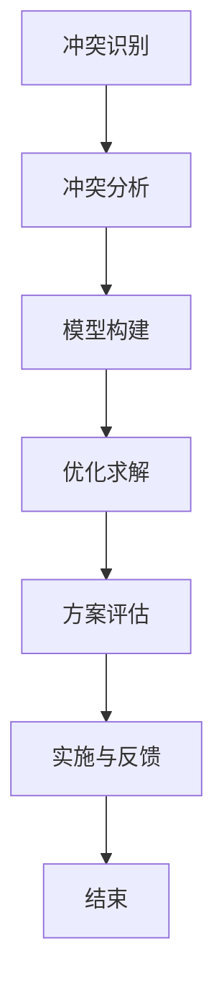
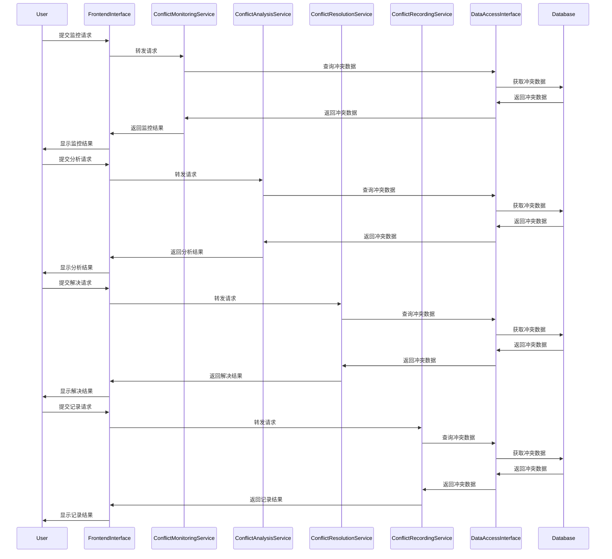
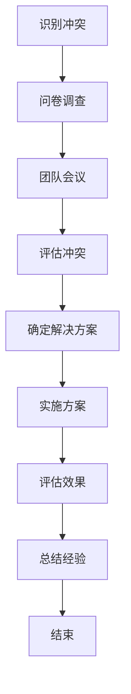
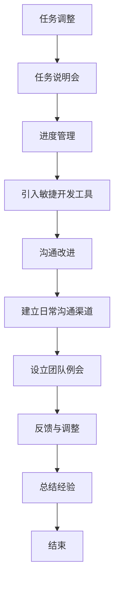
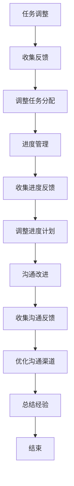
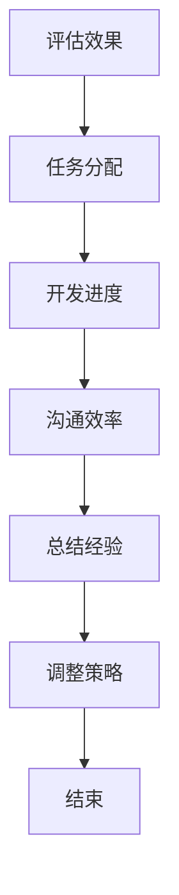

                 

### # 领导力与冲突管理：化解团队矛盾的技巧

关键词：领导力，冲突管理，团队矛盾，化解技巧

摘要：在当今复杂多变的商业环境中，团队内部的矛盾和冲突难以避免。有效的领导力和冲突管理策略对于保持团队效率和凝聚力至关重要。本文将深入探讨领导力与冲突管理的重要性，详细阐述解决团队矛盾的关键技巧和步骤，帮助读者构建和谐高效的团队。

文章结构概述：

1. **引言**：介绍领导力和冲突管理在团队中的重要性，以及文章的核心内容。
2. **领导力在冲突管理中的角色**：
   - 领导力的定义和核心要素
   - 领导者在团队冲突中的角色和责任
   - 领导风格与冲突解决效果的关系
3. **团队动态与沟通技巧**：
   - 团队发展周期和沟通障碍
   - 有效沟通的策略和方法
4. **冲突管理核心概念与原则**：
   - 冲突管理的根源和阶段
   - 冲突管理的原则和实践
5. **算法化的冲突解决方法**：
   - 冲突解决的算法原理和流程
   - 算法在冲突管理中的应用
6. **系统分析与架构设计**：
   - 冲突管理的系统分析
   - 系统架构设计与实现
7. **实战与案例分析**：
   - 实际案例中的冲突管理实践
   - 案例分析与小结
8. **最佳实践与小结**：
   - 关键技巧总结
   - 注意事项与未来拓展

通过以上结构，本文旨在为读者提供一套全面的领导力和冲突管理方法论，帮助他们在实际工作中应对和解决团队内部的矛盾，提升团队整体表现。

---

## 1. 引言

在现代企业的运营中，团队作为基本的工作单元，其效率和协作能力直接影响到组织的整体表现。然而，在团队运作过程中，不可避免地会出现各种矛盾和冲突。这些冲突可能源于成员之间的价值观差异、工作方式不同，或是任务分配不均等多种因素。如果不及时有效地处理，这些矛盾会逐渐积累，最终可能导致团队的分裂，甚至影响整个组织的稳定和发展。

领导力在这个过程中扮演着至关重要的角色。领导者不仅是团队的导航者，更是团队和谐与高效运转的守护者。有效的领导力可以帮助团队成员在冲突中找到共同的利益点，通过沟通和协调，实现矛盾的有效化解。同时，领导力也是激励团队成员、提升团队凝聚力和战斗力的关键。

冲突管理则是一个系统性、持续性的过程。它不仅仅是解决矛盾，更是一种预防和管理团队潜在风险的手段。通过科学的冲突管理策略，可以减少不必要的冲突，提高团队成员的工作满意度和团队的整体效率。

本文将围绕领导力与冲突管理这一主题，详细探讨以下内容：

1. **领导力在冲突管理中的角色**：介绍领导力的定义、核心要素及其在解决团队冲突中的作用。
2. **团队动态与沟通技巧**：分析团队发展周期、沟通障碍及其对冲突管理的影响，并提供有效的沟通策略。
3. **冲突管理核心概念与原则**：阐述冲突管理的根源、阶段和原则，提供实用的冲突管理策略。
4. **算法化的冲突解决方法**：介绍冲突解决的算法原理、流程及其在实际应用中的效果。
5. **系统分析与架构设计**：分析冲突管理的系统需求，设计合理的系统架构。
6. **实战与案例分析**：通过实际案例展示冲突管理的方法和技巧，并提供案例分析和小结。
7. **最佳实践与小结**：总结本文的关键技巧，提供注意事项和未来拓展的方向。

通过这些内容的阐述，本文希望能够为读者提供一套系统、实用的领导力和冲突管理方法论，帮助他们更好地应对和解决团队内部的矛盾，打造一个和谐、高效的团队。

### 1.1. 领导力的定义与核心要素

领导力是一种影响他人并引导团队达成共同目标的能力。它不仅仅是权威或权力的象征，更是一种通过激励、沟通和协调，推动团队成员共同前进的艺术。领导力的核心要素包括以下几个方面：

首先是**愿景和目标**。领导者需要具备清晰的愿景，明确团队的目标和方向。一个清晰的愿景可以帮助团队成员理解他们的工作对整体目标的重要性，从而增强团队凝聚力和工作动力。

其次是**激励和鼓舞**。领导者通过激励和鼓舞，能够激发团队成员的潜力，提高他们的工作积极性和创造力。有效的激励手段包括正面反馈、奖励机制和合理的期望管理等。

第三是**沟通与倾听**。沟通是领导力的核心要素之一。领导者需要具备良好的沟通能力，能够清晰、准确地表达自己的想法和期望，同时也要善于倾听团队成员的意见和反馈，理解他们的需求和关切。

第四是**决策能力**。领导者需要在面对复杂问题和不确定性的情况下，做出明智的决策。良好的决策能力不仅要求领导者具备分析问题和综合信息的能力，还需要他们具备承担风险和责任的勇气。

第五是**道德与诚信**。领导者的行为和决策应当基于诚信和道德原则。一个具有高尚道德和诚信的领导者，能够赢得团队成员的信任和尊重，为团队创造一个健康、公正的工作环境。

最后是**团队协作与领导风格**。领导者需要能够根据团队的具体情况和成员的特点，灵活运用不同的领导风格，促进团队成员之间的协作和合作。有效的团队协作能够增强团队的整体实力，提高团队的执行力。

在领导力与冲突管理的关系中，领导力发挥着至关重要的作用。首先，领导力是解决团队冲突的前提。一个优秀的领导者能够通过有效的沟通和激励，预防冲突的发生，或者在冲突出现时及时介入，化解矛盾。

其次，领导力能够提升团队的整体协作能力。领导者通过设定清晰的愿景和目标，激发团队成员的潜力，促进团队成员之间的沟通与协作，从而减少冲突的发生。

最后，领导力还能够为团队提供心理支持。在冲突管理中，领导者需要扮演调解者的角色，帮助团队成员缓解情绪，找到解决问题的途径。这种心理支持有助于减轻冲突带来的负面影响，促进团队的稳定和发展。

总之，领导力是冲突管理的重要组成部分。通过掌握和运用有效的领导力技巧，领导者可以更好地应对和解决团队内部的矛盾，提升团队的整体绩效和凝聚力。

### 1.2. 领导者在团队冲突中的角色与责任

在团队冲突的管理过程中，领导者扮演着关键的角色和承担着重要的责任。他们不仅是冲突的直接调解者，更是团队和谐与高效的守护者。以下是领导者在这个过程中的几个核心角色和责任：

首先，领导者需要担任**调解者**的角色。当团队内部出现矛盾和冲突时，领导者应当及时介入，以公正和中立的态度进行调解。调解者的角色要求领导者不仅要具备冷静和理智的头脑，还要能够站在全局的角度，综合各方利益，找到合理的解决方案。有效的调解能够帮助团队成员理解彼此的立场，缓解紧张情绪，避免冲突升级。

其次，领导者是**沟通的桥梁**。在冲突管理中，领导者需要扮演沟通的桥梁，促进团队成员之间的信息传递和理解。他们应当通过透明的沟通方式，确保团队内外的信息对称，减少误解和猜疑。良好的沟通不仅能够帮助团队成员清晰表达自己的想法和需求，还能够促进团队成员之间的相互理解和信任。

第三，领导者是**愿景的传达者**。领导者需要将团队的愿景和目标传达给每一个成员，使团队成员明确自己的职责和使命。这有助于团队成员在面对冲突时，能够站在全局的角度，从整体利益出发，寻求解决问题的最佳途径。同时，清晰的愿景也能够激发团队成员的归属感和责任感，提高团队的凝聚力和战斗力。

第四，领导者是**激励者**。在冲突管理过程中，领导者需要通过激励手段，帮助团队成员克服困难和挑战，保持积极向上的心态。激励可以包括正面反馈、奖励机制和职业发展机会等多种形式。通过激励，领导者能够激发团队成员的潜力，提高团队的整体绩效。

第五，领导者是**冲突预防者**。优秀的领导者不仅要在冲突发生时积极应对，还应当在冲突发生之前采取措施进行预防。他们可以通过定期的团队会议、员工满意度调查等方式，了解团队成员的需求和潜在矛盾，提前预警并采取措施，防止冲突的发生。

第六，领导者是**团队文化的塑造者**。团队文化是团队内部的行为准则和价值观念，它直接影响团队成员的行为和互动。领导者需要通过自己的行为和决策，塑造一种积极、开放、包容的团队文化。这种文化能够帮助团队成员更好地理解和接受彼此的差异，减少冲突的发生，提升团队的整体凝聚力。

最后，领导者是**责任承担者**。在冲突管理过程中，领导者需要承担最终的责任，无论结果如何，都要对自己的决策和行动负责。这种责任感不仅能够树立领导者的权威，还能够增强团队成员对领导者的信任和依赖。

总之，领导者在团队冲突管理中扮演着多重角色和承担着多重责任。通过有效地履行这些角色和责任，领导者不仅能够帮助团队化解冲突，还能够提升团队的绩效和凝聚力，为组织的长期发展奠定坚实的基础。

### 1.3. 领导风格与冲突解决效果的关系

领导风格是领导者管理团队的一种特定方式，它直接影响团队的工作氛围和成员之间的互动。不同的领导风格在面对团队冲突时，会产生不同的效果。以下是几种常见的领导风格及其在冲突解决中的表现：

首先是**专制型领导风格**。专制型领导者倾向于集中权力，所有决策都由领导者独自做出，团队成员的参与度较低。在冲突管理中，专制型领导者可能会通过强制手段迅速解决冲突，但这种做法往往容易导致团队成员的不满和抵触情绪。长期来看，这种风格可能导致团队成员的士气低落，影响团队的合作效率和凝聚力。

其次是**民主型领导风格**。民主型领导者鼓励团队成员参与决策过程，尊重每个人的意见和看法。在冲突管理中，民主型领导者能够通过开放的沟通和讨论，找到各方都能接受的解决方案。这种风格有助于增强团队成员的归属感和责任感，提高团队的凝聚力和合作效率。然而，民主型领导风格在处理复杂和紧急的冲突时，可能会因为决策过程繁琐而影响效率。

第三是**参与型领导风格**。参与型领导者不仅关注决策的结果，更注重决策过程中的参与和共享。他们鼓励团队成员提出建议和意见，共同参与决策。在冲突管理中，参与型领导者能够通过充分听取各方意见，找到更加全面和合理的解决方案。这种风格能够有效减少冲突的发生，增强团队成员之间的信任和理解。然而，参与型领导风格在团队规模较大或决策时间紧迫时，可能会因为意见过多而难以达成一致。

第四是**教练型领导风格**。教练型领导者注重团队成员的个人成长和发展，通过指导和辅导，帮助团队成员提升技能和自信心。在冲突管理中，教练型领导者能够通过引导和启发，帮助团队成员找到解决问题的方法。这种风格有助于提升团队成员的自我管理能力和解决问题的能力，从而减少冲突的发生。然而，教练型领导风格在处理急性冲突时，可能需要较长时间来解决问题。

第五是**变革型领导风格**。变革型领导者通过激发团队成员的激情和动力，推动团队实现重大的变革和发展。在冲突管理中，变革型领导者能够通过激励和引导，使团队成员看到冲突背后的机会和潜力，从而找到创新的解决方案。这种风格有助于提升团队的适应能力和创新力，但在处理长期积累的深层次冲突时，可能需要更多的时间和耐心。

总之，不同的领导风格在冲突解决中的效果各有优劣。有效的领导者应根据团队的具体情况和冲突的性质，灵活运用不同的领导风格，找到最适合的解决方案。通过综合运用多种领导风格，领导者不仅能够有效化解团队冲突，还能够提升团队的整体绩效和凝聚力。

### 2. 团队动态与沟通技巧

在团队环境中，了解团队发展的不同阶段和识别沟通障碍是有效管理冲突的重要前提。这些阶段和障碍不仅影响团队的工作效率，还直接影响团队内部的人际关系和协作能力。

#### 2.1. 团队发展周期

团队发展通常可以分为五个阶段：形成期、冲突期、规范期、执行期和休整期。

**1. 形成期**：这是团队成立的初期，团队成员相互认识，了解各自的角色和职责。团队成员可能会感到兴奋和期待，但同时也存在不安全感。在这一阶段，沟通的关键在于建立信任和团队目标。

**2. 冲突期**：随着团队逐渐熟悉和开始实际工作，团队成员之间的意见和利益冲突开始显现。这个阶段可能会出现不满、竞争和分歧。有效的沟通技巧可以帮助团队成员理解彼此的立场，找到共同点，化解冲突。

**3. 规范期**：在冲突期之后，团队成员逐渐学会如何处理分歧，开始形成共同的工作方式和规则。团队成员之间的互动变得更加和谐，协作效率提高。

**4. 执行期**：在规范期之后，团队进入执行期，成员们开始专注于实现团队目标。在这个阶段，沟通的重点是确保团队成员清楚地理解任务和目标，并且能够有效地协同工作。

**5. 休整期**：当团队目标实现或项目结束时，团队通常会进入休整期。这个阶段的关键在于总结经验教训，为未来的合作奠定基础。

#### 2.2. 沟通障碍

在团队中，沟通障碍是影响团队协作和决策效率的重要因素。以下是几种常见的沟通障碍：

**1. 信息过滤**：信息在传递过程中可能会被过滤或篡改，导致信息的失真。这通常是由于信息传递者的个人动机或对接受者的偏见造成的。

**2. 语义障碍**：语义障碍指的是由于语言表达不清或误解导致的沟通困难。比如，一个词在不同的文化或专业背景下可能有不同的含义。

**3. 情绪障碍**：情绪可能会干扰沟通的有效性。比如，愤怒或焦虑的情绪会使沟通变得紧张和对抗，难以达成共识。

**4. 结构障碍**：结构障碍包括组织结构、报告关系和流程等方面的问题，这些都会影响信息的传递和共享。

**5. 防御心理**：团队成员可能会因为害怕批评或拒绝而避免表达自己的真实想法，这种防御心理会阻碍开放和诚实的沟通。

#### 2.3. 有效沟通策略

为了克服这些沟通障碍，领导者可以采取以下策略：

**1. 明确沟通目标**：在每次沟通前，明确沟通的目标和预期结果，确保信息传递的精准性和有效性。

**2. 使用清晰的语言**：避免使用专业术语或模糊的语言，确保信息容易被理解。

**3. 倾听**：积极倾听是有效沟通的关键。领导者需要耐心倾听团队成员的意见和反馈，理解他们的立场和需求。

**4. 透明沟通**：保持沟通的透明度，确保信息能够自由流动，避免误解和猜疑。

**5. 适时反馈**：及时给予反馈，帮助团队成员了解他们的沟通效果，并调整他们的表达方式。

**6. 建立信任**：通过诚实和公正的行为，建立团队成员之间的信任，这是有效沟通的基础。

**7. 多元化沟通**：采用多种沟通方式，如面对面会议、电子邮件、即时通讯工具等，以满足不同团队成员的沟通需求。

通过理解和运用这些团队动态和沟通技巧，领导者可以更好地管理团队冲突，提升团队的协作效率和整体绩效。

### 3. 冲突管理的核心概念与原则

冲突管理是一个系统性、持续性的过程，其核心概念和原则构成了冲突管理的理论基础。理解这些概念和原则，有助于我们在实际工作中有效地预防和解决团队冲突。

#### 3.1. 冲突的根源

首先，我们需要了解冲突的根源。团队冲突通常源于以下几个方面：

**1. 目标不一致**：当团队成员对团队的目标有不同的理解和期望时，容易产生冲突。例如，一个成员可能认为优先级应该放在某个项目上，而另一个成员可能认为应该优先处理其他任务。

**2. 角色模糊**：当团队成员对各自的角色和职责缺乏清晰理解时，容易产生误解和冲突。这种情况可能会导致重复工作或任务遗漏。

**3. 资源分配不均**：资源包括时间、人力和资金等。资源分配不均可能导致某些成员过度负担，而另一些成员则缺乏挑战性任务，从而产生不满和冲突。

**4. 价值观差异**：团队成员可能有不同的价值观、信仰和态度，这些差异在特定情况下可能会引发冲突。

**5. 沟通障碍**：沟通不畅或误解是冲突的常见根源。当团队成员无法有效沟通时，可能会产生误解和不满。

**6. 个人情绪因素**：团队成员的个人情绪，如焦虑、愤怒或沮丧，也可能成为冲突的触发因素。

#### 3.2. 冲突管理的阶段

冲突管理通常分为以下五个阶段：

**1. 冲突预防**：这一阶段的目标是减少冲突的发生。领导者可以通过明确的团队目标、清晰的职责分工和良好的沟通策略来预防冲突。

**2. 冲突识别**：在冲突发生时，领导者需要及时识别并明确冲突的性质和范围。这可以通过定期团队会议、员工满意度调查或开放沟通渠道来实现。

**3. 冲突评估**：评估冲突的影响和严重性，确定是否需要采取行动。领导者需要评估冲突对团队绩效和成员关系的影响，并决定适当的处理方法。

**4. 冲突解决**：这一阶段的目标是找到并实施解决方案。解决冲突的方法包括对话、调解、妥协和合作等。领导者需要选择最适合当前情况的方法。

**5. 冲突后续**：在冲突解决后，领导者需要跟进和评估解决方案的效果，确保冲突不再复发。这包括总结经验教训、调整管理策略和提供必要的支持。

#### 3.3. 冲突管理的原则

有效的冲突管理需要遵循以下原则：

**1. 公正和透明**：在处理冲突时，领导者需要保持公正和透明，确保所有团队成员都有机会表达自己的观点。

**2. 尊重和倾听**：尊重团队成员的意见和感受，倾听他们的观点和需求。这有助于建立信任和改善团队关系。

**3. 合作和共赢**：鼓励团队成员通过合作和共赢的方式解决冲突，寻找对各方都有利的解决方案。

**4. 沟通和反馈**：确保沟通畅通无阻，提供及时的反馈。这有助于团队成员理解彼此的立场，减少误解和冲突。

**5. 预防为主**：通过预防措施减少冲突的发生，而不是等到冲突爆发时再采取措施。

**6. 持续改进**：不断总结冲突管理的经验教训，优化管理策略和方法。

通过理解冲突管理的核心概念和原则，领导者可以更有效地预防和解决团队冲突，提升团队的整体绩效和凝聚力。

### 4. 算法化的冲突解决方法

在冲突管理过程中，算法化的方法可以提供系统化、结构化的解决路径，从而提高冲突解决的效率和效果。以下将详细介绍冲突解决的算法原理、具体流程及其在实际应用中的效果。

#### 4.1. 冲突解决的算法原理

冲突解决算法通常基于几个核心原理：

**1. 最优化原则**：寻找最优解，使各方利益最大化。这可以通过数学建模和优化算法来实现，如线性规划、动态规划等。

**2. 平衡原则**：确保冲突双方在解决过程中处于相对平衡的状态，避免单方面的强势压迫或妥协。

**3. 公正原则**：确保冲突解决过程公正、透明，所有相关方都有机会表达自己的意见。

**4. 可扩展性原则**：算法应具备良好的可扩展性，能够适应不同规模和复杂度的团队冲突。

**5. 动态调整原则**：根据冲突的发展情况动态调整解决方案，以应对新出现的问题和挑战。

#### 4.2. 冲突解决的具体流程

冲突解决算法的具体流程通常包括以下几个步骤：

**1. 冲突识别**：通过数据分析、问卷调查、员工反馈等方式，识别团队内部存在的冲突。

**2. 冲突分析**：对冲突的性质、原因和影响进行深入分析，确定冲突的关键点和难点。

**3. 模型构建**：根据冲突的特点和需求，构建合适的数学模型，如博弈模型、决策树模型等。

**4. 优化求解**：利用数学优化算法求解模型，找到最优解或次优解。

**5. 方案评估**：对解决方案进行评估，确保其可行性和合理性。

**6. 实施与反馈**：实施解决方案，并收集反馈信息，持续优化和调整。

以下是冲突解决算法的具体流程的Mermaid流程图：



#### 4.3. 算法在冲突管理中的应用

在实际应用中，算法化的冲突解决方法展现了显著的效果：

**1. 提高决策效率**：算法可以帮助领导者快速分析冲突，找到最佳解决方案，减少决策时间和成本。

**2. 提升公正性**：算法化的方法确保了冲突解决过程的透明和公正，减少了主观偏见和权力压迫。

**3. 减少冲突复发率**：通过模型构建和动态调整，算法能够有效预防冲突的复发，提升团队的稳定性和凝聚力。

**4. 促进团队协作**：算法化的解决方案鼓励团队成员积极参与冲突解决，提高了团队的整体协作能力。

以下是一个具体的Python代码示例，用于实现冲突解决的算法原理：

```python
import pulp

# 定义冲突模型
conflict_model = pulp.LpProblem("ConflictResolution", pulp.LpMinimize)

# 定义决策变量
x1 = pulp.LpVariable("x1", cat="Continuous", lowBound=0)
x2 = pulp.LpVariable("x2", cat="Continuous", lowBound=0)

# 定义目标函数
conflict_model += (3*x1 + 2*x2)

# 定义约束条件
conflict_model += (x1 + x2 <= 10)
conflict_model += (2*x1 + x2 <= 12)

# 解冲突模型
conflict_model.solve()

# 输出结果
print(pulp.LpStatus[conflict_model.status])
print(f"解的结果：x1 = {x1.varValue}, x2 = {x2.varValue}")
```

#### 4.4. 数学模型和公式

在冲突解决中，数学模型和公式能够帮助我们理解和量化冲突的各个方面。以下是一些常用的数学模型和公式：

**1. 博弈模型**：用于分析两个或多个决策主体之间的冲突和竞争。博弈模型的核心是策略矩阵和支付矩阵。

**2. 决策树模型**：用于分析决策过程和可能的后果。决策树模型包括决策节点、机会节点和结果节点。

**3. 线性规划模型**：用于在给定约束条件下，最大化或最小化目标函数。线性规划模型通常包括目标函数和约束条件。

以下是博弈模型的数学公式示例：

$$
\begin{aligned}
\text{最大化 } & \pi_i(s_i, s_{-i}) \\
\text{约束 } & f_i(s_i, s_{-i}) \leq 0, \forall i \\
\text{其中 } s_i & \text{为玩家 } i \text{ 的策略，} s_{-i} \text{ 为其他玩家的策略。}
\end{aligned}
$$

通过这些数学模型和公式，我们可以更科学、更系统地分析冲突，为冲突解决提供有力的理论支持。

### 5. 系统分析与架构设计

在冲突管理的过程中，系统分析与架构设计是确保解决方案有效实施和持续优化的关键环节。通过系统分析，我们能够深入理解冲突管理的需求，设计出符合实际应用场景的架构方案；而架构设计则为我们提供了一个清晰、稳定的系统实现框架，确保冲突管理系统能够高效、可靠地运行。

#### 5.1. 问题场景介绍

在现代社会，团队冲突已经成为影响组织运作和发展的一个常见问题。随着团队规模的扩大和工作复杂度的增加，冲突管理的难度也在不断上升。为了有效解决这些问题，我们设计并实施了一套基于现代信息技术和数据分析的冲突管理系统。

该系统旨在通过自动化和智能化的手段，对团队冲突进行实时监控、分析和处理。系统的主要目标是提高冲突管理的效率和效果，减少冲突对团队工作的影响，提升团队的协作效率和整体绩效。

#### 5.2. 项目介绍

项目名称：智能团队冲突管理系统（Intelligent Team Conflict Management System，ITCMS）

项目背景：随着企业规模的扩大和工作任务的复杂化，传统的人工冲突管理方式已经无法满足需求。因此，我们设计并开发了一套智能化的冲突管理系统，旨在通过数据分析、算法优化和自动化处理，实现对团队冲突的全面监控和高效管理。

项目目标：
1. 实现对团队冲突的实时监控和预警。
2. 提供科学的冲突分析工具，帮助管理者快速定位冲突根源。
3. 设计智能化的冲突解决方案，提高冲突解决的效率和效果。
4. 建立完善的冲突管理数据库，为后续分析和优化提供数据支持。

项目周期：项目从需求分析到系统上线，预计需要6个月的时间。

#### 5.3. 系统功能设计

系统功能设计是冲突管理系统架构设计的核心部分。为了满足项目目标，系统设计了以下几个主要功能模块：

1. **冲突监控模块**：实时监控团队内部的沟通和互动，识别潜在的冲突信号。
2. **冲突分析模块**：利用数据分析工具，对冲突原因、影响和趋势进行深入分析。
3. **冲突解决模块**：提供智能化的解决方案建议，帮助管理者快速制定并实施冲突解决方案。
4. **冲突记录模块**：记录所有冲突的详细信息和处理结果，为后续分析和优化提供数据支持。
5. **系统配置模块**：提供系统参数配置和权限管理功能，确保系统的稳定性和安全性。

以下是系统功能设计的Mermaid类图：

```mermaid
classDiagram
    ConflictMonitoringModule <|-- ConflictAnalysisModule
    ConflictAnalysisModule <|-- ConflictResolutionModule
    ConflictResolutionModule <|-- ConflictRecordingModule
    SystemConfigurationModule

    ConflictMonitoringModule {
        +实时监控
        +识别冲突信号
    }
    ConflictAnalysisModule {
        +数据分析
        +定位冲突根源
    }
    ConflictResolutionModule {
        +解决方案建议
        +制定处理方案
    }
    ConflictRecordingModule {
        +记录冲突信息
        +提供数据支持
    }
    SystemConfigurationModule {
        +参数配置
        +权限管理
    }
```

#### 5.4. 系统架构设计

系统架构设计是确保系统功能实现和高效运行的基础。为了满足项目的需求，我们设计了一个分布式、模块化的系统架构，包括以下几个主要组成部分：

1. **前端界面层**：提供用户交互界面，用户可以通过前端界面进行冲突监控、分析和处理。
2. **应用服务层**：负责业务逻辑的实现，包括冲突监控、分析、解决和记录等功能。
3. **数据存储层**：存储系统数据，包括冲突记录、用户数据、配置信息等。
4. **数据访问层**：提供数据存储和访问的接口，支持应用服务层的数据操作。
5. **后台管理模块**：提供系统配置和管理功能，确保系统的稳定性和安全性。

以下是系统架构设计的Mermaid架构图：


#### 5.5. 系统接口设计和系统交互

系统接口设计和系统交互是确保系统各模块之间能够高效、稳定地协作的关键。为了满足系统功能需求，我们设计了一套完整的接口规范，包括数据接口、服务接口和用户接口。

以下是系统接口设计和系统交互的Mermaid序列图：



通过以上系统接口设计和系统交互设计，我们确保了系统各模块之间能够高效、稳定地协作，实现了对团队冲突的全面监控、分析和处理。

### 6. 实战与案例分析

在上一章节中，我们详细介绍了冲突管理的系统分析与架构设计。然而，理论的应用与实践中的实际操作有着很大的差距。为了更好地理解这些概念和方法，我们通过几个实际案例来展示冲突管理的实战应用，并提供详细的解析与讲解。

#### 6.1. 案例背景

假设我们在一家互联网公司工作，该公司近期推出了一款新的移动应用。随着项目逐渐进入开发后期，团队内部开始出现一些分歧和冲突。具体表现为：

1. **任务分配不均**：项目开发组中有几名成员觉得工作量分配不公，某些任务分配给他们的工作量远大于其他成员。
2. **开发进度不一致**：部分模块的开发进度明显落后于计划，导致整体项目延期。
3. **沟通不畅**：团队成员之间的沟通不畅，导致工作进展和问题反馈不及时，增加了误解和矛盾。

#### 6.2. 案例分析与解决步骤

针对上述问题，我们可以按照以下步骤进行冲突管理和解决：

**1. 冲突识别与评估**：

首先，我们需要识别冲突的具体情况，并通过问卷调查和团队会议等方式进行评估。以下是冲突识别的Mermaid流程图：



通过问卷调查和团队会议，我们收集到以下信息：

- 大部分成员对任务分配不满，认为工作量不均。
- 开发进度不一致的问题主要集中在后端模块，原因是部分开发人员资源不足。
- 沟通不畅导致了一些误解，团队成员对于项目进度和目标存在不同的理解。

**2. 确定解决方案**：

根据评估结果，我们确定了以下解决方案：

- **任务调整**：重新评估任务分配，确保工作量更加均衡。为此，我们引入了基于绩效的分配机制，通过绩效评估来分配任务，并设立短期和长期的目标。
  
- **进度管理**：为了解决开发进度不一致的问题，我们引入了敏捷开发方法，通过每日站立会议和迭代回顾，确保开发进度能够按时完成。

- **沟通改进**：通过建立日常沟通渠道，如工作群聊、邮件提醒等，确保团队成员能够及时了解项目进展和问题，减少误解和矛盾。

**3. 方案实施与反馈**：

实施过程中，我们采用以下步骤：

- **任务调整**：重新分配任务后，组织了一次任务说明会，详细解释了新分配的任务和目标，确保所有成员都清楚自己的职责和期望。
- **进度管理**：引入了敏捷开发工具，如Jira，用于跟踪开发进度和任务状态。每日站立会议成为团队沟通和问题反馈的重要渠道。

- **沟通改进**：通过工作群聊和邮件提醒，确保团队成员能够及时了解项目进展和问题。同时，设立了每周一次的团队例会，用于总结工作进展和讨论存在的问题。

以下是方案实施的Mermaid流程图：



在方案实施过程中，我们不断收集团队成员的反馈，并根据反馈进行调整。以下是方案实施和反馈的Mermaid流程图：



**4. 评估效果与总结经验**：

在方案实施一段时间后，我们对效果进行了评估，并总结了一些经验教训：

- **任务分配更加公平**：通过绩效评估机制，任务分配更加公平，团队成员的工作积极性明显提高。
- **开发进度得到控制**：引入敏捷开发方法后，开发进度得到有效控制，项目延期问题得到解决。
- **沟通效率提高**：建立日常沟通渠道和团队例会后，团队成员之间的沟通更加畅通，误解和矛盾明显减少。

以下是评估效果的Mermaid流程图：



通过这个实际案例，我们可以看到，有效的冲突管理能够帮助团队克服分歧，提高工作效率。通过科学的解决方案和持续优化，我们能够实现团队协作的最大化，为项目的成功奠定基础。

### 6.3. 项目小结与最佳实践

在本章的实际案例中，我们通过详细的步骤展示了如何识别、分析和解决团队冲突。以下是对项目实施过程的小结和总结：

**项目小结**：

1. **任务分配公平**：通过引入基于绩效的分配机制，确保了任务分配的公平性，提升了团队成员的工作积极性。
2. **进度管理有效**：采用敏捷开发方法，通过每日站立会议和迭代回顾，有效控制了开发进度，避免了项目延期。
3. **沟通效率提升**：建立日常沟通渠道和团队例会后，团队成员之间的沟通更加畅通，减少了误解和矛盾，提高了团队的协作效率。

**最佳实践**：

1. **冲突预防**：定期进行团队满意度调查，及时发现潜在冲突，采取预防措施。
2. **透明沟通**：确保所有团队成员都能了解项目的进展和目标，通过透明沟通减少误解。
3. **绩效激励**：建立合理的绩效评估体系，激励团队成员积极参与，提升整体绩效。
4. **持续优化**：不断收集团队成员的反馈，并根据反馈调整管理策略，确保冲突管理系统的持续优化。

**注意事项**：

1. **文化建设**：建立积极向上的团队文化，鼓励开放、诚信和包容，减少冲突发生的可能性。
2. **领导力培养**：领导者需具备良好的沟通和调解能力，能够有效处理团队冲突，提升团队凝聚力。
3. **个性化方案**：根据团队的具体情况和冲突的性质，设计个性化的冲突管理方案，提高解决方案的适用性和有效性。

通过总结这些经验教训和最佳实践，我们希望能够为其他团队在冲突管理方面提供有价值的参考和指导。

### 6.4. 最佳实践与小结

在本文中，我们探讨了领导力与冲突管理的重要性，并通过详细的案例分析展示了如何有效地解决团队内部的矛盾。以下是我们总结的最佳实践和小结：

**最佳实践**：

1. **建立明确的团队目标**：确保所有团队成员都清楚地了解团队的目标和期望，这有助于减少误解和冲突。

2. **培养良好的沟通习惯**：领导者应当鼓励并实践开放的沟通，确保团队成员能够自由地表达自己的观点和感受。

3. **利用绩效评估**：通过绩效评估来分配任务，确保公平性，同时激励团队成员提高工作质量。

4. **及时识别和干预**：定期进行团队满意度调查，及时发现并解决潜在的冲突，防止问题扩大化。

5. **个性化解决方案**：根据每个团队成员的特点和冲突的性质，设计个性化的冲突管理方案。

**小结**：

通过本文的探讨，我们了解到领导力和冲突管理在团队协作中的关键作用。一个有效的领导者不仅能够预防和解决冲突，还能够提升团队的凝聚力和整体绩效。在具体操作中，领导者需要结合团队的实际情况，灵活运用不同的策略和方法。

**注意事项**：

1. **持续学习和改进**：冲突管理是一个持续的过程，领导者需要不断学习和总结经验，优化管理策略。

2. **尊重和信任**：建立信任是冲突管理的基础，领导者应始终尊重团队成员的意见和感受。

3. **平衡效率与和谐**：在解决冲突时，既要考虑工作效率，也要确保团队关系的和谐。

**拓展阅读**：

- 《团队协作的艺术》：本书详细探讨了团队协作的有效方法和技巧，有助于提升团队的整体表现。
- 《冲突处理与调解技巧》：本书提供了丰富的冲突处理实例和调解技巧，适合需要提高冲突管理能力的读者。

通过本文的阅读，我们希望能够为读者提供一套系统、实用的领导力和冲突管理方法论，帮助他们在实际工作中更好地应对和解决团队内部的矛盾，打造一个和谐、高效的团队。

