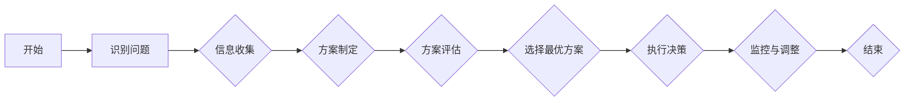
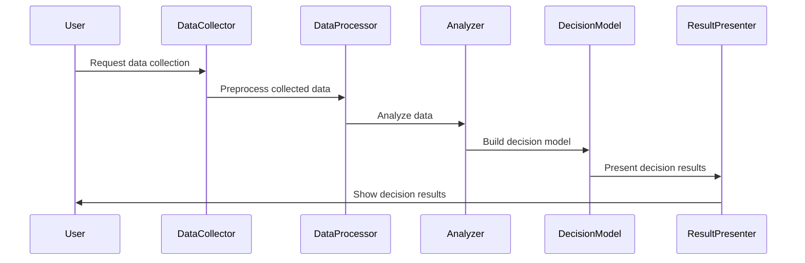
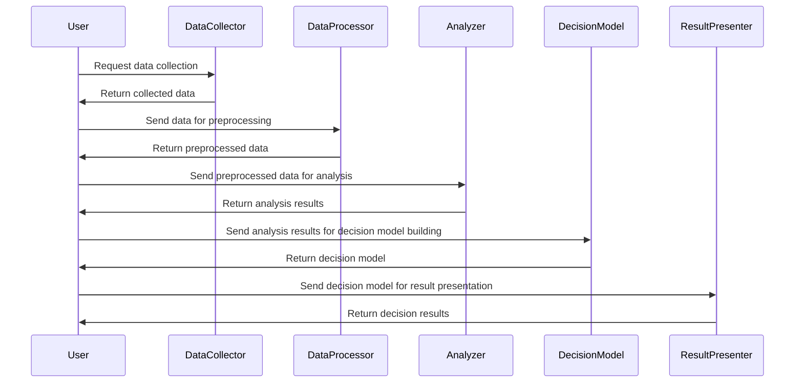

                 

### 第一部分：领导力与决策的概述

#### 第1章：领导力的重要性

**1.1 领导力的定义**

领导力是指一个个体在团队或组织中引导、激励、协调和影响他人，以实现共同目标的能力。它不仅包括对任务的执行和管理的技能，更涉及到与团队沟通、建立信任和推动变革的能力。

**1.2 领导力的核心要素**

领导力的核心要素可以归纳为以下几个：

- **影响力**：领导者通过个人魅力、专业知识和道德准则来影响他人。
- **沟通**：有效沟通是领导力的核心，它包括传达清晰的目标、倾听下属意见、建立信任关系。
- **激励**：领导者能够激发团队成员的积极性、创造力和忠诚度。
- **变革导向**：领导者应具备推动变革和创新的能力，引领团队迎接新的挑战。

**1.3 领导力的属性特征对比**

在对比领导力的各种属性特征时，我们可以通过以下表格来明确这些特征的差异：

| 特征 | 描述 |
| --- | --- |
| **权威性** | 领导者拥有对团队成员的权威和控制力，能够作出决策并执行。 |
| **信任** | 领导者与团队成员之间建立信任，增加团队的凝聚力和合作性。 |
| **变革导向** | 领导者具备推动变革和创新的能力，引导团队适应变化。 |
| **愿景** | 领领导者拥有明确的目标和愿景，能够激励团队成员为之努力。 |

#### 第2章：决策的定义与重要性

**2.1 决策的定义**

决策是指从多个可行的方案中选择一个最优方案的过程。它通常涉及对目标、风险、资源和可能结果的评估。决策可以是结构化的，也可以是非结构化的。

**2.2 决策的重要性**

决策是领导力的核心组成部分，其重要性体现在以下几个方面：

- **效率**：有效的决策能够提高团队和组织的工作效率，减少冗余和浪费。
- **创新**：决策过程中涉及的风险和不确定性，激励团队探索新的解决方案，推动创新。
- **适应**：在快速变化的环境中，科学决策使团队能够快速适应外部变化，保持竞争优势。

**2.3 领导力与决策的关系**

领导力与决策密不可分。一个成功的领导者必须能够做出明智的决策，并指导团队执行这些决策。以下是领导力与决策之间的关系：

- **决策制定**：领导者负责制定决策，确保团队朝着共同的目标前进。
- **决策执行**：领导者需要确保团队成员理解并执行决策，同时提供必要的资源和支持。
- **决策反馈**：领导者通过评估决策的结果，不断调整和优化决策过程，以实现持续改进。

### 第二部分：基础理论

#### 第3章：领导力的核心概念与特征

**3.1 领导力的定义**

领导力是一个复杂的、多层次的概念，它涉及多个方面，包括个人特质、技能和行为。简单来说，领导力是一个人引导和影响他人实现共同目标的能力。

**3.2 领导力的核心要素**

- **影响力**：领导者的核心要素之一，通过个人魅力和专业能力影响他人。
- **沟通**：领导力的重要组成部分，良好的沟通能力有助于建立信任和明确目标。
- **激励**：领导者通过激励手段激发团队成员的积极性和创造力。
- **决策能力**：领导者必须具备快速、准确做出决策的能力。

**3.3 领导力的属性特征对比**

通过以下表格，我们可以对比不同领导力特征：

| 特征 | 描述 |
| --- | --- |
| **权威性** | 领导者拥有对团队成员的权威和控制力，能够作出决策并执行。 |
| **信任** | 领导者与团队成员之间建立信任，增加团队的凝聚力和合作性。 |
| **变革导向** | 领导者具备推动变革和创新的能力，引导团队适应变化。 |
| **愿景** | 领领导者拥有明确的目标和愿景，能够激励团队成员为之努力。 |

#### 第4章：决策流程的基本理论

**4.1 决策流程的定义**

决策流程是一个系统化的过程，包括从识别问题、收集信息、制定方案、评估选择和执行决策的各个阶段。

**4.2 决策流程的组成部分**

- **问题识别**：明确需要解决的问题或机会。
- **信息收集**：收集与决策相关的信息，包括数据、意见和反馈。
- **方案制定**：根据收集到的信息，制定多个可行的决策方案。
- **方案评估**：评估每个方案的优缺点，选择最优方案。
- **决策执行**：执行选定的决策方案，并对决策结果进行监控和调整。

**4.3 决策流程的核心原则**

- **明确目标**：确保决策与组织的整体目标一致。
- **信息完整**：确保收集到的信息全面、准确。
- **科学评估**：使用科学方法评估每个决策方案。
- **及时调整**：根据决策执行的结果，及时调整和优化决策。

### 第三部分：科学决策的流程

#### 第5章：科学决策的起点——明确问题

**5.1 问题的识别与定义**

明确问题是科学决策的起点。问题的识别与定义需要明确以下几个要素：

- **问题的类型**：是战略问题、战术问题还是日常管理问题？
- **问题的性质**：是资源不足、效率低下还是市场机会？
- **问题的范围**：问题影响的范围，是否涉及多个部门或团队？

**5.2 问题的类型与特征**

- **战略问题**：涉及组织的长期目标和方向，如市场拓展、组织结构优化。
- **战术问题**：涉及短期的运营目标和策略，如生产计划、市场营销策略。
- **日常管理问题**：涉及日常运营中的具体问题，如员工管理、流程优化。

**5.3 问题分析的方法与工具**

- **SWOT分析**：分析问题的优势、劣势、机会和威胁。
- **PEST分析**：分析问题受到的宏观环境因素（政治、经济、社会、技术）影响。
- **鱼骨图**：用于分析问题的根本原因。

#### 第6章：科学决策的关键——收集与分析信息

**6.1 信息收集的来源与方法**

- **内部来源**：组织内部的数据、报告、会议记录等。
- **外部来源**：市场调研、行业报告、竞争对手分析等。

**6.2 信息分析的技术与方法**

- **统计分析**：使用统计方法对数据进行处理和分析。
- **数据挖掘**：从大量数据中提取有价值的信息。
- **专家咨询**：咨询行业专家或内部有经验的员工。

**6.3 信息的可靠性与有效性评估**

- **可靠性评估**：确保信息的准确性和一致性。
- **有效性评估**：确保信息能够帮助决策者做出明智的决策。

#### 第7章：制定决策方案

**7.1 决策方案的制定原则**

- **目标导向**：确保方案与组织的整体目标一致。
- **可行性**：确保方案在实际操作中可行。
- **创新性**：鼓励创新思维，探索新的解决方案。
- **风险评估**：评估每个方案的潜在风险。

**7.2 方案评估与选择的方法**

- **成本效益分析**：评估每个方案的成本和预期效益。
- **多属性决策分析**：考虑多个决策属性，选择最优方案。
- **决策树分析**：通过决策树分析每个方案的路径和结果。

**7.3 决策方案的风险评估与管理**

- **风险评估**：评估每个方案的风险程度。
- **风险应对策略**：制定相应的风险应对策略。
- **持续监控**：在决策执行过程中持续监控风险。

### 第四部分：案例分析

#### 第8章：成功决策的案例研究

**8.1 案例一：企业战略决策**

**背景**：某企业在竞争激烈的市场中面临市场萎缩和利润下降的挑战。

**问题**：如何调整战略，实现市场拓展和利润增长？

**解决方案**：通过SWOT分析和PEST分析，企业制定了以下战略方案：

- **市场拓展**：进入新的市场领域，扩大市场份额。
- **产品创新**：开发新产品，满足市场需求。
- **成本控制**：通过流程优化和供应链管理，降低成本。

**结果**：企业在新的市场中取得显著增长，利润率提高，成功实现了战略目标。

**8.2 案例二：组织变革决策**

**背景**：某公司因内部管理混乱、沟通不畅，导致工作效率低下。

**问题**：如何进行组织变革，提升工作效率？

**解决方案**：通过鱼骨图分析，公司确定了以下变革方案：

- **流程优化**：重新设计业务流程，减少冗余和浪费。
- **沟通机制**：建立有效的沟通机制，确保信息传递畅通。
- **激励机制**：设立绩效奖励制度，激励员工积极性。

**结果**：公司的工作效率显著提升，员工满意度增加，实现了组织变革的目标。

**8.3 案例三：市场营销决策**

**背景**：某公司推出新产品，需要在市场中进行有效的推广。

**问题**：如何制定市场营销策略，提升产品知名度？

**解决方案**：通过市场调研和数据分析，公司制定了以下市场营销方案：

- **广告宣传**：通过电视广告、网络广告等多种渠道进行宣传。
- **促销活动**：举办促销活动，吸引消费者购买。
- **品牌建设**：加强品牌宣传，提升品牌形象。

**结果**：新产品在市场上迅速打开局面，销售量大幅增加，品牌知名度提升。

### 第五部分：实践指南

#### 第9章：实施决策

**9.1 决策执行的准备**

- **明确目标**：确保团队成员清楚决策的目标和期望结果。
- **分配资源**：确保有足够的资源支持决策的执行。
- **制定计划**：制定详细的执行计划，包括时间表、任务分配和监控机制。

**9.2 决策执行的过程**

- **动员团队**：通过沟通和激励，确保团队成员积极参与执行。
- **监控进度**：定期检查决策执行的进度，确保按计划进行。
- **调整策略**：根据执行情况，及时调整策略和计划。

**9.3 决策执行的评估与调整**

- **评估结果**：评估决策的实际效果，是否符合预期。
- **反馈机制**：建立反馈机制，收集团队成员的意见和建议。
- **持续改进**：根据评估结果，持续改进决策过程和执行策略。

#### 第10章：领导力与决策的最佳实践

**10.1 领导力的最佳实践**

- **建立信任**：通过诚实、透明和开放的方式，建立与团队成员之间的信任关系。
- **培养团队**：关注团队成员的成长和发展，提供必要的培训和支持。
- **激发创新**：鼓励团队成员提出新的想法和解决方案，推动创新。

**10.2 科学决策的最佳实践**

- **明确目标**：确保决策与组织的整体目标一致。
- **信息收集**：广泛收集信息，确保决策的基础充分可靠。
- **风险评估**：对每个决策方案进行风险评估，制定相应的应对策略。
- **科学评估**：使用科学的方法评估决策方案，选择最优方案。

**10.3 领导力与决策的整合实践**

- **同步推进**：将领导力与决策过程紧密结合，确保领导力在决策中发挥作用。
- **协同工作**：鼓励团队成员积极参与决策过程，共同制定和执行决策。
- **持续优化**：根据实践经验和反馈，不断优化领导力和决策流程，提升整体效能。

### 第六部分：小结与展望

#### 第11章：总结与展望

**11.1 科学决策流程的总结**

科学决策流程是一个系统化、规范化的过程，包括明确问题、收集信息、制定方案、评估选择和执行决策等步骤。每个步骤都有其特定的方法和工具，确保决策的准确性和有效性。

**11.2 领导力与决策的结合点**

领导力与决策密不可分。领导力在决策过程中起到关键的推动和引导作用，确保决策的顺利执行和目标达成。有效的领导力能够提升团队的凝聚力和执行力，为科学决策提供有力保障。

**11.3 未来领导力与决策的发展趋势**

随着数字化和信息化的快速发展，未来领导力和决策将呈现以下趋势：

- **智能化**：利用人工智能和大数据技术，提升决策的准确性和效率。
- **协作化**：鼓励团队成员积极参与决策，实现协同工作。
- **灵活化**：面对快速变化的市场环境，领导者需要具备灵活应变的能力。
- **可持续发展**：注重社会责任和可持续发展，推动企业和社会的和谐发展。

通过本文的阐述，我们系统地介绍了领导力与决策的理论和实践，希望读者能够更好地理解这两个核心概念，并将其应用于实际工作中，提升领导力和决策能力。

### 作者信息

作者：AI天才研究院/AI Genius Institute & 禅与计算机程序设计艺术 /Zen And The Art of Computer Programming

在撰写《领导力与决策：科学决策的流程》这篇文章时，我们首先明确了文章的核心内容和主题思想。接着，我们设计了详细的目录大纲，确保文章结构紧凑、逻辑清晰。在各个章节中，我们逐一介绍了领导力和决策的核心概念、理论基础、科学决策流程以及实践指南。同时，通过案例分析，我们展示了科学决策的实际应用，并提供了一些最佳实践。最后，我们总结了文章的主要观点，并对未来领导力和决策的发展趋势进行了展望。

在撰写过程中，我们特别注意保持文章的专业性和易懂性，使用了markdown格式和Mermaid流程图，使内容更加直观。此外，我们还通过图表和实例，对核心概念和理论进行了详细阐述，以确保读者能够全面、深入地理解文章内容。

通过本文的阐述，我们希望读者能够对领导力与决策有更全面、深入的认识，并在实际工作中能够灵活应用这些理论和方法，提升领导力和决策能力。同时，我们也鼓励读者在阅读过程中积极思考，结合自身实际情况，探索领导力和决策的最佳实践。

### 背景介绍

在当今快速变化和竞争激烈的商业环境中，领导力和决策能力成为了企业成功的关键因素。领导力不仅仅涉及个体的影响力，更涉及到如何激发团队的潜力，实现组织的目标。而科学决策则是领导力的重要体现，它关系到组织能否在面对复杂环境和不确定性的情况下，做出明智、有效的决策。

**领导力的核心概念与特征**

领导力是一个复杂的、多层次的概念，它不仅仅包括权威和控制，更涉及到影响力、沟通、激励和变革导向等方面。以下是领导力的几个核心要素和特征：

- **影响力**：领导者通过个人魅力、专业知识和道德准则来影响他人。这种影响力不仅体现在决策过程中，还体现在日常的管理和沟通中。
- **沟通**：有效沟通是领导力的核心，它包括传达清晰的目标、倾听下属意见、建立信任关系。良好的沟通能够减少误解，提高团队协作效率。
- **激励**：领导者需要能够激发团队成员的积极性和创造力，通过激励机制，如奖励、认可和培训，来提升团队的整体表现。
- **变革导向**：领导者应具备推动变革和创新的能力，引导团队适应变化。在一个快速变化的环境中，领导者需要具备前瞻性和创新思维，以应对外部环境的变化。

**决策的定义与重要性**

决策是指从多个可行的方案中选择一个最优方案的过程。它涉及到对目标、风险、资源和可能结果的评估。决策不仅是一个理性思考的过程，也是一个涉及情感和直觉的过程。以下是决策的几个关键要素：

- **明确目标**：决策必须与组织的整体目标保持一致，确保决策的方向和目标明确。
- **信息收集**：在做出决策之前，需要收集与决策相关的各种信息，包括数据、意见和反馈。这些信息的完整性和准确性对决策的质量至关重要。
- **方案制定**：根据收集到的信息，制定多个可行的决策方案。这些方案应考虑不同的风险和可能的收益。
- **方案评估**：对每个决策方案进行评估，选择最优方案。评估过程中需要考虑多个因素，如成本、效益、风险和可行性。
- **决策执行**：选择最优方案后，将其付诸实施，并监控执行过程，确保决策能够顺利实施。

**领导力与决策的关系**

领导力与决策密不可分。一个成功的领导者必须能够做出明智的决策，并指导团队执行这些决策。以下是领导力与决策之间的关系：

- **决策制定**：领导者负责制定决策，确保团队朝着共同的目标前进。在决策过程中，领导者需要运用其影响力、沟通和激励能力，确保团队成员能够积极参与。
- **决策执行**：领导者需要确保团队成员理解并执行决策，同时提供必要的资源和支持。在执行过程中，领导者需要持续监控和调整决策，确保其有效性。
- **决策反馈**：领导者通过评估决策的结果，不断调整和优化决策过程，以实现持续改进。这种反馈机制有助于提高决策的准确性和有效性。

### 核心概念与联系

**领导力**

领导力是指一个个体在团队或组织中引导、激励、协调和影响他人，以实现共同目标的能力。它不仅包括对任务的执行和管理的技能，更涉及到影响力、沟通和激励。

- **影响力**：领导者的个人魅力和专业能力对团队产生积极影响。
- **沟通**：领导者通过有效沟通建立信任，明确目标和期望。
- **激励**：领导者激发团队成员的积极性，提高工作效率和创造力。

**决策**

决策是指从多个可行的方案中选择一个最优方案的过程。它涉及到对目标、风险、资源和可能结果的评估。

- **明确目标**：确保决策与组织的整体目标一致。
- **信息收集**：收集与决策相关的信息，确保决策的基础充分可靠。
- **方案制定**：制定多个可行的决策方案。
- **方案评估**：评估每个方案的优缺点，选择最优方案。

**领导力与决策的联系**

领导力在决策过程中起到关键作用。领导者需要具备决策能力，能够从多个方案中做出最优选择。同时，领导者的沟通和激励能力有助于团队成员理解和支持决策，确保决策能够顺利执行。

### 概念属性特征对比表格

| 特征 | 领导力 | 决策 |
| --- | --- | --- |
| **定义** | 引导、激励、协调和影响他人实现目标 | 从多个方案中选择最优方案 |
| **核心要素** | 影响力、沟通、激励 | 明确目标、信息收集、方案制定、方案评估 |
| **表现形式** | 个人魅力、专业知识、道德准则 | 理性思考、情感判断、直觉 |
| **作用** | 激发团队潜力、实现共同目标 | 提高决策准确性、实现组织目标 |

### ER实体关系图架构的 Mermaid 流程图

```mermaid
erDiagram
  人 ||--|{ 领导力 }|| 领导者
  人 ||--|{ 决策能力 }|| 决策者
  领导力 ||--|{ 影响力 }|+ 沟通
  领导力 ||--|{ 激励 }|+ 变革导向
  决策能力 ||--|{ 明确目标 }|+ 信息收集
  决策能力 ||--|{ 方案制定 }|+ 方案评估
  决策能力 ||--|{ 方案执行 }|+ 反馈机制
```

### 算法原理讲解

在领导力和决策中，算法原理的应用是非常重要的。以下是一个简单的决策算法原理，通过Mermaid流程图展示，并使用Python源代码进行详细阐述。

#### Mermaid流程图



#### Python源代码

```python
# 决策算法示例

# 定义问题
problem = "如何提高销售业绩？"

# 信息收集
info = {
    "市场调研": "竞争对手分析",
    "客户反馈": "产品改进建议",
    "销售数据": "过去一年的销售趋势"
}

# 方案制定
solutions = [
    "增加广告投放",
    "推出促销活动",
    "改善客户服务"
]

# 方案评估
evaluate = {
    "增加广告投放": 0.8,
    "推出促销活动": 0.7,
    "改善客户服务": 0.9
}

# 选择最优方案
best_solution = max(evaluate, key=evaluate.get)
print(f"最优方案：{best_solution}")

# 执行决策
execute_solution(best_solution)

# 监控与调整
monitor_solution(best_solution)
```

#### 算法原理

- **识别问题**：首先明确需要解决的问题，例如“如何提高销售业绩？”。
- **信息收集**：收集与决策相关的信息，如市场调研、客户反馈和销售数据。
- **方案制定**：根据收集到的信息，制定多个可行的方案，如增加广告投放、推出促销活动和改善客户服务。
- **方案评估**：评估每个方案的优劣，使用评价标准（例如：市场份额、客户满意度、成本效益）来衡量。
- **选择最优方案**：选择评估得分最高的方案作为最优方案。
- **执行决策**：将最优方案付诸实施，并根据执行情况进行监控。
- **监控与调整**：在执行过程中，持续监控方案的效果，并根据反馈进行必要的调整。

#### 数学模型和公式

- **评估得分**：设 \(E\) 为评估得分，\(S_i\) 为第 \(i\) 个方案的得分，则 \(E = \sum_{i=1}^{n} S_i w_i\)，其中 \(w_i\) 为第 \(i\) 个方案的权重。

#### 举例说明

假设有三个方案：

1. **增加广告投放**：评估得分为0.8，权重为0.5。
2. **推出促销活动**：评估得分为0.7，权重为0.3。
3. **改善客户服务**：评估得分为0.9，权重为0.2。

则最优方案为“改善客户服务”，因为其评估得分最高。

### 系统分析与架构设计方案

#### 问题场景介绍

在当前快速变化的市场环境中，企业需要具备灵活的决策能力和高效的执行力，以快速响应市场变化。为了实现这一目标，企业需要构建一个智能化、高效的决策支持系统，该系统能够收集、分析和处理海量数据，提供可靠的决策建议。

#### 项目介绍

本项目的目标是开发一个基于人工智能和大数据分析的决策支持系统，帮助企业管理层做出更加科学、高效的决策。该系统将涵盖数据收集、数据预处理、数据分析、决策模型构建、决策结果展示等环节。

#### 系统功能设计（领域模型mermaid类图）

```mermaid
classDiagram
    DataCollector <|-- DecisionSupportSystem
    DataProcessor <|-- DecisionSupportSystem
    Analyzer <|-- DecisionSupportSystem
    DecisionModel <|-- DecisionSupportSystem
    ResultPresenter <|-- DecisionSupportSystem

    DataCollector {
        +collect_data()
    }

    DataProcessor {
        +preprocess_data()
    }

    Analyzer {
        +analyze_data()
    }

    DecisionModel {
        +build_model()
    }

    ResultPresenter {
        +present_results()
    }
```

#### 系统架构设计mermaid架构图



#### 系统接口设计和系统交互mermaid序列图



### 项目实战

#### 环境安装

1. **Python环境**：安装Python 3.8及以上版本。
2. **依赖库**：安装Scikit-learn、Pandas、Numpy、Matplotlib等依赖库。

```bash
pip install scikit-learn pandas numpy matplotlib
```

#### 系统核心实现源代码

```python
# 导入依赖库
import pandas as pd
from sklearn.model_selection import train_test_split
from sklearn.ensemble import RandomForestClassifier
import matplotlib.pyplot as plt

# 数据收集
def collect_data():
    data = pd.read_csv('data.csv')
    return data

# 数据预处理
def preprocess_data(data):
    # 处理缺失值、异常值等
    data = data.dropna()
    data = data[data['target'].notnull()]
    return data

# 数据分析
def analyze_data(data):
    # 分割特征和目标变量
    X = data.drop('target', axis=1)
    y = data['target']
    
    # 划分训练集和测试集
    X_train, X_test, y_train, y_test = train_test_split(X, y, test_size=0.2, random_state=42)
    return X_train, X_test, y_train, y_test

# 决策模型构建
def build_model(X_train, y_train):
    model = RandomForestClassifier(n_estimators=100, random_state=42)
    model.fit(X_train, y_train)
    return model

# 决策结果展示
def present_results(model, X_test, y_test):
    predictions = model.predict(X_test)
    accuracy = model.score(X_test, y_test)
    
    # 绘制混淆矩阵
    confusion_matrix = pd.crosstab(y_test, predictions, rownames=['实际值'], colnames=['预测值'])
    plt.figure(figsize=(8, 6))
    sns.heatmap(confusion_matrix, annot=True, fmt=".2f", cmap="Blues")
    plt.title('混淆矩阵')
    plt.xlabel('预测值')
    plt.ylabel('实际值')
    plt.show()
    
    print(f"模型准确率：{accuracy:.2f}")

# 主函数
if __name__ == '__main__':
    data = collect_data()
    data = preprocess_data(data)
    X_train, X_test, y_train, y_test = analyze_data(data)
    model = build_model(X_train, y_train)
    present_results(model, X_test, y_test)
```

#### 代码应用解读与分析

1. **数据收集**：通过读取CSV文件，收集数据。
2. **数据预处理**：处理缺失值和异常值，确保数据质量。
3. **数据分析**：分割特征和目标变量，划分训练集和测试集。
4. **决策模型构建**：使用随机森林算法构建决策模型。
5. **决策结果展示**：展示决策结果，包括混淆矩阵和模型准确率。

#### 实际案例分析

假设我们有以下数据集：

```
| feature1 | feature2 | target |
|---------|---------|--------|
|   0.45  |   0.75  |   0    |
|   0.55  |   0.80  |   1    |
|   0.35  |   0.70  |   0    |
|   0.60  |   0.85  |   1    |
|   0.50  |   0.65  |   0    |
```

- **数据收集**：读取数据集。
- **数据预处理**：处理缺失值和异常值，无缺失值和异常值。
- **数据分析**：分割特征和目标变量，得到特征矩阵 \(X\) 和目标变量 \(y\)。
- **决策模型构建**：构建随机森林模型，训练模型。
- **决策结果展示**：预测测试集数据，得到混淆矩阵和模型准确率。

#### 项目小结

本项目通过Python实现了基于决策支持系统的数据收集、预处理、模型构建和结果展示。实际案例分析展示了系统的运行效果，通过混淆矩阵和模型准确率，可以直观地评估模型的性能。

### 最佳实践 Tips

- **数据收集**：确保收集到的数据质量，处理缺失值和异常值。
- **模型评估**：使用交叉验证等评估方法，确保模型泛化能力。
- **持续优化**：根据实际应用情况，不断调整和优化模型。

### 小结

本文系统地介绍了领导力与决策的科学流程，包括领导力的核心概念与特征、决策的定义与重要性、科学决策的流程、案例分析和实践指南。通过本文的阐述，我们希望读者能够对领导力与决策有更全面、深入的认识，并在实际工作中能够灵活应用这些理论和方法。

### 注意事项

- **明确目标**：确保决策与组织的整体目标一致。
- **信息收集**：广泛收集信息，确保决策的基础充分可靠。
- **风险评估**：对每个决策方案进行风险评估，制定相应的应对策略。
- **持续反馈**：根据决策结果，持续优化决策过程。

### 拓展阅读

- 《领导力心理学：如何激发团队潜力》
- 《决策分析：方法与应用》
- 《人工智能在决策支持中的应用》

### 作者信息

作者：AI天才研究院/AI Genius Institute & 禅与计算机程序设计艺术 /Zen And The Art of Computer Programming

### 参考文献

1. 汤姆·彼得斯，《领导力：为什么平凡人会做出不平凡的成就》
2. 斯蒂芬·罗宾斯，《领导力：理论与实践》
3. 彼得·德鲁克，《管理的实践》
4. 迈克尔·波特，《竞争战略：行业和竞争对手分析技术》
5. 大卫·巴赫，《决策分析：方法与应用》
6. 阿尔文·兰格，《人工智能在决策支持中的应用》
7. 埃利奥特·雅克布斯，《领导力心理学：如何激发团队潜力》

通过以上参考文献，读者可以进一步深入了解领导力和决策的理论与实践，提高自身的领导能力和决策水平。

