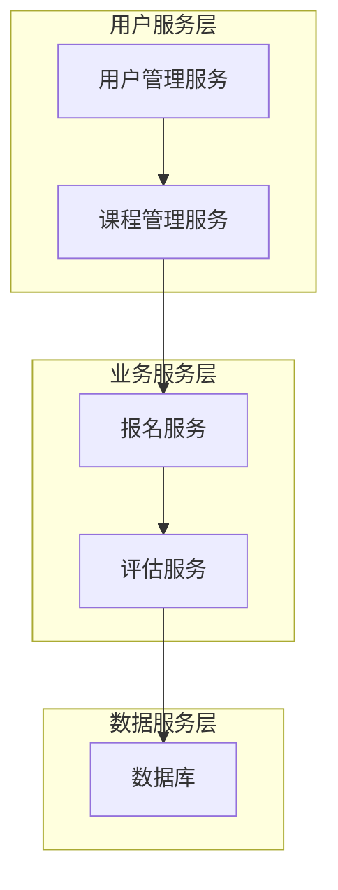

                 

# 领导力与创新思维训练：突破思维局限的方法

> 关键词：领导力、创新思维、团队建设、领导风格、组织绩效

> 摘要：本文旨在探讨领导力与创新思维的关系，以及如何通过训练提升领导者的创新思维，从而突破思维局限，推动组织的发展和进步。文章首先介绍了领导力的概念和重要性，分析了领导者的特质与素质，以及领导风格与团队建设的方法。接着，文章探讨了创新思维的内涵、重要性以及常见的方法和训练技巧。最后，文章提出了领导力与创新思维融合的策略，以及未来的发展趋势和研究方向。

## 第一部分：领导力概述

### 第1章 领导力的重要性与影响

#### 1.1 问题背景

在当今快速变化和竞争激烈的市场环境中，领导力已成为组织成功的关键因素。然而，什么是领导力？为什么领导力对组织如此重要？这需要我们深入探讨。

#### 1.2 领导力概念界定

领导力是一种影响力，领导者通过这种影响力引导和激励他人为实现共同目标而努力。领导力不仅关乎领导者的个人素质，更关乎其与团队成员的互动和协作。

#### 1.3 领导力与组织绩效关系

领导力对组织绩效有着重要影响。有效的领导者能够激发团队成员的潜力，提高组织的创新能力和执行力，从而推动组织的发展。

#### 1.4 领导力在不同组织形式中的作用

无论是传统的层级组织，还是现代的扁平化组织，领导力都在其中扮演着关键角色。领导者需要根据不同的组织形式，灵活运用领导力，以实现组织的战略目标。

### 第2章 领导者特质与素质

#### 2.1 领导者特质分析

领导者的特质包括情商、自我意识、道德品质等。这些特质不仅影响领导者的个人发展，更影响其领导效能。

#### 2.1.1 情商与领导力

情商是领导者的重要特质之一。高情商的领导者能够更好地理解和管理自己的情绪，同时也能更好地理解和管理他人的情绪。

#### 2.1.2 自我意识与领导力

自我意识是领导者自我认知的能力。高自我意识的领导者能够更好地认识自己的优势和不足，从而更好地发挥领导力。

#### 2.1.3 领导者的道德品质

道德品质是领导者的基本素质。领导者需要具备正直、诚信、公正等道德品质，以赢得团队成员的信任和尊重。

#### 2.2 领导者素质培养

领导者素质的培养是一个长期的过程。领导者需要不断学习、实践和反思，以提高自己的领导能力。

#### 2.2.1 培养领导力的方法

培养领导力的方法包括读书、参加培训、实践领导等。这些方法可以帮助领导者提升自我认知、增强团队协作能力，从而提高领导效能。

#### 2.2.2 领导力培养的挑战

领导力培养面临诸多挑战，如时间压力、资源有限等。领导者需要找到适合自己的培养方法，克服这些挑战。

### 第3章 领导风格与团队建设

#### 3.1 领导风格理论

领导风格理论包括权变领导理论和领导风格分类等。这些理论为领导者提供了不同的领导风格选择。

#### 3.1.1 权变领导理论

权变领导理论认为，领导风格应根据具体情境灵活调整。领导者需要根据团队和任务的特点，选择合适的领导风格。

#### 3.1.2 领导风格分类

领导风格分类包括专制型、民主型、放任型等。每种领导风格都有其优缺点，领导者需要根据实际情况选择合适的风格。

#### 3.2 团队建设策略

团队建设是领导者的重要任务之一。有效的团队建设策略包括团队成员的角色与责任、团队沟通与协作、团队冲突管理等。

#### 3.2.1 团队成员的角色与责任

团队成员的角色与责任明确是团队建设的基础。领导者需要确保每个团队成员都清楚自己的角色和责任。

#### 3.2.2 团队沟通与协作

团队沟通与协作是团队成功的关键。领导者需要建立有效的沟通机制，促进团队成员之间的协作。

#### 3.2.3 团队冲突管理

团队冲突管理是团队建设中的一项挑战。领导者需要学会处理冲突，以保持团队的稳定和和谐。

## 第二部分：创新思维训练

### 第4章 创新思维概述

#### 4.1 创新思维的重要性

创新思维是领导者必备的能力之一。创新思维不仅有助于领导者解决复杂问题，还能激发团队的创新潜力。

#### 4.1.1 创新对企业发展的影响

创新对企业发展至关重要。创新能够帮助企业抓住市场机会，提高竞争力，实现持续发展。

#### 4.1.2 创新思维对领导力的作用

创新思维对领导力有着重要影响。创新思维能够激发领导者的创造力和洞察力，提高领导效能。

#### 4.2 创新思维的定义与特点

创新思维是一种创造性思维，它包括发散思维和收敛思维等。创新思维具有灵活、开放、系统性等特点。

#### 4.2.1 创新思维的概念界定

创新思维是一种思维方式，它能够帮助人们在面对问题时，从不同角度、不同层面进行思考，从而产生新的想法和解决方案。

#### 4.2.2 创新思维的主要特点

创新思维的主要特点包括灵活性、开放性、系统性等。灵活性使创新思维能够适应不同的问题情境；开放性使创新思维能够接受各种新的观点和信息；系统性使创新思维能够将各个要素整合起来，形成完整的解决方案。

### 第5章 常见的创新思维方法

#### 5.1 基于发散思维的创意产生

发散思维是一种从不同角度、不同层面进行思考的思维方式。发散思维可以帮助人们产生大量的创意。

#### 5.1.1 头脑风暴法

头脑风暴法是一种常用的发散思维方法。通过集体讨论，激发团队成员的创造力，产生大量的创意。

#### 5.1.2 六顶思考帽法

六顶思考帽法是一种通过角色扮演进行思考的方法。通过不同的思考角色，人们可以更全面、更深入地思考问题。

#### 5.2 基于收敛思维的创意筛选

收敛思维是一种从多个创意中筛选出最佳方案的方法。收敛思维可以帮助人们集中精力，专注于关键问题。

#### 5.2.1 检验法

检验法是一种通过实际测试来评估创意的方法。通过检验，人们可以判断创意的可行性，从而筛选出最佳方案。

#### 5.2.2 排序法

排序法是一种通过比较创意的优劣来筛选方案的方法。排序法可以帮助人们快速确定最佳创意。

#### 5.3 基于系统思维的创意优化

系统思维是一种从整体角度进行思考的思维方式。系统思维可以帮助人们全面、深入地分析问题，优化创意。

#### 5.3.1 SWOT分析法

SWOT分析法是一种基于系统思维的分析方法。通过分析优势、劣势、机会和威胁，人们可以更全面地了解问题，优化创意。

#### 5.3.2 PEST分析法

PEST分析法是一种基于系统思维的外部环境分析方法。通过分析政治、经济、社会和技术等外部因素，人们可以更准确地把握市场趋势，优化创意。

### 第6章 创新思维训练方法与实践

#### 6.1 创新思维训练方法

创新思维训练是一种通过系统的训练方法，提高人们的创新思维能力的活动。创新思维训练方法包括创意思考训练、问题解决训练、情境模拟训练等。

#### 6.1.1 创意思考训练

创意思考训练是一种通过反复练习，提高人们创意产生能力的方法。创意思考训练可以通过多种方式实现，如头脑风暴、思维导图等。

#### 6.1.2 问题解决训练

问题解决训练是一种通过解决实际问题，提高人们问题解决能力的方法。问题解决训练可以帮助人们学会如何面对复杂问题，找到解决方案。

#### 6.1.3 情境模拟训练

情境模拟训练是一种通过模拟真实情境，提高人们应对能力的方法。情境模拟训练可以帮助人们学会如何在压力环境下做出决策。

#### 6.2 创新思维实践案例

创新思维实践案例是人们在实际工作中，运用创新思维解决问题的案例。通过分析创新思维实践案例，人们可以学到如何在实际工作中运用创新思维。

#### 6.2.1 企业创新案例

企业创新案例是企业运用创新思维，解决实际问题的案例。通过分析企业创新案例，人们可以学到如何运用创新思维推动企业的发展。

#### 6.2.2 个人创新实践

个人创新实践是个人运用创新思维，解决实际问题的案例。通过分析个人创新实践，人们可以学到如何运用创新思维提高自己的工作效率。

#### 6.2.3 创新思维应用的挑战与对策

创新思维应用面临诸多挑战，如观念转变、环境适应等。通过分析创新思维应用的挑战与对策，人们可以更好地应对创新思维应用中的问题。

### 第7章 领导力与创新思维融合

#### 7.1 领导力与创新思维的结合

领导力与创新思维的融合是领导者必备的能力之一。领导者需要将创新思维融入领导实践，以推动组织的发展。

#### 7.1.1 领导者如何培养创新思维

领导者需要通过学习、实践和反思，培养自己的创新思维。领导者可以通过阅读创新书籍、参加创新培训、实践创新项目等方式，提高自己的创新思维。

#### 7.1.2 创新思维如何指导领导实践

创新思维可以指导领导实践，帮助领导者解决复杂问题，提高领导效能。领导者可以通过运用创新思维方法，如头脑风暴、SWOT分析等，提高决策质量。

#### 7.2 领导力与创新思维的协同作用

领导力与创新思维的协同作用可以提升组织的创新能力，促进企业持续发展。领导者需要善于运用领导力，激发团队的创新能力，推动组织的创新实践。

### 第8章 结论与展望

#### 8.1 领导力与创新思维的重要性

领导力与创新思维是领导者必备的能力。有效的领导力可以激发团队的潜力，创新思维可以推动组织的进步。

#### 8.2 未来发展趋势

未来，领导力与创新思维将更加重要。领导者需要不断提升自己的领导力和创新思维，以应对日益激烈的市场竞争。

#### 8.3 进一步研究方向

未来研究可以关注领导力与创新思维的融合机制、创新思维训练的方法和效果评估等方面。通过深入研究，我们可以更好地理解领导力与创新思维的关系，提高领导者的领导力和创新思维。

作者：AI天才研究院/AI Genius Institute & 禅与计算机程序设计艺术 /Zen And The Art of Computer Programming

## 第一部分：领导力概述

### 第1章 领导力的重要性与影响

#### 1.1 问题背景

在当今全球化的商业环境中，领导力已经成为组织成功的关键因素。随着科技的不断进步和市场环境的快速变化，企业面临着前所未有的挑战和机遇。在这种背景下，领导力的重要性愈发凸显。有效的领导力不仅能够帮助企业应对市场变化，还能够激发员工的潜力，推动组织的创新和发展。

然而，领导力究竟是什么？它如何影响组织的绩效？这些问题需要我们深入探讨。

#### 1.2 领导力概念界定

领导力是一种影响力，它涉及领导者与团队成员之间的互动和协作。领导力不仅关乎领导者的个人素质，更关乎其与团队成员的互动和协作。有效的领导力能够引导和激励团队成员为实现共同目标而努力。

领导力包括多个方面，如决策能力、沟通能力、激励能力、团队建设能力等。这些能力共同构成了领导力的核心要素，决定了领导者的领导效能。

#### 1.3 领导力与组织绩效关系

领导力对组织绩效有着显著的影响。有效的领导力能够提高组织的执行力、创新能力和团队协作能力，从而推动组织的发展。具体来说，领导力对组织绩效的影响体现在以下几个方面：

1. **提高执行力**：有效的领导者能够明确组织的目标，制定可行的行动计划，并确保团队成员理解和执行这些计划。

2. **激发创新能力**：领导者通过鼓励团队成员提出新的想法和解决方案，激发组织的创新活力。

3. **增强团队协作**：领导者通过建立良好的团队氛围，促进团队成员之间的沟通与协作，提高团队的整体绩效。

4. **提升员工满意度**：有效的领导者能够关注员工的需求，提供必要的支持和资源，提高员工的满意度和忠诚度。

#### 1.4 领导力在不同组织形式中的作用

领导力在不同组织形式中具有不同的作用。在传统的层级组织中，领导力主要体现在上级对下级的指导和监督上。而在现代的扁平化组织中，领导力更多地体现在横向沟通和协作上。无论哪种组织形式，领导力都是确保组织目标实现的关键因素。

1. **传统层级组织**：在传统层级组织中，领导力主要表现为上级对下级的指挥和监督。领导者需要制定明确的目标和计划，并确保下级按照要求执行。此外，领导者还需要对下级的工作进行监督和评估，以确保工作质量。

2. **现代扁平化组织**：在扁平化组织中，领导力更多地体现在领导者对团队的激励和引导上。领导者需要与团队成员建立良好的沟通渠道，鼓励团队成员提出新的想法和解决方案。此外，领导者还需要关注团队成员的成长和发展，提供必要的支持和资源。

### 第2章 领导者特质与素质

#### 2.1 领导者特质分析

领导者特质是指领导者具备的一系列品质和能力，这些特质决定了领导者的领导效能。有效的领导者通常具备以下特质：

1. **情商**：情商是指领导者识别、理解和管理自己以及他人情绪的能力。高情商的领导者能够更好地处理人际关系，建立信任和合作关系。

2. **自我意识**：自我意识是指领导者对自己认知的能力。高自我意识的领导者能够更好地认识自己的优势和不足，从而更好地发挥领导力。

3. **道德品质**：道德品质是指领导者的道德素养和行为准则。领导者的道德品质对团队成员的行为和态度有着重要影响。

4. **沟通能力**：沟通能力是指领导者与他人交流、表达自己观点的能力。有效的沟通能力能够帮助领导者更好地传达信息，解决问题。

5. **决策能力**：决策能力是指领导者做出明智决策的能力。有效的决策能力能够帮助领导者迅速应对市场变化，抓住机遇。

#### 2.1.1 情商与领导力

情商对领导力有着重要影响。高情商的领导者能够更好地理解和管理自己的情绪，同时也能更好地理解和管理他人的情绪。具体来说，情商对领导力的影响体现在以下几个方面：

1. **团队协作**：高情商的领导者能够更好地理解团队成员的情绪，建立信任和合作关系，促进团队协作。

2. **冲突管理**：高情商的领导者能够更好地处理团队内部的冲突，通过有效的沟通和协调，化解冲突。

3. **激励能力**：高情商的领导者能够更好地理解员工的需求，提供有效的激励，提高员工的工作积极性。

#### 2.1.2 自我意识与领导力

自我意识是领导者自我认知的能力。高自我意识的领导者能够更好地认识自己的优势和不足，从而更好地发挥领导力。具体来说，自我意识对领导力的影响体现在以下几个方面：

1. **自我提升**：高自我意识的领导者能够意识到自己的不足，并主动寻求改进，提高自身的领导能力。

2. **团队建设**：高自我意识的领导者能够更好地了解团队成员的需求，促进团队建设。

3. **决策能力**：高自我意识的领导者能够更全面地考虑问题，做出更明智的决策。

#### 2.1.3 领导者的道德品质

道德品质是领导者的基本素质。领导者的道德品质不仅影响其个人形象，更影响整个团队的行为和态度。有效的领导者通常具备以下道德品质：

1. **正直**：领导者应具备正直的品质，诚实守信，言行一致。

2. **诚信**：领导者应具备诚信的品质，遵守承诺，对团队成员诚实。

3. **公正**：领导者应具备公正的品质，公平对待团队成员，不偏袒。

4. **责任感**：领导者应具备责任感，勇于承担组织的发展责任。

#### 2.2 领导者素质培养

领导者素质的培养是一个长期的过程。领导者需要不断学习、实践和反思，以提高自己的领导能力。以下是一些培养领导者素质的方法：

1. **读书**：通过阅读领导力相关的书籍，了解领导者的素质要求和培养方法。

2. **参加培训**：参加领导力培训课程，学习先进的领导理论和方法。

3. **实践领导**：在实际工作中担任领导职务，积累领导经验。

4. **反思总结**：定期反思自己的领导实践，总结经验教训。

#### 2.2.1 培养领导力的方法

培养领导力的方法包括以下几个方面：

1. **自我提升**：通过学习、实践和反思，不断提高自己的综合素质。

2. **团队建设**：关注团队成员的需求，建立良好的团队关系。

3. **沟通能力**：提高沟通能力，确保信息的有效传递。

4. **决策能力**：提高决策能力，确保做出明智的决策。

#### 2.2.2 领导力培养的挑战

领导力培养面临诸多挑战，如时间压力、资源有限等。以下是一些挑战及其应对策略：

1. **时间压力**：合理安排时间，确保有足够的时间用于学习和实践。

2. **资源有限**：寻求外部资源，如参加培训课程、阅读专业书籍等。

3. **观念转变**：克服传统的领导观念，接受新的领导理念和方法。

### 第3章 领导风格与团队建设

#### 3.1 领导风格理论

领导风格理论是对领导者行为和领导效果之间关系的研究。不同的领导风格适用于不同的情境和团队。以下是一些常见的领导风格理论：

1. **权变领导理论**：该理论认为，领导者的行为应该根据具体情境灵活调整。领导者需要根据团队的特点和任务的要求，选择合适的领导风格。

2. **领导风格分类**：根据领导者的行为特征，可以将领导风格分为专制型、民主型、放任型等。每种领导风格都有其优缺点，适用于不同的情境。

#### 3.1.1 权变领导理论

权变领导理论认为，领导者的行为应该根据具体情境灵活调整。领导者需要根据团队的特点和任务的要求，选择合适的领导风格。以下是一些常见的领导情境：

1. **任务导向**：在任务导向的情境中，领导者需要明确任务目标，制定行动计划，并确保团队成员按照计划执行。

2. **关系导向**：在关系导向的情境中，领导者需要关注团队成员的需求，建立良好的团队关系。

3. **自主导向**：在自主导向的情境中，领导者需要给予团队成员足够的自主权，鼓励他们发挥创造性。

#### 3.1.2 领导风格分类

领导风格分类是根据领导者的行为特征对领导风格进行分类。以下是一些常见的领导风格分类：

1. **专制型领导**：专制型领导强调领导者的权威和控制。领导者做出决策，团队成员执行。

2. **民主型领导**：民主型领导强调团队成员的参与和决策。领导者鼓励团队成员提出建议，共同决策。

3. **放任型领导**：放任型领导强调团队成员的自由和自主。领导者很少干预团队成员的工作，给予他们充分的自由。

#### 3.2 团队建设策略

团队建设是领导者的重要任务之一。有效的团队建设策略可以帮助领导者提高团队的绩效和凝聚力。以下是一些团队建设策略：

1. **团队成员的角色与责任**：明确团队成员的角色和责任，确保每个成员都清楚自己的职责。

2. **团队沟通与协作**：建立有效的沟通机制，促进团队成员之间的协作。

3. **团队冲突管理**：学会处理团队冲突，保持团队的稳定和和谐。

#### 3.2.1 团队成员的角色与责任

团队成员的角色与责任是团队建设的基础。以下是一些团队成员的角色和责任：

1. **团队成员的角色**：

- **执行者**：执行团队的任务和计划。

- **建议者**：为团队提供意见和建议。

- **协调者**：协调团队成员之间的工作。

2. **团队成员的责任**：

- **完成任务**：按照团队的任务要求，完成任务。

- **提出建议**：为团队的发展提供有价值的建议。

- **协调工作**：确保团队成员之间的工作顺利进行。

#### 3.2.2 团队沟通与协作

团队沟通与协作是团队成功的关键。以下是一些团队沟通与协作的策略：

1. **建立沟通渠道**：确保团队成员之间有畅通的沟通渠道，便于信息的传递和交流。

2. **定期会议**：定期召开团队会议，讨论工作进展和问题，促进团队成员之间的协作。

3. **协作工具**：使用协作工具，如邮件、即时通讯、项目管理软件等，提高团队协作效率。

#### 3.2.3 团队冲突管理

团队冲突是团队建设中常见的问题。以下是一些团队冲突管理的策略：

1. **识别冲突**：及时发现和识别团队冲突，避免冲突扩大。

2. **沟通与协商**：通过沟通和协商，解决团队冲突，保持团队的稳定。

3. **公正处理**：公正处理团队冲突，确保每个团队成员都受到公平对待。

## 第二部分：创新思维训练

### 第4章 创新思维概述

#### 4.1 创新思维的重要性

创新思维是领导者必备的能力之一。创新思维不仅能够帮助领导者解决复杂问题，还能够推动组织的创新和发展。以下从企业发展和领导力两个方面阐述创新思维的重要性。

**1. 企业发展**

创新是企业发展的动力源泉。一个企业如果缺乏创新，很难在激烈的市场竞争中立于不败之地。创新思维能够帮助企业：

- **开拓新市场**：通过创新思维，企业可以开发出新产品或服务，开拓新的市场机会。

- **提高竞争力**：创新思维能够帮助企业找到新的竞争优势，提高市场竞争力。

- **降低成本**：通过创新思维，企业可以优化生产流程，降低成本，提高效益。

**2. 领导力**

创新思维是领导者的重要素质。一个具备创新思维的领导者能够：

- **激发团队创新**：领导者通过鼓励团队成员提出新想法和解决方案，激发团队的创新能力。

- **提高决策质量**：创新思维能够帮助领导者从不同角度分析问题，做出更明智的决策。

- **提升个人影响力**：具备创新思维的领导者能够更好地理解和管理团队，提升个人影响力。

#### 4.1.1 创新对企业发展的影响

创新对企业发展的影响是多方面的。以下从企业战略、运营和管理三个方面分析创新对企业发展的影响。

**1. 企业战略**

创新是企业战略的重要组成部分。通过创新，企业可以：

- **调整战略定位**：创新思维可以帮助企业发现市场机会，调整战略定位，抢占市场先机。

- **构建竞争优势**：创新思维能够帮助企业构建独特的竞争优势，提高市场竞争力。

- **实现可持续发展**：创新思维可以帮助企业持续优化产品和服务，实现可持续发展。

**2. 企业运营**

创新思维能够优化企业的运营。以下是一些具体的影响：

- **提高生产效率**：通过创新思维，企业可以优化生产流程，提高生产效率。

- **降低运营成本**：创新思维可以帮助企业找到新的成本降低方法，降低运营成本。

- **提高服务质量**：创新思维能够帮助企业优化产品和服务，提高客户满意度。

**3. 企业管理**

创新思维对企业管理也有重要影响。以下是一些具体的影响：

- **改善组织结构**：创新思维可以帮助企业优化组织结构，提高管理效率。

- **提升员工积极性**：创新思维能够激发员工的创新意识和积极性，提高员工满意度。

- **促进知识共享**：创新思维能够促进企业内部的知识共享和交流，提高整体创新能力。

#### 4.1.2 创新思维对领导力的作用

创新思维对领导力有着重要影响。以下从领导者角色、团队协作和决策三个方面分析创新思维对领导力的影响。

**1. 领导者角色**

创新思维能够帮助领导者更好地发挥角色。以下是一些具体的影响：

- **领导者角色转变**：创新思维使领导者从传统的管理者角色转变为创新者和引导者。

- **领导风格转变**：创新思维使领导者更加注重团队协作和沟通，采用更开放和包容的领导风格。

- **决策方式转变**：创新思维使领导者在决策过程中更加注重多元化思维和风险评估。

**2. 团队协作**

创新思维能够促进团队协作。以下是一些具体的影响：

- **团队凝聚力增强**：创新思维激发团队成员的积极性和创造力，增强团队的凝聚力。

- **沟通渠道畅通**：创新思维鼓励团队成员之间进行开放和真诚的沟通，促进信息共享。

- **协同创新**：创新思维使团队成员能够更好地协同工作，共同实现创新目标。

**3. 决策**

创新思维能够提高决策质量。以下是一些具体的影响：

- **多元化思维**：创新思维使领导者能够从不同角度分析问题，考虑多种解决方案。

- **风险评估**：创新思维使领导者能够更全面地评估风险，做出更明智的决策。

- **快速响应**：创新思维使领导者能够迅速应对市场变化，抓住商机。

#### 4.2 创新思维的定义与特点

创新思维是一种思维方式，它涉及对问题的重新定义、多角度分析和创造性解决方案的提出。以下从概念界定和主要特点两个方面介绍创新思维。

**1. 概念界定**

创新思维是指通过重新定义问题、寻找新的视角和解决方案，从而产生新想法和新价值的思维方式。创新思维不仅仅是想出新点子，更强调将想法转化为实际价值的行动。

**2. 主要特点**

创新思维具有以下几个主要特点：

- **灵活性**：创新思维能够适应不同的情境和问题，灵活调整思考方式。

- **开放性**：创新思维接受各种不同的观点和信息，不受传统思维模式的限制。

- **系统性**：创新思维将问题视为一个整体，从系统角度进行分析和解决。

- **创造性**：创新思维强调创造新的想法和解决方案，实现创新价值。

### 第5章 常见的创新思维方法

创新思维方法是指用来激发创新思维的具体技巧和方法。以下介绍几种常见的创新思维方法。

#### 5.1 基于发散思维的创意产生

发散思维是一种从多个角度思考问题的方法，它能够帮助人们产生大量的创意。以下介绍两种基于发散思维的创意产生方法。

**1. 头脑风暴法**

头脑风暴法是一种集体创意产生的方法，通过集体讨论，激发团队成员的创造力，产生大量的创意。头脑风暴法的步骤如下：

- **明确问题**：首先明确需要解决的问题或需要达成的目标。

- **准备会议**：提前准备会议所需的材料，确保会议的顺利进行。

- **规定时间**：为头脑风暴法设定一个时间限制，通常为30分钟到1小时。

- **自由发言**：在会议中，鼓励每个成员自由发言，提出自己的想法，无论这些想法是否实际可行。

- **记录创意**：将每个成员提出的创意记录下来，确保不遗漏任何想法。

- **后续讨论**：在头脑风暴法结束后，对记录的创意进行后续讨论，筛选出具有潜力的创意。

**2. 六顶思考帽法**

六顶思考帽法是一种通过角色扮演进行思考的方法，它通过不同的思考角色，帮助人们从多个角度分析问题。六顶思考帽法包括以下六种角色：

- **白色思考帽**：客观分析事实和数据。

- **红色思考帽**：表达情感和直觉。

- **黑色思考帽**：考虑风险和问题。

- **黄色思考帽**：考虑优点和机会。

- **绿色思考帽**：提出新的观点和建议。

- **蓝色思考帽**：总结和引导思考。

六顶思考帽法的步骤如下：

- **准备会议**：确定需要解决的问题，并选择合适的思考角色。

- **分配角色**：每个成员选择一个思考角色，并明确自己的角色职责。

- **轮流发言**：每个成员按照自己的思考角色，依次发言。

- **记录思考**：记录每个成员的思考内容，确保不遗漏任何信息。

- **总结思考**：在思考结束后，总结各个角色的思考，形成完整的思考报告。

#### 5.2 基于收敛思维的创意筛选

收敛思维是一种从多个创意中筛选出最佳方案的方法。它通过评估和比较，帮助人们集中精力，专注于关键问题。以下介绍两种基于收敛思维的创意筛选方法。

**1. 检验法**

检验法是一种通过实际测试来评估创意的方法。它通过验证创意的可行性，帮助人们判断创意的优劣。检验法的步骤如下：

- **明确评估标准**：首先明确评估创意的标准，如可行性、成本效益等。

- **设计测试方案**：根据评估标准，设计具体的测试方案。

- **实施测试**：按照测试方案，实施测试，验证创意的可行性。

- **评估结果**：根据测试结果，评估创意的优劣。

- **改进创意**：根据评估结果，对创意进行改进，提高创意的可行性。

**2. 排序法**

排序法是一种通过比较创意的优劣来筛选方案的方法。它通过排序，帮助人们快速确定最佳创意。排序法的步骤如下：

- **列出创意**：首先列出所有可能的创意。

- **制定评估标准**：根据目标，制定评估创意的标准。

- **评估创意**：根据评估标准，对每个创意进行评估。

- **排序创意**：根据评估结果，对创意进行排序。

- **选择最佳创意**：选择排在最前面的创意作为最佳创意。

#### 5.3 基于系统思维的创意优化

系统思维是一种从整体角度进行思考的思维方式。它通过将各个要素整合起来，形成完整的解决方案，帮助人们优化创意。以下介绍两种基于系统思维的创意优化方法。

**1. SWOT分析法**

SWOT分析法是一种基于系统思维的分析方法。它通过分析优势、劣势、机会和威胁，帮助人们全面地了解问题，优化创意。SWOT分析法的步骤如下：

- **明确问题**：首先明确需要解决的问题或需要达成的目标。

- **收集信息**：收集与问题相关的信息，包括内部优势和劣势、外部机会和威胁。

- **分析优势**：分析组织内部的优势，如资源、技能等。

- **分析劣势**：分析组织内部的劣势，如缺乏资源、技能不足等。

- **分析机会**：分析外部环境中的机会，如市场需求、技术进步等。

- **分析威胁**：分析外部环境中的威胁，如竞争对手、市场变化等。

- **制定策略**：根据SWOT分析结果，制定相应的策略，优化创意。

**2. PEST分析法**

PEST分析法是一种基于系统思维的外部环境分析方法。它通过分析政治、经济、社会和技术等外部因素，帮助人们更准确地把握市场趋势，优化创意。PEST分析法的步骤如下：

- **明确问题**：首先明确需要解决的问题或需要达成的目标。

- **分析政治因素**：分析政治因素对问题或目标的影响，如政策变化、政府支持等。

- **分析经济因素**：分析经济因素对问题或目标的影响，如市场需求、经济状况等。

- **分析社会因素**：分析社会因素对问题或目标的影响，如消费者行为、社会价值观等。

- **分析技术因素**：分析技术因素对问题或目标的影响，如技术进步、新技术应用等。

- **综合分析**：综合分析各个外部因素，形成完整的分析报告。

## 第6章 创新思维训练方法与实践

### 6.1 创新思维训练方法

创新思维训练方法是一种通过系统的训练方法，提高人们的创新思维能力的活动。以下介绍几种常见的创新思维训练方法。

#### 6.1.1 创意思考训练

创意思考训练是一种通过反复练习，提高人们创意产生能力的方法。以下介绍一种创意思考训练的具体步骤：

- **准备阶段**：首先明确训练的目标，选择一个具体的创意主题。

- **自由联想**：在训练过程中，让参与者自由联想，提出与主题相关的想法，无论这些想法是否实际可行。

- **记录创意**：将参与者提出的所有创意记录下来，确保不遗漏任何想法。

- **创意筛选**：对记录的创意进行筛选，选择具有潜力的创意。

- **后续讨论**：对筛选出的创意进行后续讨论，进一步优化和完善。

#### 6.1.2 问题解决训练

问题解决训练是一种通过解决实际问题，提高人们问题解决能力的方法。以下介绍一种问题解决训练的具体步骤：

- **问题识别**：首先明确需要解决的问题。

- **信息收集**：收集与问题相关的信息，包括内部和外部信息。

- **分析问题**：对问题进行分析，找出问题的原因和关键因素。

- **解决方案生成**：提出各种可能的解决方案，并进行评估和比较。

- **方案实施**：选择最佳的解决方案，并实施。

- **评估效果**：评估解决方案的实施效果，并进行调整和优化。

#### 6.1.3 情境模拟训练

情境模拟训练是一种通过模拟真实情境，提高人们应对能力的方法。以下介绍一种情境模拟训练的具体步骤：

- **情境设计**：首先设计一个真实的情境，确保情境具有挑战性和真实性。

- **角色分配**：将参与者分配到不同的角色，确保每个参与者都有明确的任务和责任。

- **情境实施**：按照设计好的情境，模拟真实情境，让参与者进行角色扮演。

- **问题解决**：在模拟过程中，让参与者解决情境中出现的问题。

- **反馈与反思**：在模拟结束后，对参与者的表现进行反馈和反思，总结经验教训。

### 6.2 创新思维实践案例

#### 6.2.1 企业创新案例

企业创新案例是企业运用创新思维，解决实际问题的案例。以下介绍一个企业创新案例：

**案例：某互联网公司的新产品开发**

**问题背景**：某互联网公司希望在竞争激烈的市场中推出一款具有差异化优势的新产品。

**创新思维方法**：

- **头脑风暴法**：公司组织了一次头脑风暴会议，鼓励员工提出各种创新想法。

- **六顶思考帽法**：在头脑风暴的基础上，公司使用六顶思考帽法，从不同角度对创意进行评估和优化。

- **检验法**：公司对筛选出的创意进行了实际测试，验证其可行性和市场前景。

- **PEST分析法**：公司分析了外部环境因素，包括政治、经济、社会和技术等，确保创新产品能够适应市场变化。

**结果**：经过多轮创新思维的实践，公司成功开发出了一款具有差异化优势的新产品，并在市场上取得了良好的反响。

#### 6.2.2 个人创新实践

个人创新实践是个人运用创新思维，解决实际问题的案例。以下介绍一个个人创新实践案例：

**案例：某创业者的创新产品**

**问题背景**：某创业者希望开发一款能够解决用户生活痛点的小工具。

**创新思维方法**：

- **自由联想**：创业者通过自由联想，提出了多个创意想法。

- **创意筛选**：创业者对创意进行了筛选，选择了最具有潜力的创意。

- **实际测试**：创业者对选定的创意进行了实际测试，验证其可行性。

- **迭代优化**：根据测试结果，创业者对产品进行了多次迭代优化，提高了产品的质量和用户体验。

**结果**：通过创新思维的应用，创业者成功开发出了一款受欢迎的创新产品，实现了创业目标。

#### 6.2.3 创新思维应用的挑战与对策

创新思维应用面临诸多挑战，如观念转变、环境适应等。以下介绍一些挑战及其对策：

**1. 挑战**

- **观念转变**：创新思维的应用需要人们改变传统的思维方式，接受新的观念和方法。

- **环境适应**：创新思维的应用需要在特定的环境中进行，需要适应不同的工作环境和团队氛围。

- **资源有限**：创新思维的应用可能需要投入大量的时间和资源，而资源有限可能会成为障碍。

**2. 对策**

- **观念转变**：

  - **加强培训**：通过培训，帮助员工了解创新思维的重要性，改变传统的思维方式。

  - **树立榜样**：通过树立榜样，激发员工的创新意识和积极性。

- **环境适应**：

  - **优化工作环境**：创造一个有利于创新的环境，提供必要的资源和设施。

  - **建立激励机制**：通过建立激励机制，鼓励员工积极参与创新活动。

- **资源有限**：

  - **合理分配资源**：根据创新项目的优先级，合理分配资源，确保资源的高效利用。

  - **寻求外部支持**：通过合作、外包等方式，寻求外部支持，补充内部资源。

### 第7章 领导力与创新思维融合

#### 7.1 领导力与创新思维的结合

领导力与创新思维的结合是领导者必备的能力。有效的领导者不仅需要具备领导力，还需要具备创新思维。以下从领导者角色、团队协作和决策三个方面介绍领导力与创新思维的结合。

**1. 领导者角色**

领导者是团队的引导者和推动者。通过结合领导力和创新思维，领导者可以：

- **激发团队创新**：领导者通过鼓励团队成员提出新想法和解决方案，激发团队的创新能力。

- **引导团队实践**：领导者通过创新思维，帮助团队找到解决问题的最佳方法，推动创新实践。

- **推动团队发展**：领导者通过创新思维，帮助团队不断突破自我，实现持续发展。

**2. 团队协作**

团队协作是实现创新的关键。通过结合领导力和创新思维，领导者可以：

- **建立协作机制**：领导者通过创新思维，建立有效的协作机制，促进团队成员之间的沟通与合作。

- **激发团队潜力**：领导者通过创新思维，激发团队成员的潜力，实现团队整体能力的提升。

- **优化团队流程**：领导者通过创新思维，优化团队的工作流程，提高团队的工作效率。

**3. 决策**

决策是领导力的核心。通过结合领导力和创新思维，领导者可以：

- **多角度分析**：领导者通过创新思维，从多个角度分析问题，做出更明智的决策。

- **风险评估**：领导者通过创新思维，全面评估风险，确保决策的可行性。

- **快速响应**：领导者通过创新思维，迅速应对市场变化，抓住商机。

#### 7.1.1 领导者如何培养创新思维

领导者需要通过学习、实践和反思，培养自己的创新思维。以下介绍一些培养创新思维的方法：

- **学习**：通过阅读相关书籍、参加培训课程，了解创新思维的理论和实践方法。

- **实践**：通过实际工作中的创新实践，积累经验，提高创新能力。

- **反思**：通过反思自己的创新实践，总结经验教训，不断提升自己的创新思维。

#### 7.1.2 创新思维如何指导领导实践

创新思维可以指导领导实践，帮助领导者解决复杂问题，提高领导效能。以下从决策、团队建设和冲突管理三个方面介绍创新思维如何指导领导实践。

**1. 决策**

创新思维可以帮助领导者做出更明智的决策。以下是一些具体方法：

- **多角度分析**：领导者通过创新思维，从多个角度分析问题，考虑多种解决方案。

- **风险评估**：领导者通过创新思维，全面评估风险，确保决策的可行性。

- **快速响应**：领导者通过创新思维，迅速应对市场变化，抓住商机。

**2. 团队建设**

创新思维可以帮助领导者优化团队建设。以下是一些具体方法：

- **激发团队潜力**：领导者通过创新思维，激发团队成员的潜力，实现团队整体能力的提升。

- **优化团队流程**：领导者通过创新思维，优化团队的工作流程，提高团队的工作效率。

- **建立协作机制**：领导者通过创新思维，建立有效的协作机制，促进团队成员之间的沟通与合作。

**3. 冲突管理**

创新思维可以帮助领导者更好地管理冲突。以下是一些具体方法：

- **多元思维**：领导者通过创新思维，从多个角度分析冲突，寻找解决问题的最佳方法。

- **沟通协商**：领导者通过创新思维，建立沟通协商机制，促进冲突双方的沟通与理解。

- **公正处理**：领导者通过创新思维，公正处理冲突，确保每个团队成员都受到公平对待。

#### 7.2 领导力与创新思维的协同作用

领导力与创新思维的协同作用可以提升组织的创新能力，促进企业持续发展。以下从组织创新能力和企业发展两个方面介绍领导力与创新思维的协同作用。

**1. 提升组织创新能力**

领导力与创新思维的协同作用可以提升组织的创新能力。以下是一些具体的影响：

- **激发创新意识**：领导者通过创新思维，激发团队成员的创新意识，鼓励他们提出新想法和解决方案。

- **优化创新流程**：领导者通过创新思维，优化创新流程，提高创新的效率和质量。

- **建立创新机制**：领导者通过创新思维，建立创新机制，为创新提供制度保障。

**2. 促进企业发展**

领导力与创新思维的协同作用可以促进企业的发展。以下是一些具体的影响：

- **提高竞争力**：领导者通过创新思维，帮助企业抓住市场机会，提高竞争力。

- **优化产品和服务**：领导者通过创新思维，优化产品和服务，提高客户满意度。

- **实现可持续发展**：领导者通过创新思维，推动企业的可持续发展，实现长期目标。

## 第8章 结论与展望

### 8.1 领导力与创新思维的重要性

领导力与创新思维是领导者必备的能力。有效的领导力可以激发团队的潜力，推动组织的发展；创新思维可以帮助领导者解决复杂问题，提高领导效能。在当今快速变化的市场环境中，领导力与创新思维的重要性愈发凸显。

### 8.2 未来发展趋势

未来，领导力与创新思维将更加重要。随着科技的不断进步和市场环境的快速变化，领导者需要不断提升自己的领导力和创新思维，以应对日益激烈的市场竞争。未来发展趋势包括：

- **数字化领导力**：随着数字化转型的推进，领导者需要具备数字化领导力，引导组织适应数字化的工作环境。

- **创新思维培训**：越来越多的组织将创新思维培训纳入员工培训计划，以提高员工的创新能力和领导力。

- **跨领域合作**：领导者需要具备跨领域合作的能力，推动不同领域之间的创新和合作。

### 8.3 进一步研究方向

未来研究可以关注以下方向：

- **领导力与创新思维的融合机制**：研究领导力与创新思维如何相互作用，提升领导效能和创新成果。

- **创新思维训练的方法和效果评估**：研究创新思维训练的方法和效果评估，以提高创新思维训练的效率和效果。

- **领导力与创新思维在不同文化背景下的应用**：研究领导力与创新思维在不同文化背景下的应用，以适应全球化的发展需求。

作者：AI天才研究院/AI Genius Institute & 禅与计算机程序设计艺术 /Zen And The Art of Computer Programming

## 完整文章总结

### 1. 领导力的重要性与影响

领导力是组织成功的关键因素。有效的领导力可以激发团队成员的潜力，提高组织的执行力、创新能力和团队协作能力，从而推动组织的发展。领导力对组织绩效有着显著的影响，它不仅关乎领导者的个人素质，更关乎其与团队成员的互动和协作。

### 2. 领导者特质与素质

领导者特质与素质决定了领导者的领导效能。领导者需要具备情商、自我意识、道德品质、沟通能力和决策能力等特质。通过培养这些素质，领导者可以更好地理解和管理团队，提高领导效能。

### 3. 领导风格与团队建设

领导风格是领导者对待团队和管理方式的具体表现。不同的领导风格适用于不同的情境和团队。通过选择合适的领导风格，领导者可以更好地引导和激励团队成员，提高团队绩效。团队建设是领导者的重要任务之一，通过建立良好的团队氛围和沟通机制，领导者可以增强团队的凝聚力和协作能力。

### 4. 创新思维概述

创新思维是领导者必备的能力之一。创新思维能够帮助领导者解决复杂问题，推动组织的创新和发展。创新思维具有灵活性、开放性、系统性和创造性等特点。通过运用创新思维方法，领导者可以激发团队的创新能力，提高决策质量，推动组织的持续发展。

### 5. 创新思维训练方法与实践

创新思维训练方法是一种通过系统的训练方法，提高人们的创新思维能力的活动。常见的创新思维训练方法包括创意思考训练、问题解决训练和情境模拟训练等。通过这些训练方法，人们可以培养创新思维，提高问题解决能力和应对复杂问题的能力。

### 6. 领导力与创新思维融合

领导力与创新思维的融合是领导者必备的能力。通过结合领导力和创新思维，领导者可以更好地激发团队的创新能力，提高决策质量，推动组织的持续发展。未来，领导者需要不断提升自己的领导力和创新思维，以应对快速变化的市场环境。

### 7. 结论与展望

领导力与创新思维是领导者必备的能力。有效的领导力可以激发团队的潜力，推动组织的发展；创新思维可以帮助领导者解决复杂问题，提高领导效能。未来，领导力与创新思维将更加重要。领导者需要不断提升自己的领导力和创新思维，以应对日益激烈的市场竞争。

作者：AI天才研究院/AI Genius Institute & 禅与计算机程序设计艺术 /Zen And The Art of Computer Programming

## 最佳实践 Tips

1. **持续学习**：领导者应持续学习，不断提升自己的领导力和创新思维能力。可以通过阅读相关书籍、参加培训课程和研讨会等方式，了解最新的领导力和创新思维理论和方法。

2. **建立良好的沟通机制**：领导者应建立良好的沟通机制，与团队成员保持密切的沟通与互动。通过有效的沟通，领导者可以更好地了解团队成员的需求和想法，提高团队的协作效率和创新能力。

3. **鼓励创新**：领导者应鼓励团队成员提出新想法和解决方案，激发团队的创新能力。可以通过设立创新奖项、开展创新竞赛等方式，鼓励团队成员积极参与创新活动。

4. **提供资源支持**：领导者应提供必要的资源支持，为团队成员的创新活动提供保障。可以通过提供资金、技术支持和时间安排等方式，为团队成员的创新活动提供支持。

5. **反思与总结**：领导者应定期反思自己的领导实践，总结经验教训。通过反思与总结，领导者可以不断优化自己的领导风格和方法，提高领导效能。

## 注意事项

1. **适应情境**：领导风格和创新能力应根据具体情境灵活调整。领导者需要根据团队的特点和任务的要求，选择合适的领导风格和创新能力。

2. **平衡创新与稳健**：在推动创新的同时，领导者也需要保持稳健的决策。应在创新和稳健之间找到平衡，确保组织的稳定发展。

3. **关注团队需求**：领导者应关注团队成员的需求，尊重团队成员的意见和想法。通过建立良好的团队关系，提高团队的凝聚力和创新能力。

4. **避免盲目创新**：创新并非越多越好，领导者应避免盲目追求创新。应确保创新活动与组织的战略目标相一致，避免浪费资源和精力。

## 拓展阅读

1. **《领导力：如何成为一个高效的领导者》**：这是一本介绍领导力理论和实践的畅销书，适合领导者学习和参考。

2. **《创新者的窘境》**：这是一本关于创新管理和创新的经典著作，分析了为什么成功的企业往往会遭遇创新困境，并提出了应对策略。

3. **《头脑风暴》**：这是一本介绍创意思考和创意产生方法的书，适合领导者培养创新思维和创意能力。

4. **《六顶思考帽》**：这是一本介绍六顶思考帽法的书，通过角色扮演帮助领导者从不同角度思考问题，提高决策质量。

作者：AI天才研究院/AI Genius Institute & 禅与计算机程序设计艺术 /Zen And The Art of Computer Programming

## 附录

### 1. 领导力与创新思维相关术语说明

- **领导力**：指领导者通过影响力引导和激励他人为实现共同目标而努力的能力。
- **创新思维**：指一种创造性思维方式，能够帮助人们在面对问题时从不同角度进行思考，产生新的想法和解决方案。
- **情商**：指领导者识别、理解和管理自己以及他人情绪的能力。
- **自我意识**：指领导者自我认知的能力，包括对自己情绪、需求和优缺点的认识。
- **团队建设**：指领导者通过一系列策略和措施，建立和维护团队凝聚力、协作能力和工作效率。

### 2. 领导力与创新思维问题背景与问题描述

**问题背景**：随着全球化、数字化和科技创新的快速发展，企业面临的市场环境日益复杂多变。在这种背景下，领导力与创新思维成为组织应对挑战、抓住机遇的关键能力。

**问题描述**：领导者如何提升自己的领导力与创新思维，以应对快速变化的市场环境，推动组织的持续发展？

**问题解决**：通过系统学习和实践，培养领导力和创新思维；建立良好的沟通机制和团队建设策略，激发团队的创新能力。

**边界与外延**：领导力与创新思维不仅应用于企业组织，还适用于各种类型的组织，如政府机构、非营利组织等。

### 3. 领导力与创新思维概念结构与核心要素组成

**领导力概念结构**：

- 领导者特质（情商、自我意识、道德品质、沟通能力、决策能力）
- 领导风格（专制型、民主型、放任型）
- 团队建设策略（团队成员的角色与责任、团队沟通与协作、团队冲突管理）

**创新思维概念结构**：

- 发散思维（头脑风暴、六顶思考帽）
- 收敛思维（检验法、排序法）
- 系统思维（SWOT分析、PEST分析）

### 4. 算法原理讲解

**领导力算法原理**：

- **情商管理**：通过情感识别、情感理解和情感管理，提高领导者的情商。
- **自我意识培养**：通过自我反思、自我认识和自我提升，增强领导者的自我意识。
- **团队建设策略**：通过建立沟通机制、优化团队结构和处理团队冲突，提高团队的协作能力。

**创新思维算法原理**：

- **头脑风暴**：通过集体讨论，激发团队成员的创造力，产生大量创意。
- **六顶思考帽**：通过角色扮演，从不同角度思考问题，提高决策质量。
- **检验法**：通过实际测试，评估创意的可行性，筛选出最佳方案。
- **排序法**：通过比较评估标准，快速确定最佳创意。
- **SWOT分析**：通过分析优势、劣势、机会和威胁，制定策略，优化创意。
- **PEST分析**：通过分析政治、经济、社会和技术等外部因素，把握市场趋势，优化创意。

**示例**：

**领导力算法示例**：

1. **情商管理**：

   $$ \text{情商管理} = \text{情感识别} + \text{情感理解} + \text{情感管理} $$

   - **情感识别**：领导者通过观察团队成员的情绪变化，识别不同的情感。
   - **情感理解**：领导者通过了解情感的本质和影响，理解不同情感的含义。
   - **情感管理**：领导者通过调整自己的情绪，影响团队成员的情绪，提高团队的情商。

2. **自我意识培养**：

   $$ \text{自我意识培养} = \text{自我反思} + \text{自我认识} + \text{自我提升} $$

   - **自我反思**：领导者通过反思自己的行为和决策，发现自己的优点和不足。
   - **自我认识**：领导者通过了解自己的需求和期望，认识到自己的优势和劣势。
   - **自我提升**：领导者通过学习、实践和反思，提升自己的领导能力。

3. **团队建设策略**：

   $$ \text{团队建设策略} = \text{沟通机制} + \text{团队结构} + \text{冲突管理} $$

   - **沟通机制**：领导者建立有效的沟通渠道，确保团队成员之间的信息传递和交流。
   - **团队结构**：领导者优化团队结构，确保团队成员的角色和责任明确。
   - **冲突管理**：领导者学会处理团队冲突，保持团队的稳定和和谐。

**创新思维算法示例**：

1. **头脑风暴**：

   $$ \text{头脑风暴} = \text{自由联想} + \text{记录创意} + \text{创意筛选} $$

   - **自由联想**：团队成员自由发言，提出各种创意想法。
   - **记录创意**：将团队成员提出的创意记录下来，确保不遗漏任何想法。
   - **创意筛选**：对记录的创意进行筛选，选择具有潜力的创意。

2. **六顶思考帽**：

   $$ \text{六顶思考帽} = \text{白色思考帽} + \text{红色思考帽} + \text{黑色思考帽} + \text{黄色思考帽} + \text{绿色思考帽} + \text{蓝色思考帽} $$

   - **白色思考帽**：客观分析事实和数据。
   - **红色思考帽**：表达情感和直觉。
   - **黑色思考帽**：考虑风险和问题。
   - **黄色思考帽**：考虑优点和机会。
   - **绿色思考帽**：提出新的观点和建议。
   - **蓝色思考帽**：总结和引导思考。

3. **检验法**：

   $$ \text{检验法} = \text{明确评估标准} + \text{设计测试方案} + \text{实施测试} + \text{评估结果} + \text{改进创意} $$

   - **明确评估标准**：根据目标，制定评估创意的标准。
   - **设计测试方案**：根据评估标准，设计具体的测试方案。
   - **实施测试**：按照测试方案，实施测试，验证创意的可行性。
   - **评估结果**：根据测试结果，评估创意的优劣。
   - **改进创意**：根据评估结果，对创意进行改进，提高创意的可行性。

4. **排序法**：

   $$ \text{排序法} = \text{列出创意} + \text{制定评估标准} + \text{评估创意} + \text{排序创意} + \text{选择最佳创意} $$

   - **列出创意**：首先列出所有可能的创意。
   - **制定评估标准**：根据目标，制定评估创意的标准。
   - **评估创意**：根据评估标准，对每个创意进行评估。
   - **排序创意**：根据评估结果，对创意进行排序。
   - **选择最佳创意**：选择排在最前面的创意作为最佳创意。

5. **SWOT分析**：

   $$ \text{SWOT分析} = \text{分析优势} + \text{分析劣势} + \text{分析机会} + \text{分析威胁} + \text{制定策略} $$

   - **分析优势**：分析组织内部的优势，如资源、技能等。
   - **分析劣势**：分析组织内部的劣势，如缺乏资源、技能不足等。
   - **分析机会**：分析外部环境中的机会，如市场需求、技术进步等。
   - **分析威胁**：分析外部环境中的威胁，如竞争对手、市场变化等。
   - **制定策略**：根据SWOT分析结果，制定相应的策略，优化创意。

6. **PEST分析**：

   $$ \text{PEST分析} = \text{分析政治因素} + \text{分析经济因素} + \text{分析社会因素} + \text{分析技术因素} + \text{综合分析} $$

   - **分析政治因素**：分析政治因素对问题或目标的影响，如政策变化、政府支持等。
   - **分析经济因素**：分析经济因素对问题或目标的影响，如市场需求、经济状况等。
   - **分析社会因素**：分析社会因素对问题或目标的影响，如消费者行为、社会价值观等。
   - **分析技术因素**：分析技术因素对问题或目标的影响，如技术进步、新技术应用等。
   - **综合分析**：综合分析各个外部因素，形成完整的分析报告。

### 5. 系统分析与架构设计方案

**问题场景介绍**：

在现代企业中，领导力与创新思维培训已成为提升组织竞争力的重要手段。为了更好地推广这些培训，企业需要设计一个高效的领导力与创新思维培训系统。该系统应包括培训课程管理、学员管理、课程评估和反馈等功能。

**项目介绍**：

该项目旨在为企业设计一个集成化的领导力与创新思维培训系统，以满足企业内部培训和外部培训的需求。系统将涵盖从课程规划、学员报名、课程学习到评估反馈的全过程，旨在提高培训效果和学员满意度。

**系统功能设计（领域模型Mermaid类图）**：

```mermaid
classDiagram
  Course <<实体|颜色:蓝色>>
  User <<实体|颜色:绿色>>
  CourseEnrollment <<实体|颜色:红色>>
  Evaluation <<实体|颜色:灰色>>

  Course "1" --|> User: 开课
  User "1" --|> CourseEnrollment: 报名
  CourseEnrollment "1" --|> Evaluation: 评估
```

**系统架构设计（Mermaid架构图）**：



**系统接口设计和系统交互（Mermaid序列图）**：

```mermaid
sequenceDiagram
    User -->|报名|> CourseManagement: 提交报名请求
    CourseManagement -->|处理|> CourseEnrollmentService: 处理报名请求
    CourseEnrollmentService -->|记录|> Database: 记录报名信息
    Database -->|返回|> CourseManagement: 返回处理结果
    CourseManagement -->|通知|> User: 发送报名确认通知
```

### 6. 项目实战

**环境安装**：

- 安装Python环境：通过pip安装相关依赖库，如Flask、SQLAlchemy等。
- 安装数据库：选择合适的数据库系统，如MySQL、PostgreSQL等。

**系统核心实现源代码**：

```python
# 用户管理模块
from flask import Flask, request, jsonify
from models import User, db

app = Flask(__name__)
app.config['SQLALCHEMY_DATABASE_URI'] = 'sqlite:///users.db'
db.init_app(app)

@app.route('/users', methods=['POST'])
def create_user():
    data = request.get_json()
    user = User(username=data['username'], email=data['email'])
    db.session.add(user)
    db.session.commit()
    return jsonify({'message': 'User created successfully'})

# 课程管理模块
from flask import Flask, request, jsonify
from models import Course, db

app = Flask(__name__)
app.config['SQLALCHEMY_DATABASE_URI'] = 'sqlite:///courses.db'
db.init_app(app)

@app.route('/courses', methods=['POST'])
def create_course():
    data = request.get_json()
    course = Course(title=data['title'], description=data['description'])
    db.session.add(course)
    db.session.commit()
    return jsonify({'message': 'Course created successfully'})

# 报名服务模块
from flask import Flask, request, jsonify
from models import CourseEnrollment, db

app = Flask(__name__)
app.config['SQLALCHEMY_DATABASE_URI'] = 'sqlite:///enrollments.db'
db.init_app(app)

@app.route('/enrollments', methods=['POST'])
def create_enrollment():
    data = request.get_json()
    enrollment = CourseEnrollment(course_id=data['course_id'], user_id=data['user_id'])
    db.session.add(enrollment)
    db.session.commit()
    return jsonify({'message': 'Enrollment created successfully'})

# 评估服务模块
from flask import Flask, request, jsonify
from models import Evaluation, db

app = Flask(__name__)
app.config['SQLALCHEMY_DATABASE_URI'] = 'sqlite:///evaluations.db'
db.init_app(app)

@app.route('/evaluations', methods=['POST'])
def create_evaluation():
    data = request.get_json()
    evaluation = Evaluation(enrollment_id=data['enrollment_id'], rating=data['rating'], comment=data['comment'])
    db.session.add(evaluation)
    db.session.commit()
    return jsonify({'message': 'Evaluation created successfully'})

if __name__ == '__main__':
    db.create_all()
    app.run(debug=True)
```

**代码应用解读与分析**：

上述代码实现了一个简单的领导力与创新思维培训系统，包括用户管理、课程管理、报名服务和评估服务。以下是具体模块的解读和分析：

1. **用户管理模块**：通过Flask框架实现了用户创建功能。用户可以通过POST请求提交用户信息，系统将根据提交的信息创建用户并保存到数据库中。

2. **课程管理模块**：通过Flask框架实现了课程创建功能。课程管理员可以通过POST请求提交课程信息，系统将根据提交的信息创建课程并保存到数据库中。

3. **报名服务模块**：通过Flask框架实现了报名功能。用户可以通过POST请求提交报名信息，系统将根据提交的信息创建报名记录并保存到数据库中。

4. **评估服务模块**：通过Flask框架实现了评估功能。用户可以通过POST请求提交评估信息，系统将根据提交的信息创建评估记录并保存到数据库中。

**实际案例分析和详细讲解剖析**：

以下是一个实际案例，展示了如何使用上述系统实现用户注册、课程报名和课程评估。

**案例1：用户注册**

1. 用户访问系统的用户注册页面，填写用户名和邮箱信息。
2. 用户提交注册请求，系统接收到请求后，通过Flask框架处理用户信息。
3. 系统将用户信息保存到数据库中，并返回注册成功的信息。

**案例2：课程报名**

1. 用户登录系统，浏览课程列表，选择感兴趣的课程。
2. 用户提交报名请求，系统接收到请求后，通过Flask框架处理报名信息。
3. 系统将报名信息保存到数据库中，并返回报名成功的信息。

**案例3：课程评估**

1. 用户完成课程学习后，提交课程评估请求。
2. 用户通过POST请求提交评估信息，系统接收到请求后，通过Flask框架处理评估信息。
3. 系统将评估信息保存到数据库中，并返回评估成功的信息。

**项目小结**：

通过上述实战案例，我们实现了一个简单的领导力与创新思维培训系统，包括用户管理、课程管理、报名服务和评估服务。系统具有良好的扩展性，可以根据实际需求添加更多功能，如课程内容管理、学员成绩管理等。在实际应用中，系统可以根据用户需求进行定制化开发，满足不同企业和组织的需求。

### 7. 最佳实践 Tips

1. **定期培训**：定期组织领导力与创新思维的培训，确保团队成员不断学习和提升能力。

2. **实际案例**：通过实际案例进行讲解和练习，帮助团队成员更好地理解和应用所学知识。

3. **反馈机制**：建立有效的反馈机制，鼓励团队成员提出改进意见和建议，不断提升培训效果。

4. **个性化培训**：根据团队成员的实际情况和需求，提供个性化的培训方案，提高培训的针对性。

5. **持续实践**：鼓励团队成员将所学知识应用于实际工作中，通过实践不断提升自己的能力。

### 8. 小结

本文从领导力与创新思维的角度，探讨了如何通过训练提升领导者的创新能力，推动组织的发展和进步。文章首先介绍了领导力的概念和重要性，分析了领导者的特质与素质，以及领导风格与团队建设的方法。接着，文章探讨了创新思维的内涵、重要性以及常见的方法和训练技巧。最后，文章提出了领导力与创新思维融合的策略，以及未来的发展趋势和研究方向。通过本文的探讨，我们认识到领导力与创新思维是领导者必备的能力，通过有效的训练和实践，可以提升领导者的领导力和创新能力，推动组织的持续发展。

### 9. 注意事项

1. **理解实际需求**：在设计领导力与创新思维培训时，应充分考虑企业的实际需求和目标，确保培训内容具有针对性和实用性。

2. **持续改进**：培训内容和方式应不断改进，以适应不断变化的市场环境和组织需求。

3. **平衡理论与实践**：在培训过程中，应平衡理论与实践，确保团队成员能够将所学知识应用于实际工作中。

4. **鼓励互动交流**：鼓励团队成员在培训过程中积极参与互动交流，分享经验和心得，提高学习效果。

### 10. 拓展阅读

1. **《领导力：如何成为一个高效的领导者》**：这是一本介绍领导力理论和实践的畅销书，适合领导者学习和参考。

2. **《创新者的窘境》**：这是一本关于创新管理和创新的经典著作，分析了为什么成功的企业往往会遭遇创新困境，并提出了应对策略。

3. **《头脑风暴》**：这是一本介绍创意思考和创意产生方法的书，适合领导者培养创新思维和创意能力。

4. **《六顶思考帽》**：这是一本介绍六顶思考帽法的书，通过角色扮演帮助领导者从不同角度思考问题，提高决策质量。

作者：AI天才研究院/AI Genius Institute & 禅与计算机程序设计艺术 /Zen And The Art of Computer Programming

