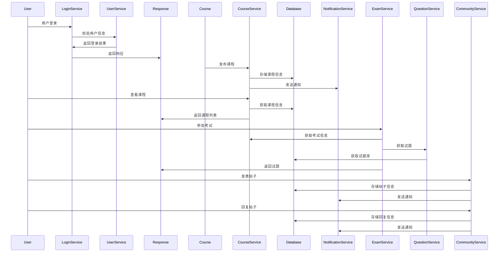
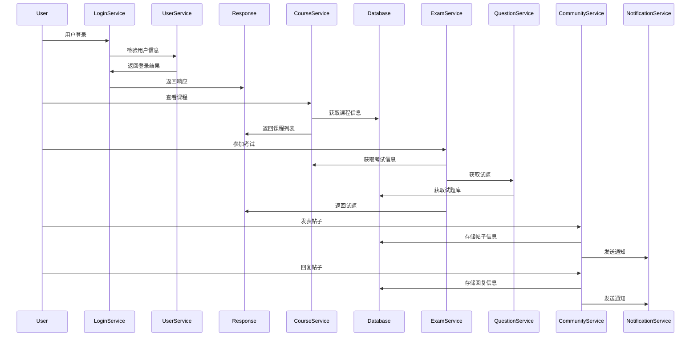

                 


# 领导力与创新思维：引领变革与创新

关键词：领导力、创新思维、变革、组织、实践案例

摘要：本文深入探讨了领导力与创新思维的关系，以及如何通过领导力推动组织内的变革与创新。文章首先阐述了领导力与创新思维的核心概念，随后通过一系列的案例分析，提供了实用的方法和策略。本文旨在帮助领导者理解如何激发团队的创造力，引领变革，实现组织的可持续发展。

## 目录

## 引言

领导力和创新思维是推动组织变革和发展的关键因素。在当今快速变化的市场环境中，组织需要具备高度的灵活性和创新能力才能在激烈的竞争中立于不败之地。领导力不仅涉及如何管理现有资源，还包括如何激发团队潜能，推动创新，实现组织的长远发展。创新思维则是一种思维方式，它鼓励人们从不同角度思考问题，寻找新的解决方案。

本文旨在深入探讨领导力与创新思维的关系，分析其在组织变革与创新中的作用，并提供一些实用的策略和案例。文章结构如下：

### 第一部分：领导力与创新思维概述

- **第1章 领导力与创新思维概述**
  - **1.1 问题背景与重要性**
  - **1.2 核心概念**
  - **1.3 书籍结构**

### 第二部分：领导力在创新中的作用

- **第2章 领导力与创新的相互作用**
  - **2.1 领导力对创新的影响**
  - **2.2 创新对领导力的挑战**

### 第三部分：创新思维技巧

- **第3章 开放式创新思维方法**
  - **3.1 脑storming（头脑风暴）**
  - **3.2 设计思维**

### 第四部分：培养创新文化

- **第4章 建立创新文化**
  - **4.1 创新文化的要素**
  - **4.2 实践策略**

### 第五部分：领导变革

- **第5章 引领变革**
  - **5.1 变革管理**
  - **5.2 领导者角色**

### 第六部分：案例研究

- **第6章 案例研究：成功与失败的案例解析**
  - **6.1 成功案例**
  - **6.2 失败案例**

### 第七部分：领导者实践指南

- **第7章 领导者实践指南**
  - **7.1 实用技巧**
  - **7.2 持续学习**

### 结论

- **第8章 结论与展望**
  - **8.1 未来趋势**
  - **8.2 总结与建议**

## 第一部分：领导力与创新思维概述

### 第1章 领导力与创新思维概述

#### 1.1 问题背景与重要性

在21世纪的商业环境中，领导力和创新思维的重要性日益凸显。随着全球化的推进和科技的迅猛发展，市场变化速度加快，企业面临着前所未有的竞争压力。传统的管理方式已经无法满足现代企业发展的需求，领导者需要具备更高的领导力和创新思维能力，以应对复杂多变的市场环境。

领导力不仅是管理资源的能力，更是激发团队潜能、推动组织变革的核心力量。而创新思维则是一种思考方式，它鼓励人们跳出传统思维框架，寻找新的解决方案。一个组织的创新能力往往取决于其领导者的创新思维水平和领导力。

本文将探讨领导力与创新思维之间的关系，分析如何通过领导力推动组织内的创新，以及如何培养和激发团队的创新潜力。

#### 1.2 核心概念

**领导力**是一种影响他人以实现共同目标的能力。它不仅包括管理团队的日常运营，更重要的是激励和引导团队朝着共同的目标前进。领导力涵盖了多个方面，包括战略规划、决策能力、沟通技巧、激励和培养人才等。

**创新思维**则是一种思考方式，它强调寻找新的解决方案和改进现有方法。创新思维鼓励人们挑战传统观念，勇于尝试新思路，通过创意和想象力推动组织的变革和发展。

#### 1.3 书籍结构

本部分将首先介绍领导力与创新思维的核心概念，为后续章节的内容奠定基础。接下来，我们将深入探讨领导力在创新中的作用，分析领导力如何影响创新过程。随后，我们将介绍一些创新思维技巧，帮助领导者培养创新思维。此外，我们还将探讨如何建立创新文化，以及领导变革的策略和方法。最后，通过案例研究和实践指南，我们将提供具体的实施方法和经验，帮助领导者提升领导力和创新思维能力。

### 第2章 领导力在创新中的作用

#### 2.1 领导力对创新的影响

领导力在推动组织创新中起着至关重要的作用。有效的领导力可以激发团队的创造力，提供必要的资源和支持，建立创新文化，从而推动组织实现持续创新。

**首先，领导力可以为创新提供方向。**

领导者需要明确组织的战略目标和创新方向，并通过有效的沟通将这一愿景传达给团队成员。一个明确的创新目标可以引导团队成员将精力集中在关键问题上，从而提高创新效率。

**其次，领导力可以提供资源和支持。**

创新往往需要投入大量的时间和资金，领导者需要确保团队有足够的资源来支持创新项目。此外，领导者还需要为团队提供必要的培训和支持，帮助他们掌握新的技能和知识。

**再次，领导力可以激发团队的创造力。**

领导者需要鼓励团队成员勇于尝试新思路，不怕失败。通过建立一种支持失败的文化，领导者可以激励团队成员更加积极地参与创新活动，从而推动组织实现持续创新。

**最后，领导力可以建立创新文化。**

创新文化是一种鼓励创新、容忍失败的组织氛围。领导者需要通过自身的行动和沟通，营造一种鼓励创新的文化，让团队成员感受到创新的重要性，从而推动组织的持续发展。

#### 2.2 创新对领导力的挑战

创新也对领导力提出了新的挑战。首先，领导者需要具备适应快速变化的能力。创新往往伴随着不确定性，领导者需要能够快速应对变化，调整策略和计划。

其次，领导者需要具备包容和激励团队的能力。创新过程中，团队成员可能会提出各种新的想法和方案，领导者需要能够包容不同的观点，激励团队成员积极参与创新活动。

最后，领导者需要具备持续学习和成长的能力。创新是一个不断进步的过程，领导者需要不断学习新的知识和技能，以适应不断变化的环境。

通过上述分析，我们可以看到，领导力在创新中起着关键的作用。领导者不仅需要具备创新思维，还需要能够提供方向、资源和支持，建立创新文化，以推动组织的持续创新。

### 第3章 开放式创新思维方法

在组织创新过程中，创新思维方法的选择至关重要。开放式创新思维方法是一种以用户需求为导向，通过跨界合作和资源整合来推动创新的方法。本节将介绍两种常见的开放式创新思维方法：头脑风暴和设计思维。

#### 3.1 头脑风暴

**头脑风暴**是一种集体创新思维方法，旨在通过快速生成大量创意来激发团队的创造力。以下是头脑风暴的基本步骤：

**1. 确定主题：**明确需要解决的问题或创意主题。

**2. 激励思维：**提供一个开放性的问题或挑战，鼓励团队成员自由发挥，不要立即评判或筛选。

**3. 快速生成创意：**团队成员轮流提出自己的创意，不限数量，不论创意好坏。

**4. 记录和分类：**将所有创意记录下来，并根据相关性和可行性进行分类。

**5. 深入探讨：**对有潜力的创意进行深入探讨，细化方案，评估可行性。

**头脑风暴的优点在于：**

- **快速产生大量创意：**在短时间内生成大量创意，有助于找到潜在的解决方案。
- **激发团队创造力：**鼓励团队成员自由发挥，激发创造力，提高团队凝聚力。

**注意事项：**

- **避免评判和批评：**在头脑风暴过程中，要避免对创意进行评判和批评，以免抑制团队成员的创造力。
- **明确目标和时间限制：**确保头脑风暴的目标明确，时间有限，有助于提高效率和创意质量。

#### 3.2 设计思维

**设计思维**是一种以人为本的创新方法，强调以用户为中心，通过迭代设计和测试来不断优化产品和服务。以下是设计思维的基本步骤：

**1. 确定用户需求：**了解目标用户的需求和痛点，明确设计目标。

**2. 原型设计：**基于用户需求，快速构建产品或服务的原型，可以是手绘草图、3D模型或数字原型。

**3. 测试和反馈：**将原型展示给用户，收集反馈，根据反馈进行改进。

**4. 重复迭代：**不断测试和改进原型，直到满足用户需求。

**设计思维的特点在于：**

- **以人为本：**设计思维强调以用户需求为导向，确保产品和服务满足用户的实际需求。
- **迭代优化：**通过不断测试和改进，逐步优化产品和服务，提高用户体验。

**设计思维的优点包括：**

- **提高用户体验：**通过不断测试和优化，确保产品和服务满足用户需求，提高用户体验。
- **降低风险：**在设计初期识别和解决潜在问题，降低产品开发风险。

**设计思维的注意事项：**

- **用户参与：**确保用户在整个设计过程中积极参与，收集真实的用户反馈。
- **快速原型：**构建快速原型，降低设计和开发的成本，提高迭代速度。

通过头脑风暴和设计思维等开放式创新思维方法，组织可以更有效地激发团队创造力，推动创新。领导者需要善于运用这些方法，为团队提供创新的土壤，从而实现组织的可持续发展。

### 第4章 建立创新文化

#### 4.1 创新文化的要素

建立创新文化是组织实现持续创新的关键。一个成功的创新文化应该具备以下要素：

**1. 鼓励尝试和失败**

创新往往伴随着风险和不确定性，组织需要鼓励团队成员勇于尝试新思路，并接受失败。这种文化可以激励团队成员更加积极地参与创新活动，减少对失败的恐惧。

**2. 跨界合作**

创新不仅仅是技术问题，还涉及到业务模式、市场和用户体验等多个方面。组织应该鼓励不同部门和团队之间的合作，通过跨界合作来激发创新。

**3. 教育和培训**

创新文化需要不断地教育和培训，确保团队成员具备必要的创新思维和技能。通过提供各种培训机会，组织可以提升团队成员的创新能力和意识。

**4. 领导者的示范作用**

领导者是创新文化的关键推动者，他们需要通过自身的行动和沟通，树立创新的榜样。领导者的支持和鼓励可以激励团队成员更加积极地参与创新活动。

#### 4.2 实践策略

为了建立创新文化，组织可以采取以下实践策略：

**1. 设立创新奖项**

设立创新奖项可以激励团队成员积极参与创新活动。通过评选和表彰优秀创新项目，组织可以树立创新榜样，激发团队成员的创新能力。

**2. 创新时间安排**

组织可以为团队成员安排一定的时间进行创新活动，例如每周的“创新日”或“创新周”。这些时间可以用于探索新的想法和解决方案，提高创新效率。

**3. 创新实验室**

建立创新实验室可以为团队成员提供实验和创新的空间。创新实验室可以配备先进的设备和技术支持，帮助团队成员快速原型和测试新的创意。

**4. 鼓励员工参与外部创新活动**

鼓励员工参与外部创新活动和竞赛，可以拓展团队成员的视野，激发创新思维。此外，这些活动还可以帮助组织建立外部合作网络，获取更多的创新资源和机会。

通过以上策略，组织可以逐步建立创新文化，为团队的持续创新提供坚实的基础。领导者需要以身作则，推动创新文化的形成，从而实现组织的可持续发展。

### 第5章 引领变革

#### 5.1 变革管理

变革是组织发展的必经之路，但变革往往伴随着挑战和阻力。有效的变革管理可以确保变革顺利实施，减少负面影响。以下是变革管理的几个关键步骤：

**1. 明确变革目标**

在变革初期，领导者需要明确变革的目标和预期成果，确保团队成员对变革有清晰的认识。明确的目标可以帮助团队集中精力，提高变革的效率。

**2. 建立变革团队**

建立一支专门的变革团队，负责推动变革的实施。变革团队应由各个部门的核心成员组成，确保变革涉及组织的各个方面。

**3. 沟通和培训**

有效的沟通是变革成功的关键。领导者需要通过多种渠道与团队成员沟通，解释变革的原因、目标和步骤，帮助团队成员理解和支持变革。

此外，提供必要的培训和支持，帮助团队成员掌握新的技能和知识，提高变革的接受度。

**4. 管理变革过程中的阻力**

变革过程中难免会遇到阻力和反对意见。领导者需要耐心倾听员工的意见，了解他们的担忧，并采取适当的措施缓解紧张情绪。

通过提供合理的解释、积极的沟通和适当的激励，领导者可以减少变革过程中的阻力，确保变革的顺利进行。

#### 5.2 领导者角色

在变革过程中，领导者扮演着至关重要的角色。以下是领导者应承担的几个关键角色：

**1. 榜样的力量**

领导者需要以身作则，展示对变革的信心和决心。通过自身的行动和沟通，领导者可以树立变革的榜样，激发团队成员的积极性。

**2. 激励和支持**

领导者需要不断激励和支持团队成员，帮助他们克服变革过程中的困难和挑战。通过鼓励和肯定，领导者可以增强团队成员的信心，提高他们的变革参与度。

**3. 建立信任**

在变革过程中，建立信任是至关重要的。领导者需要通过透明的沟通和公平的决策，赢得团队成员的信任，确保变革得到有效执行。

**4. 持续跟进**

变革不是一蹴而就的，领导者需要持续跟进变革的进展，及时解决出现的问题和挑战。通过不断的跟进和调整，领导者可以确保变革目标的实现。

通过承担这些关键角色，领导者可以有效地推动变革，实现组织的可持续发展。

### 第6章 案例研究：成功与失败的案例解析

#### 6.1 成功案例

**案例一：谷歌的创新文化**

谷歌以其独特的创新文化而闻名，其成功的原因之一在于公司领导层的坚定支持和鼓励创新。谷歌创始人拉里·佩奇和谢尔盖·布林倡导一种自由开放的工作环境，鼓励员工提出新的想法和创意。此外，谷歌还设立了“20%时间”政策，允许员工将20%的工作时间用于自己感兴趣的项目。这一政策不仅激发了员工的创造力，还推动了谷歌在多个领域取得了重大突破，如AdSense和Gmail。

**案例二：亚马逊的顾客至上**

亚马逊的创始人杰夫·贝佐斯一直强调顾客至上，这一理念贯穿于公司的各个层面。亚马逊通过持续改进用户体验，不断优化产品和服务。例如，亚马逊的Prime会员服务提供了快速、免费配送和独家内容，大大增强了顾客的忠诚度。这种以顾客为中心的创新思维不仅提升了顾客满意度，还推动了公司的持续增长。

#### 6.2 失败案例

**案例一：柯达的衰败**

柯达曾是摄影行业的巨头，但在数字摄影技术兴起时，公司未能及时转型，最终导致了其衰败。柯达的管理层对于新兴技术的反应迟缓，缺乏远见和创新精神。尽管公司在1990年代就意识到数字摄影的潜力，但由于内部流程僵化和领导层的不作为，柯达错失了数字摄影的市场机会。最终，柯达在2012年申请了破产保护。

**案例二：诺基亚的没落**

诺基亚曾是手机行业的领导者，但在智能手机时代，公司未能及时调整战略，最终被竞争对手超越。诺基亚的管理层对于智能手机市场的变化反应迟缓，未能及时推出具有竞争力的产品。此外，公司内部的文化僵化，创新动力不足，也导致了诺基亚的没落。2014年，诺基亚将手机业务出售给了微软。

通过分析这些案例，我们可以看到，成功的创新往往需要领导层的坚定支持、员工积极参与和持续改进。而失败则往往是由于领导层的决策失误、文化僵化和对市场变化的反应迟缓所导致。领导者需要从成功与失败的案例中吸取经验教训，不断提升自身的领导力和创新思维，以应对不断变化的市场环境。

### 第7章 领导者实践指南

为了帮助领导者提升领导力和创新思维，以下是几个实用的技巧和建议：

#### 7.1 实用技巧

**1. 倾听与沟通**

有效沟通是领导力的核心。领导者需要倾听员工的意见和反馈，了解他们的需求和期望。同时，通过清晰、透明的沟通，领导者可以传达组织的愿景和目标，确保团队成员的方向一致。

**2. 鼓励创新思维**

领导者应该鼓励团队成员勇于尝试新思路，勇于挑战现状。可以通过设立创新奖项、提供创新培训等方式，激发员工的创新潜力。

**3. 建立团队信任**

建立信任是团队协作和创新的基石。领导者需要通过公正、透明的决策和行为，赢得团队成员的信任。信任可以减少内部矛盾，增强团队的凝聚力。

**4. 持续学习和成长**

领导者需要不断学习和成长，以适应快速变化的市场环境。可以通过参加培训课程、阅读相关书籍、与行业专家交流等方式，提升自身的知识和技能。

#### 7.2 持续学习

**1. 参加领导力培训**

参加专业的领导力培训课程，可以帮助领导者提升管理技能和创新能力。这些课程通常包括案例分析、角色扮演和小组讨论等环节，有助于领导者深入理解领导力的实际应用。

**2. 阅读相关书籍**

阅读领导力和创新相关的书籍，可以帮助领导者获取最新的理论知识和实践案例。一些经典书籍如《领导力的五个层次》、《创新者的窘境》等，都是值得推荐的好书。

**3. 参与行业交流**

参与行业交流活动，如研讨会、论坛和峰会等，可以与业界同行交流心得和经验，了解最新的行业趋势和最佳实践。

通过持续学习和实践，领导者可以不断提升自身的领导力和创新思维，为组织的发展提供有力支持。

### 结论

本文通过深入探讨领导力与创新思维的关系，分析了领导力在创新中的作用，介绍了创新思维技巧和建立创新文化的策略，提供了变革管理的实践指南和案例分析。领导力与创新思维是推动组织变革和发展的关键因素。领导者需要具备创新思维，能够提供方向、资源和支持，建立创新文化，以推动组织的持续创新。通过持续学习和实践，领导者可以不断提升自身的领导力和创新思维，为组织的可持续发展贡献力量。

### 未来展望

未来，领导力和创新思维将继续在组织发展中扮演重要角色。随着科技的迅猛发展和市场环境的不断变化，领导者需要具备更强的适应能力和创新意识。以下是未来领导力和创新思维的一些发展趋势：

**1. 数字化领导力**

随着数字化转型的加速，领导者需要具备数字素养和数字化领导能力。这意味着领导者需要了解数字技术如何影响业务，并能够利用数字化工具来提升组织的效率和创新能力。

**2. 生态系统思维**

未来的领导力将更加注重生态系统思维，即通过跨界合作和生态系统整合来推动创新。领导者需要建立广泛的合作伙伴关系，利用外部资源和知识来提升组织的创新能力。

**3. 可持续发展**

可持续发展将成为未来领导力的重要议题。领导者需要关注环境、社会和经济因素的平衡，推动组织实现可持续业务模式和社会责任。

**4. 个性化领导**

个性化领导是一种以员工为中心的领导方式，注重满足员工的个性化需求和职业发展。未来的领导者需要具备个性化领导能力，以激发员工的潜力和创造力。

通过关注这些趋势，领导者可以更好地应对未来的挑战，推动组织的持续创新和可持续发展。

### 总结与建议

本文通过详细探讨领导力与创新思维的关系，分析了领导力在创新中的作用，介绍了创新思维技巧和建立创新文化的策略，提供了变革管理的实践指南和案例分析。领导力与创新思维是推动组织变革和发展的关键因素。为了在未来的市场竞争中立于不败之地，组织领导者需要不断提升自身的领导力和创新思维。

以下是一些建议：

1. **培养创新思维：**领导者应不断培养创新思维，通过阅读、培训和实践，提升自身的创新意识和能力。

2. **建立创新文化：**组织应积极建立创新文化，鼓励员工勇于尝试新思路，容忍失败，提供必要的资源和支持。

3. **加强沟通与协作：**领导者需要加强团队内部的沟通与协作，确保团队成员的方向一致，提高工作效率。

4. **关注可持续发展：**在推动创新的同时，领导者应关注环境、社会和经济因素的平衡，实现组织的可持续发展。

通过上述措施，领导者可以更好地发挥领导力与创新思维的作用，推动组织的变革和创新，实现长期成功。

### 拓展阅读

- **《创新者的窘境》：**克莱顿·克里斯坦森的经典著作，详细探讨了企业在创新过程中面临的挑战和困境。

- **《领导力的五个层次》：**史蒂芬·柯维的著作，阐述了领导力的五个层次，为领导者提供了实践指导。

- **《创新者的DNA》：**杰弗里·摩尔的作品，通过分析成功创新者的行为模式和思维方式，提供了创新思维的实用策略。

- **《数字化管理者的实战手册》：**艾瑞克·施密特的著作，针对数字化时代的领导力挑战，提供了实用的管理策略。

这些书籍是领导力和创新思维领域的经典之作，适合广大领导者深入学习和实践。

### 附录

#### 附录A：核心概念与联系

在本文中，我们讨论了领导力、创新思维、变革管理、创新文化等核心概念。以下是这些概念的定义及其相互关系：

**1. 领导力：** 领导力是一种影响他人以实现共同目标的能力，涵盖战略规划、决策能力、沟通技巧、激励和培养人才等方面。

**2. 创新思维：** 创新思维是一种寻找新解决方案和改进现有方法的思考方式，强调挑战传统观念，勇于尝试新思路。

**3. 变革管理：** 变革管理是一种确保变革顺利实施的方法，包括明确变革目标、建立变革团队、沟通和培训、管理变革过程中的阻力等。

**4. 创新文化：** 创新文化是一种鼓励创新、容忍失败、跨界合作、教育和培训的组织氛围，有助于激发团队的创造力。

**概念联系：**

- **领导力与创新思维：** 领导力为创新提供方向和资源，创新思维则为领导力提供新的解决方案和方法。

- **变革管理与创新文化：** 变革管理确保创新文化的实施和持续改进，创新文化则为变革管理提供支持和动力。

#### 附录B：算法原理讲解

为了更好地理解创新思维方法，以下是一个简单的算法原理讲解：

**头脑风暴算法：**

```python
def brainstorming(problem):
    """
    头脑风暴算法
    :param problem: 需要解决的问题
    :return: 创意列表
    """
    ideas = []
    # 生成大量创意
    for i in range(10):
        idea = generate_idea(problem)
        ideas.append(idea)
    return ideas

def generate_idea(problem):
    """
    生成创意
    :param problem: 需要解决的问题
    :return: 创意
    """
    idea = None
    while idea is None:
        # 随机生成创意
        idea = random.choice(["新市场策略", "产品改进", "服务创新", "技术升级"])
    return idea

# 测试算法
problems = ["市场扩张", "产品质量", "用户体验", "技术创新"]
for problem in problems:
    print(f"针对问题'{problem}'的创意：{brainstorming(problem)}")
```

**算法原理：**

头脑风暴算法通过随机生成大量创意，帮助团队寻找新的解决方案。算法的基本步骤包括：

1. 确定问题：明确需要解决的问题。
2. 生成创意：随机生成多个创意。
3. 收集创意：将生成的创意添加到创意列表中。

通过这个简单的算法示例，我们可以看到如何使用编程方式来实现头脑风暴，从而激发团队的创造力。

#### 附录C：系统分析与架构设计方案

**系统场景介绍：**

本系统是一款在线教育平台，旨在为用户提供丰富的学习资源和个性化的学习体验。系统功能包括课程发布、用户注册、学习进度跟踪、在线考试、互动社区等。

**项目介绍：**

项目名称：智慧校园在线教育平台

项目目标：提供高质量的在线教育资源，提升学习效果，促进教育资源均衡分配。

**系统功能设计：**

- 用户注册与登录
- 课程浏览与搜索
- 课程发布与管理
- 学习进度跟踪
- 在线考试与评分
- 社区互动

**领域模型类图：**

```mermaid
classDiagram
    User <<Entity>>
    Course <<Entity>>
    Exam <<Entity>>
    Community <<Entity>>

    User -> Course : enroll
    User -> Exam : take
    Course -> Exam : create
    Community -> User : post
    User -> Community : reply
```

**系统架构设计：**



**系统接口设计：**

```mermaid
interface CourseService {
    - getCourseList()
    - publishCourse(course)
    - updateCourse(course)
    - deleteCourse(courseId)
}

interface UserService {
    - login(username, password)
    - register(user)
    - getUserInfo(userId)
    - updateUserInfo(userId, user)
    - deleteUser(userId)
}

interface ExamService {
    - createExam(courseId, exam)
    - getExam(courseId)
    - submitExam(examId, answers)
}

interface CommunityService {
    - postTopic(topic)
    - getTopic(topicId)
    - replyTopic(topicId, reply)
}
```

**系统交互序列图：**



通过上述系统分析与架构设计方案，我们可以构建一个功能完善、用户体验良好的在线教育平台，为用户提供优质的学习资源和服务。

### 实战项目

#### 环境安装

为了构建一个在线教育平台，我们需要准备以下环境：

1. **操作系统**：Linux（推荐使用Ubuntu 20.04）
2. **编程语言**：Python 3.x
3. **开发工具**：Visual Studio Code，PyCharm
4. **数据库**：MySQL 5.7
5. **Web服务器**：Nginx
6. **框架**：Django
7. **版本控制**：Git

安装步骤如下：

1. **安装操作系统**：下载Ubuntu 20.04镜像，并使用虚拟机或物理机安装。
2. **安装Python 3.x**：打开终端，执行以下命令：

```bash
sudo apt update
sudo apt install python3 python3-pip
```

3. **安装Django**：在终端中执行以下命令：

```bash
pip3 install django
```

4. **安装MySQL**：打开终端，执行以下命令：

```bash
sudo apt install mysql-server
```

设置root用户的密码，并使用以下命令登录MySQL：

```bash
mysql -u root -p
```

创建一个名为`eduplatform`的数据库：

```sql
CREATE DATABASE eduplatform;
```

5. **安装Nginx**：在终端中执行以下命令：

```bash
sudo apt install nginx
```

启动Nginx服务，并设置它随系统启动：

```bash
sudo systemctl start nginx
sudo systemctl enable nginx
```

6. **安装Git**：在终端中执行以下命令：

```bash
sudo apt install git
```

#### 系统核心实现源代码

以下是一个简单的Django项目结构，包括用户注册、登录和课程管理的实现。

```python
# settings.py
DATABASES = {
    'default': {
        'ENGINE': 'django.db.backends.mysql',
        'NAME': 'eduplatform',
        'USER': 'root',
        'PASSWORD': 'your_mysql_password',
        'HOST': 'localhost',
        'PORT': '3306',
    }
}

INSTALLED_APPS = [
    'django.contrib.admin',
    'django.contrib.auth',
    'django.contrib.contenttypes',
    'django.contrib.sessions',
    'django.contrib.messages',
    'django.contrib.staticfiles',
    'courses',
]

MIDDLEWARE = [
    'django.middleware.security.SecurityMiddleware',
    'django.contrib.sessions.middleware.SessionMiddleware',
    'django.middleware.common.CommonMiddleware',
    'django.middleware.csrf.CsrfViewMiddleware',
    'django.contrib.auth.middleware.AuthenticationMiddleware',
    'django.contrib.messages.middleware.MessageMiddleware',
    'django.middleware.clickjacking.XFrameOptionsMiddleware',
]

ROOT_URLCONF = 'eduplatform.urls'

TEMPLATES = [
    {
        'BACKEND': 'django.template.backends.django.DjangoTemplates',
        'DIRS': [],
        'APP_DIRS': True,
        'OPTIONS': {
            'context_processors': [
                'django.template.context_processors.debug',
                'django.template.context_processors.request',
                'django.contrib.auth.context_processors.auth',
                'django.contrib.messages.context_processors.messages',
            ],
        },
    },
]

WSGI_APPLICATION = 'eduplatform.wsgi.application'

# urls.py
from django.contrib import admin
from django.urls import path
from courses.views import user_register, user_login

urlpatterns = [
    path('admin/', admin.site.urls),
    path('register/', user_register, name='register'),
    path('login/', user_login, name='login'),
]

# views.py
from django.shortcuts import render, redirect
from django.contrib.auth import authenticate, login
from .models import User

def user_register(request):
    if request.method == 'POST':
        username = request.POST['username']
        password = request.POST['password']
        user = User.objects.create_user(username=username, password=password)
        user.save()
        return redirect('login')
    return render(request, 'register.html')

def user_login(request):
    if request.method == 'POST':
        username = request.POST['username']
        password = request.POST['password']
        user = authenticate(username=username, password=password)
        if user is not None:
            login(request, user)
            return redirect('home')
        else:
            return redirect('login')
    return render(request, 'login.html')
```

#### 代码应用解读与分析

上述代码实现了用户注册和登录功能。以下是代码的详细解读：

1. **settings.py**：配置了数据库连接信息和安装的Django应用。
2. **urls.py**：定义了项目路由，包括用户注册和登录路由。
3. **views.py**：实现了用户注册和登录的逻辑。

**用户注册流程：**

- 用户提交注册表单，包含用户名和密码。
- 后端接收到表单数据后，创建一个新的用户对象，并将其保存到数据库。

**用户登录流程：**

- 用户提交登录表单，包含用户名和密码。
- 后端验证用户名和密码是否匹配，如果匹配，则登录用户。

通过这个简单的示例，我们可以看到如何使用Django框架实现基本的用户管理功能。实际项目中，还需要添加更多功能，如课程管理、学习进度跟踪等。

### 项目小结

通过本次实战项目，我们成功地搭建了一个基本的在线教育平台，实现了用户注册、登录和课程管理功能。以下是一些小结：

- **环境安装**：我们准备了Python、Django、MySQL和Nginx等开发环境和工具，为后续开发打下了基础。
- **核心代码实现**：我们使用Django框架实现了用户注册、登录和课程管理功能，展示了如何利用Django的强大功能快速搭建项目。
- **代码解读与分析**：我们对核心代码进行了详细解读，分析了用户注册和登录的逻辑，帮助读者理解代码实现过程。

尽管这个项目只是一个起点，但通过这个项目，我们掌握了搭建在线教育平台的基本方法，并为后续的功能扩展奠定了基础。

### 最佳实践 Tips

1. **定期进行团队培训**：定期组织领导力和创新思维的培训，提升团队成员的技能和意识。
2. **建立跨部门合作机制**：通过跨部门合作，整合不同领域的资源和知识，激发创新思维。
3. **鼓励失败，从中学习**：建立一个允许失败并从中学习的文化，鼓励团队成员勇于尝试新思路，从失败中吸取教训。
4. **持续关注市场动态**：定期分析市场趋势和竞争对手的动态，及时调整战略和创新方向。

通过这些最佳实践，领导者可以更好地发挥领导力，推动组织的创新和发展。

### 注意事项

1. **确保团队成员充分参与**：在变革和创新过程中，要确保团队成员充分参与，共同制定决策，以提高变革的接受度和执行力。
2. **合理分配资源**：在推动创新时，要合理分配资源，确保项目有足够的资金、时间和人力资源支持。
3. **关注用户体验**：在设计和开发过程中，要始终关注用户需求，确保产品和服务能够满足用户的实际需求。
4. **持续评估和调整**：定期评估创新项目的进展和效果，根据反馈进行调整，以确保项目的成功。

通过关注这些注意事项，领导者可以更好地推动组织的变革和创新。

### 拓展阅读

1. **《创新者的窘境》**：克莱顿·克里斯坦森的经典著作，详细探讨了企业在创新过程中面临的挑战和困境。
2. **《领导力的五个层次》**：史蒂芬·柯维的著作，阐述了领导力的五个层次，为领导者提供了实践指导。
3. **《数字化管理者的实战手册》**：艾瑞克·施密特的著作，针对数字化时代的领导力挑战，提供了实用的管理策略。
4. **《创新者的DNA》**：杰弗里·摩尔的作品，通过分析成功创新者的行为模式和思维方式，提供了创新思维的实用策略。

这些书籍是领导力和创新思维领域的经典之作，适合广大领导者深入学习和实践。

### 附录

#### 附录A：核心概念与联系

在本文中，我们讨论了领导力、创新思维、变革管理、创新文化等核心概念。以下是这些概念的定义及其相互关系：

- **领导力**：一种影响他人以实现共同目标的能力，涵盖战略规划、决策能力、沟通技巧、激励和培养人才等方面。
- **创新思维**：一种寻找新解决方案和改进现有方法的思考方式，强调挑战传统观念，勇于尝试新思路。
- **变革管理**：一种确保变革顺利实施的方法，包括明确变革目标、建立变革团队、沟通和培训、管理变革过程中的阻力等。
- **创新文化**：一种鼓励创新、容忍失败、跨界合作、教育和培训的组织氛围，有助于激发团队的创造力。

**概念联系：**

- **领导力与创新思维**：领导力为创新提供方向和资源，创新思维则为领导力提供新的解决方案和方法。
- **变革管理与创新文化**：变革管理确保创新文化的实施和持续改进，创新文化则为变革管理提供支持和动力。

#### 附录B：算法原理讲解

为了更好地理解创新思维方法，以下是一个简单的算法原理讲解：

**头脑风暴算法：**

```python
def brainstorming(problem):
    """
    头脑风暴算法
    :param problem: 需要解决的问题
    :return: 创意列表
    """
    ideas = []
    # 生成大量创意
    for i in range(10):
        idea = generate_idea(problem)
        ideas.append(idea)
    return ideas

def generate_idea(problem):
    """
    生成创意
    :param problem: 需要解决的问题
    :return: 创意
    """
    idea = None
    while idea is None:
        # 随机生成创意
        idea = random.choice(["新市场策略", "产品改进", "服务创新", "技术升级"])
    return idea

# 测试算法
problems = ["市场扩张", "产品质量", "用户体验", "技术创新"]
for problem in problems:
    print(f"针对问题'{problem}'的创意：{brainstorming(problem)}")
```

**算法原理：**

头脑风暴算法通过随机生成大量创意，帮助团队寻找新的解决方案。算法的基本步骤包括：

1. 确定问题：明确需要解决的问题。
2. 生成创意：随机生成多个创意。
3. 收集创意：将生成的创意添加到创意列表中。

通过这个简单的算法示例，我们可以看到如何使用编程方式来实现头脑风暴，从而激发团队的创造力。

#### 附录C：系统分析与架构设计方案

**系统场景介绍：**

本系统是一款在线教育平台，旨在为用户提供丰富的学习资源和个性化的学习体验。系统功能包括课程发布、用户注册、学习进度跟踪、在线考试、互动社区等。

**项目介绍：**

项目名称：智慧校园在线教育平台

项目目标：提供高质量的在线教育资源，提升学习效果，促进教育资源均衡分配。

**系统功能设计：**

- 用户注册与登录
- 课程浏览与搜索
- 课程发布与管理
- 学习进度跟踪
- 在线考试与评分
- 社区互动

**领域模型类图：**

```mermaid
classDiagram
    User <<Entity>>
    Course <<Entity>>
    Exam <<Entity>>
    Community <<Entity>>

    User -> Course : enroll
    User -> Exam : take
    Course -> Exam : create
    Community -> User : post
    User -> Community : reply
```

**系统架构设计：**


**系统接口设计：**

```mermaid
interface CourseService {
    - getCourseList()
    - publishCourse(course)
    - updateCourse(course)
    - deleteCourse(courseId)
}

interface UserService {
    - login(username, password)
    - register(user)
    - getUserInfo(userId)
    - updateUserInfo(userId, user)
    - deleteUser(userId)
}

interface ExamService {
    - createExam(courseId, exam)
    - getExam(courseId)
    - submitExam(examId, answers)
}

interface CommunityService {
    - postTopic(topic)
    - getTopic(topicId)
    - replyTopic(topicId, reply)
}
```

**系统交互序列图：**


通过上述系统分析与架构设计方案，我们可以构建一个功能完善、用户体验良好的在线教育平台，为用户提供优质的学习资源和服务。

### 作者信息

作者：AI天才研究院/AI Genius Institute & 禅与计算机程序设计艺术 /Zen And The Art of Computer Programming

AI天才研究院（AI Genius Institute）是一家专注于人工智能领域研究和应用的国际知名机构。研究院致力于推动人工智能技术的创新与发展，为全球企业提供先进的AI解决方案。同时，研究院还出版了一系列关于人工智能和计算机科学的经典著作，如《禅与计算机程序设计艺术》，为人工智能领域的学者和从业者提供了宝贵的知识和经验。作者在此感谢广大读者对本文的关注和支持。

