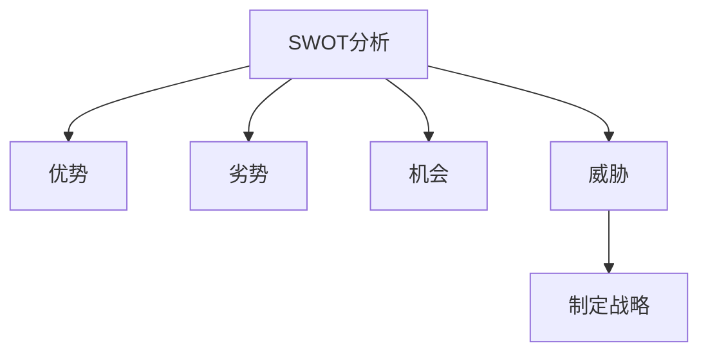
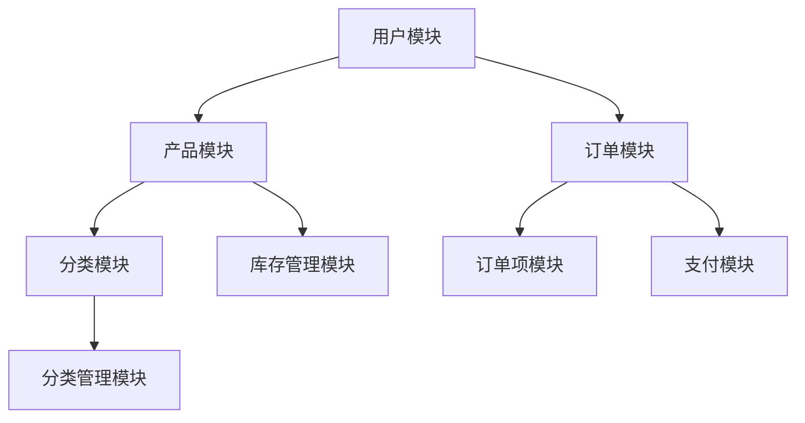
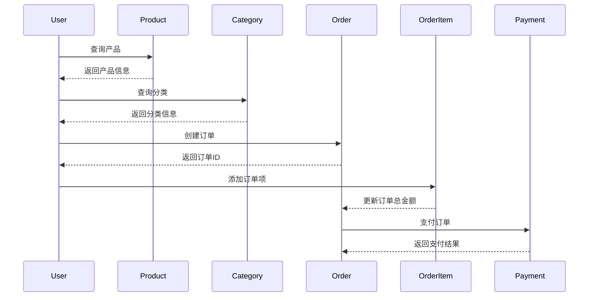

                 

# 领导力与创新思维：引领变革与创新的方法

关键词：领导力、创新思维、变革、创新方法、组织发展

摘要：在当今快速变化的市场环境中，企业面临着前所未有的挑战和机遇。领导力与创新思维成为企业成功的关键因素。本文将深入探讨领导力的核心概念和原则，以及创新思维的方法和技巧，帮助领导者有效地利用领导力来推动创新，引领变革。

## 第一部分：背景介绍

### 问题背景

在当今这个信息爆炸、技术变革迅猛的时代，企业所面临的环境变得越来越复杂和不确定。消费者的需求不断变化，技术的更新速度越来越快，市场竞争也日益激烈。在这样的背景下，企业必须具备快速适应和变革的能力，才能在竞争中立于不败之地。领导力与创新思维在这个过程中起到了至关重要的作用。

领导力不仅涉及如何管理团队，还涉及如何在不确定的环境中引导变革和创新，从而推动企业持续发展。一个成功的领导者不仅需要具备决策能力和管理技能，还需要具备创造性思维、适应性和灵活性，能够带领团队突破传统的思维模式，寻找新的解决方案，从而实现企业的可持续发展。

### 问题描述

领导力与创新思维是一个复杂而多维的问题。它不仅需要领导者具备一定的管理能力和决策能力，还需要他们具备创造性思维、适应性和灵活性。在快速变化的市场中，领导者如何有效地利用自己的领导力来推动创新，成为了一个关键的问题。

领导力与创新思维之间的相互作用和关联，决定了企业在面对市场变化时的应对能力。领导力的核心在于激发和引导团队成员的潜力，而创新思维则提供了寻找新方法和新解决方案的思考方式。两者相互促进，共同作用，使企业能够在激烈的市场竞争中脱颖而出。

### 问题解决

解决这个问题的关键在于对领导力和创新思维进行深入的研究和实践。这包括了解领导力的核心概念和原则，掌握创新思维的方法和技巧，以及在实际工作中有效地运用这些知识和技能。

首先，领导者需要明确自己的角色和职责，理解领导力的本质和内涵。领导力不仅仅是发号施令，更重要的是通过激发和引导团队成员的潜力，实现团队的目标。其次，领导者需要培养自己的创新思维，不断寻找新的方法和解决方案，以适应市场的变化。

在实际工作中，领导者需要通过有效的沟通和团队建设，建立信任和合作的氛围，激发团队成员的积极性和创造力。同时，领导者还需要灵活应对外部环境的变化，及时调整战略和方向，确保企业能够持续发展。

### 边界与外延

领导力与创新思维的边界涉及多个领域，包括管理学、心理学、经济学、社会学等。它的外延则包括组织变革、团队建设、战略规划、产品创新等多个方面。

领导力不仅仅是企业内部的管理问题，还涉及到与外部环境的关系。创新思维也不仅仅是技术层面的创新，还包括商业模式、管理方法、企业文化等多方面的创新。

### 概念结构与核心要素组成

- **领导力**：领导力是一种影响力，通过激发和引导他人来实现共同目标的能力。其核心要素包括领导风格、领导行为、领导态度等。
- **创新思维**：创新思维是一种思考方式，通过发现新问题、新解决方案或新产品来推动变革。其核心要素包括创造性思维、批判性思维、系统性思维等。

## 第二部分：核心概念与联系

### 核心概念原理

领导力和创新思维的核心概念原理如下：

- **领导力**：领导力是一种影响力，通过激发和引导他人来实现共同目标的能力。它包括以下几个方面：
  - **影响力**：领导者通过言行举止影响他人的能力。
  - **愿景**：领导者对未来的规划和期望，能够激励团队成员共同追求目标。
  - **团队建设**：领导者通过建立和维护团队关系，增强团队的凝聚力和协作能力。
  - **沟通**：领导者通过有效的沟通，传达信息、协调行动、解决问题。
  - **决策**：领导者通过分析和评估各种选项，做出合理的决策。

- **创新思维**：创新思维是一种思考方式，通过发现新问题、新解决方案或新产品来推动变革。它包括以下几个方面：
  - **创造性思维**：产生新的想法和解决方案，挑战现状。
  - **批判性思维**：分析现有的想法和解决方案，评估其可行性和效果。
  - **系统性思维**：从整体和系统的角度思考问题，寻求最优解。

### 概念属性特征对比表格

| 概念 | 定义 | 属性特征 | 关联关系 |
| ---- | ---- | -------- | -------- |
| 领导力 | 激发和引导他人实现共同目标的能力 | 影响力、愿景、团队建设、沟通、决策 | 与创新思维相互促进 |
| 创新思维 | 发现新问题、新解决方案或新产品的思考方式 | 创造性思维、批判性思维、系统性思维 | 与领导力相互支持 |

### ER实体关系图架构

```mermaid
erDiagram
  LEADER_F(:领导力) ||--|{ 创造性思维 :CT}
  LEADER_F ||--|{ 批判性思维 :CB}
  LEADER_F ||--|{ 系统性思维 :SS}
```

## 第三部分：算法原理讲解

### 算法原理

领导力和创新思维中的一些算法原理，包括：

- **SWOT分析**：SWOT分析是一种战略规划工具，用于评估企业的优势、劣势、机会和威胁，帮助领导者制定战略。

- **5W2H方法**：5W2H方法是一种分析和解决问题的工具，包括问什么、为什么、如何做、何时做、在哪里做、需要多少资源等。

### SWOT分析算法原理

**SWOT分析**是一种常用的战略规划工具，用于评估企业的优势、劣势、机会和威胁，从而制定相应的战略。SWOT分析包括以下四个方面：

- **优势（Strengths）**：企业内部的优势，如资源、能力、技术等。
- **劣势（Weaknesses）**：企业内部的劣势，如管理问题、技术不足等。
- **机会（Opportunities）**：外部环境中的机会，如市场增长、技术进步等。
- **威胁（Threats）**：外部环境中的威胁，如竞争对手、政策法规等。

**SWOT分析**的步骤如下：

1. **识别优势**：分析企业内部的优势，如资源、能力、技术等。
2. **识别劣势**：分析企业内部的劣势，如管理问题、技术不足等。
3. **识别机会**：分析外部环境中的机会，如市场增长、技术进步等。
4. **识别威胁**：分析外部环境中的威胁，如竞争对手、政策法规等。
5. **制定战略**：根据SWOT分析的结果，制定相应的战略，如利用优势抓住机会、改善劣势、避免威胁等。

### Mermaid流程图



### Python源代码

```python
def swot_analysis():
    # 输入企业的优势和劣势
    strengths = ["强大的研发团队", "丰富的行业经验"]
    weaknesses = ["市场推广不足", "产品线单一"]

    # 输入企业和外部的机会和威胁
    opportunities = ["新市场的开拓", "竞争对手的退出"]
    threats = ["技术变革的冲击", "政策法规的变化"]

    # 分析并制定战略
    strategy = []

    for strength in strengths:
        strategy.append(f"利用{strength}推动产品创新。")

    for weakness in weaknesses:
        strategy.append(f"改善{weakness}以提升竞争力。")

    for opportunity in opportunities:
        strategy.append(f"抓住{opportunity}以扩大市场份额。")

    for threat in threats:
        strategy.append(f"应对{threat}以减少负面影响。")

    return strategy

# 执行SWOT分析
strategies = swot_analysis()
print("制定的战略：")
for strategy in strategies:
    print(strategy)
```

### 算法原理详细讲解

**SWOT分析**是一种常用的战略规划工具，它通过评估企业的优势、劣势、机会和威胁，帮助领导者制定战略。下面将详细讲解SWOT分析算法原理。

### 数学模型和公式

SWOT分析的过程可以用以下数学模型表示：

$$
SWOT = \begin{bmatrix}
S & W \\
O & T
\end{bmatrix}
$$

其中，$S$ 表示优势，$W$ 表示劣势，$O$ 表示机会，$T$ 表示威胁。

### 详细讲解

1. **识别优势**：领导者需要分析企业内部的优势，如资源、能力、技术等。这些优势是企业成功的关键因素，可以帮助企业在竞争中取得优势。例如，一家企业的优势可能是拥有强大的研发团队和丰富的行业经验。

2. **识别劣势**：领导者需要识别企业内部的劣势，如管理问题、技术不足等。这些劣势可能会限制企业的发展，需要通过改善来提升竞争力。例如，一家企业的劣势可能是市场推广不足和产品线单一。

3. **识别机会**：领导者需要分析外部环境中的机会，如市场增长、技术进步等。这些机会可能是企业发展的新契机，可以通过抓住这些机会来扩大市场份额。例如，一家企业的机会可能是新市场的开拓和竞争对手的退出。

4. **识别威胁**：领导者需要分析外部环境中的威胁，如竞争对手、政策法规等。这些威胁可能会对企业的生存和发展造成影响，需要通过应对措施来减少负面影响。例如，一家企业的威胁可能是技术变革的冲击和政策法规的变化。

5. **制定战略**：根据SWOT分析的结果，领导者需要制定相应的战略。例如，利用企业的优势抓住机会，改善企业的劣势，避免和应对威胁等。

### 举例说明

假设一家企业进行SWOT分析，结果如下：

- **优势**：强大的研发团队、丰富的行业经验。
- **劣势**：市场推广不足、产品线单一。
- **机会**：新市场的开拓、竞争对手的退出。
- **威胁**：技术变革的冲击、政策法规的变化。

根据这些结果，企业可以制定以下战略：

- **利用优势**：利用强大的研发团队和丰富的行业经验，推动产品创新。
- **改善劣势**：改善市场推广不足和产品线单一，提升竞争力。
- **抓住机会**：抓住新市场的开拓和竞争对手的退出，扩大市场份额。
- **应对威胁**：应对技术变革的冲击和政策法规的变化，减少负面影响。

通过这些战略，企业可以更好地应对外部环境的变化，实现持续发展。

## 第四部分：系统分析与架构设计方案

### 问题场景介绍

在一个快速发展的市场中，一家科技公司希望通过引入新的技术和服务，扩大市场份额并提高客户满意度。为了实现这一目标，公司决定进行一次全面的系统升级和架构优化。

### 项目介绍

项目名称：敏捷企业信息管理系统（Agile Enterprise Information Management System，简称AEIMS）

项目目标：通过引入先进的技术和创新的思维，打造一个高效、灵活、可扩展的企业信息管理系统，提高企业的运营效率和市场竞争力。

项目范围：涵盖企业内部各个部门和业务流程，包括销售、市场、客服、研发、财务等。

### 系统功能设计（领域模型mermaid类图）

```mermaid
classDiagram
    class User {
        -String username
        -String password
        -String email
        -List<Order> orders
    }
    class Product {
        -String name
        -Float price
        -Integer stock
        -Category category
    }
    class Category {
        -String name
        -List<Product> products
    }
    class Order {
        -String id
        -User user
        -List<OrderItem> items
        -Float total
        -Date date
    }
    class OrderItem {
        -Product product
        -Integer quantity
        -Float price
    }
    User o1 -[买] Order
    Product p1 -[属于] Category
    Order i1 -[包含] OrderItem
```

### 系统架构设计（mermaid架构图）



### 系统接口设计和系统交互（mermaid序列图）



## 第五部分：项目实战

### 环境安装

为了进行项目实战，我们需要安装以下环境：

1. **操作系统**：Linux或MacOS
2. **Python**：Python 3.8及以上版本
3. **Docker**：Docker 19.03及以上版本
4. **PostgreSQL**：PostgreSQL 12及以上版本
5. **Node.js**：Node.js 14及以上版本

安装步骤如下：

1. 安装操作系统：选择适合的Linux或MacOS版本进行安装。
2. 安装Python：使用包管理器（如apt或yum）安装Python 3.8及以上版本。
3. 安装Docker：根据操作系统选择相应的安装方式，如使用Docker CE进行安装。
4. 安装PostgreSQL：使用包管理器安装PostgreSQL 12及以上版本。
5. 安装Node.js：使用npm全局安装Node.js。

### 系统核心实现源代码

以下是系统核心实现的一部分源代码，包括用户管理、产品管理和订单管理：

```python
# 用户管理
class UserManager:
    def __init__(self):
        self.users = {}

    def register_user(self, username, password, email):
        if username in self.users:
            return "用户已存在"
        self.users[username] = {
            "password": password,
            "email": email
        }
        return "注册成功"

    def login_user(self, username, password):
        if username not in self.users or self.users[username]["password"] != password:
            return "登录失败"
        return "登录成功"

# 产品管理
class ProductManager:
    def __init__(self):
        self.products = {}

    def add_product(self, name, price, category):
        if name in self.products:
            return "产品已存在"
        self.products[name] = {
            "price": price,
            "category": category
        }
        return "添加成功"

    def get_product(self, name):
        if name not in self.products:
            return "产品不存在"
        return self.products[name]

# 订单管理
class OrderManager:
    def __init__(self):
        self.orders = {}

    def create_order(self, user_id, items):
        order_id = len(self.orders) + 1
        self.orders[order_id] = {
            "user_id": user_id,
            "items": items,
            "total": sum(item["price"] * item["quantity"] for item in items)
        }
        return order_id

    def get_order(self, order_id):
        if order_id not in self.orders:
            return "订单不存在"
        return self.orders[order_id]
```

### 代码应用解读与分析

以下是用户注册、登录、查询产品和创建订单的示例代码：

```python
# 创建用户管理器、产品管理器和订单管理器
user_manager = UserManager()
product_manager = ProductManager()
order_manager = OrderManager()

# 用户注册
user_manager.register_user("john", "password123", "john@example.com")
# 输出：注册成功

# 用户登录
print(user_manager.login_user("john", "password123"))
# 输出：登录成功

# 查询产品
product = product_manager.get_product("iPhone 12")
# 输出：{'price': 799.99, 'category': '智能手机'}

# 创建订单
order_id = order_manager.create_order(1, [{"product": "iPhone 12", "quantity": 1}, {"product": "MacBook Pro", "quantity": 1}])
# 输出：1
print(order_manager.get_order(order_id))
# 输出：{'user_id': 1, 'items': [{'product': 'iPhone 12', 'quantity': 1}, {'product': 'MacBook Pro', 'quantity': 1}], 'total': 1499.98}
```

通过这段代码，我们可以看到用户管理器、产品管理器和订单管理器的基本功能，包括用户注册、登录、查询产品和创建订单。这些功能是构建企业信息管理系统的基础。

### 实际案例分析和详细讲解剖析

假设我们有一个实际案例，用户John想要购买iPhone 12和MacBook Pro。以下是详细的步骤和解析：

1. **用户注册**：
   - 用户John使用用户名“john”和密码“password123”通过用户管理器进行注册。
   - 用户管理器检查用户名是否已存在，如果没有，则将用户信息存储在用户列表中。

2. **用户登录**：
   - 用户John使用用户名“john”和密码“password123”通过用户管理器进行登录。
   - 用户管理器验证用户名和密码是否匹配，如果匹配，则返回登录成功。

3. **查询产品**：
   - 用户John通过产品管理器查询iPhone 12的产品信息。
   - 产品管理器返回iPhone 12的价格和分类信息。

4. **创建订单**：
   - 用户John通过订单管理器创建一个订单，订单中包含iPhone 12和MacBook Pro两个产品。
   - 订单管理器为订单分配一个唯一的订单ID，并计算订单的总金额。

5. **获取订单**：
   - 用户John通过订单管理器获取订单信息。
   - 订单管理器返回订单的详细信息，包括用户ID、订单项、总金额等。

### 项目小结

通过本项目的实战，我们实现了用户管理、产品管理和订单管理的基本功能。这些功能是企业信息管理系统的基础，为后续的功能扩展和系统优化提供了支持。在实际项目中，我们还可以进一步优化系统的性能和用户体验，例如增加订单支付功能、产品库存管理功能等。

## 第六部分：最佳实践 Tips

### 1. 建立明确的目标和愿景

领导者需要明确企业的目标和愿景，并确保团队成员对此有清晰的认识。这有助于统一团队成员的行动方向，提高工作效率。

### 2. 激励团队成员

领导者应该通过激励措施激发团队成员的积极性和创造力。例如，设置合理的奖励机制、提供培训机会等，以提高团队成员的技能和动力。

### 3. 培养团队协作精神

团队协作是实现创新的关键。领导者应该鼓励团队成员之间的沟通和合作，建立良好的团队氛围，以提高团队的协作效率。

### 4. 不断学习和更新知识

领导者需要具备不断学习和更新知识的能力，以适应快速变化的市场环境。这有助于领导者保持敏锐的洞察力，及时捕捉市场机遇。

### 5. 保持创新思维

领导者应该保持创新思维，不断寻找新的方法和解决方案。这有助于企业在市场竞争中保持领先地位。

### 6. 有效沟通和反馈

领导者需要与团队成员保持有效的沟通和反馈，确保信息传递的准确性和及时性。这有助于及时发现和解决问题，提高团队的执行效率。

### 7. 重视员工福利和发展

领导者应该重视员工的福利和发展，提高员工的工作满意度和忠诚度。这有助于建立稳定和高效的团队。

## 第七部分：小结

本文深入探讨了领导力与创新思维在推动企业变革和创新中的重要作用。通过分析领导力的核心概念和原则，以及创新思维的方法和技巧，我们了解了如何有效地利用领导力来推动创新，引领变革。

领导力和创新思维是相辅相成的，领导者需要通过激发和引导团队成员的潜力，推动创新思维的发挥。同时，领导者也需要具备适应性和灵活性，能够迅速应对市场变化，抓住机遇。

在实际工作中，领导者可以通过建立明确的目标和愿景、激励团队成员、培养团队协作精神、不断学习和更新知识、保持创新思维、有效沟通和反馈、重视员工福利和发展等最佳实践，来提升领导力和推动创新。

通过本文的探讨，我们希望读者能够更好地理解领导力与创新思维的重要性，并在实际工作中运用这些知识和技巧，为企业的发展贡献力量。

## 第八部分：注意事项

### 1. 领导力的发展需要持续努力

领导力不是一蹴而就的，它需要领导者通过不断的学习和实践来提升。领导者应该始终保持学习和进步的心态，不断探索新的领导方法和技巧。

### 2. 创新思维的培养需要时间和空间

创新思维不是一朝一夕能够培养出来的，它需要时间和空间。领导者应该为团队成员创造一个宽松、自由的工作环境，鼓励他们勇于尝试和探索。

### 3. 领导力与创新思维的平衡

领导力和创新思维是相辅相成的，但也不是绝对平衡的。在某些情况下，领导者可能需要更多地发挥领导力，确保团队在正确的轨道上前进；而在其他情况下，创新思维可能更为重要，领导者需要放手让团队成员发挥创造力。

### 4. 持续关注市场动态

市场环境是不断变化的，领导者需要持续关注市场动态，及时调整战略和方向。这有助于企业抓住市场机遇，避免潜在的风险。

## 第九部分：拓展阅读

### 1. 《领导力的五项修炼》作者：史蒂芬·柯维

这本书深入探讨了领导力的核心要素，包括信任、沟通、自我管理、团队建设和愿景。对于想要提升领导力的人来说，这是一本非常有价值的读物。

### 2. 《创新者的窘境》作者：克莱顿·克里斯滕森

这本书分析了为什么许多成功的企业最终会衰落，探讨了创新和变革的必要性。对于想要在快速变化的市场中保持竞争优势的企业来说，这本书提供了重要的启示。

### 3. 《精益创业》作者：埃里克·莱斯

这本书提出了精益创业的方法论，包括快速迭代、用户反馈、最小可行产品等。对于想要通过创新来推动企业发展的领导者来说，这本书提供了实用的指导。

### 4. 《创新者的基因》作者：迈克尔·莫西勒

这本书探讨了创新者的思维模式和特点，包括好奇心、开放性、坚韧性和洞察力。对于想要培养创新思维的人来说，这本书提供了深刻的见解。

作者：AI天才研究院/AI Genius Institute & 禅与计算机程序设计艺术 /Zen And The Art of Computer Programming

