                 

### 第一部分：引言

#### 第1章 问题背景与目标

##### 1.1.1 问题背景

在当今迅速变化的信息时代，科技和商业环境日益复杂，对组织领导者提出了前所未有的挑战。企业需要不断创新以应对市场的快速变化，而领导者的角色变得更加重要。传统的管理方法可能无法满足新的业务需求，这就要求领导者具备更高的领导力和创新思维。

领导力不仅仅关乎于权力的分配和决策的制定，更重要的是如何激励和引导团队成员共同面对挑战，实现团队的目标。创新思维则强调突破常规思维，不断寻求新的解决方案，以适应不断变化的外部环境。

本篇文章的目标是探讨领导力与创新思维如何结合，以帮助领导者引领团队突破固有模式，实现企业的创新与持续发展。

##### 1.1.2 问题描述

在现实工作中，许多领导者在面对创新需求时常常感到困惑和无力。一方面，他们意识到创新对企业的重要性；另一方面，他们却难以有效地激发团队的创造力，推动实际创新项目的落地。这种困境主要体现在以下几个方面：

1. **领导力不足**：一些领导者缺乏必要的领导技能，无法有效地激励和引导团队成员。他们可能过于注重控制，忽视了团队成员的自主性和创造力。

2. **创新思维匮乏**：部分领导者自身缺乏创新思维，难以带领团队进行创新。他们可能习惯于遵循传统的管理模式，无法适应快速变化的商业环境。

3. **团队协作障碍**：团队内部的沟通不畅、协作不足，也是阻碍创新的关键因素。领导者在促进团队协作方面往往缺乏有效的策略和方法。

4. **资源限制**：许多领导者面临的资源限制，包括时间、资金和人力，也限制了他们的创新尝试。

##### 1.1.3 问题解决

要解决上述问题，首先需要从理论层面深入理解领导力和创新思维，并结合实际案例进行分析和讨论。本文将从以下几个方面入手：

1. **领导力理论基础与实践**：介绍领导理论的发展，分析领导力的核心要素和实践应用，帮助领导者提升自身的领导能力。

2. **创新思维培养与运用**：探讨创新思维的定义、分类和培养方法，以及创新思维在实际中的应用，为领导者提供有效的创新工具。

3. **领导力与创新思维的整合应用**：阐述领导力与创新思维的整合策略，通过具体案例展示如何在实际工作中运用这两种能力。

4. **领导力与创新思维的整合应用案例**：分析企业层面和项目层面的整合应用案例，总结成功经验，为领导者提供实际操作指南。

##### 1.1.4 边界与外延

本文的研究范围主要聚焦于企业领导者如何通过提升领导力和培养创新思维，引领团队实现创新突破。同时，本文也将探讨领导力与创新思维在特定行业和项目中的实际应用。

本篇文章的外延包括以下几个方面：

1. **领导力的跨文化因素**：探讨领导力在不同文化和组织环境中的适应性和变化。

2. **创新思维的可持续性**：分析创新思维在长期发展中的可持续性和维持创新活力的策略。

3. **领导力与创新思维的交叉学科研究**：探讨领导力与创新思维在心理学、管理学和工程学等领域的交叉研究。

通过上述讨论，本文旨在为领导者提供系统的理论指导和实践方法，帮助他们更好地应对当前和未来的挑战。

##### 1.2 核心概念与联系

在深入探讨领导力与创新思维之前，有必要明确这两个核心概念，并理解它们之间的联系。

###### 1.2.1 领导力

领导力是指领导者通过激励和引导团队成员，实现组织目标的能力。领导力不仅仅包括决策和指挥，更强调在团队中的影响力和榜样作用。领导力的核心要素包括：

1. **影响力**：领导者需要具备一定的个人魅力和权威，以影响团队成员的行为和态度。
   
2. **目标设定**：领导者要能够明确组织的目标，并引导团队为之努力。

3. **沟通能力**：有效的沟通是领导力的关键。领导者需要具备清晰、坦诚、及时的沟通能力。

4. **团队建设**：领导者需要关注团队的凝聚力、信任度和协作精神。

5. **激励与认可**：领导者要通过奖励和认可，激励团队成员发挥最大潜力。

核心概念特征对比表格：

| 特征 | 领导力 |
| --- | --- |
| 定义 | 指引和激励他人实现目标的能力 |
| 关键要素 | 影响力、目标设定、沟通能力、团队建设、激励与认可 |
| 目标 | 引导团队达成目标，提升团队绩效 |

Mermaid ER实体关系图架构：

```mermaid
erDiagram
  领导力 ||--|{ 团队 }|
  领导力 ||--|{ 目标 }|
  领导力 ||--|{ 沟通能力 }|
  领导力 ||--|{ 激励与认可 }|
```

###### 1.2.2 创新思维

创新思维是指人们运用新颖的思路和策略，解决实际问题或提出新的解决方案的能力。创新思维的核心要素包括：

1. **好奇心**：对未知事物保持好奇，愿意探索和尝试。

2. **发散思维**：从不同角度和层面思考问题，寻找多种可能的解决方案。

3. **批判性思维**：对现有理论和实践进行批判性分析，提出改进意见。

4. **协同思维**：鼓励团队合作，发挥集体智慧。

5. **适应性思维**：在变化的环境中灵活调整思维模式，适应新的挑战。

核心概念特征对比表格：

| 特征 | 创新思维 |
| --- | --- |
| 定义 | 运用新颖的思路和策略，解决实际问题或提出新的解决方案的能力 |
| 关键要素 | 好奇心、发散思维、批判性思维、协同思维、适应性思维 |
| 目标 | 提升创造力，推动创新项目落地 |

Mermaid ER实体关系图架构：

```mermaid
erDiagram
  创新思维 ||--|{ 好奇心 }|
  创新思维 ||--|{ 发散思维 }|
  创新思维 ||--|{ 批判性思维 }|
  创新思维 ||--|{ 协同思维 }|
  创新思维 ||--|{ 适应性思维 }|
```

###### 1.2.3 领导力与创新思维的关联

领导力与创新思维之间存在密切的关联。一方面，领导力可以影响创新思维的发展和应用。有效的领导力可以激发团队成员的创新潜能，创造一个支持创新的环境。另一方面，创新思维可以提升领导力，帮助领导者找到新的领导方式和策略。

领导力对创新思维的影响：

- **激励作用**：领导者可以通过激励和认可，鼓励团队成员发挥创新思维。
- **资源支持**：领导者可以提供必要的资源，支持创新活动的开展。
- **文化建设**：领导者可以通过塑造积极的文化氛围，促进创新思维的发展。

创新思维对领导力的影响：

- **新的领导方式**：创新思维可以帮助领导者找到新的领导方式和策略，适应快速变化的环境。
- **增强影响力**：具备创新思维的领导者更能够赢得团队成员的信任和尊重，增强其领导力。

通过上述关联，我们可以看到领导力和创新思维在实现组织目标中的重要性。理解并运用这两个能力，领导者可以更有效地引领团队，实现持续的创新与发展。

##### 1.3 本章小结

本章引出了本文的核心问题和目标，详细介绍了领导力与创新思维的定义、核心要素及其关联。通过分析领导力与创新思维的背景和现状，我们明确了提升这两种能力的重要性。接下来，本文将深入探讨领导力的理论基础与实践，以及创新思维的培养与运用，为领导者提供系统的指导和方法。

---

### 第二部分：领导力的理论基础与实践

#### 第2章 领导力理论基础

领导力的理论基础为我们提供了理解领导现象的框架，通过回顾领导理论的发展，我们可以更好地理解领导力的核心要素和实践方法。

##### 2.1 领导理论的发展

领导理论的发展经历了多个阶段，从早期的特质理论到行为理论，再到情境理论，每个阶段都有其独特的视角和贡献。

###### 2.1.1 经典领导理论

1. **特质理论**：特质理论认为领导者具有特定的个性特质和能力，这些特质是他们成功领导的关键。例如，自信、决断力、沟通能力等。特质理论有助于我们识别潜在的领导者，但它忽视了环境因素对领导成效的影响。

2. **行为理论**：行为理论关注领导者具体的行为方式，而非其个人特质。这类理论包括领导行为四分图、领导连续体理论等。行为理论指出，领导行为可以影响团队绩效，领导者的行为方式可以是任务导向或关系导向。

3. **情境理论**：情境理论认为领导效果取决于领导风格与环境的匹配程度。领导者的最佳风格会因情境的不同而变化。著名的有费德勒模型和路径-目标理论。这些理论强调了领导行为应与具体情境相结合，以实现最佳效果。

###### 2.1.2 现代领导理论

随着管理实践的深化和变化，现代领导理论也在不断发展。现代领导理论更加关注领导者的价值观、团队动力以及领导过程中的软技能。

1. **转型领导理论**：转型领导强调领导者通过改变团队成员的态度和行为来推动组织变革。这种领导方式注重远见和影响力，通过激励和榜样作用来引领团队。

2. **服务型领导理论**：服务型领导认为领导者应该以服务团队成员为核心，关注团队成员的需求和成长。这种领导方式强调领导者的无私奉献和关怀，有助于建立信任和协作的文化。

3. **共享领导理论**：共享领导理论认为领导不仅是领导者的责任，而是一个集体过程。在这种模式下，团队成员共同参与决策，共同承担领导责任，从而提高团队的凝聚力和创造力。

##### 2.2 领导力的核心要素

理解领导力的核心要素对于提升领导能力至关重要。以下为领导力的四个关键维度：

###### 2.2.1 领导力与领导能力的区别

领导力和领导能力是两个不同的概念。领导力是一个更广泛的概念，它不仅包括领导者的个人能力和行为，还包括领导过程中所涉及的情境和关系。而领导能力则更多地指领导者个人的技能和才干。

| 概念 | 领导力 |
| --- | --- |
| 定义 | 包括领导者的个人能力、行为和情境因素 |
| 关键要素 | 领导能力、情境适应性、关系管理 |
| 目标 | 实现团队和组织目标，提升整体绩效 |

| 概念 | 领导能力 |
| --- | --- |
| 定义 | 指领导者具备的技能和才干 |
| 关键要素 | 沟通能力、决策能力、团队建设能力 |
| 目标 | 提高个人绩效，实现领导目标 |

核心要素对比表格：

| 维度 | 描述 |
| --- | --- |
| 领导能力 | 领导者的技能和才干，包括沟通、决策、团队建设等 |
| 情境适应性 | 领导风格和策略应根据不同情境灵活调整 |
| 关系管理 | 建立和维护与团队成员的良好关系，促进协作和信任 |
| 团队建设 | 激发团队凝聚力，提高团队成员的士气和创造力 |

##### 2.3 领导风格与领导行为

领导风格和领导行为是领导力的重要组成部分。了解不同的领导风格和行为类型有助于领导者根据具体情境选择合适的策略。

###### 2.3.1 领导风格的理论

领导风格理论探讨领导者如何与团队成员互动和沟通。以下为几种主要的领导风格理论：

1. **独裁式领导**：领导者做出所有决策，严格控制团队成员的行为。这种风格在某些紧急情况下可能有效，但在长期内可能抑制团队成员的积极性。

2. **民主式领导**：领导者鼓励团队成员参与决策过程，重视团队成员的意见和建议。这种风格有助于提高团队成员的参与度和创造力，但在决策效率上可能较低。

3. **放任式领导**：领导者对团队成员的行为和决策采取自由放任的态度。这种风格可能导致团队成员之间缺乏协作，但在某些情况下，也可以激发个体的自主性和创造力。

4. **参与式领导**：领导者通过积极参与和引导团队成员，共同制定决策。这种风格结合了民主和放任的特点，强调团队合作和共同成长。

领导风格对比表格：

| 风格 | 描述 |
| --- | --- |
| 独裁式领导 | 领导者做决策，控制团队成员行为 |
| 民主式领导 | 领导者鼓励团队成员参与决策 |
| 放任式领导 | 领导者对团队成员行为和决策采取自由放任的态度 |
| 参与式领导 | 领导者积极参与和引导团队成员共同制定决策 |

###### 2.3.2 领导行为的类型

领导行为是指领导者在实际工作中表现出来的行为模式。以下为几种主要的领导行为类型：

1. **任务导向行为**：领导者专注于任务和目标，确保团队成员按计划完成任务。这种行为有助于提高团队的效率和绩效。

2. **关系导向行为**：领导者关注团队成员的需求和关系，建立和谐的团队氛围。这种行为有助于提高团队成员的满意度和忠诚度。

3. **支持性行为**：领导者提供必要的支持和资源，帮助团队成员克服困难。这种行为有助于提高团队成员的士气和信任感。

领导行为对比表格：

| 类型 | 描述 |
| --- | --- |
| 任务导向行为 | 专注于任务和目标 |
| 关系导向行为 | 关注团队成员的需求和关系 |
| 支持性行为 | 提供必要的支持和资源 |

##### 2.4 本章小结

本章探讨了领导理论的发展，从经典领导理论到现代领导理论，分析了领导力的核心要素和领导风格与行为类型。通过理解这些理论基础，领导者可以更好地识别和提升自身的领导能力，为实践应用奠定基础。

---

### 第三部分：领导力的实践应用

#### 第3章 领导力的实践应用

领导力不仅是理论上的概念，更需要在实际工作中得到有效的应用。本章节将探讨领导力在团队管理、项目管理和组织变革中的具体应用，帮助领导者提升实际领导能力。

##### 3.1 领导力在团队管理中的应用

团队管理是领导者面临的一项重要任务，有效的团队管理可以提升团队绩效，实现组织目标。

###### 3.1.1 团队建设的核心要素

团队建设是提升团队协作和凝聚力的重要环节。以下为团队建设的核心要素：

1. **共同目标**：明确团队的目标和愿景，确保团队成员对目标有共同的理解和认同。

2. **信任与尊重**：建立团队成员之间的信任关系，尊重彼此的个性和能力。

3. **有效沟通**：确保团队成员之间的信息传递畅通，促进理解与合作。

4. **角色与职责明确**：明确团队成员的角色和职责，确保每个人都知道自己的工作内容和目标。

5. **激励机制**：建立公平的激励机制，鼓励团队成员积极参与和贡献。

团队建设核心要素对比表格：

| 要素 | 描述 |
| --- | --- |
| 共同目标 | 确保团队成员对目标有共同的理解和认同 |
| 信任与尊重 | 建立团队成员之间的信任关系，尊重彼此的个性和能力 |
| 有效沟通 | 确保团队成员之间的信息传递畅通，促进理解与合作 |
| 角色与职责明确 | 明确团队成员的角色和职责，确保每个人都知道自己的工作内容和目标 |
| 激励机制 | 建立公平的激励机制，鼓励团队成员积极参与和贡献 |

###### 3.1.2 团队沟通与协作

团队沟通与协作是团队管理的重要方面。以下为团队沟通与协作的关键要素：

1. **开放沟通**：鼓励团队成员开放、坦诚地表达自己的意见和想法。

2. **积极倾听**：领导者应积极倾听团队成员的意见，确保每个声音都被听到。

3. **定期会议**：定期召开团队会议，讨论进展和问题，确保团队目标的一致性。

4. **跨部门协作**：促进不同部门之间的协作，打破部门壁垒，实现资源整合。

5. **透明度**：保持工作信息的透明度，让团队成员了解整个项目的进展和目标。

团队沟通与协作关键要素对比表格：

| 要素 | 描述 |
| --- | --- |
| 开放沟通 | 鼓励团队成员开放、坦诚地表达自己的意见和想法 |
| 积极倾听 | 领导者应积极倾听团队成员的意见，确保每个声音都被听到 |
| 定期会议 | 定期召开团队会议，讨论进展和问题，确保团队目标的一致性 |
| 跨部门协作 | 促进不同部门之间的协作，打破部门壁垒，实现资源整合 |
| 透明度 | 保持工作信息的透明度，让团队成员了解整个项目的进展和目标 |

##### 3.2 领导力在项目管理中的应用

项目管理是领导者需要掌握的另一项重要技能。有效的项目管理可以确保项目按时、按质量完成。

###### 3.2.1 项目管理的核心要素

项目管理的核心要素包括：

1. **项目规划**：制定详细的项目计划，包括任务分配、时间表和资源需求。

2. **风险管理**：识别项目中的潜在风险，并制定相应的风险应对策略。

3. **质量控制**：确保项目产出符合预定的质量标准。

4. **团队协作**：通过有效的沟通和协作，确保项目团队的高效运作。

5. **进度监控**：定期监控项目进展，确保项目按时完成。

项目管理核心要素对比表格：

| 要素 | 描述 |
| --- | --- |
| 项目规划 | 制定详细的项目计划，包括任务分配、时间表和资源需求 |
| 风险管理 | 识别项目中的潜在风险，并制定相应的风险应对策略 |
| 质量控制 | 确保项目产出符合预定的质量标准 |
| 团队协作 | 通过有效的沟通和协作，确保项目团队的高效运作 |
| 进度监控 | 定期监控项目进展，确保项目按时完成 |

###### 3.2.2 项目管理的流程与方法

项目管理的流程通常包括以下阶段：

1. **项目启动**：明确项目目标和范围，组建项目团队。

2. **项目计划**：制定项目计划，包括任务分配、时间表和资源需求。

3. **项目执行**：执行项目计划，确保任务按时完成。

4. **项目监控**：监控项目进展，识别和解决潜在问题。

5. **项目收尾**：完成项目任务，进行项目评估和总结。

项目管理流程图（使用Mermaid绘制）：

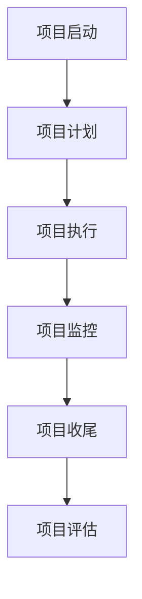

##### 3.3 领导力在组织变革中的应用

组织变革是领导者面临的另一大挑战。有效的领导力可以帮助组织顺利实现变革。

###### 3.3.1 组织变革的理论与实践

组织变革的理论包括：

1. **变革管理理论**：强调通过有效的沟通、团队建设和激励机制来管理变革过程。

2. **变革领导理论**：认为领导者是变革的推动者，需要具备远见和影响力，引领组织变革。

3. **文化变革理论**：强调组织文化在变革过程中的作用，认为变革需要与组织文化相协调。

组织变革理论对比表格：

| 理论 | 描述 |
| --- | --- |
| 变革管理理论 | 通过沟通、团队建设和激励机制管理变革过程 |
| 变革领导理论 | 领导者是变革的推动者，需要具备远见和影响力 |
| 文化变革理论 | 变革需要与组织文化相协调 |

###### 3.3.2 领导者在组织变革中的角色

领导者在组织变革中扮演多重角色，包括：

1. **变革推动者**：领导者需要具备远见，明确变革的方向和目标，并推动变革的实施。

2. **沟通者**：领导者需要与团队成员有效沟通，解释变革的原因和意义，消除疑虑和抵触。

3. **激励者**：领导者需要通过激励机制，鼓励团队成员积极参与变革。

4. **协调者**：领导者需要协调不同部门之间的合作，确保变革的顺利推进。

领导者在组织变革中的角色对比表格：

| 角色 | 描述 |
| --- | --- |
| 变革推动者 | 领导者需要具备远见，明确变革的方向和目标，并推动变革的实施 |
| 沟通者 | 领导者需要与团队成员有效沟通，解释变革的原因和意义，消除疑虑和抵触 |
| 激励者 | 领导者需要通过激励机制，鼓励团队成员积极参与变革 |
| 协调者 | 领导者需要协调不同部门之间的合作，确保变革的顺利推进 |

##### 3.4 本章小结

本章深入探讨了领导力在团队管理、项目管理和组织变革中的具体应用。通过了解团队建设的核心要素、项目管理的流程与方法，以及组织变革的理论与实践，领导者可以更有效地提升领导能力，应对实际工作中的各种挑战。

---

### 第四部分：创新思维的培养与运用

#### 第4章 创新思维的理论基础

创新思维是领导者引领团队突破传统模式、实现持续发展的关键能力。在本章节中，我们将探讨创新思维的定义、分类和培养方法，为领导者提供系统的理论指导。

##### 4.1 创新思维的定义

创新思维是指运用新颖的思路和策略，创造新的价值或解决问题的能力。它不仅涉及创造新的产品和服务，还涵盖新的商业模式、管理方法和组织文化。创新思维的核心特征包括：

1. **创造性**：创新思维鼓励打破常规，提出新颖的解决方案。

2. **前瞻性**：创新思维强调预见未来趋势，制定长期战略。

3. **综合能力**：创新思维需要结合多种知识和技能，进行跨学科的思考。

4. **实践性**：创新思维不仅停留在理论层面，还需要在实践中得到验证和应用。

核心特征对比表格：

| 特征 | 描述 |
| --- | --- |
| 创造性 | 鼓励打破常规，提出新颖的解决方案 |
| 前瞻性 | 强调预见未来趋势，制定长期战略 |
| 综合能力 | 结合多种知识和技能，进行跨学科的思考 |
| 实践性 | 不仅停留在理论层面，还需要在实践中得到验证和应用 |

##### 4.2 创新思维的分类

创新思维可以根据不同的分类标准进行划分。以下为几种常见的创新思维分类：

1. **感性思维与理性思维**：

   - **感性思维**：依赖直觉和感受，快速捕捉信息，适合解决非结构化问题。
   - **理性思维**：依赖逻辑和分析，逐步推理，适合处理结构化问题。

   感性思维与理性思维对比表格：

   | 类型 | 描述 |
   | --- | --- |
   | 感性思维 | 依赖直觉和感受，快速捕捉信息 |
   | 理性思维 | 依赖逻辑和分析，逐步推理 |

2. **系统思维与发散思维**：

   - **系统思维**：从整体和系统的角度思考问题，强调各部分之间的相互作用。
   - **发散思维**：从多个角度和层面思考问题，寻找多种可能的解决方案。

   系统思维与发散思维对比表格：

   | 类型 | 描述 |
   | --- | --- |
   | 系统思维 | 从整体和系统的角度思考问题，强调各部分之间的相互作用 |
   | 发散思维 | 从多个角度和层面思考问题，寻找多种可能的解决方案 |

3. **正向思维与逆向思维**：

   - **正向思维**：从正面角度思考问题，寻找常规的解决方案。
   - **逆向思维**：从反面角度思考问题，提出与传统思维不同的观点。

   正向思维与逆向思维对比表格：

   | 类型 | 描述 |
   | --- | --- |
   | 正向思维 | 从正面角度思考问题，寻找常规的解决方案 |
   | 逆向思维 | 从反面角度思考问题，提出与传统思维不同的观点 |

##### 4.3 创新思维的过程

创新思维的过程可以分为产生过程和实践过程。以下为详细说明：

###### 4.3.1 创新思维的产生过程

创新思维的产生过程通常包括以下几个阶段：

1. **问题识别**：识别需要解决的问题或机遇。

2. **信息收集**：收集与问题相关的信息，包括内部数据和外部数据。

3. **头脑风暴**：利用发散思维，提出尽可能多的解决方案。

4. **筛选与优化**：从提出的解决方案中筛选出具有潜力的方案，并进行优化。

5. **验证与实施**：验证方案的可行性，并实施最终方案。

创新思维产生过程图（使用Mermaid绘制）：

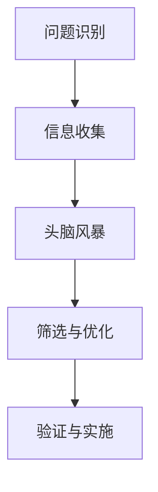

###### 4.3.2 创新思维的实践过程

创新思维的实践过程是将创新思维应用到实际问题中的过程，通常包括以下几个阶段：

1. **需求分析**：分析实际问题的需求和背景。

2. **方案设计**：基于需求分析，设计创新方案。

3. **方案评估**：评估方案的可行性、实用性和潜在风险。

4. **实施与优化**：实施创新方案，并根据反馈进行优化。

5. **效果评估**：评估创新方案的实际效果，并总结经验。

创新思维实践过程图（使用Mermaid绘制）：

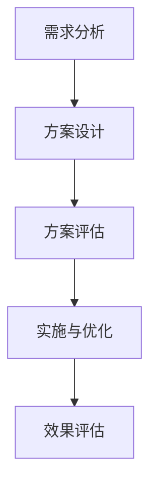

##### 4.4 本章小结

本章深入探讨了创新思维的定义、分类和过程，为领导者提供了系统的理论指导。通过了解创新思维的核心特征、分类和过程，领导者可以更好地培养和应用创新思维，引领团队实现持续的创新与发展。

---

### 第5章 创新思维的培养方法

创新思维的培养是一个长期而复杂的过程，需要从多个方面进行系统训练。在本章节中，我们将探讨创新思维的基本技巧、培养策略和实际应用，帮助领导者提升创新思维能力。

##### 5.1 创新思维的基本技巧

创新思维的基本技巧是培养创新思维的重要基础。以下为几种常见的创新思维技巧：

###### 5.1.1 发散思维训练

发散思维是指从多个角度和层面思考问题，寻找多种可能的解决方案。以下为发散思维训练的方法：

1. **头脑风暴**：头脑风暴是一种常见的发散思维训练方法，通过集体讨论，产生大量的创意。

2. **思维导图**：使用思维导图将问题的不同方面和解决方案联系起来，促进发散思维。

3. **类比思维**：通过类比相似的问题和情境，激发创新思路。

发散思维训练流程图（使用Mermaid绘制）：

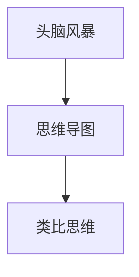

###### 5.1.2 求异思维训练

求异思维是指寻找与众不同的解决方案，强调创新和独特性。以下为求异思维训练的方法：

1. **逆向思维**：从问题的反面思考，提出与传统思维不同的观点。

2. **极限思维**：将问题的限制条件放大，思考在极端情况下的解决方案。

3. **跨界思维**：结合不同领域的知识和方法，寻找创新的解决方案。

求异思维训练流程图（使用Mermaid绘制）：

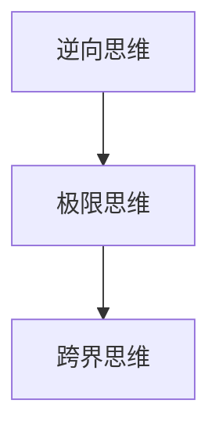

##### 5.2 创新思维培养策略

创新思维的培养需要系统的策略和持续的努力。以下为几种常见的创新思维培养策略：

###### 5.2.1 教育与培训

教育与培训是培养创新思维的重要途径。以下为教育培训的策略：

1. **跨学科教育**：鼓励跨学科学习，培养综合性的思维能力和知识体系。

2. **创新课程**：设计专门的创新思维课程，教授发散思维、求异思维等技巧。

3. **案例研究**：通过分析实际案例，学习成功的创新经验和策略。

教育培训策略图（使用Mermaid绘制）：

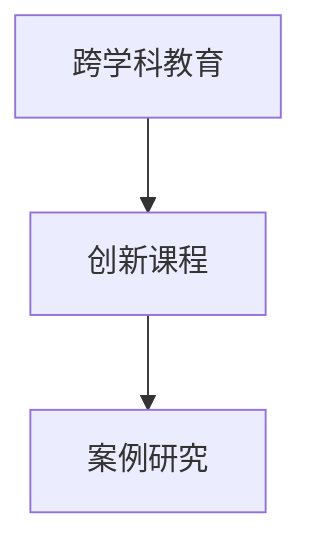

###### 5.2.2 组织文化与氛围

组织文化和氛围对创新思维的培养具有重要影响。以下为组织文化与氛围的策略：

1. **鼓励创新**：建立鼓励创新的文化，让团队成员感受到创新的自由和空间。

2. **开放沟通**：鼓励团队成员开放、坦诚地表达自己的意见和想法。

3. **跨部门协作**：促进不同部门之间的协作，打破部门壁垒，激发创新思维。

组织文化与氛围策略图（使用Mermaid绘制）：

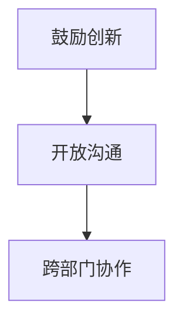

##### 5.3 创新思维的实际应用

创新思维的实际应用是衡量创新培养效果的重要指标。以下为创新思维在实际应用中的几个方面：

###### 5.3.1 创新思维在产品开发中的应用

创新思维在产品开发中具有重要作用。以下为创新思维在产品开发中的应用：

1. **用户研究**：深入了解用户需求，挖掘潜在的创新点。

2. **原型设计**：快速构建原型，验证创新思路的可行性。

3. **迭代优化**：通过用户反馈，不断优化产品，实现持续创新。

创新思维在产品开发中的应用流程图（使用Mermaid绘制）：

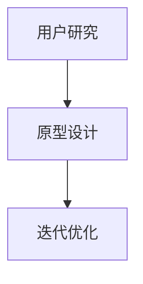

###### 5.3.2 创新思维在市场推广中的应用

创新思维在市场推广中可以帮助企业找到新的推广策略和渠道。以下为创新思维在市场推广中的应用：

1. **创意营销**：运用创新思维，设计新颖的营销策略和活动。

2. **数据分析**：通过数据分析，挖掘市场趋势和用户行为，制定创新的推广策略。

3. **跨界合作**：与其他行业或品牌合作，实现资源共享和优势互补。

创新思维在市场推广中的应用流程图（使用Mermaid绘制）：

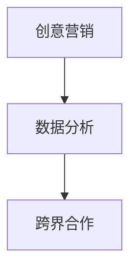

##### 5.4 本章小结

本章探讨了创新思维的培养方法，包括基本技巧、培养策略和实际应用。通过系统的训练和策略，领导者可以提升创新思维能力，引领团队实现持续的创新与发展。

---

### 第五部分：创新思维在行业与项目中的应用

#### 第6章 创新思维在行业与项目中的应用

创新思维不仅有助于提升企业的竞争力，还可以推动整个行业的发展。在本章节中，我们将探讨创新思维在传统行业和新兴行业中的应用，以及相关的挑战和趋势。

##### 6.1 创新思维在传统行业的应用

传统行业通常面临市场饱和、技术停滞和劳动力成本上升等挑战。然而，通过创新思维，传统行业可以找到新的增长点和竞争优势。

###### 6.1.1 传统行业的创新案例

以下是一些传统行业的创新案例：

1. **制造业**：通过智能制造和工业4.0技术，实现生产过程的自动化和智能化。例如，德国的“工业4.0”计划，通过物联网和大数据技术，提高生产效率和产品质量。

2. **农业**：通过精准农业和农业科技，提高农业生产效率和可持续性。例如，日本利用无人机和传感器进行作物监测，实现精准施肥和灌溉。

3. **零售业**：通过电子商务和移动支付，改变传统的购物体验。例如，亚马逊的“一键购买”功能，通过简化购物流程，提高用户满意度。

传统行业创新案例对比表格：

| 行业 | 创新案例 |
| --- | --- |
| 制造业 | 工业4.0、智能制造 |
| 农业 | 精准农业、农业科技 |
| 零售业 | 电子商务、移动支付 |

###### 6.1.2 传统行业的创新挑战

尽管传统行业在创新方面取得了显著进展，但仍面临一些挑战：

1. **技术壁垒**：许多传统行业的技术积累较为深厚，新技术引入和应用面临较大的难度。

2. **市场适应**：传统行业往往需要较长时间来适应市场变化，创新产品的市场推广存在一定的滞后性。

3. **文化阻力**：传统行业的企业文化和工作流程可能阻碍创新思维的推广和应用。

传统行业创新挑战对比表格：

| 挑战 | 描述 |
| --- | --- |
| 技术壁垒 | 新技术引入和应用面临较大的难度 |
| 市场适应 | 创新产品市场推广存在一定的滞后性 |
| 文化阻力 | 企业文化和工作流程可能阻碍创新思维的推广和应用 |

##### 6.2 创新思维在新兴行业的应用

新兴行业通常具备较高的创新活力和技术含量，创新思维在新兴行业的应用尤为关键。

###### 6.2.1 新兴行业的创新案例

以下是一些新兴行业的创新案例：

1. **互联网行业**：通过云计算、大数据和人工智能技术，创造全新的商业模式和服务形态。例如，腾讯的微信支付，通过移动支付改变了人们的消费方式。

2. **生物技术行业**：通过基因编辑和生物工程，推动生命科学的发展。例如，CRISPR-Cas9基因编辑技术，为治疗遗传性疾病和癌症提供了新的途径。

3. **新能源行业**：通过太阳能、风能和电池技术，推动可再生能源的发展。例如，特斯拉的太阳能屋顶和电池储能系统，为家庭能源提供了创新的解决方案。

新兴行业创新案例对比表格：

| 行业 | 创新案例 |
| --- | --- |
| 互联网行业 | 云计算、大数据、人工智能 |
| 生物技术行业 | 基因编辑、生物工程 |
| 新能源行业 | 太阳能、风能、电池技术 |

###### 6.2.2 新兴行业的创新趋势

新兴行业的创新趋势主要体现在以下几个方面：

1. **数字化转型**：越来越多的企业将数字化技术应用于生产、管理和营销环节，实现业务的数字化转型。

2. **跨界融合**：新兴行业之间的界限逐渐模糊，跨界融合成为创新的重要趋势。例如，金融科技（FinTech）结合了金融和科技的优势，创造了新的商业模式。

3. **用户导向**：新兴行业更加注重用户体验和个性化需求，通过用户数据分析和人工智能技术，提供更加定制化的产品和服务。

新兴行业创新趋势对比表格：

| 趋势 | 描述 |
| --- | --- |
| 数字化转型 | 将数字化技术应用于生产、管理和营销环节 |
| 跨界融合 | 新兴行业之间的界限逐渐模糊，跨界融合成为创新的重要趋势 |
| 用户导向 | 更加注重用户体验和个性化需求，通过用户数据分析和人工智能技术，提供更加定制化的产品和服务 |

##### 6.3 本章小结

本章探讨了创新思维在传统行业和新兴行业中的应用，分析了传统行业的创新挑战和新兴行业的创新趋势。通过创新思维的应用，传统行业和新兴行业都可以实现持续发展，为行业带来新的机遇和挑战。

---

### 第六部分：领导力与创新思维的整合应用

#### 第7章 领导力与创新思维的整合

在当今快速变化的商业环境中，领导力与创新思维的结合成为组织实现持续成功的关键。本章节将探讨领导力与创新思维的整合策略、实践方法以及它们在实际工作中的应用。

##### 7.1 整合领导力与创新思维的重要性

领导力与创新思维在组织发展中具有不可替代的作用。领导力为创新提供方向和资源支持，而创新思维则为组织注入活力和竞争力。将两者整合，可以带来以下优势：

1. **提高创新能力**：整合领导力与创新思维可以激发团队的创造力，推动组织不断进行创新。

2. **提升领导效能**：创新思维帮助领导者找到新的领导方式和策略，提高领导效能。

3. **增强团队凝聚力**：领导力与创新思维的结合有助于建立信任和协作的文化，增强团队的凝聚力。

4. **促进组织变革**：整合领导力与创新思维可以推动组织适应外部环境的变化，实现持续变革。

整合领导力与创新思维的重要性对比表格：

| 优势 | 描述 |
| --- | --- |
| 提高创新能力 | 激发团队的创造力，推动组织不断进行创新 |
| 提升领导效能 | 帮助领导者找到新的领导方式和策略，提高领导效能 |
| 增强团队凝聚力 | 建立信任和协作的文化，增强团队的凝聚力 |
| 促进组织变革 | 推动组织适应外部环境的变化，实现持续变革 |

##### 7.2 整合领导力与创新思维的策略

为了有效地整合领导力与创新思维，领导者可以采取以下策略：

1. **建立共同愿景**：领导者需要与团队成员共同制定清晰的愿景，确保创新与组织目标的一致性。

2. **提供资源支持**：领导者应确保团队有足够的资源进行创新尝试，包括资金、人力和时间。

3. **培养创新文化**：领导者需要塑造支持创新的文化氛围，鼓励团队成员提出创意和尝试新方法。

4. **促进跨部门协作**：领导者应促进不同部门之间的协作，打破壁垒，共享资源和知识。

5. **建立反馈机制**：领导者需要建立有效的反馈机制，鼓励团队成员分享经验和教训，不断改进创新过程。

整合领导力与创新思维策略图（使用Mermaid绘制）：

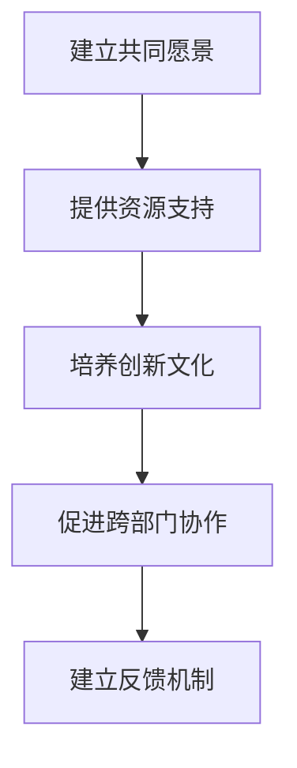

##### 7.3 整合领导力与创新思维的具体实践

在实际工作中，领导者可以通过以下具体实践整合领导力与创新思维：

1. **制定创新目标**：领导者需要明确创新目标，确保团队成员了解创新的方向和目标。

2. **创新过程领导**：领导者应积极参与创新过程，提供指导和支持，确保创新项目的顺利进行。

3. **创新成果推广**：领导者需要将创新成果推广到整个组织，实现创新的全面落地。

4. **激励创新行为**：领导者应建立激励机制，鼓励团队成员积极参与创新，认可和奖励创新成果。

5. **持续反馈与改进**：领导者需要不断收集团队成员的反馈，对创新过程进行持续改进。

整合领导力与创新思维具体实践流程图（使用Mermaid绘制）：

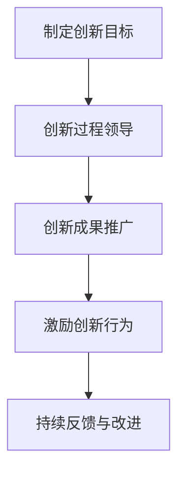

##### 7.4 本章小结

本章探讨了领导力与创新思维的整合策略和实践方法，强调了整合的重要性。通过建立共同愿景、提供资源支持、培养创新文化等策略，领导者可以有效地整合领导力与创新思维，推动组织的持续创新与发展。

---

### 第8章 领导力与创新思维的整合应用案例

在实际工作中，领导力与创新思维的整合应用已经成为许多成功企业的关键策略。本章节将通过企业层面和项目层面的具体案例，展示如何将领导力与创新思维有效地整合，实现组织的持续创新和成功。

##### 8.1 企业层面的整合应用

在企业层面，领导力与创新思维的整合应用主要体现在战略规划、组织变革和文化建设等方面。以下是一些成功的企业案例：

###### 8.1.1 企业成功的整合应用案例

1. **谷歌（Google）**：谷歌以其独特的创新文化而闻名。作为领导者，谷歌的CEO拉里·佩奇和谢尔盖·布林高度重视创新，通过提供资源支持、鼓励跨部门协作和建立创新实验室等方式，推动企业的持续创新。谷歌的“20%时间项目”允许员工将20%的工作时间用于自己感兴趣的创新项目，这一政策激发了员工的创造力，诞生了许多成功的创新产品，如Gmail和AdSense。

2. **特斯拉（Tesla）**：特斯拉的CEO埃隆·马斯克通过领导力和创新思维的整合，推动了电动汽车和可再生能源领域的革命。马斯克以其远见和决心，带领团队克服了技术、市场和资金等多方面的挑战，成功推出了Model S、Model X、Model 3等一系列创新产品，并在全球范围内建立了强大的品牌影响力。

企业层面整合应用成功案例对比表格：

| 企业 | 成功因素 |
| --- | --- |
| 谷歌 | 提供资源支持、鼓励跨部门协作、建立创新实验室 |
| 特斯拉 | 领导者的远见和决心、克服多方面挑战、持续创新 |

###### 8.1.2 企业整合应用中的挑战

尽管企业层面的整合应用取得了显著成效，但企业也面临一些挑战：

1. **资源分配**：如何在资源有限的情况下，合理分配给创新项目，同时确保核心业务的正常运作。

2. **文化适应**：创新文化需要与企业的现有文化和价值观相协调，否则可能会引起冲突和阻力。

3. **管理复杂性**：创新项目通常涉及多个部门和职能，管理复杂性增加，需要有效的协调和沟通机制。

企业整合应用挑战对比表格：

| 挑战 | 描述 |
| --- | --- |
| 资源分配 | 合理分配资源给创新项目，同时确保核心业务运作 |
| 文化适应 | 创新文化需要与现有文化相协调 |
| 管理复杂性 | 创新项目涉及多个部门和职能，管理复杂性增加 |

##### 8.2 项目层面的整合应用

在项目层面，领导力与创新思维的整合应用主要体现在项目规划、执行和评估等方面。以下是一些成功的项目案例：

###### 8.2.1 项目层面的整合应用案例

1. **苹果公司（Apple）**：苹果公司的iPhone项目是一个典型的成功案例。在项目规划阶段，乔布斯明确了iPhone的目标和市场定位，为团队提供了清晰的方向。在项目执行过程中，苹果公司通过严格的研发和测试流程，确保产品的质量和创新性。在项目评估阶段，苹果公司通过用户反馈和市场份额数据，不断优化产品，实现了iPhone的持续成功。

2. **3M公司**：3M公司的“胶带项目”展示了领导力与创新思维在项目层面的应用。3M公司鼓励员工在日常工作中有一定比例的时间用于探索和创新，这种政策激发了员工的创造力，诞生了许多成功的创新产品，如透明胶带、思高纸和防晒霜等。

项目层面整合应用成功案例对比表格：

| 项目 | 成功因素 |
| --- | --- |
| 苹果公司的iPhone项目 | 清晰的项目规划、严格的研发和测试流程、持续的用户反馈优化 |
| 3M公司的胶带项目 | 鼓励员工探索和创新、多元化的创新产品 |

###### 8.2.2 项目层面的整合应用挑战

在项目层面，整合领导力与创新思维也面临一些挑战：

1. **项目管理难度**：创新项目通常涉及高风险和高不确定性，项目管理难度增加。

2. **时间与资源限制**：创新项目往往需要较长的研发周期和大量的资源投入，时间与资源的限制可能影响项目进度和质量。

3. **团队协作**：创新项目通常需要跨部门协作，团队内部的沟通和协作可能存在障碍。

项目层面整合应用挑战对比表格：

| 挑战 | 描述 |
| --- | --- |
| 项目管理难度 | 高风险和高不确定性，项目管理难度增加 |
| 时间与资源限制 | 长研发周期和大量资源投入，时间与资源限制 |
| 团队协作 | 跨部门协作，团队内部的沟通和协作障碍 |

##### 8.3 本章小结

本章通过企业层面和项目层面的整合应用案例，展示了领导力与创新思维的整合在实践中的具体应用和挑战。通过有效的整合，企业可以激发创新潜力，推动持续发展，实现长期成功。

---

### 全文总结

本文系统地探讨了领导力与创新思维的整合，通过分析两者的理论基础、实践应用以及整合策略，揭示了它们在组织发展和项目实施中的重要作用。以下是本文的核心要点：

1. **领导力的核心要素**：领导力包括影响力、目标设定、沟通能力、团队建设和激励与认可。这些要素对于提升领导者的领导能力至关重要。

2. **创新思维的定义与分类**：创新思维是指运用新颖的思路和策略，创造新的价值或解决问题的能力。它包括发散思维、求异思维等多种类型。

3. **领导力与创新思维的整合**：整合领导力与创新思维可以提高创新能力，提升领导效能，增强团队凝聚力，促进组织变革。

4. **实践应用**：领导力在团队管理、项目管理和组织变革中的应用，以及创新思维在传统行业和新兴行业中的实际应用，都展示了这两种能力的强大潜力。

5. **整合策略**：建立共同愿景、提供资源支持、培养创新文化和促进跨部门协作是整合领导力与创新思维的关键策略。

通过本文的探讨，我们可以看到，领导力与创新思维的整合不仅有助于提升组织的竞争力，还可以推动行业的持续进步。领导者应不断学习和实践，提升自身的领导力和创新思维，以引领团队迎接未来的挑战。

### 最佳实践 tips

1. **培养团队协作精神**：领导者应积极促进团队内部的协作和沟通，建立信任和尊重的文化氛围。
2. **持续学习与反思**：领导者应保持持续学习的态度，不断反思和改进自己的领导方式。
3. **勇于尝试新方法**：鼓励团队成员勇于尝试新的想法和方法，即使失败也是宝贵的经验。
4. **关注用户需求**：将用户需求放在首位，通过用户反馈不断优化产品和服务。

### 小结

本文从领导力与创新思维的两个角度，深入探讨了它们在组织发展和项目实施中的重要性。通过系统的分析和实际案例，我们看到了这两种能力如何结合，实现组织的持续创新与成功。希望本文能为领导者提供有价值的参考和启示。

### 注意事项

1. **理论与实践结合**：在应用领导力与创新思维时，应注重理论与实践的结合，确保策略的有效性。
2. **因势利导**：根据不同情境灵活运用领导力和创新思维，避免生搬硬套。
3. **持续改进**：领导者应持续关注团队的反馈，不断改进领导方式和创新方法。

### 拓展阅读

1. **《领导力的五项修炼》**：史蒂芬·柯维
2. **《创新者的窘境》**：克莱顿·克里斯坦森
3. **《变革之舞》**：约翰·P. 柯特

### 作者信息

作者：AI天才研究院/AI Genius Institute & 禅与计算机程序设计艺术 /Zen And The Art of Computer Programming

---

通过以上内容，我们系统地阐述了领导力与创新思维的理论基础、实践应用以及整合策略，为领导者提供了全面而深入的指导。希望本文能够对您的领导实践产生积极的影响。祝您在领导之路上不断进步，引领团队走向成功。

