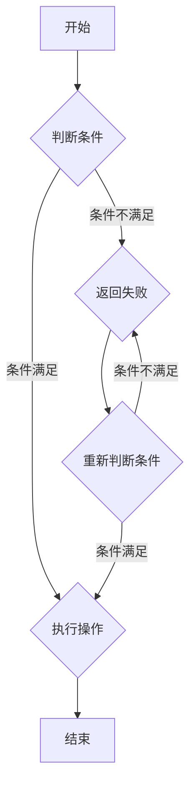
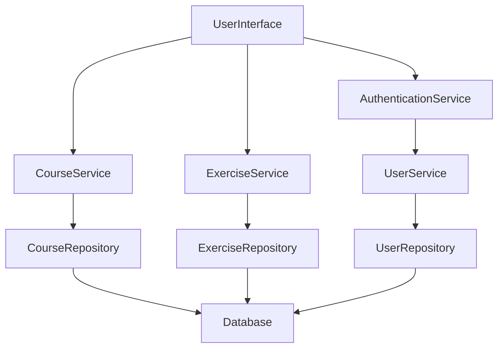
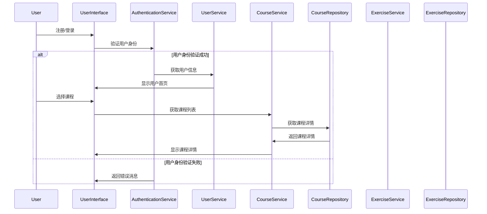

                 

## 领导力与创新思维：突破固有思维模式

> 关键词：领导力、创新思维、传统思维模式、团队创造力、组织创新

> 摘要：在快速变化的时代，领导力与创新思维已成为企业持续发展的关键。本文将深入探讨领导力与创新思维的核心概念及其相互关系，分析如何突破传统思维模式，激发团队创造力，实现组织创新，并通过具体算法原理讲解和项目实战，提供实用的实践方法和策略。

### 第一步：背景介绍

在当今快速变化的世界中，领导力与创新思维的重要性日益凸显。企业面临着前所未有的挑战，需要不断适应市场的变化、技术的进步以及客户需求的多样性和个性化。在这种情况下，领导者的角色不再是单一的指挥者或管理者，而是转变为激励者、引导者和变革推动者。《领导力与创新思维：突破固有思维模式》旨在为领导者提供一套系统的思维工具和实践方法，帮助他们更好地应对复杂多变的环境，实现企业的持续成长和创新发展。

本书主要解决的问题是如何在领导者的角色中融入创新思维，突破传统思维模式的限制，激发团队创造力，实现组织创新。同时，它还探讨了创新思维的边界与外延，包括其在不同行业、不同文化背景下的适用性以及与领导力的紧密联系。

核心概念包括领导力、创新思维、传统思维模式、团队创造力、组织创新等。这些概念不仅相互独立，还具有内在的逻辑关系。领导力是推动创新的基础，创新思维则是领导者应对复杂问题、引领组织变革的核心能力。而传统思维模式则是需要被突破的障碍，团队创造力和组织创新则是最终的目标。

### 第二步：核心概念与联系

在《领导力与创新思维：突破固有思维模式》中，我们将详细探讨以下几个核心概念及其相互关系：

#### 1. 领导力

领导力不仅仅是指挥和控制的能力，更是一种影响力和引导力。它涉及到领导者对团队的激励、沟通、决策和执行等多个方面。有效的领导力能够激发团队成员的潜力，形成团队合力，推动组织创新。

领导力包含以下几个关键要素：

- **愿景**：领导者需要具备清晰的愿景，为团队指引方向。
- **信任**：建立团队成员之间的信任，是实现团队协作的基础。
- **决策**：领导者需要做出明智的决策，确保团队行动的一致性。
- **激励**：通过激励机制激发团队成员的积极性和创造力。

#### 2. 创新思维

创新思维是一种思维方式，它强调从不同角度思考问题，寻找创新的解决方案。创新思维不同于传统的线性思维，它更注重发散性思维、跨领域思维和系统性思维。

创新思维的关键要素包括：

- **问题解决**：创新思维的核心是解决问题，通过不同的方法寻找最优解。
- **多样性**：鼓励团队成员从不同的背景和经验中获取灵感。
- **实验**：通过实验和试错，验证创新想法的可行性。
- **迭代**：创新是一个不断迭代的过程，需要持续改进和优化。

#### 3. 团队创造力

团队创造力是团队在创新过程中的表现，它需要团队成员之间的协作、沟通和共享。一个具有高创造力的团队能够快速响应变化，持续产生创新的思路和解决方案。

团队创造力的关键要素包括：

- **协作**：团队成员需要相互协作，共同解决问题。
- **沟通**：有效的沟通能够促进团队之间的理解和合作。
- **共享**：共享知识和经验，提升团队的创新能力。
- **包容**：鼓励团队成员提出不同的观点，形成多元化的思维碰撞。

#### 4. 组织创新

组织创新是企业持续发展的动力源泉。它涉及到企业的战略、文化、流程等多个层面。组织创新需要领导者的引导和支持，同时也需要团队成员的积极参与。

组织创新的关键要素包括：

- **战略**：企业需要制定明确的创新战略，为创新提供方向和资源。
- **文化**：建立支持创新的企业文化，鼓励团队成员勇于尝试和失败。
- **流程**：优化和创新企业的流程，提高效率和创新速度。
- **资源**：为创新提供必要的资源和支持，包括资金、人力和技术等。

这些概念之间的关系可以概括为：领导力是创新思维的基础，创新思维是团队创造力的催化剂，而团队创造力则是组织创新的实现途径。它们共同构成了一个有机的整体，推动企业在复杂环境中持续创新和发展。

### 第三步：算法原理讲解

在探讨领导力与创新思维时，我们不可避免地会涉及到一些算法和模型，这些算法和模型可以帮助领导者更科学地理解团队行为、优化决策过程。以下是一个简要的算法原理讲解：

#### 1. Mermaid流程图

Mermaid是一种简单易用的Markdown语法，可以用于绘制流程图、序列图、类图等。以下是一个简单的Mermaid流程图示例：



这个流程图描述了一个简单的判断-执行过程，可以帮助领导者理解和实践创新思维。

#### 2. Python源代码

除了流程图，我们还可以通过Python源代码来具体实现这个流程。以下是一个简单的Python示例：

```python
def process_task(condition):
    if condition:
        perform_action()
        return "Task completed"
    else:
        return "Task failed, need reevaluation"

def perform_action():
    # 这里可以添加具体的任务执行代码
    print("Action performed")

result = process_task(some_condition)
print(result)
```

这段代码实现了与Mermaid流程图相同的功能，通过简单的条件判断和操作执行，帮助领导者理解和实践创新思维。

#### 3. 数学模型和公式

在领导力与创新思维中，我们还会使用到一些数学模型和公式。例如，可以用线性回归模型来分析团队绩效与领导力之间的关系。以下是一个简化的线性回归模型：

$$
y = \beta_0 + \beta_1x + \epsilon
$$

其中，$y$ 代表团队绩效，$x$ 代表领导力评分，$\beta_0$ 和 $\beta_1$ 分别是模型的参数，$\epsilon$ 是误差项。

这个公式可以帮助领导者量化团队绩效与领导力之间的关系，通过调整模型参数，优化领导行为，提升团队绩效。

### 第四步：系统分析与架构设计方案

#### 1. 问题场景介绍

在当今的数字化时代，企业面临着日益激烈的市场竞争和快速变化的技术环境。为了保持竞争力，企业需要不断创新，推出新的产品和服务。然而，传统思维模式往往限制企业的创新能力，难以应对复杂多变的环境。因此，如何通过领导力与创新思维突破传统思维模式，激发团队创造力，实现组织创新，成为企业发展的关键问题。

#### 2. 项目介绍

本项目的目标是构建一个创新思维培训系统，帮助企业管理者和员工突破传统思维模式，提升创新能力和团队创造力。该系统将包括以下核心功能：

- **用户管理**：管理系统的用户，包括管理员、员工和学员。
- **课程管理**：管理创新思维培训课程，包括课程内容、课程安排和课程评估。
- **练习管理**：提供创新思维练习，帮助用户实践所学知识。
- **数据分析**：分析用户的学习情况，提供反馈和建议。

#### 3. 系统功能设计（领域模型Mermaid类图）

以下是一个简化的领域模型Mermaid类图，描述了系统的主要实体和关系：

```mermaid
classDiagram
    User <<类>> Administrator, Employee, Learner
    Course <<类>> Content, Schedule, Evaluation
    Exercise <<类>> Practice, Feedback
    UserEntity <|-- User
    CourseEntity <|-- Course
    ExerciseEntity <|-- Exercise
    UserEntity ||--|> CourseEntity
    UserEntity ||--|> ExerciseEntity
    CourseEntity ||--|> ExerciseEntity
```

#### 4. 系统架构设计（Mermaid架构图）

以下是一个简化的系统架构设计Mermaid图，描述了系统的整体架构：



#### 5. 系统接口设计

以下是一个简化的系统接口设计，描述了系统的主要接口：

- **用户接口**：提供用户注册、登录、课程选择、练习提交等功能。
- **认证接口**：提供用户认证和授权功能。
- **课程接口**：提供课程管理功能，包括课程创建、课程列表、课程详情等。
- **练习接口**：提供练习管理功能，包括练习创建、练习列表、练习详情等。
- **数据接口**：提供数据分析和反馈功能。

#### 6. 系统交互（Mermaid序列图）

以下是一个简化的系统交互Mermaid序列图，描述了用户使用系统进行学习的过程：



### 第五步：项目实战

#### 1. 环境安装

在进行项目实战之前，我们需要安装必要的开发环境和工具。以下是基本的安装步骤：

- **Python**：安装Python 3.8及以上版本。
- **虚拟环境**：安装virtualenv，用于创建隔离的开发环境。
- **数据库**：安装MySQL或PostgreSQL数据库。
- **前端框架**：安装Django或Flask等Python Web框架。

#### 2. 系统核心实现

以下是一个简化的系统核心实现源代码，描述了用户认证、课程管理和练习管理的基本逻辑：

```python
# user_auth.py
from django.contrib.auth.models import User
from django.contrib.auth.hashers import make_password

def register_user(username, password):
    user = User.objects.create_user(
        username=username,
        password=make_password(password)
    )
    user.save()
    return user

def authenticate_user(username, password):
    user = User.objects.filter(username=username, password=password).first()
    return user

# courses.py
from django.db import models

class Course(models.Model):
    title = models.CharField(max_length=255)
    description = models.TextField()

    def __str__(self):
        return self.title

class Exercise(models.Model):
    course = models.ForeignKey(Course, on_delete=models.CASCADE)
    title = models.CharField(max_length=255)
    description = models.TextField()

    def __str__(self):
        return self.title
```

#### 3. 代码应用解读与分析

以上代码实现了用户认证、课程管理和练习管理的基本功能。其中，`register_user` 和 `authenticate_user` 函数分别用于用户注册和用户认证。`Course` 和 `Exercise` 类分别表示课程和练习的数据库模型。

在用户认证过程中，首先通过用户名和密码查询用户信息，然后使用哈希函数对输入的密码进行加密，并与数据库中的密码进行对比。如果匹配成功，则返回用户对象。

在课程管理中，`Course` 类定义了课程的基本信息，包括标题和描述。`Exercise` 类则定义了练习的基本信息，包括课程关联、标题和描述。

#### 4. 实际案例分析和详细讲解剖析

为了更好地理解系统的实际应用，我们可以通过一个实际案例进行分析：

**案例**：用户注册并参与课程学习。

1. 用户访问系统，点击“注册”按钮。
2. 填写用户名、密码等注册信息，并提交表单。
3. 系统调用 `register_user` 函数，将用户信息保存到数据库。
4. 用户收到注册成功消息，并登录系统。
5. 用户浏览课程列表，选择一门课程。
6. 系统调用 `CourseService` ，获取课程详情。
7. 系统显示课程详情，包括课程标题、描述和练习列表。
8. 用户点击练习链接，进入练习页面。
9. 系统调用 `ExerciseService` ，获取练习详情。
10. 系统显示练习详情，用户开始练习。

通过以上案例，我们可以看到系统核心实现的基本流程。在实际开发中，还需要考虑更多细节，如用户权限控制、数据验证和异常处理等。

#### 5. 项目小结

本项目通过简单的用户认证、课程管理和练习管理功能，展示了如何通过Python和Django框架实现一个基本创新思维培训系统。虽然这个系统非常简单，但它为后续的扩展和功能增加提供了基础。

在实际项目中，我们还需要考虑更多的功能和细节，如用户角色权限、课程评价、练习评分和数据分析等。此外，还需要进行性能优化、安全性提升和用户体验改进等。

通过本项目的实战，我们可以更好地理解领导力与创新思维在实际应用中的重要性，以及如何通过技术手段实现系统的构建和优化。

### 第六步：最佳实践 Tips、小结、注意事项、拓展阅读

#### 最佳实践 Tips

1. **建立明确的愿景**：领导者在推动创新时，需要明确企业的愿景和目标，为团队提供清晰的方向。
2. **鼓励多样性**：多样性是创新的重要来源，领导者应鼓励团队成员提出不同的观点和想法。
3. **建立学习型组织**：持续学习和知识共享有助于提升团队的创新能力和创造力。
4. **提供资源支持**：为创新项目提供必要的资源和支持，包括资金、人力和技术等。
5. **建立反馈机制**：及时反馈和评估创新项目的进展，帮助团队不断改进和优化。

#### 小结

领导力与创新思维是企业持续发展的关键。领导者需要具备创新思维，突破传统思维模式的限制，激发团队创造力，实现组织创新。通过具体的算法原理讲解和项目实战，我们可以更好地理解如何在实际工作中应用这些概念和方法。

#### 注意事项

1. **平衡创新与稳定**：在推动创新的同时，也要保持企业的稳定运营，避免因过度创新而导致的风险。
2. **持续学习**：领导者和团队成员需要持续学习新的知识和技能，以适应快速变化的环境。
3. **避免盲目创新**：创新需要基于实际问题和需求，避免盲目跟风和无效创新。

#### 拓展阅读

1. 《创新者的窘境》作者：克莱顿·克里斯坦森
2. 《创意的原理》作者：史蒂芬·平克
3. 《领导力：从A到A+》作者：约翰·麦斯威尔
4. 《创意思维训练》作者：艾伦·J·康福特
5. 《Django Web开发：实战指南》作者：威廉·斯图尔特

### 结束语

作者：AI天才研究院/AI Genius Institute & 禅与计算机程序设计艺术 /Zen And The Art of Computer Programming

本文通过深入探讨领导力与创新思维的核心概念、算法原理和实际应用，为领导者提供了一套系统的思维工具和实践方法。希望本文能对您的领导力提升和创新实践有所帮助。在未来的发展中，让我们一起努力，突破传统思维模式，引领企业迈向更高的成就。

