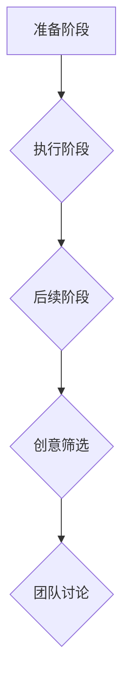
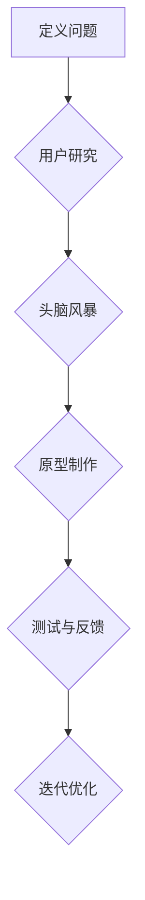

                 

### 引言

#### 1.1 问题背景

在当今快速变化和竞争激烈的市场环境中，企业的成功越来越依赖于其创新能力。而创新能力的提升离不开有效的领导力管理。领导力不仅关系到团队的组织和协调，更是推动创新管理的关键因素。传统的领导方式往往注重权威和指令，而现代领导力强调的是激励、协作和赋能。创新管理则是通过系统的方法和流程，将创意转化为实际的产品或服务，从而实现组织的持续发展。

随着全球化和信息技术的迅猛发展，现代组织面临着前所未有的挑战。这些挑战包括市场需求的快速变化、技术进步的迅猛发展、员工多样性的增加以及全球化的竞争压力等。为了应对这些挑战，组织需要构建一种能够持续创新的管理体系，这离不开卓越的领导力和创新管理能力。

本书旨在探讨领导力与创新管理之间的关系，以及如何从创意到实施的全过程有效地进行创新管理。通过系统地分析领导力的基本原理、创新管理的核心概念和实施方法，本书希望能够为读者提供一种全面、实用的创新管理框架，帮助组织在激烈的市场竞争中脱颖而出。

#### 1.2 核心概念

**领导力**：领导力是一种能力，它涉及激励、指导、影响和协调他人，以实现共同的目标。领导力不仅仅是管理职位所具备的特质，它也是每个人都能学习和提升的技能。领导力包括多个方面，如沟通能力、决策能力、团队建设、变革管理等。

**创新管理**：创新管理是一种系统的方法，它涉及识别、开发、实施和评估新的创意或方法。创新管理不仅包括技术层面的创新，还包括组织结构、流程和文化的创新。创新管理的关键在于如何将创意转化为实际的产品或服务，并实现商业价值。

**从创意到实施的全过程**：从创意到实施的全过程是指将一个创意从产生、发展、测试到最终实施的完整流程。这个过程包括多个阶段，如创意生成、创意开发、创意评估、创意实施等。每个阶段都需要特定的方法和工具来确保创意的有效性和可行性。

#### 1.3 边界与外延

**领导力与创新管理的范畴**：领导力的范畴通常包括组织内部的管理和协调，而创新管理的范畴则更广泛，它不仅涉及组织内部，还包括外部环境中的创新活动，如市场研究、合作伙伴关系等。

**领导力与创新管理的关系**：领导力是创新管理的核心驱动力，它直接影响创新过程的有效性。而创新管理则为领导力提供了实践的平台，通过创新成果的实现来验证领导力的有效性。

**概念结构与核心要素组成**：领导力与创新管理是一个复杂而相互关联的系统。领导力的核心要素包括沟通能力、决策能力、团队建设和变革管理；创新管理的核心要素包括创意生成、创意开发、创意评估和创意实施。这两个系统通过有效的整合，共同推动组织的创新和发展。

#### 1.4 概念结构与核心要素组成

**领导力与创新管理的结构**：领导力与创新管理可以被视为两个相互交织的系统。领导力系统侧重于人的管理和激励，而创新管理系统则侧重于创意的产生和实施。

**核心概念之间的关系**：领导力与创新管理之间的核心关系体现在以下几个方面：
1. **目标一致性**：领导力的目标是通过激励和指导团队实现组织的愿景和目标，而创新管理的目标是通过创新实现组织的持续发展。这两个目标在本质上是一致的。
2. **资源分配**：领导力为创新管理提供必要的资源，包括人力、财力和技术资源。创新管理则通过有效的资源利用，提升组织的创新能力。
3. **协作与沟通**：领导力通过建立有效的沟通机制和协作环境，促进创新过程中的信息交流和知识共享。

#### 1.5 本章小结

在本章中，我们探讨了领导力与创新管理的背景、核心概念及其关系。通过分析领导力的基本原理和创新管理的流程，我们明确了这两个概念在组织创新和发展中的重要作用。本章的内容为后续章节的深入讨论奠定了基础，也为读者提供了理解和应用领导力与创新管理的框架。

---

本章首先介绍了领导力与创新管理在现代组织中的重要性，分析了它们在应对市场挑战中的关键角色。随后，我们详细阐述了领导力、创新管理和从创意到实施的全过程这三个核心概念，并讨论了它们的边界与外延。通过分析领导力与创新管理的概念结构和核心要素组成，我们揭示了这两个系统之间的相互关系和互动机制。本章的内容不仅为全书的内容框架搭建了基础，也为读者提供了理解和应用领导力与创新管理的基本知识。在接下来的章节中，我们将进一步探讨领导力与创新管理的具体实践和方法。

---

## 1.6 深入探讨

在深入探讨领导力与创新管理时，我们需要更加细致地分析这两个概念的定义、核心要素以及它们在组织中的具体应用。

### 领导力的定义与核心要素

领导力是一种能力，它涉及激励、指导、影响和协调他人，以实现共同的目标。领导力不仅仅是管理职位所具备的特质，它也是每个人都能学习和提升的技能。领导力的核心要素包括：

1. **沟通能力**：有效的沟通是领导力的基础。领导者需要能够清晰、准确地表达自己的想法，同时也需要倾听和理解他人的观点和需求。
   
2. **决策能力**：领导者需要具备快速做出明智决策的能力。这包括分析问题、权衡利弊、预测后果等。

3. **团队建设**：领导者负责建立和维持一个高效的团队。这需要领导者能够识别团队成员的特长和需求，并合理分配任务，以最大化团队的整体效能。

4. **变革管理**：随着外部环境的不断变化，组织需要不断进行变革以保持竞争力。领导者在这个过程中扮演着关键角色，他们需要能够推动变革，激励团队成员接受和适应变革。

### 创新管理的定义与核心要素

创新管理是一种系统的方法，它涉及识别、开发、实施和评估新的创意或方法。创新管理不仅包括技术层面的创新，还包括组织结构、流程和文化的创新。创新管理的核心要素包括：

1. **创意生成**：创意是创新管理的起点。创新管理需要建立一套机制来鼓励和收集创意，包括头脑风暴、开放式创新等。

2. **创意开发**：创意生成后，需要对其进行细化和完善。这一阶段包括验证创意的可行性、制定详细的实施计划等。

3. **创意评估**：评估创意的质量和潜在的商业价值是创新管理的重要环节。这需要建立一套评估标准和方法，如市场调研、成本效益分析等。

4. **创意实施**：创意经过评估后，需要制定具体的实施计划，并分配资源进行实施。这一阶段需要确保创意能够顺利落地，并实现预期的效果。

### 从创意到实施的全过程

从创意到实施的全过程是指将一个创意从产生、发展、测试到最终实施的完整流程。这个过程包括多个阶段，每个阶段都需要特定的方法和工具来确保创意的有效性和可行性。

1. **创意生成**：这一阶段的目标是产生尽可能多的创意。可以通过头脑风暴、开放式创新、用户调研等方法来收集创意。

2. **创意开发**：在创意生成后，需要对创意进行细化和完善。这一阶段包括验证创意的可行性、制定详细的实施计划等。

3. **创意评估**：评估创意的质量和潜在的商业价值。可以通过市场调研、成本效益分析等方法来评估创意。

4. **创意实施**：在评估完成后，制定具体的实施计划，并分配资源进行实施。这一阶段需要确保创意能够顺利落地，并实现预期的效果。

### 领导力与创新管理的关系

领导力与创新管理之间存在着密切的关系。领导力为创新管理提供了动力和方向，而创新管理则为领导力提供了实践的舞台。

1. **领导力对创新管理的影响**：领导力直接影响创新管理的效率和效果。领导者的决策能力、沟通能力和团队建设能力等都会影响创新管理的进程。

2. **创新管理对领导力的要求**：创新管理对领导者提出了更高的要求。领导者不仅需要具备传统的领导力技能，还需要具备创新思维、风险管理和跨部门协作等能力。

3. **领导力与创新管理的互动机制**：领导力和创新管理是一个动态的互动过程。领导力通过激励和指导推动创新管理，而创新管理通过实现创新成果来验证和提升领导力。

### 概念结构与核心要素组成

领导力与创新管理可以被视为两个相互交织的系统。领导力系统侧重于人的管理和激励，而创新管理系统则侧重于创意的产生和实施。

1. **领导力系统**：领导力系统包括沟通能力、决策能力、团队建设和变革管理等核心要素。这些要素相互作用，共同构成一个高效的领导力体系。

2. **创新管理系统**：创新管理系统包括创意生成、创意开发、创意评估和创意实施等核心要素。这些要素相互衔接，形成一个完整的创新管理流程。

3. **核心概念之间的关系**：领导力与创新管理之间的核心关系体现在以下几个方面：

   - **目标一致性**：领导力的目标是通过激励和指导团队实现组织的愿景和目标，而创新管理的目标是通过创新实现组织的持续发展。这两个目标在本质上是一致的。

   - **资源分配**：领导力为创新管理提供必要的资源，包括人力、财力和技术资源。创新管理则通过有效的资源利用，提升组织的创新能力。

   - **协作与沟通**：领导力通过建立有效的沟通机制和协作环境，促进创新过程中的信息交流和知识共享。

通过深入探讨领导力与创新管理的核心概念及其关系，我们可以更清晰地理解这两个概念在组织创新和发展中的重要作用。在接下来的章节中，我们将进一步探讨领导力与创新管理的具体实践和方法。

### 1.7 结论

在本章中，我们深入探讨了领导力与创新管理的基本概念及其在组织创新和发展中的重要性。首先，我们明确了领导力的定义和核心要素，包括沟通能力、决策能力、团队建设和变革管理。接着，我们介绍了创新管理的概念，详细阐述了创意生成、创意开发、创意评估和创意实施等关键环节。通过分析从创意到实施的全过程，我们揭示了领导力与创新管理之间的密切关系。

领导力不仅为创新管理提供了动力和方向，而且通过有效的沟通和资源分配，推动创新管理的顺利进行。创新管理则为领导力提供了实践的舞台，通过实现创新成果来验证和提升领导力。领导力与创新管理的整合是组织持续创新和发展的关键。

接下来，我们将进一步探讨领导力基础的深入细节，包括领导力理论、领导风格与行为、领导者角色与责任等。这将为我们理解如何构建有效的领导力体系奠定基础，为后续章节的内容提供深入的理论支持。

---

## 2.1 领导力原理

### 2.1.1 领导力理论概述

领导力理论是研究领导行为、领导风格以及领导者与团队互动关系的学科。自20世纪初以来，领导力理论经历了多个发展阶段，主要包括传统领导理论、行为领导理论、情境领导理论和变革领导理论等。

**传统领导理论**：传统领导理论主要基于领导者特质的观点，认为领导者天生具备某些特质，如智慧、自信、决断力等。这些特质使得领导者能够影响和指导他人。代表性的理论有泰勒的“科学管理理论”和赫茨伯格的“双因素理论”。

**行为领导理论**：行为领导理论强调领导者行为的可学习和可改变性，而非领导者天生具备的特质。这类理论通过研究领导者的行为模式，将其分类为不同的领导风格。例如，俄亥俄州立大学的研究发现，领导者的行为可以分为关心任务和关心人两大类。

**情境领导理论**：情境领导理论认为，领导者的风格应随环境和团队成员的变化而变化。赫塞和布兰查德的情境领导理论提出，领导者应根据下属的成熟度水平选择不同的领导风格。成熟度包括心理成熟度和工作成熟度，领导者应根据下属的成熟度选择合适的领导风格，以达到最佳效果。

**变革领导理论**：变革领导理论关注领导者如何推动组织变革，以适应外部环境的变化。这类理论认为，领导者的角色是变革的推动者，通过愿景、激励和变革管理策略来引导团队实现变革。代表性的理论有约翰·科特的“领导变革模型”和詹姆斯·库泽斯与巴里·波斯纳的“变革型领导理论”。

### 2.1.2 领导风格与领导行为

领导风格是领导者处理工作和管理团队的方式，不同的领导风格会对团队绩效和组织文化产生不同的影响。常见的领导风格包括：

**权威型领导**：权威型领导强调控制、指令和决策的集中。领导者制定明确的目标和规范，并对团队成员的行为进行严格的监督和指导。这种风格在需要迅速做出决策和保证任务完成的情境中非常有效。

**民主型领导**：民主型领导鼓励团队参与决策过程，重视团队成员的意见和建议。领导者通过讨论、协商和共识来制定决策，从而增强团队的凝聚力和成员的归属感。这种风格适合需要创新和团队协作的项目。

**参与型领导**：参与型领导与民主型领导相似，但更加侧重于团队成员的参与程度。领导者不仅鼓励团队成员参与决策，还赋予他们更多的自主权和责任，以提高他们的积极性和创造力。

**变革型领导**：变革型领导通过激发团队成员的内在动机和愿景，引导他们超越自我，实现组织的目标。这种领导风格强调领导者的愿景和价值观，鼓励团队成员进行创新和变革。

**教练型领导**：教练型领导注重团队成员的个人成长和发展，通过提供指导、反馈和支持，帮助他们提升技能和实现目标。这种领导风格适合知识型团队和需要持续学习的组织。

**放任型领导**：放任型领导给予团队成员最大的自由和自主权，很少进行干预或指导。领导者相信团队成员能够自我管理和完成任务。这种风格在高度自我驱动和自主性的团队中可能效果较好，但在需要紧密协作和监督的项目中可能不太适用。

### 2.1.3 领导者角色与责任

领导者的角色和责任是领导力的重要组成部分。有效的领导者不仅需要具备一定的技能和风格，还需要明确自己的角色和责任，以更好地发挥领导作用。

**领导者角色**：

1. **愿景设定者**：领导者需要设定清晰、有吸引力的愿景，为组织指明方向。愿景不仅需要具有指导性，还需要能够激发团队成员的热情和动力。

2. **变革推动者**：在快速变化的市场环境中，领导者需要推动组织的变革，以适应外部环境的变化。这包括推动创新、调整战略和优化流程等。

3. **团队成员的教练和导师**：领导者需要关注团队成员的个人成长和发展，提供必要的指导和支持，帮助他们提升技能和实现目标。

4. **沟通者和协调者**：领导者需要建立有效的沟通机制，确保信息在组织内部的高效传递和共享。同时，领导者还需要协调不同团队和部门之间的关系，促进协同合作。

**领导者责任**：

1. **团队绩效**：领导者需要确保团队实现预期的绩效目标。这包括设定明确的目标、制定详细的计划、监控进度并提供必要的资源和支持。

2. **员工发展**：领导者需要关注团队成员的个人成长和发展，提供培训和发展机会，帮助他们在职业生涯中不断进步。

3. **组织文化**：领导者需要塑造和维持积极的组织文化，鼓励创新、合作和透明度，以提升组织的整体绩效和竞争力。

4. **道德和价值观**：领导者需要树立良好的道德榜样，遵守组织的价值观和原则，为团队成员树立正确的行为标准。

通过深入理解领导力理论、领导风格和领导者角色与责任，我们可以更有效地提升领导力，推动组织的创新和发展。在接下来的章节中，我们将继续探讨领导力技能的提升方法和领导力在具体实践中的应用。

### 2.2 领导力技能

领导力不仅仅是天生的特质，它也是一种可以通过学习和实践不断提升的技能。有效的领导力不仅能够提升团队绩效，还能激发团队成员的创造力和积极性。在本节中，我们将重点探讨领导力技能的提升方法，包括沟通能力、决策能力和领导力发展等。

#### 2.2.1 沟通能力

沟通能力是领导力的核心组成部分。有效的沟通能够确保信息在组织内部的准确传递，减少误解和冲突，增强团队的凝聚力。以下是一些提升沟通能力的建议：

1. **倾听**：良好的沟通始于倾听。领导者需要耐心地倾听团队成员的意见和需求，以了解他们的想法和感受。这不仅能够建立信任，还能为决策提供更多的信息。

   **Mermaid 流程图**：
   ```mermaid
   graph TD
   A[倾听] --> B{了解需求}
   B --> C{反馈}
   C --> D{制定决策}
   ```

2. **清晰表达**：领导者需要能够用简洁、明确的语言表达自己的观点和期望。这可以通过提前准备、练习演讲和撰写清晰的报告来实现。

3. **反馈与反馈**：领导者需要提供及时的、具体的反馈，帮助团队成员改进工作。同时，领导者也应该鼓励团队成员互相反馈，促进团队的成长。

   **Mermaid 流程图**：
   ```mermaid
   graph TD
   A[反馈] --> B{改进}
   B --> C{持续反馈}
   C --> D{成长}
   ```

4. **沟通工具**：利用现代沟通工具，如电子邮件、即时通讯和视频会议，可以更有效地传递信息。领导者需要选择合适的沟通工具，以适应不同的情况和团队需求。

   **Python 源代码示例**：
   ```python
   def choose_communication_tool(context):
       if context == "urgent":
           return "Instant Messaging"
       elif context == "complex":
           return "Video Conference"
       else:
           return "Email"
   ```

#### 2.2.2 决策能力

决策能力是领导力的另一个关键要素。领导者需要能够在复杂和不确定的环境中进行有效的决策，以确保团队的顺利运作和目标的实现。以下是一些提升决策能力的建议：

1. **收集信息**：在做出决策之前，领导者需要充分收集和分析相关信息。这包括市场调研、财务数据、团队成员的建议等。

   **Mermaid 流程图**：
   ```mermaid
   graph TD
   A[收集信息] --> B{分析数据}
   B --> C{评估选项}
   C --> D{做出决策}
   ```

2. **制定备选方案**：领导者应该考虑多个可能的解决方案，并为每个方案制定备选方案。这有助于在出现问题时迅速应对。

   **Python 源代码示例**：
   ```python
   def make_decision(options, alternatives):
       for option in options:
           print(f"Option: {option}")
           for alternative in alternatives:
               print(f"Alternative for {option}: {alternative}")
   ```

3. **权衡利弊**：领导者需要能够权衡不同方案的成本和收益，选择最优的方案。这可以通过制定详细的成本效益分析来实现。

   **LaTeX 数学公式**：
   $$ CBA = \frac{B}{C} $$
   其中，$CBA$ 表示成本效益分析，$B$ 表示收益，$C$ 表示成本。

4. **团队合作**：领导者应该鼓励团队成员参与决策过程，通过团队合作来提高决策的质量和可执行性。

   **Mermaid 流程图**：
   ```mermaid
   graph TD
   A[团队合作] --> B{讨论方案}
   B --> C{决策制定}
   C --> D{执行决策}
   ```

#### 2.2.3 领导力发展

领导力发展是一个持续的过程，需要领导者不断学习和实践。以下是一些提升领导力发展的建议：

1. **自我反思**：领导者需要定期进行自我反思，了解自己的优点和不足，并制定改进计划。这可以通过写日记、参加研讨会或咨询导师来实现。

   **Python 源代码示例**：
   ```python
   def self_reflection():
       print("反思自己的领导力：")
       print("优点：")
       print("不足：")
       print("改进计划：")
   ```

2. **持续学习**：领导者需要不断学习新的知识和技能，以适应不断变化的环境。这可以通过阅读书籍、参加培训课程或在线学习来实现。

3. **实践与反馈**：领导者需要通过实践来提升自己的领导力，并通过反馈来不断改进。这可以通过参与项目、担任志愿者或加入领导力发展社区来实现。

   **LaTeX 数学公式**：
   $$ \text{反馈} = \text{实践} \times \text{反思} $$
   其中，反馈是实践和反思的结果。

4. **建立人脉**：领导者需要建立广泛的人脉网络，以获取新的观点和资源。这可以通过参加行业会议、加入专业组织和建立社交媒体联系来实现。

   **Mermaid 流程图**：
   ```mermaid
   graph TD
   A[建立人脉] --> B{获取资源}
   B --> C{学习新知}
   C --> D{提升领导力}
   ```

通过提升沟通能力、决策能力和领导力发展，领导者可以更有效地管理团队，推动组织的创新和发展。在接下来的章节中，我们将继续探讨领导力在具体实践中的应用，以及如何通过有效的领导力实现创新管理。

### 2.3 领导力实践

#### 2.3.1 团队建设

团队建设是领导力实践中的一个关键环节，它关系到团队的凝聚力和工作效率。有效的团队建设不仅能提升团队的协作能力，还能激发团队成员的创造力和积极性。以下是一些团队建设的具体方法和策略：

1. **明确团队目标和愿景**：团队建设的第一步是确保团队成员对团队的目标和愿景有清晰的认识。领导者需要与团队成员共同制定明确的目标，并解释这些目标的意义和重要性。

   **Mermaid 流程图**：
   ```mermaid
   graph TD
   A[明确目标] --> B{解释意义}
   B --> C{共识达成}
   C --> D{目标实现}
   ```

2. **建立信任**：信任是团队协作的基石。领导者需要通过开放、诚实和透明的沟通来建立信任。这可以通过团队会议、定期反馈和共同解决问题来实现。

   **Python 源代码示例**：
   ```python
   def build_trust(meeting, feedback, problem_solving):
       print(f"Holding a {meeting} to build trust.")
       print(f"Providing regular {feedback} to maintain transparency.")
       print(f"Engaging in {problem_solving} to show commitment.")
   ```

3. **分工与协作**：领导者需要合理分配任务，确保每个成员都能发挥自己的特长。同时，领导者还需要建立有效的协作机制，促进团队成员之间的沟通和合作。

   **Mermaid 流程图**：
   ```mermaid
   graph TD
   A[分工] --> B{协作机制}
   B --> C{任务完成}
   C --> D{团队目标达成}
   ```

4. **培养团队文化**：团队文化是团队内在的精神和价值观。领导者需要通过活动和仪式来培养和强化团队文化。这可以包括团队建设活动、庆祝团队成就和共享价值观。

   **Python 源代码示例**：
   ```python
   def cultivate_culture(event, celebration, values):
       print(f"Organizing a {event} to foster team spirit.")
       print(f"Celebrating team achievements with a {celebration}.")
       print(f"Reinforcing our shared values through daily practices.")
   ```

5. **持续反馈与改进**：团队建设是一个持续的过程，需要不断地反馈和改进。领导者需要定期评估团队的建设情况，并根据反馈进行调整。

   **LaTeX 数学公式**：
   $$ \text{团队建设} = \text{反馈} \times \text{改进} $$

#### 2.3.2 领导力在组织变革中的应用

在快速变化的市场环境中，组织需要不断地进行变革以保持竞争力。领导力在组织变革中起着至关重要的作用，以下是一些领导力在组织变革中的应用策略：

1. **愿景与战略**：领导者需要明确组织的愿景和战略，并确保团队成员理解和认同这些目标和方向。这可以通过沟通会议、培训课程和战略规划来实现。

   **Mermaid 流程图**：
   ```mermaid
   graph TD
   A[制定愿景] --> B{战略规划}
   B --> C{沟通会议}
   C --> D{培训课程}
   ```

2. **变革管理**：领导者需要制定详细的变革管理计划，包括变革的步骤、时间表和资源分配。同时，领导者还需要识别和解决变革过程中可能出现的问题和阻力。

   **Python 源代码示例**：
   ```python
   def manage_change(plan, timeline, resources):
       print(f"Developing a {plan} for organizational change.")
       print(f"Establishing a {timeline} to guide the process.")
       print(f"Allocating {resources} to support the transition.")
   ```

3. **激励与支持**：领导者需要通过激励和提供支持来帮助团队成员适应变革。这可以包括奖励机制、培训机会和心理支持。

   **LaTeX 数学公式**：
   $$ \text{激励} = \text{支持} + \text{奖励} $$

4. **沟通与反馈**：领导者需要保持与团队成员的沟通，及时传达变革的进展和成果。同时，领导者还需要鼓励团队成员提供反馈，以不断改进变革过程。

   **Mermaid 流程图**：
   ```mermaid
   graph TD
   A[沟通] --> B{反馈}
   B --> C{改进}
   C --> D{持续变革}
   ```

#### 2.3.3 领导力案例分析

为了更好地理解领导力在团队建设和组织变革中的应用，以下是一些真实的领导力案例分析：

**案例一：谷歌的团队建设**

谷歌以其卓越的团队建设而闻名。谷歌的领导者通过开放的文化、灵活的工作时间和创新的工作方式，极大地激发了团队成员的创造力和积极性。谷歌的“20%项目”允许员工将20%的工作时间用于他们感兴趣的项目，这极大地促进了创新和团队协作。

**案例二：苹果公司的组织变革**

在史蒂夫·乔布斯的领导下，苹果公司进行了一系列重大变革，使其在竞争激烈的市场中保持领先地位。乔布斯通过明确的愿景和战略，激励团队成员不断创新，并通过严格的品质控制和用户体验设计，实现了产品的高质量和市场成功。

**案例三：日本企业的长期文化**

日本企业的长期文化强调团队合作、持续改进和尊重传统。领导者通过培养员工的忠诚度和责任感，建立了一种稳定而高效的团队文化，使企业在长期竞争中获得成功。

通过这些案例分析，我们可以看到领导力在团队建设和组织变革中的关键作用。有效的领导力不仅能够提升团队的凝聚力和工作效率，还能推动组织的持续创新和变革。

### 2.4 本章小结

在本章中，我们详细探讨了领导力原理，包括领导力理论、领导风格与行为以及领导者角色与责任。我们了解了不同领导力理论的发展历程，并分析了权威型、民主型、参与型、变革型和教练型等领导风格的特点。此外，我们还探讨了领导者的角色和责任，包括愿景设定、变革推动、团队成员的教练和导师、沟通者与协调者等。

接着，我们讨论了领导力技能的提升方法，包括沟通能力、决策能力和领导力发展。通过倾听、清晰表达、反馈与反馈，以及利用沟通工具，领导者可以提升沟通能力。通过收集信息、制定备选方案、权衡利弊和团队合作，领导者可以提升决策能力。通过自我反思、持续学习和实践与反馈，领导者可以不断提升自己的领导力。

最后，我们探讨了领导力在团队建设和组织变革中的应用，并提供了具体的实践方法和策略。通过明确团队目标和愿景、建立信任、分工与协作、培养团队文化以及持续反馈与改进，领导者可以有效地建设团队。通过愿景与战略、变革管理、激励与支持、沟通与反馈，领导者可以有效地推动组织变革。

通过本章的学习，我们不仅了解了领导力的基础知识，还掌握了提升领导力技能和在实际应用中如何发挥领导力的具体方法。在接下来的章节中，我们将继续探讨创新管理的核心概念和方法，为全面理解领导力与创新管理的关系奠定基础。

---

## 2.5 深入探讨

在深入探讨领导力原理时，我们需要更加细致地分析领导力的核心理论、领导风格及其应用，并探讨领导者如何通过有效的实践来提升团队绩效和组织发展。

### 领导力的核心理论

领导力理论的发展经历了多个阶段，从早期的特质理论到行为理论，再到情境理论，每一种理论都有其独特的视角和贡献。

**特质理论**：特质理论认为领导者天生具备某些独特的特质，如智慧、自信、决断力等。这类理论试图通过研究成功领导者的特质来识别优秀领导者的标准。然而，随着研究的深入，人们发现领导力不仅仅是天生的特质，更多的是可以通过后天培养和发展的能力。

**行为理论**：行为理论关注领导者的行为模式，认为领导力可以通过学习和模仿来提升。这类理论通过观察和分析领导者的行为，将其分类为不同的领导风格。例如，俄亥俄州立大学的研究发现，领导者的行为可以归纳为关心任务和关心人两大类。这种理论强调，领导风格可以根据具体情境进行调整，以提高领导效果。

**情境理论**：情境理论认为，领导风格应随环境和团队成员的变化而变化。赫塞和布兰查德的情境领导理论提出，领导者应根据下属的成熟度水平选择不同的领导风格。成熟度包括心理成熟度和工作成熟度，领导者应根据下属的成熟度选择合适的领导风格，以达到最佳效果。这种理论强调了领导行为的动态性和适应性。

**变革领导理论**：变革领导理论关注领导者如何推动组织变革，以适应外部环境的变化。这类理论认为，领导者的角色是变革的推动者，通过愿景、激励和变革管理策略来引导团队实现变革。约翰·科特的“领导变革模型”和詹姆斯·库泽斯与巴里·波斯纳的“变革型领导理论”是这一领域的代表性理论。

### 领导风格的应用

领导风格是领导者处理工作和管理团队的方式，不同的领导风格会对团队绩效和组织文化产生不同的影响。以下是一些常见领导风格及其应用：

**权威型领导**：权威型领导强调控制、指令和决策的集中。领导者制定明确的目标和规范，并对团队成员的行为进行严格的监督和指导。这种风格在需要迅速做出决策和保证任务完成的情境中非常有效。例如，在应对紧急情况或执行军事任务时，权威型领导可以迅速做出决策并确保任务的执行。

**民主型领导**：民主型领导鼓励团队参与决策过程，重视团队成员的意见和建议。领导者通过讨论、协商和共识来制定决策，从而增强团队的凝聚力和成员的归属感。这种风格适合需要创新和团队协作的项目。例如，在研发新产品或进行市场策略调整时，民主型领导可以充分发挥团队成员的智慧和创造力。

**参与型领导**：参与型领导与民主型领导相似，但更加侧重于团队成员的参与程度。领导者不仅鼓励团队成员参与决策，还赋予他们更多的自主权和责任，以提高他们的积极性和创造力。这种风格适合高度知识密集型团队和需要持续创新的组织。例如，在高科技企业和创业公司中，参与型领导可以激发团队成员的创新热情和创业精神。

**变革型领导**：变革型领导通过激发团队成员的内在动机和愿景，引导他们超越自我，实现组织的目标。这种领导风格强调领导者的愿景和价值观，鼓励团队成员进行创新和变革。例如，在组织面临重大变革或转型时，变革型领导可以激励团队成员积极应对变化，推动组织的持续发展。

**教练型领导**：教练型领导注重团队成员的个人成长和发展，通过提供指导、反馈和支持，帮助他们提升技能和实现目标。这种领导风格适合知识型团队和需要持续学习的组织。例如，在教育和培训领域，教练型领导可以指导学生或员工提升专业能力和职业素养。

### 领导者如何提升团队绩效

领导者通过有效的领导实践，可以显著提升团队绩效和组织发展。以下是一些提升团队绩效的具体方法：

1. **明确目标和期望**：领导者需要与团队成员共同制定明确的目标，并确保每个成员都清楚自己的职责和期望。这可以通过定期会议、目标和关键结果（OKRs）的设定来实现。

2. **提供资源和支持**：领导者需要确保团队成员有足够的资源和支持来完成他们的任务。这包括提供必要的培训、工具和技术支持。

3. **激励和认可**：领导者需要通过激励和认可来激励团队成员，提高他们的积极性和创造力。这可以通过奖励机制、表彰活动和公开表扬来实现。

4. **培养团队文化**：领导者需要培养积极、健康和富有活力的团队文化。这可以通过团队建设活动、共享价值观和共同目标来实现。

5. **有效沟通**：领导者需要建立有效的沟通机制，确保信息在组织内部的准确传递和共享。这可以通过定期会议、内部通讯和团队协作工具来实现。

6. **提供反馈和指导**：领导者需要提供及时的、具体的反馈和指导，帮助团队成员改进工作。这可以通过一对一的辅导、团队讨论和定期评估来实现。

7. **推动创新和变革**：领导者需要鼓励团队成员进行创新和变革，推动组织的持续发展。这可以通过建立创新机制、提供实验机会和鼓励试错来实现。

### 领导力实践案例分析

为了更好地理解领导力在实际应用中的效果，以下是一些真实的领导力实践案例分析：

**案例一：谷歌的领导力实践**

谷歌以其卓越的领导力和创新文化而闻名。谷歌的领导者通过开放的文化、灵活的工作时间和创新的工作方式，极大地激发了团队成员的创造力和积极性。谷歌的“20%项目”允许员工将20%的工作时间用于他们感兴趣的项目，这极大地促进了创新和团队协作。

**案例二：丰田的精益管理**

丰田公司通过精益管理实践，实现了卓越的生产效率和产品质量。丰田的领导者通过持续改进、团队合作和员工参与，建立了高效的制造体系和强大的企业文化。

**案例三：印度的社会企业家精神**

在印度，许多社会企业家通过领导力实践，推动了社会变革和经济发展。这些领导者通过创新的社会企业模式，解决了贫困、教育和医疗等社会问题，为社会带来了深远的影响。

通过深入探讨领导力的核心理论、领导风格和应用，我们可以更好地理解领导力在团队建设和组织变革中的关键作用。通过有效的领导实践，领导者可以提升团队绩效，推动组织的持续创新和发展。

### 2.6 结论

在本章中，我们深入探讨了领导力原理，分析了领导力理论的演进过程，包括传统领导理论、行为领导理论、情境领导理论和变革领导理论。通过了解这些理论，我们可以看到领导力不仅仅是天生的特质，它也是一种可以通过学习和实践不断提升的技能。

我们详细介绍了不同的领导风格，如权威型、民主型、参与型、变革型和教练型，并探讨了每种风格的适用情境。此外，我们还讨论了领导者的角色与责任，包括愿景设定、变革推动、团队成员的教练和导师、沟通者与协调者等。

在领导力技能提升方面，我们提出了提升沟通能力、决策能力和领导力发展的具体方法，包括倾听、清晰表达、反馈与反馈、分工与协作、培养团队文化、持续反馈与改进等。同时，我们也探讨了领导力在团队建设和组织变革中的应用策略，如明确团队目标和愿景、建立信任、激励与支持、沟通与反馈等。

通过分析真实的领导力实践案例，如谷歌的领导力实践、丰田的精益管理、印度的社会企业家精神，我们验证了领导力在提升团队绩效和推动组织发展中的关键作用。

下一章，我们将探讨创新管理的基本概念、创新思维方法和创新流程管理，为理解如何有效地进行创新管理奠定基础。这将帮助我们更好地理解领导力与创新管理之间的关系，以及如何通过有效的创新管理实现组织的持续发展。

---

## 3.1 创新管理概述

### 3.1.1 创新管理的定义与作用

创新管理是一种系统的方法，它涉及识别、开发、实施和评估新的创意或方法。创新管理不仅仅是技术层面的创新，它还包括组织结构、流程和文化等方面的创新。创新管理的定义可以理解为一种通过有效的策略、流程和工具，将创意转化为实际的产品、服务或业务模式，从而推动组织持续发展的过程。

创新管理的作用主要体现在以下几个方面：

1. **提升竞争力**：通过不断创新，组织可以开发出独特的产品和服务，满足市场需求，从而在激烈的市场竞争中脱颖而出。

2. **促进增长**：创新管理可以推动组织的业务增长，通过引入新的技术和业务模式，扩大市场份额和客户群。

3. **提升效率**：创新管理通过改进现有流程和操作，可以提高组织的运营效率，减少成本，提高生产力和资源利用率。

4. **增强适应能力**：在快速变化的市场环境中，创新管理可以帮助组织保持灵活性，快速应对外部环境的变化，从而实现长期生存和发展。

5. **提升员工积极性**：创新管理鼓励员工参与创新过程，激发他们的创造力和积极性，从而提高员工的工作满意度和忠诚度。

### 3.1.2 创新过程模型

创新过程模型是创新管理的核心框架，它描述了从创意生成到实施的全过程。一个典型的创新过程模型包括以下几个阶段：

1. **创意生成**：这一阶段的目标是产生尽可能多的创意。可以通过头脑风暴、用户调研、开放式创新等方式来收集创意。

2. **创意筛选**：在创意生成后，需要对创意进行筛选，确定哪些创意具有实际可行性和商业价值。这可以通过评估创意的创新性、市场前景、成本效益等因素来实现。

3. **创意开发**：筛选后的创意进入开发阶段。这一阶段包括细化创意、制定实施计划、进行可行性研究和原型开发等。

4. **创意验证**：在开发阶段完成后，需要对创意进行验证，确保其技术可行性和市场需求。可以通过市场调研、用户测试和试点项目等方式来实现。

5. **创意实施**：验证通过后的创意进入实施阶段。这一阶段包括制定详细的实施计划、分配资源、执行计划并进行监控和调整。

6. **评估与优化**：在实施阶段完成后，需要对创新成果进行评估，包括评估其商业价值、市场表现和用户满意度等。根据评估结果，可以进一步优化创新过程，为未来的创新提供参考。

### 3.1.3 创新管理的关键因素

创新管理的关键因素是确保创新过程的有效性和成功的关键。以下是一些关键因素：

1. **领导力**：领导力在创新管理中起着至关重要的作用。领导者需要具备创新思维、远见和勇气，推动组织进行创新。领导者可以通过建立创新文化、提供资源和支持、鼓励员工参与创新等方式来促进创新。

2. **资源**：创新需要足够的资源支持，包括资金、人力和技术等。组织需要确保有足够的资源来支持创新项目，并合理分配资源，确保创新项目能够顺利推进。

3. **文化**：创新文化是创新管理的重要基础。一个鼓励创新、容忍失败、鼓励协作和知识共享的文化可以激发员工的创造力，促进创新。组织需要建立和培养积极、开放和创新的文化氛围。

4. **流程**：有效的创新流程是确保创新过程顺利进行的关键。组织需要建立一套完整的创新流程，包括创意生成、筛选、开发、验证、实施和评估等环节，并确保每个环节都有明确的流程和标准。

5. **团队协作**：创新是一个团队协作的过程。组织需要建立跨职能的团队，鼓励团队成员之间的沟通和合作，共享知识和资源，共同推动创新。

6. **用户参与**：用户的参与是创新成功的关键。组织需要深入了解用户需求，通过用户调研、用户测试等方式获取用户反馈，不断优化创新产品和服务。

通过深入理解创新管理的定义、作用和创新过程模型，以及识别关键因素，我们可以为组织的创新管理提供有效的指导和支持。在接下来的章节中，我们将进一步探讨创新思维方法，帮助读者掌握如何产生创意、评估创意以及将创意转化为实际产品或服务的方法。

### 3.2 创新思维方法

创新思维方法是推动创新管理的关键要素，它涉及如何激发创意、评估创意以及将创意转化为实际产品或服务的过程。以下是一些常见的创新思维方法，包括头脑风暴、用户调研、开放式创新和设计思维等。

#### 3.2.1 头脑风暴

头脑风暴是一种集体创意生成方法，旨在通过快速产生大量的创意来激发创新思维。以下是一些实施头脑风暴的步骤和技巧：

1. **准备阶段**：
   - 确定主题和目标：明确要解决的问题或要达成的目标。
   - 组建团队：选择具有不同背景和技能的团队成员，以获取多样化的创意。

2. **执行阶段**：
   - 无限制产生创意：鼓励团队成员自由发言，不要对提出的创意进行评判，确保每个人都能充分表达自己的想法。
   - 记录创意：将所有创意记录下来，无论创意多么奇特或不切实际。

3. **后续阶段**：
   - 整理和筛选创意：将记录的创意进行整理和筛选，评估其可行性、创新性和商业价值。
   - 团队讨论：对筛选出的创意进行深入讨论，确定哪些创意具有进一步开发的价值。

**Mermaid 流程图**：


#### 3.2.2 用户调研

用户调研是了解用户需求和市场趋势的重要方法。通过用户调研，组织可以获取真实的市场反馈，为创新提供依据。以下是一些用户调研的方法和步骤：

1. **确定调研目标**：明确调研的目的和所需信息，例如用户需求、偏好、满意度等。

2. **选择调研方法**：根据调研目标选择合适的调研方法，如面对面访谈、问卷调查、焦点小组讨论、观察法等。

3. **实施调研**：根据选定的方法进行调研，确保收集到有效的数据。

4. **数据分析和报告**：对收集到的数据进行分析，撰写详细的调研报告，提出结论和建议。

5. **反馈与调整**：将调研结果反馈给团队成员，根据用户反馈调整创新策略。

**Python 源代码示例**：
```python
def user_research(target, methods, analysis, report, feedback):
    print(f"Researching {target} using {methods}.")
    print(f"Analyzing data to create {report}.")
    print(f"Feeding back results for {feedback}.")
```

#### 3.2.3 开放式创新

开放式创新是一种通过外部合作伙伴共同推动创新的方法。以下是一些实施开放式创新的步骤和技巧：

1. **确定合作需求**：明确组织在创新过程中需要的外部资源、知识和技能。

2. **选择合作伙伴**：根据合作需求选择合适的合作伙伴，可以是行业内的其他公司、学术机构、行业协会等。

3. **建立合作关系**：与合作伙伴建立长期合作关系，明确合作目标和职责分工。

4. **资源共享**：与合作伙伴共享资源、知识和技术，共同推动创新项目。

5. **协同开发**：与合作伙伴共同进行产品开发、市场测试和商业化应用。

6. **利益分配**：根据合作成果和贡献，进行合理的利益分配。

**LaTeX 数学公式**：
$$ \text{合作创新} = \text{资源共享} + \text{协同开发} + \text{利益分配} $$

#### 3.2.4 设计思维

设计思维是一种以用户为中心的创新方法，强调通过迭代和实验来解决问题。以下是一些设计思维的方法和步骤：

1. **定义问题**：明确创新项目要解决的问题或目标，确保问题定义清晰、具体。

2. **用户研究**：通过用户调研、访谈和观察等方式，深入了解用户的需求、行为和痛点。

3. **头脑风暴**：组织团队进行头脑风暴，提出可能的解决方案。

4. **原型制作**：快速制作解决方案的原型，以验证其可行性和用户体验。

5. **测试与反馈**：对原型进行测试，收集用户反馈，并根据反馈进行改进。

6. **迭代优化**：根据用户反馈进行多次迭代，不断优化解决方案。

**Mermaid 流程图**：


通过这些创新思维方法，组织可以有效地激发创意、评估创意并实现创新。在接下来的章节中，我们将探讨创新流程管理的具体方法，包括创新项目的启动与管理、创新团队建设与管理以及创新成果的评估与应用。

### 3.3 创新流程管理

创新流程管理是确保创新项目从概念阶段到实际实施阶段顺利进行的关键。有效的创新流程管理不仅能够提高创新的成功率，还能确保创新项目与组织的战略目标保持一致。以下将详细探讨创新流程管理的三个关键方面：创新项目的启动与管理、创新团队建设与管理以及创新成果的评估与应用。

#### 3.3.1 创新项目的启动与管理

创新项目的启动是创新流程管理的第一步，也是至关重要的一步。以下是创新项目启动和管理的主要步骤：

1. **项目立项**：
   - **明确项目目标**：确定项目的具体目标，包括创新的产品、服务或解决方案。
   - **编制项目计划**：制定详细的项目计划，包括时间表、资源需求、关键里程碑和预期的成果。

2. **组建项目团队**：
   - **确定团队成员**：根据项目需求，选择具有相关技能和经验的团队成员，确保团队能够完成项目任务。
   - **明确角色和职责**：为每个团队成员分配明确的角色和职责，确保团队协作高效。

3. **资源分配**：
   - **预算和资金**：根据项目需求，分配足够的预算和资金，确保项目有足够的资源支持。
   - **技术资源**：确保项目有足够的硬件、软件和技术支持，以支持创新项目的开发和测试。

4. **项目管理**：
   - **制定项目管理计划**：包括项目的进度管理、风险管理、质量管理等，确保项目按照计划进行。
   - **监控和调整**：定期监控项目进度，根据实际情况进行必要的调整，确保项目按时完成。

**Python 源代码示例**：
```python
class InnovationProject:
    def __init__(self, goal, plan, team, budget, tech_resources):
        self.goal = goal
        self.plan = plan
        self.team = team
        self.budget = budget
        self.tech_resources = tech_resources
    
    def start_project(self):
        print("Starting the innovation project.")
        print(f"Goal: {self.goal}")
        print(f"Plan: {self.plan}")
        print(f"Team: {self.team}")
        print(f"Budget: {self.budget}")
        print(f"Tech Resources: {self.tech_resources}")
    
    def manage_project(self):
        print("Managing the innovation project.")
        print("Monitoring progress and making necessary adjustments.")
```

#### 3.3.2 创新团队建设与管理

创新团队是创新项目的核心，其建设和管理对于项目的成功至关重要。以下是一些关键策略：

1. **团队构建**：
   - **跨职能团队**：组建跨职能的团队，包括不同部门、不同技能背景的成员，以促进多样化的思维和协作。
   - **团队规模**：确保团队规模适中，既能保持高效沟通，又能激发团队成员的创造力。

2. **团队文化**：
   - **鼓励创新**：建立鼓励创新和实验的文化，容忍失败，鼓励团队成员尝试新方法和解决方案。
   - **沟通与协作**：建立有效的沟通机制，促进团队成员之间的信息共享和协作。

3. **团队激励**：
   - **奖励机制**：设立奖励机制，对在创新项目中做出贡献的团队成员进行表彰和奖励，以激发其积极性。
   - **职业发展**：提供职业发展的机会，帮助团队成员提升技能和职业素养，增强其长期参与项目的动力。

**Python 源代码示例**：
```python
class InnovationTeam:
    def __init__(self, members, culture, communication, rewards):
        self.members = members
        self.culture = culture
        self.communication = communication
        self.rewards = rewards
    
    def build_team(self):
        print("Building an innovation team.")
        print(f"Team Members: {self.members}")
        print(f"Culture: {self.culture}")
        print(f"Communication: {self.communication}")
        print(f"Rewards: {self.rewards}")
    
    def manage_team(self):
        print("Managing the innovation team.")
        print("Fostering innovation, communication, and collaboration.")
```

#### 3.3.3 创新成果的评估与应用

创新成果的评估是确保创新项目价值的最终环节。以下是一些评估和应用创新成果的方法：

1. **评估标准**：
   - **技术创新**：评估技术创新的程度，如技术难度、创新性等。
   - **市场前景**：评估产品或服务的市场需求、竞争状况等。
   - **商业价值**：评估创新项目的商业收益、成本效益等。

2. **评估过程**：
   - **用户反馈**：通过用户调研、用户测试等方式，收集用户的反馈，评估产品或服务的实际表现。
   - **市场分析**：分析市场数据，评估创新项目的市场潜力。

3. **应用策略**：
   - **试点项目**：在特定市场或用户群体中试点，验证创新成果的可行性和效果。
   - **商业化推广**：根据评估结果，制定商业化推广计划，确保创新成果能够顺利落地。

4. **持续改进**：
   - **反馈循环**：建立反馈循环机制，根据用户和市场反馈，持续改进创新产品或服务。
   - **学习与优化**：总结创新项目的经验教训，不断优化创新流程，提高创新成功率。

**Python 源代码示例**：
```python
def evaluate_innovation(innovation, user_feedback, market_analysis):
    print(f"Evaluating the innovation: {innovation}.")
    print(f"User Feedback: {user_feedback}.")
    print(f"Market Analysis: {market_analysis}.")
    
    if user_feedback == "positive" and market_analysis == "promising":
        print("Innovation is successful. Proceeding with commercialization.")
    else:
        print("Innovation requires further improvement.")
```

通过以上创新流程管理的详细探讨，我们可以看到创新项目的启动与管理、创新团队建设与管理以及创新成果的评估与应用是确保创新项目成功的关键步骤。有效的创新流程管理不仅可以提高创新的成功率，还能推动组织的持续创新和发展。

### 3.4 创新管理实践

#### 3.4.1 创新策略与规划

创新策略是组织实现持续创新的重要工具，它为创新过程提供了明确的指导。有效的创新策略和规划可以帮助组织在竞争激烈的市场中保持领先地位。以下是创新策略与规划的一些关键步骤：

1. **确定创新目标**：
   - **组织目标**：明确组织的长期和短期创新目标，确保创新策略与组织的整体战略目标相一致。
   - **市场趋势**：分析市场需求和行业趋势，确定组织需要关注和把握的关键机会。

2. **资源分配**：
   - **预算**：根据创新目标，制定相应的预算，确保有足够的资金支持创新项目。
   - **人力资源**：识别和培养创新人才，确保组织有足够的创新人力资源。

3. **创新流程**：
   - **流程优化**：建立和完善创新流程，包括创意生成、评估、开发、测试和实施等环节。
   - **管理机制**：制定创新项目管理机制，确保创新项目按照计划进行，并能够及时调整和优化。

4. **激励机制**：
   - **奖励机制**：建立奖励机制，激励员工积极参与创新活动，并对创新成果进行奖励。
   - **认可与晋升**：通过认可和晋升机制，鼓励员工持续创新，并将其作为职业发展的一部分。

**Python 源代码示例**：
```python
class InnovationStrategy:
    def __init__(self, goals, budget, human_resources, innovation_processes, incentives):
        self.goals = goals
        self.budget = budget
        self.human_resources = human_resources
        self.innovation_processes = innovation_processes
        self.incentives = incentives
    
    def plan_innovation(self):
        print("Planning the innovation strategy.")
        print(f"Goals: {self.goals}")
        print(f"Budget: {self.budget}")
        print(f"Human Resources: {self.human_resources}")
        print(f"Innovation Processes: {self.innovation_processes}")
        print(f"Incentives: {self.incentives}")
```

5. **持续监控与调整**：
   - **绩效评估**：定期评估创新项目的绩效，包括成本、收益和市场份额等。
   - **反馈机制**：建立反馈机制，及时收集和分析用户和市场反馈，根据反馈调整创新策略和规划。

#### 3.4.2 创新资源管理

创新资源管理是确保创新项目成功的关键环节。有效的创新资源管理可以最大限度地利用组织内部的资源，提高创新效率和成功率。以下是创新资源管理的一些关键策略：

1. **资源规划**：
   - **需求分析**：分析创新项目的需求，确定所需的资源种类和数量。
   - **资源分配**：根据创新项目的优先级和需求，合理分配资源，确保资源能够得到最有效的利用。

2. **人力资源开发**：
   - **技能培训**：为创新团队成员提供必要的技能培训，提升其创新能力和工作效率。
   - **知识管理**：建立知识管理系统，促进知识的共享和传递，为创新提供丰富的知识资源。

3. **资金管理**：
   - **预算控制**：制定详细的预算计划，确保创新项目的资金使用合理、透明。
   - **风险控制**：评估创新项目的风险，制定相应的风险控制措施，确保资金安全。

4. **技术资源管理**：
   - **技术评估**：定期评估现有技术资源，确定其适用性和更新需求。
   - **技术创新**：鼓励技术创新，推动技术资源的更新和优化，提高创新效率。

**Python 源代码示例**：
```python
class InnovationResourceManagement:
    def __init__(self, resource_planning, human_resources_development, financial_management, technical_resources):
        self.resource_planning = resource_planning
        self.human_resources_development = human_resources_development
        self.financial_management = financial_management
        self.technical_resources = technical_resources
    
    def manage_resources(self):
        print("Managing innovation resources.")
        print(f"Resource Planning: {self.resource_planning}")
        print(f"Human Resources Development: {self.human_resources_development}")
        print(f"Financial Management: {self.financial_management}")
        print(f"Technical Resources: {self.technical_resources}")
```

5. **资源监控与优化**：
   - **绩效监控**：定期监控资源的使用情况，确保资源得到最有效的利用。
   - **优化建议**：根据监控结果，提出资源优化的建议，提高资源利用效率。

通过有效的创新策略与规划以及创新资源管理，组织可以确保创新项目顺利实施，提高创新成功率，实现持续发展。

### 3.5 创新管理实践案例分析

#### 3.5.1 企业成功案例解析

在创新管理实践领域，许多企业通过有效的创新策略和资源管理取得了显著的成功。以下是几个企业的成功案例及其创新管理实践：

1. **谷歌（Google）**：
   - **创新策略**：谷歌以其独特的创新文化和“20%项目”著称。这一策略允许员工将20%的工作时间用于他们感兴趣的项目，从而激发了员工的创造力和创新精神。
   - **资源管理**：谷歌通过提供充足的资源，包括资金、技术和人力支持，确保创新项目能够顺利推进。此外，谷歌还鼓励员工跨部门合作，以获取多元化的视角和创意。

2. **苹果公司（Apple）**：
   - **创新策略**：苹果公司的创新策略集中在用户体验和设计上。通过严格的品质控制和独特的设计理念，苹果公司能够不断推出创新的产品和服务，如iPhone、iPad和Apple Watch等。
   - **资源管理**：苹果公司重视研发投入，每年在研发上的投资占其总收入的很大比例。此外，苹果还通过紧密的供应链管理和高效的资源分配，确保创新项目能够高效实施。

3. **特斯拉（Tesla）**：
   - **创新策略**：特斯拉的创新策略主要集中在电动汽车和可再生能源技术上。通过持续的技术研发和市场推广，特斯拉成功地推动了电动汽车的普及。
   - **资源管理**：特斯拉在创新资源管理上采取了多种策略，包括建立自己的研发团队、收购其他创新公司以及与全球供应商合作。此外，特斯拉还通过市场预购和现金流管理，确保有足够的资源支持其创新项目。

#### 3.5.2 创新管理失败案例分析

尽管许多企业通过有效的创新管理取得了成功，但也有一些企业在创新过程中遭遇了失败。以下是一些创新管理失败的案例分析及其教训：

1. **诺基亚（Nokia）**：
   - **创新策略**：诺基亚曾在手机市场上占据主导地位，但在面对智能手机的兴起时，未能及时进行战略调整和创新。
   - **资源管理**：诺基亚在研发投入上相对保守，未能充分利用外部资源和新兴技术。此外，诺基亚在内部创新文化的培养上也存在问题，导致创新动力不足。

2. **柯达（Kodak）**：
   - **创新策略**：柯达曾是胶片摄影的领导者，但在数字摄影技术兴起时，未能抓住市场变革的机遇，坚持传统业务模式。
   - **资源管理**：柯达在创新资源管理上存在明显不足，缺乏对新兴技术的投资和布局。此外，柯达在内部创新文化的培养上也不够重视，导致其创新动力不足。

#### 3.5.3 创意管理的最佳实践

为了在创新管理中取得成功，企业可以借鉴以下最佳实践：

1. **建立创新文化**：鼓励员工提出创意，容忍失败，建立开放、协作和包容的创新文化。

2. **投资研发**：确保有足够的资金和资源投入研发，支持创新项目的发展。

3. **跨部门合作**：鼓励不同部门之间的合作，通过多元化视角和资源共享，提高创新效率。

4. **市场导向**：关注市场需求和用户反馈，确保创新项目能够满足市场需要。

5. **持续学习**：鼓励员工持续学习和提升技能，以适应快速变化的市场和技术环境。

通过分析成功和失败的创新管理案例，企业可以从中吸取教训，制定有效的创新策略，优化创新资源管理，从而在激烈的市场竞争中脱颖而出。

### 3.6 本章小结

在本章中，我们详细探讨了创新管理的实践，包括创新策略与规划、创新资源管理以及创新管理的最佳实践。通过分析成功和失败的创新管理案例，我们了解了企业在创新过程中需要关注的关键因素，如创新文化、研发投入、跨部门合作和市场导向等。

首先，我们介绍了创新策略与规划，强调了确定创新目标、资源分配、流程优化和激励机制的重要性。接着，我们探讨了创新资源管理，包括资源规划、人力资源开发、资金管理和技术资源管理等方面。最后，我们提出了创新管理的最佳实践，包括建立创新文化、投资研发、跨部门合作和市场导向等策略。

通过本章的学习，我们可以更好地理解如何通过有效的创新管理实现组织的持续发展。在接下来的章节中，我们将探讨从创意到实施的全过程，包括创意生成、创意开发、创意评估和创意实施等关键环节，帮助读者全面掌握创新管理的方法和技巧。

---

## 4.1 创意生成

创意生成是创新管理过程中最为关键的阶段之一，它是从无到有的过程，涉及到如何产生新的、有价值的想法。有效的创意生成不仅能够为组织带来创新的机会，还能推动组织的持续发展。以下将详细探讨创意生成的本质、来源、收集与筛选方法，以及创意评估与优先级确定的方法。

### 4.1.1 创意的本质与来源

创意，顾名思义，是指新的、原创的想法或方案。在创新管理中，创意是创新的起点，是推动创新过程的基础。创意的本质可以归纳为以下几个方面：

1. **新颖性**：创意需要具备新颖性，即与现有的想法或解决方案不同，能够带来新的视角和方法。
   
2. **可行性**：创意不仅要有新颖性，还需要具备可行性，即在技术和资源允许的条件下能够实现。

3. **实用性**：创意需要具有实用性，即能够解决实际问题，满足市场需求，具有一定的商业价值。

创意的来源多种多样，以下是一些常见的创意来源：

1. **内部员工**：员工是组织最宝贵的资源，他们最了解组织内部的运营和客户需求。通过鼓励员工提出创意，可以激发他们的创造力和工作热情。

2. **用户反馈**：用户是产品或服务的直接消费者，他们对产品和服务有最直接的感受和需求。通过收集用户的反馈和建议，可以获取有价值的创意。

3. **外部合作伙伴**：合作伙伴，如供应商、客户和咨询公司等，可以提供不同的视角和资源，通过与他们合作，可以产生新的创意。

4. **市场调研**：通过对市场的深入研究，了解行业趋势、竞争对手和市场需求，可以获取有价值的创意。

5. **技术进步**：技术的进步为新创意的产生提供了基础，通过关注最新的技术发展和应用，可以产生新的创意。

### 4.1.2 创意的收集与筛选方法

创意的收集是创意生成的重要环节，有效的收集方法可以确保创意的数量和质量。以下是一些常用的创意收集方法：

1. **头脑风暴**：头脑风暴是一种通过集体讨论产生创意的方法。团队成员可以自由地提出自己的想法，无需对创意进行评判。这种方法能够快速产生大量的创意。

2. **开放式创新平台**：通过建立开放式创新平台，鼓励外部合作伙伴和用户参与创意的提出和讨论。这种方式可以获取更多的创意来源。

3. **建议箱**：设立在线或线下的建议箱，鼓励员工和用户提交他们的创意。这种方式能够收集到来自不同层级和背景的创意。

4. **用户访谈**：通过直接与用户进行访谈，了解他们的需求、期望和痛点。这种方法能够获取真实的用户反馈，为创意生成提供依据。

5. **市场调研**：通过市场调研，了解行业趋势、竞争对手和用户需求。这种方法可以帮助组织找到创新的机会。

收集到大量的创意后，需要对这些创意进行筛选，以确保创意的可行性和商业价值。以下是一些创意筛选方法：

1. **筛选标准**：根据创意的创新性、可行性、市场前景和商业价值等标准，对创意进行筛选。通过设立明确的筛选标准，可以更有效地评估创意。

2. **评分系统**：采用评分系统对创意进行量化评估。例如，使用1-10分的评分系统，对每个创意的创新性、可行性等进行打分，并根据总分进行筛选。

3. **小组讨论**：组织小组对创意进行讨论和评估。小组成员可以提出意见和建议，共同决定哪些创意具有进一步开发的价值。

4. **专家评审**：邀请行业专家对创意进行评审。专家具有丰富的行业经验和专业知识，他们的评审可以提供有价值的意见。

5. **用户测试**：对初步筛选出的创意进行用户测试，评估创意的实际效果和市场接受度。

### 4.1.3 创意评估与优先级确定

对创意进行评估是确保创意具有实际可行性和商业价值的关键步骤。以下是一些创意评估与优先级确定的方法：

1. **成本效益分析**：通过评估创意的成本和预期收益，确定创意的财务可行性。成本效益分析可以帮助组织确定哪些创意具有最大的投资回报。

2. **市场研究**：通过市场调研，了解目标市场的需求、竞争状况和用户反馈，评估创意的市场前景。

3. **技术评估**：评估创意所需的技术支持和可行性，确保创意可以在现有的技术条件下实现。

4. **风险评估**：评估创意可能面临的风险，包括技术风险、市场风险和运营风险等。通过识别和评估风险，可以制定相应的风险控制措施。

5. **优先级确定**：根据创意的评估结果，确定创意的优先级。优先级高的创意应优先考虑开发，以确保资源的合理分配。

6. **试点项目**：对优先级较高的创意进行试点项目，验证创意的实际效果和市场反应。试点项目可以帮助组织更好地了解创意的可行性，并为后续开发提供依据。

通过有效的创意生成、收集与筛选，以及对创意的评估与优先级确定，组织可以确保创意具有实际可行性和商业价值，从而推动创新的顺利进行。在接下来的章节中，我们将继续探讨创意开发、创意验证和创意实施等关键环节。

### 4.2 创意开发

创意开发是将创意从初始想法转化为具体方案和产品或服务的过程。这个阶段的关键在于细化创意、验证其可行性，并制定详细的实施计划。以下是创意开发的主要步骤和注意事项。

#### 4.2.1 创意细化

创意细化是将抽象的创意具体化的过程。在这一阶段，创意需要被分解为具体的、可操作的步骤。以下是创意细化的一些关键步骤：

1. **需求分析**：深入了解创意所解决的问题或满足的需求。这可以通过市场调研、用户访谈和分析竞争对手来实现。

2. **功能定义**：明确创意需要实现的具体功能，包括核心功能和辅助功能。这有助于确保创意在开发过程中不会偏离原定的目标。

3. **技术评估**：评估创意所需的技术支持和可行性。这包括评估现有技术是否能够满足需求，以及是否需要开发新的技术或工具。

4. **资源需求**：确定创意开发所需的人力、物力和财力资源。这有助于制定合理的预算和资源分配计划。

5. **时间表**：制定创意开发的时间表，包括关键里程碑和交付日期。时间表应考虑到创意开发的不同阶段，并留出一定的缓冲时间以应对可能的延误。

#### 4.2.2 创意验证

创意验证是确保创意在技术、市场和商业上可行性的重要环节。以下是创意验证的主要步骤：

1. **原型开发**：开发创意的原型，以便进行初步测试。原型可以是功能完整的软件、实体模型或模拟器。

2. **用户测试**：将原型交给用户进行测试，收集他们的反馈和建议。用户测试可以帮助识别和解决创意在实现过程中可能遇到的问题。

3. **技术验证**：通过技术验证，确保创意的原型能够在现有技术条件下实现，并达到预期的性能和功能要求。

4. **市场验证**：通过市场调研和用户访谈，评估创意的市场前景和用户接受度。市场验证可以帮助组织确定创意是否具有商业可行性。

5. **风险评估**：对创意进行风险评估，识别可能的技术、市场和运营风险，并制定相应的应对措施。

#### 4.2.3 制定详细实施计划

制定详细的实施计划是确保创意成功开发和应用的关键。以下是制定实施计划的主要步骤：

1. **任务分解**：将创意开发任务分解为具体的、可管理的子任务。每个子任务应明确责任人和交付日期。

2. **资源分配**：根据任务分解的结果，分配所需的人力、物力和财力资源。确保资源的合理利用，避免资源浪费。

3. **时间表**：制定详细的时间表，包括每个子任务的关键里程碑和交付日期。时间表应考虑到任务之间的依赖关系和潜在的延误。

4. **风险评估与监控**：建立风险评估和监控机制，定期评估项目进度和风险状况。根据评估结果，及时调整计划和资源分配。

5. **沟通与协作**：建立有效的沟通和协作机制，确保团队成员之间的信息共享和协调合作。通过定期的团队会议和项目更新，保持团队成员对项目的了解和参与。

#### 4.2.4 注意事项

在创意开发过程中，需要注意以下几个方面：

1. **保持灵活性**：尽管详细的计划有助于项目的顺利推进，但创意开发过程中可能会遇到各种未预见的问题。因此，组织需要保持一定的灵活性，以应对变化。

2. **用户参与**：在创意开发过程中，持续与用户沟通和合作，确保创意能够满足用户的需求和期望。用户的参与可以提供宝贵的反馈，帮助改进创意。

3. **持续改进**：创意开发不是一次性的过程，而是一个持续改进的过程。通过收集用户反馈和项目评估结果，不断优化创意，提高其可行性、实用性和市场竞争力。

4. **资源平衡**：确保资源的合理分配，避免资源过度集中或分配不足。资源平衡有助于提高项目的效率和质量。

5. **风险管理**：对创意开发过程中可能遇到的风险进行识别、评估和监控，制定相应的风险应对策略，确保项目能够顺利进行。

通过创意细化、创意验证和详细实施计划的制定，组织可以确保创意从概念阶段顺利过渡到开发阶段，并最终实现商业化和应用。在接下来的章节中，我们将探讨创意实施过程中的关键步骤和注意事项。

### 4.3 创意实施

创意实施是将创意从理论转化为实际产品或服务的阶段，这一阶段需要精心规划和协调，以确保创意能够按预期进行。以下是创意实施的主要步骤、团队组建与职责分工以及实施过程中的监控与调整。

#### 4.3.1 实施计划制定

创意实施的第一步是制定详细的实施计划，这是确保创意成功落地的基础。以下是一些关键步骤：

1. **任务分解**：将创意的实施任务分解为具体的、可执行的任务。每个任务应明确责任人和交付日期，以确保任务能够按时完成。

2. **资源分配**：根据任务分解的结果，为每个任务分配所需的人力、物力和财力资源。确保资源的合理利用，避免资源浪费。

3. **时间表**：制定详细的时间表，包括每个任务的开始和结束日期，以及关键里程碑。时间表应考虑到任务之间的依赖关系和潜在的延误。

4. **风险评估**：对实施过程中可能遇到的风险进行识别、评估和监控。根据风险评估结果，制定相应的风险应对策略。

5. **沟通计划**：建立有效的沟通机制，确保团队成员之间的信息共享和协调合作。通过定期的团队会议和项目更新，保持团队成员对项目的了解和参与。

#### 4.3.2 团队组建与职责分工

创意实施需要一支高效、协作的团队。以下是团队组建和职责分工的关键步骤：

1. **确定团队成员**：根据创意实施的任务和资源需求，确定团队成员。团队成员应包括项目经理、技术专家、设计师、市场营销人员等。

2. **明确职责**：为每个团队成员分配明确的职责和任务。项目经理负责整体项目进度和管理，技术专家负责技术实施，设计师负责界面设计，市场营销人员负责市场推广等。

3. **分工协作**：确保团队成员之间的分工合理，避免职责重叠或空白。通过建立明确的协作机制，促进团队成员之间的沟通和合作。

4. **角色互换**：鼓励团队成员在不同任务中扮演不同的角色，以提高团队的整体能力和灵活性。

#### 4.3.3 实施过程中的监控与调整

在创意实施过程中，监控和调整是确保项目顺利进行的重要环节。以下是一些关键步骤：

1. **进度监控**：定期监控项目进度，确保任务按计划进行。通过项目管理工具，如Gantt图或看板，可以实时跟踪任务进度和关键里程碑。

2. **质量评估**：对创意的实施过程和成果进行质量评估，确保创意达到预期的质量标准。质量评估可以包括代码审查、用户测试和性能测试等。

3. **风险监控**：定期评估项目风险，确保风险得到及时识别和应对。通过风险矩阵或风险日志，可以记录和监控项目风险。

4. **反馈机制**：建立反馈机制，收集用户和团队成员的反馈。通过定期的用户访谈和团队会议，可以获取宝贵的反馈信息，用于改进创意。

5. **调整与优化**：根据监控和反馈结果，及时调整和优化项目计划。通过灵活的调整机制，可以确保项目能够适应变化，确保创意的成功实施。

#### 4.3.4 注意事项

在创意实施过程中，需要注意以下几个方面：

1. **保持灵活性**：创意实施过程中可能会遇到各种未预见的问题。因此，组织需要保持灵活性，以便及时调整计划。

2. **用户参与**：持续与用户沟通和合作，确保创意能够满足用户的需求和期望。用户的参与可以提供宝贵的反馈，帮助改进创意。

3. **资源平衡**：确保资源的合理分配，避免资源过度集中或分配不足。资源平衡有助于提高项目的效率和质量。

4. **风险管理**：对实施过程中可能遇到的风险进行识别、评估和监控，制定相应的风险应对策略。

5. **持续改进**：创意实施不是一次性的过程，而是一个持续改进的过程。通过收集用户反馈和项目评估结果，不断优化创意，提高其可行性、实用性和市场竞争力。

通过详细的计划、高效的团队组建和持续监控与调整，组织可以确保创意实施的成功，从而实现创新目标。在接下来的章节中，我们将继续探讨创意管理案例解析和创意管理的最佳实践。

### 4.4 创意管理案例解析

#### 4.4.1 企业成功案例解析

在创意管理实践中，许多企业通过有效的创意管理策略取得了显著的成功。以下是几个典型的企业成功案例及其创意管理实践：

1. **谷歌（Google）**：
   - **案例背景**：谷歌以其创新文化和开放式创新而闻名。谷歌的“20%项目”允许员工将20%的工作时间用于他们感兴趣的项目，从而激发了员工的创造力和创新精神。
   - **创意管理实践**：谷歌通过建立专门的创意管理团队，负责创意的收集、评估和实施。创意管理团队与各个部门密切合作，确保创意能够得到充分的资源和支持。此外，谷歌还定期举办创意研讨会和比赛，鼓励员工提出新的创意，并通过内部投票和评审机制筛选出最具潜力的创意进行进一步开发。

2. **苹果公司（Apple）**：
   - **案例背景**：苹果公司以其独特的设计理念和用户体验而闻名。苹果的创意管理实践主要体现在产品设计和用户体验的持续创新上。
   - **创意管理实践**：苹果公司建立了强大的内部创意团队，负责产品设计和用户体验的创新。创意团队与工程师、市场营销人员等紧密合作，确保创意能够转化为实际的产品和服务。苹果公司还通过用户反馈和市场研究来不断优化和改进创意，确保产品能够满足用户的需求和期望。

3. **3M公司**：
   - **案例背景**：3M公司以其创新文化和开放式创新而著称。3M的“15%项目”允许员工将15%的工作时间用于他们感兴趣的项目，从而推动了公司的持续创新。
   - **创意管理实践**：3M公司建立了专门的创意管理团队，负责创意的收集、评估和实施。创意管理团队通过定期的内部创新会议和创意竞赛，鼓励员工提出新的创意，并通过项目资助和资源支持，确保创意能够得到充分的开发和实施。此外，3M公司还通过内部创新社区和知识共享平台，促进员工的创新思维和协作。

#### 4.4.2 创意管理失败案例分析

尽管许多企业在创意管理方面取得了成功，但也有一些企业在创新过程中遭遇了失败。以下是几个典型的创意管理失败案例及其教训：

1. **诺基亚（Nokia）**：
   - **案例背景**：诺基亚曾是世界领先的手机制造商，但在面对智能手机的兴起时，未能及时进行战略调整和创新。
   - **创意管理教训**：诺基亚在创意管理方面的主要教训包括：对市场趋势和技术变化的敏感性不足，创新文化和激励机制不健全，内部创新机制不畅。此外，诺基亚在研发投入和资源管理上也存在问题，导致创新项目缺乏足够的支持和资源。

2. **柯达（Kodak）**：
   - **案例背景**：柯达曾是胶片摄影的领导者，但在数字摄影技术兴起时，未能抓住市场变革的机遇，坚持传统业务模式。
   - **创意管理教训**：柯达在创意管理方面的主要教训包括：对新兴技术的前瞻性不足，缺乏对数字摄影技术的投入和布局，内部创新文化和激励机制不健全。此外，柯达在市场变化和竞争压力下，未能及时调整其战略和业务模式。

#### 4.4.3 创意管理的最佳实践

为了在创意管理中取得成功，企业可以借鉴以下最佳实践：

1. **建立创新文化和激励机制**：鼓励员工提出创意，并为他们提供必要的支持和资源。通过建立创新文化和激励机制，激发员工的创新热情和积极性。

2. **加强市场研究和用户反馈**：通过市场研究和用户反馈，了解市场需求和用户期望，确保创意能够满足市场需要。市场研究和用户反馈是创意管理的重要依据。

3. **建立有效的创意管理流程**：建立完善的创意管理流程，包括创意收集、评估、开发、测试和实施等环节。通过规范化、标准化的流程管理，提高创意管理的效率和成功率。

4. **跨部门协作和知识共享**：鼓励不同部门之间的协作和知识共享，通过多元化的视角和资源，提高创意的创新性和实用性。

5. **持续改进和创新**：创意管理是一个持续的过程，需要不断进行改进和创新。通过收集用户反馈和项目评估结果，不断优化创意，提高其可行性、实用性和市场竞争力。

通过成功的案例分析和失败的教训总结，以及最佳实践的借鉴，企业可以更好地理解和应用创意管理的方法和技巧，从而推动组织的创新和发展。

### 4.5 本章小结

在本章中，我们详细探讨了从创意到实施的全过程，包括创意生成、创意开发、创意评估和创意实施等关键环节。首先，我们分析了创意的本质和来源，并介绍了创意的收集与筛选方法。接着，我们探讨了创意开发的重要步骤，包括创意细化、创意验证和制定详细实施计划。在创意实施阶段，我们详细介绍了实施计划的制定、团队组建与职责分工以及实施过程中的监控与调整。此外，我们还通过成功和失败的案例分析，总结了创意管理的最佳实践。

通过本章的学习，读者可以全面了解创新管理的过程和方法，掌握如何从创意到实施成功推动创新项目。在接下来的章节中，我们将继续探讨领导力与创新管理的整合，帮助读者理解如何通过有效的领导力推动创新管理，实现组织的持续发展。

---

## 5.1 领导力与创新管理的关系

领导力与创新管理之间存在着紧密的联系，它们相互促进，共同推动组织的持续发展。领导力为创新管理提供方向和动力，而创新管理则为领导力提供了实践的舞台和成果。以下将详细探讨领导力对创新管理的影响、创新管理对领导力的要求，以及领导力与创新管理之间的互动机制。

### 5.1.1 领导力对创新管理的影响

领导力对创新管理的影响主要体现在以下几个方面：

1. **决策能力**：领导者的决策能力直接影响创新管理的效率和效果。在创新过程中，领导者需要做出一系列关键决策，包括确定创新目标、资源分配、项目优先级等。高效的决策能力可以帮助领导者快速应对变化，抓住市场机遇。

2. **愿景和目标设定**：领导者的愿景和目标设定能力对创新管理至关重要。一个清晰的愿景可以激发团队成员的创造力和积极性，确保创新项目与组织的战略目标保持一致。明确的目标则可以指导创新团队的方向和努力，确保创新项目的成功实施。

3. **文化塑造**：领导者的文化塑造能力对创新管理的影响不可忽视。领导者通过建立积极、开放和创新的企业文化，鼓励员工提出创意、容忍失败和共享知识，从而促进创新。一个支持创新的组织文化可以激发员工的创新热情，提高创新的成功率。

4. **团队建设和管理**：领导者的团队建设和管理能力对创新管理至关重要。一个高效的团队需要领导者具备良好的沟通和协作能力，能够激发团队成员的潜力，促进团队的协作和合作。领导者的团队建设和管理能力直接影响创新团队的绩效和创新能力。

### 5.1.2 创新管理对领导力的要求

创新管理对领导力提出了更高的要求，这些要求主要体现在以下几个方面：

1. **创新思维**：领导者需要具备创新思维，能够从不同的角度和视角看待问题，提出新颖的解决方案。创新思维是领导者在面对复杂和不确定环境时的重要工具，可以帮助他们抓住市场机遇，推动组织的持续发展。

2. **风险管理**：创新管理涉及一定程度的风险，领导者需要具备良好的风险管理能力，能够识别和应对创新过程中的各种风险。这包括技术风险、市场风险和运营风险等。有效的风险管理能力可以帮助领导者降低创新项目的失败风险，提高创新的成功率。

3. **变革推动能力**：创新管理往往需要组织进行变革，以适应新的市场和技术环境。领导者需要具备推动变革的能力，能够激励团队成员接受和适应变革。变革推动能力是领导者在推动组织创新和变革中的关键素质。

4. **跨部门协作能力**：创新管理通常需要跨部门合作，领导者需要具备跨部门协作能力，能够协调不同部门之间的资源、信息和利益。跨部门协作能力是确保创新项目顺利进行的重要保障。

### 5.1.3 领导力与创新管理的互动机制

领导力与创新管理之间的互动机制是确保两者相互促进、共同发展的重要保障。以下是一些关键的互动机制：

1. **领导者的激励与支持**：领导者通过激励和提供支持，鼓励团队成员进行创新。这种激励和支持可以是物质上的，如奖励和晋升，也可以是精神上的，如认可和鼓励。领导者的激励与支持能够激发团队成员的创造力和积极性，提高创新项目的成功率。

2. **信息共享与知识传递**：领导者通过建立有效的信息共享机制，促进团队成员之间的知识传递和共享。这可以包括定期的团队会议、内部培训和工作坊等。信息共享与知识传递是确保创新项目顺利进行的重要条件，有助于提高团队的协作和创新能力。

3. **领导者的示范作用**：领导者的行为和态度对团队成员具有示范作用。领导者通过自己的行为，如积极参与创新活动、勇于尝试新方法和解决方案等，可以激励团队成员效仿，从而推动组织的创新文化。

4. **反馈与改进**：领导者通过定期反馈和评估，及时了解创新项目的进展和成果，并根据反馈进行改进。这种反馈与改进机制可以确保创新项目始终处于正确的方向，避免走偏或失败。

通过以上互动机制，领导力与创新管理可以形成良性的互动关系，相互促进，共同推动组织的持续发展和创新。

### 5.2 整合领导力与创新管理的实践

领导力与创新管理的整合是组织实现持续创新和发展的关键。有效的整合策略不仅能够提高创新的成功率，还能确保创新与组织的战略目标保持一致。以下将详细探讨领导力视角下的创新管理、创新管理视角下的领导力以及整合领导力与创新管理的具体策略。

#### 5.2.1 领导力视角下的创新管理

从领导力的角度来看，创新管理需要领导者具备以下几方面的能力和策略：

1. **建立创新愿景和目标**：领导者需要明确组织的创新愿景和目标，并将其传达给团队成员。这可以通过定期的战略会议、内部演讲和沟通渠道来实现。明确的创新愿景和目标能够为团队成员提供方向和动力，确保他们的努力与组织的战略目标一致。

2. **塑造创新文化**：领导者需要通过自己的行为和沟通，塑造一种支持创新的文化。这包括鼓励团队成员提出创意、容忍失败、共享知识和资源等。领导者可以通过制定创新政策、设立创新奖项和举办创新活动来推动创新文化的形成。

3. **提供资源和支持**：领导者需要确保创新项目有足够的资源和支持。这包括资金、技术、人力和时间等。领导者可以通过调整预算、提供技术支持和组织创新团队等方式来支持创新项目。

4. **激励员工**：领导者需要通过激励机制来激发员工的创新热情和积极性。这可以包括奖金、晋升、认可和培训等。领导者可以通过设立创新竞赛、表彰创新成果和提供职业发展机会来激励员工。

5. **推动跨部门协作**：领导者需要推动不同部门之间的协作，确保创新项目能够得到各个部门的支持和资源。这可以通过建立跨部门团队、定期举行协调会议和建立沟通机制来实现。

#### 5.2.2 创新管理视角下的领导力

从创新管理的角度来看，领导力需要具备以下几方面的能力和策略：

1. **识别和抓住机遇**：领导者需要具备敏锐的市场洞察力和前瞻性，能够识别和抓住市场机遇。这可以通过市场调研、竞争对手分析和用户反馈等方式来实现。

2. **制定创新战略**：领导者需要制定明确的创新战略，确定创新的目标、路径和资源分配。创新战略应与组织的整体战略保持一致，确保创新能够推动组织的长期发展。

3. **管理创新过程**：领导者需要管理创新过程，确保创新项目能够按照计划进行。这包括制定创新流程、监控项目进度、评估风险和调整计划等。

4. **培养创新团队**：领导者需要培养一支高效、创新和协作的团队。这可以通过选拔合适的团队成员、提供培训和发展机会、建立团队文化和激励机制等方式来实现。

5. **推动持续改进**：领导者需要推动组织的持续改进，确保创新能够不断适应市场和技术环境的变化。这可以通过建立反馈机制、鼓励实验和试错、收集用户反馈和不断优化创新过程等方式来实现。

#### 5.2.3 整合领导力与创新管理的具体策略

为了实现领导力与创新管理的有效整合，组织可以采取以下具体策略：

1. **建立创新委员会**：设立一个由高层领导组成的创新委员会，负责监督和推动组织的创新活动。创新委员会可以制定创新战略、分配资源、评估创新项目等。

2. **设立创新中心**：建立一个专门的创新中心，负责创新项目的管理和协调。创新中心可以提供技术支持、资源管理和创新培训等服务，促进创新活动的顺利进行。

3. **建立跨部门团队**：建立跨部门团队，负责不同创新项目的管理和执行。跨部门团队可以通过协作和资源共享，提高创新项目的效率和质量。

4. **制定创新政策**：制定明确的创新政策，包括创新的目标、流程、激励机制和资源分配等。创新政策应与组织的整体战略和目标保持一致，为创新活动提供明确的指导。

5. **提供培训和发展机会**：为员工提供创新培训和发展机会，提高他们的创新能力和领导力。这可以通过内部培训、外部培训和领导力发展计划等方式来实现。

通过以上整合策略，组织可以确保领导力与创新管理的有效结合，推动组织的持续创新和发展。

### 5.3 领导力与创新管理的跨文化应用

在全球化背景下，领导力与创新管理需要在不同的文化环境中进行应用。跨文化领导力与创新管理的关键在于如何理解和适应不同文化的特点，确保领导力与创新管理策略的有效实施。以下将探讨跨文化领导力、跨文化创新管理和跨文化领导力与创新管理的关系。

#### 5.3.1 跨文化领导力

跨文化领导力是指领导者在不同文化背景下，通过理解、适应和引导文化差异，有效管理团队和推动创新的能力。以下是跨文化领导力的一些关键要素：

1. **文化敏感性和适应性**：领导者需要具备文化敏感性，能够理解和尊重不同文化的价值观、行为规范和工作习惯。同时，领导者还需要具备文化适应性，能够根据不同文化的特点调整自己的领导风格和行为。

2. **沟通与协作**：跨文化领导力强调有效的沟通和协作。领导者需要通过多种沟通方式，如面对面交流、电子邮件和视频会议等，确保信息在不同文化之间的高效传递和共享。

3. **建立信任**：信任是跨文化领导力的重要基础。领导者需要通过建立透明、公平和诚信的工作环境，增强团队成员之间的信任感。

4. **文化融合**：领导者需要推动文化融合，鼓励团队成员在尊重差异的基础上，共同建立一种新的组织文化。这种文化应能够激发创新思维和团队合作精神。

#### 5.3.2 跨文化创新管理

跨文化创新管理是指在不同文化背景下，通过理解、适应和利用文化差异，推动创新项目的成功实施和管理。以下是跨文化创新管理的一些关键策略：

1. **市场调研与用户反馈**：在不同文化背景下，领导者需要通过市场调研和用户反馈，深入了解目标市场的需求和偏好。这有助于制定符合市场需求的创新策略。

2. **多元化团队建设**：建立多元化团队，通过不同文化的碰撞和融合，激发创新的火花。多元化团队可以提供不同的视角和解决方案，提高创新的成功率。

3. **文化适应性创新**：领导者需要根据不同文化的特点，调整创新项目的方案和实施策略。例如，在强调集体主义的东亚文化背景下，创新项目可能需要更多的团队合作和协调。

4. **跨文化沟通**：领导者需要通过有效的跨文化沟通，确保团队成员之间的理解和协作。这包括使用简单清晰的语言、避免文化误解和冲突等。

#### 5.3.3 跨文化领导力与创新管理的关系

跨文化领导力与创新管理之间存在密切的关系，两者相互影响，共同推动组织的国际化发展。以下是跨文化领导力与创新管理之间的关系：

1. **文化敏感性影响创新效果**：跨文化领导力的文化敏感性直接影响创新效果。理解并尊重不同文化的特点和价值观，可以提高创新团队的协作效率和创造力。

2. **创新管理策略适应文化差异**：跨文化创新管理需要根据不同文化的特点，调整创新管理策略。这种适应性有助于提高创新项目的成功率，并促进组织的国际化发展。

3. **领导力塑造跨文化创新文化**：跨文化领导力通过塑造跨文化的创新文化，推动组织的国际化发展。有效的跨文化领导力可以建立一种包容、开放和协作的创新文化，激发团队成员的创造力和积极性。

4. **跨文化合作促进创新**：跨文化合作通过不同文化的碰撞和融合，促进创新的产生和发展。跨文化合作可以带来新的视角、想法和解决方案，提高创新的质量和效率。

通过理解跨文化领导力和创新管理的特点，以及它们之间的关系，组织可以更有效地推动国际化发展，实现全球市场的竞争优势。

### 结论

在本章中，我们深入探讨了领导力与创新管理之间的关系，以及如何通过有效的整合策略推动组织的持续创新和发展。首先，我们分析了领导力对创新管理的影响，包括决策能力、愿景和目标设定、文化塑造和团队建设等方面。接着，我们探讨了创新管理对领导力的要求，如创新思维、风险管理、变革推动能力和跨部门协作能力等。然后，我们详细讨论了领导力视角下的创新管理和创新管理视角下的领导力，并提出了具体的整合策略。此外，我们还探讨了跨文化领导力与创新管理的关系，以及如何在不同文化背景下推动创新。

通过本章的学习，读者可以更好地理解领导力与创新管理之间的相互关系，掌握如何通过有效的整合策略推动组织的创新和发展。在接下来的章节中，我们将进一步探讨领导力与创新管理的跨文化应用，帮助读者理解和应用这些策略在全球化背景下的实际操作。

---

## 总结与拓展

### 5.4 总结

通过本书的探讨，我们全面了解了领导力与创新管理之间的关系，以及如何通过有效的整合策略推动组织的持续创新和发展。首先，在第一部分“引言”中，我们明确了领导力与创新管理在现代组织中的重要性，并介绍了它们的核心概念和关系。接着，在第二部分“领导力基础”中，我们详细分析了领导力的基本原理、领导风格和领导者角色与责任。随后，在第三部分“创新管理”中，我们探讨了创新管理的定义、过程模型和关键因素，以及创新思维方法、流程管理和实践策略。

在第四部分“从创意到实施”中，我们详细阐述了创意生成的本质、开发与验证方法，以及创意实施的关键步骤和注意事项。最后，在第五部分“领导力与创新管理的整合”中，我们探讨了领导力对创新管理的影响、创新管理对领导力的要求，以及跨文化领导力与创新管理的应用策略。

### 5.5 拓展

尽管本书已经全面覆盖了领导力与创新管理的关键概念和实践，但创新和领导力的发展是持续不断的过程。以下是一些值得进一步研究和实践的领域：

1. **数字化领导力**：随着数字化技术的迅猛发展，领导者需要掌握数字化工具和技能，以适应数字化时代的领导需求。研究如何利用大数据、人工智能和区块链等新兴技术提升领导力和创新效率是一个重要的研究方向。

2. **可持续创新**：随着环境问题的日益突出，可持续创新成为组织发展的关键。研究如何在创新过程中融入可持续发展的理念，制定可持续的商业策略，是一个重要的研究方向。

3. **跨文化领导力**：全球化背景下，跨文化领导力的重要性日益凸显。研究如何在不同文化背景下有效应用领导力，以及如何培养全球视野的领导者，是一个重要的研究领域。

4. **敏捷领导力与创新**：敏捷方法在软件开发和项目管理中的应用越来越广泛。研究如何将敏捷方法应用于领导力和创新管理中，提升组织的灵活性和适应性，是一个值得探讨的领域。

5. **创新生态系统**：创新生态系统包括企业、大学、研究机构、政府和非政府组织等多方参与者。研究如何构建和优化创新生态系统，促进知识共享和资源整合，是一个重要的研究方向。

### 5.6 结论

通过本书的学习，读者可以全面理解领导力与创新管理的关系，掌握如何通过有效的策略推动组织的创新和发展。领导力与创新管理不仅是组织成功的关键，也是个人职业发展的必备技能。希望读者能够在实际工作中运用所学知识，不断创新，引领组织迈向新的高度。

---

## 致谢

在本书的创作过程中，我们感谢所有给予帮助和支持的人。首先，感谢我的合作伙伴和团队成员，他们的智慧和努力为本书的完成提供了坚实的基础。其次，感谢所有引用和参考资料的作者，他们的研究成果为本书提供了宝贵的参考和启示。最后，特别感谢我的家人，他们在本书的创作过程中给予了我无尽的支持和鼓励。

作者：AI天才研究院/AI Genius Institute & 禅与计算机程序设计艺术 /Zen And The Art of Computer Programming。

