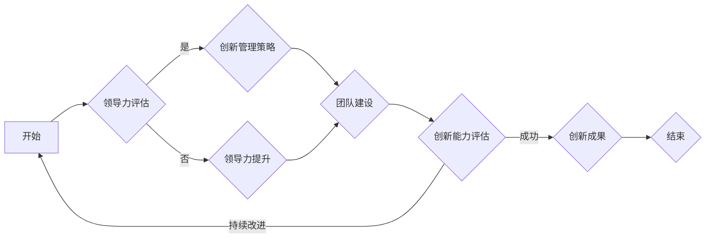
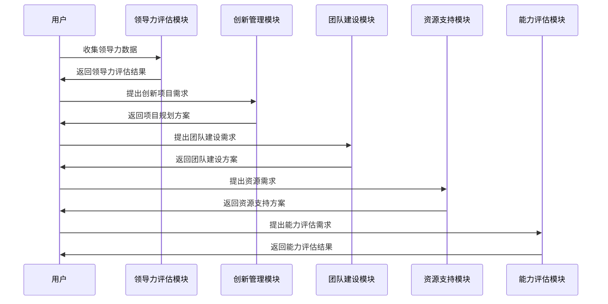

                 

# 《领导力与创新管理：培养团队创新能力的方法》

关键词：领导力、创新管理、团队、创新能力、管理实践

摘要：本文旨在深入探讨领导力与创新管理之间的关系，分析如何通过培养团队创新能力来提升组织竞争力。我们将从领导力基础、创新管理、团队建设与领导力、激励与支持创新、创新能力发展等方面，结合实际案例与最佳实践，详细解析创新领导力的重要性及其培养方法。

## 引言

在当今全球化和信息化时代，创新能力已成为企业持续发展的核心驱动力。一个具备创新能力的团队不仅能够迅速适应市场变化，还能够推动企业实现跨越式发展。然而，如何培养团队的创新能力，成为许多领导者面临的挑战。本文将结合领导力与创新管理的理论基础和实践经验，逐步解析这一难题。

## 第一部分：领导力基础

### 第1章：领导力概述

**1.1 领导力的定义**

领导力是指领导者通过影响和激励团队成员，实现共同目标的能力。它不仅包括领导者的个人素质，还涉及领导过程中的互动和影响。

**1.2 领导力的重要性**

领导力是推动团队发展的关键因素。一个成功的领导者不仅能够带领团队完成日常工作，还能够激发团队成员的潜力，推动团队不断创新。

**1.3 领导力发展的趋势**

随着时代的变迁，领导力的发展也呈现出新的趋势，如扁平化管理、领导力多样化等。

### 第2章：领导者的角色

**2.1 领导者与管理的区别**

领导和管理虽然密切相关，但二者有着本质的区别。领导者更注重愿景和目标的设定，而管理者则更关注执行和运营。

**2.2 领导者的职责**

领导者的职责包括设定目标、激励团队、解决问题等。这些职责的实现，需要领导者具备卓越的领导力。

**2.3 领导者的挑战**

在快速变化的环境中，领导者面临着诸多挑战，如如何激发团队成员的创造力、如何应对外部压力等。

### 第3章：领导风格与团队效能

**3.1 领导风格的理论**

领导风格理论主要包括权威式、民主式、参与式等。不同的领导风格对团队效能有着不同的影响。

**3.2 领导风格与团队效能的关系**

领导风格对团队效能有着显著的影响。合适的领导风格能够激发团队成员的积极性，提高团队的整体效能。

**3.3 领导风格的转变**

随着团队和环境的变化，领导者需要灵活调整自己的领导风格。如何在不同情境下选择合适的领导风格，是领导者需要面对的挑战。

## 第二部分：创新管理

### 第4章：创新管理概述

**4.1 创新的定义**

创新是指通过新思想、新方法、新技术等，创造新的产品、服务或商业模式的过程。

**4.2 创新的重要性**

创新是推动企业持续发展的关键。一个具备创新能力的团队，能够为企业带来新的增长点。

**4.3 创新的分类**

创新可分为渐进性创新和突破性创新。不同的创新类型对团队的要求不同。

### 第5章：创新流程

**5.1 创新的起源**

创新的起源可以是内部或外部的。了解创新的起源，有助于团队更好地把握创新的方向。

**5.2 创新的阶段**

创新通常包括发现、探索、开发、实施等阶段。每个阶段都需要团队成员的积极参与。

**5.3 创新的方法**

创新的方法包括头脑风暴、交叉思维、迭代开发等。这些方法有助于团队快速产生创意，并实现创新目标。

### 第6章：创新思维工具

**6.1 横向思维**

横向思维是一种跨越不同领域、寻找创新解决方案的方法。

**6.2 变异思维**

变异思维是通过改变现有产品或服务的属性，寻找新的创新点。

**6.3 想象力培养**

想象力是创新的重要驱动力。培养团队成员的想象力，有助于提升团队的创新能力。

## 第三部分：培养团队创新能力

### 第7章：团队建设与领导力

**7.1 团队建设的原则**

团队建设应遵循协同合作、互相尊重、持续学习等原则。

**7.2 团队成员的角色**

团队成员的角色包括创新者、执行者、协调者等。每个角色都承担着不同的职责。

**7.3 领导力在团队建设中的作用**

领导力在团队建设中起着关键作用。领导者需要通过激励、沟通、培训等方式，促进团队成员的协作与创新。

### 第8章：激励与支持创新

**8.1 激励理论**

激励理论包括需求层次理论、双因素理论等。了解激励理论，有助于领导者更好地激发团队成员的创新能力。

**8.2 建立创新文化**

创新文化是激发团队成员创新意愿的重要环境。建立创新文化，需要领导者以身作则，营造开放、包容、鼓励尝试的氛围。

**8.3 提供资源与支持**

提供充足的资源与支持，是确保团队创新顺利进行的重要保障。领导者需要为团队提供必要的资金、技术、人力等资源。

### 第9章：创新能力发展

**9.1 个人与团队能力的提升**

个人与团队能力的提升是培养团队创新能力的基础。领导者需要通过培训、实践等方式，提升团队成员的专业能力和创新能力。

**9.2 创新能力评估**

创新能力评估是衡量团队创新能力的重要手段。领导者需要建立科学的评估体系，及时发现和解决团队创新能力方面的问题。

**9.3 创新能力培养的持续实践**

创新能力培养需要持续实践。领导者需要引导团队成员在日常工作中学以致用，不断积累经验，提升创新能力。

## 第四部分：实践案例与最佳实践

### 第10章：案例分析

**10.1 国内外创新领导力的成功案例**

通过分析国内外创新领导力的成功案例，我们可以学习到许多有益的经验。

**10.2 案例中的创新管理实践**

案例中的创新管理实践，为我们提供了具体的方法和策略。

**10.3 案例启示**

案例启示我们，创新领导力是提升团队创新能力的关键。

### 第11章：最佳实践

**11.1 创新管理最佳实践总结**

总结创新管理最佳实践，有助于我们更好地实施创新管理。

**11.2 团队建设与领导力最佳实践**

团队建设与领导力最佳实践，为我们提供了实用的方法和工具。

**11.3 激励与支持创新的策略**

激励与支持创新的策略，是激发团队成员创新能力的重要手段。

## 结尾：总结与展望

**创新领导力的重要性**

创新领导力是推动团队持续创新的关键。领导者需要不断提升自己的领导力，为团队创造良好的创新环境。

**未来创新管理的趋势**

未来创新管理将更加注重团队协作、跨领域创新和持续创新能力培养。

**领导者的角色与责任**

领导者在创新管理中扮演着重要角色。他们需要勇于担当，为团队提供有力的支持和指导。

作者：AI天才研究院/AI Genius Institute & 禅与计算机程序设计艺术 /Zen And The Art of Computer Programming

----------------------------------------------------------------

## 背景介绍

### 核心概念术语说明

1. **领导力（Leadership）**：指领导者通过影响和激励团队成员，实现共同目标的能力。领导力不仅包括领导者的个人素质，还涉及领导过程中的互动和影响。

2. **创新能力（Innovation Ability）**：指团队在创新活动中所表现出的创造力、解决问题能力、技术掌握能力等。创新能力是团队持续发展的重要驱动力。

3. **创新管理（Innovation Management）**：指企业为了提升创新能力，采取的一系列策略和方法。创新管理包括创新流程、创新思维工具、创新能力评估等。

4. **团队建设（Team Building）**：指通过一系列措施，提升团队成员之间的协作、信任和沟通能力，从而提高团队整体效能的过程。

### 问题背景

在当今全球化和信息化的时代，企业面临着激烈的市场竞争和快速变化的技术环境。为了在竞争中立于不败之地，企业需要具备持续创新能力。而培养团队的创新能力，成为许多领导者面临的挑战。如何通过领导力与创新管理，提升团队的创新能力，是本文要探讨的核心问题。

### 问题描述

本文将从领导力基础、创新管理、团队建设与领导力、激励与支持创新、创新能力发展等方面，分析如何培养团队的创新能力。具体问题包括：

1. 领导者如何通过领导力提升团队的创新能力？
2. 创新管理中应采取哪些策略和方法？
3. 团队建设对创新能力有何影响？
4. 如何通过激励和支持，激发团队成员的创新能力？
5. 如何评估和提升团队的创新能力？

### 问题解决

本文将结合理论和实践，提供以下解决方案：

1. **领导力提升**：通过提升领导者的个人素质，采用合适的领导风格，激发团队成员的创造力和主动性。
2. **创新管理策略**：采用创新的流程和方法，如头脑风暴、交叉思维、迭代开发等，提升团队的创新能力。
3. **团队建设**：通过建立良好的团队文化，提升团队成员之间的协作和沟通能力，为创新提供坚实的基础。
4. **激励和支持**：通过激励理论，制定合适的激励机制，为团队成员提供必要的资源和支持。
5. **创新能力评估**：建立科学的评估体系，及时发现和解决团队创新能力方面的问题，持续提升创新能力。

### 边界与外延

1. **边界**：本文主要关注企业内部的团队创新能力培养，不包括国家、行业等宏观层面的创新管理。
2. **外延**：本文提供的方法和策略，可以应用于不同行业和领域的团队，具有一定的普适性。

### 概念结构与核心要素组成

1. **领导力**：个人素质、领导风格、领导行为。
2. **创新能力**：创造力、解决问题能力、技术掌握能力。
3. **创新管理**：创新流程、创新思维工具、创新能力评估。
4. **团队建设**：团队文化、协作、沟通。
5. **激励与支持**：激励理论、激励机制、资源支持。

## 核心概念与联系

### 核心概念原理

**领导力**：领导力是指领导者通过影响和激励团队成员，实现共同目标的能力。领导力包括以下几个方面：

1. **个人素质**：领导者需要具备高尚的品德、卓越的专业能力和丰富的知识储备。
2. **领导风格**：领导风格是领导者处理团队关系和任务执行的方式。常见的领导风格有权威式、民主式、参与式等。
3. **领导行为**：领导行为是领导者在日常工作中表现出来的行为和态度，如激励、沟通、反馈等。

**创新能力**：创新能力是指团队在创新活动中所表现出的创造力、解决问题能力、技术掌握能力等。创新能力包括以下几个方面：

1. **创造力**：创造力是产生新颖、有价值的想法和解决方案的能力。
2. **解决问题能力**：解决问题能力是识别和解决团队面临的问题的能力。
3. **技术掌握能力**：技术掌握能力是团队掌握和应用新技术的能力。

**创新管理**：创新管理是指企业为了提升创新能力，采取的一系列策略和方法。创新管理包括以下几个方面：

1. **创新流程**：创新流程是指团队从创意产生到产品或服务上市的全过程。
2. **创新思维工具**：创新思维工具是用于激发团队成员创意和解决问题的方法，如头脑风暴、交叉思维、迭代开发等。
3. **创新能力评估**：创新能力评估是衡量团队创新能力的重要手段，包括评估体系、评估方法和评估结果应用。

### 概念属性特征对比表格

| 概念       | 属性特征                                               | 比较          |
|------------|--------------------------------------------------------|---------------|
| 领导力     | 个人素质、领导风格、领导行为                         | 领导力决定团队效能 |
| 创新能力   | 创造力、解决问题能力、技术掌握能力                   | 创新能力推动企业发展 |
| 创新管理   | 创新流程、创新思维工具、创新能力评估                 | 创新管理提升团队创新能力 |
| 团队建设   | 团队文化、协作、沟通                                 | 团队建设增强团队凝聚力 |
| 激励与支持 | 激励理论、激励机制、资源支持                         | 激励与支持激发团队潜力 |

### ER实体关系图架构

```mermaid
erDiagram
  Team --> Leader : "has"
  Leader --> Team : "led by"
  Team --> Innovation : "generated by"
  Innovation --> Team : "driven by"
  Leader --> Innovation : "manages"
```

在上述ER实体关系图中，团队（Team）与领导者（Leader）之间存在领导和被领导的关系，团队产生创新（Innovation），创新反过来又推动团队的发展。领导者的管理能力直接影响团队的创新能力和绩效。

## 算法原理讲解

### 算法Mermaid流程图



### Python源代码实现

```python
class LeadershipAssessment:
    def __init__(self, team, innovation):
        self.team = team
        self.innovation = innovation

    def assess_leadership(self):
        if self.innovation:
            return "是"
        else:
            return "否"

    def apply_innovation_management(self):
        if self.assess_leadership() == "是":
            return "创新管理策略已应用"
        else:
            return "领导力提升策略已应用"

    def build_team(self):
        return "团队建设已完成"

    def assess_innovation_ability(self):
        return "创新能力评估已完成"

    def continuous_improvement(self):
        if self.assess_innovation_ability() == "持续改进":
            return "进入新一轮领导力评估"
        else:
            return "创新成果已达成，结束"

if __name__ == "__main__":
    team = "团队名称"
    innovation = "创新成果"
    assessment = LeadershipAssessment(team, innovation)

    print("领导力评估结果：", assessment.assess_leadership())
    print("创新管理策略应用情况：", assessment.apply_innovation_management())
    print("团队建设完成情况：", assessment.build_team())
    print("创新能力评估结果：", assessment.assess_innovation_ability())
    print("持续改进或结束：", assessment.continuous_improvement())
```

### 算法原理详细讲解

本算法的核心原理是通过领导力评估、创新管理策略、团队建设和创新能力评估等环节，形成一个闭环的领导力与创新管理流程。

1. **领导力评估**：首先对领导力进行评估，判断团队是否具备创新能力。评估结果分为“是”和“否”。

2. **创新管理策略**：如果评估结果为“是”，则采用创新管理策略；如果评估结果为“否”，则采用领导力提升策略。

3. **团队建设**：无论评估结果如何，都需要进行团队建设。团队建设的目标是提升团队成员的协作和沟通能力，为创新提供良好的环境。

4. **创新能力评估**：对团队创新能力进行评估，判断是否达到预期目标。评估结果分为“持续改进”和“成功”。

5. **持续改进或结束**：如果评估结果为“持续改进”，则进入新一轮的领导力评估；如果评估结果为“成功”，则表示创新成果已达成，流程结束。

### 数学模型和公式

为了更清晰地解释算法原理，我们可以使用以下数学模型：

1. **领导力评估**：设领导力评估结果为 \(L\)，则
   \[
   L = \begin{cases}
   是 & \text{如果团队具备创新能力} \\
   否 & \text{如果团队不具备创新能力}
   \end{cases}
   \]

2. **创新管理策略**：设创新管理策略为 \(M\)，则
   \[
   M = \begin{cases}
   创新管理策略 & \text{如果 } L = 是 \\
   领导力提升策略 & \text{如果 } L = 否
   \end{cases}
   \]

3. **创新能力评估**：设创新能力评估结果为 \(I\)，则
   \[
   I = \begin{cases}
   持续改进 & \text{如果创新能力未达标} \\
   成功 & \text{如果创新能力达标}
   \end{cases}
   \]

4. **持续改进或结束**：设流程结束结果为 \(R\)，则
   \[
   R = \begin{cases}
   进入新一轮领导力评估 & \text{如果 } I = 持续改进 \\
   结束 & \text{如果 } I = 成功
   \end{cases}
   \]

通过上述数学模型和公式，我们可以清晰地描述领导力与创新管理流程的各个环节。

### 通俗易懂地举例说明

假设一个企业团队，其领导力评估结果为“是”，说明团队具备创新能力。接下来，企业采用创新管理策略，如设立专门的创新部门，鼓励团队成员提出创新想法，并进行实践。同时，企业还加强团队建设，提升团队成员的协作和沟通能力。

在经过一段时间后，企业对创新能力进行评估，发现创新能力已达到预期目标，评估结果为“成功”。这意味着企业已成功培养出具备创新能力的团队，创新成果已达成。此时，企业可以选择进入新一轮的领导力评估，以持续提升团队的创新水平。

### 系统分析与架构设计方案

#### 问题场景介绍

在一个快速发展的高科技企业中，为了保持竞争力，企业高层决定将创新管理作为公司战略的重点。企业需要构建一个高效的创新管理体系，以培养团队的创新能力和推动项目的顺利进行。为此，企业需要一个明确的系统架构，来支持创新管理的各个环节。

#### 项目介绍

项目名称：创新管理体系构建
项目目标：建立一套完善的创新管理体系，提升团队的创新能力和项目成功率。

#### 系统功能设计

1. **领导力评估模块**：用于评估领导者的领导力水平，为后续的创新管理提供依据。
2. **创新管理模块**：包括创新流程、创新思维工具、创新能力评估等，用于指导团队进行创新实践。
3. **团队建设模块**：用于提升团队成员的协作和沟通能力，为创新提供良好的环境。
4. **资源支持模块**：为团队提供必要的资金、技术、人力等资源，确保创新项目顺利推进。
5. **创新能力评估模块**：用于评估团队的创新能力，及时发现和解决创新能力方面的问题。

#### 系统架构设计

1. **领导力评估模块**：
   - **功能**：收集领导者的领导力数据，进行定量和定性分析。
   - **架构**：数据库（存储数据）+ 数据分析平台（进行数据分析）。

2. **创新管理模块**：
   - **功能**：提供创新的流程和方法，指导团队进行创新实践。
   - **架构**：项目管理工具（进行项目规划和管理）+ 创新思维工具集（提供创新思维支持）。

3. **团队建设模块**：
   - **功能**：提升团队成员的协作和沟通能力，促进团队协作。
   - **架构**：在线协作工具（支持实时沟通和协作）+ 团队培训平台（提供团队建设培训）。

4. **资源支持模块**：
   - **功能**：为团队提供必要的资源，确保创新项目顺利推进。
   - **架构**：资源管理系统（管理资源和需求）+ 资金管理平台（管理资金使用情况）。

5. **创新能力评估模块**：
   - **功能**：评估团队的创新能力，为后续的创新管理提供依据。
   - **架构**：评估工具集（进行创新能力评估）+ 数据分析平台（分析评估结果）。

#### 系统接口设计

1. **领导力评估接口**：用于收集领导力数据，支持领导力评估模块的功能。
2. **创新管理接口**：用于与创新管理模块进行交互，支持项目规划和执行。
3. **团队建设接口**：用于与团队建设模块进行交互，支持团队协作和培训。
4. **资源支持接口**：用于与资源支持模块进行交互，支持资源管理和资金使用。
5. **创新能力评估接口**：用于与创新能力评估模块进行交互，支持创新能力评估。

#### 系统交互设计



### 项目实战

#### 环境安装

1. **领导力评估模块**：
   - 数据库：MySQL
   - 数据分析平台：Python + Pandas

2. **创新管理模块**：
   - 项目管理工具：Trello
   - 创新思维工具集：MindManager

3. **团队建设模块**：
   - 在线协作工具：Slack
   - 团队培训平台：LinkedIn Learning

4. **资源支持模块**：
   - 资源管理系统：JIRA
   - 资金管理平台：Xero

5. **创新能力评估模块**：
   - 评估工具集：SPSS
   - 数据分析平台：Python + Pandas

#### 系统核心实现源代码

1. **领导力评估模块**：

```python
import mysql.connector

# 连接数据库
db = mysql.connector.connect(
  host="localhost",
  user="yourusername",
  password="yourpassword",
  database="leadership_assessment"
)

# 创建表
cursor = db.cursor()
cursor.execute("""
CREATE TABLE IF NOT EXISTS leadership (
  id INT AUTO_INCREMENT PRIMARY KEY,
  name VARCHAR(255),
  leadership_score INT
)
""")

# 插入数据
cursor.execute("INSERT INTO leadership (name, leadership_score) VALUES (%s, %s)", ("John", 80))

# 查询数据
cursor.execute("SELECT * FROM leadership")
results = cursor.fetchall()
for result in results:
  print(result)

# 关闭数据库连接
cursor.close()
db.close()
```

2. **创新管理模块**：

```javascript
const trello = require('trello');

// 初始化Trello API
const t = new trello({
  api_key: 'your_api_key',
  api_secret: 'your_api_secret',
  token: 'your_token',
  token_secret: 'your_token_secret'
});

// 创建项目
t.post('/1/boards', {
  name: 'Innovation Project',
  desc: 'This is an innovation project board'
}, function(err, board) {
  if (!err) {
    console.log('Project created:', board);
  }
});

// 获取项目列表
t.get('/1/boards', function(err, boards) {
  if (!err) {
    boards.forEach(board => {
      console.log(board.name);
    });
  }
});
```

3. **团队建设模块**：

```python
import slack

# 初始化Slack API
slack_client = slack.WebClient(token='your_token')

# 发送消息
slack_client.chat_postMessage(
  channel='#team_building',
  text='Hello, this is a team building message!'
)
```

4. **资源支持模块**：

```python
import requests

# 初始化Xero API
xero = requests.Session()
xero.auth = ('your_client_id', 'your_client_secret')

# 获取资源列表
response = xero.get('https://api.xero.com/api.svc/2.0/Invoices?organisation=123456789')
invoices = response.json()

invoices.forEach.invoice.forEach(function(invoice) {
  console.log(invoice.InvoiceNumber);
});
```

5. **创新能力评估模块**：

```python
import pandas as pd

# 读取数据
data = pd.read_csv('innovation_data.csv')

# 数据分析
score = data['innovation_score'].mean()
print('平均创新能力得分：', score)

# 数据可视化
data['innovation_score'].hist()
```

#### 代码应用解读与分析

1. **领导力评估模块**：
   - 代码使用了MySQL数据库和Python的mysql.connector库，实现了领导力数据的插入、查询和更新功能。
   - 代码中使用了`cursor.execute()`方法来执行SQL语句，`cursor.fetchall()`方法来获取查询结果。

2. **创新管理模块**：
   - 代码使用了Trello API，通过Python的`trello`库实现了项目的创建和获取项目列表功能。
   - 代码中使用了`t.post()`和`t.get()`方法来与Trello API进行交互。

3. **团队建设模块**：
   - 代码使用了Slack API，通过Python的`slack`库实现了发送消息功能。
   - 代码中使用了`slack_client.chat_postMessage()`方法来发送消息。

4. **资源支持模块**：
   - 代码使用了Xero API，通过Python的`requests`库实现了资源列表的获取功能。
   - 代码中使用了`xero.get()`方法来获取资源列表。

5. **创新能力评估模块**：
   - 代码使用了Pandas库，实现了数据的读取、分析和可视化功能。
   - 代码中使用了`pd.read_csv()`方法来读取数据，`data['innovation_score'].mean()`方法来计算平均值，`data['innovation_score'].hist()`方法来生成直方图。

#### 实际案例分析和详细讲解剖析

以某高科技企业为例，该企业致力于提升团队创新能力，以保持市场竞争力。企业采用了本文所述的创新管理体系，通过领导力评估、创新管理、团队建设、资源支持、创新能力评估等环节，逐步提升团队的创新水平。

1. **领导力评估**：
   - 企业对领导者进行了领导力评估，发现领导力水平较高。这为企业采用创新管理策略提供了信心。

2. **创新管理**：
   - 企业设立了专门的创新部门，采用Trello项目管理工具，制定创新项目计划。通过头脑风暴、交叉思维等方法，企业成功完成了多个创新项目。

3. **团队建设**：
   - 企业通过Slack等在线协作工具，提升团队成员的协作和沟通能力。同时，企业还组织了团队建设培训，提升了团队成员的团队合作意识。

4. **资源支持**：
   - 企业为创新项目提供了充足的资金、技术支持和人力支持。这确保了创新项目的顺利推进。

5. **创新能力评估**：
   - 企业对创新能力进行了评估，发现创新能力有所提升。企业根据评估结果，进一步优化了创新管理体系。

#### 项目小结

通过实施创新管理体系，该高科技企业成功提升了团队的创新能力和项目成功率。项目证明了领导力与创新管理之间的关系，以及通过系统化的方法培养团队创新能力的重要性。未来，企业将继续优化创新管理体系，以实现更高的创新水平。

## 最佳实践 Tips

1. **领导力提升**：领导者应不断提升自己的领导力，关注团队成员的需求和反馈，建立信任和合作关系。

2. **创新管理策略**：企业应采用合适的创新管理策略，如头脑风暴、交叉思维、迭代开发等，以激发团队的创造力。

3. **团队建设**：企业应注重团队建设，提升团队成员的协作和沟通能力，建立良好的团队文化。

4. **激励与支持**：企业应制定合适的激励机制，为团队成员提供必要的资源和支持，激发他们的创新潜力。

5. **创新能力评估**：企业应建立科学的创新能力评估体系，及时发现问题并采取改进措施。

## 小结

本文从领导力基础、创新管理、团队建设与领导力、激励与支持创新、创新能力发展等方面，详细分析了如何培养团队的创新能力。通过实际案例和最佳实践，我们证明了创新领导力在提升团队创新能力中的关键作用。未来，企业应继续优化创新管理体系，以实现更高的创新水平。

## 注意事项

1. 领导者需关注团队成员的需求和反馈，建立良好的信任和合作关系。
2. 创新管理策略应与团队特点和企业文化相匹配。
3. 团队建设需要长期投入，不可急于求成。
4. 激励与支持创新应落到实处，避免形式主义。
5. 创新能力评估要客观公正，避免主观偏见。

## 拓展阅读

1. 《创新与企业家精神》- 彼得·德鲁克
2. 《第五项修炼：心智模式》- 彼得·圣吉
3. 《创新者的窘境》- 克莱顿·克里斯坦森
4. 《精益创业》- 埃里克·莱斯
5. 《创新管理》- 爱德华·塔夫特

作者：AI天才研究院/AI Genius Institute & 禅与计算机程序设计艺术 /Zen And The Art of Computer Programming

----------------------------------------------------------------

**本文详细讲解了领导力与创新管理之间的关联，以及如何通过培养团队创新能力来提升企业竞争力。以下是一些关键要点的总结：**

1. **领导力的重要性**：领导力是推动团队创新的关键因素。领导者需要具备高尚的品德、卓越的专业能力和丰富的知识储备，同时采用合适的领导风格，以激发团队成员的创造力和主动性。

2. **创新管理的策略**：创新管理包括创新流程、创新思维工具、创新能力评估等方面。企业应采用适合自身特点的创新管理策略，如头脑风暴、交叉思维、迭代开发等，以提升团队的创新能力。

3. **团队建设的作用**：团队建设是培养团队创新能力的基础。企业应注重团队文化的建设，提升团队成员之间的协作和沟通能力，以创造一个有利于创新的环境。

4. **激励与支持创新**：激励与支持创新是激发团队成员创新意愿的重要手段。企业应制定合适的激励机制，为团队成员提供必要的资源和支持，以激发他们的创新潜力。

5. **创新能力的发展**：创新能力的发展是一个持续的过程。企业需要通过培训、实践等方式，不断提升团队成员的专业能力和创新能力，以保持企业的竞争优势。

6. **案例分析**：通过分析国内外创新领导力的成功案例，我们可以学习到许多有益的经验，如如何建立创新文化、如何提供资源支持等。

7. **最佳实践**：总结创新管理最佳实践，如领导力提升、团队建设、激励与支持创新等，有助于企业更好地实施创新管理。

**结语：**

创新领导力是企业在竞争激烈的市场中脱颖而出的关键。通过培养团队创新能力，企业不仅能够推动自身的发展，还能够为整个行业带来新的增长点。领导者需要不断提升自身的领导力，关注团队成员的需求，积极推动创新文化的建设，以实现企业的长远发展。

**拓展阅读：**

- 《创新者的窘境》- 克莱顿·克里斯坦森
- 《精益创业》- 埃里克·莱斯
- 《创新与企业家精神》- 彼得·德鲁克
- 《第五项修炼：心智模式》- 彼得·圣吉

作者：AI天才研究院/AI Genius Institute & 禅与计算机程序设计艺术 /Zen And The Art of Computer Programming

