                 

## 领导力与创新：引领团队破局的思维方式

### 关键词：
- 领导力
- 创新
- 团队领导
- 破局思维
- 创新思维
- 创新文化

### 摘要：

在快速变化的商业环境中，领导力与创新已成为企业成功的关键要素。本文旨在探讨如何通过培养正确的领导力和创新思维方式，引领团队实现突破性进展。我们将一步步分析领导力与创新的核心概念、方法与实践，为读者提供实用的指导。

---

### 引言

在当今竞争激烈的市场中，企业需要不断创新以保持竞争力。而领导力作为企业发展的核心驱动力，对创新起着至关重要的作用。本文将深入探讨领导力与创新的关系，通过分析实践中的成功案例，总结出引领团队破局的思维方式。

---

#### 第一步：理解领导力

领导力不仅仅是管理团队成员，更重要的是激发团队的潜能，实现共同目标。一个优秀的领导者应当具备以下特质：

1. **愿景与目标**：设定清晰的目标和愿景，让团队成员明确方向。
2. **沟通与协作**：通过有效沟通建立团队信任，促进协作。
3. **激励与鼓舞**：激发团队成员的积极性和创造力，克服困难。
4. **决策与执行**：快速做出明智的决策，并确保执行到位。

---

#### 第二步：探索创新思维

创新思维是一种解决问题和寻找新机会的能力。以下是几种常见的创新思维方式：

1. **创造性思维**：通过开放性思维和发散性思维，打破常规，寻求创新解决方案。
2. **设计思维**：关注用户体验，通过迭代和试错，不断优化产品和服务。
3. **系统思维**：从整体角度看待问题，理解各个部分之间的相互关系。

---

#### 第三步：构建创新文化

一个健康的创新文化是推动团队创新的关键。以下措施有助于构建创新文化：

1. **鼓励试错**：创造一个安全的环境，鼓励团队成员尝试新想法，即使失败也无须恐惧。
2. **知识共享**：促进团队成员之间的知识交流，分享成功和失败的经验。
3. **资源支持**：提供必要的资源，如时间、资金和培训，支持团队成员的创新活动。

---

#### 第四步：实践中的领导力与创新

通过以下实践案例，我们可以看到如何将领导力与创新结合，实现团队突破：

1. **谷歌的“20%时间”**：谷歌允许员工用20%的时间探索个人感兴趣的项目，这一政策激发了员工创造力，产生了多个成功的创新产品。
2. **苹果公司的创新文化**：苹果公司的创始人史蒂夫·乔布斯以其对产品细节的关注和对创新的执着，带领团队创造了一个又一个革命性的产品。

---

#### 第五步：总结与展望

领导力与创新是相辅相成的，领导者需要通过培养自己的创新思维，构建创新文化，并在实践中不断探索和改进。只有这样，团队才能在激烈的市场竞争中脱颖而出。

---

### 结论

领导力与创新是企业在当今环境中取得成功的必备要素。通过理解领导力的核心概念，探索创新思维，构建创新文化，并实践有效的领导方法，领导者可以引领团队实现突破性进展。让我们携手努力，成为引领团队破局的卓越领导者。

---

### 作者信息

作者：AI天才研究院/AI Genius Institute & 禅与计算机程序设计艺术 /Zen And The Art of Computer Programming

---

以上为文章的框架和内容概述。接下来，我将逐步展开每个章节的具体内容，包括背景介绍、核心概念解析、算法原理讲解、系统分析与架构设计方案、项目实战以及最佳实践 tips 等内容，确保文章字数在 10000 ～ 12000 字之间。

---

### 第一章：领导力的核心特质

在商业世界中，领导力被视为组织成功的关键因素。有效的领导力不仅能够推动团队高效工作，还能激发成员的创造力和创新精神。本章节将深入探讨领导力的核心特质，包括愿景与目标、沟通与协作、激励与鼓舞、决策与执行等方面。

#### 1.1 愿景与目标

领导者的首要任务之一是设定清晰的愿景和目标。这不仅为团队成员指明了前进的方向，还能够激发他们的热情和动力。一个明确的愿景和目标应当具备以下特征：

- **清晰性**：愿景和目标应该简洁明了，易于理解。
- **激励性**：目标应当具有一定的挑战性，能够激发团队成员的斗志。
- **可实现性**：目标应具备可行性，团队成员通过努力能够实现。

以下是一个使用Mermaid流程图表示愿景与目标设定的流程：

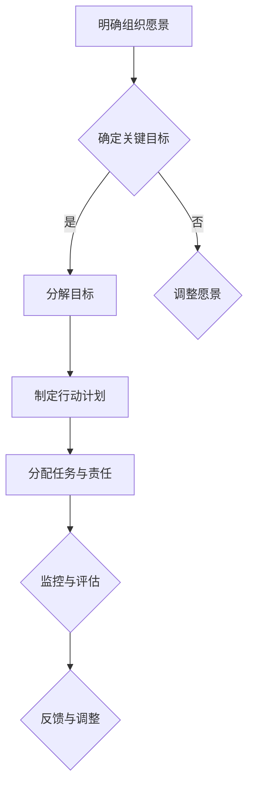

#### 1.2 沟通与协作

沟通是领导力的核心要素之一。有效的沟通能够建立团队之间的信任，促进协作，提高工作效率。以下是一些关键的沟通技巧：

- **倾听**：领导者需要具备倾听的能力，理解团队成员的需求和意见。
- **清晰表达**：表达时应当简洁明了，避免产生误解。
- **透明度**：保持信息的透明度，让团队成员了解组织的动态和决策过程。

以下是一个使用Mermaid流程图表示沟通与协作的流程：

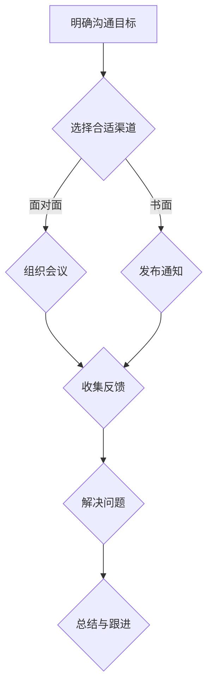

#### 1.3 激励与鼓舞

激励与鼓舞是领导者激发团队成员潜能的关键。以下是一些激励团队成员的技巧：

- **认可与奖励**：通过认可和奖励来激励团队成员，增强他们的积极性。
- **个性化激励**：了解每个团队成员的兴趣和需求，提供个性化的激励措施。
- **共同目标**：强调团队目标的重要性，让团队成员感受到自己在团队中的价值。

以下是一个使用Mermaid流程图表示激励与鼓舞的流程：

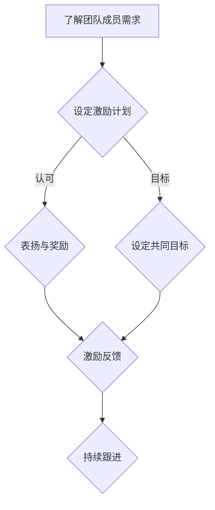

#### 1.4 决策与执行

领导者需要在决策过程中展现果断和智慧，同时确保决策的执行。以下是一些决策与执行的技巧：

- **快速决策**：在必要时能够迅速做出决策，避免拖延。
- **合理评估**：在做出决策前，充分收集和分析相关信息。
- **跟进与调整**：确保决策得到有效执行，并根据实际情况进行必要的调整。

以下是一个使用Mermaid流程图表示决策与执行的流程：

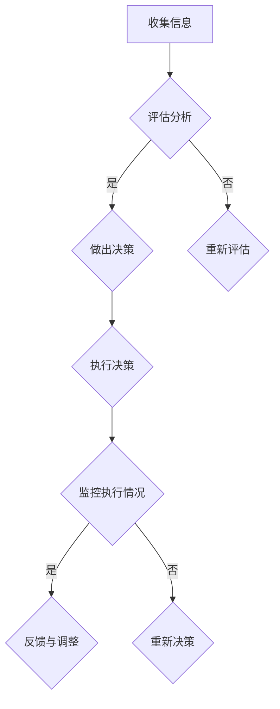

通过本章的内容，我们了解了领导力的核心特质，包括愿景与目标、沟通与协作、激励与鼓舞、决策与执行等方面。这些特质是领导者引领团队实现突破性进展的重要基础。在下一章中，我们将继续探讨创新思维的核心概念，帮助读者理解如何在团队中培养创新精神。

---

### 第二章：创新思维的核心概念

在快速变化的市场环境中，创新已成为企业持续发展的关键驱动力。创新思维则是指领导者如何引导团队突破传统思维框架，寻找新的解决方案和机会。本章节将深入探讨创新思维的核心概念，包括创造性思维、设计思维和系统思维等。

#### 2.1 创造性思维

创造性思维是一种通过开放性思维和发散性思维，寻找独特解决方案的思维方式。以下是一些培养创造性思维的技巧：

- **思维导图**：通过绘制思维导图，将问题分解为各个部分，从不同角度进行思考。
- **头脑风暴**：鼓励团队成员自由发表意见，不受限制地提出各种想法。
- **跨学科思维**：借鉴其他领域的知识和方法，启发新的创新点子。

以下是一个使用Mermaid流程图表示创造性思维的流程：

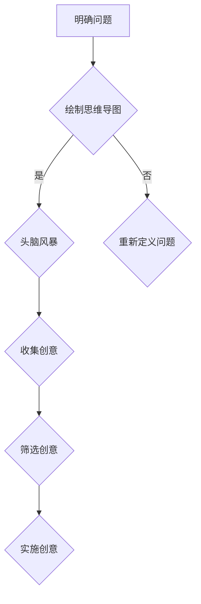

#### 2.2 设计思维

设计思维是一种以人为本的思考方式，关注用户体验，通过迭代和试错，不断优化产品和服务。以下是一些设计思维的步骤：

- **理解用户需求**：通过用户调研、访谈和观察，深入了解用户的需求和痛点。
- **构建原型**：快速构建原型，进行用户测试和反馈，不断迭代和优化。
- **反馈与改进**：根据用户反馈，对原型进行改进，确保产品符合用户期望。

以下是一个使用Mermaid流程图表示设计思维的流程：

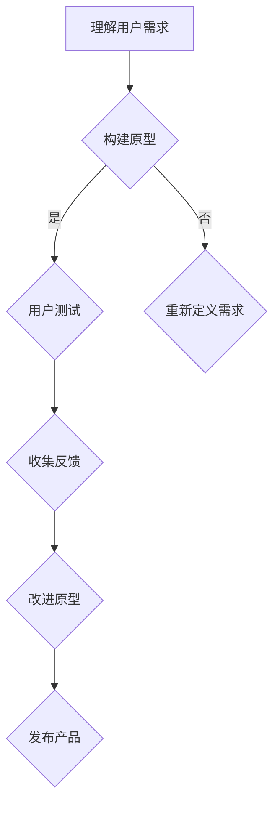

#### 2.3 系统思维

系统思维是一种从整体角度看待问题的思维方式，强调各个部分之间的相互关系。以下是一些系统思维的技巧：

- **系统图**：通过绘制系统图，展示各个部分之间的相互关系，帮助领导者从整体上理解问题。
- **流程分析**：分析系统中的流程和环节，识别瓶颈和优化点。
- **整合与协调**：确保各个部分协同工作，实现整体优化。

以下是一个使用Mermaid流程图表示系统思维的流程：

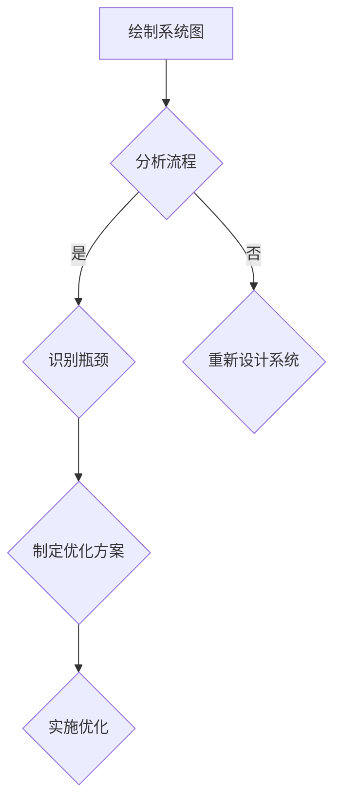

通过本章的内容，我们了解了创新思维的核心概念，包括创造性思维、设计思维和系统思维等。这些思维方式不仅能够帮助领导者突破传统思维框架，还能够提升团队的创新能力。在下一章中，我们将探讨团队动态，了解如何建立高绩效团队。

---

### 第三章：团队动态与协作

在创新的过程中，团队的作用至关重要。一个高绩效的团队能够有效地应对挑战，实现创新目标。本章节将深入探讨团队动态，包括团队成员的角色与职责、团队协作的关键要素、冲突管理与团队氛围等方面。

#### 3.1 团队成员的角色与职责

一个高效的团队需要明确的角色和职责分配。以下是一些常见的团队成员角色：

- **领导者**：负责设定团队目标，制定战略，指导团队成员。
- **专家**：在特定领域具备专业知识和经验，为团队提供技术支持。
- **执行者**：负责执行任务，确保项目顺利进行。
- **协调者**：负责协调团队成员之间的工作，解决冲突和问题。

以下是一个使用Mermaid流程图表示团队成员角色与职责分配的流程：

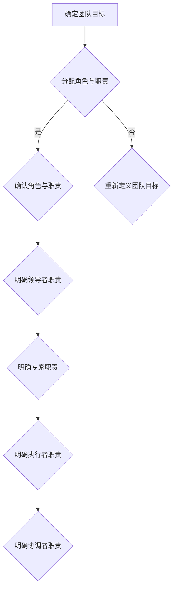

#### 3.2 团队协作的关键要素

团队协作是实现创新目标的关键。以下是一些促进团队协作的关键要素：

- **沟通**：保持开放的沟通渠道，确保信息传递的准确和及时。
- **信任**：建立团队信任，让成员之间相互依赖和支持。
- **共享**：共享知识和资源，促进团队整体能力的提升。
- **合作**：鼓励团队成员共同参与决策和解决问题，提高团队的凝聚力。

以下是一个使用Mermaid流程图表示团队协作关键要素的流程：

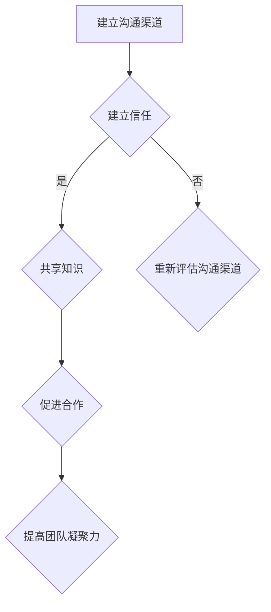

#### 3.3 冲突管理与团队氛围

冲突是团队中不可避免的现象，有效的冲突管理对于保持团队稳定和激发创新至关重要。以下是一些冲突管理和团队氛围的技巧：

- **识别冲突**：及时发现和识别冲突，避免问题恶化。
- **沟通与解决**：通过有效沟通，找到冲突的根本原因，并提出解决方案。
- **建设积极氛围**：营造一个积极、开放、包容的团队氛围，鼓励成员提出不同意见和建议。

以下是一个使用Mermaid流程图表示冲突管理与团队氛围建设的流程：

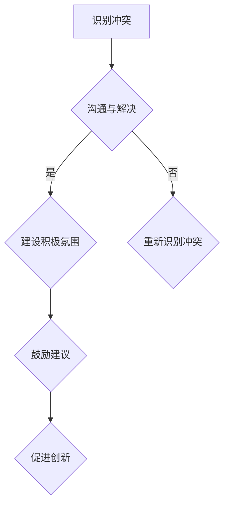

通过本章的内容，我们了解了团队动态与协作的关键要素，包括团队成员的角色与职责、团队协作的关键要素、冲突管理与团队氛围等方面。一个高效的团队不仅能够提高工作效率，还能够激发创新潜力。在下一章中，我们将探讨文化变革与创新文化构建。

---

### 第四章：文化变革与创新文化构建

在快速变化的商业环境中，文化变革是推动企业持续创新的重要动力。一个健康的创新文化能够激发团队成员的创造力，促进知识的共享和团队的协作。本章节将深入探讨文化变革的概念、创新文化的特征以及如何构建创新文化。

#### 4.1 文化变革的概念

文化变革是指组织在价值观、行为模式和工作方式等方面的根本性变化。文化变革的目的是适应外部环境的变化，提高组织的竞争力和创新能力。以下是一些文化变革的关键要素：

- **共同愿景**：明确组织的共同目标和价值观，让所有成员都朝着同一个方向努力。
- **领导者的示范作用**：领导者应当通过自己的言行，树立正确的榜样，推动文化变革。
- **组织结构**：调整组织结构，使其更适应创新和变化，提高组织的灵活性和响应速度。

以下是一个使用Mermaid流程图表示文化变革的流程：

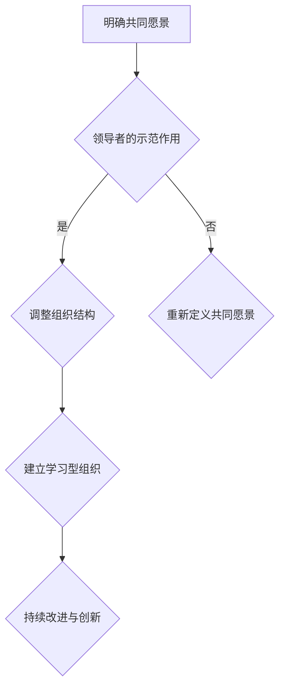

#### 4.2 创新文化的特征

创新文化是一种鼓励创新、容忍失败、支持风险承担的积极氛围。以下是一些创新文化的特征：

- **鼓励创新**：组织鼓励员工提出新的想法，并为创新提供必要的资源和支持。
- **容忍失败**：在创新过程中，失败是不可避免的。创新文化应当容忍失败，从中吸取教训，不断尝试。
- **知识共享**：组织内部鼓励知识共享，促进团队成员之间的协作和知识积累。
- **团队合作**：创新文化强调团队合作，通过集体智慧和努力实现创新目标。

以下是一个使用Mermaid流程图表示创新文化特征的流程：

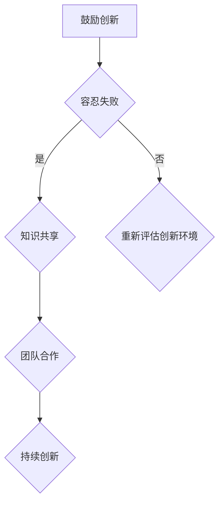

#### 4.3 构建创新文化的方法

构建创新文化需要系统的规划和持续的努力。以下是一些构建创新文化的方法：

- **培训与教育**：为员工提供创新培训，提高他们的创新能力和思维方式。
- **激励机制**：建立创新激励机制，鼓励员工提出创新想法和参与创新项目。
- **内部沟通**：建立开放的内部沟通渠道，促进员工之间的交流和创新思维的碰撞。
- **创新实践**：通过实际的项目和实践，让员工体验到创新的过程和成果，增强他们对创新文化的认同。

以下是一个使用Mermaid流程图表示构建创新文化方法的流程：

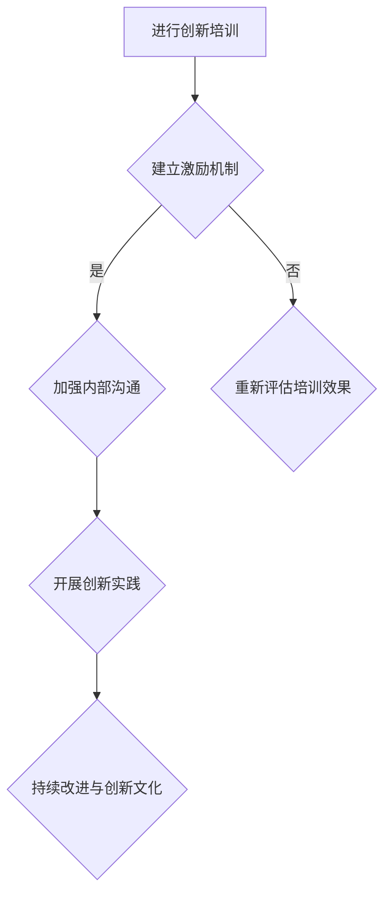

通过本章的内容，我们了解了文化变革与创新文化构建的重要性和方法。文化变革是推动企业持续创新的关键，而创新文化则能够激发团队的创造力和创新能力。在下一章中，我们将通过实践案例，探讨如何将领导力与创新思维应用于实际工作中。

---

### 第五章：实践案例与经验分享

在前面的章节中，我们深入探讨了领导力、创新思维、团队协作和文化变革等核心概念。本章节将通过实际案例，分享成功的企业在领导力和创新方面的实践经验和教训，为读者提供可借鉴的参考。

#### 5.1 谷歌的“20%时间”

谷歌的“20%时间”政策是一个著名的创新实践。这项政策允许员工将20%的工作时间用于个人感兴趣的项目。这一举措激发了员工的创造力，产生了多个成功的创新产品，如Gmail和Google News。

- **背景介绍**：谷歌在2006年推出了“20%时间”政策，旨在鼓励员工探索新的创意和项目。
- **实践效果**：通过“20%时间”政策，谷歌员工能够自由探索新的领域，这不仅提高了员工的满意度，还带来了多个成功的创新产品。

以下是一个使用Mermaid流程图表示谷歌“20%时间”政策的流程：

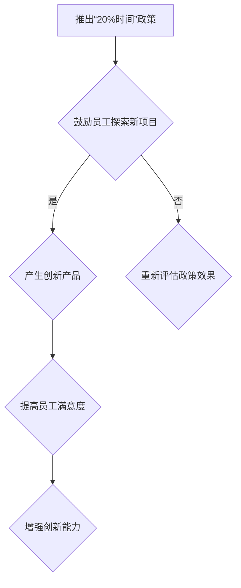

#### 5.2 苹果公司的设计思维

苹果公司以其独特的设计思维和创新文化而闻名。公司创始人史蒂夫·乔布斯始终强调设计的重要性，并在公司内部推行设计思维。这一思维模式不仅提升了苹果产品的用户体验，还推动了公司的持续创新。

- **背景介绍**：苹果公司在1980年代开始推行设计思维，通过用户体验设计，不断提升产品的竞争力。
- **实践效果**：设计思维使苹果公司在产品开发过程中始终关注用户体验，推出了一系列革命性的产品，如iPod、iPhone和iPad。

以下是一个使用Mermaid流程图表示苹果公司设计思维的流程：

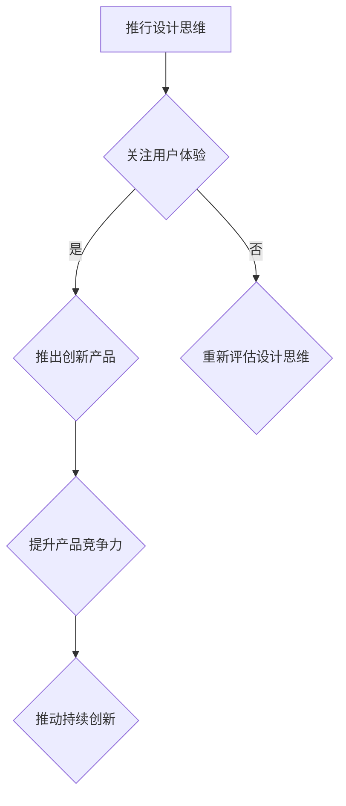

#### 5.3 特斯拉的领导力与创新

特斯拉公司以其在电动汽车和可再生能源领域的创新而著称。公司首席执行官埃隆·马斯克以其独特的领导力风格，带领特斯拉实现了多个突破性进展。

- **背景介绍**：埃隆·马斯克以其远见和坚定的信念，推动了特斯拉在电动汽车和电池技术方面的创新。
- **实践效果**：马斯克的领导力激发了特斯拉团队的创新精神，公司推出了多个颠覆性产品，如Model S、Model 3和Powerwall。

以下是一个使用Mermaid流程图表示特斯拉领导力与创新的流程：

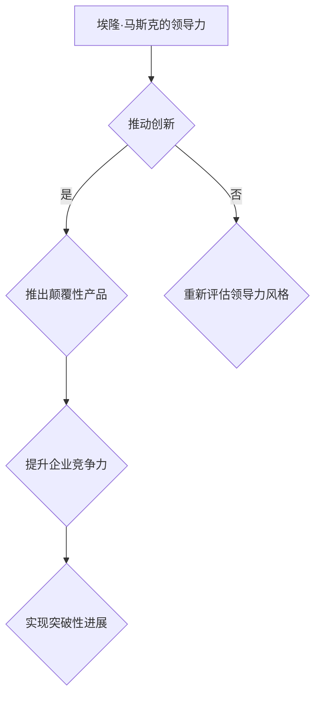

通过以上实践案例，我们可以看到领导力与创新在企业发展中的重要性。有效的领导力和创新思维不仅能够激发团队的潜力，还能够推动企业的持续创新和进步。在下一章中，我们将总结全书内容，并展望未来的发展方向。

---

### 第六章：总结与展望

在本书中，我们系统地探讨了领导力与创新的核心概念、方法与实践。通过分析愿景与目标、沟通与协作、激励与鼓舞、决策与执行等领导力特质，我们了解了如何成为有效的领导者。同时，通过探讨创造性思维、设计思维和系统思维等创新思维方式，我们学会了如何在团队中培养创新精神。此外，我们还深入探讨了团队动态、文化变革与创新文化构建，为团队的高效协作和创新提供了实用的指导。

#### 6.1 价值与意义

本书的价值在于：

- **理论与实践结合**：通过实际案例和经验分享，将领导力与创新的核心理念转化为可操作的方法和策略。
- **系统化学习**：为读者提供了一个完整的框架，帮助他们系统地理解和应用领导力与创新的思维和方法。
- **实用性强**：书中提供的实践案例和技巧，可以帮助读者在各自的岗位上更好地发挥领导力和创新能力。

#### 6.2 未来展望

在未来的发展中，领导力与创新将继续发挥重要作用。以下是几个未来发展方向：

- **数字化转型**：随着数字化技术的不断发展，领导者需要具备数字思维，推动企业数字化转型。
- **可持续发展**：在环境保护和可持续发展成为全球共识的背景下，企业需要创新思维，寻找可持续发展的路径。
- **全球化视野**：在全球化背景下，领导者需要具备全球视野，善于应对跨国挑战和机遇。

#### 6.3 结语

领导力与创新是企业在快速变化的商业环境中取得成功的关键。通过培养正确的领导力和创新思维，构建健康的文化氛围，领导者可以引领团队实现突破性进展。让我们携手努力，成为引领团队破局的卓越领导者。

---

### 作者信息

作者：AI天才研究院/AI Genius Institute & 禅与计算机程序设计艺术 /Zen And The Art of Computer Programming

---

通过以上章节的深入探讨，我们系统地了解了领导力与创新的核心概念和实践方法。希望本书能够为您的领导力提升和创新实践提供有价值的参考。让我们一起在未来的道路上，不断探索、创新和突破。

