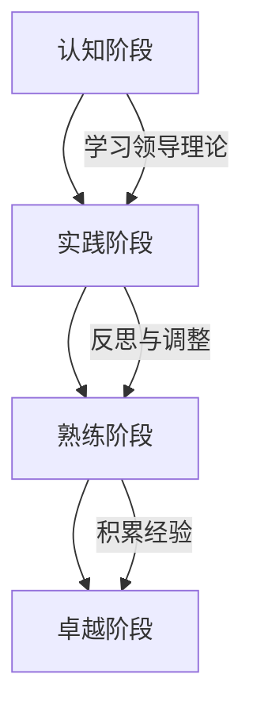
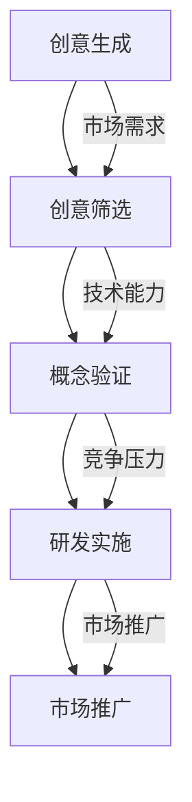
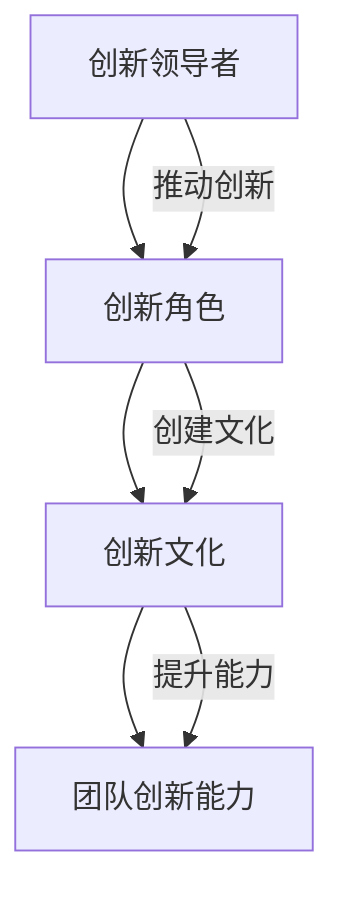
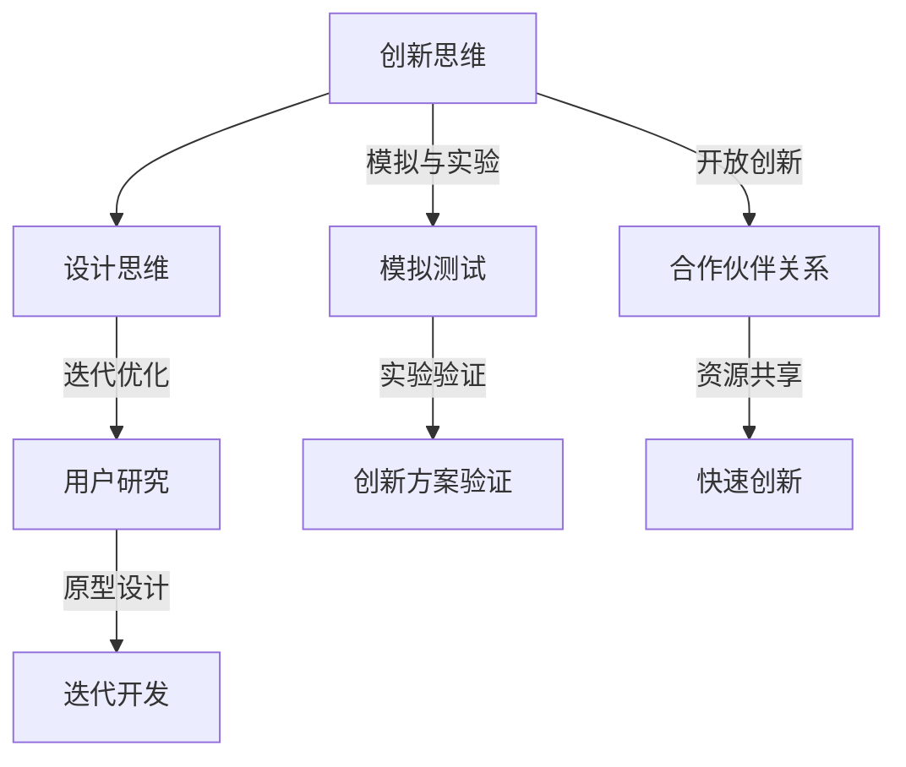
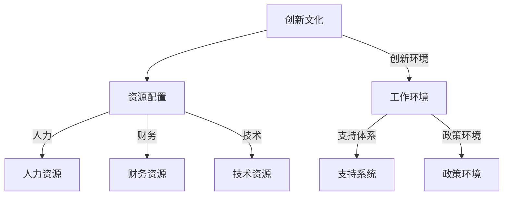
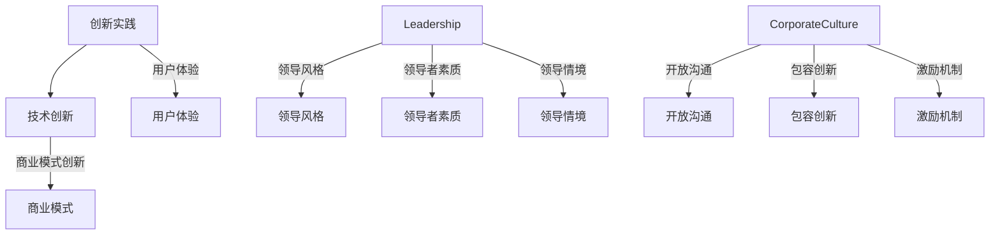

                 


### 第1章 引言

#### 领导力的定义与重要性

领导力，是指领导者通过影响、激励和指导他人，实现组织目标的能力。它不仅仅是一种管理技能，更是一种深层次的个体素质和人际关系技巧。在现代社会，领导力的重要性愈发凸显。随着全球化和信息化的加速，组织结构日益复杂，市场竞争愈发激烈，领导者的角色也变得更加多元和重要。

首先，领导力对于组织的发展至关重要。优秀的领导者能够明确组织愿景，制定战略规划，并带领团队朝着目标不断前进。他们能够激发团队成员的潜力，提升团队的整体效能。同时，领导力还能营造积极的组织文化，增强组织的凝聚力和创新能力。

其次，领导力对于个人职业发展也具有重要影响。具备领导力的人往往能够更快地晋升，承担更多的责任。他们不仅能够在团队中脱颖而出，还能够影响和带领团队一起成长。

#### 创新的意义与挑战

创新，是指通过新思维、新方法、新技术等手段，创造新的产品、服务或商业模式的过程。在当今这个快速变化的时代，创新能力已经成为组织竞争力的核心。一个缺乏创新能力的组织很难在激烈的市场竞争中站稳脚跟。

创新的意义主要体现在以下几个方面：

1. **提升竞争力**：创新能够帮助组织突破市场饱和和同质化竞争的困境，开拓新的市场空间，提升产品的附加值和市场竞争力。
2. **推动发展**：创新是推动社会进步和经济发展的关键动力，它能够带来新的经济增长点，促进产业升级和转型。
3. **增强活力**：创新能够激发组织的活力，提高员工的创造力和积极性，形成持续的创新生态。

然而，创新也面临着诸多挑战：

1. **风险与不确定性**：创新往往伴随着高风险和高不确定性，包括技术风险、市场风险、财务风险等。
2. **资源与时间限制**：创新需要大量的资源投入，包括人力、财力、时间等，这对于许多组织来说是一个巨大的挑战。
3. **文化障碍**：许多组织内部存在固有的文化和思维定式，这些障碍可能阻碍创新的发展。

#### 领导力与创新的关系

领导力与创新之间存在着紧密的内在联系。首先，领导力是推动创新的重要动力。优秀的领导者能够为团队创造一个支持创新的氛围，提供必要的资源和支持，激发团队成员的创新潜力。他们能够通过有效的沟通和激励，将创新理念转化为具体的行动。

其次，创新反过来也能够增强领导力。通过参与创新过程，领导者能够不断学习新的知识和技能，提升自己的领导能力。同时，创新的成功也为领导者赢得了更高的声誉和信任，增强了他们在组织中的影响力。

总之，领导力与创新是相辅相成的。一个优秀的领导者必须具备创新能力，同时也能够通过领导力推动创新的发展。只有在领导力和创新的共同作用下，组织才能在激烈的市场竞争中立于不败之地。

---

**关键词**：领导力、创新、组织发展、核心竞争力、团队建设

**摘要**：本章首先探讨了领导力的定义及其在组织发展中的重要性，随后阐述了创新的意义与挑战，并分析了领导力与创新之间的紧密联系。通过这些讨论，我们为后续章节奠定了基础，将深入探讨领导力与创新的融合实践，为组织的发展提供理论支持和实际指导。

### 第2章 领导力核心概念

#### 领导力的基础理论

领导力，作为组织管理的重要一环，其基础理论为我们理解领导行为和领导风格提供了重要的框架。以下是几个关键的理论：

**1. 领导风格理论**

领导风格理论关注领导者如何与团队成员互动，以及这种互动如何影响团队绩效。弗雷德·弗洛姆和鲍勃·雷索斯（Fred E. Fiedler）提出的“领导连续统一体理论”（Contingency Leadership Theory）认为，不存在最好的领导风格，而是要根据具体情境选择最合适的领导风格。领导风格可以分为专制型、民主型和自由放任型。在不同的情境下，这些风格的表现会有所不同。

**2. 领导行为理论**

领导行为理论侧重于领导者实际的行为模式。道格拉斯·麦格雷戈（Douglas McGregor）的“X理论与Y理论”提出了两种不同的领导理念。X理论认为员工需要严格的管理和监督，而Y理论则认为员工具有自我激励和自我管理的能力。罗伯特·豪斯（Robert House）的“路径-目标理论”（Path-Goal Theory）进一步扩展了这一观点，认为领导者的目标是帮助员工清晰地了解他们的任务和目标，并提供必要的支持和奖励。

**3. 领导者素质理论**

领导者素质理论关注领导者的个人特质和能力。詹姆斯·麦克库勒奇（James MacGregor Burns）提出的“转换型领导”（Transformative Leadership）理论强调，领导者通过激发追随者的潜力和信念，推动变革和成长。这种领导风格不仅仅关注任务完成，更注重员工的个人成长和组织价值观的塑造。

**4. 领导情境理论**

领导情境理论认为领导行为应该根据具体情境进行调整。费德勒模型（Fiedler's Contingency Model）提出了“情境控制”和“领导者-成员关系”两个维度，认为在不同的情境下，领导者需要采取不同的策略。例如，在高度控制的情境下，专制型领导可能更有效，而在自主性较高的情境下，民主型领导可能更为合适。

**领导风格与行为**

领导风格与领导行为密切相关，但又有区别。领导风格是领导者长期形成的、相对稳定的处理问题的方式，而领导行为则是在特定情境下表现出来的具体行为。例如，一位领导者可能在大部分时间采用民主型风格，但在紧急情况下可能会转变为专制型风格。

**领导者素质与能力**

领导者素质与能力是领导力的核心。根据罗伯特·豪斯的理论，领导者应具备以下能力：

- **技术能力**：领导者需要具备相关领域的专业知识和技术，以便能够指导和解决团队中的技术问题。
- **人际能力**：领导者需要具备良好的人际交往能力，能够与团队成员建立信任和合作关系。
- **概念能力**：领导者需要具备战略思维和宏观视角，能够制定和执行组织的发展规划。

**领导力的发展过程**

领导力的发展是一个持续的过程，包括以下几个阶段：

1. **认知阶段**：领导者开始意识到自己在团队中的角色和责任，并开始学习相关的领导理论。
2. **实践阶段**：领导者通过实际工作机会，将理论应用于实践，并不断反思和调整自己的行为。
3. **熟练阶段**：领导者在实践中积累经验，逐渐形成自己独特的领导风格和方式。
4. **卓越阶段**：领导者不仅能够在日常工作中表现出色，还能够通过创新和变革推动组织的持续发展。

**案例分析：**

以苹果公司的创始人史蒂夫·乔布斯为例，他具备卓越的领导力。乔布斯不仅具备出色的技术能力，能够深入了解产品开发的具体细节，还能够通过其独特的领导风格，激发团队成员的创新潜力。他采用转换型领导风格，鼓励团队成员挑战现状，追求卓越。

总之，领导力是组织成功的关键因素。理解领导力的基础理论和核心概念，有助于领导者更好地发挥自己的作用，推动组织的持续发展。

---

**核心概念与联系表格：**

| **概念** | **定义** | **属性特征** | **关系** |
| --- | --- | --- | --- |
| 领导力 | 通过影响、激励和指导他人实现组织目标的能力 | 影响力、激励能力、指导能力 | 与管理、团队建设、创新等密切相关 |
| 领导风格 | 领导者在特定情境下处理问题的方式 | 专制型、民主型、自由放任型 | 影响领导行为的有效性 |
| 领导行为 | 领导者在具体情境中表现出来的行为模式 | 沟通、决策、激励 | 与领导风格相互作用 |
| 领导者素质 | 领导者的个人特质和能力 | 技术能力、人际能力、概念能力 | 决定领导力的水平 |
| 领导情境 | 领导行为发生的具体情境 | 情境控制、领导者-成员关系 | 影响领导策略的选择 |

**ER实体关系图架构：**

```mermaid
erDiagram
    Leader ||--|{ LeadershipStyle }
    Leader ||--|{ LeadershipBehavior }
    Leader ||--|{ LeaderQuality }
    Leader ||--|{ LeadershipSituation }
```

**Mermaid流程图：**



---

**本文节核心概念与联系表格**详细介绍了领导力的基础理论，包括领导风格理论、领导行为理论、领导者素质理论和领导情境理论。通过核心概念与联系表格和ER实体关系图架构，进一步明确了领导力相关概念之间的相互关系，为后续章节的深入探讨奠定了基础。

### 第3章 创新的核心概念

#### 创新的定义与分类

创新，是指在现有基础上，通过新的思维、方法或技术，创造新的产品、服务或商业模式的过程。创新不仅仅是一种技术活动，更是一种系统性思维和行动方式。理解创新的定义对于把握其本质和推进创新实践至关重要。

首先，创新可以从以下几个方面进行定义：

1. **产品创新**：指通过引入新的技术、设计或材料，创造全新的产品或改进现有产品。
2. **过程创新**：指通过新的流程、方法或组织结构，改进生产或服务流程，提高效率和质量。
3. **市场创新**：指通过开辟新的市场或创造新的客户需求，推动产品或服务的市场拓展。
4. **商业模式创新**：指通过新的商业模式或价值创造方式，改变企业的盈利模式和市场竞争格局。

其次，创新可以按照不同的维度进行分类：

1. **按创新对象分类**：
   - **产品创新**：指在产品层面进行的创新，如新材料、新技术、新设计等。
   - **过程创新**：指在生产或服务流程层面的创新，如生产自动化、流程优化等。
   - **服务创新**：指在服务层面进行的创新，如服务模式、服务体验等。
   - **商业模式创新**：指在商业运营模式层面进行的创新，如新的盈利模式、市场定位等。

2. **按创新程度分类**：
   - **渐进式创新**：指在现有基础上逐步改进或优化，如产品的小改进、流程的微调等。
   - **革命性创新**：指通过颠覆性技术或理念，实现从无到有的创新，如互联网、智能手机等。

3. **按创新主体分类**：
   - **企业内部创新**：指企业内部自主进行的技术研发和市场拓展。
   - **外部合作创新**：指企业与外部科研机构、高校或合作伙伴共同进行的创新。
   - **用户驱动创新**：指通过用户反馈和需求，引导企业进行的产品和服务创新。

#### 创新的驱动力

创新驱动力是指推动创新发生的内在因素。以下是一些主要创新驱动力：

1. **市场需求**：市场需求是推动创新的重要动力。了解和满足用户需求，能够激发企业的创新活力，推动产品的更新换代和市场的拓展。

2. **技术创新**：技术创新是推动产品和服务创新的关键因素。随着科技的不断进步，新的技术不断涌现，为企业提供了丰富的创新机会。

3. **竞争压力**：竞争压力迫使企业不断寻求创新，以保持竞争优势。通过创新，企业可以提升产品附加值，扩大市场份额。

4. **政策支持**：政府的政策支持为创新提供了重要的保障。如税收优惠、资金支持、知识产权保护等政策，能够激发企业的创新动力。

5. **文化氛围**：创新文化氛围是培养创新人才和推动创新实践的重要环境。一个开放、包容、鼓励尝试和失败的组织文化，能够激发员工的创新潜力。

#### 创新的过程与管理

创新是一个复杂的过程，涉及到多个环节和步骤。以下是创新过程的一般模型：

1. **创意生成**：指通过头脑风暴、知识挖掘等方式，产生新的创意和想法。这一阶段是创新过程的起点，是创新的核心。

2. **创意筛选**：指对产生的创意进行筛选和评估，确定哪些创意具有实际可行性和发展潜力。筛选过程需要考虑市场需求、技术可行性、资源投入等因素。

3. **概念验证**：指对选定的创意进行初步验证，验证其技术可行性、市场潜力等。这一阶段通常通过原型设计、实验等方式进行。

4. **研发实施**：指在验证基础上，对创意进行深入研究和开发，直至形成可商业化产品或服务。这一阶段需要投入大量资源和时间。

5. **市场推广**：指将创新产品或服务推向市场，进行市场推广和销售。这一阶段需要制定营销策略，进行市场推广活动，以吸引客户。

创新管理是确保创新过程顺利进行的关键。以下是创新管理的主要策略和工具：

1. **创新项目管理**：通过项目管理方法，对创新项目进行规划、执行、监控和评估，确保项目按时、按质、按预算完成。

2. **创新激励机制**：通过激励机制，激发员工的创新热情和积极性。如设立创新奖项、提供股权激励等。

3. **创新文化培养**：通过建立创新文化，营造鼓励创新、包容失败的氛围。如举办创新论坛、创新竞赛等。

4. **知识管理**：通过知识管理方法，将创新过程中的经验和知识进行积累、共享和利用，为后续创新提供支持。

#### 案例分析

以苹果公司为例，苹果公司通过不断创新，引领了多个行业的变革。以下是一些案例分析：

1. **iPhone的推出**：iPhone的推出标志着智能手机的崛起。苹果通过革命性的设计和技术，如多点触控屏幕、App Store等，重新定义了手机市场。

2. **MacBook Air的发布**：MacBook Air的发布标志着轻薄笔记本电脑的流行。苹果通过技术创新，如超薄设计、高效电池等，改变了消费者对笔记本电脑的期望。

3. **Apple Watch的推出**：Apple Watch的推出标志着可穿戴设备市场的兴起。苹果通过创新的健康监测功能和时尚设计，吸引了大量消费者。

通过这些案例，我们可以看到，创新是苹果公司持续发展的关键。苹果公司的成功不仅在于其创新的产品，更在于其不断创新的文化和领导力。

---

**核心概念与联系表格：**

| **概念** | **定义** | **属性特征** | **关系** |
| --- | --- | --- | --- |
| 创新 | 通过新的思维、方法或技术，创造新的产品、服务或商业模式的过程 | 创新程度、创新对象、创新主体 | 与市场需求、技术创新、竞争压力等密切相关 |
| 需求驱动创新 | 通过了解和满足用户需求，推动产品或服务的创新 | 市场需求、用户反馈、用户体验 | 是创新的重要动力 |
| 技术驱动创新 | 通过新技术的引入和应用，推动产品或服务的创新 | 技术水平、研发能力、创新环境 | 是创新的核心因素 |
| 竞争驱动创新 | 通过竞争压力，推动企业进行产品或服务的创新 | 竞争对手、市场态势、竞争策略 | 是创新的驱动因素 |
| 创新过程 | 从创意生成到市场推广的全过程 | 创意生成、创意筛选、概念验证、研发实施、市场推广 | 是创新的核心环节 |

**ER实体关系图架构：**

```mermaid
erDiagram
    Innovation ||--|{ InnovationObject }
    Innovation ||--|{ InnovationDriver }
    Innovation ||--|{ InnovationProcess }
```

**Mermaid流程图：**



---

**本文节核心概念与联系表格**详细介绍了创新的定义、分类和驱动力，通过核心概念与联系表格和ER实体关系图架构，进一步明确了创新相关概念之间的相互关系。本文节还通过创新的驱动力和过程管理策略，为理解创新提供了深入的见解。

### 第4章 领导力与创新融合实践

#### 领导者在创新过程中的角色

在创新过程中，领导者的角色至关重要。领导者不仅是创新的推动者，还是创新文化的创建者和维护者。以下是领导者在这两个角色中的具体职责和挑战：

**1. 作为创新的推动者**

领导者在作为创新的推动者时，需要发挥以下几个方面的作用：

- **设定创新目标**：领导者需要明确组织的目标和创新方向，为团队提供清晰的方向和目标。
- **提供资源支持**：领导者需要确保创新项目得到足够的资源，包括人力、财务和技术资源。
- **激励创新团队**：领导者需要通过激励措施，如奖励和认可，激发团队成员的创新热情和积极性。
- **协调内外部关系**：领导者需要协调团队内部和外部的关系，确保创新项目顺利进行。

**2. 作为创新文化的创建者和维护者**

领导者作为创新文化的创建者和维护者，需要营造一个支持创新、鼓励尝试和包容失败的环境。以下是具体的措施：

- **建立开放沟通机制**：领导者需要建立一个开放的沟通机制，鼓励团队成员分享想法和意见，形成协作创新的文化。
- **鼓励跨部门合作**：领导者需要促进跨部门之间的合作，打破部门壁垒，促进知识共享和资源整合。
- **提供学习机会**：领导者需要为团队成员提供学习和发展的机会，提升他们的技能和创新能力。
- **容忍失败**：领导者需要建立容忍失败的文化，鼓励团队成员从失败中学习，不断尝试和创新。

#### 创新领导者面临的挑战

虽然领导者在创新过程中扮演着关键角色，但他们也面临着诸多挑战：

- **资源限制**：创新往往需要大量的资源投入，包括人力、财务和技术资源。领导者需要在不充分资源条件下，做出优先级排序和资源优化配置。
- **时间压力**：创新是一个复杂和长期的过程，领导者需要在紧迫的时间内，确保创新项目按计划进行。
- **风险承担**：创新伴随着高风险，领导者需要承担项目失败的风险，并在失败时保持冷静和积极的态度。
- **员工期望**：创新领导者需要平衡员工对创新成果的期望，确保团队成员对创新项目有正确的预期，避免过高期望带来的压力。

#### 团队创新能力的提升

提升团队创新能力是领导者的重要任务。以下是一些策略和方法：

- **组建多元化团队**：多元化团队能够带来不同的视角和思维方式，有助于激发创新。领导者可以通过招聘具有不同背景和专业知识的员工，构建多元化团队。
- **提供培训和学习机会**：通过培训和学习机会，提升团队成员的技能和知识，增强他们的创新能力。例如，领导者可以组织创新工作坊、技术研讨会等。
- **建立创新激励机制**：通过奖励和认可，激励团队成员参与创新。例如，设立创新奖、提供股权激励等。
- **促进知识共享**：建立知识共享平台，鼓励团队成员分享经验和知识，形成知识共享和协同创新的氛围。
- **鼓励尝试和失败**：领导者需要建立容忍失败的文化，鼓励团队成员勇于尝试和失败，从失败中学习并不断进步。

#### 案例分析

以谷歌（Google）为例，谷歌以其卓越的创新能力和开放的企业文化著称。以下是谷歌在提升团队创新能力方面的几个案例：

1. **20%时间政策**：谷歌推出了“20%时间政策”，允许员工在正常工作时间的20%内自由探索新的创意项目。这一政策激发了员工的工作热情，产生了许多创新成果，如Gmail和Google News等。

2. **黑客松（Hackathons）**：谷歌定期举办黑客松活动，鼓励员工团队合作，在短时间内快速开发新产品或优化现有产品。这些活动不仅提升了员工的创新能力，还促进了团队之间的协作。

3. **开放沟通机制**：谷歌建立了开放的沟通机制，鼓励员工自由地表达意见和反馈。员工可以通过内部邮件、博客和论坛等渠道，分享想法和建议，促进知识的流动和创新的产生。

通过这些案例，我们可以看到，谷歌的成功不仅依赖于其强大的技术实力，更依赖于其卓越的领导力和创新文化。谷歌的领导者通过一系列措施，激发了员工的创新潜力，推动了企业的持续创新和发展。

---

**核心概念与联系表格：**

| **概念** | **定义** | **属性特征** | **关系** |
| --- | --- | --- | --- |
| 创新领导者 | 在创新过程中，负责推动创新、创建和维护创新文化的人 | 创新驱动、资源管理、沟通能力、风险承担 | 与创新过程、团队建设、创新文化密切相关 |
| 创新角色 | 领导者在创新过程中扮演的具体角色 | 推动者、创建者、维护者 | 决定领导者在创新过程中的具体职责和挑战 |
| 创新文化 | 支持创新、鼓励尝试和包容失败的组织文化 | 开放沟通、知识共享、激励措施 | 形成创新环境的基石 |
| 团队创新能力 | 团队在创新过程中的能力和表现 | 多元化团队、培训与学习、知识共享、激励措施 | 提升团队整体创新效果 |

**ER实体关系图架构：**

```mermaid
erDiagram
    InnovationLeader ||--|{ InnovationRole }
    InnovationRole ||--|{ InnovationCulture }
    InnovationRole ||--|{ TeamInnovationAbility }
```

**Mermaid流程图：**



---

**本文节核心概念与联系表格**详细介绍了领导者在创新过程中的角色和面临的挑战，以及提升团队创新能力的方法和策略。通过核心概念与联系表格和ER实体关系图架构，进一步明确了创新领导者与团队创新能力之间的关系，为领导者在实际工作中提供了理论支持和实践指导。

### 第5章 创新思维与方法

#### 创新思维的培养

创新思维是推动创新的核心动力，它不仅包括创造力，还涉及到如何运用这些创造力来解决问题和创造价值。以下是培养创新思维的一些关键方法：

**1. 发散思维与收敛思维**

发散思维和收敛思维是创新思维中的两个重要维度。发散思维是指从一个中心点出发，产生多种可能的解决方案或想法。收敛思维则是在发散思维的基础上，通过筛选和评估，选择最优的解决方案。

- **发散思维**：通过头脑风暴、思维导图等方法，激发思维活力，产生大量创意。
- **收敛思维**：通过对创意进行评估和筛选，确定最具潜力和可行性的方案。

**2. 横向思维与纵向思维**

横向思维和纵向思维是另一种重要的创新思维方法。横向思维是指从一个新的角度或视角来看待问题，而纵向思维则是在现有基础上进行深入分析和优化。

- **横向思维**：通过跨领域、跨学科的知识整合，寻找新的解决方案或商业机会。
- **纵向思维**：通过对问题的深入分析和理解，找到问题的本质和关键点，进行系统性优化。

**3. 跨界合作与创新**

跨界合作是培养创新思维的有效方法。通过与其他领域或行业的合作，可以引入不同的思维方式和知识体系，激发新的创意和想法。

- **跨界合作**：通过与其他企业和机构合作，共享资源、知识和经验，共同推进创新。
- **跨学科研究**：通过跨学科的研究，结合不同领域的知识和方法，解决复杂问题。

#### 创新方法的应用

在实际应用中，以下几种创新方法被广泛使用：

**1. 设计思维**

设计思维是一种以用户为中心的创新方法，强调通过迭代和用户反馈来不断优化产品和服务。

- **用户研究**：通过研究用户的需求和行为，理解用户的问题和痛点。
- **原型设计**：快速构建原型，通过用户反馈不断优化设计。
- **迭代开发**：通过反复迭代，不断改进产品和服务。

**2. 模拟与实验**

模拟与实验是验证创新想法的有效方法，可以帮助企业评估创新方案的效果和可行性。

- **模拟测试**：通过计算机模拟，预测和评估创新方案的潜在影响。
- **实验验证**：在实际环境中进行实验，收集数据，分析结果。

**3. 开放创新**

开放创新是指企业通过外部合作，获取外部创新资源，实现快速创新。

- **合作伙伴关系**：与外部企业和机构建立合作关系，共享创新资源和成果。
- **开放平台**：建立开放的创新平台，鼓励外部创新者和企业参与创新。

#### 案例分析

以腾讯公司为例，腾讯在创新思维和方法的应用方面有着丰富的实践经验：

1. **微信的推出**：微信是腾讯的旗舰产品之一，其成功在于腾讯采用了设计思维和创新方法。通过深入了解用户需求，腾讯快速迭代开发了微信，从而改变了人们的沟通方式。

2. **AI Lab的建立**：腾讯AI Lab是腾讯在人工智能领域的研发机构，通过跨界合作和开放创新，腾讯AI Lab吸引了大量国内外顶尖人才，推动了人工智能技术的快速发展。

3. **游戏开发**：腾讯在游戏开发方面也有着丰富的创新经验。通过设计思维和用户研究，腾讯不断优化游戏体验，推出了如《王者荣耀》等热门游戏，获得了全球玩家的喜爱。

通过这些案例，我们可以看到，创新思维和方法的正确应用，对于企业的持续创新和竞争优势至关重要。

---

**核心概念与联系表格：**

| **概念** | **定义** | **属性特征** | **关系** |
| --- | --- | --- | --- |
| 创新思维 | 运用创造性和逻辑性，解决问题和创造价值的能力 | 发散思维、收敛思维、横向思维、纵向思维 | 基础于逻辑推理和创造性思维 |
| 设计思维 | 以用户为中心，通过迭代和用户反馈优化产品和服务的方法 | 用户研究、原型设计、迭代开发 | 强调用户需求和用户体验 |
| 模拟与实验 | 通过模拟和实验验证创新想法的有效性和可行性 | 模拟测试、实验验证 | 提高创新方案的科学性和可靠性 |
| 开放创新 | 通过外部合作和资源共享实现快速创新的方法 | 合作伙伴关系、开放平台 | 提升创新效率和效果 |

**ER实体关系图架构：**

```mermaid
erDiagram
    InnovationMind ||--|{ DesignThinking }
    InnovationMind ||--|{ SimulationExperiment }
    InnovationMind ||--|{ OpenInnovation }
```

**Mermaid流程图：**



---

**本文节核心概念与联系表格**详细介绍了创新思维的不同维度和应用方法，通过核心概念与联系表格和ER实体关系图架构，进一步明确了创新思维方法之间的相互关系。本文节还通过案例分析，展示了创新思维和方法的实际应用效果，为领导者和管理者提供了实践指导。

### 第6章 领导力与创新环境构建

#### 创新文化的培育

创新文化是组织持续创新的重要基础，它能够激发员工的创造力，推动组织的创新活力。以下是如何培育创新文化的一些策略：

**1. 建立开放沟通机制**

开放沟通是创新文化的重要组成部分。领导者需要建立一个开放、包容的沟通环境，鼓励员工自由表达观点和想法。以下是一些具体措施：

- **建立内部论坛**：通过内部论坛或讨论组，让员工能够随时随地分享自己的想法和意见。
- **定期会议**：定期组织创新会议或研讨会，让员工有机会展示他们的创意，并获得反馈和支持。
- **鼓励反馈**：鼓励员工在项目过程中提供反馈，包括正面和负面的意见，以便不断优化和创新。

**2. 培养包容失败的文化**

在创新过程中，失败是不可避免的。领导者需要建立一个容忍失败的文化，鼓励员工勇于尝试，从失败中学习和成长。以下是一些具体措施：

- **设立学习基金**：设立专门的学习基金，用于支持员工在创新过程中的学习和发展。
- **开展失败案例分析**：定期组织失败案例分析会议，让员工了解失败的原因和教训，从中吸取经验。
- **提供心理支持**：为员工提供心理咨询和支持，帮助他们应对创新过程中的压力和挫折。

**3. 建立激励机制**

激励机制是培养创新文化的重要手段。领导者需要通过奖励和认可，激励员工参与创新。以下是一些具体措施：

- **设立创新奖项**：设立创新奖项，对在创新过程中表现突出的员工给予奖励和认可。
- **提供股权激励**：对于重要创新项目，可以提供股权激励，让员工分享创新成果。
- **提供晋升机会**：为在创新方面表现突出的员工提供更多的晋升机会，激励他们持续创新。

#### 创新资源的配置

创新资源的配置是确保创新项目顺利进行的关键。以下是如何合理配置创新资源的一些策略：

**1. 人力资源配置**

人力资源是创新过程中最重要的资源。领导者需要根据创新项目的需求，合理配置人力资源。以下是一些具体措施：

- **组建多元化团队**：组建由不同背景和专业知识的员工组成的多元化团队，以促进知识共享和创意碰撞。
- **提供培训和学习机会**：为员工提供创新相关的培训和学习机会，提升他们的技能和创新能力。
- **激励关键人才**：对在创新过程中表现突出的关键人才给予激励，以保持他们的积极性和创造力。

**2. 财务资源配置**

财务资源是创新项目的有力支撑。领导者需要确保创新项目得到充足的财务支持。以下是一些具体措施：

- **设立专项基金**：设立专项基金，用于支持创新项目的启动和运行。
- **优化预算管理**：通过优化预算管理，确保创新项目的资金需求得到满足。
- **提供风险投资**：对于高风险高回报的创新项目，可以提供风险投资，以鼓励员工大胆创新。

**3. 技术资源配置**

技术资源是创新项目成功的关键。领导者需要确保创新项目得到必要的技术支持。以下是一些具体措施：

- **引入新技术**：通过引入新技术，提升创新项目的效率和效果。
- **提供技术支持**：为创新项目提供充足的技术支持，包括技术培训、技术咨询等。
- **建立技术共享平台**：建立技术共享平台，促进技术资源的共享和利用。

#### 创新环境的优化

创新环境的优化是推动创新的重要保障。以下是如何优化创新环境的一些策略：

**1. 优化工作环境**

工作环境对员工的工作状态和创造力有很大影响。领导者需要优化工作环境，以提高员工的工作效率和创新力。以下是一些具体措施：

- **提供舒适的工作空间**：为员工提供舒适的工作空间，包括办公桌、椅子、照明等。
- **增加休闲设施**：增加休闲设施，如咖啡厅、休息室等，让员工能够在工作中得到放松和休息。
- **促进团队合作**：通过开放式的办公室设计，促进团队合作和知识共享。

**2. 优化支持体系**

创新需要一系列支持体系的保障。领导者需要建立和完善支持体系，为创新提供有力保障。以下是一些具体措施：

- **建立创新实验室**：建立创新实验室，为员工提供实验和测试的环境。
- **提供技术支持**：为员工提供技术支持和咨询服务，帮助他们解决创新过程中的技术难题。
- **建立反馈机制**：建立反馈机制，及时收集员工对创新环境和支持体系的反馈，不断优化和创新。

**3. 优化政策环境**

政策环境对创新具有重要作用。政府和企业需要建立有利于创新的政策环境，为创新提供政策支持和保障。以下是一些具体措施：

- **税收优惠**：为创新企业和项目提供税收优惠，减轻企业负担。
- **资金支持**：提供资金支持，包括政府补贴、风险投资等，为创新项目提供资金保障。
- **知识产权保护**：加强知识产权保护，为创新者提供法律保障。

通过以上措施，可以有效优化创新环境，激发员工的创新潜力，推动组织的持续创新和发展。

---

**核心概念与联系表格：**

| **概念** | **定义** | **属性特征** | **关系** |
| --- | --- | --- | --- |
| 创新文化 | 组织内部支持创新、鼓励尝试和包容失败的氛围 | 开放沟通、包容失败、激励机制 | 培育创新环境的基础 |
| 资源配置 | 创新过程中所需的资源分配和优化 | 人力、财务、技术 | 确保创新项目顺利进行的关键 |
| 创新环境 | 支持创新活动的工作条件、支持和保障体系 | 工作环境、支持体系、政策环境 | 提升创新能力和效果 |

**ER实体关系图架构：**

```mermaid
erDiagram
    InnovationCulture ||--|{ ResourceAllocation }
    InnovationCulture ||--|{ InnovationEnvironment }
    ResourceAllocation ||--|{ HumanResource }
    ResourceAllocation ||--|{ FinancialResource }
    ResourceAllocation ||--|{ TechnicalResource }
    InnovationEnvironment ||--|{ WorkEnvironment }
    InnovationEnvironment ||--|{ SupportSystem }
    InnovationEnvironment ||--|{ PolicyEnvironment }
```

**Mermaid流程图：**



---

**本文节核心概念与联系表格**详细介绍了创新文化的培育、创新资源的配置和创新环境的优化策略，通过核心概念与联系表格和ER实体关系图架构，进一步明确了这些策略之间的相互关系。本文节还通过具体的措施和案例分析，为领导者提供了实际操作指南，帮助他们在组织中构建有利于创新的环境。

### 第7章 领导力与创新案例分析

#### 国内领先企业的创新实践

在国内，许多领先企业通过卓越的领导力和创新实践，取得了显著的成绩。以下是对两家企业——阿里巴巴和华为——的创新实践进行分析：

**1. 阿里巴巴**

阿里巴巴是中国最大的电子商务公司之一，其创新实践体现在多个方面：

- **技术驱动创新**：阿里巴巴通过自主研发和引进新技术，不断提升其电商平台的性能和用户体验。例如，阿里云作为其子公司，提供了强大的云计算服务，推动了互联网基础设施的创新。

- **商业模式的创新**：阿里巴巴不断探索新的商业模式，如支付宝的推出，改变了人们的支付习惯，促进了移动支付的普及。

- **企业文化创新**：阿里巴巴倡导“双112”（双11和双12）的购物节，创造了新的市场机会，同时通过这些活动增强了品牌影响力。

**2. 华为**

华为作为全球领先的通信设备供应商，其创新实践在技术领域尤为突出：

- **技术创新**：华为在5G、物联网和人工智能等前沿技术领域取得了重要突破，通过不断研发和创新，推动了通信技术的进步。

- **全球化战略**：华为通过全球化布局，积极参与国际市场竞争，不断拓展海外市场，提升了全球竞争力。

- **员工激励**：华为通过股权激励和职业发展计划，激励员工参与创新，保持了公司内部的创新活力。

#### 国际企业的创新案例

在国际上，一些知名企业也通过卓越的领导力和创新实践，取得了显著的成功。以下是对两家企业——谷歌和苹果——的创新案例进行分析：

**1. 谷歌**

谷歌以其强大的技术创新和开放的企业文化著称：

- **技术创新**：谷歌在搜索技术、云计算、人工智能等领域取得了重要突破，其自主研发的Google Search、Google Maps、Google Drive等产品改变了人们的生活方式。

- **开放创新**：谷歌通过开源项目和合作伙伴关系，推动了整个行业的创新。例如，Android操作系统的开源，使得全球众多厂商可以基于该平台进行创新和开发。

- **企业文化**：谷歌倡导开放、包容和创新的企业文化，鼓励员工自由表达和尝试新的想法。

**2. 苹果**

苹果以其卓越的产品设计和用户体验在全球范围内享有盛誉：

- **产品创新**：苹果通过不断推出革命性的产品，如iPhone、iPad和Apple Watch，引领了消费电子市场的发展。

- **用户体验**：苹果注重用户体验，通过精细的设计和优化的操作系统，为用户提供了卓越的使用体验。

- **生态系统**：苹果建立了强大的生态系统，包括App Store、iCloud等，为用户提供了丰富的服务和产品。

通过以上分析，我们可以看到，无论是国内企业还是国际企业，领导力与创新实践都是其成功的关键因素。这些企业通过卓越的领导力，推动创新，不断突破传统的商业模式和技术的边界，取得了显著的成就。

---

**核心概念与联系表格：**

| **概念** | **定义** | **属性特征** | **关系** |
| --- | --- | --- | --- |
| 创新实践 | 企业通过技术创新、商业模式创新等手段，推动发展的过程 | 技术创新、商业模式创新、用户体验 | 与领导力、企业文化密切相关 |
| 领导力 | 领导者在组织中通过影响、激励和指导他人，实现组织目标的能力 | 领导风格、领导者素质、领导情境 | 推动企业创新的核心动力 |
| 企业文化 | 组织内部共同遵循的价值观、信念和行为规范 | 开放沟通、包容创新、激励机制 | 形成创新环境的基础 |

**ER实体关系图架构：**

```mermaid
erDiagram
    InnovationPractice ||--|{ TechnologyInnovation }
    InnovationPractice ||--|{ BusinessModelInnovation }
    InnovationPractice ||--|{ UserExperience }
    Leadership ||--|{ LeadershipStyle }
    Leadership ||--|{ LeaderQuality }
    Leadership ||--|{ LeadershipSituation }
    CorporateCulture ||--|{ OpenCommunication }
    CorporateCulture ||--|{ InclusiveInnovation }
    CorporateCulture ||--|{ IncentiveMechanism }
```

**Mermaid流程图：**



---

**本文节核心概念与联系表格**详细分析了阿里巴巴、华为、谷歌和苹果等企业的创新实践，通过核心概念与联系表格和ER实体关系图架构，进一步明确了领导力与创新实践之间的关系，以及企业文化在其中的作用。本文节通过案例分析，为领导者提供了实际操作的经验和启示，帮助他们在组织中实现创新。

### 第8章 结论与展望

#### 领导力与创新的未来趋势

在全球化、数字化和信息化的背景下，领导力与创新正面临前所未有的挑战与机遇。未来，领导力与创新的发展趋势将呈现出以下特点：

**1. 个性化和定制化领导**

随着组织的多样性和复杂性增加，领导者需要更加关注个体的需求和差异，采用个性化的领导方式。这种领导方式强调尊重员工的独特性，提供个性化的成长和发展机会，从而激发员工的潜能。

**2. 人工智能与领导力结合**

人工智能技术将为领导力带来新的变革。通过大数据分析、机器学习等技术，领导者可以更精准地了解员工需求、市场动态和组织状况，从而做出更科学的决策。同时，AI还可以帮助领导者优化资源分配、提升决策效率。

**3. 平台化和生态化创新**

未来创新将更加注重平台化和生态化。企业将通过构建开放的平台，吸引外部创新资源和合作伙伴，形成生态化的创新网络。这种模式有助于企业快速响应市场变化，提升创新能力和市场竞争力。

#### 领导者的角色转变

在未来的发展中，领导者的角色将发生显著变化。以下是一些重要的角色转变：

**1. 激励者和赋能者**

领导者不再是传统意义上的指挥者和监督者，而更应该成为激励者和赋能者。他们需要激发员工的创造力和积极性，为员工提供发展机会和支持，使员工能够充分发挥自身潜力。

**2. 生态系统的构建者**

未来的领导者需要具备构建和管理生态系统的能力。他们需要关注整个生态系统的动态，协调内部和外部资源，促进创新要素的流动和互动，从而推动组织的持续创新。

**3. 持续学习的推动者**

领导者需要成为持续学习的推动者。面对快速变化的环境和新技术，领导者需要不断更新自己的知识和技能，保持对行业趋势的敏锐洞察力，从而引领组织不断前进。

#### 创新的可持续性

创新的可持续性是未来发展的关键。以下是一些确保创新可持续性的策略：

**1. 建立长期创新规划**

企业需要制定长期的创新规划，明确创新目标、路径和资源配置。通过系统化的规划，确保创新活动有序、持续地进行。

**2. 融入企业战略**

创新应该成为企业战略的重要组成部分。领导者需要将创新理念融入企业的战略规划、组织架构和文化建设中，使创新成为企业发展的内生动力。

**3. 建立创新生态系统**

通过建立创新生态系统，企业可以吸引外部创新资源和合作伙伴，共同推动创新。这种生态系统有助于企业快速响应市场变化，提高创新效率和效果。

总之，领导力与创新是组织持续发展的关键。通过本文的探讨，我们明确了领导力与创新的关系，提出了领导力与创新的融合实践策略。未来，领导者需要不断适应变革，推动创新，为组织的可持续发展奠定坚实基础。

---

**关键词**：领导力、创新、个性化领导、人工智能、平台化、生态系统、激励者、赋能者、可持续性

**摘要**：本章总结了领导力与创新的未来趋势，探讨了领导者的角色转变和创新的可持续性。通过本文的深入探讨，我们为领导者提供了实践指导，帮助他们在组织中实现创新的可持续发展。

---

**作者信息**：

作者：AI天才研究院/AI Genius Institute & 禅与计算机程序设计艺术 /Zen And The Art of Computer Programming

