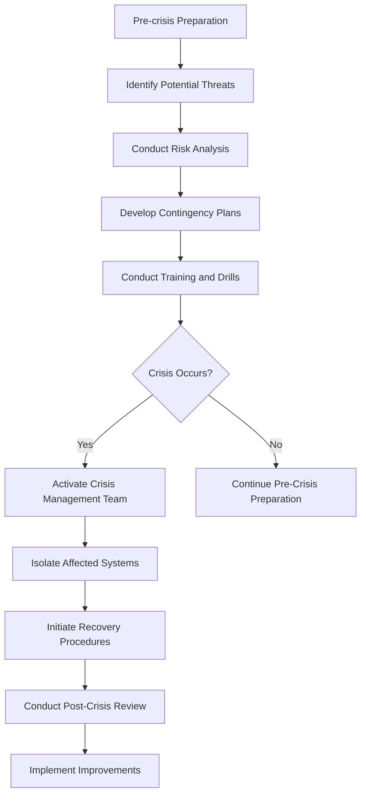

                 

### Introduction to Leadership and Crisis Management

In the ever-evolving landscape of technology and business, effective leadership and crisis management stand as critical pillars for organizational resilience. The role of a leader in times of crisis is multifaceted, requiring not only strategic decision-making but also the ability to inspire and unite teams towards a common goal. This chapter will delve into the fundamental concepts of leadership and crisis management, offering a structured overview that sets the stage for deeper exploration in subsequent chapters.

**1.1 Defining Leadership in Crisis**

Leadership, at its core, is about guiding and inspiring others towards achieving a shared vision. In the context of a crisis, leadership transcends routine management duties and becomes a pivotal force for navigating uncertainty and adversity. Effective crisis leadership involves clear communication, decisiveness, empathy, and the ability to mobilize resources quickly. It is about understanding that crises often bring with them a mixture of fear, stress, and potential for chaos, and it is the leader’s responsibility to mitigate these elements and steer the organization towards stability and recovery.

**1.2 The Importance of Crisis Management**

Crisis management is a proactive approach to identifying, preparing for, and responding to events that could significantly impact an organization. The importance of crisis management cannot be overstated, as it is directly linked to the survival and success of businesses in the face of unpredictable challenges. A well-executed crisis management plan can mitigate the impact of crises, preserve organizational assets, maintain stakeholder trust, and even provide a competitive edge. In the IT sector, where rapid technological advancements and cyber threats are common, effective crisis management is essential for safeguarding sensitive data and maintaining operational continuity.

**1.3 The Challenges of Crisis Management**

Crisis management is fraught with numerous challenges. One of the primary challenges is the speed at which crises unfold. The rapid pace of technological change and globalization means that organizations must be able to respond quickly to emerging threats. Additionally, crises often involve complex, interconnected issues that require a holistic approach. Leaders must navigate these challenges by balancing short-term actions with long-term strategic planning, ensuring that immediate threats are addressed while laying the groundwork for long-term recovery and resilience.

Another significant challenge is the psychological impact on individuals within the organization. Crises can create high levels of stress, anxiety, and uncertainty, affecting employee morale and productivity. Effective crisis management must address these psychological aspects by fostering a supportive and resilient organizational culture.

**1.4 Frameworks and Theories in Leadership and Crisis Management**

There are several frameworks and theories that can inform effective leadership and crisis management. One such framework is the crisis management cycle, which includes stages such as crisis prevention, preparation, response, and recovery. Another influential theory is Maslow’s hierarchy of needs, which can help leaders understand and address the psychological needs of employees during a crisis.

In the realm of leadership, transformational leadership theory emphasizes the role of inspiring and motivating followers to achieve their full potential. This can be particularly effective in crisis situations, where leaders need to rally their teams and foster a sense of collective purpose.

**1.5 Overview of the Book’s Structure and Key Takeaways**

This book is structured to provide a comprehensive guide to leadership and crisis management. The chapters are designed to build upon each other, starting with an introduction to core concepts and frameworks and moving into detailed discussions of specific strategies and tools. By the end of this book, readers will have a nuanced understanding of both the theoretical underpinnings and practical applications of effective leadership and crisis management.

Key takeaways from this chapter include the definition of crisis leadership, the importance of crisis management, and an overview of the challenges and frameworks that underpin effective crisis management. With these foundational concepts in place, readers will be well-prepared to delve deeper into the subsequent chapters and develop their own crisis management strategies.

---

In the following chapters, we will explore these concepts in greater detail, offering practical insights and real-world examples to illustrate their application. Whether you are a seasoned leader or just starting your journey, this book aims to equip you with the knowledge and skills necessary to lead your organization through even the most challenging crises.

### Basic Principles of Leadership

Leadership is a multifaceted concept that encompasses various styles, theories, and principles. Understanding these foundational elements is crucial for any leader aiming to effectively navigate both routine operations and crisis situations. This chapter delves into the core principles of leadership, providing a comprehensive overview that will set the stage for deeper exploration in subsequent sections.

#### 2.1 Core Leadership Theories

Leadership theories offer frameworks for understanding and practicing effective leadership. One of the most well-known theories is Max Weber's bureaucratic leadership, which emphasizes the importance of formal structures, rules, and procedures. Bureaucratic leaders prioritize efficiency, predictability, and adherence to established norms. However, this style may lack flexibility and innovation, which can be a disadvantage in fast-changing environments.

Another prominent theory is Frederick Taylor's scientific management theory, which advocates for analyzing and optimizing workflows to maximize efficiency. Scientific management focuses on standardizing processes and measuring performance objectively. While this approach can lead to significant productivity gains, it may also stifle creativity and employee initiative.

Contrastingly, Douglas McGregor's Theory X and Theory Y provides insights into how leaders perceive employee motivation. Theory X assumes that employees are inherently lazy and must be closely supervised to achieve organizational goals. In contrast, Theory Y views employees as self-motivated and capable of taking responsibility. Leaders who adopt Theory Y tend to create more empowering work environments, fostering higher levels of employee engagement and satisfaction.

#### 2.2 Leadership Styles and Their Application in Crisis

Leadership styles play a pivotal role in shaping organizational behavior and outcomes. There are several common leadership styles, each with its unique characteristics and applications in crisis management:

- **Autocratic Leadership**: This style is characterized by centralized decision-making and strict control. Autocratic leaders make decisions independently and expect followers to comply without question. While this can be effective in rapidly resolving crises, it may also lead to resistance and lack of commitment from team members.

- **Democratic Leadership**: In this style, leaders involve team members in decision-making processes, promoting collaboration and group problem-solving. Democratic leadership can enhance team cohesion and morale, making it particularly effective in crises where multiple perspectives are valuable. However, decision-making may become time-consuming, which can be a drawback in urgent situations.

- **Laissez-Faire Leadership**: This style is characterized by minimal intervention from leaders, allowing employees to set their own goals and decide how to achieve them. While this can foster innovation and autonomy, it may lead to confusion and lack of direction, especially in crisis scenarios where clear leadership is crucial.

- **Servant Leadership**: This style prioritizes the needs of followers, focusing on supporting and developing them. Servant leaders are often seen as mentors and coaches, fostering a culture of trust and mutual respect. This can be highly effective in crisis situations, where emotional support and a collaborative approach are essential for maintaining team morale and resilience.

#### 2.3 Emotional Intelligence and Its Role in Crisis Management

Emotional intelligence (EQ) is the ability to understand, use, and manage emotions effectively to facilitate personal growth and leadership. In crisis management, EQ is particularly critical as it enables leaders to remain calm under pressure, empathize with team members, and make sound decisions. EQ includes four key components:

- **Self-awareness**: The ability to recognize and understand one's own emotions and how they affect thoughts and behaviors. Self-awareness helps leaders identify their emotional triggers and respond appropriately, rather than reacting impulsively during a crisis.

- **Self-regulation**: The ability to manage and control one's emotions, especially in stressful situations. Self-regulation enables leaders to maintain composure and make rational decisions, even when the pressure is high.

- **Social skills**: The ability to build and maintain positive relationships with others. Social skills are crucial in crisis management for effective communication, negotiation, and conflict resolution.

- **Empathy**: The ability to understand and share the feelings of others. Empathy is vital in crisis management for building trust, offering support, and fostering a collaborative environment.

#### 2.4 Situational Leadership and Adaptive Strategies

Situational leadership theory posits that effective leaders adjust their style based on the situation and the needs of their followers. This theory is grounded in the belief that no single leadership style is universally effective, and leaders must adapt their approach to the specific context. In crisis management, situational leadership is particularly valuable as it allows leaders to tailor their strategies to the urgency and complexity of the situation.

For example, during a rapid escalation crisis, an autocratic leadership style might be appropriate to make quick decisions and ensure swift action. In contrast, during the recovery phase, a democratic or servant leadership style can be more effective in fostering collaboration and rebuilding trust within the team.

#### 2.5 Case Studies of Successful Leadership in Crises

Real-world examples of effective leadership in crises provide valuable insights and lessons. One notable case is the response to the COVID-19 pandemic by the leaders of various countries. For instance, Taiwan's President Tsai Ing-wen was praised for her decisive actions, clear communication, and empathy during the pandemic. Her leadership style combined elements of autocratic decision-making with democratic involvement, ensuring rapid response and community cooperation.

Another example is the leadership displayed by Elon Musk during the Tesla Battery Fire Crisis. Musk's transparency, proactive communication, and focus on addressing the root causes of the issue helped restore public trust and maintain the company's reputation.

These case studies illustrate that effective crisis leadership often involves a blend of different styles and approaches, tailored to the specific context and needs of the organization and its stakeholders.

In conclusion, the basic principles of leadership, including core theories, leadership styles, emotional intelligence, situational adaptability, and real-world examples, are foundational to effective crisis management. By understanding these principles, leaders can navigate crises more effectively, fostering resilience and stability within their organizations. In the following chapters, we will delve deeper into specific strategies and tools for crisis management, building upon the foundational concepts explored here.

### Crisis Management Frameworks and Strategies

Effective crisis management is grounded in structured frameworks and strategic planning that enable organizations to anticipate, prepare for, and respond to various types of crises. This chapter explores the essential components of crisis management, providing a comprehensive guide to developing and implementing effective crisis management strategies.

#### 3.1 Types of Crises: Natural, Man-Made, and Technological

Crises can be broadly categorized into natural, man-made, and technological disasters. Each type requires a unique approach to crisis management, depending on the nature and scale of the threat.

**Natural Disasters**: These include events such as earthquakes, hurricanes, floods, and wildfires. They are often unpredictable and can cause widespread damage to infrastructure, disrupt supply chains, and lead to loss of life. Effective crisis management in natural disasters involves swift response, coordination with emergency services, and robust recovery plans.

**Man-Made Disasters**: These include industrial accidents, terrorist attacks, and cybersecurity breaches. Man-made crises often have a clear cause and can be mitigated through proactive measures. For example, an industrial accident can be prevented through stringent safety regulations and continuous monitoring, while cybersecurity breaches can be mitigated through robust cybersecurity measures.

**Technological Disasters**: These include data breaches, system failures, and cyber-attacks. Technological crises can have significant repercussions on organizational operations, reputation, and financial stability. Effective crisis management in these situations requires rapid containment of the breach, thorough investigation, and robust recovery measures to restore affected systems and mitigate future risks.

#### 3.2 Crisis Identification and Early Warning Systems

The first step in effective crisis management is identifying potential crises and establishing early warning systems. This involves continuous monitoring of various indicators that may signal the onset of a crisis. Early warning systems can be based on data analytics, trend analysis, and real-time monitoring of critical parameters.

For example, in the context of natural disasters, meteorological services use sophisticated weather forecasting models and satellite data to predict weather patterns and issue early warnings. In the IT sector, early warning systems can include continuous monitoring of network traffic, system performance metrics, and security logs to detect anomalies that may indicate a cyber-attack.

**Example: Cybersecurity Early Warning System**
$$
\text{Early Warning System} = f(\text{Network Traffic}, \text{System Performance}, \text{Security Logs})
$$
- **Network Traffic Analysis**: Monitoring network traffic for unusual patterns, such as a sudden increase in data transfer rates or unusual destination IP addresses, can indicate a potential cyber-attack.
- **System Performance Metrics**: Tracking system performance metrics, such as CPU usage, memory utilization, and response times, can help identify system malfunctions or resource bottlenecks that may escalate into a crisis.
- **Security Logs**: Analyzing security logs for unusual activities, such as repeated failed login attempts, suspicious network connections, or unauthorized access attempts, can help detect potential security breaches.

#### 3.3 Crisis Assessment and Risk Analysis

Once a potential crisis is identified, the next step is to conduct a thorough assessment and risk analysis. This involves evaluating the potential impact of the crisis on various organizational aspects, including people, processes, technology, and finance.

**Risk Analysis Process:**
$$
\text{Risk Analysis} = f(\text{Identify Threats}, \text{Assess Vulnerabilities}, \text{Evaluate Impact}, \text{Determine Likelihood})
$$

- **Identify Threats**: This step involves identifying potential threats that could lead to a crisis. For example, in a natural disaster scenario, threats could include floodwaters, structural damage, and power outages.
- **Assess Vulnerabilities**: This step involves evaluating the weaknesses in the organization's systems, processes, and infrastructure that could be exploited by the identified threats. For example, in a cyber-attack scenario, vulnerabilities could include outdated software, weak passwords, or lack of employee cybersecurity training.
- **Evaluate Impact**: This step involves assessing the potential consequences of the crisis, including financial losses, damage to reputation, and disruption to operations.
- **Determine Likelihood**: This step involves estimating the probability of each identified threat materializing into a crisis. This can be based on historical data, current trends, and expert analysis.

**Example: Risk Analysis Table**
| Threat | Vulnerability | Impact | Likelihood |
| --- | --- | --- | --- |
| Cyber-attack | Weak passwords | Data breach | High |
| Natural disaster | Inadequate backup systems | Operational disruption | Medium |
| System failure | Outdated hardware | Loss of critical data | Low |

#### 3.4 Developing a Crisis Management Plan

Based on the risk analysis, the next step is to develop a comprehensive crisis management plan. This plan should outline specific actions to be taken before, during, and after a crisis to minimize its impact and facilitate a swift recovery.

**Crisis Management Plan Components:**
- **Pre-crisis Preparation**: This includes developing contingency plans, conducting training and drills, and ensuring that all necessary resources and technologies are in place.
- **Crisis Response**: This involves the immediate actions to be taken when a crisis occurs, including activating the crisis management team, isolating affected systems, and initiating recovery procedures.
- **Crisis Communication**: This includes establishing communication channels with stakeholders, both internal and external, to keep them informed and manage public perception.
- **Crisis Recovery**: This involves restoring normal operations, conducting a post-crisis review, and implementing improvements to prevent future crises.

**Example: Crisis Management Plan Flowchart**


#### 3.5 Testing and Evaluating Crisis Response Plans

Developing a crisis management plan is not enough; it must be tested and evaluated to ensure its effectiveness. Regular testing, through simulations and drills, helps identify potential gaps and areas for improvement. These tests should involve all relevant stakeholders and aim to simulate realistic crisis scenarios to evaluate the plan's robustness.

**Testing and Evaluation Process:**
- **Simulation and Drills**: Conduct regular simulations and drills to test the crisis management plan under controlled conditions. This includes tabletop exercises, full-scale simulations, and live fire drills.
- **Performance Evaluation**: Assess the performance of the crisis management team and individual members during simulations. Identify any deficiencies and areas for improvement.
- **Feedback and Improvement**: Gather feedback from participants and stakeholders, and use it to refine the crisis management plan and training programs.

**Example: Crisis Simulation Evaluation Report**
- **Objective**: Test the organization's response to a simulated cyber-attack.
- **Results**: The simulation revealed that the crisis management team successfully activated the incident response plan and contained the attack within 24 hours.
- **Improvement Areas**: The report identified a need for more frequent cybersecurity training for employees and the inclusion of additional communication channels to ensure real-time updates during a crisis.

In conclusion, effective crisis management requires a structured approach, starting from the identification of potential crises, through risk analysis, and the development of a comprehensive crisis management plan. Regular testing and evaluation ensure that the plan remains effective and adaptable to evolving threats. In the following chapters, we will delve deeper into specific strategies for communication, coordination, and crisis response to further enhance the resilience of organizations.

### Effective Communication Strategies in Crisis Management

Communication is the cornerstone of effective crisis management. During a crisis, the ability to convey accurate and timely information is crucial for maintaining stability, managing stakeholder expectations, and ensuring coordinated actions. This chapter explores the various facets of effective communication in crisis management, including internal and external communication strategies, tools, and techniques for managing crisis communications, as well as the importance of crisis simulation and training.

#### 4.1 Communication in Times of Crisis

In times of crisis, communication must be clear, concise, and consistent. The primary goal is to provide accurate information, reassure stakeholders, and maintain trust and confidence in the organization's leadership. Effective communication strategies in crisis management involve several key components:

- **Timeliness**: Information should be communicated as quickly as possible to keep stakeholders informed and prevent rumors and misinformation from spreading.
- **Clarity**: Messages should be clear and easy to understand, avoiding technical jargon that could confuse or mislead.
- **Consistency**: All communication channels should convey the same message to avoid confusion and maintain a unified front.
- **Transparency**: Honesty and transparency are critical in crisis communication. Admitting mistakes and taking responsibility can help restore trust.

#### 4.2 Internal Communication: Keeping Teams Informed

Internal communication is vital for ensuring that employees are well-informed and can respond effectively to a crisis. Effective internal communication strategies include:

- **Emergency Hotlines and Communication Platforms**: Establishing dedicated communication channels, such as emergency hotlines or secure messaging platforms, allows for rapid dissemination of information and facilitates real-time updates.
- **Employee Briefings and Meetings**: Regular briefings and meetings help keep employees informed and engaged. These can be held in person, via video conferencing, or through internal communications platforms.
- **Leadership Updates**: Leaders should provide regular updates to ensure that employees understand the organization's strategic objectives and the actions being taken to address the crisis.
- **Employee Involvement**: Involving employees in the crisis response can enhance their commitment and morale. This can include assigning roles and responsibilities, seeking their input, and recognizing their contributions.

**Example: Internal Communication Plan**
$$
\text{Internal Communication Plan} = f(\text{Establish Hotlines}, \text{Hold Regular Briefings}, \text{Provide Leadership Updates}, \text{Incorporate Employee Feedback})
$$

#### 4.3 External Communication: Managing Stakeholder Relations

External communication involves engaging with stakeholders such as customers, suppliers, investors, and the public. Effective external communication strategies include:

- **Stakeholder Identification**: Identifying key stakeholders and understanding their needs and expectations is crucial for crafting appropriate communication messages.
- **Communication Channels**: Utilizing various communication channels, such as press releases, social media, email updates, and public statements, ensures that information reaches a wide audience.
- **Media Relations**: Building and maintaining good relationships with the media can help manage public perception and ensure that accurate information is disseminated.
- **Transparency and Accountability**: Being transparent about the crisis and the steps being taken to address it helps maintain stakeholder trust.

**Example: External Communication Matrix**
| Stakeholder | Communication Channel | Message |
| --- | --- | --- |
| Customers | Email Updates | We are experiencing a temporary disruption in service. We are working to resolve the issue as quickly as possible. |
| Suppliers | Phone Calls | We are currently evaluating our supply chain. Please be prepared for potential delays in delivery. |
| Investors | Press Releases | Our financial performance may be impacted by the current crisis. We are taking proactive measures to mitigate the impact. |

#### 4.4 Crisis Communication Tools and Techniques

Various tools and techniques can enhance crisis communication effectiveness:

- **Crisis Communication Templates**: Preparing templates for common crisis scenarios can save time and ensure consistency in messaging.
- **Social Media Monitoring**: Monitoring social media platforms for discussions and sentiments related to the crisis helps organizations understand public perception and address concerns promptly.
- **Multilingual Support**: Providing communication materials in multiple languages can ensure that all stakeholders are well-informed.
- **Video Conferencing and Webinars**: These tools enable real-time communication and can be particularly effective for briefings and updates.

#### 4.5 Crisis Simulation and Training

Crisis simulation and training are critical for testing and improving communication strategies. Regular simulations help identify potential communication gaps and areas for improvement:

- **Tabletop Exercises**: These are non-technical, discussion-based exercises that simulate crisis scenarios to evaluate communication and coordination among team members.
- **Full-Scale Simulations**: These involve actual implementation of crisis response plans and can test the effectiveness of communication strategies in real-world situations.
- **Training Programs**: Ongoing training programs ensure that all team members are familiar with communication protocols and know how to use communication tools effectively.

**Example: Crisis Simulation Evaluation Report**
- **Objective**: Evaluate the organization's communication strategy during a simulated data breach.
- **Results**: The simulation highlighted communication delays and the need for more comprehensive training on crisis response protocols.
- **Recommendations**: Implement regular crisis communication training and update communication templates to include real-time social media monitoring.

In conclusion, effective communication strategies are essential for managing crises. By ensuring clear, consistent, and timely communication both internally and externally, organizations can maintain stability, manage stakeholder expectations, and facilitate coordinated crisis response efforts. The use of communication tools and regular simulation and training further enhances the organization's ability to communicate effectively during a crisis. In the following chapters, we will delve deeper into crisis response and recovery strategies to build a resilient organization capable of navigating even the most challenging situations.

### Initiating Crisis Response Actions

When a crisis strikes, the speed and effectiveness of the initial response are critical in minimizing damage and setting the stage for recovery. In this section, we will discuss the key elements of initiating crisis response actions, including rapid decision-making, coordinating crisis response teams, implementing crisis response strategies, and managing resources during a crisis.

#### 5.1 Rapid Decision-Making in Crisis Situations

In a crisis, decision-making must be swift, yet well-informed. The following strategies can aid in making rapid yet effective decisions:

- **Pre-Designed Decision Trees**: Developing decision trees in advance can provide a framework for quick decision-making. These decision trees outline various scenarios, potential actions, and outcomes, allowing leaders to make informed decisions quickly.
- **Delegation of Authority**: Assigning decision-making authority to key individuals or teams can streamline the decision-making process and ensure that critical actions are taken promptly.
- **SWOT Analysis**: Conducting a SWOT (Strengths, Weaknesses, Opportunities, Threats) analysis rapidly can help identify the most pressing issues and prioritize actions based on the potential impact and available resources.
- **Situation Assessment**: Quickly assessing the current situation, including the severity of the crisis, available resources, and potential consequences, can guide decision-making.

**Example: Rapid Decision-Making Framework**
$$
\text{Rapid Decision-Making Framework} = f(\text{Decision Trees}, \text{Delegation of Authority}, \text{SWOT Analysis}, \text{Situation Assessment})
$$

#### 5.2 Coordinating Crisis Response Teams

Effective crisis response requires coordination among various teams, departments, and stakeholders. The following strategies can enhance coordination:

- **Unified Command Structure**: Establishing a unified command structure, where a single individual or team oversees all crisis response activities, can streamline coordination and ensure clear lines of authority and communication.
- **Cross-Functional Teams**: Forming cross-functional crisis response teams that include representatives from various departments can ensure comprehensive coverage of all aspects of the crisis.
- **Communication Hubs**: Setting up dedicated communication hubs, such as emergency operations centers, can facilitate real-time communication and coordination among all stakeholders.
- **Clear Roles and Responsibilities**: Clearly defining the roles and responsibilities of all team members ensures that everyone understands their tasks and can work efficiently.

**Example: Crisis Response Team Structure**
```mermaid
graph TD
A[Unified Command] --> B[IT Team], C[Operations Team], D[HR Team], E[Legal Team]
B -->|Incident Response| F
C -->|Resource Management| G
D -->|Employee Support| H
E -->|Legal Compliance| I
```

#### 5.3 Implementing Crisis Response Strategies

Once decisions have been made and coordination established, the next step is to implement crisis response strategies. Key strategies include:

- **Incident Containment**: Isolating the affected area or system to prevent the crisis from spreading. For example, in a cybersecurity breach, isolating compromised systems can limit the attacker's access.
- **Emergency Actions**: Initiating emergency actions to mitigate immediate risks. This could involve shutting down systems, evacuating personnel, or activating backup systems.
- **Resource Allocation**: Efficiently allocating resources, including personnel, technology, and financial resources, to address the crisis. This requires prioritizing actions based on the potential impact and available resources.
- **Data Collection and Analysis**: Collecting and analyzing relevant data to understand the crisis's scope and impact. This can help in making informed decisions and developing effective strategies.

**Example: Crisis Response Strategy Implementation Plan**
$$
\text{Crisis Response Strategy Implementation} = f(\text{Incident Containment}, \text{Emergency Actions}, \text{Resource Allocation}, \text{Data Collection and Analysis})
$$

#### 5.4 Managing Resources During a Crisis

Managing resources effectively is crucial for a successful crisis response. Key considerations include:

- **Personnel Management**: Ensuring that the right personnel are available and appropriately trained to handle the crisis. This may involve bringing in additional staff or reassigning existing personnel.
- **Equipment and Technology**: Ensuring that all necessary equipment and technology is operational and available. This includes backup systems, communication tools, and emergency supplies.
- **Financial Resources**: Securing adequate financial resources to support the crisis response and recovery efforts. This may involve reallocating budget, seeking external funding, or initiating emergency financing.
- **Supply Chain Management**: Ensuring the availability of critical supplies and materials needed for crisis response and recovery. This may involve working with suppliers to expedite deliveries or identifying alternative sources.

**Example: Resource Management Plan**
$$
\text{Resource Management Plan} = f(\text{Personnel Management}, \text{Equipment and Technology}, \text{Financial Resources}, \text{Supply Chain Management})
$$

In conclusion, initiating crisis response actions involves rapid decision-making, effective coordination, and efficient resource management. By employing these strategies, organizations can quickly address crises, minimize damage, and set the stage for effective recovery. In the following chapters, we will delve into the stages of crisis recovery and the long-term strategies for building organizational resilience.

### Crisis Recovery and Long-Term Strategies

Once the immediate crisis has been addressed and control has been re-established, the focus shifts to recovery and long-term strategies. Effective crisis recovery and long-term planning are crucial for rebuilding organizational resilience and ensuring that the organization is better prepared for future crises. This chapter explores key elements of crisis recovery, including evaluating and analyzing the crisis, conducting post-crisis reviews, implementing improvements, and fostering organizational resilience.

#### 6.1 Evaluating and Analyzing the Crisis

Evaluating and analyzing the crisis is the foundation for understanding its impact and identifying lessons learned. This process involves:

- **Impact Assessment**: Assessing the immediate and long-term impact of the crisis on various aspects of the organization, such as financial performance, operational capabilities, employee morale, and stakeholder relationships.
- **Root Cause Analysis**: Identifying the root causes of the crisis to understand why it occurred and to prevent similar incidents in the future. Techniques such as the Five Whys and fishbone diagrams can be useful in this process.
- **Lessons Learned**: Documenting lessons learned from the crisis, including successful strategies, areas for improvement, and best practices. These lessons can inform future crisis management planning.

**Example: Crisis Impact Analysis Report**
- **Immediate Impact**: Disruption of critical services, financial losses, and damage to organizational reputation.
- **Long-Term Impact**: Long-term operational challenges, decreased employee morale, and potential legal and regulatory issues.
- **Root Causes**: Inadequate cybersecurity measures, lack of employee training, and failure to implement robust crisis management protocols.

#### 6.2 Conducting Post-Crisis Reviews

Post-crisis reviews are essential for assessing the effectiveness of crisis response actions and identifying areas for improvement. Key steps include:

- **Crisis Response Assessment**: Evaluating the response to the crisis, including the actions taken, the coordination among teams, and the communication strategies employed.
- **Resource Utilization Analysis**: Assessing the allocation and utilization of resources, including personnel, technology, and financial resources, during the crisis.
- **Stakeholder Feedback**: Gathering feedback from stakeholders, including employees, customers, suppliers, and investors, to understand their experiences and perceptions during the crisis.

**Example: Post-Crisis Review Report**
- **Crisis Response Assessment**: The crisis management team was effective in containing the breach within 48 hours, but communication delays were noted.
- **Resource Utilization Analysis**: Critical resources were efficiently allocated, but additional training for cybersecurity staff is recommended.
- **Stakeholder Feedback**: Stakeholders expressed satisfaction with the organization's transparency and prompt actions, but suggested more frequent updates during the crisis.

#### 6.3 Implementing Improvements

Based on the findings from the crisis evaluation and post-crisis review, implementing improvements is crucial for enhancing organizational resilience. Key improvement areas include:

- **Crisis Management Plan Updates**: Updating the crisis management plan to incorporate lessons learned and best practices. This may involve revising contingency plans, enhancing communication protocols, and integrating new technologies.
- **Training and Development**: Providing ongoing training and development opportunities for employees to improve their crisis management skills and awareness. This can include workshops, simulation exercises, and certification programs.
- **Policy and Process Improvements**: Revising policies and processes to address identified gaps and enhance organizational preparedness. This may involve strengthening cybersecurity measures, improving emergency response protocols, and enhancing stakeholder communication channels.

**Example: Improvement Plan**
- **Crisis Management Plan Updates**: Incorporate real-time social media monitoring into the crisis communication strategy and conduct quarterly crisis simulations.
- **Training and Development**: Implement mandatory cybersecurity training for all employees and conduct annual crisis management workshops.
- **Policy and Process Improvements**: Establish a dedicated cybersecurity team and update the data breach response plan to include automated incident response tools.

#### 6.4 Fostering Organizational Resilience

Fostering organizational resilience is an ongoing process that involves building the capacity to withstand and recover from crises. Key strategies include:

- **Cultural Transformation**: Creating a culture of resilience that values preparedness, transparency, and continuous improvement. This involves promoting open communication, encouraging innovation, and recognizing the contributions of crisis response teams.
- **Continuous Improvement**: Establishing a feedback loop that allows the organization to continuously learn and adapt. This can be achieved through regular evaluations, post-crisis reviews, and stakeholder feedback.
- **Risk Management**: Developing a comprehensive risk management strategy that identifies, assesses, and mitigates potential risks. This involves conducting regular risk assessments, implementing risk mitigation measures, and monitoring risk indicators.

**Example: Organizational Resilience Framework**
$$
\text{Organizational Resilience Framework} = f(\text{Cultural Transformation}, \text{Continuous Improvement}, \text{Risk Management})
$$

In conclusion, effective crisis recovery and long-term strategies are essential for rebuilding organizational resilience and ensuring preparedness for future crises. By conducting thorough evaluations, implementing improvements, and fostering a resilient organizational culture, organizations can navigate crises more effectively and emerge stronger. In the following chapters, we will explore best practices and tips for effective crisis management and provide a summary of the key takeaways from the book.

### Best Practices and Tips for Effective Crisis Management

Effective crisis management requires a combination of preparation, adaptability, and proactive communication. Here are some best practices and tips to enhance your organization’s crisis management capabilities:

#### 1. Develop a Comprehensive Crisis Management Plan

A well-crafted crisis management plan is the cornerstone of effective crisis response. Ensure that the plan covers all possible scenarios, from natural disasters to cybersecurity breaches. Regularly update the plan to reflect changes in the organization, technology, and external environment.

#### 2. Foster a Culture of Preparedness

Encourage a culture of preparedness by providing regular training and drills. Ensure that all employees understand their roles and responsibilities in crisis situations. Involving employees in the development and testing of crisis management plans can enhance their commitment and readiness.

#### 3. Promote Open Communication

Effective communication is crucial during a crisis. Establish clear communication channels and protocols to ensure that information flows freely and accurately. Regularly communicate with stakeholders, both internally and externally, to maintain trust and manage expectations.

#### 4. Leverage Technology

Utilize technology to enhance your crisis management capabilities. Implement real-time monitoring systems, automate response protocols, and use advanced communication tools to facilitate quick and coordinated actions.

#### 5. Conduct Regular Simulations and Drills

Regularly conduct simulations and drills to test your crisis management plan and identify potential gaps. These exercises can help prepare your team for real crises and build their confidence in handling emergency situations.

#### 6. Build Strong Relationships with External Stakeholders

Establish strong relationships with external stakeholders, including emergency services, legal advisors, and industry partners. These relationships can be invaluable during a crisis, providing resources, support, and guidance.

#### 7. Focus on Psychological Support

Crisis situations can be emotionally taxing. Provide psychological support to employees and team members to help them cope with the stress and maintain their mental well-being. Consider offering counseling services, stress management workshops, and other resources.

#### 8. Learn from Each Crisis

After each crisis, conduct a thorough post-crisis review to evaluate your response and identify areas for improvement. Use these insights to refine your crisis management strategies and enhance your organization’s resilience.

By following these best practices and tips, organizations can improve their crisis management capabilities and better navigate the challenges of uncertain times. In the final section of this book, we will summarize the key takeaways and provide a final thought on the importance of effective crisis management.

### Conclusion

As we conclude our exploration of leadership and crisis management, it is clear that these two concepts are intrinsically linked in the modern organizational landscape. Effective leadership in times of crisis is not just a matter of skill; it is a fundamental aspect of organizational resilience and long-term success. By understanding and applying the principles of leadership, such as emotional intelligence, situational adaptability, and clear communication, leaders can inspire and guide their teams through the most challenging situations. Equally important is the structured approach to crisis management, which involves proactive preparation, rapid response, and thoughtful recovery.

The importance of crisis management cannot be overstated. In an age where rapid technological advancements and unforeseen global events are becoming the norm, the ability to effectively manage crises is crucial for the survival and prosperity of any organization. A robust crisis management plan, combined with regular training and simulations, ensures that leaders and their teams are well-prepared to handle unexpected challenges. It is not just about addressing immediate threats but also about building a resilient organizational culture that can adapt and thrive in the face of adversity.

Throughout this book, we have explored a range of topics, from the fundamental principles of leadership and crisis management to specific strategies for communication, decision-making, and resource management. Each chapter has provided insights and practical tips that can be applied to real-world scenarios. From understanding the core leadership theories and effective communication strategies to the importance of emotional intelligence and situational leadership, the knowledge gained from this book equips leaders with the tools they need to navigate crises with confidence and competence.

In conclusion, effective crisis management is not a one-time effort but an ongoing process that requires continuous learning and adaptation. It is about building a culture of preparedness, fostering open and transparent communication, and investing in the development of your team. By embracing these principles, organizations can not only survive crises but also emerge stronger and more resilient.

I encourage readers to take the knowledge and insights from this book and apply them in their own roles and organizations. Continuous learning, regular practice, and a proactive approach are key to mastering the art of crisis management. Remember, leadership in times of crisis is not just about leading others; it is about leading yourself through uncertainty with clarity, confidence, and compassion.

As you embark on your journey of leadership and crisis management, may you find the wisdom to guide your team through challenges and the resilience to build a future that is both stable and thriving. Let this book be a guide and a catalyst for your ongoing growth and success.

### Author Information

**Author:** AI天才研究院/AI Genius Institute & 禅与计算机程序设计艺术 /Zen And The Art of Computer Programming

AI天才研究院（AI Genius Institute）是一家专注于人工智能研究、开发和应用的创新机构，致力于推动人工智能技术的进步和产业应用。我们的团队成员来自世界各地，涵盖了计算机科学、数据科学、人工智能等多个领域的顶尖专家。我们的研究涵盖深度学习、自然语言处理、计算机视觉、机器人技术等多个领域，并取得了许多重要成果。

同时，作者也以其深入浅出的编程和人工智能书籍而闻名。其代表作《禅与计算机程序设计艺术》系列，不仅涵盖了计算机编程的哲学和艺术，还详细介绍了算法和编程语言的使用，深受读者喜爱。这些作品不仅为计算机科学领域的专业人士提供了宝贵的知识和经验，也为广大编程爱好者打开了一扇了解计算机世界的大门。

在AI天才研究院和《禅与计算机程序设计艺术》的指导下，我们期待能够继续为全球科技发展和人才培养做出更大的贡献。

