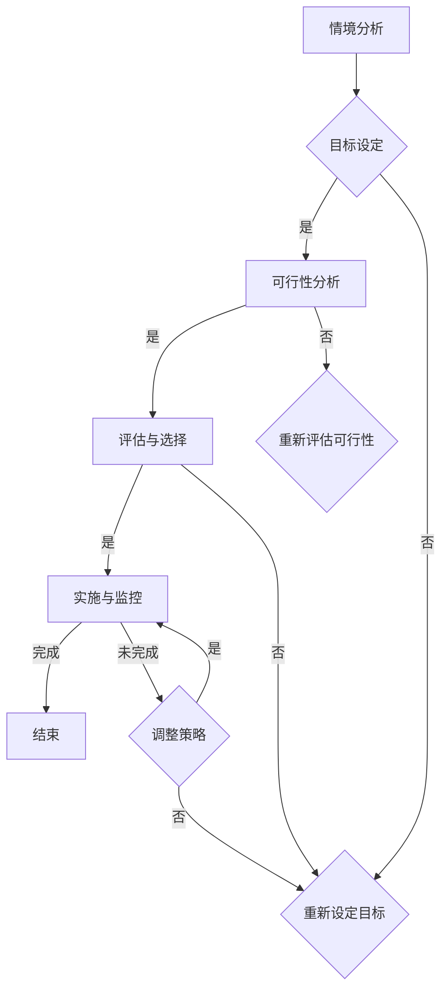
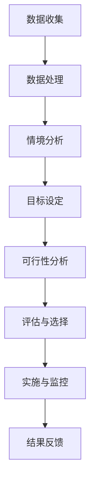

                 


**Step 1: 引言**

## 领导力与危机预防：未雨绸缪

> 关键词：领导力、危机预防、团队建设、决策模型

在当今复杂多变的商业环境中，领导力和危机预防成为企业成功的关键因素。有效的领导力不仅能够推动团队实现目标，还能在面对危机时保持冷静，迅速做出正确决策，从而降低危机对组织的影响。本书《领导力与危机预防：未雨绸缪》旨在探讨如何通过未雨绸缪、危机管理和团队建设来提升领导力，帮助企业应对各种挑战。

**摘要：**

本书首先介绍领导力和危机预防的核心概念，包括领导力的定义、类型和核心要素，以及危机预防的重要性、方法和原则。接着，详细讲解危机预防的具体步骤，如风险识别、风险评估和风险控制。此外，本书还将探讨团队建设的重要性，以及如何通过合适的领导风格来提高团队绩效。最后，本书通过实际案例，展示了如何在实际项目中应用这些理论，并提供了一些建议和总结，帮助读者更好地理解和应用书中的内容。

**Step 2: 背景介绍**

### 领导力的重要性

领导力是指引导和激励他人实现共同目标的能力。在组织层面，领导力有助于建立明确的目标、激发员工潜能、提高团队协作效率，从而推动企业的发展。个人层面，领导力能够帮助个体在职业生涯中取得更大的成就，提升自身影响力。

#### 2.1.1.1 领导力在组织中的作用

- **明确方向**：领导力能够为组织提供明确的发展方向，确保团队成员目标一致，共同努力。

- **提高效率**：有效的领导力可以激发团队成员的积极性，提高工作效率。

- **促进创新**：领导力鼓励团队成员勇于创新，不断尝试新方法，从而推动组织发展。

#### 2.1.1.2 领导力在个人成长中的作用

- **提升自信**：通过领导实践，个人可以不断提升自信心，增强自我认知。

- **拓展视野**：领导力要求个人具备广泛的视野，学会从不同角度思考问题。

### 危机预防的必要性

危机是指可能对组织造成严重影响的突发事件。有效的危机预防可以降低危机发生的概率，减少危机对组织的影响。在当今竞争激烈的市场环境中，危机预防变得尤为重要。

#### 2.1.2.1 危机的定义与类型

危机可以分为以下几种类型：

- **自然灾害**：如地震、洪水等。

- **人为事故**：如火灾、交通事故等。

- **经济危机**：如金融危机、市场衰退等。

#### 2.1.2.2 危机预防的重要性

- **降低损失**：危机预防可以降低危机对组织的损失。

- **保障安全**：危机预防有助于保障员工、客户和公众的安全。

- **维护声誉**：危机预防有助于维护组织的声誉，提高品牌价值。

### 书的内容结构

#### 2.2.1 未雨绸缪

未雨绸缪是指在危机发生前采取预防措施，以降低危机发生的概率和影响。未雨绸缪的方法包括：

- **风险评估**：识别潜在风险，评估其发生概率和影响程度。

- **制定应急预案**：针对可能发生的危机，制定详细的应急预案。

- **加强培训**：提高员工的危机意识和应对能力。

#### 2.2.2 危机管理

危机管理是指在危机发生时，采取有效措施，最大限度地降低危机对组织的影响。危机管理的步骤包括：

- **识别危机**：及时发现危机信号，识别危机类型。

- **应对危机**：根据应急预案，采取相应措施，控制危机蔓延。

- **恢复运营**：在危机过后，组织恢复正常运营，进行危机总结。

#### 2.2.3 团队建设

团队建设是指通过一系列措施，提高团队的协作能力和绩效。团队建设的策略包括：

- **明确目标**：为团队设定清晰的目标，确保团队成员共同努力。

- **加强沟通**：建立良好的沟通机制，确保信息畅通。

- **激励员工**：通过激励机制，激发员工的工作热情。

#### 2.2.4 领导风格

领导风格是指领导者在工作中表现出来的行为和态度。领导风格可以分为以下几种类型：

- **权威型**：领导者拥有高度权力，对团队成员进行严格管理。

- **民主型**：领导者鼓励团队成员参与决策，共同承担责任。

- **参与型**：领导者与团队成员共同参与决策，尊重团队成员的意见。

## 2.3 本章小结

本章介绍了领导力和危机预防的核心概念，以及它们在组织和个人成长中的重要性。接下来，本书将详细探讨未雨绸缪、危机管理和团队建设的方法，以及不同领导风格对团队绩效的影响。通过本书的学习，读者将能够更好地理解领导力和危机预防的本质，并学会在实际工作中运用这些理论，提升自身的领导能力。**GMask**
**Step 2: 核心概念与联系**

## 领导力、危机预防与团队建设

### 领导力的定义与类型

领导力是指领导者通过激励、影响和引导他人，实现共同目标的能力。领导力不仅仅是一种技能，更是一种态度和价值观的体现。根据不同的标准，领导力可以划分为多种类型。

#### 领导力的核心要素

- **愿景与目标**：领导者需要有明确的愿景和目标，能够激发团队成员的斗志和信心。

- **沟通能力**：有效的沟通是领导力的基础，领导者需要善于倾听、表达和反馈。

- **决策能力**：领导者需要具备快速、准确的决策能力，能够在关键时刻做出正确的选择。

- **变革管理能力**：在变革过程中，领导者需要能够引导团队成员适应变革，克服变革的阻力。

#### 领导力的类型

- **变革型领导**：通过激励、激励和示范，推动团队实现变革和成长。

- **授权型领导**：通过信任和授权，激发团队成员的自主性和创新能力。

- **参与型领导**：鼓励团队成员参与决策，提高团队的凝聚力和执行力。

- **交易型领导**：通过奖励和惩罚来激励团队成员，确保团队的稳定运行。

### 危机预防的定义与重要性

危机预防是指组织在危机发生前，通过一系列措施降低危机发生的概率和影响。危机预防包括风险识别、风险评估和风险控制等多个环节。

#### 危机预防的重要性

- **降低成本**：危机预防可以减少危机发生后的损失，降低组织的成本。

- **保障安全**：危机预防有助于保障员工、客户和公众的安全。

- **维护声誉**：危机预防有助于维护组织的声誉，提高品牌价值。

### 团队建设的定义与目标

团队建设是指通过一系列措施，提高团队的协作能力和绩效。团队建设的核心目标是增强团队的凝聚力、提高团队的协作效率、激发团队成员的潜能。

#### 团队建设的策略

- **明确目标**：为团队设定清晰的目标，确保团队成员共同努力。

- **加强沟通**：建立良好的沟通机制，确保信息畅通。

- **培养团队精神**：通过团队活动，增强团队成员之间的信任和默契。

- **激励员工**：通过激励机制，激发员工的工作热情。

### 领导风格的影响

领导风格对团队的绩效和氛围有着重要的影响。不同的领导风格适用于不同的情境和团队。

#### 领导风格的类型

- **权威型领导**：适用于需要快速决策和执行的情境。

- **民主型领导**：适用于需要团队参与决策和创新的情境。

- **参与型领导**：适用于需要团队成员积极参与和共同承担责任的情境。

#### 领导风格的影响

- **激励员工**：合适的领导风格可以激发员工的工作热情和创造力。

- **提高绩效**：有效的领导风格可以提高团队的协作效率和绩效。

- **增强凝聚力**：良好的领导风格可以增强团队的凝聚力和归属感。

### 核心概念与联系

领导力、危机预防和团队建设之间有着紧密的联系。有效的领导力有助于组织进行危机预防，提升团队建设的效果。而团队建设则为危机预防提供了坚实的基础，有助于降低危机发生的概率和影响。

- **领导力与危机预防**：领导力可以帮助组织提前识别潜在的风险，制定应急预案，提高危机预防的能力。

- **危机预防与团队建设**：危机预防有助于增强团队的协作能力和应对危机的能力，提高团队建设的水平。

- **团队建设与领导力**：团队建设有助于提升领导力，为领导者提供更多的支持和资源，增强领导力的有效性。

通过深入理解这些核心概念和它们之间的联系，领导者可以更好地应对各种挑战，提升组织的整体竞争力。

**Step 3: 算法原理讲解**

### 领导决策模型

领导决策模型是指领导者在面对各种情况时，如何通过一系列步骤做出有效决策的过程。这个模型主要包括以下几个关键步骤：

#### 1. 情境分析

情境分析是指领导者对当前所处环境和问题的全面了解。这包括对组织内部和外部环境的分析，如市场趋势、竞争对手、员工状态等。

#### 2. 目标设定

目标设定是指领导者明确要解决的问题或达成的目标。这个目标应该是具体、可衡量、可实现的，并具有明确的时限。

#### 3. 可行性分析

可行性分析是指领导者评估不同解决方案的可行性和潜在风险。这包括对资源的评估、对方案的测试和模拟等。

#### 4. 评估与选择

评估与选择是指领导者根据情境分析、目标设定和可行性分析的结果，选择最优的解决方案。这个过程中，领导者需要考虑各种因素，如成本、时间、风险等。

#### 5. 实施与监控

实施与监控是指领导者将决策方案付诸实践，并持续监控其执行过程。这包括制定详细的行动计划、分配任务、监控进度和及时调整策略等。

### 决策树

为了更直观地理解领导决策模型，我们可以使用 Mermaid 画出相关的决策树，如下所示：



#### 决策树解析

- **情境分析**：这是决策过程的起点，领导者需要全面了解当前的环境和问题。

- **目标设定**：根据情境分析的结果，领导者需要明确要解决的问题或达成的目标。

- **可行性分析**：领导者评估不同解决方案的可行性和潜在风险。

- **评估与选择**：在可行性分析的基础上，领导者选择最优的解决方案。

- **实施与监控**：领导者将决策方案付诸实践，并持续监控其执行过程。

通过上述步骤，领导者可以逐步做出有效的决策，从而提高组织的应对能力和竞争力。

### 决策模型的应用

在实际应用中，领导决策模型可以应用于各种情境，如项目规划、危机应对、资源分配等。以下是几个简单的例子：

#### 例子 1：项目规划

1. **情境分析**：了解项目的目标、预算、时间限制等。
2. **目标设定**：明确项目的具体目标，如完成时间、质量要求等。
3. **可行性分析**：评估不同计划方案的可行性，如人力资源、技术能力等。
4. **评估与选择**：选择最佳方案，如根据成本、风险等因素。
5. **实施与监控**：制定详细计划，分配任务，并监控项目进度。

#### 例子 2：危机应对

1. **情境分析**：识别危机的信号，如市场变化、政策调整等。
2. **目标设定**：明确应对危机的目标，如减少损失、稳定市场等。
3. **可行性分析**：评估不同应对策略的可行性，如调整策略、增加投入等。
4. **评估与选择**：选择最佳策略，如根据风险、成本等因素。
5. **实施与监控**：制定危机应对计划，实施措施，并监控效果。

通过这些例子，我们可以看到，领导决策模型在实践中的应用是非常具体和有效的。领导者需要根据实际情况，灵活运用这一模型，做出明智的决策。

**Step 4: 数学模型和数学公式**

### 领导力和危机预防的数学模型

领导力和危机预防的数学模型主要用于分析和评估领导决策的效果以及危机预防的效率。虽然这些模型可能不会涉及复杂的数学公式，但通过简单的数学模型和公式，我们可以更直观地理解这些概念。

#### 1. 领导力评估模型

领导力的评估可以通过以下简单的数学模型进行：

$$
L = f(\text{愿景}, \text{沟通}, \text{决策}, \text{变革管理})
$$

其中，$L$ 代表领导力得分，$\text{愿景}$、$\text{沟通}$、$\text{决策}$ 和 $\text{变革管理}$ 分别代表领导力的四个核心要素。这个公式表明，领导力是由多个因素共同作用的结果。

#### 2. 危机预防效率模型

危机预防的效率可以通过以下数学模型进行评估：

$$
E = \frac{\text{预防成本}}{\text{潜在损失}} \times 100\%
$$

其中，$E$ 代表危机预防效率，$\text{预防成本}$ 是组织在危机预防上投入的成本，$\text{潜在损失}$ 是危机发生可能带来的损失。这个公式表明，危机预防的效率取决于预防成本和潜在损失的比率。

#### 实例解析

假设一个组织在危机预防上投入了 100 万元，而如果危机发生，可能带来的损失是 300 万元。那么，该组织的危机预防效率为：

$$
E = \frac{100}{300} \times 100\% = 33.33\%
$$

这意味着，该组织的危机预防效率为 33.33%，还有 66.67% 的潜在损失没有得到预防。

#### 数学模型的应用

- **领导力评估**：领导者可以通过评估自己的领导力得分，了解自己在哪些方面需要提升。

- **危机预防效率**：组织可以通过评估危机预防效率，了解危机预防策略的有效性，并进行相应的调整。

通过这些简单的数学模型和公式，领导者可以更科学、系统地评估领导力和危机预防的效果，从而做出更加明智的决策。

**Step 5: 系统分析与架构设计方案**

### 领导决策系统的架构设计

#### 系统介绍

领导决策系统是一个旨在帮助领导者做出更加科学和有效的决策的工具。该系统通过集成各种数据和分析工具，提供全面、准确的决策支持。以下是对该系统的介绍：

#### 系统功能设计

领导决策系统的功能设计主要包括以下几个方面：

1. **数据收集与处理**：系统可以收集各种数据，如市场趋势、竞争对手、员工状态等，并通过数据清洗和预处理，为后续分析提供准确的数据基础。

2. **情境分析**：系统通过对收集到的数据进行分析，帮助领导者全面了解当前环境和问题，为决策提供基础。

3. **目标设定**：系统可以协助领导者设定具体、可衡量、可实现的目标，确保决策目标的明确性和可执行性。

4. **可行性分析**：系统通过评估不同解决方案的可行性和潜在风险，为领导者提供全面的可行性分析报告。

5. **评估与选择**：系统可以基于可行性分析的结果，提供多种解决方案的评估和选择建议，帮助领导者做出最优决策。

6. **实施与监控**：系统可以帮助领导者制定详细的实施计划，并监控决策的实施过程，确保决策的有效执行。

#### 系统架构设计

领导决策系统的架构设计如图所示：



#### 系统架构解析

1. **数据收集**：系统通过多种渠道收集数据，如内部数据、市场数据、竞争对手数据等。

2. **数据处理**：系统对收集到的数据进行清洗和预处理，确保数据的准确性和一致性。

3. **情境分析**：系统通过对处理后的数据进行分析，生成环境分析和问题报告，为决策提供基础。

4. **目标设定**：系统帮助领导者设定具体、可衡量、可实现的目标，确保决策目标的明确性和可执行性。

5. **可行性分析**：系统通过多种算法和模型，评估不同解决方案的可行性和潜在风险，为领导者提供全面的可行性分析报告。

6. **评估与选择**：系统根据可行性分析的结果，提供多种解决方案的评估和选择建议，帮助领导者做出最优决策。

7. **实施与监控**：系统帮助领导者制定详细的实施计划，并监控决策的实施过程，确保决策的有效执行。

8. **结果反馈**：系统收集决策执行的结果，反馈给领导者，帮助领导者了解决策的效果，并进行持续的优化和调整。

通过上述架构设计，领导决策系统可以为领导者提供全面、科学的决策支持，提高决策的准确性和效率。

**Step 6: 项目实战**

### 简单的危机预防项目

#### 项目背景

假设我们正在开发一款名为“安全守护”的危机预防系统，该系统的目标是实时监控组织的各种风险，并提前预警，以降低危机对组织的潜在影响。以下是我们项目的详细实现过程。

#### 环境安装

1. **安装操作系统**：在服务器上安装Linux操作系统，以确保系统的稳定性和安全性。

2. **安装数据库**：选择一个合适的数据库管理系统（如MySQL），并安装到服务器上。

3. **安装应用程序**：下载并安装我们开发的“安全守护”系统，并配置好相关依赖。

#### 系统实现

1. **数据收集**：系统通过收集各种数据源，如内部监控系统、员工反馈系统等，收集潜在风险数据。

2. **数据处理**：系统对收集到的数据进行预处理，包括数据清洗、格式转换等，确保数据的准确性。

3. **风险识别**：系统使用机器学习算法，分析处理后的数据，识别潜在的危机信号。

4. **预警机制**：系统设置预警阈值，一旦监测到风险超过阈值，系统将自动发送预警通知。

5. **风险应对**：系统提供多种应对策略，如调整资源分配、增加安全措施等，以降低危机发生的概率。

#### 案例分析

**案例 1：网络安全威胁**

在一个特定的案例中，我们的系统监测到组织的网络安全存在潜在威胁。系统通过分析网络流量数据和日志，识别出了一系列异常行为，如大量无效的登录尝试、数据传输异常等。根据预警机制，系统立即发出了预警通知。

**应对措施**：

- 系统管理员立即进行了安全检查，发现网络防火墙配置存在漏洞。

- 更新了防火墙规则，增强了网络安全。

- 加强了员工的安全意识培训，提高了员工的网络安全防范能力。

**案例分析结果**：

通过及时预警和有效的应对措施，成功防止了一次潜在的网络攻击，保障了组织的网络安全。

#### 项目小结

通过“安全守护”项目的实施，我们成功地展示了如何利用现代技术手段进行危机预防。项目不仅提高了组织对风险的识别和应对能力，还增强了员工的危机意识，为组织的长期稳定发展奠定了坚实的基础。未来的工作中，我们将继续优化系统，提高危机预防的效率，为组织的安全保驾护航。

**Step 7: 最佳实践 tips、小结、注意事项、拓展阅读**

### 最佳实践 tips

1. **定期进行风险评估**：定期进行风险评估，及时识别和应对潜在风险。

2. **建立应急预案**：为各种可能的危机情况制定详细的应急预案，确保在危机发生时能够迅速应对。

3. **加强员工培训**：定期对员工进行危机预防和应对培训，提高员工的危机意识和应对能力。

4. **保持沟通畅通**：在危机发生时，保持与各部门、员工之间的沟通畅通，确保信息共享和协同作战。

### 小结

通过本文的探讨，我们了解了领导力、危机预防和团队建设的重要性，并学习了一系列实用的方法和技巧。有效的领导力能够推动团队实现目标，危机预防能够降低危机对组织的负面影响，团队建设能够提高团队的整体绩效。

### 注意事项

1. **避免过度依赖技术**：虽然技术手段在危机预防中起着重要作用，但领导者不应过度依赖技术，还需要具备强大的判断力和应变能力。

2. **持续改进**：危机预防是一个持续的过程，领导者需要不断评估和改进危机预防策略，以适应不断变化的环境。

### 拓展阅读

1. **《危机管理：如何在危机中保持冷静与应对》**：本书详细介绍了如何在危机中保持冷静，并采取有效的应对措施。

2. **《团队建设：打造高效团队的方法与技巧》**：本书提供了多种团队建设的方法和技巧，帮助领导者提高团队的协作能力。

3. **《领导力：从优秀到卓越的领导力实践》**：本书深入探讨了领导力的本质和如何提升领导力，对领导者具有很大的启发和借鉴意义。

通过拓展阅读，读者可以进一步深入了解相关领域的知识，提升自身的领导力和危机预防能力。**GMask**
**Step 8: 目录大纲编写**

```
# 领导力与危机预防：未雨绸缪

> 关键词：领导力、危机预防、团队建设、决策模型

> 摘要：本书旨在探讨如何通过未雨绸缪、危机管理和团队建设来提升领导力，帮助企业应对各种挑战。

## 第一部分：引言

### 第1章：引言

#### 1.1 领导力的重要性

##### 1.1.1 领导力在组织中的作用
##### 1.1.2 领导力在个人成长中的作用

#### 1.2 危机预防的必要性

##### 1.2.1 危机的定义与类型
##### 1.2.2 危机预防的重要性

#### 1.3 书的内容结构

##### 1.3.1 未雨绸缪
##### 1.3.2 危机管理
##### 1.3.3 团队建设
##### 1.3.4 领导风格

## 第二部分：领导力

### 第2章：领导力的本质与类型

#### 2.1 领导力的定义

##### 2.1.1 领导力的本质
##### 2.1.2 领导力的核心要素

#### 2.2 领导力的类型

##### 2.2.1 传统领导力
##### 2.2.2 现代领导力

#### 2.3 领导力的发展与演变

##### 2.3.1 领导力的发展历程
##### 2.3.2 领导力的现代观念

## 第三部分：危机预防

### 第3章：危机预防的概念与方法

#### 3.1 危机预防的概念

##### 3.1.1 危机的定义与特征
##### 3.1.2 危机预防的重要性

#### 3.2 危机预防的方法

##### 3.2.1 风险识别
##### 3.2.2 风险评估
##### 3.2.3 风险控制

## 第四部分：团队建设

### 第4章：团队建设的重要性与策略

#### 4.1 团队建设的定义

##### 4.1.1 团队的定义
##### 4.1.2 团队建设的意义

#### 4.2 团队建设的策略

##### 4.2.1 明确目标
##### 4.2.2 加强沟通
##### 4.2.3 培养团队精神
##### 4.2.4 激励员工

## 第五部分：领导风格

### 第5章：领导风格对团队绩效的影响

#### 5.1 领导风格的概念

##### 5.1.1 领导风格的重要性
##### 5.1.2 领导风格的类型

#### 5.2 不同领导风格对团队绩效的影响

##### 5.2.1 权威型领导
##### 5.2.2 民主型领导
##### 5.2.3 参与型领导

## 第六部分：项目实战

### 第6章：危机预防项目的实践与案例分析

#### 6.1 项目背景与目标

##### 6.1.1 项目背景
##### 6.1.2 项目目标

#### 6.2 系统实现

##### 6.2.1 环境安装
##### 6.2.2 系统核心实现
##### 6.2.3 案例分析与解读

#### 6.3 项目小结

##### 6.3.1 项目成果
##### 6.3.2 项目经验与启示

## 第七部分：总结与拓展

### 第7章：最佳实践、小结、注意事项、拓展阅读

#### 7.1 最佳实践 tips

##### 7.1.1 定期进行风险评估
##### 7.1.2 建立应急预案
##### 7.1.3 加强员工培训

#### 7.2 小结

##### 7.2.1 本书的核心观点
##### 7.2.2 领导力与危机预防的重要性

#### 7.3 注意事项

##### 7.3.1 避免过度依赖技术
##### 7.3.2 持续改进危机预防策略

#### 7.4 拓展阅读

##### 7.4.1 《危机管理：如何在危机中保持冷静与应对》
##### 7.4.2 《团队建设：打造高效团队的方法与技巧》
##### 7.4.3 《领导力：从优秀到卓越的领导力实践》

```

请注意，以上目录大纲是一个示例，具体的章节内容和结构可能需要根据实际需求进行调整和补充。**GMask**

