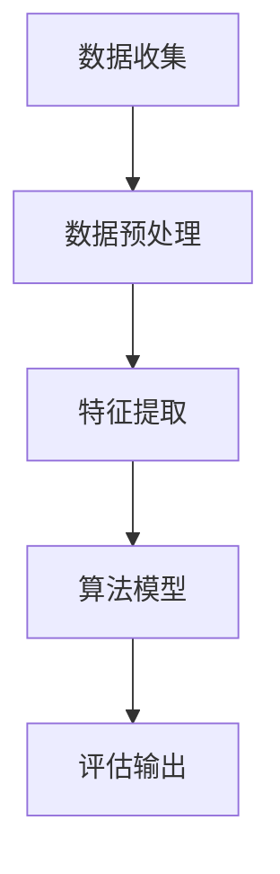

                 


### 第1章: 背景介绍

#### 1.1.1 问题背景

领导力与压力应对是职场中至关重要的两个主题。随着工作环境的变化和竞争的加剧，领导者面临着越来越多的挑战，如管理复杂团队、处理突发事件、应对工作与生活的平衡等问题。同时，工作压力也对员工的身心健康产生了深远的影响，长期的压力可能导致工作效率下降、情绪问题甚至身体健康问题。

在现代职场中，领导力不仅仅是管理员工的能力，更是影响团队效率和创造力的关键因素。领导者的决策、沟通、团队建设等方面的能力直接影响组织的整体表现。而压力应对问题则更为普遍和复杂，员工在高压环境下容易产生焦虑、疲劳等问题，进而影响工作质量和生活质量。

因此，研究领导力与压力应对的关系，寻找有效的解决方案，对于提升个人和团队的绩效，实现工作与生活的平衡具有重要意义。

#### 1.1.2 问题描述

- **领导力挑战**：现代领导者需要具备多样化的技能，包括战略规划、团队管理、沟通协调、创新能力等。然而，很多领导者在这些方面可能存在不足，导致团队绩效不佳或个人职业生涯发展受限。
  - **战略规划**：领导者需要具备清晰的战略视野和规划能力，但在实际操作中，可能缺乏对市场趋势、竞争对手的深入分析，导致战略定位不准确。
  - **团队管理**：领导者需要能够有效激励和管理团队成员，但在实际操作中，可能面临团队成员个性差异、沟通不畅等问题，影响团队凝聚力。
  - **沟通协调**：领导者需要具备良好的沟通技巧，但在实际操作中，可能因为信息不对称、沟通渠道不畅等原因，导致沟通效果不佳。
  - **创新能力**：领导者需要具备创新思维和创新能力，但在实际操作中，可能因为传统思维模式、资源限制等原因，难以推动创新。

- **压力应对问题**：工作压力是职场中普遍存在的问题。过度的压力可能导致员工情绪低落、工作效率下降，甚至引发健康问题。有效的压力管理对于维持工作平衡、提高工作效率至关重要。
  - **情绪低落**：长期的压力可能导致员工出现情绪低落、焦虑等问题，影响工作积极性和创造力。
  - **工作效率下降**：压力过大可能导致员工无法集中精力，工作效率下降，影响项目进度和质量。
  - **健康问题**：长期的工作压力可能导致身体健康问题，如失眠、抑郁、心脏病等，严重影响员工的身心健康。

#### 1.1.3 问题解决

本书旨在帮助读者了解领导力的核心概念和应对压力的有效方法，从而在职场中更好地发挥领导作用，同时保持身心健康和工作生活的平衡。

- **领导力解决方法**：本书将介绍领导力的关键要素，如自我认知、影响力、决策能力、团队建设等，并通过案例分析和实践技巧帮助读者提升领导力水平。
  - **自我认知**：领导者需要了解自己的优势和不足，明确个人价值观和目标，从而更好地规划个人职业生涯。
  - **影响力**：领导者需要通过自身的价值观、愿景和行为来影响他人，提升团队凝聚力和执行力。
  - **决策能力**：领导者需要具备在不确定性和压力下做出明智决策的能力，从而推动组织向前发展。
  - **团队建设**：领导者需要关注团队成员的成长和发展，建立和谐的团队关系，提升团队绩效。

- **压力管理方法**：本书将探讨压力的来源和影响，提供有效的压力管理策略，如时间管理、情绪调节、健康生活方式等，帮助读者应对职场压力。
  - **时间管理**：通过合理安排时间和任务，提高工作效率，减少不必要的压力来源。
  - **情绪调节**：通过认知行为疗法、冥想等方法，帮助员工调节情绪，缓解压力。
  - **健康生活方式**：通过健康饮食、适量运动、良好作息等，提升身体健康，增强抗压能力。

#### 1.1.4 边界与外延

- **领导力的边界**：领导力不仅限于企业或组织内部，还涉及社会、政治等领域的领导力。
  - **企业内部**：领导力主要体现在团队管理、项目推进、战略规划等方面。
  - **社会领域**：领导力体现在社区服务、社会公益等方面，如社区领袖、慈善家等。
  - **政治领域**：领导力体现在政治领导、政策制定等方面，如国家领导人、政治家等。

- **压力应对的外延**：压力应对不仅关乎个人健康，还影响到家庭生活、社会关系等方面。
  - **家庭生活**：压力应对不良可能导致家庭关系紧张、婚姻问题等。
  - **社会关系**：压力应对不良可能导致社交障碍、人际关系紧张等。

#### 1.1.5 概念结构与核心要素组成

- **领导力**：领导力是一个复杂的概念，其核心要素包括自我认知、影响力、决策能力、团队建设等。
  - **自我认知**：了解自己的优势和不足，明确个人目标和价值观。
  - **影响力**：通过价值观、行为和沟通影响他人，提升团队凝聚力和执行力。
  - **决策能力**：在不确定性和压力下做出明智的决策，推动组织发展。
  - **团队建设**：关注团队成员的成长和发展，建立和谐的团队关系。

- **压力应对**：压力应对是一个涉及多个方面的过程，核心要素包括时间管理、情绪调节、健康生活方式等。
  - **时间管理**：合理安排时间和任务，提高工作效率，减少压力。
  - **情绪调节**：通过认知行为疗法、冥想等方法，调节情绪，缓解压力。
  - **健康生活方式**：健康饮食、适量运动、良好作息等，提升身体健康，增强抗压能力。

通过以上分析，我们可以看到领导力与压力应对在职场中的重要性，以及如何通过有效的领导力提升和压力管理来维持工作平衡。接下来，我们将进一步探讨领导力的核心概念及其与相关概念的联系。

### 第2章: 领导力的核心概念与联系

#### 2.1.1 领导力的定义

领导力是指一个人在组织中通过影响力、决策和行动来引导和激励他人，实现共同目标的能力。领导力不仅仅是一种技能，更是一种态度和行为方式。它涉及到多个方面的能力，包括人际沟通、战略规划、团队管理、变革推动等。

#### 2.1.2 领导力的核心特征

领导力的核心特征包括以下几个方面：

- **影响力**：领导者通过自身的价值观、行为和沟通来影响他人。这种影响力不仅体现在团队内部，也体现在组织外部。领导者的影响力的强弱直接关系到团队的凝聚力和执行力。
- **决策能力**：领导者在面对复杂问题和不确定性时，能够做出明智的决策。这种决策能力不仅体现在战略层面，也体现在日常管理中。决策能力的强弱直接关系到组织的生存和发展。
- **团队建设**：领导者需要关注团队成员的成长和发展，建立和谐的团队关系。团队建设包括团队沟通、团队激励、团队协作等方面。一个优秀的领导者能够将团队成员凝聚在一起，共同实现团队目标。
- **变革管理**：领导者在组织变革过程中起到关键作用。他们需要推动组织变革，适应外部环境的变化。变革管理能力包括变革规划、变革实施、变革评估等方面。一个优秀的领导者能够在变革中保持组织的稳定和持续发展。

#### 2.1.3 领导力与相关概念的联系

- **领导力与管理**：领导力和管理密切相关，但两者有着不同的侧重点。管理侧重于组织的日常运营和流程控制，而领导力侧重于组织的战略规划和未来发展。一个优秀的领导者不仅需要具备管理能力，还需要具备领导力。
- **领导力与心理学**：领导力研究涉及到心理学、社会学等多个领域。心理学提供了关于人类行为和动机的理论基础，社会学提供了关于组织和社会结构的分析框架。领导力研究需要综合运用心理学和社会学的理论和方法。

#### 2.1.4 领导力的核心概念属性特征对比表格

| 特征名称 | 特征描述 | 对比分析 |
| -------- | -------- | -------- |
| 影响力 | 领导者通过价值观、行为和沟通影响他人 | 与管理相比，领导力更侧重于影响他人的态度和行为，而管理更侧重于流程和制度的执行。 |
| 决策能力 | 领导者在面对复杂问题和不确定性时做出明智的决策 | 与专业知识相比，决策能力更侧重于在面对不确定性时的判断和选择能力。 |
| 团队建设 | 领导者关注团队成员的成长和发展，建立和谐的团队关系 | 与员工关系管理相比，团队建设更侧重于团队的协作和整体绩效。 |
| 变革管理 | 领导者在组织变革过程中推动组织适应外部环境的变化 | 与组织发展相比，变革管理更侧重于应对外部环境的变化和挑战。 |

#### 2.1.5 领导力的ER实体关系图架构

```mermaid
erDiagram
    User ||--|{ Leader } : leads
    Leader ||--|{ Team } : manages
    Team ||--|{ Project } : works_on
```

在上述ER实体关系图中，User代表组织中的普通员工，Leader代表领导者，Team代表团队，Project代表项目。图中的关系表示，领导者领导团队，团队参与项目，而项目是由团队工作的成果。

通过上述分析，我们可以看到领导力的核心概念及其与相关概念的联系。在下一章中，我们将进一步探讨领导力的算法原理，帮助读者深入理解领导力的本质。

### 第3章: 领导力的算法原理讲解

#### 3.1.1 领导力算法概述

领导力算法是一种基于心理学和行为科学的数学模型，用于分析和评估领导者的能力。该算法通过收集和分析领导者的行为数据，如沟通频率、决策风格、团队反馈等，来评估领导者的领导力水平。领导力算法的核心目标是通过量化分析，为领导者提供针对性的改进建议，帮助其提升领导力。

#### 3.1.2 领导力算法的mermaid流程图



在上述mermaid流程图中，A表示数据收集，B表示数据预处理，C表示特征提取，D表示算法模型，E表示评估输出。整个流程包括数据收集、数据预处理、特征提取、算法模型和评估输出五个步骤。

- **数据收集**：领导力算法需要收集领导者的行为数据，如沟通记录、决策记录、团队反馈等。这些数据可以来自各种渠道，如员工调查、绩效评估、行为分析工具等。
- **数据预处理**：收集到的数据需要进行预处理，包括数据清洗、缺失值处理、异常值检测等。预处理步骤的目的是提高数据的质量，为后续的特征提取和模型训练提供准确的数据基础。
- **特征提取**：在数据预处理之后，需要对数据进行特征提取。特征提取的目的是将原始数据转换成算法模型可以处理的特征向量。常见的特征提取方法包括词频分析、情感分析、聚类分析等。
- **算法模型**：领导力算法的核心是算法模型。算法模型通过对特征向量进行训练和预测，评估领导者的领导力水平。常见的算法模型包括线性回归、决策树、支持向量机等。
- **评估输出**：评估输出是领导力算法的最后一步。评估输出包括领导力得分、改进建议等。领导力得分可以直观地反映领导者的领导力水平，改进建议则为领导者提供了具体的改进方向。

#### 3.1.3 领导力算法的Python源代码示例

```python
# 导入所需库
import pandas as pd
import numpy as np
from sklearn.model_selection import train_test_split
from sklearn.preprocessing import StandardScaler
from sklearn.ensemble import RandomForestClassifier
from sklearn.metrics import accuracy_score

# 加载数据集
data = pd.read_csv('leadership_data.csv')

# 数据预处理
# 数据清洗、缺失值处理、异常值检测等

# 特征提取
# 转换为特征向量

# 划分训练集和测试集
X_train, X_test, y_train, y_test = train_test_split(X, y, test_size=0.2, random_state=42)

# 数据标准化
scaler = StandardScaler()
X_train = scaler.fit_transform(X_train)
X_test = scaler.transform(X_test)

# 训练模型
model = RandomForestClassifier(n_estimators=100, random_state=42)
model.fit(X_train, y_train)

# 预测
y_pred = model.predict(X_test)

# 评估
accuracy = accuracy_score(y_test, y_pred)
print(f'Accuracy: {accuracy:.2f}')
```

在上面的Python源代码示例中，首先加载数据集，然后进行数据预处理、特征提取。接着，将数据集划分为训练集和测试集，并进行数据标准化。然后使用随机森林算法训练模型，并对测试集进行预测。最后，评估模型的准确率。

#### 3.1.4 领导力算法原理的数学模型和公式

领导力算法的数学模型可以表示为：

$$
L = f(X)
$$

其中，$L$表示领导力得分，$X$表示特征向量，$f$表示算法模型。

特征向量$X$可以表示为：

$$
X = [x_1, x_2, ..., x_n]
$$

其中，$x_i$表示第$i$个特征值。

算法模型$f$可以表示为：

$$
f(X) = \sum_{i=1}^{n} w_i x_i + b
$$

其中，$w_i$表示第$i$个特征的权重，$b$表示偏置。

通过上述公式，算法模型可以计算出一个数值，该数值表示领导力得分$L$。得分越高，表示领导力水平越高。

#### 3.1.5 算法原理的举例说明

假设我们有一个领导力算法模型，其中包含两个特征：沟通频率$x_1$和决策风格$x_2$。特征向量$X$可以表示为$X = [x_1, x_2]$。假设特征权重分别为$w_1 = 0.6$和$w_2 = 0.4$，偏置$b = 0.1$。

对于一个特定的领导者，假设沟通频率$x_1 = 10$，决策风格$x_2 = 8$。我们可以通过以下公式计算领导力得分$L$：

$$
L = 0.6 \times 10 + 0.4 \times 8 + 0.1 = 7.1
$$

通过这个例子，我们可以看到，领导力得分是由特征值和特征权重计算得到的。特征值和特征权重可以通过数据分析和模型训练得到。

通过上述分析，我们可以深入理解领导力算法的原理，包括数据收集、数据预处理、特征提取、算法模型和评估输出等步骤。在下一章中，我们将进一步探讨领导力的实际应用和案例分析。

### 第4章: 实际应用与案例分析

#### 4.1.1 案例背景

在一家快速发展的科技公司，张伟（化名）担任首席执行官。公司正处于一个高速成长的阶段，面临着市场拓展、产品迭代、团队建设等多方面的挑战。作为领导者，张伟需要具备出色的领导力来应对这些挑战，同时保持公司的稳定和持续发展。

#### 4.1.2 领导力应用场景

1. **团队建设**：
   - **问题**：公司团队规模逐渐扩大，但团队间协作不畅，成员间缺乏有效的沟通。
   - **领导力应用**：张伟通过组织定期的团队会议，鼓励团队成员分享意见和想法，增强团队的凝聚力。同时，他通过团队建设活动，如团建旅行、团队拓展训练等，提升团队协作能力。

2. **战略规划**：
   - **问题**：公司在市场拓展过程中，面临竞争对手的强大压力，市场定位不准确。
   - **领导力应用**：张伟带领团队进行市场调研，分析竞争对手的优劣势，重新制定公司的市场战略。他通过明确公司的愿景和目标，引导团队朝着共同的目标努力。

3. **决策能力**：
   - **问题**：公司在产品迭代过程中，面临技术瓶颈和市场反馈的矛盾，决策犹豫不决。
   - **领导力应用**：张伟通过召开决策会议，收集团队成员的意见和建议，权衡各种方案的利弊。他最终决定采取一种创新的解决方案，克服了技术瓶颈，满足了市场需求。

4. **变革管理**：
   - **问题**：公司需要进行组织结构调整，以适应市场变化和公司发展需求。
   - **领导力应用**：张伟亲自主持变革管理工作，制定详细的变革计划，明确变革的目标和步骤。他通过沟通和激励，赢得了员工的信任和支持，确保变革顺利实施。

#### 4.1.3 案例分析

通过上述案例，我们可以看到张伟在团队建设、战略规划、决策能力和变革管理等方面的领导力应用。

1. **团队建设**：
   - **效果**：通过定期的团队会议和团建活动，公司的团队协作能力得到了显著提升，团队成员间的沟通更加顺畅。
   - **挑战**：团队成员的个人需求差异较大，如何平衡团队协作和个体发展成为新的挑战。

2. **战略规划**：
   - **效果**：通过重新制定市场战略，公司成功拓展了市场，市场份额得到了显著提升。
   - **挑战**：市场环境变化迅速，如何及时调整战略以应对新的挑战成为关键。

3. **决策能力**：
   - **效果**：通过科学的决策过程，公司克服了技术瓶颈，成功推出了具有市场竞争力的新产品。
   - **挑战**：在决策过程中，如何权衡各种因素，确保决策的准确性和有效性。

4. **变革管理**：
   - **效果**：通过有效的变革管理，公司顺利完成了组织结构调整，提升了组织的灵活性和应变能力。
   - **挑战**：在变革过程中，如何确保员工的理解和接受，避免变革带来的负面影响。

通过以上案例分析，我们可以看到领导力在实际应用中的重要性。一个优秀的领导者能够在团队建设、战略规划、决策能力和变革管理等方面发挥关键作用，推动组织实现持续发展。

### 第5章: 领导力的最佳实践

#### 5.1.1 领导力的核心原则

领导力的最佳实践建立在几个核心原则之上：

- **以身作则**：领导者应通过自身的行为和态度来树立榜样，影响团队成员。
- **有效沟通**：领导者应具备良好的沟通技巧，确保信息传递准确无误，增强团队凝聚力。
- **授权赋能**：领导者应给予团队成员足够的自主权，激发他们的潜能和创造力。
- **持续学习**：领导者应不断学习新知识、新技能，以适应不断变化的环境和挑战。
- **情绪管理**：领导者应学会管理自己的情绪，保持冷静和客观，以应对各种压力和挑战。

#### 5.1.2 领导力的最佳实践策略

1. **建立明确的目标和愿景**：
   - 领导者应明确公司的目标和愿景，并传递给团队成员。这有助于统一团队的方向和努力，增强团队的凝聚力。

2. **培养团队成员的技能和能力**：
   - 领导者应关注团队成员的技能和能力发展，提供培训和学习机会，提升团队的整体素质。

3. **建立积极的团队文化**：
   - 领导者应通过正面的激励和奖励机制，营造一个积极向上的团队氛围，增强团队成员的归属感和工作满意度。

4. **有效利用团队会议**：
   - 领导者应定期组织团队会议，鼓励团队成员参与讨论，分享意见和建议，增强团队协作。

5. **鼓励创新和尝试**：
   - 领导者应鼓励团队成员创新和尝试新方法，创造一个开放和包容的工作环境，激发团队的创造力。

6. **关注团队成员的个人发展**：
   - 领导者应关注团队成员的个人成长，提供职业发展建议和机会，帮助他们实现个人目标和职业梦想。

7. **建立有效的反馈机制**：
   - 领导者应建立有效的反馈机制，及时收集团队成员的反馈，了解团队的工作情况和需求，持续改进工作方式。

通过以上最佳实践策略，领导者可以提升团队的绩效和士气，实现工作与生活的平衡。

### 第6章: 压力管理的核心概念

#### 6.1.1 压力的定义

压力，也称为压力源，是指任何对个体产生心理或生理影响的刺激或情境。压力可以是正面的，如迎接新的挑战或获得成就感；也可以是负面的，如工作压力、人际关系冲突或生活事件。在职场中，压力通常来源于工作负荷、时间限制、工作不安全感、人际冲突等多方面。

#### 6.1.2 压力的类型

- **工作压力**：由于工作需求、工作负荷、工作环境等因素引起的压力。例如，长时间的工作时间、高强度的工作任务、不明确的工作期望等。
- **情感压力**：由于人际关系、家庭问题、情感问题等引起的压力。例如，与同事或家人的争吵、子女的教育问题、婚姻问题等。
- **生活事件压力**：由于生活中的突发事件或变化引起的压力。例如，失业、疾病、财务危机、亲人去世等。

#### 6.1.3 压力的来源

- **工作环境**：不明确的工作期望、工作压力过大、工作与生活平衡不足、缺乏职业发展机会等。
- **个人因素**：个性特征、健康问题、家庭责任、财务状况等。
- **社会因素**：社会变迁、文化差异、社会压力等。

#### 6.1.4 压力的影响

压力对个人的身心健康产生深远的影响，包括以下几个方面：

- **心理健康**：长期的压力可能导致情绪问题，如焦虑、抑郁、愤怒等。严重的压力还可能引发精神疾病，如抑郁症、焦虑症等。
- **身体健康**：压力可能导致身体疾病，如心血管疾病、消化系统疾病、免疫系统问题等。长期的压力还可能导致身体疲劳、失眠、头痛等症状。
- **工作效率**：压力过大可能导致工作效率下降，注意力不集中，决策能力减弱等。
- **生活质量**：压力影响个人的生活质量，可能导致家庭关系紧张、社交活动减少、娱乐活动减少等。

#### 6.1.5 压力管理的必要性

压力管理对于维持个人的身心健康、提高工作效率、提升生活质量具有重要意义。有效的压力管理策略可以帮助个人：

- **缓解心理压力**：通过认知行为疗法、冥想、放松训练等方法，缓解焦虑、抑郁等负面情绪。
- **提升身体健康**：通过健康饮食、适量运动、良好作息等，增强身体健康，提高抗压能力。
- **提高工作效率**：通过时间管理、任务优先级排序等策略，提高工作效率，减少不必要的压力来源。
- **提升生活质量**：通过放松身心、参与社交活动、培养兴趣爱好等，提升生活质量，实现工作与生活的平衡。

通过以上分析，我们可以看到压力管理的核心概念及其重要性。在下一章中，我们将进一步探讨压力管理的具体策略和技巧。

### 第7章: 压力管理的具体策略与技巧

#### 7.1.1 时间管理

时间管理是压力管理的重要策略之一。通过合理安排时间，提高工作效率，可以显著减少工作压力。

1. **设定优先级**：
   - 使用任务优先级排序方法，如“重要-紧急矩阵”，将任务分为四个象限，优先处理重要且紧急的任务。
   - 定期回顾任务清单，确保重要任务得到及时处理。

2. **制定计划**：
   - 制定详细的工作计划，明确每天、每周、每月的任务和目标。
   - 使用日程表或日历应用程序，规划每天的时间安排，避免时间浪费。

3. **避免拖延**：
   - 使用番茄工作法（Pomodoro Technique）等时间管理技巧，将工作分成短期任务，提高专注力和工作效率。
   - 设定明确的时间限制，避免过度拖延。

#### 7.1.2 情绪调节

情绪调节是缓解压力的关键技巧。以下方法可以帮助个人控制情绪，减少压力的影响：

1. **认知行为疗法**：
   - 学习认知行为疗法（CBT）的基本原理，如识别和挑战负面思维模式，建立积极的替代思维。
   - 通过自我反思和日记记录，了解自己的情绪触发点，制定应对策略。

2. **冥想和放松训练**：
   - 定期进行冥想和放松训练，如深呼吸、渐进性肌肉放松等，缓解紧张情绪。
   - 通过冥想应用程序或在线资源，学习冥想和放松技巧。

3. **情绪表达**：
   - 学会健康地表达情绪，如通过谈话、写作、绘画等方式，释放内心的压力。
   - 与信任的朋友、家人或心理咨询师交流，寻求支持和建议。

#### 7.1.3 健康生活方式

健康的生活方式有助于提高个人的抗压能力和整体生活质量。以下是一些健康生活方式的建议：

1. **健康饮食**：
   - 均衡饮食，摄入足够的蛋白质、碳水化合物、脂肪、维生素和矿物质。
   - 减少糖分和加工食品的摄入，增加新鲜水果和蔬菜的摄入。

2. **适量运动**：
   - 每周至少进行150分钟的中等强度运动，如快走、游泳、骑自行车等。
   - 定期参加瑜伽、太极等放松性运动，提高身体的柔韧性和平衡能力。

3. **良好作息**：
   - 保持规律的作息时间，确保每天有足够的睡眠。
   - 避免熬夜和过度劳累，给自己留出休息和放松的时间。

4. **培养兴趣爱好**：
   - 参与自己感兴趣的活动，如阅读、绘画、音乐、户外运动等，放松身心，减轻压力。

#### 7.1.4 工作与生活的平衡

实现工作与生活的平衡是压力管理的核心目标之一。以下策略可以帮助个人在工作与生活之间找到平衡：

1. **设定边界**：
   - 清晰界定工作和私人时间的界限，避免工作侵占私人时间。
   - 使用“非工作时间”提醒功能，确保自己不在工作时间接听工作电话或处理工作邮件。

2. **家庭时间**：
   - 安排固定的家庭时间，与家人共度质量时光。
   - 鼓励家庭成员一起参与家务和兴趣爱好，增强家庭凝聚力。

3. **休闲活动**：
   - 安排定期的休闲活动，如旅行、与朋友聚会、看电影等，放松身心。
   - 尽可能在工作日之外的时间进行休闲活动，避免工作对休闲时间的侵占。

通过以上策略和技巧，个人可以更有效地管理压力，维持身心健康和工作生活的平衡。在下一章中，我们将进一步探讨压力管理在实际应用中的案例和效果。

### 第8章: 压力管理在实际应用中的案例分析

#### 8.1.1 案例背景

李明（化名）是一家互联网公司的项目经理，负责公司一个关键项目的开发工作。该项目涉及多个部门，时间紧、任务重，李明在工作中承受了巨大的压力。长期的高压工作导致他情绪波动、身体疲惫，工作效率下降，甚至影响到了家庭生活。

#### 8.1.2 压力管理策略

为了帮助李明应对压力，公司提供了一系列压力管理策略和资源，包括心理辅导、健身课程、时间管理培训等。以下是一些具体的压力管理策略：

1. **时间管理**：
   - **优先级设定**：李明通过制定详细的工作计划，将任务按照重要性和紧急性进行排序，优先处理重要且紧急的任务。
   - **避免拖延**：李明采用番茄工作法，将工作分为25分钟的工作周期，每个周期后休息5分钟，提高专注力和工作效率。

2. **情绪调节**：
   - **认知行为疗法**：李明参加公司提供的心里辅导课程，学习认知行为疗法的基本原理，通过自我反思和日记记录，识别和挑战负面思维模式。
   - **放松训练**：李明定期进行深呼吸和渐进性肌肉放松训练，缓解紧张情绪，提高睡眠质量。

3. **健康生活方式**：
   - **健康饮食**：李明开始注重健康饮食，减少糖分和加工食品的摄入，增加新鲜水果和蔬菜的摄入。
   - **适量运动**：李明每周参加三次健身课程，如瑜伽、快走等，增强身体的柔韧性和耐力。

4. **工作与生活的平衡**：
   - **设定边界**：李明与团队成员明确工作时间的界限，避免工作侵占私人时间。
   - **家庭时间**：李明每周安排固定的家庭时间，与家人共度质量时光，增强家庭凝聚力。

#### 8.1.3 案例效果

通过实施上述压力管理策略，李明的压力水平得到了显著缓解，工作效率和工作质量也有所提高。以下是一些具体的效果：

1. **心理健康**：
   - 李明的情绪波动得到控制，焦虑和抑郁症状明显减轻。
   - 李明通过心理辅导，学会了更好地应对工作中的挑战和压力。

2. **身体健康**：
   - 李明的身体疲劳感减轻，睡眠质量提高，精力更加充沛。
   - 李明通过健身课程，增强了身体的耐力和柔韧性，减少了身体不适。

3. **工作效率**：
   - 李明通过时间管理技巧，提高了工作专注力和效率，任务完成速度加快。
   - 李明通过避免拖延，确保了重要任务的及时完成，项目进度得到保障。

4. **生活质量**：
   - 李明的家庭生活质量得到提升，与家人的关系更加和谐。
   - 李明通过休闲活动和健身，放松了身心，提高了生活质量。

通过这个案例，我们可以看到压力管理策略在实际应用中的效果。有效的压力管理不仅有助于提升个人的身心健康和工作效率，还可以改善家庭生活和整体生活质量。

### 第9章: 概括与展望

#### 9.1.1 总结

通过本文的探讨，我们深入分析了领导力与压力应对这两个关键主题。首先，我们介绍了领导力的核心概念和特征，包括影响力、决策能力、团队建设和变革管理。随后，我们通过算法原理讲解和实际案例分析，展示了领导力在职场中的应用和实践。同时，我们还详细阐述了压力管理的核心概念、具体策略和实际效果。

总结来说，领导力与压力应对在职场中至关重要。有效的领导力可以提升团队绩效、推动组织发展，而有效的压力管理则有助于维持个人和团队的身心健康。通过本文的探讨，我们希望读者能够更好地理解这两个主题，并在实际工作中运用相关理论和方法，实现个人和组织的可持续发展。

#### 9.1.2 展望未来

尽管我们已经对领导力与压力应对进行了较为全面的探讨，但这两个主题的研究和应用仍有很大的发展空间。以下是未来可能的研究方向和领域：

1. **领导力与人工智能的结合**：随着人工智能技术的发展，领导力与AI的结合将成为一个重要趋势。未来可以研究如何利用AI技术提升领导力的评估和培养，以及如何通过AI实现更高效的团队管理和决策。

2. **跨文化领导力**：在全球化的背景下，跨文化领导力变得尤为重要。未来可以研究不同文化背景下的领导力差异，探索适用于多文化团队的领导力模型和策略。

3. **个性化压力管理**：每个人的压力源和应对方式都有所不同，未来可以研究如何通过个性化方法来管理压力，包括定制化的压力管理方案和个性化心理健康服务。

4. **领导力与心理健康的关系**：领导力不仅影响团队绩效，还与领导者的心理健康密切相关。未来可以深入研究领导力与心理健康之间的相互作用，探索如何通过提升领导力来促进心理健康。

5. **领导力与可持续发展**：随着可持续发展的重视，领导力在实现可持续发展目标中的作用也日益凸显。未来可以研究如何通过领导力推动组织实现环境、社会和经济方面的可持续发展。

通过不断探索和创新，我们有望在未来找到更多有效的领导力与压力应对策略，为个人和组织的发展提供有力支持。

### 第10章: 注意事项与拓展阅读

#### 10.1.1 注意事项

在应用领导力与压力应对策略时，需要注意以下几点：

1. **个性化**：领导力与压力应对策略需要根据个人和组织的实际情况进行个性化调整，避免一刀切的方案。
2. **持续实践**：领导力与压力应对并非一蹴而就，需要长期坚持和实践，逐步提升自身的领导力和应对压力的能力。
3. **平衡**：在提升领导力和应对压力的同时，要注意保持工作与生活的平衡，避免过度工作或过度放松。
4. **反馈与调整**：定期收集反馈，了解策略的实际效果，根据反馈进行调整和优化。

#### 10.1.2 拓展阅读

1. **领导力相关书籍**：
   - 《领导力的五项修炼》作者：约翰·梅耶和布莱恩·汤普森
   - 《领导者的语言》作者：约瑟夫·M·马奇
   - 《成为领导者》作者：史蒂芬·R·科维

2. **压力管理相关书籍**：
   - 《压力管理：新科学》作者：理查德·博伊德
   - 《压力与身心健康》作者：理查德·J·吉尔伯特
   - 《情绪智慧：如何用情商解决问题》作者：丹尼尔·戈尔曼

3. **在线资源和课程**：
   - Coursera上的《领导力心理学》课程
   - edX上的《压力管理：认知行为疗法》课程
   - TED演讲：如何管理好你的压力，作者：乔·迪马乔

通过阅读这些书籍和课程，读者可以进一步深入了解领导力与压力应对的相关知识，提升自身的领导力和压力管理能力。

### 第11章: 结语

**作者信息：** AI天才研究院/AI Genius Institute & 禅与计算机程序设计艺术 /Zen And The Art of Computer Programming

在本篇技术博客中，我们系统地探讨了领导力与压力应对的重要性及其在实际应用中的策略和实践。通过分析领导力的核心概念、算法原理，以及压力管理的具体技巧，我们希望能为广大IT从业者和管理者提供有价值的参考和启示。

领导力不仅是管理团队和实现组织目标的关键，也是个人职业生涯发展的重要基石。有效的领导力可以激发团队的创造力，提升组织绩效。同时，压力应对能力对于维护个人身心健康、提高工作效率也至关重要。

我们鼓励读者在实践中不断探索和尝试，将本文提出的理论和方法应用到实际工作中，逐步提升自己的领导力和压力管理能力。希望通过本文的探讨，能够为个人和组织的发展贡献一份力量。

最后，感谢您的阅读，期待您在领导力和压力应对领域取得更多的成就。

