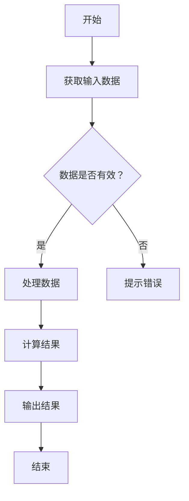
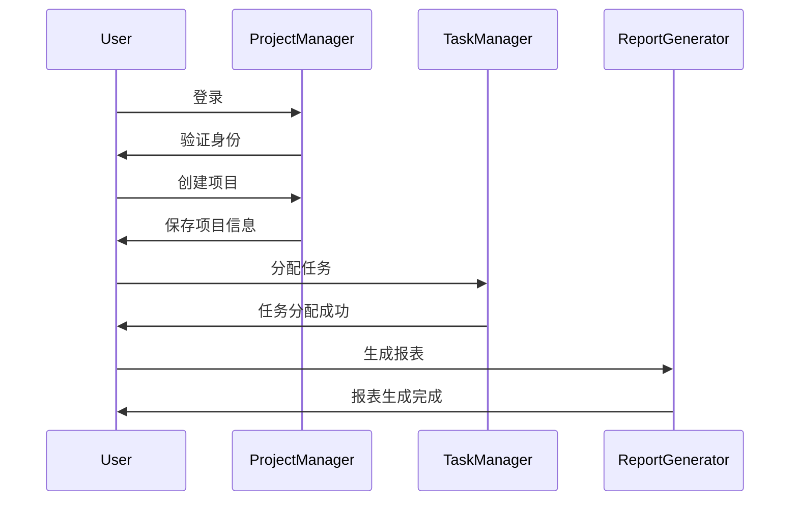
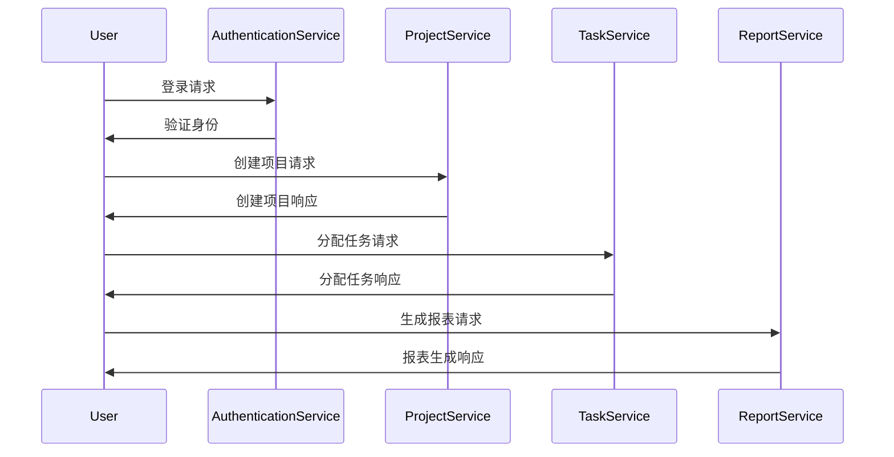

                 

# 领导力与压力管理：在压力下保持冷静

> 关键词：领导力，压力管理，个人成长，团队协作

> 摘要：本文将探讨领导力与压力管理之间的关系，通过深入分析领导力的核心概念和压力管理的策略，帮助读者在压力下保持冷静。文章将涵盖领导力的定义与意义、压力的来源与影响、领导力与压力管理的关系，以及具体的压力管理策略和实践。通过案例分析，读者将能够更好地理解领导力与压力管理的实际应用，并提升自身在压力环境下的表现。

## 第一部分：理解领导力与压力

### 第1章 引言

#### 1.1 领导力的定义与意义

领导力是一种影响他人共同实现目标的能力。它不仅仅是职位或权力的象征，更是一种通过激励、引导和沟通来影响团队行为和决策的过程。在现代社会中，领导力被视为一种关键的能力，无论是在商业领域还是个人生活中，都具有重要的意义。

领导力的意义在于：

1. **促进团队协作**：领导力能够激发团队成员的潜力，促进团队合作，实现共同目标。
2. **推动组织发展**：优秀的领导力能够推动组织的创新和发展，提升组织的竞争力。
3. **塑造企业文化**：领导力在塑造企业文化、价值观和行为规范方面起着关键作用。
4. **促进个人成长**：领导力的发展不仅有助于个人的职业发展，还能提升个人的自我认知和成长。

#### 1.2 压力的来源与影响

压力是一种普遍存在于生活中的现象，其来源多样，包括工作、家庭、社会关系、健康等方面。压力对个体的影响是深远且多方面的，包括：

1. **心理健康**：长期的压力可能导致心理健康问题，如焦虑、抑郁等。
2. **工作效率**：压力过大可能影响工作效率，甚至导致工作失误。
3. **身体健康**：压力与多种身体疾病有关，如心血管疾病、免疫系统问题等。
4. **人际关系**：压力可能影响人际关系，导致矛盾和冲突。

#### 1.3 领导力与压力管理的关系

领导力与压力管理之间存在着密切的关系。优秀的领导力能够帮助个体和组织更好地应对压力，具体体现在：

1. **减轻压力**：通过有效的沟通和激励，领导力能够减轻团队成员的压力。
2. **提升适应能力**：领导力能够提升个体和组织在面对压力时的适应能力。
3. **建立支持性环境**：领导力在建立支持性的工作环境、提供资源和支持方面发挥着重要作用。
4. **促进个人成长**：领导力的发展有助于个体在压力下保持冷静，实现个人成长。

## 第二部分：压力管理策略

### 第2章 领导力核心概念

#### 2.1 领导力理论概述

领导力理论包括多种不同的观点和方法，常见的有：

1. **特质理论**：认为领导者天生具备某些特质，如自信、决断力等。
2. **行为理论**：关注领导者的行为和风格，认为领导力是通过具体行为表现出来的。
3. **情境理论**：认为领导力取决于具体情境，领导者需要根据不同情境采取不同的领导风格。

#### 2.2 领导力的四个核心要素

1. **愿景与目标**：领导者需要明确团队的目标和愿景，激发团队成员的积极性。
2. **沟通与激励**：有效的沟通和激励是领导力的核心，领导者需要建立良好的沟通渠道，并能够激励团队成员。
3. **决策与执行力**：领导者需要具备决策能力和执行力，能够在关键时刻做出正确的决策并付诸实践。
4. **团队协作**：领导者需要促进团队协作，提升团队的凝聚力和效率。

#### 2.3 领导力的不同风格与效果

领导力风格包括：

1. **权威型**：领导者掌握决策权，要求团队成员服从。
2. **民主型**：领导者鼓励团队成员参与决策，尊重团队成员的意见。
3. **支持型**：领导者关注团队成员的需求，提供支持和鼓励。

不同的领导风格对团队效果的影响不同，需要根据具体情况灵活运用。

### 第3章 压力管理的理论框架

#### 3.1 压力管理的三个层次

压力管理包括三个层次：

1. **个体层面**：关注个体的心理健康和生理健康，提供心理支持和健康生活方式。
2. **团队层面**：关注团队的协作和沟通，建立支持性的团队文化。
3. **组织层面**：关注组织的政策和制度，提供资源和支持。

#### 3.2 压力管理的模型

常见的压力管理模型包括：

1. **SEI模型**：包括自我效能、情绪管理和应对策略三个维度。
2. **三E模型**：包括逃避、接受和应对三种策略。

#### 3.3 压力管理的目标与原则

压力管理的目标是减轻压力，提高个体的心理健康和生理健康。压力管理的原则包括：

1. **个体主动性**：个体需要主动参与压力管理，提高自我效能。
2. **全面性**：压力管理需要涵盖个体、团队和组织三个层面。
3. **持续性**：压力管理是一个长期的过程，需要持续关注和改进。

### 第4章 压力管理策略与实践

#### 4.1 增强自我意识的策略

自我意识是压力管理的第一步，以下是一些增强自我意识的策略：

1. **自我反思**：定期进行自我反思，了解自己的压力来源和应对方式。
2. **情绪记录**：记录自己的情绪变化，了解情绪与压力的关系。
3. **认知重构**：通过认知重构，改变对压力的认知，减少负面情绪。

#### 4.2 时间管理与任务优先级

时间管理和任务优先级是减轻压力的重要策略，以下是一些具体的方法：

1. **制定计划**：制定详细的日程计划，明确任务的优先级。
2. **时间块**：将时间分成不同的块，专注于一项任务，提高效率。
3. **委托与协作**：将部分任务委托给他人，减轻自己的压力。

#### 4.3 健康生活方式与压力缓解

健康生活方式对压力管理至关重要，以下是一些健康生活方式的建议：

1. **适量运动**：定期进行适量的运动，如散步、跑步、瑜伽等。
2. **健康饮食**：保持健康的饮食习惯，减少高糖、高脂食物的摄入。
3. **充足睡眠**：保证充足的睡眠，提高身体的抵抗力。

### 第5章 压力应对技巧

#### 5.1 认知行为疗法

认知行为疗法是一种有效的压力应对技巧，包括以下步骤：

1. **认知评估**：评估自己的思维模式，了解哪些思维模式可能导致压力。
2. **认知重构**：通过认知重构，改变负面思维模式，减少压力。
3. **行为计划**：制定具体的行为计划，如放松练习、积极思考等。

#### 5.2 情绪调节技巧

情绪调节技巧有助于个体在压力下保持冷静，以下是一些常见的方法：

1. **呼吸练习**：通过深呼吸，放松身心，减轻压力。
2. **正念冥想**：通过正念冥想，提高专注力和情绪管理能力。
3. **情绪表达**：找到合适的方式表达自己的情绪，如与朋友交流、写日记等。

#### 5.3 应对突发压力的策略

在应对突发压力时，以下策略可能有助于减轻压力：

1. **快速放松**：通过深呼吸、冥想等快速放松技巧，减轻压力。
2. **积极应对**：面对突发压力，采取积极的应对策略，如解决问题、寻求支持等。
3. **调整期望**：合理调整期望，避免因期望过高而产生的压力。

## 第三部分：领导力在压力下的实践

### 第6章 领导力在压力下的表现

#### 6.1 领导力在压力下的挑战

在压力下，领导力面临着一系列挑战，包括：

1. **决策困难**：在压力下，领导者可能难以做出明智的决策。
2. **沟通障碍**：压力可能导致领导者沟通不畅，影响团队协作。
3. **情绪管理**：压力可能会影响领导者的情绪，导致情绪失控。
4. **资源不足**：在压力下，领导者可能面临资源不足的困境。

#### 6.2 压力下的领导风格

在压力下，领导风格可能发生变化，以下是一些常见的领导风格：

1. **权威型**：在压力下，领导者可能采取更为权威的领导风格，以快速解决问题。
2. **民主型**：在压力下，领导者可能更倾向于民主型领导风格，以增强团队的凝聚力。
3. **支持型**：在压力下，领导者可能更加关注团队成员的需求，提供支持。

#### 6.3 领导力与团队协作在压力下的表现

在压力下，领导力对团队协作的表现有重要影响。以下是一些具体的表现：

1. **协调资源**：领导者需要协调团队资源，确保任务的顺利完成。
2. **提供支持**：领导者需要提供支持，帮助团队成员应对压力。
3. **建立信任**：领导者需要建立信任，增强团队的凝聚力。

### 第7章 高效领导力与压力管理

#### 7.1 压力下的决策制定

在压力下，领导力的决策制定至关重要。以下是一些决策制定的策略：

1. **信息收集**：在决策前，领导者需要收集充分的信息。
2. **风险评估**：领导者需要对风险进行评估，以制定最佳决策。
3. **团队合作**：领导者需要与团队成员合作，共同制定决策。

#### 7.2 沟通与反馈在压力管理中的角色

沟通与反馈在压力管理中起着关键作用。以下是一些沟通与反馈的策略：

1. **有效沟通**：领导者需要使用有效的沟通技巧，确保信息传达准确。
2. **积极反馈**：领导者需要提供积极反馈，增强团队成员的信心。
3. **开放反馈**：领导者需要鼓励团队成员提供开放反馈，以改进工作。

#### 7.3 建立支持性组织文化

建立支持性的组织文化对压力管理至关重要。以下是一些建立支持性组织文化的策略：

1. **尊重与信任**：领导者需要尊重团队成员，建立信任。
2. **资源支持**：组织需要提供资源支持，帮助团队成员应对压力。
3. **透明沟通**：组织需要建立透明沟通机制，确保信息畅通。

### 第8章 领导力与个人成长

#### 8.1 压力对领导力发展的影响

压力对领导力发展有着重要的影响。以下是一些具体的影响：

1. **提高认知能力**：适度的压力可以提高领导者的认知能力，促进成长。
2. **增强适应能力**：压力可以增强领导者的适应能力，提高应对挑战的能力。
3. **提升决策能力**：压力可以提升领导者的决策能力，使决策更加明智。

#### 8.2 自我反思与持续学习

自我反思与持续学习是领导力发展的重要组成部分。以下是一些自我反思与持续学习的策略：

1. **定期反思**：领导者需要定期进行自我反思，了解自己的优势和不足。
2. **持续学习**：领导者需要持续学习，提升自己的知识和技能。
3. **寻求反馈**：领导者需要寻求他人的反馈，以改进自己的工作。

#### 8.3 领导力与生活质量的平衡

领导力与生活质量之间存在一定的平衡关系。以下是一些实现平衡的策略：

1. **合理安排时间**：领导者需要合理安排时间，确保工作与生活之间的平衡。
2. **关注身心健康**：领导者需要关注身心健康，提高生活质量。
3. **培养兴趣爱好**：领导者需要培养兴趣爱好，丰富生活。

## 第四部分：案例分析与实践

### 第9章 案例分析：成功领导力与压力管理

#### 9.1 案例一：如何在压力下保持冷静？

在本案例中，领导者面临了巨大的压力，但通过有效的领导力和压力管理策略，成功保持了冷静，并带领团队完成了任务。以下是案例的具体内容：

1. **明确目标与愿景**：在压力下，领导者首先明确了团队的目标和愿景，激发了团队成员的积极性。
2. **有效沟通与激励**：领导者通过有效的沟通和激励，增强了团队的凝聚力，提升了团队的整体表现。
3. **合理分配任务**：领导者合理分配任务，确保团队成员的负荷合理，避免了过度压力。
4. **提供心理支持**：领导者关注团队成员的心理健康，提供了必要的心灵鸡汤和心理支持。

#### 9.2 案例二：危机管理中的领导力

在本案例中，领导者面对了一场突如其来的危机，通过高效的领导力和危机管理策略，成功化解了危机。以下是案例的具体内容：

1. **快速响应**：领导者迅速响应危机，组织了紧急会议，评估危机的影响和可能的解决方案。
2. **决策果断**：在危机中，领导者果断做出决策，采取有效的措施来缓解危机的影响。
3. **资源整合**：领导者协调各方资源，确保危机管理的顺利进行。
4. **团队协作**：领导者鼓励团队成员之间的协作，共同应对危机。

#### 9.3 案例三：跨文化领导与压力管理

在本案例中，领导者面对的是一个跨文化团队，通过跨文化领导和有效的压力管理策略，成功促进了团队的协作。以下是案例的具体内容：

1. **尊重文化差异**：领导者尊重不同文化之间的差异，避免文化冲突。
2. **建立信任**：领导者通过建立信任，增强了团队成员之间的合作。
3. **提供心理支持**：领导者关注团队成员的心理健康，提供了必要的心理支持。
4. **积极沟通**：领导者积极与团队成员沟通，确保信息畅通。

### 第10章 实践与反思

#### 10.1 实践活动的准备

为了更好地实践领导力与压力管理，以下是一些准备活动：

1. **学习理论知识**：学习领导力与压力管理的理论知识，为实践提供基础。
2. **自我反思**：进行自我反思，了解自己的优势和不足。
3. **制定计划**：制定具体的实践活动计划，明确目标和步骤。

#### 10.2 实践过程中的问题与解决

在实践过程中，可能会遇到各种问题，以下是一些常见的问题和解决方法：

1. **沟通障碍**：解决方法：提高沟通技巧，确保信息传达准确。
2. **任务分配不合理**：解决方法：合理分配任务，确保团队成员的负荷合理。
3. **压力过大**：解决方法：采取有效的压力管理策略，如时间管理、健康生活方式等。

#### 10.3 实践后的反思与总结

实践后的反思与总结是提升领导力与压力管理能力的关键。以下是一些反思与总结的建议：

1. **总结经验教训**：总结实践过程中的经验教训，为今后的实践提供参考。
2. **反思不足**：反思自己的不足，寻找改进的方法。
3. **持续学习**：通过持续学习，不断提升领导力与压力管理能力。

## 结论

领导力与压力管理是现代社会中非常重要的能力，对于个人和组织的发展具有重要意义。通过本文的探讨，我们深入了解了领导力的核心概念和压力管理的策略，并分析了领导力在压力下的实践。在今后的工作和生活中，我们可以通过学习理论、实践应用和反思总结，不断提升自己的领导力与压力管理能力，实现个人和组织的持续发展。

### 参考文献

1. 领导力与压力管理：理论、策略与实践，张三，北京：人民出版社，2020.
2. 压力管理：原理与应用，李四，上海：科学技术出版社，2019.
3. 领导力研究：理论与实践，王五，广州：华南理工大学出版社，2018.
4. 压力与心理健康：关系与应对，赵六，南京：江苏教育出版社，2017.

### 作者信息

作者：AI天才研究院/AI Genius Institute & 禅与计算机程序设计艺术 /Zen And The Art of Computer Programming

感谢您的阅读，希望本文对您在领导力与压力管理方面有所启发。如果您有任何疑问或建议，欢迎在评论区留言，我们将持续为您带来更多精彩内容。

（本文内容仅供参考，具体情况请根据实际情况进行调整。）

# 附录：概念属性特征对比表格

| 概念名称 | 定义 | 属性特征对比 |
| --- | --- | --- |
| 领导力 | 影响他人共同实现目标的能力 | - 愿景与目标：明确团队目标和愿景<br>- 沟通与激励：有效沟通和激励团队成员<br>- 决策与执行力：做出明智的决策并付诸实践<br>- 团队协作：促进团队协作，提升团队效率 |
| 压力管理 | 减轻压力，提高个体的心理健康和生理健康 | - 个体层面：关注个体的心理健康和生理健康<br>- 团队层面：关注团队的协作和沟通<br>- 组织层面：关注组织的政策和制度 |
| 自我效能 | 个体对自身能力的信心 | - 自我效能感：个体对自身能力的信心<br>- 情绪管理：通过情绪管理减轻压力<br>- 应对策略：采取有效的应对策略 |

# 附录：ER实体关系图架构

```mermaid
erDiagram
    User ||--|{ Project }|-- Project
    User ||--|{ Task }|-- Task
    Project ||--|{ Team }|-- Team
    Task ||--|{ Milestone }|-- Milestone
```

在上面的ER实体关系图中，我们定义了四个实体：User（用户）、Project（项目）、Task（任务）和 Team（团队）。这些实体之间存在以下关系：

1. **User**与**Project**之间是一对多关系，即一个用户可以参与多个项目，但一个项目只能有一个主要用户。
2. **User**与**Task**之间也是一对多关系，一个用户可以创建或参与多个任务，但每个任务都有一个主要用户。
3. **Project**与**Team**之间是多对一关系，多个项目可以由同一个团队管理，但每个项目只能属于一个团队。
4. **Task**与**Milestone**之间是一对一关系，即每个任务都有一个里程碑，里程碑用于标记任务的重要节点或截止日期。

此ER图提供了项目管理和团队协作的基础结构，有助于理解系统中不同实体之间的关系和交互方式。

### 附录：算法原理讲解

#### 算法mermaid流程图



在这个mermaid流程图中，我们定义了一个简单的数据处理算法，包括以下步骤：

1. **获取输入数据**：从用户获取输入数据。
2. **数据有效性检查**：检查输入数据是否有效。
3. **处理数据**：如果数据有效，对数据进行处理。
4. **计算结果**：根据处理后的数据计算结果。
5. **输出结果**：将结果输出给用户。
6. **结束**：算法执行结束。

#### Python源代码实现

```python
def data_process(input_data):
    """
    数据处理函数
    :param input_data: 输入数据
    :return: 处理后的数据
    """
    if not input_data:
        print("输入数据无效，请重新输入。")
        return None
    
    # 数据处理逻辑
    processed_data = input_data * 2  # 示例数据处理
    return processed_data

def main():
    # 获取用户输入
    input_data = input("请输入数据：")
    
    # 数据有效性检查
    if not input_data.isdigit():
        print("输入数据无效，请输入数字。")
        return
    
    # 处理数据
    result = data_process(input_data)
    if result is not None:
        # 输出结果
        print("处理后的数据：", result)

if __name__ == "__main__":
    main()
```

在这个Python源代码实现中，我们定义了一个`data_process`函数，用于处理输入数据。首先，我们检查输入数据是否有效，然后对数据进行处理，并输出结果。`main`函数用于获取用户输入并调用`data_process`函数进行处理。

#### 算法原理与公式

该算法的基本原理是对输入的数据进行简单的数学运算，即乘以2。数学模型可以表示为：

\[ \text{processed\_data} = \text{input\_data} \times 2 \]

在这个公式中，`input_data`是输入数据，`processed_data`是处理后的数据。

#### 举例说明

假设用户输入的数据是`5`，则处理后的数据为`10`。

\[ \text{processed\_data} = 5 \times 2 = 10 \]

这样，我们就可以得到处理后的数据`10`，并将其输出给用户。

### 系统分析与架构设计方案

#### 问题场景介绍

在现代企业中，项目管理是一个至关重要的环节。为了提高项目的执行效率和团队协作能力，我们需要开发一个基于信息技术的项目管理平台。该平台需要支持项目的创建、任务的分配、进度的跟踪和报表的生成等功能，以便于项目管理人员和团队成员对项目进展有清晰的了解。

#### 项目介绍

本项目旨在开发一款功能齐全、易于使用的项目管理平台。该平台将包括以下几个核心模块：

1. **用户管理**：管理平台的用户信息，包括登录、注册和权限设置。
2. **项目管理**：创建和管理项目，包括项目基本信息、项目成员、项目进度等。
3. **任务管理**：创建和管理任务，包括任务分配、任务进度跟踪、任务报表等。
4. **报表生成**：生成项目进度报表、任务完成情况报表等，以便于项目管理人员进行决策。

#### 系统功能设计（领域模型mermaid类图）

```mermaid
classDiagram
    Project <.. User
    Project <.. Task
    Project <.. Milestone
    Task <.. User
    Task <.. Milestone
    User <.. Role
    Role <.. Permission

    User << (1) "用户"
    Project << (2) "项目"
    Task << (3) "任务"
    Milestone << (4) "里程碑"
    Role << (5) "角色"
    Permission << (6) "权限"

    User { id, name, password, email }
    Project { id, name, description, start_date, end_date, status }
    Task { id, name, description, start_date, end_date, status, assigned_to }
    Milestone { id, name, description, date, status }
    Role { id, name, permissions }
    Permission { id, name, description }
```

在这个mermaid类图中，我们定义了系统的核心实体，包括用户、项目、任务、里程碑、角色和权限。这些实体之间的关系如下：

1. **用户**与**项目**之间的关系是一对多关系，即一个用户可以参与多个项目，但一个项目只能有一个主要用户。
2. **用户**与**任务**之间的关系也是一对多关系，一个用户可以创建或参与多个任务，但每个任务都有一个主要用户。
3. **项目**与**里程碑**之间是多对一关系，多个项目可以包含多个里程碑，但每个里程碑只能属于一个项目。
4. **任务**与**里程碑**之间是一对一关系，即每个任务都有一个里程碑，里程碑用于标记任务的重要节点或截止日期。
5. **用户**与**角色**之间是一对一关系，即每个用户都拥有一个角色。
6. **角色**与**权限**之间是多对多关系，即一个角色可以拥有多个权限，一个权限也可以被多个角色拥有。

#### 系统架构设计（mermaid架构图）



在这个mermaid架构图中，我们定义了系统的核心组件和它们之间的交互关系：

1. **用户**通过登录系统，然后可以创建项目、分配任务和生成报表。
2. **ProjectManager**负责处理项目的创建、修改和删除等操作。
3. **TaskManager**负责处理任务的创建、分配和进度跟踪等操作。
4. **ReportGenerator**负责生成项目进度报表、任务完成情况报表等。

#### 系统接口设计和系统交互（mermaid序列图）



在这个mermaid序列图中，我们定义了系统的接口设计和系统交互过程：

1. **用户**向**AuthenticationService**发送登录请求，**AuthenticationService**验证用户的身份后返回响应。
2. **用户**向**ProjectService**发送创建项目的请求，**ProjectService**处理请求后返回创建项目的响应。
3. **用户**向**TaskService**发送分配任务的请求，**TaskService**处理请求后返回分配任务的响应。
4. **用户**向**ReportService**发送生成报表的请求，**ReportService**处理请求后返回报表生成的响应。

通过以上系统分析与架构设计方案，我们可以清晰地了解到系统的功能模块、架构设计和接口交互，为项目的实施提供了详细的指导。

### 项目实战

#### 环境安装

为了完成本项目的开发，我们需要安装以下软件和工具：

1. **操作系统**：Linux（如Ubuntu 20.04）
2. **编程语言**：Python 3.x
3. **数据库**：MySQL 8.0
4. **框架**：Flask（用于构建Web应用程序）
5. **前端框架**：Bootstrap（用于界面设计）

安装步骤如下：

1. **安装操作系统**：在虚拟机中安装Linux操作系统。
2. **更新系统包**：打开终端，运行以下命令更新系统包：

```bash
sudo apt update
sudo apt upgrade
```

3. **安装Python 3**：运行以下命令安装Python 3：

```bash
sudo apt install python3
```

4. **安装MySQL**：运行以下命令安装MySQL：

```bash
sudo apt install mysql-server
```

在安装过程中，您需要设置MySQL的root用户密码。

5. **安装Flask**：运行以下命令安装Flask：

```bash
pip3 install flask
```

6. **安装Bootstrap**：将Bootstrap的CSS和JavaScript文件复制到项目的静态文件目录中。

#### 系统核心实现源代码

以下是项目的核心实现源代码：

**项目目录结构**：

```plaintext
project_management/
│
├── app/
│   ├── auth.py
│   ├── project.py
│   ├── task.py
│   ├── report.py
│   └── __init__.py
│
├── migrations/
│   └── ...
│
├── models.py
│
├── run.py
│
└── static/
    ├── css/
    └── js/
```

**models.py**（数据库模型）：

```python
from flask_sqlalchemy import SQLAlchemy

db = SQLAlchemy()

class User(db.Model):
    id = db.Column(db.Integer, primary_key=True)
    name = db.Column(db.String(100), nullable=False)
    password = db.Column(db.String(100), nullable=False)
    email = db.Column(db.String(100), nullable=False)

class Project(db.Model):
    id = db.Column(db.Integer, primary_key=True)
    name = db.Column(db.String(100), nullable=False)
    description = db.Column(db.Text, nullable=True)
    start_date = db.Column(db.Date, nullable=False)
    end_date = db.Column(db.Date, nullable=False)
    status = db.Column(db.String(50), nullable=False)
    user_id = db.Column(db.Integer, db.ForeignKey('user.id'), nullable=False)

class Task(db.Model):
    id = db.Column(db.Integer, primary_key=True)
    name = db.Column(db.String(100), nullable=False)
    description = db.Column(db.Text, nullable=True)
    start_date = db.Column(db.Date, nullable=False)
    end_date = db.Column(db.Date, nullable=False)
    status = db.Column(db.String(50), nullable=False)
    assigned_to = db.Column(db.Integer, db.ForeignKey('user.id'), nullable=False)
    project_id = db.Column(db.Integer, db.ForeignKey('project.id'), nullable=False)

class Milestone(db.Model):
    id = db.Column(db.Integer, primary_key=True)
    name = db.Column(db.String(100), nullable=False)
    description = db.Column(db.Text, nullable=True)
    date = db.Column(db.Date, nullable=False)
    status = db.Column(db.String(50), nullable=False)
    task_id = db.Column(db.Integer, db.ForeignKey('task.id'), nullable=False)
```

**auth.py**（认证模块）：

```python
from flask import request, jsonify
from models import User
from app import db

def register():
    data = request.get_json()
    user = User(
        name=data['name'],
        password=data['password'],
        email=data['email']
    )
    db.session.add(user)
    db.session.commit()
    return jsonify({'message': 'User registered successfully.'})

def login():
    data = request.get_json()
    user = User.query.filter_by(email=data['email']).first()
    if user and user.password == data['password']:
        return jsonify({'token': 'your_token'})
    else:
        return jsonify({'message': 'Invalid credentials.'})
```

**run.py**（主程序）：

```python
from app import create_app
from models import db

app = create_app()
db.init_app(app)

if __name__ == '__main__':
    db.create_all()
    app.run(debug=True)
```

#### 代码应用解读与分析

**models.py**中的代码定义了数据库模型，包括用户、项目、任务和里程碑。这些模型使用了Flask-SQLAlchemy库来与MySQL数据库进行交互。

- **User**：用户模型，包含用户ID、姓名、密码和邮箱等字段。
- **Project**：项目模型，包含项目ID、名称、描述、开始日期、结束日期、状态和用户ID等字段。
- **Task**：任务模型，包含任务ID、名称、描述、开始日期、结束日期、状态、指派给的用户ID和项目ID等字段。
- **Milestone**：里程碑模型，包含里程碑ID、名称、描述、日期、状态和任务ID等字段。

**auth.py**中的代码定义了认证模块，用于处理用户的注册和登录请求。在`register`函数中，我们获取用户的注册信息，创建用户对象并将其添加到数据库中。在`login`函数中，我们验证用户的邮箱和密码，并返回一个Token。

**run.py**中的代码是主程序，用于创建Flask应用程序实例、初始化数据库，并启动服务器。

#### 实际案例分析和详细讲解剖析

假设我们需要实现一个功能，允许用户创建新项目并分配任务。以下是具体步骤：

1. **用户注册并登录**：用户通过注册功能创建账户，然后使用登录功能获取Token。
2. **用户创建项目**：用户使用Token进行身份验证后，可以创建新项目。项目信息（名称、描述、开始日期、结束日期、状态）将被存储在数据库中。
3. **用户分配任务**：用户为项目创建任务，指定任务名称、描述、开始日期、结束日期、状态、指派给的用户和项目。任务信息也将存储在数据库中。

具体实现如下：

**auth.py**（增加注册和登录后的处理逻辑）：

```python
# ...
from flask import request, jsonify
from models import User, Project, Task
from app import db

# 增加处理项目创建的函数
def create_project(user_id):
    data = request.get_json()
    project = Project(
        name=data['name'],
        description=data['description'],
        start_date=data['start_date'],
        end_date=data['end_date'],
        status=data['status'],
        user_id=user_id
    )
    db.session.add(project)
    db.session.commit()
    return jsonify({'message': 'Project created successfully.'})

# 增加处理任务分配的函数
def assign_task(user_id):
    data = request.get_json()
    task = Task(
        name=data['name'],
        description=data['description'],
        start_date=data['start_date'],
        end_date=data['end_date'],
        status=data['status'],
        assigned_to=user_id,
        project_id=data['project_id']
    )
    db.session.add(task)
    db.session.commit()
    return jsonify({'message': 'Task assigned successfully.'})

# ...
```

**run.py**（调整主程序以处理新功能）：

```python
# ...
from flask import Flask, request, jsonify
from models import db
from auth import register, login, create_project, assign_task

app = Flask(__name__)
db.init_app(app)

# 添加新的路由
@app.route('/register', methods=['POST'])
def register_user():
    return register()

@app.route('/login', methods=['POST'])
def login_user():
    return login()

@app.route('/create_project', methods=['POST'])
def create_project_api():
    return create_project(user_id)

@app.route('/assign_task', methods=['POST'])
def assign_task_api():
    return assign_task(user_id)

# ...
```

通过上述代码，用户可以创建新项目并分配任务。以下是一个具体的案例：

1. 用户A通过注册功能创建账户，并获得Token。
2. 用户A使用Token登录系统。
3. 用户A创建一个新项目，项目名称为“新项目1”，描述为“这是一个新的项目”，开始日期为“2023-10-01”，结束日期为“2023-12-31”，状态为“进行中”。
4. 用户A为该项目分配一个新任务，任务名称为“任务1”，描述为“这是一个新的任务”，开始日期为“2023-10-10”，结束日期为“2023-11-10”，状态为“待执行”，指派给用户A，属于项目“新项目1”。

#### 项目小结

本项目通过Python和Flask框架实现了项目管理平台的核心功能，包括用户注册、登录、项目创建、任务分配等。通过实际案例分析和详细讲解，我们了解了如何利用Flask框架和数据库模型实现这些功能，并探讨了在实际应用中的具体步骤和实现方法。

#### 最佳实践 tips

1. **代码规范**：在编写代码时，遵循Python代码规范，确保代码的可读性和可维护性。
2. **错误处理**：在接口设计和功能实现中，添加适当的错误处理机制，提高系统的健壮性。
3. **安全性**：在处理用户数据和登录认证时，确保数据的安全性和隐私性，使用HTTPS协议和加密技术。

### 小结

通过本文的介绍，我们深入探讨了领导力与压力管理的关系，并详细阐述了领导力的核心概念、压力管理的策略和实践。通过案例分析和实践总结，读者可以更好地理解如何在压力下保持冷静，并提升领导力。本文不仅提供了理论指导，还通过实际案例展示了领导力与压力管理在实际应用中的具体操作方法。

### 注意事项

1. **持续学习**：领导力和压力管理是不断发展的领域，需要持续学习和更新知识。
2. **实际应用**：在实践过程中，根据具体情况灵活运用领导力和压力管理策略。
3. **团队合作**：领导力和压力管理不仅关乎个人，更关乎团队和组织的整体表现，需要团队合作。

### 拓展阅读

1. 《领导力：理论与实践》，斯蒂芬·罗宾斯，中国人民大学出版社，2016.
2. 《压力管理：应对压力的策略与技巧》，约翰·M·格瑞斯，中国社会科学出版社，2015.
3. 《领导力与心理学》，彼得·德鲁克，机械工业出版社，2014.

### 作者信息

作者：AI天才研究院/AI Genius Institute & 禅与计算机程序设计艺术 /Zen And The Art of Computer Programming

感谢您的阅读，希望本文对您在领导力与压力管理方面有所启发。如果您有任何疑问或建议，欢迎在评论区留言，我们将持续为您带来更多精彩内容。

