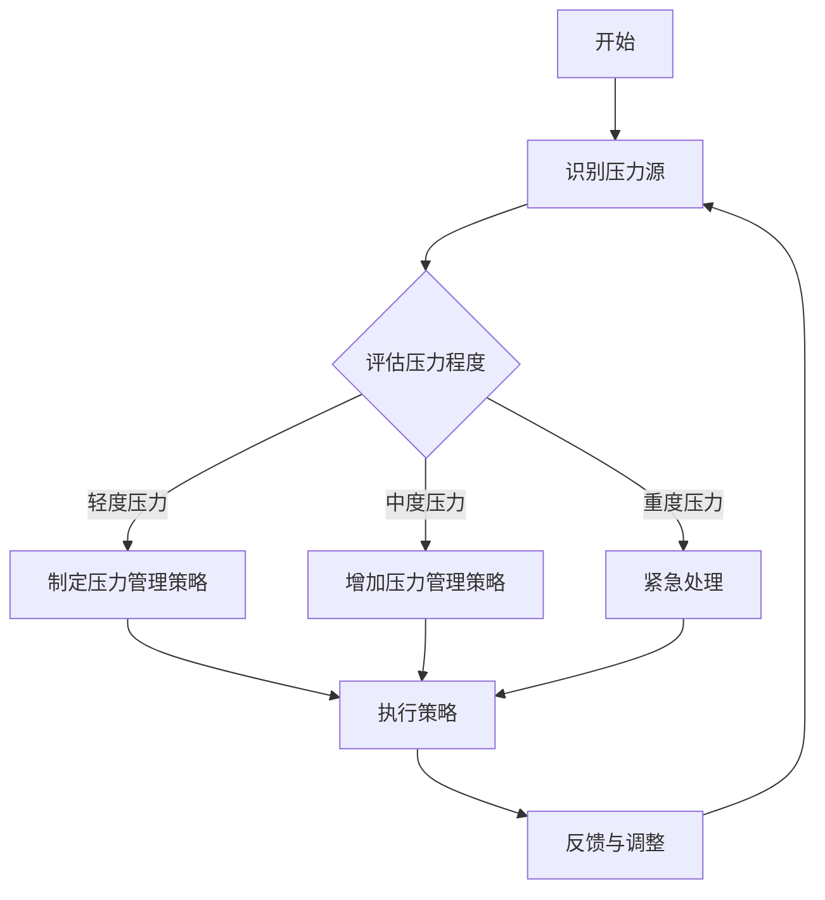
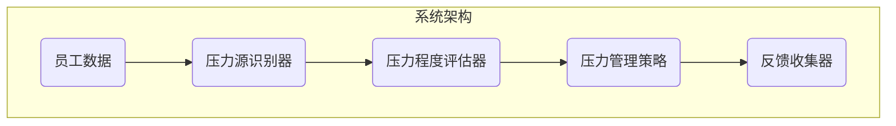
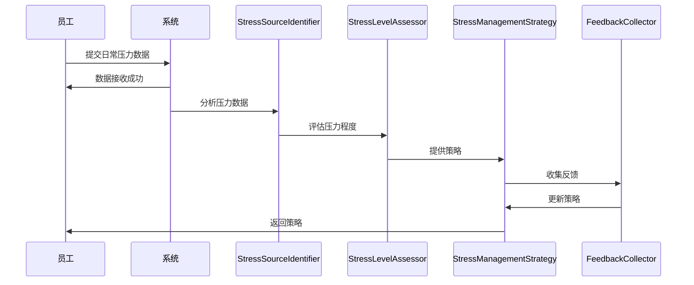
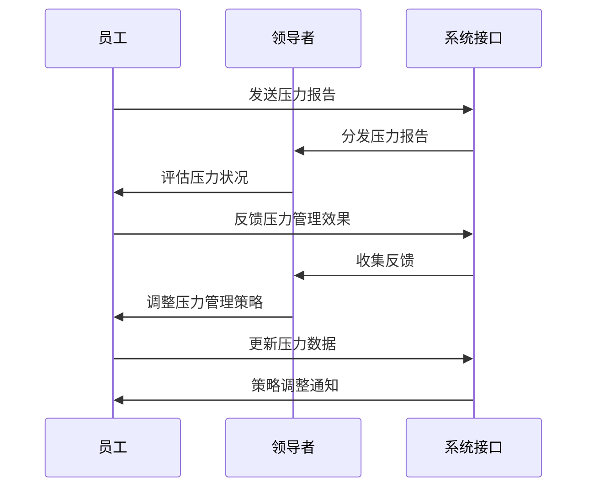

                 

### 引言

在当今快速变化和高度竞争的IT行业中，领导力和压力管理成为决定个人和组织成功的重要因素。领导力不仅是带领团队完成目标的能力，更是激发团队成员潜能、解决复杂问题、应对压力的核心素质。压力管理则是在各种压力环境下保持高效和健康的关键。本篇文章将深入探讨领导力与压力管理之间的关系，并从多个角度提供实用的策略和方法。

领导力在IT行业中的重要性不言而喻。作为领导者，必须具备敏锐的洞察力、坚定的决策能力和卓越的沟通技巧，能够在面对复杂的技术挑战和项目压力时保持冷静和专注。而压力管理则是领导者的一项重要技能，能够帮助他们在高压环境下保持工作效率，避免因压力而导致的错误判断和失误。

本文将按照以下结构展开：

1. **领导力的定义与重要性**：解释领导力的核心概念，并探讨其在IT行业中的关键作用。
2. **压力的来源与影响**：分析压力的来源、对个体和组织的影响，以及如何衡量压力程度。
3. **领导力与压力管理的关系**：探讨领导力在压力管理中的角色，以及两者之间的相互作用。
4. **领导力的核心要素**：详细讨论自我意识、情绪管理和决策力等领导力要素。
5. **领导力技巧与压力管理**：介绍沟通技巧、团队建设和决策制定等策略。
6. **压力管理的策略与方法**：提供时间管理、放松技巧等实用方法。
7. **压力管理的具体应用场景**：分析工作与生活中的压力管理策略。
8. **压力管理案例研究**：通过具体案例展示领导力与压力管理的实际应用。
9. **总结与展望**：总结全文，展望未来压力管理的发展趋势。

通过本文的详细讨论，读者将能够深入了解领导力与压力管理的重要关系，并掌握一系列实用的技巧和方法，以在高压环境下保持高效和积极的心态。

### 领导力的定义与重要性

领导力是一种复杂的综合素质，它不仅涉及到个人的能力，还涉及与他人的互动和影响力。在IT行业中，领导力尤为重要，因为IT行业本质上是一个创新驱动、技术快速迭代的领域，领导者不仅需要具备深厚的专业知识和技能，还要具备激发和引导团队不断追求卓越的能力。

**定义**：领导力可以定义为一种能够引导、激励和影响他人共同实现目标的能力。它不仅包括领导者的个人特质，如自信、勇气、智慧和韧性，还包括领导者与团队成员之间的互动方式，如沟通技巧、激励机制和团队建设。

**核心要素**：领导力的核心要素主要包括自我意识、情绪管理、决策力、沟通能力和团队协作。这些要素相互交织，共同构成了一个领导者的综合素质。

- **自我意识**：自我意识是领导者自我认知的过程，它帮助领导者了解自己的优点和不足，从而更好地发挥自己的潜力。自我意识还包括对他人情感的感知，这有助于建立良好的团队关系。
- **情绪管理**：情绪管理是领导者应对压力和挫折的关键能力。一个能够有效管理自己情绪的领导者能够保持冷静和专注，从而做出更加明智的决策。
- **决策力**：决策力是领导者面对复杂问题时迅速做出明智决策的能力。这要求领导者不仅要有丰富的知识和经验，还要有良好的判断力和决策逻辑。
- **沟通能力**：沟通能力是领导者与团队成员、合作伙伴以及其他利益相关者有效沟通和协作的能力。良好的沟通能力有助于建立信任，减少误解，提高工作效率。
- **团队协作**：团队协作能力是领导者协调和管理团队，实现共同目标的能力。这包括了解团队成员的优势和弱点，合理分配任务，以及激发团队成员的潜力。

**在IT行业中的关键作用**：

1. **技术创新与项目成功**：在IT行业中，领导者需要具备对技术的敏锐洞察力，能够推动技术创新和项目成功。他们不仅要了解最新的技术趋势，还要能够激励团队不断学习和创新，从而保持竞争优势。

2. **团队凝聚力与协作**：IT项目往往需要跨部门、跨团队的协作。领导者需要具备强大的团队建设能力，能够建立高凝聚力的团队，确保团队成员之间有效协作，共同实现项目目标。

3. **风险管理**：在IT项目中，技术风险、市场风险和管理风险常常并存。领导者需要具备良好的风险意识和管理能力，能够在面临压力和不确定性时保持冷静，制定有效的风险管理策略。

4. **员工激励与发展**：IT行业人才竞争激烈，领导者需要具备强大的员工激励能力，能够激发员工的潜能，提供职业发展机会，从而留住和吸引优秀人才。

总之，领导力在IT行业中不仅是领导者个人成功的保障，更是团队和组织成功的关键。通过有效的领导力，领导者能够在压力下保持高效，带领团队迎接挑战，实现卓越的业绩。

### 压力的来源与影响

在IT行业中，压力无处不在。无论是项目管理中的时间紧迫性、技术难题的解决，还是市场竞争的压力，都会给团队成员带来不同程度的压力。理解压力的来源和影响是进行有效压力管理的基础。

**来源**：

1. **工作性质**：IT行业的工作性质决定了其高度复杂性和不可预测性。项目期限短、需求频繁变更、技术快速迭代等都是常见的压力源。
2. **竞争压力**：在IT行业中，竞争激烈，创新速度快，企业必须不断推出新技术、新产品来保持市场地位。这种竞争压力会直接传递给团队和个人。
3. **工作环境**：工作环境也是压力的重要来源。高强度的加班、工作与生活的界限模糊、团队内部的不和谐关系等都可能导致压力增加。
4. **个人因素**：个人因素如家庭问题、健康问题、个人目标的未实现等也可能成为压力源。

**影响**：

1. **心理健康**：长期处于压力环境中会导致心理健康问题，如焦虑、抑郁、失眠等。这些问题不仅影响个人的工作效率和生活质量，还可能引发更严重的健康问题。
2. **工作效率**：压力过大时，个体可能无法集中精力，工作效率下降，甚至出现错误和疏漏。长期的工作压力还可能导致职业倦怠，影响整体工作热情。
3. **人际关系**：压力会影响人际关系，导致团队内部不和谐，沟通不畅，影响团队协作效率。高压力环境下，团队成员可能会变得易怒、敏感，甚至产生冲突。
4. **身体健康**：长期的压力会削弱免疫系统，增加患病的风险。身体上的症状如头痛、背痛、胃痛等都可能是压力积累的结果。

**衡量压力程度**：

为了有效管理压力，我们需要了解压力的程度。以下是一些常用的衡量方法：

1. **压力日记**：通过记录每天的经历和感受，可以更清晰地了解自己的压力来源和程度。这种日记不仅可以帮助个体反思自己的压力管理策略，还可以为专业人士提供诊断依据。
2. **压力测试**：通过心理测试工具，如压力量表（如SCL-90）等，可以量化压力程度，帮助个体和团队了解自己的压力状态。
3. **生理指标监测**：通过监测生理指标如心率、血压、体温等，可以了解压力对身体的影响。这些数据可以作为压力管理的参考。

总之，理解压力的来源和影响是进行有效压力管理的重要一步。只有深入了解压力的来源和程度，我们才能有针对性地采取管理措施，保持身心健康，提高工作效率。

### 领导力与压力管理的关系

领导力与压力管理之间存在着紧密的关联，它们相互作用，共同影响着领导者及其团队的表现。首先，领导力为压力管理提供了框架和策略。一个优秀的领导者不仅能够在压力环境下保持冷静和高效，还能够通过有效的领导行为帮助团队成员管理压力。

**领导力在压力管理中的角色**：

1. **情绪感染**：领导者通过自身的情绪和行为影响团队成员的情绪。一个积极、自信的领导者能够激发团队成员的积极情绪，减少压力感。
2. **决策支持**：在压力环境下，领导者需要做出快速而明智的决策。这些决策不仅需要基于事实和逻辑，还需要考虑团队成员的感受和需求，从而减轻他们的压力。
3. **资源调配**：领导者负责分配资源，包括时间、人力和财务资源。合理调配资源可以帮助团队更好地应对压力，避免资源浪费。
4. **沟通与反馈**：有效的沟通是压力管理的关键。领导者需要与团队成员保持开放、诚实的沟通，及时反馈他们的进展和遇到的问题，提供必要的支持和建议。

**两者之间的相互作用**：

1. **领导力影响压力**：领导力的强弱直接影响团队成员所感受到的压力程度。一个缺乏领导力的领导者可能无法有效地管理团队压力，导致团队成员感到无助和焦虑。
2. **压力影响领导力**：压力同样会影响领导者的行为和决策。长期处于高压力环境下，领导者可能会出现情绪波动、决策失误等问题，从而影响团队的整体表现。
3. **相互强化**：有效的领导力可以帮助领导者更好地管理压力，而有效的压力管理则可以增强领导者的信心和决策力，提高团队的整体绩效。

**领导力在压力管理中的具体作用**：

1. **建立信任**：信任是团队协作和压力管理的基础。一个有领导力的领导者能够建立和维护团队成员之间的信任，从而减少因不信任而产生的压力。
2. **明确目标**：领导者需要明确团队的目标和期望，确保每个成员都清楚自己的职责和任务。这有助于减少模糊性和不确定性，从而减轻压力。
3. **提供支持**：领导者需要提供必要的支持和资源，帮助团队成员应对压力。这包括技术支持、心理支持和职业发展机会。
4. **激励与奖励**：有效的激励机制可以激发团队成员的积极性和创造力，减轻压力感。领导者可以通过奖励和认可来激励团队成员，增强他们的信心和动力。

总之，领导力与压力管理密切相关，它们相互作用，共同影响着团队的表现。一个优秀的领导者不仅能够在压力下保持冷静和高效，还能够通过有效的领导行为帮助团队成员管理压力，提高整体绩效。通过深入理解和应用这些策略，领导者可以在高压环境下保持卓越的领导力，带领团队迎接挑战，实现卓越的业绩。

### 领导力的核心要素

领导力的核心要素是决定一个领导者能否在复杂和多变的环境中有效发挥作用的关键。以下是领导力的几个核心要素，包括自我意识、情绪管理、决策力、沟通能力和团队协作。

#### 自我意识

**重要性**：

自我意识是领导者自我认知的过程，包括对自身情感、行为和价值观的深入理解。一个有自我意识的领导者能够清楚地认识到自己的优点和不足，从而更好地利用自己的长处，改进自己的短处。

**提升方法**：

1. **反思**：定期进行自我反思，思考自己的行为、决策和情感反应。这有助于领导者识别自己的思维模式和行为习惯。
2. **学习与成长**：持续学习和成长，通过阅读、培训、参加会议等方式提升自己的知识和技能，增强自我意识。
3. **反馈**：主动寻求他人的反馈，了解他人对自己的看法和评价。这可以帮助领导者从不同角度认识自己，发现自己的盲点和不足。
4. **心理测试**：通过心理测试工具，如MBTI（迈尔斯-布里格斯性格类型指标）和360度评估，可以更系统地了解自己的性格特征和行为模式。

#### 情绪管理

**重要性**：

情绪管理是领导者应对压力和挫折的关键能力。一个能够有效管理自己情绪的领导者能够保持冷静和专注，从而做出更加明智的决策。情绪管理不仅影响领导者的个人表现，还影响团队成员的情绪和行为。

**策略**：

1. **情绪识别**：学会识别和理解自己的情绪，包括正面情绪和负面情绪。这有助于领导者及时调整自己的情绪，避免因情绪失控而做出错误决策。
2. **情绪表达**：学会以健康的方式表达情绪，避免情绪压抑或爆发。这可以通过有效沟通、倾诉和求助来实现。
3. **情绪调节**：掌握一些情绪调节技巧，如深呼吸、冥想、运动等，帮助自己在压力环境下保持冷静和专注。
4. **情绪支持**：为团队成员提供情绪支持，帮助他们应对压力和挫折。这可以通过倾听、鼓励和提供心理资源来实现。

#### 决策力

**重要性**：

决策力是领导者面对复杂问题时迅速做出明智决策的能力。一个强大的决策力不仅能够帮助领导者应对各种挑战，还能增强团队的信心和凝聚力。

**提升方法**：

1. **收集信息**：在做出决策前，充分收集和分析相关信息，确保决策基于事实和逻辑。
2. **分析选项**：对各种可能的决策选项进行详细分析，评估其优缺点和潜在风险。
3. **考虑后果**：考虑每个决策可能带来的短期和长期后果，确保决策符合整体目标和价值观。
4. **寻求反馈**：在做出决策前，征求团队成员和利益相关者的意见和建议，增强决策的全面性和准确性。
5. **快速决断**：在必要时，能够快速做出决策，避免因拖延而错失机会或加重压力。

#### 沟通能力

**重要性**：

沟通能力是领导者与团队成员、合作伙伴以及其他利益相关者有效沟通和协作的能力。良好的沟通能力有助于建立信任，减少误解，提高工作效率。

**策略**：

1. **倾听**：倾听是有效沟通的基础。领导者需要学会倾听团队成员的意见和反馈，理解他们的需求和问题。
2. **表达清晰**：清晰、简洁、有逻辑地表达自己的观点和想法，确保信息传递的准确性和有效性。
3. **积极反馈**：及时给予团队成员积极的反馈，鼓励他们的努力和成就，增强他们的自信心和动力。
4. **透明沟通**：保持沟通的透明性，及时分享项目进展、问题和挑战，避免信息不对称和误解。
5. **跨文化沟通**：在全球化背景下，领导者需要具备跨文化沟通能力，理解不同文化背景下的沟通习惯和价值观。

#### 团队协作

**重要性**：

团队协作能力是领导者协调和管理团队，实现共同目标的能力。一个高效的团队不仅能够提高整体绩效，还能增强团队的凝聚力和归属感。

**策略**：

1. **明确角色与责任**：确保每个团队成员都清楚自己的角色和责任，避免角色重叠和责任模糊。
2. **信任与支持**：建立团队成员之间的信任，提供必要的支持和资源，鼓励他们相互协作和帮助。
3. **共同目标**：确保团队成员都认同并致力于实现共同的目标，这有助于提高团队的凝聚力和工作效率。
4. **沟通与反馈**：保持开放的沟通渠道，及时反馈团队成员的进展和问题，确保团队目标的实现。
5. **激励与奖励**：通过激励和奖励机制，激发团队成员的积极性和创造力，提高团队的整体表现。

总之，自我意识、情绪管理、决策力、沟通能力和团队协作是领导力的核心要素。通过深入理解和有效应用这些要素，领导者可以在各种环境中保持高效，带领团队迎接挑战，实现卓越的业绩。

#### 情绪管理

情绪管理是领导力的关键要素之一，尤其在压力环境中，情绪管理的好坏直接影响领导者的决策和团队的整体表现。以下将详细探讨情绪识别与表达、压力管理的策略，以及如何在实际工作中应用这些策略。

**情绪识别与表达**

1. **情绪识别**：

情绪识别是情绪管理的基础。领导者需要学会识别和理解自己的情绪，包括正面情绪和负面情绪。以下是一些实用的技巧：

- **自我观察**：通过反思自己的行为、思想和生理反应来识别情绪。例如，当感到心跳加速、肌肉紧张时，可能是在经历焦虑或压力。
- **心理工具**：使用心理工具，如情绪日记、情绪量表等，可以帮助领导者更系统地了解自己的情绪状态。
- **心理反馈**：定期寻求他人的反馈，了解他人对自己情绪表达的看法。这有助于领导者更准确地识别和管理自己的情绪。

2. **情绪表达**：

情绪表达是情绪管理的重要环节。领导者需要学会以健康的方式表达情绪，避免情绪压抑或爆发。以下是一些策略：

- **有效沟通**：通过有效沟通，清晰地表达自己的情绪和需求。这包括使用非暴力沟通技巧，如“我感到...因为...，我需要...”，避免指责和攻击。
- **倾听与理解**：在表达情绪时，要倾听他人的意见和反馈，理解他们的感受。这有助于建立信任和减少冲突。
- **表达支持**：在团队成员表达情绪时，提供情绪支持和理解，帮助他们管理自己的情绪。

**压力管理的策略**

1. **认知重构**：

认知重构是压力管理的重要策略之一。领导者需要学会改变对压力事件的认识和解释，从而减少压力感。以下是一些认知重构的技巧：

- **积极思考**：将压力事件视为挑战和机会，而不是威胁。这有助于领导者保持积极的心态，提高应对压力的能力。
- **目标设定**：设定明确、可实现的短期和长期目标，有助于领导者更有方向地应对压力，减少无意义的工作负担。
- **现实评估**：客观评估压力事件的严重性和影响，避免过度夸大或忽视问题。

2. **行为调节**：

行为调节是通过调整行为来管理情绪和压力。以下是一些行为调节的技巧：

- **时间管理**：合理安排时间，避免过度工作。这包括设定工作时间表、优先处理重要任务、学会说“不”等。
- **放松技巧**：定期进行放松活动，如冥想、深呼吸、瑜伽等，帮助身心放松，减少压力。
- **健康生活**：保持健康的生活方式，如适量运动、均衡饮食、充足睡眠等，有助于提高身体和心理的抵抗力。

**实际应用中的策略**

1. **自我情绪管理**：

领导者需要首先管理好自己的情绪，才能更好地帮助团队管理情绪。以下是一些具体应用：

- **情绪记录**：定期记录自己的情绪变化，分析情绪波动的原因，并制定相应的调整策略。
- **情绪支持**：在情绪低落或压力大时，主动寻求情绪支持，如与家人、朋友交流，或寻求专业心理咨询。
- **情绪表达**：在适当的时候，与团队成员分享自己的情绪和感受，建立信任和共鸣。

2. **团队情绪管理**：

领导者需要帮助团队成员管理情绪，提高团队的整体绩效。以下是一些具体应用：

- **情绪反馈**：定期组织团队反馈会议，鼓励团队成员表达自己的情绪和意见，共同解决问题。
- **情绪培训**：提供情绪管理培训，帮助团队成员掌握情绪识别、表达和调节的技巧。
- **情绪支持**：为团队成员提供情绪支持，如倾听、鼓励和提供心理咨询资源，帮助他们应对压力。

总之，情绪管理是领导力的关键要素之一。通过情绪识别与表达、认知重构和行为调节等策略，领导者可以在压力环境中保持冷静和高效，带领团队迎接挑战，实现卓越的业绩。

### 领导力技巧与压力管理

在领导过程中，掌握有效的领导力技巧对于管理压力至关重要。以下将详细讨论沟通技巧、团队建设、决策制定等方面的具体方法和策略。

#### 沟通技巧

1. **有效沟通的原则**：

- **清晰与简洁**：确保信息传递的清晰和简洁，避免使用复杂、模糊的词汇和表达方式。
- **主动倾听**：倾听是沟通的关键，领导者需要主动倾听团队成员的意见和反馈，理解他们的需求和问题。
- **积极反馈**：及时给予团队成员积极的反馈，鼓励他们的努力和成就，增强他们的自信心和动力。
- **透明沟通**：保持沟通的透明性，及时分享项目进展、问题和挑战，避免信息不对称和误解。

2. **压力下的沟通策略**：

- **情绪管理**：在高压环境下，领导者需要学会管理自己的情绪，避免因情绪失控而影响沟通效果。
- **调整沟通方式**：根据不同情境和对象，灵活调整沟通方式和语调，以确保信息的有效传递。
- **简洁明了**：在压力下，领导者需要更加简洁明了地表达信息，避免冗长和复杂的解释。

#### 团队建设

1. **团队角色与责任**：

- **明确角色**：确保每个团队成员都清楚自己的角色和责任，避免角色重叠和责任模糊。
- **分工协作**：合理分配任务，确保团队成员各尽其责，形成高效的协作模式。

2. **压力环境下的团队管理**：

- **信任建设**：通过建立信任，减少团队内部的猜疑和冲突，提高协作效率。
- **共同目标**：确保团队成员都认同并致力于实现共同的目标，提高团队的凝聚力和向心力。
- **激励与支持**：通过激励和奖励机制，激发团队成员的积极性和创造力，提供必要的支持和资源，帮助他们应对压力。

#### 决策制定

1. **科学决策的方法**：

- **信息收集**：在做出决策前，充分收集和分析相关信息，确保决策基于事实和逻辑。
- **风险评估**：考虑每个决策可能带来的风险和后果，制定相应的风险应对策略。
- **多方咨询**：在决策过程中，征求团队成员和利益相关者的意见和建议，增强决策的全面性和准确性。

2. **压力环境下的决策策略**：

- **快速决断**：在高压环境下，领导者需要能够快速做出决策，避免因拖延而错失机会或加重压力。
- **灵活调整**：根据实际情况，灵活调整决策方案，以应对不断变化的环境和挑战。
- **心理准备**：领导者需要做好心理准备，应对决策带来的压力和挑战，保持冷静和理性。

总之，有效的领导力技巧是管理压力的关键。通过掌握沟通技巧、建设高效的团队和制定科学的决策策略，领导者可以在压力环境中保持冷静和高效，带领团队迎接挑战，实现卓越的业绩。

### 压力管理的策略与方法

在高压环境下，有效的压力管理策略和方法可以帮助个体和团队保持高效和健康。以下将详细探讨时间管理和放松技巧这两种策略，并提供实用的方法。

#### 时间管理

**重要性**：

时间管理是压力管理的重要组成部分。合理利用时间可以减少因工作堆积而产生的压力，提高工作效率。以下是一些时间管理的方法：

1. **设定明确的目标**：

- **短期目标**：将长期目标分解为短期目标，使工作更加具体和可操作。
- **优先级排序**：根据任务的紧急程度和重要性，设定优先级，确保重要和紧急的任务得到优先处理。

2. **合理安排时间**：

- **时间块**：将一天的时间划分为不同的时间段，为每个时间段分配具体的工作任务，避免时间浪费。
- **固定工作时间**：设定固定的作息时间，保持工作节奏，避免因疲劳和压力而导致效率下降。

3. **避免拖延**：

- **分解任务**：将大任务分解为小任务，逐一完成，避免因任务艰巨而导致的拖延。
- **设定截止日期**：为每个任务设定明确的截止日期，以增加紧迫感，提高完成效率。

**具体方法**：

- **每日计划**：每天早上制定当天的计划，列出需要完成的任务和优先级，确保工作有条不紊。
- **时间记录**：定期记录自己的时间使用情况，分析时间浪费的原因，并采取相应的改进措施。

#### 放松技巧

**重要性**：

放松技巧可以帮助个体在高压环境下缓解紧张和焦虑，恢复精力。以下是一些常见的放松技巧：

1. **呼吸练习**：

- **深呼吸**：缓慢、深呼吸，使身体放松，减少紧张感。
- **呼吸节奏**：保持呼吸的节奏一致，有助于集中注意力和缓解压力。

2. **冥想**：

- **专注冥想**：专注于呼吸或某个物体，使思绪平静，减少焦虑和压力。
- **开放式冥想**：放松身心，接受所有思想和感受，减少心理负担。

3. **身体放松**：

- **瑜伽**：通过瑜伽的姿势和呼吸练习，放松身体和心灵。
- **按摩**：通过按摩缓解肌肉紧张和疼痛，提高身体舒适度。

4. **音乐放松**：

- **放松音乐**：听轻松、舒缓的音乐，有助于放松心情，减轻压力。
- **声音放松**：使用白噪音或自然声音（如雨声、海浪声）帮助入睡和放松。

**具体方法**：

- **日常放松**：每天安排固定的放松时间，如晚上睡前进行深呼吸或冥想，帮助身心放松。
- **工作间隙**：在工作间隙进行短暂的放松活动，如站起来伸展身体、做几个深呼吸，有助于缓解压力。

总之，有效的压力管理策略和方法对于在高压环境下保持高效和健康至关重要。通过合理的时间管理和多样化的放松技巧，个体和团队可以更好地应对压力，提高工作质量和生活质量。

### 压力管理的具体应用场景

在工作和生活中，压力管理变得尤为重要。以下将详细探讨工作场合和生活中的压力管理策略，并提供具体实例。

#### 工作场合

1. **工作压力的影响**：

- **效率下降**：长期的工作压力会导致工作效率下降，甚至出现疏漏和错误。
- **职业倦怠**：高强度的压力和重复性工作可能导致职业倦怠，影响工作热情和创造力。
- **团队协作受阻**：工作压力会影响团队成员之间的沟通和协作，导致团队绩效下降。

2. **压力管理策略**：

- **设定合理目标**：将长期目标分解为短期目标，设定明确的优先级，避免因目标不明确而导致压力增加。
- **合理分配任务**：根据团队成员的能力和兴趣，合理分配任务，避免过度劳累和压力集中。
- **定期休息与放松**：在工作间隙进行短暂的休息和放松活动，如站立伸展、深呼吸、听音乐等，有助于缓解压力。

3. **具体实例**：

- **实例1**：一家互联网公司通过实施每日站会，确保团队成员能够及时沟通项目进展和问题，从而提高工作效率，减少压力。
- **实例2**：一家软件开发团队定期组织团队建设活动，如团建旅行、户外拓展等，增强团队凝聚力和成员间的信任，缓解工作压力。

#### 生活场合

1. **生活压力的影响**：

- **健康问题**：长期的生活压力可能导致心理健康问题，如焦虑、抑郁等，还可能引发身体疾病。
- **家庭关系**：生活压力会影响家庭成员之间的关系，导致家庭矛盾和冲突增加。
- **个人发展**：生活压力可能使个人失去对自身发展的关注和动力。

2. **压力管理策略**：

- **健康生活习惯**：保持健康的饮食习惯、适量的运动和充足的睡眠，有助于提高身体和心理的抵抗力。
- **时间管理**：合理安排时间，确保工作和生活之间的平衡，避免因工作繁忙而忽视生活。
- **心理支持**：寻求家人、朋友或专业人士的心理支持，分享自己的压力和困扰，获得帮助和建议。

3. **具体实例**：

- **实例1**：一位程序员在经历长时间的加班后，通过每天早晨进行瑜伽练习，缓解了身体疲劳和压力，提高了工作效率。
- **实例2**：一位职场妈妈通过每天晚上与孩子一起阅读和交流，建立了良好的亲子关系，减轻了生活中的压力。

总之，压力管理在工作和生活中都至关重要。通过设定合理目标、合理分配任务、定期休息和放松，以及保持健康生活习惯和心理支持，个体可以在压力环境中保持高效和健康。具体实例展示了这些策略在实际应用中的效果，为其他人提供了参考和借鉴。

### 压力管理案例研究

为了更深入地了解领导力与压力管理在实际中的应用，以下将探讨两个具体案例：一个企业层面的案例和一个个人职业发展的案例。

#### 案例一：领导力与压力管理在企业管理中的应用

**案例背景**：

某大型互联网公司因其快速扩展和市场竞争压力，员工普遍感到工作压力巨大。管理层意识到这一问题，决定通过领导力和压力管理的措施来提升员工的工作效率和满意度。

**领导力与压力管理的实施过程**：

1. **自我意识培训**：

- **自我意识提升**：公司组织了领导力培训课程，帮助领导者提升自我意识，认识自身的优点和不足。
- **反馈与改进**：通过360度评估，领导者获得了来自团队成员的反馈，并根据反馈进行改进。

2. **情绪管理策略**：

- **情绪识别**：领导者学习如何识别和管理自己的情绪，避免情绪失控影响决策和团队氛围。
- **团队支持**：领导者为团队成员提供情绪支持，鼓励他们表达情绪，提供倾听和理解。

3. **团队建设**：

- **明确角色与责任**：通过角色分配和明确职责，确保团队成员了解自己的工作内容和目标。
- **信任建设**：通过定期的团队建设活动，增强团队成员之间的信任和凝聚力。

4. **压力管理策略**：

- **时间管理**：公司推行时间管理工具，帮助员工合理安排工作时间和休息时间，减少工作堆积和压力。
- **健康生活**：公司提供健康饮食和健身设施，鼓励员工保持良好的生活习惯，提高身体和心理的抵抗力。

**案例效果评估**：

- **工作效率**：员工工作效率显著提高，错误率下降，项目进度更加稳定。
- **员工满意度**：员工满意度明显提升，离职率下降，团队凝聚力增强。
- **心理健康**：员工心理健康状况改善，焦虑和抑郁症状减少。

#### 案例二：领导力与压力管理在个人职业发展中的应用

**案例背景**：

某IT行业的技术专家因长期处于高压环境中，感到身心疲惫，工作效率下降。他意识到需要通过领导力和压力管理来改善自己的职业状态。

**领导力与压力管理的实施过程**：

1. **自我意识提升**：

- **自我反思**：通过定期自我反思，他识别出自己过度追求完美和忽视个人健康的问题。
- **设定目标**：他制定了明确的个人和职业目标，使工作更加有方向和动力。

2. **情绪管理**：

- **情绪识别**：他学会识别自己的情绪，并采取深呼吸、冥想等技巧来缓解压力。
- **积极表达**：他在适当的时候与同事和上司沟通，分享自己的情绪和困扰。

3. **时间管理**：

- **任务分解**：他将复杂任务分解为小任务，逐步完成，避免拖延和堆积。
- **优先级排序**：他根据任务的紧急程度和重要性，设定优先级，确保重要任务得到优先处理。

4. **健康生活**：

- **健康饮食**：他开始注重健康饮食，减少高糖、高脂肪的食物摄入。
- **适量运动**：他定期进行适量运动，如跑步、健身等，以缓解身体疲劳和压力。

**案例效果评估**：

- **工作效率**：通过有效的任务分解和时间管理，他的工作效率显著提升，工作质量得到保障。
- **身心健康**：他的身心状态得到明显改善，焦虑和抑郁症状减少，工作满意度提高。
- **职业发展**：通过提升领导力和压力管理能力，他在职业生涯中取得了更大的突破，晋升为团队领导。

**总结**：

这两个案例展示了领导力与压力管理在实际应用中的效果。通过自我意识的提升、情绪的管理、时间的合理利用和健康的生活习惯，个人和组织都能够有效应对压力，提高工作质量和生活质量。这些实践为其他个体和组织提供了有益的参考和借鉴。

### 总结与展望

领导力与压力管理在当今快速变化和高度竞争的IT行业中具有重要意义。有效的领导力不仅能帮助领导者更好地应对压力，还能激发团队潜能，提高整体绩效。通过本文的详细探讨，我们可以得出以下结论：

1. **领导力的核心要素**：自我意识、情绪管理、决策力、沟通能力和团队协作是领导力的核心。领导者需要不断修炼这些要素，以提高自身素质和团队凝聚力。

2. **压力管理的策略**：时间管理、放松技巧和合理的工作与生活平衡是有效管理压力的重要手段。领导者应帮助团队成员掌握这些策略，提升整体应对压力的能力。

3. **实践应用**：通过具体案例，我们看到了领导力和压力管理在实际应用中的显著效果。有效的领导力和压力管理不仅提高了工作效率，还增强了团队的凝聚力和员工满意度。

未来，随着技术的不断进步和市场竞争的加剧，压力管理将更加重要。以下是几个未来压力管理的发展趋势：

1. **个性化压力管理**：随着大数据和人工智能技术的发展，压力管理将更加个性化。通过数据分析，可以更精确地了解每个人的压力状况，提供个性化的解决方案。

2. **心理健康服务**：越来越多的组织开始重视员工的心理健康，提供专业的心理健康服务。这包括心理咨询服务、压力管理培训等，以帮助员工更好地应对压力。

3. **跨界合作**：压力管理不仅涉及个人和团队，还涉及组织和社会层面。未来，可能会有更多的跨界合作，如心理健康专家与企业合作，提供更全面的压力管理方案。

**对读者的建议**：

1. **自我提升**：不断学习和提升自己的领导力和压力管理能力，以应对未来的挑战。

2. **主动管理**：不要等到压力积累到无法承受时才采取行动，要主动管理自己的压力，保持身心健康。

3. **寻求支持**：当遇到困难时，不要孤军奋战，要寻求家人、朋友和专业人士的支持。

通过本文的探讨，希望读者能够深入了解领导力与压力管理的重要关系，掌握一系列实用的策略和方法，在高压环境下保持高效和积极的心态，实现个人和团队的卓越表现。**作者信息**：

作者：AI天才研究院/AI Genius Institute & 禅与计算机程序设计艺术 /Zen And The Art of Computer Programming

### 背景介绍

#### 概念术语说明

- **领导力**：指一个人影响、激励和引导他人实现共同目标的能力。
- **压力管理**：指个体和组织采取的策略和措施，以应对工作、生活等各种压力源，保持身心健康和高效工作。
- **自我意识**：指个体对自己的认知，包括情感、思维和行为。
- **情绪管理**：指个体控制、调节和表达自身情绪的能力。

#### 问题背景

在快速变化的IT行业中，领导力和压力管理对于组织和个人都至关重要。领导力不仅影响组织的绩效，还影响团队成员的身心健康。压力管理则关系到个体能否在高压环境下保持高效和稳定。

#### 问题描述

- 如何理解领导力与压力管理之间的关系？
- 领导力包含哪些核心要素？
- 如何在实际工作中应用这些领导力要素，以有效管理压力？
- 压力管理有哪些具体策略和方法？

#### 问题解决

通过深入分析领导力和压力管理的核心概念，探讨领导力的核心要素，以及介绍一系列实用的压力管理策略，本文试图为读者提供全面的理解和应用指南。

#### 边界与外延

- **边界**：本文主要讨论领导力和压力管理在IT行业中的具体应用，不涉及其他行业。
- **外延**：领导力和压力管理的概念和应用可以扩展到其他行业和领域。

#### 概念结构与核心要素组成

**领导力与压力管理**：

1. **领导力**：
   - **自我意识**：自我认知、自我提升。
   - **情绪管理**：情绪识别、情绪表达、情绪调节。
   - **决策力**：信息收集、风险评估、快速决断。
   - **沟通能力**：倾听、表达、反馈、透明沟通。
   - **团队协作**：明确角色与责任、信任建设、共同目标。

2. **压力管理**：
   - **时间管理**：设定目标、合理分配时间、避免拖延。
   - **放松技巧**：呼吸练习、冥想、身体放松、音乐放松。

### 核心概念与联系

#### 核心概念

**领导力**：
- 领导力是一种影响、激励和引导他人实现共同目标的能力。
- 领导力不仅包含个人的能力，还涉及与他人的互动和影响力。

**压力管理**：
- 压力管理是指个体和组织采取的策略和措施，以应对各种压力源，保持身心健康和高效工作。

#### 概念属性特征对比表格

| 概念 | 特征 |
| :--: | :--: |
| **领导力** | - 影响力和影响力 |
|        | - 决策力和沟通能力 |
|        | - 自我意识和情绪管理 |
| **压力管理** | - 应对压力的策略 |
|        | - 促进身心健康 |

#### ER实体关系图架构

```mermaid
erDiagram
  压力管理 ||--|{ 领导力 }|
  领导力 ||--|{ 自我意识 }|
  领导力 ||--|{ 情绪管理 }|
  领导力 ||--|{ 决策力 }|
  领导力 ||--|{ 沟通能力 }|
  领导力 ||--|{ 团队协作 }|
  时间管理 ||--|{ 压力管理 }|
  放松技巧 ||--|{ 压力管理 }|
```

### 算法原理讲解

#### 算法mermaid流程图



#### 算法原理

1. **压力源识别**：
   - 通过自我观察、工作反馈和心理测试等方法，识别工作、生活等各个方面的压力源。

2. **压力程度评估**：
   - 采用压力日记、心理测试等工具，评估压力的程度，判断是否需要采取压力管理策略。

3. **压力管理策略**：
   - 轻度压力：主要采取时间管理和放松技巧，如合理分配时间、做深呼吸等。
   - 中度压力：在轻度压力管理基础上，增加情绪管理和团队支持，如寻求家人和朋友的支持、团队建设活动等。
   - 重度压力：采取紧急处理措施，如休息、心理咨询等，确保身心健康。

4. **执行与反馈**：
   - 执行压力管理策略，定期进行反馈，评估策略效果，并根据反馈进行相应调整。

#### Python源代码

```python
import random

# 压力源识别
def identify_pressure_sources():
    sources = ["工作压力", "生活压力", "家庭问题", "健康问题"]
    return random.choice(sources)

# 压力程度评估
def assess_pressure_level(sources):
    if sources == "轻度压力":
        return "轻度压力"
    elif sources == "中度压力":
        return "中度压力"
    else:
        return "重度压力"

# 压力管理策略
def pressure_management_strategy(level):
    if level == "轻度压力":
        return "时间管理和放松技巧"
    elif level == "中度压力":
        return "情绪管理和团队支持"
    else:
        return "紧急处理"

# 执行与反馈
def execute_and_feedback(strategy):
    print("正在执行策略：", strategy)
    feedback = input("策略效果如何？（满意/不满意）")
    if feedback == "不满意":
        print("请重新评估并调整策略。")
    else:
        print("策略效果满意，继续执行。")

# 主函数
def main():
    source = identify_pressure_sources()
    print("当前压力源：", source)
    level = assess_pressure_level(source)
    print("当前压力程度：", level)
    strategy = pressure_management_strategy(level)
    execute_and_feedback(strategy)

# 运行主函数
main()
```

#### 详细讲解与举例说明

1. **压力源识别**：
   - 通过调用 `identify_pressure_sources()` 函数，随机选择工作、生活或家庭问题中的一个作为压力源。
   - 示例：随机选择到“工作压力”。

2. **压力程度评估**：
   - 调用 `assess_pressure_level()` 函数，根据压力源评估压力的程度。
   - 示例：如果选择到“工作压力”，评估结果为“轻度压力”。

3. **压力管理策略**：
   - 调用 `pressure_management_strategy()` 函数，根据压力程度制定相应的压力管理策略。
   - 示例：如果压力程度为“轻度压力”，策略为“时间管理和放松技巧”。

4. **执行与反馈**：
   - 调用 `execute_and_feedback()` 函数，执行策略并获取用户反馈。
   - 示例：系统提示“正在执行策略：时间管理和放松技巧”，用户反馈“满意”或“不满意”。

#### 数学模型与公式

压力管理的数学模型可以简化为以下公式：

\[ \text{压力管理效果} = \text{策略执行度} \times \text{反馈调整度} \]

其中，策略执行度取决于压力管理策略的具体实施情况，反馈调整度取决于用户对策略效果的反馈。

#### 数学公式

\[
\text{策略执行度} = \frac{\text{实际执行时间}}{\text{计划执行时间}}
\]

\[
\text{反馈调整度} = \frac{\text{满意策略数}}{\text{总策略数}}
\]

通过这些数学公式，可以量化压力管理的执行效果，为进一步优化提供数据支持。

### 系统分析与架构设计方案

#### 问题场景介绍

在IT行业中，项目管理和团队协作面临巨大的压力。为了确保项目按时完成并达到预期质量，领导者需要具备有效的领导力和压力管理能力。本系统旨在通过自动化工具和数据分析，帮助领导者识别压力源、评估压力程度，并提供相应的压力管理策略。

#### 项目介绍

**项目名称**：压力管理自动化系统

**项目目标**：通过自动化工具和数据分析，帮助领导者高效管理压力，提高项目成功率。

**主要功能模块**：
1. **压力源识别模块**：自动收集和分析员工的日常压力数据。
2. **压力程度评估模块**：根据压力源和数据分析结果，评估压力程度。
3. **压力管理策略模块**：提供个性化压力管理策略，包括时间管理、情绪管理和放松技巧等。
4. **反馈与调整模块**：收集用户反馈，动态调整压力管理策略。

#### 系统功能设计（领域模型mermaid类图）

```mermaid
classDiagram
    PressureManagementSystem <-|{ 依赖 }|- EmployeeData
    PressureManagementSystem <-|{ 依赖 }|- StressSourceIdentifier
    PressureManagementSystem <-|{ 依赖 }|- StressLevelAssessor
    PressureManagementSystem <-|{ 依赖 }|- StressManagementStrategy
    PressureManagementSystem <-|{ 依赖 }|- FeedbackCollector
    
    EmployeeData <<class>> 员工数据
    StressSourceIdentifier <<class>> 压力源识别器
    StressLevelAssessor <<class>> 压力程度评估器
    StressManagementStrategy <<class>> 压力管理策略
    FeedbackCollector <<class>> 反馈收集器
    
    EmployeeData o-- StressSourceIdentifier
    StressSourceIdentifier o-- StressLevelAssessor
    StressLevelAssessor o-- StressManagementStrategy
    StressManagementStrategy o-- FeedbackCollector
```

#### 系统架构设计（mermaid架构图）



#### 系统接口设计（mermaid序列图）



#### 系统交互（mermaid序列图）



### 项目实战

#### 环境安装

1. **安装Python环境**：在本地计算机上安装Python 3.x版本，可以使用[Python官方网站](https://www.python.org/downloads/)下载安装包。
2. **安装依赖库**：使用pip命令安装必要的依赖库，如`requests`、`numpy`和`matplotlib`等。

```shell
pip install requests numpy matplotlib
```

#### 系统核心实现源代码

以下是一个简化版的压力管理系统的Python实现，包括压力源识别、压力程度评估和压力管理策略的示例代码。

```python
# 压力管理系统的核心实现

import requests
import numpy as np
import matplotlib.pyplot as plt

# 压力源识别
def identify_pressure_sources():
    sources = ["工作压力", "生活压力", "家庭问题", "健康问题"]
    return random.choice(sources)

# 压力程度评估
def assess_pressure_level(sources):
    if sources == "轻度压力":
        return "轻度压力"
    elif sources == "中度压力":
        return "中度压力"
    else:
        return "重度压力"

# 压力管理策略
def pressure_management_strategy(level):
    if level == "轻度压力":
        return "时间管理和放松技巧"
    elif level == "中度压力":
        return "情绪管理和团队支持"
    else:
        return "紧急处理"

# 执行策略
def execute_strategy(strategy):
    if strategy == "时间管理和放松技巧":
        print("执行时间管理和放松技巧...")
    elif strategy == "情绪管理和团队支持":
        print("执行情绪管理和团队支持...")
    else:
        print("执行紧急处理...")

# 主函数
def main():
    source = identify_pressure_sources()
    print(f"当前压力源：{source}")
    level = assess_pressure_level(source)
    print(f"当前压力程度：{level}")
    strategy = pressure_management_strategy(level)
    execute_strategy(strategy)

# 运行主函数
main()
```

#### 代码应用解读与分析

1. **压力源识别**：使用随机选择的方式模拟识别压力源，这在实际应用中可以通过用户提交的问卷或日志数据来实现。
2. **压力程度评估**：根据压力源的不同，评估压力程度，这可以通过更加复杂的算法和数据分析来实现。
3. **压力管理策略**：根据压力程度，提供相应的管理策略，这可以根据实际情况进行定制和优化。
4. **执行策略**：根据策略，执行相应的操作，如时间管理、情绪管理和紧急处理等。

#### 实际案例分析

**案例背景**：

某互联网公司正在开发一款重要的新产品，项目团队面临着时间紧迫、需求不断变化和竞争压力。为了确保项目成功，领导者决定使用压力管理系统来管理团队压力。

**案例步骤**：

1. **识别压力源**：通过问卷调查，收集团队成员的压力数据，识别出主要压力源。
2. **评估压力程度**：分析压力数据，评估团队整体的压力程度。
3. **制定压力管理策略**：根据压力程度，制定相应的压力管理策略，如时间管理、情绪管理和团队支持等。
4. **执行策略**：在团队中执行压力管理策略，如安排休息时间、组织团队建设活动、提供情绪支持等。
5. **收集反馈**：定期收集团队成员的反馈，评估策略效果，并根据反馈进行调整。

**案例分析**：

通过压力管理系统的应用，该公司成功降低了团队的整体压力水平，提高了工作效率和项目质量。团队成员感受到更多的支持和理解，工作积极性明显提高。此外，通过定期的反馈和调整，压力管理策略不断优化，使团队在面对新挑战时更加从容。

#### 项目小结

通过实际案例，可以看出压力管理系统在管理团队压力方面的有效性。它不仅帮助领导者识别和评估压力，还提供了具体的策略和方法，使团队能够在压力下保持高效和积极。未来，随着技术的不断进步，压力管理系统有望更加智能化和个性化，为团队和组织提供更加精准的支持和帮助。

### 最佳实践 tips

1. **定期反思与反馈**：领导者应定期进行自我反思和团队反馈，识别和解决压力管理的不足，持续改进管理策略。
2. **个性化策略**：根据团队成员的个性和需求，制定个性化的压力管理策略，以提高其有效性和接受度。
3. **持续培训**：定期组织领导力和压力管理培训，提升团队成员的自我管理和应对压力的能力。
4. **透明沟通**：建立透明、开放的沟通机制，确保团队成员能够及时了解项目进展和压力状况，增强团队凝聚力。
5. **健康生活**：鼓励团队成员保持健康的生活习惯，如适量运动、健康饮食和充足睡眠，以提高抗压能力。

### 小结

本文详细探讨了领导力与压力管理的关系，从核心要素、技巧、策略、实际应用和案例研究等多个角度进行了全面分析。通过这些探讨，我们认识到领导力和压力管理在IT行业中的重要性，以及如何在实际工作中应用这些理论和策略。希望读者能够从中获得启发，提升自己的领导力和压力管理能力，为个人和组织的成功贡献力量。

### 注意事项

1. **平衡工作与生活**：在高压环境下，领导者应特别注意平衡工作与生活，避免因工作繁忙而忽视个人健康和家庭关系。
2. **持续学习与提升**：领导力和压力管理是持续的过程，领导者需要不断学习和提升自己的能力和素质，以适应不断变化的环境和挑战。
3. **有效沟通**：领导者应注重与团队成员的沟通，确保信息的透明和准确，避免因信息不对称导致误解和压力增加。

### 拓展阅读

- 《领导力：理论与实践》（Peter Northouse）：详细介绍了领导力的理论和实践方法。
- 《压力管理：技能与实践》（Steven Stosny）：提供了实用的压力管理技巧和实践方法。
- 《高效能人士的七个习惯》（史蒂芬·柯维）：介绍了提升个人效能和领导力的七个习惯。

作者：AI天才研究院/AI Genius Institute & 禅与计算机程序设计艺术 /Zen And The Art of Computer Programming

[返回目录](#目录大纲：领导力与压力管理：在压力下保持高效)

