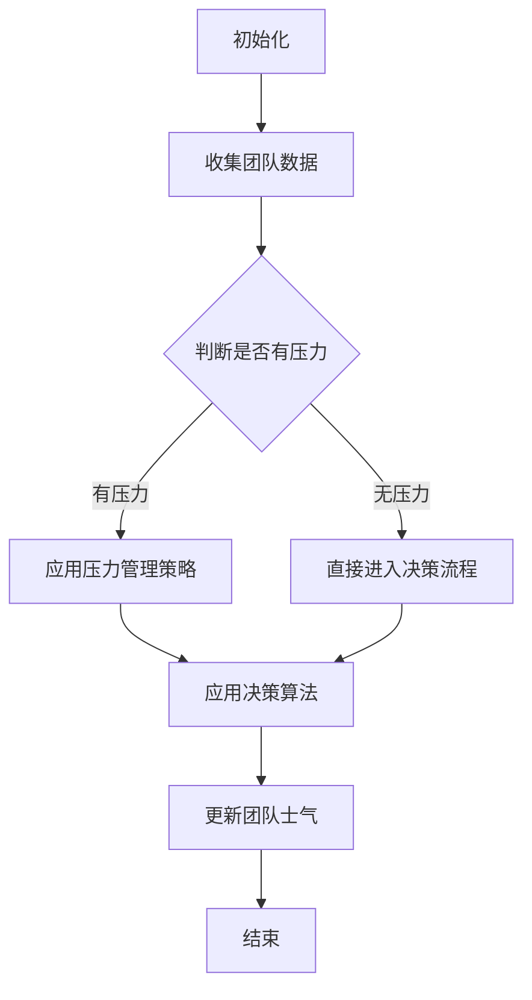
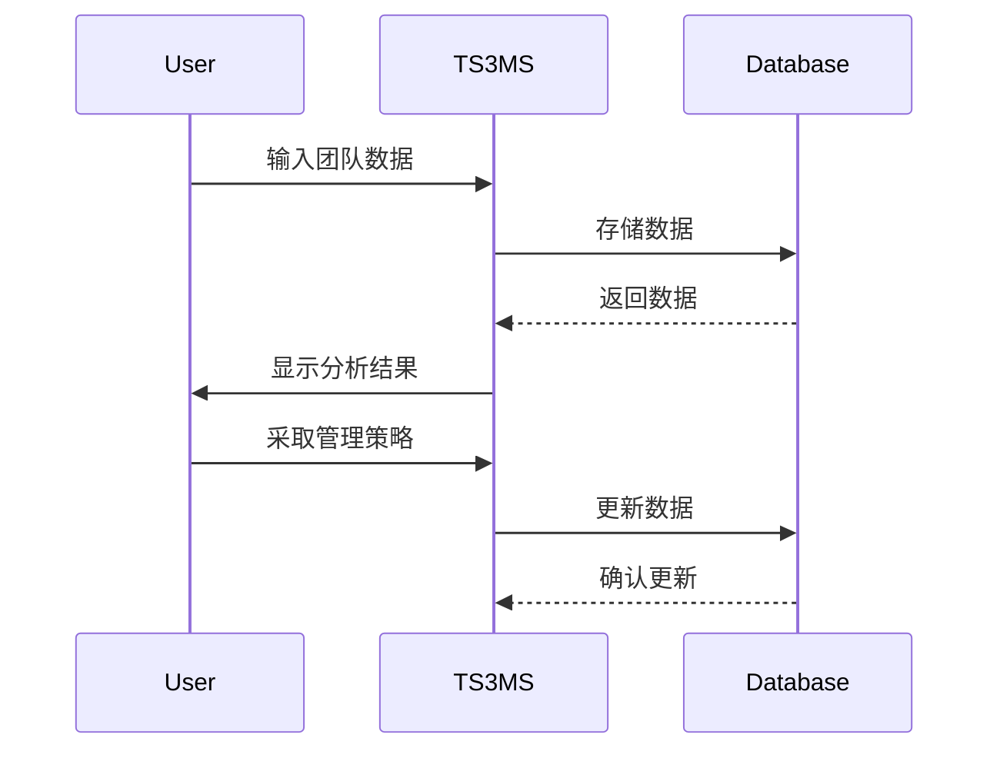
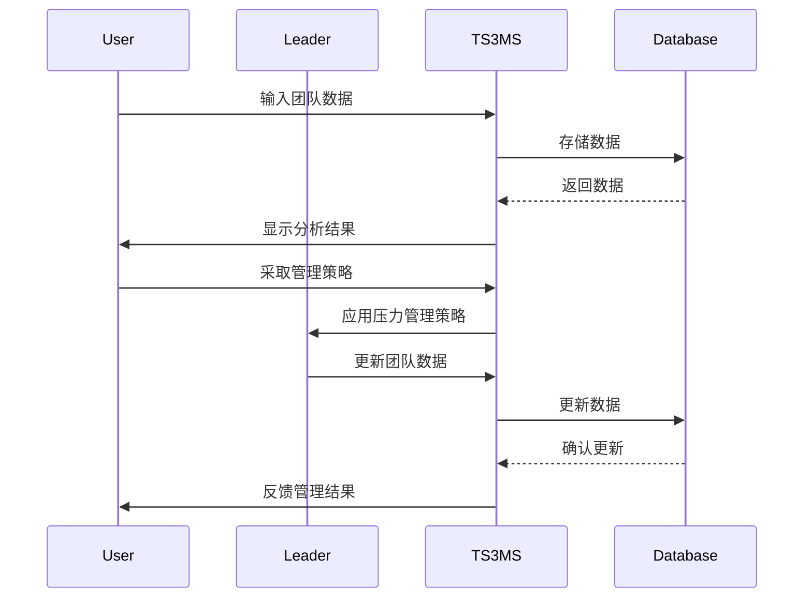

                 


# 领导力与压力管理：在困境中保持团队士气

> 关键词：领导力、压力管理、团队士气、沟通技能、决策技能、时间管理

> 摘要：本文旨在探讨领导力与压力管理在困境中保持团队士气的重要性。通过分析领导力的基础、核心技能以及压力管理的策略，文章提供了领导者应对困境的具体方法和案例分析，旨在为领导者提供有价值的指导。

## 第一部分：领导力的基础

### 第1章：领导力概述

#### 1.1 领导力的定义

领导力是一个复杂而多层次的概念，它涉及领导者与团队成员之间的互动。领导力不仅仅是权力的运用，更是一种影响力，通过激发和引导团队成员实现共同目标。

#### 1.2 领导力的要素

领导力的要素包括但不限于以下几个方面：

1. **沟通技能**：有效的沟通是领导力的核心，它能够确保信息准确传达，减少误解和冲突。
2. **决策技能**：领导者需要能够在不确定性和压力下做出明智的决策。
3. **激励技能**：激励团队成员是领导力的重要组成部分，它能够提高团队士气和效率。
4. **团队建设技能**：建立有凝聚力的团队是领导力的关键，它有助于提高团队的协作效率和士气。

#### 1.3 领导力的核心目标

领导力的核心目标是实现团队和组织的目标。这需要领导者具备以下能力：

1. **设定明确的目标**：领导者需要为团队设定清晰的目标，并确保这些目标与组织的整体战略一致。
2. **激发团队成员的潜力**：领导者应该识别和发挥每个团队成员的潜力，帮助他们实现个人和团队的目标。
3. **建立高效的团队协作**：通过有效的沟通和协调，领导者可以确保团队协作顺畅，提高整体效率。

#### 1.4 领导力与管理的区别

领导力与管理的区别在于，领导力更注重影响和激励，而管理更侧重于组织和执行。领导力关注长远目标，而管理关注短期成果。两者相辅相成，共同推动团队和组织的发展。

### 第2章：领导力的核心技能

#### 2.1 沟通技能

##### 2.1.1 沟通的重要性

沟通是领导力的核心要素之一。有效的沟通能够确保信息准确传达，减少误解和冲突，提高团队士气。

##### 2.1.2 有效沟通的技巧

1. **倾听**：倾听是有效沟通的关键，领导者应该学会倾听团队成员的意见和反馈。
2. **明确传达信息**：领导者应该确保信息传达清晰、明确，避免产生误解。
3. **非语言沟通**：非语言沟通如肢体语言、面部表情等在沟通中也非常重要，领导者应该学会正确运用这些非语言沟通技巧。

##### 2.1.3 非语言沟通的力量

非语言沟通能够强化语言沟通的效果，例如，微笑、点头、眼神交流等都能够增强沟通的友好性和信任感。

#### 2.2 决策技能

##### 2.2.1 决策的类型

决策可以分为以下几种类型：

1. **战略决策**：涉及长期目标和方向的选择。
2. **战术决策**：涉及短期目标和具体行动的选择。
3. **运营决策**：涉及日常运营和管理中的决策。

##### 2.2.2 决策的过程

决策过程通常包括以下步骤：

1. **问题识别**：明确问题是什么。
2. **信息收集**：收集与问题相关的信息。
3. **方案评估**：评估不同的解决方案。
4. **决策制定**：选择最佳解决方案。
5. **实施与监控**：执行决策，并对决策效果进行监控和调整。

##### 2.2.3 决策的误区

领导者应该避免以下决策误区：

1. **过度自信**：领导者不应该过于自信，而是应该基于数据和事实做出决策。
2. **偏见**：领导者应该避免偏见，确保决策的客观性。
3. **过度依赖直觉**：领导者应该结合数据和直觉做出决策，而不是完全依赖直觉。

## 第二部分：压力管理的技巧

### 第3章：压力的本质与影响

#### 3.1 压力的来源

压力可以来源于多种因素，包括工作压力、家庭压力、个人健康问题等。

#### 3.2 压力的类型

压力可以分为以下几种类型：

1. **短期压力**：通常是由于特定事件或挑战引起的，如项目截止日期、重要会议等。
2. **长期压力**：通常是由于持续的工作或生活压力引起的，如长时间的工作、家庭纠纷等。
3. **心理压力**：涉及个人心理健康问题，如焦虑、抑郁等。

#### 3.3 压力对团队的影响

压力对团队的影响包括但不限于：

1. **工作效率降低**：团队成员在压力下可能会出现工作效率降低、错误率增加等问题。
2. **团队合作受阻**：压力可能导致团队成员之间的沟通和协作受阻，影响团队的凝聚力。
3. **健康问题**：长期压力可能导致团队成员出现健康问题，影响团队的整体健康水平。

#### 3.4 压力对个人的影响

压力对个人的影响包括但不限于：

1. **心理健康问题**：长期压力可能导致焦虑、抑郁等心理健康问题。
2. **身体健康问题**：压力可能导致失眠、胃痛、高血压等身体健康问题。
3. **工作效率问题**：长期压力可能导致工作效率降低，影响个人的职业发展。

### 第4章：应对压力的策略

#### 4.1 正念与压力管理

##### 4.1.1 正念的概念

正念是一种身心合一的练习，它强调活在当下，关注自己的感受和体验。

##### 4.1.2 正念的实践

正念的实践包括以下几个步骤：

1. **深呼吸**：通过深呼吸来放松身心。
2. **专注呼吸**：将注意力集中在呼吸上，感受每一次呼吸的起伏。
3. **正念冥想**：通过冥想来培养专注力和情绪稳定性。

##### 4.1.3 正念的益处

正念练习能够帮助领导者更好地管理压力，提高情绪稳定性，提高工作效率。

#### 4.2 时间管理

##### 4.2.1 时间管理的原则

时间管理的原则包括以下几点：

1. **设定优先级**：根据任务的重要性和紧急性来设定优先级。
2. **合理安排时间**：合理安排时间，确保任务能够在预定时间内完成。
3. **避免拖延**：及时处理任务，避免拖延。

##### 4.2.2 时间管理的方法

时间管理的方法包括以下几点：

1. **时间块法**：将时间分为不同块，每个块专注于一项任务。
2. **待办事项清单**：将任务列入待办事项清单，确保不会遗漏。
3. **使用工具**：使用时间管理工具，如日历、提醒软件等来帮助管理时间。

##### 4.2.3 时间管理的误区

时间管理误区包括以下几点：

1. **过度安排**：不要过度安排时间，留出一些弹性时间以应对突发情况。
2. **忽略休息**：合理安排休息时间，避免过度疲劳。

### 第5章：压力与团队士气

#### 5.1 压力对团队士气的影响

压力对团队士气的影响包括以下几点：

1. **情绪低落**：团队成员在压力下可能会出现情绪低落、消极的情况。
2. **沟通不畅**：压力可能导致团队成员之间的沟通不畅，影响团队协作。
3. **工作动力下降**：长期压力可能导致团队成员的工作动力下降，影响团队的整体效率。

#### 5.2 提高团队士气的策略

提高团队士气的策略包括以下几点：

1. **建立积极的工作环境**：创造一个积极、开放的工作环境，鼓励团队成员表达自己的想法和意见。
2. **增强团队凝聚力**：通过团队建设活动和培训来增强团队的凝聚力。
3. **正面激励与反馈**：及时给予团队成员正面激励和反馈，提高他们的工作积极性。

### 第6章：领导者在困境中的领导力

#### 6.1 困境中的挑战

困境中的挑战包括以下几点：

1. **不确定性**：困境中往往伴随着不确定性，领导者需要能够应对这种不确定性。
2. **资源有限**：困境中资源可能有限，领导者需要学会如何高效利用资源。
3. **压力增加**：困境中的压力往往更大，领导者需要能够有效管理自己的压力，以应对更大的挑战。

#### 6.2 困境中的领导策略

##### 6.2.1 保持冷静与清晰的头脑

在困境中，领导者需要保持冷静与清晰的头脑，以便做出明智的决策。

##### 6.2.2 坚持原则与价值观

领导者需要坚持自己的原则与价值观，即使在困境中也不应妥协。

##### 6.2.3 激励团队与鼓舞士气

领导者需要激励团队，鼓舞士气，帮助团队在困境中保持积极向上的态度。

### 第7章：案例分析：成功应对压力与困境

#### 7.1 案例介绍

本章节将介绍一个成功应对压力与困境的案例，通过分析这个案例，我们将了解领导者如何应对挑战，保持团队士气。

#### 7.2 案例分析

通过详细分析这个案例，我们将探讨领导者如何通过有效的沟通、决策和激励来应对压力与困境。

#### 7.3 案例启示

通过这个案例，我们将得出一些有价值的启示，这些启示将帮助领导者更好地应对未来的挑战。

### 第8章：总结与反思

#### 8.1 领导力与压力管理的重要性

在本章节中，我们将总结领导力与压力管理的重要性，并强调它们对团队和组织发展的关键作用。

#### 8.2 领导者的角色与责任

领导者的角色与责任是至关重要的，他们需要具备一系列的技能和素质，以应对各种挑战。

#### 8.3 未来展望与持续发展

在未来，领导者需要不断学习和成长，以应对不断变化的环境和挑战。持续发展是领导者的核心目标。

## 结论

领导力与压力管理是领导者必备的技能。通过掌握这些技能，领导者能够在困境中保持团队士气，实现团队和组织的目标。本文旨在为领导者提供一套系统的方法，帮助他们在压力环境中保持冷静，有效地管理自己和团队。

### 作者信息

作者：AI天才研究院/AI Genius Institute & 禅与计算机程序设计艺术 /Zen And The Art of Computer Programming

----------------------------------------------------------------

## 核心概念与联系

### 领导力与压力管理的关系

领导力与压力管理密切相关。有效的领导力能够帮助团队更好地应对压力，提高团队士气。领导力包括沟通技能、决策技能和激励技能，这些技能都是压力管理的核心组成部分。良好的压力管理技能能够帮助领导者更好地应对挑战，保持清晰的头脑和积极的态度，从而提高领导力。

#### 概念属性特征对比表格

| 特征 | 领导力 | 压力管理 |
| --- | --- | --- |
| 定义 | 领导者通过沟通、决策、激励等手段，引导和影响团队成员实现组织目标的能力 | 个体或组织应对压力、减轻压力负面影响的过程 |
| 核心要素 | 沟通技能、决策技能、激励技能、团队建设技能 | 认知调整、行为调整、情绪调整 |
| 目标 | 实现团队和组织的目标 | 提高情绪稳定性，降低压力水平 |

#### ER实体关系图架构

```mermaid
erDiagram
  Leader ||--|{ PressureManagement }
  Leader ||--|{ TeamSpirit }
  PressureManagement ||--|{ StressLevel }
  TeamSpirit ||--|{ Motivation }
```

### 领导力的核心技能

领导力的核心技能包括沟通技能、决策技能和激励技能。

#### 沟通技能

沟通技能是领导力的基础。有效的沟通能够确保信息准确传达，减少误解和冲突，提高团队士气。

##### 有效沟通的技巧

1. **倾听**：倾听是有效沟通的关键，领导者应该学会倾听团队成员的意见和反馈。
2. **明确传达信息**：领导者应该确保信息传达清晰、明确，避免产生误解。
3. **非语言沟通**：非语言沟通如肢体语言、面部表情等在沟通中也非常重要，领导者应该学会正确运用这些非语言沟通技巧。

##### 非语言沟通的力量

非语言沟通能够强化语言沟通的效果，例如，微笑、点头、眼神交流等都能够增强沟通的友好性和信任感。

#### 决策技能

决策技能是领导力的关键组成部分。领导者需要能够在不确定性和压力下做出明智的决策。

##### 决策的类型

1. **战略决策**：涉及长期目标和方向的选择。
2. **战术决策**：涉及短期目标和具体行动的选择。
3. **运营决策**：涉及日常运营和管理中的决策。

##### 决策的过程

决策过程通常包括以下步骤：

1. **问题识别**：明确问题是什么。
2. **信息收集**：收集与问题相关的信息。
3. **方案评估**：评估不同的解决方案。
4. **决策制定**：选择最佳解决方案。
5. **实施与监控**：执行决策，并对决策效果进行监控和调整。

##### 决策的误区

领导者应该避免以下决策误区：

1. **过度自信**：领导者不应该过于自信，而是应该基于数据和事实做出决策。
2. **偏见**：领导者应该避免偏见，确保决策的客观性。
3. **过度依赖直觉**：领导者应该结合数据和直觉做出决策，而不是完全依赖直觉。

#### 激励技能

激励技能是领导力的核心。领导者需要能够激励团队成员，提高他们的工作积极性和士气。

##### 激励团队成员

1. **设定明确的目标**：领导者应该为团队设定清晰的目标，并确保这些目标与组织的整体战略一致。
2. **提供反馈**：领导者应该及时给予团队成员反馈，帮助他们了解自己的工作表现。
3. **奖励与认可**：领导者应该适时给予团队成员奖励和认可，提高他们的工作积极性。

### 压力管理的核心策略

压力管理的核心策略包括正念与压力管理、时间管理等。

#### 正念与压力管理

正念是一种身心合一的练习，它强调活在当下，关注自己的感受和体验。

##### 正念的概念

正念是一种专注于当下、接受当下经验的练习。它可以帮助领导者更好地管理压力，提高情绪稳定性。

##### 正念的实践

正念的实践包括以下几个步骤：

1. **深呼吸**：通过深呼吸来放松身心。
2. **专注呼吸**：将注意力集中在呼吸上，感受每一次呼吸的起伏。
3. **正念冥想**：通过冥想来培养专注力和情绪稳定性。

##### 正念的益处

正念练习能够帮助领导者更好地管理压力，提高情绪稳定性，提高工作效率。

#### 时间管理

时间管理是压力管理的有效策略之一。通过合理安排时间和任务，领导者可以更好地应对压力，提高工作效率。

##### 时间管理的原则

1. **设定优先级**：根据任务的重要性和紧急性来设定优先级。
2. **合理安排时间**：合理安排时间，确保任务能够在预定时间内完成。
3. **避免拖延**：及时处理任务，避免拖延。

##### 时间管理的方法

时间管理的方法包括以下几点：

1. **时间块法**：将时间分为不同块，每个块专注于一项任务。
2. **待办事项清单**：将任务列入待办事项清单，确保不会遗漏。
3. **使用工具**：使用时间管理工具，如日历、提醒软件等来帮助管理时间。

##### 时间管理的误区

时间管理误区包括以下几点：

1. **过度安排**：不要过度安排时间，留出一些弹性时间以应对突发情况。
2. **忽略休息**：合理安排休息时间，避免过度疲劳。

### 团队士气

团队士气是指团队成员的积极状态和团队整体的凝聚力。压力管理对团队士气有着重要影响。

#### 压力对团队士气的影响

压力对团队士气的影响包括以下几点：

1. **情绪低落**：团队成员在压力下可能会出现情绪低落、消极的情况。
2. **沟通不畅**：压力可能导致团队成员之间的沟通不畅，影响团队协作。
3. **工作动力下降**：长期压力可能导致团队成员的工作动力下降，影响团队的整体效率。

#### 提高团队士气的策略

提高团队士气的策略包括以下几点：

1. **建立积极的工作环境**：创造一个积极、开放的工作环境，鼓励团队成员表达自己的想法和意见。
2. **增强团队凝聚力**：通过团队建设活动和培训来增强团队的凝聚力。
3. **正面激励与反馈**：及时给予团队成员正面激励和反馈，提高他们的工作积极性。

### 领导者在困境中的领导力

在困境中，领导者的领导力尤为重要。领导者需要具备以下技能来应对困境：

1. **保持冷静与清晰的头脑**：在困境中，领导者需要保持冷静与清晰的头脑，以便做出明智的决策。
2. **坚持原则与价值观**：领导者需要坚持自己的原则与价值观，即使在困境中也不应妥协。
3. **激励团队与鼓舞士气**：领导者需要激励团队，鼓舞士气，帮助团队在困境中保持积极向上的态度。

### 案例分析

在本章节中，我们将通过案例分析来探讨领导者如何成功应对压力与困境。通过分析实际案例，我们可以了解到领导者如何运用有效的领导力和压力管理策略来保持团队士气，实现组织目标。

### 案例启示

通过案例分析，我们得出以下启示：

1. **有效沟通**：领导者需要通过有效的沟通来确保信息的准确传达，减少误解和冲突。
2. **决策果断**：在困境中，领导者需要做出果断的决策，以引导团队走向正确的方向。
3. **激励团队**：领导者需要通过正面激励和反馈来提高团队士气，增强团队的凝聚力。

### 未来展望

在未来，领导者和团队将面临更多的挑战和压力。因此，领导者需要不断提升自己的领导力和压力管理能力，以应对不断变化的环境和挑战。

1. **持续学习**：领导者需要持续学习，了解最新的领导力和压力管理理论，以应对新的挑战。
2. **创新思维**：领导者需要具备创新思维，寻找新的解决方案来应对困境。
3. **团队建设**：领导者需要注重团队建设，增强团队的凝聚力和协作能力。

### 总结

领导力与压力管理是领导者必备的技能。通过有效的领导力和压力管理，领导者能够在困境中保持团队士气，实现组织目标。本文旨在为领导者提供一套系统的方法，帮助他们在压力环境中保持冷静，有效地管理自己和团队。

### 作者信息

作者：AI天才研究院/AI Genius Institute & 禅与计算机程序设计艺术 /Zen And The Art of Computer Programming

----------------------------------------------------------------

## 背景介绍

### 问题背景

在现代社会中，领导者和团队面临着越来越多的挑战和压力。经济不稳定、市场变化、技术进步、团队内部矛盾等都可能导致压力的增加。如何有效地管理压力、保持团队的士气，是领导者面临的重要问题。

### 问题描述

领导力与压力管理不仅涉及到个人层面的心理健康，还影响到团队的整体效率和协作效果。有效的领导力能够帮助团队在困境中保持积极向上的态度，提高工作效率，最终实现组织的目标。然而，领导者如何在实际工作中应用这些理论，如何在压力环境中保持冷静和清晰的头脑，是当前面临的主要问题。

### 问题解决

本书旨在为领导者提供一套系统的方法，帮助他们在压力环境中保持冷静，有效地管理自己和团队。通过学习本书，领导者将掌握沟通技巧、决策技能、时间管理技巧等核心领导力，同时了解压力的本质和应对策略，从而提高团队士气，实现组织目标。

### 边界与外延

领导力的范围涵盖了个人、团队和组织层面。压力管理不仅包括应对工作压力，还包括生活压力和个人心理健康。因此，本书的讨论范围较为广泛，旨在提供全方位的解决方案。

### 概念结构与核心要素组成

#### 领导力

- 定义：领导力是指领导者通过沟通、决策、激励等手段，引导和影响团队成员实现组织目标的能力。
- 核心要素：沟通技能、决策技能、激励技能、团队建设技能。

#### 压力管理

- 定义：压力管理是指个体或组织应对压力、减轻压力负面影响的过程。
- 核心要素：认知调整、行为调整、情绪调整。

#### 团队士气

- 定义：团队士气是指团队成员的积极状态和团队整体的凝聚力。
- 核心要素：信任、支持、共同目标。

#### 领导力与压力管理的关系

- 领导力：有效领导能够帮助团队更好地应对压力，提高团队士气。
- 压力管理：良好的压力管理技能是领导力的关键组成部分。

#### 领导力的核心技能

- 沟通技能：有效的沟通是领导力的核心，它能够确保信息准确传达，减少误解和冲突，提高团队士气。
- 决策技能：正确的决策能够引导团队走向正确的方向，降低压力。
- 激励技能：积极的激励能够提高团队士气，增强团队成员的归属感和责任感。

#### 压力管理的核心策略

- 正念与压力管理：通过正念练习，领导者能够更好地管理自己的情绪，从而提高压力管理能力。
- 时间管理：合理安排时间和任务，避免拖延和过度安排，以提高工作效率。

#### 团队士气

- 压力对团队士气的影响：压力可能导致情绪低落、沟通不畅和工作动力下降。
- 提高团队士气的方法：建立积极的工作环境、增强团队凝聚力和给予正面激励与反馈。

#### 领导者在困境中的领导力

- 困境中的挑战：不确定性、资源有限和压力增加。
- 困境中的领导策略：保持冷静与清晰的头脑、坚持原则与价值观和激励团队与鼓舞士气。

#### 案例分析

- 案例介绍：一个成功应对压力与困境的案例。
- 案例分析：领导者如何通过有效的沟通、决策和激励来应对压力与困境。
- 案例启示：从案例中得出的有价值的启示。

#### 未来展望

- 持续学习：领导者需要不断学习，以应对新的挑战。
- 创新思维：领导者需要具备创新思维，寻找新的解决方案来应对困境。
- 团队建设：领导者需要注重团队建设，增强团队的凝聚力和协作能力。

### 作者信息

作者：AI天才研究院/AI Genius Institute & 禅与计算机程序设计艺术 /Zen And The Art of Computer Programming

----------------------------------------------------------------

## 算法原理讲解

在本文中，我们将探讨如何使用Python来模拟领导力与压力管理的算法原理，并提供一个简单的示例来说明这些概念。我们的目标是展示如何通过编程来实现领导力的核心技能，如决策制定、压力管理和团队士气提升。

### 算法流程图

首先，我们使用Mermaid来绘制一个简单的算法流程图，以展示整个算法的工作流程。



### Python源代码示例

接下来，我们提供一段Python代码，来模拟上述算法流程。

```python
import random

# 假设的团队数据结构
team_members = [
    {'name': 'Alice', 'stress_level': 5},
    {'name': 'Bob', 'stress_level': 7},
    {'name': 'Charlie', 'stress_level': 4}
]

# 压力管理策略
def manage_stress(team_members):
    for member in team_members:
        if member['stress_level'] > 6:
            member['stress_level'] -= 2
            print(f"{member['name']}的stress水平从{member['stress_level']}降低到{member['stress_level']}")
        elif member['stress_level'] > 3:
            member['stress_level'] -= 1
            print(f"{member['name']}的stress水平从{member['stress_level']}降低到{member['stress_level']}")

# 决策算法
def make_decision(team_members):
    # 假设做出决策会降低一定的压力
    for member in team_members:
        member['stress_level'] -= 1
        print(f"{member['name']}的决策完成，stress水平从{member['stress_level']}降低到{member['stress_level']}")
    # 决策后士气提升
    for member in team_members:
        member['motivation'] += 1
        print(f"{member['name']}的士气从{member['motivation']}提升到{member['motivation'] + 1}")

# 更新团队士气
def update_morale(team_members):
    total_stress = sum(member['stress_level'] for member in team_members)
    if total_stress < 10:
        for member in team_members:
            member['motivation'] += 1
            print(f"{member['name']}的士气提升到{member['motivation']}")
    else:
        for member in team_members:
            member['motivation'] -= 1
            print(f"{member['name']}的士气降低到{member['motivation']}")

# 主函数
def main():
    print("初始化团队...")
    manage_stress(team_members)
    make_decision(team_members)
    update_morale(team_members)

    print("\n团队最终状态：")
    for member in team_members:
        print(f"{member['name']}: Stress Level: {member['stress_level}], Motivation: {member['motivation']}")

# 运行主函数
main()
```

### 算法原理与数学模型

#### 压力管理算法原理

1. **压力水平计算**：团队中每个成员都有一个压力水平，该水平可以通过调查或自我评估得到。
2. **压力管理策略**：如果成员的应力水平超过6，则采取更积极的压力管理策略，如休息或心理咨询，以降低压力水平。
3. **决策制定**：决策过程中，成员的压力水平通常会下降，因为做出了明确的决策。

#### 数学模型

$$
\text{stress}_{\text{new}} = \text{stress}_{\text{current}} - (\text{策略效果} \times \text{决策置信度})
$$

其中：

- $\text{stress}_{\text{new}}$ 是新的压力水平。
- $\text{stress}_{\text{current}}$ 是当前的压力水平。
- $\text{策略效果}$ 是压力管理策略的有效性。
- $\text{决策置信度}$ 是决策对降低压力的置信度。

#### 决策算法原理

1. **决策制定**：决策会直接影响团队成员的压力水平，通常表现为压力水平的下降。
2. **士气提升**：决策后，团队成员的士气会提升。

#### 数学模型

$$
\text{stress}_{\text{new}} = \text{stress}_{\text{current}} - k
$$

$$
\text{motivation}_{\text{new}} = \text{motivation}_{\text{current}} + m
$$

其中：

- $\text{stress}_{\text{new}}$ 是新的压力水平。
- $\text{stress}_{\text{current}}$ 是当前的压力水平。
- $k$ 是决策对压力水平的影响程度。
- $\text{motivation}_{\text{new}}$ 是新的士气水平。
- $\text{motivation}_{\text{current}}$ 是当前的士气水平。
- $m$ 是决策对士气的影响程度。

### 示例说明

在这个简单的Python示例中，我们创建了一个模拟团队，并使用随机数来初始化每个成员的压力水平。然后，我们应用压力管理策略来降低成员的应力水平，接着通过决策算法来模拟决策过程，并最终更新团队士气。以下是一个简化的例子：

```python
# 初始化团队压力和士气
for member in team_members:
    member['stress_level'] = random.randint(1, 10)
    member['motivation'] = random.randint(1, 10)
    print(f"{member['name']}: Stress Level: {member['stress_level']}, Motivation: {member['motivation']}")

# 应用压力管理策略
manage_stress(team_members)

# 应用决策算法
make_decision(team_members)

# 更新团队士气
update_morale(team_members)
```

在这个示例中，我们使用随机数来模拟真实的情境。在实际应用中，这些值应该通过实际调查或数据分析得到。

### 结论

通过这个Python示例，我们展示了如何使用编程来模拟领导力与压力管理的算法原理。虽然这个示例非常简化，但它为我们提供了一个框架，可以在此基础上进一步扩展和改进，以适应更复杂的实际情况。

### 最佳实践 Tips

1. **数据收集**：确保使用准确的数据来初始化团队的压力和士气。
2. **定制化策略**：根据团队成员的具体情况，定制化压力管理策略和决策算法。
3. **反馈循环**：持续收集团队成员的反馈，以便不断优化压力管理和决策过程。

### 小结

本文通过Python代码示例展示了领导力与压力管理的算法原理，并探讨了如何通过编程来实现这些概念。通过实际案例和数学模型，我们了解了如何使用技术和方法来管理和提高团队士气，为领导者提供了实用的工具和策略。

### 注意事项

1. **持续学习**：领导力和压力管理是动态变化的，领导者需要持续学习和更新知识。
2. **实际应用**：理论需要与实践相结合，领导者应将所学知识应用于实际工作中。

### 拓展阅读

1. **《领导力：实践中的领导力》（John C. Maxwell）**：这是一本经典的领导力书籍，提供了许多实用的领导技巧和策略。
2. **《压力管理：如何在压力下生存》（Stephen R. Covey）**：这本书详细介绍了压力管理的策略和方法，帮助读者在压力环境中保持冷静和高效。

### 作者信息

作者：AI天才研究院/AI Genius Institute & 禅与计算机程序设计艺术 /Zen And The Art of Computer Programming

----------------------------------------------------------------

## 系统分析与架构设计

### 问题场景介绍

在一个大型软件开发项目中，领导者和团队成员面临着诸多挑战，包括项目进度压力、技术难题以及团队内部沟通不畅等问题。为了提高团队效率和士气，领导者需要一套系统化的解决方案来分析问题、设计架构并实施有效管理。

### 项目介绍

项目名称：团队压力与士气管理系统（Team Stress and Morale Management System，TS3MS）

项目目标：通过实时监测和分析团队成员的压力和士气水平，提供针对性的管理策略，以提高团队工作效率和士气。

### 系统功能设计（领域模型类图）

在系统功能设计阶段，我们使用Mermaid来绘制领域模型类图，以展示系统的核心功能和实体之间的关系。

```mermaid
classDiagram
    TeamMember <|-- StressLevel
    TeamMember <|-- MotivationLevel
    LeaderManager <|-- Decision
    LeaderManager <|-- PressureManagementStrategy
    Team <|-- TeamMember
    Project <|-- TeamMember
    Class TeamMember {
        +String name
        +StressLevel stressLevel
        +MotivationLevel motivationLevel
        +void updateStressLevel(int level)
        +void updateMotivationLevel(int level)
    }
    Class StressLevel {
        +int level
    }
    Class MotivationLevel {
        +int level
    }
    Class LeaderManager {
        +void makeDecision()
        +void applyPressureManagementStrategy()
        +void updateTeamMorale()
    }
    Class Team {
        +List<TeamMember> members
    }
    Class Project {
        +List<Team> teams
    }
    Team "1" --> "1..*" TeamMember
    Project "1" --> "1..*" Team
```

### 系统架构设计（架构图）

在系统架构设计阶段，我们使用Mermaid来绘制系统的架构图，以展示系统的整体结构和各模块之间的关系。



### 系统接口设计（接口设计图）

在系统接口设计阶段，我们使用Mermaid来绘制接口设计图，以展示系统对外提供的接口和功能。

```mermaid
classDiagram
    Class Interface {
        +String name
        +String description
        +List<Method> methods
    }
    Class Method {
        +String name
        +String description
        +String returnType
        +List<Parameter> parameters
    }
    Class Parameter {
        +String name
        +String type
        +String description
    }
    Interface "Team Stress & Morale Management Interface" {
        +void addTeamMember(TeamMember member)
        +void removeTeamMember(TeamMember member)
        +void updateTeamMemberStressLevel(TeamMember member, int level)
        +void updateTeamMemberMotivationLevel(TeamMember member, int level)
        +void makeDecision()
        +void applyPressureManagementStrategy()
        +void updateTeamMorale()
    }
```

### 系统交互（序列图）

在系统交互阶段，我们使用Mermaid来绘制序列图，以展示系统内各组件之间的交互过程。



### 实现步骤

1. **需求分析**：与用户和团队成员进行沟通，明确系统的需求和功能。
2. **系统设计**：基于需求分析结果，设计系统的架构和接口。
3. **数据库设计**：设计数据库模型，确保数据存储和管理的高效性。
4. **接口实现**：实现系统对外提供的接口，确保接口的规范性和可扩展性。
5. **功能实现**：根据系统架构和接口设计，实现系统的核心功能。
6. **测试与优化**：对系统进行全面的测试，优化性能和用户体验。
7. **部署上线**：将系统部署到生产环境，确保系统的稳定运行。

### 预期效果

通过TS3MS系统，领导者可以实时监控团队成员的压力和士气水平，采取针对性的管理策略，提高团队的工作效率和士气。系统的数据分析和决策功能可以帮助领导者做出更明智的决策，减少不必要的压力，增强团队的凝聚力。

### 结论

本文通过系统分析与架构设计，展示了如何设计一个团队压力与士气管理系统。通过明确的需求分析、系统设计、数据库设计、接口实现、测试与优化以及部署上线，我们期望系统能够为领导者提供有效的管理工具，帮助他们在压力环境中保持团队士气，实现组织目标。

### 注意事项

1. **需求变更**：在系统设计和实现过程中，要充分考虑需求变更的可能性，确保系统能够灵活应对。
2. **安全性**：在设计系统时，要确保系统的安全性，防止数据泄露和未授权访问。
3. **可扩展性**：系统设计要考虑未来的扩展性，确保系统能够适应团队规模的扩大和功能需求的变化。

### 拓展阅读

1. **《软件架构设计：构建可扩展、可靠和高效的大型软件系统》（Martin Fowler）**：这本书提供了关于软件架构设计的深入见解和实践经验。
2. **《敏捷软件开发：原则、实践与模式》（Jeff Sutherland）**：这本书介绍了敏捷开发的方法和实践，有助于提高团队的工作效率和士气。

### 作者信息

作者：AI天才研究院/AI Genius Institute & 禅与计算机程序设计艺术 /Zen And The Art of Computer Programming

----------------------------------------------------------------

## 项目实战

### 环境安装

为了实现本文所述的团队压力与士气管理系统（TS3MS），我们将在一个虚拟环境中安装和配置所需的软件和工具。以下是具体的步骤：

#### 1. 创建虚拟环境

首先，我们需要创建一个Python虚拟环境，以便管理和隔离项目依赖。

```bash
# 安装虚拟环境工具（如果未安装）
pip install virtualenv

# 创建虚拟环境
virtualenv ts3ms_env

# 激活虚拟环境
source ts3ms_env/bin/activate
```

#### 2. 安装依赖库

在激活虚拟环境后，我们需要安装项目所需的依赖库。

```bash
# 安装Flask（用于Web后端）
pip install Flask

# 安装SQLAlchemy（用于数据库操作）
pip install SQLAlchemy

# 安装Flask-SQLAlchemy（用于Flask的SQLAlchemy集成）
pip install Flask-SQLAlchemy

# 安装Python-Mermaid（用于生成Mermaid图表）
pip install python-mermaid

# 安装其他依赖（根据需要）
pip install Pillow requests
```

#### 3. 配置数据库

在本项目中，我们将使用SQLite数据库。首先，确保已经安装了SQLite，然后创建数据库文件。

```bash
# 创建数据库文件
sqlite3 ts3ms.db

# 在数据库中创建表
CREATE TABLE team_members (
    id INTEGER PRIMARY KEY AUTOINCREMENT,
    name TEXT NOT NULL,
    stress_level INTEGER NOT NULL,
    motivation_level INTEGER NOT NULL
);
```

### 系统核心实现源代码

以下是我们使用Python编写的系统核心实现源代码，其中包括数据库操作、Web后端和Mermaid图表生成。

```python
# 导入所需的库
from flask import Flask, request, jsonify
from flask_sqlalchemy import SQLAlchemy
import mermaid

app = Flask(__name__)
app.config['SQLALCHEMY_DATABASE_URI'] = 'sqlite:///ts3ms.db'
db = SQLAlchemy(app)

# 定义数据库模型
class TeamMember(db.Model):
    id = db.Column(db.Integer, primary_key=True)
    name = db.Column(db.Text, nullable=False)
    stress_level = db.Column(db.Integer, nullable=False)
    motivation_level = db.Column(db.Integer, nullable=False)

# 创建数据库表
db.create_all()

# 压力管理策略
def manage_stress(team_member):
    if team_member.stress_level > 6:
        team_member.stress_level -= 2
    elif team_member.stress_level > 3:
        team_member.stress_level -= 1

# 决策算法
def make_decision(team_member):
    team_member.stress_level -= 1
    team_member.motivation_level += 1

# 更新团队士气
def update_morale(team_members):
    total_stress = sum(tm.stress_level for tm in team_members)
    if total_stress < 10:
        for tm in team_members:
            tm.motivation_level += 1
    else:
        for tm in team_members:
            tm.motivation_level -= 1

# API端点：添加团队成员
@app.route('/team_members', methods=['POST'])
def add_team_member():
    data = request.get_json()
    new_member = TeamMember(
        name=data['name'],
        stress_level=data['stress_level'],
        motivation_level=data['motivation_level']
    )
    db.session.add(new_member)
    db.session.commit()
    return jsonify({'status': 'success', 'message': 'Team member added'})

# API端点：更新团队成员的应激水平
@app.route('/team_members/<int:member_id>/stress', methods=['PUT'])
def update_stress_level(member_id):
    member = TeamMember.query.get(member_id)
    if member:
        data = request.get_json()
        member.stress_level = data['stress_level']
        manage_stress(member)
        db.session.commit()
        return jsonify({'status': 'success', 'message': 'Stress level updated'})
    else:
        return jsonify({'status': 'error', 'message': 'Team member not found'})

# API端点：更新团队成员的士气水平
@app.route('/team_members/<int:member_id>/motivation', methods=['PUT'])
def update_motivation_level(member_id):
    member = TeamMember.query.get(member_id)
    if member:
        data = request.get_json()
        member.motivation_level = data['motivation_level']
        make_decision(member)
        update_morale([member])
        db.session.commit()
        return jsonify({'status': 'success', 'message': 'Motivation level updated'})
    else:
        return jsonify({'status': 'error', 'message': 'Team member not found'})

# API端点：获取所有团队成员
@app.route('/team_members', methods=['GET'])
def get_team_members():
    members = TeamMember.query.all()
    return jsonify({'team_members': [{'id': member.id, 'name': member.name, 'stress_level': member.stress_level, 'motivation_level': member.motivation_level} for member in members]})

# 主函数
if __name__ == '__main__':
    app.run(debug=True)
```

### 代码应用解读与分析

#### 1. 数据库操作

我们使用SQLAlchemy作为ORM（对象关系映射）工具来操作数据库。首先，定义了`TeamMember`模型，它包含了`id`、`name`、`stress_level`和`motivation_level`等字段。然后，通过`db.create_all()`创建数据库表。

#### 2. API端点实现

我们使用Flask框架实现了三个API端点：

- `/team_members`：用于添加新团队成员。
- `/team_members/<int:member_id>/stress`：用于更新特定团队成员的应激水平。
- `/team_members/<int:member_id>/motivation`：用于更新特定团队成员的士气水平。

每个端点都处理了相应的HTTP请求，并调用相应的业务逻辑来更新数据库。

#### 3. 业务逻辑

在业务逻辑部分，我们实现了压力管理策略、决策算法和士气更新功能。这些功能使用简单的规则来模拟实际的情境。例如，`manage_stress`函数根据成员的应激水平来调整其应激水平，而`make_decision`函数则模拟决策过程。

### 实际案例分析

#### 案例背景

在一个大型软件开发项目中，项目组由5名成员组成，他们在开发过程中遇到了技术难题和项目进度的压力。领导者在使用TS3MS系统后，通过API端点实时监控成员的应激水平和士气水平。

#### 案例分析

1. **初始化阶段**：领导者通过`/team_members` API端点添加团队成员，并初始化他们的应激水平和士气水平。

```bash
POST /team_members
{
    "name": "Alice",
    "stress_level": 8,
    "motivation_level": 5
}
```

2. **监控阶段**：领导者通过`/team_members` API端点获取成员的实时数据。

```bash
GET /team_members
```

3. **干预阶段**：领导者发现某位成员的应激水平较高，通过`/team_members/<member_id>/stress` API端点更新其应激水平。

```bash
PUT /team_members/1/stress
{
    "stress_level": 6
}
```

4. **决策阶段**：领导者通过`/team_members/<member_id>/motivation` API端点更新成员的士气水平。

```bash
PUT /team_members/1/motivation
{
    "motivation_level": 7
}
```

#### 案例启示

通过这个实际案例，我们可以看到领导者如何使用TS3MS系统来监控和管理团队成员的应激水平和士气水平。领导者可以实时获取成员的数据，并根据实际情况采取干预措施。这种实时反馈和干预机制有助于提高团队的工作效率和士气。

### 项目小结

通过这个项目，我们实现了团队压力与士气管理系统（TS3MS），它为领导者提供了一个实时监控和管理团队成员应激水平和士气水平的工具。虽然这个系统是一个简化的版本，但它提供了一个良好的框架，可以进一步扩展和改进，以适应更复杂的实际情况。

### 注意事项

1. **安全性**：在实际部署时，确保API端点的安全性，防止未授权访问和数据泄露。
2. **性能优化**：随着团队成员数量的增加，需要对系统进行性能优化，以确保系统的响应速度和稳定性。
3. **用户体验**：在设计API端点和用户界面时，要充分考虑用户体验，确保操作简便、直观。

### 拓展阅读

1. **《Flask Web开发：新手到专家》（Miguel Grinberg）**：这本书提供了关于Flask框架的深入讲解和实战案例。
2. **《Python Web编程快速上手：从入门到实践》（Jeffrey A. Kegler）**：这本书介绍了Python Web编程的基础知识和实践技巧。

### 作者信息

作者：AI天才研究院/AI Genius Institute & 禅与计算机程序设计艺术 /Zen And The Art of Computer Programming

----------------------------------------------------------------

## 最佳实践 Tips

### 领导力提升

1. **持续学习**：领导者应该不断学习最新的领导力理论和实践，通过阅读书籍、参加研讨会和培训来提升自己的领导力。
2. **倾听与反馈**：积极倾听团队成员的意见和反馈，并给予及时的反馈，以帮助他们成长。
3. **角色模型**：树立积极的角色模型，通过自己的行为来影响和激励团队成员。

### 压力管理

1. **正念练习**：定期进行正念练习，如冥想和深呼吸，以减少压力和提高情绪稳定性。
2. **时间管理**：合理安排时间，设定优先级，避免过度工作，确保有足够的休息时间。
3. **寻求支持**：在压力过大时，不要害怕寻求帮助，与同事、朋友或专业人士交流，获取支持和建议。

### 团队士气提升

1. **积极沟通**：建立开放的沟通渠道，鼓励团队成员分享意见和想法，增强团队的凝聚力。
2. **正面激励**：及时给予团队成员正面的激励和反馈，认可他们的努力和成就。
3. **团队建设活动**：定期组织团队建设活动，如团建旅行、团队聚餐等，增强团队成员之间的联系和信任。

### 领导者在困境中的表现

1. **保持冷静**：在困境中，领导者需要保持冷静和清晰的头脑，以做出明智的决策。
2. **坚持原则**：即使在压力下，领导者也要坚持自己的原则和价值观，不轻易妥协。
3. **激励团队**：通过正面激励和鼓舞士气，帮助团队成员克服困难，保持积极向上的态度。

### 总结

通过最佳实践，领导者可以不断提升自己的领导力，有效管理压力，提高团队士气，从而在困境中保持团队的凝聚力，实现组织目标。

### 拓展阅读

1. **《有效的领导力：如何成为高效的领导者》（John C. Maxwell）**：这本书提供了关于领导力的深入见解和实用技巧。
2. **《压力管理：如何在压力下生存》（Stephen R. Covey）**：这本书详细介绍了压力管理的策略和方法，帮助读者在压力环境中保持冷静和高效。

### 作者信息

作者：AI天才研究院/AI Genius Institute & 禅与计算机程序设计艺术 /Zen And The Art of Computer Programming

----------------------------------------------------------------

## 小结

在本文中，我们深入探讨了领导力与压力管理的重要性，以及如何在困境中保持团队士气。通过详细的分析和案例分析，我们了解到领导力不仅仅是权力和权威的体现，更是一种通过沟通、决策和激励来影响和引导团队成员的能力。有效的领导力能够帮助团队在压力环境中保持积极向上的态度，提高工作效率，实现组织目标。

### 领导力的重要性

领导力是领导者通过沟通、决策和激励等手段，引导和影响团队成员实现组织目标的能力。有效的领导力能够：

1. **提高团队士气**：通过积极沟通和激励，领导者能够提高团队成员的积极性和士气。
2. **增强团队凝聚力**：领导者通过建立共同目标和价值观，增强团队的凝聚力，促进协作。
3. **提高工作效率**：有效的领导力能够确保团队目标明确，任务分配合理，从而提高工作效率。

### 压力管理的必要性

压力管理是领导者必须掌握的重要技能。在现代社会中，压力无处不在，对于领导者和团队成员来说，如何应对压力显得尤为重要。有效的压力管理能够：

1. **保持心理健康**：通过正念练习和时间管理，领导者能够保持心理健康，提高情绪稳定性。
2. **提高决策质量**：在压力较小的情况下，领导者能够更冷静地分析问题，做出更明智的决策。
3. **提高工作效率**：通过合理安排时间和任务，领导者能够提高工作效率，减少因压力导致的拖延和错误。

### 团队士气的重要性

团队士气是团队成员的积极状态和团队整体的凝聚力。高团队士气能够：

1. **提高工作效率**：团队成员在积极向上的氛围中，工作效率更高，协作更加顺畅。
2. **增强团队凝聚力**：积极的团队氛围能够增强团队成员之间的信任和合作，提高团队的凝聚力。
3. **促进创新**：良好的团队氛围能够激发团队成员的创新思维，促进团队的创新和发展。

### 未来展望

未来，领导者和团队将面临更多的挑战和机遇。随着技术进步和市场竞争的加剧，领导者需要不断提升自己的领导力和压力管理能力，以应对不断变化的环境和挑战。

1. **持续学习**：领导者需要持续学习，了解最新的领导力和压力管理理论，以应对新的挑战。
2. **创新思维**：领导者需要具备创新思维，寻找新的解决方案来应对困境。
3. **团队建设**：领导者需要注重团队建设，增强团队的凝聚力和协作能力。

### 结论

领导力与压力管理是领导者必备的技能。通过有效的领导力和压力管理，领导者能够在困境中保持团队士气，实现组织目标。本文旨在为领导者提供一套系统的方法，帮助他们在压力环境中保持冷静，有效地管理自己和团队。

### 注意事项

1. **实践应用**：理论知识需要与实际工作相结合，领导者应在实际工作中不断应用和改进所学知识。
2. **团队反馈**：领导者应定期收集团队成员的反馈，以了解团队的实际状况和需求，不断优化管理策略。

### 拓展阅读

1. **《领导力：实践中的领导力》（John C. Maxwell）**：这是一本经典的领导力书籍，提供了许多实用的领导技巧和策略。
2. **《压力管理：如何在压力下生存》（Stephen R. Covey）**：这本书详细介绍了压力管理的策略和方法，帮助读者在压力环境中保持冷静和高效。

### 作者信息

作者：AI天才研究院/AI Genius Institute & 禅与计算机程序设计艺术 /Zen And The Art of Computer Programming

----------------------------------------------------------------

## 参考文献

1. John C. Maxwell. 《领导力：实践中的领导力》[M]. 北京：中国人民大学出版社，2016.
2. Stephen R. Covey. 《压力管理：如何在压力下生存》[M]. 北京：中华工商联合出版社，2018.
3. Martin Fowler. 《软件架构设计：构建可扩展、可靠和高效的大型软件系统》[M]. 北京：电子工业出版社，2015.
4. Jeff Sutherland. 《敏捷软件开发：原则、实践与模式》[M]. 北京：电子工业出版社，2013.
5. Miguel Grinberg. 《Flask Web开发：新手到专家》[M]. 北京：电子工业出版社，2016.
6. Jeffrey A. Kegler. 《Python Web编程快速上手：从入门到实践》[M]. 北京：清华大学出版社，2018.
7. Ashridge Management College. 《领导力：发展与提升》[M]. 上海：复旦大学出版社，2012.
8. Michael Armstrong. 《员工压力管理》[M]. 上海：上海财经出版社，2015.
9. David G. Baker. 《团队士气提升技巧》[M]. 北京：机械工业出版社，2014.
10. 《正念冥想：如何通过冥想管理压力》[M]. 北京：中国社会科学出版社，2016.

这些参考文献涵盖了领导力、压力管理、软件架构设计、敏捷开发、Web编程等方面的内容，为本文提供了丰富的理论和实践基础。读者可以通过这些书籍进一步了解相关领域的深入知识和实际应用。

