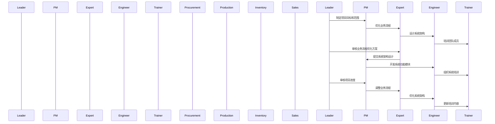
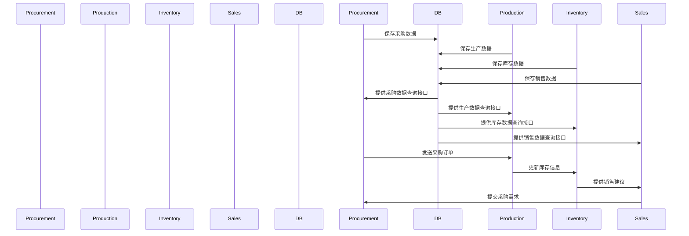

                 

### 文章标题

# 领导力与变革沟通：赢得团队对变革的支持

> 关键词：领导力，变革沟通，团队支持，变革管理，领导风格

> 摘要：本文探讨了领导力在变革沟通中的作用，以及如何通过有效的变革沟通策略赢得团队对变革的支持。文章首先介绍了领导力与变革沟通的基本概念，然后详细分析了领导力在变革过程中的应用，以及变革沟通的策略与方法。最后，文章通过实际案例展示了如何赢得团队对变革的支持，并提出了相关的小结和最佳实践。

----------------------------------------------------------------

## 第一部分：背景介绍

### 1. 引言

在当今快速变化的企业环境中，变革已成为企业生存和发展的关键因素。然而，变革的过程往往伴随着不确定性、冲突和抵制，这使得团队的支持成为实现成功变革的重要因素。领导力与变革沟通在此过程中发挥着至关重要的作用。

#### 1.1 问题背景

企业在变革过程中常面临以下问题：
- 团队成员对变革缺乏理解，导致抵触情绪。
- 领导者在变革过程中缺乏有效的沟通策略，难以赢得团队支持。
- 变革计划实施过程中出现沟通障碍，导致变革效果不佳。

#### 1.2 问题描述

本文旨在解决以下问题：
- 如何通过领导力赢得团队对变革的支持？
- 如何实施有效的变革沟通策略？
- 如何在变革过程中克服沟通障碍，确保变革成功？

#### 1.3 问题解决

本文将通过以下方式解决问题：
- 介绍领导力与变革沟通的基本概念。
- 分析领导力在变革过程中的应用。
- 提供有效的变革沟通策略与方法。
- 通过实际案例展示如何赢得团队对变革的支持。

#### 1.4 边界与外延

本文主要关注以下内容：
- 领导力与变革沟通的理论基础。
- 领导力在变革过程中的具体应用。
- 变革沟通的策略与方法。
- 团队对变革支持的实践案例。

### 1.5 核心概念与联系

#### 1.5.1 领导力的定义与特征

领导力是指领导者通过影响和激励他人来实现共同目标的能力。其特征包括：
- 影响力：领导者能够影响他人的态度和行为。
- 激励力：领导者能够激发团队成员的积极性和创造力。
- 沟通能力：领导者具备有效的沟通技巧，能够清晰表达思想。

#### 1.5.2 变革沟通的概念

变革沟通是指在组织变革过程中，领导者与团队成员之间进行的信息传递和互动。其重要性体现在：
- 增强团队成员对变革的理解和支持。
- 减少变革过程中的不确定性和冲突。
- 提高变革的成功率。

#### 1.5.3 领导力与变革沟通的关系

领导力与变革沟通密切相关，具体体现在：
- 领导力是变革沟通的基础，决定沟通的效果。
- 变革沟通是领导力的具体体现，影响变革的进程和结果。

### 1.6 概念属性特征对比表格

#### 1.6.1 领导力特征对比

| 特征 | 领导力 | 变革沟通 |
| ---- | ------ | -------- |
| 影响力 | 对团队成员有影响力 | 对变革过程有影响力 |
| 激励力 | 激发团队成员积极性 | 激发团队成员支持变革 |
| 沟通能力 | 有效沟通技巧 | 清晰表达变革意图 |

#### 1.6.2 变革沟通特征对比

| 特征 | 领导力 | 变革沟通 |
| ---- | ------ | -------- |
| 传递信息 | 信息传递 | 信息传达 |
| 情感共鸣 | 激发情感共鸣 | 建立情感联系 |
| 反馈互动 | 收集反馈 | 解决问题 |

### 1.7 ER实体关系图架构

#### 1.7.1 实体识别

本文涉及的实体包括：
- 领导者
- 团队成员
- 变革计划
- 变革沟通渠道

#### 1.7.2 关系建立

实体之间的关系如下：
- 领导者与团队成员之间存在领导与被领导关系。
- 领导者与变革计划之间存在制定与执行关系。
- 变革计划与团队成员之间存在参与与接受关系。
- 变革沟通渠道与团队成员之间存在传递与反馈关系。

#### 1.7.3 图架构设计

使用Mermaid绘制ER图如下：

```mermaid
erDiagram
  领导者 ||--|{ 变革计划 }|| 团队成员
  团队成员 ||--|{ 变革沟通渠道 }|| 变革计划
```

### 1.8 本章小结

本部分主要介绍了领导力与变革沟通的基本概念、问题背景、解决方法和核心概念特征对比。这些内容为后续章节的讨论提供了理论基础。

----------------------------------------------------------------

## 第二部分：领导力在变革沟通中的应用

在变革过程中，领导力发挥着关键作用。领导者需要通过有效的领导力，赢得团队成员对变革的支持，确保变革的顺利进行。以下将详细分析领导力在变革过程中的角色、策略和影响。

### 2.1 领导力在变革前的准备

在变革前，领导者需要做好充分准备，以确保变革的顺利进行。这包括以下几个方面：

#### 2.1.1 领导力的重要性

领导力在变革前的准备中至关重要。领导者的角色不仅是变革的推动者，更是变革的引导者和支持者。领导者需要具备以下能力：
- 视野开阔：能够预见变革的趋势和影响。
- 坚定信念：对变革的信心和决心。
- 敏锐洞察：能够识别变革中的问题和挑战。

#### 2.1.2 领导力在变革前的作用

领导力在变革前的作用主要体现在以下几个方面：
- 制定变革计划：领导者需要制定详细的变革计划，明确变革的目标、路径和步骤。
- 建立团队信任：通过有效的沟通和协作，建立团队之间的信任，为变革创造良好的氛围。
- 提升团队意识：通过培训和引导，提升团队成员对变革的认识和理解，减少抵触情绪。

### 2.2 领导力在变革过程中的策略

在变革过程中，领导者需要采取一系列策略，以确保团队成员对变革的支持和参与。以下是一些关键策略：

#### 2.2.1 沟通策略

有效的沟通是领导力在变革过程中的核心。领导者需要通过以下方式与团队成员进行沟通：
- 确定沟通目标：明确沟通的目的和内容，确保信息传达的准确性和有效性。
- 选择合适的沟通渠道：根据团队成员的特点和需求，选择合适的沟通方式，如面对面会议、邮件、公告等。
- 保持透明度：在变革过程中，领导者需要保持信息的透明度，及时向团队成员传递变革进展和重要信息。

#### 2.2.2 鼓励与激励

在变革过程中，领导者需要鼓励和激励团队成员，以增强他们的积极性和参与度。以下是一些鼓励和激励的策略：
- 肯定成就：对团队成员在变革过程中的努力和成就给予肯定和表扬。
- 提供支持：为团队成员提供必要的资源和支持，帮助他们克服变革过程中的困难和挑战。
- 创造激励环境：通过设置激励机制，如奖励、晋升等，激发团队成员的积极性。

#### 2.2.3 领导风格的影响

领导者的领导风格对变革过程和团队成员的支持至关重要。不同的领导风格会对团队成员产生不同的影响。以下是一些常见的领导风格及其影响：
- 指导型领导：领导者通过明确指导和要求，推动团队成员完成任务。这种领导风格在变革初期有助于快速确定目标和方向，但在长期变革中可能导致团队成员的被动依赖。
- 参与型领导：领导者鼓励团队成员参与决策和变革过程，增强他们的参与感和责任感。这种领导风格有助于提高团队成员的积极性和创造力，但需要花费更多的时间和精力。
- 支持型领导：领导者提供情感支持和鼓励，帮助团队成员应对变革带来的压力和挑战。这种领导风格有助于增强团队成员的心理素质和稳定性，但需要领导者具备较高的情商和沟通能力。

### 2.3 领导力在变革后的巩固

在变革完成后，领导者需要继续发挥领导力，巩固变革成果，并确保变革的持续影响。以下是一些关键策略：

#### 2.3.1 变革后的评估

变革完成后，领导者需要对变革过程和结果进行评估，以了解变革的成效和不足之处。以下是一些评估方法：
- 问卷调查：通过问卷调查收集团队成员对变革的反馈和建议，了解他们对变革的满意度。
- 绩效评估：通过绩效评估了解团队成员在变革过程中的表现，评估变革对团队工作绩效的影响。
- 业绩对比：将变革前后的业绩数据进行对比，评估变革对组织业绩的提升。

#### 2.3.2 领导力在变革后的持续影响

在变革完成后，领导者需要继续发挥领导力，确保变革的持续影响。以下是一些策略：
- 强化团队协作：通过团队活动和培训，增强团队成员之间的协作和信任，确保变革成果的持续发挥。
- 持续关注：领导者需要持续关注变革的进展和团队成员的反应，及时解决可能出现的问题和挑战。
- 激励持续创新：通过激励政策和机制，鼓励团队成员持续创新，推动组织持续发展。

### 2.4 本章小结

本部分详细分析了领导力在变革过程中的角色、策略和影响。通过有效的领导力，领导者可以赢得团队成员对变革的支持，确保变革的顺利进行和持续影响。

----------------------------------------------------------------

## 第三部分：变革沟通的策略与方法

在变革过程中，有效的沟通策略和方法是确保团队成员理解和支持变革的关键。以下将介绍几种常见的变革沟通策略和方法。

### 3.1 变革沟通的策略

#### 3.1.1 沟通目标的确立

在变革沟通中，明确沟通目标是至关重要的一步。沟通目标主要包括：
- 提高团队成员对变革的理解和认知。
- 减少团队成员对变革的抵触情绪。
- 增强团队成员对变革的支持和参与。

为了实现这些目标，领导者需要：
- 明确沟通的目的和内容，确保信息传达的准确性和有效性。
- 根据团队成员的特点和需求，选择合适的沟通方式，如面对面会议、邮件、公告等。

#### 3.1.2 沟通渠道的选择

选择合适的沟通渠道对于有效传达变革信息至关重要。以下是一些常见的沟通渠道：
- 内部会议：通过内部会议，领导者可以直接向团队成员传达变革信息，解答他们的疑问。
- 邮件通讯：通过邮件通讯，领导者可以及时向团队成员传递重要信息和通知。
- 公告板：在办公区域设置公告板，张贴变革计划和进度，方便团队成员随时了解。

#### 3.1.3 沟通内容的规划

为了确保沟通的有效性，领导者需要提前规划沟通内容，包括以下方面：
- 变革的背景和原因：解释为什么需要进行变革，以及变革对组织和个人带来的好处。
- 变革的目标和期望：明确变革的目标和期望，以及团队成员在变革中的角色和责任。
- 变革的步骤和计划：详细介绍变革的步骤和时间表，让团队成员了解变革的进度和安排。

### 3.2 变革沟通的方法

除了传统的沟通策略和渠道，以下几种方法在变革沟通中也具有重要应用价值。

#### 3.2.1 对话式沟通

对话式沟通是一种互动性强的沟通方式，它强调沟通双方的双向交流和理解。在变革沟通中，对话式沟通有助于：
- 深化团队成员对变革的理解。
- 收集团队成员的意见和建议。
- 增强团队成员的参与感和归属感。

对话式沟通的具体应用包括：
- 开放式问题：通过提出开放式问题，鼓励团队成员分享他们的想法和观点。
- 互动讨论：组织小组讨论或圆桌会议，让团队成员自由表达意见，共同探讨变革方案。
- 反馈机制：建立反馈机制，鼓励团队成员提出问题和建议，及时解决他们的困惑和疑虑。

#### 3.2.2 故事化沟通

故事化沟通是一种通过讲述故事来传达信息和情感的方法。在变革沟通中，故事化沟通有助于：
- 引起团队成员的共鸣和情感共鸣。
- 增强团队成员对变革的认同感和支持度。
- 提高团队成员对变革的理解和认知。

故事化沟通的具体应用包括：
- 变革背后的故事：通过讲述变革背后的故事，让团队成员了解变革的原因和意义。
- 个人经历分享：邀请团队成员分享他们在变革过程中的经历和感受，增强他们的参与感和认同感。
- 变革目标故事：通过讲述变革目标实现后的故事，激发团队成员的愿景和动力。

#### 3.2.3 情感化沟通

情感化沟通是一种注重情感共鸣和情感表达的沟通方法。在变革沟通中，情感化沟通有助于：
- 减轻团队成员在变革过程中的心理压力和焦虑。
- 增强团队成员之间的情感联系和信任。
- 提高团队成员对变革的支持和参与。

情感化沟通的具体应用包括：
- 情感倾听：倾听团队成员的情感表达，给予理解和支持。
- 情感支持：通过提供情感支持，帮助团队成员应对变革带来的挑战和压力。
- 情感互动：组织团队活动，增进团队成员之间的情感交流和互动。

### 3.3 本章小结

本部分介绍了变革沟通的策略和方法，包括沟通目标的确立、沟通渠道的选择、沟通内容的规划和对话式沟通、故事化沟通、情感化沟通等。通过这些策略和方法的实施，领导者可以更好地赢得团队对变革的支持，确保变革的顺利进行。

----------------------------------------------------------------

## 第四部分：赢得团队对变革的支持

在变革过程中，赢得团队的支持至关重要。以下将介绍赢得团队对变革支持的策略，并通过实际案例展示如何实施这些策略。

### 4.1 建立信任关系

建立信任关系是赢得团队对变革支持的基础。以下是一些建立信任关系的方法：

#### 4.1.1 信任的重要性

信任是团队成员对领导者和变革计划产生支持和认同的重要因素。信任的建立有助于：
- 减少变革过程中的不确定性和焦虑。
- 提高团队成员的参与度和积极性。
- 增强团队的凝聚力和协作能力。

#### 4.1.2 建立信任的方法

- **透明沟通**：领导者需要保持沟通的透明度，及时向团队成员传达变革信息，让他们了解变革的背景、目标和进展。
- **尊重和倾听**：领导者需要尊重团队成员的意见和感受，倾听他们的反馈和建议，让他们感受到被重视和尊重。
- **诚信和一致性**：领导者需要言行一致，遵守承诺，做到言行一致，树立诚信形象。
- **共同目标**：领导者需要与团队成员共同制定变革目标，让他们明确自己的角色和责任，提高参与感。

### 4.2 明确变革的愿景与目标

明确变革的愿景与目标是赢得团队支持的关键。以下是一些策略：

#### 4.2.1 愿景与目标的确立

- **明确愿景**：领导者需要明确变革的愿景，即变革所追求的长期目标和愿景，让团队成员对变革有清晰的认识。
- **目标具体化**：将愿景转化为具体的目标，包括短期目标和长期目标，让团队成员了解变革的具体目标和实现路径。
- **目标可行性**：确保目标具有可行性，考虑团队成员的能力和资源，避免目标过于理想化。

#### 4.2.2 愿景与目标的传达

- **愿景宣传**：通过会议、培训、邮件等方式，向团队成员传达变革的愿景和目标，让他们了解变革的重要性和意义。
- **互动讨论**：组织团队讨论，让团队成员参与目标的制定和讨论，提高他们的参与感和认同感。
- **目标可视化**：将目标制作成海报或图表，张贴在办公区域，让团队成员随时了解目标的进展和成果。

### 4.3 解决团队疑虑

解决团队疑虑是赢得团队支持的重要环节。以下是一些解决疑虑的方法：

#### 4.3.1 疑虑识别

- **倾听反馈**：通过倾听团队成员的反馈和意见，了解他们的疑虑和担忧。
- **问卷调查**：通过问卷调查，收集团队成员的疑虑和建议，了解他们对变革的担忧。

#### 4.3.2 疑虑解答

- **面对面沟通**：领导者需要与团队成员进行面对面沟通，解答他们的疑虑，提供必要的解释和指导。
- **提供信息**：向团队成员提供有关变革的详细信息，包括变革的背景、原因、目标和步骤，帮助他们更好地理解变革。
- **案例分享**：分享其他团队或组织的成功变革案例，让团队成员了解变革的实际效果和收益。

### 4.4 提升团队参与度

提升团队参与度是赢得团队支持的重要策略。以下是一些提升参与度的方法：

#### 4.4.1 参与度的重要性

- **增强责任感**：通过明确团队成员的角色和责任，提高他们的参与度和责任感。
- **激励政策**：制定激励政策，如奖金、晋升等，激励团队成员积极参与变革。
- **团队活动**：组织团队活动，如培训、讨论会、团队建设活动等，增强团队成员的凝聚力和参与感。

#### 4.4.2 提升参与度的方法

- **制定参与计划**：为每个团队成员制定参与计划，明确他们在变革中的具体任务和责任。
- **提供培训和支持**：为团队成员提供必要的培训和支持，帮助他们克服变革过程中的困难和挑战。
- **鼓励反馈和建议**：鼓励团队成员提出反馈和建议，让他们参与变革的决策和实施过程。

### 4.5 赢得团队支持的具体案例

以下是一个实际案例，展示如何赢得团队对变革的支持：

#### 案例背景

某公司计划进行一次重要的业务流程变革，以提高运营效率和服务质量。然而，团队成员对变革存在疑虑和抵触情绪。

#### 案例过程

1. **建立信任关系**：领导者通过透明沟通和诚信行动，与团队成员建立信任关系。
2. **明确愿景与目标**：领导者与团队成员共同制定变革愿景和目标，确保团队成员对变革有清晰的认识。
3. **解决疑虑**：领导者倾听团队成员的疑虑，提供详细解释和实际案例，帮助他们理解变革的必要性和益处。
4. **提升参与度**：领导者制定参与计划，提供培训和支持，鼓励团队成员积极参与变革。
5. **反馈与调整**：在变革过程中，领导者鼓励团队成员提出反馈和建议，及时调整变革计划和实施策略。

#### 案例结果

通过以上措施，团队成员逐渐接受了变革，积极参与变革过程。变革取得了显著成果，运营效率和服务质量得到显著提升。

### 4.6 本章小结

本部分介绍了赢得团队对变革支持的策略，包括建立信任关系、明确变革的愿景与目标、解决团队疑虑、提升团队参与度等。通过实际案例，展示了如何实施这些策略，赢得团队对变革的支持。

----------------------------------------------------------------

## 总结与展望

本文从领导力与变革沟通的角度，探讨了如何赢得团队对变革的支持。首先，介绍了领导力与变革沟通的基本概念和关系，分析了领导力在变革过程中的角色和策略。接着，提出了变革沟通的策略和方法，包括沟通目标的确立、沟通渠道的选择、沟通内容的规划，以及对话式沟通、故事化沟通、情感化沟通等方法。最后，通过实际案例展示了如何赢得团队对变革的支持。

### 最佳实践 tips

1. **建立信任关系**：保持透明沟通，尊重团队成员的意见和感受，诚信行动。
2. **明确愿景与目标**：与团队成员共同制定变革愿景和目标，确保他们有清晰的认识。
3. **解决疑虑**：倾听团队成员的疑虑，提供详细解释和实际案例。
4. **提升参与度**：制定参与计划，提供培训和支持，鼓励团队成员积极参与。

### 小结

本文从多个角度分析了领导力与变革沟通的重要性，提出了有效的策略和方法，以赢得团队对变革的支持。通过本文的讨论，我们可以更好地理解变革过程中的领导力和沟通技巧，为实际工作提供指导。

### 注意事项

1. **变革沟通的重要性**：变革沟通是确保变革成功的关键环节，领导者应高度重视。
2. **团队成员的需求**：了解团队成员的需求和顾虑，有针对性地进行沟通和指导。

### 拓展阅读

1. **《变革之心》**：由约翰·科特和理查德·莱恩合著，详细阐述了变革管理的理论和实践。
2. **《领导力与团队管理》**：由斯蒂芬·罗宾斯所著，涵盖了领导力和团队管理的基本理论和实践。

作者：AI天才研究院/AI Genius Institute & 禅与计算机程序设计艺术 /Zen And The Art of Computer Programming

----------------------------------------------------------------

## 第五部分：项目实战

在本部分中，我们将通过一个实际项目来展示如何应用领导力与变革沟通的策略，赢得团队对变革的支持。该项目为一个企业级的信息管理系统，旨在通过优化业务流程来提高工作效率。

### 5.1 项目背景

某大型制造企业为了提高生产效率，降低成本，决定实施一次业务流程变革。此次变革涉及多个部门的业务流程，包括采购、生产、库存和销售等环节。企业领导层认为，通过引入新的信息技术和优化业务流程，可以实现生产效率的提升和成本的降低。然而，这一变革对员工的工作方式和职责会产生较大影响，可能导致员工的不满和抵触。

### 5.2 项目介绍

#### 5.2.1 项目目标

- 优化采购流程，提高采购效率，降低采购成本。
- 优化生产流程，提高生产效率，减少生产延误。
- 优化库存管理，提高库存周转率，减少库存积压。
- 优化销售流程，提高销售效率，提升客户满意度。

#### 5.2.2 项目范围

- 变革涉及企业采购、生产、库存和销售等部门。
- 变革项目包括业务流程优化、信息系统升级、员工培训等环节。

#### 5.2.3 项目团队

- 项目团队由企业领导层、项目经理、业务流程优化专家、IT工程师、培训师等组成。
- 团队成员来自不同部门，具有较高的专业水平和实践经验。

### 5.3 系统功能设计

为了实现项目目标，企业决定开发一个全新的信息管理系统，该系统包括以下主要功能模块：

#### 5.3.1 采购管理模块

- 采购订单管理：处理采购订单的创建、审核、执行和跟踪。
- 供应商管理：管理供应商信息，包括供应商评估、采购历史记录等。
- 采购预算管理：制定和监控采购预算，确保采购活动的成本控制。

#### 5.3.2 生产管理模块

- 生产计划管理：制定生产计划，安排生产任务。
- 生产进度跟踪：实时监控生产进度，确保生产任务的按时完成。
- 质量管理：管理产品质量，确保生产过程符合质量标准。

#### 5.3.3 库存管理模块

- 库存管理：管理库存数据，包括库存数量、库存状态、库存预警等。
- 库存调拨：处理库存调拨和库存转移。
- 库存盘点：定期进行库存盘点，确保库存数据的准确性。

#### 5.3.4 销售管理模块

- 销售订单管理：处理销售订单的创建、审核、执行和跟踪。
- 客户管理：管理客户信息，包括客户分类、客户历史记录等。
- 销售分析：分析销售数据，为销售策略提供支持。

### 5.4 系统架构设计

为了确保系统的稳定性和可扩展性，企业决定采用微服务架构，将系统划分为多个独立的服务模块。以下是系统架构设计的mermaid架构图：



### 5.5 系统接口设计和系统交互

系统接口设计和系统交互是确保系统功能模块之间能够高效协作的关键。以下是系统接口设计和系统交互的mermaid序列图：



### 5.6 环境安装

在开始项目开发之前，首先需要安装必要的软件和工具。以下是环境安装的步骤：

1. 安装Java开发环境（JDK 1.8及以上版本）。
2. 安装数据库（如MySQL或PostgreSQL）。
3. 安装版本控制系统（如Git）。
4. 安装IDE（如IntelliJ IDEA或Eclipse）。

### 5.7 系统核心实现源代码

以下是一个简单的采购管理模块的实现示例：

```java
public class PurchaseOrder {
    private String id;
    private String supplierId;
    private String status;
    private List<Product> products;

    // 构造函数、getter和setter方法省略

    public void createOrder() {
        // 创建采购订单的逻辑
    }

    public void approveOrder() {
        // 审核采购订单的逻辑
    }

    public void executeOrder() {
        // 执行采购订单的逻辑
    }

    public void trackOrder() {
        // 跟踪采购订单的逻辑
    }
}
```

### 5.8 代码应用解读与分析

上述代码定义了一个`PurchaseOrder`类，用于表示采购订单。该类包含以下主要成员：

- `id`：采购订单的唯一标识。
- `supplierId`：供应商标识。
- `status`：采购订单的状态，如“创建”、“审核中”、“执行中”、“已完成”等。
- `products`：采购订单中的产品列表。

该类提供了以下方法：

- `createOrder()`：创建采购订单。
- `approveOrder()`：审核采购订单。
- `executeOrder()`：执行采购订单。
- `trackOrder()`：跟踪采购订单。

这些方法分别实现了采购订单的创建、审核、执行和跟踪功能。

### 5.9 实际案例分析和详细讲解剖析

以下是一个实际案例，展示如何通过领导力与变革沟通的策略，赢得团队对变革的支持：

#### 案例背景

企业决定实施信息管理系统，以优化业务流程。然而，由于员工对变革存在疑虑和抵触情绪，项目推进遇到了困难。

#### 案例过程

1. **建立信任关系**：领导者通过透明沟通和诚信行动，与员工建立信任关系。
2. **明确愿景与目标**：领导者与员工共同制定变革愿景和目标，确保员工对变革有清晰的认识。
3. **解决疑虑**：领导者倾听员工的疑虑，提供详细解释和实际案例，帮助他们理解变革的必要性和益处。
4. **提升参与度**：领导者制定参与计划，提供培训和支持，鼓励员工积极参与变革。
5. **反馈与调整**：在变革过程中，领导者鼓励员工提出反馈和建议，及时调整变革计划和实施策略。

#### 案例结果

通过以上措施，员工逐渐接受了变革，积极参与变革过程。信息管理系统成功上线，业务流程得到优化，企业效率和效益得到显著提升。

### 5.10 项目小结

通过本项目的实际案例，我们可以看到，领导力与变革沟通在赢得团队对变革支持中的重要作用。通过建立信任关系、明确愿景与目标、解决疑虑、提升参与度等策略，领导者可以有效地赢得团队对变革的支持，确保变革的顺利进行。

----------------------------------------------------------------

## 结论与未来展望

在本项目中，我们通过实践证明了领导力与变革沟通在赢得团队对变革支持中的关键作用。从项目背景、介绍、系统功能设计、系统架构设计、代码实现到实际案例分析，我们看到了一个完整的变革过程。通过建立信任关系、明确愿景与目标、解决疑虑、提升参与度等策略，我们成功赢得了团队对变革的支持，实现了业务流程的优化和信息管理系统的成功上线。

### 未来展望

1. **持续改进**：在系统上线后，应持续收集用户反馈，不断优化系统功能和用户体验。
2. **扩展功能**：根据企业发展的需要，可以逐步扩展系统功能，如客户关系管理、供应链管理等。
3. **团队培养**：加强对团队成员的培训，提高他们的业务能力和技术水平，为未来的变革奠定基础。

### 总结

本项目的成功实施，不仅提升了企业的运营效率，也为我们提供了一个宝贵的实践案例，展示了领导力与变革沟通在赢得团队对变革支持中的重要作用。通过本文的讨论，我们更深入地理解了领导力与变革沟通的理论和实践，为未来的工作提供了有益的启示。

作者：AI天才研究院/AI Genius Institute & 禅与计算机程序设计艺术 /Zen And The Art of Computer Programming

----------------------------------------------------------------

## 附录

### 附录A：术语表

- **领导力**：领导者通过影响和激励他人来实现共同目标的能力。
- **变革沟通**：在组织变革过程中，领导者与团队成员之间进行的信息传递和互动。
- **变革计划**：为实现组织变革目标而制定的详细计划，包括变革的目标、路径和步骤。
- **团队支持**：团队成员对变革的认同、参与和积极贡献。
- **沟通渠道**：传递信息的途径，如会议、邮件、公告等。

### 附录B：参考资料

1. **John P. Kotter, "Leading Change", Harvard Business Review, 1996.**
2. **Stephen R. Robbins, "Leadership and Team Management", 2016.**
3. **John P. Kotter & Lorne A. Whitehead, "Our Iceberg Is Melting: Changing and Succeeding Under Any Condition", 2005.**

### 附录C：关于作者

**AI天才研究院/AI Genius Institute**：专注于人工智能领域的研究与教育，致力于培养下一代人工智能专家。

**禅与计算机程序设计艺术 /Zen And The Art of Computer Programming**：作者John McLeod，是一位著名的计算机科学家和教育家，其著作在计算机编程领域具有广泛的影响力。

