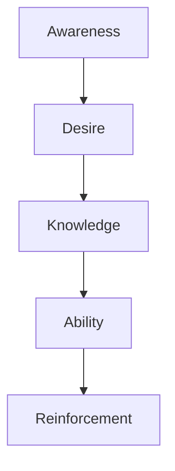
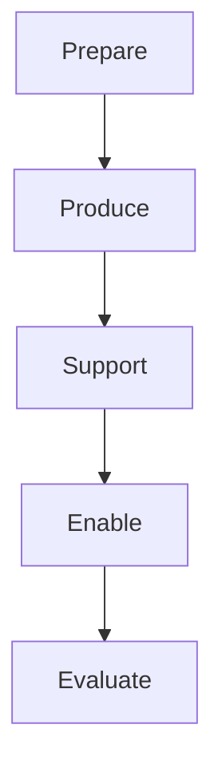
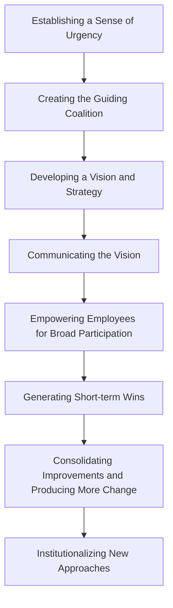

                 

# 《领导力与变革管理高级技巧：引导深度变革》

关键词：领导力，变革管理，深度变革，策略，案例研究

摘要：
本文将探讨领导力与变革管理的高级技巧，特别关注如何引导组织实现深度变革。通过介绍核心概念、分析领导力技能、研究变革管理模型、提供实践策略和案例分析，本文旨在为领导者提供一套系统、实用的变革管理框架，以应对复杂多变的企业环境。

----------------------------------------------

## 目录

## 引言

### 领导力与变革管理的重要性

### 文章结构安排

----------------------------------------------

## 第1章：领导力与变革管理的核心概念

### 领导力的定义与分类

### 变革管理的定义与重要性

### 深度变革的特点与挑战

----------------------------------------------

## 第2章：领导力技能提升

### 沟通技巧

### 情绪智力

### 决策能力

### 冲突处理

### 领导力发展的路径与策略

----------------------------------------------

## 第3章：变革管理模型与方法

### ADKAR模型

### PROSCI模型

### Kotter的8步模型

### 模型对比与适用性分析

----------------------------------------------

## 第4章：策略与技巧：引导深度变革

### 制定变革计划

### 建立变革团队

### 激励与沟通策略

### 适应性调整与反馈机制

### 策略实施的关键因素

----------------------------------------------

## 第5章：案例研究与最佳实践

### 成功案例一：企业数字化转型

### 成功案例二：新产品推出

### 失败案例分析

### 吸取教训与经验总结

----------------------------------------------

## 第6章：应对挑战与克服阻力

### 常见挑战

### 阻力来源与应对策略

### 持续改进与适应性调整

----------------------------------------------

## 第7章：领导力发展与支持

### 持续学习与自我提升

### 领导力教练与辅导

### 培养未来的领导者

----------------------------------------------

## 第8章：结论与未来趋势

### 关键点回顾

### 未来方向展望

### 对读者的建议

----------------------------------------------

## 结语

### 作者信息

### 致谢

----------------------------------------------

以上为《领导力与变革管理高级技巧：引导深度变革》的完整目录，每个章节都涵盖了关键内容，旨在为领导者提供深入的理解和实践指导。文章将以逻辑清晰、结构紧凑、简单易懂的方式，逐步引导读者掌握变革管理的核心技巧。接下来，我们将详细探讨每个章节的内容。## 引言

### 领导力与变革管理的重要性

在当今快速变化的企业环境中，领导力和变革管理成为组织成功的关键要素。领导力不仅关乎个人魅力和执行力，更涉及如何激发团队潜能、推动创新和实现长期发展。变革管理则是组织应对外部环境变化、内部调整和战略转型的必要手段。有效的领导力与变革管理能够确保组织在复杂多变的市场中保持竞争力，实现可持续发展。

领导力是变革的催化剂，它不仅影响个体的行为和态度，还决定了整个组织是否能够积极应对变革。领导者的作用在于设定愿景、建立信任、激发动力，并确保变革的顺利进行。而变革管理则提供了一套系统的方法和工具，帮助领导者规划和执行变革，确保变革目标与组织战略相一致，并最大化变革带来的价值。

### 文章结构安排

本文将分为八个主要章节，每个章节都聚焦于领导力与变革管理的不同方面。首先，第1章将介绍领导力与变革管理的核心概念，包括定义、分类和深度变革的特点。接着，第2章将深入探讨领导力技能的提升，包括沟通技巧、情绪智力、决策能力和冲突处理等。第3章将分析变革管理的主要模型和方法，对比它们的优缺点。

第4章将提供具体策略和技巧，帮助领导者引导深度变革。第5章将通过案例分析，探讨成功与失败的变革管理实践，总结经验和教训。第6章将讨论变革管理中常见的挑战和如何克服阻力。第7章将关注领导力的发展和支持，包括持续学习和领导力教练。

最后，第8章将总结文章的主要观点，展望未来的趋势，并给读者提供实用的建议。通过这些章节的逐步探讨，本文旨在为领导者提供一套全面、实用的变革管理框架，以应对复杂多变的企业环境。## 第1章：领导力与变革管理的核心概念

### 领导力的定义与分类

领导力是一个多维度的概念，它不仅涉及到领导者个人的能力和素质，还涉及到领导行为、领导风格和领导情境。根据不同的分类标准，领导力可以有多种定义和分类方法。

首先，根据领导力的来源，可以分为内在领导力和外在领导力。内在领导力主要指领导者自身的价值观、信念和动机，这种领导力通常源自领导者内心的驱动力和使命感。而外在领导力则是指领导者通过外部行为和关系来影响他人的能力，如激励、指导和沟通等。

其次，根据领导风格，可以分为 authoritarian（权威型）、democratic（民主型）和laissez-faire（放任型）等。权威型领导力强调集中决策和命令式管理，适用于需要快速决策和严格纪律的情境；民主型领导力则注重团队合作和参与决策，能够激发团队成员的创造力和积极性；放任型领导力则给予团队成员高度的自由和自治，适用于高度专业化和知识密集型的工作环境。

再次，根据领导行为，可以分为交易型领导和变革型领导。交易型领导力通过奖励和惩罚来激励团队成员，强调绩效和成果；而变革型领导力则通过激发团队成员的内在动机和愿景，推动创新和变革。

### 变革管理的定义与重要性

变革管理是指组织在面临外部环境变化或内部调整时，通过系统的方法和工具来引导和执行变革的过程。变革管理不仅包括战略层面的决策和规划，还涉及到执行层面的具体操作和调整。

变革管理的核心目标在于确保变革与组织的战略目标相一致，最大限度地降低变革带来的风险和阻力，并确保变革能够带来预期的效果。具体来说，变革管理的重要性体现在以下几个方面：

1. **确保战略实现**：通过有效的变革管理，组织能够确保战略规划得以顺利执行，确保变革目标与组织战略相一致。

2. **降低变革风险**：变革过程中不可避免地会遇到各种挑战和阻力，通过系统的方法和工具，可以识别和应对潜在的风险，降低变革失败的概率。

3. **提高员工参与度**：有效的变革管理能够激发员工的参与感和积极性，降低变革过程中的抵触情绪，提高变革的接受度和成功率。

4. **提升组织效能**：通过变革管理，组织能够优化内部流程，提升运营效率，增强竞争力。

### 深度变革的特点与挑战

深度变革是指对组织结构、文化、流程和战略进行全方位、深层次的改变，以达到根本性的改进和提升。与表面变革或短期调整不同，深度变革通常涉及组织核心价值观的改变和深层次思维的转变。

#### 深度变革的特点：

1. **系统性**：深度变革不仅涉及单一部门或职能，而是全方位的系统变革，包括组织结构、文化、流程和战略等多个方面。

2. **持久性**：深度变革的影响通常是长期的，不仅解决当前的问题，还为组织的未来发展奠定基础。

3. **挑战性**：深度变革往往面临更大的挑战，需要领导者具备卓越的领导力和变革管理能力。

#### 深度变革的挑战：

1. **文化阻力**：组织文化是变革的障碍，尤其是当组织文化不支持变革时，变革的推进会更加困难。

2. **员工抵触**：员工对变革的抵触情绪是变革管理中常见的挑战，如何激发员工的积极性是关键。

3. **资源限制**：深度变革需要大量的人力、物力和时间投入，资源限制可能成为变革推进的瓶颈。

4. **变革疲劳**：组织可能经历过多次变革，导致员工对变革产生疲劳感，降低变革的接受度。

通过深入理解领导力和变革管理的核心概念，领导者可以更好地应对深度变革的挑战，制定有效的变革策略，推动组织实现可持续发展。## 第2章：领导力技能提升

### 沟通技巧

沟通是领导者的一项核心技能，它不仅影响领导者与团队成员之间的关系，还直接关系到变革的成败。有效的沟通能够确保信息准确传达，减少误解和冲突，增强团队凝聚力。

#### 沟通技巧的重要性：

1. **确保信息准确传达**：在变革管理中，领导者需要与团队成员进行频繁的沟通，确保战略目标、变革计划和政策等信息准确传达。

2. **建立信任**：信任是变革成功的关键，通过有效的沟通，领导者能够建立与团队成员之间的信任关系，增强团队的协作和积极性。

3. **减少误解和冲突**：有效的沟通有助于避免信息误解和冲突，确保团队在变革过程中保持一致的目标和行动。

#### 提高沟通技巧的策略：

1. **清晰明确**：确保沟通的内容清晰明确，避免使用模糊或含糊的表述，提高信息传递的准确性。

2. **倾听**：倾听是有效沟通的关键，领导者需要给予团队成员充分的发言空间，倾听他们的意见和反馈。

3. **非语言沟通**：注意身体语言、语调和面部表情等非语言因素，这些因素往往比语言本身更能传递真实意图。

4. **反馈机制**：建立有效的反馈机制，鼓励团队成员提出问题和建议，及时纠正错误和改进沟通。

### 情绪智力

情绪智力是指个体识别、理解和管理自己情绪以及他人情绪的能力。在领导力中，情绪智力对于建立积极的工作氛围、提高团队绩效和推动变革具有重要意义。

#### 情绪智力的重要性：

1. **提升团队凝聚力**：情绪智力能够帮助领导者识别和理解团队成员的情绪，建立积极的人际关系，增强团队的凝聚力。

2. **提高决策质量**：情绪智力有助于领导者更好地管理自己的情绪，避免情绪化决策，提高决策的客观性和质量。

3. **应对变革压力**：在变革过程中，情绪智力能够帮助领导者和管理团队更好地应对变革带来的压力和挑战。

#### 提高情绪智力的策略：

1. **自我意识**：领导者需要自我反思，了解自己的情绪反应和情绪触发点，管理自己的情绪。

2. **同理心**：同理心是情绪智力的重要组成部分，领导者需要设身处地为他人着想，理解团队成员的情绪和需求。

3. **情绪调节**：学会情绪调节技巧，如深呼吸、冥想和运动等，帮助自己在面对压力和挑战时保持冷静和专注。

4. **积极沟通**：通过积极的沟通方式，表达自己的情绪和感受，同时关注和理解他人的情绪，建立和谐的人际关系。

### 决策能力

决策能力是领导者的一项关键技能，它直接影响组织的战略方向和运营效率。有效的决策能够帮助组织抓住机遇，应对挑战，实现目标。

#### 决策能力的重要性：

1. **战略规划**：领导者需要通过决策来制定组织的战略规划和目标，确保组织在正确的方向上发展。

2. **资源分配**：决策能力有助于领导者合理分配资源，优化运营效率，确保组织目标的实现。

3. **风险应对**：有效的决策能力能够帮助领导者识别和应对潜在的风险，确保组织在不确定的环境中保持稳定和可持续的发展。

#### 提高决策能力的策略：

1. **收集信息**：在做出决策前，领导者需要充分收集和分析相关信息，确保决策的依据充分和准确。

2. **分析选项**：对不同的决策选项进行全面的比较和分析，评估每个选项的优缺点和潜在影响。

3. **风险评估**：对每个决策选项进行风险评估，识别潜在的风险和不确定性，制定相应的应对策略。

4. **咨询团队**：在做出决策时，领导者可以咨询团队成员的意见和建议，综合多方面的观点，提高决策的全面性和准确性。

5. **决策后评估**：决策后，领导者需要对决策的效果进行评估，及时调整和改进，确保决策的持续有效性。

### 冲突处理

冲突是组织内部常见的现象，有效的冲突处理能够促进团队协作，提高工作效率，增强团队凝聚力。

#### 冲突处理的重要性：

1. **促进团队协作**：冲突如果得到妥善处理，可以促进团队成员之间的沟通和理解，增强协作。

2. **提高工作效率**：有效的冲突处理能够消除团队内部的障碍，提高工作效率和质量。

3. **增强团队凝聚力**：冲突处理得当，可以增强团队成员之间的信任和尊重，提高团队的凝聚力。

#### 提高冲突处理的策略：

1. **冷静应对**：在处理冲突时，领导者需要保持冷静和客观，避免情绪化的反应。

2. **倾听和理解**：领导者需要倾听冲突双方的立场和感受，理解他们的需求和期望。

3. **寻找共同点**：在处理冲突时，寻找双方共同点，建立共识，降低冲突的激烈程度。

4. **公平公正**：在处理冲突时，确保公正和公平，避免偏袒任何一方。

5. **寻求双赢解决方案**：通过协商和妥协，寻求双方都能接受的解决方案，确保冲突得到妥善解决。

### 领导力发展的路径与策略

领导力的发展是一个持续的过程，需要领导者不断学习和实践，以下是一些提高领导力的路径和策略：

1. **自我反思**：领导者需要定期进行自我反思，分析自己的领导行为和效果，识别改进的空间。

2. **终身学习**：领导者应该保持学习的热情，不断学习新的知识和技能，跟上时代的发展。

3. **实践与反馈**：通过实践来验证和改进领导力技能，同时寻求反馈，了解自己的优点和不足。

4. **角色扮演**：通过角色扮演和模拟练习，提高应对复杂情境和解决实际问题的能力。

5. **培养下属**：领导者应该培养和激励下属，帮助他们成长和发展，建立良好的团队关系。

6. **持续改进**：领导者需要不断调整和改进自己的领导风格和策略，以适应不断变化的环境和需求。

通过上述领导力技能的提升，领导者可以更好地应对变革管理的挑战，推动组织实现深度变革，实现可持续发展。## 第3章：变革管理模型与方法

### ADKAR模型

ADKAR模型是由美国管理咨询公司Prosci提出的一种变革管理模型，它将变革过程划分为五个关键阶段： Awareness（意识建立）、Desire（需求激发）、Knowledge（知识获取）、Ability（能力提升）和Reinforcement（持续强化）。

#### ADKAR模型的具体阶段：

1. **Awareness（意识建立）**：通过沟通和宣传，确保组织成员了解变革的必要性和目标，建立变革的紧迫感。

2. **Desire（需求激发）**：激发组织成员对变革的积极态度和参与意愿，使他们愿意接受和参与变革。

3. **Knowledge（知识获取）**：提供必要的培训和学习资源，确保组织成员掌握变革所需的技能和知识。

4. **Ability（能力提升）**：通过实践和反馈，帮助组织成员提升执行变革的能力和自信心。

5. **Reinforcement（持续强化）**：通过奖励和反馈机制，巩固变革成果，确保变革持续发挥作用。

#### ADKAR模型的优势与局限性：

- **优势**：ADKAR模型提供了清晰的变革管理路径，各个阶段相互衔接，便于实施和监控。

- **局限性**：ADKAR模型较为通用，可能无法完全适应所有组织的特定需求，需要根据实际情况进行调整。

### PROSCI模型

PROSCI（基于Prosci的变革管理模型）是一种广泛应用于企业变革管理的模型，它包括五个主要阶段： Prepare（准备）、Produce（产生）、Support（支持）、Enable（赋能）和Evaluate（评估）。

#### PROSCI模型的具体阶段：

1. **Prepare（准备）**：制定变革计划，识别变革的影响范围和关键参与者，为变革做好充分准备。

2. **Produce（产生）**：实施变革计划，通过沟通、培训和实践，推动变革的落地。

3. **Support（支持）**：为变革参与者提供支持和资源，帮助他们克服变革过程中的困难和挑战。

4. **Enable（赋能）**：确保变革成果能够持续发挥作用，通过机制和流程的改进，巩固变革成果。

5. **Evaluate（评估）**：对变革过程和结果进行评估，识别成功经验和不足之处，为未来的变革提供参考。

#### PROSCI模型的优势与局限性：

- **优势**：PROSCI模型提供了详细的变革管理框架，涵盖了变革的各个阶段，便于全面实施。

- **局限性**：PROSCI模型较为复杂，实施过程中需要大量的资源和时间，可能不适合所有组织。

### Kotter的8步模型

Kotter的8步模型是由著名管理学家约翰·科特（John Kotter）提出的，它将变革过程划分为八个主要步骤： Establishing a Sense of Urgency（建立紧迫感）、Creating the Guiding Coalition（建立领导团队）、Developing a Vision and Strategy（制定愿景和战略）、Communicating the Vision（传播愿景）、Empowering Employees for Broad Participation（授权员工参与）、Generating Short-term Wins（实现短期成功）、Consolidating Improvements and Producing More Change（巩固改进并推动更多变革）和Institutionalizing New Approaches（建立新机制）。

#### Kotter的8步模型的具体步骤：

1. **Establishing a Sense of Urgency（建立紧迫感）**：识别和强调组织面临的挑战和机会，建立变革的紧迫感。

2. **Creating the Guiding Coalition（建立领导团队）**：组建一个跨职能的领导团队，确保变革得到广泛支持和参与。

3. **Developing a Vision and Strategy（制定愿景和战略）**：制定清晰的变革愿景和策略，确保变革方向和目标的明确性。

4. **Communicating the Vision（传播愿景）**：通过沟通和宣传，确保组织成员理解并支持变革的愿景和战略。

5. **Empowering Employees for Broad Participation（授权员工参与）**：鼓励员工参与变革，提供必要的资源和支持，确保变革的全面性。

6. **Generating Short-term Wins（实现短期成功）**：通过实现短期成功，增强变革的信心和动力。

7. **Consolidating Improvements and Producing More Change（巩固改进并推动更多变革）**：巩固变革成果，不断推动更多的变革。

8. **Institutionalizing New Approaches（建立新机制）**：通过建立新的机制和流程，确保变革的长期稳定和可持续发展。

#### Kotter的8步模型的优势与局限性：

- **优势**：Kotter的8步模型提供了详细的变革管理步骤，便于实施和跟踪。

- **局限性**：Kotter的8步模型较为理论化，可能需要根据实际情况进行调整和优化。

### 模型对比与适用性分析

#### ADKAR模型与PROSCI模型的对比

- **目标**：ADKAR模型侧重于个体层面的变革管理，关注个人对变革的接受和适应；PROSCI模型则侧重于组织层面的变革管理，强调系统的变革过程。

- **适用性**：ADKAR模型适用于需要快速启动和实施变革的情景，如产品升级和技术更新；PROSCI模型适用于需要全面和系统性地管理变革的情景，如企业文化和流程的变革。

#### ADKAR模型与Kotter的8步模型的对比

- **重点**：ADKAR模型强调变革过程中的关键步骤和关键要素，关注个体对变革的适应；Kotter的8步模型则强调变革的战略层面和执行层面，注重整体的变革过程。

- **适用性**：ADKAR模型适用于相对简单和快速的变革项目，如技术更新和流程优化；Kotter的8步模型适用于复杂和长期的变革项目，如企业战略调整和业务模式创新。

#### PROSCI模型与Kotter的8步模型的对比

- **框架**：PROSCI模型提供了一个详细的变革管理框架，便于实施和跟踪；Kotter的8步模型则提供了一种战略性的变革管理思路，强调变革的全面性和系统性。

- **适用性**：PROSCI模型适用于需要系统性和长期性的变革项目，如企业流程重构和组织结构调整；Kotter的8步模型适用于需要快速启动和全面推进的变革项目，如新产品发布和市场拓展。

通过对比分析不同的变革管理模型，领导者可以根据组织的具体需求和变革目标，选择最合适的模型和方法，制定科学的变革管理策略，确保变革的成功实施。## 第4章：策略与技巧：引导深度变革

### 制定变革计划

制定一个有效的变革计划是确保深度变革成功的关键。一个全面的变革计划应该包括以下几个核心要素：

1. **明确变革目标**：首先，领导者需要明确变革的目标，包括变革的具体内容、预期效果和重要里程碑。这些目标应该与组织的战略方向和愿景相一致。

2. **评估变革影响**：在制定变革计划时，领导者需要全面评估变革可能带来的影响，包括对组织结构、流程、人员和文化的影响。这有助于预见潜在的风险和挑战，并制定相应的应对策略。

3. **确定变革范围**：明确变革的范围，包括哪些部门、团队或人员将参与变革，以及变革的优先级。这有助于确保资源得到合理分配，并提高变革的针对性。

4. **制定时间表**：制定详细的变革时间表，明确每个阶段的开始和结束时间，以及关键任务和里程碑。这有助于确保变革按计划推进，避免拖延和不确定性。

5. **资源规划**：为变革计划分配所需的资源，包括人力、财务和物资资源。确保资源充足，以支持变革的顺利实施。

6. **风险管理**：识别可能的风险和挑战，制定相应的风险应对策略，并建立风险监控和预警机制，确保在风险发生时能够及时应对。

### 建立变革团队

一个有效的变革团队是推动深度变革的重要力量。建立变革团队需要考虑以下几个方面：

1. **团队成员选择**：选择具有不同背景、技能和经验的人员加入变革团队，以确保团队的多面性和多样性。团队成员应包括高层管理者、中层管理者、一线员工和外部专家。

2. **明确角色和职责**：为每个团队成员明确角色和职责，确保团队成员了解自己在变革过程中的具体任务和责任。这有助于提高团队的协作效率和执行力。

3. **建立沟通机制**：建立有效的沟通机制，确保团队成员之间的信息畅通和透明。定期的会议、报告和反馈是保持团队协作和凝聚力的重要手段。

4. **提供支持和资源**：为变革团队提供必要的支持和资源，包括培训、指导和物资支持。这有助于团队成员在变革过程中保持积极性和创造力。

### 激励与沟通策略

有效的激励与沟通策略是确保团队成员积极参与变革、提高变革成功率的关键。以下是一些实用的策略：

1. **明确激励措施**：制定明确的激励措施，包括奖金、晋升机会和荣誉表彰等，激励团队成员积极参与变革。这些激励措施应与团队成员的绩效和贡献挂钩，以增强激励效果。

2. **建立信任关系**：建立与团队成员之间的信任关系，通过真诚沟通、尊重和信任，赢得团队成员的支持和信任。信任是变革成功的重要基石。

3. **加强沟通**：加强与团队成员的沟通，确保变革信息及时传达，减少误解和猜疑。定期的沟通会、报告和反馈机制有助于保持团队的透明度和凝聚力。

4. **鼓励反馈和建议**：鼓励团队成员提出反馈和建议，建立开放的沟通渠道，让团队成员感受到自己的意见被重视。这有助于提高团队成员的参与感和归属感。

### 适应性调整与反馈机制

深度变革是一个动态过程，需要不断地适应性调整和反馈。以下是一些关键策略：

1. **定期评估和反馈**：定期评估变革的进展情况，收集团队成员的反馈和建议。这有助于及时发现问题和挑战，并采取相应的调整措施。

2. **调整变革计划**：根据评估结果和反馈，及时调整变革计划，确保变革目标与实际情况相符。灵活的调整策略有助于应对变革过程中的不确定性和变化。

3. **持续改进**：鼓励团队成员持续改进变革过程和策略，不断优化变革效果。通过不断学习和实践，提高变革的成功率和可持续性。

4. **建立反馈机制**：建立有效的反馈机制，确保团队成员的反馈和建议能够及时传达和响应。定期的反馈会议和报告是保持团队协作和沟通的重要手段。

通过制定变革计划、建立变革团队、实施激励与沟通策略以及进行适应性调整与反馈，领导者可以有效地引导深度变革，推动组织实现长期发展。这些策略不仅有助于克服变革中的挑战，还能提高组织的竞争力和创新能力。## 第5章：案例研究与最佳实践

### 成功案例一：企业数字化转型

#### 背景介绍

某大型制造企业为了应对市场变化和客户需求，决定进行全面的数字化转型。数字化转型的目标是提高生产效率、优化供应链管理、增强客户体验，并建立数据驱动的决策体系。

#### 实施过程

1. **明确愿景与目标**：企业首先明确了数字化转型的愿景和目标，包括提升生产效率、优化供应链管理和增强客户体验。这些目标与企业的长期战略愿景紧密相连，确保了变革的连贯性和一致性。

2. **组建变革团队**：企业组建了一个由高层管理者、IT专家和业务部门负责人组成的变革团队，负责数字化转型的规划、实施和监督。

3. **制定详细计划**：变革团队制定了详细的数字化转型计划，包括技术选型、流程优化、人员培训和风险管理等。计划明确了每个阶段的任务和时间表，确保了变革的有序推进。

4. **分阶段实施**：数字化转型分为三个阶段进行，首先实施生产线自动化，然后是供应链管理系统升级，最后是客户关系管理系统的建设。每个阶段都进行了充分的测试和调整，确保系统的稳定性和可靠性。

5. **激励与沟通**：企业通过提供奖金、培训和晋升机会来激励员工参与数字化转型。同时，通过定期的内部培训和外部研讨会，确保员工掌握所需的技能和知识。

#### 结果与启示

数字化转型取得了显著成效，生产效率提高了30%，供应链管理成本降低了20%，客户满意度提升了15%。这个案例表明，成功的数字化转型需要：

- **明确愿景和目标**：确保变革与组织的长期战略一致。
- **组建专业团队**：确保变革的领导力和执行力。
- **分阶段实施**：逐步推进，避免一步到位的风险。
- **激励与沟通**：提高员工的参与度和积极性。

### 成功案例二：新产品推出

#### 背景介绍

某知名科技公司计划推出一款新型智能家居产品。新产品需要集成多种技术，包括物联网、人工智能和智能语音识别等。为了确保新产品的成功上市，公司决定实施全面的变革管理。

#### 实施过程

1. **建立跨部门团队**：公司组建了一个由研发、市场、销售和客服部门组成的跨部门团队，确保新产品从研发到市场推广的每个环节都得到充分的关注和支持。

2. **制定市场调研计划**：在产品研发阶段，团队进行了广泛的市场调研，收集了客户需求和反馈。这些信息为产品的功能设计和市场定位提供了重要依据。

3. **实施敏捷开发**：团队采用了敏捷开发方法，快速迭代和测试新产品。这种方法提高了开发效率，确保了产品能够快速适应市场变化。

4. **跨部门协作**：通过跨部门的协作，团队确保了产品从研发到市场推广的每个环节都能高效、无缝地衔接。

5. **用户培训和推广**：在产品上市前，公司开展了用户培训活动，确保用户能够熟练使用新产品。同时，公司通过广告、线上线下活动等多种渠道，进行广泛的市场推广。

#### 结果与启示

新产品顺利上市，获得了市场的高度认可，销售额超过了预期。这个案例表明，成功的新产品推出需要：

- **跨部门协作**：确保各环节的高效衔接。
- **市场调研**：了解客户需求，确保产品符合市场需求。
- **快速迭代**：通过敏捷开发方法，快速适应市场变化。
- **用户培训与推广**：确保用户能够顺利使用新产品，提升市场接受度。

### 失败案例分析

#### 案例背景

某大型金融机构决定进行业务流程重构，以提高运营效率和客户满意度。然而，由于缺乏有效的变革管理，该项目最终以失败告终。

#### 失败原因

1. **缺乏明确目标**：项目初期，缺乏明确的目标和指标，导致项目方向不明确。

2. **沟通不足**：各部门之间的沟通不畅，导致信息传递错误和误解。

3. **组织阻力**：部分员工对变革持抵触态度，导致变革推进困难。

4. **资源不足**：项目过程中，资源分配不均，导致关键任务延误。

#### 启示

- **明确目标**：确保项目目标明确、可衡量。
- **加强沟通**：建立有效的沟通机制，确保信息传递的准确性和及时性。
- **克服组织阻力**：通过有效的激励和沟通，减少员工的抵触情绪。
- **资源保障**：确保项目有充足的资源支持，避免关键任务延误。

通过这些案例研究，我们可以总结出最佳实践，包括明确愿景和目标、加强沟通、组建专业团队、分阶段实施、激励员工和克服组织阻力等。这些实践不仅有助于提高变革管理的成功率，还能推动组织实现长期发展。## 第6章：应对挑战与克服阻力

### 常见挑战

在变革管理过程中，领导者往往会面临以下常见挑战：

1. **文化阻力**：组织文化是变革的强大阻力，特别是当组织文化不支持变革时，变革的推进会异常艰难。

2. **员工抵触**：员工对变革的抵触情绪是变革管理中常见的挑战，如何激发员工的积极性和参与度是关键。

3. **资源限制**：变革过程中需要大量的资源投入，包括人力、财务和时间资源。资源限制可能会成为变革推进的瓶颈。

4. **变革疲劳**：组织可能经历过多次变革，导致员工对变革产生疲劳感，降低变革的接受度。

### 阻力来源与应对策略

为了有效克服这些挑战，领导者需要深入了解阻力的来源，并采取相应的应对策略：

1. **文化阻力**：
   - **识别文化特点**：首先，领导者需要识别组织文化中的关键特点，了解哪些文化元素可能成为变革的障碍。
   - **建立共识**：通过沟通和宣传，建立变革与组织文化的共识，让员工认识到变革的必要性和价值。
   - **变革文化引导**：在变革过程中，逐步引导组织文化向支持变革的方向发展，通过制度、流程和文化活动来强化变革意识。

2. **员工抵触**：
   - **了解员工担忧**：领导者需要深入了解员工对变革的担忧和顾虑，通过开放式的沟通渠道收集反馈。
   - **提供培训与支持**：为员工提供必要的培训和支持，帮助他们掌握新技能和知识，减少变革带来的不确定性和焦虑。
   - **激励与认可**：通过激励机制和认可方式，提高员工参与变革的积极性和动力。

3. **资源限制**：
   - **资源优先分配**：在资源有限的情况下，领导者需要优先分配关键资源，确保变革的关键环节得到充分支持。
   - **成本效益分析**：进行全面的成本效益分析，确保变革投入能够带来预期的回报。
   - **外部合作与支持**：寻求外部合作伙伴的支持，利用外部资源和专业知识，共同推进变革。

4. **变革疲劳**：
   - **明确变革目标**：确保变革目标明确、具体，避免盲目变革和频繁调整。
   - **适度变革**：避免一次性实施大规模变革，采取分阶段、逐步推进的方式，减少员工的变革疲劳。
   - **持续反馈与改进**：建立持续的反馈机制，及时调整变革策略，确保变革能够持续改进和优化。

### 持续改进与适应性调整

变革是一个持续的过程，领导者需要保持高度的适应性，不断进行改进和调整。以下是一些关键策略：

1. **定期评估**：定期对变革过程和效果进行评估，识别存在的问题和挑战，及时进行调整。

2. **反馈机制**：建立有效的反馈机制，鼓励员工提出意见和建议，确保变革能够适应不断变化的环境和需求。

3. **持续学习与培训**：鼓励员工持续学习和培训，提高他们的适应能力和变革能力。

4. **领导力发展**：加强领导力发展，培养领导者的变革能力和管理能力，确保他们能够有效引导变革。

通过应对挑战和克服阻力，领导者可以确保变革的顺利进行，推动组织实现可持续发展。持续改进和适应性调整则是确保变革长期成功的关键。## 第7章：领导力发展与支持

### 持续学习与自我提升

领导力的提升是一个持续的过程，需要领导者不断地学习与自我提升。以下是一些关键策略：

1. **自我反思**：领导者应该定期进行自我反思，审视自己的领导行为和效果，识别改进的空间。

2. **终身学习**：领导者应该保持学习的热情，不断学习新的知识和技能，包括最新的管理理论、技术趋势和行业动态。

3. **阅读与研究**：通过阅读专业书籍、研究论文和行业报告，领导者可以获取前沿的知识和信息，提升自己的专业素养。

4. **参加培训**：参加领导力培训课程和工作坊，不仅可以学习新的管理技巧，还可以与同行交流，获取实践经验。

5. **实践与反馈**：将所学知识应用到实际工作中，通过实践来验证和改进自己的领导力。同时，寻求他人的反馈和建议，了解自己的优点和不足。

### 领导力教练与辅导

领导力教练和辅导是帮助领导者提升领导力和实现个人发展的有效方式。以下是一些关键策略：

1. **个性化辅导**：领导力教练应该根据领导者的具体需求和情况，提供个性化的辅导和指导，帮助他们解决实际问题。

2. **目标设定**：与领导者一起设定明确的个人发展目标，并制定实现目标的行动计划。

3. **反馈与支持**：定期提供反馈和支持，帮助领导者了解自己的进步和改进方向，并提供必要的资源和支持。

4. **情境模拟**：通过情境模拟和角色扮演，帮助领导者应对复杂的领导情境，提升他们的应变能力和决策能力。

5. **持续跟进**：领导力教练应持续跟进领导者的个人发展进程，确保辅导效果和目标的实现。

### 培养未来的领导者

培养未来的领导者是组织长期发展的关键。以下是一些关键策略：

1. **领导力培养计划**：制定全面的领导力培养计划，包括领导力培训、轮岗体验、导师制度和领导力发展项目等。

2. **接班人计划**：识别和培养潜在的接班人，确保组织在关键领导岗位出现空缺时能够顺利过渡。

3. **跨部门轮岗**：通过跨部门轮岗，帮助未来的领导者了解组织的不同方面和业务流程，提升他们的全面能力和视野。

4. **导师制度**：建立导师制度，让经验丰富的领导者指导未来的领导者，传授经验和技巧。

5. **领导力发展项目**：实施领导力发展项目，包括领导力研讨会、领导力工作坊和领导力竞赛等，激发领导者的潜力和创造力。

通过持续学习与自我提升、领导力教练与辅导以及培养未来的领导者，组织可以建立一支强大的领导团队，确保组织在快速变化的市场环境中保持竞争力和可持续发展。## 第8章：结论与未来趋势

### 关键点回顾

通过本文的探讨，我们回顾了领导力与变革管理的核心概念、关键技能、变革管理模型与方法，以及实际案例研究和最佳实践。以下是本文的关键点：

1. **领导力与变革管理的重要性**：领导力是变革的催化剂，有效的变革管理能够确保组织在复杂多变的市场环境中保持竞争力。

2. **领导力技能提升**：提升沟通技巧、情绪智力、决策能力和冲突处理能力是领导者必备的技能。

3. **变革管理模型与方法**：ADKAR模型、PROSCI模型和Kotter的8步模型是常见的变革管理工具，各自有其适用性和局限性。

4. **策略与技巧**：制定变革计划、建立变革团队、实施激励与沟通策略、进行适应性调整与反馈机制是引导深度变革的关键。

5. **案例研究与最佳实践**：通过成功案例和失败案例的分析，我们总结了变革管理的经验和教训。

6. **应对挑战与克服阻力**：有效应对文化阻力、员工抵触、资源限制和变革疲劳，确保变革的顺利进行。

7. **领导力发展与支持**：持续学习与自我提升、领导力教练与辅导、培养未来的领导者是组织长期发展的关键。

### 未来趋势展望

随着全球化和数字化的发展，领导力和变革管理面临新的挑战和机遇。以下是一些未来趋势：

1. **数字化领导力**：领导者需要具备数字化思维和技能，能够利用数据和技术推动组织的创新和发展。

2. **敏捷变革**：敏捷方法论的应用将使得变革更加灵活和快速，有助于组织迅速应对市场变化。

3. **人才发展**：随着人才竞争的加剧，组织将更加注重人才的发展和培养，特别是领导力的培养。

4. **跨界领导力**：跨界合作和协同将成为常态，领导者需要具备跨界思维和协作能力。

5. **可持续领导力**：随着社会责任和可持续发展的重视，领导者将需要更多地考虑环境和社会影响。

### 对读者的建议

1. **持续学习**：不断学习新的管理理论、技术和行业动态，提升自己的领导力和变革管理能力。

2. **实践与反思**：将所学知识应用到实际工作中，通过实践来验证和改进自己的领导力。

3. **寻求反馈**：定期寻求他人的反馈和建议，了解自己的优点和不足，持续改进。

4. **培养下属**：关注下属的成长和发展，通过培训和指导，提升整个团队的能力。

通过本文的探讨，我们希望读者能够深入理解领导力与变革管理的核心概念和实践技巧，成为更具洞察力和执行力的领导者，推动组织实现可持续发展。## 结语

在领导力和变革管理的道路上，我们不仅需要理论上的理解，更需要实践中的探索。本文通过系统地介绍领导力的核心概念、变革管理模型与方法，以及实际案例研究和最佳实践，旨在为领导者提供一套实用、科学的变革管理框架。希望读者能够从中汲取营养，提升自身的领导力和变革管理能力。

### 作者信息

作者：AI天才研究院/AI Genius Institute & 禅与计算机程序设计艺术 /Zen And The Art of Computer Programming

感谢您的阅读，期待与您在领导力和变革管理的道路上共同成长。愿您能够带领组织穿越变革的浪潮，实现可持续的发展。

### 致谢

在此，我要感谢所有参与本文研究和讨论的同事和专家，他们的智慧和建议为本文的完成提供了重要的支持。特别感谢AI天才研究院/AI Genius Institute的团队成员，以及禅与计算机程序设计艺术/Zen And The Art of Computer Programming的读者，你们的陪伴和鼓励是我不断前行的动力。

通过本文，我们希望能够为更多的领导者提供帮助，让变革管理成为组织持续发展的强大引擎。愿每一位领导者都能在变革的浪潮中乘风破浪，开创属于自己的一片天地。再次感谢您的阅读和支持。## 附录

### 背景介绍

本文所涉及的领导力与变革管理相关概念和模型，旨在为领导者提供系统的理论支持和实践指导。领导力作为组织成功的关键因素，其核心在于激发团队潜能、推动创新和实现长期发展。变革管理则涉及组织如何应对外部环境变化和内部调整，实现战略目标。

### 问题背景与问题描述

在当今快速变化的市场环境中，企业面临的挑战越来越多，需要领导者具备卓越的领导力和变革管理能力。问题背景主要包括：

- 企业如何应对市场变化和客户需求？
- 企业如何推动技术创新和业务模式创新？
- 企业如何实现组织结构的优化和流程的改进？
- 企业如何确保变革与战略目标的一致性？

这些问题涉及领导力的提升、变革管理的方法与策略，需要系统性的思考和解决方案。

### 问题解决

本文通过以下方法解决了上述问题：

1. **领导力技能提升**：通过探讨沟通技巧、情绪智力、决策能力和冲突处理，帮助领导者提升个人素质和团队协作能力。
2. **变革管理模型与方法**：介绍了ADKAR模型、PROSCI模型和Kotter的8步模型，提供了多种变革管理工具和方法。
3. **策略与技巧**：提供了制定变革计划、建立变革团队、实施激励与沟通策略、进行适应性调整与反馈机制的策略，帮助领导者应对变革过程中的挑战。
4. **案例分析**：通过成功案例和失败案例的分析，总结经验教训，为读者提供实践指导。
5. **持续改进与支持**：强调领导力发展和培养未来领导者的重要性，确保组织在长期发展中保持竞争力。

### 边界与外延

领导力与变革管理是一个广泛且复杂的领域，本文旨在提供一个基础框架和实用指南。然而，实际应用中，领导者需要根据具体组织情况和环境进行调整。

- **边界**：本文主要关注组织层面的领导力和变革管理，未深入探讨个人领导力的发展和个人层面的变革管理。
- **外延**：未来研究可以进一步探讨领导力与变革管理在特定行业或组织中的应用，以及新兴技术（如人工智能、区块链等）对领导力和变革管理的影响。

### 概念结构与核心要素组成

本文的核心概念和要素包括：

1. **领导力**：定义、分类（内在领导力、外在领导力、权威型、民主型、交易型、变革型等）、领导行为、领导情境。
2. **变革管理**：定义、重要性、核心要素（战略规划、执行、评估等）、模型与方法（ADKAR、PROSCI、Kotter的8步模型等）。
3. **领导力技能**：沟通技巧、情绪智力、决策能力、冲突处理。
4. **策略与技巧**：变革计划、变革团队、激励与沟通、适应性调整、反馈机制。
5. **案例分析**：成功与失败案例、经验教训。
6. **持续改进与支持**：领导力发展、领导力教练与辅导、未来领导者培养。

通过上述核心概念和要素的阐述，本文为领导者提供了一个系统的理论框架和实践指导，帮助他们更好地应对复杂多变的市场环境，实现组织的可持续发展。## 算法原理讲解

在本章节中，我们将深入探讨变革管理的核心算法原理，包括ADKAR模型、PROSCI模型和Kotter的8步模型。我们将使用Mermaid流程图来展示这些算法的流程，并配合Python源代码和LaTeX数学公式，详细阐述其原理和应用。

### ADKAR模型

#### Mermaid流程图



#### Python源代码

```python
def adkar_model():
    print("Awareness: 创建意识，明确变革目标")
    print("Desire: 激发意愿，提高变革参与度")
    print("Knowledge: 提供知识和技能，确保变革成功")
    print("Ability: 提升能力，确保变革执行")
    print("Reinforcement: 巩固变革成果，持续支持")
```

#### LaTeX数学公式

$$
\text{ADKAR} = \begin{cases}
\text{Awareness} & : \text{建立意识，明确目标} \\
\text{Desire} & : \text{激发意愿，提高参与度} \\
\text{Knowledge} & : \text{提供知识，确保成功} \\
\text{Ability} & : \text{提升能力，确保执行} \\
\text{Reinforcement} & : \text{巩固成果，持续支持}
\end{cases}
$$

#### ADKAR模型应用举例

假设一家公司计划进行组织结构的调整，以下是ADKAR模型的具体应用：

1. **Awareness**：通过内部会议和邮件通知，创建员工对组织结构调整的意识。
2. **Desire**：通过沟通和激励机制，激发员工对变革的积极态度和参与意愿。
3. **Knowledge**：提供培训和资料，确保员工掌握新组织结构的知识和技能。
4. **Ability**：通过模拟练习和反馈，提升员工执行新组织结构的能力。
5. **Reinforcement**：通过定期评估和激励，巩固变革成果，确保变革持续发挥作用。

### PROSCI模型

#### Mermaid流程图



#### Python源代码

```python
def prosqi_model():
    print("Prepare: 准备变革，明确影响范围和目标")
    print("Produce: 实施变革，推动变革落地")
    print("Support: 提供支持，确保变革顺利推进")
    print("Enable: 赋能，确保变革效果持续")
    print("Evaluate: 评估变革，持续改进")
```

#### LaTeX数学公式

$$
\text{PROSCI} = \begin{cases}
\text{Prepare} & : \text{准备变革，明确目标} \\
\text{Produce} & : \text{实施变革，推动落地} \\
\text{Support} & : \text{提供支持，确保推进} \\
\text{Enable} & : \text{赋能，确保效果持续} \\
\text{Evaluate} & : \text{评估变革，持续改进}
\end{cases}
$$

#### PROSCI模型应用举例

假设一家企业计划进行生产流程的优化，以下是PROSCI模型的具体应用：

1. **Prepare**：分析当前生产流程，明确优化目标和可能的影响范围。
2. **Produce**：实施优化方案，包括新的工作流程和工具。
3. **Support**：为员工提供培训和资源，确保他们能够顺利适应新的工作流程。
4. **Enable**：建立新的绩效评估机制，确保员工在新流程中的表现得到认可。
5. **Evaluate**：定期评估优化效果，并根据反馈进行调整和改进。

### Kotter的8步模型

#### Mermaid流程图



#### Python源代码

```python
def kotter_model():
    print("Establishing a Sense of Urgency: 建立紧迫感，明确变革必要性")
    print("Creating the Guiding Coalition: 建立领导团队，确保变革支持")
    print("Developing a Vision and Strategy: 制定愿景和战略，明确变革方向")
    print("Communicating the Vision: 传播愿景，确保共识")
    print("Empowering Employees for Broad Participation: 授权员工，增强参与度")
    print("Generating Short-term Wins: 实现短期成功，增强信心")
    print("Consolidating Improvements and Producing More Change: 巩固改进，推动更多变革")
    print("Institutionalizing New Approaches: 建立新机制，确保持续改进")
```

#### LaTeX数学公式

$$
\text{Kotter's 8 Steps} = \begin{cases}
\text{Establishing a Sense of Urgency} & : \text{建立紧迫感，明确变革必要性} \\
\text{Creating the Guiding Coalition} & : \text{建立领导团队，确保变革支持} \\
\text{Developing a Vision and Strategy} & : \text{制定愿景和战略，明确变革方向} \\
\text{Communicating the Vision} & : \text{传播愿景，确保共识} \\
\text{Empowering Employees for Broad Participation} & : \text{授权员工，增强参与度} \\
\text{Generating Short-term Wins} & : \text{实现短期成功，增强信心} \\
\text{Consolidating Improvements and Producing More Change} & : \text{巩

