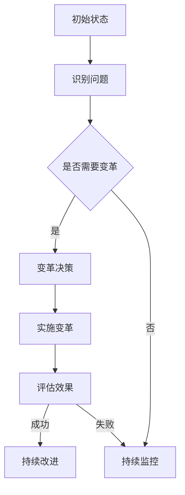
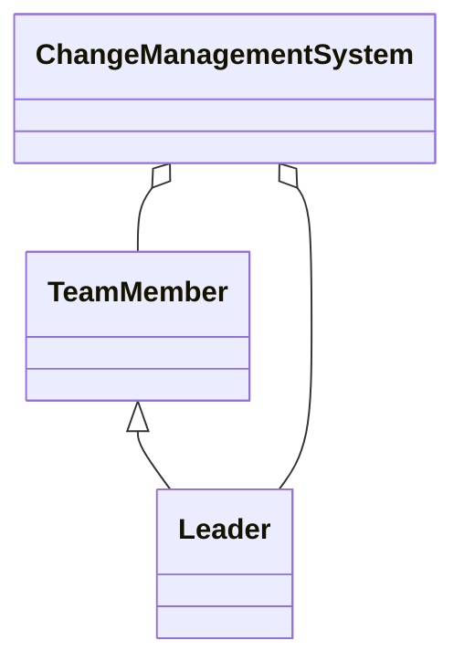
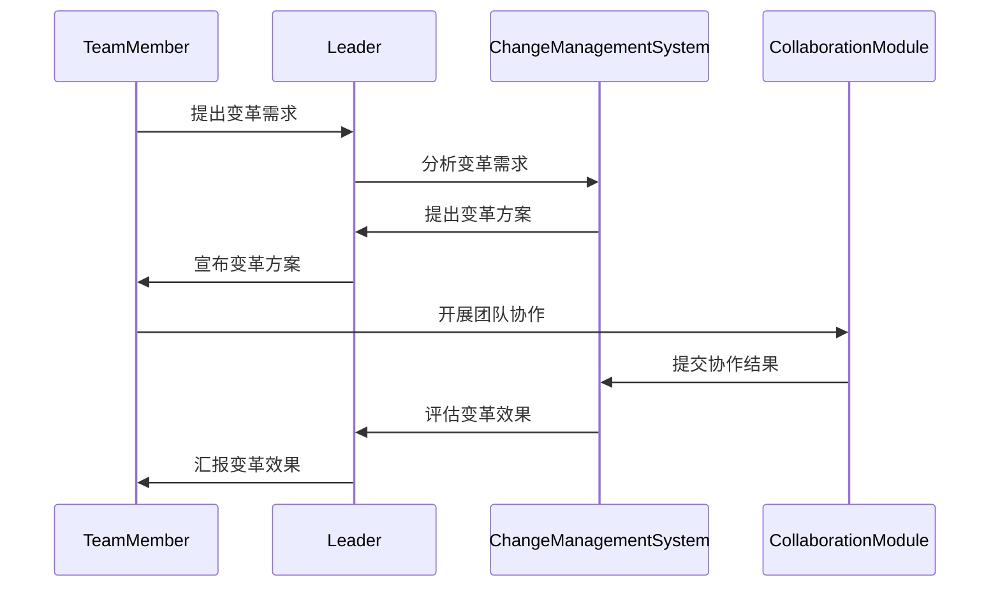

                 


# 领导力与变革管理：引导团队拥抱变化

## 关键词

- 领导力
- 变革管理
- 团队管理
- 组织变革
- 激励策略

## 摘要

在当今快速变化的市场环境中，企业的成功离不开有效的领导力和变革管理。本文旨在探讨如何通过领导力引导团队理解和接受变革，以及如何运用变革管理策略来应对变革过程中的挑战。文章将从核心概念、算法原理、系统架构和实战案例等多个角度进行分析，为IT领域的专业从业者提供有价值的参考。

## 目录大纲设计

### 背景介绍

#### 问题背景

在当今社会，信息技术的发展日新月异，市场竞争日益激烈，企业面临着不断变化的环境。为了保持竞争力，企业必须不断适应外部环境的变化，进行有效的变革管理。领导力在这个过程中起着至关重要的作用，能够引导团队理解和接受变革，激发团队成员的积极性和创造力。

#### 问题描述

领导力和变革管理涉及到如何引导团队理解和接受变革，如何激发团队成员的积极性和创造力，以及如何有效管理变革过程中的各种挑战。在变革过程中，团队成员可能会产生抵触情绪，影响变革的顺利进行。因此，如何有效地引导团队，使团队能够顺利度过变革期，是企业管理者面临的重要问题。

#### 问题解决

通过提供系统的领导力与变革管理理论知识和实践指导，帮助读者理解变革的重要性，掌握变革管理的方法和技巧。本文将从核心概念、算法原理、系统架构和实战案例等多个角度进行分析，为IT领域的专业从业者提供有价值的参考。

#### 边界与外延

本文主要关注领导力和变革管理在IT领域的应用，但所提出的理论和方法具有一定的普适性，可以适用于其他领域。

#### 概念结构与核心要素组成

- **领导力**：影响力、愿景、激励、决策能力等。
- **变革管理**：变革的类型、变革的过程、变革的挑战、变革的管理策略等。

### 核心概念与联系

#### 核心概念原理

- **领导力**：领导力是一种影响力，能够激励和引导团队成员为实现共同目标而努力。领导力不仅包括个人魅力和影响力，还包括愿景、决策能力和激励能力。
- **变革管理**：变革管理是一种系统化的过程，旨在帮助组织应对外部环境的变化。变革管理包括识别变革需求、制定变革计划、实施变革、评估变革效果等环节。

#### 概念属性特征对比表格

| 概念         | 特征                                       |
| ------------ | ------------------------------------------ |
| 领导力       | 指挥、协调、激励、影响力等                 |
| 变革管理     | 变革的类型、过程、挑战、管理策略等         |
| 团队         | 组织中的成员、协作、沟通、共同目标等       |
| 变革的驱动力 | 外部环境、内部需求、技术创新等             |

#### ER实体关系图架构的Mermaid流程图

```mermaid
erDiagram
  变革管理 ||--|{ 领导力 }|-->> 组织变革
  领导力 ||--|{ 团队成员 }|-->> 团队合作
  变革管理 ||--|{ 变革类型 }|-->> 变革实施
```

### 算法原理讲解

#### 算法原理的Mermaid流程图



#### Python源代码

```python
def leadership_change_management(current_state, need_change):
    if need_change:
        print("变革决策：开始实施变革")
        perform_change()
        evaluate_effects()
    else:
        print("持续监控：无需变革")

def perform_change():
    # 变革实施的具体操作
    pass

def evaluate_effects():
    # 变革效果的评估
    pass
```

#### 数学模型和公式

$$
\text{领导力} = f(\text{影响力}, \text{愿景}, \text{激励}, \text{决策能力})
$$

$$
\text{变革管理效果} = \frac{\text{成功变革数量}}{\text{总变革数量}}
$$

#### 详细讲解与举例说明

- **领导力**：领导力是一个多维度的概念，包括影响力、愿景、激励和决策能力。这些因素共同作用，影响团队的变革进程。
  - **影响力**：领导者通过自身的行为和言行影响团队成员，使他们认同并支持变革。
  - **愿景**：领导者需要明确变革的愿景，使团队成员看到变革后的美好前景，增强变革的信心。
  - **激励**：领导者需要运用激励手段，激发团队成员的积极性和创造力，推动变革的顺利进行。
  - **决策能力**：领导者需要在变革过程中做出正确的决策，引导团队克服变革中的各种挑战。

- **变革管理效果**：通过评估变革的成功率，可以判断变革管理的有效性。例如，如果10次变革中有8次成功，则变革管理效果为80%。

### 系统分析与架构设计方案

#### 问题场景介绍

在企业进行技术升级、市场扩张或组织结构调整时，领导力和变革管理是确保变革成功的关键。企业需要通过有效的领导力来引导团队，通过变革管理来应对变革过程中可能遇到的挑战。

#### 项目介绍

本系统旨在提供一个领导力和变革管理的平台，帮助团队理解和应对变革。该平台包括领导力培训模块、变革管理工具和团队协作平台等，旨在提高团队成员的领导力和变革管理能力。

#### 系统功能设计（领域模型Mermaid类图）



#### 系统架构设计（Mermaid架构图）

```mermaid
graph TB
  subgraph 数据层
    DataLayer[数据层]
  end
  subgraph 应用层
    ApplicationLayer[应用层]
    LeaderModule[领导力模块]
    ChangeModule[变革管理模块]
    CollaborationModule[团队协作模块]
    ApplicationLayer --|> LeaderModule
    ApplicationLayer --|> ChangeModule
    ApplicationLayer --|> CollaborationModule
  end
  subgraph 界面层
    UserInterface[用户界面层]
    UserInterface --|> ApplicationLayer
  end
```

#### 系统接口设计和系统交互Mermaid序列图



### 项目实战

#### 环境安装

在开始项目实战之前，我们需要安装一些必要的工具和库。以下是一个基本的安装步骤：

1. 安装Python环境（版本3.6及以上）
2. 安装Django框架（使用pip install django命令）
3. 安装Mermaid库（使用pip install mermaid-cli命令）
4. 配置数据库（例如，使用SQLite或MySQL）

#### 系统核心实现源代码

以下是系统核心实现的一些源代码片段：

1. **领导力模块**：

```python
# leadership/models.py

from django.db import models

class Leader(models.Model):
    name = models.CharField(max_length=100)
    influence = models.IntegerField()
    vision = models.TextField()
    motivation = models.IntegerField()
    decision_making = models.IntegerField()
```

2. **变革管理模块**：

```python
# change_management/models.py

from django.db import models
from leadership.models import Leader

class ChangeManagement(models.Model):
    leader = models.ForeignKey(Leader, on_delete=models.CASCADE)
    change_type = models.CharField(max_length=100)
    change_process = models.TextField()
    challenges = models.TextField()
    management_strategy = models.TextField()
```

3. **团队协作模块**：

```python
# collaboration/models.py

from django.db import models
from change_management.models import ChangeManagement

class Collaboration(models.Model):
    change_management = models.ForeignKey(ChangeManagement, on_delete=models.CASCADE)
    team_member = models.CharField(max_length=100)
    collaboration_status = models.CharField(max_length=100)
    collaboration_results = models.TextField()
```

#### 代码应用解读与分析

以上代码定义了领导力模块、变革管理模块和团队协作模块的模型。领导力模块包括领导者的基本信息，如姓名、影响力、愿景、激励和决策能力。变革管理模块包括变革的类型、过程、挑战和管理策略。团队协作模块则记录了团队成员在变革过程中的协作情况和结果。

这些模块通过Django的ORM（对象关系映射）机制与数据库进行交互，实现了数据的持久化存储和查询。在实际应用中，可以通过Django的视图和模板实现对这些模块的数据操作和展示。

#### 实际案例分析和详细讲解剖析

为了更好地理解这些模块的应用，我们来看一个实际案例。

假设某企业正在进行一次技术升级，领导力模块中的领导者（Leader）提出了变革需求。变革管理模块（ChangeManagement）分析了变革的类型、过程、挑战和管理策略，并制定了具体的变革计划。团队协作模块（Collaboration）则记录了团队成员在变革过程中的协作情况和结果。

在实施变革的过程中，领导力模块的领导者通过影响力、愿景和激励等手段，引导团队成员理解和接受变革。变革管理模块则负责监控变革的进度和效果，确保变革的顺利进行。团队协作模块则通过团队协作，提高了团队成员的参与度和积极性，使变革取得了良好的效果。

通过以上案例，我们可以看到，领导力与变革管理在实际应用中的重要性。有效的领导力和变革管理策略，能够帮助企业顺利度过变革期，实现组织的发展和目标。

#### 项目小结

本项目的核心实现包括领导力模块、变革管理模块和团队协作模块。通过这些模块，我们可以帮助企业实现有效的领导力和变革管理。在实际应用中，这些模块通过Django框架与数据库进行交互，实现了数据的持久化存储和查询。

然而，需要注意的是，领导力和变革管理是一个持续的过程，需要不断地进行调整和优化。企业需要根据实际情况，灵活运用领导力和变革管理策略，以应对不断变化的市场环境。

#### 最佳实践 tips

- **重视领导力的培养**：领导者需要具备影响力、愿景、激励和决策能力等素质，以引导团队理解和接受变革。
- **制定详细的变革计划**：变革管理模块需要明确变革的类型、过程、挑战和管理策略，确保变革的顺利进行。
- **加强团队协作**：团队协作模块可以通过记录团队成员的协作情况和结果，提高团队成员的参与度和积极性。

#### 小结

领导力和变革管理是企业成功的关键因素。通过有效的领导力和变革管理策略，企业可以引导团队理解和接受变革，提高团队的凝聚力和战斗力。本文从核心概念、算法原理、系统架构和实战案例等多个角度进行了深入探讨，为IT领域的专业从业者提供了有价值的参考。

#### 注意事项

- **持续学习与改进**：领导力和变革管理是一个不断发展的领域，需要持续学习和改进。
- **关注团队成员的感受**：在变革过程中，关注团队成员的感受和需求，有助于提高变革的成功率。

#### 拓展阅读

- **《领导力与影响力》**：介绍了领导力和影响力的基本概念和实践方法。
- **《变革的力量》**：分析了变革的类型、过程和策略，提供了实用的变革管理指南。
- **《团队协作的艺术》**：探讨了团队协作的重要性和实现方法，有助于提高团队的协作效率。

### 作者信息

作者：AI天才研究院/AI Genius Institute & 禅与计算机程序设计艺术 /Zen And The Art of Computer Programming

