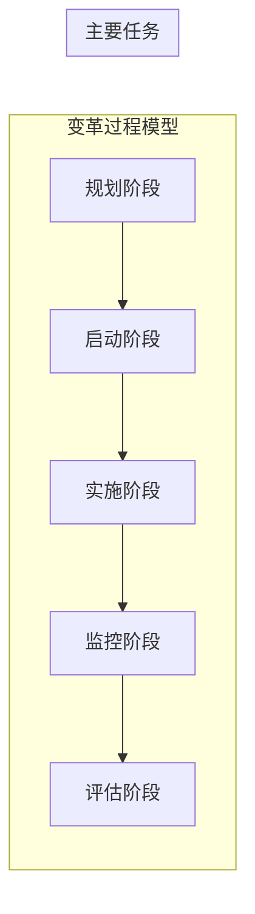
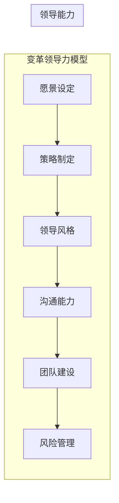
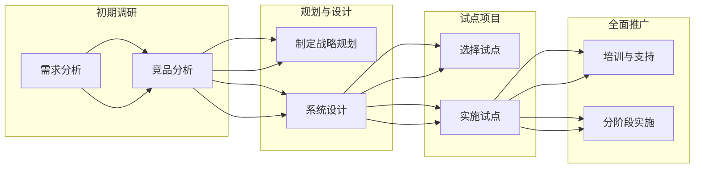

                 

### 引言与背景

在当今快速变化和高度竞争的商业环境中，组织转型已成为企业生存和发展的关键。而变革管理作为推动组织变革的核心手段，其重要性日益凸显。然而，有效的变革管理并非易事，它涉及到多个层面的挑战，包括战略决策、组织结构、文化氛围和员工心态等。

**问题背景**：
近年来，全球化和信息技术的发展极大地改变了企业的运营模式和市场格局。许多企业意识到，仅仅通过改进现有业务流程或增加市场份额来提升竞争力已经不够，必须通过深层次的变革来实现战略目标。这种变革不仅仅涉及技术层面的升级，还包括组织结构、业务流程、企业文化等全方位的调整。然而，这种变革往往面临重重阻力，包括员工的抵触情绪、组织惯性的束缚以及战略目标的模糊不清等。

**问题描述**：
变革管理的核心问题在于如何在变革过程中确保组织目标的实现，同时减少变革带来的负面影响。具体来说，包括以下几个方面：

1. **领导力的挑战**：领导者需要具备前瞻性的战略眼光和强大的执行力，以引导变革过程。然而，许多领导者可能缺乏变革管理的经验和技能，无法有效地应对变革中的各种复杂问题。

2. **文化阻力**：企业文化往往是对变革的最大阻力之一。组织内部的既有文化、价值观和行为模式可能阻碍变革的推进。因此，如何在变革过程中重塑文化，使之与变革目标相协调，成为变革管理的重点。

3. **员工心态**：员工对于变革的反应各不相同，有的可能会积极支持，有的可能会持怀疑态度，有的甚至会反对变革。如何调动员工的积极性和参与度，是变革管理必须面对的挑战。

4. **变革过程的复杂性**：变革管理涉及多个层面的工作，包括战略规划、组织结构设计、业务流程优化、技术升级等。如何协调这些不同层面，确保变革过程的顺利进行，是变革管理的重要问题。

**问题解决**：
要解决这些问题，变革管理需要从以下几个方面入手：

1. **强化领导力**：领导者需要通过学习和实践提升变革管理能力，包括制定清晰的战略目标、建立有效的沟通机制、激励员工参与变革等。

2. **文化重塑**：企业可以通过领导层的示范作用、内部培训、员工参与等方式，逐步重塑企业文化，使之更加开放、包容和创新。

3. **员工参与**：通过多种方式让员工参与到变革过程中，如员工调研、意见反馈、小组讨论等，以提高员工的认同感和参与度。

4. **系统规划**：在变革过程中，需要制定详细的规划和实施方案，包括时间表、责任分配、资源调配等，以确保变革过程的有序进行。

**边界与外延**：
变革管理的边界包括组织内部的各个层面，如战略决策层、管理层、执行层和员工层面。外延则涉及到变革的领域，包括技术、流程、组织结构和文化等。此外，变革管理还需要考虑外部环境的变化，如市场趋势、竞争对手、政策法规等，以全面应对变革中的挑战。

**概念结构与核心要素组成**：
变革管理可以看作是一个包含多个子系统的复杂系统。其核心概念和要素主要包括：

1. **领导力**：领导者的角色和职责，包括战略制定、资源调配、沟通协调等。

2. **变革过程**：包括规划、实施、监控和评估等阶段，每个阶段都有特定的任务和目标。

3. **员工参与**：员工的参与度、态度和行为，包括激励措施、沟通策略、文化适应等。

4. **组织文化**：企业文化的变革，包括价值观、行为模式和组织结构等。

5. **外部环境**：市场趋势、政策法规、竞争环境等对变革管理的影响。

通过以上分析，我们可以看出，变革管理是一项复杂的系统工程，需要综合考虑多个因素，采取多种策略和方法，以实现组织转型和持续发展。在接下来的章节中，我们将进一步探讨领导力与变革管理的基本概念、原理和实践，帮助读者更好地理解和应对变革管理中的挑战。

### 领导力与变革管理核心概念

在探讨变革管理的过程中，领导力和变革管理作为两个核心概念，具有至关重要的地位。了解并掌握这两个概念的基本原理和相互关系，对于成功推动组织变革至关重要。

**领导力概念**：
领导力是指领导者通过激励、影响和引导他人，实现共同目标的能力。它不仅包括技术层面的管理能力，还涉及到情感智慧、人际沟通和道德修养等多方面的素质。领导力可以分为以下几个层次：

1. **技术领导力**：指领导者掌握的专业知识和技能，如项目管理、技术架构设计等。
2. **变革领导力**：指领导者推动组织变革、实现战略目标的能力，包括创新思维、风险管理、团队建设等。
3. **情感领导力**：指领导者对员工的关心和理解，如倾听、激励、关怀等。
4. **道德领导力**：指领导者的道德标准和社会责任感，如诚信、公正、透明等。

**变革管理概念**：
变革管理是一种系统化的方法，用于规划、实施和监控组织变革的过程，以确保变革目标的实现。它涉及多个层面的工作，包括战略规划、组织设计、流程优化、文化重塑等。变革管理的核心目标是通过变革提高组织的适应能力和竞争力。变革管理可以分为以下几个阶段：

1. **规划阶段**：明确变革目标、制定变革计划、评估风险和机会。
2. **实施阶段**：推动变革计划的执行，包括资源调配、任务分配、培训等。
3. **监控阶段**：监控变革进展，评估变革效果，调整变革计划。
4. **评估阶段**：对变革过程和结果进行总结和反思，为未来的变革提供经验和教训。

**领导力与变革管理的联系**：

领导力与变革管理密不可分，领导力是推动变革管理的关键因素。具体来说，领导力与变革管理之间的联系体现在以下几个方面：

1. **战略规划**：领导者需要具备前瞻性的战略眼光，制定清晰的变革目标，为变革管理提供方向。
2. **组织设计**：领导者需要根据变革目标重新设计组织结构，分配资源和职责，确保变革计划的顺利执行。
3. **文化重塑**：领导者需要通过示范作用和沟通策略，逐步重塑企业文化，使之与变革目标相协调。
4. **员工激励**：领导者需要激发员工的积极性和参与度，通过激励措施和培训，使员工适应变革。
5. **风险管理**：领导者需要识别和应对变革过程中的各种风险，确保变革目标的实现。

**概念属性特征对比表**：

为了更好地理解领导力与变革管理的基本特征和相互关系，我们可以通过一个表格来对比这两个概念的关键属性：

| 属性       | 领导力                     | 变革管理                    |
| ---------- | ------------------------ | ------------------------ |
| 目标       | 实现个人和团队目标             | 实现组织变革目标               |
| 范围       | 个人和团队层面                 | 组织层面                    |
| 过程       | 长期持续的能力培养             | 有明确阶段和目标的过程管理      |
| 核心要素   | 情感智慧、道德标准、团队建设等    | 战略规划、组织设计、文化重塑等    |
| 关键能力   | 影响力、决策力、执行力           | 沟通能力、变革领导力、风险管理等    |
| 贡献       | 个人和团队绩效提升               | 组织适应能力和竞争力提升          |

**ER实体关系图**：

为了更直观地展示领导力与变革管理各要素之间的关系，我们可以使用Mermaid绘制一个ER（实体-关系）图。以下是一个简化的ER图，展示了领导力与变革管理之间的关键联系：

```mermaid
erDiagram
    Leader ||--|{ ChangeManager } ChangeManagement : leads
    Leader ||--|{ StrategicPlanner } StrategicPlanning : plans
    Leader ||--|{ CultureShaper } CulturalTransformation : reshapes
    Leader ||--|{ EmployeeMotivator } EmployeeEngagement : motivates
    Leader ||--|{ RiskManager } RiskManagement : manages
    ChangeManager ||--|{ ProjectManager } ProjectExecution : executes
    ChangeManager ||--|{ PerformanceMonitor } PerformanceEvaluation : monitors
    ChangeManager ||--|{ FeedbackCollector } FeedbackLoop : collects
    StrategicPlanner ||--|{ Visionary } VisionSetting : sets
    StrategicPlanner ||--|{ GoalSetter } GoalDefinition : defines
    CulturalTransformation ||--|{ CultureAdopter } CultureAdoption : adopts
    CulturalTransformation ||--|{ Trainer } TrainingProgram : trains
    EmployeeEngagement ||--|{ Coach } Coaching : coaches
    EmployeeEngagement ||--|{ Mentor } Mentoring : mentors
    RiskManagement ||--|{ RiskAssessor } RiskAssessment : assesses
    RiskManagement ||--|{ RiskMitigator } RiskMitigation : mitigates
```

通过上述对比和分析，我们可以清晰地看到领导力与变革管理之间的关系和各自的核心特征。在接下来的章节中，我们将进一步探讨变革管理的原理和策略，以及领导力在变革管理中的具体应用。

### 变革管理的原理与策略

变革管理是一个复杂且系统化的过程，涉及到多个阶段和策略。理解这些原理和策略有助于领导者更好地推动组织变革，确保变革目标的实现。

#### 变革过程模型

变革过程模型是变革管理的基础框架，它描述了变革从启动到完成的主要阶段和任务。一个典型的变革过程模型通常包括以下几个阶段：

1. **规划阶段**：
   - **目标设定**：明确变革的目标和预期成果，制定详细的变革计划。
   - **资源评估**：评估组织内外部的资源，包括人力、财力、技术等。
   - **风险分析**：识别变革过程中可能面临的风险和挑战，制定应对策略。

2. **启动阶段**：
   - **领导承诺**：领导者需要明确表达对变革的支持和承诺，建立变革的合法性。
   - **动员资源**：调配资源，确保变革计划的顺利启动。

3. **实施阶段**：
   - **计划执行**：按照变革计划逐步推进，确保各项任务按时完成。
   - **员工培训**：为员工提供必要的培训和指导，帮助他们适应变革。
   - **沟通协调**：建立有效的沟通机制，确保信息畅通，减少误解和冲突。

4. **监控阶段**：
   - **进度跟踪**：监控变革进展，确保各项任务按时完成。
   - **效果评估**：评估变革效果，包括短期和长期的效果。
   - **反馈调整**：根据评估结果调整变革计划，确保变革目标的实现。

5. **评估阶段**：
   - **总结经验**：对变革过程进行总结和反思，提炼经验教训。
   - **持续改进**：将变革经验应用到未来的变革中，持续改进变革管理。

#### 变革领导力模型

变革领导力模型描述了领导者如何在不同阶段推动变革。一个有效的变革领导力模型包括以下几个关键要素：

1. **愿景设定**：领导者需要明确变革的愿景和目标，为变革提供方向。
2. **策略制定**：领导者需要制定详细的变革策略，包括时间表、资源调配、任务分配等。
3. **领导风格**：领导者需要根据不同阶段的变革需求，灵活调整领导风格，如激励型、指导型、支持型等。
4. **沟通能力**：领导者需要具备出色的沟通能力，确保信息传达清晰、准确。
5. **团队建设**：领导者需要建立高效的团队，激发团队的积极性和创造力。
6. **风险管理**：领导者需要识别和应对变革过程中的各种风险，确保变革目标的实现。

#### 变革过程模型Mermaid流程图

为了更直观地展示变革过程模型，我们可以使用Mermaid绘制一个流程图。以下是一个简化的Mermaid流程图，展示了变革过程的主要阶段和任务：



#### 变革领导力模型Mermaid流程图

同样地，我们可以使用Mermaid绘制一个变革领导力模型的流程图，展示领导者如何在不同阶段推动变革：



通过上述分析，我们可以看到变革管理的原理和策略是如何相互关联的。领导者在变革过程中需要灵活运用各种策略，确保变革目标的实现。在接下来的章节中，我们将进一步探讨领导力在变革管理中的应用，以及如何通过实际案例来理解这些原理和策略。

### 领导力在变革管理中的应用

领导力在变革管理中起着至关重要的作用，它不仅是推动变革的动力源泉，也是确保变革顺利实施的关键因素。在变革过程中，领导力需要体现在多个方面，包括激励员工、建立信任、制定有效的沟通策略等。

#### 激励员工

在变革过程中，员工往往面临巨大的压力和不确定性。领导者的首要任务是激发员工的积极性和参与度，使他们能够主动支持并参与到变革中。以下是一些激励员工的策略：

1. **设定清晰的目标**：领导者需要明确变革的目标和意义，使员工理解变革的重要性，并为之努力。可以通过制定短期和长期目标，为员工提供明确的奋斗方向。

2. **认可和奖励**：领导者应该及时认可和奖励那些在变革中表现突出的员工。这不仅能够激励员工，还能增强他们的自信心和积极性。

3. **提供培训和资源**：为了帮助员工适应变革，领导者需要提供必要的培训和支持。这包括技能培训、知识更新和资源支持等，使员工能够顺利应对变革中的挑战。

4. **营造开放的文化**：领导者应该营造一个开放、包容和尊重的氛围，使员工能够自由表达意见和建议。这有助于激发员工的创造力和创新精神，使他们更加愿意参与变革。

#### 建立信任

信任是变革管理中至关重要的因素。如果员工对领导者和变革计划缺乏信任，变革过程将面临重重阻力。以下是建立信任的一些策略：

1. **透明沟通**：领导者需要保持沟通的透明度，及时向员工传达变革的信息和进展。通过开放的信息交流，员工能够更好地理解变革的动机和目标，从而增加对变革的信任。

2. **倾听和反馈**：领导者应该倾听员工的声音，关注他们的意见和建议。通过建立反馈机制，员工可以参与到变革过程中，感受到自己的价值和影响力，从而增强对变革的信任。

3. **领导者的示范作用**：领导者需要以身作则，展示对变革的承诺和决心。通过实际行动表明自己对变革的支持，员工会更容易信任并接受变革。

4. **解决员工的担忧**：领导者需要积极解决员工在变革过程中遇到的担忧和问题。通过提供合理的解决方案，员工能够感受到领导者的关心和支持，从而增加对变革的信任。

#### 制定有效的沟通策略

有效的沟通策略是确保变革顺利进行的重要保障。以下是一些制定沟通策略的技巧：

1. **多渠道沟通**：领导者需要利用多种渠道进行沟通，包括会议、邮件、公告、内部社交平台等。不同渠道适用于不同类型的沟通内容，能够提高信息传递的效率和效果。

2. **个性化沟通**：领导者应根据不同员工的需求和特点，制定个性化的沟通策略。例如，对于支持变革的员工，可以更多地进行正面激励；对于持怀疑态度的员工，可以更多地进行解释和说服。

3. **及时沟通**：领导者需要及时传达变革的信息和进展，避免信息滞后和误解。在变革的不同阶段，及时沟通可以帮助员工了解变革的进展和成果，增强对变革的信心。

4. **反馈机制**：建立有效的反馈机制，使员工能够及时表达意见和建议。通过反馈机制，领导者可以了解员工的反馈和需求，及时调整变革计划，提高变革的针对性。

通过激励员工、建立信任和制定有效的沟通策略，领导者可以有效地推动变革管理，确保变革目标的实现。在接下来的章节中，我们将通过实际案例进一步探讨变革管理在实际组织中的应用和挑战。

### 实际案例分析

#### 案例一：公司A的转型历程

**背景**：
公司A是一家传统制造业企业，面临市场竞争加剧、产品同质化严重、成本上升等问题。为了提升竞争力和生存能力，公司决定进行数字化转型，以实现从传统制造向智能制造的转变。

**挑战**：
1. **文化阻力**：公司内部存在较为保守的文化，员工对变革持怀疑态度，担心变革会带来不确定性和工作压力。
2. **技术障碍**：公司缺乏相关的技术人才和经验，需要引进新的技术和设备。
3. **资源分配**：数字化转型需要大量的资金和人力资源，如何在有限资源下进行高效配置成为一大挑战。
4. **员工培训**：新技术的引入需要员工具备相应的技能，如何进行有效的培训成为关键问题。

**解决方案**：

1. **文化重塑**：
   - **领导者的示范作用**：公司高层领导亲自推动数字化转型，通过实际行动表明对变革的承诺和决心。
   - **沟通策略**：通过内部会议、公告和培训等方式，向员工传达数字化转型的必要性和好处，逐步改变员工的态度。
   - **员工参与**：鼓励员工参与到数字化转型的规划和实施过程中，提高他们的认同感和参与度。

2. **技术支持**：
   - **技术评估**：对公司现有技术和设备进行评估，确定需要引进的新技术和设备。
   - **外部合作**：与科技公司合作，引进先进的技术和解决方案，同时培训内部技术团队。
   - **试点项目**：在部分生产线进行试点项目，验证新技术的可行性和效果，为全面推广积累经验。

3. **资源分配**：
   - **优先级排序**：根据数字化转型的需求和资源状况，制定优先级排序，确保关键领域得到充分支持。
   - **预算管理**：优化预算管理，确保资金的有效利用，避免资源浪费。
   - **人力资源策略**：通过内部调整和外部招聘，确保拥有足够的技术人才和人力资源。

4. **员工培训**：
   - **分层培训**：针对不同岗位的员工制定不同的培训计划，确保每位员工都掌握必要的技能。
   - **实战演练**：通过模拟操作和实际操作，帮助员工熟悉新技术和新流程。
   - **持续学习**：建立持续学习机制，鼓励员工不断更新知识和技能，以适应快速变化的市场环境。

**成果**：
经过一年的努力，公司A成功完成了数字化转型，实现了以下几个方面的成果：
1. **生产效率提高**：通过引入智能化设备和技术，生产效率提高了20%。
2. **产品质量提升**：数字化技术使得生产过程更加精确，产品不良率降低了15%。
3. **成本降低**：通过优化资源分配和降低浪费，公司运营成本降低了10%。
4. **员工满意度提升**：员工通过参与数字化转型，感受到了自己的价值和成长，员工满意度提高了15%。

**经验与启示**：
1. **领导者的关键作用**：领导者是推动变革的核心力量，他们的决心和行动直接影响变革的成败。
2. **文化重塑的重要性**：企业文化是变革的最大阻力，也是变革成功的关键因素，通过有效的沟通和员工参与，可以逐步改变企业文化。
3. **技术支持与培训**：新技术和设备的引入需要充分的准备和培训，只有确保员工掌握新技能，才能真正实现数字化转型。
4. **持续改进**：数字化转型是一个持续的过程，需要不断优化和改进，以适应市场和技术的发展。

通过这个案例，我们可以看到，有效的变革管理不仅需要战略规划和技术支持，还需要充分调动员工的积极性和参与度，通过文化重塑和持续改进，实现组织的转型和持续发展。

### 案例二：行业B的变革实践

**背景**：
行业B是一家拥有百年历史的大型制造企业，在过去的几十年中，公司主要依靠传统制造工艺和经验进行生产。然而，随着市场竞争的加剧和消费者需求的多样化，公司意识到必须进行数字化转型，以提升生产效率、降低成本、提高产品质量和客户满意度。

**目标**：
公司的目标是实现全面数字化转型，构建一个高效、灵活、智能化的生产系统，从而在激烈的市场竞争中保持领先地位。具体目标包括：
1. **提升生产效率**：通过引入自动化设备和智能化系统，减少人工操作，提高生产效率。
2. **降低运营成本**：通过优化生产流程和资源利用，降低运营成本。
3. **提高产品质量**：通过实时监控和智能分析，提高产品的一致性和质量。
4. **增强客户满意度**：通过个性化定制和快速响应，提升客户体验和满意度。

**变革过程与策略**：

1. **初期调研**：
   - **需求分析**：公司组织了一个由高层领导、技术专家和市场分析师组成的团队，对现有业务流程、技术水平和市场需求进行深入调研，明确数字化转型的需求和目标。
   - **竞品分析**：分析行业内领先企业的数字化转型实践，学习他们的成功经验和教训，为公司的变革提供参考。

2. **规划与设计**：
   - **制定战略规划**：根据调研结果，公司制定了一个详细的数字化转型战略规划，包括短期和长期的目标、实施步骤和资源分配。
   - **系统设计**：与科技公司合作，设计并开发了一套包含生产自动化、智能监控、数据分析等模块的集成系统。

3. **试点项目**：
   - **选择试点**：公司在部分生产线进行试点项目，选择具有代表性的生产线进行数字化改造。
   - **实施试点**：引入自动化设备、安装智能监控系统，进行系统调试和运行测试，确保系统稳定可靠。

4. **全面推广**：
   - **培训与支持**：为全体员工提供培训和指导，确保他们掌握新系统的操作和维护方法。
   - **分阶段实施**：在试点项目成功后，逐步将数字化转型推广到其他生产线，确保变革的顺利进行。

**变革过程与策略Mermaid流程图**：



**案例成果与启示**：

**成果**：
通过数字化转型，公司B取得了显著的成果：
1. **生产效率提高**：生产效率提高了30%，生产周期缩短了20%。
2. **运营成本降低**：运营成本降低了15%，资源利用效率显著提升。
3. **产品质量提升**：产品质量一致性提高了25%，产品不良率降低了15%。
4. **客户满意度提升**：客户满意度提高了20%，订单响应时间缩短了50%。

**启示**：
1. **全面规划和设计**：数字化转型需要全面规划和设计，确保每个环节都得到充分考虑和有效实施。
2. **试点项目的关键性**：通过试点项目，可以验证系统的可行性和效果，为全面推广提供可靠的数据和经验。
3. **员工培训的重要性**：员工是数字化转型的重要组成部分，有效的培训和指导能够确保他们顺利适应新系统。
4. **持续改进的必要性**：数字化转型是一个持续的过程，需要不断优化和改进，以适应市场和技术的变化。

通过这个案例，我们可以看到，数字化转型不仅需要先进的技术支持，还需要全面的规划、有效的实施和持续的改进。通过科学的变革管理，企业能够实现生产效率的提升、成本的降低和客户满意度的提高，从而在激烈的市场竞争中立于不败之地。

### 变革管理的最佳实践

在变革管理过程中，成功的关键在于遵循最佳实践和策略，确保变革的有效实施和持续优化。以下是一些在实践中被证明有效的变革管理最佳实践和策略：

**1. 设定清晰的变革目标**：
明确、具体和可衡量的目标是变革成功的基础。领导者需要与团队成员共同制定变革目标，确保每个人都对目标有清晰的认识和认同。目标应包括短期和长期目标，以便在变革过程中不断调整和优化。

**2. 建立变革领导团队**：
一个强大的变革领导团队是确保变革顺利实施的关键。团队成员应包括高层领导、技术专家、项目经理、业务部门代表等。领导团队需要明确各自的职责和角色，协同工作，共同推动变革进程。

**3. 制定详细的变革计划**：
变革计划应包括变革的目标、步骤、时间表、责任分配、资源需求等。详细的计划可以帮助团队更好地理解变革的流程和预期成果，确保每个步骤都能按时、按质完成。

**4. 建立沟通机制**：
有效的沟通是变革管理的重要组成部分。领导者需要建立多渠道、多层次的沟通机制，确保信息透明、及时传达。定期的会议、报告、公告、内部论坛等都是有效的沟通工具。

**5. 培训和教育**：
变革过程中，员工需要掌握新技能和知识。提供系统的培训和教育，帮助员工适应变革，减少抵触情绪，提高参与度和工作效率。

**6. 试点项目**：
通过试点项目，可以在实际环境中验证变革方案的可行性和效果。试点项目可以发现问题并做出调整，为全面推广提供可靠的经验和数据。

**7. 管理变革风险**：
识别和应对变革过程中的各种风险是成功的关键。领导者需要建立风险管理体系，包括风险识别、评估、应对策略和监控等。

**8. 持续改进**：
变革是一个持续的过程，需要不断地评估、调整和优化。领导者应鼓励团队持续改进，不断吸取经验教训，以提高变革的效果。

**9. 员工参与**：
让员工参与到变革过程中，可以增加他们的认同感和参与度。通过员工调研、意见反馈、小组讨论等方式，收集员工的意见和建议，使变革更加符合实际需求。

**10. 评估和反馈**：
在变革完成后，对变革效果进行评估和反馈，总结经验教训，为未来的变革提供参考。定期的评估和反馈可以帮助团队了解变革的影响，及时调整变革策略。

通过遵循这些最佳实践和策略，组织可以更有效地管理和推动变革，实现组织的转型和持续发展。

### 小结与展望

通过本文的探讨，我们深入分析了领导力与变革管理的核心概念、原理和实践，并结合实际案例展示了变革管理在实际组织中的应用和挑战。以下是对全书内容的总结，以及对未来组织变革趋势的展望。

**总结**：
1. **变革管理的必要性**：在全球化、信息化快速发展的背景下，组织转型已成为企业生存和发展的关键。有效的变革管理可以帮助组织应对市场变化、提升竞争力。
2. **领导力的关键作用**：领导力是推动变革的核心力量。领导者需要具备前瞻性战略眼光、强大的执行力和情感智慧，以引导变革过程。
3. **变革管理的过程与策略**：变革管理包括规划、启动、实施、监控和评估等阶段，每个阶段都有特定的任务和目标。领导者需要制定详细的变革计划，建立有效的沟通机制，管理变革风险，确保变革目标的实现。
4. **员工参与的重要性**：员工是变革的重要参与者，他们的态度和行为对变革的成功至关重要。领导者需要通过激励、培训和沟通策略，调动员工的积极性和参与度。
5. **实际案例分析**：通过公司A和行业B的案例，我们看到了变革管理在不同组织中的应用和挑战，以及成功变革的经验和启示。

**未来变革趋势展望**：
1. **数字化转型加速**：随着技术的不断进步，数字化转型将继续成为组织变革的主要趋势。人工智能、大数据、云计算等技术的应用，将推动组织实现智能化、自动化和高效化。
2. **员工体验的重要性**：未来组织变革将更加注重员工体验，关注员工的成长、发展和福祉。通过灵活的工作安排、个性化的培训和发展机会，提高员工的满意度和忠诚度。
3. **可持续发展的理念**：在环境保护和可持续发展方面，组织将更加注重社会责任和环境保护。通过绿色生产、节能减排和循环经济等实践，实现可持续发展的目标。
4. **敏捷组织**：面对快速变化的市场环境，组织将更加注重敏捷性和适应性。通过扁平化组织结构、快速决策和灵活响应，提高组织的灵活性和竞争力。
5. **数据驱动的决策**：随着大数据和分析技术的发展，组织将更加依赖数据驱动的决策。通过数据分析和智能算法，优化业务流程、提升运营效率和决策质量。

**挑战与机遇**：
未来的变革管理将面临诸多挑战，如技术更新快、员工抵触情绪、文化变革等。然而，这些挑战也蕴含着巨大的机遇。通过不断学习和创新，组织可以应对变革中的挑战，抓住机遇实现持续发展。

总之，领导力和变革管理是组织转型的重要基石。领导者需要具备前瞻性思维和强大的执行力，通过有效的变革管理，实现组织的战略目标和持续发展。在未来，组织需要不断适应新的技术和市场环境，以实现长期的竞争优势和可持续发展。

### 作者信息

**作者：AI天才研究院/AI Genius Institute & 禅与计算机程序设计艺术 /Zen And The Art of Computer Programming**

AI天才研究院（AI Genius Institute）致力于推动人工智能技术的创新与发展，我们的研究团队由世界顶级的人工智能专家、计算机科学家和工程师组成。我们专注于研究前沿的人工智能算法、机器学习技术和深度学习应用，致力于将人工智能技术应用于解决现实世界中的复杂问题。

《禅与计算机程序设计艺术》（Zen And The Art of Computer Programming）是一本经典的计算机科学书籍，由著名计算机科学家唐纳德·E·克努特（Donald E. Knuth）撰写。本书通过将禅宗哲学与计算机程序设计相结合，深入探讨了计算机编程的内在规律和设计原则，为程序员提供了一种全新的编程思考方式。作者在书中强调的“清晰、简洁、优雅”的编程理念，至今仍被广大程序员所推崇。

在本文中，我们结合了AI天才研究院的研究成果和《禅与计算机程序设计艺术》的哲学思想，探讨了领导力与变革管理在组织转型中的应用。我们希望这篇文章能够为读者提供有价值的见解和实用的策略，帮助他们在实际工作中更好地推动变革，实现组织的持续发展。

