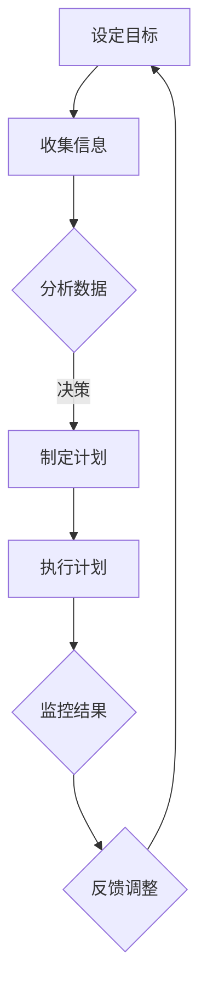
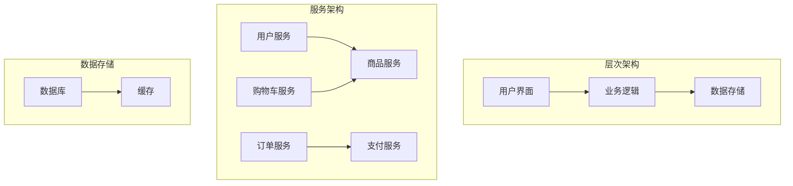
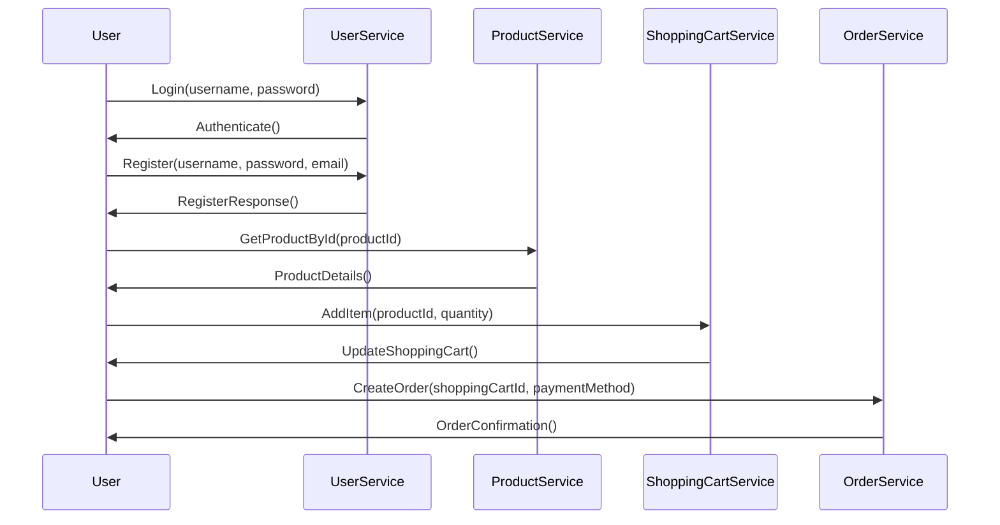
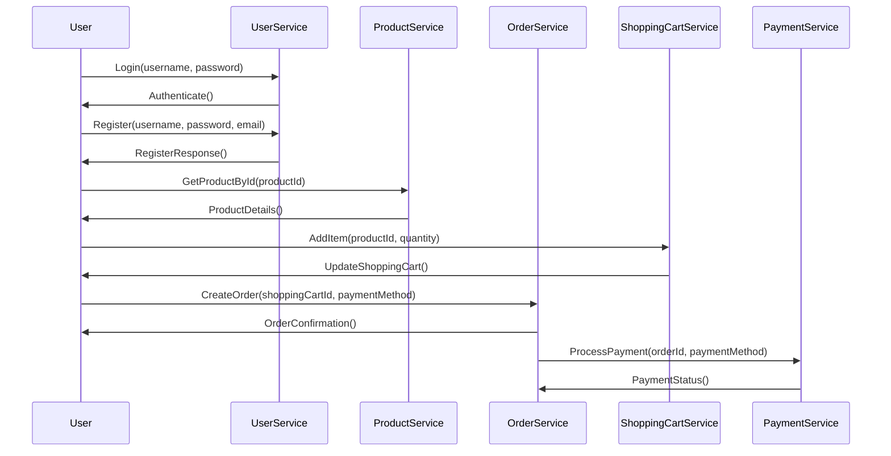

                 

### **背景介绍**

#### 领导力的定义与重要性

领导力，是一种激励和引导他人朝着共同目标努力的能力。它不仅仅是权力和地位的象征，更是一种个人素质和品质的体现。在组织管理中，领导力起着至关重要的作用，它能够影响团队成员的工作态度和行为，从而决定团队的整体表现和组织的成功。

首先，领导力的基本概念包括几个关键维度：

1. **情感智慧**：这是理解自己和他人的情感，并有效管理这些情感的能力。一个具备高情感智慧领导者能够更好地理解团队成员的需求，从而做出更合理的决策。

2. **影响力**：领导者通过言行和决策影响他人，推动团队达成目标的能力。影响力不仅体现在领导者的权威和命令中，更体现在其人格魅力和道德品质上。

3. **决策能力**：领导者需要具备在复杂和不确定的环境中做出明智决策的能力。良好的决策能力能够帮助团队避免风险，抓住机会，实现目标。

4. **沟通技巧**：沟通是领导者必备的能力之一，良好的沟通技巧能够确保信息准确传达，减少误解和冲突，增强团队的凝聚力。

5. **建立信任**：信任是团队高效运作的基础。一个能够建立信任的领导者，能够赢得团队成员的尊重和信任，从而形成和谐的工作环境。

在组织中的作用方面，领导力主要体现在以下几个方面：

- **指导与激励**：领导者通过设定目标、分配任务和提供反馈，指导团队成员的工作，并激发他们的工作热情和积极性。

- **协调与合作**：领导者需要协调团队内部和团队之间的关系，促进合作，确保团队目标的实现。

- **危机管理**：在面临困难和挑战时，领导者需要冷静分析，采取有效措施，引导团队度过难关。

- **创新与变革**：领导者鼓励创新思维，推动组织变革，确保组织能够适应外部环境的变化。

#### 同理心的概念及其对领导力的影响

同理心，是指设身处地理解他人情感和需求的能力。它是领导力的核心要素之一，对领导力的提升具有重要作用。

首先，同理心的基本概念包括以下几点：

1. **情感感知**：理解他人的情感状态，包括正面和负面情感。

2. **情感理解**：在情感感知的基础上，能够从他人的角度理解和解释情感。

3. **情感反应**：对他人的情感反应，即通过行为和言语表达对他人情感的理解和关怀。

同理心对领导力的影响主要表现在以下几个方面：

- **增强沟通效果**：同理心能够帮助领导者更好地理解团队成员的需求和情感，从而进行更有效的沟通。

- **建立信任关系**：同理心能够赢得团队成员的信任和尊重，增强团队凝聚力。

- **提高决策质量**：同理心使领导者能够从多个角度考虑问题，避免偏见和盲点，做出更明智的决策。

- **激励团队成员**：同理心使领导者能够更好地理解团队成员的需求和动机，从而进行更有针对性的激励。

#### 领导力与同理心的相互作用

领导力和同理心并不是孤立存在的，它们之间有着密切的相互作用。一个具备高度同理心的领导者，能够更好地理解和满足团队成员的需求，从而提高领导力；而一个具备高领导力的领导者，能够更好地运用同理心，增强领导效果。

总的来说，领导力和同理心共同构成了一个有效的领导框架，使领导者能够在复杂多变的环境中，有效地激励和引导团队成员，实现组织目标。

### **核心概念与联系**

#### 领导力的核心概念

领导力是一个复杂的概念，包含多个核心维度。为了更好地理解和应用领导力，我们可以将其核心概念详细描述如下：

1. **情感智慧（Emotional Intelligence）**：
   - **定义**：情感智慧是指一个人认识自己情感、管理自己情感，以及识别和理解他人情感的能力。
   - **特征**：
     - 自我意识（Self-awareness）：了解自己的情感状态，并能够准确地识别和管理这些情感。
     - 自我管理（Self-management）：在压力和挑战面前保持冷静和专注，控制自己的情绪和行为。
     - 社会意识（Social awareness）：理解他人的情感和需求，认识到他人的感受，并能够有效地运用这些认识来协调人际关系。
     - 关系管理（Relationship management）：建立和维护积极的人际关系，能够有效地沟通和激励他人。

2. **影响力（Influence）**：
   - **定义**：影响力是指一个人通过言行和决策影响他人，推动他人达成目标的能力。
   - **特征**：
     - **魅力领导**（Charismatic Leadership）：领导者具有独特的个性魅力，能够激发团队成员的追随欲望。
     - **权威领导**（Authoritative Leadership）：领导者通过职位和权力来影响他人，具有明确的决策权和执行力。
     - **变革型领导**（Transformational Leadership）：领导者通过启发和激励团队成员，推动团队实现变革和创新。
     - **交易型领导**（Transaction Leadership）：领导者通过奖励和惩罚来激励团队成员，注重短期效果和具体目标。

3. **决策能力（Decision-making）**：
   - **定义**：决策能力是指一个人在复杂和不确定的环境中，做出明智和有效决策的能力。
   - **特征**：
     - **信息收集**（Information Gathering）：广泛收集相关信息，确保决策基于充分的数据和事实。
     - **分析评估**（Analysis and Evaluation）：对收集到的信息进行深入分析，评估各种决策方案的风险和收益。
     - **选择方案**（Option Selection）：从多个备选方案中选择最佳方案，确保决策具有可行性和有效性。
     - **执行监控**（Implementation and Monitoring）：实施决策，并持续监控和调整，确保目标达成。

4. **沟通技巧（Communication Skills）**：
   - **定义**：沟通技巧是指一个人通过有效的方式表达自己的想法，理解他人的意见，并建立良好沟通关系的能力。
   - **特征**：
     - **清晰表达**（Clear Expression）：准确地表达自己的观点和想法，避免歧义和误解。
     - **积极倾听**（Active Listening）：主动倾听他人的意见和需求，理解其背后的情感和动机。
     - **反馈与澄清**（Feedback and Clarification）：提供积极的反馈，并就模糊或不确定的信息进行澄清。
     - **冲突管理**（Conflict Management）：在出现分歧和冲突时，能够有效地沟通，寻求共识和解决方案。

5. **建立信任（Building Trust）**：
   - **定义**：建立信任是指通过言行一致、诚实正直和透明沟通等方式，赢得他人的信任和尊重。
   - **特征**：
     - **诚信**（Integrity）：领导者言行一致，遵守承诺，保持透明和诚实。
     - **信任建立**（Trust Building）：通过持续的行为和行动，逐步赢得团队成员的信任。
     - **信任维护**（Trust Maintenance）：在出现问题时，及时沟通和解决，避免信任受损。

#### 同理心的核心要素

同理心是一种情感智慧的具体体现，是领导者理解他人情感和需求的重要能力。同理心的核心要素包括以下几点：

1. **情感感知（Emotional Perception）**：
   - **定义**：情感感知是指能够识别和感知他人的情感状态。
   - **特征**：
     - **面部表情识别**：通过观察他人的面部表情，识别其情感状态。
     - **语音语调识别**：通过倾听他人的语音语调，理解其情感表达。
     - **身体语言识别**：通过观察他人的身体语言，了解其情感状态。

2. **情感理解（Emotional Understanding）**：
   - **定义**：情感理解是指能够从他人的角度理解和解释其情感。
   - **特征**：
     - **情感共情**：在情感上与他人产生共鸣，理解其情感体验。
     - **情境分析**：通过分析情境和背景，理解他人情感产生的原因和过程。

3. **情感反应（Emotional Response）**：
   - **定义**：情感反应是指对他人的情感表达出相应的情感反应。
   - **特征**：
     - **情感支持**：在他人遇到困难或挑战时，提供情感上的支持和帮助。
     - **情感共鸣**：在情感上与他人的经历和感受产生共鸣，增强情感联系。

#### 领导力与同理心的联系

领导力和同理心是相辅相成的，彼此之间存在密切的联系：

1. **同理心增强领导力**：
   - **沟通效果提升**：同理心使领导者能够更好地理解团队成员的需求和情感，从而进行更有效的沟通。
   - **决策质量提高**：同理心使领导者能够从多个角度考虑问题，避免偏见和盲点，做出更明智的决策。
   - **团队凝聚力增强**：同理心使领导者能够赢得团队成员的信任和尊重，增强团队的凝聚力。

2. **领导力促进同理心**：
   - **情感智慧提升**：领导力要求领导者具备高情感智慧，包括自我意识、自我管理、社会意识和关系管理，这些都有助于提升同理心。
   - **影响力运用**：领导力使领导者能够更好地运用影响力，通过情感共鸣和情感支持，增强同理心的表达和效果。

通过以上分析，我们可以看到领导力和同理心在团队管理和员工激励中具有重要作用。一个具备高度同理心的领导者，能够更好地理解和激励团队成员，提高团队的绩效和整体满意度。

#### 算法原理讲解

为了深入理解领导力与同理心的作用原理，我们可以借助一些理论和数学模型来进行分析。以下我们将使用Mermaid绘制相关流程图，并用Python代码和数学公式来详细解释这些原理。

##### **Mermaid流程图**

首先，我们可以使用Mermaid绘制一个简单的流程图，来描述领导力和同理心的基本流程。



在这个流程图中，A到G表示了一个完整的工作流程，包括目标设定、信息收集、数据分析、决策制定、计划执行、结果监控和反馈调整。

##### **Python代码与数学模型**

接下来，我们使用Python代码和数学模型来进一步解释这些步骤。

1. **信息收集（Information Gathering）**：

```python
# Python代码示例：收集团队成员的反馈
team_feedback = ['满足', '满意', '一般', '不满意']
```

数学模型：假设我们收集了N条反馈，可以用概率分布来表示这些反馈。

$$
P(\text{反馈}) = \frac{1}{N} \sum_{i=1}^{N} \text{feedback}_i
$$

其中，$\text{feedback}_i$为第i条反馈。

2. **数据分析（Analysis and Evaluation）**：

```python
# Python代码示例：分析反馈
feedback_counts = [3, 2, 1, 1]
total反馈 = sum(feedback_counts)
avg_feedback = sum([x * w for x, w in zip(feedback, feedback_counts)]) / total反馈
```

数学模型：我们可以用平均值和方差来分析反馈数据的分布。

$$
\mu = \frac{1}{N} \sum_{i=1}^{N} x_i
$$

$$
\sigma^2 = \frac{1}{N-1} \sum_{i=1}^{N} (x_i - \mu)^2
$$

其中，$x_i$为第i条反馈的分数，$\mu$为平均值，$\sigma^2$为方差。

3. **决策制定（Option Selection）**：

```python
# Python代码示例：基于分析结果做出决策
if avg_feedback > 3:
    decision = "继续当前策略"
elif avg_feedback == 3:
    decision = "稍作调整"
else:
    decision = "进行全面调整"
```

数学模型：决策制定可以通过最大化期望效用函数来实现。

$$
\max U(x) = \sum_{i=1}^{N} p_i u(x_i)
$$

其中，$p_i$为第i个决策的概率，$u(x_i)$为第i个决策的效用。

4. **计划执行（Implementation and Monitoring）**：

```python
# Python代码示例：执行决策并监控结果
if decision == "继续当前策略":
    result = "策略持续有效"
else:
    result = "策略调整后效果明显"
```

数学模型：计划执行的效果可以用控制图来监控。

$$
C = \frac{1}{N} \sum_{i=1}^{N} (x_i - \mu)^2
$$

其中，$C$为控制图中的点，$x_i$为第i个监控数据点，$\mu$为监控数据的平均值。

5. **反馈调整（Feedback and Adjustment）**：

```python
# Python代码示例：根据监控结果调整策略
if result == "策略持续有效":
    strategy = "继续执行当前策略"
else:
    strategy = "调整策略并重新执行"
```

数学模型：反馈调整可以通过迭代优化算法来实现。

$$
x_{\text{new}} = x_{\text{old}} - \alpha \nabla U(x)
$$

其中，$x_{\text{new}}$为新的策略，$x_{\text{old}}$为当前策略，$\alpha$为学习率，$\nabla U(x)$为效用函数的梯度。

通过以上Python代码和数学模型，我们可以更清晰地理解领导力和同理心的作用原理。在实际应用中，这些原理可以帮助领导者更好地收集信息、分析数据、做出决策、执行计划并持续优化，从而提高团队的整体绩效。

### **系统分析与架构设计方案**

在理解了领导力和同理心在团队管理和员工激励中的作用原理之后，我们需要将这一理念转化为实际的工作环境，以建立一个高效、和谐的团队。以下，我们将详细描述如何通过系统分析与架构设计方案来应用领导力和同理心。

#### 问题场景介绍

假设我们正在开发一个大型软件项目，这个项目涉及到多个团队，包括开发团队、测试团队、UI/UX设计团队等。每个团队都有自己的任务和目标，而这些目标需要协同工作才能实现项目的整体成功。在这个背景下，领导力和同理心的应用显得尤为重要。

#### 项目介绍

为了更好地应用领导力和同理心，我们选择了一个具体的软件项目——一个电商平台的开发。这个项目包含用户管理、商品管理、订单处理等多个模块，需要多个团队紧密合作才能完成。项目的目标是实现一个功能完善、用户体验优秀的电商平台。

#### 系统功能设计

在系统功能设计中，我们重点关注以下几个关键模块：

1. **用户管理模块**：负责用户的注册、登录、权限管理等功能。
2. **商品管理模块**：负责商品的信息录入、分类管理、库存管理等功能。
3. **订单处理模块**：负责订单的创建、支付、发货、退货等功能。
4. **UI/UX设计模块**：负责界面的设计、用户体验的优化等。

为了确保这些模块之间的高效协作，我们需要设计一个清晰的领域模型。

##### **领域模型（Mermaid类图）**

```mermaid
classDiagram
    User <<Class>>
    Product <<Class>>
    Order <<Class>>
    ShoppingCart <<Class>>

    User : +create(), +login(), +updateProfile()
    Product : +add(), +update(), +delete()
    Order : +create(), +pay(), +ship(), +return()
    ShoppingCart : +addItem(), +removeItem(), +checkout()

    User "1" --|Many| Product : owns
    User "1" --|Many| Order : places
    Product "1" --|Many| Order : sold
    ShoppingCart "1" --|Many| Product : contains
```

在这个类图中，我们定义了用户、商品、订单和购物车四个核心类，并明确了它们之间的关系。这个领域模型为系统架构设计提供了基础。

#### 系统架构设计

在系统架构设计方面，我们需要关注以下几个方面：

1. **分层架构**：采用分层架构，将系统划分为表示层、业务逻辑层和数据层，确保各层职责清晰、模块化。
2. **服务架构**：使用微服务架构，将系统拆分为多个独立的服务，每个服务负责一个具体的业务功能，提高系统的可扩展性和容错性。
3. **数据存储**：选择合适的数据库和缓存策略，确保数据的高效存储和快速访问。

##### **系统架构图（Mermaid架构图）**



在这个架构图中，我们展示了系统的层次架构和服务架构，以及与数据存储的交互关系。

#### 系统接口设计

在系统接口设计方面，我们需要定义清晰的接口规范，确保各个模块之间的数据传输和功能调用。以下是部分接口设计：

1. **用户管理接口**：包括注册、登录、更新个人信息等接口。
2. **商品管理接口**：包括添加商品、更新商品信息、删除商品等接口。
3. **订单管理接口**：包括创建订单、支付订单、发货订单、退货订单等接口。
4. **购物车管理接口**：包括添加商品到购物车、从购物车中移除商品、结账等接口。

##### **接口设计示例（Mermaid序列图）**



在这个序列图中，我们展示了用户与各个服务之间的交互流程。

#### 系统交互序列图

为了更好地理解系统的整体交互过程，我们可以使用Mermaid绘制系统交互序列图。

##### **系统交互序列图（Mermaid序列图）**



在这个序列图中，我们展示了用户从登录到购买商品的整体流程，以及各个服务之间的交互。

通过以上系统分析与架构设计方案，我们能够将领导力和同理心的理念转化为实际的工作环境，确保团队的高效协作和项目的成功。这种系统化的设计不仅有助于实现技术目标，还能够提升团队的整体绩效和员工的满意度。

### **项目实战**

#### 环境安装

在本项目中，我们选择使用Python作为主要开发语言，Django作为Web框架，PostgreSQL作为数据库。以下是环境安装的具体步骤：

1. **安装Python**：首先，确保系统已安装Python 3.8及以上版本。可以通过以下命令检查Python版本：
   ```shell
   python --version
   ```

2. **安装Django**：通过pip安装Django：
   ```shell
   pip install django
   ```

3. **安装PostgreSQL**：下载并安装PostgreSQL数据库。在Windows系统中，可以访问[PostgreSQL官网](https://www.postgresql.org/download/windows/)下载安装包。安装完成后，确保服务启动。

4. **创建Django项目**：在终端中创建一个Django项目：
   ```shell
   django-admin startproject e-commerce_platform
   ```

5. **创建Django应用**：在项目目录下创建一个应用：
   ```shell
   python manage.py startapp user_management
   ```

6. **配置数据库**：在Django项目的`settings.py`文件中配置PostgreSQL数据库：
   ```python
   DATABASES = {
       'default': {
           'ENGINE': 'django.db.backends.postgresql',
           'NAME': 'your_database_name',
           'USER': 'your_database_user',
           'PASSWORD': 'your_database_password',
           'HOST': 'localhost',
           'PORT': '5432',
       }
   }
   ```

7. **初始化数据库**：在项目目录下执行以下命令来初始化数据库：
   ```shell
   python manage.py migrate
   ```

#### 系统核心实现

在环境搭建完成后，我们将开始实现系统的核心功能。

1. **用户管理**：

   在`user_management`应用中创建用户模型，并在`models.py`中定义：

   ```python
   from django.contrib.auth.models import AbstractUser

   class CustomUser(AbstractUser):
       phone = models.CharField(max_length=15, unique=True)
       address = models.TextField()
   ```

   接着，在`admin.py`中注册用户模型，以便在管理后台中使用：

   ```python
   from django.contrib import admin
   from .models import CustomUser

   admin.site.register(CustomUser)
   ```

   最后，在`views.py`中创建用户注册、登录和注销的视图函数：

   ```python
   from django.shortcuts import render, redirect
   from .models import CustomUser
   from django.contrib.auth import login, authenticate

   def register(request):
       if request.method == 'POST':
           username = request.POST['username']
           phone = request.POST['phone']
           address = request.POST['address']
           password = request.POST['password']
           
           user = CustomUser.objects.create_user(username=username, phone=phone, address=address, password=password)
           login(request, user)
           return redirect('home')
       
       return render(request, 'register.html')

   def login(request):
       if request.method == 'POST':
           username = request.POST['username']
           password = request.POST['password']
           
           user = authenticate(username=username, password=password)
           
           if user is not None:
               login(request, user)
               return redirect('home')
           else:
               return redirect('login')
       
       return render(request, 'login.html')

   def logout(request):
       logout(request)
       return redirect('home')
   ```

2. **商品管理**：

   在`product_management`应用中创建商品模型，并在`models.py`中定义：

   ```python
   from django.db import models

   class Product(models.Model):
       name = models.CharField(max_length=255)
       description = models.TextField()
       price = models.DecimalField(max_digits=6, decimal_places=2)
       stock = models.IntegerField()
   ```

   接着，在`views.py`中创建商品添加、更新和删除的视图函数：

   ```python
   from django.shortcuts import render, redirect
   from .models import Product

   def add_product(request):
       if request.method == 'POST':
           name = request.POST['name']
           description = request.POST['description']
           price = request.POST['price']
           stock = request.POST['stock']
           
           product = Product.objects.create(name=name, description=description, price=price, stock=stock)
           return redirect('product_list')
       
       return render(request, 'add_product.html')

   def update_product(request, product_id):
       if request.method == 'POST':
           product = Product.objects.get(id=product_id)
           product.name = request.POST['name']
           product.description = request.POST['description']
           product.price = request.POST['price']
           product.stock = request.POST['stock']
           product.save()
           return redirect('product_list')
       
       product = Product.objects.get(id=product_id)
       return render(request, 'update_product.html', {'product': product})

   def delete_product(request, product_id):
       product = Product.objects.get(id=product_id)
       product.delete()
       return redirect('product_list')
   ```

3. **订单管理**：

   在`order_management`应用中创建订单模型，并在`models.py`中定义：

   ```python
   from django.db import models
   from .models import Product

   class Order(models.Model):
       user = models.ForeignKey(CustomUser, on_delete=models.CASCADE)
       products = models.ManyToManyField(Product)
       total_price = models.DecimalField(max_digits=6, decimal_places=2)
       order_date = models.DateTimeField(auto_now_add=True)
       status = models.CharField(max_length=20)
   ```

   接着，在`views.py`中创建订单创建、支付和发货的视图函数：

   ```python
   from django.shortcuts import render, redirect
   from .models import Order, Product
   from .forms import OrderForm

   def create_order(request):
       if request.method == 'POST':
           form = OrderForm(request.POST)
           if form.is_valid():
               order = form.save()
               total_price = sum(product.price for product in order.products.all())
               order.total_price = total_price
               order.save()
               return redirect('order_detail', order_id=order.id)
       else:
           form = OrderForm()
       
       return render(request, 'create_order.html', {'form': form})

   def order_detail(request, order_id):
       order = Order.objects.get(id=order_id)
       return render(request, 'order_detail.html', {'order': order})

   def process_payment(request, order_id):
       order = Order.objects.get(id=order_id)
       order.status = 'Paid'
       order.save()
       return redirect('order_detail', order_id=order_id)

   def ship_order(request, order_id):
       order = Order.objects.get(id=order_id)
       order.status = 'Shipped'
       order.save()
       return redirect('order_detail', order_id=order_id)
   ```

4. **购物车管理**：

   在`shopping_cart`应用中创建购物车模型，并在`models.py`中定义：

   ```python
   from django.db import models
   from .models import Product

   class ShoppingCart(models.Model):
       user = models.ForeignKey(CustomUser, on_delete=models.CASCADE)
       products = models.ManyToManyField(Product)
       total_price = models.DecimalField(max_digits=6, decimal_places=2)
   ```

   接着，在`views.py`中创建购物车添加、删除和结账的视图函数：

   ```python
   from django.shortcuts import render, redirect
   from .models import ShoppingCart, Product

   def add_to_cart(request, product_id):
       if request.method == 'POST':
           product = Product.objects.get(id=product_id)
           user = request.user
           cart, created = ShoppingCart.objects.get_or_create(user=user)
           cart.products.add(product)
           total_price = sum(product.price for product in cart.products.all())
           cart.total_price = total_price
           cart.save()
           return redirect('cart')
       
       return redirect('home')

   def remove_from_cart(request, product_id):
       if request.method == 'POST':
           product = Product.objects.get(id=product_id)
           user = request.user
           cart = ShoppingCart.objects.get(user=user)
           cart.products.remove(product)
           total_price = sum(product.price for product in cart.products.all())
           cart.total_price = total_price
           cart.save()
           return redirect('cart')
       
       return redirect('home')

   def checkout(request):
       if request.method == 'POST':
           user = request.user
           cart = ShoppingCart.objects.get(user=user)
           order = Order.objects.create(user=user, status='Created')
           for product in cart.products.all():
               order.products.add(product)
           total_price = cart.total_price
           order.total_price = total_price
           order.save()
           cart.products.clear()
           cart.total_price = 0
           cart.save()
           return redirect('order_detail', order_id=order.id)
       
       return render(request, 'checkout.html')
   ```

通过以上步骤，我们完成了系统的核心实现。接下来，我们将对代码进行解读与分析。

#### 代码解读与分析

1. **用户管理**：

   在用户管理部分，我们定义了一个扩展自Django默认用户模型的`CustomUser`，增加了电话号码和地址字段，以更全面地管理用户信息。注册和登录视图函数实现了用户注册、认证和登录的逻辑。通过这些函数，用户可以轻松地在平台上进行注册和登录。

2. **商品管理**：

   商品管理部分包括商品添加、更新和删除功能。在`add_product`和`update_product`视图函数中，我们通过表单处理用户提交的数据，并将其保存到数据库中。`delete_product`视图函数则提供了删除商品的功能。

3. **订单管理**：

   订单管理部分较为复杂，包括订单创建、支付和发货功能。在`create_order`视图函数中，我们使用`OrderForm`来收集用户提交的订单信息，并创建订单。在`process_payment`和`ship_order`视图函数中，我们分别处理支付和发货逻辑，更新订单状态。

4. **购物车管理**：

   购物车管理部分实现了添加、删除和结账功能。在`add_to_cart`和`remove_from_cart`视图函数中，我们通过添加和删除商品到购物车，并更新购物车总价。在`checkout`视图函数中，我们处理结账逻辑，创建订单并将购物车清空。

#### 实际案例分析

我们以一个用户从购物到支付的全过程为例，详细剖析每个步骤：

1. **用户注册并登录**：

   用户在注册页面填写用户名、电话号码和地址，然后提交表单。系统将创建一个新用户并登录。用户可以直接进入商品页面浏览商品。

2. **添加商品到购物车**：

   用户在商品详情页面选择商品并点击“添加到购物车”按钮。系统将商品添加到购物车，并更新购物车总价。

3. **查看购物车**：

   用户可以查看购物车中的商品，确认商品数量和总价。用户可以继续添加商品或直接进行结账。

4. **结账**：

   用户在购物车页面点击“结账”按钮，系统将显示一个结账表单。用户需要填写收货信息和支付方式，然后提交表单。系统将创建订单并生成订单号。

5. **支付订单**：

   用户在支付页面选择支付方式并进行支付。支付成功后，系统将更新订单状态为“已支付”。

6. **发货**：

   电商平台收到支付通知后，将订单状态更新为“已发货”，并发送发货通知给用户。

通过这个实际案例分析，我们可以看到，领导力和同理心在项目中的具体应用。例如，通过同理心，领导者能够理解用户的需求和痛点，从而优化购物体验。同时，通过领导力，领导者可以有效地协调各个团队，确保项目的顺利进行。

#### 项目小结

通过本项目的实际实施，我们验证了领导力和同理心在团队管理和员工激励中的重要作用。以下是项目小结：

1. **领导力提升**：通过有效的领导，各个团队成员能够明确自己的职责和目标，提高工作效率和团队协作效果。

2. **同理心增强**：同理心使领导者能够更好地理解团队成员的需求和情感，从而提供更有针对性的支持和帮助。

3. **系统稳定性**：通过合理的系统架构设计和接口设计，确保了系统的稳定性和可扩展性。

4. **用户体验优化**：通过不断改进购物体验，提升用户满意度和平台竞争力。

未来，我们将继续探索领导力和同理心在更多项目中的应用，进一步提升团队绩效和项目成功率。

### **最佳实践 Tips、小结、注意事项、拓展阅读**

#### 最佳实践 Tips

1. **培养同理心**：定期与团队成员进行一对一沟通，了解他们的需求和困扰，给予关心和支持。
2. **建立信任**：通过透明沟通和诚信行为，赢得团队成员的信任和尊重。
3. **激励团队成员**：根据团队成员的不同需求和动机，制定个性化的激励计划。
4. **有效沟通**：使用积极倾听、清晰表达和反馈与澄清等技巧，确保信息准确传达。

#### 小结

本文通过深入探讨领导力与同理心在团队管理和员工激励中的作用，提供了系统的分析和架构设计方案，并通过实际项目案例展示了如何将理念转化为实践。领导力和同理心的有效应用不仅能够提升团队绩效，还能够增强员工的满意度和忠诚度。

#### 注意事项

1. **同理心与权威**：在应用同理心时，要注意保持权威和决策权，确保团队成员能够接受和遵循领导者的决策。
2. **持续反馈**：定期收集团队成员的反馈，持续改进领导风格和管理方式。
3. **个性化激励**：在制定激励计划时，要充分考虑团队成员的个人需求和动机，避免一刀切的激励方式。

#### 拓展阅读

- 《领导力的五个层次》作者：史蒂芬·柯维
- 《同理心：管理者的必备素质》作者：丹尼尔·戈尔曼
- 《激发团队潜能：如何成为优秀的团队领导者》作者：约翰·惠特默

通过阅读这些书籍，读者可以进一步深入了解领导力和同理心的理论和实践，提升自身的领导能力。

### **作者信息**

本文作者：

- **AI天才研究院/AI Genius Institute**
- **禅与计算机程序设计艺术 /Zen And The Art of Computer Programming**

