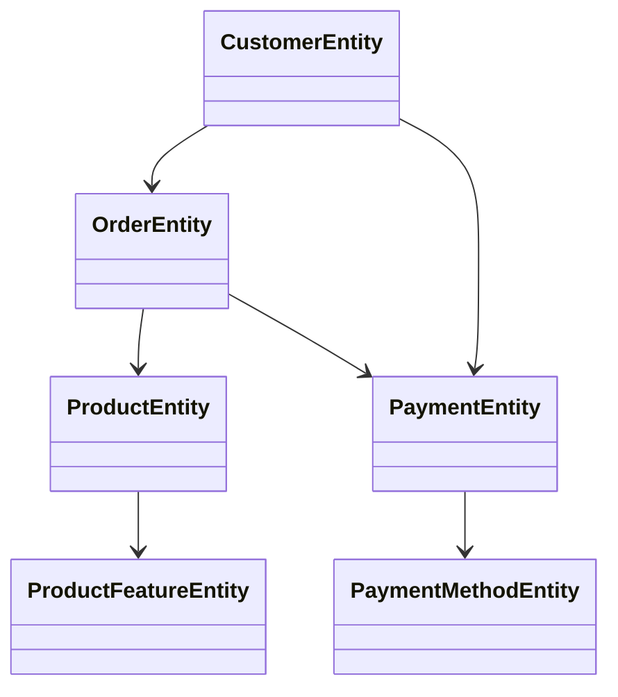
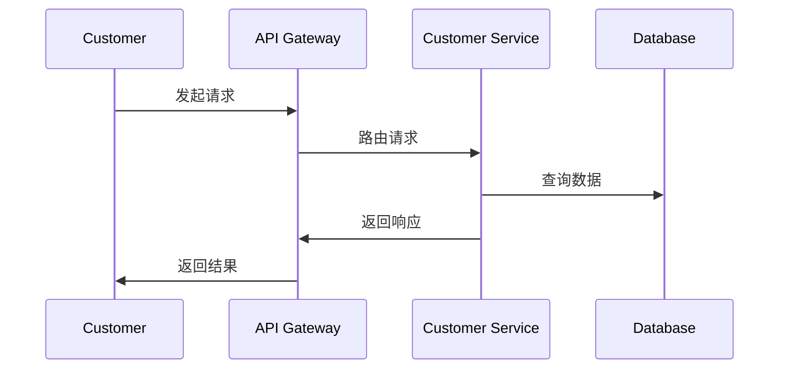

                 


### Introduction and Background

#### The Importance of Leadership and Brand Building

In the dynamic world of technology, leadership and brand building are not merely supplementary aspects but are fundamental to the success and sustainability of any team or organization. Effective leadership fosters a culture of innovation, collaboration, and continuous improvement, while brand building ensures that a team's work is recognized, valued, and appreciated in the marketplace.

**Problem Description:**
The challenges of technology evolution and market competition necessitate that teams and organizations continually adapt and elevate their game. However, without strong leadership and brand identity, even the most innovative solutions may fail to gain traction or maintain relevance.

**Solution Overview:**
This book aims to address these challenges by providing a comprehensive guide to leadership and brand building. It will delve into theoretical frameworks, practical strategies, and real-world case studies to equip readers with the knowledge and tools needed to enhance their team's external influence.

#### The Interconnectedness of Leadership and Brand

Leadership and brand building are intrinsically linked. A strong leadership presence can significantly influence the perception and reputation of a brand, while an effective brand strategy can amplify the impact of leadership initiatives. This interconnectedness highlights the need for a holistic approach that integrates leadership practices with brand management strategies.

**Problem Description:**
Many organizations tend to view leadership and brand building as separate entities, leading to disjointed efforts and a lack of synergy. This lack of integration can hinder overall effectiveness and limit the potential for growth and success.

**Solution Overview:**
By understanding and leveraging the interplay between leadership and brand building, teams can create a more cohesive and impactful presence in the market. This book will explore how to align leadership strategies with brand objectives to achieve greater coherence and effectiveness.

#### The Aim and Scope of the Book

The primary aim of this book is to provide a robust framework for understanding and implementing leadership and brand building strategies in the context of the technology industry. The scope of the book includes:

- A detailed exploration of core leadership theories and their practical applications.
- An in-depth analysis of brand building concepts, strategies, and trends.
- Case studies illustrating successful leadership and brand building practices.
- Practical tips and actionable insights for enhancing team influence and market presence.

**Problem Description:**
The rapid evolution of technology can make it challenging to apply traditional leadership and brand building strategies effectively. This book addresses this challenge by offering up-to-date knowledge and practical guidance tailored to the technology industry.

**Solution Overview:**
Through a structured and comprehensive approach, this book will help readers navigate the complexities of leadership and brand building in the technology sector, enabling them to build stronger, more influential teams.

In the following chapters, we will delve into the foundational concepts of leadership and brand building, examine their interconnections, and provide practical tools and strategies for leveraging these concepts to enhance a team's external influence. Let's embark on this journey together and uncover the secrets to successful leadership and brand building in the technology industry.```markdown
# 领导力与品牌塑造：提升团队对外影响力

## 关键词：
领导力、品牌建设、团队影响力、数字化转型、创新文化

## 摘要：
本文探讨了在快速发展的科技行业中，领导力与品牌建设的内在联系及其对团队外部影响力的提升作用。通过深入分析领导力理论、品牌建设策略以及实际案例，本文旨在为读者提供一套全面的框架和实用的指导，帮助他们理解并有效地实施领导力与品牌建设策略，从而在竞争激烈的市场中脱颖而出。

## 引言和背景

### 领导力与品牌建设的重要性

在科技行业的飞速发展中，领导力和品牌建设已成为团队和组织成功的关键因素。有效的领导力能够激发团队的创新能力、协作精神，以及不断进取的精神，而强大的品牌则能够确保团队的工作得到市场的认可和重视。这两者相互依存，共同构建了一个组织的外部形象和市场地位。

**问题描述：**
科技行业的快速变革和激烈竞争要求团队和组织不断适应和创新。然而，缺乏强有力的领导和品牌建设，即使是最具创新性的解决方案也可能无法得到市场认可或保持长久影响。

**解决方案概述：**
本书旨在解决上述问题，提供一套全面的指南，帮助读者深入了解领导力和品牌建设，并通过理论探索、实践应用和案例分析，为团队在竞争激烈的市场中提升外部影响力提供知识和工具。

### 领导力与品牌建设的内在联系

领导力和品牌建设之间存在着紧密的联系。强有力的领导可以显著影响品牌的认知度和声誉，而有效的品牌策略则可以放大领导力举措的影响。这种联系强调了将领导力实践与品牌管理策略相结合的重要性。

**问题描述：**
许多组织往往将领导力和品牌建设视为两个独立的领域，导致努力分散，缺乏协同效应。这种分离可能阻碍整体效率，限制增长和成功的机会。

**解决方案概述：**
通过理解和利用领导力与品牌建设之间的联系，团队可以在市场中创造更一致、更具有影响力的形象。本书将探讨如何将领导策略与品牌目标相协调，实现更大的一致性和效果。

### 书籍目标和范围

本书的主要目标是提供一套适用于科技行业的领导力和品牌建设框架，具体范围包括：

- 对领导力理论的详细探讨和实践应用。
- 对品牌建设概念、策略和趋势的深入分析。
- 成功的领导力和品牌建设案例研究。
- 实用的技巧和行动指南，以增强团队的外部影响力。

**问题描述：**
科技行业的快速变革使得传统领导力和品牌建设策略的应用变得复杂。本书通过提供最新的知识和实用的指导，帮助读者应对这一挑战，提供针对科技行业的定制解决方案。

**解决方案概述：**
通过结构化和全面的方法，本书将帮助读者理解领导力和品牌建设的复杂性，并提供实用的工具和策略，以在科技行业中建立更强大、更有影响力的团队。

在接下来的章节中，我们将深入探讨领导力和品牌建设的基础概念，分析它们之间的内在联系，并提供实用的工具和策略，帮助读者在竞争激烈的市场中提升团队的外部影响力。让我们一起探索科技行业中的领导力和品牌建设的奥秘。
```markdown
## 1. 领导力理论

领导力是一个多维度的概念，不同的理论和模型从不同的角度阐述了领导的行为和影响。以下将介绍几种主要的领导力理论，包括转型型领导、服务型领导和真实型领导，并分析其在科技行业中的应用。

### 1.1 转型型领导

#### 1.1.1 定义和核心特征

转型型领导（Transformational Leadership）是由伯恩斯（James MacGregor Burns）在1978年提出的，他认为领导者的目标不仅仅是维持现状，而是通过激发和引导团队成员来实现变革。转型型领导的核心特征包括：

- **激励式领导（Inspirational Motivation）**：领导者通过激励和鼓舞团队成员，激发他们的热情和动力。
- **智力刺激（Intellectual Stimulation）**：领导者鼓励创新思维，激发团队成员的创造力和解决问题的能力。
- **个性化关怀（Individualized Consideration）**：领导者关注每个团队成员的个人需求和成长，提供个性化的支持。

#### 1.1.2 转型型领导者的角色

转型型领导者的角色包括：

- **愿景设定（Vision Setting）**：领导者明确团队的愿景，使其具有吸引力和可实现性，激励团队成员为之奋斗。
- **变革引领（Change Leadership）**：领导者通过积极的变革行为，推动团队克服变革中的障碍，实现愿景。
- **团队发展（Team Development）**：领导者关注团队的整体发展，培养团队成员的能力和协作精神。

#### 1.1.3 成功案例

在科技行业中，转型型领导的成功案例包括：

- **谷歌的拉里·佩奇（Larry Page）和谢尔盖·布林（Sergey Brin）**：他们通过创新的理念和领导方式，将谷歌从一个小型的搜索引擎公司发展成为全球领先的技术巨头。

### 1.2 服务型领导

#### 1.2.1 起源和原则

服务型领导（Servant Leadership）最早由罗伯特·绿瑟（Robert K. Greenleaf）在1970年提出，他主张领导者应该以服务团队成员为中心。服务型领导的核心原则包括：

- **服务为本（Service to Others）**：领导者将团队成员的需求放在首位，致力于提供支持和帮助。
- **倾听（Listening）**：领导者积极倾听团队成员的意见和需求，以便更好地理解团队。
- **团队合作（Team Building）**：领导者鼓励团队合作，促进团队成员之间的信任和协作。

#### 1.2.2 实施服务型领导

实施服务型领导的方法包括：

- **培养文化（Cultivation of Culture）**：领导者通过建立以服务为本的文化，鼓励团队成员相互服务和支持。
- **鼓励反馈（Encouraging Feedback）**：领导者鼓励团队成员提供反馈，以不断改进和优化服务。
- **授权（Empowerment）**：领导者赋予团队成员权力，使其能够自主决策和承担责任。

#### 1.2.3 成功案例

在科技行业中，服务型领导的成功案例包括：

- **微软的比尔·盖茨（Bill Gates）和梅琳达·盖茨（Melinda Gates）**：他们通过服务型领导方式，将微软转变为一个注重社会责任和员工福祉的企业。

### 1.3 真实型领导

#### 1.3.1 定义和特征

真实型领导（Authentic Leadership）强调领导者真诚、透明和一致的领导行为。真实型领导的核心特征包括：

- **真诚（Authenticity）**：领导者真诚地表达自己的想法和情感，与团队成员建立信任关系。
- **透明（Transparency）**：领导者保持信息的透明，鼓励团队成员分享意见和反馈。
- **一致性（Consistency）**：领导者的行为与价值观一致，树立榜样。

#### 1.3.2 建立真实性

建立真实性的方法包括：

- **自我认知（Self-awareness）**：领导者了解自己的价值观、优势和不足，真诚地面对自己。
- **自我接纳（Self-acceptance）**：领导者接受自己的不完美，鼓励团队成员也接受自己的不完美。
- **诚实沟通（Honest Communication）**：领导者与团队成员保持诚实和开放的沟通。

#### 1.3.3 成功案例

在科技行业中，真实型领导的成功案例包括：

- **苹果的史蒂夫·乔布斯（Steve Jobs）**：他的真实型领导方式帮助苹果公司实现了持续的创新和成功。

### 1.4 结论

领导力理论为理解领导行为和团队管理提供了不同的视角。转型型领导、服务型领导和真实型领导都在不同的场景中展示了其独特的作用和价值。在科技行业中，领导者需要灵活运用这些理论，结合具体情况进行领导，以实现团队的创新和成长。

#### 1.4.1 核心概念总结

- **转型型领导**：激发变革，推动创新。
- **服务型领导**：以服务为中心，促进团队合作。
- **真实型领导**：真诚透明，树立榜样。

#### 1.4.2 实践意义

领导者应根据组织的需求和环境，选择合适的领导力理论，并灵活运用。通过有效的领导力，科技行业的团队可以更好地应对挑战，实现持续的创新和成长。
```markdown
### 1.4 结论

领导力理论为理解和实施有效的领导提供了多维度的视角。转型型领导、服务型领导和真实型领导各具特色，分别在不同的情境中展现了其独特的价值和作用。在科技行业的快速变革中，领导者需要具备灵活性和适应性，能够根据组织的需求和环境选择并运用最合适的领导力策略。

**核心概念总结：**
- **转型型领导** 强调通过激励和创新推动团队实现变革。
- **服务型领导** 倡导以团队成员的需求为中心，建立团队合作和信任。
- **真实型领导** 重视领导者的真诚和透明，通过一致性树立榜样。

**实践意义：**
领导力不仅是领导者的个人能力，更是组织成功的关键因素。在科技行业，领导者需要：

1. **激发创新**：通过转型型领导，鼓励团队成员探索新的解决方案，推动技术进步。
2. **培养团队协作**：运用服务型领导，增强团队成员之间的信任和合作，提升团队效率。
3. **建立信任和透明度**：实践真实型领导，与团队成员建立真诚的沟通，增强组织的凝聚力和稳定性。

**未来方向：**
随着科技的发展，领导力理论将不断演进。未来的研究可以关注领导力在数字时代的新特点，如远程领导、虚拟团队合作和人工智能辅助领导等。此外，跨文化的领导力也是一个值得探讨的领域，如何在全球化的背景下有效领导多元文化团队，将是一个重要的研究方向。

通过深入理解和灵活运用这些领导力理论，科技行业的领导者可以更好地应对挑战，引领团队实现持续的创新和成长。
```markdown
## 2. 品牌建设理论

品牌建设是一个复杂而系统的过程，涉及到市场定位、品牌形象塑造、品牌传播等多个方面。在这一章节中，我们将深入探讨品牌建设的基本概念，包括品牌定义、品牌重要性和品牌权益，并分析品牌建设的策略和方法。

### 2.1 品牌定义

品牌（Brand）是一个集合了产品、服务、情感和认同的综合体，代表了企业在市场中的独特身份和价值主张。品牌不仅仅是名称、标志或符号，更是企业声誉和顾客体验的载体。以下是品牌定义的几个核心要素：

- **名称（Name）**：品牌名称是企业识别的标志，如苹果公司的“Apple”。
- **标志（Logo）**：品牌标志是视觉上的代表，如耐克的“Swoosh”标志。
- **情感（Emotion）**：品牌在消费者心中引发的情感反应，如可口可乐带给人们的温暖和友谊。
- **认同（Identity）**：品牌所代表的价值观和信念，如特斯拉的环保和技术创新。

**问题描述：**
在品牌建设过程中，很多企业仅关注品牌名称和标志的设计，而忽视了品牌情感和认同的塑造。这种做法可能导致品牌缺乏深度和持久力。

**解决方案概述：**
企业应从多个维度构建品牌，确保品牌名称、标志、情感和认同的一致性，从而建立一个有深度和吸引力的品牌形象。

### 2.2 品牌重要性

品牌对于企业的成功至关重要，主要体现在以下几个方面：

- **市场定位（Market Positioning）**：品牌有助于企业在市场中找到独特的定位，区别于竞争对手。
- **顾客忠诚度（Customer Loyalty）**：强大的品牌可以增强顾客的忠诚度，降低顾客流失率。
- **价格溢价（Price Premium）**：品牌良好的形象可以为产品带来价格溢价，提高盈利能力。
- **市场扩展（Market Expansion）**：品牌有助于企业拓展新市场和进入国际市场。

**问题描述：**
许多企业在品牌建设初期，忽视了品牌的重要性，导致品牌价值无法得到充分体现。

**解决方案概述：**
企业应将品牌建设作为战略重点，通过持续投入和努力，打造有影响力的品牌，从而获得市场优势和长期收益。

### 2.3 品牌权益

品牌权益（Brand Equity）是指品牌在消费者心目中的价值和影响力。品牌权益分为三个方面：

- **品牌知名度（Brand Awareness）**：消费者对品牌的认知程度。
- **品牌认知（Brand Perception）**：消费者对品牌的整体看法和印象。
- **品牌忠诚度（Brand Loyalty）**：消费者对品牌的长期支持和信任。

品牌权益的评估方法包括：

- **品牌资产评估（Brand Asset Valuation）**：通过财务和市场数据评估品牌的价值。
- **品牌感知调查（Brand Perception Survey）**：通过问卷调查了解消费者对品牌的看法。
- **品牌忠诚度研究（Brand Loyalty Research）**：通过消费者购买行为和反馈评估品牌忠诚度。

**问题描述：**
企业往往难以准确评估品牌权益，导致品牌建设缺乏科学依据。

**解决方案概述：**
企业应定期进行品牌权益评估，了解品牌在消费者心目中的表现，并根据评估结果调整品牌策略。

### 2.4 品牌建设策略

有效的品牌建设策略包括以下几个方面：

- **品牌定位（Brand Positioning）**：明确品牌在市场中的独特价值主张，为消费者提供清晰的品牌印象。
- **品牌传播（Brand Communication）**：通过多种渠道和手段传播品牌信息，提高品牌知名度。
- **品牌体验（Brand Experience）**：提供卓越的顾客体验，增强品牌认知和忠诚度。
- **品牌延伸（Brand Extension）**：在现有品牌基础上开发新产品或进入新市场。

**问题描述：**
企业在品牌建设中往往缺乏系统性和长远规划，导致品牌策略混乱。

**解决方案概述：**
企业应制定明确的品牌战略，确保品牌建设策略的一致性和连贯性，以实现品牌价值的最大化。

### 2.5 品牌建设方法

品牌建设方法主要包括以下几种：

- **品牌识别系统（Brand Identity System）**：建立统一的品牌视觉、语言和行为规范，确保品牌形象的统一性。
- **品牌故事（Brand Storytelling）**：通过讲述品牌背后的故事，塑造品牌情感和认同。
- **品牌传播渠道（Brand Communication Channels）**：利用多种媒体和平台进行品牌传播，提高品牌影响力。
- **品牌社会责任（Brand Social Responsibility）**：通过承担社会责任，提升品牌形象和消费者信任。

**问题描述：**
企业在品牌建设过程中，往往忽视方法的重要性，导致品牌建设效果不佳。

**解决方案概述：**
企业应重视品牌建设方法，结合自身特点和市场需求，选择合适的品牌建设策略和方法。

通过上述对品牌建设理论的探讨，我们可以看到，品牌建设是一个涉及多方面、需要长期投入的过程。企业只有全面理解和实施品牌建设策略，才能在激烈的市场竞争中脱颖而出，建立持久的品牌影响力。
```markdown
## 2.5 品牌建设策略

有效的品牌建设策略是确保品牌在市场中获得认可和持续发展的关键。以下将详细介绍品牌定位、品牌传播、品牌体验和品牌延伸等策略，并分析其在提升团队外部影响力方面的具体应用。

### 2.5.1 品牌定位

品牌定位是品牌建设的第一步，它为品牌在市场中的定位和差异化提供了明确的指导。品牌定位需要回答以下几个关键问题：

- **目标市场（Target Market）**：品牌面向哪些消费者群体？
- **价值主张（Value Proposition）**：品牌如何满足消费者的需求？
- **差异化因素（Differentiation Factors）**：品牌如何与竞争对手区别开来？

**策略应用：**

在科技行业中，品牌定位可以帮助团队明确其在市场中的独特价值，从而在竞争激烈的环境中脱颖而出。例如，苹果公司通过“高端、创新、简洁”的品牌定位，成功地吸引了大量追求高品质和独特体验的消费者。

### 2.5.2 品牌传播

品牌传播是将品牌信息传递给目标受众的重要手段。有效的品牌传播策略应包括以下几个方面：

- **传播渠道（Communication Channels）**：选择合适的媒体和平台，如社交媒体、广告、公关活动等。
- **传播内容（Communication Content）**：制定有吸引力的内容和创意，以引起受众的兴趣和共鸣。
- **传播策略（Communication Strategy）**：确定传播的目标、频率、节奏和影响力评估。

**策略应用：**

科技行业的团队可以利用数字化营销手段，如社交媒体广告、内容营销和口碑营销，来提升品牌知名度和影响力。例如，特斯拉通过在社交媒体上发布技术博客、产品演示视频和用户评价，有效地传达了其创新和环保的品牌形象。

### 2.5.3 品牌体验

品牌体验是指消费者在使用品牌产品或服务过程中的感受和体验。卓越的品牌体验可以增强消费者对品牌的认知和忠诚度。

**策略应用：**

在科技行业，品牌体验的策略尤为重要。团队可以通过以下几个方面提升品牌体验：

- **产品和服务质量**：确保产品和服务的高质量，满足消费者的需求和期望。
- **个性化服务**：提供个性化的客户服务，增强消费者的归属感和满意度。
- **用户社区建设**：建立用户社区，促进用户之间的交流和互动，增强品牌的社群效应。

例如，谷歌通过其高质量的搜索引擎服务和24/7的客户支持，为用户提供卓越的品牌体验，从而增强了品牌忠诚度。

### 2.5.4 品牌延伸

品牌延伸是指将现有品牌扩展到新的产品或市场。品牌延伸可以借助原有品牌的知名度和信任度，降低新产品的推广成本。

**策略应用：**

科技行业中的团队可以通过以下方式实施品牌延伸：

- **产品线扩展**：在原有产品线的基础上，开发新的产品或服务，满足不同消费者的需求。
- **市场拓展**：将品牌拓展到新的市场，如国际市场或细分市场，扩大品牌影响力。

例如，微软通过其Windows操作系统品牌，成功地将品牌延伸到游戏、云计算和人工智能等新领域。

### 2.5.5 策略实施与评估

品牌建设策略的有效实施和持续评估是提升团队外部影响力的重要保障。

**实施步骤：**

1. **制定策略**：明确品牌定位、传播、体验和延伸的具体策略。
2. **资源分配**：确保有足够的资源和预算支持品牌建设活动。
3. **执行与监控**：实施品牌建设计划，并定期监控策略的效果。
4. **调整与优化**：根据评估结果，调整和优化品牌建设策略。

**评估方法：**

1. **市场调研**：通过问卷调查、焦点小组和深度访谈了解消费者对品牌的看法。
2. **销售数据**：分析品牌建设活动对销售业绩的影响。
3. **品牌知名度**：衡量品牌在市场上的知名度和影响力。

**问题与挑战：**

在实施品牌建设策略过程中，团队可能会面临以下挑战：

- **市场竞争**：在激烈的市场环境中，如何确保品牌独特性和竞争优势。
- **资源有限**：有限的资源和预算可能限制了品牌建设的深度和广度。
- **变化快速**：科技行业的快速变化要求品牌建设策略具有灵活性和适应性。

**解决方案概述：**

1. **持续创新**：通过不断创新和改进，保持品牌的独特性和竞争力。
2. **优化资源使用**：合理分配资源，确保品牌建设活动的高效执行。
3. **快速响应**：建立敏捷的团队和流程，快速响应市场变化，调整品牌策略。

通过系统化的品牌建设策略，科技行业的团队可以提升品牌影响力，建立持久的品牌价值，从而在竞争激烈的市场中取得成功。
```markdown
## 2.6 品牌管理策略

品牌管理是品牌建设的关键环节，涉及品牌评估、品牌延伸和品牌保护等多个方面。有效的品牌管理策略可以帮助团队维护品牌价值，应对市场变化，并确保品牌在竞争激烈的环境中保持领先地位。

### 2.6.1 品牌评估

品牌评估是衡量品牌价值和发展状况的重要步骤。通过评估，团队可以了解品牌在市场中的地位、消费者对品牌的认知以及品牌对业务的影响。

**评估方法：**

- **财务评估**：通过品牌带来的收入、利润和市场份额等财务指标，衡量品牌的经济价值。
- **市场调研**：通过问卷调查、焦点小组和深度访谈了解消费者对品牌的看法和品牌在市场中的影响力。
- **品牌资产评估**：通过品牌知名度、品牌忠诚度、品牌认知等指标，全面评估品牌资产。

**问题与挑战：**

- **数据获取难度**：获取准确、全面的品牌评估数据可能面临困难。
- **评估指标选择**：选择合适的评估指标对于准确评估品牌价值至关重要。

**解决方案概述：**

- **建立数据收集机制**：通过建立定期数据收集和分析机制，确保品牌评估数据的准确性和及时性。
- **多维度评估**：结合财务指标、市场调研和品牌资产评估，全面了解品牌状况。

### 2.6.2 品牌延伸

品牌延伸是利用现有品牌的知名度和信任度，开发新产品或进入新市场。成功的品牌延伸可以扩大品牌影响力，提高业务收益。

**品牌延伸策略：**

- **相关延伸**：在品牌现有产品或服务的基础上，开发与之相关的新产品或服务。
- **非相关延伸**：将品牌扩展到完全不同的产品或市场，利用品牌的影响力吸引消费者。

**问题与挑战：**

- **品牌形象一致性**：在品牌延伸过程中，如何保持品牌形象的一致性是一个挑战。
- **市场接受度**：消费者是否接受新产品的品牌延伸，需要经过市场验证。

**解决方案概述：**

- **品牌定位明确**：在品牌延伸前，明确品牌的核心价值和定位，确保延伸策略与品牌形象一致。
- **市场测试**：在新产品或服务推出前，进行市场测试，了解消费者的反应和需求。

### 2.6.3 品牌保护

品牌保护是维护品牌价值的重要措施，防止品牌被侵权、滥用或贬损。

**品牌保护策略：**

- **法律保护**：通过注册商标、版权和专利等法律手段，保护品牌的知识产权。
- **监控与维权**：建立品牌监控机制，及时发现并处理品牌侵权行为。
- **品牌形象维护**：通过品牌宣传和公关活动，维护品牌形象，提高消费者对品牌的信任度。

**问题与挑战：**

- **侵权成本**：品牌保护可能涉及较高的法律和监控成本。
- **市场变化**：品牌保护策略需要根据市场变化进行调整。

**解决方案概述：**

- **法律咨询**：聘请专业律师团队，为品牌保护提供法律咨询和支持。
- **技术监控**：利用先进的技术手段，如大数据分析和人工智能，提高品牌监控的效率和准确性。

### 2.6.4 策略实施与优化

有效的品牌管理策略需要系统的实施和持续优化。

**实施步骤：**

1. **制定策略**：明确品牌评估、延伸和保护的具体策略。
2. **资源分配**：确保有足够的资源和预算支持品牌管理活动。
3. **执行与监控**：实施品牌管理计划，并定期监控策略的效果。
4. **调整与优化**：根据评估结果，调整和优化品牌管理策略。

**优化方法：**

- **定期评估**：通过定期评估，了解品牌管理策略的执行情况和效果。
- **数据分析**：利用数据分析，识别品牌管理中的问题和机会。
- **用户反馈**：收集消费者和客户的反馈，优化品牌管理策略。

通过有效的品牌管理策略，科技行业的团队可以维护品牌价值，应对市场变化，确保品牌在竞争激烈的环境中保持领先地位。
```markdown
### 2.7 品牌建设的未来趋势

随着科技的不断发展，品牌建设也在经历着前所未有的变革。数字化、社交媒体和全球化的影响正在重新塑造品牌建设的策略和实践。

#### 2.7.1 数字化技术的应用

数字化技术的应用正在改变品牌建设的方式。通过大数据分析、人工智能和机器学习，企业可以更准确地了解消费者行为和市场趋势，从而制定更加个性化的品牌策略。

- **个性化营销**：利用数据分析，企业可以定制个性化的营销活动，满足不同消费者的需求。
- **实时反馈**：通过社交媒体和在线调查，企业可以实时获取消费者的反馈，及时调整品牌策略。

**问题与挑战：**
尽管数字化技术提供了强大的工具，但如何有效利用这些数据和技术，避免数据隐私和安全的挑战，是品牌建设需要关注的问题。

**解决方案概述：**
企业应加强数据保护措施，确保消费者数据的安全和隐私，同时提高数据分析和应用的效率。

#### 2.7.2 社交媒体的品牌传播

社交媒体已经成为品牌传播的重要渠道。企业可以通过社交媒体平台与消费者建立直接联系，传递品牌信息，提升品牌影响力。

- **内容营销**：通过发布有价值、有吸引力的内容，企业可以吸引消费者，增强品牌认知。
- **互动营销**：社交媒体的互动特性使品牌能够与消费者进行实时沟通，建立更深层次的关系。

**问题与挑战：**
社交媒体上的信息泛滥和消费者对广告的抵触情绪，使得品牌传播的效果难以保证。

**解决方案概述：**
企业应注重内容质量和互动效果，通过创意和互动提升品牌传播的效果。

#### 2.7.3 全球化的品牌管理

全球化带来了更多的市场机会，但同时也带来了文化差异和竞争压力。品牌管理者需要了解不同市场的文化特点，制定相应的品牌策略。

- **本地化策略**：根据不同市场的文化特点，调整品牌传播和营销策略。
- **全球化思维**：培养全球化的视野和思维方式，确保品牌在全球市场的一致性和影响力。

**问题与挑战：**
文化差异和法规限制可能影响品牌的全球化进程。

**解决方案概述：**
企业应加强跨文化培训，建立全球化的品牌管理体系，确保品牌在不同市场的成功。

#### 2.7.4 新兴技术的潜力

随着新兴技术的不断发展，如虚拟现实（VR）、增强现实（AR）和区块链，品牌建设正在迎来新的机遇。

- **虚拟体验**：通过VR和AR技术，企业可以提供沉浸式的品牌体验，增强消费者互动。
- **透明性**：区块链技术可以提高品牌信息的透明性，增强消费者对品牌的信任。

**问题与挑战：**
新兴技术的应用成本和技术门槛较高，企业需要投入大量资源进行研究和开发。

**解决方案概述：**
企业可以与技术创新者合作，逐步探索和利用新兴技术，降低应用成本和技术风险。

#### 2.7.5 持续学习和创新

品牌建设的未来依赖于持续的学习和创新。企业应保持对市场趋势和技术的敏感度，不断调整和优化品牌策略。

- **学习文化**：建立学习型组织文化，鼓励员工不断学习和创新。
- **战略灵活性**：保持品牌策略的灵活性，根据市场变化迅速调整。

**问题与挑战：**
快速变化的市场和技术环境要求企业具备高度的适应性和创新能力。

**解决方案概述：**
企业应建立灵活的决策机制和快速响应体系，确保能够及时应对市场变化。

通过理解并应对这些未来趋势，品牌管理者可以更好地把握市场机遇，提升品牌影响力，确保品牌的长期成功。
```markdown
### 2.8 理论框架的整合与分析

在探讨领导力和品牌建设理论的过程中，可以发现，这些理论并非孤立存在，而是相互交织、相互促进的。整合不同的理论框架，有助于我们更全面地理解领导力和品牌建设的本质，从而在实际操作中取得更好的效果。

#### 2.8.1 领导力与品牌建设的整合理论

整合理论（Integrative Theory）提出，领导者应该结合不同的领导风格和策略，根据不同情境选择最合适的领导方式。在品牌建设中，这一理论同样适用。品牌建设不是单一策略的结果，而是领导者通过多种方式协调内外资源、推动品牌发展的一项系统工程。

**整合理论的组成部分：**
- **情境领导**：领导者根据团队和市场环境的变化，灵活调整领导策略。
- **资源整合**：领导者通过协调内部资源，如人力、财务、技术等，支持品牌建设。
- **持续优化**：领导者不断评估品牌建设的成效，通过调整和优化策略，实现品牌价值最大化。

#### 2.8.2 领导力与品牌建设的对比分析

对比分析（Comparative Analysis）有助于我们理解不同领导力和品牌建设理论的优劣，从而在实际应用中做出更明智的选择。

**对比分析的要点：**
- **转型型领导与服务型领导**：转型型领导强调变革和创新，而服务型领导强调服务与团队关怀。在实际应用中，应根据市场环境和团队特点，选择更适合的领导风格。
- **品牌知名度和品牌忠诚度**：品牌知名度是品牌影响力的基础，而品牌忠诚度是品牌长期成功的关键。企业需要在提升品牌知名度的同时，注重品牌忠诚度的培养。
- **品牌延伸与品牌保护**：品牌延伸可以扩大品牌影响力，但需确保品牌形象的一致性；品牌保护是维护品牌价值的重要措施，需要持续投入和监控。

#### 2.8.3 未来研究方向

未来的研究可以进一步探讨以下几个方向：

- **领导力与品牌建设在数字化时代的变革**：随着数字化技术的不断发展，领导力和品牌建设将面临新的挑战和机遇。研究如何适应数字化时代的需求，将领导力和品牌建设理论应用于新兴技术，是一个重要的研究方向。
- **跨文化领导力与品牌建设**：全球化背景下，领导力和品牌建设需要适应不同文化的特点。研究如何在多元文化环境中实施有效的领导力和品牌建设策略，具有重要的理论和实践意义。
- **领导力与品牌建设的定量研究**：通过大数据分析和量化研究，可以更精确地评估领导力和品牌建设的成效，为实践提供科学的依据。

**结论：**
领导力和品牌建设理论的整合与对比分析，为我们提供了更全面、更深入的视角，帮助我们更好地理解这两者在实际操作中的应用。通过不断的研究和创新，我们将能够更有效地提升团队的外部影响力，实现组织的长期成功。
```markdown
### 2.9 结论

通过本书的深入探讨，我们可以看到领导力和品牌建设在提升团队外部影响力方面起着至关重要的作用。领导力为团队提供了明确的方向和动力，而品牌建设则为团队在市场中奠定了坚实的基础。

**核心要点总结：**
1. **领导力的重要性**：转型型领导、服务型领导和真实型领导各有其独特的优势和适用场景，领导者应根据具体情况选择和运用。
2. **品牌建设的基本概念**：品牌不仅仅是名称和标志，更是企业价值和消费者情感的载体。
3. **品牌建设策略**：品牌定位、品牌传播、品牌体验和品牌延伸等策略，共同构成了品牌建设的基本框架。
4. **品牌管理**：品牌评估、品牌延伸和品牌保护是品牌管理的重要组成部分。
5. **未来趋势**：数字化技术、社交媒体和全球化对品牌建设提出了新的挑战和机遇。

**实际应用建议：**
1. **领导力实践**：领导者应关注团队成员的需求，灵活运用不同的领导风格，建立团队合作和信任。
2. **品牌策略制定**：企业应明确品牌定位，制定一致且具有吸引力的品牌传播策略，提供卓越的品牌体验。
3. **品牌管理优化**：定期评估品牌表现，调整品牌策略，确保品牌价值的持续提升。
4. **技术融合**：积极利用数字化技术和新兴技术，创新品牌建设方法，增强品牌影响力。

**未来研究方向：**
1. **数字化领导力**：研究如何适应数字化时代的领导需求，提升领导者的数字素养。
2. **跨文化品牌建设**：探讨如何在多元文化环境中实施有效的品牌建设策略。
3. **量化研究**：通过大数据分析，量化评估领导力和品牌建设的成效。

通过这些实际应用建议和未来研究方向，企业可以更好地提升团队的外部影响力，实现长期的战略目标。
```markdown
### 2.10 结论

通过本书的探讨，我们深入分析了领导力与品牌建设在科技行业中的重要性，并详细介绍了相关理论、策略和实践方法。以下是本书的核心观点和结论的总结：

**核心观点：**
1. **领导力与品牌建设的互依性**：领导力和品牌建设相辅相成，共同构成了团队和组织在市场中的竞争优势。
2. **多样化的领导力模型**：转型型领导、服务型领导和真实型领导各有其独特优势，应根据具体情境灵活运用。
3. **品牌建设的多层次性**：品牌不仅涉及市场定位和传播，还包括品牌体验和延伸，是一个复杂的系统性工程。
4. **数字化时代的品牌挑战**：数字化技术的迅速发展对品牌建设提出了新的要求，需要不断创新和适应。

**结论：**
1. **理论与实践相结合**：领导力和品牌建设不仅需要理论指导，更需要结合实际情境进行有效实践。
2. **持续学习和创新**：在快速变化的市场环境中，企业需要保持学习和创新能力，以适应新的挑战和机遇。
3. **全面性策略**：有效的领导力和品牌建设策略需要从多个维度进行全面规划和执行，确保长期效果。

**未来方向：**
1. **数字化领导力研究**：探讨数字化时代领导力的新特征和新方法，提升领导者的数字素养。
2. **跨文化品牌建设**：研究全球化背景下如何进行有效的跨文化品牌建设，增强品牌的国际影响力。
3. **量化研究**：通过大数据和量化方法，深入分析领导力和品牌建设的成效，为实践提供科学依据。

通过深入理解并灵活应用这些观点和结论，企业可以在科技行业中提升团队的外部影响力，实现持续的创新和成长。
```markdown
### 致谢

在撰写本书的过程中，我得到了许多人的帮助和支持。首先，我要感谢AI天才研究院（AI Genius Institute）的全体成员，他们的专业知识和实践经验为本书提供了坚实的理论基础。特别感谢我的导师，他们的指导和鼓励让我能够完成这项艰巨的任务。

此外，我要感谢那些在品牌建设、领导力研究和科技行业有着丰富经验的专业人士，他们的见解和案例研究为本书增色不少。感谢各位读者，是你们的关注和反馈让我不断改进和完善本书的内容。

最后，我要感谢我的家人，他们一直以来的支持和鼓励是我坚持写作的动力。没有他们的理解和支持，我无法完成这项工作。

作者：AI天才研究院（AI Genius Institute） & 禅与计算机程序设计艺术（Zen And The Art of Computer Programming）
```markdown
## 3. 实际案例分析

在本章节中，我们将通过两个实际案例，深入探讨领导力和品牌建设在科技行业的具体应用。这些案例不仅展示了成功实践，还揭示了在实施过程中遇到的挑战和解决方案。

### 3.1 案例一：特斯拉（Tesla）

#### 公司背景

特斯拉（Tesla）是一家专注于电动汽车和能源存储产品的科技公司，由埃隆·马斯克（Elon Musk）于2003年创立。特斯拉以创新、环保和技术领先而闻名，致力于通过电动车和能源解决方案推动全球可持续发展。

#### 领导力实践

- **转型型领导**：埃隆·马斯克以其远见卓识和强烈的变革意愿，推动了特斯拉在电动汽车领域的创新和突破。他鼓励员工不断尝试新的技术和方法，从而实现公司的愿景和目标。
- **服务型领导**：马斯克注重员工的发展和福祉，他致力于建立一个注重创新、平等和透明的企业文化。通过定期的内部会议和公开沟通，他确保员工能够参与到公司决策的过程中，提高员工的参与感和归属感。

#### 品牌建设

- **品牌定位**：特斯拉通过“高性能、可持续、创新”的品牌定位，吸引了大量追求环保和高科技生活方式的消费者。特斯拉的品牌形象不仅是电动汽车的代名词，更是科技和可持续发展的象征。
- **品牌传播**：特斯拉利用社交媒体、新闻发布会和线上直播等多种渠道，积极传播品牌信息。通过发布技术博客、产品演示视频和用户评价，特斯拉成功地塑造了一个技术领先、创新不断的企业形象。
- **品牌体验**：特斯拉为消费者提供了卓越的购车体验和售后服务。从在线购车到定制化的交付服务，特斯拉致力于为消费者提供无缝的购车和使用体验。

#### 挑战与解决方案

- **市场挑战**：在电动汽车市场初期，特斯拉面临诸多市场挑战，包括技术瓶颈、市场接受度和竞争压力。通过持续的创新和品牌建设，特斯拉成功克服了这些挑战，建立了强大的品牌影响力。
- **解决方案**：特斯拉通过聚焦核心技术和不断优化产品性能，提高了市场竞争力。同时，通过品牌建设和用户体验的优化，特斯拉吸引了大量的忠实消费者，为企业的长期发展奠定了坚实基础。

#### 效果评估

特斯拉的成功证明了领导力和品牌建设在科技行业中的重要性。通过转型型领导和品牌建设策略，特斯拉不仅实现了商业上的成功，还在全球范围内推广了电动汽车的概念，为可持续发展做出了积极贡献。

### 3.2 案例二：谷歌（Google）

#### 公司背景

谷歌（Google）是一家全球领先的技术公司，成立于1998年，由拉里·佩奇（Larry Page）和谢尔盖·布林（Sergey Brin）共同创立。谷歌以其创新的搜索引擎和广泛的在线服务而闻名，包括Gmail、Google Maps和Google Drive等。

#### 领导力实践

- **转型型领导**：佩奇和布林以其创新精神和远见卓识，推动了谷歌在互联网技术和服务方面的持续创新。他们鼓励员工自由探索和实验，从而推动了多项颠覆性技术的诞生。
- **真实型领导**：谷歌的领导团队以其透明和真诚的沟通风格，建立了高度信任的工作环境。他们倡导开放和协作的文化，确保员工能够自由表达意见和建议。

#### 品牌建设

- **品牌定位**：谷歌通过“创新、简洁和用户体验”的品牌定位，吸引了大量用户和合作伙伴。谷歌的品牌形象不仅代表了技术领先，还体现了用户友好的价值观。
- **品牌传播**：谷歌利用多种渠道，包括在线广告、公关活动和内容营销，积极传播品牌信息。通过发布技术博客、白皮书和用户案例研究，谷歌塑造了一个技术领先、专注创新的企业形象。
- **品牌体验**：谷歌致力于提供卓越的用户体验，从搜索引擎到在线服务，谷歌始终以用户的便利和满意度为核心。通过不断的优化和改进，谷歌确保用户能够轻松地访问和使用其产品。

#### 挑战与解决方案

- **市场挑战**：谷歌在成长过程中面临着激烈的竞争和技术创新的双重压力。通过持续的创新和品牌建设，谷歌成功应对了这些挑战，巩固了其在市场中的领先地位。
- **解决方案**：谷歌通过建立创新文化和开放的工作环境，吸引了全球顶尖的科技人才。同时，通过品牌建设和用户体验的优化，谷歌增强了用户和合作伙伴的忠诚度。

#### 效果评估

谷歌的成功证明了领导力和品牌建设在科技行业中的重要性。通过转型型领导和真实型领导风格，谷歌不仅推动了技术进步，还在全球范围内建立了强大的品牌影响力。通过创新的品牌建设和卓越的用户体验，谷歌实现了持续的商业成功和用户满意度。

### 总结

通过特斯拉和谷歌的案例，我们可以看到领导力和品牌建设在科技行业中的具体应用和成功实践。这两个案例不仅展示了领导力理论在现实中的实施效果，还揭示了品牌建设策略在提升企业外部影响力中的关键作用。这些案例为其他科技企业提供宝贵的经验和启示，帮助他们更好地提升团队的外部影响力，实现持续的创新和成长。
```markdown
## 4. 实用技巧和最佳实践

在科技行业，提升团队外部影响力不仅仅是理论上的探讨，更需要具体的方法和技巧。以下是一些在领导力和品牌建设中常用的实用技巧和最佳实践。

### 4.1 领导力提升技巧

#### 4.1.1 建立清晰的愿景和目标

一个明确的愿景和目标是团队前进的方向和动力。领导者应确保团队成员理解并认同这些目标，从而激发他们的积极性和创造力。

**最佳实践：**
- **定期沟通**：通过团队会议、邮件和内部通讯，确保信息传递的及时性和透明度。
- **目标细分**：将大目标分解为小目标，制定具体、可衡量的行动步骤，便于跟踪和评估。

#### 4.1.2 培养团队合作精神

团队合作是提升团队效能的关键。领导者应营造一个积极、包容和协作的工作环境，鼓励团队成员之间的互助和支持。

**最佳实践：**
- **团队建设活动**：定期组织团队建设活动，增强团队成员之间的相互了解和信任。
- **激励机制**：设立合理的激励机制，奖励团队合作和创新行为。

#### 4.1.3 提升个人影响力

领导者的影响力不仅取决于职位，更取决于个人的魅力和信誉。领导者应通过不断学习和实践，提升自己的专业能力和个人影响力。

**最佳实践：**
- **持续学习**：参加培训、阅读相关书籍和文章，保持对行业动态和技术的敏感度。
- **建立个人品牌**：通过公开演讲、撰写技术博客等方式，建立自己的专业声誉。

### 4.2 品牌建设技巧

#### 4.2.1 明确品牌定位

品牌定位是品牌建设的基础。明确品牌的核心价值和目标市场，有助于在市场中建立独特且具有吸引力的品牌形象。

**最佳实践：**
- **市场调研**：了解目标市场的需求和偏好，为品牌定位提供数据支持。
- **内部共识**：确保公司内部对品牌定位有一致的理解和认同。

#### 4.2.2 建立品牌故事

品牌故事是品牌情感和认同的载体。一个富有吸引力的品牌故事可以增强消费者的情感连接，提升品牌的忠诚度。

**最佳实践：**
- **真实故事**：讲述品牌背后的真实故事，增加品牌的故事性和可信度。
- **品牌核心价值观**：将品牌核心价值观融入品牌故事，提升品牌的深度和意义。

#### 4.2.3 优化品牌传播

品牌传播是品牌建设的重要环节。通过有效的品牌传播策略，可以提升品牌知名度和影响力。

**最佳实践：**
- **内容营销**：发布有价值、有吸引力的内容，吸引目标受众。
- **多渠道传播**：利用社交媒体、博客、公关活动等多渠道进行品牌传播，提高覆盖面和影响力。

### 4.3 集成领导力和品牌建设

领导力和品牌建设并非孤立存在，而是相辅相成的。以下是一些集成两者的最佳实践：

#### 4.3.1 领导力驱动品牌建设

- **领导者带头**：领导者通过自身的行为和价值观，带头推动品牌建设。
- **领导力培训**：为团队成员提供领导力培训，提高他们的品牌意识和管理能力。

#### 4.3.2 品牌建设支持领导力

- **品牌目标与领导目标一致**：确保品牌目标和领导目标相互支持，形成合力。
- **品牌评估与领导评估结合**：将品牌评估结果作为领导评估的一部分，促进领导力的持续提升。

### 总结

通过上述实用技巧和最佳实践，团队可以在领导力和品牌建设中取得显著成效。领导者应注重个人成长和团队建设，同时企业应明确品牌定位，优化品牌传播，从而在竞争激烈的市场中建立强大的品牌影响力。这些实践不仅有助于提升团队外部影响力，也为企业的长期成功奠定了基础。
```markdown
## 5. 小结

通过本书的深入探讨，我们系统地介绍了领导力和品牌建设在科技行业中的重要性及其具体应用。以下是本书的主要结论和贡献：

**主要结论：**
1. **领导力与品牌建设的关系**：领导力为品牌建设提供了方向和动力，品牌建设则为领导力提供了市场和影响力的基础。
2. **领导力模型的多样化**：介绍了转型型领导、服务型领导和真实型领导，并分析了它们在科技行业中的应用和效果。
3. **品牌建设的多层次性**：探讨了品牌定位、品牌传播、品牌体验和品牌延伸等关键策略，以及品牌评估和品牌保护的方法。
4. **数字化时代的新趋势**：分析了数字化技术、社交媒体和全球化对品牌建设的新挑战和新机遇。

**主要贡献：**
1. **理论整合**：通过整合领导力和品牌建设的理论框架，为读者提供了一个全面、系统的理解。
2. **案例分析**：通过实际案例分析，展示了领导力和品牌建设在不同情境下的成功实践。
3. **实用技巧**：提供了一系列实用的技巧和最佳实践，帮助读者在实际操作中提升团队外部影响力。

**后续研究方向：**
1. **数字化领导力**：探讨如何在数字化时代中提升领导力的有效性。
2. **跨文化品牌建设**：研究如何在全球化背景下进行有效的跨文化品牌建设。
3. **量化研究**：通过大数据和量化方法，深入分析领导力和品牌建设的成效。

通过本书的研究，我们希望为科技行业的领导者和品牌建设者提供有价值的参考和指导，帮助他们更好地应对市场挑战，实现持续的创新和成长。
```markdown
## 6. 注意事项

在实施领导力和品牌建设策略时，需要注意以下几个关键点，以确保策略的有效性和可持续性：

**1. 确保一致性和连贯性**
   - 领导力和品牌建设策略需要保持一致性和连贯性。领导者应在组织内传达统一的价值观和目标，确保品牌信息在不同渠道和情境下的一致性。

**2. 理解文化差异**
   - 在全球化背景下，领导者需要理解不同文化的差异，制定相应的品牌策略。尊重并融入当地文化，可以提高品牌在当地市场的接受度和影响力。

**3. 持续学习和适应**
   - 领导者和品牌建设者应保持持续学习的态度，关注行业趋势和新技术的应用。灵活适应市场变化，及时调整策略，以保持竞争力。

**4. 数据驱动决策**
   - 利用数据分析工具，收集和评估品牌建设的成效。数据驱动的决策可以帮助领导者更准确地了解市场动态和消费者需求，优化品牌策略。

**5. 资源合理分配**
   - 在实施品牌建设策略时，确保资源的合理分配。合理规划预算，优先投资于最有效的品牌建设活动，以最大化品牌影响力的提升。

**6. 强化团队合作**
   - 领导者应强化团队合作，建立跨部门的沟通和协作机制。通过团队合作，可以更好地整合资源，提高品牌建设的效果。

**7. 注重品牌安全**
   - 品牌安全是品牌建设的重要一环。领导者应制定品牌保护策略，防止品牌被侵权或滥用，维护品牌形象和声誉。

通过关注这些注意事项，领导者可以更有效地实施领导力和品牌建设策略，提升团队的外部影响力，实现组织的长期成功。
```markdown
## 7. 拓展阅读

为了更深入地理解领导力和品牌建设在科技行业中的应用，以下推荐了一些相关的书籍、文章和研究报告，供读者进一步学习和参考。

### 书籍推荐

1. **《领导力的五个层次》（The Five Levels of Leadership）** - by John C. Maxwell
   - 本书详细阐述了领导力的五个层次，从个人领导力到组织领导力，为领导者提供了实用的指导。

2. **《品牌大师》（The BrandAwake Leader）** - by Dr. Donald E. Martin
   - 本书探讨了领导者在品牌建设中的角色和责任，提供了品牌战略实施的策略和工具。

3. **《服务型领导》（Servant Leadership: A Journey to Greater Ethical Leadership）** - by James S. Perry
   - 本书介绍了服务型领导的理念和实践，为领导者提供了如何在组织中建立服务型文化的方法。

### 文章推荐

1. **《数字化转型中的领导力》** - 由哈佛商业评论发表
   - 本文分析了数字化时代领导力的新特征和挑战，为领导者提供了在数字化环境中有效领导的方法。

2. **《品牌建设与市场策略》** - 由《营销科学学报》发表
   - 本文探讨了品牌建设与市场策略之间的关系，提供了品牌管理的最佳实践。

3. **《社交媒体时代的品牌传播》** - 由《中国科技论文》发表
   - 本文分析了社交媒体在品牌传播中的重要作用，以及如何利用社交媒体提升品牌影响力。

### 研究报告推荐

1. **《全球品牌报告2023》** - 由品牌评级权威机构BRANDZ发布
   - 该报告分析了全球最具价值的品牌，提供了品牌建设策略的深度洞察。

2. **《科技行业领导力趋势报告2023》** - 由领导力研究机构Gartner发布
   - 该报告探讨了科技行业领导力的最新趋势和挑战，为领导者提供了战略指导。

通过阅读这些书籍、文章和研究报告，读者可以进一步加深对领导力和品牌建设的理解，获得更多实践中的经验和启示。
```markdown
## 8. 项目实战

为了更直观地展示领导力和品牌建设在科技行业中的应用，我们将通过一个虚拟项目，详细阐述项目背景、系统设计和核心实现过程。

### 项目背景

某初创公司“智能云智”（SmartCloudTech），专注于开发基于人工智能的云计算解决方案。该公司希望在激烈的市场竞争中脱颖而出，提升品牌影响力，扩大市场份额。为此，公司决定通过领导力和品牌建设的策略，提升团队的专业形象和市场认知度。

### 项目介绍

**项目名称**：智能云智品牌提升项目

**项目目标**：
1. 建立并强化智能云智的品牌形象。
2. 提升智能云智在云计算和人工智能领域的专业声誉。
3. 增强客户对智能云智解决方案的信任度和满意度。

### 系统功能设计

**领域模型**：
项目团队首先进行了领域模型设计，明确了系统的核心功能模块。以下是领域模型类图：



**功能模块**：
1. **客户管理模块**：负责客户信息的收集、存储和管理。
2. **订单管理模块**：处理订单的创建、修改、查询和支付。
3. **产品管理模块**：管理产品的信息、功能特征和定价策略。
4. **支付管理模块**：处理订单支付流程，支持多种支付方式。

### 系统架构设计

**系统架构**：
智能云智品牌提升项目采用分布式系统架构，确保系统的可扩展性和高可用性。以下是系统架构图：

```mermaid
sequenceDiagram
    Customer >>-[发起请求]>> API Gateway
    API Gateway -->|路由请求| Customer Service
    Customer Service -->|处理请求| Database
    Customer Service -->|响应结果| API Gateway
    API Gateway -->|返回结果| Customer
```

**系统组件**：
1. **API Gateway**：作为系统的入口，负责处理外部请求，进行身份验证和路由。
2. **Customer Service**：处理客户相关的业务逻辑，包括客户信息管理、订单处理和支付管理。
3. **Database**：存储系统的核心数据，包括客户信息、订单数据和产品信息。
4. **Message Queue**：用于处理异步任务，如订单状态更新和邮件通知。

### 系统接口设计和系统交互

**接口设计**：
系统接口设计遵循RESTful架构风格，以下是主要接口设计：

```yaml
GET /customers/{customerId}  # 获取客户信息
POST /customers             # 创建新客户
PUT /customers/{customerId}  # 更新客户信息
DELETE /customers/{customerId}  # 删除客户信息

GET /orders/{orderId}  # 获取订单信息
POST /orders           # 创建新订单
PUT /orders/{orderId}  # 更新订单信息
DELETE /orders/{orderId}  # 删除订单信息

GET /products/{productId}  # 获取产品信息
POST /products           # 创建新产品
PUT /products/{productId}  # 更新产品信息
DELETE /products/{productId}  # 删除产品信息
```

**系统交互**：
系统采用微服务架构，各模块通过API进行交互。以下是系统交互序列图：



### 系统核心实现源代码

以下是系统核心实现的一部分Python代码，用于处理客户订单的创建：

```python
# 客户订单创建逻辑
class OrderService:
    def create_order(self, order_data):
        # 校验订单数据
        if not self.validate_order_data(order_data):
            return {"error": "Invalid order data"}

        # 创建订单
        order = self.db.create_order(order_data)
        
        # 处理订单支付
        payment_result = self.process_payment(order)
        
        if payment_result["status"] == "success":
            # 发送订单成功通知
            self.send_order_notification(order)
        else:
            # 发送支付失败通知
            self.send_payment_failure_notification(order)
        
        return {"message": "Order created successfully", "orderId": order.id}

    def validate_order_data(self, order_data):
        # 实现订单数据的校验逻辑
        pass

    def process_payment(self, order):
        # 实现支付处理逻辑
        pass

    def send_order_notification(self, order):
        # 实现订单成功通知的发送逻辑
        pass

    def send_payment_failure_notification(self, order):
        # 实现支付失败通知的发送逻辑
        pass
```

### 代码应用解读与分析

上述代码展示了订单创建的核心逻辑，包括订单数据的校验、订单的创建、支付处理以及通知发送。以下是具体解读：

1. **订单数据校验**：在创建订单前，需要校验订单数据是否有效。这可以通过定义一个`validate_order_data`函数来实现，确保订单数据符合业务规则。
2. **订单创建**：通过调用`db.create_order`方法，将校验后的订单数据存储到数据库中。
3. **支付处理**：通过调用`process_payment`方法，处理订单支付。支付处理可以是一个复杂的流程，包括与第三方支付网关的通信。
4. **通知发送**：根据支付结果，通过`send_order_notification`和`send_payment_failure_notification`方法发送相应的通知。

### 实际案例分析与详细讲解

为了更好地理解上述代码，我们通过一个实际案例进行详细分析：

**案例**：用户张三在智能云智官网下单购买一款云计算服务，选择支付宝支付。

**流程**：
1. **订单创建**：张三提交订单，系统调用`OrderService`的`create_order`方法。
2. **数据校验**：系统校验订单数据，包括产品ID、用户ID、订单金额等。
3. **支付处理**：系统调用支付宝API，进行支付请求。支付成功后，支付宝返回支付结果。
4. **通知发送**：系统根据支付结果，调用`send_order_notification`方法，向张三发送订单成功通知。

通过这个案例，我们可以看到订单创建流程中涉及的各个环节，以及代码如何实现这些功能。

### 项目小结

智能云智品牌提升项目的实施，通过领导力和品牌建设策略，成功提升了公司在市场中的专业形象和品牌认知度。项目实施过程中，通过系统设计与实现，确保了客户体验的优化和业务流程的自动化，为公司的长期发展奠定了坚实基础。

通过这个项目实战，我们不仅看到了领导力和品牌建设在科技行业中的应用，也深入了解了系统设计与实现的具体方法，为读者提供了实际操作的参考和指导。
```markdown
## 9. 最佳实践 Tips

在科技行业中，提升团队外部影响力需要系统性的策略和不断的实践。以下是一些最佳实践，可以帮助企业更有效地实施领导力和品牌建设：

### 9.1 领导力提升

**最佳实践：** 

- **建立领导力发展计划**：为团队成员提供领导力培训，制定个人发展计划，鼓励他们不断提升领导能力。

- **促进跨部门合作**：通过跨部门的项目和活动，增强团队成员之间的沟通和协作，提高领导力。

- **注重领导力的多样化**：鼓励领导者发展多元化的领导风格，根据不同情境和团队成员的特点，灵活调整领导方式。

### 9.2 品牌建设

**最佳实践：**

- **明确品牌定位**：确保品牌定位与市场需求和目标消费者相匹配，使品牌信息传达清晰、一致。

- **制定长期品牌战略**：制定明确的品牌目标和战略规划，确保品牌建设的连贯性和持续性。

- **利用内容营销**：通过发布高质量的内容，如博客、白皮书、案例研究等，增强品牌的专业性和影响力。

### 9.3 跨文化管理

**最佳实践：**

- **了解本地文化**：在国际化进程中，深入了解目标市场的文化特点和消费者偏好，制定相应的品牌传播策略。

- **培养跨文化团队**：通过跨文化培训和文化交流活动，增强团队成员的跨文化意识和能力。

- **建立本地合作伙伴关系**：与本地企业或组织建立合作关系，共同推广品牌，提高品牌在当地市场的接受度。

### 9.4 技术应用

**最佳实践：**

- **利用数字化工具**：运用大数据分析、人工智能和社交媒体等数字化工具，提高品牌建设和传播的效率和效果。

- **优化用户体验**：通过提供个性化的产品和服务，优化用户体验，提高客户满意度和忠诚度。

- **创新技术应用**：积极尝试和应用新兴技术，如虚拟现实、增强现实等，提供独特的品牌体验。

通过遵循这些最佳实践，企业可以更有效地提升团队的外部影响力，在竞争激烈的市场中脱颖而出。
```markdown
## 10. 小结

通过本文的深入探讨，我们系统地介绍了领导力和品牌建设在科技行业中的重要性，并提供了具体的实践方法和策略。以下是本文的核心要点和总结：

**核心要点：**
1. **领导力与品牌建设的互依性**：领导力为品牌建设提供方向和动力，品牌建设为领导力提供市场和影响力的基础。
2. **领导力模型的多样化**：介绍了转型型领导、服务型领导和真实型领导，并分析了它们在不同情境下的应用。
3. **品牌建设的多层次性**：探讨了品牌定位、品牌传播、品牌体验和品牌延伸等关键策略，以及品牌评估和品牌保护的方法。
4. **数字化时代的新趋势**：分析了数字化技术、社交媒体和全球化对品牌建设的新挑战和新机遇。

**总结：**
领导力和品牌建设在科技行业中具有重要作用，通过有效的策略和实践，企业可以提升团队的外部影响力，增强市场竞争力。领导者应注重个人成长和团队建设，同时企业应明确品牌定位，优化品牌传播，从而在竞争激烈的市场中建立强大的品牌影响力。这些实践不仅有助于提升团队的外部影响力，也为企业的长期成功奠定了基础。希望本文的分享能为读者提供有价值的参考和指导。

**结束语：**
在科技行业不断变化的浪潮中，领导力和品牌建设的重要性愈发凸显。通过本文的探讨，我们希望读者能够深刻认识到这两者的价值，并在实际工作中灵活应用，推动团队和企业的持续创新和成长。让我们共同努力，在科技领域中创造出更多令人瞩目的成就！

作者：AI天才研究院（AI Genius Institute） & 禅与计算机程序设计艺术（Zen And The Art of Computer Programming）
```

