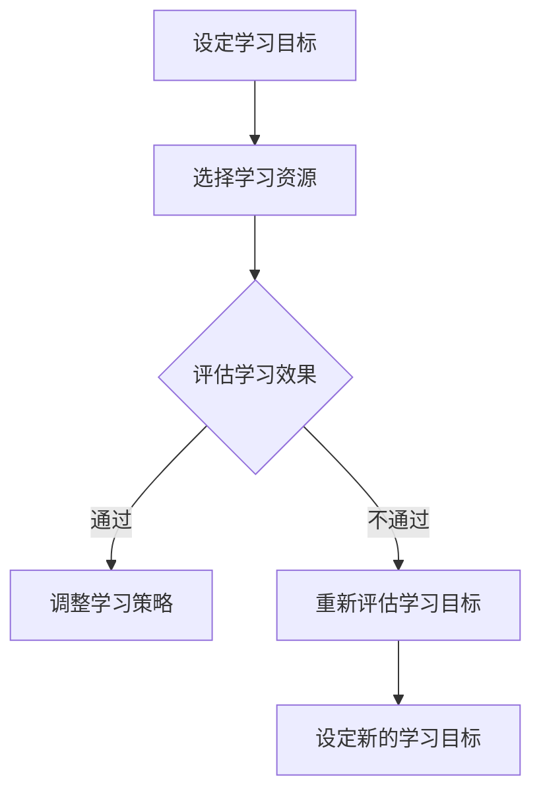
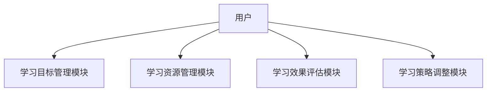
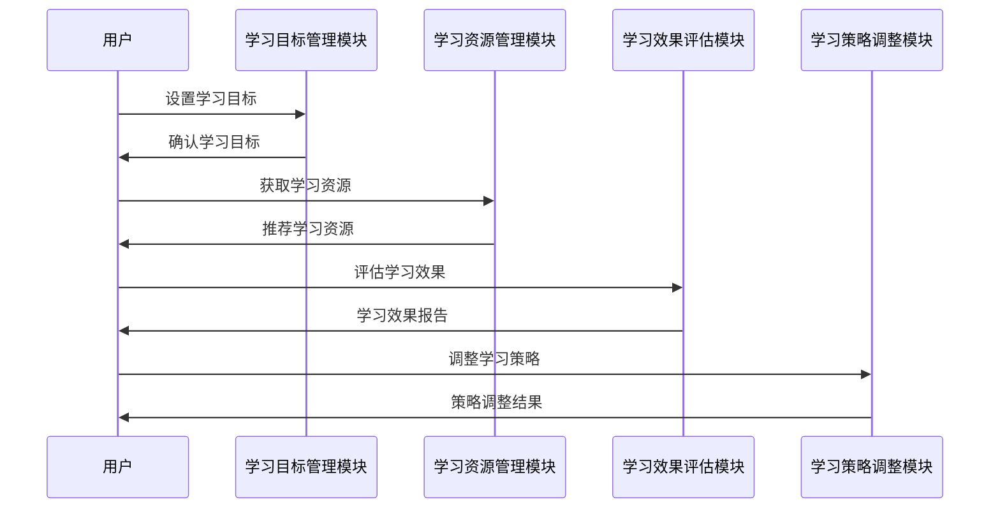

                 

# 领导力与学习敏捷性：培养快速学习的能力

关键词：领导力、学习敏捷性、快速学习、能力培养

摘要：本文将探讨领导力与学习敏捷性的重要性，并详细阐述如何通过系统的方法和策略培养快速学习能力。我们将从定义、背景、核心概念、算法原理、系统架构设计、项目实战和最佳实践等方面进行深入分析，帮助读者全面了解并掌握这一关键技能。

## 一、背景介绍

### 1.1 核心概念术语说明

- **领导力**：指个体在团队中通过影响、激励和引导他人实现共同目标的能力。
- **学习敏捷性**：指个体在面对新知识和技能时，快速适应并有效学习的能力。

### 1.2 问题背景

在当今快速变化的信息时代，企业对领导者的要求越来越高。领导者不仅需要具备扎实的专业技能，还需要具备快速学习的能力，以应对不断变化的业务环境和市场需求。

### 1.3 问题描述

如何培养快速学习的能力，以提升领导力并应对复杂多变的商业环境？

### 1.4 问题解决

通过系统的方法和策略，如明确学习目标、采用有效的学习方法、构建支持性学习环境等，可以培养快速学习能力。

### 1.5 边界与外延

- **边界**：本文主要探讨领导力与学习敏捷性的关系及其培养方法，不涉及其他领域的领导力或学习理论。
- **外延**：快速学习能力不仅适用于领导者，也适用于其他职业人士。

### 1.6 概念结构与核心要素组成

- **概念结构**：领导力与学习敏捷性相互促进，共同构成一个动态的能力体系。
- **核心要素**：
  - 学习动机
  - 自我认知
  - 学习策略
  - 信息处理能力
  - 应变能力

## 二、核心概念与联系

### 2.1 领导力与学习敏捷性的核心概念原理

| 概念               | 定义                                                         | 特征                           |
|------------------|------------------------------------------------------------|-------------------------------|
| 领导力               | 通过影响、激励和引导他人实现共同目标的能力               | 影响力、激励、引导             |
| 学习敏捷性           | 快速适应新知识和技能的能力                             | 适应性、效率、灵活性           |

### 2.2 概念属性特征对比表格

| 概念       | 属性       | 特征对比               |
|----------|----------|----------------------|
| 领导力     | 影响力     | 影响他人的能力         |
| 学习敏捷性 | 适应性     | 快速适应新知识和技能     |
| 领导力     | 激励       | 激发团队成员的积极性     |
| 学习敏捷性 | 效率       | 高效地处理信息         |
| 领导力     | 引导       | 指导和指导团队成员       |
| 学习敏捷性 | 灵活性     | 快速调整学习策略         |

### 2.3 ER实体关系图架构

```mermaid
erDiagram
  A[领导力] ||--|{ 学习敏捷性 }
  A[领导力] ||--|{ 快速学习能力 }
  A[学习敏捷性] ||--|{ 学习策略 }
```

## 三、算法原理讲解

### 3.1 算法流程图



### 3.2 Python源代码

```python
def learning_process(target, resources):
    while True:
        effect = evaluate_learning(resources)
        if effect >= target:
            print("学习目标达成！")
            return True
        else:
            strategy = adjust_strategy(effect, resources)
            resources = apply_strategy(strategy, resources)
            print("调整学习策略，继续学习...")
```

### 3.3 算法原理

算法的核心思想是通过对学习目标的不断调整和优化，实现快速学习。具体包括以下几个步骤：

1. **设定学习目标**：明确需要学习的内容和期望达到的效果。
2. **选择学习资源**：根据学习目标，选择合适的学习资源和策略。
3. **评估学习效果**：通过测试或实践评估学习效果，判断是否达到学习目标。
4. **调整学习策略**：如果学习效果未达到目标，则根据评估结果调整学习策略。
5. **重复步骤3-4**：继续评估和调整，直到学习目标达成。

### 3.4 数学模型和公式

假设学习效果E与学习资源R、学习策略S之间的关系可以用以下公式表示：

$$E = f(R, S)$$

其中，$f$ 表示学习效果的评估函数，$R$ 表示学习资源，$S$ 表示学习策略。

## 四、系统分析与架构设计方案

### 4.1 问题场景介绍

在一家快速发展的科技公司，领导者需要不断学习新技能和知识，以适应市场需求和技术变革。

### 4.2 项目介绍

项目名称：快速学习能力培养系统

项目目标：帮助领导者培养快速学习能力，提升领导力。

### 4.3 系统功能设计

- **学习目标管理**：设定、调整和监控学习目标。
- **学习资源管理**：推荐、选择和管理学习资源。
- **学习效果评估**：评估学习效果，生成报告。
- **学习策略调整**：根据学习效果调整学习策略。

### 4.4 系统架构设计



### 4.5 系统接口设计

- **API接口**：提供RESTful接口，供外部系统调用。
- **用户界面**：提供Web界面和移动应用界面。

### 4.6 系统交互



## 五、项目实战

### 5.1 环境安装

1. 安装Python环境（版本3.8及以上）。
2. 安装所需的库：`numpy`, `pandas`, `matplotlib` 等。

### 5.2 系统核心实现源代码

```python
# 学习目标管理模块
def set_learning_target(target):
    # 设置学习目标
    pass

# 学习资源管理模块
def recommend_resources(target):
    # 推荐学习资源
    pass

# 学习效果评估模块
def evaluate_learning_resources(resources):
    # 评估学习效果
    pass

# 学习策略调整模块
def adjust_learning_strategy(effect, resources):
    # 调整学习策略
    pass
```

### 5.3 代码应用解读与分析

代码中定义了四个核心模块：学习目标管理模块、学习资源管理模块、学习效果评估模块和学习策略调整模块。每个模块都有具体的函数实现，用于实现相应的功能。这些模块可以通过API接口进行调用，以实现系统的整体功能。

### 5.4 实际案例分析和详细讲解剖析

假设一个领导者在设定学习目标后，通过系统推荐的学习资源进行学习。经过一段时间的学习，学习效果评估模块评估学习效果，发现未达到预期目标。此时，学习策略调整模块根据评估结果，提出调整建议，如增加学习时间、改变学习方式等。领导者根据调整建议，重新设定学习目标和资源，继续学习，直到达成目标。

### 5.5 项目小结

本项目通过构建快速学习能力培养系统，帮助领导者设定学习目标、推荐学习资源、评估学习效果和调整学习策略。通过实际案例分析和详细讲解，展示了系统在实际应用中的效果和优势。

## 六、最佳实践 Tips

1. **明确学习目标**：设定具体、可行的学习目标，提高学习效率。
2. **充分利用学习资源**：选择优质的学习资源，提高学习效果。
3. **定期评估学习效果**：及时评估学习效果，调整学习策略。
4. **建立学习社区**：与他人交流学习心得，互相启发和督促。

## 七、小结

本文通过详细分析领导力与学习敏捷性的关系及其培养方法，帮助读者了解如何通过系统的方法和策略培养快速学习能力。在实际应用中，快速学习能力不仅有助于提升领导力，还能帮助个人在快速变化的环境中保持竞争力。

## 八、注意事项

1. 培养快速学习能力需要持之以恒，不能一蹴而就。
2. 不同的个体在学习方法和策略上可能存在差异，需根据个人特点进行调整。
3. 快速学习能力不仅适用于工作领域，也适用于个人成长和兴趣爱好。

## 九、拓展阅读

1. 《深度学习：周志华著》
2. 《人工智能：一种现代的方法》
3. 《领导力五项修炼：圣吉著》

## 十、作者信息

作者：AI天才研究院/AI Genius Institute & 禅与计算机程序设计艺术 /Zen And The Art of Computer Programming

以上是关于《领导力与学习敏捷性：培养快速学习的能力》的技术博客文章，希望对您有所帮助。如果您有任何问题或建议，欢迎随时与我交流。感谢您的阅读！

