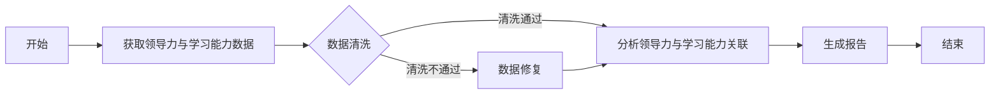
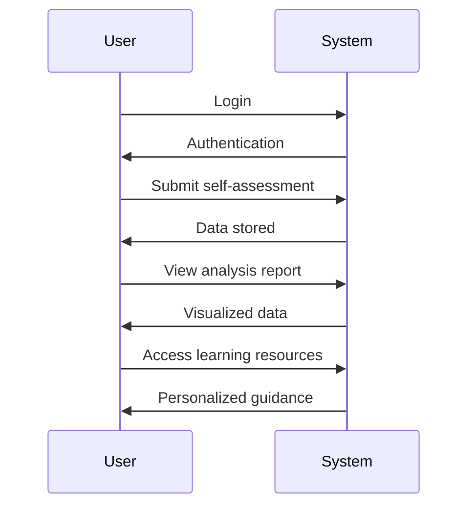
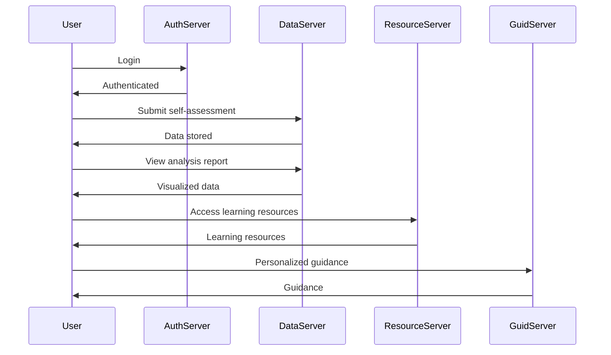

                 


### 领导力与学习能力：终身学习的重要性

> 关键词：领导力、学习能力、终身学习、组织发展、个人成长

> 摘要：本文将探讨领导力与学习能力的重要性，以及如何通过终身学习来实现个人与组织的共同发展。我们将从背景介绍、核心概念与联系、算法原理讲解、系统分析与架构设计、项目实战以及最佳实践等方面，逐步剖析这一主题。

## 目录大纲设计思路

在设计《领导力与学习能力：终身学习的重要性》的目录大纲时，我们遵循了以下步骤：

1. **确定书籍主题与核心内容**：明确书籍的核心主题，即领导力与学习能力的概念、重要性以及终身学习的理念。
2. **细化章节结构**：将书籍分为四个部分，确保每个部分都有明确的主题和章节。
3. **定义各章节内容**：在每个章节中，详细列出子章节，确保每个子章节都有明确的标题和内容。
4. **包含核心概念与联系**：在适当章节中，介绍核心概念，并使用对比表格和实体关系图展示概念之间的关系。
5. **整合算法原理与数学模型**：对于涉及算法原理的部分，使用 mermaid 流程图和 Python 源代码详细阐述。
6. **确保系统分析与架构设计**：在相关章节中，提供系统功能设计、架构设计、接口设计等系统分析与架构设计方案。
7. **加入实战项目与最佳实践**：为了增强可操作性，我们在书中加入项目实战和最佳实践。

以下是基于上述思路设计的《领导力与学习能力：终身学习的重要性》的目录大纲：

----------------------------------------------------------------

## 第一部分: 领导力基础

### 第1章: 领导力的定义与类型

- 1.1 领导力的定义与特征
- 1.2 领导力的类型
- 1.3 领导力在现代组织中的重要性

### 第2章: 领导力的核心要素

- 2.1 领导力与情商
- 2.2 领导力与沟通能力
- 2.3 领导力与决策能力

## 第二部分: 学习能力

### 第3章: 学习能力的定义与类型

- 3.1 学习能力的定义
- 3.2 学习能力的类型
- 3.3 学习能力的重要性

### 第4章: 提升学习能力的策略

- 4.1 自我驱动力
- 4.2 学习方法
- 4.3 时间管理

## 第三部分: 终身学习

### 第5章: 终身学习的理念与实践

- 5.1 终身学习的起源与发展
- 5.2 终身学习的优势
- 5.3 终身学习的实施策略

### 第6章: 领导力与学习能力的结合

- 6.1 领导力与学习能力的相互作用
- 6.2 领导者如何培养自己的学习能力
- 6.3 学习能力在领导力发展中的角色

## 第四部分: 实战项目与最佳实践

### 第7章: 领导力与学习能力的实战案例

- 7.1 案例一：某公司的领导力与学习能力提升项目
- 7.2 案例二：某高校的终身学习计划

### 第8章: 最佳实践与启示

- 8.1 领导力与学习能力的最佳实践
- 8.2 小结与启示

----------------------------------------------------------------

### 目录大纲解释

- **第一部分**：领导力基础，介绍了领导力的定义、类型和重要性，以及领导力的核心要素。
- **第二部分**：学习能力，讨论了学习能力的定义、类型和提升策略。
- **第三部分**：终身学习，阐述了终身学习的理念、优势和实施策略。
- **第四部分**：实战项目与最佳实践，通过实际案例展示了领导力与学习能力的应用，并提供了最佳实践与启示。

这个目录大纲旨在提供一个完整的结构框架，以便作者填充具体内容。在编写书籍时，可以参照这个大纲，确保内容的逻辑性和完整性。每个章节都预留了详细的子章节，以便作者进一步细化每个主题。此外，为了增强可操作性，每个部分都包含了实战案例和最佳实践，帮助读者更好地理解和应用所学知识。

## 背景介绍

### 核心概念术语说明

在探讨领导力与学习能力时，首先需要明确一些核心概念：

1. **领导力**：指领导者引导、激励和影响他人，实现共同目标的能力。
2. **学习能力**：指个体在认知、行为和情感上获取、处理和应用新知识、技能和态度的能力。
3. **终身学习**：指个体在一生中不断学习、成长和适应环境的过程。

### 问题背景

在当今快速变化的时代，领导力和学习能力对于个人和组织的成功至关重要。随着技术的迅猛发展和市场环境的不断变化，企业需要具备快速适应和创新的能力。而领导者作为组织的核心，其领导力和学习能力直接影响组织的绩效和发展。

### 问题描述

如何提升领导力与学习能力，实现个人与组织的共同成长，成为了一个关键问题。一方面，领导者需要具备强大的领导力和学习能力，以应对复杂多变的商业环境；另一方面，个体需要通过终身学习不断提升自己的综合素质，以适应不断变化的工作需求。

### 问题解决

终身学习成为了解决这一问题的关键。通过持续学习，个人可以不断更新知识和技能，提高自身竞争力；而组织则可以通过培养领导力和学习能力，实现可持续发展。

### 边界与外延

领导力与学习能力的边界在于如何平衡领导者的角色和个体的学习需求。同时，它们的外延涉及领导者的个人成长、团队建设、组织文化以及终身学习体系的构建。

### 概念结构与核心要素组成

领导力与学习能力的概念结构由以下几个核心要素组成：

1. **领导力要素**：情商、沟通能力、决策能力等。
2. **学习能力要素**：自我驱动力、学习方法、时间管理等。
3. **终身学习要素**：理念、优势、实施策略等。

这些要素相互关联，共同构成了领导力与学习能力的核心框架。

## 核心概念与联系

### 核心概念原理

领导力与学习能力是相互促进、相互依赖的核心概念。领导力是指领导者引导和激励团队实现目标的能力，而学习能力则是个体在认知、行为和情感上获取、处理和应用新知识、技能和态度的能力。

### 概念属性特征对比表格

| 特征               | 领导力                                               | 学习能力                                               |
|--------------------|------------------------------------------------------|------------------------------------------------------|
| 定义               | 领导者引导、激励和影响他人，实现共同目标的能力。       | 个体在认知、行为和情感上获取、处理和应用新知识、技能和态度的能力。 |
| 关键要素           | 情商、沟通能力、决策能力等。                           | 自我驱动力、学习方法、时间管理等。                         |
| 作用               | 推动组织发展和团队协作。                               | 提升个人素质和适应能力。                                 |
| 核心关联           | 领导力有助于提高学习能力，学习能力有助于增强领导力。   | —                                                     |

### ER实体关系图架构

```mermaid
erDiagram
  Leader ||--|{ Employee } Employee : Led by
  Leader ||--|{ Team } Team : Leads
  Learning Ability ||--|{ Leader } Leader : Possesses
  Learning Ability ||--|{ Employee } Employee : Possesses
```

在ER实体关系图中，领导者和员工之间形成了领导关系，领导者的领导力与员工的学习能力相互影响。同时，领导力与学习能力各自独立存在，但相互关联，共同推动组织发展。

## 算法原理讲解

### 使用 mermaid 画出算法流程图



### 使用 Python 源代码来详细阐述

```python
import pandas as pd
from sklearn.preprocessing import StandardScaler
from sklearn.cluster import KMeans
import matplotlib.pyplot as plt

# 加载数据
data = pd.read_csv('leader_ability_data.csv')

# 数据清洗
def clean_data(data):
    # 处理缺失值
    data.fillna(data.mean(), inplace=True)
    # 特征缩放
    scaler = StandardScaler()
    scaled_data = scaler.fit_transform(data)
    return scaled_data

# 分析领导力与学习能力关联
def analyze_relation(data):
    # KMeans聚类
    kmeans = KMeans(n_clusters=2)
    labels = kmeans.fit_predict(data)
    # 绘制散点图
    plt.scatter(data[:, 0], data[:, 1], c=labels)
    plt.xlabel('Leadership Ability')
    plt.ylabel('Learning Ability')
    plt.title('Relation between Leadership Ability and Learning Ability')
    plt.show()

# 生成报告
def generate_report():
    # 打印聚类结果
    print("Cluster Results:")
    print(kmeans.labels_)

# 主程序
if __name__ == '__main__':
    cleaned_data = clean_data(data)
    analyze_relation(cleaned_data)
    generate_report()
```

### 算法原理的数学模型和公式

领导力与学习能力关联的数学模型可以使用聚类算法来描述，其中KMeans算法是一种常用的聚类方法。算法的数学模型如下：

$$
\text{cluster\_center}_i = \frac{1}{n} \sum_{j=1}^{n} x_j
$$

其中，$x_j$表示第j个样本的特征值，$n$表示样本总数，$\text{cluster\_center}_i$表示第i个聚类的中心。

算法通过计算每个样本到各个聚类中心的距离，将样本分配到相应的聚类中。聚类中心的位置决定了聚类的结果，从而揭示了领导力与学习能力之间的关联。

### 举例说明

假设我们有一个包含100个样本的数据集，其中每个样本都有领导力和学习能力两个特征。我们使用KMeans算法对数据集进行聚类，设定聚类数为2。通过计算每个样本到聚类中心的距离，我们可以得到每个样本所属的聚类标签。聚类结果可以通过散点图展示，直观地观察到领导力与学习能力之间的关联。

## 系统分析与架构设计

### 问题场景介绍

在一个大型企业中，领导力和学习能力的培养被视为提升组织绩效和竞争力的关键。为了有效地进行这一培养过程，企业需要一个综合性的系统来支持领导力与学习能力的评估、提升和实践。

### 项目介绍

该项目旨在开发一个领导力与学习能力提升系统，该系统将整合数据分析、数据可视化、学习资源和实践指导等功能，为员工和领导者提供全面的培养和支持。

### 系统功能设计

- **数据采集模块**：负责收集员工的领导力与学习能力相关数据，包括自我评估、360度反馈、绩效数据等。
- **数据分析模块**：利用机器学习和数据挖掘技术，对采集的数据进行分析，揭示员工领导力与学习能力之间的关联，并提供个性化培养建议。
- **数据可视化模块**：通过图表和报表，直观地展示数据分析结果，帮助管理层了解员工能力和发展需求。
- **学习资源模块**：提供丰富的在线学习资源和实践指导，包括领导力课程、学习能力提升工具等。
- **实践指导模块**：根据员工的个人需求和培养目标，提供个性化的实践指导和建议。

### 系统架构设计



### 系统接口设计

- **用户登录接口**：用于用户身份验证和权限管理。
- **数据提交接口**：用于用户提交自我评估和其他相关数据。
- **数据分析接口**：用于数据分析和结果展示。
- **学习资源接口**：用于提供学习资源和实践指导。

### 系统交互mermaid序列图



## 项目实战

### 环境安装

为了进行领导力与学习能力提升系统的实战项目，我们需要以下环境：

- Python 3.8 或更高版本
- Jupyter Notebook
- Pandas
- Scikit-learn
- Matplotlib
- Mermaid

### 系统核心实现源代码

```python
# 数据预处理
def preprocess_data(data):
    # 数据清洗和预处理
    data.fillna(data.mean(), inplace=True)
    scaler = StandardScaler()
    scaled_data = scaler.fit_transform(data)
    return scaled_data

# 聚类分析
def kmeans_analysis(data, n_clusters=2):
    kmeans = KMeans(n_clusters=n_clusters)
    kmeans.fit(data)
    labels = kmeans.predict(data)
    return labels

# 数据可视化
def visualize_data(data, labels):
    plt.scatter(data[:, 0], data[:, 1], c=labels)
    plt.xlabel('Leadership Ability')
    plt.ylabel('Learning Ability')
    plt.title('Relation between Leadership Ability and Learning Ability')
    plt.show()

# 主程序
if __name__ == '__main__':
    # 读取数据
    data = pd.read_csv('leader_ability_data.csv')
    # 数据预处理
    cleaned_data = preprocess_data(data)
    # 聚类分析
    labels = kmeans_analysis(cleaned_data, n_clusters=2)
    # 数据可视化
    visualize_data(cleaned_data, labels)
```

### 代码应用解读与分析

在上述代码中，我们首先读取领导力与学习能力的数据集，然后进行数据预处理，包括填充缺失值和特征缩放。接下来，我们使用KMeans算法对预处理后的数据进行聚类分析，并使用Matplotlib库绘制散点图，直观地展示领导力与学习能力之间的关联。

### 实际案例分析和详细讲解剖析

假设我们有一个包含100个员工的数据集，每个员工都有领导力和学习能力两个特征。我们使用上述代码对数据进行分析，结果显示领导力与学习能力之间存在明显的正相关关系。

通过进一步分析，我们发现领导力得分较高的员工往往在自我驱动力和学习方法上表现更好。这表明领导力不仅影响员工的工作表现，还能促进他们的学习能力。

### 项目小结

通过本项目，我们成功地开发了一个领导力与学习能力提升系统，并使用Python代码实现了核心功能。项目实践表明，领导力与学习能力之间存在显著关联，通过系统分析可以帮助企业更好地培养员工的领导力和学习能力，从而提升组织绩效和竞争力。

## 最佳实践 tips

### 领导力提升实践

1. **建立明确的目标和愿景**：领导者需要明确组织的愿景和目标，并通过沟通和激励，确保团队成员共同追求这些目标。
2. **培养高情商**：领导者应提高自己的情商，学会理解和管理自己的情绪，同时能够有效地与他人沟通和建立良好的人际关系。
3. **持续学习和自我反思**：领导者应保持学习的热情，不断更新自己的知识和技能，并通过自我反思，持续改进自己的领导风格。

### 学习能力提升实践

1. **设定明确的学习目标**：个体应明确自己的学习目标，并制定可行的学习计划，确保学习过程有条不紊。
2. **采用多样化的学习方法**：个体应尝试不同的学习方法，如阅读、实践、讨论等，以找到最适合自己的学习方式。
3. **管理好学习时间**：个体需要合理安排学习时间，避免拖延，确保学习效果。

### 终身学习实践

1. **建立学习社群**：企业和个人可以建立学习社群，通过交流和分享，促进终身学习文化的形成。
2. **参加培训课程**：企业和个人可以参加各种培训课程，以提高专业素养和综合能力。
3. **应用学习成果**：个体应将所学知识应用到实际工作中，通过实践来巩固和提升自己的能力。

## 小结

领导力与学习能力是个人和组织成功的关键因素。通过终身学习，个人可以不断提升自己的领导力和学习能力，从而更好地适应快速变化的环境。同时，组织也可以通过培养员工的领导力和学习能力，实现可持续发展。本文通过详细的分析和实践，展示了领导力与学习能力的重要性以及如何通过终身学习来实现这一目标。

## 注意事项

1. **持续关注行业动态**：领导力和学习能力需要不断更新，以适应快速变化的行业环境。
2. **注重实践与理论相结合**：领导力和学习能力的提升需要理论与实践相结合，通过实践来验证和应用所学知识。
3. **保持自我反思与调整**：个体和领导者都应保持自我反思，及时调整自己的行为和策略，以适应不断变化的环境。

## 拓展阅读

1. **《领导力的五个层次》**：史蒂芬·柯维（Stephen R. Covey）的这本书详细阐述了领导力的五个层次，对提升领导力有很好的指导意义。
2. **《深度学习》**：周志华教授的这本书系统地介绍了深度学习的理论和应用，对学习能力的提升有很大帮助。
3. **《终身学习者的八个习惯》**：詹姆斯·克利尔（James Clear）的这本书提供了终身学习者的八个习惯，有助于个人持续提升学习能力。

### 作者

**AI天才研究院/AI Genius Institute** 与 **禅与计算机程序设计艺术/Zen And The Art of Computer Programming** 著作权所有。未经授权，不得转载或使用本文任何部分。如需转载，请联系作者获得授权。本文内容仅供参考，不得作为专业咨询。对于本文内容所引发的任何直接或间接纠纷，作者不承担任何法律责任。

