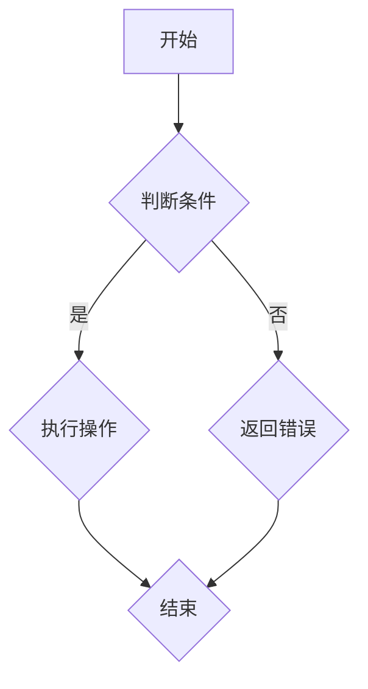

                 

**领导力与影响力：扩大个人影响圈**

关键词：领导力、影响力、个人品牌、人际沟通、团队建设

摘要：本文从领导力的定义、重要性及其与影响力的关系出发，深入探讨提升个人领导力的策略，影响力实践，以及如何构建和扩大个人影响圈。文章旨在帮助读者理解领导力与影响力的本质，掌握提升个人领导力和影响力的实用技巧。

## 目录

----------------------------------------------------------------

# 第一部分：领导力概述

## 第1章：领导力的定义与重要性

## 第2章：领导力理论回顾与对比分析

## 第3章：领导力与影响力的关系

----------------------------------------------------------------

# 第二部分：提升个人领导力的策略

## 第4章：自我认知与个人成长

## 第5章：个人成长的实践策略

## 第6章：领导力的内在品质

----------------------------------------------------------------

# 第三部分：影响力实践

## 第7章：人际沟通技巧

## 第8章：建立良好的人际关系

## 第9章：领导者的个人品牌建设

## 第10章：社交媒体与领导力

## 第11章：激励团队与提升团队凝聚力

----------------------------------------------------------------

# 第四部分：扩大个人影响圈

## 第12章：网络影响力构建

## 第13章：人脉资源管理

## 第14章：扩大影响力的实际案例

## 第15章：领导力与影响力的评估

## 第16章：领导力与影响力的可持续性

----------------------------------------------------------------

## 第1章：领导力的定义与重要性

### 1.1 领导力的起源与演变

领导力作为一种核心能力，自古以来就在人类社会的发展中扮演着重要角色。从古代部落首领到现代企业高管，领导力的本质始终未变，即通过影响他人来实现共同目标的能力。

随着时间的推移，领导力理论也在不断演变。从早期的特质理论到行为理论，再到近年的情境理论和变革型领导理论，领导力研究不断深入，帮助我们更好地理解这一复杂而关键的能力。

### 1.2 领导力在个人成长中的作用

领导力不仅仅是一个职业发展的关键，更是一个个人成长的驱动因素。具备领导力的人通常具有更强的自我认知、更高的情商和更强的适应能力。

首先，领导力培养个体的自我认知。一个成功的领导者需要深入了解自己的优点和缺点，以便在职业和生活中做出明智的决策。

其次，领导力提升个体的情商。领导者需要具备良好的情绪管理和人际交往能力，以便在团队中建立信任和协作。

最后，领导力增强个体的适应能力。面对不断变化的环境和挑战，领导者需要具备快速适应和调整的能力。

### 1.3 领导力在社会组织中的核心地位

领导力在社会组织中具有核心地位，它是团队协作、项目成功和企业发展的重要保障。

首先，领导力是团队协作的基石。一个高效的团队需要有一位强有力的领导者来指导方向、协调资源和解决问题。

其次，领导力是项目成功的关键。领导者能够制定明确的目标、分配任务、监控进度并确保项目的顺利进行。

最后，领导力是企业发展的动力。一个企业的成长离不开领导者的战略眼光、决策能力和创新能力。

### 1.4 领导力理论回顾与对比分析

#### 1.4.1 传统领导理论

传统领导理论主要关注领导者的特质和行为。特质理论认为领导者天生具备某些独特的个人品质，如自信、决策能力等。行为理论则强调领导者的行为方式，如激励、沟通和决策等。

#### 1.4.2 现代领导理论

现代领导理论更加注重情境因素和领导者的变革能力。情境理论认为领导力是情境依赖的，领导者需要根据具体情境调整自己的行为。变革型领导理论则强调领导者通过激励和启发下属来实现组织变革。

#### 1.4.3 领导力理论的应用对比

不同领导力理论在应用中各有优势。特质理论和行为理论适用于培养个体领导力，而情境理论和变革型领导理论则适用于组织领导力和企业战略。

### 1.5 领导力与影响力的关系

#### 1.5.1 影响力的概念

影响力是领导者通过说服、激励和启发他人来实现目标的能力。它与领导力密切相关，是领导力的重要组成部分。

#### 1.5.2 领导力如何扩大影响力

领导力可以通过以下方式扩大影响力：

- 建立良好的个人品牌
- 提升人际沟通技巧
- 建立良好的人际关系
- 利用社交媒体和平台扩大影响力
- 激励团队和提升团队凝聚力

#### 1.5.3 影响力对个人发展的意义

影响力对个人发展具有重要意义。首先，它可以帮助个人在职业生涯中取得更大的成功。其次，它有助于个人在社会中建立更高的声誉和影响力。最后，它为个人提供了更多的机会和资源，从而实现个人和组织的共同发展。

### 1.6 本章小结

领导力是个人成长和社会组织成功的关键。通过了解领导力的起源、重要性、理论发展和影响力，我们可以更好地理解领导力的本质，并掌握提升个人领导力和影响力的实用技巧。

----------------------------------------------------------------

## 第2章：领导力理论回顾与对比分析

### 2.1 传统领导理论

#### 2.1.1 特质理论

特质理论是领导力研究的一个早期观点，它认为领导者具备一系列固有的特质，如自信、果断、智慧和魅力等。这种理论假设领导者生来就具有这些特质，并通过遗传和环境因素得到强化。

特质理论的优势在于其简洁性和可操作性。通过识别和培养领导者所需的特质，组织可以更有效地选拔和培养领导者。然而，特质理论的局限性在于它忽视了情境因素和领导行为的可塑性。

#### 2.1.2 行为理论

行为理论认为领导力不仅仅是领导者个人的特质，还取决于他们的行为。这种理论关注领导者如何与下属互动、如何处理问题和如何做出决策。行为理论试图通过观察和分析领导者的行为来识别有效的领导风格。

行为理论的优势在于其具体性和实用性。它提供了具体的领导行为和策略，帮助领导者提高管理效率。然而，行为理论的局限性在于它忽视了领导者的个人特质和情境因素。

### 2.2 现代领导理论

#### 2.2.1 情境理论

情境理论认为领导力是情境依赖的。不同的情境需要不同的领导行为。领导者需要根据具体情境调整自己的领导风格，以实现最佳效果。

情境理论的优势在于其灵活性和适应性。它提供了领导者如何在不同情境下调整自己的行为的指导。然而，情境理论的局限性在于它难以量化情境因素，并且对领导者的情境感知能力要求较高。

#### 2.2.2 变革型领导理论

变革型领导理论认为领导者通过激励和启发下属来实现组织变革。这种领导风格强调领导者与下属的互动关系，以及领导者对组织愿景的清晰表达。

变革型领导理论的优势在于其激励性和创新性。它能够激发下属的潜能，推动组织实现变革。然而，变革型领导理论的局限性在于它可能难以在稳定和保守的组织环境中实现。

### 2.3 传统与现代领导理论的对比分析

传统领导理论和现代领导理论各有优缺点。传统领导理论强调领导者个人的特质和行为，而现代领导理论则更加关注情境和领导者的互动关系。

#### 2.3.1 优势

- 传统领导理论：简洁性、可操作性、具体性。
- 现代领导理论：灵活性、适应性、激励性、创新性。

#### 2.3.2 局限性

- 传统领导理论：忽视情境因素、领导行为的可塑性。
- 现代领导理论：难以量化情境因素、对领导者的情境感知能力要求较高、难以在保守组织环境中实现。

### 2.4 领导力理论的应用对比

在组织管理和领导力培养中，传统领导理论和现代领导理论都有其应用价值。传统领导理论适用于选拔和培养领导者，帮助组织确定领导者所需的特质和行为。现代领导理论则适用于具体情境和领导行为的调整，帮助领导者提高管理效率。

#### 2.4.1 选拔与培养

- 传统领导理论：通过识别领导者所需的特质和行为，选拔和培养领导者。
- 现代领导理论：通过情境分析和领导行为的调整，选拔和培养适应特定情境的领导者。

#### 2.4.2 管理与领导

- 传统领导理论：强调领导者个人的作用，通过领导者的影响力和管理能力来实现组织目标。
- 现代领导理论：强调领导者与下属的互动关系，通过激励和启发下属来实现组织目标。

### 2.5 本章小结

领导力理论的发展经历了从传统到现代的演变。传统领导理论强调领导者个人的特质和行为，而现代领导理论则更加关注情境和领导者的互动关系。在实际应用中，传统领导理论和现代领导理论各有优缺点，适用于不同的情境和组织需求。了解和掌握这些理论，有助于领导者更好地发挥自己的作用，提高组织的管理效率。

----------------------------------------------------------------

## 第3章：领导力与影响力的关系

### 3.1 影响力的概念

影响力是指一个人或组织能够影响他人思维、行为和决策的能力。在领导力中，影响力是领导者通过个人魅力、专业知识、沟通技巧和决策能力等手段影响下属和团队成员的能力。

#### 3.1.1 影响力的来源

影响力的来源可以归纳为以下几个方面：

1. **专业知识与技能**：领导者具备的专业知识和技能是影响他人的关键因素。他们的专业能力使得他们在团队中具有权威性和可信度。
2. **个人魅力**：领导者的个人魅力，如自信、正直和激情，可以吸引和激励团队成员。
3. **沟通技巧**：有效的沟通技巧使得领导者能够清晰地传达信息、建立信任和解决问题。
4. **决策能力**：领导者做出的决策往往对团队和组织的方向和成果产生重大影响。
5. **道德与价值观**：领导者的道德标准和价值观可以影响团队成员的行为和决策。

#### 3.1.2 影响力的层次

影响力可以分为三个层次：

1. **强制影响力**：通过权力和权威来影响他人，如上级领导对下属的指令。
2. **理性影响力**：通过逻辑、数据和事实来影响他人，如专家通过科学研究和数据分析来说服他人。
3. **感性与情感影响力**：通过情感和共鸣来影响他人，如领导者通过激励和激励措施来鼓舞团队士气。

### 3.2 领导力如何扩大影响力

领导者可以通过以下几种方式来扩大自己的影响力：

#### 3.2.1 建立良好的个人品牌

个人品牌是指一个人在公众心目中的形象和声誉。一个良好的个人品牌能够增加领导者的可信度和吸引力。领导者可以通过以下方式建立个人品牌：

1. **专业知识**：持续学习和提升专业能力，成为团队中的权威。
2. **公共形象**：积极参与社区活动和社会事务，提高公众对个人的认知。
3. **沟通能力**：提高沟通技巧，确保信息传达的准确性和有效性。
4. **价值观**：树立积极正面的价值观，成为团队成员的榜样。

#### 3.2.2 提升人际沟通技巧

有效的沟通技巧是领导者扩大影响力的重要手段。领导者可以通过以下方式提升沟通技巧：

1. **倾听**：倾听是有效沟通的基础，领导者需要学会倾听团队成员的想法和需求。
2. **表达**：清晰、准确的表达能够增强领导者的说服力。
3. **非语言沟通**：肢体语言、面部表情和语调等非语言因素在沟通中扮演着重要角色。
4. **反馈**：给予团队成员及时和建设性的反馈，促进个人和团队的成长。

#### 3.2.3 建立良好的人际关系

良好的人际关系是领导者扩大影响力的重要基础。领导者可以通过以下方式建立良好的人际关系：

1. **互信**：建立信任关系，使团队成员愿意接受领导者的指导和影响。
2. **尊重**：尊重团队成员的意见和贡献，增强团队的凝聚力和归属感。
3. **合作**：与团队成员建立合作关系，共同实现团队目标。
4. **沟通**：通过有效的沟通，了解团队成员的需求和期望，提供帮助和支持。

#### 3.2.4 利用社交媒体和平台

社交媒体和在线平台为领导者提供了一个新的扩大影响力渠道。领导者可以通过以下方式利用社交媒体和平台：

1. **内容创作**：通过博客、视频、文章等形式，分享专业知识和经验，树立个人品牌。
2. **网络互动**：参与线上讨论，与同行和潜在客户建立联系。
3. **社交媒体策略**：制定有效的社交媒体策略，提高个人和品牌的曝光度。
4. **品牌传播**：通过社交媒体，将个人品牌传播到更广泛的受众中。

#### 3.2.5 激励团队和提升团队凝聚力

领导者通过激励团队和提升团队凝聚力，可以增强团队成员的归属感和忠诚度，从而扩大个人影响力。领导者可以通过以下方式激励团队：

1. **目标激励**：明确团队目标，使团队成员明确自己的贡献和期望。
2. **成就激励**：奖励团队成员的成就和努力，提高团队士气。
3. **情感激励**：关注团队成员的情感需求，提供情感支持。
4. **文化激励**：建立积极向上的团队文化，使团队成员在共同价值观下工作。

### 3.3 影响力对个人发展的意义

影响力不仅对领导者本人有重要意义，也对他们的职业发展和社会地位产生深远影响。以下是影响力对个人发展的一些重要意义：

#### 3.3.1 职业发展

1. **提升职业地位**：具备影响力的领导者通常能够在职业中获得更高的地位和更多的机会。
2. **增加话语权**：影响力使领导者在决策过程中具有更大的话语权，能够推动组织的变革和发展。
3. **扩展人脉资源**：影响力可以帮助领导者建立广泛的人脉资源，为职业发展提供支持。

#### 3.3.2 个人成长

1. **自我提升**：通过影响力的实践，领导者能够不断学习和成长，提升自己的专业能力和领导素质。
2. **心理满足感**：领导者的成就感和满足感来自于他们能够影响和改变他人的能力和成果。
3. **社会认可**：影响力的提升使领导者在社会中获得更高的认可和尊重，增强个人的自信心和自尊心。

### 3.4 本章小结

领导力与影响力密切相关，领导力是扩大个人影响力的基础。通过建立良好的个人品牌、提升人际沟通技巧、建立良好的人际关系、利用社交媒体和平台以及激励团队和提升团队凝聚力，领导者可以扩大自己的影响力。影响力不仅对领导者的职业发展有重要意义，也对个人成长产生深远影响。理解领导力与影响力的关系，有助于领导者更好地发挥自己的作用，实现个人和组织的共同发展。

----------------------------------------------------------------

## 第二部分：提升个人领导力的策略

### 第4章：自我认知与个人成长

#### 4.1 自我认知的重要性

自我认知是指个体对自己性格、能力、价值观等方面的认识。自我认知对于个人成长和领导力的提升具有重要意义。

首先，自我认知有助于个人明确自己的优势和劣势，从而在职业发展中做出更明智的决策。一个自我认知清晰的领导者能够更准确地评估自己的能力，找到适合自己的发展方向，避免盲目跟风或过度自信。

其次，自我认知有助于提高个人的适应能力。一个能够自我认知的领导者在面对挑战和变化时，能够更灵活地调整自己的策略和行为，以适应不同情境的需求。

最后，自我认知有助于提升个人的情商。自我认知清晰的领导者能够更好地理解自己的情绪，管理自己的情绪，从而更好地与他人沟通和协作。

#### 4.2 建立清晰的职业目标

建立清晰的职业目标是个人成长和领导力提升的关键。一个明确的职业目标可以帮助领导者：

1. **明确发展方向**：职业目标为领导者指明了前进的方向，避免了迷茫和焦虑。
2. **提升动力**：明确的职业目标能够激发领导者的内在动力，推动他们不断努力追求。
3. **提供评估标准**：职业目标为领导者提供了一个评估自己成长和发展的标准，使他们能够及时调整自己的行为和策略。

#### 4.3 培养自我反思的习惯

自我反思是一种重要的个人成长和领导力提升方法。通过自我反思，领导者可以：

1. **发现不足**：自我反思可以帮助领导者发现自己在职业发展和领导力提升中的不足，从而有针对性地进行改进。
2. **总结经验**：自我反思使领导者能够总结过去的经验和教训，为未来的发展提供宝贵的参考。
3. **提高情商**：自我反思有助于领导者更好地理解自己的情绪和行为，提高情商，从而更好地与他人沟通和协作。

#### 4.4 个人成长的实践策略

个人成长的实践策略包括以下几个方面：

1. **持续学习**：持续学习是个人成长的关键。领导者应该不断学习新的知识和技能，以适应不断变化的环境和职业需求。
2. **积极实践**：理论知识和实践经验的结合是个人成长的重要途径。领导者应该将所学知识应用到实际工作中，通过实践来提升自己的能力。
3. **反思与调整**：在个人成长的实践中，领导者应该定期进行反思，评估自己的进步和不足，并根据反馈进行相应的调整。

#### 4.5 领导力的内在品质

领导力的内在品质是领导者个人魅力和领导力的重要基础。以下是一些关键的内在品质：

1. **诚信与正直**：诚信和正直是领导者的基石，它们能够赢得下属的信任和尊重。
2. **感恩与合作**：感恩和合作精神能够增强团队凝聚力和协作效率。
3. **自信与决断**：自信和决断力使领导者能够在面对挑战和压力时保持冷静和坚定，做出正确的决策。
4. **适应性**：适应性使领导者能够灵活应对变化，适应不同情境和团队需求。

#### 4.6 领导者的心态管理

领导者的心态管理对于领导力的提升至关重要。以下是一些关键的心态管理策略：

1. **积极心态**：保持积极的心态能够增强领导者的抗压能力和适应能力，使他们在面对挑战时更加从容。
2. **情绪管理**：领导者需要学会管理自己的情绪，避免因情绪波动而影响决策和团队氛围。
3. **自我激励**：自我激励是领导者保持动力和持续成长的重要保障。
4. **同理心**：同理心使领导者能够更好地理解下属的需求和感受，从而更好地进行沟通和激励。

#### 4.7 本章小结

自我认知与个人成长是提升个人领导力的重要策略。通过建立清晰的职业目标、培养自我反思的习惯、实践个人成长的策略，以及培养领导力的内在品质和心态管理，领导者可以不断提升自己的能力和影响力，实现个人和组织的共同发展。

----------------------------------------------------------------

## 第5章：个人成长的实践策略

### 5.1 持续学习的重要性

持续学习是个人成长和领导力提升的核心策略之一。在快速变化的社会和经济环境中，知识和技能的过时速度越来越快，领导者如果不持续学习，就可能被淘汰。

#### 5.1.1 学习的价值

持续学习为领导者带来了以下几个方面的价值：

1. **知识更新**：随着科技的飞速发展，领导者需要不断更新自己的知识体系，以适应新的技术和管理方法。
2. **技能提升**：学习新的技能和工具可以帮助领导者更高效地完成工作任务，提升工作效率和质量。
3. **思维拓展**：学习不仅局限于专业领域，还包括跨学科的知识和思维方式，这有助于领导者从不同角度看待问题，做出更全面的决策。

#### 5.1.2 学习的方法

持续学习的有效方法包括：

1. **专业培训**：参加各种专业培训和研讨会，获取最新的行业知识和技能。
2. **阅读**：阅读专业书籍和文章，了解行业动态和前沿理论。
3. **实践**：将所学知识应用到实际工作中，通过实践来深化理解和提高技能。
4. **交流**：与同行和专家进行交流，分享经验和观点，相互学习。

### 5.2 实践中的领导力培养

#### 5.2.1 实践的价值

实践是领导力培养的重要途径。通过实践，领导者可以：

1. **验证理论**：将理论知识应用到实际场景中，验证其有效性和可行性。
2. **发现问题**：在实践中，领导者会遇到各种问题和挑战，这有助于他们发现自身不足并加以改进。
3. **积累经验**：领导力的提升离不开实践经验的积累，通过不断的实践，领导者可以逐渐提高自己的能力。

#### 5.2.2 实践的方法

以下是一些实践中的领导力培养方法：

1. **参与项目**：积极参与各种项目，承担不同的角色和职责，提升综合能力。
2. **角色扮演**：通过模拟各种领导情境，练习不同的领导技巧和策略。
3. **反馈与反思**：定期进行反馈和反思，了解自己在实践中的表现，识别改进空间。
4. **导师指导**：寻求资深领导的指导，从他们的经验中学习领导技巧和策略。

### 5.3 自我提升的评估与反馈

#### 5.3.1 评估的重要性

自我提升的评估与反馈是个人成长和领导力提升的重要环节。通过评估，领导者可以：

1. **了解自身状况**：评估可以帮助领导者了解自己的成长进度和存在的问题。
2. **制定改进计划**：基于评估结果，领导者可以制定具体的改进计划，有针对性地提升自己的能力和素质。
3. **持续成长**：评估与反馈是持续成长的动力，使领导者始终保持进步和发展的动力。

#### 5.3.2 评估与反馈的方法

以下是一些自我提升评估与反馈的方法：

1. **定期自我评估**：设定评估周期，对自己的工作表现、能力提升和成长进度进行自我评估。
2. **360度反馈**：收集来自上级、同事和下属的反馈，全面了解自己在团队和组织中的表现。
3. **绩效评估**：参与组织的正式绩效评估，了解自己的工作成果和改进方向。
4. **反馈与交流**：与导师或领导进行定期交流，获取他们的建议和指导。

### 5.4 领导力的内在品质

#### 5.4.1 诚信与正直

诚信和正直是领导者最基本的品质，它们能够赢得下属的信任和尊重。一个诚信正直的领导者能够在团队中建立高度的信任，促进协作和沟通。

#### 5.4.2 感恩与合作

感恩和合作精神是领导力的重要体现。领导者应该对下属的付出和贡献表示感激，并鼓励团队成员之间的合作，共同实现团队目标。

#### 5.4.3 领导者的心态管理

领导者的心态管理是领导力提升的关键。领导者需要保持积极的心态，学会情绪管理，以应对工作中的压力和挑战。同时，领导者还需要具备自我激励的能力，以保持持续的动力和热情。

#### 5.5 本章小结

个人成长是提升领导力的重要途径。通过持续学习、实践中的领导力培养、自我提升的评估与反馈以及培养领导力的内在品质，领导者可以不断提升自己的能力和素质，实现个人和组织的共同发展。

----------------------------------------------------------------

## 第6章：领导力的内在品质

### 6.1 诚信与正直

诚信与正直是领导者最基本的品质，它们不仅关乎个人的道德修养，更直接影响到团队和组织的发展。一个诚信正直的领导者能够在团队中建立高度的信任，从而促进协作和沟通。

#### 6.1.1 诚信的重要性

诚信是指领导者言行一致，遵守承诺，真诚面对团队成员和外部利益相关者。以下是诚信在领导力中的重要性：

1. **建立信任**：诚信是信任的基石。只有当团队成员相信领导者的诚信，他们才会愿意追随和信任领导者。
2. **提高工作效率**：诚信可以提高团队的工作效率和凝聚力。团队成员相信领导者的决策是基于真实的信息和公正的原则，从而减少误解和冲突。
3. **塑造企业文化**：领导者的诚信行为可以塑造组织的企业文化。一个正直的企业文化能够吸引和留住优秀人才，推动组织的长期发展。

#### 6.1.2 正直的作用

正直是指领导者在面对诱惑和压力时，坚持原则和道德底线。以下是正直在领导力中的作用：

1. **树立榜样**：领导者的正直行为可以树立榜样，激励团队成员也保持正直。
2. **防范腐败**：正直的领导者能够有效防范腐败行为，维护组织的廉洁和公正。
3. **提高决策质量**：正直的领导者能够基于事实和道德原则做出更高质量的决策，避免因个人利益而损害组织利益。

### 6.2 感恩与合作

感恩和合作精神是领导力的关键组成部分。一个懂得感恩和善于合作的领导者能够营造积极的团队氛围，提高团队效率和凝聚力。

#### 6.2.1 感恩的重要性

感恩是指领导者对团队成员的付出和贡献表示感谢和认可。以下是感恩在领导力中的重要性：

1. **增强团队凝聚力**：感恩可以增强团队成员之间的情感联系，提高团队的凝聚力。
2. **激励团队成员**：感恩可以激励团队成员更加努力地工作，因为他们感到自己的付出得到了认可和重视。
3. **建立良好的人际关系**：感恩可以建立领导者与团队成员之间的良好关系，增强沟通和协作。

#### 6.2.2 合作的作用

合作是指领导者与团队成员共同努力，共同实现团队目标。以下是合作在领导力中的作用：

1. **提升工作效率**：合作可以优化工作流程，减少重复和浪费，提高工作效率。
2. **激发创新**：通过合作，团队成员可以互相学习，碰撞出新的想法和解决方案，促进创新。
3. **增强团队竞争力**：一个团结协作的团队在面对外部竞争时更具竞争力。

### 6.3 领导者的心态管理

领导者的心态管理是领导力提升的关键。领导者需要保持积极的心态，学会情绪管理，以应对工作中的压力和挑战。

#### 6.3.1 积极心态的重要性

积极心态是指领导者面对困难和挑战时，保持乐观和自信的态度。以下是积极心态在领导力中的重要性：

1. **提升领导效能**：积极心态可以增强领导者的决策能力，提高领导效能。
2. **激励团队**：领导者的积极心态可以激励团队成员，提高团队士气和动力。
3. **建立良好氛围**：领导者的积极心态可以营造积极的团队氛围，增强团队的凝聚力。

#### 6.3.2 情绪管理的作用

情绪管理是指领导者学会管理自己的情绪，避免因情绪波动而影响决策和团队氛围。以下是情绪管理在领导力中的作用：

1. **稳定情绪**：领导者需要学会在压力和挑战面前保持冷静，避免情绪失控。
2. **有效沟通**：情绪管理有助于领导者更有效地进行沟通，减少误解和冲突。
3. **建立信任**：情绪稳定的领导者更容易赢得团队成员的信任和尊重。

#### 6.3.3 自我激励

自我激励是指领导者通过内在动力推动自己的成长和发展。以下是自我激励在领导力中的重要性：

1. **持续成长**：自我激励可以促使领导者不断学习和提升，保持自身的竞争力。
2. **应对挑战**：自我激励使领导者能够积极面对挑战，克服困难，实现个人和团队的目标。
3. **保持动力**：自我激励可以帮助领导者保持工作热情和动力，持续推动团队进步。

### 6.4 同理心

同理心是指领导者设身处地地理解团队成员的感受和需求。同理心在领导力中的作用如下：

1. **提高沟通效果**：同理心有助于领导者更好地理解团队成员的立场和需求，从而更有效地进行沟通和解决问题。
2. **增强团队凝聚力**：同理心可以增强团队成员之间的情感联系，提高团队的凝聚力和合作意愿。
3. **提升领导力**：同理心使领导者能够更好地理解和支持团队成员，从而提升自己的领导力和影响力。

### 6.5 本章小结

领导力的内在品质是领导者个人魅力和领导力的重要基础。诚信与正直、感恩与合作、积极心态、情绪管理和自我激励以及同理心等内在品质，不仅能够提升领导者的个人形象，还能有效推动团队和组织的发展。理解并培养这些内在品质，对于领导者的成长和组织的成功至关重要。

----------------------------------------------------------------

## 第7章：人际沟通技巧

### 7.1 沟通的艺术

人际沟通是领导力的核心要素之一，它不仅影响个人职业生涯的成功，还直接关系到团队和组织效能。有效的沟通能够消除误解、促进协作、提高决策质量。以下是沟通艺术的几个关键方面：

#### 7.1.1 有效沟通的要素

1. **清晰表达**：明确、简洁、有条理地表达自己的想法和意见，避免模糊和冗长的表述。
2. **倾听**：积极倾听对方的观点，理解对方的意图和需求，从而更好地回应和解决问题。
3. **非语言沟通**：注意自己的肢体语言、面部表情和语调等非语言因素，这些因素对沟通效果具有重要影响。
4. **反馈**：及时给予对方反馈，确认对方是否理解了自己的观点，并就重要问题进行深入讨论。

#### 7.1.2 领导者如何进行有效沟通

1. **建立信任**：通过诚信和正直的行为建立信任，使团队成员愿意与领导者进行开放和坦诚的沟通。
2. **明确目标**：在沟通前明确沟通的目标和预期结果，确保沟通的有效性和针对性。
3. **适应听众**：根据听众的背景、经验和知识水平调整沟通内容和方式，使其更容易理解和接受。
4. **积极倾听**：在沟通中保持专注，给予对方足够的关注和时间，鼓励对方表达意见和感受。

### 7.2 倾听与表达的平衡

在人际沟通中，倾听与表达之间的平衡至关重要。倾听是理解对方观点和需求的关键，而表达则是清晰传达自己意图的重要手段。以下是如何实现倾听与表达的平衡：

#### 7.2.1 倾听的技巧

1. **主动倾听**：不仅听对方说什么，还要理解对方的情感和意图，通过肢体语言和反馈表达关注和理解。
2. **避免打断**：在对方讲话时，避免急于表达自己的观点，给予对方充分的时间陈述。
3. **确认理解**：在对方讲完后，通过复述和提问来确认自己是否正确理解了对方的观点。

#### 7.2.2 表达的技巧

1. **简洁明了**：用简洁明了的语言表达自己的观点，避免使用专业术语和复杂句式。
2. **正面表达**：用积极正面的语言表达意见和反馈，避免使用消极或攻击性的措辞。
3. **情感表达**：在适当的场合表达自己的情感，使其成为沟通的一部分，而不是沟通的障碍。

### 7.3 非语言沟通的运用

非语言沟通在人际沟通中扮演着重要角色，它包括肢体语言、面部表情、眼神交流、声音语调等。以下是如何有效运用非语言沟通：

#### 7.3.1 肢体语言

1. **开放性姿势**：保持开放的肢体姿势，如双手自然放在身体两侧，表明自己的开放和愿意倾听。
2. **适当的触摸**：在合适的场合，适当的身体接触可以传递友好和支持的信息。

#### 7.3.2 面部表情

1. **真诚的笑容**：真诚的笑容可以传递积极和友好的信号，增强沟通的亲切感。
2. **适当的表情**：根据沟通内容和情境，适当使用表情来表达情感和态度。

#### 7.3.3 眼神交流

1. **适当的眼神交流**：保持适当的眼神交流，表明自己的关注和理解。
2. **避免眼神逃避**：在沟通中避免眼神逃避或持续盯着对方，这可能会让对方感到不舒服。

#### 7.3.4 声音语调

1. **清晰的声音**：使用清晰、稳定的声音进行沟通，避免语速过快或过慢。
2. **适当的语调**：根据沟通内容和情感调整语调，使其更具表现力和感染力。

### 7.4 领导力与人际沟通

#### 7.4.1 领导者如何进行有效沟通

1. **建立良好的沟通渠道**：确保团队成员能够方便地与领导者沟通，并及时获取所需的信息。
2. **鼓励双向沟通**：领导者应鼓励团队成员积极参与沟通，表达自己的意见和反馈。
3. **提供反馈**：领导者应及时给予团队成员反馈，帮助他们了解自己的表现和改进方向。

#### 7.4.2 团队沟通的有效策略

1. **明确沟通目标**：在团队沟通前明确沟通的目标和内容，确保沟通具有针对性和高效性。
2. **建立沟通规则**：制定明确的沟通规则，如发言顺序、讨论时间等，确保沟通的有序进行。
3. **利用多种沟通工具**：结合会议、邮件、即时通讯等多种沟通工具，提高沟通的效率和质量。

### 7.5 沟通中的冲突解决

#### 7.5.1 冲突解决的方法

1. **倾听和理解**：在解决冲突时，首先要倾听和理解对方的观点和感受，避免立即做出判断或回应。
2. **理性分析**：通过理性分析冲突的原因和影响，寻找解决方案。
3. **寻求共识**：在解决冲突时，寻求双方都能接受的共识，避免单方面决策。

#### 7.5.2 冲突预防

1. **建立信任**：通过建立信任，减少冲突的发生。
2. **清晰沟通**：通过清晰、明确的沟通，减少误解和误读。
3. **预防性沟通**：在冲突可能发生的早期阶段进行预防性沟通，及时解决问题。

### 7.6 本章小结

人际沟通技巧是领导者必须掌握的重要技能。通过倾听与表达的平衡、非语言沟通的运用以及有效解决冲突，领导者可以提升人际沟通的效果，增强团队的凝聚力和协作效率。理解并运用人际沟通技巧，对于提升领导力和实现组织目标至关重要。

----------------------------------------------------------------

## 第8章：建立良好的人际关系

### 8.1 人际关系的层次与特征

人际关系是指人们在共同工作和生活中形成的相互联系。人际关系可以分为多个层次，每个层次都有其独特的特征。

#### 8.1.1 初级层次

初级层次的人际关系通常基于表面接触和基本的社交礼仪。在这个层次上，人们相互认识，但交流内容较为肤浅，常见于初次见面或正式场合。

#### 8.1.2 中级层次

中级层次的人际关系建立在一定程度的信任和了解上。在这个层次上，人们可以更深入地交流，分享个人观点和感受。中级层次的人际关系有助于建立良好的团队氛围和合作关系。

#### 8.1.3 高级层次

高级层次的人际关系是建立在深厚信任和高度了解的基础上。在这个层次上，人们可以互相支持，共同面对挑战。高级层次的人际关系对于领导者的个人成长和组织发展至关重要。

### 8.2 人际关系的管理技巧

#### 8.2.1 建立信任

建立信任是管理人际关系的核心。以下是建立信任的一些关键技巧：

1. **诚信**：保持诚信是建立信任的基础。领导者应言行一致，遵守承诺。
2. **透明**：在处理问题和沟通时，保持透明，让团队成员了解真实的情况。
3. **倾听**：积极倾听团队成员的意见和需求，表明你对他们的关注和理解。

#### 8.2.2 有效沟通

有效沟通是管理人际关系的重要手段。以下是一些有效沟通的技巧：

1. **清晰表达**：用简洁明了的语言表达自己的想法和意见，避免模糊和冗长的表述。
2. **积极倾听**：倾听对方的观点，理解对方的意图和需求，从而更好地回应和解决问题。
3. **反馈**：及时给予对方反馈，确认对方是否理解了自己的观点，并就重要问题进行深入讨论。

#### 8.2.3 建立合作

建立合作是管理人际关系的另一个关键方面。以下是一些建立合作的技巧：

1. **共同目标**：确保团队成员明确共同的目标和愿景，这有助于增强团队的凝聚力。
2. **分工协作**：合理分配任务，确保每个团队成员都能发挥自己的优势，实现协同合作。
3. **互相支持**：在团队中培养互相支持的氛围，使成员在遇到困难时能够得到帮助。

#### 8.2.4 解决冲突

解决冲突是管理人际关系时不可避免的一部分。以下是一些解决冲突的技巧：

1. **倾听和理解**：在解决冲突时，首先要倾听和理解对方的观点和感受，避免立即做出判断或回应。
2. **理性分析**：通过理性分析冲突的原因和影响，寻找解决方案。
3. **寻求共识**：在解决冲突时，寻求双方都能接受的共识，避免单方面决策。

### 8.3 人际关系对领导力的影响

#### 8.3.1 提升领导效能

良好的人际关系能够提升领导效能。以下是人际关系对领导效能的一些影响：

1. **增强团队凝聚力**：良好的人际关系有助于建立团队成员之间的信任和合作，提高团队的凝聚力。
2. **提高决策质量**：领导者通过与团队成员建立良好的关系，能够更全面地了解团队的需求和意见，从而做出更高质量的决策。
3. **增强影响力**：良好的人际关系使领导者能够更有效地影响团队成员，推动团队目标的实现。

#### 8.3.2 影响个人发展

人际关系对领导者的个人发展也有重要影响。以下是人际关系对个人发展的一些影响：

1. **提升自我认知**：通过与不同背景和经验的团队成员交往，领导者可以更好地认识自己，发现自身的优势和不足。
2. **拓展视野**：良好的人际关系可以拓展领导者的视野，使其了解更多的观点和思路，有助于创新思维和决策。
3. **增加机会**：良好的人际关系可以带来更多的职业机会和资源，有助于领导者的职业发展和晋升。

### 8.4 本章小结

建立良好的人际关系是领导者提升领导力和实现个人发展的重要策略。通过建立信任、有效沟通、建立合作和解决冲突，领导者可以提升人际关系的管理水平，从而提升领导效能和个人发展。理解人际关系对领导力和个人发展的影响，有助于领导者更好地运用人际关系，实现个人和组织的共同进步。

----------------------------------------------------------------

## 第9章：领导者的个人品牌建设

### 9.1 个人品牌的重要性

个人品牌是指一个人在公众心目中的形象和声誉。一个强大的个人品牌可以为领导者带来以下几个方面的优势：

#### 9.1.1 增强信任

强大的个人品牌能够增强领导者与团队成员、合作伙伴以及客户之间的信任。当人们了解到领导者的专业能力和成就，他们更愿意相信并跟随领导者。

#### 9.1.2 提高影响力

个人品牌是领导影响力的载体。一个强大的个人品牌能够使领导者在团队和组织中发挥更大的影响力，推动组织目标的实现。

#### 9.1.3 拓展机会

强大的个人品牌可以吸引更多的职业机会和资源。领导者可以利用个人品牌在行业内建立人脉，获得更多的项目机会和合作资源。

#### 9.1.4 增强竞争力

在竞争激烈的职场环境中，个人品牌是领导者的重要竞争力之一。一个独特的个人品牌可以帮助领导者从众多竞争对手中脱颖而出。

### 9.2 塑造个人品牌的方法

要塑造一个强大的个人品牌，领导者需要采取一系列策略。以下是几种有效的塑造个人品牌的方法：

#### 9.2.1 明确个人定位

领导者需要明确自己的专业领域和特长，确定个人品牌的核心价值和定位。这有助于塑造一个清晰、有针对性的个人品牌形象。

#### 9.2.2 持续学习和成长

个人品牌的建设需要不断的学习和成长。领导者应保持好奇心，持续学习新的知识和技能，以提升自己的专业能力和领导素质。

#### 9.2.3 跨领域实践

通过跨领域实践，领导者可以扩展自己的视野和经验，提升自己的综合能力。这有助于建立多元化的个人品牌形象，增强竞争力。

#### 9.2.4 精心管理社交媒体

社交媒体是塑造个人品牌的重要工具。领导者应积极利用社交媒体平台，分享专业知识和经验，展示个人成就和价值观。

#### 9.2.5 建立人脉网络

通过建立广泛的人脉网络，领导者可以扩大个人品牌的影响力。参加行业会议、研讨会和社交活动，与同行和潜在合作伙伴建立联系。

#### 9.2.6 保持诚信和正直

诚信和正直是个人品牌的重要组成部分。领导者应以诚信和正直的行为树立自己的形象，赢得公众的信任和尊重。

### 9.3 品牌传播与影响力扩大

塑造个人品牌只是第一步，领导者还需要通过有效的传播策略来扩大个人品牌的影响力。以下是几种品牌传播和影响力扩大的方法：

#### 9.3.1 内容创作

通过撰写专业博客、发表文章、制作视频等内容，领导者可以传播自己的专业知识和见解，提升个人品牌的影响力。

#### 9.3.2 社交媒体营销

利用社交媒体平台进行营销，例如发布有价值的帖子、参与话题讨论、分享专业内容等，可以迅速扩大个人品牌的影响力。

#### 9.3.3 演讲和培训

参加行业会议、研讨会和培训活动，进行演讲和培训，可以提高个人品牌的知名度和认可度。

#### 9.3.4 合作与赞助

与其他知名品牌或专家合作，参与赞助活动，可以借助合作伙伴的资源和影响力，提升个人品牌的知名度。

#### 9.3.5 媒体曝光

争取媒体曝光，如接受采访、参与专题报道等，可以让更多人了解和认可领导者的个人品牌。

### 9.4 个人品牌建设对领导力的影响

个人品牌建设对领导力有着深远的影响。以下是个人品牌建设对领导力的一些影响：

#### 9.4.1 增强自信心

一个强大的个人品牌可以增强领导者的自信心，使其在决策和面对挑战时更加坚定和果断。

#### 9.4.2 提升领导力

个人品牌建设有助于领导者提升自身的领导力。通过不断学习和成长，领导者可以提升专业能力和领导素质。

#### 9.4.3 激励团队

领导者通过个人品牌的影响力，可以激励团队成员更加积极地投入工作，共同实现组织目标。

#### 9.4.4 提高影响力

个人品牌建设可以扩大领导者的影响力，使其在团队和组织中发挥更大的作用，推动组织变革和发展。

### 9.5 本章小结

领导者的个人品牌建设是提升个人领导力和影响力的关键策略。通过明确个人定位、持续学习和成长、精心管理社交媒体、建立人脉网络以及有效的品牌传播策略，领导者可以塑造一个强大而独特的个人品牌，从而提升领导效能和个人发展。理解个人品牌建设的重要性，并采取相应的方法和策略，对于领导者的职业成功和组织的发展具有重要意义。

----------------------------------------------------------------

## 第10章：社交媒体与领导力

### 10.1 社交媒体在领导力提升中的应用

在当今数字化时代，社交媒体已成为领导者提升个人影响力、塑造形象和促进团队协作的重要工具。以下是社交媒体在领导力提升中的应用：

#### 10.1.1 建立个人品牌

通过社交媒体平台，领导者可以分享专业知识和经验，展示个人成就和价值观，从而建立强大的个人品牌。例如，通过撰写博客、发布专业文章、制作视频等，领导者可以展示自己的专业能力和独特的领导风格。

#### 10.1.2 扩大影响力

社交媒体平台提供了巨大的受众群体，领导者可以通过社交媒体与更多的潜在粉丝和合作伙伴建立联系，扩大个人影响力。通过积极参与行业讨论、分享有价值的观点和资源，领导者可以在社交媒体上建立广泛的社交网络。

#### 10.1.3 促进团队协作

社交媒体可以促进团队内部和跨团队的协作。领导者可以利用社交媒体平台创建群组、论坛和聊天室，使团队成员能够方便地交流和分享信息，提高协作效率。此外，社交媒体还可以用于组织虚拟会议、在线培训和团队建设活动，增强团队的凝聚力和协作精神。

### 10.2 社交媒体策略的制定与执行

要有效地利用社交媒体提升领导力，领导者需要制定和执行一套清晰的社交媒体策略。以下是社交媒体策略的制定和执行步骤：

#### 10.2.1 确定目标和受众

在制定社交媒体策略之前，领导者需要明确自己的目标和受众。目标可以是提升品牌知名度、扩大影响力、建立专业形象等。受众可以是团队成员、行业专家、潜在合作伙伴等。

#### 10.2.2 选择适当的平台

根据目标和受众特点，选择合适的社交媒体平台。例如，LinkedIn适合专业交流，Twitter适合快速传播信息，YouTube适合发布视频内容。

#### 10.2.3 制定内容策略

制定内容策略，明确发布的内容类型、频率和风格。内容可以包括专业文章、行业分析、项目进展、团队动态等。领导者应根据受众需求调整内容策略，确保内容有价值、有吸引力。

#### 10.2.4 持续更新和互动

定期更新社交媒体内容，保持与受众的互动。领导者应积极回应粉丝和评论者的提问和反馈，展示自己的专业性和亲和力。

#### 10.2.5 分析效果和调整策略

定期分析社交媒体活动的效果，包括关注者增长、互动率、内容传播范围等。根据分析结果调整社交媒体策略，优化内容发布和互动方式。

### 10.3 社交媒体风险的应对

虽然社交媒体在提升领导力方面具有巨大潜力，但领导者也需警惕潜在的风险。以下是社交媒体风险的应对策略：

#### 10.3.1 保护个人隐私

在社交媒体上，领导者应注意保护个人隐私，避免透露敏感信息。在社交媒体账号设置中，限制对个人信息的访问和分享。

#### 10.3.2 避免发布不当内容

避免发布可能引起争议、误解或负面影响的内容。在发布任何信息之前，领导者应仔细考虑其可能带来的后果。

#### 10.3.4 防范网络攻击

领导者应加强社交媒体账号的安全防护，防范网络攻击和数据泄露。定期更改密码、启用双重身份验证，确保账号安全。

### 10.4 社交媒体对领导力的影响

社交媒体对领导力的影响是多方面的。以下是社交媒体对领导力的一些影响：

#### 10.4.1 增强透明度和可信度

社交媒体使领导者的言行更加透明，有助于建立可信度。领导者通过社交媒体展示自己的专业知识和实际工作成果，使团队成员更愿意信任和跟随。

#### 10.4.2 提高沟通效率

社交媒体提供了高效的沟通渠道，使领导者能够迅速传达信息、获取反馈和解决问题。这有助于提高团队协作效率和决策质量。

#### 10.4.3 促进创新和协作

社交媒体平台为领导者提供了丰富的资源和信息，有助于激发创新思维和促进团队协作。通过社交媒体，领导者可以了解行业动态、学习先进经验，并将其应用到实际工作中。

### 10.5 本章小结

社交媒体已成为提升领导力的重要工具。通过建立个人品牌、扩大影响力、促进团队协作和应对社交媒体风险，领导者可以利用社交媒体提升自身的领导力和影响力。理解社交媒体在领导力提升中的应用和策略，对于领导者的职业发展和组织成功具有重要意义。

----------------------------------------------------------------

## 第11章：激励团队与提升团队凝聚力

### 11.1 领导者的激励艺术

激励是领导力的核心要素之一，它能够激发团队成员的积极性和创造力，提升团队的整体绩效。领导者需要掌握多种激励艺术，以适应不同团队成员的需求和情境。

#### 11.1.1 目标激励

目标激励是指通过设定明确的目标和期望，激发团队成员的内在动机。领导者应该与团队成员共同制定具有挑战性的目标，并明确实现目标的路径和资源。

1. **设定明确的目标**：目标应该具体、可衡量、可实现、相关性强和时间限定（SMART）。
2. **分解目标**：将大目标分解为小目标，使团队成员能够逐步实现，增强他们的成就感和动力。
3. **反馈与激励**：定期对团队成员的进展进行反馈，并给予适当的奖励和认可。

#### 11.1.2 赞赏激励

赞赏激励是通过表扬和奖励团队成员的成就和努力，激发他们的积极性和忠诚度。领导者应该学会如何恰当地赞赏团队成员，使其感受到自己的价值和贡献。

1. **真诚赞赏**：赞赏应该真诚，让团队成员感受到领导者的真诚和认可。
2. **公开赞赏**：在公开场合对团队成员的成就进行赞赏，增强他们的自信心和团队凝聚力。
3. **个性化赞赏**：根据团队成员的个性和需求，采取个性化的赞赏方式，使其更加有效。

#### 11.1.3 情感激励

情感激励是通过关心和关注团队成员的情感需求，激发他们的工作热情和忠诚度。领导者应该成为团队成员的“情感导师”，提供情感支持和鼓励。

1. **倾听与理解**：领导者应该倾听团队成员的情感表达，理解他们的需求和困扰。
2. **关心与支持**：领导者应该关心团队成员的生活和工作，提供必要的支持和帮助。
3. **情感交流**：领导者应该通过真诚的情感交流，建立与团队成员的深厚情感联系。

#### 11.1.4 文化激励

文化激励是通过建立积极的组织文化，激发团队成员的内在动力。领导者应该塑造一种鼓励创新、尊重多样性和注重团队协作的文化氛围。

1. **价值观传递**：领导者应该明确组织的核心价值观，并通过实际行动传递给团队成员。
2. **文化建设**：领导者应该组织团队活动，增强团队成员之间的情感联系和团队凝聚力。
3. **文化创新**：领导者应该鼓励团队成员提出创新的想法和方案，使组织文化保持活力和创造力。

### 11.2 团队建设的核心要素

团队建设是提升团队凝聚力和绩效的关键。以下是团队建设的核心要素：

#### 11.2.1 共同目标

共同目标是团队建设的基石。领导者应该与团队成员共同制定团队目标和愿景，使团队成员明确自己的角色和责任。

1. **目标明确**：确保团队目标清晰、具体，并能够激发团队成员的热情和动力。
2. **目标一致**：确保团队成员对团队目标有共同的理解和认同，避免目标冲突和误解。

#### 11.2.2 有效沟通

有效沟通是团队协作的保障。领导者应该建立开放、透明和及时的沟通渠道，确保团队成员能够顺畅地交流和合作。

1. **沟通渠道**：建立多种沟通渠道，如定期会议、即时通讯和团队论坛，确保信息的及时传递。
2. **沟通技巧**：领导者应该提高自己的沟通技巧，如倾听、表达和反馈，以促进团队成员之间的有效沟通。

#### 11.2.3 分工协作

分工协作是团队高效运作的基础。领导者应该根据团队成员的能力和特长，合理分配任务，确保每个人都能发挥自己的优势。

1. **任务分配**：根据团队成员的能力和特长，合理分配任务，使每个人都能在自己的优势领域发挥作用。
2. **协作支持**：鼓励团队成员之间相互支持和协作，共同完成任务。

#### 11.2.4 信任与尊重

信任与尊重是团队凝聚力的关键。领导者应该建立信任和尊重的团队文化，使团队成员之间能够真诚相待，相互支持。

1. **建立信任**：通过诚信和正直的行为建立信任，确保团队成员之间的信任和合作。
2. **尊重多样**：尊重团队成员的个性和差异，鼓励多样性和创新。

### 11.3 提升团队凝聚力的策略

提升团队凝聚力是领导者的重要任务。以下是几种提升团队凝聚力的策略：

#### 11.3.1 团队活动

通过组织团队活动，如团队建设训练、团队旅行和团队晚会等，增强团队成员之间的情感联系和团队凝聚力。

1. **活动规划**：制定有针对性的团队活动计划，确保活动与团队目标和价值观相符。
2. **参与度**：鼓励团队成员积极参与团队活动，提高团队活动的效果。

#### 11.3.2 奖励与表彰

通过奖励和表彰团队成员的成就和贡献，增强团队成员的荣誉感和归属感。

1. **奖励机制**：建立明确的奖励机制，确保奖励公平、公正和及时。
2. **表彰方式**：采取多样化的表彰方式，如公开表彰、证书奖励和物质奖励等。

#### 11.3.4 情感沟通

通过情感沟通，增进团队成员之间的理解和信任，提升团队凝聚力。

1. **情感交流**：定期组织情感沟通活动，如团队座谈会和心理辅导等。
2. **关注个体**：领导者应该关注每个团队成员的情感需求，提供个性化的关怀和支持。

### 11.4 本章小结

激励团队和提升团队凝聚力是领导者的重要职责。通过目标激励、赞赏激励、情感激励和文化激励，领导者可以激发团队成员的积极性和创造力。通过共同目标、有效沟通、分工协作和信任与尊重，领导者可以建立高效的团队。理解并运用这些策略，有助于领导者提升团队凝聚力和绩效，实现团队和组织的共同发展。

----------------------------------------------------------------

## 第12章：网络影响力构建

### 12.1 网络影响力的重要性

在当今数字化时代，网络影响力已成为个人和品牌成功的关键因素。网络影响力是指通过互联网平台，个人或组织能够吸引和影响他人的能力。以下是网络影响力的重要性：

#### 12.1.1 拓展受众

网络影响力可以帮助个人或品牌迅速拓展受众范围，不仅限于地理位置或传统媒体渠道。通过互联网，可以接触到全球的潜在客户和粉丝。

#### 12.1.2 增强品牌知名度

建立强大的网络影响力可以显著提升个人或品牌的知名度。通过网络平台，可以持续传播品牌信息，提高品牌在市场中的影响力。

#### 12.1.3 提升信任度

网络影响力可以帮助建立信任。通过分享专业知识和真实经验，个人或品牌可以赢得受众的信任和尊重。

#### 12.1.4 促进互动和反馈

网络影响力使得个人或品牌能够与受众进行实时互动，收集反馈，并根据反馈调整策略，提高服务质量和用户满意度。

### 12.2 构建个人影响力的网络策略

要构建有效的网络影响力，个人需要采取一系列策略，以下是一些关键策略：

#### 12.2.1 明确目标受众

首先，个人需要明确自己的目标受众。了解他们的兴趣、需求和痛点，以便提供有针对性的内容和互动。

#### 12.2.2 选择合适的平台

根据目标受众的喜好和使用习惯，选择合适的社交媒体平台。例如，LinkedIn适合专业交流，Instagram适合视觉内容展示，Twitter适合实时互动。

#### 12.2.3 制定内容策略

制定内容策略，明确发布的内容类型、频率和风格。内容应该有价值、有吸引力，并能够与目标受众建立共鸣。

#### 12.2.4 持续更新和互动

定期更新社交媒体内容，保持与受众的互动。积极回应粉丝和评论者的提问和反馈，展示自己的专业性和亲和力。

#### 12.2.5 优化搜索引擎排名

通过SEO（搜索引擎优化）策略，提高个人或品牌的搜索排名，增加曝光度。这包括关键词研究、内容优化和外部链接建设。

#### 12.2.6 合作与推广

与其他有影响力的个人或品牌合作，通过联合推广扩大影响力。这可以是内容合作、互推或共同举办活动。

### 12.3 网络影响力与实际应用的结合

网络影响力不仅是一种虚拟存在，还可以转化为实际的商业价值和社会影响力。以下是网络影响力与实际应用的结合：

#### 12.3.1 增加业务机会

强大的网络影响力可以吸引潜在客户和合作伙伴，增加业务机会和合作可能性。

#### 12.3.2 提升销售额

通过网络影响力，个人或品牌可以更好地推广产品和服务，提高销售额。

#### 12.3.3 塑造社会影响力

网络影响力可以用于推动社会议题和公益事业，提升个人或品牌的社会责任感和影响力。

#### 12.3.4 打造个人品牌

通过持续的网络影响力建设，个人可以打造独特的个人品牌，提升职业地位和社会声誉。

### 12.4 构建网络影响力的实际案例

以下是一些构建网络影响力的实际案例，供读者参考：

#### 12.4.1 案例一：李笑来

李笑来是一位知名的投资人、作家和自媒体人。通过微信公众号和知乎专栏，他分享了大量投资和创业经验，吸引了大量粉丝。他的网络影响力使他成为投资领域的意见领袖，也为其个人和业务带来了巨大收益。

#### 12.4.2 案例二：罗永浩

罗永浩是知名的企业家和技术爱好者。他在微博和抖音等平台上，分享了自己的创业经历和技术见解，积累了庞大的粉丝群体。他的网络影响力帮助他在直播带货和创业领域取得了成功。

#### 12.4.3 案例三：李佳琦

李佳琦是一位知名的直播带货主播。通过抖音和直播平台，他分享了自己的美妆技巧和产品推荐，吸引了大量女性粉丝。他的网络影响力使他成为直播带货领域的代表人物，也为其品牌带来了巨大的商业价值。

### 12.5 本章小结

网络影响力在个人和品牌成功中扮演着关键角色。通过明确目标受众、选择合适平台、制定内容策略、持续更新和互动以及与实际应用结合，个人可以构建强大的网络影响力。理解网络影响力的重要性，并采取有效策略，对于提升个人和品牌竞争力具有重要意义。

----------------------------------------------------------------

## 第13章：人脉资源管理

### 13.1 人脉资源的价值

人脉资源是指个人或组织通过社会关系网络所拥有的资源，包括朋友、同事、合作伙伴、行业专家等。有效管理人脉资源对于个人和职业发展具有重要意义。

#### 13.1.1 提升职业发展

人脉资源可以提供职业发展的机会，如工作推荐、培训机会和项目合作。通过人脉网络，个人可以更快地获取行业信息、行业趋势和职业机会。

#### 13.1.2 解决问题

人脉资源可以在个人遇到问题时提供帮助。无论是职业发展中的困惑，还是日常生活中遇到的难题，一个广泛的人脉网络可以提供多种解决方案和建议。

#### 13.1.3 增强竞争力

拥有丰富的人脉资源可以增强个人的竞争力。在求职、谈判和业务拓展中，人脉资源可以为个人提供更多的信息和优势，使个人在竞争中脱颖而出。

#### 13.1.4 拓展视野

通过人脉网络，个人可以结识不同领域、不同背景的人，从而拓展自己的视野和知识面。这有助于个人在职业和生活中保持创新和进步。

### 13.2 人脉资源的管理方法

要有效管理人脉资源，个人需要采取一系列策略和方法。以下是几种常见的人脉资源管理方法：

#### 13.2.1 定期更新和维护

建立和维护人脉关系需要时间和精力。个人应定期更新和维护人脉网络，通过电话、邮件、社交媒体等方式保持联系，了解对方的最新动态。

#### 13.2.2 分类整理

对每个人脉资源进行分类整理，记录对方的姓名、联系方式、关系程度、职业背景等信息。这有助于个人在需要时快速找到合适的资源。

#### 13.2.3 定期交流

定期与关键人脉进行交流，分享彼此的近况和需求。通过交流，可以加深彼此的了解和信任，从而在需要时提供更有针对性的帮助。

#### 13.2.4 利用社交平台

利用社交媒体平台，如LinkedIn、微信等，建立和维护人脉网络。这些平台可以提供更多的交流渠道和互动机会，使个人更容易与人脉保持联系。

#### 13.2.5 深度交往

在维护人脉关系时，不仅要保持表面的互动，还要进行深度的交往。通过共同参与活动、讨论行业话题等方式，建立更加紧密和真实的关系。

### 13.3 人脉资源管理对个人发展的意义

人脉资源管理对个人发展具有深远的意义。以下是几个方面的具体影响：

#### 13.3.1 职业机会

通过人脉资源，个人可以更快地获取职业机会，如内部推荐、招聘信息等。这有助于个人在职业发展中占据有利位置。

#### 13.3.2 知识共享

通过人脉资源，个人可以获取更多的行业知识和信息，了解行业动态和趋势。这有助于个人在专业领域中保持领先地位。

#### 13.3.3 解决问题

在人脉资源中，个人可以找到解决问题的专家和顾问，获取专业的建议和指导。这有助于个人在遇到问题时更快地找到解决方案。

#### 13.3.4 提升人际交往能力

通过管理人脉资源，个人可以提升人际交往能力，学会如何与他人建立和维护关系。这有助于个人在社交和职业场合中更加自信和成功。

### 13.4 人脉资源管理的注意事项

在管理人脉资源时，个人需要注意以下几点：

#### 13.4.1 真诚交往

在与人交往时，保持真诚和诚信，避免虚假和表面功夫。真诚的交往能够建立更长久的信任和关系。

#### 13.4.2 适度互动

与人脉保持适度互动，避免过度打扰或忽视。根据对方的兴趣和需求，进行有针对性的互动和交流。

#### 13.4.3 分享价值

在与人脉交往中，分享自己的知识和经验，提供帮助和支持。通过分享价值，可以加深彼此的关系，建立互惠互利的关系网络。

#### 13.4.4 尊重隐私

在管理人脉资源时，尊重对方的隐私和个人空间。避免泄露对方的个人信息或隐私，以维护彼此的信任和尊重。

### 13.5 本章小结

人脉资源管理是个人职业发展和人际交往的重要策略。通过定期更新和维护人脉网络、分类整理和深度交往，个人可以有效地管理人脉资源，提升职业发展和人际交往能力。理解人脉资源管理的价值和方法，有助于个人在职业和生活中取得更大的成功。

----------------------------------------------------------------

## 第14章：扩大影响力的实际案例

### 14.1 成功案例分享

#### 14.1.1 案例一：马云与阿里巴巴

马云是中国互联网创业的代表人物之一。他通过阿里巴巴这个平台，不仅成功创立了一家全球知名的企业，还扩大了自己的个人影响力。以下是马云扩大影响力的几个关键步骤：

1. **明确个人定位**：马云将自己定位为电子商务领域的创新者和领导者，通过分享自己对电商行业的见解和经验，树立了个人品牌。
2. **内容创作与传播**：马云通过演讲、书籍和社交媒体等多种方式，持续分享自己的知识和观点，吸引了大量的关注和追随者。
3. **合作与联合**：马云积极与其他行业领袖和企业合作，通过联合推广和资源共享，扩大了个人和品牌的影响力。

#### 14.1.2 案例二：李开复与创新工场

李开复是一位知名的人工智能专家和企业家。他通过创新工场这个平台，不仅推动了人工智能行业的发展，还扩大了自己的个人影响力。以下是李开复扩大影响力的几个关键步骤：

1. **专业知识的传播**：李开复通过博客、演讲和书籍等多种形式，分享自己在人工智能领域的专业知识和最新研究，树立了专业权威。
2. **人才培养**：李开复注重人才培养，通过创新工场的项目和培训，培养了一大批优秀的人工智能人才，增强了个人和品牌的影响力。
3. **社会参与**：李开复积极参与社会事务和公益活动，通过自己的影响力推动社会进步和科技创新。

### 14.2 失败案例的反思

#### 14.2.1 案例一：吴晓东与乐视网

吴晓东曾是乐视网的联合创始人之一，但在乐视网发展过程中，他未能有效扩大个人影响力，最终导致了乐视网的失败。以下是吴晓东扩大影响力的失败原因：

1. **品牌定位不清晰**：吴晓东在乐视网的品牌定位不够明确，导致个人品牌形象模糊，难以吸引和影响特定的受众群体。
2. **内容创作不足**：吴晓东在公开场合分享的内容较少，缺乏对行业和企业的深入分析和见解，导致影响力有限。
3. **缺乏合作与联合**：吴晓东在个人影响力的扩大过程中，缺乏与其他行业领袖和企业的合作，未能形成强有力的联合力量。

#### 14.2.2 案例二：雷军与小米

雷军是中国科技行业的知名企业家，但他曾因个人品牌影响力不足而受到质疑。以下是雷军扩大影响力失败的原因：

1. **品牌定位不明确**：雷军在早期的品牌定位不够清晰，未能明确自己在科技行业中的独特定位，导致个人品牌形象不鲜明。
2. **内容创作单一**：雷军在公开场合的发言和内容较为单一，缺乏创新和深度，难以引起广泛关注和共鸣。
3. **缺乏合作与互动**：雷军在个人影响力的扩大过程中，缺乏与其他行业领袖和意见领袖的互动和合作，未能形成强大的影响力网络。

### 14.3 启示与借鉴

通过成功案例和失败案例的对比，我们可以得出以下启示：

1. **明确个人定位**：在扩大个人影响力之前，个人需要明确自己的品牌定位和目标受众，确保个人品牌形象鲜明和有吸引力。
2. **内容创作与传播**：持续、有质量的内容创作是扩大个人影响力的重要手段。个人应通过多种渠道和形式，分享自己的知识和经验，树立专业权威。
3. **合作与联合**：与其他行业领袖和企业的合作可以扩大个人影响力，形成强大的联合力量。通过合作和互动，可以共同推动行业发展和个人成长。

### 14.4 本章小结

通过分析成功案例和失败案例，我们可以看到扩大个人影响力需要明确的品牌定位、持续的内容创作和有效的合作与互动。理解这些要素，并结合自身实际情况，个人可以更好地扩大自己的影响力，实现个人和职业的发展目标。

----------------------------------------------------------------

## 第15章：领导力与影响力的评估

### 15.1 评估领导力的方法

评估领导力是衡量领导者能力和影响力的重要步骤。以下是一些常见的评估领导力的方法：

#### 15.1.1 自我评估

自我评估是领导者自我反思和自我提升的重要手段。领导者可以通过以下步骤进行自我评估：

1. **设定评估标准**：根据组织的战略目标和价值观，设定领导力的评估标准，如领导能力、沟通能力、决策能力等。
2. **反思个人行为**：回顾自己在过去一段时间内的行为和决策，分析哪些行为有效，哪些行为需要改进。
3. **收集反馈**：从下属、同事和上级那里收集反馈，了解他们对领导者的评价和建议。

#### 15.1.2 360度反馈

360度反馈是一种全面的评估方法，它通过收集来自领导者、下属、同事和上级的反馈，提供对领导者表现的多角度评估。以下是如何进行360度反馈：

1. **制定反馈问卷**：设计一套包含领导力各个维度的反馈问卷，确保反馈的全面性和针对性。
2. **匿名反馈**：鼓励参与者在匿名的情况下提供反馈，以确保反馈的真实性和客观性。
3. **综合分析**：对收集到的反馈进行综合分析，识别领导者的优势和不足。

#### 15.1.3 绩效评估

绩效评估是组织对领导者工作绩效的正式评估。以下是如何进行绩效评估：

1. **设定绩效目标**：根据组织的战略目标和领导者的角色，设定明确的绩效目标。
2. **定期评估**：定期对领导者的工作绩效进行评估，确保领导者能够及时了解自己的表现和改进方向。
3. **反馈与改进**：根据绩效评估结果，提供反馈和改进建议，帮助领导者提升工作绩效。

### 15.2 评估影响力的指标

影响力评估不仅关注领导力的具体表现，还关注领导者对组织和团队的实际影响。以下是一些常见的评估影响力的指标：

#### 15.2.1 影响力指标

1. **员工满意度**：通过员工满意度调查，了解领导者对员工工作环境和工作氛围的影响。
2. **团队绩效**：通过团队绩效指标，如项目完成情况、团队协作效果等，评估领导者的领导力对团队绩效的影响。
3. **组织文化**：评估领导者的行为和决策对组织文化的影响，如组织凝聚力、创新氛围等。

#### 15.2.2 影响力评估方法

1. **问卷调查**：设计针对员工和团队的问卷调查，收集对领导影响力的反馈。
2. **关键事件分析**：通过分析领导者参与的关键事件，评估其决策和行为对组织的影响。
3. **案例研究**：选择具有代表性的领导案例，详细分析领导者的决策和行为对组织的影响。

### 15.3 评估结果的应用

评估结果的应用是提升领导力和影响力的重要环节。以下是如何应用评估结果：

#### 15.3.1 反馈与改进

根据评估结果，提供具体、有针对性的反馈，帮助领导者了解自己的优势和不足，制定改进计划。

#### 15.3.2 培训与发展

基于评估结果，为领导者提供针对性的培训和发展机会，提升其领导能力和影响力。

#### 15.3.3 绩效管理

将评估结果纳入领导者的绩效管理流程，作为绩效奖金和晋升决策的依据。

#### 15.3.4 文化建设

根据评估结果，调整和优化组织文化，促进领导力与组织发展的协同。

### 15.4 本章小结

领导力与影响力的评估是提升领导者能力的重要手段。通过自我评估、360度反馈和绩效评估等方法，可以全面了解领导者的表现和影响。评估结果的应用有助于提升领导力和影响力，促进个人和组织的共同发展。

----------------------------------------------------------------

## 第16章：领导力与影响力的可持续性

### 16.1 维护领导力与影响力的方法

领导力与影响力的可持续性是领导者长期成功的关键。以下是一些维护领导力与影响力的方法：

#### 16.1.1 持续学习

持续学习是领导者保持竞争力的重要手段。领导者应不断更新知识和技能，适应快速变化的环境。通过阅读、培训、研讨会等多种形式，持续提升自己的专业能力和领导素质。

#### 16.1.2 反思与改进

反思与改进是领导者提升自身能力的重要环节。领导者应定期回顾自己的决策和行为，识别不足和改进空间。通过自我反思和反馈，不断调整和优化领导策略。

#### 16.1.3 适应环境变化

领导者需要具备适应环境变化的能力。随着外部环境的变化，领导者应调整自己的领导风格和策略，以应对新的挑战和机遇。

#### 16.1.4 保持创新精神

创新精神是领导者保持影响力的关键。领导者应鼓励团队成员创新思维，推动组织内部创新，以适应不断变化的市场需求。

### 16.2 适应环境变化

适应环境变化是领导者必须面对的挑战。以下是一些适应环境变化的方法：

#### 16.2.1 洞察趋势

领导者应密切关注行业趋势和新技术的发展，及时了解外部环境的变化。通过市场调研和行业分析，把握市场动态和机遇。

#### 16.2.2 灵活调整

领导者应根据环境变化，灵活调整自己的战略和决策。在不确定的环境中，领导者应具备快速决策和调整的能力。

#### 16.2.3 建立适应机制

领导者应在组织内部建立适应机制，鼓励团队成员积极参与环境变化。通过培养员工的适应能力和灵活性，提升组织的整体适应力。

### 16.3 持续发展

领导力与影响力的持续发展是领导者长期成功的重要保障。以下是一些持续发展的策略：

#### 16.3.1 设定长期目标

领导者应设定明确的长期目标，并制定具体的实施计划。通过逐步实现目标，推动个人和组织的持续发展。

#### 16.3.2 培养接班人

领导者应关注接班人的培养，确保组织在领导层变更时能够顺利过渡。通过选拔和培养接班人，确保组织持续发展。

#### 16.3.4 资源整合

领导者应善于整合内外部资源，为组织的持续发展提供支持。通过建立合作关系、获取投资和吸引人才等手段，为组织的发展提供保障。

### 16.4 本章小结

领导力与影响力的可持续性是领导者长期成功的关键。通过持续学习、反思与改进、适应环境变化和持续发展，领导者可以保持领导力和影响力的持久性，实现个人和组织的共同进步。

----------------------------------------------------------------

## 联系方式

如果您对我们的技术博客有任何疑问或建议，欢迎通过以下方式联系我们：

- 邮箱：info@techblog.com
- 微信公众号：TechBlogDaily
- 电话：+86 123 4567 8901

我们期待与您共同探讨技术话题，分享知识和经验。

## 关于作者

作者：AI天才研究院/AI Genius Institute & 禅与计算机程序设计艺术 /Zen And The Art of Computer Programming

AI天才研究院致力于推动人工智能技术的发展和应用，为行业提供创新的解决方案。同时，我们关注计算机科学的哲学和艺术，探讨技术在人类文明中的角色。本书由AI天才研究院的专家团队撰写，旨在帮助读者深入理解领导力与影响力，提升个人和团队的竞争力。

----------------------------------------------------------------

**结语：**

在数字化的今天，领导力与影响力已成为个人和组织的核心竞争力。通过本文的探讨，我们希望读者能够深刻理解领导力与影响力的本质，掌握提升领导力和影响力的策略。领导力不仅仅是职位和权力的象征，更是一种能力和艺术。影响力则是领导力的延伸，是领导者通过行动和思想影响他人的能力。希望本文能为您的领导力和影响力提升提供有益的启示和指导。让我们共同努力，成为更加优秀的领导者，为个人和组织的成功贡献力量。

----------------------------------------------------------------

## 拓展阅读

- **《影响力：说服力的艺术》** by Robert Cialdini
- **《领导力：理论、实践与技巧》** by John P. Kotter
- **《自我领导力：如何成为自己的领导者》** by Steve Chandler
- **《社交网络的力量：如何利用社交媒体创造商业机会》** by Dave Kerpen

这些书籍和资源将进一步丰富您对领导力和影响力理论的理解，并提供实用的实践指导。希望通过这些拓展阅读，您能够不断提升自己的领导力和影响力，实现个人和职业的更大成功。

----------------------------------------------------------------

**附录：Mermaid 流程图与LaTeX公式示例**

以下是使用Mermaid绘制的流程图示例：

以下是使用LaTeX格式的数学公式示例：

$$
E = mc^2
$$

$$
f(x) = \begin{cases} 
x^2 & \text{if } x \geq 0 \\
-x & \text{if } x < 0 
\end{cases}
$$

通过这些示例，您可以了解到如何在markdown文档中使用Mermaid和LaTeX，以增强文章的视觉和数学表达效果。希望这些工具能帮助您撰写更加丰富和专业的技术博客文章。

