                 

### 《领导力与情商提升：改善人际交往的技巧》

> 关键词：领导力、情商、人际交往、沟通技巧、团队管理

> 摘要：本文将从领导力、情商、沟通技巧等方面，深入探讨如何提升人际交往能力，改善人际关系，从而在个人和组织层面实现更大的成功。通过详细的案例分析、技巧分享和实践指导，帮助读者掌握改善人际交往的核心方法。

---

## 第一部分：领导力基础

### 第1章 领导力概述

#### 1.1 领导力的定义与重要性

**背景介绍**

在现代社会中，领导力已经成为一个备受关注的话题。无论是在企业、政府机构还是非营利组织，领导力都是推动组织发展、实现目标的关键因素。那么，什么是领导力？为什么领导力如此重要？

**问题背景**

领导力，简单来说，就是指在特定情境下，通过影响、激励和引导他人，实现共同目标的能力。在组织层面，领导力不仅影响个人的行为和态度，还影响整个组织的文化和效能。

**问题描述**

领导力的定义和重要性是什么？领导力在个人和组织中的作用是什么？领导力是如何塑造组织文化的？

**问题解决**

领导力的定义：

领导力是一种能力，它包括一系列技能、特质和态度，使领导者能够有效地指导、激励和影响团队成员，共同实现组织的目标。

领导力的重要性：

1. 推动组织发展：领导力能够激发团队的潜力，推动组织不断创新、发展和壮大。
2. 塑造组织文化：领导力直接影响组织的价值观和行为准则，塑造积极向上的组织文化。
3. 提高团队效能：有效的领导力能够提高团队的协作效率，促进团队成员之间的沟通与信任。

**边界与外延**

领导力不仅仅局限于企业或组织内部，它也存在于个人生活中。一个优秀的领导者不仅能够在组织中发挥作用，还能在家庭、社区等不同领域展现出领导力。

**概念结构与核心要素组成**

领导力的核心要素包括：

1. 沟通能力：领导者需要具备良好的沟通技巧，能够清晰地传达信息、理解团队成员的需求和意见。
2. 激励能力：领导者要能够激发团队成员的积极性，提高团队的整体士气。
3. 决策能力：领导者需要做出明智的决策，引领团队走向成功。
4. 价值观：领导者的价值观直接影响其领导风格和行为，对团队成员产生深远的影响。

#### 1.2 领导力的特质与要素

**背景介绍**

领导力的特质与要素是领导力的重要组成部分。不同的领导风格和特质可能会对团队产生不同的影响。那么，领导力有哪些特质和要素？

**问题背景**

领导者需要具备哪些特质和要素？这些特质和要素是如何影响领导效果和组织发展的？

**问题描述**

领导力有哪些核心特质和要素？这些特质和要素如何影响领导效果？领导力要素的组织结构是怎样的？

**问题解决**

领导力的核心特质包括：

1. 诚实与正直：领导者需要具备诚实和正直的品质，赢得团队成员的信任。
2. 自我意识：领导者需要了解自己的优点和不足，不断自我提升。
3. 情感智慧：领导者需要具备情感智慧，理解和管理自己的情绪，同时能够识别和理解他人的情感。
4. 适应力：领导者需要具备适应力，能够迅速应对变化，调整领导策略。

领导力的要素包括：

1. 目标设定：领导者需要明确组织的愿景和目标，引领团队共同前进。
2. 沟通能力：领导者需要具备良好的沟通技巧，确保信息的有效传递和理解。
3. 激励能力：领导者需要能够激发团队成员的积极性，提高团队的整体士气。
4. 决策能力：领导者需要做出明智的决策，引领团队走向成功。
5. 影响力：领导者需要具备影响力，能够引导和影响团队成员的行为和态度。

**边界与外延**

领导力的特质和要素不仅适用于企业或组织，也适用于其他领域，如教育、医疗、政治等。不同领域的领导者可能需要具备不同的特质和要素，但核心的原则是相通的。

**概念结构与核心要素组成**

领导力的核心要素结构可以用以下图示表示：

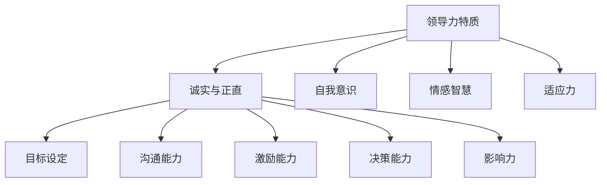

#### 1.3 领导力在个人与组织中的角色

**背景介绍**

领导力不仅影响个人的职业发展，还直接关系到组织的成功。那么，领导力在个人和组织中的角色分别是什么？

**问题背景**

领导力在个人成长和组织发展中扮演什么样的角色？个人与组织之间如何相互作用？

**问题描述**

领导力在个人成长中的作用是什么？领导力在组织发展中的作用是什么？领导力对组织文化的塑造有何影响？

**问题解决**

领导力在个人成长中的作用：

1. 促进个人发展：领导力帮助个人提升能力、增强自信，实现职业目标。
2. 培养责任感：领导力使个人更加关注团队和组织的利益，培养责任感。
3. 增强影响力：领导力使个人在团队和组织中拥有更大的影响力，为组织发展贡献力量。

领导力在组织发展中的作用：

1. 推动组织变革：领导力能够激发组织的创新和变革，推动组织不断发展。
2. 提高组织效能：领导力能够提高团队的协作效率，提升组织整体绩效。
3. 塑造组织文化：领导力直接影响组织的价值观和行为准则，塑造积极向上的组织文化。

**边界与外延**

领导力在个人与组织之间的相互作用是一个动态的过程。个人的领导力发展往往依赖于组织的支持，而组织的成功也需要个人的领导力作为支撑。

**概念结构与核心要素组成**

领导力在个人与组织中的角色可以用以下图示表示：

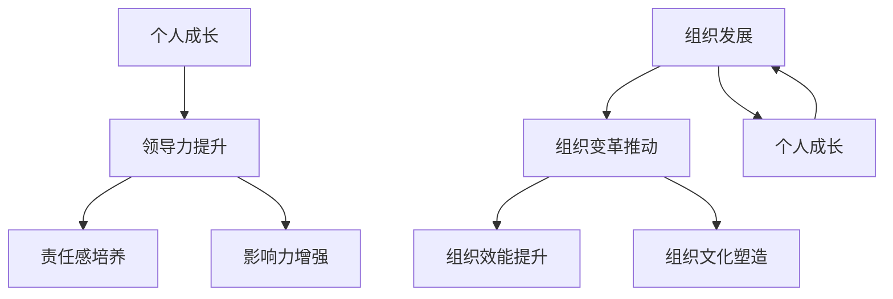

### 第2章 领导风格与团队管理

#### 2.1 领导风格的类型与特征

**背景介绍**

领导风格是领导者管理团队的方式和态度。不同的领导风格可能对团队产生不同的影响。那么，常见的领导风格有哪些？每种风格有哪些特征？

**问题背景**

领导者应该如何选择适合自己的领导风格？不同领导风格对团队有哪些影响？

**问题描述**

常见的领导风格有哪些？每种领导风格的特征是什么？不同领导风格对团队的影响是什么？

**问题解决**

常见的领导风格包括：

1. �虎头领导风格：强调权威和控制，以命令和指令为主导。
2. 蜂腰领导风格：注重协作和沟通，鼓励团队成员参与决策。
3. 菊花领导风格：注重情感和关怀，关注团队成员的需求和感受。

每种领导风格的特征如下：

1. 虎头领导风格：权威、控制、指令。
2. 蜂腰领导风格：协作、沟通、参与。
3. 菊花领导风格：关怀、情感、需求。

不同领导风格对团队的影响：

1. 虎头领导风格：可以提高团队执行力，但可能降低团队士气。
2. 蜂腰领导风格：可以提高团队凝聚力，但可能降低决策效率。
3. 菊花领导风格：可以提高团队满意度，但可能影响团队目标导向。

**边界与外延**

领导风格并非一成不变，领导者可以根据不同情境和团队需求灵活调整。在实际应用中，领导者需要根据具体情况进行选择和调整。

**概念结构与核心要素组成**

领导风格的类型与特征可以用以下图示表示：

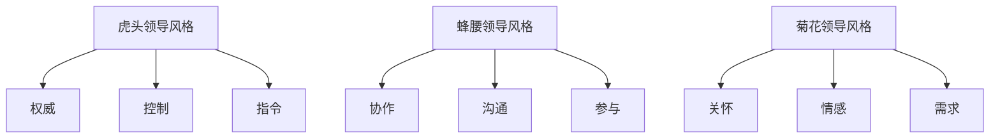

#### 2.2 团队建设与团队激励

**背景介绍**

团队建设是提高团队绩效和团队满意度的重要手段。团队激励则是激发团队成员积极性和创造力的重要途径。那么，如何进行团队建设和团队激励？

**问题背景**

团队建设的重要性是什么？团队激励的方法有哪些？如何有效进行团队建设和团队激励？

**问题描述**

团队建设的重要性是什么？团队激励的方法有哪些？如何有效进行团队建设和团队激励？

**问题解决**

团队建设的重要性：

1. 提高团队绩效：良好的团队建设可以提高团队的整体绩效，实现共同目标。
2. 增强团队凝聚力：团队建设可以增强团队成员之间的信任和协作，提高团队凝聚力。
3. 促进个人发展：团队建设可以帮助团队成员提升能力，实现个人成长。

团队激励的方法：

1. 目标激励：设定明确的目标，激发团队成员的积极性和成就感。
2. 奖励激励：通过奖励来激励团队成员，提高工作动力。
3. 赞扬激励：及时表扬和肯定团队成员的成就，增强自信心。

如何有效进行团队建设和团队激励：

1. 设定共同目标：明确团队的目标和愿景，让团队成员明确方向和努力的目标。
2. 建立信任关系：通过沟通和协作，建立团队成员之间的信任关系。
3. 定期反馈与评估：定期对团队成员的工作进行反馈和评估，及时调整策略。
4. 提供成长机会：为团队成员提供培训和晋升机会，激发其积极性和创造力。

**边界与外延**

团队建设和团队激励并非一蹴而就，需要长期坚持和不断优化。在实际应用中，领导者需要根据团队特点和需求进行有针对性的建设和管理。

**概念结构与核心要素组成**

团队建设和团队激励的概念结构可以用以下图示表示：

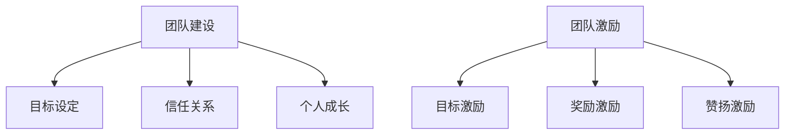

#### 2.3 冲突管理：预防与解决

**背景介绍**

冲突是团队管理中不可避免的问题。有效的冲突管理可以降低团队冲突的成本，提高团队绩效。那么，如何进行冲突管理？

**问题背景**

冲突管理的重要性是什么？如何预防冲突？如何解决冲突？

**问题描述**

冲突管理的重要性是什么？如何预防冲突？如何解决冲突？

**问题解决**

冲突管理的重要性：

1. 维护团队和谐：有效的冲突管理可以降低团队内部的紧张氛围，维护团队的和谐。
2. 提高决策质量：通过冲突管理，可以充分听取不同意见，提高决策质量。
3. 增强团队凝聚力：通过解决冲突，可以增强团队成员之间的信任和合作。

预防冲突的方法：

1. 明确沟通渠道：建立畅通的沟通渠道，让团队成员能够自由表达意见和反馈。
2. 建立共同目标：明确团队的目标和愿景，减少因目标不一致而产生的冲突。
3. 增强团队凝聚力：通过团队建设活动，增强团队成员之间的信任和合作。

解决冲突的方法：

1. 主动沟通：及时主动地与冲突方进行沟通，了解双方的立场和需求。
2. 中立调解：邀请中立第三方参与调解，帮助双方找到共同点。
3. 系统性解决方案：从制度层面解决问题，防止类似冲突的再次发生。

**边界与外延**

冲突管理是一个复杂的过程，需要领导者具备较高的沟通技巧和调解能力。在实际应用中，领导者需要根据冲突的性质和程度，采取相应的管理策略。

**概念结构与核心要素组成**

冲突管理的概念结构可以用以下图示表示：

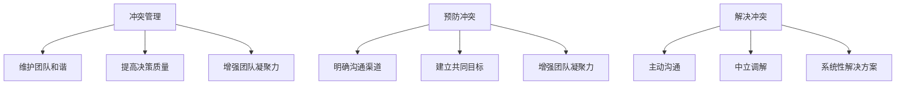

## 第二部分：实践案例与技巧

### 第3章 情商：理解与提升

#### 3.1 情商的定义与构成

**背景介绍**

情商（Emotional Intelligence，简称EQ）是衡量一个人情绪智力水平的重要指标。情商对于个人成功和人际关系至关重要。那么，什么是情商？情商的构成要素有哪些？

**问题背景**

情商的重要性是什么？情商对个人成功和人际关系有哪些影响？情商的构成要素是什么？

**问题描述**

情商的定义是什么？情商对个人成功和人际关系有哪些影响？情商的构成要素是什么？

**问题解决**

情商的定义：

情商是指个体在识别、理解、管理自己情绪，以及识别、理解和影响他人情绪方面所具备的能力。

情商对个人成功和人际关系的影响：

1. 提高决策能力：情商高的个体能够更好地管理自己的情绪，做出更加理性、明智的决策。
2. 改善人际关系：情商高的个体能够更好地理解和满足他人的情感需求，建立良好的人际关系。
3. 提高团队协作效率：情商高的个体能够有效沟通、解决冲突，提高团队协作效率。

情商的构成要素：

1. 情绪自我识别：个体能够准确识别和理解自己的情绪。
2. 情绪自我管理：个体能够有效管理自己的情绪，保持情绪稳定。
3. 情绪自我激励：个体能够利用情绪激发自己的动力，提高工作学习效率。
4. 同理心：个体能够理解和感受他人的情绪，建立良好的人际关系。
5. 情绪社交技能：个体能够有效地运用社交技能，与他人进行良好的沟通和协作。

**边界与外延**

情商并非一成不变，可以通过学习和实践不断提升。情商的提升对个人的成长和发展具有重要意义。

**概念结构与核心要素组成**

情商的构成要素可以用以下图示表示：

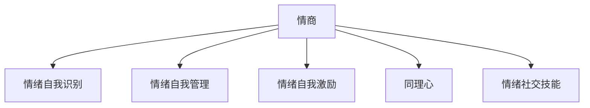

#### 3.2 自我情绪识别与管理

**背景介绍**

自我情绪识别与管理是情商的重要组成部分。通过自我情绪识别，个体能够更好地理解自己的情绪；通过情绪管理，个体能够有效调节自己的情绪。那么，如何进行自我情绪识别与管理？

**问题背景**

自我情绪识别与管理的重要性是什么？如何进行自我情绪识别？如何管理自己的情绪？

**问题描述**

自我情绪识别与管理的重要性是什么？如何进行自我情绪识别？如何管理自己的情绪？

**问题解决**

自我情绪识别与管理的重要性：

1. 提高自我认知：自我情绪识别有助于个体更好地了解自己的情绪状态，提高自我认知。
2. 改善情绪调节：情绪管理能够帮助个体在面对压力和挑战时，保持情绪稳定，提高应对能力。
3. 促进个人成长：通过自我情绪识别与管理，个体能够更好地处理自己的情绪，促进个人成长。

自我情绪识别的方法：

1. 观察身体反应：情绪发生时，身体会有一定的反应，如心率加快、呼吸急促等。通过观察这些身体反应，个体可以识别自己的情绪。
2. 情绪日记：通过记录自己的情绪变化，个体可以更好地了解自己的情绪状态，找到情绪的触发因素。
3. 情绪标签：给情绪贴上标签，如愤怒、焦虑、喜悦等，有助于个体更准确地识别情绪。

情绪管理的方法：

1. 深呼吸：深呼吸有助于放松身心，缓解紧张情绪。
2. 正念练习：通过正念练习，个体可以培养对情绪的觉察和接纳，提高情绪管理能力。
3. 情绪释放：找到合适的方式释放情绪，如运动、写日记、倾诉等，有助于缓解情绪压力。

**边界与外延**

自我情绪识别与管理是一个持续的过程，需要个体不断学习和实践。在实际生活中，个体可以结合自己的情况，选择合适的方法进行情绪识别与管理。

**概念结构与核心要素组成**

自我情绪识别与管理的概念结构可以用以下图示表示：

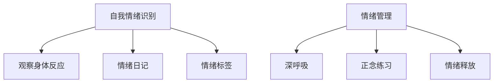

#### 3.3 情绪调节与压力管理

**背景介绍**

情绪调节与压力管理是情商的重要组成部分。有效的情绪调节和压力管理有助于个体保持心理健康，提高生活质量。那么，如何进行情绪调节与压力管理？

**问题背景**

情绪调节与压力管理的重要性是什么？如何进行情绪调节？如何管理压力？

**问题描述**

情绪调节与压力管理的重要性是什么？如何进行情绪调节？如何管理压力？

**问题解决**

情绪调节与压力管理的重要性：

1. 提高心理健康：有效的情绪调节和压力管理有助于个体保持心理健康，降低心理疾病的风险。
2. 提高生活质量：通过情绪调节和压力管理，个体能够更好地应对生活中的挑战，提高生活质量。
3. 促进人际关系：情绪调节和压力管理有助于个体更好地处理人际关系，建立和谐的家庭和工作环境。

情绪调节的方法：

1. 认知重构：通过改变对事物的看法和解释，调整情绪反应。
2. 正念冥想：通过正念冥想，个体可以培养对情绪的觉察和接纳，提高情绪调节能力。
3. 运动和放松：运动和放松有助于释放压力，调节情绪。

压力管理的方法：

1. 时间管理：合理安排时间，避免过度工作和疲劳。
2. 资源调动：利用外部资源，如寻求专业帮助、寻求社会支持等，缓解压力。
3. 情绪释放：找到合适的方式释放情绪，如运动、写日记、倾诉等，有助于缓解压力。

**边界与外延**

情绪调节与压力管理是一个复杂的过程，需要个体根据自身情况选择合适的方法。在实际生活中，个体可以结合自己的需求，采取多种方法进行情绪调节与压力管理。

**概念结构与核心要素组成**

情绪调节与压力管理的概念结构可以用以下图示表示：

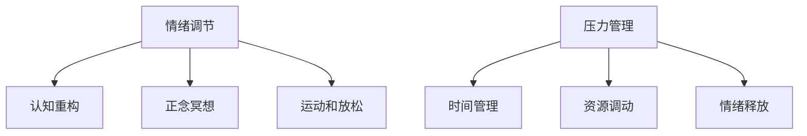

### 第4章 沟通技巧：有效交流的艺术

#### 4.1 沟通的重要性与基本原则

**背景介绍**

沟通是人际关系中不可或缺的一部分。有效的沟通能够促进理解、减少误解、建立信任。那么，沟通的重要性是什么？沟通有哪些基本原则？

**问题背景**

沟通在人际交往中的作用是什么？为什么有效沟通如此重要？沟通有哪些基本原则？

**问题描述**

沟通的重要性是什么？为什么有效沟通如此重要？沟通有哪些基本原则？

**问题解决**

沟通的重要性：

1. 促进理解：有效的沟通能够帮助人们更好地理解对方的观点和需求，减少误解和冲突。
2. 建立信任：通过沟通，人们可以分享信息和资源，建立信任关系，为合作奠定基础。
3. 提高工作效率：有效的沟通能够提高团队协作效率，降低工作成本。

有效沟通的基本原则：

1. 尊重：尊重对方的意见和感受，避免指责和攻击。
2. 清晰：用简单明了的语言表达自己的观点，避免使用含糊不清的表达。
3. 诚实：坦诚地表达自己的想法和感受，避免欺骗和隐瞒。
4. 积极倾听：认真倾听对方的意见和需求，理解对方的观点。

**边界与外延**

沟通是一个双向的过程，需要双方共同努力。在实际应用中，个体可以结合自身情况和沟通对象，灵活运用沟通原则，提高沟通效果。

**概念结构与核心要素组成**

沟通的基本原则可以用以下图示表示：

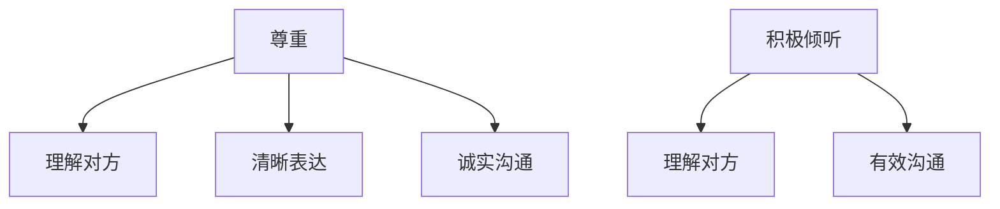

#### 4.2 沟通障碍与解决策略

**背景介绍**

沟通障碍是影响沟通效果的重要因素。了解沟通障碍的类型和原因，以及采取相应的解决策略，对于提高沟通效果具有重要意义。那么，常见的沟通障碍有哪些？如何解决这些障碍？

**问题背景**

沟通障碍有哪些类型和原因？如何解决这些障碍？

**问题描述**

沟通障碍有哪些类型和原因？如何解决这些障碍？

**问题解决**

常见的沟通障碍：

1. 信息误解：由于信息传递过程中的干扰和误解，导致信息接收者对信息内容的错误理解。
2. 沟通障碍：由于沟通双方在语言、文化、认知等方面的差异，导致沟通困难。
3. 情绪干扰：情绪因素可能干扰沟通过程，影响沟通效果。

解决策略：

1. 提高信息清晰度：通过使用简单明了的语言、图表等方式，提高信息的清晰度，减少误解。
2. 跨文化沟通培训：通过培训提高跨文化沟通能力，减少文化差异对沟通的影响。
3. 情绪管理：通过情绪管理技巧，减少情绪对沟通的干扰，提高沟通效果。

**边界与外延**

沟通障碍的解决需要根据具体情况采取不同的策略。在实际应用中，个体可以结合自己的需求和沟通情境，灵活运用解决策略。

**概念结构与核心要素组成**

沟通障碍与解决策略可以用以下图示表示：

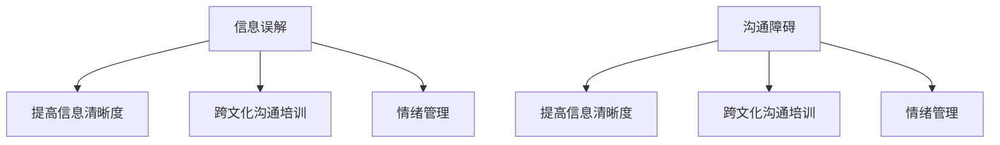

#### 4.3 不同情境下的沟通技巧

**背景介绍**

不同的情境可能对沟通技巧提出不同的要求。掌握不同情境下的沟通技巧，能够帮助个体更好地应对各种沟通挑战。那么，常见的沟通情境有哪些？如何在不同情境下运用沟通技巧？

**问题背景**

常见的沟通情境有哪些？如何在不同情境下运用沟通技巧？

**问题描述**

常见的沟通情境有哪些？如何在不同情境下运用沟通技巧？

**问题解决**

常见的沟通情境：

1. 个人沟通：与家人、朋友、同事等个人之间的沟通。
2. 团队沟通：在团队内部或团队之间的沟通。
3. 公共演讲：在公众场合进行演讲或报告。
4. 跨文化沟通：在不同文化背景下进行沟通。

在不同情境下运用沟通技巧：

1. 个人沟通：注重倾听和情感表达，建立良好的人际关系。
2. 团队沟通：明确沟通目标，促进团队合作，提高团队绩效。
3. 公共演讲：注重表达清晰、逻辑严密，提高演讲效果。
4. 跨文化沟通：尊重文化差异，灵活运用沟通策略，促进跨文化理解。

**边界与外延**

不同的情境可能对沟通技巧提出不同的要求。在实际应用中，个体需要根据具体情境，灵活运用沟通技巧，提高沟通效果。

**概念结构与核心要素组成**

不同情境下的沟通技巧可以用以下图示表示：

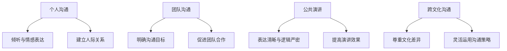

### 第5章 人际关系：建立与维护

#### 5.1 人际关系的定义与类型

**背景介绍**

人际关系是人与人之间在交往过程中形成的社会联系。良好的人际关系对于个人的成长和发展具有重要意义。那么，什么是人际关系？人际关系有哪些类型？

**问题背景**

人际关系的重要性是什么？人际关系有哪些类型？

**问题描述**

人际关系的定义是什么？人际关系有哪些类型？

**问题解决**

人际关系的定义：

人际关系是指人与人之间在交往过程中形成的心理和情感联系。

人际关系的类型：

1. 密切关系：如家庭关系、亲密关系等，通常表现为亲密、信任和依赖。
2. 一般关系：如同事、同学等，通常表现为一定的互动和交往，但较为稳定。
3. 松散关系：如陌生人、普通朋友等，通常表现为较少的互动和交往，但保持一定的联系。

**边界与外延**

人际关系是复杂多样的，不同的关系类型可能对个体的成长和发展产生不同的影响。在实际生活中，个体需要根据自身需求和情境，建立和维护不同类型的人际关系。

**概念结构与核心要素组成**

人际关系的类型可以用以下图示表示：

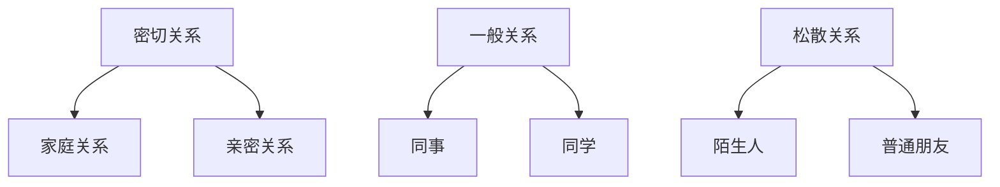

#### 5.2 人际关系中的心理因素

**背景介绍**

人际关系中的心理因素对人际关系的建立、维护和发展具有重要影响。了解人际关系中的心理因素，有助于个体更好地理解和应对人际关系中的问题。那么，人际关系中的心理因素有哪些？这些因素如何影响人际关系？

**问题背景**

人际关系中的心理因素有哪些？这些因素如何影响人际关系？

**问题描述**

人际关系中的心理因素有哪些？这些因素如何影响人际关系？

**问题解决**

人际关系中的心理因素：

1. 信任：信任是人际关系中最重要的心理因素之一，缺乏信任会导致人际关系疏远。
2. 情感支持：情感支持是人们在面对困难时的重要依靠，有助于增强人际关系的稳定性。
3. 价值观：共同的价值观有助于个体之间建立更紧密的关系，促进人际关系的和谐发展。
4. 自尊：自尊是个体在人际关系中维护自我价值的重要心理因素，过高或过低的自尊都可能影响人际关系的稳定性。

心理因素对人际关系的影响：

1. 信任：信任能够增强人际关系的稳定性，提高沟通效果。
2. 情感支持：情感支持有助于缓解压力，增强个体的幸福感，促进人际关系的和谐发展。
3. 价值观：共同的价值观有助于个体之间的理解和合作，减少冲突。
4. 自尊：自尊的平衡有助于个体在人际关系中保持自信和自尊，避免过度自我评价和自我否定。

**边界与外延**

人际关系中的心理因素是动态变化的，需要个体根据具体情境进行调节和应对。在实际生活中，个体需要关注自身和他人的心理需求，建立和维护良好的人际关系。

**概念结构与核心要素组成**

人际关系中的心理因素可以用以下图示表示：

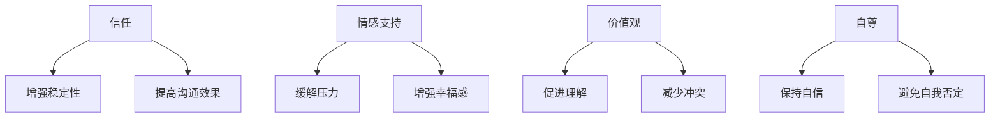

#### 5.3 人际冲突的处理与和谐相处

**背景介绍**

人际冲突是人际关系中不可避免的现象。有效的冲突处理和和谐相处是维护人际关系稳定和发展的关键。那么，如何处理人际冲突？如何实现和谐相处？

**问题背景**

人际冲突的原因是什么？如何处理人际冲突？如何实现和谐相处？

**问题描述**

人际冲突的原因是什么？如何处理人际冲突？如何实现和谐相处？

**问题解决**

人际冲突的原因：

1. 利益冲突：个体之间的利益需求存在差异，可能导致冲突。
2. 沟通障碍：沟通不畅或误解可能导致冲突。
3. 价值观差异：个体之间的价值观差异可能导致冲突。

处理人际冲突的方法：

1. 积极沟通：通过沟通了解对方的观点和需求，寻求共同点，化解冲突。
2. 妥协与让步：在冲突中，适当妥协和让步有助于缓解紧张气氛，达成共识。
3. 寻求第三方调解：在双方难以达成共识时，可以寻求第三方调解，以客观、公正的方式解决冲突。

实现和谐相处的方法：

1. 增强沟通能力：通过提高沟通能力，减少误解和冲突。
2. 尊重差异：尊重他人的观点和需求，包容不同的意见和价值观。
3. 建立信任：通过建立信任，增强人际关系的稳定性，实现和谐相处。

**边界与外延**

人际冲突的处理和和谐相处是一个复杂的过程，需要个体根据具体情况采取不同的策略。在实际生活中，个体需要不断学习和实践，提高人际交往能力，实现和谐相处。

**概念结构与核心要素组成**

人际冲突的处理与和谐相处的概念结构可以用以下图示表示：

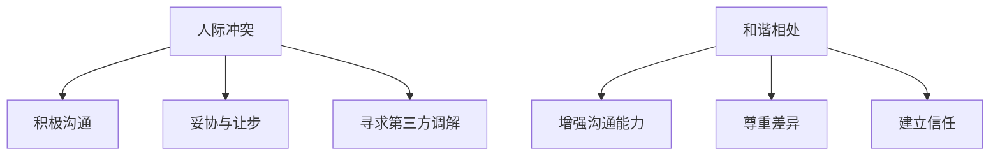

### 第6章 领导力与情商提升案例解析

#### 6.1 案例一：领导力在团队变革中的应用

**案例背景**

某公司是一家处于快速发展的科技企业，为了适应市场变化和公司战略调整，决定进行团队变革。变革的目的是优化团队结构，提高团队效率，增强企业竞争力。在这个过程中，领导力起到了关键作用。

**领导力应用的策略**

1. 明确变革目标：领导者首先明确了变革的目标，即优化团队结构、提高团队效率，并制定了详细的变革计划。

2. 激发员工参与：领导者鼓励员工积极参与变革，通过组织研讨会、培训等方式，提高员工对变革的认识和接受度。

3. 有效沟通：领导者通过定期会议、内部沟通渠道等方式，与员工保持密切沟通，了解员工的意见和建议，及时回应员工的关切。

4. 建立信任：领导者通过公正、透明的方式处理变革过程中的问题，建立员工对领导者的信任。

**案例分析**

1. 明确的目标和计划有助于员工明确变革的方向和意义，提高变革的接受度。

2. 激发员工参与和有效沟通有助于减少变革的阻力，提高员工的积极性和主动性。

3. 建立信任是推动变革的重要保障，有助于形成积极的团队氛围，促进变革的顺利进行。

**启示**

领导力在团队变革中发挥着重要作用。领导者需要明确变革目标，激发员工参与，有效沟通，建立信任，以确保变革的顺利进行。

#### 6.2 案例二：情商在危机管理中的重要性

**案例背景**

某公司在市场竞争中遭遇重大危机，产品出现严重质量问题，导致客户投诉不断，公司声誉受到严重影响。在这种情况下，领导者的情商发挥了关键作用。

**情商应对的策略**

1. 保持冷静：领导者首先保持冷静，稳定自己的情绪，以理智的态度应对危机。

2. 沟通与解释：领导者通过公开渠道与客户沟通，解释产品问题的原因，表示诚挚的歉意，并承诺采取积极措施解决问题。

3. 情感关怀：领导者关注受影响的客户，提供情感关怀，以缓解客户的负面情绪。

4. 协调资源：领导者协调公司内部资源，迅速采取措施，解决问题，恢复产品品质。

**案例分析**

1. 保持冷静有助于领导者保持清晰的思路，制定有效的应对策略。

2. 沟通与解释有助于缓解客户的负面情绪，增强客户对公司的信任。

3. 情感关怀有助于建立客户对公司的认同感和忠诚度。

4. 协调资源有助于迅速解决问题，恢复公司声誉。

**启示**

情商在危机管理中具有重要意义。领导者需要保持冷静，有效沟通，情感关怀，协调资源，以应对危机，维护公司声誉。

#### 6.3 案例三：人际沟通技巧在跨文化团队中的应用

**案例背景**

某公司成立了一支跨国团队，负责开发一款面向全球市场的软件产品。由于团队成员来自不同文化背景，沟通成为了一大挑战。

**沟通技巧的应用**

1. 文化敏感性：团队成员首先了解了各自的文化背景，尊重彼此的差异，避免文化冲突。

2. 明确沟通目标：团队成员在沟通前明确目标，确保沟通内容围绕目标展开。

3. 使用非语言沟通：团队成员运用非语言沟通技巧，如肢体语言、面部表情等，增强沟通效果。

4. 定期反馈：团队成员定期进行反馈，确保沟通效果，及时调整沟通策略。

**案例分析**

1. 文化敏感性有助于减少文化冲突，提高团队协作效率。

2. 明确沟通目标和使用非语言沟通有助于提高沟通效果，确保信息准确传递。

3. 定期反馈有助于团队成员了解沟通效果，持续优化沟通方式。

**启示**

人际沟通技巧在跨文化团队中具有重要意义。团队成员需要具备文化敏感性，明确沟通目标，使用非语言沟通，定期反馈，以提高沟通效果，促进团队协作。

### 第7章 领导力与情商提升实践技巧

#### 7.1 领导力提升技巧

**背景介绍**

领导力提升是一个长期而复杂的过程。领导者需要不断学习、实践和反思，以提升自己的领导能力。那么，如何提升领导力？有哪些具体的技巧和方法？

**问题背景**

领导者如何提升自己的领导能力？有哪些具体的技巧和方法可以采用？

**问题描述**

如何提升领导力？有哪些具体的技巧和方法可以采用？

**问题解决**

提升领导力的技巧和方法：

1. 自我反思：领导者需要定期进行自我反思，了解自己的优点和不足，找到提升的方向。

2. 学习与培训：领导者可以通过阅读书籍、参加培训课程、向他人请教等方式，不断学习和提升自己的知识和技能。

3. 情境模拟：领导者可以模拟不同的情境，进行情境演练，提高应对复杂问题的能力。

4. 建立反馈机制：领导者需要建立有效的反馈机制，收集团队成员的意见和建议，不断改进自己的领导方式。

5. 持续实践：领导力提升需要不断实践，领导者需要在实际工作中运用所学知识，积累经验。

**边界与外延**

领导力提升是一个持续的过程，需要领导者具备耐心和毅力。在实际应用中，领导者可以根据自身情况和需求，选择合适的提升技巧和方法。

**概念结构与核心要素组成**

提升领导力的技巧和方法可以用以下图示表示：

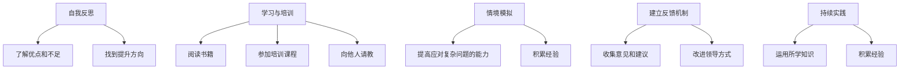

#### 7.2 情商提升技巧

**背景介绍**

情商提升对于个人的成功和人际关系的建立具有重要意义。那么，如何提升情商？有哪些具体的技巧和方法可以采用？

**问题背景**

个人如何提升情商？有哪些具体的技巧和方法可以采用？

**问题描述**

如何提升情商？有哪些具体的技巧和方法可以采用？

**问题解决**

提升情商的技巧和方法：

1. 情绪自我识别：学会识别自己的情绪，了解情绪的来源和影响。

2. 情绪自我管理：学会管理自己的情绪，保持情绪稳定，避免情绪失控。

3. 同理心培养：学会理解和感受他人的情绪，建立良好的人际关系。

4. 情绪社交技能：学会有效地表达自己的情绪，倾听他人的意见，解决冲突。

5. 压力管理：学会应对压力，保持心理健康。

**边界与外延**

情商提升是一个长期的过程，需要个人具备耐心和毅力。在实际应用中，个人可以根据自身情况和需求，选择合适的提升技巧和方法。

**概念结构与核心要素组成**

提升情商的技巧和方法可以用以下图示表示：

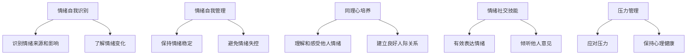

#### 7.3 人际交往技巧

**背景介绍**

人际交往技巧是成功人际交往的重要保障。掌握良好的人际交往技巧，有助于建立和谐的人际关系，提高个人在团队中的影响力。那么，如何提升人际交往技巧？有哪些具体的技巧和方法可以采用？

**问题背景**

个人如何提升人际交往技巧？有哪些具体的技巧和方法可以采用？

**问题描述**

如何提升人际交往技巧？有哪些具体的技巧和方法可以采用？

**问题解决**

提升人际交往技巧的技巧和方法：

1. 倾听技巧：学会倾听他人的意见和需求，表达关心和理解。

2. 沟通技巧：提高沟通能力，表达清晰、准确，避免误解和冲突。

3. 礼仪规范：了解和遵守基本的礼仪规范，提升个人形象和社交能力。

4. 情绪管理：学会控制自己的情绪，避免负面情绪影响人际交往。

5. 建立信任：通过诚实、公正和透明的行为，建立信任关系。

**边界与外延**

人际交往技巧的提升需要个人在实践中不断锻炼和总结。在实际应用中，个人可以根据自身情况和需求，选择合适的提升技巧和方法。

**概念结构与核心要素组成**

提升人际交往技巧的技巧和方法可以用以下图示表示：

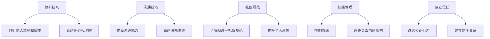

### 第8章 领导力与情商提升的最佳实践

#### 8.1 培养领导力的组织策略

**背景介绍**

在组织层面，培养领导力是一项长期而系统的工程。通过制定有效的组织策略，可以帮助组织培养具备领导力的员工，提高组织的整体领导力水平。那么，如何制定培养领导力的组织策略？

**问题背景**

组织如何培养领导力？有哪些具体的组织策略可以采用？

**问题描述**

如何制定培养领导力的组织策略？有哪些具体的组织策略可以采用？

**问题解决**

培养领导力的组织策略：

1. 设定领导力培养目标：组织需要明确领导力培养的目标，包括领导力的核心要素和培养的具体指标。

2. 制定领导力培养计划：组织需要制定详细的领导力培养计划，包括培训课程、实践机会、导师指导等。

3. 创造学习氛围：组织需要营造一个积极的学习氛围，鼓励员工主动学习、分享经验和知识。

4. 提供反馈和评估：组织需要建立反馈和评估机制，对员工的领导力发展进行评估，并提供改进建议。

5. 建立激励机制：组织需要建立激励机制，鼓励员工积极参与领导力培养活动，提高员工的学习动力。

**边界与外延**

培养领导力的组织策略需要根据组织的实际情况和需求进行调整。在实际应用中，组织可以根据自身情况，选择合适的策略和方法。

**概念结构与核心要素组成**

培养领导力的组织策略可以用以下图示表示：

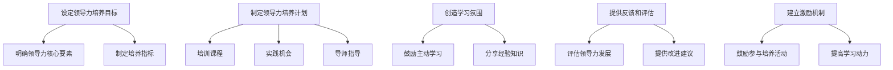

#### 8.2 提升情商的个体方法

**背景介绍**

情商提升对于个人在职场和生活中的成功具有重要意义。通过个体努力，可以提升自己的情商水平，建立更好的人际关系，提高工作效率。那么，如何提升情商？有哪些具体的个体方法可以采用？

**问题背景**

个人如何提升情商？有哪些具体的个体方法可以采用？

**问题描述**

如何提升情商？有哪些具体的个体方法可以采用？

**问题解决**

提升情商的个体方法：

1. 自我反思：通过自我反思，了解自己的情绪和行为模式，找到提升的方向。

2. 学习心理学知识：学习心理学知识，了解情绪的本质和情绪管理的方法。

3. 练习情绪调节：通过练习情绪调节技巧，如深呼吸、正念冥想等，提高情绪调节能力。

4. 建立积极的人际关系：通过建立积极的人际关系，学会理解和感受他人的情绪，提高同理心。

5. 寻求专业帮助：如果情绪问题较为严重，可以寻求专业心理咨询师的帮助，进行心理治疗。

**边界与外延**

提升情商需要个人具备一定的耐心和毅力。在实际应用中，个人可以根据自身情况和需求，选择合适的提升方法。

**概念结构与核心要素组成**

提升情商的个体方法可以用以下图示表示：

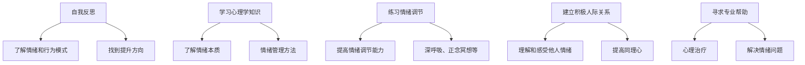

#### 8.3 人际交往中的关键要素

**背景介绍**

人际交往是职场和生活中不可或缺的一部分。掌握人际交往中的关键要素，有助于建立更好的人际关系，提高个人影响力。那么，人际交往中的关键要素是什么？

**问题背景**

人际交往中的关键要素是什么？如何掌握这些要素？

**问题描述**

人际交往中的关键要素是什么？如何掌握这些要素？

**问题解决**

人际交往中的关键要素：

1. 倾听：倾听是有效人际交往的重要前提。通过倾听，可以更好地理解他人的观点和需求。

2. 沟通：沟通是人际交往的核心。提高沟通能力，可以更好地表达自己的观点，建立信任。

3. 礼仪：礼仪是人际交往的规范。遵循礼仪规范，可以提升个人形象，增进人际关系的和谐。

4. 情绪管理：情绪管理是人际交往的重要保障。学会控制自己的情绪，避免负面情绪影响人际交往。

5. 同理心：同理心是人际交往的基础。通过同理心，可以更好地理解他人，建立深厚的人际关系。

掌握人际交往中的关键要素：

1. 倾听：通过练习倾听技巧，提高倾听能力。

2. 沟通：通过学习沟通技巧，提高沟通效果。

3. 礼仪：通过学习和实践，掌握礼仪规范。

4. 情绪管理：通过练习情绪调节技巧，提高情绪管理能力。

5. 同理心：通过培养同理心，提高人际交往能力。

**边界与外延**

人际交往中的关键要素需要个人在实际交往中不断练习和运用。在实际应用中，个人可以根据自身情况和需求，有针对性地提升关键要素。

**概念结构与核心要素组成**

人际交往中的关键要素可以用以下图示表示：

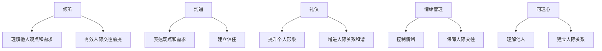

### 第9章 小结与展望

#### 9.1 领导力与情商提升的重要性

**背景介绍**

领导力与情商提升在个人和组织发展中具有重要作用。那么，领导力与情商提升的重要性是什么？如何理解和把握这种重要性？

**问题背景**

领导力与情商提升在个人和组织发展中具有什么重要性？如何理解和把握这种重要性？

**问题描述**

领导力与情商提升在个人和组织发展中具有什么重要性？如何理解和把握这种重要性？

**问题解决**

领导力与情商提升的重要性：

1. 推动个人成长：领导力与情商提升有助于个人提升自我认知、增强决策能力，实现个人职业目标。

2. 提高团队效能：领导力与情商提升有助于团队更好地协作，提高团队整体绩效。

3. 塑造组织文化：领导力与情商提升有助于塑造积极向上的组织文化，提高组织凝聚力。

理解和把握领导力与情商提升的重要性：

1. 树立正确的价值观：领导者需要明确领导力与情商提升的目标和意义，树立正确的价值观。

2. 融入日常实践：领导者需要将领导力与情商提升融入日常工作中，不断实践和总结。

3. 持续学习和成长：领导者需要持续学习和成长，不断提高自己的领导力和情商水平。

**边界与外延**

领导力与情商提升的重要性在不同情境和领域中可能有所不同。在实际应用中，个人和组织需要根据自身情况和需求，有针对性地提升领导力与情商。

**概念结构与核心要素组成**

领导力与情商提升的重要性可以用以下图示表示：

```mermaid
graph TD
A[个人成长] --> B[提升自我认知]
A --> C[增强决策能力]
D[团队效能] --> E[提高团队协作]
D --> F[提升整体绩效]
G[组织文化] --> H[塑造积极向上]
G --> I[提高组织凝聚力]
```

#### 9.2 持续提升的策略与建议

**背景介绍**

在领导力与情商提升的过程中，持续提升是关键。通过制定有效的策略和建议，个人和组织可以不断提高领导力和情商水平，实现持续发展。那么，如何制定持续提升的策略与建议？

**问题背景**

如何制定持续提升的策略与建议？个人和组织应该采取哪些措施？

**问题描述**

如何制定持续提升的策略与建议？个人和组织应该采取哪些措施？

**问题解决**

持续提升的策略与建议：

1. 制定个人发展计划：个人需要制定明确的个人发展计划，包括学习目标、实践目标和评估指标。

2. 建立学习机制：个人和组织需要建立有效的学习机制，鼓励员工持续学习和成长。

3. 提供培训与指导：个人和组织需要提供多样化的培训与指导，帮助员工提升领导力和情商。

4. 建立反馈机制：个人和组织需要建立反馈机制，及时了解员工的学习情况和效果，提供改进建议。

5. 创造实践机会：个人和组织需要创造实践机会，让员工在真实的工作环境中锻炼和提升领导力和情商。

**边界与外延**

持续提升的策略与建议需要根据个人和组织的具体情况和需求进行调整。在实际应用中，个人和组织可以根据自身情况，选择合适的策略和建议。

**概念结构与核心要素组成**

持续提升的策略与建议可以用以下图示表示：

```mermaid
graph TD
A[制定个人发展计划] --> B[明确学习目标]
A --> C[实践目标]
D[建立学习机制] --> E[鼓励员工持续学习]
D --> F[提供成长机会]
G[提供培训与指导] --> H[多样化培训]
G --> I[提升领导力和情商]
J[建立反馈机制] --> K[了解学习情况]
J --> L[提供改进建议]
M[创造实践机会] --> N[锻炼和提升]
```

#### 9.3 未来领导力与情商发展的趋势

**背景介绍**

随着社会和科技的不断发展，领导力与情商的发展也在不断变革。那么，未来领导力与情商发展将呈现哪些趋势？这些趋势将如何影响个人和组织？

**问题背景**

未来领导力与情商发展将呈现哪些趋势？这些趋势将如何影响个人和组织？

**问题描述**

未来领导力与情商发展将呈现哪些趋势？这些趋势将如何影响个人和组织？

**问题解决**

未来领导力与情商发展的趋势：

1. 数字化领导力：随着数字化技术的普及，领导者需要具备数字素养和数字化领导能力。

2. 情绪智能领导力：情绪智能在领导力中的作用越来越重要，领导者需要具备情绪智能，提高团队情感管理能力。

3. 跨文化领导力：全球化背景下，领导者需要具备跨文化沟通和协作能力，应对多元文化环境。

4. 个性化领导力：个性化定制将成为领导力发展的重要方向，领导者需要关注个体差异，提供个性化的领导和支持。

未来领导力与情商趋势的影响：

1. 提高领导力需求：随着社会和科技的发展，对领导力的需求将越来越高，领导者需要不断提升自己的能力和素质。

2. 改变组织文化：未来的领导力与情商趋势将推动组织文化的变革，促进组织更加开放、包容和多元化。

3. 增强团队协作：未来的领导力与情商趋势将促进团队协作和多元化，提高团队的整体绩效。

**边界与外延**

未来领导力与情商发展的趋势是一个复杂的过程，需要领导者具备前瞻性和适应能力。在实际应用中，个人和组织需要关注未来趋势，及时调整和优化领导力和情商培养策略。

**概念结构与核心要素组成**

未来领导力与情商发展的趋势可以用以下图示表示：

```mermaid
graph TD
A[数字化领导力] --> B[数字素养]
A --> C[数字化领导能力]
D[情绪智能领导力] --> E[情绪智能]
D --> F[团队情感管理能力]
G[跨文化领导力] --> H[跨文化沟通能力]
G --> I[多元文化环境适应能力]
J[个性化领导力] --> K[个性化定制]
J --> L[关注个体差异]
```

### 作者信息

作者：AI天才研究院/AI Genius Institute & 禅与计算机程序设计艺术 /Zen And The Art of Computer Programming

