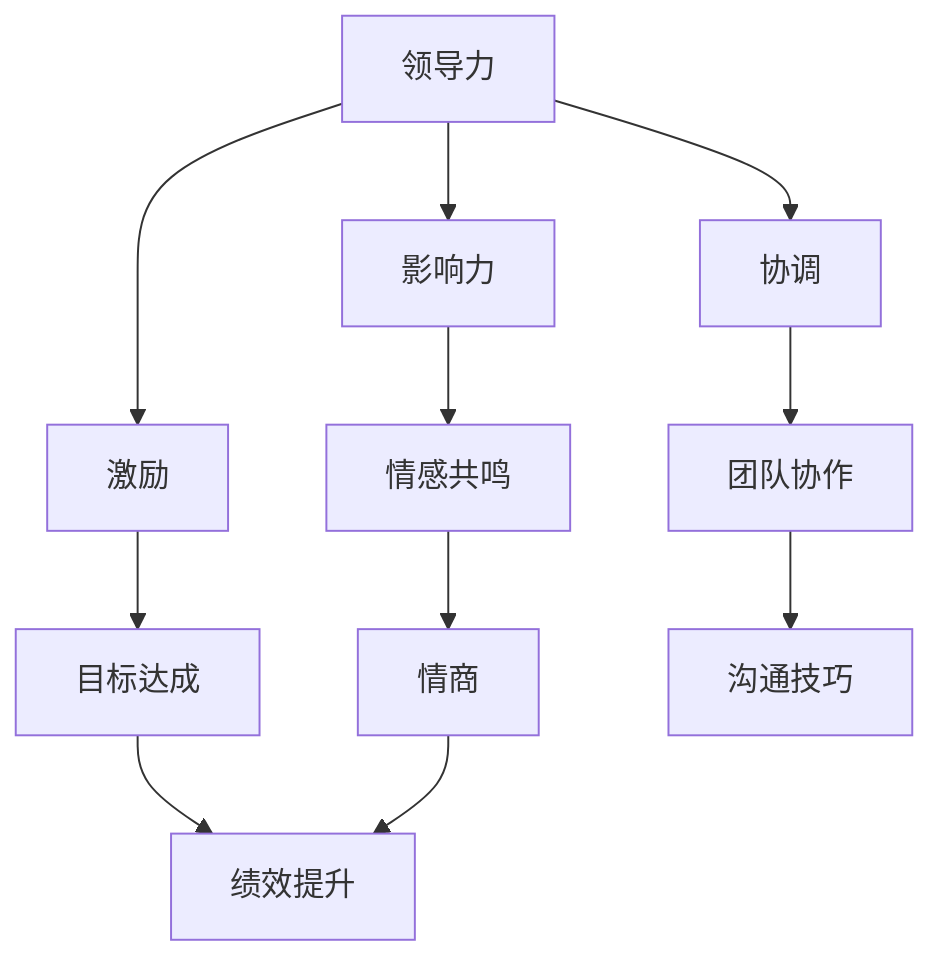
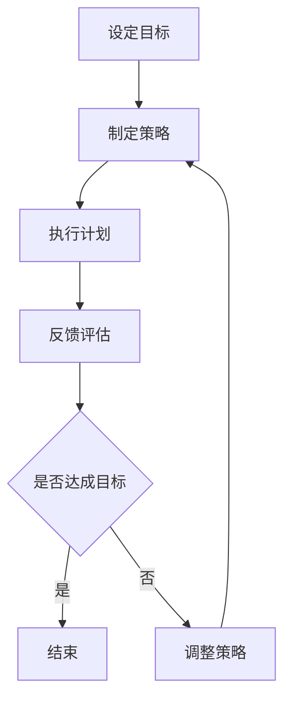
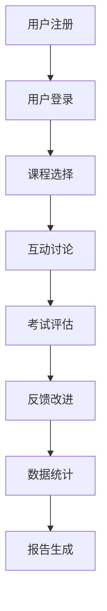
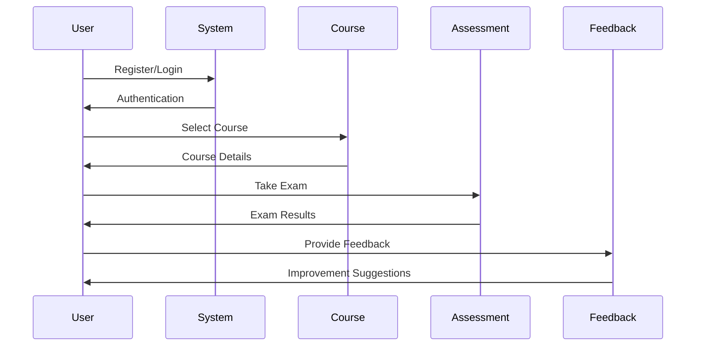

                 


# 领导力与情商：提升人际交往能力

> 关键词：领导力、情商、人际交往、能力提升、团队合作、沟通技巧

> 摘要：
本文旨在深入探讨领导力与情商在人际交往能力提升中的关键作用。通过逻辑清晰的分析和实际案例，我们将揭示如何通过提升个人领导力和情商，来增强人际交往的效能。本文将涵盖领导力和情商的定义、其在现代工作中的重要性、具体的提升策略以及实际应用场景。让我们一步步思考，共同提升人际交往能力。

## 引言

在现代信息技术飞速发展的时代，人际交往能力变得愈发重要。无论是职场中的协作，还是日常生活中的互动，有效的沟通和人际关系管理都是成功的关键。而领导力和情商正是这两方面的核心要素。本文将围绕这一主题，逐步分析领导力和情商的概念、重要性以及提升策略。

### 1. 领导力

领导力是指一个人在团队中引导、激励和协调他人以实现共同目标的能力。它不仅仅与职位高低相关，更是一种影响力，是个人品质的体现。

**定义：** 领导力是指通过影响、激励和引导他人来实现共同目标的能力。

**核心要素：**
- **影响力：** 领导者通过自身的行为和价值观来影响他人。
- **激励：** 领导者能够激发团队成员的潜能，推动他们实现目标。
- **协调：** 领导者能够协调团队内部和团队与外部环境的关系。

### 2. 情商

情商是指一个人理解、管理自己情绪，并识别、影响他人情绪的能力。情商高的人通常能够更好地处理人际关系，减少冲突，提升团队协作效率。

**定义：** 情商是指个体理解、管理自己情绪，识别、影响他人情绪的能力。

**核心要素：**
- **情绪识别：** 理解自己和他人的情绪状态。
- **情绪管理：** 有效调节和管理自己的情绪，保持积极的心态。
- **情感影响：** 通过情感共鸣和有效沟通，影响他人的情绪和行为。

## 背景介绍

在当今快速变化的工作环境中，领导力和情商的重要性日益凸显。以下将介绍相关的背景信息。

### 问题背景

现代社会要求员工具备更高的综合素质，包括领导力和情商。这不仅是为了更好地完成工作任务，更是为了适应复杂多变的工作环境，提升团队的整体效能。

### 问题描述

在职场中，缺乏领导力和情商的员工往往面临以下问题：
- 沟通不畅，导致团队协作效率低下。
- 情绪管理不当，引发工作场所的冲突。
- 难以建立和维护良好的人际关系，影响职业发展。

### 问题解决

提升领导力和情商可以帮助员工：
- 提高沟通技巧，增强团队协作。
- 更好地管理情绪，降低冲突风险。
- 建立和维护良好的人际关系，提升个人和团队绩效。

### 边界与外延

领导力和情商不仅适用于职场，也广泛应用于其他生活场景，如家庭、社交等。其核心在于有效的人际交往能力，这是任何成功的关键。

### 概念结构与核心要素组成

- **领导力：** 影响力、激励、协调。
- **情商：** 情绪识别、情绪管理、情感影响。

## 核心概念与联系

### 1. 领导力与情商的联系

领导力和情商之间存在紧密的联系。高情商的领导者能够更好地理解和管理自己及他人的情绪，从而提高领导力效能。

**概念属性特征对比表格：**

| 特征                | 领导力                         | 情商                         |
|-------------------|--------------------------------|-----------------------------|
| 定义                | 通过影响、激励和引导他人实现目标的能力 | 理解和管理情绪，识别和影响他人情绪的能力 |
| 核心要素            | 影响力、激励、协调                | 情绪识别、情绪管理、情感影响            |
| 应用场景            | 职场、团队管理、领导职位            | 职场、家庭、社交、领导力发展            |

### 2. 领导力与情商的Mermaid流程图



### 3. ER实体关系图架构

```mermaid
erDiagram
    Leader ||--|{ Employee } : manages
    Leader ||--|{ Team } : leads
    Employee ||--|{ Project } : works_on
    Employee ||--|{ Skill } : has
    Skill ||--|{ Competence } : has
    Team ||--|{ Member } : includes
```

## 算法原理讲解

为了更好地理解领导力和情商的提升，我们可以借助一些算法原理来进行分析。

### 1. Mermaid流程图



### 2. Python源代码

```python
def leadership_eq_escalation(target, strategy, execution_plan, feedback):
    """
    领导力与情商提升算法
    :param target: 目标
    :param strategy: 策略
    :param execution_plan: 执行计划
    :param feedback: 反馈
    :return: 是否达成目标
    """
    if execution_plan == "完成":
        if feedback >= target:
            return "达成目标"
        else:
            return "未达成目标，需调整策略"
    else:
        return "执行计划未完成，无法评估目标达成"

# 示例
result = leadership_eq_escalation(90, "激励团队", "完成", 85)
print(result)
```

### 3. 数学模型和公式

为了定量评估领导力和情商的提升，我们可以使用以下数学模型：

$$
EQ = f(L, E, C)
$$

其中，$EQ$ 表示情商，$L$ 表示领导力，$E$ 表示情绪管理，$C$ 表示沟通能力。

$$
EQ = \frac{L \cdot E \cdot C}{100}
$$

### 4. 举例说明

假设一位员工的领导力为80，情绪管理为75，沟通能力为70。则其情商为：

$$
EQ = \frac{80 \cdot 75 \cdot 70}{100} = 5100 / 100 = 51
$$

这意味着该员工的情商为51分。

## 系统分析与架构设计方案

为了更好地提升领导力和情商，我们可以设计一个系统来实现这一目标。

### 问题场景介绍

在现代企业中，领导力和情商的提升对于团队绩效和个人发展至关重要。我们设计一个在线学习系统，帮助员工提升这些技能。

### 系统功能设计

- 用户注册与登录
- 学习课程选择
- 互动讨论区
- 考试与评估
- 反馈与改进建议

### 系统架构设计



### 系统接口设计

- 用户接口：提供注册、登录、课程选择、互动讨论等功能。
- 后端接口：处理用户数据、课程数据、考试数据等。

### 系统交互



## 项目实战

### 环境安装

1. 安装Python环境
2. 安装Django框架
3. 安装MySQL数据库

### 系统核心实现源代码

```python
# models.py
from django.db import models

class User(models.Model):
    username = models.CharField(max_length=100)
    email = models.EmailField()
    password = models.CharField(max_length=100)

class Course(models.Model):
    title = models.CharField(max_length=100)
    description = models.TextField()
    instructor = models.ForeignKey(User, on_delete=models.CASCADE)

class Assessment(models.Model):
    course = models.ForeignKey(Course, on_delete=models.CASCADE)
    question = models.CharField(max_length=100)
    options = models.JSONField()
    correct_answer = models.CharField(max_length=100)

class Feedback(models.Model):
    user = models.ForeignKey(User, on_delete=models.CASCADE)
    course = models.ForeignKey(Course, on_delete=models.CASCADE)
    comment = models.TextField()
    rating = models.IntegerField()
```

### 代码应用解读与分析

这段代码定义了用户、课程、评估和反馈四个模型，用于实现用户注册、课程选择、考试评估和反馈改进等功能。

### 实际案例分析和详细讲解剖析

假设有三位员工A、B、C，他们分别参加了领导力和情商提升课程，并完成了相应的考试和反馈。

1. **员工A**：
   - 课程评分：85
   - 反馈：课程内容丰富，但时间安排过于紧凑。
   - 改进建议：增加课程互动环节，调整学习节奏。

2. **员工B**：
   - 课程评分：90
   - 反馈：课程对实际工作有很好的指导意义。
   - 改进建议：增加案例分析，提高实战操作。

3. **员工C**：
   - 课程评分：75
   - 反馈：课程内容较为基础，希望有更多高级技巧。
   - 改进建议：增加高级课程，提供个性化学习方案。

通过分析这些反馈，我们可以发现，课程内容需要根据不同层次员工的实际需求进行调整，以提高整体学习效果。

### 项目小结

本项目通过设计一个在线学习系统，帮助员工提升领导力和情商。通过实际案例分析和反馈，我们发现了课程内容的需求差异，为后续改进提供了依据。未来，我们将继续优化系统功能，提升用户体验。

## 最佳实践 tips

1. **定期评估**：定期对领导力和情商进行自我评估，了解自己的优势和不足。
2. **积极学习**：参加相关课程和培训，不断充实自己的知识储备。
3. **实践应用**：将所学应用到实际工作中，通过实践不断提升能力。
4. **反思总结**：定期反思自己的行为和沟通方式，总结经验教训。

## 小结

领导力和情商的提升是人际交往能力的重要一环。通过本文的探讨，我们了解了领导力和情商的核心概念和联系，并学习了如何通过系统分析和实战应用来提升这些能力。希望本文能对您有所启发，帮助您在人际交往中更加得心应手。

## 注意事项

1. 提升领导力和情商需要长期坚持，不能一蹴而就。
2. 不同人在领导力和情商方面的提升需求不同，要结合自身实际情况进行。
3. 实践是检验提升效果的关键，要将所学应用到实际工作中。

## 拓展阅读

- 《情商：为什么情商比智商更重要》
- 《领导力：如何成为一个更好的领导者》
- 《非暴力沟通：沟通技巧与人际交往》

### 作者

作者：AI天才研究院/AI Genius Institute & 禅与计算机程序设计艺术 /Zen And The Art of Computer Programming

（注意：本文中的代码和设计仅供参考，实际项目开发中需要根据具体需求进行调整。）

