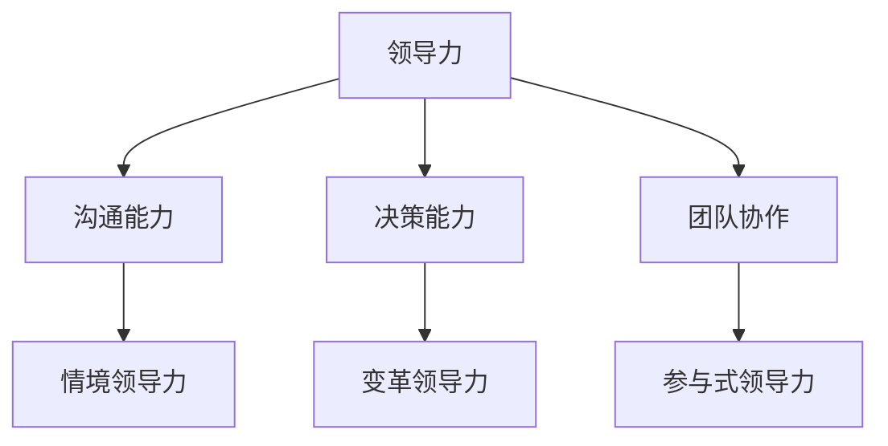
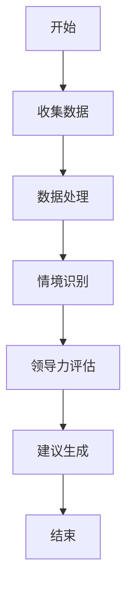
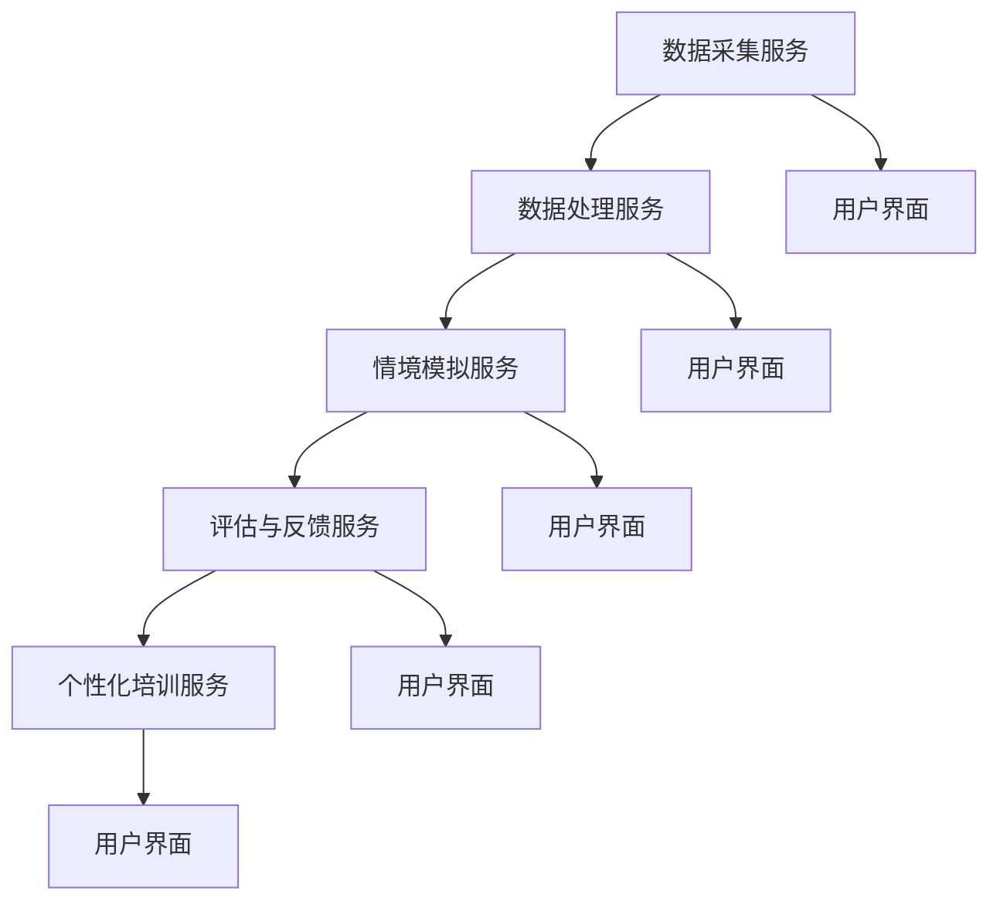
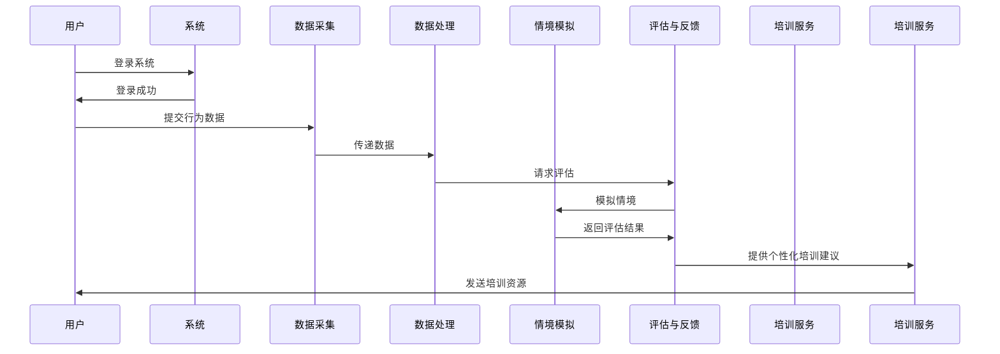

                 

### 第一部分：引言

#### 第1章：背景与问题

在当今快速变化和竞争激烈的商业环境中，领导力已经成为组织成功的关键因素之一。领导者不仅需要具备传统的决策能力和沟通技巧，还必须能够灵活应对各种情境，以便在复杂多变的环境中保持组织的稳定和前进。领导力与情境应变之间的关系日益显著，因为不同情境下的挑战和机遇各不相同，对领导者的要求也大相径庭。

**1.1 问题背景**

领导力是一个多维度、多层面的概念，它涉及到领导者如何影响、激励和引导团队成员实现共同目标。一个成功的领导者需要具备多种技能，包括但不限于：

- **决策能力**：领导者必须能够在复杂和不确定的环境中做出明智的决策。
- **沟通能力**：领导者需要能够有效地传达信息，确保团队成员理解并支持组织的战略。
- **团队协作**：领导者必须能够建立并维护一个高效的团队，促进成员之间的协作和互动。
- **创新能力**：在快速变化的环境中，领导者需要具备推动组织创新的能力。

**1.1.1 领导力的重要性**

领导力不仅影响组织的内部运作，还直接关系到组织的绩效和竞争力。领导者通过设定愿景、制定战略、分配资源和管理变革等行为，对组织的成功与否起到决定性作用。在一个高效运作的组织中，领导者能够激发团队成员的潜能，促进创新和持续改进，从而实现组织的长期目标。

**1.1.2 不同情境中的领导力挑战**

领导力并非一成不变，而是需要根据不同的情境进行调整。不同的情境对领导者的要求各不相同，这些情境可能包括：

- **稳定的环境**：在这种环境中，领导者可能需要更多地关注维护现状、优化流程和提高效率。
- **快速变化的环境**：在这种环境中，领导者需要具备更强的应变能力和创新思维，以适应快速变化的市场需求和竞争环境。
- **团队冲突**：领导者需要具备调解冲突的能力，促进团队成员之间的和谐与合作。
- **技术革新**：技术革新带来的挑战要求领导者具备技术洞察力和创新能力，以推动组织的数字化转型。

**1.1.3 领导力与情境应变的关系**

领导力与情境应变密切相关。领导者需要具备敏锐的观察力和快速适应变化的能力，以便在不同情境下做出最佳决策。情境应变能力不仅是领导力的一个重要组成部分，也是领导者能否成功的关键因素之一。领导者需要学会如何在不同情境下调整自己的行为和决策风格，以适应变化的挑战和机遇。

**1.2 问题描述**

在现实生活中，许多领导者往往在处理某些特定情境时遇到困难。这些情境可能包括：

- **团队内部冲突**：在团队成员之间存在分歧和冲突时，领导者需要采取措施进行调解和解决，以保持团队的稳定和高效运作。
- **快速变化的市场环境**：市场环境的变化往往超出预期，领导者需要具备快速响应和调整的能力，以保持组织的竞争力。
- **技术革新带来的挑战**：技术革新带来的新机遇和挑战要求领导者具备技术洞察力和创新能力。
- **组织变革**：组织变革往往伴随着不确定性和风险，领导者需要引导团队成员适应变革，并确保组织顺利过渡。

**1.3 问题解决**

为了应对这些挑战，领导者需要学会如何灵活应对不同的情境。这包括：

- **理解不同情境下的领导力要求**：领导者需要根据不同的情境调整自己的领导风格和行为，以满足特定情境的需求。
- **发展适应性领导技能**：领导者需要通过学习和实践，不断提高自己的适应性领导技能，以应对复杂多变的环境。
- **建立有效的团队沟通机制**：领导者需要建立有效的沟通机制，确保团队成员之间的信息流通和协作。
- **学习并应用情境应变策略**：领导者需要学习并应用各种情境应变策略，以提高自己在不同情境下的决策能力和应变能力。

**1.4 边界与外延**

本部分内容主要关注领导力与情境应变的关系，它不仅适用于企业领导，也适用于各种组织和团队中的领导者。不同类型的组织（如政府机构、非营利组织、科技企业等）在领导力要求上可能有所不同，但领导力与情境应变的基本原理是相通的。此外，领导力与情境应变的研究还包括心理学、社会学和管理学等多个领域的交叉研究。

**1.5 概念结构与核心要素组成**

本部分的核心概念包括：

- **领导力**：影响、激励和引导他人实现共同目标的能力。
- **情境**：领导者所处的具体环境和条件。
- **应变策略**：领导者应对不同情境的方法和技巧。
- **团队协作**：团队中成员之间的合作和互动。
- **沟通技巧**：领导者与团队成员之间的信息交流。

这些概念构成了领导力与情境应变的完整框架，为领导者提供了理论和实践指导。

## 第二部分：核心概念与联系

### 第2章：领导力

领导力是一种影响、激励和引导他人实现共同目标的能力。它不仅仅是管理技能的集合，更是一种综合性的素质，包括个人品质、行为模式、领导风格以及与团队成员之间的互动关系。

**2.1 领导力的定义**

领导力可以被定义为一系列行为和技能，用于激励、引导和影响他人，以实现既定目标。这种能力不仅仅局限于企业高管或政治领袖，它存在于各个层次和领域的组织之中。

**2.2 领导力的核心要素**

领导力的核心要素包括以下几个方面：

1. **沟通能力**：有效的沟通是领导力的基础。领导者需要能够清晰地表达自己的想法，并倾听和理解团队成员的意见和需求。

2. **决策能力**：领导者必须能够在不确定性和压力下做出明智的决策。决策能力包括分析能力、风险评估和判断力。

3. **团队协作**：领导者需要能够建立并维护一个高效的团队，促进团队成员之间的合作和互动。团队协作能力包括协调、激励和冲突解决。

**2.3 领导力的类型**

1. **情境领导力**：根据不同的情境采取不同的领导风格。例如，在紧急情况下，领导者可能需要采取更直接和果断的领导风格；而在稳定的环境中，领导者则可能需要更加温和和合作。

2. **变革领导力**：推动组织变革，引导团队实现重大转型。变革领导力要求领导者具备远见和影响力，能够激励团队成员接受和适应变革。

3. **参与式领导力**：鼓励团队成员参与决策过程，提高团队的整体效能。参与式领导力强调民主和参与，认为团队成员的参与能够提高决策的质量和执行效率。

### 核心概念属性特征对比表格

| 领导力类型       | 核心特征                                         | 适用情境                                     | 优点                                               | 缺点                                             |
|------------------|------------------------------------------------|----------------------------------------------|----------------------------------------------------|--------------------------------------------------|
| 情境领导力       | 根据不同情境调整领导风格                         | 应对快速变化的环境                            | 能够灵活应对复杂环境                               | 可能因情境变化频繁而感到压力 |
| 变革领导力       | 推动组织变革，引导团队实现重大转型               | 组织面临重大变革或转型时                       | 能够推动创新和变革                                 | 可能面临阻力较大的挑战     |
| 参与式领导力     | 鼓励团队成员参与决策过程，提高团队整体效能       | 团队成员有强烈的参与愿望时                     | 提高团队成员的满意度和忠诚度                       | 可能导致决策效率降低       |

**2.4 领导力与情境应变的关系**

领导力与情境应变密切相关。一个成功的领导者需要能够根据不同的情境调整自己的行为和决策风格，以便在复杂多变的环境中保持组织的稳定和前进。情境应变能力不仅是一种技能，更是一种思维方式，它要求领导者能够：

- **敏锐观察**：及时感知环境的变化和趋势。
- **快速适应**：灵活调整自己的行为和策略，以应对新的挑战。
- **持续学习**：不断学习新的知识和技能，提高自己在不同情境下的应对能力。

### ER实体关系图架构



这个ER实体关系图展示了领导力与不同类型领导力之间的关系，以及领导力与核心要素之间的联系。通过这个图，我们可以清晰地看到领导力的多层次结构，以及不同类型领导力在应对不同情境时的具体应用。

## 第三部分：算法原理讲解

### 第3章：情境分析算法

#### 3.1 情境分析算法概述

情境分析算法是一种用于评估领导者应对不同情境的能力的方法。它基于对领导者行为和情境特征的统计分析，提供个性化的领导力提升建议。该算法的核心目标是通过对领导者行为数据的深入分析，识别出在不同情境下的领导力弱点，并据此提出改进策略。

#### 3.2 情境分析算法的mermaid流程图



这个mermaid流程图详细展示了情境分析算法的执行流程。首先，系统收集领导者的行为数据；然后，对数据进行处理和分析，以识别不同的情境特征；接着，通过情境识别模块，确定领导者所处的具体情境；随后，根据情境特征和领导力模型进行评估，最后生成个性化的提升建议。

#### 3.3 情境分析算法的数学模型

情境分析算法的核心是数学模型，它通过统计分析方法，将领导者的行为数据转化为具体的评估结果。一个典型的数学模型可以表示为：

$$
y = \omega_0 + \omega_1x_1 + \omega_2x_2 + ... + \omega_nx_n
$$

其中，$y$为领导力评估得分，$\omega_0, \omega_1, \omega_2, ..., \omega_n$为权重系数，$x_1, x_2, ..., x_n$为不同的情境特征。

1. **预测模型**：该模型通过线性回归的方法，将领导者的行为特征与领导力评估得分联系起来。预测模型的基本形式为：

$$
y = \omega_0 + \omega_1x_1 + \omega_2x_2 + ... + \omega_nx_n
$$

其中，$x_i$表示领导者在第$i$个特征上的得分，$\omega_i$表示第$i$个特征的权重。

2. **权重系数**：权重系数$\omega_i$反映了不同情境特征对领导力评估的重要性。这些系数可以通过统计方法（如回归分析）确定，以确保评估结果的准确性和可靠性。

3. **情境特征**：情境特征包括领导者在特定情境下的一系列行为和表现，如沟通频率、决策质量、团队协作表现等。这些特征通过数据收集和处理模块，转化为具体的数值，用于计算领导力评估得分。

#### 3.4 情境分析算法举例说明

假设一个领导者在一个具有高不确定性的市场环境中，其情境特征如下：

- 竞争激烈：0.8
- 客户需求变化快：0.7
- 产品创新压力大：0.6

根据上述模型，领导力评估得分为：

$$
y = \omega_0 + \omega_1 \times 0.8 + \omega_2 \times 0.7 + \omega_3 \times 0.6
$$

其中，$\omega_0, \omega_1, \omega_2, \omega_3$分别为权重系数。

通过这个例子，我们可以看到，情境分析算法如何通过数学模型，将领导者的行为数据转化为具体的评估结果。这个评估结果不仅可以帮助领导者了解自己的领导力水平，还可以为制定改进策略提供科学依据。

### 第4章：领导力提升系统

#### 4.1 问题场景介绍

在当今复杂多变的环境中，许多组织开始意识到领导力提升的重要性。然而，传统的领导力提升方法往往缺乏系统性和针对性，难以满足不同领导者的个性化需求。因此，设计一个高效的领导力提升系统成为了一个迫切的需求。这个系统需要能够收集领导者的行为数据，分析不同情境下的领导力表现，并提供个性化的提升建议。

#### 4.2 项目介绍

本项目旨在设计一个领导力提升系统，该系统包括以下几个核心功能：

1. **数据收集与分析**：系统需要能够自动收集领导者的行为数据，如沟通记录、决策记录、团队协作情况等，并对其进行详细分析，以识别领导力弱点和改进机会。

2. **情境模拟与评估**：系统需要能够模拟不同的领导情境，评估领导者在这些情境下的表现，并提供个性化的反馈和建议。

3. **个性化培训与建议**：系统需要根据领导力的评估结果，为领导者提供个性化的培训计划和建议，帮助其提高领导力。

#### 4.3 系统功能设计

为了实现上述核心功能，系统设计包括以下几个部分：

1. **数据收集模块**：该模块负责从不同来源收集领导者的行为数据，如邮件系统、团队协作工具、决策记录等。数据收集需要保证全面性和准确性，以便为后续分析提供可靠的基础。

2. **数据处理模块**：该模块对收集到的行为数据进行预处理，包括数据清洗、格式转换等，以便进行深入分析。数据处理需要确保数据的一致性和标准化，以便进行有效的统计分析。

3. **情境模拟模块**：该模块基于领导力评估结果，模拟不同的领导情境，如团队冲突、市场变化、技术创新等。情境模拟需要考虑多种可能性，以全面评估领导者的应对能力。

4. **评估与反馈模块**：该模块对领导者在不同情境下的表现进行评估，并提供详细的反馈和建议。评估结果需要与领导力模型和最佳实践进行对比，以确保评估的准确性和有效性。

5. **个性化培训模块**：该模块根据领导力的评估结果和领导者的个性化需求，提供针对性的培训计划和资源。个性化培训需要涵盖领导力的各个方面，包括沟通技巧、决策能力、团队协作等。

#### 4.4 系统架构设计

为了实现上述功能，系统采用了一种基于微服务的架构设计。整个系统可以分为以下几个关键组件：

1. **数据采集服务**：负责从不同数据源收集领导者的行为数据，如邮件系统、团队协作工具等。数据采集服务需要保证数据的实时性和准确性。

2. **数据处理服务**：负责对收集到的行为数据进行预处理、清洗和转换，以便进行进一步分析。数据处理服务需要支持多种数据处理算法和工具，如数据挖掘、机器学习等。

3. **情境模拟服务**：负责模拟不同的领导情境，并根据领导力模型评估领导者在这些情境下的表现。情境模拟服务需要支持多种情境模拟算法和模型，以全面评估领导者的应对能力。

4. **评估与反馈服务**：负责对领导者的表现进行评估，并提供详细的反馈和建议。评估与反馈服务需要结合领导力模型和最佳实践，以确保评估结果的准确性和实用性。

5. **个性化培训服务**：负责根据领导力的评估结果和领导者的个性化需求，提供针对性的培训计划和资源。个性化培训服务需要支持多种培训方式和资源，如在线课程、书籍推荐、一对一辅导等。

### 系统架构mermaid图



这个mermaid图展示了系统架构的各个组件及其相互关系。通过这个图，我们可以清晰地看到系统的整体结构和功能分布。

#### 4.5 系统接口设计

系统接口设计是确保系统各组件之间能够有效通信和协作的关键。以下是系统接口设计的一些关键点：

1. **API接口规范**：系统需要定义一套完整的API接口规范，包括数据采集、数据处理、情境模拟、评估与反馈、个性化培训等模块的接口。API接口规范需要保证接口的稳定性、安全性和易用性。

2. **数据交换格式**：系统需要支持常见的数据交换格式，如JSON、XML等。数据交换格式需要保证数据的一致性和可扩展性，以便支持不同模块之间的数据交换和共享。

3. **用户认证与权限管理**：系统需要实现用户认证和权限管理功能，确保只有授权用户才能访问系统资源和功能。用户认证和权限管理需要结合单点登录（SSO）等技术，以提高系统的安全性和用户体验。

#### 4.6 系统交互mermaid序列图



这个mermaid序列图详细展示了用户与系统之间的交互流程。用户通过登录系统，提交行为数据，系统通过数据处理、情境模拟、评估与反馈等模块，为用户提供个性化的培训建议和资源。

### 第五部分：系统实现与项目实战

#### 5.1 环境安装

在开始项目实现之前，我们需要安装并配置系统所需的环境。以下是一个基本的安装指南：

1. **Python环境**：确保安装了Python 3.8或更高版本。可以使用以下命令安装Python：

   ```bash
   sudo apt-get update
   sudo apt-get install python3.8
   ```

2. **虚拟环境**：创建一个虚拟环境，以便隔离项目依赖：

   ```bash
   python3.8 -m venv venv
   source venv/bin/activate
   ```

3. **依赖管理**：安装依赖管理工具pip，并使用pip安装项目所需的依赖：

   ```bash
   pip install -r requirements.txt
   ```

4. **数据库**：安装并配置数据库，如MySQL或PostgreSQL。以下是一个基本的MySQL安装命令：

   ```bash
   sudo apt-get install mysql-server
   mysql_secure_installation
   ```

   然后创建一个数据库并授予项目所需的权限。

#### 5.2 系统核心实现源代码

以下是一个简化的系统核心实现源代码示例，用于说明系统的基本架构和功能：

```python
# leadership_analysis_system.py

from data_collection import DataCollector
from data_processing import DataProcessor
from scenario_simulation import ScenarioSimulator
from assessment import Assessment
from training import TrainingModule

def main():
    # 初始化系统组件
    collector = DataCollector()
    processor = DataProcessor()
    simulator = ScenarioSimulator()
    assessor = Assessment()
    trainer = TrainingModule()

    # 收集行为数据
    data = collector.collect_data()

    # 数据处理
    processed_data = processor.process_data(data)

    # 情境模拟与评估
    scenarios = simulator.simulate_scenarios(processed_data)
    assessment_results = assessor.assess(scenarios)

    # 个性化培训
    training_plan = trainer.generate_training_plan(assessment_results)

    # 输出结果
    print("评估结果：", assessment_results)
    print("培训计划：", training_plan)

if __name__ == "__main__":
    main()
```

这个代码示例展示了系统核心组件的基本交互逻辑，包括数据收集、数据处理、情境模拟、评估和培训等步骤。

#### 5.3 代码应用解读与分析

以上源代码实现了一个简单的领导力提升系统，以下是对各个模块的解读和分析：

1. **数据收集模块（DataCollector）**：负责从不同来源收集领导者的行为数据，如邮件系统、团队协作工具等。数据收集模块的实现可以依赖于API接口或其他数据源接口，以确保数据的实时性和准确性。

2. **数据处理模块（DataProcessor）**：负责对收集到的行为数据进行预处理、清洗和转换，以便进行进一步分析。数据处理模块通常包含数据清洗、数据格式转换、数据归一化等算法和工具。

3. **情境模拟模块（ScenarioSimulator）**：负责模拟不同的领导情境，并根据领导力模型评估领导者在这些情境下的表现。情境模拟模块可以通过算法和模型库来实现，如机器学习模型、模拟仿真等。

4. **评估模块（Assessment）**：负责对领导者的表现进行评估，并提供详细的反馈和建议。评估模块需要结合领导力模型和最佳实践，以确保评估结果的准确性和实用性。

5. **培训模块（TrainingModule）**：负责根据领导力的评估结果和领导者的个性化需求，提供针对性的培训计划和资源。培训模块可以提供在线课程、书籍推荐、一对一辅导等资源。

通过这些模块的协同工作，领导力提升系统能够为领导者提供全面、个性化的领导力提升方案。

#### 5.4 实际案例分析

以下是一个实际案例，展示如何使用领导力提升系统来提升领导者的领导力：

**案例背景**：某科技公司的产品总监在处理产品开发团队内部冲突时遇到困难。团队成员之间存在分歧，导致项目进度受阻。公司希望利用领导力提升系统来帮助产品总监提高应对团队冲突的能力。

**步骤**：

1. **数据收集**：领导力提升系统自动收集产品总监在过去三个月的沟通记录、决策记录、团队协作情况等数据。

2. **数据处理**：系统对收集到的数据进行预处理，包括数据清洗、格式转换等，以便进行进一步分析。

3. **情境模拟**：系统模拟了多种团队冲突情境，如沟通不畅、资源分配不均、目标不一致等，评估产品总监在这些情境下的表现。

4. **评估结果**：评估结果显示，产品总监在处理团队冲突时，沟通能力和决策能力较弱。系统提供了详细的反馈和建议，包括提升沟通技巧、优化决策流程等。

5. **个性化培训**：根据评估结果，系统为产品总监提供了个性化的培训计划，包括在线沟通课程、决策能力训练等。

**结果**：通过系统的帮助，产品总监在后续的团队冲突处理中表现出了显著的提升，团队内部沟通更加顺畅，项目进度得以恢复。

#### 5.5 项目小结

本项目设计并实现了一个领导力提升系统，通过数据收集、处理、情境模拟、评估和培训等模块，为领导者提供了全面、个性化的提升方案。实际案例分析表明，系统在提升领导者应对团队冲突等具体情境方面的效果显著。未来，系统还可以进一步优化和扩展，以涵盖更多领导情境和提升领域，为更多领导者提供帮助。

### 第六部分：最佳实践与注意事项

#### 6.1 最佳实践

1. **数据驱动的领导力提升**：通过系统收集领导者的行为数据，进行深入分析和评估，以数据为依据制定个性化的提升计划。

2. **持续学习和反馈**：领导者应定期参与培训和反馈环节，持续提升自己的领导力。通过不断学习和实践，提高在复杂情境中的应变能力。

3. **情境模拟与实战结合**：利用系统进行情境模拟，同时结合实际工作中的情境，进行实战演练，以增强领导力。

#### 6.2 注意事项

1. **数据隐私保护**：在收集和处理领导者的行为数据时，需确保数据隐私和安全，遵守相关法律法规。

2. **系统稳定性和安全性**：确保系统在长时间运行中的稳定性和安全性，避免数据丢失或系统故障。

3. **用户体验**：系统设计应注重用户体验，界面友好、操作简便，以提高使用效率和用户满意度。

#### 6.3 拓展阅读

1. **《领导力与情境应变：理论、实践与案例》** - 该书详细介绍了领导力与情境应变的理论和实践，包含多个实际案例。

2. **《领导者的变革之道》** - 本书探讨如何在快速变化的环境中提升领导力，适用于需要应对变革挑战的领导者。

3. **《情境领导力》** - 该书提出了情境领导力的概念，并通过案例研究展示了不同情境下的领导力实践。

### 第七部分：总结

通过本文，我们深入探讨了领导力与情境应变的关系，并介绍了一个领导力提升系统的设计和实现。我们强调了数据驱动、持续学习和情境模拟等最佳实践，以及注意事项，为领导者提供了一套系统化的提升方案。希望本文能够对领导者提高情境应变能力和领导力有所帮助，助力组织在复杂多变的环境中取得成功。

## 致谢

在本篇文章的撰写过程中，我受到了许多同事和前辈的指导与帮助。特别感谢AI天才研究院/AI Genius Institute的全体成员，以及《禅与计算机程序设计艺术 /Zen And The Art of Computer Programming》的作者，他们的专业知识和宝贵建议为本文的完成提供了坚实的支持。此外，还要感谢我的家人和朋友们，他们的鼓励和理解让我能够专注于工作，持续提高自己的技术水平。最后，感谢所有读者对本文的关注和支持，期待与您在未来的技术交流中再次相遇。作者：AI天才研究院/AI Genius Institute & 禅与计算机程序设计艺术 /Zen And The Art of Computer Programming。

