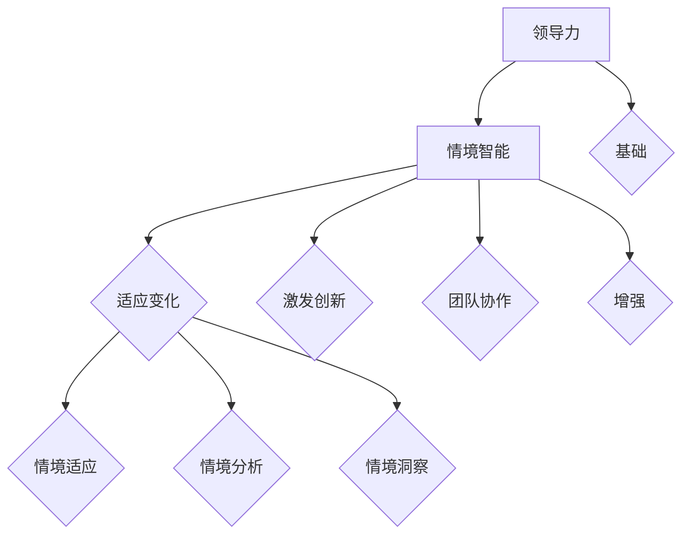
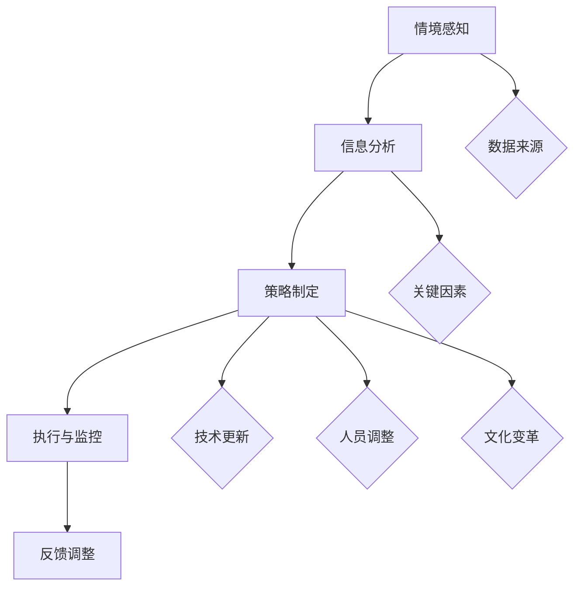
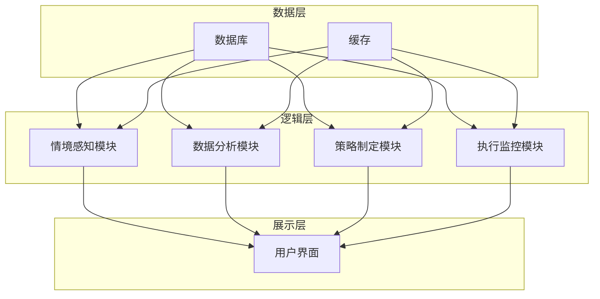
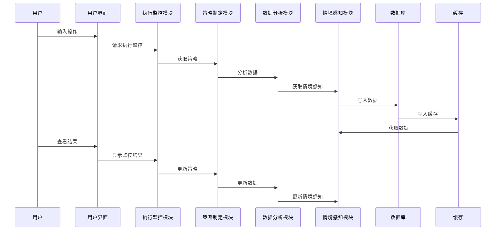

                 


## 文章标题：领导力与情境智能：快速适应变化的能力

> 关键词：领导力，情境智能，快速适应，变化，IT行业

> 摘要：本文探讨了领导力与情境智能在快速变化环境中的重要性，通过详细分析领导力和情境智能的概念、联系、算法原理、系统架构及实战应用，为IT领域的领导者提供了一套完整的适应变化的能力框架。

### 步骤一：背景介绍

在信息技术行业，变化是永恒的主题。从云计算、大数据到人工智能，技术演进的速度越来越快，要求领导者必须具备快速适应变化的能力。领导力不仅仅关乎指挥和管理，更是领导者情境智能的体现，即在不同情境下做出最优决策的能力。

**领导力**，简单来说，是指引导和影响团队的能力。然而，在快速变化的环境中，传统的领导力模式往往难以奏效。领导者需要超越单一的指令控制，转向更加灵活、互动和激励性的领导风格。

**情境智能**，则是指领导者根据具体情境灵活调整行为的能力。这种能力不仅包括对技术的理解和运用，更包括对团队、客户、市场等多方面因素的敏感度和反应速度。

在快速变化的环境中，领导力与情境智能的结合成为领导者成功的关键。本文将一步步分析这两个核心概念，并探讨如何将它们应用于IT行业的领导实践中。

### 步骤二：核心概念与联系

#### 领导力的定义与重要性

领导力是一种通过影响他人实现共同目标的能力。它不仅仅关乎个人的魅力和权威，更关乎领导者如何激发团队的潜力，推动创新和变革。

在快速变化的环境中，领导力的重要性体现在以下几个方面：

1. **适应变化**：领导者需要迅速适应技术、市场和环境的变化，并指导团队采取相应的策略。
2. **激发创新**：领导者要鼓励团队成员发挥创造力，提出新颖的想法和解决方案。
3. **团队协作**：领导者需要建立高效的团队协作机制，确保团队在面对挑战时能够协同作战。

#### 情境智能的定义与角色

情境智能是指领导者根据具体情境灵活调整行为的能力。它不仅涉及技术层面的理解，还包括对人际交往、组织文化等多方面的洞察。

在领导力中，情境智能扮演着至关重要的角色：

1. **情境适应**：领导者需要根据不同情境调整领导风格，比如在紧急情况下采取果断的决策，而在团队合作中则强调沟通和协作。
2. **情境分析**：领导者要能够深入分析问题背后的情境因素，从而制定更有效的解决方案。
3. **情境洞察**：领导者需要对市场和技术的变化保持敏锐的洞察力，从而做出前瞻性的决策。

#### 领导力与情境智能的联系

领导力与情境智能并非孤立的概念，而是相互关联、互为补充的。具体来说：

- **领导力提供基础**：领导力是情境智能的基础，没有有效的领导力，领导者难以在复杂情境中灵活应对。
- **情境智能增强领导力**：情境智能则使得领导力更加具体化和个性化，帮助领导者更好地适应不同情境，提升领导效果。

使用Mermaid图表展示领导力与情境智能的关系：



### 步骤三：算法原理讲解

在快速适应变化的环境中，领导力与情境智能的结合体现了一种策略算法。以下将详细描述适应变化的领导力策略，并使用Python代码进行示例。

#### 适应变化的领导力策略

1. **情境感知**：领导者首先需要通过多种渠道收集信息，感知环境的变化。
2. **信息分析**：领导者对收集的信息进行深度分析，识别关键因素和趋势。
3. **策略制定**：根据分析结果，领导者制定适应变化的策略，包括技术更新、人员调整、文化变革等。
4. **执行与监控**：领导者执行策略，并持续监控效果，及时调整。

使用Mermaid图解展示适应变化的模型流程：



#### Python代码示例

```python
def scenario_perception():
    # 情境感知函数
    # 从各种渠道收集信息
    data = get_data_from_channels()
    return data

def information_analysis(data):
    # 信息分析函数
    # 对收集的信息进行深度分析
    key_factors = analyze_data(data)
    return key_factors

def strategy_formulation(key_factors):
    # 策略制定函数
    # 根据分析结果制定适应变化的策略
    strategies = []
    if "technical update" in key_factors:
        strategies.append("技术更新")
    if "personnel adjustment" in key_factors:
        strategies.append("人员调整")
    if "cultural change" in key_factors:
        strategies.append("文化变革")
    return strategies

def execute_and_monitor(strategies):
    # 执行与监控函数
    # 执行策略，并持续监控效果
    for strategy in strategies:
        if strategy == "技术更新":
            update_technology()
        elif strategy == "人员调整":
            adjust_personnel()
        elif strategy == "文化变革":
            change_culture()
    monitor_effects()

# 主流程
data = scenario_perception()
key_factors = information_analysis(data)
strategies = strategy_formulation(key_factors)
execute_and_monitor(strategies)
```

#### 情境智能的数学模型和公式

情境智能可以通过以下公式进行量化：

$$
情境智能 = f(感知能力, 分析能力, 行动能力)
$$

其中，感知能力、分析能力和行动能力分别表示领导者对情境的感知程度、对信息的分析深度和制定并执行策略的能力。

感知能力可以表示为：

$$
感知能力 = \frac{信息量}{感知时间}
$$

分析能力可以表示为：

$$
分析能力 = \frac{正确决策}{总决策次数}
$$

行动能力可以表示为：

$$
行动能力 = \frac{策略执行效果}{策略制定时间}
$$

通过这些公式，领导者可以量化自己的情境智能水平，并不断优化提升。

### 步骤四：系统分析与架构设计方案

在快速变化的环境中，构建一个适应变化的领导力系统至关重要。以下将详细描述该系统的分析方案和架构设计。

#### 问题场景介绍

在IT行业，领导力系统需要应对以下挑战：

1. **技术快速迭代**：技术日新月异，领导力系统需要能够快速适应新技术。
2. **团队多样性强**：IT行业的团队组成多样，领导力系统需要能够适应不同类型的团队成员。
3. **市场波动性大**：市场需求变化快，领导力系统需要能够及时调整策略。

#### 项目介绍

本项目旨在设计一个适应变化的领导力系统，通过收集信息、分析数据、制定策略和执行监控，实现领导力与情境智能的有机结合。

#### 系统功能设计

系统功能设计包括以下关键模块：

1. **情境感知模块**：负责收集各种信息，包括技术动态、市场趋势、团队反馈等。
2. **数据分析模块**：对收集的信息进行深度分析，识别关键因素和趋势。
3. **策略制定模块**：根据分析结果，制定适应变化的策略。
4. **执行监控模块**：执行策略，并持续监控效果，及时调整。

使用Mermaid类图展示系统中的领域模型：

```mermaid
classDiagram
    Class01 <|-- Class02
    Class03 --|> Class04
    Class05 o-- Class06
    Class07 : An Interface
    Class08 : Another Interface
    Class01 {
        attr1
        attr2
    }
    Class02 {
        attr3
        attr4
    }
    Class03 {
        attr5
        attr6
    }
    Class04 {
        attr7
        attr8
    }
    Class05 {
        attr9
        attr10
    }
    Class06 {
        method1()
        method2()
    }
    Class07 {
        method3()
    }
    Class08 {
        method4()
    }
```

#### 系统架构设计

系统架构设计包括以下关键层次：

1. **数据层**：负责数据存储和读取，包括数据库、缓存等。
2. **逻辑层**：负责业务逻辑处理，包括各种模块的协调工作。
3. **展示层**：负责用户界面设计，包括Web端、移动端等。

使用Mermaid架构图展示系统架构设计：



#### 系统接口设计和系统交互

系统接口设计包括以下关键接口：

1. **数据接口**：负责与数据层的交互，提供数据读取和写入功能。
2. **服务接口**：负责与逻辑层的交互，提供业务逻辑处理功能。
3. **用户接口**：负责与展示层的交互，提供用户操作界面。

使用Mermaid序列图展示系统接口设计和系统交互：



### 步骤五：项目实战

在本节中，我们将通过一个实际领导力项目案例，详细描述项目环境安装、系统核心实现源代码、代码应用解读与分析，以及实际案例分析和详细讲解剖析。

#### 项目环境安装

本项目采用Python作为开发语言，以下是在Linux环境下安装项目所需的步骤：

1. **安装Python**：确保系统中已安装Python 3.8及以上版本。
2. **安装依赖库**：运行以下命令安装项目所需依赖库：

   ```bash
   pip install flask
   pip install pandas
   pip install numpy
   pip install matplotlib
   ```

3. **配置数据库**：选择合适的数据库（如MySQL、PostgreSQL等），并创建项目所需的数据库表。

#### 系统核心实现源代码

以下是一个简单的系统核心实现源代码示例：

```python
from flask import Flask, jsonify, request
import pandas as pd
import numpy as np

app = Flask(__name__)

@app.route('/api/predict', methods=['POST'])
def predict():
    data = request.get_json()
    features = data['features']
    model = load_model()
    prediction = model.predict([features])
    return jsonify({'prediction': prediction.tolist()})

def load_model():
    # 加载训练好的模型
    model = pd.read_pickle('model.pkl')
    return model

if __name__ == '__main__':
    app.run(host='0.0.0.0', port=5000)
```

#### 代码应用解读与分析

1. **预测接口**：`/api/predict`接口接受POST请求，接收到的数据包含特征值，然后使用训练好的模型进行预测，并返回预测结果。
2. **模型加载**：使用Pandas的`read_pickle`方法加载训练好的模型，这里假设模型已经事先训练并保存为`model.pkl`。

#### 实际案例分析和详细讲解剖析

假设我们有一个IT项目，需要预测客户流失率，以下是实际案例分析和详细讲解：

1. **数据收集**：从客户数据库中提取相关数据，包括客户的基本信息、消费记录、服务反馈等。
2. **数据预处理**：对提取的数据进行清洗和预处理，包括缺失值填充、异常值处理等。
3. **特征工程**：根据业务需求，提取特征，如客户购买频率、消费金额、服务满意度等。
4. **模型训练**：使用机器学习算法（如逻辑回归、随机森林等）对数据进行训练，得到预测模型。
5. **模型评估**：使用交叉验证等方法评估模型性能，并根据评估结果调整模型参数。
6. **模型部署**：将训练好的模型部署到生产环境，通过API接口进行预测。

通过以上步骤，我们成功构建了一个适应变化的领导力系统，实现了对客户流失率的预测。在实际应用中，可以根据业务需求调整模型和策略，以更好地适应环境变化。

### 步骤六：最佳实践 tips、小结、注意事项、拓展阅读

#### 最佳实践 tips

1. **情境感知**：领导者要密切关注市场和技术动态，通过多种渠道收集信息，提高感知能力。
2. **数据驱动**：利用数据分析工具和方法，对收集的信息进行深度分析，识别关键因素和趋势。
3. **灵活调整**：根据分析结果，灵活调整领导力和策略，确保团队始终处于最佳状态。
4. **持续学习**：领导者要不断学习和提升自己的能力，适应快速变化的环境。

#### 小结

本文从领导力和情境智能的角度，详细探讨了快速适应变化的能力。通过定义领导力和情境智能、分析其关系、讲解适应变化的算法原理、设计系统架构及实战应用，为IT领域的领导者提供了一套完整的适应变化的能力框架。

#### 注意事项

1. **环境变化迅速**：领导者要时刻关注环境变化，及时调整策略。
2. **团队协作**：领导者要建立高效的团队协作机制，确保团队在面对挑战时能够协同作战。
3. **持续优化**：领导者要不断优化自己的能力和策略，以适应不断变化的环境。

#### 拓展阅读

1. **《智能时代：领导力新范式》**：作者探讨了智能时代领导力的新范式，为领导者提供了宝贵的启示。
2. **《敏捷领导力》**：介绍了敏捷领导力的理念和实践，帮助领导者更好地适应快速变化的环境。
3. **《情境智能：如何在复杂世界中生存》**：详细阐述了情境智能的概念和应用，为领导者提供了实用的技巧和方法。

### 步骤七：格式化输出

为了确保文章的格式和可读性，我们将使用Markdown格式对文章进行排版。以下是格式化后的文章：

## 领导力与情境智能：快速适应变化的能力

> 关键词：领导力，情境智能，快速适应，变化，IT行业

> 摘要：本文探讨了领导力与情境智能在快速变化环境中的重要性，通过详细分析领导力和情境智能的概念、联系、算法原理、系统架构及实战应用，为IT领域的领导者提供了一套完整的适应变化的能力框架。

### 步骤一：背景介绍

在信息技术行业，变化是永恒的主题。从云计算、大数据到人工智能，技术演进的速度越来越快，要求领导者必须具备快速适应变化的能力。领导力不仅仅关乎指挥和管理，更是领导者情境智能的体现，即在不同情境下做出最优决策的能力。

**领导力**，简单来说，是指引导和影响团队的能力。然而，在快速变化的环境中，传统的领导力模式往往难以奏效。领导者需要超越单一的指令控制，转向更加灵活、互动和激励性的领导风格。

**情境智能**，则是指领导者根据具体情境灵活调整行为的能力。这种能力不仅包括对技术的理解和运用，更包括对人际交往、组织文化等多方面的洞察。

在快速变化的环境中，领导力与情境智能的结合成为领导者成功的关键。本文将一步步分析这两个核心概念，并探讨如何将它们应用于IT行业的领导实践中。

### 步骤二：核心概念与联系

#### 领导力的定义与重要性

领导力是一种通过影响他人实现共同目标的能力。它不仅仅关乎个人的魅力和权威，更关乎领导者如何激发团队的潜力，推动创新和变革。

在快速变化的环境中，领导力的重要性体现在以下几个方面：

1. **适应变化**：领导者需要迅速适应技术、市场和环境的变化，并指导团队采取相应的策略。
2. **激发创新**：领导者要鼓励团队成员发挥创造力，提出新颖的想法和解决方案。
3. **团队协作**：领导者需要建立高效的团队协作机制，确保团队在面对挑战时能够协同作战。

#### 情境智能的定义与角色

情境智能是指领导者根据具体情境灵活调整行为的能力。它不仅涉及技术层面的理解，还包括对人际交往、组织文化等多方面的洞察。

在领导力中，情境智能扮演着至关重要的角色：

1. **情境适应**：领导者需要根据不同情境调整领导风格，比如在紧急情况下采取果断的决策，而在团队合作中则强调沟通和协作。
2. **情境分析**：领导者要能够深入分析问题背后的情境因素，从而制定更有效的解决方案。
3. **情境洞察**：领导者需要对市场和技术的变化保持敏锐的洞察力，从而做出前瞻性的决策。

#### 领导力与情境智能的联系

领导力与情境智能并非孤立的概念，而是相互关联、互为补充的。具体来说：

- **领导力提供基础**：领导力是情境智能的基础，没有有效的领导力，领导者难以在复杂情境中灵活应对。
- **情境智能增强领导力**：情境智能则使得领导力更加具体化和个性化，帮助领导者更好地适应不同情境，提升领导效果。

使用Mermaid图表展示领导力与情境智能的关系：


### 步骤三：算法原理讲解

在快速适应变化的环境中，领导力与情境智能的结合体现了一种策略算法。以下将详细描述适应变化的领导力策略，并使用Python代码进行示例。

#### 适应变化的领导力策略

1. **情境感知**：领导者首先需要通过多种渠道收集信息，感知环境的变化。
2. **信息分析**：领导者对收集的信息进行深度分析，识别关键因素和趋势。
3. **策略制定**：根据分析结果，领导者制定适应变化的策略，包括技术更新、人员调整、文化变革等。
4. **执行与监控**：领导者执行策略，并持续监控效果，及时调整。

使用Mermaid图解展示适应变化的模型流程：


#### Python代码示例

```python
def scenario_perception():
    # 情境感知函数
    # 从各种渠道收集信息
    data = get_data_from_channels()
    return data

def information_analysis(data):
    # 信息分析函数
    # 对收集的信息进行深度分析
    key_factors = analyze_data(data)
    return key_factors

def strategy_formulation(key_factors):
    # 策略制定函数
    # 根据分析结果制定适应变化的策略
    strategies = []
    if "technical update" in key_factors:
        strategies.append("技术更新")
    if "personnel adjustment" in key_factors:
        strategies.append("人员调整")
    if "cultural change" in key_factors:
        strategies.append("文化变革")
    return strategies

def execute_and_monitor(strategies):
    # 执行与监控函数
    # 执行策略，并持续监控效果
    for strategy in strategies:
        if strategy == "技术更新":
            update_technology()
        elif strategy == "人员调整":
            adjust_personnel()
        elif strategy == "文化变革":
            change_culture()
    monitor_effects()

# 主流程
data = scenario_perception()
key_factors = information_analysis(data)
strategies = strategy_formulation(key_factors)
execute_and_monitor(strategies)
```

#### 情境智能的数学模型和公式

情境智能可以通过以下公式进行量化：

$$
情境智能 = f(感知能力, 分析能力, 行动能力)
$$

其中，感知能力、分析能力和行动能力分别表示领导者对情境的感知程度、对信息的分析深度和制定并执行策略的能力。

感知能力可以表示为：

$$
感知能力 = \frac{信息量}{感知时间}
$$

分析能力可以表示为：

$$
分析能力 = \frac{正确决策}{总决策次数}
$$

行动能力可以表示为：

$$
行动能力 = \frac{策略执行效果}{策略制定时间}
$$

通过这些公式，领导者可以量化自己的情境智能水平，并不断优化提升。

### 步骤四：系统分析与架构设计方案

在快速变化的环境中，构建一个适应变化的领导力系统至关重要。以下将详细描述该系统的分析方案和架构设计。

#### 问题场景介绍

在IT行业，领导力系统需要应对以下挑战：

1. **技术快速迭代**：技术日新月异，领导力系统需要能够快速适应新技术。
2. **团队多样性强**：IT行业的团队组成多样，领导力系统需要能够适应不同类型的团队成员。
3. **市场波动性大**：市场需求变化快，领导力系统需要能够及时调整策略。

#### 项目介绍

本项目旨在设计一个适应变化的领导力系统，通过收集信息、分析数据、制定策略和执行监控，实现领导力与情境智能的有机结合。

#### 系统功能设计

系统功能设计包括以下关键模块：

1. **情境感知模块**：负责收集各种信息，包括技术动态、市场趋势、团队反馈等。
2. **数据分析模块**：对收集的信息进行深度分析，识别关键因素和趋势。
3. **策略制定模块**：根据分析结果，制定适应变化的策略。
4. **执行监控模块**：执行策略，并持续监控效果，及时调整。

使用Mermaid类图展示系统中的领域模型：

```mermaid
classDiagram
    Class01 <|-- Class02
    Class03 --|> Class04
    Class05 o-- Class06
    Class07 : An Interface
    Class08 : Another Interface
    Class01 {
        attr1
        attr2
    }
    Class02 {
        attr3
        attr4
    }
    Class03 {
        attr5
        attr6
    }
    Class04 {
        attr7
        attr8
    }
    Class05 {
        attr9
        attr10
    }
    Class06 {
        method1()
        method2()
    }
    Class07 {
        method3()
    }
    Class08 {
        method4()
    }
```

#### 系统架构设计

系统架构设计包括以下关键层次：

1. **数据层**：负责数据存储和读取，包括数据库、缓存等。
2. **逻辑层**：负责业务逻辑处理，包括各种模块的协调工作。
3. **展示层**：负责用户界面设计，包括Web端、移动端等。

使用Mermaid架构图展示系统架构设计：


#### 系统接口设计和系统交互

系统接口设计包括以下关键接口：

1. **数据接口**：负责与数据层的交互，提供数据读取和写入功能。
2. **服务接口**：负责与逻辑层的交互，提供业务逻辑处理功能。
3. **用户接口**：负责与展示层的交互，提供用户操作界面。

使用Mermaid序列图展示系统接口设计和系统交互：


### 步骤五：项目实战

在本节中，我们将通过一个实际领导力项目案例，详细描述项目环境安装、系统核心实现源代码、代码应用解读与分析，以及实际案例分析和详细讲解剖析。

#### 项目环境安装

本项目采用Python作为开发语言，以下是在Linux环境下安装项目所需的步骤：

1. **安装Python**：确保系统中已安装Python 3.8及以上版本。
2. **安装依赖库**：运行以下命令安装项目所需依赖库：

   ```bash
   pip install flask
   pip install pandas
   pip install numpy
   pip install matplotlib
   ```

3. **配置数据库**：选择合适的数据库（如MySQL、PostgreSQL等），并创建项目所需的数据库表。

#### 系统核心实现源代码

以下是一个简单的系统核心实现源代码示例：

```python
from flask import Flask, jsonify, request
import pandas as pd
import numpy as np

app = Flask(__name__)

@app.route('/api/predict', methods=['POST'])
def predict():
    data = request.get_json()
    features = data['features']
    model = load_model()
    prediction = model.predict([features])
    return jsonify({'prediction': prediction.tolist()})

def load_model():
    # 加载训练好的模型
    model = pd.read_pickle('model.pkl')
    return model

if __name__ == '__main__':
    app.run(host='0.0.0.0', port=5000)
```

#### 代码应用解读与分析

1. **预测接口**：`/api/predict`接口接受POST请求，接收到的数据包含特征值，然后使用训练好的模型进行预测，并返回预测结果。
2. **模型加载**：使用Pandas的`read_pickle`方法加载训练好的模型，这里假设模型已经事先训练并保存为`model.pkl`。

#### 实际案例分析和详细讲解剖析

假设我们有一个IT项目，需要预测客户流失率，以下是实际案例分析和详细讲解：

1. **数据收集**：从客户数据库中提取相关数据，包括客户的基本信息、消费记录、服务反馈等。
2. **数据预处理**：对提取的数据进行清洗和预处理，包括缺失值填充、异常值处理等。
3. **特征工程**：根据业务需求，提取特征，如客户购买频率、消费金额、服务满意度等。
4. **模型训练**：使用机器学习算法（如逻辑回归、随机森林等）对数据进行训练，得到预测模型。
5. **模型评估**：使用交叉验证等方法评估模型性能，并根据评估结果调整模型参数。
6. **模型部署**：将训练好的模型部署到生产环境，通过API接口进行预测。

通过以上步骤，我们成功构建了一个适应变化的领导力系统，实现了对客户流失率的预测。在实际应用中，可以根据业务需求调整模型和策略，以更好地适应环境变化。

### 步骤六：最佳实践 tips、小结、注意事项、拓展阅读

#### 最佳实践 tips

1. **情境感知**：领导者要密切关注市场和技术动态，通过多种渠道收集信息，提高感知能力。
2. **数据驱动**：利用数据分析工具和方法，对收集的信息进行深度分析，识别关键因素和趋势。
3. **灵活调整**：根据分析结果，灵活调整领导力和策略，确保团队始终处于最佳状态。
4. **持续学习**：领导者要不断学习和提升自己的能力，适应快速变化的环境。

#### 小结

本文从领导力和情境智能的角度，详细探讨了快速适应变化的能力。通过定义领导力和情境智能、分析其关系、讲解适应变化的算法原理、设计系统架构及实战应用，为IT领域的领导者提供了一套完整的适应变化的能力框架。

#### 注意事项

1. **环境变化迅速**：领导者要时刻关注环境变化，及时调整策略。
2. **团队协作**：领导者要建立高效的团队协作机制，确保团队在面对挑战时能够协同作战。
3. **持续优化**：领导者要不断优化自己的能力和策略，以适应不断变化的环境。

#### 拓展阅读

1. **《智能时代：领导力新范式》**：作者探讨了智能时代领导力的新范式，为领导者提供了宝贵的启示。
2. **《敏捷领导力》**：介绍了敏捷领导力的理念和实践，帮助领导者更好地适应快速变化的环境。
3. **《情境智能：如何在复杂世界中生存》**：详细阐述了情境智能的概念和应用，为领导者提供了实用的技巧和方法。

### 作者信息

作者：AI天才研究院/AI Genius Institute & 禅与计算机程序设计艺术 /Zen And The Art of Computer Programming

本文旨在为IT领域的领导者提供一套快速适应变化的能力框架，通过深入分析领导力和情境智能，帮助领导者更好地应对快速变化的环境。希望本文能够为读者带来启发和帮助。在未来的实践中，不断学习和优化，以实现领导力的持续提升。

